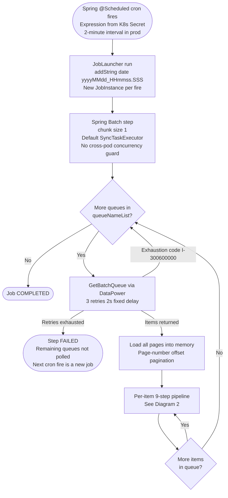

# WDP-COMP-07-VISA-DISPUTE-BATCH
**Worldpay Dispute Platform — Component Reference**
*Version: 1.1 DRAFT | April 2026*
*Extracted from: gcp-visa-disputes-processor-batch | Source-verified 2026-04-18 | Architect-confirmed: PENDING*

---

## ━━━ CORE SKELETON ━━━━━━━━━━━━━━━━━━━━━━━━━━━━━━━━━━━━━━

---

## Identity

| Field                | Value |
|----------------------|-------|
| **Name**             | `VisaDisputeBatch` |
| **Type**             | `Batch/Scheduler` |
| **Repository**       | `gcp-visa-disputes-processor-batch` |
| **Maven artifact**   | `com.wp.gcp:visa-disputes-processor-batch v1.2.5` |
| **Technology**       | `Java 17 · Spring Boot 3.5.3 · Spring Batch` |
| **Status**           | `✅ Production` |
| **Doc status**       | `📝 DRAFT` |
| **Sections present** | `Core · Block D (Batch)` |

---

## Purpose

**What it does**

VisaDisputeBatch is the sole inbound batch responsible for ingesting all Visa dispute lifecycle
events into WDP. It polls Visa's RTSI (Real-Time Settlement Interface) API queues on a cron
schedule via the DataPower Gateway, processes all seven Visa queue types strictly sequentially
in a single job execution, enriches each event against multiple internal WDP services, and
writes structured case events to the `wdp.chbk_outbox_row` transactional outbox for downstream
Kafka publishing by COMP-12 Scheduler1. PAN is encrypted before any persistence occurs.

This batch is the **origin of all Visa dispute data in WDP**. If this batch fails or falls
behind, no new Visa dispute cases are created or updated downstream.

The batch processes items one at a time (chunk size = 1, commit-per-item). All seven queues
are processed sequentially within a single Spring Batch step — there is no parallelism across
queues or within a queue. When all queues are exhausted the job completes normally with status
`COMPLETED`.

Each queue item passes through a 9-step enrichment and classification pipeline. Enrichment
failure at most steps causes the item to be silently skipped — the processor returns `null`
and the job advances to the next item. There is no dead-letter store for null-return
failures; the only persisted failure evidence is ELK log entries. Items that reach the
writer may be persisted as ERROR (missing key data) or SKIPPED (duplicate detected) status
rows. Items on the `skipCase` path write no outbox row at all.

Three runtime feature flags injected from a Kubernetes Secret control processing behaviour:
`coreDataNeedToMigrate` (PIN validation outcome and CORE item Visa queue consumption),
`removeItemFromQueueDisabled` (global MarkAsRead kill-switch), and `readSpecificItemFromQueue`
(debug toggle to restrict processing to specific case numbers). None of the three have
defaults — the K8s Secret must supply them or startup fails.

**What it does NOT do**

- Does not publish to any Kafka topic. Kafka dependencies (`spring-kafka`, `kafka-clients`,
  `aws-msk-iam-auth`) are staged in POM but no `@EnableKafka`, `KafkaTemplate`, or producer
  configuration class exists in main source.
- Does not consume from any Kafka topic, REST endpoint, SQS queue, or webhook. The cron is
  the only inbound trigger.
- Does not own the downstream publish path to `new-case-events` — that is COMP-12 Scheduler1.
- Does not perform RBAC, tenant authorization, or session management. Authentication to
  internal WDP services is via IDP bearer token per request.
- Does not write clear PAN anywhere persistent — HPAN is substituted before payload
  serialisation and outbox save.
- Does not propagate its own processing failures: enrichment failures return `null` to
  Spring Batch; writer save failures are caught, logged, and `break` out of the chunk loop.
  Spring Batch never sees these as errors.

---

## Internal Processing Flow

### Diagram 1 — Outer loop (scheduler → job → step → queue iteration)

### Diagram 2 — Per-item 9-step processing pipeline

```mermaid
flowchart TD
    IN([Item from Visa RTSI queue]) --> STEP1[Step 1 — Platform mapping\nnetworkId 0002 → CORE initial\nAll others → PIN]

    STEP1 --> STEP2[Step 2 — IDP token fetch\nwdp-idp-token-service GET\nNo retry — no @Retryable\nNo v-correlation-id header]
    STEP2 --> STEP2F{ServiceException?}
    STEP2F -- Yes --> NULL_SKIP
    STEP2F -- No --> STEP3[Step 3 — Queue rules check\nmdvs-gcp-rules-service POST\n3 retries 2s delay]

    STEP3 --> STEP3A{Rules response\nempty true?}
    STEP3A -- Yes --> SKIPCASE[skipCase true\nNo outbox row written\nProceed to MarkAsRead gate]
    STEP3A -- No --> STEP3B{Other exception\nafter 3 retries?}
    STEP3B -- Yes --> NULL_SKIP
    STEP3B -- No --> STEP4[Step 4 — HyperSearch enrichment\nVisa RTSI via DataPower\n3 retries 2s delay]

    STEP4 --> STEP4F{Exception after\n3 retries?}
    STEP4F -- Yes --> NULL_SKIP
    STEP4F -- No --> STEP5Q{networkId equals 0002?}

    STEP5Q -- Yes --> STEP5[Step 5 — PIN validation\nVisaTransSearch via DataPower\nCheck CardholderIdMethodCode equals 2\n3 retries 2s delay]
    STEP5 --> STEP5V{Validation outcome?}
    STEP5V -- Exception after 3 retries --> NULL_SKIP
    STEP5V -- valid PIN true --> PLAT_PIN[platform PIN — continue]
    STEP5V -- valid PIN false\nflag coreDataNeedToMigrate false --> NULL_SKIP
    STEP5V -- valid PIN false\nflag coreDataNeedToMigrate true --> PLAT_CORE[platform CORE — continue]

    STEP5Q -- No --> STEP6
    PLAT_PIN --> STEP6
    PLAT_CORE --> STEP6
    STEP6[Step 6 — migrationStatus Y\nHardcoded — no toggle]
    STEP6 --> STEP7Q{Queue type?}

    STEP7Q -- PRECOMP --> STEP7PC[Step 7 — Case lookup PRECOMP\nFilter actionDetails stageCode APC\nError if more than one result]
    STEP7Q -- COMP --> STEP7C[Step 7 — Case lookup COMP\nOpen cases first\nMax-action stageCode to recordType\nFall back to CLOSED]
    STEP7Q -- Other five queues --> STEP7G[Step 7 — Case lookup generic\nGET mdvs-gcp-case-search-service\nNo retry on GET]

    STEP7PC --> STEP7F{LoggingException?}
    STEP7C --> STEP7F
    STEP7G --> STEP7F
    STEP7F -- Yes --> NULL_SKIP
    STEP7F -- No --> STEP7D{caseNumber blank?}
    STEP7D -- Yes --> CREATE[createNewCase true]
    STEP7D -- No --> UPDATE[createNewCase false]

    CREATE --> STEP8[Step 8 — PAN encryption\nwdp-encryption-service POST\nOnly if accountNumber present\n3 retries 2s delay\nReplaces accountNumber with HPAN]
    UPDATE --> STEP8
    STEP8 --> STEP8F{Exception after\n3 retries?}
    STEP8F -- Yes --> NULL_SKIP
    STEP8F -- No --> STEP9[Step 9 — Writer\nchbk_outbox_row\nSELECT duplicate check on\nnetworkCaseId networkPhaseId disputeStage]

    STEP9 --> STEP9E{Save exception?}
    STEP9E -- Yes --> CAUGHT_LOGGED[Exception caught at writer try-catch\nLogged and break out of chunk loop\nNo Spring Batch step failure\nNo MarkAsRead]
    STEP9E -- No --> STEP9D{Duplicate found?}
    STEP9D -- Yes\nRECALL exempt --> WRITE_SKIP[Save SKIPPED row]
    STEP9D -- No --> STEP9M{Missing key data?\nblank networkCaseId or\nnetworkPhaseId or disputeStage}
    STEP9M -- Yes --> WRITE_ERR[Save ERROR row]
    STEP9M -- No --> WRITE_PEND[Save PENDING row]

    WRITE_SKIP --> MAR_GATE
    WRITE_ERR --> MAR_GATE
    WRITE_PEND --> MAR_GATE
    SKIPCASE --> MAR_GATE

    MAR_GATE{MarkAsRead gate}
    MAR_GATE -- removeItemFromQueueDisabled true --> LEFT_IN_Q([Item left in Visa queue\nRe-polled next cron])
    MAR_GATE -- platform PIN AND flag false --> MARK
    MAR_GATE -- platform CORE AND\ncoreDataNeedToMigrate true AND\nflag false --> MARK
    MAR_GATE -- platform CORE AND\ncoreDataNeedToMigrate false AND\nflag false --> LEFT_IN_Q

    MARK[MarkAsRead via DataPower\n3 retries 2s delay]
    MARK --> MARK_F{Exception after\n3 retries?}
    MARK_F -- Yes --> MARK_CAUGHT[Exception caught at writer try-catch\nLogged — no @Recover\nItem left in Visa queue]
    MARK_F -- No --> CONSUMED([Item consumed from Visa queue])
    MARK_CAUGHT --> LEFT_IN_Q

    NULL_SKIP([Return null to Spring Batch\nItem skipped\nNo outbox row\nNo MarkAsRead\nItem left in Visa queue\nELK log only])
    CAUGHT_LOGGED --> CHUNK_END([Chunk loop break\nItem not marked as read])
```

**MarkAsRead gate summary**

| Condition | MarkAsRead called? |
|-----------|-------------------|
| `removeItemFromQueueDisabled = true` | Never — global kill-switch |
| Platform = PIN, flag = false | Yes |
| Platform = CORE, `coreDataNeedToMigrate = true`, flag = false | Yes |
| Platform = CORE, `coreDataNeedToMigrate = false`, flag = false | No |
| Processor returned `null` (item not passed to writer) | No |
| `skipCase = true` (no outbox row written) | Subject to gate above |
| Duplicate found (SKIPPED row written) | Subject to gate above |
| Missing key data (ERROR row written) | Subject to gate above |
| Writer save exception caught | No |
| MarkAsRead retries exhausted | Exception caught and logged — item left unmarked |

> ⚠️ **RECALL queue note:** RECALL items have no explicit MarkAsRead bypass. RECALL items map
> to CORE platform (networkId "0002"). Whether they are marked as read depends entirely on
> `coreDataNeedToMigrate`. If this flag is `true`, RECALL items WILL be consumed from the
> Visa queue.

> ⚠️ **No exception propagation.** Writer save failures and MarkAsRead retry-exhaustion
> failures are caught inside `BatchItemWriter` and logged. Spring Batch sees chunk
> completion as successful in both cases. No step failure, no job failure.

---

## Boundaries

### Inbound Interfaces

| Source | Protocol | Endpoint / Topic / Trigger | Payload / Description |
|--------|----------|----------------------------|-----------------------|
| Kubernetes `@Scheduled` cron | Internal cron | `app.scheduler.cron` → env `${scheduler_cron}` (K8s Secret: `gcp-visa-disputes-processor-batch-secrets`) | Fires the Spring Batch job. Architecture confirms 2-minute interval in production. Cron value not auditable from source. |
| Visa RTSI via DataPower Gateway | REST POST | GetBatchQueue endpoint (DataPower URL) | Paginated Visa dispute queue items. Page-number offset pagination. All pages loaded into memory before processing. |

### Outbound Interfaces

| Target | Protocol | Endpoint / Resource | Purpose | On failure |
|--------|----------|---------------------|---------|------------|
| DataPower → Visa RTSI GetBatchQueue | REST POST (vantiveLicense + Bearer) | DataPower URL | Poll each of 7 queues for dispute items | 3 retries, 2s fixed delay. Exhaustion (I-300600000) advances to next queue. Other failure after retries → step FAILED. |
| DataPower → Visa RTSI HyperSearch | REST POST (vantiveLicense + Bearer) | DataPower URL | Per-item rich case detail enrichment | 3 retries, 2s delay. Exception after retries → `null` → item skipped. |
| DataPower → Visa RTSI MarkAsRead | REST POST (vantiveLicense + Bearer) | DataPower URL | Acknowledge item consumption (conditional per platform and flags) | 3 retries, 2s delay. Exception after retries caught in writer — logged, **not propagated**. No `@Recover`. Item left unmarked; re-polled next cron. |
| DataPower → Visa RTSI VisaTransSearch | REST POST (vantiveLicense + Bearer) | DataPower URL | PIN routing confirmation — `networkId=0002` items only | 3 retries, 2s delay. Exception after retries → `null` → item skipped. |
| `wdp-idp-token-service` | REST GET (no Bearer) | Internal URL | Bearer token acquisition — per-item, no caching | **No retry.** `ServiceException` → `null` → item skipped. **No `v-correlation-id` header added** by `IdpRestInvoker`. |
| `mdvs-gcp-rules-service` | REST POST (Bearer) | Internal URL | Queue rules check — determines skip and assigns dispute stage | 3 retries, 2s delay. `empty=true` → `skipCase`. Other exception → `null`. |
| `mdvs-gcp-case-search-service` | REST GET (Bearer) | Internal URL | Case lookup — create vs update; queue-specific logic for PRECOMP and COMP | **No retry on GET.** Exception → `null` → item skipped. |
| `wdp-encryption-service` | REST POST (Bearer) | Internal URL | PAN encryption — if `accountNumber` present, replaces with HPAN before writer | 3 retries, 2s delay. Exception after retries → `null` → item skipped. |
| `wdp.chbk_outbox_row` | PostgreSQL (JPA) | `wdp.chbk_outbox_row` | Transactional outbox — PENDING / SKIPPED / ERROR row per item; skipCase writes no row | Save exception caught in writer, logged, loop `break`s. No propagation. |

> ⚠️ **No timeouts configured on any call.** `RestTemplate` is constructed with default
> `SimpleClientHttpRequestFactory`, no `ClientHttpRequestFactory` customisation, no
> connection pool. A hung call blocks the single processing thread indefinitely.
>
> ⚠️ **No Resilience4j anywhere.** No circuit breaker, bulkhead, rate limiter, or
> fallback. No dependency in POM.
>
> ⚠️ **Correlation ID.** Fresh UUID `v-correlation-id` header added per outbound call by
> generic `RestInvoker`. Not per-item, not per-run, and **not propagated** by
> `IdpRestInvoker`. No MDC. No end-to-end trace correlation across enrichment steps.

---

## Database Ownership

### Tables Owned (written by this component)

| Schema.Table | Purpose | Key columns | Notes |
|--------------|---------|-------------|-------|
| `wdp.chbk_outbox_row` | Transactional outbox. Stores Visa dispute events pending Kafka publication. PENDING (normal), SKIPPED (duplicate), ERROR (missing data). `skipCase` items write no row. | `id` (seq), `c_ntwk_case_id`, `c_ntwk_phase_id`, `c_case_stage` (duplicate check key), `status`, `payload` (full CommonEvent JSON with HPAN), `c_acq_platform`, `c_case_ntwk` | ⚠️ SHARED TABLE — also written by COMP-08, COMP-09, COMP-11. No cross-component write lock. Duplicate check is application-level SELECT-before-INSERT. **No DB unique constraint** confirmed (no DDL in this repo; `ddl-auto: false`; no entity-level `uniqueConstraints`). |

**Columns written by this batch:**

| Column | Value |
|--------|-------|
| `id` | Auto-generated via `CHBK_OUTBOX_ROW_ID_SEQ` |
| `event_type` | `"CHARGEBACK_PROCESS"` |
| `c_acq_platform` | Platform string (`PIN` or `CORE`) from `CommonEvent.sourceSystem` |
| `i_acq_refnce_num` | ARN from `originalTransactionIdentifier.arn` |
| `i_ntwk_tran_id` | From `originalTransactionIdentifier.networkTransactionId` |
| `c_case_ntwk` | `"VISA"` |
| `retry_count` | `0` (constant) |
| `payload` | Full `CommonEvent` serialised as JSON — HPAN in `accountNumber` field, not clear PAN |
| `status` | `PENDING` / `SKIPPED` / `ERROR` |
| `error_message` | `null` for PENDING; log message for SKIPPED / ERROR |
| `created_by` / `updated_by` | `"WVDPB"` — hardcoded `ApplicationConstants.USEERID` |
| `created_at` / `updated_at` | Current system timestamp |
| `c_case_stage` | `disputeStage` from CommonEvent |
| `c_ntwk_phase_id` | `networkPhaseId` from `CommonEvent.schemeRef` |
| `c_ntwk_case_id` | `networkCaseNumber` from `CommonEvent.schemeRef` |

> Note on the `CommonEvent.createdBy` field inside the JSON payload: this is set from
> YAML property `app.batchProperties.userId = "WVDISPTB"` and is distinct from the
> row-level `created_by` column (`"WVDPB"`). Both values coexist — one in the
> payload JSON, one in the column metadata.

**Columns present in entity but NOT written by this batch:**
`file_job_id`, `row_number`, `parent_row_number`, `i_case`, `i_action_id`, `c_reason`,
`kafka_partition`, `kafka_offset`, `kafka_topic`, `error_code`, `document_type`,
`source_event`, `next_retry_at`, `published_at`, `c_level1_entity`, `c_migration_sta`

### Tables Read (not owned by this component)

| Schema.Table | Owned by | Why accessed |
|--------------|----------|--------------|
| `wdp.chbk_outbox_row` | This component (write) | SELECT-before-INSERT duplicate check on (networkCaseId + networkPhaseId + disputeStage) before every PENDING write. No `SELECT FOR UPDATE`. RECALL items exempt from check. |

All other enrichment and lookup data is retrieved via REST calls to internal WDP services.
No other database reads occur in this component. `ChbkOutboxRepository` is the only JPA repository.

### Spring Batch metadata

| Table | Schema | Notes |
|-------|--------|-------|
| `BATCH_JOB_INSTANCE` | `${table_prefix}` — **no default; startup fails if unset** | Job identity |
| `BATCH_JOB_EXECUTION` | Same | Execution status per run |
| `BATCH_STEP_EXECUTION` | Same | Step-level progress |

Spring Batch metadata runs on the `@Primary wdpdataSource` (same PostgreSQL instance as
`wdp.chbk_outbox_row`). Exact schema depends on injected `table_prefix` — not determinable
from source alone. `spring.batch.jdbc.initialize-schema: never` — schema pre-provisioned
externally.

---

## Platform Compliance

| Standard | Status | Detail |
|----------|--------|--------|
| DEC-001 — Transactional outbox | ✅ COMPLIANT | `wdp.chbk_outbox_row` is the sole domain write. Outbox save at Step 9 inside the chunk transaction (chunk=1). No cross-transaction risk between domain and outbox write. |
| DEC-003 — Partition key = merchantId | ✅ NOT APPLICABLE | No active Kafka producer. `spring-kafka`, `kafka-clients`, `aws-msk-iam-auth:2.3.2` staged in POM but no `@EnableKafka`, `KafkaTemplate`, or producer configuration class exists. |
| DEC-004 — PAN encrypted before persistence | ✅ COMPLIANT | `wdp-encryption-service` called at Step 8. HPAN replaces `accountNumber` on the in-memory CommonEvent before JSON serialisation and outbox save. |
| DEC-005 — Manual Kafka offset commit after processing | ✅ NOT APPLICABLE | No Kafka consumer. |
| DEC-019 — No clear PAN in persistent store | ✅ COMPLIANT | HPAN substitution precedes both payload JSON and DB save. No clear PAN written. |
| DEC-020 — Full at-least-once idempotency | ⚠️ PARTIAL | Duplicate check on (networkCaseId + networkPhaseId + disputeStage) protects non-RECALL items. RECALL exempt. No DB unique constraint (GAP — no DDL in this repo). Null-return paths write no audit record. Crash window exists between Visa poll and DB save. |
| DEC-014 — Resilience4j | ⛔ VOID platform-wide — absent here too | No `resilience4j-*` dependency in POM. |
| DEC-022 — `removeItemFromQueueDisabled` safety switch | ✅ PRESENT | Flag wired and active in prod config. No default — startup fails without K8s Secret value. |
| DEC-023 — Replica = 1 hard constraint | ✅ DOCUMENTED — operational | No `@SchedulerLock` / ShedLock / advisory lock. `SyncTaskExecutor` JobLauncher. Multiple replicas would poll queues concurrently with no coordination. |

---

## Key Architectural Decisions

| Decision | ADR reference | Notes |
|----------|---------------|-------|
| Transactional outbox via `wdp.chbk_outbox_row` | DEC-001 — COMPLIANT | Single-datasource outbox write; chunk=1 = one item per commit. |
| PAN encrypted at ingestion boundary before any persistence | DEC-004 — COMPLIANT | HPAN substitution in-memory before JSON serialisation. |
| No clear PAN in persistent store | DEC-019 — COMPLIANT | Confirmed. |
| Replica = 1 operational constraint | DEC-023 | No code-level guard. Enforced by deployment config only. |
| Global MarkAsRead kill-switch `removeItemFromQueueDisabled` | DEC-022 | Active in prod config. |
| No Resilience4j | DEC-014 ⛔ VOID | Confirmed platform-wide pattern. |
| Planned but not implemented: Kafka event publish | Local — requires ADR | POM deps staged. Intent undocumented. |
| migrationStatus = "Y" hardcoded — permanent design or migration artifact? | Local — requires ADR | Not determinable from source. |
| No cross-pod job concurrency guard | Local — DEC-023 covers operational enforcement | SyncTaskExecutor + replica=1 policy. |
| Writer and MarkAsRead failures caught and swallowed | Local — requires ADR | No exception propagates to Spring Batch. No error audit row. Step always completes. |

---

## Risks and Constraints

| Severity | Risk | Consequence |
|----------|------|-------------|
| 🔴 HIGH | **Silent null-return failure mode.** All enrichment-step failures return `null` to Spring Batch with ELK-only audit. No DLQ table, no FAILED row, no alert signal tied to the affected case. | Visa disputes permanently lost with no visible trace in WDP data stores. Detection depends on log review or downstream absence. |
| 🔴 HIGH | **Writer exception swallowed silently.** Save failures on `wdp.chbk_outbox_row` are caught inside the writer try-catch, logged, and the chunk loop `break`s. Spring Batch records a successful step. No row, no audit, no re-attempt. | Items that made it to step 9 but failed to save are lost with no trace beyond an ELK log line. |
| 🔴 HIGH | **MarkAsRead failures swallowed silently.** No `@Recover`. After 3 retries, exception is caught in writer and logged. Item left in Visa queue and re-polled next cron. | On a DataPower or Visa RTSI ACK outage, the same items reprocess on every cron fire until ACK succeeds — producing duplicate PENDING rows for RECALL items (which bypass the duplicate check) and duplicate MarkAsRead attempts for non-RECALL items. |
| 🔴 HIGH | **Replica > 1 is unsafe and has no code-level guard.** No `@SchedulerLock`, ShedLock, advisory lock, or synchronized block. `SyncTaskExecutor` JobLauncher. If replica count is accidentally raised, both pods poll the same Visa queues concurrently and race on outbox writes. | Duplicate case records, duplicate MarkAsRead calls, duplicate Kafka publishes downstream. Enforcement is operational only (DEC-023). |
| 🔴 HIGH | **`removeItemFromQueueDisabled = true` left active.** Production config currently active per DEC-022. No automated state check. | Every cron fire re-polls the same items — the duplicate check eliminates most but RECALL items duplicate and downstream pressure grows unboundedly. |
| 🔴 HIGH | **No timeouts on any REST call.** Default `RestTemplate` with `SimpleClientHttpRequestFactory` — no connection or read timeout. A hung DataPower or internal service call blocks the single processing thread indefinitely. | Entire batch stalls. Cron will skip subsequent fires if the prior job is still running. |
| 🔴 HIGH | **Feature flags have no defaults.** `coreDataNeedToMigrate`, `removeItemFromQueueDisabled`, `readSpecificItemFromQueue` — if the K8s Secret is absent or misconfigured, startup fails. | Deployment fragility; silent config-dependency invisible from source review. |
| 🟡 MEDIUM | **IDP token has no retry and no correlation header.** `IdpRestInvoker` does not add `v-correlation-id`; no `@Retryable`. A transient IDP outage silently skips every item in the current run. | Unnecessary IDP load per-item; blind spot during IDP degradation. |
| 🟡 MEDIUM | **Case Search GET has no retry.** `RestInvoker.java:65-84` has no `@Retryable` on the GET variant. | Single transient failure silently skips item, no error record written. |
| 🟡 MEDIUM | **All pages loaded into memory per queue.** Very large queue responses create heap pressure against the 2GiB memory limit (256Mi request). | OOM risk under unexpectedly large queue volumes. |
| 🟡 MEDIUM | **RECALL queue exempt from duplicate check.** Crash between poll and write produces duplicate PENDING rows for RECALL items. | Downstream case duplication risk for RECALL items. |
| 🟡 MEDIUM | **No PodDisruptionBudget.** Node drain during a job execution terminates the pod mid-batch. Unmarked items re-poll next run; RECALL items may duplicate. | Mid-batch termination risk on node maintenance. |
| 🟡 MEDIUM | **No CPU limit or request.** Pod runs Burstable QoS — first eviction candidate under node memory pressure. | Pod may be evicted mid-batch during cluster resource contention. |
| 🟡 MEDIUM | **Cron fully externalised via K8s Secret.** Schedule changes require secret update — not a code or config change. Value not auditable from repo. | Schedule misconfig is not version-controlled or reviewable. |
| 🟡 MEDIUM | **No liveness, readiness, or startup probes.** `resources.yml` has zero probes. Actuator is on classpath but not probe-wired. | Kubernetes cannot detect a wedged pod — stuck pods serve no traffic but also do not restart. |
| 🟡 MEDIUM | **No structured business fields in logs, no custom Micrometer metrics.** Business identifiers logged only as positional SLF4J args. No per-outcome counter (PENDING / SKIPPED / ERROR / null / skipCase). | Observability depends entirely on log parsing. No direct metric signal for backlog, failure rate, or outcome distribution. |
| 🟢 LOW | **RECALL MarkAsRead depends on `coreDataNeedToMigrate`, not on queue type.** RECALL maps to CORE platform (`networkId=0002`). Flag=true will consume RECALL items. | Subtle behavioural coupling — toggling the flag for CORE routing also changes RECALL consumption behaviour. |
| 🟢 LOW | **Dead config still referenced in application-*.yml** — `transactionUrl` (merchant-transaction-service), `prearbDetailUrl`, `prearbResponseDetailUrl`. | Misleads environment audits. |
| 🟢 LOW | **`saveApiLog` active only in AOP exception path.** Called from `ErrorLoggingAspect` `@AfterThrowing` — not dead overall, only dead in the main pipeline. | Documentation clarity only — no runtime risk. |

---

## Planned Changes

- **Planned Kafka event publish (not implemented).** `spring-kafka`, `kafka-clients`,
  `aws-msk-iam-auth:2.3.2` staged in POM. `util/KafkaConstant.java` and `util/Event.java`
  exist as unused skeletons. No `@EnableKafka`, `KafkaTemplate`, or producer config class
  in main source. Intent undocumented — **requires ADR before implementation**.
- **PreArb detail enrichment (deferred).** `VisaRTSIServiceImpl.getDisputeDetail` is
  fully implemented and its URL configured in all profiles, but the only call site is
  commented out at `BatchItemProcessor.java:233-241`. `VisaDisputeDetail` field on
  processed items is always `null` at runtime. **Dead subsystem.**
- **PIN routing via merchant transaction service (removed).** `BatchItemProcessor.java:110-145`
  is a commented block containing the original PIN routing algorithm using
  `gcp-merchant-transaction-service`. Replaced by Visa VisaTransSearch. The `transactionUrl`
  config property remains in all profiles but is unreachable.
- **PAB-stage disputed amount calculation (commented out).** `ProcessorUtil.java:609-628` —
  `item.getDisputeStagePrearbResponse()` branching and `merchantDisputedAmountVal`
  computation. Field not populated at runtime.
- **migrationStatus = "Y" (hardcoded).** Origin and permanence undocumented. Requires
  team confirmation whether this is a permanent design or a migration-era workaround.
- **DB unique constraint on `(networkCaseId, networkPhaseId, disputeStage)` for `chbk_outbox_row`** —
  application-level duplicate check only. No DDL in this repo. Confirm with DBA
  team whether a unique index exists in the live schema.

---

---

## ━━━ TYPE BLOCK D — BATCH AND SCHEDULER CONTRACTS ━━━━━━━━

---

## Batch and Scheduler Contracts

**Batch framework:** Spring Batch (chunk-oriented, chunk size = 1)
**Deployment type:** Kubernetes `Deployment` (internal `@Scheduled` cron — long-running pod, not CronJob)
**Trigger mechanism:** Internal Spring `@Scheduled` cron — expression injected from K8s Secret
**JobLauncher:** Default auto-configured `TaskExecutorJobLauncher` backed by `SyncTaskExecutor` — in-process synchronous launch. No custom `TaskExecutor` bean.
**Job uniqueness:** Single `String` JobParameter named `"date"` formatted `yyyyMMdd_HHmmss.SSS` at job launch. Every execution unique at millisecond precision. No `JobExecutionDecider` guard. No cross-pod coordination — replica = 1 is the only safety mechanism.

---

### Job: Visa Dispute Ingest

**Purpose:** Poll all seven Visa RTSI queue types sequentially via DataPower Gateway, enrich
each dispute event through a 9-step pipeline, and write PENDING rows to the
`wdp.chbk_outbox_row` transactional outbox for downstream Kafka publishing by COMP-12 Scheduler1.

**Schedule**

| Parameter | Config key | Value / Source |
|-----------|------------|----------------|
| Cron expression | `app.scheduler.cron` → env `${scheduler_cron}` | K8s Secret `gcp-visa-disputes-processor-batch-secrets`. No default. Production interval: 2 minutes (confirmed from WDP-ARCHITECTURE.md). |
| Queue list | `app.batchProperties.queueNameList` → env `${queue_name_list}` | K8s Secret. Controls which queues are polled and in what order at runtime. |

**Feature flags (all injected from K8s Secret — no defaults; startup fails if missing)**

| Flag | Config key | Effect on processing |
|------|-----------|----------------------|
| `coreDataNeedToMigrate` | `app.batchProperties.coreDataNeedToMigrate` → `${core_data_need_to_migrate}` | Step 5: non-PIN + flag=true → platform=CORE, item continues. Non-PIN + flag=false → item skipped. Also gates CORE item MarkAsRead. |
| `removeItemFromQueueDisabled` | `app.batchProperties.removeItemFromQueueDisabled` → `${remove_item_from_queue_disabled}` | If true, suppresses ALL MarkAsRead calls globally across all 7 queues (DEC-022). |
| `readSpecificItemFromQueue` | `app.batchProperties.readSpecificItemFromQueue` → `${read_specific_item_from_queue}` | Debug toggle. If true, filters queue to `visaDisputeCaseNumbers` list only. |

**Input source — The Seven Visa Queues (processed strictly sequentially)**

| Queue | Visa Queue Name | Dispute Stage |
|-------|----------------|---------------|
| FIRSTCHARGEBACK | `AWAITING_ACTION_BQ_DISPUTE` | First chargeback — acquirer must respond |
| PREARB | `AWAITING_ACTION_BQ_PRE_FILING` | Pre-arbitration filing pending |
| ARB | `INCOMING_BQ_ARBITRATIONS` | Incoming arbitration filing |
| ACCEPT | `INCOMING_BQ_ACCEPTANCES_RECEIVED` | Issuer acceptance of chargeback |
| RECALL | `INCOMING_BQ_RECALLS` | Issuer recall of previously filed dispute |
| PRECOMP | `INCOMING_BQ_PRECOMPLIANCES` | Incoming pre-compliance |
| COMP | `INCOMING_BQ_COMPLIANCES` | Incoming compliance filing |

Queue order is runtime-controlled via `queueNameList`. Queue exhaustion detected by Visa
RTSI status code `I-300600000` (configured via `app.rtsiService.emptyQueueCode`).

**Pagination:** Page-number offset-based. Reader fetches page 1 first, reads `totalPages`
from `pageInfo`, then loops pages 2 to `totalPages`. All pages for a queue are loaded into
memory before item processing begins.

**Processing steps (per item — Spring Batch ItemReader → ItemProcessor → ItemWriter)**

| Step | Name | Description | Chunk | On failure |
|------|------|-------------|-------|------------|
| 1 | Platform mapping | `networkId=0002` → CORE (initial); all others → PIN. No external call. | 1 | N/A |
| 2 | IDP token fetch | Fresh HTTP GET to `wdp-idp-token-service` per item. No caching. | 1 | **No retry.** `ServiceException` → `null` → item skipped, not marked as read. |
| 3 | Queue rules check | POST to `mdvs-gcp-rules-service`. Determines skip decision and assigns dispute stage. | 1 | 3 retries, 2s delay. `empty=true` → `skipCase` (no outbox row written). Other exception → `null` → item skipped. |
| 4 | HyperSearch enrichment | POST to Visa RTSI HyperSearch via DataPower. Rich case detail. | 1 | 3 retries, 2s delay. Exception after retries → `null` → item skipped. |
| 5 | PIN validation | POST to Visa VisaTransSearch via DataPower. `networkId=0002` only. Checks `CardholderIdMethodCode="2"`. | 1 | 3 retries, 2s delay. Exception → `null`. Non-PIN + flag=false → `null`. Non-PIN + flag=true → platform=CORE, continues. |
| 6 | Migration status | `migrationStatus="Y"` hardcoded. | 1 | N/A |
| 7 | Case lookup | GET `mdvs-gcp-case-search-service`. PRECOMP / COMP / generic variants. | 1 | **No retry on GET.** Exception → `null` → item skipped. |
| 8 | PAN encryption | POST `wdp-encryption-service`. Only if `accountNumber` present. Replaces with HPAN. | 1 | 3 retries, 2s delay. Exception after retries → `null` → item skipped. |
| 9 (Writer) | Outbox write + MarkAsRead | SELECT-before-INSERT duplicate check. Save PENDING / SKIPPED / ERROR (or no row on `skipCase`). MarkAsRead if platform qualifies and `removeItemFromQueueDisabled=false`. | 1 | **Save exception caught inside writer try-catch, logged, chunk loop `break`s. No Spring Batch step failure. No `@Transactional` anywhere.** MarkAsRead retry-exhaustion also caught and logged at `BatchItemWriter.java:139-142`. |

**Downstream calls per record (worst case — all steps execute, PIN platform item)**

Up to 8 serial network calls per item:

1. GET `wdp-idp-token-service` — no retry
2. POST `mdvs-gcp-rules-service` — up to 3 attempts
3. POST DataPower → Visa HyperSearch — up to 3 attempts
4. POST DataPower → Visa VisaTransSearch — up to 3 attempts (only for `networkId=0002`)
5. GET `mdvs-gcp-case-search-service` — no retry
6. POST `wdp-encryption-service` — up to 3 attempts
7. INSERT `wdp.chbk_outbox_row` — JPA save, no retry (exception caught in writer)
8. POST DataPower → Visa MarkAsRead — up to 3 attempts (exception caught after)

**Outputs**

| Target | Type | What is written | On failure |
|--------|------|-----------------|------------|
| `wdp.chbk_outbox_row` | DB INSERT | PENDING / SKIPPED / ERROR row per item (none for `skipCase`) | Exception caught, logged, chunk loop `break`s |
| Visa RTSI queue (via MarkAsRead) | REST POST | Consumption ACK | Exception caught, logged; item re-polled next cron |

**Failure and recovery**

- **Re-run safety:** Non-RECALL items are protected by the application-level duplicate check.
  RECALL items are not — crash between poll and write produces duplicates.
- **Checkpointing:** None. Each cron fire creates a new JobInstance. A prior FAILED execution
  does not block the next run.
- **Partial results:** With chunk=1, each item commits independently. Failed items write no row.
- **Failure record location:** Null-return paths leave ELK logs only — no DB trail.
  ERROR status rows visible in `wdp.chbk_outbox_row` for missing-key-data cases.
- **Manual reprocessing path:** `readSpecificItemFromQueue=true` + populated
  `visaDisputeCaseNumbers` list allows targeted rerun of specific case numbers.

**Spring Batch metadata**

Runs on `@Primary wdpdataSource` (same PostgreSQL instance as `wdp.chbk_outbox_row`).
Schema governed by `${table_prefix}` — no default; not determinable from source.
`spring.batch.jdbc.initialize-schema: never` — schema pre-provisioned externally.

---

## Scaling and Deployment

| Parameter | Value | Source |
|-----------|-------|--------|
| Kubernetes resource type | `Deployment` — not a CronJob | `resources.yml:2` |
| Replica count | XL Deploy placeholder: `{{ replicas-gcp-visa-disputes-processor-batch }}` | `resources.yml:8`. Must remain = 1 per DEC-023. |
| Memory limit | `2048Mi` (2GiB) | `resources.yml` |
| Memory request | `256Mi` | `resources.yml` |
| CPU limit | **Not set** | `resources.yml` — no `cpu` key in limits |
| CPU request | **Not set** | `resources.yml` — no `cpu` key in requests |
| HPA | **Absent** | No `HorizontalPodAutoscaler` in repo |
| Rolling update | `type: RollingUpdate`, `maxSurge: 1`, `maxUnavailable: 0` | `resources.yml:9-13` |
| PodDisruptionBudget | **Absent** | No `PodDisruptionBudget` in repo |
| Topology spread | **Not configured** | `resources.yml` |
| Liveness / readiness / startup probes | **All absent** | `resources.yml` — zero probes |
| Container port | `8082` | `resources.yml:34-35` |
| Management port | `8082` (same as server) | `application.yml:1-2`; no `management.server.port` override |
| Actuator endpoints exposed | Spring Boot defaults only (`/actuator/health`, `/actuator/info`) | No `management.endpoints.web.exposure.include` override |
| OTel Java agent | **Present** — injected via `instrumentation.opentelemetry.io/inject-java` annotation | `resources.yml:22-23` |
| Spring Actuator | **Present** — dependency on classpath; no probes wired | `pom.xml:27-37` |
| Logstash appender | **Present** — `LogstashTcpSocketAppender` to `${logstash_server_host_port}` | `logback-spring.xml:15-23`; custom fields `Environment`, `AppName` |
| Correlation header | Fresh UUID `v-correlation-id` per generic `RestInvoker` call. Not added by `IdpRestInvoker`. No MDC. | `RestInvoker.java`; `ApplicationConstants.V_CORRELATION_ID` |
| Custom Micrometer metrics | **None** — no `MeterRegistry` usage in source | Grep-verified |

> ⚠️ Replica count must remain at 1 operationally. No code-level guard.
>
> ⚠️ No CPU limit or request. Pod is Burstable QoS — first eviction candidate under node memory pressure during a batch run.
>
> ⚠️ No health probes. Kubernetes cannot detect a wedged pod.

---

*End of WDP-COMP-07-VISA-DISPUTE-BATCH.md*
*Version: 1.1 DRAFT — source-verified 2026-04-18. Architect confirmation pending.*
