# WDP-COMP-08-FIRST-CHARGEBACK-BATCH
**Worldpay Dispute Platform — Component Reference**
*Version: 2.0 DRAFT | April 2026*
*Extracted from: wdp-mcm-first-chargeback-queue-batch | Source-verified 2026-04-18 | Architect-confirmed: PENDING*

---

## ━━━ CORE SKELETON ━━━━━━━━━━━━━━━━━━━━━━━━━━━━━━━━━━━━━━

---

## Identity

| Field                | Value |
|----------------------|-------|
| **Name**             | `FirstChargebackBatch` |
| **Type**             | `Batch/Scheduler` |
| **Repository**       | `wdp-mcm-first-chargeback-queue-batch` |
| **Technology**       | `Java 17 · Spring Boot 3.5.3 · Spring Batch` |
| **Owner**            | Integration Team |
| **Status**           | `✅ Production` |
| **Doc status**       | `📝 DRAFT` |
| **Sections present** | `Core · Block D (Batch)` |

---

## Purpose

**What it does**

FirstChargebackBatch is the origin of all MasterCard first chargeback data in WDP. It runs as a continuously-executing Spring Batch application on a Kubernetes Deployment, driven by an internal `@Scheduled` cron expression. On each firing, it polls the MasterCard Dispute Management (MCM) unworked first chargeback queue via the IBM DataPower Gateway proxy, filters each claim's chargeback list down to non-reversal first chargebacks, enriches only the first qualifying chargeback per new claim with PAN data, encrypts that PAN via the WDP Encryption Service, and writes one row per qualifying chargeback to the `wdp.chbk_outbox_row` transactional outbox.

If this component fails or falls behind, no new MasterCard first chargeback cases will be created or updated downstream. It is a source-of-truth ingest boundary — downstream case creation, business-rules evaluation, and Kafka publishing by COMP-12 Scheduler1 are all gated on this component writing PENDING rows to the outbox.

All MasterCard traffic is proxied through IBM DataPower, authenticated by a static Vantiv license key sent as the raw `Authorization` header value (no `Bearer`/`Basic` prefix — this is the Vantiv licence scheme, not a defect). Internal WDP service calls authenticate via a per-claim IDP bearer token. All six outbound REST integrations use Spring Retry (3 attempts × 2s fixed delay) with no `@Recover`, no timeouts on any `RestTemplate`, and no Resilience4j (DEC-014 is VOID platform-wide).

The component processes one claim per Spring Batch chunk (chunk size = 1), making each claim its own JPA transaction. Within a single chunk one claim may write multiple outbox rows — one per qualifying chargeback on the claim. Two feature flags control operational behaviour: `readSpecificItemFromQueue` restricts polling to a whitelist of specific claim IDs (surgical testing), and `removeItemFromQueueDisabled` suppresses all ACK PUT calls globally (DEC-022 operational safety switch).

**What it does NOT do**

- Does not publish to Kafka directly — writes PENDING rows to `wdp.chbk_outbox_row` only; COMP-12 InboundDisputeEventScheduler reads and publishes to Kafka.
- Does not handle second or subsequent chargebacks, pre-arbitration, arbitration, or reversal records — first chargeback only.
- Does not perform case routing, case creation, business-rules evaluation, evidence attachment, or response filing.
- Does not perform RBAC, tenant authorisation, or session management. Auth to internal WDP services is via per-call IDP bearer token; auth to MCM is via Vantiv licence key.
- Does not cache IDP tokens between encryption calls — a fresh token is fetched per encryption call. TTL fields on the IDP response are never read.
- Does not perform encryption on the update path — `accountNumber` is null on all rows written via the existing-claim path, including newly-arrived chargebacks on an existing claim. (See Risks — this is a suspected defect.)
- Does not prevent duplicate rows from accumulating — the duplicate-check path writes a marker row with `status=SKIPPED` rather than suppressing the insert. One additional SKIPPED row accumulates per re-polled known chargeback per scheduler run.
- Does not deserialise any Kafka message. Kafka dependencies (`spring-kafka`, `kafka-clients`, `aws-msk-iam-auth`) and OAuth2 client starter are staged in POM but not wired.

---

## Internal Processing Flow

```mermaid
flowchart TD
    TRIGGER(["@Scheduled cron fires<br/>app.scheduler.cron<br/>env var scheduler_cron"])
    LAUNCH["Spring Batch JobLauncher<br/>Job param = timestamp yyyyMMdd_HHmmss.SSS<br/>Auto-start disabled — cron-only"]

    POLL["Reader@BeforeStep — one-shot queue poll<br/>GET DataPower (MCM AcquirerFirstCBUnworked)<br/>Retry 3 × 2s | no timeout | no CB<br/>Entire result materialised in memory"]

    POLL_FAIL{{"Poll fails after<br/>3 retries?"}}
    POLL_HALT(["Exception propagates<br/>Step FAILED<br/>Next cron fire retries"])

    EMPTY{{"Result null<br/>or empty?"}}
    EXIT_EMPTY(["Job COMPLETED<br/>0 records processed"])

    FLAG{{"readSpecificItemFromQueue<br/>= true?"}}
    FILTER["Filter claim IDs to<br/>mcmDisputeCaseNumbers whitelist<br/>env var mcm_case_numbers"]

    FOR_EACH["Reader.read() — next QueueClaim<br/>chunk size = 1"]

    CLAIM_FETCH["Claim Detail Fetch — GET DataPower<br/>app.dataPowerService.claimDetail<br/>Retry 3 × 2s | no timeout | no CB"]

    CHBK_FILTER["Filter chargebackDetailList:<br/>chargebackType = CHARGEBACK<br/>AND not reversed AND not reversal"]

    ALL_FILTERED{{"List empty<br/>after filter?"}}
    FILTER_EXC["Exception thrown internally<br/>Caught at processor outer catch<br/>processedItems = empty list<br/>Reader advances — no ACK for this claim"]
    NOT_ACKED_FILTER(["Claim NOT acknowledged<br/>Re-appears in MCM queue next run<br/>Same reversal-only filter result<br/>Silent loop — no alerting"])

    IDEM_BULK["Bulk idempotency read<br/>findByNetworkCaseId(claimId)<br/>wdp.chbk_outbox_row"]

    CLAIM_PATH{{"Any rows found<br/>for this claimId?"}}

    %% ── NEW CLAIM PATH ────────────────────────
    NEW_PATH["NEW CLAIM PATH<br/>processClaims"]
    FOR_NEW["Iterate filtered chargeback list<br/>(API insertion order — no sort)"]
    FIRST_CHK{{"First chargeback<br/>in list?"}}
    SET_REQ_TRUE["isAccountNumberRequired = true"]
    SET_REQ_FALSE["isAccountNumberRequired = false<br/>accountNumber = null"]

    SETTLED_CHK{{"networkSettledTransactionId<br/>present on ClaimDetail?"}}
    FALLBACK_PAN["accountNumber =<br/>claimDetail.primaryAccountNum"]
    SETTLED_FETCH["Settled Tx Fetch — GET DataPower<br/>app.dataPowerService.settledTransaction<br/>Retry 3 × 2s | no timeout | no CB"]
    SETTLED_FAIL{{"Settled Tx fetch<br/>throws after retries?"}}
    SETTLED_FAIL_OUT["Caught — falls back to<br/>primaryAccountNum"]
    ACCT_RESOLVE["Resolve accountNumber:<br/>mastercardMappingServiceAccountNumber<br/>if non-blank, else primaryAccountNum<br/>Truncate to last 16 chars if len > 16<br/>Derive last-4 from final value"]

    MASK_CHK{{"accountNumber<br/>contains '*'?"}}
    WRITE_MASKED["Write masked value as-is<br/>Encryption skipped<br/>Last-4 = last 4 chars of mask"]

    IDP_FETCH["IDP Token Fetch — GET<br/>app.idpService.tokenUrl<br/>No auth on this call<br/>Fresh token per claim — no cache<br/>Retry 3 × 2s | no timeout | no CB"]
    ENCRYPT["Encryption POST<br/>app.disputeService.encryptionUrl<br/>Bearer IDP token<br/>Retry 3 × 2s | no timeout | no CB"]

    ENCRYPT_FAIL{{"IDP or Encryption<br/>throws after retries?"}}
    ENCRYPT_FAIL_OUT(["Exception caught at processor<br/>processedItems = empty<br/>Claim NOT acknowledged<br/>Re-queued next run"])

    MAP_NEW["Map ChbkOutboxEntity<br/>status = PENDING<br/>HPAN in payload (first chargeback)<br/>accountNumber = null (rest)<br/>enrichmentFailure = true (unconditional)<br/>correlationId = per-event UUID"]

    %% ── EXISTING CLAIM PATH ────────────────────
    EXIST_PATH["EXISTING CLAIM PATH<br/>processUpdatedClaims<br/>isAccountNumberRequired never set<br/>→ always false → no PAN resolve"]
    FOR_EX["Iterate filtered chargeback list"]
    IDEM_CHBK["Per-chargeback count<br/>countByNetworkCaseIdAndNetworkPhaseId"]
    CHBK_FOUND{{"count > 0?"}}
    SET_PENDING["status = PENDING<br/>accountNumber = null<br/>⚠️ No HPAN — suspected defect"]
    SET_SKIPPED["status = SKIPPED<br/>skipCase = true<br/>(flag computed but ignored by Writer)"]
    MAP_EX["Map ChbkOutboxEntity<br/>status = PENDING or SKIPPED<br/>Row written either way"]

    %% ── WRITER + ACK ───────────────────────────
    WRITE_LOOP["Writer — iterate processedItems<br/>For each: JPA save to wdp.chbk_outbox_row<br/>(wdpTransactionManager, chunk txn)<br/>Append (claimId, chargebackId) to acknowledgeList"]

    WRITE_FAIL{{"JPA save<br/>throws mid-loop?"}}
    WRITE_ABORT["Inner for-loop aborts<br/>Items not yet saved are NOT written<br/>Items already in acknowledgeList<br/>REMAIN in the list"]

    ACK_GATE{{"removeItemFromQueueDisabled<br/>= true?"}}
    SUPPRESS_ACK(["ACK PUT suppressed globally<br/>DEC-022 safety switch<br/>All claims re-queued in MCM"])

    ACK_PUT["Batch ACK — PUT DataPower<br/>app.dataPowerService.claimAcknowledgement<br/>Payload = all pairs in acknowledgeList<br/>Retry 3 × 2s | no timeout | no CB"]

    ACK_FAIL{{"ACK PUT throws<br/>after retries?"}}
    ACK_FAIL_SILENT(["Exception swallowed in MCM client<br/>No log of failed pairs<br/>No outbox row marker<br/>No metric emitted<br/>Claims re-appear next run → SKIPPED rows"])

    ACK_OK["Claim(s) acknowledged<br/>Removed from MCM queue"]

    HAZARD_NOTE["⚠️ Writer-ACK hazard<br/>If WRITE_ABORT fired, some pairs<br/>still in acknowledgeList will be<br/>ACKed off MCM with NO outbox row<br/>→ silent data loss"]

    NEXT{{"More claims<br/>in Reader?"}}
    JOB_DONE(["Job COMPLETED"])

    %% wiring
    TRIGGER --> LAUNCH --> POLL
    POLL --> POLL_FAIL
    POLL_FAIL -->|Yes| POLL_HALT
    POLL_FAIL -->|No| EMPTY
    EMPTY -->|Yes| EXIT_EMPTY
    EMPTY -->|No| FLAG
    FLAG -->|Yes| FILTER --> FOR_EACH
    FLAG -->|No| FOR_EACH

    FOR_EACH --> CLAIM_FETCH --> CHBK_FILTER --> ALL_FILTERED
    ALL_FILTERED -->|Yes| FILTER_EXC --> NOT_ACKED_FILTER --> NEXT
    ALL_FILTERED -->|No| IDEM_BULK --> CLAIM_PATH

    CLAIM_PATH -->|No rows — new claim| NEW_PATH --> FOR_NEW --> FIRST_CHK
    FIRST_CHK -->|Yes — first| SET_REQ_TRUE --> SETTLED_CHK
    FIRST_CHK -->|No — subsequent| SET_REQ_FALSE --> MAP_NEW
    SETTLED_CHK -->|Absent| FALLBACK_PAN --> MASK_CHK
    SETTLED_CHK -->|Present| SETTLED_FETCH --> SETTLED_FAIL
    SETTLED_FAIL -->|Yes| SETTLED_FAIL_OUT --> ACCT_RESOLVE
    SETTLED_FAIL -->|No| ACCT_RESOLVE --> MASK_CHK
    MASK_CHK -->|Yes — masked| WRITE_MASKED --> MAP_NEW
    MASK_CHK -->|No — clear| IDP_FETCH --> ENCRYPT --> ENCRYPT_FAIL
    ENCRYPT_FAIL -->|Yes| ENCRYPT_FAIL_OUT --> NEXT
    ENCRYPT_FAIL -->|No| MAP_NEW --> FOR_NEW

    CLAIM_PATH -->|Rows found — existing claim| EXIST_PATH --> FOR_EX --> IDEM_CHBK --> CHBK_FOUND
    CHBK_FOUND -->|Yes| SET_SKIPPED --> MAP_EX
    CHBK_FOUND -->|No| SET_PENDING --> MAP_EX
    MAP_EX --> FOR_EX

    FOR_NEW --> WRITE_LOOP
    FOR_EX --> WRITE_LOOP

    WRITE_LOOP --> WRITE_FAIL
    WRITE_FAIL -->|Yes| WRITE_ABORT --> ACK_GATE
    WRITE_FAIL -->|No| ACK_GATE
    WRITE_ABORT -.-> HAZARD_NOTE

    ACK_GATE -->|Yes — suppressed| SUPPRESS_ACK --> NEXT
    ACK_GATE -->|No| ACK_PUT --> ACK_FAIL
    ACK_FAIL -->|Yes| ACK_FAIL_SILENT --> NEXT
    ACK_FAIL -->|No| ACK_OK --> NEXT

    NEXT -->|Yes| FOR_EACH
    NEXT -->|No| JOB_DONE
```

---

## Boundaries

### Inbound Interfaces

| Source | Protocol | Endpoint / Trigger | Payload / Description |
|--------|----------|--------------------|-----------------------|
| Internal `@Scheduled` cron | Spring Scheduler | `app.scheduler.cron` — env var `scheduler_cron`. Cron value not determinable from source (externalised). | No payload — time-driven trigger only |
| MCM via DataPower (queue poll) | REST GET (DataPower proxy) | `app.dataPowerService.unworkedChargebacksQueueUrl` — MCM queue `AcquirerFirstCBUnworked` | Returns array of `QueueClaim`, each carrying a `claimId`. No server-side pagination visible in source; entire result materialised in memory. |

### Outbound Interfaces

| Target | Protocol | Endpoint / Resource | Purpose | On failure |
|--------|----------|---------------------|---------|------------|
| MCM via DataPower — claim detail | REST GET | `app.dataPowerService.claimDetail` | Fetch `ClaimDetail` with chargeback list and PAN fallback fields | Retry 3×2s, no `@Recover`. Exhausted exception caught in processor outer catch → `processedItems` empty → claim not ACKed, re-queued next run. |
| MCM via DataPower — settled transaction | REST GET | `app.dataPowerService.settledTransaction` | Resolve `mastercardMappingServiceAccountNumber` when `networkSettledTransactionId` is present | Retry 3×2s. Caught internally in mapping helper — falls back to `primaryAccountNum` silently. |
| MCM via DataPower — ACK | REST PUT | `app.dataPowerService.claimAcknowledgement` | Acknowledge processed chargebacks off the MCM queue | Retry 3×2s. Exhausted exception swallowed silently inside the MCM client — no log of the failed pairs, no outbox marker, no metric. Claims re-appear next run. |
| WDP Encryption Service (COMP-35) | REST POST | `app.disputeService.encryptionUrl` — `/merchant/gcp/encryption/v1/pan/encrypt` | Clear PAN → HPAN substitution before outbox write | Retry 3×2s. Exhausted exception caught in processor outer catch → `processedItems` empty → claim not ACKed, re-queued next run. |
| WDP IDP Token Service (COMP-36) | REST GET | `app.idpService.tokenUrl` — `/merchant/gcp/idp-token/token` | Obtain bearer token for Encryption Service call | Unauthenticated request. Retry 3×2s. Exhausted exception caught in processor outer catch — same behaviour as Encryption failure. |
| `wdp.chbk_outbox_row` (INSERT) | JPA write via `wdpTransactionManager` | `chbk_outbox_row` | Outbox entry per qualifying chargeback — PENDING or SKIPPED | Per-save exception caught in writer outer catch; the save loop aborts for this chunk but the ACK PUT still fires with whatever pairs already reached `acknowledgeList` (see Risks — writer-ACK hazard). |

**Auth summary**

- DataPower: static Vantiv licence sent as raw `Authorization` header value (no prefix). This is the Vantiv scheme, not a defect.
- IDP Token Service: no auth on the token fetch call itself (unauthenticated GET).
- Encryption Service: short-lived bearer token obtained from IDP, sent as `Authorization: Bearer <token>`. Token fetched fresh per encryption call — no caching.

**Timeout summary**

No connect or read timeouts are configured on any `RestTemplate`. A single shared `RestTemplate` bean is used for all six outbound calls with no custom `ClientHttpRequestFactory` and no connection pool. This is a platform-wide gap.

---

## Database Ownership

### Tables Owned (written by this component)

| Schema.Table | Purpose | Key columns written | Notes |
|--------------|---------|---------------------|-------|
| `wdp.chbk_outbox_row` | Shared transactional outbox for MasterCard first chargeback events — PENDING rows consumed by COMP-12 InboundDisputeEventScheduler for Kafka publish; SKIPPED rows are written but not republished | `id` (auto-sequence), `c_ntwk_case_id` (claimId), `c_ntwk_phase_id` (chargebackId), `c_case_stage` = `CH1` (hardcoded), `c_case_ntwk` = `MASTERCARD` (hardcoded), `c_acq_platform` = `CORE` (hardcoded), `status` = `PENDING` or `SKIPPED`, `event_type` = `CHARGEBACK_PROCESS`, `i_ntwk_tran_id`, `i_acq_refnce_num`, `c_level1_entity` (merchantId), `retry_count` = 0, `created_at`, `updated_at`, `created_by` = `WMFDPB`, `updated_by` = `WMFDPB`, `payload` (CommonEvent JSON) | ⚠️ Shared writer — also written by COMP-07, COMP-09, COMP-11. Application-level duplicate check only (no DB unique constraint visible in entity). SKIPPED rows accumulate — one per re-polled known chargeback per run. DDL is not managed by this component (`ddl-auto=false`). Columns NOT set here: `file_job_id`, `row_number`, `parent_row_number`, `kafka_topic`, `kafka_partition`, `kafka_offset`, `published_at`, `error_code`, `error_message`, `document_type`, `source_event`, `i_case`, `i_action_id`, `c_reason`, `c_migration_sta`, `next_retry_at`, `idempotency_id`. `enrichmentFailure=true` is set unconditionally inside the CommonEvent JSON payload (not a top-level column) — the flag name is misleading. |

### Tables Read (not owned by this component)

| Schema.Table | Owned by | Why accessed |
|--------------|----------|--------------|
| `wdp.chbk_outbox_row` | COMP-08 (self — shared table) | Idempotency check: bulk `findByNetworkCaseId(claimId)` to branch new-vs-existing claim path, then per-chargeback `countByNetworkCaseIdAndNetworkPhaseId` on the existing path. Both reads share the same JPA chunk transaction as the subsequent writes. No `SELECT … FOR UPDATE`, no row-level lock. |

### Spring Batch Metadata Tables

| Table | Schema / Prefix | Notes |
|-------|----------------|-------|
| `BATCH_JOB_INSTANCE` | Env-var-controlled prefix `table_prefix`. Same `wdpDataSource` (@Primary) as `wdp.chbk_outbox_row`. `spring.batch.jdbc.initialize-schema = never` — tables must pre-exist; DDL not managed by this component. Schema not determinable from source. | Job identity and deduplication |
| `BATCH_JOB_EXECUTION` | Same | Execution status per run |
| `BATCH_STEP_EXECUTION` | Same | Step-level progress and counts |

---

## Configuration and Scaling

| Parameter | Value | Notes |
|-----------|-------|-------|
| Replica count | XL Deploy placeholder in `resources.yml` | DEC-023 platform constraint says must be 1 in production. No in-code guard. |
| HPA | None | No HorizontalPodAutoscaler configured |
| Memory request | 256Mi | |
| Memory limit | 2048Mi | |
| CPU request | Not set | Burstable QoS class |
| CPU limit | Not set | |
| Deployment type | Kubernetes Deployment | Not a CronJob — JVM stays warm between cron fires |
| Rollout strategy | RollingUpdate — maxSurge=1, maxUnavailable=0 | During rollout there can temporarily be replicas+1 pods — if replicas > 1, two `@Scheduled` triggers fire with no distributed lock |
| PodDisruptionBudget | None | Only manifest is `resources.yml`; no PDB present |
| Topology spread | None | Not configured |
| Liveness / readiness / startup probes | None declared in `resources.yml` | `/actuator/health` available on classpath but Kubernetes is not configured to use it |
| `minReadySeconds` | 30, placed at `spec.template.spec` level | Non-standard placement for a Deployment — effectively ignored by Kubernetes. Flag to developer. |
| Database connection pool | HikariCP defaults inherited from `spring-boot-starter-data-jpa` | No explicit pool overrides set. `@Primary wdpTransactionManager` (JpaTransactionManager bound to `wdpEntityManagerFactory`). |
| Thread pool | Spring Batch `SyncTaskExecutor` (default) | Single-threaded — no thread pool configured |
| Chunk size | 1 (hardcoded) | Each claim is its own JPA transaction |
| Observability | OpenTelemetry Java agent auto-injected via `instrumentation.opentelemetry.io/inject-java` annotation. Spring Actuator on port 8082. No app-level MDC or explicit tracing config. | TLS: corporate CA chain mounted from secret `ws-int-infoftps` into JRE truststore |
| Batch job auto-start | Disabled (`spring.batch.job.enabled = false`) | Job launched only via internal `@Scheduled` cron |
| Spring Batch table prefix | Env var `table_prefix` — no default | `spring.batch.jdbc.initialize-schema = never` |
| Spring Batch job uniqueness | Single `JobParameter` `date` stamped per launch, format `yyyyMMdd_HHmmss.SSS` | Only concurrent-run guard. Uniqueness is per-millisecond — two launches within the same ms will collide with `JobInstanceAlreadyCompleteException`. |

---

## Key Architectural Decisions

| Decision | ADR reference | Notes |
|----------|---------------|-------|
| Transactional outbox pattern — writes PENDING (and SKIPPED marker) rows to `wdp.chbk_outbox_row`; COMP-12 Scheduler1 reads PENDING rows and publishes to Kafka | DEC-001 ✅ Compliant | Decouples MCM ingestion from Kafka availability. Idempotency read and outbox write share the same JPA chunk transaction (`wdpTransactionManager`). |
| PAN encrypted at ingestion boundary before any persistence (new-claim first-chargeback path only) | DEC-004 ✅ Compliant, conditional | Clear PAN (`primaryAccountNum`) excluded from logs by `@ToString(exclude)`. Encryption delegated to WDP Encryption Service. Clear PAN never written to database. Masked PANs arriving masked from MCM are written as-is without encryption — acceptable per DEC-019 semantics (no clear PAN reaches storage). |
| No Resilience4j circuit breaker on any outbound call | DEC-014 ⛔ VOID — platform-wide | Zero Resilience4j usage anywhere in the codebase. Confirmed consistent with DEC-014 void status. All calls protected only by Spring Retry (3×2s fixed, no `@Recover`). |
| No timeouts on any `RestTemplate` | Local — ⚠️ RISK | Single shared `RestTemplate` bean for all six outbound integrations. No connect timeout, no read timeout, no connection pool, no custom `ClientHttpRequestFactory`. A hanging downstream call blocks the single batch thread indefinitely. |
| Kubernetes Deployment, not CronJob | Local | JVM stays warm between cron fires, avoiding cold-start latency. No concurrent-job guard other than Spring Batch JobParameters (per-millisecond timestamp). Operationally hardened by DEC-023 replica=1. |
| Chunk size = 1 (deliberate) | Local | Each claim is one chunk and one JPA transaction. Per-chunk failure does not roll back earlier chunks. Trade-off: throughput constrained by per-claim REST latency. |
| IDP token fetched fresh per encryption call — no caching | Local — ⚠️ RISK | `IdpTokenResponse` carries `expiresIn`/`expirationDate` but they are never read. Every encryption call produces two outbound HTTP requests (IDP GET + Encryption POST). |
| `removeItemFromQueueDisabled` operational safety switch | DEC-022 ✅ Compliant | Named component in DEC-022. When true, the ACK PUT is entirely suppressed for every chunk — outbox rows still written, claims stay in MCM queue. |
| Replica count fixed at 1 | DEC-023 ✅ Compliant operationally | No in-code distributed lock. Replica=1 enforced by XL Deploy / operational convention. Two replicas would produce parallel MCM polling with race-prone idempotency. |
| Duplicate detection by insert-a-marker (SKIPPED) rather than suppress-insert | Local — ⚠️ RISK | The `skipCase` flag on `ProcessedItem` is computed but never consumed by the Writer — every duplicate causes a new row with `status=SKIPPED`. Table accumulates one SKIPPED row per re-polled known chargeback per scheduler run. |

---

## Risks and Constraints

| Severity | Risk | Consequence |
|----------|------|-------------|
| 🔴 HIGH | **Writer-ACK hazard** — if a JPA save throws mid-chunk, the inner save loop aborts but control still flows into the ACK PUT with whatever pairs already reached `acknowledgeList`. ACK PUT failures are swallowed silently with no log, no metric, no outbox marker. | Items that failed to write to the outbox can be acknowledged off the MCM queue. Combined with silent ACK failure, there is no audit trail. Potential silent data loss — chargebacks present in MCM are removed from MCM but no outbox row exists. Requires architect decision on whether to accept the risk or gate the ACK on write success. |
| 🔴 HIGH | **Update-path PENDING without HPAN** — `processUpdatedClaims` never sets `isAccountNumberRequired=true`. A newly-arrived chargeback on an existing claim writes `status=PENDING` with `accountNumber=null`. | Downstream consumers receive a PENDING event with no account data. Either (a) this is a defect and these events never produce useful cases, or (b) there is an upstream expectation that HPAN was already persisted on the claim's first chargeback — in which case the design depends on an implicit lookup not present in the outbox row. Requires developer + architect confirmation. |
| 🔴 HIGH | No timeouts on any `RestTemplate`; no connection pool | A hanging downstream call (DataPower / IDP / Encryption) blocks the single batch thread indefinitely. The `@Scheduled` cron will not fire again until the current execution completes. MCM ingestion halts without alerting. |
| 🔴 HIGH | No `@Recover` anywhere; retry exhaustion caught in processor outer catch silently skips the claim | Processor-level exceptions produce `processedItems=empty` with no ERROR row written, no metric emitted. A persistently degraded downstream service produces invisible skipping. |
| 🟡 MEDIUM | **SKIPPED row accumulation** — duplicate-check path writes marker rows rather than suppressing the insert. The `skipCase` flag computed in `processUpdatedClaims` is ignored by the Writer. | Table growth unbounded if claims recur in the MCM queue. If SKIPPED rows are not actively archived by COMP-12 Scheduler2, growth compounds with each re-polled known chargeback per run. |
| 🟡 MEDIUM | **`enrichmentFailure=true` set unconditionally** on every `OriginalTransIdentifier` payload | Flag name is misleading — every payload carries it regardless of whether enrichment succeeded. Either the semantic is inverted or the flag is vestigial. Requires developer intent confirmation. |
| 🟡 MEDIUM | Replica count must be exactly 1 (DEC-023). No distributed lock, no database advisory lock. Rollout with `maxSurge=1` can temporarily run `replicas+1` pods. | Parallel MCM polling risks duplicate PENDING rows. The count-before-insert idempotency is race-prone with no DB unique constraint visible in the entity. Spring Batch JobInstance uniqueness is per-millisecond — two launches on the same ms collide, but different-ms parallel launches proceed. |
| 🟡 MEDIUM | IDP token fetched fresh on every encryption POST; no caching | For every new-claim first-chargeback, two HTTP calls instead of one. Doubles outbound IDP load at peak MCM ingestion volumes. TTL fields on response are never read. |
| 🟡 MEDIUM | Currency exponents hardcoded — `USD_EXPONENT=2` for dispute currency, `CAD_EXPONENT=2` for reconciliation | Exponents not derived from actual currency fields. Correct for USD-and-CAD-style two-decimal currencies. Non-two-decimal currencies (JPY, KWD, etc.) would mis-scale — requires confirmation of whether MCM can deliver such currencies on this queue. |
| 🟡 MEDIUM | Reversal-only claims (all chargebacks filtered) produce an internally-thrown exception that is caught by the processor outer catch. The claim is NEVER ACKed. | Reversal-only claims re-appear in the MCM queue on every run, are fetched again, filtered again, and silently ignored. Queue polling overhead inflates if reversal-only claims accumulate. No alerting. |
| 🟡 MEDIUM | Masked PAN last-4 extraction takes last 4 chars of the masked string | Correct only if the upstream mask preserves the last 4 positions. If MCM ever returns a mask that obscures the last 4 (e.g. `412345XXXXXX0000` vs `4123XXXXXXXX****`), the derived last-4 field will be wrong. |
| 🟢 LOW | `minReadySeconds: 30` placed at `spec.template.spec` level in manifest — effectively ignored by Kubernetes for a Deployment | Pod health checks may not have the intended buffer during rolling updates. |
| 🟢 LOW | Dead POM dependencies — `spring-kafka`, `kafka-clients`, `aws-msk-iam-auth`, `spring-boot-starter-oauth2-client`, `commons-beanutils 1.11.0` — and a commented-out Kafka-shaded Protobuf import in `DisputeServiceImpl` | Unnecessary classpath surface. Kafka-shaded Protobuf import is particularly confusing. |
| 🟢 LOW | `correlationId` is a per-event UUID, not per-job | Traceability across a single job run is absent. Searching logs for "this cron fire" requires JobExecutionId, not correlationId. |
| 🟢 LOW | No Kubernetes probes declared (liveness/readiness/startup) | Pod health is not asserted by Kubernetes — `/actuator/health` is available but unused. |
| 🟢 LOW | Dead entity fields — `kafkaPartition`, `kafkaOffset`, `kafkaTopic`, `publishedAt`, `errorCode`, `errorMessage`, `nextRetryAt` present on entity but never written by this component | Correctly owned by COMP-12 Scheduler1 downstream. No runtime effect; noted for completeness. |
| 🟢 LOW | `app.batchProperties.userId` bound but never read; constant `ApplicationConstants.USEERID` used directly | Dead configuration. No functional impact. |

---

## Planned Changes

- Decide disposition of the **update-path PENDING-without-HPAN** behaviour — confirm defect vs design, then either fix the processor to enrich or record as an accepted risk ADR.
- Decide disposition of the **writer-ACK hazard** — either gate ACK on per-item save success, or record as accepted risk.
- Decide disposition of **SKIPPED row accumulation** — either suppress duplicate inserts (DB unique constraint + conflict handling), or confirm COMP-12 Scheduler2 archives SKIPPED rows with adequate retention.
- Confirm intent of **`enrichmentFailure=true` unconditional** — rename, invert semantics, or remove.
- Clean up dead POM dependencies (`spring-kafka`, `kafka-clients`, `aws-msk-iam-auth`, `spring-boot-starter-oauth2-client`, `commons-beanutils`) — none are reachable at runtime.
- Remove dead `skipCase` flag on `ProcessedItem` or wire it into the Writer.
- Remove the commented-out Kafka-shaded Protobuf import in `DisputeServiceImpl`.
- Formally document `removeItemFromQueueDisabled` and `readSpecificItemFromQueue` flag lifecycle and operational runbook.
- Add IDP token caching (TTL fields already present on response object).
- Add `RestTemplate` connect/read timeouts — platform-wide fix needed.
- Move `minReadySeconds` from `spec.template.spec` to `spec` level in `resources.yml` — or confirm CD tooling reshapes it.
- Add Kubernetes liveness/readiness probes wired to `/actuator/health`.
- ⚠️ OPEN QUESTION: Confirm production cron expression (externalised).
- ⚠️ OPEN QUESTION: Confirm physical DB unique constraint on `(c_ntwk_case_id, c_ntwk_phase_id)` at table level — not visible in entity mapping.
- ⚠️ OPEN QUESTION: Confirm XL Deploy replica count variable resolves to 1 in all environments.

---

---

## ━━━ TYPE BLOCK D — BATCH AND SCHEDULER CONTRACTS ━━━━━━━━

---

## Batch and Scheduler Contracts

**Batch framework:** Spring Batch (Spring Boot 3.5.3 integration)
**Deployment type:** Kubernetes Deployment (not CronJob) — JVM stays warm between cron firings
**Trigger mechanism:** Internal `@Scheduled` cron expression — no HTTP trigger, no Actuator job-launch endpoint, no external trigger wired
**Job uniqueness:** Single `date` `JobParameter` stamped per launch, format `yyyyMMdd_HHmmss.SSS`. Concurrent launches within the same millisecond fail with `JobInstanceAlreadyCompleteException`.

---

### Job: MCM First Chargeback Ingest Job

**Purpose:** Poll the MCM `AcquirerFirstCBUnworked` queue via DataPower, enrich first chargebacks with PAN data and encryption (new-claim path only), and write PENDING / SKIPPED rows to `wdp.chbk_outbox_row` for downstream Kafka publishing by COMP-12 Scheduler1.

**Schedule**

| Parameter | Config key | Value / Source |
|-----------|------------|----------------|
| Cron expression | `app.scheduler.cron` | Injected from env var `scheduler_cron`. No default in `application.yml`, `application-prod.yml`, or `application-cert.yml`. Value not determinable from source alone. |
| Job auto-start | `spring.batch.job.enabled` | `false` — disabled. Cron-driven only. |
| Chunk size | `application.yml` | 1 — each `QueueClaim` is one chunk |
| Schema initialisation | `spring.batch.jdbc.initialize-schema` | `never` — tables must pre-exist |
| Table prefix | `spring.batch.jdbc.table-prefix` | Env var `table_prefix` — no default |

**Input source**

| Source | Type | Query / Filter | Pagination |
|--------|------|----------------|------------|
| MCM via DataPower — `app.dataPowerService.unworkedChargebacksQueueUrl` | REST GET (queue poll, one-shot in Reader `@BeforeStep`) | Queue name: `AcquirerFirstCBUnworked`. Returns full array in one call. | None implemented. No page-size parameter, no pagination loop. Server-side cap (if any) not determinable from source. |
| `readSpecificItemFromQueue` flag | Optional whitelist filter on poll result | If true, claim IDs are filtered to `mcmDisputeCaseNumbers` whitelist (env var `mcm_case_numbers`) | N/A |

**Processing steps**

| Step | Name | Description | Chunk size | On failure |
|------|------|-------------|------------|------------|
| 1 | `BatchItemReader.@BeforeStep` + `.read()` | One-shot queue poll at step start; materialise result in memory; apply `readSpecificItemFromQueue` whitelist if enabled. `read()` returns one `QueueClaim` per call; `null` when list exhausted. | 1 | Poll exception after retries: propagates, step fails, next cron fires retries. |
| 2 | `BatchItemProcessor.process()` | Claim detail fetch; chargeback filter (`CHARGEBACK` + not reversed/reversal); bulk idempotency via `findByNetworkCaseId`; path branch (`processClaims` new vs `processUpdatedClaims` existing); PAN enrichment + encryption (new claim first chargeback only); entity mapping for each qualifying chargeback. | 1 | All exceptions caught at outer try/catch. Returns possibly-empty `processedItems`. Batch advances to next claim. No ERROR row written, no metric emitted. Empty list → no ACK for this claim → claim re-queued in MCM. |
| 3 | `BatchItemWriter.write()` | Per-item JPA save to `wdp.chbk_outbox_row` (`wdpTransactionManager`). Appends `(claimId, chargebackId)` to `acknowledgeList` for each saved item. After the save loop: if `!removeItemFromQueueDisabled` AND list non-empty → ACK PUT to DataPower. | 1 | Save exception mid-loop: inner save loop aborts; ACK PUT still fires with pairs already appended — ⚠️ potential silent data loss for items that failed save. ACK PUT exception: swallowed silently inside MCM client, no log of failed pairs. |

**Downstream calls per claim (worst case — new claim with settled transaction, first chargeback only)**

1. GET DataPower — claim detail
2. GET DataPower — settled transaction (if `networkSettledTransactionId` present)
3. GET IDP Token Service — bearer token for encryption (first chargeback only, no caching)
4. POST WDP Encryption Service — encrypt PAN to HPAN (first chargeback only)
5. JPA `save()` to `wdp.chbk_outbox_row` — once per qualifying chargeback
6. PUT DataPower — batch ACK (once per chunk, conditional on `removeItemFromQueueDisabled`)

**Outputs**

| Target | Type | What is written | On failure |
|--------|------|-----------------|------------|
| `wdp.chbk_outbox_row` | JPA write (`wdpTransactionManager`) | One row per qualifying chargeback: `status=PENDING` (new-claim + new chargeback on existing claim) or `status=SKIPPED` (duplicate on existing claim). Idempotency read and outbox write share the same JPA chunk transaction. | Exception caught in writer outer catch; inner save loop aborts for the chunk — ⚠️ ACK PUT still fires for pairs already appended. |
| MCM via DataPower — ACK | REST PUT | All `(claimId, chargebackId)` pairs that reached `acknowledgeList` in the chunk | Exception swallowed in MCM client; no log of failed pairs, no outbox marker. Outbox rows already committed. Claims re-appear in MCM queue on next run → existing-claim path → SKIPPED rows accumulate, ACK retried on next chunk. |

**Failure and recovery**

The job is broadly safe to re-run, subject to two caveats:

1. **SKIPPED rows accumulate** — each re-run of a claim already seen produces new SKIPPED rows on the existing-claim path, because the `skipCase` flag is not consumed by the Writer. Whether these rows are actively archived by COMP-12 Scheduler2 determines whether the accumulation is bounded.
2. **Writer-ACK hazard** — a partial-save chunk may ACK items off MCM without a corresponding outbox row. These are not recoverable without MCM-side re-queue.

ACK failures are self-healing: unacknowledged claims re-appear in the MCM queue on the next run, go through the existing-claim path (rows found → SKIPPED), and re-attempt the ACK. No manual reprocessing path is documented. The `readSpecificItemFromQueue` flag can serve as a targeted re-processing tool for specific claim IDs during operational incidents.

Spring Batch metadata tables (`BATCH_JOB_INSTANCE`, `BATCH_JOB_EXECUTION`, `BATCH_STEP_EXECUTION`) record job and step status per run. A COMPLETED job with 0 items processed is indistinguishable at the metadata level from a COMPLETED job with successful items — failed items are swallowed, not surfaced as FAILED step executions. Spring Batch uniqueness is per-millisecond — concurrent launches within the same ms collide; across different ms, no lock prevents parallel runs.

**Spring Batch metadata**

| Table | Schema / Prefix | Purpose |
|-------|----------------|---------|
| `{table_prefix}JOB_INSTANCE` | Env-var prefix. Same datasource as `wdp.chbk_outbox_row` (wdpDataSource @Primary). Schema/prefix not determinable from source. | Job identity and deduplication |
| `{table_prefix}JOB_EXECUTION` | Same | Execution status per run |
| `{table_prefix}STEP_EXECUTION` | Same | Step-level progress and counts |

---

*End of WDP-COMP-08-FIRST-CHARGEBACK-BATCH.md*
*File status: 📝 DRAFT — awaiting architect confirmation*
*Version 2.0 — rebuilt April 2026 from source audit; supersedes v1.0*
