# WDP-COMP-09-CASE-FILLING-BATCH
**Worldpay Dispute Platform — Component Reference**
*Version: 2.0 | April 2026*
*Extracted from: wdp-mcm-receiver-case-filing-queue-batch using GitHub Copilot CLI + source audit*
*Architect-confirmed: PENDING*

> **v2.0 change summary (against v1.0 DRAFT):** 14 corrections applied from
> a source audit. Most material:
> (1) Step 1 validation has four null checks (adds `caseFilingRespHistory`).
> (2) Update path **always INSERTs a new row** — existing rows are never updated.
> (3) No SKIPPED/ERROR row is written on skip paths — writer silently no-ops.
> (4) `c_case_stage` is concatenated (e.g. `PAB_withdraw`) on the withdraw branch.
> (5) `enrichmentFailure=true` is set unconditionally on every payload.
> (6) Writer swallows all exceptions — chunk reports success even on save failure.
> (7) Writer user constant is `WMPAPB` — distinct from COMP-07 and COMP-08.

---

## ━━━ CORE SKELETON ━━━━━━━━━━━━━━━━━━━━━━━━━━━━━━━━━━━━━━

---

## Identity

| Field              | Value |
|--------------------|-------|
| **Name**           | `CaseFillingBatch` |
| **Type**           | `Batch/Scheduler` |
| **Repository**     | `wp-mfd/wdp-mcm-receiver-case-filing-queue-batch` |
| **Maven artifact** | `wdp-mcm-prearb-arb-queue-batch` |
| **Main class**     | `com.wp.wdp.mcm.prearb.arb.queue.batch.McmPrearbArbQueBatchApplication` |
| **Technology**     | Spring Boot 3.5.3 / Spring Batch / Java 17 |
| **Owner**          | Integration Team |
| **Status**         | `✅ Production` |
| **Doc status**     | `📝 DRAFT` |
| **Sections present** | `Core | Block D — Batch` |

---

## Purpose

**What it does**

CaseFillingBatch is the MasterCard inbound batch responsible for ingesting
Pre-Arbitration and Arbitration dispute lifecycle events into WDP after a
first chargeback has already been raised. It polls the MasterCard Connect
Merchant (MCM) ReceiverCaseFiling queue on a configurable cron schedule,
fetches full claim detail for each qualifying event, determines the dispute
stage from the claim fields, optionally encrypts the cardholder PAN for new
claims, constructs a `CommonEvent` payload, and writes a structured row to
the `wdp.chbk_outbox_row` transactional outbox for downstream Kafka publishing
by COMP-12 InboundDisputeEventScheduler.

This batch is the origin of all MasterCard Pre-Arb and Arb dispute data in
WDP. It exclusively handles five dispute lifecycle stages that arise after
the merchant has already received or ignored a first chargeback:

| Stage | Description |
|-------|-------------|
| `PAB` | Incoming Pre-Arbitration filed by issuer |
| `ARB` | Incoming Arbitration or escalation to Arb |
| `PRA` | Withdrawal of either Pre-Arb or Arb |
| `AII` | Arbitration ruling — issuer favour (FAVOR_SENDER) |
| `AIM` | Arbitration ruling — merchant favour (FAVOR_RECEIVER) |

If this batch fails or falls behind, no new Pre-Arb or Arb cases are created
or updated in WDP downstream.

**What it does NOT do**

- Does not process MasterCard First Chargeback events — handled by COMP-08
  FirstChargebackBatch in a separate repository.
- Does not process Compliance events (caseType 3 or 4) — constants are
  defined in source for documentation only (`CASE_TYPE_PRE_COMPLIANCE`,
  `CASE_TYPE_COMPLIANCE`) but never referenced in processing logic.
- Does not publish to Kafka directly — writes to the outbox table only;
  COMP-12 InboundDisputeEventScheduler reads PENDING rows and publishes.
- **Does not acknowledge claims back to MCM.** `DataPowerRestInvoker.put()`
  is fully implemented with `@Retryable` but is never called. `McmService`
  exposes only 3 methods — no acknowledge method exists.
- Does not call any case-lookup or case-creation API — `caseLookupUrl` is
  configured in all environments but is a dead configuration value, never
  read at runtime.
- Does not write to S3, emit metrics externally, or produce any file output.
- Does not process any card network other than MasterCard.
- Does not serve any platform other than CORE.
- **Does not UPDATE existing outbox rows.** Every outcome — new claim or
  duplicate phase — results in a **new INSERT** regardless of whether a row
  already exists for the claim.
- **Does not write SKIPPED or ERROR rows on skip paths.** When a claim is
  skipped (null-field validation, unmatched stage, IDP failure, Encryption
  failure), **no row at all** is written to `wdp.chbk_outbox_row` — the
  writer silently no-ops.

---

## Internal Processing Flow

```mermaid
flowchart TD
    CRON["@Scheduled cron\nK8s secret: scheduler_cron\nNo hardcoded default — fail to bind if unresolved"]
    CRON --> POLL

    POLL["POST MCM ReceiverCaseFiling Queue\nvia DataPowerRestInvoker\nVantiv license key in Authorization header\nAll pages loaded into memory before processing"]
    POLL -->|"Poll fails\n(any exception)"| ABORT["Silent abort of run\nZero records processed\nNo row written · no alert"]
    POLL -->|"Success\nAll pages in memory"| FLT

    FLT["Filter queue claims:\n• readSpecificItemFromQueue allow-list (if active)\n• lastModifiedBy ≠ P106040 (self-processing guard)\n• date-window [fromDate, toDate]"]
    FLT --> ITER

    ITER["Iterate claims — chunk size = 1\nOne Spring Batch chunk transaction per item\nwdpTransactionManager (REPEATABLE_READ create isolation)"]

    ITER --> DETAIL["GET MCM Claim Detail\nvia DataPowerRestInvoker\n3 retries · 2s delay"]
    DETAIL -->|"Exception after retries"| NOROW["Writer no-op\nNo row written\nException swallowed"]
    DETAIL --> VAL

    VAL{"Step 1 — Null validation\nclaimDetail null?\ncaseFilingInfo null?\ncaseFilingDetails null?\ncaseFilingRespHistory null?"}
    VAL -->|"Any null"| SKIP1["skipCase=true\nReturn to writer\nNo row written"]
    VAL -->|"All present"| CT

    CT{"Step 1 — caseType filter\ncaseType ∈ {1, 2}?"}
    CT -->|"No (3 or 4 or other)"| SKIP1
    CT -->|"Yes"| STAGE

    STAGE{"Step 2 — Stage determination\npriority-ordered branches"}

    STAGE -->|"P1: caseFilingStatus = Withdrawn"| SPAB1["Stage = PAB\nissuerResponseType = IncomingPreArb"]

    STAGE -->|"P2: rulingDate present"| RSTATUS{"rulingStatus → map?"}
    RSTATUS -->|"FAVOR_SENDER"| SAII["Stage = AII"]
    RSTATUS -->|"FAVOR_RECEIVER"| SAIM["Stage = AIM"]
    RSTATUS -->|"Unmapped → null\nfalls to inner else"| P3

    STAGE -->|"P3+: not Withdrawn\nno rulingDate mapping"| P3

    P3{"issuerAction rebinding\nissuerAction = rebut?"}
    P3 -->|"Yes — history[1] absent"| SKIP1
    P3 -->|"Yes — history[1].action = createcase"| REBIND_C["Rebind:\nissuerAction ← createcase"]
    P3 -->|"Yes — history[1].action = escalate"| REBIND_E["Rebind:\nissuerAction ← escalate"]
    P3 -->|"No"| CHAIN

    REBIND_C --> CHAIN
    REBIND_E --> CHAIN

    CHAIN{"If/else chain\non issuerAction"}
    CHAIN -->|"createcase · caseType=1"| SPAB2["Stage = PAB"]
    CHAIN -->|"createcase · caseType=2"| SARB1["Stage = ARB"]
    CHAIN -->|"withdraw · caseType ∈ {1,2}"| SPRA["Stage = PRA"]
    CHAIN -->|"escalate · caseType ∈ {1,2}"| SARB2["Stage = ARB"]
    CHAIN -->|"unmatched — else logs only\nissuerCaseStatus stays blank"| SKIP2

    SKIP2{"Post-chain guard\nisBlank(issuerCaseStatus)?"}
    SKIP2 -->|"Yes"| SKIP1
    SKIP2 -->|"No"| OLOOKUP

    SPAB1 --> OLOOKUP
    SAII & SAIM & SPAB2 & SARB1 & SPRA & SARB2 --> OLOOKUP

    OLOOKUP["Step 3 — Outbox lookup\nfindByNetworkCaseId(standardClaimId)"]
    OLOOKUP -->|"Empty — new claim"| NCP_SXN
    OLOOKUP -->|"Non-empty — update claim"| UCP_CHECK

    NCP_SXN{"Step 4a — PAN acquire\nnetworkSettledTransactionId\nnon-blank?"}
    NCP_SXN -->|"Yes"| GSTXN["GET MCM Settled Transaction\n3 retries · 2s delay"]
    GSTXN -->|"Failure after retries"| FALLBACK["Fallback to\nprimaryAccountNum"]
    GSTXN -->|"Success"| PANCK
    NCP_SXN -->|"No"| FALLBACK --> PANCK

    PANCK{"Step 4b — PAN encryption gate\nPAN non-blank AND no '*' mask?"}
    PANCK -->|"No — already masked / blank"| BUILD_NEW["Build CommonEvent\nwith existing accountNumber"]
    PANCK -->|"Yes"| IDP["GET IDP token\nNO @Retryable"]
    IDP -->|"Exception"| NOROW
    IDP -->|"Success"| ENC["POST wdp-encryption-service\n3 retries · 2s delay\nBearer IDP token"]
    ENC -->|"Exception after retries"| NOROW
    ENC -->|"Success — HPAN returned"| BUILD_NEW

    BUILD_NEW["Build CommonEvent + entity\nisNewClaim = true\nprocessStatus = PENDING"]
    BUILD_NEW --> WRITE

    UCP_CHECK["Phase-specific check\nfindByNetworkCaseIdAndNetworkPhaseIdAndStatusNot\n(standardClaimId, caseFilingDetails.caseId, 'SKIPPED')"]
    UCP_CHECK --> UCP_DECIDE{"Status decision"}
    UCP_DECIDE -->|"List null OR empty"| UCP_PENDING["processStatus = PENDING"]
    UCP_DECIDE -->|"List non-empty\nissuerCaseStatus = withdraw\nmatching stage found"| UCP_SKIPPED["processStatus = SKIPPED"]
    UCP_DECIDE -->|"List non-empty\nwithdraw · stage NOT found"| UCP_PENDING
    UCP_DECIDE -->|"List non-empty\nnot withdraw"| UCP_SKIPPED

    UCP_PENDING --> BUILD_UPD["Build CommonEvent + entity\nisNewClaim = false\nNo PAN acquire · no encryption\nprocessStatus = PENDING"]
    UCP_SKIPPED --> BUILD_UPD_S["Build CommonEvent + entity\nisNewClaim = false\nNo PAN acquire · no encryption\nprocessStatus = SKIPPED"]

    BUILD_UPD --> WRITE
    BUILD_UPD_S --> WRITE

    WRITE{"Step 5 — Writer\nINSERT chbk_outbox_row"}
    WRITE -->|"Entity present"| SAVE["JPA save\nNo @Transactional on service\nInside chunk transaction"]
    WRITE -->|"Entity null AND skipCase=true"| LOG_SKIP["Log only · no row"]
    WRITE -->|"Entity null AND skipCase=false\n(caught-exception path)"| NOOP["No branch matched · no row"]

    SAVE -->|"Success"| COMMIT["Chunk commits\nRow visible"]
    SAVE -->|"Exception"| SWALLOW["Catch + log\nException never escapes writer\nChunk reports success"]
```

> ⚠️ **Exception swallow path (Step 5).** `BatchItemWriter` wraps each save in a
> try/catch that catches all exceptions, logs them, and returns normally. The
> exception never reaches Spring Batch's retry/skip machinery. As a result the
> chunk is reported successful, the in-flight transactional write is rolled back
> by the chunk boundary, and **no trace of the failed claim exists in the
> database.** Next cron firing will re-fetch the same claim from MCM.

---

## Boundaries

### Inbound Interfaces

| Source | Protocol | Endpoint / Trigger | Payload / Description |
|--------|----------|--------------------|-----------------------|
| Internal Spring scheduler | `@Scheduled` cron | K8s secret: `scheduler_cron` | Cron fires → launches Spring Batch job with timestamp `JobParameters` |
| MCM ReceiverCaseFiling Queue | POST via DataPower | `app.mcm-service.receiver-case-filing-queue-v6-url` (K8s secret: `receiver_case_filing_queue_url`) | All open Pre-Arb/Arb claims within configured date window; paginated |

### Outbound Interfaces

| Target | Protocol | Purpose | On failure |
|--------|----------|---------|------------|
| MCM ReceiverCaseFiling Queue | POST via DataPowerRestInvoker (vantiv license header) | Fetch all pages of open claims | 3 retries · 2s; after retries: silent abort of run; zero records processed; no alert |
| MCM Claim Detail | GET via DataPowerRestInvoker | Fetch full claim detail per queue item | 3 retries · 2s; after retries: writer no-op — **no row written** |
| MCM Settled Transaction Detail | GET via DataPowerRestInvoker | Fetch account number for clear PAN (new claims only, if `networkSettledTransactionId` non-blank) | 3 retries · 2s; after retries: fallback to `primaryAccountNum` from claim detail |
| IDP Token Service | GET via IdpRestInvoker — no auth, no correlation id header | Obtain Bearer token for Encryption Service | **No @Retryable**; any exception propagates; writer no-op — **no row written** |
| wdp-encryption-service | POST via RestInvoker — Bearer IDP token + `v-correlation-id` header | Encrypt clear PAN to HPAN before persistence | 3 retries · 2s; after retries: writer no-op — **no row written** |
| `wdp.chbk_outbox_row` | PostgreSQL JPA INSERT | Write PENDING or SKIPPED row for downstream Kafka publisher | Writer catches all exceptions, logs, swallows. Chunk reports success. No retry, no error row. |

> All five outbound REST calls share one `RestTemplate` bean with no connection
> timeout, no read timeout, no pool, and no circuit breaker.

> Correlation-id propagation is **inconsistent across invokers**:
> DataPowerRestInvoker → per-call `v-correlation-id` UUID ✅
> RestInvoker (Encryption) → per-call `v-correlation-id` UUID ✅
> **IdpRestInvoker → no correlation id header at all ⚠️**
> No MDC correlation scope per claim anywhere in source.

---

## Database Ownership

### Tables Owned (written by this component)

| Schema.Table | Purpose | Key columns | Notes |
|--------------|---------|-------------|-------|
| `wdp.chbk_outbox_row` | Transactional outbox — holds Pre-Arb/Arb events for downstream Kafka publishing by COMP-12 | `c_ntwk_case_id` (standardClaimId), `c_ntwrk_phase_id` (caseFilingDetails.caseId), `c_case_stage`, `c_case_ntwk` (constant `MASTERCARD`), `c_acq_platform` (constant `CORE`), `payload` (full CommonEvent JSON with HPAN), `status` (PENDING / SKIPPED) | Shared table — also written by COMP-07, COMP-08, COMP-11. No cross-component write lock. No DB unique constraint visible in this repo (no DDL, `ddl-auto=false`, no `uniqueConstraints` on entity). `error_code` and `error_message` columns exist but are **never populated** by this batch. |

**Columns written by this batch** (confirmed from `ProcessorUtil.mapToChbkOutboxEntity`):

| Column | Value / Source |
|--------|----------------|
| `id` | Auto-generated via Hibernate sequence `WDP.CHBK_OUTBOX_ROW_ID_SEQ`, allocationSize=1 |
| `event_type` | `"CHARGEBACK_PROCESS"` (enum `ChbkEventType.CHARGEBACK_PROCESS`) |
| `c_case_ntwk` | `"MASTERCARD"` (enum `CardSchemeName.MASTERCARD`) |
| `c_acq_platform` | `"CORE"` (hardcoded constant) |
| `c_case_stage` | `disputeStage` from Step 2 — **or** `disputeStage + "_" + issuerCaseStatus` when the withdraw branch fires. Examples: `PAB`, `ARB`, `PRA_withdraw`, `PAB_withdraw`. |
| `c_ntwk_case_id` | `standardClaimId` — equals `claimDetail.standardClaims` if `claimType == "CaseFiling"`, else `claimId` |
| `c_ntwrk_phase_id` | `caseFilingDetails.caseId` |
| `i_acq_refnce_num` | `claimDetail.acquirerRefNum` |
| `i_ntwk_tran_id` | `networkSettledTransactionId` (extracted from `transactionId` at `TI:` prefix before `#`) |
| `c_level1_entity` | `claimDetail.merchantId` |
| `retry_count` | `0` (hardcoded) |
| `created_by` / `updated_by` | `"WMPAPB"` — hardcoded `ApplicationConstants.USEERID`. **Distinct** from COMP-07 (`WVDPB`) and COMP-08 (`WMFDPB`). |
| `created_at` / `updated_at` | Current system timestamp; equal on INSERT |
| `status` | `"PENDING"` or `"SKIPPED"` (never ERROR, never anything else) |
| `payload` | Jackson-serialised `CommonEvent` JSON — HPAN (not clear PAN) inside `originalTransIdentifier.accountNumber` |
| `network_notes` | JSON of `schemeRef.notes` — **conditional**, only written when non-empty |
| `error_code` | **Never set** |
| `error_message` | **Never set** |

**Columns present in entity but NOT written by this batch:**
`file_job_id`, `row_number`, `parent_row_number`, `i_case`, `i_action_id`,
`c_reason`, `c_migration_sta`, `next_retry_at`, `published_at`,
`kafka_partition`, `kafka_offset`, `kafka_topic`, `document_type`,
`source_event`, `error_code`, `error_message`.

> **Payload semantics.** `OriginalTransIdentifier.enrichmentFailure` is set to
> `true` **unconditionally** on every payload — for both new and update paths,
> for all five stages. It does not indicate a failure; it is effectively dead
> protocol bookkeeping. Downstream consumers should not infer anything from
> this flag on MCM Pre-Arb/Arb events.

> **Payload `createdBy` field.** Inside the CommonEvent JSON the `createdBy`
> attribute is set from `ApplicationConstants.USEERID = "WMPAPB"` — the same
> constant as the row-level `created_by` column. There is also an
> `app.batchProperties.userId` property configured with the same string, but
> that property is **never read** — see Planned and Incomplete Work.

### Tables Read (not owned)

This component performs no reads of tables owned by other components.
Within its own table, the duplicate-check SELECTs use two derived JPA methods:

| Method | When | Purpose |
|--------|------|---------|
| `findByNetworkCaseId(standardClaimId)` | Step 3 | Route new-claim vs update-claim path |
| `findByNetworkCaseIdAndNetworkPhaseIdAndStatusNot(standardClaimId, phaseId, "SKIPPED")` | Step 3 (update path only) | Decide PENDING vs SKIPPED status for the new row |

Both are plain derived JPA queries — **no `SELECT FOR UPDATE`**, no pessimistic
lock, no optimistic version check.

### Spring Batch Metadata Tables (written by this component)

| Table | Schema | Purpose |
|-------|--------|---------|
| `BATCH_JOB_INSTANCE` | Prefix from K8s secret `table_prefix` — **not determinable from source** | Job identity and deduplication |
| `BATCH_JOB_EXECUTION` | As above | Execution status per run |
| `BATCH_STEP_EXECUTION` | As above | Step-level progress and counts |

> Runs on the same `@Primary wdpDataSource` as `wdp.chbk_outbox_row`. No
> dedicated `BatchDataSource`. Spring Batch auto-config provides the
> `JobRepository`. `spring.batch.jdbc.initialize-schema=never` — schema
> pre-provisioned externally. `spring.batch.jdbc.isolation-level-for-create=
> REPEATABLE_READ`. `spring.batch.job.enabled=false` — job does not auto-run
> at startup; only via cron.

---

## Key Architectural Decisions

| Decision | ADR reference | Notes |
|----------|---------------|-------|
| Transactional outbox via `wdp.chbk_outbox_row` | DEC-001 — ✅ COMPLIANT | INSERT into `chbk_outbox_row` is the sole domain write. Chunk size = 1, wdpTransactionManager — one INSERT per chunk commit. |
| PAN encrypted at ingestion boundary | DEC-004 — ✅ COMPLIANT with ⚠️ FINDING | Clear PAN never persisted to database. Encryption delegated to wdp-encryption-service via IDP-authenticated call. ⚠️ HPAN (encrypted) is logged at INFO level post-encryption and the full `CommonEvent` (including HPAN via `originalTransIdentifier.accountNumber`) is logged via Lombok `@Data` toString. Logs ship to Logstash/ELK. `CheckmarxUtil.sanitizeString()` is defined but never called. No `@ToString.Exclude`. This constitutes effective persistence of encrypted cardholder data in logs. Needs PCI scoping review. |
| No Kafka involvement at runtime | DEC-003/005 — N/A | `spring-kafka`, `kafka-clients`, `aws-msk-iam-auth` declared in `pom.xml` but no `@EnableKafka`, `KafkaTemplate`, or listener bean. The only active reference is an accidental `import` of `org.apache.kafka.shaded.com.google.protobuf.ServiceException` used as an exception type in `DisputeServiceImpl`. |
| No circuit breaker | DEC-014 — ⛔ VOID platform-wide | No Resilience4j dependency. All outbound calls use bare `RestTemplate` with no connection or read timeout. |
| **MCM Acknowledgement NOT implemented** | No ADR — undocumented gap | `DataPowerRestInvoker.put()` is fully implemented with `@Retryable` but is never called. `McmService` declares only 3 methods — no acknowledge method. No claim is ever acknowledged to MCM. **Open architectural question:** what is the downstream lifecycle of a processed claim in the MCM queue if WDP never ACKs? Requires MCM team confirmation. |
| Update path always INSERTs new row | Local decision — ⚠️ design implication | Existing rows are never UPDATEd by this batch. A claim that progresses through its lifecycle produces multiple rows in the outbox — one per phase observed. Phase-specific duplicate check writes SKIPPED instead of another PENDING when a non-SKIPPED row already exists for that phase. Table growth is proportional to phase count per claim × rerun frequency. |
| Pull model — no push from MCM | Local decision | WDP polls MCM ReceiverCaseFiling queue rather than receiving pushed events. No rate limit at batch level. |
| Kubernetes Deployment — not CronJob | Local decision | JVM stays warm between cron fires — avoids cold-start latency. Trade-off: replicas > 1 creates parallel polling risk with no distributed lock (see DEC-023). |
| Chunk size = 1 | Local decision | Each claim is its own chunk transaction — failure on one claim does not roll back others. Enables partial-run progress at the cost of throughput. |
| Static license key auth for MCM | Local decision | No OAuth lifecycle. Long-lived vantiv credential. Secret key name has typo: `vantive_license` (not `vantiv_license`). |
| Per-request IDP token fetch | Local decision | No token caching. Fresh token per encryption call. `IdpTokenResponse.expiresIn` / `.expirationDate` fields exist on the response DTO but are never read. |

---

## Platform Standard Deviations

| Standard | Status | Detail |
|----------|--------|--------|
| **DEC-001 — Transactional outbox** | ✅ COMPLIANT | Writes to `wdp.chbk_outbox_row`. Sole domain write per chunk. |
| **DEC-003 — Kafka partition key** | N/A | No Kafka producer surface. |
| **DEC-004 — PAN encrypted before persistence** | ✅ COMPLIANT + ⚠️ LOGGING FINDING | Clear PAN never written to DB. HPAN logged via INFO and Lombok `@Data`. Ships to Logstash. See Risks. |
| **DEC-005 — Kafka offset manual commit** | N/A | No Kafka consumer. |
| **DEC-014 — Resilience4j circuit breaker** | ⛔ DEVIATION (void platform-wide) | No dependency, no annotation, no timeouts anywhere. |
| **DEC-019 — Clear PAN on persistent store** | ✅ COMPLIANT | HPAN substitution precedes outbox write. No clear PAN reaches any persistent column. |
| **DEC-020 — Full at-least-once idempotency** | ⚠️ PARTIAL | Two-stage duplicate check protects against Kafka re-publish duplicates. **But:** (1) No DB unique constraint — no enforcement if two replicas poll concurrently. (2) **Skip paths write no audit row** — claims that fail validation, stage determination, IDP, or encryption leave zero database evidence. (3) **Writer exception swallow path** — DB save failures report success to Spring Batch, leaving no record of the attempt. (4) Crash window exists between MCM poll and DB write. |
| **DEC-022 — `removeItemFromQueueDisabled`** | N/A | Flag not present in this component's config. MCM ACK itself is not implemented, so no suppression flag is needed. |
| **DEC-023 — Replica = 1 hard constraint** | ✅ DOCUMENTED OPERATIONAL | No `@SchedulerLock`, no ShedLock dependency, no advisory lock, no synchronized block. `JobLauncher` uses Spring Boot auto-configured `TaskExecutorJobLauncher` + `SyncTaskExecutor`. Replica > 1 would cause parallel queue polling, parallel MCM detail fetches, and potentially duplicate INSERTs before the idempotency check fires. |

---

## Risks and Constraints

**Severity scale:** 🔴 HIGH · 🟡 MEDIUM · 🟢 LOW

| Severity | Risk | Consequence |
|----------|------|-------------|
| 🔴 HIGH | **Writer silently swallows all save exceptions** | A DB save failure at Step 5 is caught, logged, and discarded. The chunk reports success. There is no error row, no DLQ, no retry, no alert. The claim disappears from WDP's visible state until the next cron firing re-fetches it from MCM — and if MCM has progressed the claim state in the interim, the outbox row may never be written at all. |
| 🔴 HIGH | **Skip paths write no audit row** | Step 1 null-field failures, Step 2 unmatched-stage skips, IDP token failures, and encryption failures all result in **no database row** of any kind. There is no operational view of which claims were dropped or why, beyond unstructured INFO-level log lines. |
| 🔴 HIGH | **No MCM acknowledgement** | Claims are never ACKed back to MCM. Downstream MCM queue lifecycle for un-ACKed processed claims is an open architectural question — unknown re-queue behaviour, unknown TTL, unknown back-pressure. |
| 🔴 HIGH | **HPAN in logs** | Encrypted PAN is logged at INFO level after encryption and via Lombok `@Data` toString on `CommonEvent`. Logs ship to Logstash/ELK via TCP appender. `CheckmarxUtil.sanitizeString()` is defined but never called. Constitutes effective persistence of encrypted cardholder data in logs. PCI scoping review required. |
| 🟡 MEDIUM | **Replica > 1 produces duplicate PENDING rows** | No `@SchedulerLock`, no advisory lock, no DB unique constraint on `(c_ntwk_case_id, c_ntwrk_phase_id)`. Two replicas polling the same queue would both find no outbox row and both INSERT. Mitigated only by operational constraint of replica = 1 (DEC-023). |
| 🟡 MEDIUM | **All claim pages loaded into memory before processing** | Reader loads all MCM queue pages into memory in a single pre-step call. Under normal cadence the queue delta is small, but under a backlog condition the full accumulated queue is materialised against a 256Mi memory request / 2048Mi limit. |
| 🟡 MEDIUM | **IDP token failure = silent claim drop** | No `@Retryable` on the IDP token GET. Any transient IDP issue drops the affected claim with no audit trail. |
| 🟡 MEDIUM | **No rate limiting on MCM API calls** | No throttle, sleep, or back-pressure between per-claim REST calls. High-volume runs risk hitting any MCM-side quota with no protection. |
| 🟡 MEDIUM | **No PodDisruptionBudget** | Node drain during a job execution terminates the pod mid-batch. Claims not yet processed are re-fetched on the next run; idempotency guards prevent most duplicates. Concurrent-INSERT gap remains for the claim being processed at eviction. |
| 🟡 MEDIUM | **No CPU limits or requests** | Burstable QoS — first candidate for eviction under node memory pressure. |
| 🟡 MEDIUM | **`readSpecificItemFromQueue` flag has no production guard** | When enabled, restricts processing to a pre-configured list of specific claim IDs. No profile check, no environment assertion, no startup validation. Accidental activation in production would silently restrict ingestion to a test subset. |
| 🟡 MEDIUM | **Cron schedule not auditable from source** | Cron expression is exclusively from K8s secret `scheduler_cron`. No hardcoded default — application fails to bind if secret absent. Schedule changes require a secret update. |
| 🟡 MEDIUM | **No liveness, readiness, or startup probes** | Kubernetes has no signal of application health. A deadlocked JVM survives indefinitely. A slow startup is routed traffic from the first cron tick. |
| 🟡 MEDIUM | **No MDC per claim** | Per-claim business keys (networkCaseId, networkPhaseId, disputeStage, caseType) are not in MDC. Log aggregation by claim requires grepping unstructured INFO messages across the Logstash stream. |
| 🟡 MEDIUM | **IDP invoker omits `v-correlation-id`** | DataPowerRestInvoker and RestInvoker both add `v-correlation-id`; IdpRestInvoker does not. Correlation across the 4-call chain per new claim is partial at best. |
| 🟢 LOW | **`minReadySeconds: 30` misplaced in manifest** | Set at `spec.template.spec` level instead of `spec`. Kubernetes ignores it. No functional impact today; corrective deployment required. |
| 🟢 LOW | **Bare `RestTemplate` with no timeout** | No connection or read timeout on any invoker. A hung downstream call blocks the single processing thread. At normal 5-minute cadence the blast radius is one claim per hung call — bounded compared to Kafka consumer components. |
| 🟢 LOW | **Kafka artifacts in `pom.xml`, unused at runtime** | `spring-kafka`, `kafka-clients`, `aws-msk-iam-auth` declared in compile scope. Only active Kafka reference is an accidental Protobuf `ServiceException` import from the Kafka shaded packages. |
| 🟢 LOW | **`spring-boot-starter-oauth2-client` declared but unused** | No `@EnableOAuth2Client`, no OAuth2 configuration. |

---

## Planned and Incomplete Work

**Confirmed from source audit:**

| Item | Status | Detail |
|------|--------|--------|
| MCM Acknowledgement (PUT) | ⚠️ Not implemented | `DataPowerRestInvoker.put()` fully implemented with `@Retryable` — never called. ADR required: implement, formally remove, or accept. |
| IDP token caching | Not implemented | Per-request token fetch on every new-claim encryption. `IdpTokenResponse.expiresIn` and `.expirationDate` fields never read. |
| `error_code` / `error_message` column population | Not implemented | Columns exist on entity; no setter call anywhere in source. Always null at INSERT. |
| `readSpecificItemFromQueue` feature flag | Undocumented operational tool | No ADR. Controlled by K8s secret. No production guard. |
| `disablePageCount` feature flag | Undocumented operational switch | Controls pagination mode. Per-environment YAML default exists in prod and cert profiles. |
| `minReadySeconds` YAML bug | Known bug | Misplaced at `spec.template.spec` — silently ignored by Kubernetes. |
| Kafka dependency resolution | Ambiguous | Three Kafka artifacts in compile scope with no Kafka usage. Accidental Protobuf `ServiceException` import drives a runtime type dependency. Resolve: wire Kafka publishing or formally remove. |
| `spring-boot-starter-oauth2-client` | Unused | Declared, no configuration or usage. Remove or activate. |
| Dead response model classes | Unused | `CaseEvent`, `WebResponse`, `MerchantDetails` in package `com.wp.wdp.mcm.prearb.arb.queue.batch.dispute.response` — never instantiated. |
| Dead enums and helpers | Unused | `CaseActionStatus`, `CardNetwork`, `Flag`, `CaseLiability`, `LoggingException`, `BigDecimalUtil` — files exist, no consumer in processing code. |
| Dead repository methods | Unused | `ChbkOutboxRepository.fetchRequiredChbkOutboxEntity`, `countByNetworkCaseIdAndNetworkPhaseId`, `countByNetworkCaseId` — declared, exposed through `ChbkOutboxServiceImpl`, but no active caller. |
| `caseLookupUrl` | Dead config | Configured in every environment YAML. Getter declared. No caller anywhere. |
| `ApplicationProps.Batch.userId` | Dead config | Configured in `application.yml` with value `WMPAPB`. Never read. The code uses `ApplicationConstants.USEERID` (same string) instead. |
| `CheckmarxUtil.sanitizeString` | Unused | Defined, never called. Would be the PAN-sanitisation path for log output if invoked. |
| `HistoricalDisputDetail` field | Unused | Declared on `CommonEvent` as `historicalDsptDetail`; no setter call anywhere in source. |
| `enrichmentFailure=true` semantics | ⚠️ Semantically dead flag | Set unconditionally on every payload. Does not indicate failure. Downstream consumers should not treat this as a signal. |

**Open questions:**

- Confirm whether `minReadySeconds: 30` at `spec.template.spec` level is honoured by Kubernetes or silently ignored in current cluster version.
- Confirm actual XL Deploy variable value for replica count in each environment. Source shows a placeholder; production count of 1 is a team convention, not code-enforced.
- Confirm downstream MCM lifecycle for un-ACKed processed claims. Requires MasterCard MCM team input.
- Confirm Spring Batch `table_prefix` K8s secret value — schema name not derivable from source.
- Confirm COMP-12 Scheduler1 picks up every row this batch writes (no filter on `event_type`, `c_case_ntwk`, or `c_acq_platform` that would exclude valid rows). Lives in a different repository.

---

---

## ━━━ TYPE BLOCK D — BATCH AND SCHEDULER CONTRACTS ━━━━━━━━

---

## Batch and Scheduler Contracts

**Batch framework:** Spring Batch (chunk-oriented, chunk size = 1)
**Deployment type:** Kubernetes Deployment (not CronJob) — long-running pod, JVM stays warm between cron firings
**Trigger mechanism:** Internal Spring `@Scheduled` cron — expression injected from K8s secret
**Job uniqueness:** Millisecond-precision timestamp `JobParameters` (key `date`, format `yyyyMMdd_HHmmss.SSS`). In practice impossible to collide within a single JVM.
**Auto-start at boot:** Disabled — `spring.batch.job.enabled=false`. Jobs launch via cron only.
**Isolation:** `spring.batch.jdbc.isolation-level-for-create=REPEATABLE_READ`.
**Job launcher:** Default auto-configured `TaskExecutorJobLauncher` with `SyncTaskExecutor` — synchronous, single-threaded, blocking.

---

### Job: ReceiverCaseFilingQueueBatch

**Purpose:** Poll MCM ReceiverCaseFiling queue, classify each claim's dispute
stage, optionally encrypt PAN for new claims, and write a single row to
`wdp.chbk_outbox_row` for downstream Kafka publishing by COMP-12.

**Schedule**

| Parameter | Config key | Value / Source |
|-----------|------------|----------------|
| Cron expression | `app.scheduler.cron` → env `scheduler_cron` | K8s secret — no hardcoded default; app fails to start if absent |
| Date window | Embedded in queue URL | Injected via K8s secret |
| Cron overlap guard | None | No `@SchedulerLock`, no ShedLock, no synchronized block — overlap prevented in practice only by replica = 1 (DEC-023) |

**Input source**

| Source | Type | Filter | Pagination |
|--------|------|--------|------------|
| MCM ReceiverCaseFiling Queue | POST via DataPower | (1) `lastModifiedBy ≠ P106040` (self-processing guard); (2) items outside `[fromDate, toDate]` window excluded; (3) optional `readSpecificItemFromQueue` allow-list filter for targeted reprocessing | Two modes: **(a)** page-count-based (default) — loop until `pageCount` pages fetched; **(b)** sentinel-value-based — `disablePageCount=true`, loop until `pageCount` response field matches configured sentinel (production value: `"No records found in Queue"`). No hardcoded upper page limit. All pages loaded into memory before processing begins — no streaming. |

**Processing steps**

| Step | Name | Description | Chunk | On failure |
|------|------|-------------|-------|------------|
| Pre-step | Queue poll | POST to MCM ReceiverCaseFiling queue; all pages materialised into memory list | N/A | Silent abort of entire run — zero records processed, no alert |
| Per-item | Claim Detail fetch | GET MCM Claim Detail for the claim | 1 | 3×2s retry; after retries: writer no-op — no row |
| 1 | Null validation | Skip if `claimDetail`, `caseFilingInfo`, `caseFilingDetails`, or `caseFilingRespHistory` is null | 1 | Skip item — no row written |
| 1 | caseType filter | Skip if `caseType` ∉ {1, 2} | 1 | Skip item — no row written |
| 2 | Stage determination | Priority-ordered branch logic on `caseFilingStatus`, `rulingDate`, `rulingStatus`, `issuerAction`, `caseType`, `caseFilingRespHistory` → one of PAB, ARB, PRA, AII, AIM, or skip | 1 | Skip item — no row written |
| 3 | Outbox lookup | `findByNetworkCaseId(standardClaimId)` — routes new vs update | 1 | — |
| 4a | PAN acquisition (new only) | GET MCM Settled Transaction Detail if `networkSettledTransactionId` non-blank; fallback to `primaryAccountNum` on failure | 1 | Fallback — no item drop |
| 4b | PAN encryption (new only) | If PAN non-blank and not already masked: GET IDP token (no retry); POST Encryption Service (3×2s) | 1 | Writer no-op — no row written |
| 5 | Outbox write | Build `ChbkOutboxEntity`; call `chbkOutboxService.saveEventChbkOutbox()` | 1 | Writer catches all exceptions, logs, swallows. Chunk reports success. No retry, no error row. |

**Downstream calls per record**

New claim (worst case): 4 serial REST calls — MCM Claim Detail GET, MCM Settled
Transaction Detail GET, IDP Token Service GET, Encryption Service POST. Update
claim: 1 serial REST call — MCM Claim Detail GET only. No PAN acquisition, no
encryption.

All calls use a single shared `RestTemplate` bean with no timeout and no pool
(new socket per call).

**Idempotency**

Two-stage soft idempotency:

1. **Phase-agnostic route.** `findByNetworkCaseId(standardClaimId)` — any
   result routes to the update path; empty result routes to the new-claim
   path.
2. **Phase-specific status decision** (update path only).
   `findByNetworkCaseIdAndNetworkPhaseIdAndStatusNot(standardClaimId,
   caseFilingDetails.caseId, "SKIPPED")`:
   - null / empty → new row with status PENDING
   - non-empty, `issuerCaseStatus = withdraw`, matching `{stage}_withdraw` present → new row with status SKIPPED
   - non-empty, `issuerCaseStatus = withdraw`, matching stage absent → new row with status PENDING
   - non-empty, not withdraw → new row with status SKIPPED

> Every outcome INSERTs a new row. The existing row is **never UPDATED**.

**Idempotency gaps:**

- **Concurrent replicas** — no distributed lock, no DB unique constraint. Two
  replicas could INSERT duplicate PENDING rows before each other's idempotency
  check fires.
- **Crash between poll and write** — all claims re-fetched from MCM on
  restart; claims already PENDING from a prior partial run are detected and
  written as SKIPPED. Claims that failed silently leave no trace and are
  subject to re-entry only while they remain in the MCM queue.
- **Writer exception swallow** — a DB save failure at Step 5 leaves no record
  and no retry. The claim re-enters only via the next MCM poll.
- **No DB unique constraint** — no DDL in this repo defines one. `ddl-auto`
  is `false`. External DDL management required to enforce uniqueness at
  database level.

**Failure and recovery**

- **Single claim failure** — item-level catch; claim silently skipped; batch
  continues. **No DLQ, no error table, no alert, no audit row.**
- **Queue poll failure** — silent abort of entire run; zero records processed.
- **Job-level failure** — next cron fire starts a new job instance (new
  timestamp JobParameters). No Spring Batch checkpoint restart — all claims
  re-fetched from MCM.
- **IDP token failure** — no retry; claim silently dropped; no row.
- **Encryption failure** — 3 retries exhausted; claim silently dropped; no row.
- **Writer DB save failure** — exception caught, logged, swallowed; chunk
  reports success; no row; claim re-enters only via next MCM poll.
- **MCM Acknowledgement** — not implemented. Claims remain in the MCM queue
  after WDP processes them. Downstream MCM behaviour for un-ACKed claims is
  an open architectural question.

**Spring Batch metadata**

| Table | Schema | Notes |
|-------|--------|-------|
| `BATCH_JOB_INSTANCE` | K8s secret `table_prefix` — unconfirmed | Job identity |
| `BATCH_JOB_EXECUTION` | As above | Execution status per run |
| `BATCH_STEP_EXECUTION` | As above | Step-level progress and counts |

Same `@Primary wdpDataSource`. No dedicated batch datasource.
`spring.batch.jdbc.initialize-schema=never` — schema pre-provisioned
externally.

---

## Configuration and Scaling

| Parameter | Value |
|-----------|-------|
| Replica count | 1 (XL Deploy placeholder `{{ replicas-wdp-mcm-receiver-case-filing-queue-batch }}` — enforced by operational constraint, not code) |
| HPA | None |
| Memory limit | 2048Mi |
| Memory request | 256Mi |
| CPU limit | Not set |
| CPU request | Not set |
| Deployment type | Kubernetes Deployment — internal `@Scheduled` cron, not a Kubernetes CronJob |
| Rollout strategy | RollingUpdate · maxSurge 1 · maxUnavailable 0 |
| `minReadySeconds` | 30 — **misplaced** at `spec.template.spec` level; silently ignored by Kubernetes |
| PodDisruptionBudget | None |
| Topology spread | None — no `topologySpreadConstraints` configured |
| Liveness probe | None |
| Readiness probe | None |
| Startup probe | None |
| OTel agent | Injected via `instrumentation.opentelemetry.io/inject-java` annotation |
| Actuator port | 8082 (shared with application port; no separate management port) |
| Actuator endpoints | Default only (`health`, `info`) — no explicit `management.endpoints.web.exposure.include` |
| Logstash appender | `LogstashTcpSocketAppender` with fixed custom fields `Environment`, `AppName`; no per-claim MDC |
| TLS / CA certs | Volume `ws-int-infoftps` mounted into JRE truststore |
| Chunk size | 1 (hardcoded in `application.yml`) |

**Component-specific parameters** — all injected from K8s secrets; no hardcoded defaults:

| Parameter | Config key | Source |
|-----------|------------|--------|
| Cron expression | `app.scheduler.cron` | K8s secret `scheduler_cron` |
| MCM queue URL | `app.mcm-service.receiver-case-filing-queue-v6-url` | K8s secret `receiver_case_filing_queue_url` |
| Vantiv license key | `app.mcm-service.vantiv-license` | K8s secret `vantive_license` (note typo: `vantive` not `vantiv`) |
| Disable page count | `app.mcm-service.disable-page-count` | K8s secret `disable_page_count` |
| IDP Token URI | `app.idp-service.token-uri` | Env-specific YAML |
| Encryption URI | `app.dispute-service.encryption-uri` | Env-specific YAML |
| Batch table prefix | `spring.batch.jdbc.tablePrefix` | K8s secret `table_prefix` — schema not determinable from source |
| Specific-claim allow-list flag | `app.batch-properties.read-specific-item-from-queue` | K8s secret `read_specific_item_from_queue` — no production guard |
| Specific-claim ID list | `app.batch-properties.mcm-dispute-case-numbers` | K8s secret `mcm_case_numbers` |
