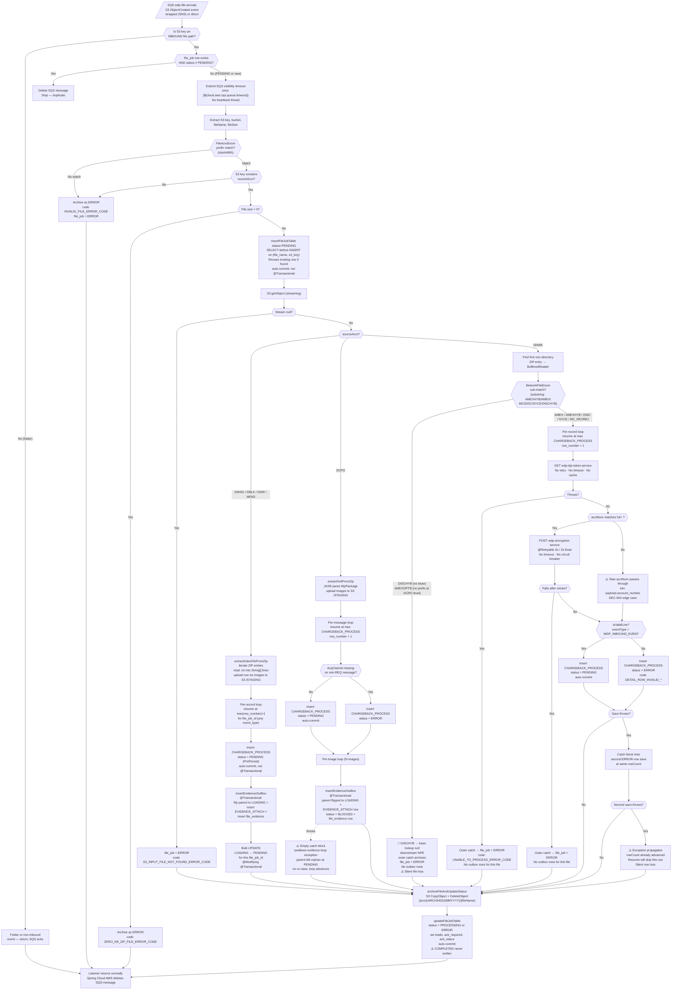

# WDP-COMP-11-FILE-PROCESSOR
**Worldpay Dispute Platform — Component Reference**
*Version: 1.1 DRAFT | April 2026*
*Source-verified by Claude Code: 2026-04-18 · Architect-confirmed: PENDING*

---

## ━━━ CORE SKELETON ━━━━━━━━━━━━━━━━━━━━━━━━━━━━━━━━━━━━━━

---

## Identity

| Field | Value |
|---|---|
| **Name** | `FileProcessor` |
| **Type** | `Batch/Scheduler — SQS-triggered Kubernetes Deployment` |
| **Repository** | `wdp-file-processor` |
| **Technology** | `Spring Boot 4.0.3 / Java 17 / Spring Cloud AWS 4.0.0` |
| **Owner** | `Integration Team` |
| **Status** | `✅ Production` |
| **Doc status** | `📝 DRAFT` |
| **Sections present** | `Core | Block D` |

---

## Purpose

**What it does**

FileProcessor is the primary inbound file-ingestion component for the WDP platform. It is the sole component responsible for converting raw source ZIP and flat files — received from card networks, acquiring platforms, and merchants via the Sterling → ControlM → S3 pipeline — into structured outbox records that downstream consumers can act on.

When an inbound file lands in S3, an `S3 ObjectCreated` event notification is delivered via the `wdp-file-arrivals` SQS queue (either as an S3 → SNS → SQS wrapped envelope or an S3 → SQS direct message). FileProcessor resolves the source type from the filename prefix, streams the object from S3, dispatches to a source-specific handler, parses every record according to source-specific format rules, writes dispute events and evidence metadata to three PostgreSQL outbox tables, stages evidence documents to S3 `/STAGING`, and (for DNWK only) encrypts PAN data via an external service before any database write.

FileProcessor handles six source types with fundamentally different file formats and roles in the dispute lifecycle. The four evidence-index sources (DWSG, DBLK, DISR, MFAD) produce CHARGEBACK_PROCESS rows alongside EVIDENCE_ATTACH rows. The Capital One XML source (DCPO) produces one CHARGEBACK_PROCESS row per `WpPackage` message plus one EVIDENCE_ATTACH row per image — evidence rows are held at BLOCKED for a downstream gate. The network flat-file source (DNWK) produces CHARGEBACK_PROCESS only, sub-routed by a secondary enum to per-network handlers (AMEX / AMEXHYB / DISC / NYCE / MC_REVREJ), and is the sole path carrying PAN.

Processing is strictly sequential: one file is fully processed before the next SQS message is dequeued. The listener is pinned to `maxConcurrentMessages = 1` and `maxMessagesPerPoll = 1`. The component does not publish to Kafka — `chbk_outbox_row` is the sole outbound contract, consumed by InboundDisputeEventScheduler (COMP-12).

**What it does NOT do**

- Does not publish to Kafka — no `KafkaTemplate`, no Kafka starter in pom.xml
- Does not consume from Kafka — no `@KafkaListener` anywhere in the codebase
- Does not use Spring Batch — all record iteration is custom per-source logic
- Does not run on a schedule — no `@Scheduled`, no `@EnableScheduling`, no CronJob, no ShedLock
- Does not perform case enrichment, case lookup, or dispute workflow logic
- Does not generate ACK file content — it sets `ack_required` and `ack_status` on `file_job` for COMP-13 FileAcknowledgementProcessor to consume
- Does not transition `file_job.status` to `COMPLETED` — the successful terminal state written by this component is `PROCESSING`
- Does not set Kafka-related columns (`kafka_topic`, `kafka_partition`, `kafka_offset`) on `chbk_outbox_row` — those are not declared on the entity in this repo and are set by COMP-12 only
- Does not expose any HTTP endpoint — no `@RestController`. (Tomcat binds port 8082 because `spring-boot-starter-web` is on the classpath, but no routes are registered.)
- Does not cache IDP tokens — one HTTP GET per encryption call
- Does not own DB schema — no Flyway, no Liquibase, `ddl-auto=false`. All three tables are owned by a centralized schema outside this repo.

---

## Internal Processing Flow

**Flow notes**

- The SQS visibility timeout is extended **once only** before processing starts (value `${cloud.aws.sqs.queue.timeout}` is injected from K8s secret — numeric value not in source). There is no background heartbeat thread. If processing exceeds the timeout, the message becomes visible again and is redelivered; the resume-from-`max(row_number)` logic handles safe redelivery.
- SQS deletion on the normal path is framework-driven: Spring Cloud AWS 4.x deletes the message when the listener method returns without throwing. Inside `processDataFromMessage` the outer `catch (Exception)` converts every failure into a `file_job` ERROR row and returns normally — so exceptions effectively never escape to SQS.
- The initial status of every CHARGEBACK_PROCESS row is **PENDING** via PrePersist default. LOADING appears only transiently when the first EVIDENCE_ATTACH row for the same file is inserted (the parent is flipped to LOADING inside the `insertEvidenceOutBox` transaction). The bulk UPDATE at the end of the index handlers flips LOADING back to PENDING. DCPO and DNWK never invoke this promotion.
- DCPO evidence rows are explicitly written at status `BLOCKED` and remain so. A downstream gate outside this repo is expected to move them to PENDING.
- DCPO's per-image evidence loop is wrapped in an empty catch block that silently swallows exceptions after the parent CHARGEBACK_PROCESS row has been saved. Combined with the parent save being auto-commit (not `@Transactional`), a partial evidence insert leaves an orphaned CHARGEBACK_PROCESS row at PENDING that downstream consumers will pick up without its evidence.
- For DNWK the PAN encryption call runs only when `acctNum` matches `\d+`. A non-numeric or missing `acctNum` skips encryption and passes the raw value into the CommonEvent payload. In practice PANs should always be numeric; this branch is an edge case that needs team confirmation (see DEC-004 deviation below).
- The successful terminal state on `file_job` is **PROCESSING**, not COMPLETED. No code path writes COMPLETED. This is a cross-component gap against COMP-13 (see Open Questions).

---

## Boundaries

### Inbound Interfaces

| Source | Protocol | Trigger | Payload / Description |
|---|---|---|---|
| AWS SQS `wdp-file-arrivals` | `@SqsListener` (Spring Cloud AWS 4.0.0), `maxConcurrentMessages=1`, `maxMessagesPerPoll=1` | `S3 ObjectCreated:*` event notification | JSON referencing S3 bucket and key. Wrapped (SNS→SQS) and unwrapped (S3→SQS direct) envelopes are both parsed. |

No REST endpoints. No Kafka consumers. No `@Scheduled` methods. No webhooks. Single entry point confirmed by grep across `src/main/java`.

### Outbound Interfaces

| Target | Protocol | Resource | Purpose | On failure |
|---|---|---|---|---|
| AWS S3 (inbound bucket, region `us-east-2` hardcoded) | AWS SDK v2 `S3Client` streaming | `{acro}/INBOUND/...` read | Stream raw file for processing | Returns null → `file_job = ERROR` (S3_INPUT_FILE_NOT_FOUND_ERROR_CODE). Other S3 errors are silently swallowed — `S3ServiceImpl` catches and returns null. |
| AWS S3 (same bucket) | AWS SDK v2 | `{acro}/STAGING/...` write | Stage extracted evidence documents (index and XML paths only) | Outer handler catch archives file as ERROR. Per-row: `file_evidence.failed_s3_key` populated via failed-bucket move. |
| AWS S3 (same bucket) | AWS SDK v2 `CopyObject` + `DeleteObject` | `{acro}/ARCHIVED/{MMYYYY}/{file}` | Archive processed file | If move fails, original stays in `/INBOUND`; `file_job` status still set. Manual cleanup required. |
| AWS S3 `wdp-evidence-failed-files[-prod]` | AWS SDK v2 | Separate failed-evidence bucket | Receive evidence documents that failed to stage | Swallowed silently. |
| `wdp-idp-token-service` | REST HTTP GET via `RestTemplate` (default `SimpleClientHttpRequestFactory`) | `${token-url}` | Bearer token per encryption call (DNWK only). No caching. | No retry. No timeout. Exception → entire file halts, `file_job = ERROR`, no outbox rows written. |
| `wdp-encryption-service` | REST HTTP POST via `RestTemplate` | `${pan-encryption-url}` | Encrypt PAN for DNWK records (only when numeric). | Spring Retry `@Retryable`: 3 attempts, 2 s fixed backoff. No timeout. No circuit breaker. After retries exhausted → entire file halts, `file_job = ERROR`. |
| PostgreSQL `wdp.file_job` | JPA via HikariCP (`@Primary wdpDataSource`, `wdpTransactionManager`) | INSERT + UPDATE | File-level processing ledger | Auto-commit (not `@Transactional`). Unhandled JPA exception lands in outer catch; message not deleted from SQS; will redeliver. |
| PostgreSQL `wdp.chbk_outbox_row` | JPA | INSERT (CHARGEBACK_PROCESS, EVIDENCE_ATTACH) and UPDATE (LOADING→PENDING bulk, parent→LOADING flip) | Stage dispute events and evidence for COMP-12 to publish | Per-row: index handlers swallow per-row exception and continue. DCPO: empty-catch swallow on evidence loop (orphan risk). DNWK: one-retry-then-silent-row-loss pattern (see flow). |
| PostgreSQL `wdp.file_evidence` | JPA (inside `insertEvidenceOutBox` `@Transactional`) | INSERT | Evidence document metadata and S3 staging path | Rolled back with the parent→LOADING flip and EVIDENCE_ATTACH insert if any step in the transaction fails. |

---

## Database Ownership

### Tables Owned (written by this component)

| Schema.Table | Purpose | Key columns | Notes |
|---|---|---|---|
| `wdp.file_job` | File-level processing ledger. One row per inbound file. Tracks status lifecycle, row counts, and ACK flags. | `file_job_id` (PK), `file_name`, `s3_key`, `s3_bucket`, `file_size_bytes`, `status` (PENDING / PROCESSING / ERROR), `source`, `total_rows`, `total_evidences`, `ack_required`, `ack_status`, `error_code`, `error_message`, `created_by = "FILE_PROCESSOR"`, `updated_by = "FILE_PROCESSOR"` | Idempotency key is the application-level composite `(file_name, s3_key)` — JPA entity carries **no `@UniqueConstraint`**; DB-level uniqueness not visible in this repo (see Open Questions OQ-3). Status **COMPLETED is never written** — successful runs terminate at PROCESSING. Fields never written by this component: `completed_at`, `successful_rows`, `failed_rows`, `error_rows`, `attached_evidences`, `failed_evidences` — those are assumed to be written by downstream components that share the table. |
| `wdp.file_evidence` | Evidence document index. S3 staging path, case linkage, attachment status. One row per extracted document. | `id` (PK), `file_job_id` (FK), `chbk_outbox_row_id` (FK), `file_name`, `s3_key` (staging path), `s3_bucket`, `attachment_status` (PrePersist default PENDING), `failed_s3_key`, `i_case`, `c_ntwk_case_id`, `created_by = "FILE_PROCESSOR"` | Written inside the `insertEvidenceOutBox` `@Transactional` method together with the linked EVIDENCE_ATTACH `chbk_outbox_row` row. Not written for DNWK sources — those carry no evidence documents. This component never transitions `attachment_status` past PENDING; downstream attachment workers (COMP-15 EvidenceConsumer) own that. |
| `wdp.chbk_outbox_row` *(shared)* | Shared transactional outbox for dispute events and evidence handoff to COMP-12. | `id` (PK), `file_job_id` (FK), `row_number`, `event_type` (CHARGEBACK_PROCESS / EVIDENCE_ATTACH), `i_case`, `c_acq_platform`, `i_acq_refnce_num`, `c_reason`, `i_ntwk_tran_id`, `c_case_ntwk`, `c_ntwk_case_id`, `network_phase_id`, `c_case_stage`, `c_level1_entity`, `c_migration_sta`, `payload` (JSON), `record_detail` (JSON), `discover_payload` (JSON), `network_notes` (JSON), `status` (PENDING / LOADING / BLOCKED / ERROR), `error_code`, `error_message`, `source_event`, `document_type`, `created_by = "FILE_PROCESSOR"` | Shared table — also written by COMP-07, COMP-08, COMP-09 and updated by COMP-12, COMP-14, COMP-15, COMP-23. `kafka_topic`, `kafka_partition`, `kafka_offset` columns are **not declared on the FileProcessor entity** — COMP-12 is the sole setter. Initial CHARGEBACK_PROCESS status is PENDING via PrePersist; LOADING is only transient between the first evidence insert and the bulk promotion; BLOCKED is written only for DCPO evidence rows. |

### Tables Read (not owned by this component)

| Schema.Table | Owned by | Why accessed |
|---|---|---|
| `wdp.chbk_outbox_row` | Shared writer set; COMP-12 is the publisher | Resume-point detection only — `findTopByFileJobIdAndEventTypeOrderByRowNumberDesc` (index/XML/DNWK handlers) or `findTopByFileJobIdOrderByRowNumberDesc` (DBLK) queries max `row_number` for the current `file_job_id` to determine where to restart on SQS redelivery. |

The component does not own any database DDL. No Flyway, no Liquibase, no `.sql` files in repo. `spring.jpa.hibernate.ddl-auto = false`. All three tables must exist via a schema owner outside this repo; the entity annotations therefore describe expected structure only (see Open Questions OQ-3).

---

## Key Architectural Decisions

- **SQS as file processing trigger.** S3 `ObjectCreated:*` events routed via SQS. Visibility timeout provides natural re-delivery on pod failure without external coordination. Both SNS-wrapped and direct S3-SQS event envelopes are accepted.
- **Strictly sequential single-file processing per pod.** `maxConcurrentMessages = 1` and `maxMessagesPerPoll = 1`. Simplifies state management and avoids concurrent contention on shared outbox tables. Throughput scales by replica count; there is no HPA.
- **Transactional outbox pattern (DEC-001, partial).** FileProcessor writes to `chbk_outbox_row`; COMP-12 reads PENDING rows and publishes to Kafka. File ingestion is fully decoupled from Kafka availability. **Caveat:** `file_job`, `chbk_outbox_row`, and `file_evidence` writes are **not** in a single DB transaction — only the evidence-insert + parent-flip tuple inside `insertEvidenceOutBox` and the bulk LOADING→PENDING UPDATE carry `@Transactional`.
- **Three-table outbox model.** `file_job` (file-level ledger), `chbk_outbox_row` (dispute events and evidence handoff), `file_evidence` (document metadata + S3 paths) separate concerns cleanly.
- **PAN encrypted at the ingestion boundary for DNWK (DEC-004, with an edge case).** Encryption delegated to `wdp-encryption-service` via IDP-token-authenticated REST — no crypto in-process. Encryption is triggered only when `acctNum` matches `\d+`; non-numeric values pass through raw into `payload.account_number`. PANs are expected numeric, but the branch is a latent risk.
- **Resume-aware restart via `row_number`.** On SQS redelivery with `file_job.status = PENDING`, the handler skips rows already present in `chbk_outbox_row` by seeking to `max(row_number) + 1`. Safe restart depends on the file_job row still being PENDING — if status already moved to PROCESSING or ERROR, `IsProcessedMessage` short-circuits and the redelivery is discarded as a duplicate.

---

## Risks and Deviations

🔴 **HIGH — Two DNWK paths produce silent file loss.**
- **DISCHYB**: `NetworkFileEnum.DISCHYB_NETWORK` exists but no Spring bean is registered for that qualifier. Map lookup returns null and downstream usage NPEs. The outer catch archives the file and writes `file_job = ERROR`. No outbox rows. No alert.
- **AMEXOPTB**: Not present in `FileAcroEnum` at all. Files with this prefix fail at the initial ACRO resolution step with `INVALID_FILE_ERROR_CODE`.

🔴 **HIGH — DEC-014 void: no circuit breaker, no timeouts on REST calls.**
`RestTemplate` is constructed with no customization — no connect timeout, no read timeout, no connection pool. A stalled `wdp-encryption-service` or `wdp-idp-token-service` blocks the consumer thread until the SQS visibility timeout expires and the message is redelivered to another pod. Platform-wide void already recorded.

🔴 **HIGH — No Kubernetes probes; no Actuator.**
`spring-boot-starter-actuator` is absent from pom.xml. `resources.yml` declares no `livenessProbe`, `readinessProbe`, or `startupProbe`. Pods report Ready as soon as the container process starts — a JVM failing to connect to DB or S3 at bootstrap is not detected by K8s. `maxSurge=1 / maxUnavailable=0 / minReadySeconds=30` only guards against instant termination.

🔴 **HIGH — No HPA.**
Throughput scales only by manual replica increase. No autoscaling under SQS backlog growth.

🟡 **MEDIUM — `file_job` successful terminal status is PROCESSING, not COMPLETED.**
No code path writes COMPLETED. COMP-13 FileAcknowledgementProcessor polls for `status IN (COMPLETED, ERROR)` — ACK generation for successfully processed DWSG/DBLK files may never trigger. WDP-DB.md attributes the COMPLETED transition to COMP-12, but that attribution is not verified from the COMP-11 side and should be confirmed via COMP-12 source (see OQ-4).

🟡 **MEDIUM — DCPO evidence loop is an empty-catch orphan generator.**
`CaponeDisputesIncomingServiceImpl` saves the CHARGEBACK_PROCESS row auto-commit (not inside `@Transactional`), then iterates evidence in a try-block whose catch is empty. If any image in the loop fails, the loop aborts silently with the parent already persisted at PENDING. Downstream consumers will publish the parent without its evidence. No observability signal.

🟡 **MEDIUM — DNWK per-record failure silently drops rows.**
On a per-record save exception the handler attempts a second ERROR-status save at the same `rowCount`. If that second save also throws, the outer loop advances `rowCount` without any row being persisted. On resume the skip logic treats that `rowCount` as covered and never reprocesses it.

🟡 **MEDIUM — Idempotency race window across replicas.**
No `@UniqueConstraint` on `FileJob` entity. DB-level uniqueness on `(file_name, s3_key)` is not visible in this repo. With `replicas > 1` two pods can both pass the `findBy…StatusNot(PENDING)` check before either inserts. Mitigated per-pod by `maxConcurrentMessages=1`, but not across pods. Same argument applies to `chbk_outbox_row (file_job_id, event_type, row_number)` — no UNIQUE visible.

🟡 **MEDIUM — DEC-004 edge case: non-numeric `acctNum` bypasses encryption.**
`NetworkFileSupport` encrypts only when `acctNum` matches `\d+`. In the non-numeric branch the raw value is written into `chbk_outbox_row.payload.account_number`. Team confirmation needed that no production path can produce a non-numeric but PAN-sensitive value here.

🟡 **MEDIUM — S3 client silently swallows failures.**
`S3ServiceImpl` catches on get / move / put and returns null. Transient failures produce no exception and no retry — only the downstream null-check reveals the outcome.

🟡 **MEDIUM — DBLK production record length unconfirmed.**
`CoreBulkResponseConstants.DETAIL_RECORD_LENGTH = 102` carries a source comment flagging 134 as the production size. If production DBLK files use 134-byte records, the parser is reading truncated data.

🟢 **LOW — `record_detail` always null for DNWK, DISR, MFAD.**
DNWK handlers explicitly set null. DISR and MFAD have the mapping commented out in `DiscoverMapIncomingServiceImpl` and `DiscoverMapNoticeProcessorServiceImpl`. Downstream consumers or diagnostics relying on this field see null.

🟢 **LOW — DWSG image size validation removed.**
The 3 MB cap in `WalmartSignatureCapServiceImpl` is commented out. Responsibility attributed to a downstream consumer in the comment but not formally assigned.

🟢 **LOW — No dead-letter mechanism for file-level ERROR outcomes.**
Failures visible only via `file_job.status = ERROR`. No automated alerting, no reprocessing queue.

### Platform Standard Deviations

| Decision | Status | Detail |
|---|---|---|
| **DEC-001** Transactional outbox | ⚠️ PARTIAL — 🟡 MEDIUM | Outbox pattern intent honoured: `chbk_outbox_row` is the handoff surface, COMP-12 is the publisher. But `file_job`, `chbk_outbox_row`, and `file_evidence` are written in separate transactions; DCPO CHARGEBACK_PROCESS is auto-commit with an empty-catch evidence loop; DNWK per-record saves are auto-commit. Only `insertEvidenceOutBox` and the bulk LOADING→PENDING UPDATE carry `@Transactional`. |
| **DEC-003** Kafka partition key = merchantId | ✅ NOT APPLICABLE | No Kafka producer. Zero Kafka infrastructure on classpath. |
| **DEC-004** PAN encrypted before persistent write | ⚠️ PARTIAL — 🟡 MEDIUM | DNWK: PAN encrypted in-flight when `acctNum` matches `\d+`. Non-numeric `acctNum` passes raw into `payload.account_number`. Non-DNWK sources: no PAN fields in record layouts. |
| **DEC-005** Kafka offset after full processing | ✅ NOT APPLICABLE | No Kafka consumer. |
| **DEC-014** Resilience4j circuit breakers | ⛔ DEVIATES — 🔴 HIGH (platform-wide void) | Resilience4j absent from pom.xml. No circuit breakers on REST, S3, DB, or SQS calls. Only retry mechanism is `@Retryable` on `RestInvoker.encryptField`. No timeouts anywhere on `RestTemplate`. |
| **DEC-019** Clear PAN on any persistent store | ⚠️ PARTIAL — 🟡 MEDIUM | Compliant under normal numeric-PAN path. Non-numeric `acctNum` branch (DEC-004 edge case) could write raw value to `chbk_outbox_row.payload`. |
| **DEC-020** Full at-least-once idempotency | ⚠️ PARTIAL — 🟡 MEDIUM | File-level application-side check only; no DB UNIQUE on `(file_name, s3_key)` visible in repo. Resume logic protects mid-file redelivery but only while `file_job.status = PENDING`. DCPO orphan-parent risk. DNWK silent-row-loss path. |

---

## Planned Changes and Known Gaps

- **Implement two missing DNWK routes**: DISCHYB (register `@Service("DISCHYB_NETWORK")` bean) and AMEXOPTB (add `FileAcroEnum` prefix entry and corresponding handler). Both currently result in silent file loss.
- **Add RestTemplate timeouts and connection pooling** for `wdp-encryption-service` and `wdp-idp-token-service`.
- **Cache IDP tokens** to avoid one GET per encrypted record.
- **Add K8s liveness and readiness probes** (requires adding `spring-boot-starter-actuator` to pom.xml).
- **Add DB-level UNIQUE constraint on `(file_name, s3_key)` in `wdp.file_job`** and on `(file_job_id, event_type, row_number)` in `wdp.chbk_outbox_row`. Schema is owned outside this repo.
- **Clarify `file_job` terminal status** — PROCESSING vs COMPLETED. Confirm whether COMP-12 actually writes COMPLETED (WDP-DB.md asserts so; COMP-11 source neither writes it nor observes it).
- **Decide DCPO evidence BLOCKED → PENDING promotion trigger** — is it manual or is a downstream component responsible? Not in this repo.
- **Close DCPO empty-catch evidence loop** — either propagate up so the file_job is ERROR, or emit a structured log + metric so the orphan is observable.
- **Close DNWK per-record second-save failure path** — current pattern drops the row silently. Either emit an alert or place the file_job in ERROR.
- **Confirm DBLK production record length** (102 vs 134) against a live file.
- **Decide fate of commented-out code**: DNWK decryption hook (`FileProcessingServiceImpl.java:186`), DWSG 3 MB image cap, DISR/MFAD `record_detail` mapping, DCPO batch-header processing.
- **Resolve four active TODOs**: index zip non-`.txt` extension handling, TIFF extension double-append, DNWK decryption, CMRTR vs BJWC source detection.

---

## Open Questions Requiring Resolution

| # | Question | Resolution path |
|---|---|---|
| OQ-1 | SQS visibility timeout numeric value (`${cloud.aws.sqs.queue.timeout}` / `${extend_timeout}`) | Check `wdp-file-processor-secrets` K8s secret or XL Deploy / Terraform values store |
| OQ-2 | SQS DLQ (RedrivePolicy / maxReceiveCount) at AWS infrastructure level | Check AWS SQS console or Terraform/CDK for `wdp-file-arrivals` queue — not in repo |
| OQ-3 | DB-level UNIQUE constraints on `file_job (file_name, s3_key)` and `chbk_outbox_row (file_job_id, event_type, row_number)` — neither declared on JPA entity, no DDL in repo | Inspect the centralized schema-owning repo or run `\d wdp.file_job` / `\d wdp.chbk_outbox_row` in psql |
| OQ-4 | `file_job.status = COMPLETED` transition — WDP-DB.md attributes it to COMP-12 but COMP-11 source does not write it. Does COMP-12 actually write it? Does COMP-13 see any successfully-ingested file? | Architect decision — verify against COMP-12 source. If COMP-12 does not write COMPLETED, ACK generation for successful DWSG / DBLK files is broken. |
| OQ-5 | DEC-004 edge case: can `acctNum` ever be non-numeric in production DNWK flat files? | Team confirmation from Integration team |
| OQ-6 | Production replica count (`replicas: {{ replicas-wdp-file-processor }}`) | Check XL Deploy / Deploy.it configuration — not in repo |
| OQ-7 | DCPO `file_job.source` value and sub-type detection (CAPONE_CMRTR vs CAPONE_BJWC) — not explicitly line-cited in audit | Follow-up Claude Code question: *"In `CaponeDisputesIncomingServiceImpl`, what exact string is written to `file_job.source`? How is CMRTR vs BJWC sub-type determined (filename pattern, XML content, constant)? What is `ack_required` set to, and under which condition?"* |
| OQ-8 | DCPO evidence BLOCKED → PENDING promotion — which component owns the gate? Not this repo, not COMP-12 (which publishes PENDING). | Architect decision — confirm with the evidence-consumer team |
| OQ-9 | DWSG / DBLK / DISR / MFAD field mapping detail — audit did not re-read `EventChargebackSupport`, `CoreBulkSupport`, `DiscoverMapSupport` line-by-line | Follow-up Claude Code pass if column-level mapping is needed for any of those four sources |

---

## Scaling and Deployment

| Parameter | Value | Notes |
|---|---|---|
| Kubernetes resource type | Deployment | Not CronJob, not StatefulSet |
| Replica count | `{{ replicas-wdp-file-processor }}` | XL Deploy / Deploy.it placeholder — production value not in source (OQ-6) |
| Memory limit | 2048Mi | |
| Memory request | 1024Mi | |
| CPU limit / request | Not configured | No CPU bounds in `resources.yml` — burstable QoS |
| HPA | Not configured | No `HorizontalPodAutoscaler` manifest in repo |
| PodDisruptionBudget | Not configured | No PDB manifest in repo |
| Rolling update strategy | `type: RollingUpdate`, `maxSurge: 1`, `maxUnavailable: 0`, `minReadySeconds: 30` | |
| Topology spread constraints | Not configured | No `topologySpreadConstraints` in pod spec |
| Container port | 8082 | Tomcat binds because `spring-boot-starter-web` is on the classpath, but no REST routes are registered |
| Region | `us-east-2` hardcoded | `S3ClientConfiguration` — not environment-driven |
| OTel Java agent | Injected | Pod annotation `instrumentation.opentelemetry.io/inject-java: "true"` |
| Logstash | Configured | `logstash-logback-encoder` 8.1; host/port from K8s secret |
| Spring Actuator | **Not present** | Starter absent from pom.xml. No `/health`, `/liveness`, `/readiness`. **No K8s probes configured anywhere in `resources.yml`.** |
| Correlation ID / MDC | **Not present** | No `MDC.put`; `logback-spring.xml` has no `%mdc` pattern. CommonEvent carries a payload-level `correlationId` UUID but it is not propagated into logs. |
| Metrics | **Not exposed** | No Micrometer registry, no Prometheus endpoint, no custom meters |
| Auth (S3 + SQS) | IAM / IRSA via `InstanceProfileCredentialsProvider` when `${cloud.aws.credentials.iamuser} = true` | Active in all deployed environments |
| Graceful shutdown | Not configured | No `server.shutdown=graceful` in yml — SIGTERM + 30 s grace; in-flight file redelivered via SQS |

---

## ━━━ TYPE BLOCK D — BATCH AND SCHEDULER CONTRACTS ━━━━━━━━

---

## Batch and Scheduler Contracts

**Batch framework:** Custom — no Spring Batch. All record iteration is per-source handler logic. No `BATCH_JOB_INSTANCE`, `BATCH_JOB_EXECUTION`, or `BATCH_STEP_EXECUTION` tables.

**Deployment type:** Kubernetes Deployment (not CronJob).

**Trigger mechanism:** AWS SQS event-driven via Spring Cloud AWS `@SqsListener`. One message per file arrival. No cron, no `@Scheduled`, no ShedLock, no advisory locks.

**Job uniqueness:** File-level idempotency via `findOneByFileNameAndS3Key` before insert. Application-level only; no DB `@UniqueConstraint` visible on the entity (OQ-3). With `maxConcurrentMessages=1` per pod, race is per-pod-safe but not cross-replica-safe.

---

### Job: File Ingestion (SQS-triggered, one execution per inbound file)

**Purpose:** Process one inbound file from SQS notification into `chbk_outbox_row` + `file_evidence` rows staged for COMP-12 publishing.

**Schedule**

| Parameter | Config key | Value / Source |
|---|---|---|
| Trigger | `cloud.aws.sqs.queue.name` | Event-driven — SQS `@SqsListener`. No cron. |
| SQS queue name | `cloud.aws.sqs.queue.name` | `wdp-file-arrivals` |
| Visibility timeout | `cloud.aws.sqs.queue.timeout` / `${extend_timeout}` | Injected from `wdp-file-processor-secrets` — numeric value not in source (OQ-1) |
| Max concurrent messages | `@SqsListener` attribute | `1` |
| Max messages per poll | `@SqsListener` attribute | `1` |
| DLQ (RedrivePolicy / maxReceiveCount) | AWS SQS config | Not in repo (OQ-2) |

**Input source**

| Source | Type | Description | Pagination |
|---|---|---|---|
| AWS SQS `wdp-file-arrivals` | SQS `@SqsListener` | S3 `ObjectCreated:*` event JSON (SNS-wrapped or direct) | None — one message per file |
| AWS S3 inbound bucket | S3 streaming read | File content streamed via `S3Client.getObject()` (`ResponseInputStream`, not buffered to memory) | None — full object streamed |

**Source routing table**

| Filename prefix (FileAcroEnum, `startsWith`) | Resolves to | Handler qualifier |
|---|---|---|
| `MEJR_DBLK_CHRGRESPF` | DBLK | `CORE_BULK_RESPONSE` → `CoreBulkResponseServiceImpl` |
| `AUE2_IWSG_F0BCMI3_WMSIG` | DWSG | `WALMART_SIG_CAP` → `WalmartSignatureCapServiceImpl` |
| `AUE2_MFAD_F0DGDWCI_DISC_DISPUTENOTIFY` | MFAD | `DISCOVER_MAP_NOTICE_PROCESSOR` → `DiscoverMapNoticeProcessorServiceImpl` |
| `AUE2_DISR_F0BCD71C_DISC_ISSUERDOC` | DISR | `DISCOVER_MAP_INCOMING` → `DiscoverMapIncomingServiceImpl` |
| `DCPO_PODMDC81.BJWC` | DCPO | `CAPONE_DISPUTES_INCOMING` → `CaponeDisputesIncomingServiceImpl` |
| `AUE2_DNWK_P0DMDMAX.AMEX.CASES` | DNWK → AMEX | `AMEX_NETWORK` → `AmexNetworkFileServiceImpl` |
| `AUE2_DNWK_P0DMDMAH.AMEXHYB.CASES` | DNWK → AMEXHYB | `AMEXHYB_NETWORK` → `AmexHybNetworkFileServiceImpl` |
| `AUE2_DNWK_P0DMDMDI.DISC.CASES` | DNWK → DISC | `DISCOVER_NETWORK` → `DiscoverNetworkFileServiceImpl` |
| `AUE2_DNWK_P0DMDMIM.MC.REVREJ` | DNWK → MC_REVREJ | `MC_REVREJ_NETWORK` → `McRevRejNetworkFileServiceImpl` |
| `AUE2_DNWK_P0DMDPIN.NYCE.CASES` | DNWK → NYCE | `NYCE_NETWORK` → `NyceNetworkFileServiceImpl` |
| `AUE2_DNWK_P0DMDMDY.DISCHYB.CASES` | DNWK → DISCHYB | ⚠️ **No bean registered** — NPE → silent ERROR |
| *(no FileAcroEnum prefix registered)* | AMEXOPTB | ⚠️ **Not routable** — fails at FileAcroEnum with `INVALID_FILE_ERROR_CODE` |

**Per-handler processing details**

*`processIndexZipFile` (DWSG, DBLK, DISR, MFAD):* `extractIndexFileFromZip` iterates ZIP entries, reads `.txt` files into a `String[]` lines array, uploads all non-`.txt` entries (images/documents) to S3 `/STAGING` during extraction. The record loop then runs against the in-memory lines array. S3 staging always precedes the corresponding outbox write. After all records, a bulk UPDATE flips any LOADING rows for this `file_job_id` to PENDING.

*`processXmlZipFile` (DCPO):* `extractXmlFromZip` uploads non-`.xml` entries to S3 `/STAGING` during ZIP iteration, then parses the XML via JAXB into a `WpPackage` object. Per `WpPackage` message: one CHARGEBACK_PROCESS row is inserted auto-commit (default PENDING, or ERROR if `AcqClaimId` missing on non-REQ messages), then per-image EVIDENCE_ATTACH rows (status `BLOCKED`) are inserted via `insertEvidenceOutBox`. The per-image loop is wrapped in an **empty catch block** — orphan-parent risk on any image failure.

*`processFlatFile` (DNWK):* Finds the first non-directory ZIP entry and wraps in a `BufferedReader`. Sub-dispatches via `NetworkFileEnum` (substring match — order matters because `AMEXHYB` contains `AMEX`). DNWK has no evidence phase — no S3 staging, no `file_evidence` rows. CHARGEBACK_PROCESS rows written directly at PENDING (or ERROR on `isValidLine` failure requiring `eventType = "WDP_INBOUND_EVENT"`).

**Downstream calls per record (DNWK only)**

Each DNWK record with a numeric `acctNum` triggers two serial REST calls before the DB write:

1. `GET ${token-url}` (`wdp-idp-token-service`) — Bearer token. No retry. No timeout. No caching.
2. `POST ${pan-encryption-url}` (`wdp-encryption-service`) — encrypt PAN. `@Retryable(maxAttempts=3, backoff=2000ms fixed)`. No timeout. No circuit breaker.

IDP failure → entire file halts via outer catch, `file_job = ERROR`. Encryption failure after retries → same path. Non-numeric `acctNum` → skip encryption, pass raw value through (DEC-004 edge case).

**Outputs**

| Target | Type | What is written | On failure |
|---|---|---|---|
| `wdp.file_job` | DB insert then update | One row per file. Insert status=PENDING. Update status=PROCESSING (success) or ERROR, with counts and ack flags. Never COMPLETED. | Insert/update auto-commit. Unhandled exception lands in outer catch; SQS message not deleted; will redeliver. |
| `wdp.chbk_outbox_row` | DB insert (+ bulk UPDATE for index sources) | CHARGEBACK_PROCESS + EVIDENCE_ATTACH rows. Status: PENDING (default), LOADING (transient during evidence phase), BLOCKED (DCPO evidence), ERROR. Kafka columns never set. | Index: per-row exception swallowed, loop continues. DCPO: empty-catch orphan. DNWK: one retry at same rowCount then silent row loss. |
| `wdp.file_evidence` | DB insert (inside `insertEvidenceOutBox` `@Transactional`) | One row per extracted document with S3 staging path. Not written for DNWK. | Rolled back with EVIDENCE_ATTACH insert and parent LOADING flip if any step fails. |
| AWS S3 `/STAGING` | S3 write | Extracted evidence / issuer documents | For index/XML path: outer catch archives file as ERROR. Per-row: `file_evidence.failed_s3_key` populated via failed-bucket move. |
| AWS S3 `/ARCHIVED/{MMYYYY}/...` | S3 `CopyObject` + `DeleteObject` | Original file moved to archive | If move fails silently (S3 client swallows), original stays in `/INBOUND`; `file_job` status still set. |
| AWS S3 failed-evidence bucket | S3 write | Evidence documents that failed staging | Swallowed silently. |

**Failure and recovery**

The per-record loop is resume-aware. On SQS redelivery:
- DWSG / DBLK / DISR / MFAD resume on `max(row_number) + 1` for **any** `event_type` (DBLK uses `findTopByFileJobIdOrderByRowNumberDesc`).
- DCPO / DNWK resume on `max(row_number) + 1` for CHARGEBACK_PROCESS only.

Safe restart requires `file_job.status = PENDING` at the time of redelivery. If the first run moved status to PROCESSING or ERROR before crashing mid-archive, `IsProcessedMessage` treats the file as already processed and deletes the redelivered message without reprocessing.

There is no DLQ known in this repo (OQ-2), no error table, and no automated alerting for file-level failures. Manual investigation via `file_job.status = ERROR` and `file_job.error_code`.

**Spring Batch metadata:** Not applicable — Spring Batch is not used.

---

*End of component file.*
*File status: 📝 DRAFT v1.1 — source-verified 2026-04-18, architect confirmation pending.*
*Upstream updates required after confirmation: WDP-COMP-INDEX.md (status → ✅ COMPLETE), WDP-DB.md (correct `created_by` from "WPFLEPR" → "FILE_PROCESSOR" on all three COMP-11 rows), WDP-HANDOVER.md (add OQ-4, OQ-5, OQ-8 to open questions; remove DISCHYB/MC_REVREJ conflation — only DISCHYB and AMEXOPTB are silent-loss paths).*
