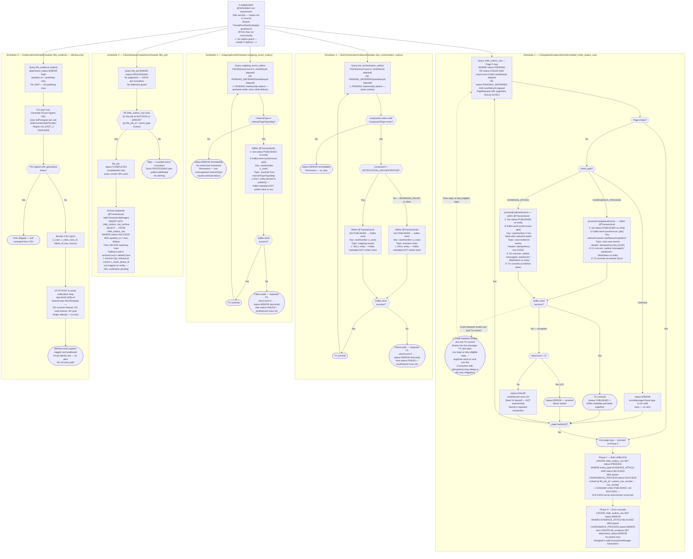

# WDP-COMP-12-INBOUND-EVENT-SCHEDULER
**Worldpay Dispute Platform — Component Reference**
*Version: 1.1 DRAFT | April 2026*
*Source-verified: Claude Code audit 2026-04-18 against `wdp-chargeback-evidence-event-scheduler`*
*Architect-confirmed: PENDING*

> ⚠️ **CORRECTIONS APPLIED IN v1.1 (source-verified against the repo)**
>
> 1. **Channel map:** `SEN_EVENTS` → **`BEN_EVENTS`** — confirmed at `application-local.yml:14`. v1.0 DRAFT listed this channel incorrectly.
> 2. **Transaction semantics reframed.** v1.0 DRAFT described the flow as "status committed to DB *before* Kafka send — silent loss on crash." Source confirms the status flip and the `.get()` Kafka send are **inside the same `@Transactional` method**, with broker ack preceding TX commit. The crash window therefore produces **possible duplicates, not silent loss** — at-least-once semantics relying on consumer-side `idempotency-key` dedupe. DEC-001 posture updated accordingly.
> 3. **Kubernetes probes** — previously an open question. Audit confirms **no liveness, readiness, or startup probes** are declared in `resources.yml`.
> 4. **`RestTemplate`** — bare `new RestTemplate()` bean in `config/CommonConfig.java`: no connect timeout, no read timeout, no pooling. Stalled email relay blocks the Scheduler5 thread indefinitely.
> 5. **`@Value` / yml path mismatches** — two deferred mismatches in `S3PresignerConfiguration` and `EvidenceErrorEmailServiceImpl` that would fail Spring context startup unless env-override resolves them. See Planned Changes.
> 6. **`idempotencyId` type inconsistency** — `UUID` on `ChbkOutboxEntity`, `String` on `OutgoingEventOutboxEntity`. Cross-table idempotency key typing is inconsistent.
>
> Prior v1.0 corrections retained: Scheduler5 has **no LIMIT**; Schedulers 3/4 intentionally omit `PENDING` (upstream writer contract); Scheduler1 writes `PUBLISHED`, not `SUCCESS` — the `SUCCESS` transition is performed by a downstream consumer (likely COMP-14).

---

## ━━━ CORE SKELETON ━━━━━━━━━━━━━━━━━━━━━━━━━━━━━━━━━━━━━━

---

## Identity

| Field | Value |
|-------|-------|
| **Name** | `InboundDisputeEventScheduler` |
| **Type** | `Kafka Producer / Batch-Scheduler` |
| **Repository** | `wdp-chargeback-evidence-event-scheduler` |
| **Maven artifact** | `com.wp.gcp:chargeback-evidence-event-scheduler:1.0.5` |
| **Technology** | Spring Boot 3.5.7 / Spring Data JPA / Spring Kafka / Java 17 |
| **Owner** | Integration Team |
| **Status** | `✅ Production` |
| **Doc status** | `📝 DRAFT v1.1 — source-verified` |
| **Sections present** | `Core \| Block C — Kafka Producer \| Block D — Batch/Scheduler` |

---

## Purpose

**What it does**

`InboundDisputeEventScheduler` is the **transactional outbox relay layer** for the WDP chargeback and evidence domain. It is a continuously-running Kubernetes `Deployment` hosting five independent `@Scheduled` cron jobs — each draining a specific outbox or tracking table and relaying events to AWS MSK Kafka topics or to an external email endpoint.

This component is the **only Kafka producer** in the inbound processing chain. The upstream batch jobs and file processors (COMP-07, COMP-08, COMP-09, COMP-11) write dispute events to PostgreSQL outbox tables and rely entirely on this service to relay those events into the Kafka event bus. None of those components have a Kafka dependency.

Scheduler1 (`ChargebackEvidenceEventScheduler`) is the highest-criticality path. It drains `wdp.chbk_outbox_row` and routes each row to either `new-case-events` (dispute creation events) or `case-evidence-events` (evidence attachment events) based on the row's `event_type`. It also manages the sequencing gate that prevents evidence events from being published before their parent chargeback case has been successfully created downstream — using a `BLOCKED` status on evidence rows that is only released after the parent `CHARGEBACK_PROCESS` row reaches `SUCCESS` status.

Scheduler2 (`FileJobStatusCompletionScheduler`) monitors file processing completion by inspecting terminal-state counts on `wdp.chbk_outbox_row` and promoting completed file jobs to `COMPLETED` on `wdp.file_job`. It also archives `SUCCESS` rows older than 30 days to `wdp.chbk_outbox_row_archive`.

Schedulers 3 and 4 handle retry and deferred-delivery paths for two additional outbox tables (`wdp.outgoing_event_outbox`, `wdp.bre_orchestration_outbox`). Initial `PENDING` delivery for these tables is handled by the upstream writer service — these schedulers handle only the `FAILED` retry and `PENDING_DEFERRED` future-publish paths.

Scheduler5 (`EvidenceErrorEmailScheduler`) does not publish to Kafka. It polls `wdp.file_evidence` for rows where S3 evidence attachment failed on the previous day, generates S3 pre-signed URLs for all failed rows, renders a CSV report, and POSTs it to an internal email notification relay. This is an alerting mechanism only — it does not retry or recover failed evidence records.

**What it does NOT do**

- Does not consume from Kafka — no `@KafkaListener`, no consumer group
- Does not expose any REST endpoints — no `@RestController`
- Does not call EncryptionService, IDP, any card scheme endpoint, or any acquiring platform API
- Does not parse or validate file uploads — that is COMP-11 FileProcessor
- Does not perform schema migration — Hibernate DDL auto is `false`
- Does not manage the initial `PENDING` → `PUBLISHED` delivery for `wdp.outgoing_event_outbox` or `wdp.bre_orchestration_outbox` — that is the upstream writer service's responsibility
- Does not set `chbk_outbox_row.status = SUCCESS` — the scheduler sets `PUBLISHED`; the transition to `SUCCESS` is made by a downstream consumer (likely COMP-14 — unconfirmed)
- Does not have distributed locking — no ShedLock, no `SELECT FOR UPDATE`, no advisory lock
- Is not a Spring Batch application — no `Job`, `Step`, `ItemReader`/`ItemWriter`, no `BATCH_*` metadata tables, no `@EnableBatchProcessing`

---

## Internal Processing Flow

*Five schedulers fire from a shared `ThreadPoolTaskScheduler` of pool size 5. All five can execute concurrently; a single slow scheduler can starve its siblings (sibling-starvation risk — see Risks). Scheduler1 is shown in full; Schedulers 2–5 at decision-step level.*

---

## Boundaries

### Inbound Interfaces

| Source | Protocol | Trigger | Payload / Description |
|--------|----------|---------|-----------------------|
| Spring `@Scheduled` (Scheduler1) | Internal cron | K8s secret: `chargeback_evidence_scheduler_cron` | Fires → drains `wdp.chbk_outbox_row` |
| Spring `@Scheduled` (Scheduler2) | Internal cron | K8s secret: `file_completion_scheduler_cron` | Fires → evaluates `wdp.file_job` completion |
| Spring `@Scheduled` (Scheduler3) | Internal cron | K8s secret: `outgoing_scheduler_cron` | Fires → drains `wdp.outgoing_event_outbox` retries |
| Spring `@Scheduled` (Scheduler4) | Internal cron | K8s secret: `bre_outbox_event_scheduler_cron` | Fires → drains `wdp.bre_orchestration_outbox` retries |
| Spring `@Scheduled` (Scheduler5) | Internal cron | K8s secret: `evidence_email_scheduler_cron` | Fires → polls `wdp.file_evidence` for yesterday's errors |
| `wdp.chbk_outbox_row` | PostgreSQL poll | Scheduler1 query | PENDING / FAILED / PENDING_DEFERRED dispute and evidence events |
| `wdp.file_job` | PostgreSQL poll | Scheduler2 query | PROCESSING file job records |
| `wdp.chbk_outbox_row` | PostgreSQL read | Scheduler2 terminal-count queries | Row counts by status per `file_job_id` and `event_type` |
| `wdp.outgoing_event_outbox` | PostgreSQL poll | Scheduler3 query | FAILED / PENDING_DEFERRED outgoing event rows |
| `wdp.bre_orchestration_outbox` | PostgreSQL poll | Scheduler4 query | FAILED / PENDING_DEFERRED BRE orchestration rows |
| `wdp.file_evidence` | PostgreSQL poll | Scheduler5 query | ERROR attachment rows from yesterday |

### Outbound Interfaces

| Target | Protocol | Resource | Purpose | On failure |
|--------|----------|----------|---------|------------|
| AWS MSK `new-case-events` | Kafka (SASL_SSL / MSK IAM) | Topic | Publish `CHARGEBACK_PROCESS` events (Scheduler1) | Row → FAILED + nextRetryAt=+1hr (fixed); after 3 attempts → ERROR terminal |
| AWS MSK `case-evidence-events` | Kafka (SASL_SSL / MSK IAM) | Topic | Publish `EVIDENCE_ATTACH` events (Scheduler1) | Same retry / ERROR pattern |
| AWS MSK `case-action-events` / `core-request-events` / `external-request-events` | Kafka (SASL_SSL / MSK IAM) | Topic (dynamic — `channelTypeTopicMap`) | Publish outgoing events (Scheduler3) | Same retry; unknown `channelType` → immediate terminal ERROR (no retry) |
| AWS MSK `business-rules` | Kafka (SASL_SSL / MSK IAM) | Topic | Publish BRE orchestration events — `BUSINESS_RULES` component (Scheduler4) | Same retry / ERROR pattern |
| AWS MSK `outgoing-events` | Kafka (SASL_SSL / MSK IAM) | Topic | Publish BRE orchestration events — `NOTIFICATION_ORCHESTRATOR` component (Scheduler4) | Same retry / ERROR pattern |
| `wdp.chbk_outbox_row` | PostgreSQL (JPA + native UPDATE) | `wdp` schema | Status transitions, Kafka metadata writes, bulk unblock, error-cascade UPDATE | Outer try/catch prevents context crash; per-row isolation |
| `wdp.chbk_outbox_row_archive` | PostgreSQL (native INSERT + DELETE) | `wdp` schema | Archive SUCCESS rows >30 days (Scheduler2) | `@Transactional` rollback if archiveCount ≠ deleteCount |
| `wdp.file_job` | PostgreSQL (JPA save) | `wdp` schema | PROCESSING → COMPLETED transition (Scheduler2) | Auto-commit JPA save; failure skips this job — retried next invocation |
| `wdp.file_evidence` | PostgreSQL (native UPDATE) | `wdp` schema | Set `attachment_status=ERROR` on cascade (Scheduler1 Phase 3) | Within `wdpTransactionManager` transaction |
| `wdp.outgoing_event_outbox` | PostgreSQL (JPA save) | `wdp` schema | Status transitions (Scheduler3) | Per-row catch — one failure does not stop the run |
| `wdp.bre_orchestration_outbox` | PostgreSQL (JPA save) | `wdp` schema | Status transitions (Scheduler4) | Same per-row isolation |
| Email notification relay | REST / HTTP POST | `app.email.notify.url` → K8s secret `${email_notification_url}` | POST CSV report (Scheduler5) | **Single attempt — no retry; WebServiceException swallowed; email silently lost** |
| AWS S3 | S3Presigner SDK v2 | `app.s3.bucketname` → K8s secret `${bucket_name}` | Generate pre-signed URLs (Scheduler5 — read-only) | Per-URL exception swallowed; row excluded from CSV |

---

## Database Ownership

### Tables Owned (written by this component)

| Schema.Table | Purpose | Key columns | Retention / Notes |
|--------------|---------|-------------|-------------------|
| `wdp.chbk_outbox_row` | Primary outbox — status transitions, Kafka metadata, unblock and error-cascade updates (shared writer — see shared table risk) | `status`, `event_type`, `retry_count`, `next_retry_at`, `published_at`, `messageId` / `partitionId` / `offsetValue`, `idempotency_id` | SUCCESS rows archived to `chbk_outbox_row_archive` after 30 days by Scheduler2. `idempotencyId` typed as `UUID` on entity |
| `wdp.chbk_outbox_row_archive` | Long-term archive of SUCCESS rows | Mirrors `chbk_outbox_row` + `archived_at` | No purge policy confirmed for archive table itself. ⚠ Archive INSERT SQL references column `c_ntwrk_phase_id` that is not mapped on the entity — dead column reference or incomplete entity; DBA verification pending |
| `wdp.file_job` | Completion status update only (PROCESSING → COMPLETED) | `status`, `completed_at` | Written only by Scheduler2 completion path; upstream rows created by COMP-11 |
| `wdp.file_evidence` | Error-cascade only — sets `attachment_status=ERROR` when parent EVIDENCE_ATTACH row reaches ERROR | `attachment_status` | Written only on error-cascade; read by Scheduler5 for daily error report |
| `wdp.outgoing_event_outbox` | Status transitions for outgoing event retry/deferred rows (Scheduler3) | `status`, `retry_count`, `next_retry_at`, `idempotency_id` | ⚠ This component handles FAILED and PENDING_DEFERRED only. ⚠ `idempotencyId` typed as `String` on entity — **inconsistent with `chbk_outbox_row` which uses `UUID`** |
| `wdp.bre_orchestration_outbox` | Status transitions for BRE orchestration retry/deferred rows (Scheduler4) | `status`, `retry_count`, `next_retry_at`, `idempotency_id` | Same constraint as outgoing_event_outbox — FAILED and PENDING_DEFERRED only |

### Tables Read (not owned by this component)

| Schema.Table | Owned by | Why accessed |
|--------------|----------|--------------|
| `wdp.chbk_outbox_row` | COMP-07, COMP-08, COMP-09, COMP-11 (writers) | Scheduler1: poll eligible rows; Scheduler2: count terminal-state rows per `file_job_id` |
| `wdp.file_job` | COMP-11 FileProcessor | Scheduler2: poll PROCESSING jobs; Scheduler5: join against `file_evidence` |
| `wdp.file_evidence` | COMP-11 FileProcessor | Scheduler5: poll ERROR rows for daily email report |

### DDL / Schema Ownership

No Flyway, Liquibase, `schema.sql`, or DDL artefact is present in this repository. All six tables are schema-owned outside this repo. No `@UniqueConstraint` or `@Table(uniqueConstraints=...)` declared on any entity — idempotency relies on application-level key fields (`idempotencyId`, `event_type`). Any DB-level UNIQUE constraints, indexes, or PKs beyond the `id` sequence require DBA confirmation.

---

## Configuration and Scaling

| Parameter | Value | Notes |
|-----------|-------|-------|
| Replica count | XLD placeholder `{{ replicas-wdp-chargeback-evidence-event-scheduler }}` | Actual production count NOT in source — must be confirmed from XLD. **Any value > 1 is unsafe** — no concurrency guard |
| HPA | None | No `HorizontalPodAutoscaler` in `resources.yml` |
| Memory request | 1024Mi | |
| Memory limit | 2048Mi | |
| CPU request | Not set | Pod runs Burstable QoS — first eviction candidate under node pressure |
| CPU limit | Not set | |
| Deployment type | Kubernetes `Deployment` (not `CronJob`) | JVM stays warm between cron fires; avoids cold-start latency |
| Rollout strategy | `RollingUpdate` — `maxSurge: 1`, `maxUnavailable: 0` | |
| PodDisruptionBudget | None | `resources.yml` contains Deployment only |
| Topology spread | None | No `topologySpreadConstraints` in `resources.yml` |
| Liveness probe | **Not configured** | Source-verified absence |
| Readiness probe | **Not configured** | Source-verified absence |
| Startup probe | **Not configured** | Source-verified absence |
| `minReadySeconds` | 30 — **misplaced at `spec.template.spec.minReadySeconds`** (silently ignored by K8s; correct path is `spec.minReadySeconds` at Deployment level). Same bug as COMP-09 | |
| Thread pool | `ThreadPoolTaskScheduler` poolSize=5, prefix `ChargebackEvidence` | Five schedulers share five threads — sibling-starvation risk under load |
| Kafka send mode | Synchronous blocking — `kafkaTemplate.send().get()` | Provides natural backpressure; no rate limiting between rows |
| Page size (Scheduler1) | K8s secret `${page_size}` | No default — startup fails if secret absent |
| Channel topic map (Scheduler3) | K8s secret `${channel_topic_map}` | JSON map parsed at startup. **Non-prod default:** `EXPIRY_EVENTS`, `CORE_EVENTS`, `GP_EVENTS`, **`BEN_EVENTS`** → dev-suffixed topics |
| 30-day archive window | Hardcoded — not configurable | |
| Server port | 8082 (Actuator same port — no separate management port) | |
| Actuator endpoints exposed | Not determined in this audit pass — carry forward | |
| Hardcoded AWS region | `Region.US_EAST_2` in `S3PresignerConfiguration` | Multi-region deployment blocker |
| S3 credentials | `StaticCredentialsProvider` (K8s secret-sourced keys) — migration away from `InstanceProfileCredentialsProvider` | Security regression — manual rotation required |
| OTel agent | Annotation-based injection by OpenTelemetry Operator | No code-level MDC, no Micrometer meters |
| Logstash encoder | `logstash-logback-encoder:7.4` | Structured JSON → `${LOGSTASH_SERVER_HOST_PORT}` |

---

## Key Architectural Decisions

| Decision | ADR reference | Notes |
|----------|---------------|-------|
| Transactional outbox pattern — upstream writers populate outbox tables; this service relays to Kafka | DEC-001 | Decouples file ingestion and batch processing from Kafka availability. Four outbox tables drained by five schedulers |
| Mark-and-send within the same `@Transactional` — at-least-once with duplicate-possible crash window | DEC-001 — compliant variant | Broker ack precedes TX commit. Crash in that window → TX rolls back, next cron re-picks → duplicate publish. Consumer-side `idempotency-key` dedup is the intended mitigation |
| Asymmetric Kafka metadata write-back | Local decision | Chargeback / Evidence paths update `messageId`, `partitionId`, `offsetValue` on the entity within the same TX. Outgoing / BRE paths pass **NULL entity** to `publish()` — Kafka metadata is **never persisted**. Operators cannot trace an outgoing-event Kafka message back to its outbox row via offset |
| Fixed 1-hour retry backoff — not exponential | Local decision | `ApplicationConstants.NEXT_RETRY = 3600000L`. All retry paths (Schedulers 1, 3, 4) use the same fixed 1h delay and 3-attempt cap |
| No distributed locking | Local decision — accepted risk | No ShedLock, no `SELECT FOR UPDATE`, no advisory lock, no synchronized guard. Horizontal scaling is unsafe as built |
| Schedulers 3 / 4 intentionally omit `PENDING` | Cross-component contract | Upstream writers (COMP-17, COMP-18, COMP-43 for `outgoing_event_outbox`; COMP-18 for `bre_orchestration_outbox`) own initial delivery. These schedulers handle retry and deferred paths only |
| `PUBLISHED` → `SUCCESS` transition owned by downstream consumer | Cross-component contract — **unconfirmed owner** | Scheduler1 Phase 2 unblock query requires parent `status=SUCCESS`. This component only writes `PUBLISHED`. Likely owner: COMP-14 CaseCreationConsumer |
| Scheduler5 is alerting-only, not recovery | Local decision | Daily CSV email to operators. No retry of failed S3 attachments. Email itself is best-effort (single POST, no timeout, swallowed exception) |
| No Resilience4j anywhere | DEC-014 ⛔ VOID — platform-wide | Bare `RestTemplate` with no timeouts, no pool, no circuit breaker |

---

## Risks and Constraints

| Severity | Risk | Consequence |
|----------|------|-------------|
| 🔴 HIGH | **No replica guard — concurrency race if replicas > 1.** No ShedLock, no `SELECT FOR UPDATE`, no `@SchedulerLock`, no synchronized guard. Two pods running the same cron tick can both claim the same PENDING rows, both mark-and-send within their own TXs, both publish to Kafka. Kafka producer idempotence dedupes within a single producer session only — cross-replica duplicates **are** possible. | Duplicate Kafka publish for the same outbox row. Consumer-side dedup via `idempotency-key` header is the only mitigation. Production replica count is unconfirmed from source |
| 🔴 HIGH | **No Kubernetes health probes.** `resources.yml` declares no liveness, readiness, or startup probe. A deadlocked JVM, slow-starting pod, or process that has lost DB connectivity is invisible to Kubernetes. | Traffic may route to an unhealthy pod; rolling updates proceed without gating on actual readiness; no automatic restart on liveness failure |
| 🔴 HIGH | **`PUBLISHED → SUCCESS` gap depends on a downstream consumer.** Scheduler1 Phase 2 unblock query requires `CHARGEBACK_PROCESS.status=SUCCESS`. The scheduler itself only writes `PUBLISHED`. A downstream consumer (likely COMP-14) must transition the row to `SUCCESS`. If that consumer fails or is delayed, EVIDENCE_ATTACH rows remain permanently `BLOCKED`. | Evidence never published for any case where the downstream SUCCESS transition fails or is delayed. Implicit cross-component dependency with no timeout or fallback |
| 🔴 HIGH | **Bare `RestTemplate` with no timeouts (all outbound HTTP).** `config/CommonConfig.java` defines a bare `new RestTemplate()` bean — no connect timeout, no read timeout, no pool. A stalled email relay (Scheduler5) will block the scheduler thread indefinitely; under the pool-size-5 budget, repeated stalls can starve the other four schedulers. | Indefinite thread block on any slow HTTP peer. Combined with the pool-size-5 thread model, a slow email relay can starve all other schedulers |
| 🟡 MEDIUM | **Duplicate-possible crash window — at-least-once semantics.** Kafka broker ack precedes TX commit. A pod killed between broker-ack and DB commit re-selects the same row on the next cron fire → duplicate publish. Producer idempotence dedupes within a session only, not across restarts. | Consumer-side deduplication via `idempotency-key` is required. If any consumer does not dedupe, duplicates are processed |
| 🟡 MEDIUM | **Kafka metadata update failure (Scheduler1) leaves row at `PUBLISHED` with null metadata** and no re-processing. No scheduler query includes `PUBLISHED` in its filter. | Operators cannot correlate Kafka offset/partition back to the row. Not a message-loss path, but loses the audit trail link |
| 🟡 MEDIUM | **No DLQ or error archive for terminal ERROR rows.** After 3 failed attempts, rows reach terminal `ERROR` on `chbk_outbox_row`, `outgoing_event_outbox`, or `bre_orchestration_outbox`. They are never requeued. Only Scheduler5's daily email covers `file_evidence`. | Terminal ERROR rows require manual intervention. No ops runbook. No automated alert |
| 🟡 MEDIUM | **No staleness guard on `PROCESSING` `file_job` rows (Scheduler2).** A job stuck in `PROCESSING` indefinitely is polled every invocation with no remediation path. | Scheduler2 accumulates stale jobs in its query result set. No alerting; manual investigation required |
| 🟡 MEDIUM | **Unknown `channelType` causes permanent ERROR with no retry (Scheduler3).** An unrecognised `channelType` sets `status=ERROR` immediately — `retryCount` is not incremented. | Rows with unrecognised `channelType` are permanently silently discarded. New channel types require K8s secret update to `channelTypeTopicMap` before any rows arrive |
| 🟡 MEDIUM | **Outgoing / BRE Kafka metadata never persisted.** Scheduler3 and Scheduler4 pass a `NULL` entity to the Kafka service, so `kafka_offset`, `kafka_partition`, `kafka_topic` are never populated on those outbox tables. | Operators cannot trace an outgoing-event or BRE Kafka message back to its outbox row via offset — reduces incident-response observability |
| 🟡 MEDIUM | **Sibling-starvation risk on shared `ThreadPoolTaskScheduler` (poolSize=5).** Five schedulers share five threads. If one scheduler (most likely Scheduler1's page-0 drain loop on a large backlog, or Scheduler5's stalled email POST) holds its thread, remaining capacity drops. | Under a large backlog or slow peer, other schedulers run late or miss cron fires |
| 🟡 MEDIUM | **No code-level observability.** OTel agent is injected via K8s annotation but there is no MDC-based correlation ID, no Micrometer registry, no custom meters, no business-key log enrichment. | Incident triage relies on OTel spans only. No per-scheduler counters for success/failure/skip/error outcomes |
| 🟡 MEDIUM | **Static AWS credentials for S3 (Scheduler5).** `InstanceProfileCredentialsProvider` replaced with `StaticCredentialsProvider` backed by K8s secrets. | Security regression. Keys must be rotated manually via secret update and pod restart |
| 🟡 MEDIUM | **No CPU limits or requests — Burstable QoS.** First eviction candidate on nodes under memory pressure. Combined with the concurrency race risk, scaling is unsafe without a distributed locking solution | |
| 🟡 MEDIUM | **Hardcoded AWS region `US_EAST_2`** in `S3PresignerConfiguration`. | Multi-region deployment blocker |
| 🟡 MEDIUM | **`idempotencyId` type inconsistency across outbox tables.** `ChbkOutboxEntity.idempotencyId = UUID`; `OutgoingEventOutboxEntity.idempotencyId = String`. | Dedup logic on the consumer side must handle both types. Inconsistency complicates shared tooling |
| 🟡 MEDIUM | **Archive SQL references unmapped column `c_ntwrk_phase_id`.** `ChbkOutboxArchiveRepository` native INSERT references a column the entity does not declare. Either dead column reference or incomplete entity mapping. | If the column does not exist in the DDL, archive SQL fails silently (or noisily) on every Scheduler2 run. DBA verification required |
| 🟢 LOW | **S3Presigner created per call** (Scheduler5), not via Spring bean injection. | New SDK client per URL generation — object churn at large error report sets. Low risk at normal cadence |
| 🟢 LOW | **`minReadySeconds: 30` at wrong YAML path.** Silently ignored by K8s. Same bug as COMP-09 | Pods do not observe the 30-second readiness settling delay during rolling updates |
| 🟢 LOW | **`commons-beanutils:1.11.0` dead dependency.** Declared in pom, no source references | Unused transitive risk — dependency footprint |
| 🟢 LOW | **`json-path` version declared as `<properties>` with no `<dependency>` and no import.** | Dead `<properties>` entry |
| 🟢 LOW | **`HistoricalDisputeDetail` DTO retains deprecated `rejectDate` / `rejectReason` fields.** Fields promoted to `ChargebackEvent` but not cleaned | No runtime impact; misleading to future maintainers |
| 🟢 LOW | **All cron expressions and `channelTypeTopicMap` externalised to K8s secrets.** Schedule values not visible in source | Operational debugging requires K8s secret access |
| 🟢 LOW | **Log message typo** in `util/SchedulerUtil.java` — "notificcation" (double-c) | Cosmetic |

---

## Planned Changes

- **Resolve replica count.** Confirm actual XLD value and document. Any replicas > 1 is an unmitigated 🔴 HIGH concurrency race — requires ShedLock or `SELECT FOR UPDATE SKIP LOCKED` before scaling
- **Resolve `PUBLISHED → SUCCESS` gap.** Confirm which downstream component transitions `CHARGEBACK_PROCESS` rows from `PUBLISHED` to `SUCCESS` and formalise the cross-component contract. Likely candidate: COMP-14 CaseCreationConsumer
- **Add Kubernetes probes.** Wire liveness / readiness / startup probes to Actuator. Currently absent entirely — requires Actuator endpoint confirmation
- **Add `RestTemplate` timeouts and pooling.** Bare `new RestTemplate()` in `config/CommonConfig.java` is a platform-wide hazard. Add connect / read timeouts and pooled factory
- **Fix `minReadySeconds` YAML placement.** Move from `spec.template.spec.minReadySeconds` to `spec.minReadySeconds` at Deployment level (same fix needed as COMP-09)
- **Resolve the two `@Value` / yml path mismatches** that would fail Spring context startup unless env-var overrides resolve them:
    1. `S3PresignerConfiguration` reads `app.aws.accesskey` / `app.aws.secretkey`; `application.yml` defines them under `app.s3.aws.*`
    2. `EvidenceErrorEmailServiceImpl` reads `app.presignedUrlExpiryTime`; `application.yml` defines it as `app.s3.presignedUrlExpiryTime`
- **Reconcile `idempotencyId` typing** across outbox tables (`UUID` vs `String`) or document the divergence as intentional
- **Verify archive-table column `c_ntwrk_phase_id`** against actual DDL. Either map the column on the entity, remove from archive SQL, or add to the entity. DBA confirmation required
- **Externalise hardcoded values** — `Region.US_EAST_2`, `ApplicationConstants.USER_ID`, `ApplicationConstants.NEXT_RETRY`
- **Migrate S3 credentials back to `InstanceProfileCredentialsProvider`** — static credentials are a security regression
- **Add operational alerting for terminal ERROR rows** on all four outbox tables (currently only `file_evidence` is covered by Scheduler5's daily email)
- **Add code-level observability** — MDC correlation ID, Micrometer meters per scheduler outcome, structured log fields (`file_job_id`, `event_type`, `caseNumber`)
- **Remove dead dependencies and fields** — `commons-beanutils`, `json-path` properties entry, `HistoricalDisputeDetail.rejectDate` / `rejectReason`
- ⚠️ **OPEN QUESTION:** Which component writes initial `PENDING` rows to `wdp.outgoing_event_outbox` and `wdp.bre_orchestration_outbox`? Candidates identified (COMP-17, COMP-18, COMP-43 for outgoing; COMP-18 for BRE) but not verified from this repo's source
- ⚠️ **OPEN QUESTION:** Complete `channelTypeTopicMap` production mapping — non-prod shows four channels; production is a K8s secret not visible in source

---

---

## ━━━ TYPE BLOCK C — KAFKA PRODUCER CONTRACTS ━━━━━━━━━━━━━

---

## Kafka Producer Contracts

**Producer framework:** Spring Kafka `KafkaTemplate<String, Event>` — one shared bean across all five schedulers via `KafkaServiceImpl`
**Idempotent producer:** Yes — `enable.idempotence=true`, `acks=all`
**Retries:** `retries=${retry-count}` — externalised; all environment yml files set to `3`
**Max in-flight requests per connection:** `5`
**Transactional producer:** No — `transactional.id` not set; no `KafkaTransactionManager`
**Publish mode:** Synchronous blocking — `kafkaTemplate.send(message).get()`
**Auth:** MSK IAM — `security.protocol=SASL_SSL`, `sasl.mechanism=AWS_MSK_IAM` via `aws-msk-iam-auth:2.1.1`
**Bootstrap servers:** `spring.kafka.bootstrap-servers`
**Key serialiser:** `StringSerializer`
**Value serialiser:** `JsonSerializer`
**Message headers on every publish:** `idempotency-key` (from outbox `idempotencyId`), `event-timestamp`

### Kafka metadata write-back — asymmetric

| Path | Writes back `messageId` / `partitionId` / `offsetValue`? |
|------|----------------------------------------------------------|
| Scheduler1 Chargeback (`new-case-events`) | ✅ Yes — entity updated within same TX |
| Scheduler1 Evidence (`case-evidence-events`) | ✅ Yes — entity updated within same TX |
| Scheduler3 Outgoing (`case-action-events` / `core-request-events` / `external-request-events`) | ⛔ No — NULL entity passed to `publish()`, Kafka metadata never persisted |
| Scheduler4 BRE (`business-rules` / `outgoing-events`) | ⛔ No — NULL entity passed, Kafka metadata never persisted |

**Operational impact of the asymmetry:** operators cannot trace an outgoing-event or BRE Kafka message back to its source outbox row via Kafka offset. Correlation relies on the `idempotency-key` header only.

---

### Topic: `new-case-events`

| Parameter | Value |
|-----------|-------|
| **Topic name** | `new-case-events` (from `chargebackEventTopic`) |
| **Message key** | Compound string: `networkCaseId + cardNetwork + platform` — source fields `c_ntwk_case_id`, `c_case_ntwk`, `c_acq_platform` on `ChbkOutboxEntity` |
| **Ordering guarantee** | Per partition — scoped to network case + card network + platform combination |
| **Published on** | Scheduler1 processes a `CHARGEBACK_PROCESS` row from `wdp.chbk_outbox_row` |
| **Consumed by** | COMP-14 CaseCreationConsumer |

**Message payload:** `ChargebackEvent` (JSON) — deserialised from `chbk_outbox_row.payload`. Payload produced by upstream batch writers (COMP-07, COMP-08, COMP-09, COMP-11). `enrichmentFailure = true` is hardcoded by some upstream writers — downstream consumer must handle partial events.

**Payload notes:** `eventId` is set to the outbox row `id` before publish. Kafka metadata (`messageId`, `partitionId`, `offsetValue`) is written back to the outbox row after successful publish within the same TX. Row status transitions: `PENDING → PUBLISHED` inside `@Transactional`; broker ack precedes TX commit.

⚠️ **DEC-003 deviation:** Partition key is NOT `merchantId`.

---

### Topic: `case-evidence-events`

| Parameter | Value |
|-----------|-------|
| **Topic name** | `case-evidence-events` (from `evidenceEventTopic`) |
| **Message key** | `caseNumber` (column `i_case`) if non-blank; else `networkCaseId` (column `c_ntwk_case_id`) |
| **Ordering guarantee** | Per partition — scoped to case number when available |
| **Published on** | Scheduler1 processes an `EVIDENCE_ATTACH` row that has been unblocked (status = `PENDING`) |
| **Consumed by** | COMP-15 EvidenceConsumer |

**Message payload:** `EvidenceEvent` (JSON) — deserialised from `chbk_outbox_row.payload`. Same Kafka metadata write-back pattern as `new-case-events`.

**Payload notes:** EVIDENCE_ATTACH rows originating from DWSG / DBLK / DISR / MFAD sources are evidence-only (no chargeback). DCPO sources produce paired CHARGEBACK_PROCESS + EVIDENCE_ATTACH rows. DNWK sources produce CHARGEBACK_PROCESS only.

⚠️ **DEC-003 deviation:** Partition key is NOT `merchantId`.

---

### Topic: `case-action-events` / `core-request-events` / `external-request-events` (dynamic)

| Parameter | Value |
|-----------|-------|
| **Topic name** | Resolved at runtime from `channelTypeTopicMap` (K8s secret `${channel_topic_map}`) keyed by `channelType`. Non-prod default map: `EXPIRY_EVENTS→case-action-events-dev`, `CORE_EVENTS→core-request-events-dev`, `GP_EVENTS→external-request-events-dev`, **`BEN_EVENTS`**`→external-request-events-dev`. Production mapping not visible in source |
| **Message key** | `caseNumber` — column `i_case` on `OutgoingEventOutboxEntity` |
| **Ordering guarantee** | Per partition — scoped to case number |
| **Published on** | Scheduler3 processes a `FAILED` (retryCount < 3) or `PENDING_DEFERRED` row from `wdp.outgoing_event_outbox` |
| **Consumed by** | Varies by topic — `case-action-events`: COMP-17 CaseExpiryUpdateConsumer; `core-request-events`: COMP-43 CoreNotificationConsumer; `external-request-events`: COMP-41, COMP-42, COMP-44 |

**Payload notes:** `OutgoingEvent` (JSON). **Kafka metadata is NOT written back** — `null` entity is passed to the Kafka service. `idempotencyId` on `OutgoingEventOutboxEntity` is `String` type (not `UUID`).

⚠️ **DEC-003 deviation:** Partition key is NOT `merchantId`.

---

### Topic: `business-rules`

| Parameter | Value |
|-----------|-------|
| **Topic name** | `business-rules` (from `breEventTopic`) |
| **Message key** | `caseNumber` — column `i_case` on `BreOrchestrationOutboxEntity` |
| **Ordering guarantee** | Per partition — scoped to case number |
| **Published on** | Scheduler4 processes a row where `component = BUSINESS_RULES` (or any value that is not `NOTIFICATION_ORCHESTRATOR`) |
| **Consumed by** | COMP-16 BusinessRulesProcessor |

**Payload notes:** `BREOutboxEvent` (JSON). One row → exactly one topic publish. Kafka metadata NOT written back.

⚠️ **DEC-003 deviation:** Partition key is NOT `merchantId`.

---

### Topic: `outgoing-events`

| Parameter | Value |
|-----------|-------|
| **Topic name** | `outgoing-events` (from `notificationOrchestratorEventTopic`) |
| **Message key** | `caseNumber` — column `i_case` on `BreOrchestrationOutboxEntity` |
| **Ordering guarantee** | Per partition — scoped to case number |
| **Published on** | Scheduler4 processes a row where `component = NOTIFICATION_ORCHESTRATOR` |
| **Consumed by** | COMP-18 NotificationOrchestrator |

**Payload notes:** `NotificationOrchestrationOutboxEvent` (JSON). Kafka metadata NOT written back.

⚠️ **DEC-003 deviation:** Partition key is NOT `merchantId`.

---

---

## ━━━ TYPE BLOCK D — BATCH AND SCHEDULER CONTRACTS ━━━━━━━━

---

## Batch and Scheduler Contracts

**Batch framework:** Spring `@Scheduled` cron — **not** Spring Batch (no Spring Batch metadata tables, no `@EnableBatchProcessing`, no `Job`/`Step`/`ItemReader`/`ItemWriter`)
**Deployment type:** Kubernetes `Deployment` (continuously running — JVM warm between cron fires)
**Trigger mechanism:** Five independent `@Scheduled` cron expressions — all values externalised to K8s secrets. No cron value is committed to source. No `fixedDelay` or `fixedRate` is used anywhere
**Thread model:** Single `ThreadPoolTaskScheduler` bean with `poolSize=5`, `threadNamePrefix="ChargebackEvidence"`. All five schedulers share this pool — sibling-starvation risk
**Job uniqueness:** **None.** No distributed locking, no Spring Batch deduplication, no `SELECT FOR UPDATE`, no advisory lock. Concurrency race is live if replica count > 1 — operational constraint only

---

### Job: Scheduler1 — ChargebackEvidenceEventScheduler

**Purpose:** Primary dispute event relay. Drains `wdp.chbk_outbox_row` and publishes `CHARGEBACK_PROCESS` rows to `new-case-events` and `EVIDENCE_ATTACH` rows to `case-evidence-events`. Also manages the BLOCKED → PENDING sequencing gate and error-cascades on failure.

**Schedule**

| Parameter | Config key | Value / Source |
|-----------|------------|----------------|
| Cron expression | K8s secret | `chargeback_evidence_scheduler_cron` — value not in source |
| Timezone | Not specified | JVM default |

**Input source**

| Source | Type | Query / Filter | Pagination |
|--------|------|----------------|------------|
| `wdp.chbk_outbox_row` | PostgreSQL poll | `status=PENDING` OR `(status=FAILED AND retryCount<3 AND nextRetryAt<=now)` OR `(status=PENDING_DEFERRED AND nextRetryAt<=now)` — sorted by `id` ASC | **Page-0 drain loop** — `PageRequest.of(0, pageSize, Sort.by("id"))` repeated until page empty. Mark-before-commit ensures next page-0 naturally excludes rows just processed. Page size from K8s secret `${page_size}` — no default |

**Processing steps**

| Step | Name | Description | On failure |
|------|------|-------------|------------|
| 1 | Classify event type | `event_type` — `CHARGEBACK_PROCESS`, `EVIDENCE_ATTACH`, or unknown | Unknown → `status=ERROR` immediately; no retry |
| 2 | Within `@Transactional`: set status and publish | Set `status=PUBLISHED` on entity; `kafkaTemplate.send(message).get()` synchronous (Kafka client up to 3 retries); on success update `messageId` / `partitionId` / `offsetValue` on entity; TX commits at method return | Kafka exception → TX rolls back; catch block writes FAILED/ERROR in a separate transaction |
| 3 (failure) | Retry / Error | `retryCount` incremented. If > 2: `status=ERROR` terminal. Else: `status=FAILED`, `nextRetryAt=now+1hr` (**fixed backoff — not exponential**) | FAILED rows re-eligible on next invocation when `nextRetryAt` elapses |
| 4 | Phase 2 — Bulk unblock | `UPDATE chbk_outbox_row SET status=PENDING WHERE event_type=EVIDENCE_ATTACH AND status=BLOCKED AND parent CHARGEBACK_PROCESS.status=SUCCESS` | Native UPDATE in `wdpTransactionManager` transaction |
| 5 | Phase 3 — Error cascade | `UPDATE chbk_outbox_row SET status=ERROR WHERE EVIDENCE_ATTACH BLOCKED AND parent CHARGEBACK_PROCESS.status=ERROR`. Also `UPDATE file_evidence SET attachment_status=ERROR` for paired rows | Both updates in `wdpTransactionManager` transaction |

**Failure and recovery:** Per-row `try/catch` — one failing row does not halt the run. Outer try/catch at scheduler method level catches catastrophic failures. Crash between Kafka broker ack and TX commit → duplicate publish on next cron fire (at-least-once). Rows in terminal ERROR are never requeued.

---

### Job: Scheduler2 — FileJobStatusCompletionScheduler

**Purpose:** Monitors file processing completion by counting terminal-state rows on `chbk_outbox_row` per file job. Promotes complete jobs to `COMPLETED` on `file_job`. Archives SUCCESS rows older than 30 days to `chbk_outbox_row_archive`.

**Schedule**

| Parameter | Config key | Value / Source |
|-----------|------------|----------------|
| Cron expression | K8s secret | `file_completion_scheduler_cron` — value not in source |

**Input source**

| Source | Type | Query / Filter | Pagination |
|--------|------|----------------|------------|
| `wdp.file_job` | PostgreSQL poll | `status=PROCESSING` — ordered by `id` | None — full list per invocation |

**Processing steps**

| Step | Name | Description | On failure |
|------|------|-------------|------------|
| 1 | Count terminal rows | For each PROCESSING `file_job`: count SUCCESS + ERROR rows on `chbk_outbox_row` by `file_job_id` and `event_type` | DB query failure skips this job — retried next invocation |
| 2 | Evaluate completion | Both `(successfulChargebacks + errorChargebacks) == totalChargebackCount` and `(attachedEvidences + failedEvidences) == totalEvidenceCount` must be true. Only SUCCESS and ERROR count — PUBLISHED / PENDING prevent completion | — |
| 3 | Mark COMPLETED | `fileJobRepository.save(fileJobEntity)` — `status=COMPLETED`, `completedAt=now` (auto-commit) | JPA save failure — retried next invocation |
| 4 | Archive SUCCESS rows | `@Transactional(wdpTransactionManager)`: INSERT SUCCESS rows >30 days old into `chbk_outbox_row_archive`, then DELETE. If `archiveCount ≠ deleteCount` → rollback both | Transaction rollback — archive not applied; retried next invocation |

**Failure and recovery:** No per-row try/catch documented. Stuck `PROCESSING` jobs are polled indefinitely — no staleness guard, no alerting. Archive SQL references `c_ntwrk_phase_id` — DDL verification required.

---

### Job: Scheduler3 — OutgoingEventScheduler

**Purpose:** Retry and deferred-delivery relay for `wdp.outgoing_event_outbox`. Handles `FAILED` (retryCount < 3) and `PENDING_DEFERRED` rows only. Initial PENDING delivery is the responsibility of the upstream writer service.

**Schedule**

| Parameter | Config key | Value / Source |
|-----------|------------|----------------|
| Cron expression | K8s secret | `outgoing_scheduler_cron` — value not in source |

**Input source**

| Source | Type | Query / Filter | Pagination |
|--------|------|----------------|------------|
| `wdp.outgoing_event_outbox` | PostgreSQL poll | `status=FAILED AND retryCount<3 AND nextRetryAt<=now` OR `status=PENDING_DEFERRED AND nextRetryAt<=now` — **PENDING intentionally absent** | Not documented — assumed full list or page |

**Processing steps**

| Step | Name | Description | On failure |
|------|------|-------------|------------|
| 1 | Validate channelType | Check `channelType` against `channelTypeTopicMap`. Unknown → `status=ERROR` immediately — no `retryCount` increment, permanent | — |
| 2 | Resolve topic | `topic = channelTypeTopicMap.get(channelType)` | Covered by step 1 validation |
| 3 | Within `@Transactional`: mark PUBLISHED and send | Set `status=PUBLISHED`; `kafkaTemplate.send().get()` synchronous. **NULL entity passed — Kafka metadata NOT written back**. TX commits at method return | Kafka exception → TX rolls back; catch writes FAILED/ERROR in separate TX |
| 4 (failure) | Retry / Error | Same pattern as Scheduler1: `retryCount>2` → ERROR; else FAILED + `nextRetryAt=now+1hr` (fixed) | — |

---

### Job: Scheduler4 — BreOrchestrationOutboxScheduler

**Purpose:** Retry and deferred-delivery relay for `wdp.bre_orchestration_outbox`. Routes each row to either `business-rules` (COMP-16) or `outgoing-events` (COMP-18) based on the `component` field. Handles FAILED and PENDING_DEFERRED only.

**Schedule**

| Parameter | Config key | Value / Source |
|-----------|------------|----------------|
| Cron expression | K8s secret | `bre_outbox_event_scheduler_cron` — value not in source |

**Input source**

| Source | Type | Query / Filter | Pagination |
|--------|------|----------------|------------|
| `wdp.bre_orchestration_outbox` | PostgreSQL poll | `status=FAILED AND retryCount<3 AND nextRetryAt<=now` OR `status=PENDING_DEFERRED AND nextRetryAt<=now` — **PENDING intentionally absent** | Not documented |

**Processing steps**

| Step | Name | Description | On failure |
|------|------|-------------|------------|
| 1 | Validate component type | Check `component` against `ComponentType` enum (`BUSINESS_RULES`, `NOTIFICATION_ORCHESTRATOR`). Unknown → `status=ERROR` immediately | Permanent terminal ERROR |
| 2 | Route to topic | `if component=NOTIFICATION_ORCHESTRATOR → outgoing-events; else → business-rules`. Routing is mutually exclusive | — |
| 3 | Within `@Transactional`: mark PUBLISHED and send | Set `status=PUBLISHED`; Kafka send synchronous. **NULL entity passed — Kafka metadata NOT written back** | Kafka exception → retry/error logic |
| 4 (failure) | Retry / Error | Same pattern as other schedulers | — |

---

### Job: Scheduler5 — EvidenceErrorEmailScheduler

**Purpose:** Daily alerting job for failed evidence attachments. Polls `wdp.file_evidence` for ERROR rows updated yesterday. Generates S3 pre-signed URLs and sends a CSV report to an internal email notification relay. **Alerting only — no recovery, no retry, no Kafka.**

**Schedule**

| Parameter | Config key | Value / Source |
|-----------|------------|----------------|
| Cron expression | K8s secret | `evidence_email_scheduler_cron` — value not in source |
| Look-back window | Hardcoded | Yesterday only (`updated_at >= CURRENT_DATE - INTERVAL '1 day' AND updated_at < CURRENT_DATE`) — not configurable |

**Input source**

| Source | Type | Query / Filter | Pagination |
|--------|------|----------------|------------|
| `wdp.file_evidence` (joined with `wdp.file_job`) | PostgreSQL poll | `attachment_status=ERROR AND updated_at=yesterday` | **None — no LIMIT.** All qualifying rows processed |

**Processing steps**

| Step | Name | Description | On failure |
|------|------|-------------|------------|
| 1 | Poll yesterday's errors | Native query; empty result → job exits | — |
| 2 | Generate pre-signed URLs | Per row: new `S3Presigner` (`StaticCredentialsProvider`, region `US_EAST_2` hardcoded), generate URL | Exception swallowed — row excluded from CSV |
| 3 | Render CSV | Fields: `i_case`, `c_ntwk_case_id`, `failed_s3_key`, `source` | — |
| 4 | POST CSV to email relay | `app.email.notify.url` — shared bare `RestTemplate` (**no timeout, no pool**). Single attempt, no retry | `WebServiceException` logged and swallowed — **email silently lost, no alert** |

**Failure and recovery:** No retry of failed evidence records. Scheduler5 is alerting-only; the underlying ERROR rows on `file_evidence` remain untouched. Bare `RestTemplate` can stall the scheduler thread indefinitely on a slow relay — sibling-starvation risk on the shared pool.

---

*End of WDP-COMP-12-INBOUND-EVENT-SCHEDULER.md*
*File status: 📝 DRAFT v1.1 — source-verified 2026-04-18; architect confirmation pending*
*Change log entry: see WDP-CHANGE-LOG.md Pending Entries*
