# WDP-COMP-13-FILE-ACK-PROCESSOR
**Worldpay Dispute Platform — Component Reference**
*Version: 2.0 DRAFT | April 2026*
*Source-verified by Claude Code: 2026-04-18 against `wdp-evidence-ack-scheduler`*
*Architect-confirmed: PENDING*

---

## ━━━ CORE SKELETON ━━━━━━━━━━━━━━━━━━━━━━━━━━━━━━━━━━━━━━
*Mandatory for every component regardless of type.*

---

## Identity

| Field                | Value                                                                               |
|----------------------|-------------------------------------------------------------------------------------|
| **Name**             | `FileAcknowledgementProcessor`                                                      |
| **Type**             | `Batch/Scheduler`                                                                   |
| **Repository**       | `wdp-evidence-ack-scheduler`                                                        |
| **Artifact**         | `com.wp.wdp.evidence.ack.scheduler:wdp-evidence-ack-scheduler:1.0.5`                |
| **Stack**            | Spring Boot 4.0.3 · Java 17 · Spring Data JPA · Spring Cloud AWS 4.0.0 (`spring-cloud-aws-starter-s3` only) · JAXB (jaxb-runtime resolved via Spring Boot BOM; `jaxb2-maven-plugin` 4.0.0) · logstash-logback-encoder 8.1 |
| **Database**         | Aurora PostgreSQL — `wdp` schema                                                    |
| **Status**           | `✅ Production`                                                                     |
| **Doc status**       | `📝 DRAFT` — source-verified, architect confirmation pending                        |
| **Sections present** | `Core \| Block D — Batch/Scheduler`                                                 |

---

## Purpose

**What it does**

FileAcknowledgementProcessor is a continuously-running Kubernetes Deployment that polls the shared WDP Aurora PostgreSQL database on a scheduled cron cadence and generates outbound acknowledgement files for inbound file jobs that have completed processing and require confirmation.

On each cron fire, the component queries `wdp.file_job` for all rows where `status IN (COMPLETED, ERROR)`, `ack_required = true`, and `ack_status = PENDING`. For each eligible job it fetches per-row processing detail from `wdp.chbk_outbox_row`, formats an ACK file in one of four merchant-specific layouts, uploads the result to AWS S3, and — only if the S3 upload succeeds — marks the job `ack_status = COMPLETED` in the database.

The component handles four distinct merchant ACK file types: Walmart Signature Capture (fixed-width text), Meijer / Core Bulk Response (fixed-width text), CapitalOne CMRTR Commercial Card (JAXB-serialised XML-in-ZIP), and CapitalOne BJWC Bank Card (JAXB-serialised XML-in-ZIP). Each type has its own formatter. Source routing is determined entirely by the `source` field on `file_job`, matched against four constants defined in `ApplicationConstants`. CMRTR and BJWC both dispatch to the same `CapitalOneAckService` bean; the XML filename prefix and outer ZIP filename differ per source constant.

S3 is the sole delivery target. Downstream file transfer to external partners is handled by ControlM → Sterling Mailbox → DM Mainframe, which this component has no awareness of.

**What it does NOT do**

- Does not receive or parse inbound files — that is COMP-11 FileProcessor
- Does not deliver ACK files via SFTP, MQ, or API — S3 is the only output
- Does not process jobs where `ack_required = false` — these are silently skipped by the poll query
- Does not expose any HTTP endpoint — no `spring-boot-starter-web` dependency. Port 8082 is declared in the K8s manifest but no HTTP server binds it.
- Does not produce to or consume from Kafka — no `spring-kafka`, `kafka-clients`, or `aws-msk-iam-auth` on the classpath
- Does not write to `wdp.chbk_outbox_row` — read-only access
- Does not call FileProcessor — coupling is via the shared database schema only
- Does not set `ack_status = ERROR` — the only terminal write is `COMPLETED`; every failure path leaves `ack_status = PENDING`
- Does not use Spring Batch — all iteration is custom `@Scheduled` logic. No `BATCH_*` metadata tables.
- Does not use Resilience4j — no circuit breaker, retry, or bulkhead on any outbound call
- Does not emit any outbound REST traffic — no `RestTemplate`, `WebClient`, `Feign`, or custom `HttpClient` bean anywhere

---

## Internal Processing Flow

```mermaid
flowchart TD
    CRON["⏱ Cron fires<br/>@Scheduled(cron=${app.scheduler.cron})<br/>Value from env ${cron_scheduler}<br/>via K8s secret"]

    POLL["Poll wdp.file_job<br/>JPQL: status IN (COMPLETED, ERROR)<br/>AND ack_status = PENDING<br/>AND ack_required = true<br/>ORDER BY id ASC<br/>Unbounded List — no LIMIT"]

    OUTER_EX{{"performTask threw<br/>any Exception?"}}
    OUTER_ABORT["Catch-all at performTask<br/>Log 'Unable to proceed'<br/>WHOLE CRON FIRE ABORTS<br/>Remaining jobs skipped until next cron"]

    EMPTY{{"Jobs found?"}}
    LOG_EMPTY["Log empty<br/>Return — no DB write"]

    LOOP["For each FileJob<br/>oldest first (id ASC)"]

    SWITCH{{"file_job.source?"}}

    LOG_UNKNOWN["default branch<br/>Log 'Unidentified source'<br/>ack_status stays PENDING<br/>NO audit row, NO metric, NO alert<br/>Never changes — permanent skip"]

    SVC_WAL["WalmartSigCapAckService"]
    SVC_DBLK["BulkResponseAckService"]
    SVC_CAP["CapitalOneAckService<br/>CMRTR and BJWC both route here<br/>sub-branch on source inside formatter"]

    FETCH_WAL["Read chbk_outbox_row<br/>findByFileJobIdOrderByRowNumberAsc<br/>All rows, all event_types"]
    FETCH_DBLK["Read chbk_outbox_row<br/>findByFileJobIdOrderByRowNumberAsc<br/>All rows, all event_types"]
    FETCH_CAP["Read chbk_outbox_row<br/>findByFileJobIdAndEventTypeAndStatus<br/>OrderByRowNumberAsc<br/>event_type=CHARGEBACK_PROCESS<br/>status IN (SUCCESS, ERROR)"]

    FORMAT_WAL["Walmart formatter<br/>Right-pad recordData to 78 chars<br/>+ 2-digit error code<br/>H header (yyyyMMdd) + details + T trailer<br/>Fixed-width UTF-8 text"]
    FORMAT_DBLK["DBLK formatter<br/>Header 1 + yyyyMMddHHmmSS (⚠️ BUG)<br/>+ detail lines + trailer 3<br/>Optional 901/902/903 synthetic lines<br/>injected based on FileJob.errorCode"]
    FORMAT_CAP["CapitalOne formatter<br/>Row → Acknowledgement elements<br/>MessageType 4-way branch<br/>(see 4-way below)<br/>JAXB marshal Package → XML"]

    WAL_SKIP{{"Walmart:<br/>detailLines.isEmpty()<br/>OR totalEvidences==null?"}}
    LOG_WAL_SKIP["Log skip<br/>Return null<br/>No S3, no DB write<br/>ack_status stays PENDING"]

    CAP_SKIP1{{"CapitalOne:<br/>content (header+ack list)<br/>== null?"}}
    CAP_SKIP2{{"CapitalOne:<br/>ackContent==null<br/>OR filePath==null?"}}
    LOG_CAP_SKIP["Log skip<br/>Return null<br/>No S3, no DB write<br/>ack_status stays PENDING"]

    CAP_MSGTYPE{{"MessageType?"}}
    CAP_OC["outcome-chargeback<br/>SUCCESS→ACCEPTED<br/>ERROR with known msg→REJECTED<br/>ERROR else→null (row dropped)"]
    CAP_CR["claim-request<br/>SUCCESS→ACCEPTED (iCase as caseNumber)"]
    CAP_ELSE["catch-all else<br/>claim-response / outcome-no-chargeback<br/>status=REJECTED, validReject=false<br/>⚠️ Known incomplete — §MessageType gap"]

    CAP_ZIP["Wrap XML in ZIP<br/>CMRTR vs BJWC:<br/>different outer filename<br/>different inner XML filename"]

    GUARD["Guard: if (!key.isEmpty() || content!=null)<br/>⚠️ BUG — should be && not ||<br/>Null/empty can proceed"]

    HEAD{{"S3 headObject<br/>outcome?"}}
    HEAD_200["headObject returned 200<br/>Object already exists<br/>Return false — no putObject<br/>⚠️ STUCK-JOB TRIGGER<br/>if previous DB write failed"]
    HEAD_404["NoSuchKeyException<br/>Proceed to putObject"]
    HEAD_OTHER["any other Exception<br/>(5xx, timeout, auth, null key)<br/>Generic catch at CommonAckServiceImpl<br/>Return false — no putObject<br/>ack_status stays PENDING"]

    PUT["s3Client.putObject<br/>Synchronous blocking<br/>Bucket wdp-files (us-east-2)<br/>SDK-default retry only<br/>No app-level retry, no circuit breaker"]

    PUT_OK{{"putObject threw?"}}
    PUT_FAIL["Caught by same generic catch<br/>Log (message-only, no stack)<br/>Return false<br/>ack_status stays PENDING<br/>Next cron retries"]

    DB_WRITE["CommonAckService.updateAckStatus<br/>@Transactional (REQUIRED, default iso)<br/>fileJobRepository.save<br/>@DynamicUpdate → dirty columns only:<br/>ack_status=COMPLETED<br/>ack_generated_at=now()<br/>updated_at=now()<br/>updated_by=WPACKSD"]

    DB_FAIL["Exception caught inside updateAckStatus<br/>Log 'Unable to update ack status or timestamp'<br/>(message-only, no stack trace)<br/>@Transactional rolls back the single save<br/>⚠️ STUCK-JOB on next cron — S3 file exists<br/>headObject=200 → never retries write"]

    NEXT["Move to next FileJob"]
    DONE["List exhausted<br/>Scheduler returns"]

    CRON --> POLL --> OUTER_EX
    OUTER_EX -->|"threw"| OUTER_ABORT
    OUTER_EX -->|"no throw"| EMPTY
    EMPTY -->|"empty"| LOG_EMPTY
    EMPTY -->|"jobs found"| LOOP
    LOOP --> SWITCH

    SWITCH -->|"WALMART_SIG_CAP"| SVC_WAL
    SWITCH -->|"CORE_BULK_RESP"| SVC_DBLK
    SWITCH -->|"CAPONE_CMRTR<br/>or CAPONE_BJWC"| SVC_CAP
    SWITCH -->|"anything else"| LOG_UNKNOWN --> NEXT

    SVC_WAL --> FETCH_WAL --> FORMAT_WAL --> WAL_SKIP
    WAL_SKIP -->|"true"| LOG_WAL_SKIP --> NEXT
    WAL_SKIP -->|"false"| GUARD

    SVC_DBLK --> FETCH_DBLK --> FORMAT_DBLK --> GUARD

    SVC_CAP --> FETCH_CAP --> FORMAT_CAP --> CAP_MSGTYPE
    CAP_MSGTYPE -->|"outcome-chargeback"| CAP_OC --> CAP_SKIP1
    CAP_MSGTYPE -->|"claim-request"| CAP_CR --> CAP_SKIP1
    CAP_MSGTYPE -->|"other known or unknown"| CAP_ELSE --> CAP_SKIP1
    CAP_SKIP1 -->|"true"| LOG_CAP_SKIP --> NEXT
    CAP_SKIP1 -->|"false"| CAP_SKIP2
    CAP_SKIP2 -->|"true"| LOG_CAP_SKIP
    CAP_SKIP2 -->|"false"| CAP_ZIP --> GUARD

    GUARD --> HEAD
    HEAD -->|"200 exists"| HEAD_200 --> NEXT
    HEAD -->|"NoSuchKeyException"| HEAD_404 --> PUT
    HEAD -->|"other Exception"| HEAD_OTHER --> NEXT
    PUT --> PUT_OK
    PUT_OK -->|"threw"| PUT_FAIL --> NEXT
    PUT_OK -->|"success"| DB_WRITE
    DB_WRITE -->|"save ok"| NEXT
    DB_WRITE -->|"save threw"| DB_FAIL --> NEXT

    NEXT -->|"more jobs"| LOOP
    NEXT -->|"list exhausted"| DONE
```

**S3 key patterns by source** (⚠️ multiple prior-draft transcription errors corrected from source: digit-zero was rendered as letter-O, digit-one as letter-L, and CMRTR/BJWC outer prefixes were incorrectly listed as identical)

| Source constant (`file_job.source`) | S3 prefix       | Key pattern (timestamp from `UniqueTimestampGenerator`)                                                                          |
|-------------------------------------|-----------------|----------------------------------------------------------------------------------------------------------------------------------|
| `WALMART_SIG_CAP`                   | `DWSG/OUTBOUND/ACK/` | `AUE2_DWSG_R0BCDWL1_WMSIG_CONF_<yyyyMMddHHmmss>.txt`                                                                       |
| `CORE_BULK_RESP`                    | `DBLK/OUTBOUND/ACK/` | `DBLK_MEJR_CHRGRESP_CONF_<yyyyMMddHHmmSS>.txt` ⚠️ *capital `SS` is fraction-of-second, not seconds — runtime throws, see Risks* |
| `CAPONE_CMRTR`                      | `DCPO/OUTBOUND/ACK/` | `DCPO_R0DMRDDA.WP01.ACK.<yyyyMMddHHmm>.zip` (inner XML: `WP.C1.COMMTRANTROUBLE.ACK.PROD.<ts>.xml`)                          |
| `CAPONE_BJWC`                       | `DCPO/OUTBOUND/ACK/` | `DCPO_R0DMRBDA.WP01.ACK.<yyyyMMddHHmm>.zip` (inner XML: `WP_BJWC.C1.TRANTROUBLE.ACK.PROD.<ts>.xml`)                         |

> **Source-constant vs S3-prefix clarification:** `WALMART_SIG_CAP`, `CORE_BULK_RESP`, `CAPONE_CMRTR`, and `CAPONE_BJWC` are the four values stored in `file_job.source` and matched at runtime. `DWSG`, `DBLK`, and `DCPO` are S3 path prefixes only — they do not appear as source constants. Earlier project documentation (WDP-COMPONENTS.md, WDP-COMP-INDEX.md) incorrectly listed DWSG / DBLK as source constants.

---

## Boundaries

### Inbound Interfaces

| Source                    | Protocol     | Endpoint / Topic / Trigger                                                                                                                                                                                                      | Payload / Description                                                                                                                          |
|---------------------------|--------------|---------------------------------------------------------------------------------------------------------------------------------------------------------------------------------------------------------------------------------|------------------------------------------------------------------------------------------------------------------------------------------------|
| Kubernetes cron scheduler | `Schedule`   | `app.scheduler.cron` = `${cron_scheduler}` (env). Delivered by one of two `envFrom` K8s secrets (`wdp-evidence-ack-scheduler-secrets`, `wdp-common-secrets`); which of the two actually supplies the value is not determinable from source. | No payload — scheduler fires internally. Production value env-injected; no committed default. Profiles present in repo: `application.yml`, `application-cert.yml`, `application-prod.yml`. |
| `wdp.file_job`            | `DB poll`    | JPQL: `status IN :status AND ackStatus = :ackStatus AND ackRequired = true ORDER BY id ASC` (status bound to COMPLETED,ERROR; ackStatus bound to PENDING).                                                                     | Eligible jobs only. No date range, no `Pageable`, no `LIMIT` — unbounded `List<FileJob>` per cron fire.                                        |
| `wdp.chbk_outbox_row`     | `DB read`    | Per-job reads by source type (all rows for Walmart/DBLK; CHARGEBACK_PROCESS + SUCCESS/ERROR for CapitalOne)                                                                                                                    | Per-row processing detail. JSONB `record_detail` field. Read-only — no writes.                                                                 |

### Outbound Interfaces

| Target                        | Protocol          | Endpoint / Resource                                                                         | Purpose                                                                                            | On failure                                                                                                                                                      |
|-------------------------------|-------------------|---------------------------------------------------------------------------------------------|----------------------------------------------------------------------------------------------------|-----------------------------------------------------------------------------------------------------------------------------------------------------------------|
| AWS S3 (`wdp-files`)          | `S3` (AWS SDK v2) | Bucket from `spring.cloud.aws.s3.bucket-name`; region hardcoded `us-east-2`. Key per source per the table above. Dev: `wdp-files-dev`. | `headObject` (idempotency gate) then `putObject` (upload). Synchronous blocking.                  | Generic catch — any throw (incl. 5xx, timeout, auth, null key/content) → `uploadAckFileToS3` returns `false`, no DB write, `ack_status` stays `PENDING`. Next cron retries. |
| `wdp.file_job`                | `PostgreSQL write`| `fileJobRepository.save()` via `@Transactional` `updateAckStatus()`                         | Write `ack_status = COMPLETED`, `ack_generated_at`, `updated_at`, `updated_by = WPACKSD` after successful S3 upload. | Exception caught inside method, logged (message-only — no stack trace), `@Transactional` rolls back the single save. `ack_status` stays `PENDING`. ⚠️ Creates stuck-job scenario — see Risk Register. |

> Authentication for S3 is controlled by the flag `spring.cloud.aws.credentials.isiamuser` — `true` in both `application-cert.yml` and `application-prod.yml`. IAM / IRSA is active in all committed profiles. The `accesskey` / `secretkey` branch exists in code but is unused in production.

---

## Database Ownership

### Tables Owned (written by this component)

| Schema.Table    | Purpose                                                                                                                                                                                        | Key columns written                                            | Retention / Notes                                                                                                                                                                                                                                               |
|-----------------|------------------------------------------------------------------------------------------------------------------------------------------------------------------------------------------------|----------------------------------------------------------------|-----------------------------------------------------------------------------------------------------------------------------------------------------------------------------------------------------------------------------------------------------------------|
| `wdp.file_job`  | Writes ACK lifecycle fields only. COMP-11 FileProcessor owns the creation of the row and other content fields. Other downstream components (notably COMP-12 for `status → COMPLETED`) write other columns. | `ack_status`, `ack_generated_at`, `updated_at`, `updated_by`  | Written only when S3 upload returns `true`. Write is `@Transactional` (default REQUIRED, default isolation). `@DynamicUpdate` on the entity emits only the four dirty columns in the UPDATE. Column-level scope beyond these four is not determinable from this repo (entity does not declare them). |

### Tables Read (not owned by this component)

| Schema.Table         | Owned by                             | Why accessed                                                                                              |
|----------------------|--------------------------------------|-----------------------------------------------------------------------------------------------------------|
| `wdp.file_job`       | COMP-11 FileProcessor                | Poll for eligible ACK jobs per cron fire.                                                                 |
| `wdp.chbk_outbox_row`| Shared (COMP-07/08/09/11 write; COMP-12 publishes) | Fetch per-row processing detail for ACK file generation. Two query variants (Walmart/DBLK all rows; CapitalOne filtered). No writes. |

### DDL ownership

No Flyway, Liquibase, `schema.sql`, or `data.sql` in this repository. `ddl-auto = false`. Schema owned outside the repo. **Unique constraints, indexes, or additional columns on these tables are not determinable from source.**

---

## Key Architectural Decisions

- **DB poll as trigger, not event-driven.** No Kafka consumer, no SQS, no S3 event. The component polls `wdp.file_job` directly. Decouples ACK generation from inbound file processing (COMP-11) — they share only the database schema, not any messaging contract.

- **S3 idempotency gate via `headObject` before `putObject`.** If the object already exists, upload is skipped. Prevents duplicate file delivery to downstream transfer agents. The same mechanism is what drives the stuck-job scenario documented in the Risk Register when a DB write has previously failed.

- **Field-level table sharing with COMP-11 via `@DynamicUpdate`.** The `FileJob` JPA entity is shared with upstream writers, but this component writes only four ACK-lifecycle columns (`ack_status`, `ack_generated_at`, `updated_at`, `updated_by`). `@DynamicUpdate` on the entity ensures only dirty columns are emitted. Shared-table collision risk is low for the columns actually written here.

- **S3 write and DB write are not atomic.** The `putObject` and the `@Transactional` `updateAckStatus()` are separate, non-compensating operations. No outbox, no saga, no rollback on S3 if the DB write fails. This is an implicit deviation from DEC-001; there is no source-level comment acknowledging it.

- **CMRTR and BJWC share the `CapitalOneAckService` bean but not the filename.** Sub-routing on `file_job.source` inside the service produces distinct outer ZIP filenames (`…R0DMRDDA…` for CMRTR vs `…R0DMRBDA…` for BJWC) and distinct inner XML filenames.

- **TaskScheduler pool size = 1 (Spring Boot default, not explicitly set).** A cron fire whose execution still holds the worker thread when the next fire is due is **queued**, not run concurrently and not dropped. Intra-JVM re-entrancy is therefore prevented by default configuration — but cross-pod concurrency is not.

- **DEC-010: Immutable Versioned ACK Snapshots** — the `UniqueTimestampGenerator` timestamp in S3 key naming expresses versioning intent, but (a) minimum spacing is 1 second (JVM-local `AtomicReference`), (b) per-source `DateTimeFormatter` truncates to seconds (Walmart), fraction-of-second-via-bug (DBLK), or minute (CapitalOne), and (c) the JVM-local counter resets on pod restart. This decision should be re-validated against the actual per-source timestamp resolution — see Risk Register.

---

## Risks and Constraints

### Risk Register

| Risk                                                                                   | Severity | Detail                                                                                                                                                                                                                                                                                                                                                                                                           |
|----------------------------------------------------------------------------------------|----------|------------------------------------------------------------------------------------------------------------------------------------------------------------------------------------------------------------------------------------------------------------------------------------------------------------------------------------------------------------------------------------------------------------------|
| **No concurrency guard — duplicate ACK file generation under replicas > 1**            | 🔴 HIGH  | No `@SchedulerLock`, ShedLock, advisory lock, `SELECT FOR UPDATE`, `@Version`, or Redis/ZooKeeper coordination. Two pods can independently select the same PENDING jobs and race. If both pass the `headObject` 404 window before either `putObject` completes, both upload. `UniqueTimestampGenerator` is JVM-local — two pods with slightly skewed clocks produce different timestamps, yielding two distinct S3 keys for the same job. |
| **Stuck-job — S3 upload succeeded, DB write failed**                                   | 🔴 HIGH  | If `putObject` succeeds but `updateAckStatus()` subsequently throws, the exception is caught inside the method (message-only log, no stack trace), `@Transactional` rolls back the single save, and `ack_status` stays `PENDING`. On the next cron fire, the same job is re-selected, `headObject` returns 200, `uploadAckFileToS3` returns `false`, and `updateAckStatus()` is never called. The job is stuck permanently unless the S3 object is manually deleted. No sweep utility, no compensating path, no alert. |
| **DBLK date-format pattern bug — `yyyyMMddHHmmSS`**                                    | 🔴 HIGH  | `BulkResponseConstants` timestamp pattern uses capital `SS`, which is fraction-of-second in Java `DateTimeFormatter`, not seconds. Formatting a `LocalDateTime.now()` value with this pattern throws `UnsupportedTemporalTypeException` at runtime. Every DBLK ACK attempt may fail at the formatter stage, exception propagates into the service-level generic catch, `ack_status` stays `PENDING`, no file is ever written. Likely typo for `yyyyMMddHHmmss`. Requires prod log evidence to confirm production impact — not caught by any test because `src/test/` is empty. |
| **`uploadAckFileToS3` guard bug — `\|\|` should be `&&`**                              | 🟡 MEDIUM| `if (!key.isEmpty() \|\| content != null)` lets null content or empty key through the guard. Downstream `headObject` / `putObject` throw on null/empty input and the throw is swallowed by the generic catch. Symptom indistinguishable from any other S3 failure. Obscures root cause.                                                                                                                           |
| **CapitalOne minute-resolution stuck-job**                                             | 🔴 HIGH  | CapitalOne S3 key timestamp truncates to `yyyyMMddHHmm`. `UniqueTimestampGenerator` guarantees minimum 1-second spacing inside one JVM, but the formatter collapses sub-minute differences. Two CapitalOne ACK jobs processed within the same calendar minute in the same JVM produce the **same S3 key**. The second job's `headObject` returns 200, skips upload, never reaches the DB write — the second job is stuck on first encounter, not just after a failure. This is a deterministic failure mode under throughput > 1 CapitalOne job/minute. |
| **`outer` exception in `performTask` aborts whole cron fire**                          | 🟡 MEDIUM| Any uncaught exception from the poll query or iteration wrapper is caught by a single outer try/catch in `performTask`, logged as `"Unable to proceed"`, and **aborts the entire cron fire**. Remaining jobs in that batch wait for the next cron. Single bad job can starve a backlog.                                                                                                                            |
| **Unidentified source — silent permanent skip**                                        | 🟡 MEDIUM| If a new value appears in `file_job.source` that doesn't match any of the four constants, the default switch branch only logs. `ack_status` never changes, no ERROR row is written, no metric is emitted, no alert fires. Job is silently skipped every cron fire forever.                                                                                                                                         |
| **CapitalOne MessageType catch-all produces semantically-rejected output**             | 🟡 MEDIUM| XSD defines four MessageType values (`claim-request`, `claim-response`, `outcome-chargeback`, `outcome-no-chargeback`). Only `claim-request` and `outcome-chargeback` have dedicated handling. `claim-response` and `outcome-no-chargeback` fall through the catch-all `else` and are written with `status = REJECTED, validReject = false`. Downstream receives a REJECTED for every occurrence. No test coverage (no `src/test/` directory). Suspected incomplete implementation, not documented as intentional. |
| **CapitalOne XSD 2000-element cap not enforced in Java**                               | 🟡 MEDIUM| The XSD enforces `maxOccurs="2000"` at schema level. Java has no slicing, no truncation, no guard. If row count > 2000, JAXB marshals the full list; the marshaller is not configured with `setSchema`, so no validation occurs at marshal time. Downstream receives an XSD-invalid file. `2000` is nominal only.                                                                                               |
| **Walmart `recordData` opacity — unconfirmed PAN exposure**                            | 🟡 MEDIUM| The `recordData` field written to the Walmart ACK file is an opaque string passed through verbatim from `chbk_outbox_row.record_detail.walmartSigCap.recordData`. This component does not inspect, mask, or strip. Whether upstream systems ever populate this field with unmasked PAN is an upstream data question and cannot be determined from this repository. If yes, DEC-004 / DEC-019 are violated at component egress. |
| **No Resilience4j on S3 or DB**                                                        | 🟡 MEDIUM| Transient AWS S3 failures and Aurora connection failures have no circuit breaker, no app-level retry, no backoff. SDK-default retries apply inside the S3 client only. Natural retry occurs on the next cron fire, but with no delay control, no escalation, and no failure-rate visibility.                                                                                                                        |
| **No MDC / correlation ID**                                                            | 🟡 MEDIUM| No `MDC.put`, no Sleuth / Micrometer Tracing dependency, no correlation-ID logging pattern. Log ship to Logstash carries `fileJobId` and `source` as fields, but no cross-job or cross-system correlation is possible. Troubleshooting a single job across this component and its upstream writers requires log-string searches.                                                                                  |
| **No Actuator, no K8s health probes**                                                  | 🟢 LOW   | `spring-boot-starter-actuator` absent from `pom.xml`. No `/health`, `/liveness`, `/readiness`. No `livenessProbe`, `readinessProbe`, or `startupProbe` in `resources.yml`. Port 8082 is declared but no HTTP server binds it. Kubernetes cannot detect a stuck JVM.                                                                                                                                                  |
| **No Micrometer metrics**                                                              | 🟢 LOW   | No `micrometer-registry-*` dependency. No `@Timed` annotations. No custom counters for per-outcome rates (COMPLETED / skipped / stuck / unidentified). The only visibility is log-field counts in Logstash.                                                                                                                                                                                                          |
| **No page limit on poll query**                                                        | 🟢 LOW   | All eligible PENDING jobs are fetched in a single unbounded `List<FileJob>`. Under normal operation this is fine. If a backlog accumulates (e.g. after an outage or because of the CapitalOne minute-resolution stuck-job pattern), the in-memory list could grow large and a cron fire could run beyond the next interval. Combined with the `spring.task.scheduling.pool.size = 1` default, overlapping fires queue — the backlog compounds. |
| **Dead AWS region property**                                                           | 🟢 LOW   | `spring.cloud.aws.region.static: "us-east-2"` is set in both committed profiles but not read — `S3ClientConfig` hardcodes `Region.US_EAST_2`. Harmless today; misleading for any future region migration.                                                                                                                                                                                                           |
| **JAXBContext created per call**                                                       | 🟢 LOW   | `JAXBContext.newInstance(Package.class)` runs once per CapitalOne `FileJob`. Under the current single-threaded scheduler this is a throughput cost only. Any future concurrency change amplifies it.                                                                                                                                                                                                                 |

---

## Planned and Open Items

| Item                                                                                 | Status                          | Detail                                                                                                                                                                                         |
|--------------------------------------------------------------------------------------|---------------------------------|------------------------------------------------------------------------------------------------------------------------------------------------------------------------------------------------|
| Confirm production replica count                                                     | Open — environment config       | XL Deploy placeholder `{{ replicas-wdp-evidence-ack-scheduler }}`. Exact value requires XL Deploy / deployit inspection or team confirmation. If > 1, the HIGH concurrency-race risk is live.  |
| Stuck-job recovery mechanism                                                         | Architect decision required     | No automated path exists to recover a job with S3-uploaded-but-DB-write-failed. Options: periodic sweep of `ack_status = PENDING AND S3-object-exists`; adopt outbox with mark-before-send; add ShedLock + atomic S3+DB under single transaction semantics; enforce operational replica=1 and accept manual recovery. |
| Concurrency guard                                                                    | Architect decision required     | If replica count > 1 in production, code-level guard is required. Options: ShedLock (`@SchedulerLock`), `SELECT … FOR UPDATE SKIP LOCKED`, PostgreSQL advisory lock, or formally enforce replica=1 via DEC-023 and document as operational constraint (no code change). |
| DBLK `yyyyMMddHHmmSS` pattern — confirmed runtime failure?                           | Follow-up — team confirmation   | Pattern is formally incorrect (capital `SS` is fraction-of-second, not seconds). Need prod log evidence to confirm that every DBLK ACK attempt currently fails at the formatter stage, or whether a pre-prod path has been patched that didn't propagate to source. |
| CapitalOne minute-resolution stuck-job — has this been observed in production?       | Follow-up — team confirmation   | Deterministic failure mode when throughput > 1 CapitalOne ACK per minute. If not yet observed, current volume is below threshold. Confirm whether CapitalOne ACK volume ever exceeds this rate. |
| CapitalOne `claim-response` / `outcome-no-chargeback` handling                       | Confirm with Integration Team   | Do these two MessageType values ever occur in production data? If yes, the catch-all REJECTED branch is a bug. If no, formally document the contract and close.                                   |
| Walmart `recordData` PAN content                                                     | Upstream data question          | Determine whether `chbk_outbox_row.record_detail.walmartSigCap.recordData` can contain unmasked PAN. If yes, DEC-004 / DEC-019 are violated at component egress.                                 |
| DEC-010 Immutable Versioned ACK Snapshots — still in force?                          | Architect decision — DEC review | Per-source timestamp resolution (seconds / fraction-buggy / minute) does not reliably produce unique versions. Needs restated or voided.                                                         |
| Unique constraints on `wdp.file_job` and `wdp.chbk_outbox_row`                       | Schema-owner confirmation       | Not declared on entities, no DDL in this repo. Confirm with DBA team whether any unique index exists on live schema.                                                                               |
| Cross-component contract with COMP-11 and COMP-12 (`file_job.status = COMPLETED`)    | Architect decision              | COMP-11 never writes `COMPLETED`. WDP-DB.md attributes the transition to COMP-12 Scheduler2. This component filters on `status IN (COMPLETED, ERROR)` — the whole ACK pipeline depends on COMP-12 actually flipping the status. Contract is undocumented in any of the three repos. |
| `src/test/` directory absent — zero tests of any kind                                | Test strategy gap               | No unit, integration, or component tests. Every corrective change (including the `SS` bug, `\|\|`/`&&` bug, CapitalOne minute collision) would ship without test coverage under current state.    |
| Redundant `jackson-core` re-declaration + shadowed `spring-cloud-aws-starter-s3` autoconfig | POM hygiene                | `pom.xml` re-declares `jackson-core` (already resolved via Spring Boot BOM), and includes `spring-cloud-aws-starter-s3` whose autoconfig `S3Client` is shadowed by a manual bean. Candidate for cleanup. |
| Stale Logstash destination in `logback-spring.xml`                                   | POM / config hygiene            | Two commented-out `<destination>10.43.145.125:5044</destination>` lines — stale hardcoded Logstash target, replaced by `${LOGSTASH_SERVER_HOST_PORT}` templating. Remove.                          |
| `@Configuration` on entity classes                                                   | Code hygiene                    | Both `FileJob` and `ChbkOutboxRow` carry `@Configuration` alongside `@Entity` / `@Data`. Makes them Spring configuration beans. No observed downstream impact but clearly unintended.              |

---

## Deviation Flags

| Decision                                        | Status                                | Severity | Detail                                                                                                                                                                                                                                                                                                                                                                    |
|-------------------------------------------------|---------------------------------------|----------|---------------------------------------------------------------------------------------------------------------------------------------------------------------------------------------------------------------------------------------------------------------------------------------------------------------------------------------------------------------------------|
| **DEC-001 — Transactional Outbox Pattern**      | ⛔ DEVIATES — not using outbox        | 🔴 HIGH  | `putObject` (S3) and `updateAckStatus` (DB) are two independent operations separated by a `@Transactional` boundary. No outbox table, no mark-before-send, no saga, no compensating mechanism. The `headObject` idempotency gate partially prevents duplicate uploads but actively blocks recovery in the stuck-job scenario. No source-level comment acknowledges this as deliberate. |
| **DEC-003 — Kafka partition key = merchantId**  | ✅ N/A                                | —        | No Kafka anywhere. No `spring-kafka`, `kafka-clients`, or `aws-msk-iam-auth` on the classpath.                                                                                                                                                                                                                                                                              |
| **DEC-004 — PAN encryption before persistence** | ⚠️ UNVERIFIABLE at component scope    | 🟡 MEDIUM| Walmart `recordData` is an opaque pass-through from `chbk_outbox_row.record_detail`. This component does not inspect, mask, or encrypt. The three non-Walmart formats carry no card-number fields. Confirmation that PAN is not written to the Walmart ACK file requires upstream data analysis.                                                                            |
| **DEC-005 — Kafka offset manual commit**        | ✅ N/A                                | —        | No Kafka.                                                                                                                                                                                                                                                                                                                                                                  |
| **DEC-014 — Resilience4j circuit breaker**      | ⛔ ABSENT (void platform-wide)        | 🟡 MEDIUM| No Resilience4j dependency. No circuit breaker, retry, bulkhead, or rate-limiter on any outbound call (AWS S3 SDK, JPA). Consistent with platform-wide pattern.                                                                                                                                                                                                                |
| **DEC-019 — No clear PAN in persistent store**  | ✅ COMPLIES at component scope        | —        | This component does not itself write clear PAN to any persistent store. Walmart `recordData` pass-through is upstream-scoped — see DEC-004 note.                                                                                                                                                                                                                            |
| **DEC-020 — Full at-least-once idempotency**    | ⚠️ PARTIAL                            | 🔴 HIGH  | `headObject` gate prevents duplicate file within one pod's lifetime and absent failures. Three distinct gaps defeat at-least-once: (a) stuck-job when `putObject` succeeds and DB write fails — no automatic recovery; (b) cross-replica race defeats single-file guarantee if replicas > 1; (c) CapitalOne minute-resolution collapses distinct jobs to the same S3 key → second stuck. |
| **DEC-022 — `removeItemFromQueueDisabled` safety switch** | ✅ N/A                     | —        | No external queue drain. Not applicable.                                                                                                                                                                                                                                                                                                                                    |
| **DEC-023 — Replica = 1 hard constraint**       | ⚠️ OPERATIONAL ONLY                   | 🟡 MEDIUM| No code-level guard. Deployment replica count is an XL Deploy placeholder; no static `replicas: 1` assertion in the manifest. Replica=1 is operational policy, not code-enforced.                                                                                                                                                                                          |

---

## ━━━ TYPE BLOCK D — BATCH AND SCHEDULER CONTRACTS ━━━━━━━━
*This component runs entirely on a Spring `@Scheduled` cron. No Spring Batch framework. No Kafka.*

---

## Batch and Scheduler Contracts

**Batch framework:** Spring `@Scheduled` annotation — not Spring Batch
**Deployment type:** Kubernetes `Deployment` (internal scheduler — not `CronJob`)
**Trigger mechanism:** Internal `@Scheduled(cron = "${app.scheduler.cron}")` on a `ScheduledTasks` bean. Main class annotated `@SpringBootApplication` + `@EnableScheduling`.
**Job uniqueness:** None. No Spring Batch job deduplication, no database lock, no ShedLock, no `AtomicBoolean` guard on the scheduled method. Concurrent execution across replicas is not prevented.
**Intra-JVM re-entrancy:** Prevented by default `TaskScheduler` pool size = 1. A cron fire still holding the worker thread when the next fire is due will be **queued**, not run concurrently and not dropped. Not explicitly configured (`spring.task.scheduling.pool.size` absent from all yml) — relies on Spring Boot default.

---

### Job: ACK File Generation

**Purpose:** On each cron fire, process all eligible file jobs requiring acknowledgement — format and upload ACK files to S3, then mark jobs COMPLETED.

**Schedule**

| Parameter        | Config key                  | Value / Source                                                                                                                         |
|------------------|-----------------------------|----------------------------------------------------------------------------------------------------------------------------------------|
| Cron expression  | `app.scheduler.cron`        | `${cron_scheduler}` — env-injected via K8s secret. Committed profiles reference the env var but carry no default. Production value not in source. |
| Look-back window | —                           | None. No date predicate on the poll query. All PENDING jobs eligible regardless of age.                                                |
| Timezone         | —                           | Not specified in source. Spring default (JVM timezone). Production JVM timezone not determinable from source.                           |

**Input source**

| Source         | Type     | Query / Filter                                                                  | Pagination                                                                                      |
|----------------|----------|---------------------------------------------------------------------------------|-------------------------------------------------------------------------------------------------|
| `wdp.file_job` | DB poll  | `status IN (COMPLETED, ERROR) AND ack_status = PENDING AND ack_required = true` | None — unbounded `List<FileJob>` per cron fire, ordered by `id ASC` (oldest first). No `LIMIT`, no `Pageable`. |

**Processing steps**

| Step | Name                           | Description                                                                                                                                                                                                                                                         | On failure                                                                                                                                                                                                                                    |
|------|--------------------------------|---------------------------------------------------------------------------------------------------------------------------------------------------------------------------------------------------------------------------------------------------------------------|-------------------------------------------------------------------------------------------------------------------------------------------------------------------------------------------------------------------------------------------------|
| 0    | Cron fires                     | `@Scheduled` triggers the scheduled task. Outer `try/catch` wraps the job loop.                                                                                                                                                                                     | Any exception not caught deeper → outer catch logs `"Unable to proceed"` and the **entire cron fire aborts**. Remaining jobs wait for next cron.                                                                                                   |
| 1    | Poll eligible jobs             | JPQL query returns `List<FileJob>`.                                                                                                                                                                                                                                 | Empty list → log and return. Query exception → caught by outer `try/catch`, logged, cron aborts, no retry inside this fire.                                                                                                                        |
| 2    | Source dispatch                | Switch on `file_job.source`. Routes to one of three service beans (CapitalOne handles both CMRTR and BJWC).                                                                                                                                                          | Unknown source → default branch logs `"Unidentified source"`, `ack_status` stays `PENDING` permanently, loop continues with next job. No error row, no metric, no alert.                                                                          |
| 3    | Fetch row detail               | Per-source `ChbkOutboxRowRepository` query. Walmart / DBLK: all rows. CapitalOne: `CHARGEBACK_PROCESS` rows with status in `SUCCESS, ERROR` only.                                                                                                                    | Empty result → format-specific handling. Exception → caught by the service-level generic catch, logged, ack_status stays `PENDING`, next job.                                                                                                     |
| 4    | Format ACK file                | In-memory formatting per source type. Walmart: fixed-width text. DBLK: fixed-width text with optional 901/902/903 synthetic-line injection driven by `FileJob.errorCode`. CapitalOne: JAXB-marshal `Package` → XML → wrap in ZIP.                                    | Walmart skip = `detailLines.isEmpty() OR totalEvidences == null` → no S3, no DB write. CapitalOne skip = `content == null` or `ackContent == null OR filePath == null` → no S3, no DB write. **DBLK has no explicit skip** — null output (IOException branch) passes the buggy `\|\|` guard and proceeds to step 5. |
| 5    | S3 `headObject`                | Check whether the target S3 key already exists.                                                                                                                                                                                                                      | Three branches: (a) 200 exists → return `false`, skip upload, no DB write, `ack_status` stays `PENDING` — stuck-job trigger if prior DB write failed; (b) `NoSuchKeyException` → proceed to step 6; (c) any other Exception (5xx, timeout, auth, null key) → caught by generic catch, return `false`, no DB write, ack_status stays `PENDING`. |
| 6    | S3 `putObject`                 | Synchronous blocking upload. Bucket `wdp-files` prod, `wdp-files-dev` dev. Region `us-east-2` (hardcoded). SDK-default retry inside the client.                                                                                                                      | Exception → caught by same generic catch as step 5, logged (message-only, no stack), return `false`, no DB write. Next cron re-attempts.                                                                                                         |
| 7    | Write `ack_status = COMPLETED` | `CommonAckService.updateAckStatus()` — `@Transactional`. Only called if step 6 returned `true`. Writes four dirty columns via `@DynamicUpdate`.                                                                                                                      | Exception caught inside method, logged `"Unable to update ack status or timestamp"` (message-only, no stack), `@Transactional` rolls back the single save. `ack_status` stays `PENDING`. Stuck-job scenario on next cron via `headObject = 200`. |

**Downstream calls per record**

Each `FileJob` triggers: (1) one `ChbkOutboxRowRepository` read (query varies by source type); (2) one `S3Client.headObject()` call; (3) conditionally, one `S3Client.putObject()` synchronous upload; (4) conditionally, one `fileJobRepository.save()` write within `@Transactional`. No REST calls to any external service.

**Outputs**

| Target                        | Type                  | What is written                                                                                                     | On failure                                                                                            |
|-------------------------------|-----------------------|---------------------------------------------------------------------------------------------------------------------|-------------------------------------------------------------------------------------------------------|
| AWS S3 (`wdp-files`)          | S3 write              | ACK file in source-specific format at key pattern per source constant                                              | Exception → no upload, no DB write, next cron retries. Stuck-job if `putObject` already succeeded.   |
| `wdp.file_job`                | DB write (`@Transactional`) | `ack_status = COMPLETED`, `ack_generated_at = now()`, `updated_at = now()`, `updated_by = WPACKSD`            | Exception caught and swallowed, stuck-job risk.                                                        |

**Failure and recovery**

Re-run safety: **Partially safe.** The `headObject` gate prevents duplicate uploads on re-run **provided** the prior cron fire completed past both step 6 and step 7. If the S3 upload succeeded and the DB write failed, re-running will find the S3 object, skip the upload, and never reach `updateAckStatus()`. The job is permanently stuck at `PENDING` unless the S3 object is manually deleted. There is no automated recovery, no error state written, and no alert mechanism for stuck jobs.

Partial processing: If the scheduler processes 10 jobs and the pod crashes after job 5, jobs 1–5 that completed fully are marked COMPLETED. Jobs 1–5 that completed S3 but failed DB write are stuck. Jobs 6–10 remain PENDING and will be processed on the next cron fire.

No Spring Batch checkpoint or step execution tracking — restarts begin from the next full query of eligible PENDING rows.

---

## Scaling and Deployment

| Parameter                      | Value / Status                                                                                                                      |
|--------------------------------|-------------------------------------------------------------------------------------------------------------------------------------|
| Kubernetes type                | `Deployment` (not CronJob, not StatefulSet)                                                                                         |
| Replica count                  | XL Deploy placeholder `{{ replicas-wdp-evidence-ack-scheduler }}` — production value resolved at deploy time, not in repo           |
| Memory request                 | `1024Mi`                                                                                                                             |
| Memory limit                   | `2048Mi`                                                                                                                             |
| CPU request / limit            | Not configured — no `cpu:` key in `requests` or `limits`. Burstable QoS.                                                              |
| HPA                            | Absent — no `HorizontalPodAutoscaler` manifest in repo                                                                              |
| PodDisruptionBudget            | Absent                                                                                                                               |
| Topology spread constraints    | Not configured                                                                                                                        |
| Rolling update strategy        | `type: RollingUpdate`, `maxSurge: 1`, `maxUnavailable: 0`, `minReadySeconds: 30` (at pod-spec level, not under `strategy.rollingUpdate`) |
| Liveness / readiness / startup probes | **Absent** — no probe keys in `resources.yml`                                                                                 |
| Container port                 | `8082` declared but no web starter and no HTTP server binds this port at runtime — unbound manifest artifact                        |
| Region                         | `us-east-2` hardcoded in `S3ClientConfig` (`Region.US_EAST_2`) — not environment-driven. `spring.cloud.aws.region.static` property is present but unread (dead config). |
| S3 / AWS auth                  | `spring.cloud.aws.credentials.isiamuser = true` in both cert and prod profiles. IAM / IRSA active.                                    |
| OTel Java agent                | ✅ Injected — pod annotation `instrumentation.opentelemetry.io/inject-java: opentelemetry-operator-system/default`. Instrumentation scope is effectively JDBC/JPA spans, Logback events, JVM metrics (no HTTP, no Kafka). |
| Logstash shipping              | ✅ Present — `logstash-logback-encoder` 8.1; `LogstashTcpSocketAppender` pointing at `${LOGSTASH_SERVER_HOST_PORT}`. Custom fields `Environment` and `AppName`. |
| Spring Actuator                | ❌ Absent — `spring-boot-starter-actuator` not in `pom.xml`                                                                         |
| Micrometer registry            | ❌ Absent — no `micrometer-registry-*` dependency. No `@Timed`. No custom meters.                                                   |
| MDC / correlation ID           | ❌ Not used — no `MDC.put`, no Sleuth / Micrometer Tracing                                                                          |
| Graceful shutdown              | Not configured — no `terminationGracePeriodSeconds` override, no `spring.lifecycle.timeout-per-shutdown-phase`                       |
| `envFrom` secrets              | `wdp-evidence-ack-scheduler-secrets`, `wdp-common-secrets` (both listed — which one delivers `cron_scheduler` is not determinable from source) |

---

*End of WDP-COMP-13-FILE-ACK-PROCESSOR.md*
*File status: 📝 DRAFT — source-verified 2026-04-18, architect confirmation pending.*
*Supersedes v1.0 DRAFT. See WDP-CHANGE-LOG.md entry for 2026-04-18 COMP-13 for the full correction set.*
