# WDP-COMP-14-CASE-CREATION-CONSUMER
**Worldpay Dispute Platform — Component Reference**
*Version: 2.0 DRAFT | April 2026*
*Extracted from: gcp-case-creation-consumer (v1.3.7) — source-verified by Claude Code 2026-04-18 | Architect-confirmed: PENDING*
*Supersedes v1.0 DRAFT. See WDP-CHANGE-LOG.md entry for 2026-04-18 COMP-14 for the full correction set.*

---

## ━━━ CORE SKELETON ━━━━━━━━━━━━━━━━━━━━━━━━━━━━━━━━━━━━━━

---

## Identity

| Field             | Value                                                        |
|-------------------|--------------------------------------------------------------|
| **Name**          | `CaseCreationConsumer`                                       |
| **Type**          | `Kafka Consumer`                                             |
| **Repository**    | `gcp-case-creation-consumer`                                 |
| **Version**       | 1.3.7                                                        |
| **Status**        | ✅ Production                                                 |
| **Doc status**    | 📝 DRAFT — source-verified 2026-04-18, architect confirmation pending |
| **Sections present** | `Core \| Block B`                                         |
| **Context path**  | `/merchant/gcp/case-creation`                                |
| **Port**          | 8082                                                         |

---

## Purpose

**What it does**

CaseCreationConsumer is the primary dispute case creation component for all **non-NAP**
acquiring platforms. It consumes from the `new-case-events` Kafka topic and orchestrates a
sequential chain of downstream REST calls to enrich dispute events with merchant and
transaction data, then creates or updates dispute cases in WDP Core. The component is the
intended processing path for CORE, LATAM, VAP, and PIN acquiring platforms — NAP events
have their own dedicated processor (COMP-05), but no guard in this component prevents a
NAP-tagged event from being processed if one arrives on this topic.

The component operates as a sequential state machine driven by an `apiName` transition
token. Each step determines the next API to call. If any step returns a terminal failure,
the chain halts and the `wdp.chbk_outbox_row` row is moved to `FAILED` or `ERROR`. All error
outcomes — transient and permanent — are recorded on the existing outbox row. There is no
separate error table and no Kafka DLQ. Four of the enrichment `@Recover` methods absorb
failures silently by returning `null` and do not write a FAILED row — see Risks.

Two logical flows are selected by the `notificationType` field on the inbound event: a NEW
case-creation path (≥10 sequential REST calls) and an UPDATE action-insertion path (≥5
sequential REST calls). The flow is re-routed at the Case Lookup step: if the inbound
`notificationType = "Update"` but Case Lookup returns no case, processing switches to NEW.

PAN handling follows a decrypt-then-re-encrypt cycle. If the event carries an HPAN, the
component calls the encryption service to decrypt it transiently, extracts `issuerBIN` from
the clear PAN, and the transaction-enrichment service returns a fresh clear PAN which is
re-encrypted back to HPAN before any persistence. Clear PAN exists in memory only during
this cycle and is explicitly excluded from every log line via a `@ToString(exclude=…)` rule
on the PAN-carrying field. HPAN is stored in the case record by the downstream case
management service — never in any table owned by this component.

The Kafka offset is acknowledged immediately on receipt — **before** any downstream
processing begins. This is at-most-once delivery and a confirmed 🔴 HIGH deviation from
DEC-005. A second 🔴 HIGH deviation is that no `@Transactional` annotation exists anywhere
in the component: the parent outbox `SUCCESS` write and the EVIDENCE_ATTACH child update
auto-commit as independent statements and are therefore not atomic with each other or with
the upstream case-creation REST call.

**What it does NOT do**

- Does not publish to any Kafka topic. No `KafkaTemplate`, no `ProducerFactory`, no reference
  to `business-rules` topic anywhere in the source. The earlier DRAFT implied a downstream
  publish — that was incorrect. This closes Observability open question OQ-02.
- Does not guard against NAP events. `NAP` is accepted by the platform-to-URL mapper and
  will flow through the same lookups as CORE/LATAM/VAP/PIN. If a NAP event ever arrives on
  `new-case-events`, it will be processed. The behavioural guarantee is operational (COMP-04
  does not publish NAP events to this topic), not code-level.
- Does not insert new rows into `wdp.chbk_outbox_row`. Rows are created upstream by
  COMP-07/08/09/11 and published by COMP-12. This component only transitions the status of
  pre-existing rows.
- Does not apply transactional outbox semantics. There is no outbox INSERT inside a shared
  transaction with a business write; there is no transaction at all. Every DB write
  auto-commits.
- Does not use a Kafka DLQ topic. All error outcomes that reach the database land on the
  same `wdp.chbk_outbox_row` row the event was published from. Deserialization errors,
  poison payloads, and unhandled application exceptions are silently swallowed by an empty
  `CommonErrorHandler` — no DLT, no log, no counter.
- Does not apply circuit-breaker logic. Resilience4j is absent from the classpath (platform
  VOID per DEC-014).
- Does not configure any REST timeout or connection pool. `RestTemplate` is bare-constructed;
  a hung downstream blocks the single consumer thread indefinitely, and readiness probes on
  Actuator do not detect the stall.
- Does not set MDC on the Kafka listener thread. MDC correlation context is populated only
  on the inbound HTTP path (which this component does not expose). Log lines emitted during
  Kafka processing do not carry a correlation ID in MDC. Correlation is propagated to
  downstream REST calls via a `ThreadLocal` and `V_CORRELATION_ID` HTTP header — not MDC.

---

## Internal Processing Flow

*This diagram shows how each inbound Kafka message moves through the consumer. It captures
the pre-ACK at-most-once boundary, all three duplicate-detection layers, every branch in
the NEW and UPDATE paths, and every distinct failure path.*

```mermaid
flowchart TD
    IN["📨 Inbound Kafka message\nnew-case-events topic\nNotificationEvent payload\nKey: keyNetworkCaseCardNetworkId\nHeader: idempotency-key"]

    ACK["⚠️ acknowledgment.acknowledge()\nMANUAL_IMMEDIATE — pre-ACK\n🔴 DEC-005 DEVIATION\nAt-most-once from this point"]

    CORR["Set RequestCorrelation ThreadLocal\ncorrelationId from event or new UUID\n(not MDC — HTTP-only pattern)"]

    PRIOR["Prior chargeback check\nwdp.chbk_outbox_row\nFilter: networkCaseId + cardNetwork\nStatus filter applied in-memory\n⚠️ No DB lock, no SELECT FOR UPDATE"]

    P1{{"Any prior row?"}}
    ERR_PRIOR["Set status = ERROR\nHalt ⛔"]
    DEFER["Set status = PENDING_DEFERRED\nSet next_retry_at\nHalt ⛔\nCOMP-12 reprocesses on retry"]

    HIST{{"Historical event\n(dsCaseLookup triggered path)?"}}
    VALIDATE["validateNotificationEvent\nnetworkRuling value check\nnote.type allowlist check\nCapone platform / stage check\nskipStageList check"]
    VOUT{{"Validation outcome"}}
    ERR_VAL["Set status = ERROR\nHalt ⛔"]
    SKIP_VAL["Set status = SKIPPED\nHalt ⛔"]

    IDP["IDP token fetch\nwdp-idp-token-service GET\n1 attempt — no @Retryable"]

    CASE_LOOKUP["Case Lookup\nmdvs-gcp-case-search-service GET\n3 retries / 2s backoff"]

    NT{{"notificationType\n(override to NEW if\ncase not found)"}}

    FAILED["Set status = FAILED\nretry_count += 1\n⚠️ If retry_count > 2\nauto-promote to ERROR"]

    subgraph NEW_PATH ["NEW CASE PATH"]
        EF{{"enrichmentFailure\n= true?"}}

        PAN_DEC["PAN decrypt\nwdp-encryption-service POST\nClear PAN in memory only\n@ToString exclusion\n1 attempt"]

        FRAUD["Fraud Switch lookup\nexternal — env URL\n3 retries → @Recover → null\n⚠️ No FAILED write (silent)"]

        TXN["Transaction Lookup\ngcp-merchant-transaction-service POST\n1 attempt → @Recover → null\n⚠️ No FAILED write (silent)"]

        PAN_ENC["PAN encrypt\nwdp-encryption-service POST\nClear PAN → HPAN\n1 attempt"]

        CAPONE_DUP{{"Capone REQ\ndisputeStage?"}}
        CAPONE_CHECK["wdp.case direct query\nmerchantId + trDate + acctCdhLst\n+ purchaseAmt + originalDisputeAmount\nNo @Query — method-name derivation"]
        CAPONE_MATCH{{"Match\nfound?"}}
        ERR_CAPONE["Set status = ERROR\nHalt ⛔"]

        PROD_ENT["Product Entitlement\ncore-hierarchy-authorization-service GET\nCORE/PIN platforms only\n3 retries → @Recover → null\n⚠️ No FAILED write (silent)"]

        WF_SWITCH{{"QueueName =\nCOMP or PRECOMP?"}}
        WF_HARD["workflowName =\nVISA_COMPLIANCE hardcode\nRules service bypassed"]
        WF_SVC["Workflow Rule Lookup\nmdvs-gcp-rules-service POST\n3 retries → @Recover null → FAILED"]

        FIRST_ACT["First Action Rule Lookup\nmdvs-gcp-rules-service POST\n3 retries → @Recover → FAILED"]

        DISP["Display Code Lookup\nmdvs-gcp-display-code-service POST\nCurrency ISO alpha conversion\n1 attempt → @Recover → null\n⚠️ No FAILED write (silent)"]

        CREATE["Create Case\nmdvs-gcp-case-management-service POST\n/{platform}/case\n3 retries\nOn failure → FAILED"]

        ATTACH["Update EVIDENCE_ATTACH children\nwdp.chbk_outbox_row saveAll\nstatus = PENDING\nMatch: parentRowNumber + networkCaseId\n+ cardNetwork + fileJobId + platform\n⚠️ Soft failure — logged only"]
    end

    subgraph UPDATE_PATH ["UPDATE CASE PATH"]
        PRE["Pre-Action Status Lookup\nmdvs-gcp-rules-service POST\n1 attempt"]
        DUSER["Display UserId Lookup\nAID external HTTPS GET\n3 retries"]
        NEW_ACT["New Action Rule Lookup\nmdvs-gcp-rules-service POST\n3 retries"]
        PROD_U["Product Entitlement\ncore-hierarchy-authorization-service GET\n3 retries → null → FAILED"]
        INS_ACT["Insert Action\nmdvs-gcp-case-actions-service POST\n3 retries → @Recover → FAILED"]
        UPD_ACT["Update Action\nmdvs-gcp-case-actions-service POST\n1 attempt\nnull response → FAILED"]
        INS_NOTES["Insert Notes\nmdvs-gcp-notes-service PUT/POST\n1 attempt\n⚠️ Soft failure — logged only"]
        MOD_EV["Modify Evidence Event Status\nwdp.chbk_outbox_row\n⚠️ Soft failure — logged only"]
    end

    SUCCESS["Write status = SUCCESS\nchbkOutboxRepository.save()\n⚠️ AUTO-COMMIT — no @Transactional\n🔴 DEC-001 DEVIATION\nEVIDENCE_ATTACH children saveAll\nis separate auto-commit"]

    DESER["Deserialization exception\ncaught by ErrorHandlingDeserializer"]
    SWALLOW["⚠️ Silent swallow\nEmpty CommonErrorHandler\nNo DLT, no log, no counter"]

    IN --> ACK --> CORR --> PRIOR --> P1
    P1 -->|"Prior row in ERROR"| ERR_PRIOR
    P1 -->|"Prior row in-flight\nnon-SUCCESS/SKIPPED"| DEFER
    P1 -->|"No blocking prior row"| HIST

    HIST -->|"Yes — skip validate"| IDP
    HIST -->|"No — live event"| VALIDATE
    VALIDATE --> VOUT
    VOUT -->|"networkRuling invalid\nnote.type invalid\nCapone platform invalid"| ERR_VAL
    VOUT -->|"Capone stage invalid\ndisputeStage ∈ skipStageList"| SKIP_VAL
    VOUT -->|"Pass"| IDP

    IDP -->|"Exception →\nerrorHandler → FAILED"| FAILED
    IDP --> CASE_LOOKUP
    CASE_LOOKUP -->|"All retries exhausted →\n@Recover → chain halts"| FAILED
    CASE_LOOKUP --> NT

    NT -->|"New (or Update overridden\nbecause case not found)"| EF
    NT -->|"Update (case exists)"| PRE

    EF -->|"false — standard path\nHPAN present"| PAN_DEC
    EF -->|"true — upstream enrich failed"| TXN

    PAN_DEC -->|"Failure → FAILED"| FAILED
    PAN_DEC --> FRAUD

    FRAUD --> CAPONE_DUP

    TXN --> PAN_ENC
    PAN_ENC -->|"Failure → FAILED"| FAILED
    PAN_ENC --> CAPONE_DUP

    CAPONE_DUP -->|"Yes"| CAPONE_CHECK
    CAPONE_DUP -->|"No"| PROD_ENT
    CAPONE_CHECK --> CAPONE_MATCH
    CAPONE_MATCH -->|"Match"| ERR_CAPONE
    CAPONE_MATCH -->|"No match"| PROD_ENT

    PROD_ENT --> WF_SWITCH
    WF_SWITCH -->|"Yes — hardcode"| WF_HARD
    WF_SWITCH -->|"No — call rules"| WF_SVC
    WF_SVC -->|"null → FAILED"| FAILED
    WF_HARD --> FIRST_ACT
    WF_SVC --> FIRST_ACT
    FIRST_ACT -->|"Failure → FAILED"| FAILED
    FIRST_ACT --> DISP
    DISP --> CREATE
    CREATE -->|"Failure → FAILED"| FAILED
    CREATE --> ATTACH
    ATTACH --> SUCCESS

    PRE --> DUSER --> NEW_ACT --> PROD_U
    PROD_U -->|"null → FAILED"| FAILED
    PROD_U --> INS_ACT
    INS_ACT -->|"Failure → FAILED"| FAILED
    INS_ACT --> UPD_ACT
    UPD_ACT -->|"null response → FAILED"| FAILED
    UPD_ACT --> INS_NOTES
    INS_NOTES --> MOD_EV
    MOD_EV --> SUCCESS

    IN -.->|"Poison payload"| DESER
    DESER --> SWALLOW
```

---

## Boundaries

### Inbound Interfaces

| Source | Protocol | Topic / Trigger | Payload |
|---|---|---|---|
| COMP-12 InboundDisputeEventScheduler | Kafka / AWS MSK (IAM) | `new-case-events` / `new-case-events-cert` | `NotificationEvent` — dispute event for CORE, LATAM, VAP, PIN platforms. NAP accepted by code but not intended. |

This component exposes no REST endpoints, has no SQS listener, no webhook, and no second `@KafkaListener`.

### Outbound Interfaces

| Target | Protocol | Endpoint | Purpose | On failure |
|---|---|---|---|---|
| `wdp-idp-token-service` | REST GET | `/merchant/gcp/idp-token/token` | Bearer token for all downstream calls | 1 attempt → exception → FAILED |
| `wdp-encryption-service` | REST POST | `/v1/pan/decrypt` | Decrypt HPAN to clear PAN (transient, in-memory) | 1 attempt → @Recover → FAILED |
| `wdp-encryption-service` | REST POST | `/v1/pan/encrypt` | Re-encrypt clear PAN to HPAN | 1 attempt → @Recover → FAILED |
| `gcp-merchant-transaction-service` | REST POST | `/{platform}/transaction/search` | Enrich event with transaction data and clear PAN | 1 attempt → @Recover → **null** (silent, no FAILED) |
| Fraud Switch (external) | REST GET | `${fraud_transaction_url}` | Fraud indemnity / switch data | 3 retries → @Recover → **null** (silent, no FAILED) |
| `mdvs-gcp-case-search-service` | REST GET | `/{platform}/case/lookup` | Existing case lookup | 3 retries → @Recover → FAILED, chain halts |
| `mdvs-gcp-case-management-service` | REST POST | `/{platform}/case` | Create new dispute case | 3 retries → on failure → FAILED |
| `mdvs-gcp-rules-service` | REST POST | `/rules/workflow` | Workflow name for new case | 3 retries → @Recover → null → FAILED |
| `mdvs-gcp-rules-service` | REST POST | `/rules/firstaction` | First-action rule for new case | 3 retries → @Recover → FAILED |
| `mdvs-gcp-rules-service` | REST POST | `/rules/pre-action` | Pre-action status for UPDATE path | 1 attempt |
| `mdvs-gcp-rules-service` | REST POST | `/rules/newactions` | New-action rule for UPDATE path | 3 retries |
| `mdvs-gcp-display-code-service` | REST POST | `/display-code/search` | Currency ISO alpha conversion; reason category | 1 attempt → @Recover → **null** (silent, no FAILED) |
| `mdvs-gcp-case-actions-service` | REST POST | `/{platform}/case/lookup` | Insert action on UPDATE path | 3 retries → @Recover → FAILED |
| `mdvs-gcp-case-actions-service` | REST POST | `/{platform}/case/{caseNumber}/actions` | Update action on UPDATE path | 1 attempt → null response → FAILED |
| `mdvs-gcp-notes-service` | REST PUT/POST | `/{platform}/case/{caseNumber}` | Insert case notes | 1 attempt → ⚠️ soft failure (logged only, no FAILED) |
| `core-hierarchy-authorization-service` | REST GET | `/productentitlement` | Product entitlement — fraud indemnity, productType, teamId | 3 retries → @Recover → **null** (silent, no FAILED on NEW path; null → FAILED on UPDATE path) |
| AID user-detail (external) | HTTPS REST GET | `https://ws-int.infoftps.com/IDPUserFirmMapping/search/{userId}` | Display UserId lookup (historical / UPDATE path) | 3 retries |
| `dataservice` (conditional historical) | REST GET | `${ds_search_case_number_url}` | Historical case lookup when `dsCaseLookup = true` | 1 attempt |
| `wdp.chbk_outbox_row` | PostgreSQL (JPA) | `wdp` schema | Status transitions — UPDATE only (no INSERT) | Auto-commit, no @Transactional |
| `wdp.case` | PostgreSQL (JPA) | `wdp` schema | Capone REQ duplicate check — read only | — |

> ⚠️ **All REST calls share a single bare `RestTemplate`** constructed with the default
> `SimpleClientHttpRequestFactory`. **No connect timeout, no read timeout, no connection
> pool, no keep-alive pool management, no circuit breaker.** A hung downstream on the
> single consumer thread (concurrency = 1) blocks the entire consumer for that partition.
> The readiness probe hits `/actuator/health` — it does not detect listener-thread stalls.

All internal WDP service URLs follow the pattern
`http://{service-name}.wdp-micro:8082/merchant/gcp/{service-path}` and carry a Bearer IDP
token. Correlation flows outbound as the `V_CORRELATION_ID` HTTP header and the
`IDEMPOTENCY_KEY` HTTP header is also propagated on every call from the
`RequestCorrelation` `ThreadLocal`.

---

## Database Ownership

### Tables Owned (written by this component)

| Schema.Table | Purpose | Key columns | Notes |
|---|---|---|---|
| `wdp.chbk_outbox_row` | Status state machine for inbound dispute events — **UPDATE only**, no INSERT | `id` (PK), `network_case_id`, `card_network`, `status`, `retry_count`, `next_retry_at`, `updated_at` | ⚠️ Shared writer — rows inserted by COMP-07/08/09/11, published by COMP-12, status read-updated by COMP-14/15/23. Status lifecycle written by this component: `FAILED` (auto-promotes to `ERROR` when `retry_count > 2` — logic is Java-side, not DB-side), `PENDING_DEFERRED`, `SKIPPED`, `SUCCESS`, and `PENDING` (for EVIDENCE_ATTACH child rows on the NEW path). **Every save auto-commits — no `@Transactional` annotation anywhere in this component.** |

### Tables Read (not owned by this component)

| Schema.Table | Owned by | Why accessed |
|---|---|---|
| `wdp.case` | COMP-23 CaseManagementService | Capone REQ stage duplicate check — JPA method-name derivation over (`level1Entity` + `tr` date + `acctCdhLst` + `purchaseAmt` + `originalDisputeAmount`). Read-only. |

### Transactional boundary — explicit statement

- `grep @Transactional src/main/java` returns zero hits across the entire repository.
- `@EnableTransactionManagement` is declared and a `JpaTransactionManager` bean is
  wired — **but no service or repository method is annotated**. Every `save()` /
  `saveAll()` auto-commits as an independent statement.
- The parent SUCCESS write and the EVIDENCE_ATTACH child `saveAll()` are therefore two
  separate auto-commits. A crash between them leaves the outbox in an inconsistent state
  that the Kafka offset (committed pre-processing) will not cause to be redelivered.
- No row-level locks anywhere — no `@Lock`, no `SELECT ... FOR UPDATE`, no PostgreSQL
  advisory lock calls.

---

## Reliability and Recovery Scenarios

### Duplicate-detection topology — three independent layers

| Layer | Mechanism | Keys | Outcome on match |
|---|---|---|---|
| **1** — Prior-chargeback outbox check | `ChbkOutboxRepository` 2-column query on `(networkCaseId, cardNetwork)` + **in-memory Java-stream filter** on status and eventType | `networkCaseId`, `cardNetwork` in DB; in-memory filter for `status NOT IN (SUCCESS, SKIPPED)` and `eventType = CHARGEBACKS_PROCESS` | Prior in `ERROR` → current → `ERROR` halt. Prior in-flight non-terminal → current → `PENDING_DEFERRED` halt. No blocking → proceed. |
| **2** — `idempotency-key` header delegation | HTTP header extracted from Kafka message and propagated on every outbound REST call | `idempotencyId` on `NotificationEvent` | Dedup enforcement delegated to downstream services. No local dedup table. |
| **3** — Capone REQ explicit case-existence check | Direct JPA query against `wdp.case` | `level1Entity + tr + acctCdhLst + purchaseAmt + originalDisputeAmount` | Match → `ERROR` halt. No case creation attempted. |

> ⚠️ **Layer 1 is not a locking dedup.** The DB query is 2-column only; the status filter
> runs in application memory after the fetch. There is no `SELECT ... FOR UPDATE`. Two
> replicas processing the same `(networkCaseId, cardNetwork)` concurrently — for example
> during a rolling-update replica overlap — can both read "no blocking prior" and both
> proceed to create cases. The current deployment is safe only because concurrency = 1 and
> the Kafka consumer group assigns each partition to exactly one replica. Any configuration
> change that raises concurrency or routes the same network case across partitions breaks
> this guarantee.

### PENDING_DEFERRED hold and recovery

- COMP-14 writes `PENDING_DEFERRED` on the current row and halts; sets `next_retry_at`.
- COMP-12 InboundDisputeEventScheduler polls the outbox for rows where
  `status = PENDING_DEFERRED AND next_retry_at <= now()` and republishes them to
  `new-case-events`.
- On redelivery, Layer 1 is re-evaluated. If the prior event has since resolved to
  `SUCCESS` or `SKIPPED`, processing proceeds; otherwise another deferral window is set.
- **Risk:** if the prior event is permanently stuck in `ERROR`, deferred rows for the
  same dispute will be re-deferred by COMP-12 indefinitely. No maximum-deferral counter
  or circuit-break is present in either component.

### Crash-window table — at-most-once consequences

| Crash window | Kafka offset | `chbk_outbox_row` state | Case in WDP Core | Recovery path |
|---|---|---|---|---|
| **W1** — Before `acknowledgment.acknowledge()` | Not committed | Unchanged | None | Kafka redelivers on consumer restart. **The only window with automatic recovery.** |
| **W2** — After ACK, before any outbox write | Committed | Unchanged | None | No redelivery. **Event permanently lost. No error record.** |
| **W3** — After `FAILED` / `ERROR` write, before `CREATE` REST call | Committed | FAILED or ERROR | None | No redelivery. Row is error-visible. Manual reprocessing required. |
| **W4** — After `CREATE` REST succeeds, before parent `SUCCESS` save | Committed | Prior status | Case created ✅ | No redelivery. **Inconsistent state — case exists, outbox row does not reflect it.** Not self-healing. |
| **W5** — After parent `SUCCESS` save, before child EVIDENCE_ATTACH `saveAll` | Committed | Parent SUCCESS | Case created ✅ | No redelivery. **Child EVIDENCE_ATTACH rows remain in prior state.** Downstream evidence processing may not trigger. |
| **W6** — After all writes | Committed | SUCCESS | Case created ✅ | Fully consistent. |

- Only W1 is automatically recovered.
- W2 is the direct consequence of DEC-005 pre-ACK.
- W4 and W5 are direct consequences of DEC-001 deviation (no transaction).
- Neither W2 nor the non-atomic writes produce any log line, metric, or counter —
  they are silent-failure classes.

### Partial failure — mid-chain on NEW path

- The NEW path makes up to 12+ sequential REST calls.
- There is no step-level checkpoint. On `FAILED` status, COMP-12 republishes the event
  and COMP-14 restarts from the first step (IDP token fetch).
- Re-entrant case creation is guarded only by Case Lookup on retry — if the first attempt
  succeeded in creating a case but crashed before parent SUCCESS save (W4), the retry
  finds the existing case and routes to the UPDATE path instead of creating a duplicate.
  This is the one implicit recovery mechanism.

---

## Key Architectural Decisions and Deviations

| ID | Finding | Severity | Notes |
|---|---|---|---|
| **DEC-005 DEVIATION** | `acknowledgment.acknowledge()` is called at the very start of the listener, **before** `processKafkaNotificationEvent(...)` is invoked. `MANUAL_IMMEDIATE` configured; pre-ACK at-most-once. Any crash or unhandled exception after ACK produces silent loss. | 🔴 HIGH | Same pattern as COMP-05, COMP-15, COMP-16. Structural — no remediation without a platform-level delivery-model change. |
| **DEC-001 DEVIATION** | Zero `@Transactional` annotations in the entire component source. Parent SUCCESS save, EVIDENCE_ATTACH child `saveAll`, and the upstream case-creation REST call are three independent operations with no atomicity. A crash between any two leaves the outbox and WDP Core in an inconsistent state that is not self-healing. | 🔴 HIGH | `ChkbOutbox` block on the case-creation request body partially delegates outbox closure to COMP-23, making data-integrity ownership unclear. |
| **DEC-003 DEVIATION** | Inbound Kafka record key is logged as `keyNetworkCaseCardNetworkId` — a compound key (not `merchantId`). Key is logged only; no routing use inside this consumer. Producer-side deviation already recorded against COMP-12. | 🟡 MEDIUM | Per-partition ordering is scoped to the compound key, not to a merchant. Cross-merchant events for one dispute are ordered correctly; unrelated disputes for the same merchant may interleave across partitions. |
| **DEC-004 COMPLIES** | Clear PAN exists only in memory between decrypt and re-encrypt calls. The PAN-carrying field excludes itself from `toString` via `@ToString(exclude=...)`. No clear PAN is written to any persistent store, S3 object, or log line. | ✅ | Verified by source inspection of the PAN-handling path. |
| **DEC-014 VOID (platform-wide)** | No Resilience4j dependency. No `@CircuitBreaker`, no `@Retry` (in the Resilience4j sense), no `@RateLimiter`. Retry is Spring-Retry `@Retryable` with per-method `@Recover`; four `@Recover` methods absorb failures silently by returning `null` without writing a FAILED row. | 🔴 HIGH | Platform-wide VOID recorded against DEC-014. Silent-null recovers are an additional compound risk. |
| **DEC-019 COMPLIES** | No clear PAN written to any persistent store from this component. | ✅ | Cleared via DEC-004 compliance. |
| **DEC-020 DEVIATION** | Full at-least-once idempotency is not implemented. Pre-ACK (W2), non-atomic writes (W4/W5), in-memory-filter Layer-1 dedup without DB lock, silent-null recovers, and empty `CommonErrorHandler` each individually produce silent-loss or inconsistent-state paths. | 🔴 HIGH | Downstream service idempotency is delegated via the `idempotency-key` HTTP header — verification of downstream compliance is out of scope for this component. |
| **FINDING — `auto.offset.reset = latest`** | On cold start with no committed offset, messages are **skipped**, not replayed. The v1.0 DRAFT claimed `earliest` — corrected by source. | 🟡 MEDIUM | Behaviour change only at initial deployment / group-reset. Operational concern during incident recovery. |
| **FINDING — Empty `CommonErrorHandler`** | Registered error handler is an empty anonymous subclass. Combined with `ErrorHandlingDeserializer` and MANUAL_IMMEDIATE pre-ACK, any deserialization exception or unhandled application exception is swallowed with no log, no DLT, no counter. | 🔴 HIGH | Silent-loss class distinct from the pre-ACK window. |
| **FINDING — Bare `RestTemplate`** | `new RestTemplate()` with no `ClientHttpRequestFactory` override, no pool, no connect/read timeout. Concurrency = 1 + hung downstream = full consumer stall with Ready pod. | 🔴 HIGH | Affects all 16+ outbound REST dependencies. |
| **FINDING — Silent-null `@Recover` methods** | `transactionLookup`, `productEntitleMentLookup` (NEW path), `fraudtransactionLookup`, and `displayCodeDescription` return `null` on exhausted retries with no outbox write. Processing continues with null fields and may reach SUCCESS on an under-enriched case. | 🟡 MEDIUM | Acknowledged-incomplete in code comments (`// Error handling -- todo`). |
| **FINDING — MDC not set on listener thread** | MDC correlation context is populated only by `HttpInterceptor` on inbound HTTP — this component exposes no HTTP, so MDC is never populated for Kafka-path log lines. Outbound correlation is via `ThreadLocal` + `V_CORRELATION_ID` header, not MDC. | 🟡 MEDIUM | Log correlation across the consumer path is weaker than across HTTP services. |
| **FINDING — No liveness or startup probes** | Only the readiness probe is configured. A stuck consumer thread (e.g. hung REST call) is not detected by Kubernetes — the pod stays Ready indefinitely. | 🟡 MEDIUM | Compound with the bare `RestTemplate` finding. |
| **FINDING — Feature flags have no defaults** | Every `@Value` reference is env-var only; `grep '@Value("\${[^"]*:'` returns zero hits. Missing secrets fail at context-load time. | 🟢 LOW | Fails safe — container does not start — but production defaults are opaque from source alone. |

---

## Deployment and Scaling

| Parameter | Value | Confidence |
|---|---|---|
| Kubernetes resource type | `Deployment` | High |
| Replica count | `{{ replicas-gcp-case-creation-consumer }}` — Helm/Jinja placeholder; actual value lives outside the repository | High (placeholder confirmed); Low (production value) |
| Memory limit | 2048Mi | High |
| Memory request | 256Mi | High |
| CPU limit | **Not configured** — best-effort QoS for CPU | High |
| CPU request | **Not configured** | High |
| HPA | **Absent** | High |
| Rolling update strategy | `maxSurge: 1, maxUnavailable: 0, minReadySeconds: 30` | High |
| PodDisruptionBudget | **Absent** | High |
| Topology spread constraints | **Absent** | High |
| OpenTelemetry Java agent | **Not injected** — no OTel annotation or init-container | High |
| Spring Actuator | Present — `/merchant/gcp/case-creation/actuator/health` | High |
| Readiness probe | HTTP GET `/actuator/health` on port 8082, initialDelay 120s, period 10s, failureThreshold 3 | High |
| **Liveness probe** | **Absent** | High |
| **Startup probe** | **Absent** | High |
| Logstash appender | Present — `LogstashTcpSocketAppender` to `${logstash_server_host_port}` | High |
| Micrometer / Prometheus | **Absent** — no `micrometer-*` dependency, no `MeterRegistry`, no custom meters | High |
| Container port | 8202 (service port 8082 — verify with ingress config) | High |

> ⚠️ `maxSurge: 1, maxUnavailable: 0` produces a two-replica overlap during every rolling
> update. Combined with MANUAL_IMMEDIATE pre-ACK and the in-memory-only Layer-1 dedup, a
> rebalance window could allow two replicas to process the same `(networkCaseId,
> cardNetwork)` concurrently. Kafka consumer-group partition assignment is the only
> mechanism preventing this; there is no application-level guard.

> ⚠️ **No liveness probe** — a stuck consumer thread will not restart the pod. Combined
> with the bare `RestTemplate` (no timeouts), a single unresponsive downstream can cause a
> silent stall where the pod is Ready but unable to process.

---

## Planned and Incomplete Work

### Feature Flags

| Flag | Config key | Effect | Default in source |
|---|---|---|---|
| `dsCaseLookup` | `app.properties.dsCaseLookup` → `${ds_case_lookup}` | `true` = call dataservice for historical case lookup; `false` = skip, set `notifyToBr = true`, continue | **No YAML default — env-var only** |
| `skipStageList` | `app.properties.skipStageList` → `${skip_stage_list}` | List of `disputeStage` values that cause `SKIPPED` status on new-case events where no case exists | **No YAML default — env-var only** |
| `creditMerchantActionCode` | `${credit_merchant_action_code}` | Credit-merchant action-code value | **No YAML default — env-var only** |
| `complianceRecordType` | `${compliance_record_type}` | Compliance record-type value | **No YAML default — env-var only** |
| `precomplianceRecordType` | `${pre_compliance_record_type}` | Pre-compliance record-type value | **No YAML default — env-var only** |
| `apcCaseLookupDisputeStages` | `${apc_dispute_stages}` | APC dispute stages for case lookup | **No YAML default — env-var only** |
| `acfCaseLookupDisputeStages` | `${acf_dispute_stages}` | ACF dispute stages for case lookup | **No YAML default — env-var only** |

**Dead or underused dependencies (POM):**

| Dependency | Status |
|---|---|
| `modelmapper` | Bean declared; `modelMapper.map` never called. Dead. |
| `spring-boot-starter-oauth2-client` | Not imported anywhere. OAuth is resource-server only (inbound JWT on the health path). |
| `httpclient` (Apache 4.5.14) | No import; `RestTemplate` uses default factory. |
| `springdoc-openapi-starter-webmvc-ui` | Swagger YAML paths only; no code usage. |

**Silent-null `@Recover` stubs** (acknowledged-incomplete in code comments):

- `transactionLookup` — returns `null`, `// Error handling -- todo`
- `productEntitleMentLookup` (NEW path) — returns `null`
- `fraudtransactionLookup` — returns `null`
- `displayCodeDescription` — returns `null`

**Fixed by source-verification pass (2026-04-18):**

- 14 syntax fixes in the REST invoker (broken multi-line comments leaking into live code)
- 10 semantic typo fixes (IDEMPOTENGY → IDEMPOTENCY, Statue → Status, Precmpliance →
  Precompliance, chargeBack → chargebackm Dapt → Dspt, CheckmarkUtil → CheckmarxUtil,
  mapLiveTransaction → mapLivetransaction, missing argument, duplicate line)
- User-applied `setBpan` fix in the decryption request model

These are implementation-level fixes — not architectural changes. Raised for awareness.

**Items NOT determinable from source:**

- Mastercard `RE2` / `reversal=Y` handling. The switch/branch was not located in files
  inspected. Either lives in a class not reached by `grep` on `RE2`/`reversal`, or is
  handled implicitly via a generic rule inside `firstActionRuleLookup`. Follow-up needed.
- Actual runtime replica count — Helm/Jinja variables file outside the repo.
- Env-var values for `skip_stage_list`, `ds_case_lookup`, `credit_merchant_action_code`,
  etc. — injected via Kubernetes secrets.
- `preActionStatusRule` lookup `@Recover` behaviour — recover wiring not fully traced in
  this audit pass. Follow-up recommended.

---

---

## ━━━ TYPE BLOCK B — KAFKA CONSUMER CONTRACTS ━━━━━━━━━━━━━

---

## Kafka Consumer Contracts

**Consumer framework:** Spring Kafka `@KafkaListener` / `ConcurrentKafkaListenerContainerFactory`
**Offset commit strategy:** `MANUAL_IMMEDIATE` with `syncCommits = true` — **pre-ACK before processing**. 🔴 DEC-005 DEVIATION.
**Error handling strategy:** Empty anonymous `CommonErrorHandler` registered. No DLT topic. No retry at the Kafka layer. Deserialization exceptions and unhandled application exceptions are silently swallowed. Per-step failures land on `wdp.chbk_outbox_row` as `FAILED` / `ERROR` via the @Recover methods on the enrichment chain — four of those methods return `null` instead of writing a FAILED row.

---

### Topic: `new-case-events`

| Parameter | Value |
|---|---|
| **Topic name (prod)** | `new-case-events` |
| **Topic name (cert)** | `new-case-events-cert` |
| **Config key** | `spring.kafka.consumer.topic` |
| **Consumer group (prod)** | `new-case-events-group` |
| **Consumer group (cert)** | `new-case-events-group-cert` |
| **Consumer group config key** | `spring.kafka.consumer.groupId` |
| **AckMode** | `MANUAL_IMMEDIATE` with `syncCommits = true` |
| **Offset commit timing** | ⚠️ **Pre-ACK** — `acknowledgment.acknowledge()` called at the start of the listener, **before** `processKafkaNotificationEvent()` is invoked. 🔴 DEC-005 DEVIATION. At-most-once from this point. |
| **Concurrency** | `1` — `setConcurrency()` never called; defaults to single thread per replica |
| **auto.offset.reset** | `latest` — ⚠️ on cold start with no committed offset, messages are **skipped**, not replayed |
| **enable.auto.commit** | `false` |
| **allow.auto.create.topics** | `false` |
| **Max poll records** | `${max_poll_records}` — env-injected, no YAML default |
| **Max poll interval** | `${max_poll_interval}` — env-injected, no YAML default |
| **Session timeout** | `${session_timeout_ms}` — env-injected, no YAML default |
| **Heartbeat interval** | `${heartbeat_interval_ms}` — env-injected, no YAML default |
| **Key deserialiser** | `StringDeserializer` |
| **Value deserialiser** | `ErrorHandlingDeserializer` wrapping `JsonDeserializer<NotificationEvent>` with `setUseTypeMapperForKey(true)` and `setRemoveTypeHeaders(false)` |
| **Error handler** | Empty anonymous `CommonErrorHandler{}` — no method overrides. Silent swallow. No DLT. |
| **Security** | `SASL_SSL` + `AWS_MSK_IAM` (`IAMLoginModule` + `IAMClientCallbackHandler`) |
| **Partition key (received)** | Compound — logged as `keyNetworkCaseCardNetworkId`. Not used for routing by the consumer; producer side compounds `networkCaseId + cardNetwork + platform` per COMP-12. 🟡 DEC-003 deviation — not `merchantId`. |
| **Ordering guarantee** | Per partition by the compound key. Cross-merchant events for one dispute ordered correctly; unrelated disputes for the same merchant may interleave across partitions. |

**Message payload structure — `NotificationEvent` (key fields)**

| Field | Type | Description |
|---|---|---|
| `eventType` | String | Type of event |
| `eventTimestamp` | String | When the event occurred |
| `sourceSystem` | String | Platform identifier — `CORE`, `LATAM`, `VAP`, `PIN`. `NAP` accepted by the enum but not intended on this topic. |
| `eventId` | Long | PK of `wdp.chbk_outbox_row` — links event to its outbox row |
| `correlationId` | String | Tracing ID — generated UUID if absent |
| `idempotencyId` | String | From Kafka header `idempotency-key` — propagated as HTTP `IDEMPOTENCY_KEY` on every outbound call |
| `sourceSystemCaseId` | String | Source system's case identifier |
| `networkCaseId` | String | Used as compound-key component for Layer-1 dedup |
| `cardNetwork` | String | Used as compound-key component for Layer-1 dedup |
| `disputeAmount` | BigDecimal | Dispute amount |
| `disputeCurrency` | String | Currency code (may be numeric ISO — converted to alpha via display-code service) |
| `reasonCode` | String | Network reason code |
| `disputeStage` | String | Stage code — CHI, REQ, PAB, ARB, RE2, APC, others |
| `notificationType` | String | `"New"` or `"Update"` — may be overridden to `New` at Case Lookup step if no case is found |
| `caseType` | String | Case classification |
| `enrichmentFailure` | Boolean | `true` = upstream enrichment failed, skip decrypt and go direct to transaction lookup |
| `hpan` / `dPan` | String | HPAN on inbound; clear PAN materialised transiently in memory only. `dPan` excluded from `toString`. |
| `queueName` | String | `COMP` / `PRECOMP` trigger hardcoded `VISA_COMPLIANCE` workflow (bypasses rules service); any other value routes to `mdvs-gcp-rules-service /rules/workflow` |

**Event classification / routing**

- Platform mapping uses `sourceSystem` as the `{platform}` path variable on all downstream service URLs.
- `notificationType = "New"` → NEW case-creation path (`processNewNotificationEvent`).
- `notificationType = "Update"` → UPDATE action-insertion path (`processUpdateNotificationEvent`).
- **Override:** `"Update"` + no case found at Case Lookup → reroute to NEW path.
- **Mastercard edge cases** (existing DRAFT claimed `RE2 + case-exists` and `reversal = Y`
  paths) — **not determinable from source in this audit pass.** Follow-up required.
- **Capone REQ stage** triggers Layer-3 duplicate check against `wdp.case` before case
  creation.
- **PIN platform** uses the same enrichment URLs as CORE (shared `gcp-merchant-transaction-service`).
  Extra validation fields — `termSequence`, `fromAcro`, `toAcro` — are required; missing
  any sets the row to `ERROR` at the validation step.

**On processing failure**

| Failure scenario | Behaviour |
|---|---|
| Deserialization error (poison payload) | `ErrorHandlingDeserializer` wraps into `DeserializationException`; empty `CommonErrorHandler` swallows. **No log, no DLT, no metric. Event permanently lost.** |
| IDP token fetch fails | Exception propagates → errorHandler → outbox row `FAILED`; `retry_count += 1` |
| Case Lookup exhausts retries | `@Recover` → outbox `FAILED`; chain halts |
| PAN decrypt / encrypt fails | `@Recover` → outbox `FAILED`; chain halts |
| Transaction Lookup fails | `@Recover` returns `null`. ⚠️ No FAILED write. Processing continues with null fields. |
| Fraud Switch fails | `@Recover` returns `null`. ⚠️ No FAILED write. Processing continues. |
| Display Code fails | `@Recover` returns `null`. ⚠️ No FAILED write. Downstream `null` handling may still fail. |
| Product Entitlement fails (NEW path) | `@Recover` returns `null`. ⚠️ No FAILED write. |
| Product Entitlement fails (UPDATE path) | `@Recover` returns `null`; downstream null-check → outbox `FAILED` |
| Workflow / First-Action Rule fails | `@Recover` → outbox `FAILED` |
| Create Case fails | Exception path → outbox `FAILED` |
| Insert Action fails | `@Recover` → outbox `FAILED` |
| Update Action returns null | Null-check → outbox `FAILED` |
| Insert Notes fails | Logged only. ⚠️ Soft failure — no FAILED write. |
| EVIDENCE_ATTACH child update fails | Logged only. ⚠️ Soft failure — no FAILED write. Parent may already be SUCCESS. |
| `retry_count > 2` on next FAILED write | Auto-promoted to `ERROR` — no further retry. Logic is Java-side (`retryCount > 2`), not DB-side. |
| Prior chargeback row in `ERROR` found | Current row → `ERROR`; halt. No processing. |
| Prior chargeback row in in-flight non-terminal state | Current row → `PENDING_DEFERRED`; halt. COMP-12 retries via `next_retry_at`. |
| Capone REQ duplicate match in `wdp.case` | Current row → `ERROR`; halt. No case creation attempted. |

---

*End of WDP-COMP-14-CASE-CREATION-CONSUMER.md*
*File status: 📝 DRAFT v2.0 — source-verified 2026-04-18; architect confirmation pending*
*Change log entry: see WDP-CHANGE-LOG.md Pending Entries for 2026-04-18 COMP-14*
