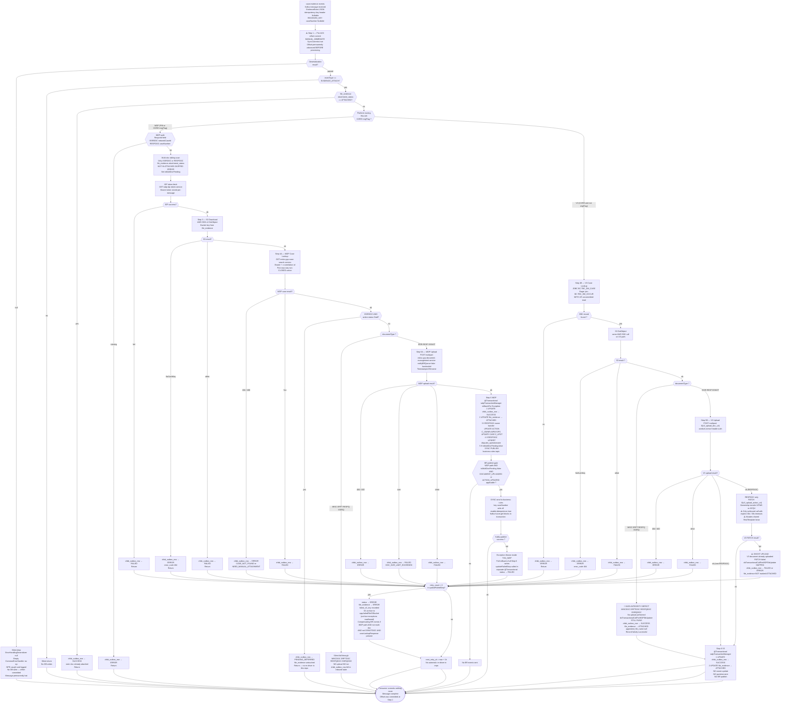

# WDP-COMP-15-EVIDENCE-CONSUMER
**Worldpay Dispute Platform — Component Reference**
*Version: 1.1 DRAFT | April 2026*
*Source-verified: 2026-04-18 against `wdp-evidence-consumer` @ v1.1.2 · Architect-confirmed: PENDING*

---

## ━━━ CORE SKELETON ━━━━━━━━━━━━━━━━━━━━━━━━━━━━━━━━━━━━━━
*Mandatory for every component regardless of type.*

---

## Identity

| Field                | Value                                                                          |
|----------------------|--------------------------------------------------------------------------------|
| **Name**             | `EvidenceConsumer`                                                             |
| **Type**             | `Kafka Consumer + Kafka Producer`                                              |
| **Repository**       | `wdp-evidence-consumer`                                                        |
| **Repository URL**   | `https://github.worldpay.com/GCP/wdp-evidence-consumer.git`                   |
| **Status**           | `✅ Production`                                                                 |
| **Doc status**       | `📝 DRAFT`                                                                     |
| **Sections present** | `Core \| Block B — Kafka Consumer \| Block C — Kafka Producer`                |

---

## Purpose

**What it does**

EvidenceConsumer attaches dispute evidence documents to active cases on the Worldpay Dispute Platform. It consumes file-upload notification events from the `case-evidence-events` Kafka topic — published upstream by InboundDisputeEventScheduler (COMP-12) after FileProcessor (COMP-11) stages documents to S3.

The Kafka event does not carry the document location. The S3 bucket and key are stored in the `wdp.file_evidence` database table, written by FileProcessor at ingest time. EvidenceConsumer reads that record to locate and download the document binary before any upload attempt.

The component supports two processing paths, controlled by the `coreMigrationFlag` runtime feature flag (env var `${core_migration_flag}`). The **WDP path** applies to all PIN-platform events and to CORE-platform events when the migration flag is enabled. It fetches an IDP Bearer token, validates required fields, computes multi-doc sibling-pending state, retrieves the dispute case via `mdvs-gcp-case-search-service`, uploads the document to `mdvs-gcp-document-management-service`, and publishes `BusinessRuleEvent` messages to the `business-rules` Kafka topic. The **V3 path** applies to legacy CORE-platform events when the migration flag is disabled. It skips IDP, skips field validation, skips multi-doc computation, queries IBM DB2 directly for case lookup, and uploads to the V3 Core legacy upload endpoint with `vantiveLicense` header auth. V3 path publishes no Business Rules events.

After a successful upload on the WDP path, the component performs additional ownership and questionnaire updates within the same database transaction. For `RESPDOC` document types where the action owner is `MERCHANT` and the action is not `CLOSED`, it transfers ownership to `WPAYOPS`, bumps `wdp.CASE.Z_UPDT`, and upserts `wdp.disputes_questionnaire` with the complete sorted list of attached file names for the action. Two Business Rules events are published for a successful RESPDOC on the WDP path — `ACTION_UPDATED` and `DOCUMENT_UPLOADED` — sent in alphabetical order.

**What it does NOT do**

- Does not create dispute cases — that is COMP-14 CaseCreationConsumer.
- Does not parse or inspect the binary content of evidence documents. S3 bytes are passed through opaquely to the downstream upload service.
- Does not handle NAP-platform dispute events.
- Does not use the DocumentManagementService for V3/CORE path uploads. V3 uses its own proprietary Core upload endpoint with `vantiveLicense` header auth, not an IDP Bearer token.
- Does not implement the transactional outbox pattern for downstream publishing. Business Rules Kafka events are published synchronously inside a JPA `@Transactional` block — a confirmed DEC-001 deviation.
- Does not retry any outbound call on failure. No Resilience4j circuit breaker is configured. `@EnableRetry` is present on the main class but there are zero `@Retryable` annotations anywhere in source.
- Does not delete or archive the staging S3 object after successful processing. The source file remains in place.
- Does not write any PAN or cardholder data. DEC-004 / DEC-019 are not applicable to this component.
- Does not process `MISCDOC`, `DRFTDOC`, `RESPQDOC`, or `ISSRQDOC` document types through any upload path. On the WDP path these silently fall through with no state change. On the V3 path they silently mark `file_evidence.attachment_status=ATTACHED` with no upload — a confirmed data-integrity defect (see Risks).

---

## Internal Processing Flow

The flow below reflects source as of v1.1.2. Note two distinct transactional boundaries (`TXN_WDP` vs `TXN_V3`) and the fact that IDP fetch, required-field validation, and multi-doc sibling computation are all WDP-path-only.

### Flow notes

- **Pre-ACK is unconditional.** Offset is committed at Step 1 regardless of downstream outcome. Every FAILED, ERROR, silent-skip, and silent-drop path operates on a message Kafka will never redeliver. Evidence loss (not duplication) is the primary risk.
- **WDP-path gating is narrower than prior documentation implied.** IDP token fetch, required-field validation, and multi-doc sibling computation all live inside the WDP-path branch. V3 path skips all three.
- **Two distinct transactional boundaries.** `TXN_WDP` (outbox + file_evidence + owner update + questionnaire + BR publish) and `TXN_V3` (outbox + file_evidence only). Both use `wdpTransactionManager` with `rollbackFor=Exception.class` and default propagation.
- **FAILED vs ERROR terminal states.** `ERROR` is written directly for field validation failure, S3 `NoSuchKey`, WDP case 404/400, V3 DB2 not-found, and upload 404/400. `FAILED` is written for IDP failure, S3 generic exception, WDP case 5xx, upload size/generic errors, V3 upload generic errors, and BR Kafka rollback. `FAILED` outcomes increment `retry_count`; when `retry_count > 2` the record escalates to `ERROR` and the S3 archive attempt fires.
- **`updateFailedStep` runs in its own `@Transactional(wdpTransactionManager)`** — separate from `TXN_WDP` / `TXN_V3`, so failure writes survive the rollback of the main transaction. It also resets `next_retry_at` to `now + 1h`. `error_code` defaults to `"500"` (`SYSTEM_ERROR`) when blank.
- **Compensating BR events on retry escalation (retry_count > 2):** fire only when (PIN OR CORE+migFlag) AND `!isMultiDocPending` AND status=ERROR AND documentType≠DSNOTDOC AND a valid `caseLookupResponse` is present. Same Kafka producer path as `TXN_WDP`. Documented here; not a separate code path from updateFailedStep.
- **PENDING_DEFERRED has no re-driver in this repository.** ISSRDOC against a Draft action writes `chbk_outbox_row=PENDING_DEFERRED`, leaves `file_evidence` untouched, and returns. Cross-component follow-up required to identify the re-driver.
- **Deserialization failure path:** `ErrorHandlingDeserializer` produces null, empty `CommonErrorHandler` no-ops, NPE logged, no DB record. Combined with pre-ACK this is a permanently silent loss path.

---

## Boundaries

### Inbound Interfaces

| Source | Protocol | Topic / Resource | Payload |
|--------|----------|-----------------|---------|
| COMP-12 InboundDisputeEventScheduler | Kafka | `case-evidence-events` | `EvidenceEvent` JSON. Key `eventId`, `eventType=EVIDENCE_ATTACH`, `sourceSystem`, `documentType`, `caseNumber`, `networkCaseId`, `cardNetwork`, `correlationId`, `recordType`. Does **not** carry S3 path. |
| COMP-11 FileProcessor (indirect via DB) | PostgreSQL | `wdp.file_evidence` | Written by FileProcessor at ingest time. Contains `s3_bucket`, `s3_key`, `file_name`, `attachment_status`, `file_job_id`. Read by this component at Step 2. |

### Outbound Interfaces

| Target | Protocol | Endpoint / Resource | Purpose | Auth | On failure |
|--------|----------|---------------------|---------|------|------------|
| wdp-idp-token-service | REST HTTP GET | `/merchant/gcp/idp-token/token` | Fetch Bearer token — WDP path only, once per message | none | `chbk_outbox_row → FAILED`; no retry |
| AWS S3 staging bucket | AWS SDK v2 | bucket from `file_evidence.s3_bucket` | Download evidence binary — Step 3 (both paths) | IAM instance profile | NoSuchKey → ERROR; other → FAILED |
| mdvs-gcp-case-search-service | REST HTTP GET | `/merchant/gcp/case-search/{platform}/case/lookup` | WDP case lookup — Step 4A | Bearer | 404/400 → ERROR; 5xx → FAILED |
| IBM DB2 BC schema | JDBC (WITH UR) | `BC.TBC_DM_CASE`, `BC.TBC_DM_OCCUR` | V3 case lookup — Step 4B | DB2 userid/password from K8s Secret | Record not found → ERROR |
| mdvs-gcp-document-management-service | REST HTTP POST multipart | `/merchant/gcp/document-management/{platform}/documents/{caseNumber}` | WDP upload — Step 5A. `notifyBRQueue=false` hardcoded. | Bearer | 404/400 → ERROR; size → FAILED; other → FAILED |
| V3 Core Upload Service | REST HTTP POST multipart | `${v3_upload_doc_url}` | V3 upload — Step 5B | `vantiveLicense` header (raw value, no scheme prefix) | 404/400 → ERROR; other → FAILED |
| V3 Core Update Action Service | REST HTTP PATCH | `${v3_upload_action_url}` | V3 RESPDOC ownership transfer — post-upload | `vantiveLicense` header | Exception → `GHOST UPLOAD` (doc persisted, DB not marked) → FAILED / ERROR |
| `business-rules` Kafka topic | Kafka (synchronous, inside `@Transactional`) | `spring.kafka.producer.businessEventTopic` | Trigger BR evaluation — Step 6 WDP only, `isMultiDocPending=false` | AWS MSK IAM | Exception → `TXN_WDP` rollback → `updateFailedStep` FAILED |
| AWS S3 failed-file bucket | AWS SDK v2 | `app.failedFileS3Bucket` — key `{sourceEvent}/{yyyy-MM-dd}/{originalFilename}` | Archive downloaded file when `retry_count > 2` escalates to ERROR | IAM instance profile | Exception silently swallowed |
| `wdp` PostgreSQL schema | JPA / PostgreSQL | 5 tables (see DB Ownership) | Status and outcome writes — Steps 2, 6 | Service-level DB credentials | See DB Ownership |

**Key architectural notes on the dependency surface:**

- **Only the V3 Update Action PATCH has explicit timeouts (30s connection + 30s read).** Every other REST call uses a shared `RestTemplate` bean with no explicit timeout — effectively unlimited.
- **⚠️ Shared-RestTemplate side effect.** The V3 PATCH implementation mutates the shared `RestTemplate` bean's request factory each time it fires. After the first V3 PATCH call, every subsequent REST call on the consumer inherits the 30s/30s factory. Before the first V3 PATCH on a given pod (e.g., a WDP-only pod with `coreMigrationFlag=true`), every REST call is effectively untimed. This is latent order-dependent global state.
- **⚠️ `vantiveLicense` property key case mismatch.** The Java key binds `app.disputeService.vantiveLicense`; the YAML key is `app.disputeService.vantivelicense` (all lowercase). Under Spring Boot 3 relaxed binding these do not match — the yml path is effectively dead unless the env var `${vantive_license}` is injected by the K8s Secret, which is the likely production source. Flagged as a config hygiene / potential bug.
- **No connection pool on outbound HTTP** — default JVM socket-per-call, no keep-alive pool management. Combined with concurrency=1, any hanging call halts the consumer.

---

## Database Ownership

### Tables Owned (written by this component)

| Schema.Table | Purpose | Key columns | Notes |
|--------------|---------|-------------|-------|
| `wdp.chbk_outbox_row` | Status tracking for inbound dispute events. Written on every processing outcome. | `id` (PK = `event.eventId`) | Shared table — written by multiple components. This consumer writes `status`, `updated_by` (constant `WCSEEVDC`), `updated_at`, `error_message`, `error_code`, `retry_count`, `next_retry_at`. `next_retry_at` reset to `now + 1h` by `updateFailedStep`. |
| `wdp.file_evidence` | Evidence document attachment status and metadata. | `id` (PK), `chbk_outbox_row_id`, `file_job_id`, `i_case` | `attachment_status` transitions: initial → `ATTACHED` on success, `ERROR` on escalation. Columns written: `attachment_status`, `appended_file_name` (DMS response `documentName` on WDP; uploaded file filename on V3), `attached_at`, `updated_at`, `updated_by=WCSEEVDC`, `failed_s3_key` (escalation only), `attachment_error` (escalation only). |
| `wdp.ACTION` | Case action record. Owner field updated after WDP document upload. | `I_ACTION_SEQ`, `I_CASE_ID` | Written only on WDP path, RESPDOC, when `C_OWNR=MERCHANT` AND action status ≠ `CLOSED`. Sets `C_OWNR=WPAYOPS`, `X_UPDT=WCSEEVDC`, `Z_UPDT=now`. Same transaction as `TXN_WDP`. |
| `wdp.CASE` | Central case record. Timestamp bumped when action owner changes. | `I_CASE` | Written only on WDP path RESPDOC owner transfer. Sets `X_UPDT=WCSEEVDC`, `Z_UPDT=now`. Same transaction as `TXN_WDP`. |
| `wdp.disputes_questionnaire` | Questionnaire record for the dispute action. Upserted with sorted-distinct list of attached file names. | `I_CASE`, `I_ACTION_SEQ` | Written only on WDP path, RESPDOC. Column `documents` (N_DOCUMENT_NAME list) set from `fileNameList` (sorted distinct `appended_file_name` for `fileJobId+networkCaseId`/`caseNumber`, filtered to `ATTACHED`). On insert only: `qstnnair_request="{}"`, `inserted_by=WCSEEVDC`, `inserted_at=now`. On both paths: `updated_by`, `updated_at`. Same transaction as `TXN_WDP`. |

**Transactional grouping:**

- `TXN_WDP` (method `doTransactionalCall`) — `@Transactional(wdpTransactionManager, rollbackFor=Exception.class)`. Wraps all five writes above plus the synchronous `business-rules` Kafka publish. A Kafka publish exception rolls back all DB writes.
- `TXN_V3` (method `doTransactionalCallForWDPDbUpdate`) — same transaction manager, but wraps only `chbk_outbox_row` + `file_evidence`. No owner update, no questionnaire, no BR publish.
- `updateFailedStep` runs in its own `@Transactional(wdpTransactionManager)` — separate from `TXN_WDP` / `TXN_V3`, so failure writes survive the rollback of the main transaction.

### Tables Read (not owned by this component)

| Schema.Table | Owned by | Why accessed |
|--------------|----------|--------------|
| `wdp.file_evidence` | COMP-11 FileProcessor (primary writer) | Step 2 idempotency check; Step 2 sibling scan for `isMultiDocPending` on WDP path ISSRDOC/RESPDOC only. Scan uses negation: pending = `NOT IN ("ATTACHED","SKIPPED","ERROR")` — rows in `null`, `FAILED`, `PENDING`, `PENDING_DEFERRED` count as pending. |
| `wdp.chbk_outbox_row` | Shared | Step 2 idempotency check. |
| `BC.TBC_DM_CASE` | Enterprise / IBM DB2 (V3 Core) | V3 path only — lookup by `I_CASE` (caseNumber) or `I_NTWK_CASE` (networkCaseId). `WITH UR` statement-level. |
| `BC.TBC_DM_OCCUR` | Enterprise / IBM DB2 (V3 Core) | V3 path only — occurrences eagerly fetched via `@OneToMany(FetchType.EAGER)` join. |

**No `@Version`, no `SELECT FOR UPDATE`, no `@UniqueConstraint` on any WDP entity accessed by this consumer.** Duplicate-upload race during rolling deployment has no DB-level guard.

---

## Key Architectural Decisions

| Decision | Detail | Severity |
|----------|--------|----------|
| DEC-001 DEVIATION — No transactional outbox | Business Rules Kafka `send()` is called synchronously inside `TXN_WDP`. Producer uses `KafkaTemplate.send(...).get()` — blocking. Failure modes: Kafka send failure → JPA rollback (recoverable). Kafka success then JPA rollback for a later write in the same transaction → ghost BR event with no corresponding DB state enters `business-rules` topic. | 🔴 HIGH |
| DEC-003 DEVIATION — Partition key is `caseNumber` | Inbound `case-evidence-events` key = `caseNumber` (`RECEIVED_KEY`, `@Nullable`). Outbound `business-rules` key = `caseNumber` (uppercased platform on payload). Neither conforms to the platform standard of `merchantId`. | 🟡 MEDIUM |
| DEC-005 DEVIATION — Pre-ACK at-most-once | Offset committed at Step 1 — before all DB reads, S3 download, upload, and DB writes. At-most-once. Any pod death after Step 1 and before `TXN_WDP` / `TXN_V3` commit results in permanent evidence loss. Kafka will not redeliver. | 🔴 HIGH |
| DEC-014 — No Resilience4j | Platform-wide void (WDP-DECISIONS.md v2.0). Confirmed absent — no `resilience4j` in `pom.xml`, no circuit breakers, no bulkheads. `spring-retry` is declared and `@EnableRetry` is on the main class, but there are zero `@Retryable` annotations anywhere in source. Spring-retry is effectively dead weight. | 🔴 HIGH (accepted platform condition) |
| DEC-019 — No clear PAN on persistent store | Not applicable — this component never touches PAN. Inbound event carries no PAN; all outbound calls and DB writes carry no PAN. | ✅ COMPLIES |
| DEC-020 DEVIATION — Full at-least-once idempotency | Four distinct gaps: (a) pre-ACK silent loss window; (b) deserialization silent drop; (c) no DB-level unique constraint on `file_evidence (chbk_outbox_row_id)` — rolling deploy duplicate upload possible; (d) compensating BR events depend on `caseLookupResponse` being present, so errors before case lookup do not emit compensating events. | 🔴 HIGH |
| DECISION — `coreMigrationFlag` gates the entire CORE path | Runtime feature flag from env var `${core_migration_flag}` via K8s secrets / configmap. External. Gates routing at Steps 2, 4, 5, and 6. Flag is fixed at container start — no runtime toggle, no reload mechanism in source. | — |
| DECISION — S3 staging object left in place | After successful upload the staging S3 object is not deleted, moved, or archived. Intentional. | — |
| DECISION — Single-threaded consumer | `ConcurrentKafkaListenerContainerFactory` does not call `setConcurrency()` → default 1. Combined with `maxPollRecords=500` and no REST timeouts, any hang blocks all subsequent messages on the same pod. | — |

---

## Risks and Constraints

| Risk | Impact | Status |
|------|--------|--------|
| 🔴 V3-path MISCDOC / DRFTDOC / RESPQDOC / ISSRQDOC silently mark `file_evidence=ATTACHED` without any upload. `doTransactionalCallForWDPDbUpdate` sits outside the document-type branch on the V3 path, so it fires regardless of whether an upload occurred. `appended_file_name` remains null. Record is falsely marked successful. | Data integrity defect — downstream consumers see `ATTACHED` rows with no corresponding document. Triggers on every CORE event of these types when migration flag is off. | 🔴 Active |
| 🔴 V3 PATCH failure leaks uploaded document. On RESPDOC V3 path, the document upload POST runs first, then the PATCH for ownership. PATCH exception propagates up, `TXN_V3` never runs, `chbk_outbox_row` goes to FAILED/ERROR and `file_evidence` is not marked ATTACHED. The document is already on V3 Core but WDP treats it as not attached. | Ghost document in V3 Core with no matching WDP state. Manual reconciliation required. | 🔴 Active |
| 🔴 WDP-path MISCDOC / DRFTDOC / RESPQDOC / ISSRQDOC silently fall through with no state change. `chbk_outbox_row` left in its inbound state, `file_evidence` untouched. Record stuck indefinitely. | No audit trail, no metric, no error. Invisible to monitoring. | 🔴 Active |
| 🔴 Evidence loss on pod death (pre-ACK). Any crash between Step 1 offset commit and `TXN_WDP` / `TXN_V3` commit results in permanently lost evidence. No recovery mechanism. | Data loss. | 🔴 Active |
| 🔴 Ghost BR events from Kafka-in-transaction. Kafka publish is synchronous inside `TXN_WDP`. Send success followed by a DB failure at a later write in the same transaction causes the BR message to exist in Kafka with no corresponding WDP state. | Downstream BR evaluation operates on non-existent state. | 🔴 Active |
| 🔴 No timeout on 7 of 8 outbound REST calls. Default JVM socket behaviour — effectively unlimited. Single consumer thread means any hang blocks the entire pod. | Availability / throughput. | 🔴 Active |
| 🔴 Silent drop on deserialization failure. Malformed messages are logged only — no DB write, no audit record, offset already committed. | Invisible message loss. | 🔴 Active |
| 🔴 No K8s health probes. No `livenessProbe`, `readinessProbe`, or `startupProbe` in `resources.yml`. Hung pods are not rolled. | Availability. | 🔴 Active |
| 🟠 Latent shared-RestTemplate mutation. The V3 PATCH call mutates the shared `RestTemplate` bean's request factory. After the first V3 PATCH, every subsequent REST call on the consumer inherits 30s/30s timeouts. Before the first V3 PATCH, timeouts are effectively infinite. Behaviour is order-dependent. | Difficult-to-reproduce timeout behaviour depending on traffic mix. | 🟠 Active |
| 🟡 DSNOTDOC publishes `business-rules` event with `source=""`. `ProcessorUtil.businessRuleEventForUploadDoc` has no DSNOTDOC branch — `source` stays at the initialiser empty string. Downstream routing in COMP-16 may misbehave. | Downstream-routing defect. | 🟡 Active |
| 🟡 Duplicate upload during rolling deploy. `maxUnavailable=0`, `maxSurge=1` means two replicas can briefly run concurrently. Both can pass the Step 2 idempotency check before either writes `ATTACHED`. No DB-level unique constraint on `file_evidence`. | Possible duplicate document in DMS/V3 for a brief window. | 🟡 Active |
| 🟡 No MDC enrichment. Zero `MDC.put` calls in source. `correlationId` and `caseNumber` appear in logs only when developer interpolates them into the message. OTel Java agent provides trace context but not business-key MDC. | Log-aggregation filtering is harder than it should be. | 🟡 Active |
| 🟡 Inbound `RECEIVED_KEY` is `@Nullable`. If upstream ever publishes with a null key, the message is still processed but ordering guarantee by `caseNumber` is broken for that message. `idempotency-key` header is also `@Nullable` and is forwarded to DMS and `business-rules` as-is. | Platform observability / ordering risk if upstream contract drifts. | 🟡 Active |
| 🟡 `vantiveLicense` YAML/Java key case mismatch. Java `@Value("${app.disputeService.vantiveLicense}")`; YAML `app.disputeService.vantivelicense` (all lowercase). Under Spring Boot 3 relaxed binding these normalise to different keys. Likely resolved in production via env var `${vantive_license}` injection but the YAML path is dead. | Config hygiene / latent failure if env var injection changes. | 🟡 Active |
| 🟡 No CPU limits/requests, no HPA, no PDB, no topology spread. Deployment is best-effort QoS with no scaling signal and no disruption protection. | Availability / throughput / node-eviction risk. | 🟡 Active |
| 🟢 Dead AWS static credentials. `app.aws.accessKey` / `app.aws.secretKey` never used when `isiamuser=true` (all deployed profiles). | Hygiene — remove for clarity. | 🟢 Low |
| 🟢 Deprecated `EntityManagerFactoryBuilder` import in `CoreDb2DataSourceConfig` and `USDataSourceConfig`. Works under Spring Boot 3.5.6 but will break on Spring Boot 4 upgrade. | Forward-compat. | 🟢 Low |
| 🟢 `spring.jpa.database-platform` set to `com.ibm.db2.jcc.DB2Driver` (JDBC driver class) instead of a Hibernate dialect. Hibernate silently falls back to auto-detection. | Misconfiguration — currently non-functional impact. | 🟢 Low |

---

## Planned and Incomplete Work

| Item | Detail | Type |
|------|--------|------|
| MISCDOC / DRFTDOC / RESPQDOC / ISSRQDOC upload path (WDP and V3) | The document-type enum includes these values but neither upload method has branches for them. Behaviour differs between paths: WDP leaves record untouched; V3 corrupts `file_evidence` to `ATTACHED` without upload. | 🔴 Functional |
| DSNOTDOC BR event `source` field is empty string | `ProcessorUtil.businessRuleEventForUploadDoc` has no branch for DSNOTDOC — `source` remains the initialiser `""`. Downstream routing in COMP-16 likely misbehaves. | 🟡 Downstream-routing |
| Dead `BRRSUP` constant | `ApplicationConstants` declares `RESP_DOC_UPLOAD = "BRRSUP"` but no code path references it. RESPDOC BR `source` is `BRMRUP` (merchant-upload). | 🧹 Hygiene |
| `vantiveLicense` YAML/Java key case mismatch | Java binds `vantiveLicense`; YAML key is `vantivelicense`. Spring relaxed binding does not bridge these. Likely resolved via env var override in production. | 🟡 Config |
| Shared-`RestTemplate` mutation | V3 PATCH sets `setRequestFactory` on the shared singleton. Order-dependent global state. | 🔴 Latent |
| `spring.jpa.database-platform` set to JDBC driver class | Should be a Hibernate dialect (e.g., `org.hibernate.dialect.DB2Dialect`). Hibernate silently auto-detects, so no runtime break, but semantically wrong. | 🟢 Config |
| Deprecated `EntityManagerFactoryBuilder` import | Works under Spring Boot 3.5.6; will break on Spring Boot 4.x. | 🟢 Forward-compat |
| SLF4J placeholder/argument mismatch | One log statement in the V3 upload path declares 3 placeholders but passes 2 arguments; `owner` silently dropped from the log. | 🧹 Hygiene |
| Dead no-op expressions in `RestInvoker` | Three lines contain `e.getErrorCode(); e.getStatusInfo();` where both getter results are discarded. | 🧹 Hygiene |
| Commented-out file-original-name in two upload helpers | Present in WDP and V3 upload paths. | 🧹 Hygiene |
| Commented-out `Files.copy` in `ProcessorUtil` | Legacy. | 🧹 Hygiene |
| `@Column("C_DUPLICATE_IND")` commented on `USActionEntity` | Possibly not yet in DB schema. | ⚠️ Incomplete |
| Dead AWS static key properties | `app.aws.accessKey` / `app.aws.secretKey` never used with `isiamuser=true`. | 🧹 Hygiene |
| Commented-out hardcoded Logstash destinations | Two `10.43.145.125:5044` entries in `logback-spring.xml`, superseded by env-var-driven destination. | 🧹 Hygiene |
| `@EnableRetry` present, zero `@Retryable` | spring-retry dep and annotation declared; no retry actually wired. Either remove or wire retries on idempotent outbound calls. | 🧹 Hygiene |
| OAuth2 starter deps unused | No `@EnableWebSecurity`, no JWT config in source. | 🧹 Hygiene |
| `modelMapper` bean unused | Declared, not referenced. | 🧹 Hygiene |
| `httpclient5` declared but v4 used | Apache HttpClient 5 on classpath; `RestInvoker` imports v4 types. | 🧹 Hygiene |
| PENDING_DEFERRED has no re-driver in this repo | ISSRDOC + Draft action writes PENDING_DEFERRED and returns. No component in this repo polls or re-drives these rows. Cross-component follow-up required. | ⚠️ Incomplete |
| No K8s liveness/readiness/startup probes | `resources.yml` does not configure any probe. Hung pods are not evicted by kubelet. | 🔴 Operational |
| No CPU limits/requests, no HPA, no PDB, no topology spread | Best-effort QoS; no scaling signal; no disruption protection. | 🟡 Operational |
| No MDC enrichment | Zero `MDC.put` calls. Business keys appear in logs only when explicitly interpolated. OTel provides trace context but not business-key MDC. | 🟡 Observability |

---

## Scaling and Deployment

| Parameter | Value | Source |
|-----------|-------|--------|
| Kubernetes resource type | `Deployment` | `resources.yml` |
| Replica count | `{{ replicas-wdp-evidence-consumer }}` — externalised placeholder; runtime value not in repo | `resources.yml` |
| Memory limit | `2048Mi` | `resources.yml` |
| Memory request | `1024Mi` | `resources.yml` |
| CPU limit | Not configured — best-effort QoS | `resources.yml` |
| CPU request | Not configured | `resources.yml` |
| HPA | Absent | — |
| Rolling update — maxSurge | `1` | `resources.yml` |
| Rolling update — maxUnavailable | `0` | `resources.yml` |
| minReadySeconds | `30` | `resources.yml` |
| PodDisruptionBudget | Absent | — |
| Topology spread constraints | Absent | — |
| Liveness / readiness / startup probes | **All absent** | `resources.yml` |
| Container port | `8082` | `resources.yml` |
| Container name template | `wdp-evidence-consumer${BRANCH_NAME_PLACEHOLDER}` | `resources.yml` |
| OpenTelemetry | Yes — pod annotation `instrumentation.opentelemetry.io/inject-java` | `resources.yml` |
| Spring Actuator | Yes — on port 8082; no `management.endpoints.web.exposure.include` override, so default `/actuator/health` and `/actuator/info` only | `pom.xml` |
| Prometheus / Micrometer | Not confirmed as actively exposed — no `management.endpoints.web.exposure.include` | — |
| Logstash appender | Yes — `LogstashTcpSocketAppender` → `${logstash_server_host_port}`, keep-alive 5 minutes, custom fields `Environment` / `AppName` | `logback-spring.xml` |
| Console appender | Yes — plain pattern alongside Logstash | `logback-spring.xml` |
| Secrets | `wdp-evidence-consumer-secrets`, `wdp-common-secrets`, `{{ ingressTLSsecretName }}` | `resources.yml` |

**Deployment note:** `maxUnavailable=0` and `maxSurge=1` means one extra pod is created before any old pod is removed during rolling updates. Combined with the absence of any DB-level unique constraint on `file_evidence`, two consumer replicas may process the same partition concurrently during the rollout window.

---

---

## ━━━ TYPE BLOCK B — KAFKA CONSUMER CONTRACTS ━━━━━━━━━━━━━

---

## Kafka Consumer Contracts

**Consumer framework:** Spring Kafka `@KafkaListener`
**Offset commit strategy:** ⚠️ Pre-ACK at-most-once — `MANUAL_IMMEDIATE` with `SyncCommits=true`. Offset committed at Step 1, before all processing. **DEC-005 deviation.**
**Error handling strategy:** No DLQ topic. No error table for deserialization failures (silent drop — see Processing Flow). Per-step error outcomes write to `wdp.chbk_outbox_row` as FAILED or ERROR. Consumer never halts.

---

### Topic: `case-evidence-events`

| Parameter | Value |
|-----------|-------|
| **Topic name (prod)** | `case-evidence-events` |
| **Topic name (dev/stg/cert)** | `case-evidence-events-dev` / `case-evidence-events-stg` / `case-evidence-events-cert` |
| **Config key** | `spring.kafka.consumer.topic` |
| **Consumer group (prod)** | `case-evidence-events-group` |
| **Consumer group (cert)** | `case-evidence-events-group-cert` |
| **Consumer group config key** | `spring.kafka.consumer.groupId` — injected from K8s secrets `wdp-evidence-consumer-secrets` / `wdp-common-secrets` |
| **AckMode** | `MANUAL_IMMEDIATE` with `SyncCommits=true` |
| **Offset commit timing** | ⚠️ Step 1 — before all downstream processing. At-most-once. |
| **Auth** | AWS MSK IAM (SASL_SSL, AWS_MSK_IAM, IAM login module + handler) |
| **Partition key (inbound)** | `caseNumber` — received via `KafkaHeaders.RECEIVED_KEY` as `String`, **`@Nullable`**. ⚠️ DEC-003 deviation (not `merchantId`). ⚠️ Ordering guarantee by `caseNumber` only holds when upstream sets a non-null key. |
| **`idempotency-key` header** | `@Nullable`. Forwarded to DMS upload call and to downstream `business-rules` producer as-is. If absent on inbound, downstream receives null. |
| **Concurrency** | `1` — default Spring Kafka (no `setConcurrency()` call) |
| **Max poll records** | `500` — `spring.kafka.consumer.maxPollRecords` |
| **Max poll interval** | `600000 ms` (10 minutes) — `spring.kafka.consumer.maxPollInterval` |
| **Auto-commit** | `ENABLE_AUTO_COMMIT=false` |
| **Auto-offset-reset** | `latest` |
| **Allow auto-create-topics** | `false` |
| **Key deserializer** | `StringDeserializer` |
| **Value deserializer** | `JsonDeserializer<EvidenceEvent>` wrapped in `ErrorHandlingDeserializer<EvidenceEvent>` |
| **Bad-payload behaviour** | `ErrorHandlingDeserializer` produces null; registered `CommonErrorHandler` is empty; NPE in listener caught and logged; no DB write; message permanently lost |
| **Ordering guarantee** | Per partition by `caseNumber` when key is non-null |

**EvidenceEvent payload — key fields**

| Field | Type | Description |
|-------|------|-------------|
| `eventId` | String | Primary key — maps to `chbk_outbox_row.id` and `file_evidence.chbk_outbox_row_id`. Used as idempotency key for the DB lookup. |
| `eventType` | String | Must equal `EVIDENCE_ATTACH` — events with other values are silently discarded at Step 2. |
| `sourceSystem` | String | Platform identifier — `PIN`, `CORE`, etc. Drives WDP vs V3 path routing with `coreMigrationFlag`. |
| `documentType` | String | One of `ISSRDOC`, `RESPDOC`, `DSNOTDOC`, `MISCDOC`, `DRFTDOC`, `RESPQDOC`, `ISSRQDOC`. |
| `caseNumber` | String | Required on WDP path for RESPDOC. Used as Kafka message key, URL path param to DMS, and case lookup key. |
| `networkCaseId` | String | Required on WDP path for ISSRDOC. Used as case lookup key. |
| `cardNetwork` | String | Used in ISSRDOC WDP case lookup query. |
| `correlationId` | String | Forwarded as `v-correlation-id` HTTP header. Auto-generated UUID if blank. |
| `recordType` | String | Used for `imageType` derivation on V3 path (ISSRDOC/DSNOTDOC) and RESPDOC V3 ownership transfer direction. |

**Note:** S3 path (`s3_bucket`, `s3_key`, `file_name`) is **not** carried in the Kafka payload. It is read from `wdp.file_evidence` using `event.eventId` as the lookup key at Step 2.

**Event classification / routing**

- `eventType == EVIDENCE_ATTACH` is the only accepted value. All others silently return.
- Routing:
  1. **Platform + migration flag.** `sourceSystem=PIN` OR (`sourceSystem=CORE` AND `coreMigrationFlag=true`) → **WDP path** (IDP, field-check, multi-doc, case-search REST, DMS upload, BR publish). `sourceSystem=CORE` AND `coreMigrationFlag=false` → **V3 path** (no IDP, no field-check, no multi-doc, DB2 lookup, V3 upload, no BR publish).
  2. **Document type.** Determines case-lookup key, upload request shape, owner-transfer behaviour, and Business Rules `source` field.

**On processing failure**

| Failure scenario | Behaviour |
|-----------------|-----------|
| Deserialization failure | Silent drop. No DB write. Message permanently lost. |
| Wrong `eventType` | Silent return. No DB writes. |
| Already processed (`attachment_status = ATTACHED`) | `chbk_outbox_row → SUCCESS` with note. Return. |
| Required field missing (WDP path only; ISSRDOC/RESPDOC) | `chbk_outbox_row → ERROR`. Return. |
| IDP token fetch failure (WDP only) | `chbk_outbox_row → FAILED`. No retry. |
| S3 `NoSuchKey` | `chbk_outbox_row → ERROR` (`error_code=404`). No retry. |
| S3 generic exception | `chbk_outbox_row → FAILED`. No retry. |
| WDP case lookup 404/400 | `chbk_outbox_row → ERROR` (CASE_NOT_FOUND or NEED_MANUAL_ATTACHMENT). No retry. |
| WDP case lookup 5xx | `chbk_outbox_row → FAILED`. No retry. |
| V3 DB2 record not found | `chbk_outbox_row → ERROR`. No retry. |
| ISSRDOC WDP, action status Draft | `chbk_outbox_row → PENDING_DEFERRED`. `file_evidence` untouched. No re-driver in this repo. |
| Document upload 404/400 | `chbk_outbox_row → ERROR`. No retry. |
| Document upload — size exceeded | `chbk_outbox_row → FAILED`, `error_code=DOC_SIZE_LIMIT_EXCEEDED`. No retry. |
| Document upload — other error | `chbk_outbox_row → FAILED`. No retry. |
| V3 RESPDOC PATCH failure | V3 document already uploaded. `TXN_V3` never runs. `chbk_outbox_row → FAILED` / ERROR, `file_evidence` not marked ATTACHED. Ghost document in V3 Core. |
| WDP path MISCDOC/DRFTDOC/RESPQDOC/ISSRQDOC | Silent fall-through. No DB state change. |
| V3 path MISCDOC/DRFTDOC/RESPQDOC/ISSRQDOC | 🔴 `TXN_V3` still fires. `chbk_outbox_row → SUCCESS`, `file_evidence → ATTACHED` with null `appended_file_name`. Record falsely successful. |
| BR Kafka publish exception | `TXN_WDP` rollback (all Step 6 writes undone) → `updateFailedStep` called in a separate transaction → `chbk_outbox_row → FAILED`. |
| Any FAILED outcome — retry escalation | `updateFailedStep` increments `retry_count` and sets `next_retry_at = now + 1h`. If `retry_count > 2`: status → `ERROR`, `file_evidence → ERROR`, failed-S3 archive attempted (exception silently swallowed), compensating BR events published when gate conditions met. Default `error_code = "500"` (`SYSTEM_ERROR`) when blank. |

---

---

## ━━━ TYPE BLOCK C — KAFKA PRODUCER CONTRACTS ━━━━━━━━━━━━━

---

## Kafka Producer Contracts

**Producer framework:** Spring Kafka `KafkaTemplate`
**Idempotent producer:** Yes — `ENABLE_IDEMPOTENCE=true`, `acks=all`, `max.in.flight.requests.per.connection=5`
**Auth:** AWS MSK IAM (SASL_SSL)
**Publish mode:** Synchronous — `kafkaTemplate.send(...).get()`. Called blocking inside `TXN_WDP` or (on compensating events) inside the `updateFailedStep` `@Transactional`. ⚠️ DEC-001 violation.
**Retry on publish failure:** No application-level retry. Producer-level retries may apply via Kafka client defaults. Publish exception rethrown → `@Transactional` rollback.

---

### Topic: `business-rules`

| Parameter | Value |
|-----------|-------|
| **Topic name (prod)** | `business-rules` |
| **Config key** | `spring.kafka.producer.businessEventTopic` |
| **Message key** | `caseNumber` — ⚠️ DEC-003 deviation, not `merchantId`. |
| **Serializer** | `JsonSerializer` |
| **Ordering guarantee** | Per partition by `caseNumber` |
| **Published on (primary)** | Successful WDP-path upload at Step 6 when `isMultiDocPending=false`. Publish happens inside `TXN_WDP`. |
| **Published on (compensating)** | `updateFailedStep` when `retry_count > 2` escalates status to ERROR AND (PIN OR CORE+migFlag) AND `!isMultiDocPending` AND `documentType ≠ DSNOTDOC` AND `caseLookupResponse` present. |
| **Multi-event semantics** | RESPDOC on WDP path emits **two** events per success: `ACTION_UPDATED` (owner transfer) AND `DOCUMENT_UPLOADED`. Events are sorted alphabetically by `eventType` before publishing — `ACTION_UPDATED` is sent first, then `DOCUMENT_UPLOADED`. |
| **Consumed by** | COMP-16 BusinessRulesProcessor |

**Message payload — `BusinessRuleEvent` key fields**

| Field | Notes |
|-------|-------|
| `eventType` | `DOCUMENT_UPLOADED` for upload event; `ACTION_UPDATED` for RESPDOC owner transfer. |
| `source` | Varies by documentType. `BRISUP` for ISSRDOC; `BRMRUP` for RESPDOC and DRFTDOC; `BRMCUP` for MISCDOC. ⚠️ `DSNOTDOC` has no branch in the builder — `source` is left as the initialiser empty string `""` when published (downstream-routing defect). `BRRSUP` is declared as a constant in the codebase but never used. |
| `caseNumber` | Case identifier — also the Kafka message key. |
| `platform` | ⚠️ Uppercased by this component before publish — `setPlatform(platform.toUpperCase())`. |
| `correlationId` | Set on every BR event inside the publish loop. |
| `startRuleGroup` | `DOCUMENT_ATTACHED_TO_OPEN_CASE` or `DOCUMENT_ATTACHED_TO_CLOSED_CASE` depending on action status at the time of publish. |
| `disputeStage` | WDP RESPDOC/DSNOTDOC: from DMS upload response `disputeStage`. Compensating path (escalated ERROR): from `actionResponse.getStageCode()`. ACTION_UPDATED: from `actionResponse.getStageCode()`. ⚠️ Same field, three different sources — flag for review. |
| `documentNameList` | Populated for DSNOTDOC on WDP path — appends `appendedFileName` to the BR event's file-name list. |
| Other case fields | Derived from case lookup response at Step 4A. |

**Payload and protocol notes**

- `notifyBRQueue=false` is hardcoded on the DMS upload call URL to prevent DocumentManagementService (COMP-37) from independently publishing its own BR event for the same upload.
- The `idempotency-key` forwarded from the inbound Kafka header is used as the `idempotency-key` header on the outbound Kafka message. If inbound was null, outbound is null.
- Publish is fully synchronous: `kafkaTemplate.send(message).get()`. If the future throws, the transaction rolls back.

---

*End of WDP-COMP-15-EVIDENCE-CONSUMER.md*
