# WDP-COMP-16-BUSINESS-RULES-PROCESSOR.md
**Worldpay Dispute Platform — Component Reference**
*Version: 1.1 | April 2026*
*Source: gcp-business-rules-processor | Audit basis: direct source read 2026-04-18 | Architect-confirmed: PENDING*

---

> ⚠️ **FRAMING NOTE — READ BEFORE USING THIS FILE**
>
> Earlier platform documents (WDP-ARCHITECTURE v1, pre-rebuild WDP-DECISIONS,
> pre-rebuild WDP-KAFKA) described several features of this component as
> "current" or "planned":
> — BRE named step checkpointing (VALIDATE, ENRICH, ATTACH_ISSUER_DOC)
> — Transactional outbox for outgoing-events publish
> — BREOutboxEvent payload type published by COMP-12
> — `source` field routing to different processing paths
>
> **None of these exist in the current codebase.** This file documents what
> is actually implemented in source as of the 2026-04-18 audit. The
> architectural features above are aspirational design, future planned
> work, or a prior version. They are marked NOT IMPLEMENTED throughout.
> DEC-011 and DEC-014 are formally VOID in WDP-DECISIONS.md v2.0.

---

## ━━━ CORE SKELETON ━━━━━━━━━━━━━━━━━━━━━━━━━━━━━━━━━━━━━━

---

## Identity

| Field | Value |
|---|---|
| **Name** | `BusinessRulesProcessor` (BRP) |
| **Type** | Kafka Consumer + Kafka Producer + REST API (admin/testing) |
| **Artefact** | `com.wp.wdp:business-rules-processor:2.1.1` |
| **Repository** | `gcp-business-rules-processor` |
| **Runtime** | Spring Boot 3.5.7 / Java 17 |
| **Listening port** | 8082 |
| **Servlet context path** | `/merchant/gcp/business-rules-processor` |
| **Status** | ✅ Production |
| **Doc status** | 📝 DRAFT |
| **Sections present** | Core \| Block A (REST — admin only) \| Block B (Kafka Consumer) \| Block C (Kafka Producer) |

---

## Purpose

**What it does**

The BusinessRulesProcessor (BRP) is the business rules **execution engine**
for the Worldpay Dispute Platform. It consumes dispute events from the
`business-rules` Kafka topic, evaluates configured rules against live case
and action data read directly from Aurora PostgreSQL, executes the matched
rule's actions by calling multiple downstream REST services, and publishes
the resulting outgoing event to the `outgoing-events` Kafka topic. It is
the central orchestrator of dispute lifecycle state changes for cases that
have reached the rule-evaluation stage.

BRP operates on two parallel platform paths with structurally similar but
not identical logic:
- **UK path** — `platform = NAP` → reads the `nap` schema via the
  `ukDataSource` / `ukTransactionManager`.
- **US path** — `platform ∈ {CORE, VAP, PIN}` → reads the `wdp` schema
  via the `wdpdataSource` (Primary) / `wdpTransactionManager`.

The US path carries two US-only action types (`US_OUTGOING_PRE_ARB`,
`MERCHANT_ACCEPT`) and a US-only recursive fallback rule-group
(`DOCUMENT_ATTACHED_TO_OPEN_CASE`) that has no UK equivalent.

Business rules are fetched fresh from PostgreSQL on every message — there
is no startup cache. Rules are evaluated in `sort_order` ascending; all
criteria within a rule must match (AND); the first matching rule wins.
Rule chaining via the matched rule's `applyRuleGroup` field allows a match
to trigger evaluation of a secondary rule group, accumulating actions
across groups. All case and action state changes resulting from rule
execution are applied via REST calls to downstream services — BRP writes
nothing to case or action tables directly.

The only direct database writes BRP performs are audit log entries
(`nap.br_case_audit_log`, `wdp.br_case_audit_log`) recording which rules
were evaluated (both matched and not-matched) per message.

BRP also exposes a single admin/testing REST endpoint — `PUT /event` —
that duplicates the Kafka consumer path. It is not a production ingress
path.

**What it does NOT do**

- Does NOT implement BRE step checkpointing. **DEC-011 ⛔ VOID.** No named
  processing steps (VALIDATE, ENRICH, ATTACH_ISSUER_DOC) exist as
  processing steps. `ATTACH_ISSUER_DOC` exists only as an action type
  enum value. In practice, redelivery cannot occur anyway because the
  offset is committed before processing begins.
- Does NOT use the transactional outbox pattern (DEC-001). Both Kafka
  publishes (`outgoing-events`, `internal-integration-events`) are direct
  synchronous calls. If the Kafka broker is unavailable, events are
  permanently lost.
- Does NOT call BusinessRulesService (COMP-31) for rule retrieval.
  **DEC-017** confirms all rule reads are direct JPA queries to
  `nap.rules` / `wdp.rules`. The `rules.audit-log-url` config property
  points to that service but is never read by any component in this
  codebase.
- Does NOT perform idempotency checks. The `idempotency-key` Kafka header
  is logged and passed through to the outgoing event — it is never
  checked against a processed-messages store.
- Does NOT persist any error state to a database error table. The
  `ErrorLogService` designed for this purpose is absent from the source
  tree — the autowire and call sites are commented out and the class
  itself does not exist. Errors surface as case action status `ERROR`
  with an owner of `WPAYOPS` and a SNOTE note added via the Notes Service
  REST call.
- Does NOT retry failed messages. All exceptions in the Kafka consumer
  listener are caught and logged. No DLQ, no retry, no halt — the message
  is silently dropped.
- Does NOT apply any circuit breaker, connection timeout, or read timeout
  on any downstream dependency. **DEC-014 ⛔ VOID** — Resilience4j is
  absent from this component. `spring-retry` and `spring-aspects` are
  declared in `pom.xml` but no `@Retryable` or `RetryTemplate` is wired
  anywhere.
- Does NOT route processing based on the `source` field of the inbound
  event (BRISUP, BRMRUP, BRMCUP). The `source` field is logged only.
- Does NOT propagate a populated `v-correlation-id` header to downstream
  REST calls. The header is read from MDC, but no filter or interceptor
  populates MDC from inbound Kafka headers — so the header value is
  effectively `null` for all outbound REST calls in production.
- Does NOT handle `LATAM` platform messages. `LATAM` is defined in
  constants but has no routing branch — the message is silently dropped.

---

## Internal Processing Flow

```mermaid
flowchart TD
    %% Entry points
    K_IN["Kafka message received<br/>@KafkaListener on business-rules topic<br/>KafkaConsumer.onMessage()<br/>Headers: RECEIVED_KEY, OFFSET,<br/>RECEIVED_PARTITION, idempotency-key, event-timestamp"]
    R_IN["PUT /event<br/>BusinessRulesProcessorController<br/>JWT Bearer auth<br/>No ACK, no idempotency"]
    LOG_SOURCE["Log source field only<br/>BRISUP / BRMRUP / BRMCUP<br/>not used for routing"]
    ACK["⚠️ DEC-005 VIOLATION<br/>Kafka offset committed BEFORE processing<br/>acknowledgment.acknowledge() line 38<br/>processRulesEvent() line 41<br/>At-most-once — pod crash = message lost"]
    ENTRY_REST["REST entry — no ACK<br/>calls processRulesEvent() directly"]

    %% Platform routing
    DEC_PLATFORM{{"platform field?"}}
    DROP_PLATFORM["Silent return<br/>No processing, no outgoing event<br/>LATAM and unknown platforms dropped"]

    %% Common pipeline up to case load
    IDP["IDP token fetch — lazy<br/>First REST call triggers<br/>KafkaTokenHolder.getToken()<br/>GET wdp-idp-token-service<br/>Bearer token in ThreadLocal<br/>No timeout / No retry / No circuit breaker"]
    DEC_IDP{{"IDP call success?"}}
    FAIL_IDP["BusinessRulesException SYSTEM_ERROR<br/>propagates to outer catch<br/>caseDetails remains null<br/>finally runs — outgoing event skipped"]
    DB_CASE["Case + Action load — DB read<br/>UK: nap.case + nap.ACTION via ukDataSource<br/>US: wdp.CASE + wdp.ACTION via wdpdataSource<br/>Eager load all actions<br/>Filter: caseNumber + platform + updatedTimestamp"]
    DEC_CASE{{"Case found?"}}
    FAIL_CASE["BadRequestException caught<br/>caseDetails = null<br/>Processing continues to finally<br/>Outgoing event skipped"]
    ACTION_DERIVE["Action detail extraction — in memory<br/>currentActionDetails @ actionSequence<br/>previousActionDetails @ sequence-1<br/>latestActionDetails @ max sequence"]
    DEC_STAGE{{"disputeStage non-blank AND<br/>mismatches currentAction.caseStage?"}}
    FAIL_STAGE["BadRequestException thrown<br/>caught by outer catch<br/>Outgoing event attempted in finally"]
    DEC_MIG{{"migrationStatus == 'y'?"}}
    MIG_UPDATE["REST PUT case-actions-service<br/>Set action DRAFT to OPEN<br/>Exit processBusinessRules<br/>Outgoing event still sent in finally"]

    %% FCHG/RCAL guard — CORRECTED from audit
    DEC_FCHG{{"actionType == FCHG AND<br/>prior FCHG without paired RCAL?"}}
    FCHG_FAIL["updateCase called (NAP line 207)<br/>Case update via REST<br/>Exit processBusinessRules<br/>Outgoing event still sent in finally<br/>(no WEXQUE claim — unverified)"]

    %% Rules
    DB_RULES["Rule group fetch — DB read<br/>UK: nap.rules / US: wdp.rules<br/>WHERE rule_group_name = startRuleGroup<br/>AND active = true ORDER BY sort_order ASC<br/>Fresh query per message — no cache"]
    DEC_RULES_FOUND{{"Rules found?"}}
    FAIL_NO_RULES["REST PUT action to OPEN<br/>BadRequestException thrown<br/>Outgoing event attempted in finally"]
    EVAL["Rule criteria evaluation — in memory<br/>Iterate rules in sort_order ASC<br/>AND logic within rule — all criteria must match<br/>First-match-wins — loop breaks<br/>Audit list built for matched + not-matched"]
    DEC_MATCH{{"Rule matched?"}}
    DEC_ISSUER_GRP{{"group == ISSUER_DOCUMENTS?"}}
    NO_MATCH_FALLBACK["Recursive retry<br/>with CASE_RESPONSE group"]
    NO_MATCH_OTHER["REST PUT action to OPEN<br/>Save audit log<br/>BadRequestException thrown<br/>Outgoing event attempted in finally"]
    CHAIN{{"applyRuleGroup non-blank?"}}
    CHAIN_NEXT["Fetch next rule group<br/>Accumulate actions via mapActions<br/>Loop continues"]

    %% Issuer doc
    DEC_ISSUER_DOC{{"Pend action with fieldValue1 AND<br/>caseNetwork in VISA/MASTERCARD/MAESTRO?"}}
    ISSUER_DOC["POST document-management-service<br/>Check / add issuer documents<br/>No timeout / retry / circuit breaker"]
    DEC_ISSUER_FAIL{{"Issuer doc call success?"}}
    ISSUER_SWALLOW["Exception caught and swallowed<br/>Logged 'Failed: Issuer Document API'<br/>Processing continues with null response"]

    %% US-only DOCUMENT_ATTACHED_TO_OPEN_CASE fallback
    DEC_DOC_ATTACHED{{"US only:<br/>issuerDocAddedToCase == true AND<br/>applyRuleGroup blank?"}}
    DOC_ATTACHED_FALLBACK["US only — recursive evaluate<br/>group DOCUMENT_ATTACHED_TO_OPEN_CASE<br/>NAP path has no equivalent"]

    %% Audit + actions
    AUDIT_LOG["Audit log write — JPA<br/>UK: nap.br_case_audit_log<br/>US: wdp.br_case_audit_log<br/>All evaluated rules written (matched + not-matched)<br/>Standalone Spring-Data JPA transaction<br/>No @Transactional on save<br/>On failure: exception re-thrown to outer catch"]
    DEC_SKIP{{"action.skipToProcess non-blank AND<br/>all other action fields blank?"}}
    SKIP_EXIT["REST PUT action to OPEN<br/>Exit processRuleActions<br/>Outgoing event still sent in finally"]
    US_PRE_UPDATE["US only — updateCaseAction isActionUpdate=true<br/>(pre-action-write case/action update)"]
    RULE_ACTIONS["Rule action execution — multiple REST calls<br/>Add: POST case-actions-service<br/>Questionnaire: PUT questionnaire-service<br/>Document update: PUT document-management-service<br/>Contest: POST contest-service<br/>Accept: POST accept-service<br/>US only: US_OUTGOING_PRE_ARB, MERCHANT_ACCEPT"]
    CASE_UPDATE["Case + action update — REST<br/>PUT case-actions-service (status, owner)<br/>PUT case-management-service (status, pend dates)<br/>UK: single call / US: second updateCaseAction isActionUpdate=false<br/>Failures on update: swallowed"]

    %% DMT001 conditional publish
    DEC_DMT001{{"sendMerchantCommunication == DMT001?"}}
    DMT001_PUB["Publish ActionEvent<br/>internal-integration-events topic<br/>Synchronous blocking .get()<br/>caseNumber as message key<br/>On failure: SNOTE via REST — swallowed"]

    %% Finally
    FINALLY["finally block entered — always"]
    DEC_OUTGOING{{"caseDetails != null AND<br/>currentActionDetails != null?"}}
    NO_OUTGOING["No outgoing event published<br/>Case load had failed"]
    MAP_EVENT["Build OutgoingEvent<br/>BusinessRuleEvent fields passed through<br/>DB-loaded entity fields enriched<br/>⚠️ actionStatus reflects initial-load state<br/>NOT post-rule-execution state"]
    PUB_OUTGOING["Publish OutgoingEvent<br/>outgoing-events topic<br/>Synchronous blocking .get()<br/>caseNumber as message key<br/>Headers: idempotency-key + event-timestamp<br/>On failure: SNOTE via REST — swallowed"]

    %% Token cleanup — UK vs US asymmetry
    UK_IDP_CLEAR["UK: tokenService.clear()<br/>INSIDE finally block<br/>NAPRulesProcessServiceImpl line 157"]
    US_IDP_CLEAR["US: tokenService.clear()<br/>OUTSIDE finally block<br/>USRulesProcessServiceImpl line 144<br/>🟡 ThreadLocal leak risk if finally throws"]

    %% Edges
    K_IN --> LOG_SOURCE
    LOG_SOURCE --> ACK
    ACK --> DEC_PLATFORM
    R_IN --> ENTRY_REST
    ENTRY_REST --> DEC_PLATFORM

    DEC_PLATFORM -->|"NAP (UK)"| IDP
    DEC_PLATFORM -->|"CORE / VAP / PIN (US)"| IDP
    DEC_PLATFORM -->|"LATAM / unknown"| DROP_PLATFORM

    IDP --> DEC_IDP
    DEC_IDP -->|"fail"| FAIL_IDP
    DEC_IDP -->|"success"| DB_CASE
    DB_CASE --> DEC_CASE
    DEC_CASE -->|"not found"| FAIL_CASE
    DEC_CASE -->|"found"| ACTION_DERIVE
    ACTION_DERIVE --> DEC_STAGE
    DEC_STAGE -->|"stage mismatch"| FAIL_STAGE
    DEC_STAGE -->|"match or blank"| DEC_MIG
    DEC_MIG -->|"null or not 'y'"| MIG_UPDATE
    DEC_MIG -->|"y"| DEC_FCHG
    DEC_FCHG -->|"unpaired FCHG"| FCHG_FAIL
    DEC_FCHG -->|"guard passed"| DB_RULES
    DB_RULES --> DEC_RULES_FOUND
    DEC_RULES_FOUND -->|"null or empty"| FAIL_NO_RULES
    DEC_RULES_FOUND -->|"found"| EVAL
    EVAL --> DEC_MATCH
    DEC_MATCH -->|"no match"| DEC_ISSUER_GRP
    DEC_ISSUER_GRP -->|"ISSUER_DOCUMENTS group"| NO_MATCH_FALLBACK
    NO_MATCH_FALLBACK --> EVAL
    DEC_ISSUER_GRP -->|"other group"| NO_MATCH_OTHER
    DEC_MATCH -->|"match"| CHAIN
    CHAIN -->|"non-blank"| CHAIN_NEXT
    CHAIN_NEXT --> DB_RULES
    CHAIN -->|"blank — chain ends"| DEC_ISSUER_DOC

    DEC_ISSUER_DOC -->|"condition met"| ISSUER_DOC
    ISSUER_DOC --> DEC_ISSUER_FAIL
    DEC_ISSUER_FAIL -->|"fail"| ISSUER_SWALLOW
    DEC_ISSUER_FAIL -->|"success"| DEC_DOC_ATTACHED
    ISSUER_SWALLOW --> DEC_DOC_ATTACHED
    DEC_ISSUER_DOC -->|"condition not met"| DEC_DOC_ATTACHED
    DEC_DOC_ATTACHED -->|"US yes"| DOC_ATTACHED_FALLBACK
    DOC_ATTACHED_FALLBACK --> AUDIT_LOG
    DEC_DOC_ATTACHED -->|"UK or US no"| AUDIT_LOG

    AUDIT_LOG --> DEC_SKIP
    DEC_SKIP -->|"skip-to-process"| SKIP_EXIT
    DEC_SKIP -->|"normal — US"| US_PRE_UPDATE
    DEC_SKIP -->|"normal — UK"| RULE_ACTIONS
    US_PRE_UPDATE --> RULE_ACTIONS
    RULE_ACTIONS --> CASE_UPDATE
    CASE_UPDATE --> DEC_DMT001
    DEC_DMT001 -->|"DMT001"| DMT001_PUB
    DEC_DMT001 -->|"other"| FINALLY
    DMT001_PUB --> FINALLY

    FAIL_IDP --> FINALLY
    FAIL_CASE --> FINALLY
    FAIL_STAGE --> FINALLY
    MIG_UPDATE --> FINALLY
    FCHG_FAIL --> FINALLY
    FAIL_NO_RULES --> FINALLY
    NO_MATCH_OTHER --> FINALLY
    SKIP_EXIT --> FINALLY

    FINALLY --> DEC_OUTGOING
    DEC_OUTGOING -->|"either null"| NO_OUTGOING
    DEC_OUTGOING -->|"both non-null"| MAP_EVENT
    MAP_EVENT --> PUB_OUTGOING

    %% Token cleanup asymmetry
    PUB_OUTGOING --> UK_IDP_CLEAR
    PUB_OUTGOING --> US_IDP_CLEAR
    NO_OUTGOING --> UK_IDP_CLEAR
    NO_OUTGOING --> US_IDP_CLEAR
```

**Flow notes**

- **⚠️ Pre-ACK (DEC-005 violation):** The offset is committed on line 38
  of `KafkaConsumer.java` before `processRulesEvent()` is called on line 41.
  At-most-once delivery. If the pod dies after the commit and before
  processing completes, the message is permanently lost.
- **DEC-011 ⛔ VOID — not implemented:** There are no named BRE steps,
  no checkpoint table, no checkpoint writes, and no checkpoint reads on
  redelivery. On redelivery, all processing restarts from the beginning.
  In practice, redelivery cannot occur because the offset is committed
  before processing.
- **FCHG / RCAL guard (corrected):** The guard checks for FirstChargeback
  action types (`FCHG`) paired with a following RecAll (`RCAL`). When the
  guard fails (unpaired FCHG), the UK code path calls `updateCase(...)` —
  it does NOT route the case to a WEXQUE queue. Earlier documentation
  using the label "FCMG" and the "Set queue to WEXQUE" behaviour was
  incorrect.
- **US-only recursive fallback:** When the issuer-doc check returns
  `issuerDocAddedToCase=true` and the matched rule's `applyRuleGroup` is
  blank, the US path recursively evaluates rules under
  `DOCUMENT_ATTACHED_TO_OPEN_CASE`. The UK path has no equivalent branch.
- **US-only action handling:** `US_OUTGOING_PRE_ARB` and `MERCHANT_ACCEPT`
  action types are dispatched only on the US path. In addition, the US
  path calls `updateCaseAction` twice per rule action — once before and
  once after — whereas the UK path calls it once after.
- **`source` field:** Present on the inbound event and logged. Not used
  for routing or branching anywhere in the flow.
- **Finally block:** The `outgoing-events` publish always executes in a
  `finally` block — regardless of whether rules matched, whether actions
  succeeded, or whether exceptions were thrown. The only suppression
  condition is `caseDetails == null OR currentActionDetails == null`.
- **`actionStatus` in outgoing event:** Reflects the action state at the
  time of the initial DB load. The case/action REST updates happen after
  this load. The outgoing event may not reflect the final post-rule state
  that COMP-18 NotificationOrchestrator consumes.
- **Token cleanup asymmetry:** UK clears the IDP token inside the finally
  block (`NAPRulesProcessServiceImpl` line 157). US clears it outside the
  finally block (`USRulesProcessServiceImpl` line 144). If anything in
  the US finally block throws an unchecked exception that escapes the
  inner try/catch, the ThreadLocal token leaks to the next message on
  the same thread.

---

## Boundaries

### Inbound Interfaces

| Source | Protocol | Endpoint / Topic / Trigger | Payload |
|---|---|---|---|
| COMP-12 InboundDisputeEventScheduler (Scheduler4, `component=BUSINESS_RULES` rows) | Kafka | `business-rules` topic | `BusinessRuleEvent` |
| COMP-15 EvidenceConsumer (WDP path, `isMultiDocPending=false`) | Kafka | `business-rules` topic | `BusinessRuleEvent` |
| COMP-23 CaseManagementService (after material case writes) | Kafka | `business-rules` topic | `BusinessRuleEvent` |
| COMP-24 CaseActionService (after action create/update) | Kafka | `business-rules` topic | `BusinessRuleEvent` |
| COMP-25 NotesService (non-SNOTE writes only) | Kafka | `business-rules` topic | `BusinessRuleEvent` |
| ⚠️ COMP-14 CaseCreationConsumer candidacy | Kafka | `business-rules` topic | Unverified — open question |
| Admin / test caller | REST | `PUT /merchant/gcp/business-rules-processor/event` | `BusinessRuleEvent` |

### Outbound Interfaces

| Target | Protocol | Endpoint / Topic / Resource | Purpose | On failure |
|---|---|---|---|---|
| COMP-18 NotificationOrchestrator | Kafka | `outgoing-events` topic | Primary output — published in finally | Log + SNOTE via REST — swallowed |
| COMP-39 NAPOutcomeProcessor; COMP-40 VisaResponseQuestionnaire | Kafka | `internal-integration-events` topic | DMT001-only publish | Log + SNOTE via REST — swallowed (`isErrorOccured` flag ignored by caller) |
| IDP Token Service (wdp-idp-token-service) | REST GET | `/merchant/gcp/idp-token/token` | Bearer token for all downstream calls | `BusinessRulesException(SYSTEM_ERROR)` — propagates, outgoing event skipped |
| Case Management Service (COMP-23) | REST PUT | `/merchant/gcp/case-management/{platform}/case/{caseNumber}` | Case status, pend dates, liability updates | Swallowed; SNOTE added |
| Case Actions Service (COMP-24) | REST POST / PUT | `/merchant/gcp/case-actions/{platform}/case/{caseNumber}/internal-actions` + `.../action` | Add / update actions | POST failure: re-throws `BusinessRulesException`. PUT failure: swallowed |
| Contest Service (COMP-20) | REST POST | `/merchant/gcp/contest/{platform}/case/{caseNumber}` | Pre-arb / reject / represent | 400: `updateErrorStatus` + re-throw. Other: re-throw |
| Accept Service (COMP-19) | REST POST | `/merchant/gcp/accept/{platform}/case/{caseNumber}/accept` | AcceptFull / MerchantAccept (US) | Exception propagates uncaught to outer catch |
| Questionnaire Service (COMP-26) | REST PUT | `/merchant/gcp/questionnaire/...` | Save questionnaire for pre-arb / represent / reject | Re-throw; `updateErrorStatus` called |
| Document Management Service (COMP-37) | REST POST / PUT | `.../documents/{caseNumber}/issuerdoc` + `.../document/{caseNumber}/action/{actionSequence}` | Issuer-doc check; document update | Issuer-doc: swallowed. Update: re-throw + `updateErrorStatus` |
| Notes Service (COMP-25) | REST POST | `/merchant/gcp/notes/{platform}/case/{caseNumber}` | Add SNOTE on error paths | Propagates; may be silently caught by caller |
| Aurora PostgreSQL (UK — `nap` schema) | JDBC | `ukDataSource` / `ukEntityManagerFactory` / `ukTransactionManager` | Case + rule reads, audit log write | Exception re-thrown to outer catch — swallowed |
| Aurora PostgreSQL (US — `wdp` schema) | JDBC | `wdpdataSource` (Primary) / `wdpEntityManagerFactory` / `wdpTransactionManager` | Case + rule reads, audit log write | Exception re-thrown to outer catch — swallowed |

---

## Database Ownership

### Tables Owned (written by this component)

| Schema.Table | Purpose | Key columns | Notes |
|---|---|---|---|
| `nap.br_case_audit_log` | Audit log of every rule evaluated (matched and not-matched) for each UK/NAP message | `id` (PK, seq `nap.br_case_audit_log_id_seq` allocationSize=1), `i_case`, `c_action_seq`, `rule_grp_name`, `rule_id`, `rule_name`, `is_valid`, `created_at` | No `@Transactional` on save — implicit Spring-Data JPA transaction per `saveAll`. No unique constraint — duplicate rows possible if DEC-005 is fixed without adding dedup |
| `wdp.br_case_audit_log` | Same for US (CORE/VAP/PIN) messages | Same columns, sequence `wdp.br_case_audit_log_id_seq` allocationSize=1 | Same semantics as UK audit log |

No outbox tables (`bre_orchestration_outbox`, `outgoing_event_outbox`,
`notification_orchestration_outbox`) are read or written by this component.

No database error table exists — `ErrorLogService` is absent from the
source tree.

### Tables Read (not owned by this component)

| Schema.Table | Owned by | Why accessed |
|---|---|---|
| `nap.case` | COMP-23 CaseManagementService | Load full case entity for UK processing |
| `nap.ACTION` | COMP-23 / COMP-24 | Eager-loaded with `nap.case` — all actions for the case |
| `nap.rules` | COMP-31 BusinessRulesService | Fetch active rules by group name (fresh per message) |
| `nap.rule_criterion` | COMP-31 | Eager-loaded with `nap.rules` — criteria per rule |
| `nap.rule_action` | COMP-31 | Eager-loaded with `nap.rules` — actions to execute on match |
| `nap.rule_group` | ⚠️ Owner TBC | Lazy-loaded rule group metadata |
| `wdp.CASE` | COMP-23 CaseManagementService | Load full case entity for US processing |
| `wdp.ACTION` | COMP-23 / COMP-24 | Eager-loaded with `wdp.CASE` |
| `wdp.rules` | COMP-31 BusinessRulesService | Fetch active rules by group name (fresh per message) |
| `wdp.rule_criterion` | COMP-31 | Eager-loaded with `wdp.rules` |
| `wdp.rule_action` | COMP-31 | Eager-loaded with `wdp.rules` |
| `wdp.rule_group` | ⚠️ Owner TBC | Lazy-loaded rule group metadata |

Rule query (identical pattern UK / US):
`WHERE rule_group_name = :ruleGroupName AND active = true ORDER BY sort_order ASC`

---

## Configuration and Scaling

| Parameter | Value | Notes |
|---|---|---|
| Deployment type | Kubernetes `Deployment` | Continuously running JVM |
| Replica count | `{{ replicas-gcp-business-rules-processor }}` | XL-Deploy placeholder — numeric value lives outside repo |
| HPA | None | No `HorizontalPodAutoscaler` resource defined |
| PodDisruptionBudget | None | No `PodDisruptionBudget` resource defined |
| Memory request | 2048 Mi | |
| Memory limit | 4096 Mi | |
| CPU request | Not set | Burstable QoS class |
| CPU limit | Not set | |
| QoS class | Burstable | Derived from memory req<limit, no CPU constraints |
| Rollout strategy | RollingUpdate — maxSurge=1, maxUnavailable=0 | |
| minReadySeconds | 30 | |
| Topology spread | maxSkew=1, topologyKey=`kubernetes.io/hostname`, whenUnsatisfiable=ScheduleAnyway | Soft placement preference |
| Container port | 8082 | Application + Actuator on same port |
| Service | ClusterIP, 8082 → 8082 | |
| Ingress | nginx, CORS enabled, TLS via `{{ ingressTLSsecretName }}` | 3 rules: external, internal, default — all path `/merchant/gcp/business-rules-processor` |
| Liveness probe | `GET /merchant/gcp/business-rules-processor/livez` on 8082 | initialDelay 40s, period 10s, timeout 5s, failureThreshold 3 |
| Readiness probe | `GET /merchant/gcp/business-rules-processor/readyz` on 8082 | initialDelay 30s, period 10s, timeout 5s, failureThreshold 3 |
| Startup probe | Not configured | |
| Image pull policy | Always | |
| Kafka consumer concurrency | 1 (Spring default) | `setConcurrency` never called |
| Database connection pool | HikariCP defaults (not tuned) | Per datasource — UK and US |
| Observability | OpenTelemetry Java agent injected (`opentelemetry-operator-system/default`) | Also Spring Actuator + Logstash appender |
| Actuator endpoints | `info`, `health`, `prometheus` | Same port (8082) as application |
| K8s secrets mounted | `business-rules-processor-secrets`, `wdp-common-secrets`, `{{ ingressTLSsecretName }}` | |
| Security | OAuth2 Resource Server (JWT) | CSRF disabled; whitelist: `/actuator/health`, `/livez`, `/readyz` |

---

## Key Architectural Decisions

| Decision | ADR reference | Notes |
|---|---|---|
| Rules read directly from DB — BusinessRulesService REST not called | DEC-017 — **ACTIVE** | Direct JPA to `nap.rules` / `wdp.rules`. The `rules.audit-log-url` config is a dead reference |
| Offset committed BEFORE processing begins (line 38 ack, line 41 process) | DEC-005 — **DEVIATION** | At-most-once. Message lost if pod crashes after commit. In practice prevents duplicates but creates a data-loss window |
| No BRE step checkpointing | DEC-011 — **⛔ VOID** | Architecture previously assumed this existed. It does not. Formally voided April 2026 |
| No transactional outbox for Kafka publish | DEC-001 — **DEVIATION** | Both `outgoing-events` and `internal-integration-events` are direct synchronous calls. Broker unavailability = permanent event loss |
| Partition key is `caseNumber` on both producer topics | DEC-003 — **DEVIATION (producer side)** | Consumer inbound key is `merchantId` — upstream-compliant |
| No Resilience4j on any dependency | DEC-014 — **⛔ VOID** | Confirmed absent platform-wide. Accepted platform condition |
| `outgoing-events` publish always in `finally` block | Local decision | Outgoing event published regardless of rule match or action success. Suppressed only if case/action load failed. `actionStatus` may be stale |
| Error state via REST SNOTE — not a DB error table | Local decision | `ErrorLogService` class absent. Error visibility depends on SNOTE propagation through Notes Service, which can also fail silently |
| UK audit-log cleanup in finally; US cleanup outside finally | Local decision — asymmetry | UK: `tokenService.clear()` inside finally. US: outside finally. ThreadLocal leak risk on US path |

---

## Risks and Constraints

| Severity | Risk | Consequence |
|---|---|---|
| 🔴 HIGH | At-most-once delivery (DEC-005 deviation — line 38 ack precedes line 41 process) | Pod crash after commit, before outgoing publish, loses dispute event permanently. No DLQ, no error table, no redelivery. Violates platform at-least-once guarantee for financial events |
| 🔴 HIGH | No transactional outbox (DEC-001 deviation) | Broker outage at publish loses the outgoing event. Case state may be updated via REST while the outgoing event to COMP-18 NotificationOrchestrator is never delivered — silent split-brain |
| 🔴 HIGH | Inconsistent failure handling across rule actions | Add action failure re-throws (message dropped); Questionnaire / Case update / Issuer doc / Outgoing Kafka publish failures swallowed (silent inconsistency); Contest 400 re-throws; Accept failure propagates uncaught. Outcome depends on which action the matched rule triggers |
| 🔴 HIGH | `ErrorLogService` absent — no DB error table | Failures recorded only as SNOTE via REST. If SNOTE itself fails, no persisted error trail. No audit for silent drops on deserialisation or post-ACK crash |
| 🟡 MEDIUM | No timeouts on any REST dependency | Plain `new RestTemplate()` — no connection or read timeout. Hung downstream stalls consumer thread indefinitely. Consumer concurrency=1 means one hung thread stalls all message processing |
| 🟡 MEDIUM | No circuit breakers (DEC-014 VOID — accepted platform condition) | Cascading failure from any downstream has no automatic isolation |
| 🟡 MEDIUM | `actionStatus` staleness in outgoing event | COMP-18 NotificationOrchestrator routes on this field. Post-rule REST updates are not reflected in the finally-block publish. Downstream routing receives stale state |
| 🟡 MEDIUM | `v-correlation-id` always null in production | `RestClientInvoker` reads the header from MDC but no filter / interceptor populates MDC from inbound Kafka or REST. All outbound correlation is effectively broken |
| 🟡 MEDIUM | US path ThreadLocal token leak risk | `tokenService.clear()` is outside the finally block on the US path. If anything between finally close and that line throws (currently the inner try/catch swallows, so practically impossible today), the ThreadLocal token leaks to the next message on the same thread |
| 🟡 MEDIUM | Admin `PUT /event` endpoint | Duplicates the Kafka consumer path with no throttling, no idempotency, no offset management. JWT-authenticated but no documented runbook. Could be invoked in ways that bypass Kafka ordering |
| 🟡 MEDIUM | No unique constraint on `br_case_audit_log` | If DEC-005 is ever remediated (post-ACK), duplicate audit rows become possible without a DB-level guard |
| 🟢 LOW | `source` field routing not implemented | Logged only. If future differentiation by BRISUP / BRMRUP / BRMCUP is needed, the field exists but requires code changes |
| 🟢 LOW | LATAM platform silently dropped | Defined in constants, no routing branch. Any LATAM message produces no outgoing event and no error signal |
| 🟢 LOW | `ATTACH_ISSUER_DOC` exists only as an action type enum | Not a processing step. DEC-011 documentation references are invalid |
| 🟢 LOW | Dead pom dependencies | `org.apache.httpcomponents:httpclient:4.5.14` declared but never wired. `spring-boot-devtools` at compile scope. `spring-retry` / `spring-aspects` declared but no `@Retryable` or `RetryTemplate` |
| 🟢 LOW | Dead configuration | `spring.kafka.show-sql: true` is under the wrong prefix (has no effect). `case.retry_count` / `case.retry_delay` never `@Value`-injected. `rules.audit-log-url` never read |

---

## Planned Changes

- ⚠️ **OPEN QUESTION:** COMP-14 CaseCreationConsumer — does it publish to
  `business-rules` topic after case creation? (Listed in WDP-HANDOVER
  open questions.)
- ⚠️ **OPEN QUESTION:** `v-correlation-id` propagation gap — architect
  decision whether to add an MDC filter for inbound Kafka headers.
- ⚠️ **OPEN QUESTION:** US-path token-cleanup asymmetry — defect or
  intentional? Candidate for symmetry fix with UK.
- ⚠️ **OPEN QUESTION:** FCHG guard failure path — current source calls
  `updateCase(...)`; the prior "queue to WEXQUE" description is
  unverified. Needs confirmation from the owning team whether the
  `updateCase` behaviour is the intended final semantic.
- ⚠️ **OPEN QUESTION:** Admin `PUT /event` runbook — should this endpoint
  remain enabled in production, or be gated by profile?

No planned work is confirmed for this component as of April 2026. Review
quarterly.

---

---

## ━━━ TYPE BLOCK A — REST API CONTRACTS ━━━━━━━━━━━━━━━━━━━

> ⚠️ **Admin / testing endpoint only.** This REST endpoint duplicates the
> Kafka consumer path but has no throttling, no idempotency check, and no
> offset management. It should not be called in normal platform operation.

---

## REST API Contracts

**Authentication model:** OAuth2 Resource Server (JWT). CSRF disabled.
Whitelisted paths (no auth required): `/actuator/health`, `/livez`,
`/readyz`. All other paths — including `PUT /event` — require a valid
Bearer JWT.

**Base URL pattern:** `https://<host>/merchant/gcp/business-rules-processor`

---

### Endpoint: `PUT /event`

**Purpose:** Trigger business rules processing directly, bypassing Kafka.
Intended for testing and administrative use.
**Caller(s):** Unknown — admin / testing use only. No documented
production caller.
**Auth required:** Bearer JWT

**Request**

| Field | Type | Required | Description |
|---|---|---|---|
| Body | `BusinessRuleEvent` | Yes | Same payload schema as the Kafka consumer processes |

**Response — Success**

| HTTP Status | Condition | Body |
|---|---|---|
| 200 | Processing completed without exception propagating out of the controller | Not documented in source |

**Response — Error**

| HTTP Status | Condition | Body |
|---|---|---|
| 401 | Missing or invalid JWT | Spring Security default |
| 4xx / 5xx | Mapped via `GlobalExceptionHandler` | Error body not enumerated in this audit |

**Notes**

- Calls `processorService.processRulesEvent()` directly — the same method
  invoked by the Kafka consumer.
- No Kafka offset to commit — the DEC-005 pre-ACK data-loss window does
  not apply to this path.
- No Kafka-level ordering or dead-letter handling — this endpoint
  bypasses all Kafka consumer mechanics.
- No idempotency check. No throttling. No rate limiting.
- No documented runbook.

---

---

## ━━━ TYPE BLOCK B — KAFKA CONSUMER CONTRACTS ━━━━━━━━━━━━━

---

## Kafka Consumer Contracts

**Consumer framework:** Spring Kafka `@KafkaListener` — single listener
annotation on `KafkaConsumer.onMessage()` (`KafkaConsumer.java:24`)
**Container factory:** `businessRuleListener`
**Offset commit strategy:** Pre-ACK (at-most-once) — **DEC-005 deviation**
**Error handling strategy:** No-op anonymous `CommonErrorHandler` —
exceptions caught and logged; no DLQ, no retry, no halt

---

### Topic: `business-rules`

| Parameter | Value |
|---|---|
| **Topic name (prod)** | `business-rules` |
| **Config key (topic)** | `spring.kafka.consumer.topic` |
| **Consumer group (prod)** | `business-rules-group-prod` |
| **Config key (group)** | `spring.kafka.consumer.groupId` |
| **AckMode** | `MANUAL_IMMEDIATE` |
| **syncCommits** | `true` |
| **Offset commit timing** | ⚠️ **BEFORE processing** — `acknowledgment.acknowledge()` on line 38 precedes `processRulesEvent()` on line 41 of `KafkaConsumer.java`. **DEC-005 deviation — at-most-once delivery** |
| **Concurrency** | 1 (Spring default — `setConcurrency` never called) |
| **enable.auto.commit** | `false` |
| **allow.auto.create.topics** | `false` |
| **auto.offset.reset** | `latest` |
| **max.poll.interval.ms** | `${max_poll_interval}` — env-injected |
| **max.poll.records** | `${max_poll_records}` — env-injected |
| **session.timeout.ms** | `${session_timeout_ms}` — env-injected |
| **heartbeat.interval.ms** | `${heartbeat_interval_ms}` — env-injected |
| **Key deserializer** | `StringDeserializer` |
| **Value deserializer** | `ErrorHandlingDeserializer<>(JsonDeserializer<BusinessRuleEvent>)` |
| **Error handler** | `new CommonErrorHandler() {}` — anonymous no-op |
| **Security** | `SASL_SSL` / `AWS_MSK_IAM` |
| **Rebalance listener** | None — not determinable from current audit |

**Message payload structure — `BusinessRuleEvent`**

| Field | Type | Description |
|---|---|---|
| `eventType` | String | Event classifier (pass-through to outgoing event) |
| `platform` | String | `NAP` / `CORE` / `VAP` / `PIN` — routing field |
| `source` | String | `BRISUP` / `BRMRUP` / `BRMCUP` — **logged only, no routing** |
| `caseNumber` | String | Used for DB lookups and as downstream Kafka message key |
| `actionSequence` | Integer | Target action sequence within the case |
| `previousActionSequence` | Integer | Previous action reference |
| `disputeStage` | String | Validation gate against case action stage |
| `migrationStatus` | String | Guard field — `'y'` allows normal flow |
| `type` | String | Pass-through |
| `documentNameList` | Array | Pass-through |
| `updateType` | String | Pass-through |
| `correlationId` | String | Pass-through |

**Inbound Kafka headers processed**

| Header | Field populated on event | Usage |
|---|---|---|
| `RECEIVED_KEY` | `keyMerchantId` | Logged only |
| `OFFSET` | Set on event | Logged only |
| `RECEIVED_PARTITION` | Set on event | Logged only |
| `idempotency-key` | `idempotencyId` | Pass-through to outgoing event; **NOT** used for duplicate detection |
| `event-timestamp` | `eventTimestamp` | Pass-through to outgoing event |

**Event classification / routing**

Routing is based solely on the `platform` field (first-level decision in
`RulesProcessorServiceImpl`). No branching on `source`, `eventType`, or
publisher identity. The consumer cannot distinguish between messages from
different publishers (COMP-12, COMP-15, COMP-23, COMP-24, COMP-25).

**On processing failure**

| Failure scenario | Behaviour |
|---|---|
| Deserialization error | `ErrorHandlingDeserializer` invokes the no-op `CommonErrorHandler`. Message silently dropped. Offset committed (pre-ACK) |
| Any exception in `processRulesEvent()` | Caught by `try/catch(Exception e)` in `KafkaConsumer.onMessage()`; stack trace logged. No DLQ, no halt, no retry. Offset already committed. Message dropped |
| Pod crash after ACK, before publish | Message permanently lost. No recovery path |

---

---

## ━━━ TYPE BLOCK C — KAFKA PRODUCER CONTRACTS ━━━━━━━━━━━━━

---

## Kafka Producer Contracts

**Producer framework:** Spring Kafka `KafkaTemplate` (two bean instances:
`kafkaTemplate` for ActionEvent, `kafkaOutgoingTemplate` for OutgoingEvent)
**Idempotent producer:** Yes — `enable.idempotence=true`, `acks=all`,
`max.in.flight.requests.per.connection=5`
**Publish mode:** Synchronous — blocking `.get()` on
`CompletableFuture` for all publishes
**Retry on publish failure:** None wired. `retries`, `linger.ms`,
`batch.size`, `compression.type`, `delivery.timeout.ms`,
`request.timeout.ms`, `transactional.id` are NOT set — client defaults
apply
**Auth:** `SASL_SSL` / `AWS_MSK_IAM`

---

### Topic: `outgoing-events` (primary output — always in finally)

| Parameter | Value |
|---|---|
| **Topic name (prod)** | `outgoing-events` |
| **Config key** | `spring.kafka.outgoing.topic` |
| **Message key** | `outgoingEvent.getCaseNumber()` — **caseNumber, not merchantId** ⚠️ DEC-003 deviation |
| **Ordering guarantee** | Per-partition by `caseNumber` (not per-merchant) |
| **Published on** | Always in `finally` block, subject to `caseDetails != null AND currentActionDetails != null` |
| **Consumed by** | COMP-18 NotificationOrchestrator |
| **@Transactional** | No |
| **Transactional outbox (DEC-001)** | **NOT implemented** — direct Kafka publish; no outbox table. Broker unavailable = event permanently lost |
| **Serializer** | `JsonSerializer` |
| **Headers forwarded** | `idempotency-key` (from inbound), `event-timestamp` (from inbound) |
| **Failure handling** | `handleOutgoingFailure` logs + calls `notesService.addErrorNotes` (REST POST) for SNOTE. Outer `try/catch(Throwable)` swallows. `isErrorOccured` flag returned is ignored by the caller |

**Message payload — `OutgoingEvent`**

| Field | Source | Notes |
|---|---|---|
| `eventType` | `businessRuleEvent.eventType` | Pass-through |
| `platform` | `businessRuleEvent.platform` | Pass-through |
| `caseNumber` | `businessRuleEvent.caseNumber` | Pass-through; also message key |
| `actionSequence` | `businessRuleEvent.actionSequence` | Pass-through |
| `previousActionSequence` | `businessRuleEvent.previousActionSequence` | Pass-through |
| `type` | `businessRuleEvent.type` | Pass-through |
| `disputeStage` | `businessRuleEvent.disputeStage` | Pass-through |
| `documentNameList` | `businessRuleEvent.documentNameList` | Pass-through |
| `updateType` | `businessRuleEvent.updateType` | Pass-through |
| `correlationId` | `businessRuleEvent.correlationId` | Pass-through |
| `level1Entity` – `level5Entity` | `caseDetails.level1Entity` – `level5Entity` | DB-enriched |
| `caseNetwork` | `caseDetails.caseNetwork` | DB-enriched |
| `actionStatus` | `currentActionDetails.actionStatus` | **⚠️ STALE — reflects state at initial DB load, not post-rule state** |
| `expirationDate` | `currentActionDetails.expiryDueDate` | DB-enriched |
| `responseDueDate` | `currentActionDetails.responseDueDate` | DB-enriched |
| `dateReceivedByAcquirer` | `currentActionDetails.actionProcessedDate` | DB-enriched |
| `migrationStatus` | `currentActionDetails.migrationStatus` | DB-enriched |
| `actionCode` | `currentActionDetails.actionType` | DB-enriched |
| `caseType` | `caseDetails.caseSpecialHandling` | DB-enriched |
| `documentIndicator` | `currentActionDetails.merchantDocumentIndicator` | DB-enriched |
| `networkCaseId` | `caseDetails.ntwkCaseId` | DB-enriched |
| `hybridMerchant` | `caseDetails.ntwkProgramType` | DB-enriched |

**Payload notes**

- The `actionStatus` field is the most operationally significant field
  for COMP-18's downstream routing. Because the outgoing event is built
  in the `finally` block from the initially-loaded entity (not reloaded
  after rule-driven REST updates), any staleness here propagates to
  COMP-18 routing.
- `actionStatus` suppressed only when `caseDetails` or
  `currentActionDetails` is null (case load failed). In that case no
  event is published at all.

---

### Topic: `internal-integration-events` (conditional — DMT001 only)

| Parameter | Value |
|---|---|
| **Topic name (prod)** | `internal-integration-events` |
| **Config key** | `spring.kafka.producer.topic` |
| **Message key** | `event.getCaseNumber()` — **caseNumber, not merchantId** ⚠️ DEC-003 deviation |
| **Ordering guarantee** | Per-partition by `caseNumber` |
| **Published on** | Matched rule action has `sendMerchantCommunication == "DMT001"`. Can fire alongside the `outgoing-events` publish for the same message |
| **Consumed by** | COMP-39 NAPOutcomeProcessor (NAP platform filter only); COMP-40 VisaResponseQuestionnaire (non-null `visaResponseIds` filter only) |
| **@Transactional** | No |
| **Transactional outbox (DEC-001)** | **NOT implemented** — direct Kafka publish |
| **Serializer** | `JsonSerializer` |
| **Failure handling** | `handleFailure` logs + SNOTE via REST. Outer `try/catch(Throwable)` swallows. Returns `isErrorOccured=true` flag — **not re-thrown** |

**Payload notes**

- Payload is `ActionEvent` — fields populated from the matched rule and
  the case entity. Exact field list not enumerated in this audit.
- DMT001 is a string literal from `ApplicationConstants`. Both UK and US
  paths gate on the same literal.

---

*End of file.*
