# WDP-COMP-16-BUSINESS-RULES-PROCESSOR.md
**Worldpay Dispute Platform — Component Reference**
*Version: 1.3 | May 2026*
*Source: gcp-business-rules-processor | Audit basis: forensic behavioural read 2026-05-15 | Architect-confirmed: PENDING*

---

## ━━━ CORE SKELETON ━━━━━━━━━━━━━━━━━━━━━━━━━━━━━━━━━━━━━━

---

## Identity

| Field | Value |
|---|---|
| **Name** | `BusinessRulesProcessor` (BRP) |
| **Type** | Kafka Consumer + Kafka Producer + REST API (admin/testing) |
| **Artefact** | `com.wp.wdp:business-rules-processor:2.2.2` |
| **Repository** | `gcp-business-rules-processor` |
| **Runtime** | Spring Boot 3.5.7 / Java 17 |
| **Listening port** | 8082 |
| **Servlet context path** | `/merchant/gcp/business-rules-processor` |
| **Status** | ✅ Production |
| **Doc status** | 📝 DRAFT — forensic audit, architect confirmation pending |
| **Sections present** | Core \| Block A (REST — admin only) \| Block B (Kafka Consumer) \| Block C (Kafka Producer) \| Business Logic Inventory \| UK vs US Divergence Ledger \| Scenario Matrix |

---

## Purpose

**What it does**

The BusinessRulesProcessor (BRP) is the business rules **execution engine** for the Worldpay Dispute Platform. It consumes dispute events from the `business-rules` Kafka topic, evaluates configured rules against live case and action data read directly from Aurora PostgreSQL, executes the matched rule's actions by calling multiple downstream REST services, and publishes the resulting outgoing event to the `outgoing-events` Kafka topic. It is the central orchestrator of dispute lifecycle state changes for cases that have reached the rule-evaluation stage.

BRP operates on two parallel platform paths with structurally similar but not identical logic:

- **UK path** — `platform = NAP` → reads the `nap` schema via the `ukDataSource` / `ukTransactionManager`.
- **US path** — `platform ∈ {CORE, VAP, PIN}` → reads the `wdp` schema via the `wdpDataSource` (Primary) / `wdpTransactionManager`.

Platform comparison is `equalsIgnoreCase`. Any other value, including `LATAM` and unknown / misspelled platforms, falls through to a silent return — no log line, no outgoing event, no outbox record.

The US path carries:
- Three US-only criteria: `DISPUTE_TYPE`, `HYBRID_MERCHANT`, `PRENOTE_INDICATOR`.
- Six US-only action types: `US_OUTGOING_PRE_ARB`, `MERCHANT_ACCEPT`, `AUTO_ACCEPT` (alongside `ACCEPT_FULL`), `RETRIVAL_RESPONSE`, `SET_CASE_STATUS`, and the recursive fallback rule-group `DOCUMENT_ATTACHED_TO_OPEN_CASE`.
- One US-only writeOff path absence: `SPLIT_ACTION` (NAP-only).

The UK path carries:
- One UK-only action: `DOCUMENT_FOUND`.
- A live migration guard. The US migration guard block exists in source but is commented out — US runs the FCHG path unconditionally.

Business rules are fetched fresh from PostgreSQL on every message — there is no startup cache. Rules are evaluated in `sort_order` ascending; all criteria within a rule must match (AND); the first matching rule wins; the rule-evaluation loop then breaks. Rule chaining via the matched rule's `applyRuleGroup` field allows a match to trigger evaluation of a secondary rule group, accumulating actions across groups. **There is no depth limit or cycle-detector on the `applyRuleGroup` chain — a self-referential rule group is an unbounded loop.**

All case and action state changes resulting from rule execution are applied via REST calls to downstream services — BRP writes nothing to case or action tables directly.

The only direct database writes BRP performs are:
- Audit log entries — `nap.br_case_audit_log` (UK) or `wdp.br_case_audit_log` (US) — recording which rules were evaluated (matched and not-matched) per message.
- BRE Orchestration Outbox rows — `WDP.bre_orchestration_outbox` — recording per-event processing status (PUBLISHED, SUCCESS, FAILED, ERROR, PENDING_DEFERRED, SKIPPED).

BRP also exposes a single admin/testing REST endpoint — `PUT /event` — that duplicates the Kafka consumer path. It is not a production ingress path.

**What it does NOT do**

- Does NOT implement BRE step checkpointing. **DEC-011 ⛔ VOID.** No named processing steps (VALIDATE, ENRICH, ATTACH_ISSUER_DOC) exist as processing steps. `ATTACH_ISSUER_DOC` exists only as an action type enum value. The BRE Orchestration Outbox is **event-level** status tracking, not BRE step checkpoints.
- Does NOT use a true transactional outbox for Kafka publish (DEC-001 PARTIAL). The `WDP.bre_orchestration_outbox` records per-event processing state, but the Kafka publishes to `outgoing-events` and `internal-integration-events` remain direct synchronous calls — they are not relayed from the outbox by a separate publisher. If the Kafka broker is unavailable at publish time, the Kafka event is permanently lost; the outbox FAILED row is a recovery signal, but there is no automatic re-drive of the Kafka publish from the outbox.
- Does NOT call BusinessRulesService (COMP-31) for rule retrieval. **DEC-017** confirms all rule reads are direct JPA queries to `nap.rules` / `wdp.rules`. The `rules.audit-log-url` config property points to that service but is never read.
- Does NOT route processing based on the `source` field of the inbound event (BRISUP, BRMRUP, BRMCUP). The `source` field is logged only.
- Does NOT propagate a populated `v-correlation-id` header to downstream REST calls. The header is received on `PUT /event` but not used; no Kafka MDC populator exists; all outbound correlation IDs are effectively null.
- Does NOT apply circuit breakers, connection timeouts, or read timeouts on any downstream dependency. **DEC-014 ⛔ VOID** — Resilience4j is absent.
- Does NOT have a database error table for failure persistence. `ErrorLogService` is absent from the source tree. Errors are recorded as outbox rows with status FAILED and as case action status `ERROR` (owner `WPAYOPS`) plus SNOTE notes added via the Notes Service REST call.
- Does NOT have a Kafka DLQ. Bad payloads are silently dropped by the anonymous no-op `CommonErrorHandler`.
- Does NOT enforce JWT scope / role / authority on `PUT /event`. Any valid JWT from any trusted issuer is fully authorised.
- Does NOT retry failed Kafka publishes. Outgoing publish failures surface as SNOTE only.
- Does NOT detect or break `applyRuleGroup` cycles. A self-referential or mutually-referential rule chain produces an unbounded loop.
- Does NOT guard concurrent execution at application level. The per-message state held in Spring singleton service instance fields is safe **only** because consumer concurrency is hard-pinned at 1 and operationally the REST endpoint is unused — increasing either would corrupt state.

---

## Internal Processing Flow

```mermaid
flowchart TD
    K_IN[Kafka message received<br/>business-rules topic<br/>BusinessRuleEvent and headers]
    R_IN[REST PUT slash event<br/>Admin and testing only<br/>JWT Bearer auth]

    DEC_EVID{eventId present on event}
    PERSIST[Persist outbox row<br/>Dedup on idempotencyId and eventTimestamp<br/>Status PUBLISHED]
    DEC_PERSIST{Outbox id returned}
    DROP_NULL[Log error<br/>Message dropped<br/>Offset NOT committed]
    ACK_EVID[Commit offset BEFORE processRulesEvent<br/>At-most-once delivery]
    ACK_PERSIST[Commit offset after persist<br/>BEFORE processRulesEvent]
    ENTRY_REST[Calls processRulesEvent directly<br/>No offset commit]

    CONVERGE[RulesProcessorServiceImpl<br/>processRulesEvent orchestrator]

    PREV[Previous-event outbox guard<br/>JPA SELECT on bre_orchestration_outbox<br/>Same case, prior events unresolved]
    DEC_PREV_EMPTY{Any unresolved prior events}
    DEC_PREV_ERROR{Any prior status ERROR}
    PREV_ERROR_WRITE[Update outbox to ERROR<br/>Return - processing bypassed]
    PREV_DEFER_WRITE[Update outbox to PENDING_DEFERRED<br/>Return - awaits earlier events]
    GUARD_END[End - no finally entered]

    DEC_PLATFORM{Platform value}
    DROP_PLATFORM[Silent return<br/>No log, no outgoing, no outbox<br/>LATAM and unknown platforms]

    IDP[IDP token fetch - lazy<br/>Stored in ThreadLocal<br/>No timeout, no retry, no CB]
    DEC_IDP{Token fetch successful}
    FAIL_IDP[BusinessRulesException SYSTEM_ERROR<br/>Outbox FAILED<br/>caseDetails remains null]

    DB_CASE[Case and Action load via JPA<br/>UK nap.case and nap.ACTION<br/>US wdp.CASE and wdp.ACTION]
    DEC_CASE{Case row found}
    FAIL_CASE[BadRequestException caught<br/>caseDetails set null<br/>Continues to finally]

    ACTION_DERIVE[Action detail extraction in memory<br/>current at actionSequence<br/>latest at max sequence<br/>previous at sequence minus one]

    DEC_STAGE{disputeStage matches case stage}
    FAIL_STAGE[BadRequestException stage mismatch<br/>Outbox FAILED<br/>finally still publishes outgoing]

    DEC_PATH{UK or US path}
    DEC_MIG_UK{UK only - migrationStatus equals Y}
    UK_MIG_NOTMIG[Non-migrated path<br/>updateCaseAction DRAFT to OPEN<br/>Exit processBusinessRules]
    NOTE_US_MIG[US migration guard commented out<br/>Runs FCHG path unconditionally]

    DEC_FCHG{checkFirstChargeback paired}
    FCHG_FAIL[updateCase REST call<br/>Sets owner WPAYOPS<br/>Routes case to WEXQUE work-queue<br/>Both UK and US<br/>Exit - finally publishes outgoing]

    DB_RULES[Rule group fetch via JPA<br/>active true<br/>ORDER BY sort_order ASC]
    DEC_RULES_FOUND{Rules returned}
    FAIL_NO_GROUP[PUT action to OPEN<br/>throw BadRequestException<br/>Outbox FAILED]

    EVAL[Rule criteria evaluation in memory<br/>AND within rule, first-match-wins<br/>Audit list built]
    DEC_MATCH{Any rule matched}
    DEC_ISSUER_GRP{startRuleGroup is ISSUER_DOCUMENTS}
    NO_MATCH_FALLBACK[Recursive eval with CASE_RESPONSE]
    NO_MATCH_OTHER[PUT action to OPEN<br/>saveAuditLog<br/>return null]

    DEC_CHAIN{applyRuleGroup non-blank}
    CHAIN_NEXT[Loop with applyRuleGroup as new group<br/>Accumulate actions via mapActions<br/>No depth limit, no cycle guard]

    DEC_ISSUER_PRE{Issuer-doc precondition met}
    ISSUER_DOC[POST document-management-service<br/>No timeout, no retry, no CB]
    ISSUER_SWALLOW[Exception swallowed<br/>Continue with null response]

    DEC_DOC_ATTACHED{US only - issuerDocAddedToCase true and applyRuleGroup blank}
    DOC_ATTACHED_FALLBACK[US only - recursive eval<br/>group DOCUMENT_ATTACHED_TO_OPEN_CASE<br/>UK has no equivalent]

    AUDIT_LOG[Audit log write via JPA saveAll<br/>UK nap.br_case_audit_log<br/>US wdp.br_case_audit_log<br/>No Transactional - implicit per-call TX]

    DEC_SKIP{isSkipToProcess true}
    SKIP_EXIT[PUT action to OPEN<br/>US only - if caseStatus DRAFT then updateCase to OPEN<br/>Exit processRuleActions]

    DISPATCH_UK[UK action dispatch<br/>Exclusive else-if<br/>One top-level branch fires]
    DISPATCH_US[US action dispatch<br/>Independent if blocks<br/>CTM and SDO and WriteOff can all fire]
    ACTIONS[Rule action execution - multiple REST calls<br/>POST case-actions, PUT questionnaire,<br/>PUT document update, POST contest, POST accept]

    CASE_UPDATE[Case and action update via REST<br/>UK single call, US double call pre and post<br/>Swallowed with Retryable on CaseService]

    DEC_DMT001{sendMerchantCommunication equals DMT001}
    DMT001_PUB[Publish ActionEvent<br/>internal-integration-events topic<br/>Sync blocking get<br/>Key caseNumber]

    OUTBOX_SUCCESS[Outbox write via JPA saveAndFlush<br/>bre_orchestration_outbox<br/>Status SUCCESS<br/>Cross-datasource for UK]
    OUTBOX_FAILED[Outbox write status FAILED<br/>Error message persisted]

    FINALLY[finally block - always reached]
    DEC_OUTGOING{caseDetails and currentActionDetails both non-null}
    NO_OUTGOING[No outgoing event<br/>Case load failed earlier]
    MAP_EVENT[Build OutgoingEvent<br/>actionStatus from INITIAL load<br/>stale after rule updates]
    PUB_OUTGOING[Publish OutgoingEvent<br/>outgoing-events topic<br/>Sync blocking get<br/>Key caseNumber<br/>Headers idempotency-key and event-timestamp]
    TOKEN_CLEAR[tokenService clear<br/>INSIDE finally on both UK and US]

    K_IN --> DEC_EVID
    DEC_EVID -->|non-null| ACK_EVID
    DEC_EVID -->|null| PERSIST
    PERSIST --> DEC_PERSIST
    DEC_PERSIST -->|null| DROP_NULL
    DEC_PERSIST -->|id returned| ACK_PERSIST
    ACK_EVID --> CONVERGE
    ACK_PERSIST --> CONVERGE
    R_IN --> ENTRY_REST
    ENTRY_REST --> CONVERGE

    CONVERGE --> PREV
    PREV --> DEC_PREV_EMPTY
    DEC_PREV_EMPTY -->|empty| DEC_PLATFORM
    DEC_PREV_EMPTY -->|prior events| DEC_PREV_ERROR
    DEC_PREV_ERROR -->|any ERROR| PREV_ERROR_WRITE
    DEC_PREV_ERROR -->|no ERROR| PREV_DEFER_WRITE
    PREV_ERROR_WRITE --> GUARD_END
    PREV_DEFER_WRITE --> GUARD_END

    DEC_PLATFORM -->|NAP| IDP
    DEC_PLATFORM -->|CORE VAP PIN| IDP
    DEC_PLATFORM -->|LATAM or unknown| DROP_PLATFORM

    IDP --> DEC_IDP
    DEC_IDP -->|fail| FAIL_IDP
    DEC_IDP -->|success| DB_CASE
    DB_CASE --> DEC_CASE
    DEC_CASE -->|not found| FAIL_CASE
    DEC_CASE -->|found| ACTION_DERIVE
    ACTION_DERIVE --> DEC_STAGE
    DEC_STAGE -->|mismatch| FAIL_STAGE
    DEC_STAGE -->|match or blank| DEC_PATH
    DEC_PATH -->|UK| DEC_MIG_UK
    DEC_PATH -->|US| NOTE_US_MIG
    DEC_MIG_UK -->|not Y or null| UK_MIG_NOTMIG
    DEC_MIG_UK -->|Y or y| DEC_FCHG
    NOTE_US_MIG --> DEC_FCHG

    DEC_FCHG -->|unpaired| FCHG_FAIL
    DEC_FCHG -->|paired or not FCHG| DB_RULES

    DB_RULES --> DEC_RULES_FOUND
    DEC_RULES_FOUND -->|null or empty| FAIL_NO_GROUP
    DEC_RULES_FOUND -->|found| EVAL
    EVAL --> DEC_MATCH
    DEC_MATCH -->|no match| DEC_ISSUER_GRP
    DEC_ISSUER_GRP -->|yes| NO_MATCH_FALLBACK
    NO_MATCH_FALLBACK --> EVAL
    DEC_ISSUER_GRP -->|other group| NO_MATCH_OTHER

    DEC_MATCH -->|match| DEC_CHAIN
    DEC_CHAIN -->|non-blank| CHAIN_NEXT
    CHAIN_NEXT --> DB_RULES
    DEC_CHAIN -->|blank| DEC_ISSUER_PRE

    DEC_ISSUER_PRE -->|met| ISSUER_DOC
    DEC_ISSUER_PRE -->|not met| DEC_DOC_ATTACHED
    ISSUER_DOC -->|fail| ISSUER_SWALLOW
    ISSUER_SWALLOW --> DEC_DOC_ATTACHED
    ISSUER_DOC -->|success| DEC_DOC_ATTACHED
    DEC_DOC_ATTACHED -->|US yes| DOC_ATTACHED_FALLBACK
    DOC_ATTACHED_FALLBACK --> AUDIT_LOG
    DEC_DOC_ATTACHED -->|UK or US no| AUDIT_LOG

    AUDIT_LOG --> DEC_SKIP
    DEC_SKIP -->|skip| SKIP_EXIT
    DEC_SKIP -->|UK normal| DISPATCH_UK
    DEC_SKIP -->|US normal| DISPATCH_US
    DISPATCH_UK --> ACTIONS
    DISPATCH_US --> ACTIONS
    ACTIONS --> CASE_UPDATE
    CASE_UPDATE --> DEC_DMT001
    DEC_DMT001 -->|DMT001| DMT001_PUB
    DEC_DMT001 -->|other| OUTBOX_SUCCESS
    DMT001_PUB --> OUTBOX_SUCCESS

    NO_MATCH_OTHER --> OUTBOX_FAILED
    FAIL_NO_GROUP --> OUTBOX_FAILED
    FAIL_IDP --> OUTBOX_FAILED
    FAIL_STAGE --> OUTBOX_FAILED
    FAIL_CASE --> FINALLY

    OUTBOX_SUCCESS --> FINALLY
    OUTBOX_FAILED --> FINALLY
    UK_MIG_NOTMIG --> FINALLY
    FCHG_FAIL --> FINALLY
    SKIP_EXIT --> FINALLY

    FINALLY --> DEC_OUTGOING
    DEC_OUTGOING -->|either null| NO_OUTGOING
    DEC_OUTGOING -->|both non-null| MAP_EVENT
    MAP_EVENT --> PUB_OUTGOING
    PUB_OUTGOING --> TOKEN_CLEAR
    NO_OUTGOING --> TOKEN_CLEAR
```

**Flow notes**

- **Pre-ACK (DEC-005 deviation, dual branch):** The Kafka consumer has two branches keyed on the inbound `eventId`. When `eventId` is non-null, the offset is committed before `processRulesEvent()` runs. When `eventId` is null, the message is first persisted via `processNewCaseActionEvent` (which writes an outbox row), then the offset is committed, then processing runs. Both branches are pre-ACK with respect to processing — both are at-most-once.
- **DEC-001 PARTIAL:** The BRE Orchestration Outbox records per-event status (PUBLISHED, SUCCESS, FAILED, ERROR, PENDING_DEFERRED, SKIPPED). It is **not** a transactional outbox for Kafka publish — the outgoing-events publish is still a direct synchronous Kafka call inside the `finally` block, with no re-drive mechanism for broker-side failure.
- **Idempotency:** Two guards on top of the pre-ACK at-most-once base. (a) `processNewCaseActionEvent` dedupes on `idempotencyId + eventTimestamp` — if an outbox row already exists with status PUBLISHED, the existing eventId is returned and processing continues; if status is anything else, the message is dropped. (b) The previous-event guard at processRulesEvent entry checks for prior unresolved outbox events for the same case — any ERROR aborts with the new row also marked ERROR; non-ERROR unresolved events defer the new message (PENDING_DEFERRED).
- **Migration guard divergence:** NAP migration guard is live and case-insensitive (`equalsIgnoreCase("Y")`). The US migration guard block is commented out — US currently runs the FCHG path unconditionally. Architect decision required on intent.
- **FCHG / RCAL guard:** The guard checks unpaired FCHG action types. On guard failure, the code path calls `updateCase(...)` which routes the case to the `WEXQUE` work-queue with owner `WPAYOPS` and user `WBRP`. **Both UK and US do this.**
- **US-only recursive fallback:** When the issuer-doc response indicates `issuerDocAddedToCase=true` and the matched rule's `applyRuleGroup` is blank, the US path recursively evaluates rules under `DOCUMENT_ATTACHED_TO_OPEN_CASE`. UK has no equivalent.
- **applyRuleGroup chain hazard:** The chain loop has no depth limit and no cycle-detector. A self-referential or mutually-referential rule configuration produces an unbounded loop on the consumer thread. Because consumer concurrency is 1, an unbounded loop stalls the entire consumer group.
- **Token cleanup symmetry:** Both UK and US clear the IDP token inside the `finally` block.
- **`actionStatus` staleness:** The outgoing event built in the `finally` block reads `actionStatus` from the entity loaded at the start of processing — there is no reload after the rule-driven REST updates. COMP-18 NotificationOrchestrator routes on this field and may see stale state.
- **Dispatch divergence:** UK uses an exclusive `else if` chain at the top of `processRuleActions` (chargeToMerchant XOR submitDisputeOutcome XOR writeOff). US uses independent `if` blocks (all three can fire).
- **UK issuer-doc precondition gap:** The UK precondition checks `pend` set with non-blank `fieldValue1`. The US sibling additionally checks `attachedIssueDoc`. A UK rule whose only issuer trigger is `attachedIssueDoc` silently skips issuer-doc retrieval.

---

## Boundaries

### Inbound Interfaces

| Source | Protocol | Endpoint / Topic / Trigger | Payload |
|---|---|---|---|
| COMP-12 InboundDisputeEventScheduler (Scheduler4) | Kafka | `business-rules` topic | `BusinessRuleEvent` |
| COMP-15 EvidenceConsumer (WDP path, `isMultiDocPending=false`) | Kafka | `business-rules` topic | `BusinessRuleEvent` |
| COMP-23 CaseManagementService (after material case writes) | Kafka | `business-rules` topic | `BusinessRuleEvent` |
| COMP-24 CaseActionService (after action create/update) | Kafka | `business-rules` topic | `BusinessRuleEvent` |
| COMP-25 NotesService (non-SNOTE writes only) | Kafka | `business-rules` topic | `BusinessRuleEvent` |
| COMP-37 DocumentManagementService | Kafka | `business-rules` topic | `BusinessRuleEvent` |
| ⚠️ COMP-14 CaseCreationConsumer candidacy | Kafka | `business-rules` topic | OPEN — needs confirmation |
| Admin / test caller | REST | `PUT /merchant/gcp/business-rules-processor/event` | `BusinessRuleEvent` |

### Outbound Interfaces

| Target | Protocol | Endpoint / Topic / Resource | Purpose | On failure |
|---|---|---|---|---|
| COMP-18 NotificationOrchestrator | Kafka | `outgoing-events` topic | Primary output — published in finally | SNOTE via REST — swallowed; `sendOutgoingTrigger` is void so error flag is discarded |
| COMP-39 NAPOutcomeProcessor; COMP-40 VisaResponseQuestionnaire | Kafka | `internal-integration-events` topic | DMT001-only publish | SNOTE via REST — swallowed; `isErrorOccured` flag returned but ignored by caller |
| IDP Token Service (`wdp-idp-token-service`) | REST GET | IDP token endpoint | Bearer token for all downstream REST calls | `BusinessRulesException(SYSTEM_ERROR)` — propagates; outbox FAILED |
| Case Management Service (COMP-23) | REST PUT | Case endpoint per platform | Case status, pend dates, liability, WEXQUE routing | Swallowed; SNOTE added; `@Retryable` on CaseService methods |
| Case Actions Service (COMP-24) | REST POST / PUT | Action endpoints per platform | Add / update actions | POST failure on Add: re-throws BusinessRulesException → outbox FAILED. PUT post-rule failure: swallowed with retry |
| Contest Service (COMP-20) | REST POST | Contest endpoint per platform | Pre-arb / reject / represent | 400 → updateErrorStatus + re-throw → outbox FAILED. Other → re-throw → outbox FAILED |
| Accept Service (COMP-19) | REST POST | Accept endpoint per platform | AcceptFull / AutoAccept / MerchantAccept (US) | Propagates to processRulesEvent catch → outbox FAILED |
| Questionnaire Service (COMP-26) | REST PUT | Questionnaire endpoint | Save questionnaire for pre-arb / represent / reject | Try/catch wraps save → updateErrorStatus + re-throw → outbox FAILED |
| Document Management Service (COMP-37) | REST POST / PUT | Issuer-doc + document update endpoints | Issuer-doc check; document update | Issuer-doc: swallowed. Update: re-throw + updateErrorStatus → outbox FAILED |
| Notes Service (COMP-25) | REST POST | Notes endpoint per platform | SNOTE on error paths | Propagates; may be silently caught by caller |
| Aurora PostgreSQL (UK — `nap` schema) | JDBC | `ukDataSource` / `ukTransactionManager` | Case + rule reads, audit log write | Exception re-thrown — outbox FAILED |
| Aurora PostgreSQL (US — `wdp` schema) | JDBC | `wdpDataSource` (Primary) / `wdpTransactionManager` | Case + rule reads, audit log write | Same |
| Aurora PostgreSQL (`WDP.bre_orchestration_outbox`) | JDBC | `wdpDataSource` | Per-event idempotency, ordering guard, status tracking | Exception propagates to KafkaConsumer outer catch — silent drop |

---

## Database Ownership

### Tables Owned (written by this component)

| Schema.Table | Purpose | Key columns | Notes |
|---|---|---|---|
| `nap.br_case_audit_log` | Audit log of every rule evaluated (matched and not-matched) per UK message | `id` (PK, seq `nap.br_case_audit_log_id_seq` allocationSize=1), `i_case`, `c_action_seq`, `rule_grp_name`, `rule_id`, `rule_name`, `is_valid`, `created_at` | No `@Transactional` on `saveAll` — implicit per-call JPA TX. No unique constraint |
| `wdp.br_case_audit_log` | Same for US (CORE/VAP/PIN) messages | Same columns, sequence `wdp.br_case_audit_log_id_seq` allocationSize=1 | Same semantics |
| `WDP.bre_orchestration_outbox` ⭐ NEW | Per-event idempotency, ordering guard, and processing status tracking | `id` (PK, seq `bre_orchestration_outbox_id_seq` allocationSize=1), `idempotency_id`, `component`, `status`, `i_case`, `i_action_seq`, `original_event` (JSON), `target_action` / `published_action` (ARRAY columns — setter calls commented out), `retry_count`, `next_retry_at`, `error_code`, `error_message`, `created_at` / `created_by`, `updated_at` / `updated_by`, `event_timestamp` | No `@UniqueConstraint` on `idempotency_id` or `(i_case, …)`. Status enum in use: `PUBLISHED`, `SUCCESS`, `FAILED`, `ERROR`, `PENDING_DEFERRED`, `SKIPPED` (`BLOCKED`, `PENDING` declared but unused) |

**Cross-datasource non-atomicity:** The outbox is in schema `WDP` (bound to the US datasource), while the UK audit log is in schema `nap` (UK datasource). A UK message can write a UK audit log row and a US-datasource outbox row in **separate non-atomic transactions on separate datasources** — partial-write windows exist.

**No DEC-001 outbox-relay pattern:** Although the table is named "outbox", it is **not** read by a separate relay publisher to drive Kafka emission. Kafka publish remains direct synchronous from the processing thread. The outbox is purely an idempotency / status register.

No other outbox tables (`outgoing_event_outbox`, `notification_orchestration_outbox`) are read or written.

No database error table exists — `ErrorLogService` is absent from the source tree.

### Tables Read (not owned by this component)

| Schema.Table | Owned by | Why accessed |
|---|---|---|
| `nap.case` | COMP-23 CaseManagementService | Load full case entity for UK processing |
| `nap.ACTION` | COMP-23 / COMP-24 | Eager-loaded with `nap.case` |
| `nap.rules` | COMP-31 BusinessRulesService | Fetch active rules by group name (fresh per message) |
| `nap.rule_criterion` | COMP-31 | Eager-loaded with `nap.rules` |
| `nap.rule_action` | COMP-31 | Eager-loaded with `nap.rules` |
| `nap.rule_group` | ⚠️ Owner TBC | Lazy-loaded rule group metadata |
| `wdp.CASE` | COMP-23 CaseManagementService | Load full case entity for US processing |
| `wdp.ACTION` | COMP-23 / COMP-24 | Eager-loaded with `wdp.CASE` |
| `wdp.rules` | COMP-31 BusinessRulesService | Fetch active rules by group name (fresh per message) |
| `wdp.rule_criterion` | COMP-31 | Eager-loaded with `wdp.rules` |
| `wdp.rule_action` | COMP-31 | Eager-loaded with `wdp.rules` |
| `wdp.rule_group` | ⚠️ Owner TBC | Lazy-loaded rule group metadata |

Rule query (identical UK / US): `WHERE rule_group_name = :ruleGroupName AND active = true ORDER BY sort_order ASC`

---

## Configuration and Scaling

| Parameter | Value | Notes |
|---|---|---|
| Deployment type | Kubernetes `Deployment` | Continuously running JVM |
| Replica count | `{{ replicas-gcp-business-rules-processor }}` | XL-Deploy placeholder — numeric value outside repo |
| HPA | None | No `HorizontalPodAutoscaler` |
| PodDisruptionBudget | None | No PDB |
| Memory request | 2048 Mi | |
| Memory limit | 4096 Mi | |
| CPU request | Not set | Burstable QoS |
| CPU limit | Not set | |
| QoS class | Burstable | Memory req<limit, no CPU constraints |
| Rollout strategy | RollingUpdate — maxSurge=1, maxUnavailable=0 | |
| `minReadySeconds: 30` | ⚠️ **Misplaced under `spec.template.spec`** | **Silently ignored by Kubernetes.** Rolling-update stability window does not apply at runtime. Same copy-paste-class defect as COMP-25, COMP-28, COMP-34, COMP-08 |
| Topology spread | maxSkew=1, topologyKey=`kubernetes.io/hostname`, whenUnsatisfiable=ScheduleAnyway | Label selector matches pod template label — functional |
| Container port | 8082 | Application + Actuator on same port |
| Service | ClusterIP, 8082 → 8082 | |
| Ingress | nginx, CORS enabled, TLS `{{ ingressTLSsecretName }}` | 3 host rules — all path `/merchant/gcp/business-rules-processor` |
| Liveness probe | HTTP GET `/merchant/gcp/business-rules-processor/livez` on 8082 | initialDelay 40s, period 10s, timeout 5s, failureThreshold 3 |
| Readiness probe | HTTP GET `/merchant/gcp/business-rules-processor/readyz` on 8082 | initialDelay 30s, period 10s, timeout 5s, failureThreshold 3 |
| Startup probe | Not configured | |
| Image pull policy | Always | |
| Kafka consumer concurrency | 1 (Spring default — `setConcurrency` never called) | **Hard precondition** for singleton service instance-field safety |
| Database connection pool | HikariCP defaults (not tuned) | Per datasource — UK and US |
| Observability | OpenTelemetry Java agent (annotation `instrumentation.opentelemetry.io/inject-java`) | Plus Spring Actuator + Logstash appender |
| Actuator endpoints | `info`, `health`, `prometheus` on port 8082 | ⚠️ `/actuator/prometheus` requires JWT — NOT in security whitelist. Scraper without JWT fails silently |
| Logstash appender | `LogstashTcpSocketAppender` → `${logstash_server_host_port}` | Property has no Java consumer — emptiness depends on secret; potential silent appender failure |
| K8s secrets mounted | `business-rules-processor-secrets`, `wdp-common-secrets`, `{{ ingressTLSsecretName }}` | TLS secret also mounted as `envFrom secretRef` |
| Security | OAuth2 Resource Server (JWT). CSRF disabled. Whitelist: `/actuator/health`, `/livez`, `/readyz` | No scope / role / authority enforcement on `PUT /event` — any valid JWT from any trusted issuer is fully authorised |
| `spring-boot-devtools` | ⚠️ Ships to production jar | Declared with no `<scope>` and not `<optional>` — bundled |

---

## Key Architectural Decisions

| Decision | ADR reference | Notes |
|---|---|---|
| Rules read directly from DB — BusinessRulesService REST not called | DEC-017 — **COMPLIES** | Direct JPA to `nap.rules` / `wdp.rules`. `rules.audit-log-url` config is dead reference |
| Pre-ACK offset commit | DEC-005 — **DEVIATES** | At-most-once on both consumer branches. New idempotency dedup mitigates replays but not pod-crash data loss |
| No BRE step checkpointing | DEC-011 — **⛔ VOID** | Never implemented. New event-level outbox is not BRE step checkpoints |
| Outbox pattern | DEC-001 — **PARTIAL** | `WDP.bre_orchestration_outbox` records per-event status. Kafka publishes are NOT relayed from the outbox — direct synchronous calls. Broker unavailability still loses the Kafka event |
| Partition key = `caseNumber` on both producer topics | DEC-003 — **DEVIATES (producer side)** | Consumer inbound key is `merchantId` — upstream-compliant. Producer key uniformly `caseNumber` across all business-rules publishers |
| No Resilience4j | DEC-014 — **⛔ VOID** | Absent platform-wide. Accepted condition |
| Application-level idempotency | DEC-020 — **DEVIATES, materially mitigated** | Pre-ACK at-most-once base unchanged. Dedup on `idempotencyId + eventTimestamp` against outbox; previous-event ordering guard on the same case |
| `@Retryable` on CaseService REST methods | Local decision | `@EnableRetry` on app class; `case.retry_count` / `case.retry_delay` consumed via SpEL. **Only CaseService is annotated** — Contest, Accept, Questionnaire, Document Management, Notes, IDP have no retry |
| Token cleanup symmetry | Local decision | Both UK and US clear inside `finally` |
| Singleton-service instance-field state | Implicit | Per-message state held in Spring singleton instance fields. Safe **only** because consumer concurrency = 1 and admin REST endpoint is operationally unused |
| Migration guard: NAP live, US commented out | Source-confirmed | NAP `equalsIgnoreCase("Y")` — case-insensitive. US block commented out. Architect decision required on intent |

---

## Risks and Constraints

| Severity | Risk | Consequence |
|---|---|---|
| 🔴 HIGH | At-most-once delivery (DEC-005 deviation) | Pre-ACK on both consumer branches. Pod crash after commit, before processing, loses the message. Mitigated for replays by new idempotency dedup; not mitigated for crash data loss |
| 🔴 HIGH | No transactional outbox relay for Kafka publish (DEC-001 PARTIAL) | Broker outage at publish loses the Kafka event. Outbox FAILED row exists but there is no automatic re-drive |
| 🔴 HIGH | `applyRuleGroup` chain — no cycle / depth guard | Self-referential or mutually-referential rule chain produces unbounded loop. Consumer thread hangs forever. Concurrency=1 means whole consumer group stalls |
| 🔴 HIGH | Singleton service instance-field state | `platform`, `startRuleGroup`, `auditLogRequest`, `isBRActionTaken`, `updateCaseAction` are instance fields on Spring singletons. Concurrency increase or concurrent REST `PUT /event` would interleave per-message state |
| 🔴 HIGH | US migration guard commented out | US runs FCHG path unconditionally — no migration check. Domain impact on US case handling. Architect decision required |
| 🔴 HIGH | UK `getIssuerDoc` precondition missing `attachedIssueDoc` disjunct | A UK rule whose only issuer trigger is `attachedIssueDoc` (not `pend`) silently skips issuer-doc retrieval. US sibling has the full disjunction |
| 🔴 HIGH | Inconsistent failure handling across rule actions | Add re-throws → outbox FAILED. Questionnaire / Case update / Issuer doc / Outgoing Kafka swallow. Contest 400 re-throws; Contest other re-throws. Accept now caught at orchestrator (outbox FAILED row) |
| 🔴 HIGH | `ErrorLogService` absent — no DB error table | Failures recorded as outbox FAILED rows AND as SNOTE via REST. If SNOTE itself fails, the SNOTE failure is silent. No structured error audit table |
| 🔴 HIGH | Cross-datasource non-atomic UK write | UK message writes `nap.br_case_audit_log` and `WDP.bre_orchestration_outbox` in separate transactions on separate datasources. Partial-write windows exist |
| 🟡 MEDIUM | No timeouts on any REST dependency | Plain `new RestTemplate()`. Hung downstream stalls consumer thread. Consumer concurrency=1 means one hung thread stalls all processing |
| 🟡 MEDIUM | No circuit breakers (DEC-014 VOID — accepted) | Cascading failure has no automatic isolation |
| 🟡 MEDIUM | `actionStatus` staleness in outgoing event | COMP-18 routes on this field. Post-rule REST updates not reflected in the finally-block publish. Downstream routing receives stale state |
| 🟡 MEDIUM | `v-correlation-id` always null in production | Received on REST but unused. No MDC populator on Kafka path. All outbound correlation effectively broken |
| 🟡 MEDIUM | Admin `PUT /event` ungated | Duplicates Kafka path with no throttling, no idempotency, no offset management. JWT-authenticated but no scope / role enforcement — any trusted JWT fully authorised |
| 🟡 MEDIUM | No unique constraint on `br_case_audit_log` or `bre_orchestration_outbox(idempotency_id)` | DB-level dedup absent. Application-level dedup is the only guard |
| 🟡 MEDIUM | `minReadySeconds 30` ineffective | Misplaced under Pod spec — silently ignored by Kubernetes. Rolling updates do not honour the 30s stability window |
| 🟡 MEDIUM | `/actuator/prometheus` requires JWT | Exposed but not in security whitelist. Scraper without JWT fails silently. No metrics in monitoring backend |
| 🟡 MEDIUM | `spring-boot-devtools` ships to production jar | Bundled with no scope / optional. Hot-reload + restart endpoint surface in prod image. Security concern |
| 🟡 MEDIUM | US `mapRuleAction` silently drops `SKIP_STATUS_UPDATE` action | Action builds list but never calls setter on the Action object — silently ignored |
| 🟡 MEDIUM | US `addUpdateCaseAction` unguarded null on `caseLiability` | NAP null-guards; US does not. Potential NPE on null caseRequest |
| 🟡 MEDIUM | US `validateChargeBack` 7 unreachable duplicate level-entity arms | Disagreeing `level10` / `level9` / `level8` getter assignments between live and dead arms. Behaviourally inert (first arm wins) but UK NAP is the authoritative level-entity mapping |
| 🟡 MEDIUM | Shared latent NPE on ISSUER_DOCUMENTS recursion | After recursion the code does not return — falls through to `rules.getRulesActionEntity()` with `rules` possibly null. Identical defect in NAP and US |
| 🟡 MEDIUM | US action dispatch — independent `if` blocks | UK uses exclusive `else if`; US allows chargeToMerchant, submitDisputeOutcome, and writeOff to all fire for the same message |
| 🟡 MEDIUM | US platform null-handling | `getPlatform().toUpperCase()` not null-safe — NPE if platform null. NAP defaults to `"NAP"` |
| 🟡 MEDIUM | Concurrent admin REST + Kafka for same case | No synchronisation, no DB lock. Outbox previous-event guard provides some ordering but is not a lock. Singleton instance-field state can interleave |
| 🟢 LOW | `source` field routing not implemented | Logged only. If future differentiation by BRISUP / BRMRUP / BRMCUP is needed, the field exists but requires code changes |
| 🟢 LOW | LATAM platform silently dropped | No log, no error, no outbox row, no outgoing event. Invisible to ops |
| 🟢 LOW | Platform fall-through invisible to ops | No log statement on the no-match branch in platform routing |
| 🟢 LOW | `ATTACH_ISSUER_DOC` is action enum value only | Not a processing step. DEC-011 documentation references are invalid |
| 🟢 LOW | `OutgoingEvent.eventId` declared but never set | Dead surface |
| 🟢 LOW | `OutgoingEventUtil.convertEventRequestToJsonString` stub returning null | Dead method |
| 🟢 LOW | INTEGER BETW operator — inverted bound order | `caseVal <= v1 && >= v2` is inverted vs DECIMAL BETW. Identical latent bug in NAP and US |
| 🟢 LOW | `mapAcceptRequest` builds Notes object never added to list | Shared latent bug in NAP and US |
| 🟢 LOW | Dead pom dependencies | `org.apache.httpcomponents:httpclient:4.5.14` declared but unwired |
| 🟢 LOW | Dead configuration | `spring.kafka.show-sql: true` (wrong prefix), `rules.audit-log-url` (no consumer), `logger.level` (misnamed), `management.metrics.tags.application=${app.name}` (`app.name` undefined). `case.retry_count` / `case.retry_delay` now consumed via `@Retryable` SpEL — no longer dead |

---

## Planned Changes

- ⚠️ **OPEN QUESTION:** COMP-14 CaseCreationConsumer — does it publish to `business-rules` topic after case creation? (Listed in WDP-HANDOVER.)
- ⚠️ **OPEN QUESTION:** `v-correlation-id` propagation gap — architect decision whether to add an MDC filter for inbound Kafka headers and outbound REST interceptor.
- ⚠️ **OPEN QUESTION:** US migration guard — intentionally disabled? Architect decision required.
- ⚠️ **OPEN QUESTION:** Admin `PUT /event` runbook — should this endpoint remain enabled in production, or be gated by profile?
- ⚠️ **OPEN QUESTION:** `applyRuleGroup` cycle guard — architect decision whether to add a depth limit and / or a visited-set cycle detector to the rule chain loop.
- ⚠️ **OPEN QUESTION:** Outbox-relay completion — is the platform plan to extend `WDP.bre_orchestration_outbox` into a true DEC-001 relay with a separate publisher, or to leave it as event-level status only?
- ⚠️ **OPEN QUESTION:** Singleton service state — should service beans be made stateless (per-message context object) or should consumer concurrency-1 be made an enforced platform constraint?
- ⚠️ **OPEN QUESTION:** UK `getIssuerDoc` missing `attachedIssueDoc` disjunct — should UK be aligned with US semantics?

No planned work is confirmed for this component as of May 2026. Review quarterly.

---

---

## ━━━ TYPE BLOCK A — REST API CONTRACTS ━━━━━━━━━━━━━━━━━━━

> ⚠️ **Admin / testing endpoint only.** This REST endpoint duplicates the Kafka consumer path but has no throttling, no idempotency check, no offset management, and no scope/role enforcement. It should not be called in normal platform operation.

---

## REST API Contracts

**Authentication model:** OAuth2 Resource Server (JWT). CSRF disabled. Whitelisted paths: `/actuator/health`, `/livez`, `/readyz`. All other paths require a valid Bearer JWT. **No scope, role, or authority enforcement** — any valid JWT from any trusted issuer is fully authorised.

**Base URL pattern:** `https://<host>/merchant/gcp/business-rules-processor`

---

### Endpoint: `PUT /event`

**Purpose:** Trigger business rules processing directly, bypassing Kafka. Intended for testing and administrative use.
**Caller(s):** Unknown — admin / testing only. No documented production caller.
**Auth required:** Bearer JWT (no scope check).

**Request**

| Field | Type | Required | Description |
|---|---|---|---|
| Body | `BusinessRuleEvent` | Yes — `@Valid` | Same payload schema as the Kafka consumer processes |
| `v-correlation-id` header | String | Optional | Received but **unused** — not propagated to MDC or outbound calls |

**Response — Success**

| HTTP Status | Condition | Body |
|---|---|---|
| 200 | Processing completed without exception propagating out of the controller | `"Success"` (plain string) |

**Response — Error**

| HTTP Status | Condition | Body |
|---|---|---|
| 400 | `BadRequestException` (validation, dispute-stage mismatch, rules not found, etc.) | `ExceptionResponse` |
| 401 | Missing or invalid JWT | Spring Security default |
| 404 | `NotFoundException` | `ExceptionResponse` |
| 500 | `RuntimeException` (incl. `BusinessRulesException`, `TargetException`, `WebServiceException`, `HttpStatusErrorCodeException` — none has its own handler) | `ExceptionResponse SYSTEM_ERROR`; stacktrace logged |
| 500 | Other `Exception` (checked) | `ExceptionResponse SYSTEM_ERROR`; stacktrace NOT logged |

**Notes**

- Calls `processorService.processRulesEvent()` directly — the same method invoked by the Kafka consumer. Does NOT invoke `processNewCaseActionEvent`.
- No Kafka offset to commit — the DEC-005 pre-ACK data-loss window does not apply to this path.
- No Kafka-level ordering or dead-letter handling — bypasses all Kafka consumer mechanics.
- No idempotency check. No throttling. No rate limiting.
- No documented runbook.

---

---

## ━━━ TYPE BLOCK B — KAFKA CONSUMER CONTRACTS ━━━━━━━━━━━━━

---

## Kafka Consumer Contracts

**Consumer framework:** Spring Kafka `@KafkaListener` — single listener annotation on `KafkaConsumer.onMessage()`
**Container factory:** `businessRuleListener`
**Offset commit strategy:** Pre-ACK on both branches (at-most-once) — **DEC-005 deviation**
**Error handling strategy:** No-op anonymous `CommonErrorHandler` — exceptions caught and logged; no DLQ, no retry, no halt

---

### Topic: `business-rules`

| Parameter | Value |
|---|---|
| **Topic name (prod)** | `business-rules` |
| **Topic name (cert)** | `business-rules-cert` |
| **Config key (topic)** | `spring.kafka.consumer.topic` |
| **Consumer group (prod)** | `business-rules-group-prod` |
| **Config key (group)** | `spring.kafka.consumer.groupId` |
| **AckMode** | `MANUAL_IMMEDIATE` |
| **syncCommits** | `true` |
| **Offset commit timing** | ⚠️ **BEFORE processing on both consumer branches.** Branch A (`eventId` non-null): `acknowledge()` → `processRulesEvent()`. Branch B (`eventId` null): `processNewCaseActionEvent` persist → `acknowledge()` → `processRulesEvent()`. Both at-most-once. **DEC-005 deviation** |
| **Concurrency** | 1 (Spring default — `setConcurrency` never called). **Hard precondition** for singleton service instance-field safety |
| **enable.auto.commit** | `false` |
| **allow.auto.create.topics** | `false` |
| **auto.offset.reset** | `latest` — cold-start with no committed offset skips backlog |
| **max.poll.interval.ms** | `${max_poll_interval}` — env-injected |
| **max.poll.records** | `${max_poll_records}` — env-injected |
| **session.timeout.ms** | `${session_timeout_ms}` — env-injected |
| **heartbeat.interval.ms** | `${heartbeat_interval_ms}` — env-injected |
| **Key deserializer** | `StringDeserializer` |
| **Value deserializer** | `ErrorHandlingDeserializer<>(JsonDeserializer<BusinessRuleEvent>)` |
| **Error handler** | `new CommonErrorHandler() {}` — anonymous no-op |
| **Security** | `SASL_SSL` / `AWS_MSK_IAM` |
| **Rebalance listener** | None |

**Two-branch consumer logic**

| Branch | Condition | Behaviour |
|---|---|---|
| A | `eventId` field on inbound event is non-null | `acknowledge()` THEN `processRulesEvent(messageEvent)`. Treats the inbound event as already-persisted upstream |
| B | `eventId` is null | `processNewCaseActionEvent(event)` first — dedupes on `idempotencyId + eventTimestamp`, returns the existing eventId if outbox row already PUBLISHED, else persists a new outbox row with status PUBLISHED. If returned eventId is null → log error + return (drop). If eventId non-null → set on event → `acknowledge()` → `processRulesEvent(messageEvent)` |

Both branches converge on `RulesProcessorServiceImpl.processRulesEvent`.

**Message payload structure — `BusinessRuleEvent` (17 fields)**

| Field | Type | Description |
|---|---|---|
| `eventType` | String | Event classifier — pass-through to outgoing event |
| `platform` | String | `NAP` / `CORE` / `VAP` / `PIN` — routing field (LATAM and unknown silently dropped) |
| `caseNumber` | String (`@NotBlank` — only enforced on REST path) | DB lookups; downstream Kafka message key |
| `actionSequence` | String (`@NotBlank` REST-only) | Target action sequence |
| `previousActionSequence` | String | Previous action reference |
| `disputeStage` | String | Validation gate against case action stage |
| `type` | String | Pass-through |
| `startRuleGroup` | String (`@NotBlank` REST-only) | Initial rule group for evaluation |
| `source` | String | `BRISUP` / `BRMRUP` / `BRMCUP` — logged only, not used for routing |
| `documentNameList` | `List<String>` | Pass-through |
| `updateType` | `List<String>` | Pass-through |
| `correlationId` | String | Pass-through |
| `updatedTimestamp` | String | Used in case-load filter |
| `idempotencyId` | String | Set from `idempotency-key` header. Used for dedup against outbox |
| `eventTimestamp` | String | Set from `event-timestamp` header. Part of dedup key |
| `eventId` | Long | Branch selector. Non-null = treat as already-persisted; null = persist via `processNewCaseActionEvent` |
| Legacy: `migrationStatus` | String | Referenced by NAP migration guard (US guard commented out) |

**⚠️ `@Valid` is applied only on the REST controller path. Kafka path does NOT validate — null required fields flow into processing and fail with NPE caught by the outer listener catch.**

**Inbound Kafka headers processed**

| Header | Field populated on event | Usage |
|---|---|---|
| `RECEIVED_KEY` | `keyMerchantId` (local) | Logged only |
| `OFFSET` | Set on `RuleProcessorMessageEvent` | Logged only |
| `RECEIVED_PARTITION` | Set on `RuleProcessorMessageEvent` | Logged only |
| `idempotency-key` | `idempotencyId` | Part of dedup key against outbox. Also pass-through to outgoing event |
| `event-timestamp` | `eventTimestamp` | Part of dedup key. Also pass-through to outgoing event |

**Event classification / routing**

Routing is based solely on the `platform` field. No branching on `source`, `eventType`, or publisher identity. The consumer cannot distinguish between messages from different publishers (COMP-12, COMP-15, COMP-23, COMP-24, COMP-25, COMP-37).

**On processing failure**

| Failure scenario | Behaviour |
|---|---|
| Deserialization error | `ErrorHandlingDeserializer` invokes the no-op `CommonErrorHandler`. Message silently dropped. Offset committed |
| Exception in `processRulesEvent()` | Caught by `processRulesEvent` outer try/catch → outbox row updated/inserted with status FAILED + error message. Then re-surface to `KafkaConsumer.onMessage` outer catch → log only |
| Exception in `processNewCaseActionEvent()` | Caught by `KafkaConsumer.onMessage` outer catch → log only. No outbox row created |
| Pod crash after ACK, before publish | Message permanently lost. No recovery. Mitigated for replays by idempotency dedup, not for crash |
| Previous-event guard returns ERROR | Outbox row inserted with status ERROR. Full processing bypassed. Message effectively abandoned with a DB error trail |
| Previous-event guard returns non-ERROR unresolved | Outbox row inserted with status PENDING_DEFERRED. Full processing bypassed. Message awaits earlier events to resolve |

---

---

## ━━━ TYPE BLOCK C — KAFKA PRODUCER CONTRACTS ━━━━━━━━━━━━━

---

## Kafka Producer Contracts

**Producer framework:** Spring Kafka `KafkaTemplate` — two beans: `kafkaTemplate` for `ActionEvent`, `kafkaOutgoingTemplate` for `OutgoingEvent`
**Idempotent producer:** `enable.idempotence=true`, `acks=all`, `max.in.flight.requests.per.connection=5`
**Publish mode:** Synchronous — blocking `.get()` on `CompletableFuture` for all publishes
**Retry on publish failure:** None wired. `retries`, `linger.ms`, `batch.size`, `compression.type`, `delivery.timeout.ms`, `request.timeout.ms`, `transactional.id` NOT set — client defaults
**Auth:** `SASL_SSL` / `AWS_MSK_IAM`

---

### Topic: `outgoing-events` (primary output — always in finally)

| Parameter | Value |
|---|---|
| **Topic name (prod)** | `outgoing-events` |
| **Config key** | `spring.kafka.outgoing.topic` |
| **Message key** | `outgoingEvent.getCaseNumber()` — **caseNumber, not merchantId** ⚠️ DEC-003 deviation |
| **Ordering guarantee** | Per-partition by `caseNumber` |
| **Published on** | Always in `finally` block, subject to `caseDetails != null AND currentActionDetails != null` |
| **Consumed by** | COMP-18 NotificationOrchestrator |
| **@Transactional** | No |
| **Transactional outbox (DEC-001)** | **Not relayed** — outbox tracks status but does not drive Kafka publish. Direct synchronous send |
| **Serializer** | `JsonSerializer` |
| **Headers forwarded** | `idempotency-key` (from inbound), `event-timestamp` (from inbound) |
| **Failure handling** | `handleOutgoingFailure` logs + calls Notes Service `addErrorNotes` (REST POST) for SNOTE. Outer `try/catch(Throwable)` swallows. `sendOutgoingTrigger` is `void` — error flag discarded |

**Message payload — `OutgoingEvent` (26 fields)**

| Field | Source | Notes |
|---|---|---|
| `eventType` | BusinessRuleEvent.eventType | Pass-through |
| `platform` | BusinessRuleEvent.platform | Pass-through |
| `caseNumber` | BusinessRuleEvent.caseNumber | Pass-through; also message key |
| `actionSequence` | BusinessRuleEvent.actionSequence | Pass-through |
| `previousActionSequence` | BusinessRuleEvent.previousActionSequence | Pass-through |
| `type` | BusinessRuleEvent.type | Pass-through |
| `disputeStage` | BusinessRuleEvent.disputeStage | Pass-through |
| `documentNameList` | BusinessRuleEvent.documentNameList | Pass-through |
| `updateType` | BusinessRuleEvent.updateType | Pass-through |
| `correlationId` | BusinessRuleEvent.correlationId | Pass-through |
| `level1Entity` … `level11Entity` (level2 absent) | caseDetails.levelNEntity | DB-enriched. Note `level2Entity` intentionally absent from the map |
| `caseNetwork` | caseDetails.caseNetwork | DB-enriched |
| `actionStatus` | currentActionDetails.actionStatus | **⚠️ STALE — initial-load state, not post-rule** |
| `expirationDate` | currentActionDetails.expiryDueDate | DB-enriched |
| `responseDueDate` | currentActionDetails.responseDueDate | DB-enriched |
| `dateReceivedByAcquirer` | currentActionDetails.actionProcessedDate | DB-enriched |
| `migrationStatus` | currentActionDetails.migrationStatus | DB-enriched |
| `actionCode` | currentActionDetails.actionType | DB-enriched |
| `caseType` | caseDetails.caseSpecialHandling | DB-enriched |
| `documentIndicator` | currentActionDetails.merchantDocumentIndicator | DB-enriched |
| `networkCaseId` | caseDetails.ntwkCaseId | DB-enriched |
| `hybridMerchant` | caseDetails.ntwkProgramType | DB-enriched |
| `eventId` | declared — **never set** (dead) | Field on payload object but no setter call observed |

---

### Topic: `internal-integration-events` (conditional — DMT001 only)

| Parameter | Value |
|---|---|
| **Topic name (prod)** | `internal-integration-events` |
| **Config key** | `spring.kafka.producer.topic` |
| **Message key** | `event.getCaseNumber()` — **caseNumber, not merchantId** ⚠️ DEC-003 deviation |
| **Ordering guarantee** | Per-partition by `caseNumber` |
| **Published on** | Matched rule action has `sendMerchantCommunication == "DMT001"` (equalsIgnoreCase). UK publishes from inside `addUpdateCaseAction` and `updateCaseAction`; US publishes inline in `processRuleActions` (placement divergence). Can fire alongside the `outgoing-events` publish for the same message |
| **Consumed by** | COMP-39 NAPOutcomeProcessor (NAP platform filter only); COMP-40 VisaResponseQuestionnaire (non-null `visaResponseIds` filter only) |
| **@Transactional** | No |
| **Transactional outbox (DEC-001)** | **Not relayed** — direct synchronous send |
| **Serializer** | `JsonSerializer` |
| **Failure handling** | `handleFailure` logs + SNOTE via REST. Outer `try/catch(Throwable)` swallows. Returns `isErrorOccured=true` flag — **not re-thrown, ignored by caller** |

**Message payload — `ActionEvent` (5 fields)**

| Field | Type | Description |
|---|---|---|
| `caseNumber` | String | From case |
| `actionSequences` | `List<String>` | From matched rule context |
| `platform` | String | Pass-through |
| `currentActionSequence` | `List<String>` | From matched rule context |
| `networkCaseId` | String | From case |

---

---

## ━━━ BUSINESS LOGIC INVENTORY ━━━━━━━━━━━━━━━━━━━━━━━━━━━━

> This section enumerates the **domain-level behaviours** that drive rule evaluation and action dispatch. Architecture-level only — no Java class names, no method bodies.

---

## Rule Evaluation Semantics

- Rules are fetched per message by `rule_group_name` with `active = true`, ordered by `sort_order` ASC.
- Within a rule, every criterion must match (AND logic).
- Across rules, first-match-wins. The rule-evaluation loop breaks at the first matching rule.
- All evaluated rules (matched and not-matched) are recorded in the audit log (`br_case_audit_log`), one row per criterion-set evaluated.
- Rule chaining: if the matched rule's `applyRuleGroup` field is non-blank, the engine fetches that next rule group and continues the evaluation loop, accumulating actions across groups via the `mapActions` merge. **There is no depth limit and no cycle detector** — a self-referential or mutually-referential configuration produces an unbounded loop on the consumer thread.
- No-match fallbacks:
  - If the current group is `ISSUER_DOCUMENTS`, the engine recurses with `CASE_RESPONSE` as the new starting group. **Shared latent NPE:** the recursion's return value is discarded and execution falls through with the parent rules collection possibly null.
  - Otherwise, the action is set to OPEN via REST and a `BadRequestException` is thrown — handled by the orchestrator catch which marks the outbox row FAILED.
- US-only second fallback: when the issuer-doc response sets `issuerDocAddedToCase=true` AND the matched rule's `applyRuleGroup` is blank AND a `moveToDocumentAttached` guard is false, US recurses with `DOCUMENT_ATTACHED_TO_OPEN_CASE` as the new starting group. UK has no equivalent branch.

## Operator Vocabulary

Operator comparisons are **case-insensitive word tokens, not symbols**. The criterion evaluator recognises:

| Operator | Applies to | Behaviour |
|---|---|---|
| `EQ` | REFERENCE, SEARCH, BOOLEAN, DECIMAL, INTEGER | Case-insensitive string compare for REFERENCE/SEARCH; type-typed compare for the rest |
| `NEQ` | All above | Negation of EQ. Blank case-value treated as NEQ-true |
| `LT`, `LTE`, `GT`, `GTE` | DECIMAL, INTEGER only | Numeric ordering |
| `BETW` | DECIMAL, INTEGER only | Two-value range. Delimiter is comma with whitespace tolerance. ⚠️ **INTEGER BETW has inverted bound order** (`caseVal <= v1 && caseVal >= v2`) compared to DECIMAL BETW — identical latent bug in NAP and US. BETW with 0 or >2 values throws `BadRequestException`; BETW with 1 value falls through to false |

**Unsupported operators:** No `IN`, `NOT IN`, `CONTAINS`, `REGEX`, no symbol forms (`=`, `!=`, `>=`, `<=`). Unrecognised operators return false silently.

**Criterion types:** `REFERENCE`, `SEARCH`, `BOOLEAN`, `DECIMAL`, `INTEGER`. Any other criterion type returns false. **No `DATE` criterion type exists.**

## Criterion Coverage

UK total: **83** live criterion branches across `validateChargeBack`, `validateTransaction`, `validateDisputeOutcome`, `validatePend`, `validatePreRulesFlag`, `validateParty`, `validateUncategorized`.

US total: **73** live criterion branches (entire `validateDisputeOutcome` commented out; selected NAP criteria absent).

**US-only criteria (not in UK):**

| Criterion | Source field |
|---|---|
| `DISPUTE_TYPE` | `case.sigPin` |
| `HYBRID_MERCHANT` | `case.ntwkProgramType` (String.valueOf) |
| `PRENOTE_INDICATOR` | `action.preNoteIndicator` (String.valueOf) |

**NAP-only criteria (absent or commented in US):** `FRAUD_NOTIFICATION_SERVICE_COUNTER`, `REGION`, `DISPUTE_TRANSACTION_TYPE`, `SECURITY_PROTOCOL`, `UACF_INDICATOR`, `SCHEME_RESPONSE_CODE`, `DISPUTE_TXN_PERCENTAGE`, `IS_DUPLICATE_FLAG`, `IS_REFUNDED_FLAG`, `REFUND_REQUIRES_HANDLING_FLAG`, `EQUAL_RECONCILIATION_AMOUNT`, `FRAUD_INDICATOR`, `FRAUD_NOTIFICATION_SERVICE_FLAG`.

**Level-entity mapping (level1 to level11):** UK NAP is the authoritative mapping. US `validateChargeBack` contains 7 unreachable duplicate `else if` arms with disagreeing level-entity getter assignments (see Divergence Ledger L17).

## Action Type Vocabulary

Action types dispatched by `mapRuleAction` (matched on `ActionEnum.name()` with `equalsIgnoreCase`):

**Shared between UK and US:** `CANCEL_PEND_STATUS`, `CHARGE_TO_MERCHANT`, `PEND`, `ATTACH_ISSUER_DOC`, `REACTIVATE`, `ROUTE_TO_QUEUE`, `SEND_MERCHANT_COMMUNICATION`, `SET_CASE_OWNER`, `SET_ACTION_STATUS`, `SET_USER_ASSIGNMENT_REASON`, `SUBMIT_DISPUTE_OUTCOME`, `WRITE_OFF`, `APPLY_RULE_GROUP`, `SKIP_STATUS_UPDATE` ⚠️ (US silently drops — see Risks), `SKIP_TO_PROCESS`, `SET_CASE_LIABILITY`.

**UK-only:** `DOCUMENT_FOUND`.

**US-only:** `SET_CASE_STATUS`.

**Declared but never branched (dead enum surface):** `AUTOMATIC_RESPONSE_AI`, `NOTE_ATTACHED_PDF`.

## Submit Dispute Outcome Sub-dispatch

Within `SUBMIT_DISPUTE_OUTCOME`, a second-level dispatch on the `fieldValue1` of each entry:

| Value | UK | US | Effect |
|---|---|---|---|
| `CHARGE_TO_MERCHANT` | ✓ | ✓ | `chargeToMerchantSDO` add-action |
| `CHARGE_TO_MERCHANT_AS_CLOSED` | ✓ | ✓ | Same, with CLOSED status |
| `REVERSE` | ✓ | ✓ | `reverse` add-action |
| `REVERSE_WITH_OWNER_NETWORK` | ✓ | ✓ | Reverse + owner=NETWORK + status OPEN |
| `REVERSE_AS_OPEN` | ✓ | ✓ | Reverse + status OPEN |
| `OUTGOING_PRE_ARB` | ✓ | ✓ | Reason-code guard then questionnaire pre-arb request |
| `US_OUTGOING_PRE_ARB` | ✗ | ✓ | US-only pre-arb path |
| `ACCEPT_FULL` | ✓ | ✓ | Accept request |
| `AUTO_ACCEPT` | ✗ | ✓ (treated as ACCEPT_FULL) | US-only — collapses to accept |
| `REJECT_FULL` | ✓ | ✓ | Reason-code guard then questionnaire reject request |
| `REPRESENT` | ✓ | ✓ | Reason-code guard then questionnaire represent request |
| `MERCHANT_ACCEPT` | ✗ | ✓ | US-only merchant-accept request |
| `RETRIVAL_RESPONSE` | ✗ | ✓ | US-only retrieval-response add-action |

## Write Off Sub-dispatch

| Category | UK | US |
|---|---|---|
| `SPLIT_ACTION` | ✓ — writeOffSplit (2 action requests) | ✗ — dead branch |
| `Existing` (case-sensitive literal) | ✓ — writeOffFull_Existing (copies previous action) | ✓ — copies previous action, mostly commented out — only currentActionSequence set |
| else / `FULL_WRITEOFF` | ✓ — writeOffFull | ✓ — same with much less population |

NAP sets `napUpdateEvent=true` on all WriteOff add-actions; US sets `napUpdateEvent=false`.

## Reason-Code Guards

`OUTGOING_PRE_ARB` and `US_OUTGOING_PRE_ARB`: require `(network=VISA AND reasonCode="10.4")` OR `(network=MASTERCARD AND reasonCode="4837")` OR `(network=MAESTRO AND reasonCode="4837")`. Else `updateErrorStatus` + throw.

`REJECT_FULL` and `REPRESENT`: require `(network ∈ {MASTERCARD, MAESTRO}) AND reasonCode="4837"`. Else `updateErrorStatus` + throw.

## Issuer-Doc Precondition

Action `pend` is non-null AND `pend.fieldValue1` is non-blank AND `caseNetwork ∈ {VISA, MASTERCARD, MAESTRO}` (case-insensitive).

**⚠️ UK is missing the `|| (attachedIssueDoc != null && isNotBlank(attachedIssueDoc.fieldValue1))` disjunct that the US sibling has.** Effect: a UK rule whose only issuer trigger is `attachedIssueDoc` silently skips the issuer-doc retrieval.

## Constants and Literals

**`ApplicationConstants` (named):** `BLANK=""`, `OPEN_STATUS="OPEN"`, `CLOSED_STATUS="CLOSED"`, `DRAFT_STATUS="DRAFT"`, `WPAYOPS`, `WEXQUE`, `BRP_USER_ID="WBRP"`, `NETWORK`, `MERCHANT`, `VISA`, `MASTERCARD`, `MAESTRO`, `NAP`, `CORE`, `VAP`, `PIN`, `LATAM`, `MIGRATION_STATUS_Y="Y"`, `NO`, `SUCCESS`, `SUCCESS_MESSAGE`, `CHANNEL_TYPE="BUSINESS_RULES"`, `RETRY_ZERO=0`, `RETRY_ONE=1`, action-type display names.

**Hard-coded literals NOT backed by constants:** `"FULL_CTM"`, `"FULL_REV_CTM"`, `"RETRIVAL_RESPOND"`, `"WPISDOC"`, `"DMT001"`, `"CE"`, `"CE01"`, `"2700"`, `"COMP EVID"`, `"DECL"`, `"ID"`, `"IDRA7"`, `"TONETW"`, `"POST_DATE"`, `"CASE_CREATE_DATE"`, `"Existing"`, `"WRITEOFF"`, `"CTM"`, `"FCHG"`, `"RCAL"`, `"10.4"`, `"4837"`, `"SPLIT_ACTION"`, `"FULL_WRITEOFF"`.

---

---

## ━━━ UK vs US DIVERGENCE LEDGER ━━━━━━━━━━━━━━━━━━━━━━━━━

> Architect guidance: treat **NAP/UK as authoritative** for level-entity criterion mapping and issuer-doc precondition; treat **US** as authoritative for migration-gate state and US-only action coverage.

| # | Topic | UK behaviour | US behaviour | Class |
|---|---|---|---|---|
| L1 | `getIssuerDoc` precondition | Missing `attachedIssueDoc` disjunct | Full disjunct (pend OR attachedIssueDoc) | **Behavioural defect** — UK silently skips issuer-doc retrieval in `attachedIssueDoc`-only configurations |
| L2 | `SKIP_STATUS_UPDATE` action | Sets the action's `skipStatusUpdate` field | Builds list but never sets — silently dropped | **Behavioural defect — US drops the action** |
| L3 | Migration guard | LIVE (`equalsIgnoreCase("Y")`) | COMMENTED OUT — runs unconditionally | Domain difference — architect decision required on intent |
| L4 | Migration case-sensitivity | `equalsIgnoreCase` — case-insensitive | n/a | Case-insensitive comparison — `Y` or `y` both pass |
| L5 | Token cleanup | Inside `finally` | Inside `finally` | Symmetric |
| L6 | `updateCase` WEXQUE routing | Sets WEXQUE | Sets WEXQUE | Both UK and US route to WEXQUE |
| L7 | `partialAmountIndicator` source | `previousActionDetails` | `currentActionDetails` | **Logic divergence** — different rule-validator input |
| L8 | `isSkipToProcess` `cancelPendStatus` test | String blank-test | Object null-test | **Type-treatment mismatch** |
| L9 | `processRuleActions` top dispatch | Exclusive `else-if` chain | Independent `if` blocks | **Logic divergence** — US allows CTM + SDO + WriteOff to all fire |
| L10 | `checkFirstChargeback` return nesting | Separate `return true` outside `>0` block | Single trailing return | Behaviourally equivalent |
| L11 | ISSUER_DOCUMENTS recursion NPE | Present | Present | **Shared latent defect** — recursion result discarded, parent rules possibly null |
| L12 | `applyRuleGroup` cycle / depth guard | None | None | **Shared design gap** — unbounded loop hazard |
| L13 | `addUpdateCaseAction` `caseLiability` null-guard | Guarded | Unguarded | **US robustness gap** |
| L14 | `mapNapCaseEntity` pend/desk date block | Rich routing — date-comparison + `WPISDOC` switch | Simple — unconditional `WPISDOC` | Largest mapping divergence — domain difference |
| L15 | `skipStatusUpdate` actionStatus logic | Null-on-match else rule status | Entity status on no-match | **Inverted logic** |
| L16 | `napUpdateEvent` flag on CTM / Reverse / WriteOff builders | `true` | `false` | Domain difference (intentional) |
| L17 | US `validateChargeBack` duplicate level-entity arms | Single clean mapping | 7 unreachable duplicate arms with disagreeing level getters | **Latent defect** — use NAP as authoritative level-entity mapping |
| L18 | US-only criteria | — | `DISPUTE_TYPE`, `HYBRID_MERCHANT`, `PRENOTE_INDICATOR` | Domain |
| L19 | US-only actions | — | `US_OUTGOING_PRE_ARB`, `MERCHANT_ACCEPT`, `AUTO_ACCEPT`, `RETRIVAL_RESPONSE`, `SET_CASE_STATUS`, `DOCUMENT_ATTACHED_TO_OPEN_CASE` | Domain |
| L20 | UK-only actions | `DOCUMENT_FOUND`, `writeOffSplitAction` (`SPLIT_ACTION`) | — | Domain |
| L21 | `REFUND_REQUIRES_HANDLING_FLAG` guard | Guards on `action.disputeAmount`, reads `case.refundHandling` | n/a (commented) | **Latent logic bug — mismatched guard field** |
| L22 | INTEGER `BETW` bound order | Inverted vs DECIMAL | Inverted (same) | **Shared latent bug** in both files |
| L23 | `mapAcceptRequest` notes | Builds Notes object never added to list | Same | **Shared latent bug** in both files |
| L24 | US platform null-safety | Null-safe default `"NAP"` | `getPlatform().toUpperCase()` NPE if null | **US robustness gap** |
| L25 | DMT001 publish placement | Inside `addUpdateCaseAction` and `updateCaseAction` | Inline in `processRuleActions` | Placement divergence |
| L26 | NAP NPE risk on `caseRequest.setActionRequest` inside an `||` | `caseRequest` may be null | — | UK robustness gap |

---

---

## ━━━ SCENARIO MATRIX (condensed) ━━━━━━━━━━━━━━━━━━━━━━━━

| Scenario | Outcome | Notes |
|---|---|---|
| UK happy path | Outbox SUCCESS, outgoing-events published | — |
| US happy path (CORE/VAP/PIN) | Outbox SUCCESS, outgoing-events published, token cleared inside finally | US has double `updateCaseAction` + DOCUMENT_ATTACHED fallback |
| Platform = LATAM or unknown | **Silent drop** — no log, no outgoing, no outbox row | Invisible to ops |
| Platform case-variant (`"core"`, `"Nap"`) | Routes correctly — `equalsIgnoreCase` | — |
| JSON deserialisation failure | Anonymous no-op error handler — message skipped, offset advances | No DLQ |
| All-null required fields (Kafka path) | NPE caught by listener outer catch — silent drop | `@Valid` not applied on Kafka path |
| IDP token fetch fails | Outbox FAILED + log; outgoing skipped (caseDetails null) | DB error trail |
| Case lookup returns no row | `caseDetails = null` → no outgoing, no outbox FAILED (caught locally) | — |
| Dispute-stage mismatch | Outbox FAILED + log; outgoing IS published with stale actionStatus | — |
| US migrationStatus any value | Migration guard commented out — proceeds unconditionally | — |
| UK migrationStatus != "Y"/"y" | `updateCaseAction` DRAFT → OPEN, exit; outgoing still published in finally | Case-insensitive |
| Unpaired FCHG | `updateCase` REST + WEXQUE routing, exit; outgoing still published | Both UK and US route to WEXQUE |
| Rule group null / empty | PUT action OPEN + `BadRequestException` → outbox FAILED; outgoing published | — |
| No match, group = ISSUER_DOCUMENTS | Recursive eval with CASE_RESPONSE; shared latent NPE | — |
| No match, other group | PUT action OPEN + save audit + throw → outbox FAILED; outgoing published | — |
| Match, `applyRuleGroup` non-blank | Chain to next group, accumulate actions | No cycle guard |
| `applyRuleGroup` cycle / self-ref | Unbounded loop → consumer thread hangs forever → entire consumer group stalls | 🔴 HIGH |
| Issuer-doc precond met (VISA/MC/MAESTRO) | POST document-management — UK skips for `attachedIssueDoc`-only configs | — |
| Issuer-doc REST fails | Swallowed (`log.info`), continue with null response | — |
| US `issuerDocAddedToCase=true` + applyRuleGroup blank | Recurse DOCUMENT_ATTACHED_TO_OPEN_CASE; recursion result discarded | UK no equivalent |
| Audit log save fails | Re-throw → outbox FAILED; action dispatch NOT reached; outgoing publishes stale | — |
| `isSkipToProcess` true | PUT action OPEN, exit `processRuleActions`; outgoing published | US: if caseStatus=DRAFT, also `updateCase` DRAFT → OPEN |
| Add POST fails | Re-throw `BusinessRulesException` → outbox FAILED | — |
| Questionnaire PUT fails | `updateErrorStatus` + re-throw → outbox FAILED | — |
| Contest POST 400 | `updateErrorStatus` + re-throw → outbox FAILED | — |
| Contest other | Re-throw → outbox FAILED | — |
| Accept POST fails | Propagates to orchestrator catch → outbox FAILED | — |
| Document update PUT fails | Re-throw + `updateErrorStatus` → outbox FAILED | — |
| `US_OUTGOING_PRE_ARB` on UK | No matching branch — no-op | — |
| `MERCHANT_ACCEPT` on UK | No matching branch — no-op | — |
| Unrecognised action type | `log.info` + no-op — continues | — |
| Case Management / Case Actions PUT post-rule fails | Swallowed — but `@Retryable` on CaseService retries `case.retry_count` times first | — |
| `sendMerchantCommunication = DMT001` | Publish ActionEvent to internal-integration-events | Can fire alongside outgoing-events |
| `DMT001` publish fails | SNOTE + swallow; flag ignored | — |
| outgoing-events publish fails | SNOTE + swallow; `void` discards flag | — |
| `caseDetails` or `currentActionDetails` null in finally | No outgoing publish | — |
| Pod crash after ack, before write | Message permanently lost (DEC-005). Idempotency dedup protects against replays, not crash data loss | — |
| Pod crash after audit, before outgoing | Audit row exists; outbox FAILED or SUCCESS depending on where in the flow; no outgoing event | Outbox row provides recovery signal |
| Two pods, same partition | Impossible — concurrency=1 and Kafka partition assignment | — |
| Admin REST + Kafka concurrent on same case | Outbox previous-event guard provides some ordering but is not a lock; singleton instance fields can interleave | 🔴 HIGH concurrency hazard |
| JWT missing / invalid issuer | Spring Security 401 | — |
| JWT with restricted scope | Fully authorised — no scope/role enforcement | Security gap |
| IDP down at startup | No startup impact (lazy) — first message fails as IDP fetch fails | — |
| Previous-event guard returns ERROR | Outbox ERROR row written; processing bypassed | — |
| Previous-event guard returns non-ERROR unresolved | Outbox PENDING_DEFERRED row written; processing bypassed; awaits earlier events | — |
| Duplicate inbound (same `idempotencyId + eventTimestamp`) | If existing outbox row is PUBLISHED → returns existing eventId, processing continues; else returns null → drop | — |

---

*End of file.*
