# WDP-COMP-16-BUSINESS-RULES-PROCESSOR.md
**Worldpay Dispute Platform — Component Reference**
*Version: 1.0 DRAFT | April 2026*
*Extracted from: gcp-business-rules-processor using GitHub Copilot CLI | Architect-confirmed: PENDING*

---

> ⚠️ **IMPORTANT FRAMING NOTE — READ BEFORE USING THIS FILE**
>
> The platform knowledge base (WDP-ARCHITECTURE-v1-ARCHIVED.md, WDP-DECISIONS.md,
> WDP-KAFKA.md) previously described several features of this component as
> "current" or "planned":
> — BRE named step checkpointing (VALIDATE, ENRICH, ATTACH_ISSUER_DOC)
> — Transactional outbox for outgoing-events publish
> — BREOutboxEvent payload type published by COMP-12
> — `source` field routing to different processing paths
>
> **None of these exist in the current codebase.** This file documents what is
> actually implemented in source as of 2026-04-07. The architectural features
> above appear to be aspirational design, future planned work, or a prior
> version of this component. They are explicitly marked NOT IMPLEMENTED
> throughout this file. The knowledge base must be updated to reflect reality.

---

## ━━━ CORE SKELETON ━━━━━━━━━━━━━━━━━━━━━━━━━━━━━━━━━━━━━━

---

## Identity

| Field | Value |
|---|---|
| **Name** | `BusinessRulesProcessor` |
| **Type** | Kafka Consumer + Kafka Producer + REST API (admin/testing endpoint) |
| **Artefact** | `com.wp.wdp:business-rules-processor:2.1.1` |
| **Repository** | `gcp-business-rules-processor` |
| **Runtime** | Spring Boot 3.5.7 / Java 17 |
| **Status** | ✅ Production |
| **Doc status** | 📝 DRAFT |
| **Sections present** | Core \| Block A (REST — admin only) \| Block B (Kafka Consumer) \| Block C (Kafka Producer) |

---

## Purpose

**What it does**

The BusinessRulesProcessor (BRP) is the business rules execution engine for
the Worldpay Dispute Platform. It consumes dispute events from the
`business-rules` Kafka topic, evaluates configured business rules against live
case and action data read directly from Aurora PostgreSQL, executes the matched
rule's actions by calling multiple downstream REST services, and publishes the
resulting outgoing event to the `outgoing-events` Kafka topic. It is the
central orchestrator of dispute lifecycle state changes for cases that have
reached the rule-evaluation stage.

BRP operates on two parallel platform paths: the UK path (platform = NAP,
reading from the `nap` PostgreSQL schema) and the US path (platform = CORE,
VAP, or PIN, reading from the `wdp` schema). The two paths have structurally
identical logic but target different database schemas and slightly different
REST service calls.

Business rules are fetched fresh from PostgreSQL on every message — there is
no startup cache. Rules are evaluated in `sort_order` ascending; the first
matching rule wins. Rule chaining allows a matched rule to trigger evaluation
of a secondary rule group, accumulating actions across groups. All case and
action state changes resulting from rule execution are applied via REST calls
to downstream services — BRP writes nothing to case or action tables directly.

The only direct database writes BRP makes are audit log entries recording
which rules were evaluated (matched and not matched) for each message.

**What it does NOT do**

- Does NOT implement BRE step checkpointing (DEC-011). No named processing
  steps (VALIDATE, ENRICH, ATTACH_ISSUER_DOC) exist as processing steps in
  the codebase. `ATTACH_ISSUER_DOC` exists only as an action type enum value.
  On Kafka message redelivery, all processing restarts from the beginning.

- Does NOT use the transactional outbox pattern (DEC-001). Both Kafka publishes
  (`outgoing-events`, `internal-integration-events`) are direct synchronous
  calls. If the Kafka broker is unavailable, events are permanently lost.

- Does NOT call BusinessRulesService (COMP-31 / wdp-business-rules-service)
  for rule retrieval. All rule reads are direct JPA queries to the `nap.rules`
  or `wdp.rules` tables. The `rules.audit-log-uri` config property points to
  that service but is never called in any service implementation.

- Does NOT perform idempotency checks. The `idempotencyId` field extracted
  from Kafka headers is logged and passed through to the outgoing event —
  it is never checked against a processed-messages store.

- Does NOT persist any error state to a database error table. The
  `ErrorLogService` designed for this purpose is commented out in the codebase.
  Errors surface as case action status `ERROR` with an owner of `WPAYOPS`
  and a SNOTE note added via the Notes Service REST call.

- Does NOT retry failed messages. All exceptions in the Kafka consumer listener
  are caught and logged. No DLQ, no retry, no halt — the message is silently
  dropped.

- Does NOT apply any circuit breaker or timeout on any downstream dependency.
  Resilience4j is not present in this component.

- Does NOT route processing based on the `source` field of the inbound event
  (BRISUP, BRMRUP, BRMCUP). The `source` field is logged only.

---

## Internal Processing Flow

```mermaid
flowchart TD
    IN["Kafka message received\nKafkaConsumer.onMessage()\nbusiness-rules topic\nBusinessRuleEvent deserialized from JSON\nHeaders: RECEIVED_KEY, OFFSET, RECEIVED_PARTITION, idempotency-key"]
    LOG_SOURCE["Source field logged only\nlog.info - source value only\nBRISUP / BRMRUP / BRMCUP not used for routing"]
    ACK["DEC-005 VIOLATION\nKafka offset committed BEFORE processing\nacknowledgment.acknowledge() on line 37\nprocessRulesEvent() called on line 40\nAt-most-once delivery - pod crash = message lost"]
    DEC_PLATFORM{{"platform field?"}}
    DROP_PLATFORM["Silent return\nNo processing, no outgoing event\nLATAM also silently dropped"]
    UK["UK path\nNAPRulesProcessServiceImpl\nReads from nap schema"]
    US["US path\nUSRulesProcessServiceImpl\nReads from wdp schema"]
    IDP["IDP token fetch - lazy\nKafkaTokenHolder.getToken()\nGET wdp-idp-token-service\nBearer token in ThreadLocal\nNo timeout / No retry / No circuit breaker"]
    DEC_IDP{{"IDP call success?"}}
    FAIL_IDP["WebServiceException propagates\ncaseDetails remains null\nNo outgoing event in finally"]
    DB_CASE["Case + Action load - DB read\nnap.case or wdp.CASE via JPA\nEager load all actions\nFilter: caseNumber + platform + updatedTimestamp"]
    DEC_CASE{{"Case found?"}}
    FAIL_CASE["BadRequestException caught\ncaseDetails = null\nProcessing continues to finally\nOutgoing event skipped in finally"]
    ACTION_DERIVE["Action detail extraction - in memory\ncurrentActionDetails at actionSequence\npreviousActionDetails at actionSequence minus 1\nlatestActionDetails at highest sequence number"]
    DEC_STAGE{{"disputeStage non-blank AND\nmismatches currentAction.caseStage?"}}
    FAIL_STAGE["BadRequestException thrown\nCaught by outer catch\nOutgoing event attempted in finally"]
    DEC_MIG{{"migrationStatus == y?"}}
    MIG_UPDATE["REST PUT case-actions-service\nSet action DRAFT to OPEN\nExit processBusinessRules\nOutgoing event still sent in finally"]
    DEC_FCMG{{"actionType == FCMG AND\nprior FCMG without RCAL?"}}
    FCMG_UPDATE["REST PUT case-management-service\nSet queue to WEXQUE\nExit processBusinessRules\nOutgoing event still sent in finally"]
    DB_RULES["Rule group fetch - DB read\nnap.rules or wdp.rules via JPA\nWHERE group_name = startRuleGroup AND is_enabled = true\nORDER BY sort_order ASC\nFresh query per message - no cache"]
    DEC_RULES_FOUND{{"Rules found?"}}
    FAIL_NO_RULES["REST PUT case-actions-service to OPEN\nBadRequestException thrown\nOutgoing event attempted in finally"]
    EVAL["Rule criteria evaluation - in memory\nIterate rules in sort_order ascending\nAll criteria per rule must pass - AND logic\nFirst match wins - loop breaks\nAudit list built for matched and not-matched rules"]
    DEC_MATCH{{"Rule matched?"}}
    DEC_ISSUER_GRP{{"group == ISSUER_DOCUMENTS?"}}
    NO_MATCH_FALLBACK["Recursive retry\nwith CASE_RESPONSE group"]
    NO_MATCH_OTHER["REST PUT action to OPEN\nSave audit log\nBadRequestException thrown\nOutgoing event attempted in finally"]
    CHAIN{{"applyRuleGroup non-blank?"}}
    CHAIN_NEXT["Fetch next rule group\nAccumulate actions via mapActions\nLoop continues"]
    DEC_ISSUER_DOC{{"pend action with fieldValue1 AND\ncaseNetwork in VISA, MASTERCARD, MAESTRO?"}}
    ISSUER_DOC["POST document-management-service\nCheck or add issuer documents\nNo timeout / No retry / No circuit breaker"]
    DEC_ISSUER_FAIL{{"Issuer doc call success?"}}
    ISSUER_SWALLOW["Exception caught and swallowed\nLogged as Failed - Issuer Document API\nProcessing continues with null response"]
    AUDIT_LOG["Audit log write - JPA\nnap.br_case_audit_log or wdp.br_case_audit_log\nAll evaluated rules written - matched and not-matched\nStandalone JPA transaction\nIf fails: updateErrorStatus called then re-thrown"]
    DEC_SKIP{{"action.skipToProcess non-blank AND\nall other action fields blank?"}}
    SKIP_EXIT["REST PUT action to OPEN\nExit processRuleActions\nOutgoing event still sent in finally"]
    RULE_ACTIONS["Rule action execution - multiple REST calls\nAdd action: POST case-actions-service\nQuestionnaire: PUT questionnaire-service\nDocument update: PUT document-management-service\nContest: POST contest-service\nAccept: POST accept-service - US only"]
    CASE_UPDATE["Case + action update - REST\nFresh DB read of case\nPUT case-actions-service - action status and owner\nPUT case-management-service - case status and pend dates\nFailures on update: swallowed"]
    DEC_DMT001{{"sendMerchantCommunication == DMT001?"}}
    DMT001_PUB["Publish ActionEvent\ninternal-integration-events topic\nSynchronous blocking get\ncaseNumber as message key\nOn failure: logs + SNOTE via REST - NOT re-thrown"]
    FINALLY["finally block entered\nalways - even on exception"]
    DEC_OUTGOING{{"caseDetails != null AND\ncurrentActionDetails != null?"}}
    NO_OUTGOING["No outgoing event published\nCase load had failed"]
    MAP_EVENT["Build OutgoingEvent\nBusinessRuleEvent fields passed through\nDB-loaded entity fields enriched\nactionStatus reflects state at initial load time\nnot post-rule-execution state"]
    PUB_OUTGOING["Publish OutgoingEvent\noutgoing-events topic\nSynchronous blocking get\ncaseNumber as message key\nHeaders: idempotency-key and event-timestamp forwarded\nOn failure: logs + SNOTE via NotesService - swallowed"]
    IDP_CLEAR["IDP token cleanup\ntokenService.clear\nRemoves ThreadLocal token"]

    IN --> LOG_SOURCE --> ACK --> DEC_PLATFORM
    DEC_PLATFORM -->|"NAP"| UK
    DEC_PLATFORM -->|"CORE / VAP / PIN"| US
    DEC_PLATFORM -->|"anything else"| DROP_PLATFORM
    UK --> IDP
    US --> IDP
    IDP --> DEC_IDP
    DEC_IDP -->|"fail"| FAIL_IDP
    DEC_IDP -->|"success"| DB_CASE
    DB_CASE --> DEC_CASE
    DEC_CASE -->|"not found"| FAIL_CASE
    DEC_CASE -->|"found"| ACTION_DERIVE
    ACTION_DERIVE --> DEC_STAGE
    DEC_STAGE -->|"stage mismatch"| FAIL_STAGE
    DEC_STAGE -->|"match or blank"| DEC_MIG
    DEC_MIG -->|"null or not y"| MIG_UPDATE
    DEC_MIG -->|"y"| DEC_FCMG
    DEC_FCMG -->|"unmatched FCMG"| FCMG_UPDATE
    DEC_FCMG -->|"guard passed"| DB_RULES
    DB_RULES --> DEC_RULES_FOUND
    DEC_RULES_FOUND -->|"null or empty"| FAIL_NO_RULES
    DEC_RULES_FOUND -->|"found"| EVAL
    EVAL --> DEC_MATCH
    DEC_MATCH -->|"no match"| DEC_ISSUER_GRP
    DEC_ISSUER_GRP -->|"ISSUER_DOCUMENTS group"| NO_MATCH_FALLBACK
    NO_MATCH_FALLBACK --> EVAL
    DEC_ISSUER_GRP -->|"other group"| NO_MATCH_OTHER
    DEC_MATCH -->|"match"| CHAIN
    CHAIN -->|"non-blank"| CHAIN_NEXT
    CHAIN_NEXT --> DB_RULES
    CHAIN -->|"blank - chain ends"| DEC_ISSUER_DOC
    DEC_ISSUER_DOC -->|"condition met"| ISSUER_DOC
    ISSUER_DOC --> DEC_ISSUER_FAIL
    DEC_ISSUER_FAIL -->|"fail"| ISSUER_SWALLOW
    DEC_ISSUER_FAIL -->|"success"| AUDIT_LOG
    ISSUER_SWALLOW --> AUDIT_LOG
    DEC_ISSUER_DOC -->|"condition not met"| AUDIT_LOG
    AUDIT_LOG --> DEC_SKIP
    DEC_SKIP -->|"skip-to-process"| SKIP_EXIT
    DEC_SKIP -->|"normal"| RULE_ACTIONS
    RULE_ACTIONS --> CASE_UPDATE
    CASE_UPDATE --> DEC_DMT001
    DEC_DMT001 -->|"DMT001"| DMT001_PUB
    DEC_DMT001 -->|"other"| FINALLY
    DMT001_PUB --> FINALLY
    FAIL_IDP --> FINALLY
    FAIL_CASE --> FINALLY
    FAIL_STAGE --> FINALLY
    MIG_UPDATE --> FINALLY
    FCMG_UPDATE --> FINALLY
    FAIL_NO_RULES --> FINALLY
    NO_MATCH_OTHER --> FINALLY
    SKIP_EXIT --> FINALLY
    FINALLY --> DEC_OUTGOING
    DEC_OUTGOING -->|"either null"| NO_OUTGOING
    DEC_OUTGOING -->|"both non-null"| MAP_EVENT
    MAP_EVENT --> PUB_OUTGOING
    PUB_OUTGOING --> IDP_CLEAR
    NO_OUTGOING --> IDP_CLEAR
```

**Flow notes**

- **⚠️ Pre-ACK (DEC-005 violation):** The offset is committed on line 37 of `KafkaConsumer.java` before `processRulesEvent()` is called on line 40. At-most-once delivery. If the pod dies after the commit and before processing completes, the message is permanently lost.
- **DEC-011 NOT implemented:** There are no named BRE steps, no checkpoint table, no checkpoint writes, and no checkpoint reads on redelivery. On redelivery, all processing restarts from the beginning. In practice, redelivery cannot occur because the offset is committed before processing.
- **`source` field:** Present on the inbound event and logged. Not used for routing or branching anywhere in the flow. Values BRISUP, BRMRUP, BRMCUP are referenced only in upstream publisher code, not in this component.
- **Finally block:** The `outgoing-events` publish always executes in a `finally` block — regardless of whether rules matched, whether actions succeeded, or whether exceptions were thrown. The only suppression condition is `caseDetails == null OR currentActionDetails == null`.
- **`actionStatus` in outgoing event:** Reflects the action state at the time of the initial DB load (step: Case + Action load). The case/action REST updates happen after this load. The outgoing event may not reflect the final post-rule state.

---

## ━━━ TYPE BLOCK A — REST API CONTRACTS ━━━━━━━━━━━━━━━━━━━

> ⚠️ **Admin/testing endpoint only.** This REST endpoint duplicates the Kafka
> consumer path but has no throttling, no idempotency check, and no offset
> management. It appears to be a testing or admin interface, not a
> production-grade path. It should not be called in normal platform operation.

---

## REST API Contracts

**Framework:** Spring MVC
**Auth model:** JWT validation active (`SecurityConfig.java`). OAuth2 resource server configured.
**Base path:** `/merchant/gcp/business-rules-processor` (inferred from artefact naming — confirm)

---

### PUT /event

| Property | Value |
|---|---|
| **Method** | PUT |
| **Path** | `/event` |
| **Purpose** | Trigger business rules processing directly, bypassing Kafka. Intended for testing and admin use. |
| **Auth** | JWT Bearer token required |
| **Request body** | `BusinessRuleEvent` (same payload as the Kafka consumer processes) |
| **Response** | Not documented in Copilot report |
| **Known callers** | Unknown — admin/testing use only |
| **Idempotency** | None — no idempotency check, no offset management |
| **Throttling** | None configured |

**Architectural note:** This endpoint calls `processorService.processRulesEvent()` directly — the same method invoked by the Kafka consumer. The processing path is identical to the Kafka path, with one difference: there is no Kafka offset to commit before processing, so the DEC-005 at-most-once violation does not apply here. However, there is also no Kafka-level ordering guarantee and no dead-letter handling. This endpoint bypasses all Kafka consumer mechanics.

---

## ━━━ TYPE BLOCK B — KAFKA CONSUMER CONTRACTS ━━━━━━━━━━━━━

---

## Kafka Consumer Contracts

**Consumer framework:** Spring Kafka `@KafkaListener` — single listener annotation on `KafkaConsumer.onMessage()`
**Container factory:** `businessRuleListener`
**Concurrency:** 1 (default — no `factory.setConcurrency()` call in `KafkaConsumerConfig`)
**Auth:** AWS MSK IAM (`SASL_SSL`)

---

### Topic: `business-rules`

| Parameter | Value |
|---|---|
| **Topic name (prod)** | `business-rules` |
| **Topic name (dev/local)** | `business-rules-dev` |
| **Config key** | `spring.kafka.consumer.topic` |
| **Consumer group ID (prod)** | `business-rules-group-prod` |
| **Consumer group ID (dev)** | `business-rules-group` |
| **Config key (group ID)** | `spring.kafka.consumer.groupId` |
| **AckMode** | `MANUAL_IMMEDIATE` — `KafkaConsumerConfig.businessRulesContainerProperties().setAckMode(AckMode.MANUAL_IMMEDIATE)` |
| **Sync commits** | `true` — `factory.getContainerProperties().setSyncCommits(true)` |
| **⚠️ Offset commit timing** | **BEFORE processing** — `acknowledgment.acknowledge()` on line 37 of `KafkaConsumer.java` precedes `processRulesEvent()` on line 40. **DEC-005 VIOLATION — at-most-once delivery.** |
| **Concurrency** | 1 (default) |
| **Max poll records** | `${max_poll_records}` — environment-injected |
| **Max poll interval** | `${session_timeout_ms}` — environment-injected |
| **Heartbeat interval** | `${heartbeat_interval_ms}` — environment-injected |
| **Auto offset reset** | `latest` |
| **Auto commit** | `false` |
| **Key deserializer** | `StringDeserializer` |
| **Value deserializer** | `ErrorHandlingDeserializer<BusinessRuleEvent>` wrapping `JsonDeserializer<BusinessRuleEvent>` |
| **Error handler** | `new CommonErrorHandler(){}` — no-op handler registered |
| **Auto-create topics** | `false` |
| **Security** | `SASL_SSL` / `AWS_MSK_IAM` |

**On deserialization failure:** `ErrorHandlingDeserializer` wraps the JSON deserializer. If deserialization fails, the registered `CommonErrorHandler` is a no-op. The message is **silently dropped** — no DLQ, no retry, no halt.

**On processing exception:** All exceptions in `processRulesEvent()` are caught by `try/catch(Exception e)` in `KafkaConsumer.onMessage()`, which only logs the stack trace. No DLQ, no halt, no retry. The message is silently dropped after logging.

**Inbound Kafka headers processed:**

| Header | Field populated | Usage |
|---|---|---|
| `RECEIVED_KEY` | `keyMerchantId` on `BusinessRuleEvent` | Logged only |
| `OFFSET` | Set on event object | Logged only |
| `RECEIVED_PARTITION` | Set on event object | Logged only |
| `idempotency-key` | `idempotencyId` on `BusinessRuleEvent` | Passed through to outgoing event; NOT used for duplicate detection |
| `event-timestamp` | `eventTimestamp` on `BusinessRuleEvent` | Passed through to outgoing event |

**Publisher identification:** This component cannot distinguish between messages from different publishers (COMP-15 EvidenceConsumer, COMP-12 InboundDisputeEventScheduler, or others). All messages from all publishers are handled identically. Routing is based solely on the `platform` field, not on the publishing source.

---

## ━━━ TYPE BLOCK C — KAFKA PRODUCER CONTRACTS ━━━━━━━━━━━━━

---

## Kafka Producer Contracts

**Producer framework:** Spring Kafka `KafkaTemplate`
**Idempotent producer:** Yes — `ENABLE_IDEMPOTENCE_CONFIG = true`, `ACKS_CONFIG = all`, `MAX_IN_FLIGHT_REQUESTS_PER_CONNECTION = 5`
**Publish mode:** Synchronous — blocking `.get()` on `CompletableFuture` for all publishes
**Auth:** AWS MSK IAM (`SASL_SSL`)

---

### Topic 1: `outgoing-events` (primary output — always in finally block)

| Parameter | Value |
|---|---|
| **Topic name (prod)** | `outgoing-events` |
| **Config key** | `spring.kafka.outgoing.topic` |
| **Message key** | `outgoingEvent.getCaseNumber()` — **caseNumber, NOT merchantId** ⚠️ DEC-003 deviation |
| **Serializer** | `JsonSerializer` |
| **Publish mode** | Synchronous blocking `.get()` |
| **@Transactional** | No — no transaction annotation on publish path |
| **Transactional outbox (DEC-001)** | **NOT implemented** — direct Kafka publish; no outbox table. Kafka broker unavailable = event permanently lost. |
| **Kafka headers forwarded** | `idempotency-key` (from inbound), `event-timestamp` (from inbound) |
| **Published on** | Always in `finally` block, subject to `caseDetails != null && currentActionDetails != null` |
| **Consumed by** | COMP-18 NotificationOrchestrator |

**Publish failure handling:** `handleOutgoingFailure()` logs the error and calls `notesService.addErrorNotes()` (REST POST to Notes Service) to add a SNOTE. Exception is swallowed — no re-throw, no DLQ.

**Message payload — `OutgoingEvent`**

| Field | Source | Notes |
|---|---|---|
| `eventType` | `businessRuleEvent.eventType` | Pass-through |
| `platform` | `businessRuleEvent.platform` | Pass-through |
| `caseNumber` | `businessRuleEvent.caseNumber` | Pass-through; also the Kafka message key |
| `actionSequence` | `businessRuleEvent.actionSequence` | Pass-through |
| `previousActionSequence` | `businessRuleEvent.previousActionSequence` | Pass-through |
| `type` | `businessRuleEvent.type` | Pass-through |
| `disputeStage` | `businessRuleEvent.disputeStage` | Pass-through |
| `documentNameList` | `businessRuleEvent.documentNameList` | Pass-through |
| `updateType` | `businessRuleEvent.updateType` | Pass-through |
| `correlationId` | `businessRuleEvent.correlationId` | Pass-through |
| `level1Entity` — `level5Entity` | `caseDetails.level1Entity` — `level5Entity` | DB-enriched |
| `caseNetwork` | `caseDetails.caseNetwork` | DB-enriched |
| `actionStatus` | `currentActionDetails.actionStatus` | DB-enriched — ⚠️ reflects state at initial DB load, NOT post-rule state |
| `expirationDate` | `currentActionDetails.expiryDueDate` | DB-enriched |
| `responseDueDate` | `currentActionDetails.responseDueDate` | DB-enriched |
| `dateReceivedByAcquirer` | `currentActionDetails.actionProcessedDate` | DB-enriched |
| `migrationStatus` | `currentActionDetails.migrationStatus` | DB-enriched |
| `actionCode` | `currentActionDetails.actionType` | DB-enriched |
| `caseType` | `caseDetails.caseSpecialHandling` | DB-enriched |
| `documentIndicator` | `currentActionDetails.merchantDocumentIndicator` | DB-enriched |
| `networkCaseId` | `caseDetails.ntwkCaseId` | DB-enriched |
| `hybridMerchant` | `caseDetails.ntwkProgramType` | DB-enriched |

**⚠️ `actionStatus` staleness:** The outgoing event is built in the `finally` block using the case entity loaded at the start of processing. The case/action REST updates (step 18) modify state via REST calls to downstream services but the local entity is not reloaded. The `actionStatus` field in the outgoing event reflects the state at load time, not the final post-rule state. COMP-18 NotificationOrchestrator consumes this field for routing — any staleness here propagates downstream.

---

### Topic 2: `internal-integration-events` (conditional — DMT001 only)

| Parameter | Value |
|---|---|
| **Topic name (prod)** | `internal-integration-events` |
| **Config key** | `spring.kafka.producer.topic` |
| **Message key** | `event.getCaseNumber()` — **caseNumber, NOT merchantId** ⚠️ DEC-003 deviation |
| **Publish mode** | Synchronous blocking `.get()` |
| **@Transactional** | No |
| **Transactional outbox (DEC-001)** | **NOT implemented** — direct Kafka publish |
| **Published on** | Only when matched rule action has `sendMerchantCommunication == "DMT001"` |
| **Consumed by** | COMP-39 NAPOutcomeProcessor, COMP-40 VisaResponseQuestionnaire |

**Publish failure handling:** `handleFailure()` logs the error and adds SNOTE via REST. Exception is NOT re-thrown — returns `isErrorOccured=true` flag.

---

## ━━━ DEPENDENCIES ━━━━━━━━━━━━━━━━━━━━━━━━━━━━━━━━━━━━━━━

> ⚠️ **Platform-wide risk: No timeouts, no retries, no circuit breakers on any
> dependency.** Resilience4j is absent from this component entirely (not in
> pom.xml). `spring-retry` + `spring-aspects` are declared in pom.xml but no
> `@Retryable` annotation or `RetryTemplate` is wired anywhere in the codebase.
> `case.retry_count` and `case.retry_delay` config properties exist in YAML
> but are never `@Value`-injected into any class.

---

### IDP Token Service

| Property | Value |
|---|---|
| **URL (prod)** | `http://wdp-idp-token-service.wdp-micro:8082/merchant/gcp/idp-token/token` |
| **Protocol/auth** | HTTP GET — no auth headers on this call |
| **Purpose** | Obtain Bearer token used for all subsequent downstream REST calls |
| **Timing** | Lazy — fetched on first REST call per message, cached in `ThreadLocal` for message lifetime |
| **Timeout** | None configured — plain `RestTemplate` |
| **Retry** | None |
| **Circuit breaker** | None (Resilience4j absent) — DEC-014 deviation |
| **On failure** | `WebServiceException` thrown — propagates up — `caseDetails` remains null — no outgoing event |

### Case Management Service

| Property | Value |
|---|---|
| **URL (prod)** | `http://mdvs-gcp-case-management-service.wdp-micro:8082/merchant/gcp/case-management/{platform}/case/{casenumber}` |
| **Protocol/auth** | HTTP PUT — Bearer token |
| **Purpose** | Update case status, desk number, assignment reason, pend dates, case liability |
| **Steps** | FCMG guard (step 10), case update (step 18), error paths |
| **Timeout** | None configured |
| **Retry** | Declared in YAML (`case.retry_count` / `case.retry_delay`) but **not wired** |
| **Circuit breaker** | None — DEC-014 deviation |
| **On failure** | Exception caught; attempt to set ERROR status (which will also fail); SNOTE added; **swallowed** |

### Case Actions Service

| Property | Value |
|---|---|
| **URL (prod) — add action** | `http://mdvs-gcp-case-actions-service.wdp-micro:8082/merchant/gcp/case-actions/{platform}/case/{casenumber}/internal-actions` |
| **URL (prod) — update action** | `http://mdvs-gcp-case-actions-service.wdp-micro:8082/merchant/gcp/case-actions/{platform}/case/{casenumber}/action` |
| **Protocol/auth** | HTTP POST (add), HTTP PUT (update) — Bearer token |
| **Purpose** | Add new actions (ChargeToMerchant, Reverse, WriteOff); update action status and owner |
| **Steps** | Migration update (step 9), rule actions (step 17), case update (step 18), error paths |
| **Timeout** | None configured |
| **Retry** | None |
| **Circuit breaker** | None — DEC-014 deviation |
| **On failure (add)** | Exception caught; REST PUT to set ERROR; SNOTE added; **re-throws `BusinessRulesException`** |
| **On failure (update)** | Exception caught; REST PUT to set ERROR; SNOTE added; **swallowed** |

### Contest Service

| Property | Value |
|---|---|
| **URL (prod)** | `http://mdvs-gcp-disputes-contest-service.wdp-micro:8082/merchant/gcp/contest/{platform}/case/{casenumber}` |
| **Protocol/auth** | HTTP POST — Bearer token |
| **Purpose** | Submit contest action for pre-arb, reject, or represent outcomes |
| **Step** | Step 17 (after questionnaire) |
| **Timeout** | None configured |
| **Retry** | None |
| **Circuit breaker** | None — DEC-014 deviation |
| **On 400** | `updateErrorStatus()` called + re-throw |
| **On other error** | Re-thrown directly |

### Accept Service

| Property | Value |
|---|---|
| **URL (prod)** | `http://mdvs-gcp-disputes-accept-service.wdp-micro:8082/merchant/gcp/accept/{platform}/case/{casenumber}/accept` |
| **Protocol/auth** | HTTP POST — Bearer token |
| **Purpose** | Accept a dispute (AcceptFull, MerchantAccept — US only) |
| **Step** | Step 17 |
| **Timeout** | None configured |
| **Retry** | None |
| **Circuit breaker** | None — DEC-014 deviation |
| **On failure** | Exception propagates **uncaught** through to outer catch block |

### Questionnaire Service

| Property | Value |
|---|---|
| **URL (prod)** | `http://mdvs-gcp-questionnaire-service.wdp-micro:8082/merchant/gcp/questionnaire` + path suffix |
| **Protocol/auth** | HTTP PUT — Bearer token |
| **Purpose** | Save questionnaire for pre-arb, represent, reject dispute outcomes |
| **Step** | Step 17 |
| **Timeout** | None configured |
| **Retry** | None |
| **Circuit breaker** | None — DEC-014 deviation |
| **On failure** | Exception re-thrown; `updateErrorStatus()` called |

### Document Management Service

| Property | Value |
|---|---|
| **URLs (prod)** | Issuer doc: `.../{platform}/documents/{casenumber}/issuerdoc`; Update: `.../{platform}/document/{casenumber}/action/{actionSequence}` |
| **Protocol/auth** | HTTP POST (issuer doc check), HTTP PUT (update) — Bearer token |
| **Purpose** | Check/add issuer documents; update document records |
| **Step** | Step 14 |
| **Timeout** | None configured |
| **Retry** | None |
| **Circuit breaker** | None — DEC-014 deviation |
| **On failure (issuer doc)** | Exception caught and **swallowed**; logged as "Failed : Issuer Document API"; processing continues |
| **On failure (update doc)** | Exception re-thrown; `updateErrorStatus()` called |

### Notes Service

| Property | Value |
|---|---|
| **URL (prod)** | `http://mdvs-gcp-notes-service.wdp-micro:8082/merchant/gcp/notes/{platform}/case/{casenumber}` |
| **Protocol/auth** | HTTP POST — Bearer token |
| **Purpose** | Add SNOTE error notes on processing failures |
| **Step** | Various error paths |
| **Timeout** | None configured |
| **Retry** | None |
| **Circuit breaker** | None — DEC-014 deviation |
| **On failure** | Exception propagates; may be silently caught by caller |

### Aurora PostgreSQL (Direct DB — Two Datasources)

| Datasource | Spring prefix | Schema | JPA persistence unit |
|---|---|---|---|
| `ukDataSource` | `spring.datasource.nap` | `nap` | `uk` |
| `wdpDataSource` (Primary) | `spring.datasource.wdp` | `wdp` | `wdp` |

| Property | Value |
|---|---|
| **Protocol** | JDBC (JPA/Hibernate over PostgreSQL driver) |
| **Auth** | Username/password from K8s secrets (`nap_datasource_username`, `wdp_datasource_username`) |
| **Timeout** | Not configured in `application.yaml`; connection pool defaults |
| **Circuit breaker** | None |

---

## ━━━ DATABASE ━━━━━━━━━━━━━━━━━━━━━━━━━━━━━━━━━━━━━━━━━━━

---

## Database Ownership

### Tables Owned (written by this component)

| Schema.Table | Purpose | Key columns | Notes |
|---|---|---|---|
| `nap.br_case_audit_log` | Record all rules evaluated (matched and not-matched) for UK disputes | `id` (seq), `i_case`, `c_action_seq`, `rule_grp_name`, `rule_id`, `rule_name`, `is_valid`, `created_at` | Standalone JPA transaction — not part of any outer transaction |
| `wdp.br_case_audit_log` | Same for US disputes | Same columns | Standalone JPA transaction (WDP transaction manager) |

### Tables Read (not owned by this component)

| Schema.Table | Owned by | Why accessed | Step | Key columns in query |
|---|---|---|---|---|
| `nap.case` | Core platform | Load full case entity for UK processing | Step 6 | `i_case`, `c_acq_platform`, `z_updt` |
| `nap.ACTION` | Core platform | Eager-loaded with `nap.case` — all actions for the case | Step 6 | Join on `I_CASE_ID` |
| `nap.rules` | COMP-31 BusinessRulesService (owns definitions) | Fetch active rules by group name | Step 11 | `group_name`, `is_enabled=true`, `sort_order` |
| `nap.rule_criterion` | COMP-31 | Eager-loaded with `nap.rules` — criteria for each rule | Step 11 | `rule_id`, `category`, `name`, `value`, `operator_symbol` |
| `nap.rule_action` | COMP-31 | Eager-loaded with `nap.rules` — actions to execute on match | Step 11 | `rule_id`, `action_name`, `field_name1-3`, `field_value1-3` |
| `nap.rule_group` | COMP-31 | Lazy-loaded with `nap.rules` — rule group metadata | Step 11 | `id`, `name` |
| `wdp.CASE` | Core platform | Same for US | Step 6 | Same pattern |
| `wdp.(action table)` | Core platform | Same for US | Step 6 | Same pattern |
| `wdp.rules` | COMP-31 | Same for US | Step 11 | Same pattern |
| `wdp.rule_criterion` | COMP-31 | Same for US | Step 11 | Same pattern |
| `wdp.rule_action` | COMP-31 | Same for US | Step 11 | Same pattern |
| `wdp.rule_group` | COMP-31 | Same for US | Step 11 | Same pattern |

**No outbox tables are read or written.** `bre_orchestration_outbox`, `outgoing_event_outbox`, and `notification_orchestration_outbox` are not referenced anywhere in this codebase.

**No error table exists.** `ErrorLogService` is commented out. No database table for failed consumer events.

---

## Configuration and Scaling

| Parameter | Value | Notes |
|---|---|---|
| Replica count | `{{ replicas-gcp-business-rules-processor }}` | XL Deploy placeholder — actual value not in source |
| HPA | Unknown | Not confirmed from Copilot report |
| Memory request | ⚠️ Not confirmed | From `resources.yaml` — not captured in report |
| Memory limit | ⚠️ Not confirmed | From `resources.yaml` — not captured in report |
| CPU request | ⚠️ Not confirmed | `resources.yaml` — CPU limits absent per report |
| CPU limit | ⚠️ Not confirmed (possibly absent) | Copilot confirms CPU limits absent |
| Deployment type | Kubernetes `Deployment` | Continuously running JVM |
| Rollout strategy | ⚠️ Not confirmed | |
| PodDisruptionBudget | ⚠️ Not confirmed | |
| Topology spread | ⚠️ Not confirmed | |
| Kafka consumer concurrency | 1 (default) | Single-threaded consumer per replica |
| Observability | OpenTelemetry Java agent present | Confirmed from `resources.yaml` |
| Security | JWT OAuth2 resource server active | `SecurityConfig.java` confirmed |

---

## Key Architectural Decisions

| Decision | ADR reference | Notes |
|---|---|---|
| Offset committed BEFORE processing begins | DEC-005 — **DEVIATION** | At-most-once delivery. Message lost if pod crashes after commit. In practice prevents duplicates but creates data-loss window. |
| No BRE step checkpointing | DEC-011 — **NOT IMPLEMENTED** | Architecture assumed this existed. It does not. On redelivery (which cannot occur due to pre-ACK), all steps restart from scratch. |
| No transactional outbox for Kafka publish | DEC-001 — **DEVIATION** | Both `outgoing-events` and `internal-integration-events` publishes are direct synchronous calls. Broker unavailability = permanent event loss. |
| Partition key is `caseNumber` not `merchantId` | DEC-003 — **DEVIATION (producer side)** | Both outgoing topics use `caseNumber` as message key. Consumer inbound key is `merchantId` (upstream compliant). |
| Rules read directly from DB — not via BusinessRulesService API | Local decision | Confirmed by Copilot. COMP-31 is not called. Direct JPA queries to `nap.rules` / `wdp.rules`. |
| No Resilience4j on any dependency | DEC-014 — **DEVIATION** | All 7 downstream REST dependencies and both Kafka publishes have no circuit breaker, no timeout, no retry. |
| `outgoing-events` publish always in `finally` block | Local decision | Outgoing event published regardless of rule match or action success. Only suppressed if case/action load failed. `actionStatus` in outgoing event may be stale. |
| Error state written via REST SNOTE — not DB error table | Local decision | `ErrorLogService` commented out. Error visibility depends on SNOTE propagation through Notes Service, which can also fail silently. |

---

## Risks and Constraints

🔴 **CRITICAL — At-most-once delivery (DEC-005 violation)**
The Kafka offset is committed before processing. If the pod crashes after the commit and before the outgoing event is published, the dispute event is permanently lost with no visibility. No DLQ, no error table, no redelivery. This violates the platform's stated guarantee of at-least-once delivery for financial events.

🔴 **CRITICAL — DEC-011 not implemented**
The platform knowledge base (WDP-ARCHITECTURE-v1-ARCHIVED.md, WDP-DECISIONS.md) describes BRE step checkpointing as a current feature of this component. It does not exist. Any architecture decisions, capacity planning, or runbook procedures based on this assumption are incorrect and must be updated.

🔴 **CRITICAL — No transactional outbox (DEC-001 violation)**
Both Kafka publishes are direct synchronous calls outside any transaction. A Kafka broker outage at the point of publish permanently loses the outgoing event with no recovery path. The case state may be updated via REST (step 18) while the outgoing event to COMP-18 NotificationOrchestrator is never delivered — creating a silent split-brain.

🟠 **HIGH — No timeouts on any REST dependency**
Seven downstream REST services are called with no connection or read timeout on the `RestTemplate`. A hung downstream service blocks the consumer thread indefinitely. Since concurrency is 1, a single hung thread stalls all message processing for this consumer. `spring-retry` is declared but not wired.

🟠 **HIGH — No circuit breakers (DEC-014 violation)**
Resilience4j is absent. Cascading failure from any downstream service has no automatic isolation. During a downstream outage, every message will attempt all REST calls, fail, and drop the outgoing event.

🟠 **HIGH — Inconsistent failure handling across rule actions**
- Add action failure: re-throws `BusinessRulesException` (message dropped)
- Questionnaire failure: swallowed (processing continues silently)
- Contest failure: re-thrown (message dropped)
- Accept failure: propagates uncaught (unpredictable)
- Case update failure: swallowed
- Issuer doc failure: swallowed
- Outgoing Kafka publish failure: swallowed

This creates unpredictable outcomes depending on which action the matched rule triggers. Some failures produce a silent inconsistency; others halt processing entirely.

🟠 **HIGH — `actionStatus` staleness in outgoing event**
The `OutgoingEvent` published to COMP-18 NotificationOrchestrator includes `actionStatus` derived from the initially loaded case entity. Post-rule REST updates are not reflected. COMP-18 uses this field for routing. Any routing that depends on the post-rule action state will receive stale data.

🟢 **LOW — `source` field routing not implemented**
The `source` field (BRISUP, BRMRUP, BRMCUP) on the inbound event is logged but not used for routing. If future differentiation by event source is needed, this field is present and propagated but requires code changes to activate.

🟢 **LOW — LATAM platform silently dropped**
`LATAM` is defined in `ApplicationConstants` but has no routing branch in `RulesProcessorServiceImpl`. Any message with `platform = LATAM` is silently dropped with no outgoing event and no error signal.

🟢 **LOW — `spring-boot-devtools` in compile scope**
Should be `runtime` scope or excluded from production builds.

🟢 **LOW — Unused pom.xml dependencies**
`org.apache.httpcomponents:httpclient:4.5.14` declared but never configured. `spring-boot-devtools` scoped incorrectly. `spring.kafka.show-sql: true` in YAML has no effect (JPA property key, not Kafka).

---

## Planned and Incomplete Work

| Item | Status | Detail |
|---|---|---|
| `ErrorLogService` | Commented out | Designed to persist Kafka publish failures to a database error table. Never implemented. Class does not exist in codebase. Error visibility relies entirely on SNOTE via Notes Service. |
| `updateErrorStatus()` in `getIssuerDoc()` | Commented out | Original design: set action to ERROR if issuer document API failed. Current behaviour: exception logged, processing continues silently. |
| `setCaseStatus()` in `updateCaseAction()` | Commented out | Case status not preserved from the loaded entity during updates. |
| `throw new BusinessRulesException(...)` in case/action update | Commented out | Failures in case/action REST updates are silently swallowed rather than surfaced as errors. |
| Retry mechanism | Declared, not wired | `spring-retry` + `spring-aspects` in pom.xml; `case.retry_count` / `case.retry_delay` in YAML; no `@Retryable` or `RetryTemplate` present anywhere in source. |
| BRE step checkpointing (DEC-011) | Not implemented | Architecture assumed this existed. Confirmed absent. No VALIDATE/ENRICH step names, no checkpoint table, no checkpoint writes/reads. |
| Transactional outbox for Kafka publish | Not implemented | DEC-001 non-compliant. No outbox table referenced anywhere in codebase. |
| `AcceptServiceImpl.accept()` error handling | Absent | Any exception propagates uncaught to the outer catch block in the calling service. |
| `rules.audit-log-url` property | Unused | Configured in prod YAML; no code reads or uses this property. |
| REST endpoint `PUT /event` | Present — admin/testing | Duplicates the Kafka consumer path with no throttling, idempotency, or offset management. No production runbook. Undocumented. |

---

## Deviation Flags Summary

| DEC | Requirement | Actual Behaviour | Severity |
|---|---|---|---|
| DEC-001 | Transactional outbox for Kafka publish | Direct synchronous publish for both topics — no outbox | 🔴 CRITICAL |
| DEC-003 | Partition key = `merchantId` | Producer: `caseNumber` for both `outgoing-events` and `internal-integration-events` | 🟠 HIGH |
| DEC-005 | Manual offset commit AFTER all processing | Offset committed BEFORE processing on line 37 | 🔴 CRITICAL |
| DEC-011 | BRE step checkpointing | Not implemented — no step names, no checkpoint table, no checkpoint writes | 🔴 CRITICAL (assumption correction) |
| DEC-014 | Resilience4j circuit breakers on outbound calls | No Resilience4j; no timeouts; no retries on any of 7 REST dependencies or 2 Kafka publishes | 🟠 HIGH |
