# WDP-COMP-17-CASE-EXPIRY-CONSUMER.md
**Worldpay Dispute Platform — Component Reference**
*Version: 1.1 DRAFT | April 2026*
*Source-verified by Claude Code 2026-04-25 against `gcp-case-expiry-consumer` v1.1.1 | Architect-confirmed: PENDING*

---

## ━━━ CORE SKELETON ━━━━━━━━━━━━━━━━━━━━━━━━━━━━━━━━━━━━━━

---

## Identity

| Field | Value |
|---|---|
| **Name** | `CaseExpiryUpdateConsumer` |
| **Type** | Kafka Consumer |
| **Artefact** | `gcp-case-expiry-consumer v1.1.1` |
| **Repository** | `gcp-case-expiry-consumer` |
| **Runtime** | Spring Boot 3.5.7 / Java 17 |
| **Status** | ✅ Production |
| **Doc status** | 📝 DRAFT |
| **Sections present** | Core \| Block B (Kafka Consumer) |

---

## Purpose

**What it does**

CaseExpiryUpdateConsumer maintains the `wdp.case_expiry` table — the active expiry schedule per case and action. It is the sole writer of this table and the terminal consumer of expiry-driven notifications produced by the upstream NotificationOrchestrator path.

The component consumes `OutgoingEvent` messages from the `case-action-events` Kafka topic. On receipt, it executes a multi-step state-machine pipeline driven by an internal `apiName` token. The pipeline validates Kafka message headers, performs application-level idempotency detection against `wdp.outgoing_event_outbox`, checks for predecessor-row blocking on the same case, retrieves workflow metadata via a synchronous REST call to `mdvs-gcp-case-search-service`, and either upserts or deletes the `wdp.case_expiry` record depending on the inbound `actionStatus`.

The component operates two distinct entry paths depending on whether the inbound `OutgoingEvent.eventId` field is non-null. When `eventId` is non-null (Path A), the Kafka offset is acknowledged immediately as the first action — at-most-once for all downstream writes. When `eventId` is null (Path B), an idempotency query and (conditionally) an outbox INSERT run first, and the offset is then acknowledged mid-flow — after the outbox INSERT but before the `case_expiry` write. This inconsistency in ACK timing is a confirmed deviation from the platform-standard pre-ACK pattern (DEC-005) and differs between the two paths.

All side-effects are database writes to `wdp.outgoing_event_outbox` (audit, idempotency, predecessor control) and `wdp.case_expiry` (business state), plus two outbound REST GETs (IDP token, case-search). There is no outbound Kafka publish from this component.

**What it does NOT do**

- Does NOT publish to any Kafka topic — all outbound side-effects are database writes and two REST GETs.
- Does NOT use the transactional outbox pattern in the producer sense. The `wdp.outgoing_event_outbox` table is used here as a **consumer-side** audit and idempotency store — not as a producer-side outbox for guaranteed Kafka delivery.
- Does NOT write the `wdp.outgoing_event_outbox` INSERT and the `wdp.case_expiry` write in the same transaction. They run under separate transactional boundaries — `case_expiry` writes are `@Transactional` (REQUIRED); the outbox writes have no service-level `@Transactional` and rely on the implicit per-call JPA transaction.
- Does NOT apply circuit breakers, retries, or timeouts on any outbound REST call. Both targets use a plain `RestTemplate` with the default `SimpleClientHttpRequestFactory` — no connection or read timeout configured anywhere.
- Does NOT process events that fail the migration gate. `migrationStatus = Y` is a compile-time constant in `ApplicationConstants`, not a runtime feature flag. Any other migration status is silently discarded.
- Does NOT handle deserialisation errors safely. The registered `CommonErrorHandler` is a no-op; a payload that fails JSON deserialisation surfaces as a null `outgoingEvent` and triggers a `NullPointerException` at the path-selection branch — **before any ACK** in either path. The poison message redelivers indefinitely until `max.poll.interval.ms` trips a consumer rebalance.
- Does NOT propagate `v-correlation-id` on the outbound IDP token call. The header is added only to the case-search call.
- Does NOT enforce single-instance execution at the application level. There is no `@SchedulerLock`, advisory lock, or singleton guard. Kafka consumer-group rebalance is the sole non-overlap mechanism.
- Does NOT expose any REST endpoints. `spring-boot-starter-web` is on the classpath only because Spring Actuator is enabled; no `@RestController`, `@Controller`, or `@RequestMapping` exists in the component.
- Does NOT use OAuth2, Spring Security, or JWT validation despite OAuth2 dependencies being declared in `pom.xml`. None are wired.

---

## Internal Processing Flow

```mermaid
flowchart TD
    MSG["📨 Inbound: case-action-events<br/>OutgoingEvent + Kafka headers<br/>(idempotency-key, event-timestamp,<br/>RECEIVED_KEY = caseNumber)"]

    POISON{"OutgoingEvent<br/>deserialised?"}
    POISON_NPE["NPE on<br/>eventId access<br/>→ outer catch logs only<br/>→ NO ACK<br/>→ message redelivers"]

    HDR{"idempotency-key OR<br/>event-timestamp blank?"}
    HDR_ERR["Write ERROR row<br/>→ outgoing_event_outbox"]
    HDR_ERR_FAIL["DB write throws<br/>→ NO ACK<br/>→ message redelivers"]
    HDR_ACK["ACK → END"]

    EID{"OutgoingEvent<br/>.eventId = null?"}

    ACK_A["⚠️ ACK IMMEDIATELY — Path A<br/>at-most-once;<br/>all subsequent writes unguarded<br/>by Kafka redelivery"]

    DEDUP["Idempotency SELECT<br/>outgoing_event_outbox<br/>(idempotencyId +<br/>channelType=EXPIRY_EVENTS +<br/>eventTimestamp)"]
    DEDUP_DEC{"Match<br/>found?"}
    PUB_CHK{"Match status<br/>= PUBLISHED?"}
    SET_EID["Reuse existing eventId<br/>apiName = VALIDATE_PREVIOUS_RECORD"]
    BLANK_STATUS["apiName = BLANK<br/>silent no-op"]

    B_VAL["validateNotificationEvent()<br/>actionType ∈ allowlist<br/>AND migrationStatus = Y<br/>AND (UPDATE → updateType<br/>contains ACTION_STATUS)"]
    B_VDEC{"Passes<br/>all gates?"}
    B_VBLANK["apiName = BLANK<br/>silent discard"]
    B_CREATE["INSERT outgoing_event_outbox<br/>status = PUBLISHED<br/>sets new eventId<br/>apiName = VALIDATE_PREVIOUS_RECORD"]
    ACK_B["⚠️ ACK MID-FLOW — Path B<br/>after outbox INSERT,<br/>before all business writes"]

    PROC_CA["processCaseActionEvent()<br/>apiName state machine<br/>(each step gated by<br/>if apiName == X)"]

    PRED["validatePreviousNotificationEvent()<br/>findByCaseNumber → Java filter:<br/>channelType = EXPIRY_EVENTS<br/>AND id < currentId<br/>AND status NOT IN (SUCCESS, SKIPPED)<br/>⚠️ no i_action_seq scope —<br/>cross-action interference"]
    PRED_DEC{"Predecessor<br/>list?"}
    PRED_ERR["Any prior = ERROR<br/>→ current row → ERROR<br/>apiName = BLANK → END"]
    PRED_DEF["List non-empty,<br/>none ERROR<br/>→ current row → PENDING_DEFERRED<br/>apiName = BLANK → END"]

    EXPIRY["processCaseExpiryEvent()<br/>① Lazy IDP token GET<br/>   wdp-idp-token-service<br/>   ThreadLocal-cached<br/>② Case lookup GET<br/>   mdvs-gcp-case-search-service<br/>   Authorization: Bearer + v-correlation-id<br/>   → workflowType, stageCode,<br/>     migrationStatus"]

    IDP_F["IDP WebServiceException<br/>→ generic catch<br/>→ outbox FAILED<br/>(ERROR after retry_count > 2)<br/>→ END"]
    CASE_4["case-search 4xx (400/404)<br/>RestTemplateCustomException<br/>→ outbox ERROR direct<br/>(no further retry) → END"]
    CASE_5["case-search 5xx / network<br/>RestTemplateCustomException<br/>→ outbox FAILED<br/>(retry_count++; ERROR after >2)<br/>→ END"]

    ACT_DEC{"actionStatus<br/>= CLOSED?"}
    DEL["DELETE wdp.case_expiry<br/>WHERE i_case = ? AND<br/>i_action_seq = ?<br/>@Transactional REQUIRED"]
    UPS["Application-level UPSERT<br/>SELECT findByCase+ActionSeq<br/>→ INSERT or UPDATE<br/>wdp.case_expiry<br/>@Transactional REQUIRED"]
    WR_FAIL["JPA exception<br/>→ generic catch<br/>→ outbox FAILED<br/>→ END<br/>⚠️ case_expiry may have<br/>been written already"]

    SUCCESS["updateEventSuccessStatus()<br/>outgoing_event_outbox<br/>→ SUCCESS<br/>(no @Transactional —<br/>implicit per-call txn)"]
    S_FAIL["JPA exception<br/>→ generic catch<br/>→ outbox FAILED<br/>⚠️ case_expiry already<br/>committed → split state"]
    CLEAR["finally: tokenService.clear()<br/>(ThreadLocal removal) → END"]

    MSG --> POISON
    POISON -->|"null payload"| POISON_NPE
    POISON -->|"deserialised"| HDR

    HDR -->|"YES — blank"| HDR_ERR
    HDR_ERR -->|"INSERT throws"| HDR_ERR_FAIL
    HDR_ERR -->|"INSERT ok"| HDR_ACK
    HDR -->|"NO"| EID

    EID -->|"NOT null — Path A"| ACK_A
    ACK_A --> PROC_CA
    EID -->|"null — Path B"| DEDUP

    DEDUP --> DEDUP_DEC
    DEDUP_DEC -->|"match found"| PUB_CHK
    PUB_CHK -->|"PUBLISHED"| SET_EID
    SET_EID --> ACK_B
    PUB_CHK -->|"other status"| BLANK_STATUS
    DEDUP_DEC -->|"no match"| B_VAL
    B_VAL --> B_VDEC
    B_VDEC -->|"fail"| B_VBLANK
    B_VDEC -->|"pass"| B_CREATE
    B_CREATE --> ACK_B
    ACK_B --> PROC_CA

    PROC_CA --> PRED
    PRED --> PRED_DEC
    PRED_DEC -->|"any ERROR present"| PRED_ERR
    PRED_DEC -->|"non-empty, no ERROR"| PRED_DEF
    PRED_DEC -->|"empty list"| EXPIRY

    EXPIRY -->|"IDP fail"| IDP_F
    EXPIRY -->|"4xx"| CASE_4
    EXPIRY -->|"5xx / network"| CASE_5
    EXPIRY --> ACT_DEC

    ACT_DEC -->|"CLOSED"| DEL
    ACT_DEC -->|"not CLOSED"| UPS
    DEL -->|"DB exception"| WR_FAIL
    UPS -->|"DB exception"| WR_FAIL
    DEL --> SUCCESS
    UPS --> SUCCESS
    SUCCESS -->|"DB exception"| S_FAIL
    SUCCESS --> CLEAR
```



---

## Boundaries

### Inbound Interfaces

| Source | Protocol | Endpoint / Topic | Payload / Description |
|---|---|---|---|
| COMP-18 NotificationOrchestrator (Filter 1 EXPIRY_EVENT routing) | Kafka | `case-action-events` (prod) / `case-action-events-cert` (cert) | `OutgoingEvent` JSON payload + Kafka native headers `RECEIVED_KEY` (caseNumber, nullable) and custom headers `idempotency-key` and `event-timestamp` (both nullable; both required in practice) |

### Outbound Interfaces

| Target | Protocol | Endpoint / Resource | Purpose | On failure |
|---|---|---|---|---|
| `wdp-idp-token-service` | REST GET | `${idpService.tokenUrl}` (resolved at runtime to `http://wdp-idp-token-service.wdp-micro:8082/merchant/gcp/idp-token/token` per prod config) | Acquire bearer token used as `Authorization` header on the case-search call. ThreadLocal-cached per message. **No `v-correlation-id` propagated.** | `WebServiceException` → caught by generic catch in `EventServiceImpl` → outbox transitions to FAILED (escalates to ERROR after `retry_count > 2`); processing stops |
| `mdvs-gcp-case-search-service` | REST GET | `${eventConsumer.caseLookupUrl}` (resolved to `http://mdvs-gcp-case-search-service.wdp-micro:8082/merchant/gcp/case-search/{platform}/case/lookup`) | Retrieve `workflowType`, `stageCode`, `migrationStatus` for the case+actionSeq. Headers: `Authorization: Bearer <idp-token>`, `v-correlation-id` | 4xx (400/404) → `RestTemplateCustomException` → outbox ERROR direct (no retry); 5xx / network → outbox FAILED, `retry_count++`, escalates to ERROR after >2 |
| `wdp.outgoing_event_outbox` | PostgreSQL (JPA) | `wdp` schema | Idempotency, audit, predecessor blocking, status tracking. INSERT on Path B match-not-found; multiple status-transition UPDATEs. No service-level `@Transactional`. | Exception → propagated to `EventServiceImpl` generic catch → best-effort FAILED row write (which may itself fail) → listener-level catch logs only |
| `wdp.case_expiry` | PostgreSQL (JPA) | `wdp` schema | Application-level UPSERT (SELECT-then-INSERT-or-UPDATE) on non-CLOSED `actionStatus`; DELETE on CLOSED. Each operation `@Transactional REQUIRED`, independent of the outbox writes. | Exception → outbox FAILED; processing stops; offset already ACKed in both paths |

---

## Database Ownership

### Tables Owned (written by this component)

| Schema.Table | Purpose | Key columns | Notes |
|---|---|---|---|
| `wdp.case_expiry` | Active expiry schedule per case+action. Consumed by downstream expiry-driven workflows (consumers within the platform — confirmed not present in this repo; cross-component verification deferred). | `id` (PK, sequence `case_expiry_id_sequence`), `i_case` (caseNumber), `i_action_seq`, `c_acq_platform`, `d_expiry_due`, `d_response_due`, `i_retry_count` (constant 0 on insert), `c_workflow_name` (from case-search response), `z_insrt`, `z_updt` | UPSERT is application-level: `findByCaseNumberAndActionSeq` → conditional INSERT or UPDATE in Java. **No DB-level INSERT … ON CONFLICT or MERGE.** UPDATE branch overwrites only `d_response_due`, `d_expiry_due`, `z_updt` — other fields preserved. DELETE on `actionStatus = CLOSED` only fires when prior row is found. Each operation runs in its own `@Transactional REQUIRED` boundary. |
| `wdp.outgoing_event_outbox` | Consumer-side audit, idempotency store, and predecessor-blocking ledger for all `EXPIRY_EVENTS` channel messages. | `id` (PK, sequence `outgoing_event_outbox_id_seq`), `i_case`, `i_action_seq`, `channel_type` (constant `EXPIRY_EVENTS`), `idempotency_id` (from `idempotency-key` header), `event_timestamp` (from `event-timestamp` header), `status`, `retry_count`, `next_retry_at` (set on transition only), `error_code` (set on transition only), `error_message` (set on transition only), `original_event` (full `OutgoingEvent` serialised by default Jackson `ObjectMapper`, stored as JSON), `created_by` (constant `WCSEEXPC`), `updated_by` (constant `WCSEEXPC`), `created_at`, `updated_at` | ⚠️ Shared write table — also written by COMP-18 NotificationOrchestrator and COMP-43 CoreNotificationConsumer with different `channel_type` discriminators. **No service-level `@Transactional` on `OutgoingEventOutboxServiceImpl`** — every save runs in the implicit per-call JPA transaction. Status lifecycle: `PUBLISHED → SUCCESS` on happy path; `PUBLISHED → FAILED (retry_count++) → ERROR (after >2 retries)` on retryable failures; `PUBLISHED → ERROR (direct)` on 4xx; `PUBLISHED → PENDING_DEFERRED` on predecessor block. Predecessor candidate filter excludes `SUCCESS` and `SKIPPED`. **No DB-level UNIQUE constraint visible in repo** (no DDL / Flyway / Liquibase / `schema.sql` / `data.sql` present); DB-level constraint, if any, must be confirmed with the DBA team. |

### Tables Read (not owned by this component)

*This component reads only from tables it also writes to. No read-only table dependencies. The two repository methods used at read time (`findByCaseNumberAndActionSeq` on `case_expiry`, and `checkidempotencyIdInfo` / `findByCaseNumber` on `outgoing_event_outbox`) all serve write-path control.*

---

## Key Architectural Decisions

| Topic | Decision | Rationale | Status |
|---|---|---|---|
| Outbox repurposed as consumer-side store | `wdp.outgoing_event_outbox` is used as a consumer-side audit, idempotency, and predecessor ledger — not as a producer-side outbox for Kafka | This component publishes nothing; outbox pattern is reused for sequencing and dedup within the expiry path | Confirmed — source |
| Non-atomic outbox + `case_expiry` writes | Outbox INSERT and `case_expiry` write run in **separate** transactional boundaries — outbox saves have no service `@Transactional`; `case_expiry` saves are `@Transactional REQUIRED`. Both share `wdpTransactionManager`, but no method brackets both. | Not deliberate — emergent from the service-layer transaction strategy. Crash between the two leaves outbox at `PUBLISHED` and `case_expiry` already written, with offset already committed in either path. | ⚠️ Risk — confirm with team; candidate ADR |
| Two-path ACK timing | Path A ACKs as the first action; Path B ACKs mid-flow after the outbox INSERT, before the `case_expiry` write; header-blank path ACKs after the ERROR INSERT (and skips ACK if that INSERT throws) | Appears emergent from the two-method service split (`processNewCaseActionEvent` for Path B, `processCaseActionEvent` for the shared post-ACK pipeline). Not a deliberate architectural decision. | ⚠️ Deviation — DEC-005 |
| Compile-time migration gate | `migrationStatus = Y` is a `public static final` constant in `ApplicationConstants` — not a `@Value`-injected toggle | Removing or toggling the gate requires a code release | ⚠️ Operational risk — no runtime override |
| ThreadLocal IDP token caching | `KafkaTokenHolder` lazy-fetches the IDP token on first access and caches it in a `ThreadLocal`, cleared in `finally` of `processCaseExpiryEvent` | Avoids repeated token fetches inside a single message cycle; `finally` guarantees cleanup even on failure | Confirmed — source |
| `CommonErrorHandler` no-op | Registered handler does not seek, pause, or log on deserialisation failure | Consequence: poison messages cannot be quarantined; redelivery loops until `max.poll.interval.ms` (10 min) trips a rebalance | ⚠️ Risk — see Risk Register |
| Predecessor query has no action-sequence scope | `findByCaseNumber` returns all rows for the case; Java filter narrows to `EXPIRY_EVENTS` and `id < currentId` only | A stuck `ERROR` or `FAILED` row for action A on case X blocks events for action B on the same case X | ⚠️ Risk — cross-action interference confirmed |
| Single transaction manager / single datasource | All JPA writes share `wdpTransactionManager` and `wdpdataSource` (`WdpDataSourceConfig`) | No second datasource; no cross-datasource concerns | Confirmed — source |

---

## Risk Register

| Risk | Severity | Detail |
|---|---|---|
| Non-atomic outbox + case_expiry writes | 🔴 High | A pod crash after the `case_expiry` write but before the outbox `SUCCESS` UPDATE leaves the outbox at `PUBLISHED` with `case_expiry` already committed. The Kafka offset has been ACKed in both paths by this point — no redelivery. COMP-12 Scheduler3 reads only `FAILED` and `PENDING_DEFERRED` rows, so the stuck `PUBLISHED` row is invisible to platform retry. Manual intervention required. |
| Path A at-most-once semantics | 🔴 High | When `eventId` is non-null, the offset is committed before any downstream write. A pod crash after ACK but before completion loses the message permanently. No retry, no DLQ, no platform alert. |
| Cross-action predecessor interference | 🟡 Medium | The predecessor-blocking query is scoped to `caseNumber + channelType=EXPIRY_EVENTS + id < currentId` only — **not** to `i_action_seq`. A stuck `ERROR`/`FAILED` row for action A on case X will block all subsequent events for any other action on case X, marking each new event as `PENDING_DEFERRED` (or `ERROR` if any prior is `ERROR`). |
| PENDING_DEFERRED accumulation | 🟡 Medium | If a predecessor row is permanently stuck in `ERROR`, all later events for the same case are written as `PENDING_DEFERRED` or `ERROR`. There is no maximum deferral depth and no automatic remediation. The accumulation only stops when the stuck predecessor is manually fixed. (Note: each new redirected message has been ACKed by the time it is deferred — there is no in-component retry loop on the same message.) |
| Poison-message redelivery loop | 🟡 Medium | A payload that fails JSON deserialisation reaches the listener as a null `OutgoingEvent`. The first `outgoingEvent.getEventId()` access throws `NullPointerException`. The outer listener-level `catch (Exception)` logs only; **no ACK fires in either path**. The same poison message redelivers continuously until `max.poll.interval.ms` (600 000 ms / 10 min) trips a consumer rebalance — then the same message is reassigned and the loop resumes. The `CommonErrorHandler` is a no-op and does not seek past the bad offset. |
| Header-blank ERROR write also unsafe | 🟡 Medium | If the ERROR INSERT itself throws (e.g. DB outage), ACK is **not reached** — the message redelivers. The pre-check is robust to blank headers but not to a degraded outbox table. |
| No timeouts on REST calls | 🟡 Medium | Both REST targets use a plain `RestTemplate` with `SimpleClientHttpRequestFactory` and no `setConnectTimeout` / `setReadTimeout`. A hanging remote ties up the single consumer thread until `max.poll.interval.ms` causes a rebalance. No connection pool — every call opens a new socket via `HttpURLConnection`. |
| No singleton execution guard | 🟡 Medium | No `@SchedulerLock`, advisory lock, or synchronized block. Multiple K8s replicas joining the consumer group rely entirely on Kafka rebalance for partition exclusivity. With concurrency=1 per replica and N partitions, the platform is implicitly correct only if the topic partitioning scheme guarantees same-case ordering — see WDP-KAFKA.md note on inbound `RECEIVED_KEY` pass-through. |
| `v-correlation-id` not propagated to IDP | 🟢 Low | The IDP token call adds only `Content-Type` and `Accept` headers; `v-correlation-id` is missing. Correlation chain breaks at the IDP boundary. (Case-search call propagates correctly.) |
| No MDC context, no custom metrics | 🟢 Low | Correlation ID flows only as a method parameter. No `MDC.put` anywhere. Logstash JSON output uses `LogstashEncoder` but business keys appear as substituted values inside `message`, not as structured fields. No custom Micrometer counters/timers — only default JVM/Kafka-client meters. |
| 6 fully unused + 1 partially-wired pom dependencies | 🟢 Low | `oauth2-client`, `oauth2-resource-server`, `modelmapper`, `springdoc-openapi-starter-webmvc-ui`, `spring-aspects`, `httpclient` — none wired. `spring-boot-starter-cache` is enabled by `@EnableCaching` but **no `@Cacheable`/`@CachePut`/`@CacheEvict` consumers exist** anywhere in source — partially wired only. Increases JAR size and attack surface. |

---

## Deviation Flags

| Standard | Status | Detail |
|---|---|---|
| **DEC-001** — Transactional outbox | ⚠️ PARTIAL DEVIATION | `wdp.outgoing_event_outbox` is repurposed as a consumer-side idempotency, audit, and predecessor-blocking store — not as a producer-side transactional outbox. No Kafka publish exists. The outbox INSERT and the `case_expiry` business write run in **separate** transactional boundaries (outbox: no service `@Transactional`; case_expiry: `@Transactional REQUIRED`). Both share `wdpTransactionManager`, but no method brackets both writes inside one transaction. |
| **DEC-003** — Partition key = merchantId | ✅ NOT APPLICABLE | This component publishes to no Kafka topic. No `KafkaTemplate`, no producer factory, no `@SendTo`. |
| **DEC-004** — PAN encryption before persistence | ✅ COMPLIES | The `OutgoingEvent` payload contains no PAN, card number, or sensitive cardholder data. Neither `wdp.case_expiry` nor `wdp.outgoing_event_outbox` has any PAN-shaped column. |
| **DEC-005** — Manual offset commit AFTER processing | ⚠️ DEVIATED | ACK timing is not uniform and never matches "after all processing": Path A ACKs as the first action in the listener (pre-processing). Path B ACKs mid-flow after the outbox INSERT but before the `case_expiry` write. Header-blank path ACKs after the ERROR row INSERT (and skips ACK if that INSERT throws). |
| **DEC-019** — Clear PAN on persistent store | ✅ COMPLIES | Same evidence as DEC-004 — no PAN involved at any point in the pipeline. |
| **DEC-020** — Full at-least-once idempotency | ⚠️ PARTIAL | Path B has application-level dedup on `(idempotency_id, channel_type, event_timestamp)`. Path A bypasses dedup entirely (the pre-set `eventId` short-circuits into the post-ACK pipeline directly). The crash window between the `case_expiry` write and the outbox `SUCCESS` UPDATE is unrecoverable in either path. **No DB-level UNIQUE constraint visible in repo** — DDL not present in this codebase; DB-level enforcement, if any, must be confirmed with the DBA team. |
| **DEC-014** — Resilience4j circuit breakers | ✅ ABSENT (factual record only — DEC-014 is platform-VOID) | No `io.github.resilience4j:*` dependency in `pom.xml`. No `@CircuitBreaker`, `@Retry`, `@RateLimiter`, or `@Bulkhead` annotations anywhere. Consistent with all peer consumers reviewed. |

---

## Deployment and Operations

### Kubernetes Configuration

| Parameter | Value |
|---|---|
| **Resource type** | Deployment |
| **Replica count** | `{{ replicas-gcp-case-expiry-consumer }}` — templated; resolved at deploy time via XLD. **No default value in repo.** Production value not visible in source. |
| **Memory limit** | 2048Mi |
| **Memory request** | 1024Mi |
| **CPU limit** | Not configured (Burstable QoS) |
| **CPU request** | Not configured |
| **HPA** | Absent |
| **Rolling update** | `maxSurge: 1`, `maxUnavailable: 0`, `minReadySeconds: 30` |
| **PodDisruptionBudget** | Absent |
| **Topology spread constraints** | Absent |
| **Liveness probe** | **Not configured** |
| **Readiness probe** | **Not configured** |
| **Startup probe** | **Not configured** |
| **Container port** | 8082 |
| **Kafka SASL credentials source** | K8s secret `gcp-case-expiry-consumer-secrets` plus shared `wdp-common-secrets` (TLS via `{{ ingressTLSsecretName }}` placeholder) |

### Observability

| Component | Status | Detail |
|---|---|---|
| OpenTelemetry agent | ✅ Present | Annotation `instrumentation.opentelemetry.io/inject-java: opentelemetry-operator-system/default` on pod template |
| Spring Actuator | ✅ Present | `spring-boot-starter-actuator` on classpath |
| Actuator endpoints exposed | Defaults only | `management.endpoints.web.exposure.include` is **not set** in any `application*.yml` — Spring Boot defaults to `health, info` only |
| Logstash appender | ✅ Present | `LogstashTcpSocketAppender` to `${LOGSTASH_SERVER_HOST_PORT}`; encoder is `LogstashEncoder` (JSON). Two hardcoded IPv4 destinations (`10.43.145.125:5044`) are XML-commented and disabled. |
| Console appender | ✅ Present | Plain-text pattern appender |
| MDC context | ❌ Absent | No `MDC.put` / `MDC.clear` / `MdcContext`. Correlation flows only as method parameters. |
| Custom Micrometer metrics | ❌ Absent | No custom `Counter`, `Timer`, `Gauge`, or `@Timed` anywhere. Default JVM and Kafka-client meters only. |

### Planned and Incomplete Work

**Commented-out code (in source tree):** Two `<destination>` lines in `logback-spring.xml` for hardcoded IPv4 `10.43.145.125:5044` are XML-commented — disabled in favour of the env-driven destination. No commented-out method calls anywhere in `src/main/java`.

**Unused / partially-wired pom dependencies (7 total — corrected from prior "7 unused"):**

- **6 fully unused:** `spring-boot-starter-oauth2-client`, `spring-boot-starter-oauth2-resource-server`, `org.modelmapper:modelmapper`, `springdoc-openapi-starter-webmvc-ui`, `org.springframework:spring-aspects`, `org.apache.httpcomponents:httpclient`.
- **1 partially wired:** `spring-boot-starter-cache` — `@EnableCaching` is present on the application class, so cache infrastructure beans are created, but **no `@Cacheable` / `@CachePut` / `@CacheEvict` consumers exist** in source. Effectively unused at the business level.

**Migration gate:** `migrationStatus = Y` is a `public static final` constant in `ApplicationConstants`. Functions as a migration gate, not a runtime flag. Removing or toggling requires a code release.

**No TODOs, FIXMEs, stub implementations, or active feature flags found in source.** No properties configured-but-unread — every `@Value`/`@ConfigurationProperties` key resolves to a real injection point.

---

## ━━━ TYPE BLOCK B — KAFKA CONSUMER CONTRACTS ━━━━━━━━━━━━━

---

## Kafka Consumer Contracts

**Consumer framework:** Spring Kafka `@KafkaListener`
**Offset commit strategy:** `MANUAL_IMMEDIATE` with `syncCommits = true` — ⚠️ ACK timing is inconsistent across paths (see DEC-005 deviation above)
**Error handling strategy:** No Kafka DLQ. Application-level failures written to `wdp.outgoing_event_outbox` with `status = FAILED` or `ERROR`. The registered `CommonErrorHandler` is a no-op — consumer never halts, never seeks, never logs deserialisation errors itself.

---

### Topic: `case-action-events`

| Parameter | Value |
|---|---|
| **Topic name (prod)** | `case-action-events` |
| **Topic name (cert)** | `case-action-events-cert` |
| **Config key** | `spring.kafka.consumer.topic` |
| **Consumer group (prod)** | `case-action-events-group` |
| **Consumer group (cert)** | `case-action-events-group-cert` |
| **Consumer group config key** | `spring.kafka.consumer.groupId` |
| **Partition key (inbound)** | Received as `KafkaHeaders.RECEIVED_KEY` (mapped to `caseNumber`, `@Nullable`) — pass-through from upstream COMP-18; this component consumes the key only and does not publish |
| **AckMode** | `MANUAL_IMMEDIATE` |
| **syncCommits** | `true` |
| **Concurrency** | 1 (Spring default — `setConcurrency` not invoked) |
| **Max poll records** | **500** (prod and cert) |
| **Max poll interval** | **600 000 ms** (10 minutes; prod and cert) |
| **Auto-offset-reset** | `latest` |
| **Enable auto commit** | `false` |
| **Auto-create topics** | `false` |
| **Key deserializer** | `StringDeserializer` |
| **Value deserializer** | `ErrorHandlingDeserializer` wrapping `JsonDeserializer<OutgoingEvent>` |
| **SASL/SSL** | `AWS_MSK_IAM` over `SASL_SSL` (login module `software.amazon.msk.auth.iam.IAMLoginModule`, callback `software.amazon.msk.auth.iam.IAMClientCallbackHandler`) |
| **Ordering guarantee** | Per partition — scoped to whatever the upstream `RECEIVED_KEY` resolves to (caseNumber pass-through expected; verify against COMP-18 publisher) |

**Custom Kafka headers consumed**

| Header key (literal, on the wire) | Java parameter | Nullability | Purpose |
|---|---|---|---|
| `idempotency-key` | `idempotencyId` | `@Nullable` (must be non-blank in practice — pre-check rejects blanks) | Application-level idempotency key |
| `event-timestamp` | `eventTimestamp` | `@Nullable` (must be non-blank in practice) | JDBC-escape timestamp `yyyy-mm-dd hh:mm:ss[.fffffffff]` parsed via `Timestamp.valueOf` |

> **Correction from v1.0 DRAFT:** The wire-level header keys are kebab-case (`idempotency-key`, `event-timestamp`) — not camelCase as previously documented.

**Message payload — `OutgoingEvent`**

| Field | Type | Notes |
|---|---|---|
| `actionType` | String | Gate field — must be in `{CASE_CREATED, CASE_UPDATED, ACTION_CREATED, ACTION_UPDATED}` |
| `migrationStatus` | String | Gate field — must equal `Y` (compile-time constant) |
| `updateType` | List<String> | Gate field for UPDATE subtypes — must contain `ACTION_STATUS` when `actionType ∈ {CASE_UPDATED, ACTION_UPDATED}` |
| `actionStatus` | String | Routing field — `CLOSED` → DELETE from `case_expiry`; any other → application-level UPSERT |
| `caseNumber` | String | Primary case identifier — written to `i_case` in both tables; also used for predecessor `findByCaseNumber` |
| `actionSeq` | String | Action sequence — written to `i_action_seq` in both tables. ⚠️ Predecessor query is **not** scoped on this field. |
| `platform` | String | Written to `c_acq_platform` in `case_expiry` |
| `expirationDate` | String | Parsed `yyyy-MM-dd` → `case_expiry.d_expiry_due` |
| `responseDueDate` | String | Parsed `yyyy-MM-dd` → `case_expiry.d_response_due` |
| `correlationId` | String | Forwarded as HTTP header `v-correlation-id` on the case-search call only — **not** propagated to the IDP token call |
| `eventId` | String | Controls path selection (null → Path B; non-null → Path A) and outbox row linkage |
| `level1Entity`–`level5Entity`, `caseNetwork`, `disputeStage`, `dateReceivedByAcquirer`, `documentIndicator`, `hybridMerchant`, `networkCaseId` | String | Pass-through — written into `outgoing_event_outbox.original_event` JSON; not written to `case_expiry` |

**No PAN, card number, or sensitive cardholder data is present in the payload.**

**Event classification / routing**

Routing is controlled by the `apiName` state-machine token on an internal `NotificationMessageEvent` wrapper. Each pipeline step is gated by an `if (apiName == X)` check; setting `apiName = BLANK` short-circuits all subsequent steps without further explicit branches.

```
VALIDATE_NOTIFICATION
  → CREATE_NEW_RECORD
    → VALIDATE_PREVIOUS_RECORD
      → PROCESS_EVENT
        → UPDATE_OUTBOX_SUCCESS_STATUS
          → BLANK   (terminal / discard)
```

Path A enters with `apiName = VALIDATE_NOTIFICATION`. Path B may enter the post-ACK pipeline with `apiName` pre-set to `VALIDATE_PREVIOUS_RECORD` (when a prior PUBLISHED outbox row was found in the dedup query) — the `if (apiName == VALIDATE_NOTIFICATION)` gate causes `validateNotificationEvent()` to be skipped on that path. Any validation failure or caught exception inside any private step sets `apiName = BLANK`. The state lives only within a single message processing cycle; it is never persisted.

**On processing failure**

| Failure scenario | Behaviour |
|---|---|
| `idempotency-key` or `event-timestamp` header blank | Write ERROR row to outgoing_event_outbox; if INSERT succeeds → ACK and END (message effectively lost); if INSERT throws → no ACK → message redelivers |
| `actionType` not in allowlist or `migrationStatus ≠ Y` | `apiName = BLANK`; silent discard; offset committed (Path A pre-ACK or Path B mid-flow ACK already fired) |
| UPDATE event without `ACTION_STATUS` in `updateType` | Same as above — silent discard |
| Path B dedup match found with status ≠ PUBLISHED | `apiName = BLANK`; silent no-op; offset committed mid-flow |
| Predecessor in ERROR | Current outbox row UPDATE → `ERROR`; `apiName = BLANK`; END — no `case_expiry` write |
| Predecessor non-empty but no ERROR (any of FAILED, PENDING, PENDING_DEFERRED, BLOCKED, PUBLISHED) | Current outbox row UPDATE → `PENDING_DEFERRED`; `apiName = BLANK`; END — no `case_expiry` write. Note: predecessor candidate filter excludes `SUCCESS` and `SKIPPED`. |
| IDP token GET fails | `WebServiceException` → generic catch in `EventServiceImpl` → outbox FAILED (`retry_count++`; ERROR after >2); processing stops |
| Case-search GET — HTTP 4xx (400 / 404) | `RestTemplateCustomException` → outbox ERROR direct (no retry); processing stops |
| Case-search GET — HTTP 5xx or network | `RestTemplateCustomException` → outbox FAILED (`retry_count++`); ERROR after >2; processing stops |
| `case_expiry` UPSERT or DELETE throws | Generic catch → outbox FAILED; processing stops; `case_expiry` may have been partially written. Offset already ACKed in both paths. |
| Outbox SUCCESS UPDATE throws | Generic catch → outbox FAILED; **`case_expiry` already committed** — non-atomic split confirmed |
| Deserialisation failure (poison message) | `ErrorHandlingDeserializer` sets payload to null. First `outgoingEvent.getEventId()` access at the path-selection branch throws NPE — **before any ACK in either path**. Outer listener catch logs only; **does not call `acknowledgment.acknowledge()`**. The same poison message redelivers indefinitely until `max.poll.interval.ms` (10 min) trips a rebalance. |
| Any other unhandled exception | Caught and logged at listener level; consumer continues to the next message — never halts |

---

## Remaining Gaps

| Gap | Action required |
|---|---|
| Exact production replica count | Inspect XLD deployment config for `{{ replicas-gcp-case-expiry-consumer }}` value |
| Downstream consumers of `wdp.case_expiry` (out-of-repo) | This repo confirms no read of `case_expiry` from within the consumer itself. Cross-component sweep needed: Copilot question on every other WDP repo — *"Does any service read from `wdp.case_expiry`? Search for any JPA entity, repository interface, or JDBC query referencing the `case_expiry` table."* |
| DB-level UNIQUE constraint on `wdp.outgoing_event_outbox` | Not visible in repo (no DDL / Flyway / Liquibase / `schema.sql` / `data.sql`). Confirm with DBA team whether `(idempotency_id, channel_type, event_timestamp)` is enforced at DB level. |
| Cross-action predecessor interference | Architect decision required — is the `i_action_seq`-agnostic predecessor scope intentional (case-level ordering) or a bug (should be action-level)? Affects PENDING_DEFERRED accumulation behaviour. |
| Non-atomic outbox + `case_expiry` split | Architect decision required — accept as risk (current state) or remediate (single transaction bracketing both writes, given they share `wdpTransactionManager`)? |
| `v-correlation-id` not propagated to IDP token call | Architect decision required — bug or intentional? Affects end-to-end traceability. |
| Publisher of `case-action-events` — confirmed COMP-18 (Filter 1 EXPIRY_EVENT routing) | No further action — confirmed in WDP-KAFKA.md v2.0 |
| Inbound `RECEIVED_KEY` discipline | Verify with COMP-18 publisher contract that the key is consistently `caseNumber`-scoped — required for same-case ordering when replica > 1 |

---

*End of WDP-COMP-17-CASE-EXPIRY-CONSUMER.md*
*File status: 📝 DRAFT v1.1 — source-verified 2026-04-25 by Claude Code; architect confirmation pending*
*Companion change-log entry to be appended to WDP-CHANGE-LOG.md.*
