# WDP-COMP-18 — NotificationOrchestrator
**Worldpay Dispute Platform — Component Reference**
*Version: 2.1 DRAFT | May 2026 — delta-audit-verified 2026-05-15*
*Repository: `wp-mfd/wdp-outgoing-consumer` | Architect-confirmed: PENDING*
*Supersedes v2.0 (2026-04-18). See change-log entry for 2026-05-15 COMP-18.*

---

## ━━━ CORE SKELETON ━━━━━━━━━━━━━━━━━━━━━━━━━━━━━━━━━━━━━━

---

## Identity

| Field | Value |
|-------|-------|
| **Name** | `NotificationOrchestrator` |
| **Also known as** | `NOTIFICATION-ORCHESTRATOR-CONSUMER` (README title), `wdp-outgoing-consumer` (Maven artifact) |
| **Type** | Kafka Consumer + Kafka Producer |
| **Repository** | `wp-mfd/wdp-outgoing-consumer` |
| **Framework** | Spring Boot 3.5.7 / Java 17 / Spring Kafka |
| **Status** | ✅ Production |
| **Doc status** | 📝 DRAFT — delta-audit-verified 2026-05-15, architect confirmation pending |
| **Sections present** | Core \| Block B (Kafka Consumer) \| Block C (Kafka Producer) |

---

## Audit history

| Date | Version | Nature | Files touched in repo since prior audit |
|------|---------|--------|------------------------------------------|
| 2026-04-18 | v2.0 DRAFT | Full source audit against `wp-mfd/wdp-outgoing-consumer` (Copilot CLI baseline → Claude Code verification). Established line-cited baseline. | n/a (baseline) |
| 2026-05-15 | v2.1 DRAFT | Delta audit — only `NotificationServiceImpl.java` and `RestInvoker.java` had mtime > baseline. Four findings (one HIGH, two MEDIUM, one LOW). Git history not recoverable. | `NotificationServiceImpl.java`, `RestInvoker.java` |

---

## Purpose

**What it does**

NotificationOrchestrator is the central outbound routing component for WDP. It consumes dispute lifecycle events from the `outgoing-events` topic and fans each event out to up to four non-mutually-exclusive destinations based on a code-defined routing decision. A single inbound event can trigger all three Kafka publishes AND a database INSERT in the same processing cycle.

Routing is determined by four independent filter methods that evaluate a combination of `platform`, `eventType`, `migrationStatus`, and two active production feature flags (`coreMigration`, `disputesAPIMigration`). There is no routing configuration table — all logic is code-defined. Flag state is read per-event, not once at startup.

An outbox table (`WDP.bre_orchestration_outbox`, `component = NOTIFICATION_ORCHESTRATOR`) tracks idempotency state, processing progress, and error recovery. The outbox is the sole handoff point for the COMP-12 InboundDisputeEventScheduler Scheduler4 retry loop, which re-drives FAILED and PENDING_DEFERRED rows back to `outgoing-events`. PUBLISHED-status rows are **not** re-driven by Scheduler4.

This component also writes to `wdp.file_generation_event` to stage requests for downstream file-based output batch components (CapitalOne Response, Dialogu Issuer, NetworkResponse, NYCE-planned). For `ACTION_CREATED` events where no document names are pre-populated, the component makes a conditional REST call to Document Management Service (DMS) to retrieve them before writing.

A per-event correlation UUID is assigned in the listener path (since v2.1 — see Audit history). It propagates onto outbound Kafka payload bodies via `PublishedNotificationEvent.correlationId` but is NOT yet in log output (no MDC wiring, no `%X` token in logback pattern).

**What it does NOT do**

- Does not publish to `internal-integration-events` — that topic is published exclusively by AcceptService (COMP-19) and ContestService (COMP-20).
- Does not publish to `business-rules` — that is published by COMP-12 Scheduler4 (BRE orchestration rows) and by COMP-15, COMP-16, COMP-23, COMP-24, COMP-25.
- Does not write to `wdp.outgoing_event_outbox`. Only `wdp.bre_orchestration_outbox` and `wdp.file_generation_event` are written. ⚠️ **WDP-DB.md is incorrect — correction required.**
- Does not perform card-network-level routing within `external-request-events` (BEN vs third-party vs EDIA distinction is handled by the downstream consumers of that topic).
- Does not handle PAN data — no PAN fields are present on `NotificationEvent`, `PublishedNotificationEvent`, or any owned entity.
- Does not implement circuit breakers — Resilience4j is absent from the codebase (DEC-014 VOID platform-wide).
- Does not use Spring Batch — no batch dependency in `pom.xml`; all processing is per-message on the Kafka listener thread.
- Does not write the per-event correlationId to log output despite generating one — the populated `RequestCorrelation` ThreadLocal has no readers and the logback pattern contains no MDC token.

---

## Internal Processing Flow

```mermaid
flowchart TD
    IN([outgoing-events<br/>Kafka topic]) --> S1

    S1["Step 1 — Consume & wrap<br/>NotificationMessageEvent envelope<br/>Captures: RECEIVED_KEY,<br/>idempotency-key, event-timestamp<br/>+ assign correlationId UUID<br/>(v2.1)"]

    S1 --> S2{"Step 2<br/>eventId null?"}

    S2 -->|"Not null<br/>(skip filter/save)"| ACK
    S2 -->|"Null"| S3A{"Step 3a<br/>idempotencyId OR<br/>eventTimeStamp blank?"}

    S3A -->|"Blank"| ERR_HDR["Write outbox status=ERROR<br/>errorOccured=true<br/>retry_count=0"]
    ERR_HDR --> ACK

    S3A -->|"Both present"| S3B{"Step 3b<br/>Idempotency lookup<br/>(idempotencyId, component,<br/>eventTimeStamp)"}

    S3B -->|"Found — status=PUBLISHED<br/>⚠️ Crash-window duplicate"| DUP_PUB["Reuse existing eventId<br/>targetAction NOT re-derived<br/>errorOccured stays false"]

    S3B -->|"Found — status≠PUBLISHED<br/>SUCCESS/FAILED/ERROR"| DUP_OTHER["Set errorOccured=true"]
    DUP_OTHER --> ACK

    S3B -->|"Not found<br/>(new event)"| S3C["Step 3c — Derive targetAction<br/>4 filter methods (order immaterial):<br/>filterExternalEvent<br/>filterCoreEvent<br/>filterExpiryEventInfo<br/>filterFileGenerationEvent"]

    S3C --> S3D["Step 3d — INSERT outbox<br/>status=PUBLISHED<br/>component=NOTIFICATION_ORCHESTRATOR<br/>retry_count=0<br/>target_action=derived"]

    S3D --> ACK
    DUP_PUB --> ACK

    ACK["⚠️ DEC-005 DEVIATION<br/>Step 4 — ACK Kafka offset<br/>acknowledge() fires here<br/>BEFORE all Step 7 writes"]

    ACK --> S5{"Step 5<br/>errorOccured?"}

    S5 -->|"true"| END_SKIP([End — no downstream])

    S5 -->|"false"| S6_SQL["Step 6 — Previous-event guard<br/>⚠️ Two-stage query:<br/>1 SQL: SELECT WHERE caseId=?<br/>2 Java: filter by id&lt;eventId,<br/>component, status NOT IN<br/>SUCCESS/SKIPPED"]

    S6_SQL --> S6_DEC{"Filtered list<br/>outcome?"}

    S6_DEC -->|"Empty<br/>(no blocking prior)"| S7
    S6_DEC -->|"Contains ERROR row"| BLK_ERR["UPDATE current row<br/>status=ERROR<br/>publishOutgoingEvent NOT called"]
    BLK_ERR --> END_BLK_E([End])

    S6_DEC -->|"Non-empty, no ERROR"| BLK_DEF["UPDATE current row<br/>status=PENDING_DEFERRED<br/>publishOutgoingEvent NOT called"]
    BLK_DEF --> END_BLK_D([End])

    S7["Step 7 — publishOutgoingEvent<br/>Sequential chain 7a→7b→7c→7d<br/>(fixed order by apiName)<br/>Each: pass-through if action<br/>absent from targetAction"]

    S7 --> S7A{"EXPIRY_EVENT<br/>in targetAction?"}
    S7A -->|"No"| S7B
    S7A -->|"Yes"| PUB_EXP["7a — Publish to<br/>case-action-events<br/>sync blocking .get()"]
    PUB_EXP -->|"Success"| MOV_EXP["Remove from targetAction<br/>Add to publishedAction"]
    MOV_EXP --> S7B
    PUB_EXP -->|"Exception"| F1["errorOccured=true<br/>EXPIRY_EVENT retained<br/>in targetAction"]
    F1 --> S7B

    S7B{"CORE_EVENT<br/>in targetAction?"}
    S7B -->|"No"| S7C
    S7B -->|"Yes"| PUB_CORE["7b — Publish to<br/>core-request-events<br/>sync blocking .get()"]
    PUB_CORE -->|"Success"| MOV_CORE["Move to publishedAction"]
    MOV_CORE --> S7C
    PUB_CORE -->|"Exception"| F2["errorOccured=true<br/>CORE_EVENT retained"]
    F2 --> S7C

    S7C{"EXTERNAL_EVENT<br/>in targetAction?"}
    S7C -->|"No"| S7D
    S7C -->|"Yes"| PUB_EXT["7c — Publish to<br/>external-request-events<br/>sync blocking .get()"]
    PUB_EXT -->|"Success"| MOV_EXT["Move to publishedAction"]
    MOV_EXT --> S7D
    PUB_EXT -->|"Exception"| F3["errorOccured=true<br/>EXTERNAL_EVENT retained"]
    F3 --> S7D

    S7D{"FILE_GENERATION_EVENT<br/>in targetAction?"}
    S7D -->|"No"| S7E
    S7D -->|"Yes"| FCHK{"ACTION_CREATED AND<br/>documentNameList empty?"}

    FCHK -->|"No<br/>(list pre-populated)"| FW
    FCHK -->|"Yes"| IDP["Call IDP Token Service<br/>GET Bearer token<br/>⚠️ no timeout, no retry"]

    IDP -->|"Exception"| FERR1["errorOccured=true<br/>FILE_GENERATION_EVENT retained<br/>skip INSERT"]
    FERR1 --> S7E

    IDP -->|"Success"| DMS["Call Document Mgmt Service<br/>GET documents<br/>@Retryable 3 × 2000ms<br/>retryFor=Exception (no exclude — v2.1)<br/>(no @Recover)"]

    DMS -->|"Retry exhausted<br/>(includes HTTP 4xx/5xx<br/>since v2.1 — see DELTA 3-1)"| FERR2["errorOccured=true<br/>errorReason set<br/>skip INSERT"]
    FERR2 --> S7E

    DMS -->|"Empty list<br/>(after retries)"| FERR3["errorOccured=true<br/>errorReason=no valid name<br/>skip INSERT"]
    FERR3 --> S7E

    DMS -->|"Non-empty list"| FW["INSERT wdp.file_generation_event<br/>1 row per document_name<br/>status=STAGED hardcoded"]

    FW -->|"Exception"| FERR4["errorOccured=true<br/>FILE_GENERATION_EVENT retained"]
    FERR4 --> S7E
    FW -->|"Success"| MOV_FILE["Move to publishedAction"]
    MOV_FILE --> S7E

    S7E{"Step 7e<br/>errorOccured OR<br/>targetAction non-empty?"}

    S7E -->|"No — all succeeded"| OK_STAT["UPDATE outbox<br/>status=SUCCESS<br/>error_code=200"]
    OK_STAT --> END_OK([End])

    S7E -->|"Yes — partial/full failure"| FAIL_STAT{"retry_count + 1<br/>&gt; 2?"}
    FAIL_STAT -->|"No"| SET_FAIL["UPDATE outbox<br/>status=FAILED<br/>retry_count incremented<br/>next_retry_at set"]
    SET_FAIL --> END_FAIL([End])
    FAIL_STAT -->|"Yes"| SET_ERR["UPDATE outbox<br/>status=ERROR<br/>terminal — no auto-redrive"]
    SET_ERR --> END_ERR([End])
```

**Flow notes (architecturally significant):**

- **Duplicate PUBLISHED branch (Step 3b) does NOT terminate.** Control flows through ACK → Step 5 (errorOccured=false) → Step 6 → Step 7. Because `targetAction` was never derived for this branch, all four publish gates (7a–7d) pass through as no-ops. Step 7e then evaluates: `targetAction.isEmpty() && !errorOccured` → writes `status=SUCCESS` on the existing outbox row. Net effect: duplicate PUBLISHED events are safe at-most-once (no re-publish) but **overwrite the existing row's `updated_at`, `retry_count`, and `error_code`**.

- **Step 6 previous-event guard is two-stage.** The JPA query selects **all** outbox rows for the `caseNumber` (`WHERE caseId = ? ORDER BY id ASC`). Java-side filtering then applies the `id < eventId`, `component = NOTIFICATION_ORCHESTRATOR`, and `status NOT IN (SUCCESS, SKIPPED)` predicates in-process. For long-lived cases, this fetches the entire case history into memory per event — scaling risk flagged in the risks table.

- **No ACK deferral path exists.** The `acknowledgment.acknowledge()` call is unconditional at the single call site, executed after Step 3d and before any Step 7 activity. If Steps 1–3d throw, ACK is skipped and the event will be redelivered. Any throw from Step 4 onwards leaves the offset already committed.

- **DMS empty-list response is treated as an error**, not as a zero-row INSERT. The file_generation_event write is skipped; `errorOccured=true`; `errorReason` set; retry escalation follows.

- **DMS retry posture amplifies the IDP/DMS single-thread block (since v2.1).** Prior to 2026-05-15, `RestTemplateCustomException` was excluded from retry — HTTP 4xx/5xx fast-failed. The exclusion has been removed from the `@Retryable` annotation, so HTTP error responses are now retried 3 × 2000ms before falling through to `errorOccured=true`. Combined with concurrency=1, the consumer thread now blocks for up to an additional ~6 seconds per DMS HTTP-error event. Eventual flow outcome unchanged (Step 7e FAILED, retry escalation).

- **Filter invocation order in Step 3c is functionally immaterial.** Each filter independently calls `add()` on the `targetAction` list. The actual outbound publish order is fixed by the apiName state-machine (Expiry → Core → External → File) regardless of derivation order.

### Routing Decision — targetAction Derivation (Step 3c detail)

Four independent filter methods build the `targetAction` list. A single event can satisfy multiple filters simultaneously.

#### Filter 1 — `case-action-events` → action: `EXPIRY_EVENT`

| eventType | platform | migrationStatus | coreMigration | Result |
|-----------|----------|-----------------|---------------|--------|
| ACTION_CREATED, CASE_CREATED, ACTION_UPDATED, CASE_UPDATED | NOT CORE | Y | any | ✅ Add EXPIRY_EVENT |
| ACTION_CREATED, CASE_CREATED, ACTION_UPDATED, CASE_UPDATED | CORE | any | true | ✅ Add EXPIRY_EVENT |
| Any other combination | — | — | — | ❌ Skip |

#### Filter 2 — `core-request-events` → action: `CORE_EVENT`

| eventType | platform | coreMigration | Result |
|-----------|----------|---------------|--------|
| ACTION_CREATED, CASE_CREATED, ACTION_UPDATED, CASE_UPDATED | PIN | any | ✅ Add CORE_EVENT |
| ACTION_CREATED, CASE_CREATED, ACTION_UPDATED, CASE_UPDATED | CORE | true | ✅ Add CORE_EVENT |
| Any other combination | — | — | ❌ Skip |

#### Filter 3 — `external-request-events` → action: `EXTERNAL_EVENT`

| eventType | platform | migrationStatus | disputesAPIMigration | Result |
|-----------|----------|-----------------|----------------------|--------|
| ACTION_CREATED, CASE_CREATED, ACTION_UPDATED, CASE_UPDATED, DOC_ATTACHED, NOTE_ADDED | PIN | any | any | ✅ Add EXTERNAL_EVENT |
| ACTION_CREATED, CASE_CREATED, ACTION_UPDATED, CASE_UPDATED, DOC_ATTACHED, NOTE_ADDED | CORE | any | true | ✅ Add EXTERNAL_EVENT |
| ACTION_CREATED, CASE_CREATED, ACTION_UPDATED, CASE_UPDATED, DOC_ATTACHED, NOTE_ADDED | NAP | Y | any | ✅ Add EXTERNAL_EVENT |
| Any other combination | — | — | — | ❌ Skip |

#### Filter 4 — `wdp.file_generation_event` → action: `FILE_GENERATION_EVENT`

**Gate:** `(platform = CORE AND coreMigration = true) OR platform = PIN`

Within gate — **Sub-condition A (ISSUER_DOCS):**
- `eventType = DOC_ATTACHED` AND `type IN {ISSRDOC, ISSRQDOC}` AND `caseNetwork NOT IN {AMEX, PRIVATELABEL, COBRAND}` → fileType = `ISSUER_DOCS`

Within gate — **Sub-condition B (network-resolved fileType):**

Triggered by `eventType = ACTION_CREATED` AND `(disputeStage + actionCode) IN { RE2+REPR, PAB+MDCL, REQ+RRSP, ARB+MDCL }` AND `documentIndicator = Y` AND `caseNetwork NOT IN {MASTERCARD, MAESTRO, VISA}`.

fileType is then derived by network/type:

| Condition | Resolved fileType |
|---|---|
| `caseNetwork = AMEX` AND `hybridMerchant = true` | `AMEX_HYBRID` |
| `caseNetwork = AMEX` (non-hybrid) | `AMEX` |
| `caseNetwork = DISCOVER` AND `hybridMerchant = true` | `DISCOVER_RMO` (⚠️ see latent bug below) |
| `caseNetwork = DISCOVER` (non-hybrid) | `DISCOVER` |
| `caseType = BJPLCC` (only if caseNetwork ≠ DISCOVER) | `BJS_PLCC` |
| `type IN {ISSRDOC, ISSRQDOC}` (only if caseNetwork ≠ DISCOVER and not BJPLCC) | `ISSUER_DOCS` |

⚠️ **Latent logic defect (added to Defects section below):** the `DISCOVER` branch and the subsequent `BJPLCC` / `ISSRDOC` branches are structured as separate `if` statements (not `else if`) chained off the DISCOVER check, with the practical consequences that (i) `DISCOVER + hybridMerchant=true` is set to `DISCOVER_RMO` then immediately overwritten to `DISCOVER`, and (ii) the `BJS_PLCC` and `ISSUER_DOCS` fall-through branches are only reachable when `caseNetwork ≠ DISCOVER`. Not a v2.0→v2.1 architectural change — flagged for developer confirmation.

---

## Boundaries

### Inbound Interfaces

| Source | Protocol | Topic / Trigger | Payload |
|--------|----------|-----------------|---------|
| COMP-16 BusinessRulesProcessor | Kafka | `outgoing-events` | `NotificationEvent` JSON |
| COMP-12 InboundDisputeEventScheduler (Scheduler4 — retry path) | Kafka (indirect) | `outgoing-events` | `NotificationEvent` JSON — re-published from `bre_orchestration_outbox` rows where `component = NOTIFICATION_ORCHESTRATOR` and status is FAILED or PENDING_DEFERRED |

### Outbound Interfaces

| Target | Protocol | Topic / Resource | Purpose | On failure |
|--------|----------|------------------|---------|------------|
| `case-action-events` | Kafka (sync blocking) | Topic | EXPIRY_EVENT fan-out | errorOccured=true; EXPIRY_EVENT retained; outbox → FAILED; COMP-12 Scheduler4 re-drives |
| `core-request-events` | Kafka (sync blocking) | Topic | CORE_EVENT fan-out | Same pattern |
| `external-request-events` | Kafka (sync blocking) | Topic | EXTERNAL_EVENT fan-out | Same pattern |
| `wdp.file_generation_event` | PostgreSQL JPA INSERT | Table | Stage file-gen requests for downstream file batches | errorOccured=true; outbox → FAILED |
| `WDP.bre_orchestration_outbox` | PostgreSQL JPA read + write | Table | Idempotency lookup, previous-event guard, processing-state tracking | Exception caught; ACK not reached if before Step 4; after Step 4 → falls through to Step 7e FAILED |
| IDP Token Service | REST GET (cluster-internal) | `/merchant/gcp/idp-token/token` | Bearer token for DMS call (Step 7d only) | `WebServiceException` propagates; errorOccured=true; file write skipped |
| Document Management Service (COMP-37) | REST GET (cluster-internal) | `/merchant/gcp/document-management/{platform}/documents/{caseNumber}` | Fetch document names for FILE_GENERATION_EVENT when `ACTION_CREATED` with empty `documentNameList` | `@Retryable` 3 attempts / 2000ms fixed delay; `retryFor=Exception` with **no exclude** (since v2.1 — DELTA 3-1); no `@Recover`; on exhaustion errorOccured=true, file write skipped |

**Outbound REST headers:** DMS call carries `Authorization: Bearer <idp-token>`, `v-correlation-id: <idempotencyId>`, `idempotency-key: <idempotencyId>`, plus content/accept JSON. IDP call carries only `Content-Type`/`Accept` — no correlation header.

**Outbound Kafka headers (all three topics):** `KafkaHeaders.KEY` (pass-through of inbound RECEIVED_KEY), `event-timestamp` (pass-through), `idempotency-key` (pass-through of inbound `idempotencyId`). No correlation header on Kafka publishes.

**Outbound Kafka payload (since v2.1):** All three outbound payloads now carry a non-null `correlationId` field in the message **body** (not header). UUID is assigned in the listener path if the inbound event did not already carry one. ModelMapper propagates it onto `PublishedNotificationEvent`.

---

## Database Ownership

### Tables Owned (written by this component)

| Schema.Table | Purpose | Key columns written | Notes |
|--------------|---------|---------------------|-------|
| `WDP.bre_orchestration_outbox` | Idempotency state and processing lifecycle tracking | `idempotency_id`, `component`, `event_timestamp`, `status`, `i_case`, `i_action_seq`, `target_action`, `published_action`, `retry_count`, `error_code`, `error_message`, `next_retry_at`, `original_event`, `created_by`/`updated_by` = `WDPOUCU` | Also read (idempotency lookup at Step 3b, previous-event guard at Step 6). No `@Transactional` on any write — each `save` is an independent auto-commit. No `SELECT FOR UPDATE`. `component` is a String constant. |
| `wdp.file_generation_event` | Stage file generation requests for downstream batch file producers | `idempotency_id`, `i_case`, `i_action_seq`, `c_case_ntwk`, `c_acq_platform`, `c_ntwk_case_id`, `document_name`, `file_type`, `event_payload` (JSON), `status`, `created_by`/`updated_by` = `WDPOUCU` | INSERT-only (no UPDATE path from this component). One row per document name. Status hardcoded to `STAGED` via entity field initializer. No `@Transactional`. Columns left NULL: `batch_id`, `next_retry_at`, `error_code`, `error_message`. |

⚠️ **Schema annotation inconsistency:** `bre_orchestration_outbox` entity declares `schema="WDP"` (uppercase); `file_generation_event` entity declares `schema="wdp"` (lowercase). Functional resolution depends on how the schema was created on the cluster — not determinable from source. PostgreSQL folds unquoted identifiers to lowercase, so the inconsistency is likely harmless but fragile.

⚠️ **WDP-DB.md correction required:** `wdp.outgoing_event_outbox` is **not** written by this component. Grep across the entire repository returns zero matches. WDP-DB.md currently lists COMP-18 as a writer of that table — this is incorrect.

### Tables Read (not owned by this component)

This component reads only from tables it also writes to (`WDP.bre_orchestration_outbox`). No read-only tables.

### DB unique constraints

No DDL, Flyway, Liquibase, or `schema.sql` exists in this repository. Whether a UNIQUE index backs the idempotency lookup key `(idempotency_id, component, event_timestamp)` is **not determinable from source** — requires DBA confirmation on the actual PostgreSQL cluster.

---

## Configuration and Scaling

| Parameter | Value | Notes |
|-----------|-------|-------|
| Replica count | `{{replicas-wdp-outgoing-consumer}}` — XL Deploy placeholder | Actual value not in source. Any value > 1 compounds the SELECT-then-INSERT race window on idempotency. |
| HPA | None | No `HorizontalPodAutoscaler` resource present. |
| Memory request | 256Mi | |
| Memory limit | 2048Mi | |
| CPU request | Not configured | Burstable QoS. |
| CPU limit | Not configured | |
| Deployment type | Kubernetes Deployment | Not StatefulSet. |
| Rollout strategy | RollingUpdate — maxSurge:1, maxUnavailable:0, minReadySeconds:30 | |
| PodDisruptionBudget | None | |
| Topology spread | None | |
| Liveness probe | ✅ Configured — HTTP GET `/merchant/gcp/outgoing-event/actuator/health` port 8082, initialDelay=120s, period=10s, timeout=5s, failureThreshold=3 | |
| Readiness probe | ✅ Configured — same path/port/params as liveness | |
| Startup probe | ❌ Not configured | |
| Actuator exposure | Default only (`health`, `info`) | `management.endpoints.web.exposure.include` not set — no custom exposure. |
| Observability | OpenTelemetry Java agent (annotation-injected) + Spring Actuator + Logstash (`LogstashTcpSocketAppender` → `${LOGSTASH_SERVER_HOST_PORT}`) | Logback pattern carries no MDC token — per-event correlationId is not in log output despite being assigned (v2.1). |
| Port | 8082 | Container and service both 8082. Servlet context path `/merchant/gcp/outgoing-event`. |
| Kafka consumer concurrency | 1 thread | Spring default — `setConcurrency()` not called. |
| `max.poll.records` | `${max_poll_records}` env var — **no YAML default** | Startup fails if env var absent. |
| `max.poll.interval.ms` | `${max_poll_interval}` env var — **no YAML default** | Startup fails if env var absent. |
| `session.timeout.ms`, `heartbeat.interval.ms` | Env vars — no defaults | Same. |
| `fetch.min.bytes`, `fetch.max.wait.ms` | Not set | Kafka client defaults apply. |
| K8s Secrets mounted | Three `envFrom: secretRef` mounts: `{{ ingressTLSsecretName }}` (TLS chain), `wdp-outgoing-consumer-secrets` (component-specific), `wdp-common-secrets` (shared-platform) | Documentation correction from v2.0: `wdp-common-secrets` was previously omitted. Verified at `resources.yml:56-62`. |

### Active Production Feature Flags

| Flag | Config key | Env var | Effect when true | Effect when false |
|------|------------|---------|------------------|-------------------|
| `coreMigration` | `app.properties.coreMigration` | `${core_migration}` | CORE platform events routed to `core-request-events`, `case-action-events`, and `file_generation_event` | CORE events not routed to those destinations |
| `disputesAPIMigration` | `app.properties.disputesAPIMigration` | `${disputes_api_migration}` | CORE platform events also routed to `external-request-events` | CORE events skip `external-request-events` |

Both flags have **no Java default** (`@Value` with no fallback) and **no YAML default** (env var passthrough only). Startup fails if either env var is absent. Flags are read **per event** via instance-field access inside the filter methods — not read once at startup.

### Kafka Producer Configuration

| Setting | Value |
|---------|-------|
| `enable.idempotence` | `true` |
| `acks` | `all` |
| `max.in.flight.requests.per.connection` | 5 |
| Key serializer | `StringSerializer` |
| Value serializer | `JsonSerializer` |
| `retries`, `delivery.timeout.ms`, `request.timeout.ms`, `linger.ms`, `batch.size` | Not set — Kafka client defaults apply |
| Broker auth | SASL_SSL + `AWS_MSK_IAM` (Amazon MSK) |

---

## Key Architectural Decisions

| Decision | ADR reference | Notes |
|----------|---------------|-------|
| Routing logic is code-defined — no configuration table | Local decision | Platform, eventType, migrationStatus, and feature flags evaluated in four filter methods. Adding a new platform requires a code change. |
| `wdp.bre_orchestration_outbox` used as idempotency and state store | DEC-001 — ⚠️ PARTIAL | Outbox exists but no `@Transactional` on writes; Kafka offset committed between outbox INSERT and Kafka publishes (see DEC-005). |
| Offset committed AFTER outbox INSERT, BEFORE Kafka publishes and file_generation_event write | DEC-005 — ⛔ CONFIRMED DEVIATION | 🔴 HIGH. Recovery after crash between ACK and Step 7e depends entirely on COMP-12 Scheduler4 — which does NOT re-drive PUBLISHED rows. PUBLISHED-status orphan rows are only recoverable manually. |
| Message key on all three outbound topics is pass-through of inbound `RECEIVED_KEY` | DEC-003 — ⛔ DEVIATION | No `merchantId` reference anywhere in source. Key identity entirely inherited from upstream COMP-16 publish key. |
| No Resilience4j circuit breakers on any outbound dependency | DEC-014 — ⛔ VOID platform-wide | IDP Token Service has no timeout, no retry, no breaker — unbounded thread-block risk on any IDP latency. DMS retry block amplified since v2.1 — see DMS retry posture note. |
| `CommonErrorHandler` is a no-op empty anonymous implementation | Local decision | Deserialisation failures produce a null payload; NullPointerException caught by outer try/catch; offset behaviour is Spring-Kafka-internal and not fully determinable from source. Consistent characterisation: event silently lost with no DLT and no alerting. |
| No `@Transactional` on any service method | Local decision | Each DB write is an independent auto-commit. No rollback possible across write boundaries. Four distinct outbox write points (3a ERROR, 3d PUBLISHED, 6 ERROR/PENDING_DEFERRED, 7e SUCCESS/FAILED) are all independent transactions. |
| Previous-event guard is two-stage (SQL selects all rows per case, Java filters in-memory) | Local decision | Scales poorly for long-lived cases — entire case history loaded per event. |
| `retry_count > 2` auto-escalates FAILED → ERROR | Local decision | Only fires when UPDATE status is being written as FAILED; SUCCESS writes do not touch retry_count. ERROR is a terminal state with no automatic re-drive path. |
| Plain `RestTemplate` with `SimpleClientHttpRequestFactory` — no pool, no timeouts | Local decision — ⚠️ risk | New socket per call; no keep-alive pool; TCP OS-level timeout only. |
| **DMS `@Retryable` retries on all `Exception` subtypes including HTTP error envelopes (v2.1)** | Local decision — ⚠️ risk amplification | The previous `exclude=RestTemplateCustomException` attribute has been removed. DMS HTTP 4xx/5xx responses are now retried 3 × 2000ms before fast-failing to `errorOccured=true`. Adds up to ~6s single-thread block per DMS error event on top of the no-timeout IDP risk. |
| Per-event correlation UUID assigned in listener path (v2.1) | Local decision | UUID generated if inbound `correlationId` blank; pushed into `RequestCorrelation` ThreadLocal; populated onto `PublishedNotificationEvent.correlationId`. **Not propagated to logback MDC.** Read-side wiring (`RequestCorrelation.getId()` callers, `%X` in pattern) absent — correlation visible on outbound Kafka payload bodies only. |

---

## Risks and Constraints

| Severity | Risk | Consequence |
|----------|------|-------------|
| 🔴 HIGH | **DEC-005 violation** — offset committed before Kafka publishes and before the file_generation_event write | Any crash between ACK (Step 4) and Step 7e leaves an outbox row at `PUBLISHED` with empty `publishedAction`. Kafka will not redeliver. COMP-12 Scheduler4 reads only FAILED/PENDING_DEFERRED rows — **not PUBLISHED**. Row is permanently orphaned without manual intervention. |
| 🔴 HIGH | **PUBLISHED-status orphan gap** — no automatic re-drive | Same crash window as above. No in-component recovery job, no startup sweep, no @Scheduled method. Manual runbook required; runbook owner not identified. (Captured as platform RISK-015.) |
| 🔴 HIGH | **IDP Token Service — no timeout configured** | Default `RestTemplate` with no connect/read timeout. IDP slowness blocks the single consumer thread indefinitely. With concurrency=1, one hung IDP call stalls all `outgoing-events` processing for that replica. |
| 🔴 HIGH | **DMS retry amplification (v2.1)** | Removal of `exclude=RestTemplateCustomException` means HTTP 4xx/5xx now triggers `@Retryable` instead of fast-failing. Worst-case per-event block on DMS error increases by up to ~6s. With concurrency=1, downstream DMS instability now degrades `outgoing-events` throughput proportionally. Compounds the IDP no-timeout risk. |
| 🟠 MEDIUM-HIGH | **Silent deserialisation loss + no-op CommonErrorHandler** | Malformed payloads produce null events and swallowed NPEs. No DLT, no alerting, no audit row. Event is skipped without trace. |
| 🟡 MEDIUM | **DEC-003 deviation** — partition key identity unconfirmed | Message key is pass-through from inbound `outgoing-events`. Whether downstream consumers receive merchantId-scoped ordering depends entirely on COMP-16's publish key. If COMP-16 does not use merchantId, ordering guarantees on all three outbound topics are undefined. Cross-component deviation — already documented on COMP-12, COMP-15, COMP-22, COMP-25, COMP-41, COMP-42. |
| 🟡 MEDIUM | **Previous-event guard — unbounded in-memory filter** | Step 6 SQL returns ALL outbox rows for a caseNumber; filtering is in-memory Java. For long-lived cases with large event histories, memory pressure and latency per event grow unboundedly. |
| 🟡 MEDIUM | **No `@Transactional` on any service method** | A crash mid-Step 7 leaves some publishes done and others not, detectable only via the Step 7e outbox UPDATE on next retry. Partial-success state is the normal terminal state, not an exception. |
| 🟡 MEDIUM | **Single-threaded consumer + undefined replica count** | Throughput capped at one event at a time per replica. Replica count is an XL Deploy placeholder. If replicas > 1, concurrent processing of the same idempotencyId across replicas depends on Kafka consumer group partition-assignment + outbox SELECT-then-INSERT. No `@Transactional`, no `SELECT FOR UPDATE`, no advisory lock — replica race window exists. |
| 🟡 MEDIUM | **DEC-014 violation** — no Resilience4j anywhere | Platform-wide VOID. Dependency failures do not trip a breaker; slow failures repeat and block the consumer thread. |
| 🟡 MEDIUM | **Duplicate PUBLISHED re-entry overwrites existing row** | A re-delivered message with a PUBLISHED idempotency match still flows through Step 7e and issues a SUCCESS update on the existing row, overwriting `updated_at`, `retry_count`, and `error_code`. Safe at-most-once (no re-publish) but audit-trail impact. |
| 🟡 MEDIUM | **Filter 4 `DISCOVER + hybridMerchant` latent code defect (v2.1)** | The chain at the fileType resolution branches uses `if` instead of `else if`, with two effects: (a) `DISCOVER_RMO` is set then immediately overwritten to `DISCOVER` for the hybrid case; (b) the `BJS_PLCC` and `ISSUER_DOCS` fall-through branches are only reachable when `caseNetwork ≠ DISCOVER`. Architectural impact: hybrid Discover merchants receive the non-hybrid fileType — downstream file producers may not differentiate Discover RMO content. Flagged for developer confirmation; not present as a documented architectural decision. |
| 🟢 LOW | **Schema annotation inconsistency** `WDP` vs `wdp` across entities | Functionally harmless on standard PostgreSQL identifier folding, but fragile and inconsistent. |
| 🟢 LOW | **Dead code with one mitigation since v2.1** — `findByIdempotencyIdAndComponent` repository method (unused); `HttpInterceptor` class (not registered in any `WebMvcConfigurer`); `RequestCorrelation` ThreadLocal now **set in main flow** but `getId()` has zero callers and logback pattern carries no `%X`; unused `httpclient` dependency in pom.xml | No runtime risk; correlation UUID flows to outbound Kafka payload body but not to log output. MDC wiring still incomplete. |
| 🟢 LOW | **No startup probe configured** | Liveness and readiness probes present. Startup probe absent — on slow start (long JVM warm-up) liveness may trip before application is ready. `initialDelaySeconds=120` provides some cushion. |

---

## Defects (latent code-level findings, not architectural decisions)

| Defect | Location | Effect | Action |
|--------|----------|--------|--------|
| Filter 4 fileType resolution chain — DISCOVER overwrite | `NotificationServiceImpl.java` `fileType` resolution branches | `DISCOVER + hybridMerchant=true` is assigned `DISCOVER_RMO` then immediately overwritten to `DISCOVER` in the next plain `if`. The `BJS_PLCC` and `ISSUER_DOCS` fall-through outcomes are only reachable when `caseNetwork ≠ DISCOVER`. | Developer confirmation requested. If intentional, document as architectural decision; if not, restructure to `else if` chain. |

---

## Planned and Incomplete Work

- **EDIA route for NAP outbound:** Filter 3 already routes `platform=NAP` with `migrationStatus=Y` to `external-request-events` (EDIA Consumer path). Code is live — awaiting downstream COMP-44 EDIA Consumer to be built.
- **CORE migration completion:** `coreMigration=true` is the master gate for routing CORE platform events to `case-action-events`, `core-request-events`, and `file_generation_event`. Full enablement brings CORE onto this component's routing paths.
- **Dead code to remove or wire in:** `findByIdempotencyIdAndComponent` (unused), `HttpInterceptor` (not registered into any `WebMvcConfigurer`), `org.apache.httpcomponents:httpclient` dependency. `RequestCorrelation.setId` is now called from the main listener flow (v2.1) but `getId()` has zero callers — either wire it into log MDC + outbound REST headers or remove the write-side too.
- **MDC correlation incomplete (v2.1 progression):** v2.1 added `RequestCorrelation.setId(...)` in the listener path and propagated `correlationId` onto outbound Kafka payload bodies via ModelMapper. Two pieces still missing for end-to-end correlation: (a) `MDC.put(...)` at the listener boundary so logback emits the value, (b) `%X{correlationId}` in the logback pattern. Until both land, correlation is visible on the wire but not in logs.
- ⚠️ **OPEN QUESTION:** Production values of `coreMigration` and `disputesAPIMigration`. Routing table changes significantly depending on these values. Team confirmation required. (OQ-1)
- ⚠️ **OPEN QUESTION:** Production replica count. Any value > 1 activates the SELECT-then-INSERT race window across replicas. (OQ-2)
- ✅ **CLOSED in v2.1 (OQ-3):** `max_poll_records`, `max_poll_interval`, `session_timeout_ms`, `heartbeat_interval_ms` — confirmed env-var passthrough with no committed defaults at `application-prod.yml:7-10`. Production values still external (K8s secret).
- ⚠️ **OPEN QUESTION:** UNIQUE constraint on `wdp.bre_orchestration_outbox(idempotency_id, component, event_timestamp)` — DBA confirmation required; no DDL in this repo. (OQ-4)
- ⚠️ **OPEN QUESTION:** Upstream COMP-16 publish key on `outgoing-events`. Determines whether DEC-003 deviation is `caseNumber`-scoped or otherwise. Cross-repo — not auditable here. (OQ-5)
- ⚠️ **OPEN QUESTION:** Schema annotation `WDP` vs `wdp` cluster resolution. DBA confirmation. (OQ-6)
- ⚠️ **OPEN QUESTION:** Owner of manual re-drive runbook for PUBLISHED-status orphan rows (RISK-015). Confirmed no in-code recovery exists (`@Scheduled`, `CommandLineRunner`, `ApplicationRunner`, `@PostConstruct`, `@RestController` — zero hits in repo). Operations team confirmation. (OQ-7)
- ⚠️ **OPEN QUESTION:** Spring Kafka null-payload + no-op `CommonErrorHandler` offset commit sequencing. Framework-level. (OQ-8)

---

---

## ━━━ TYPE BLOCK B — KAFKA CONSUMER CONTRACTS ━━━━━━━━━━━━━

---

## Kafka Consumer Contracts

**Consumer framework:** Spring Kafka `@KafkaListener` on `ConcurrentKafkaListenerContainerFactory`
**Offset commit strategy:** `MANUAL_IMMEDIATE` with `syncCommits=true` — ACK fires at a fixed point after outbox INSERT and before downstream writes (DEC-005 deviation)
**Error handling strategy:** No-op `CommonErrorHandler`. No DLT. No `DefaultErrorHandler`. No `DeadLetterPublishingRecoverer`. Deserialisation failures are silently swallowed.

---

### Topic: `outgoing-events`

| Parameter | Value |
|-----------|-------|
| **Topic name** | `outgoing-events` (prod) |
| **Config key** | `spring.kafka.consumer.topic` |
| **Env-suffix pattern** | `outgoing-events-{env}` (dev, uat, stg, cert) |
| **Consumer group** | `outgoing-events-group` (prod) |
| **Consumer group config key** | `spring.kafka.consumer.groupId` |
| **AckMode** | `MANUAL_IMMEDIATE` with `syncCommits=true` |
| **Offset commit timing** | After Step 3d outbox INSERT, before all Step 7 writes. Single ACK call site; no profile-specific override. |
| **Concurrency** | 1 thread (Spring default — `setConcurrency()` not called) |
| **Max poll records** | `${max_poll_records}` — env var, no default |
| **Max poll interval** | `${max_poll_interval}` — env var, no default |
| **Session timeout / heartbeat** | Env var, no default |
| **Auto offset reset** | `latest` |
| **Auto commit** | `false` |
| **Value deserializer** | `ErrorHandlingDeserializer<NotificationEvent>` wrapping `JsonDeserializer<NotificationEvent>` |
| **Key deserializer** | `StringDeserializer` |
| **Ordering guarantee** | Depends on upstream publisher key — not set by this component |
| **Kafka broker** | Amazon MSK — SASL_SSL + AWS_MSK_IAM auth |
| **`@KafkaListener` errorHandler attribute** | Not set — falls back to factory-level no-op `CommonErrorHandler` |

**Inbound payload: `NotificationEvent`**

Key fields used in routing and writes:

| Field | Type | Used for |
|-------|------|----------|
| `eventId` | Long (nullable) | Step 2 null-gate — null triggers the full `filterAndSaveNotification` pipeline |
| `platform` | String | All four filter methods evaluate this |
| `eventType` | String | All four filter methods evaluate this |
| `migrationStatus` | String | Filter 1 (EXPIRY) and Filter 3 (EXTERNAL) conditions |
| `caseNumber` | String | Written to outbox `i_case`; previous-event guard query key |
| `actionSequence` | String | Written to outbox `i_action_seq`; written to `file_generation_event` |
| `caseNetwork` | String | Filter 4 exclusion conditions and fileType derivation |
| `caseType` | String | Filter 4 Sub-condition B — `BJPLCC` triggers `BJS_PLCC` fileType |
| `disputeStage`, `actionCode` | String | Filter 4 sub-condition B gate |
| `documentIndicator` | String | Filter 4 sub-condition B gate — must be `Y` |
| `documentNameList` | List | Filter 4 — if empty on `ACTION_CREATED`, triggers DMS REST call. **Also published on `PublishedNotificationEvent` when set.** |
| `type` | String | Filter 4 sub-conditions — ISSRDOC, ISSRQDOC detection |
| `hybridMerchant` | Boolean | Filter 4 — fileType AMEX_HYBRID vs AMEX, DISCOVER_RMO vs DISCOVER (⚠️ DISCOVER_RMO subject to latent defect — see Defects) |
| `networkCaseId` | String | Written to `wdp.file_generation_event.c_ntwk_case_id` only |
| `idempotencyId` | String | Outbox idempotency lookup key; forwarded as `idempotency-key` header; used as REST `v-correlation-id` |
| `eventTimeStamp` | String | Outbox idempotency lookup key; forwarded as `event-timestamp` header |
| `correlationId` | String | **v2.1:** UUID assigned in listener if blank; stored in `RequestCorrelation` ThreadLocal; copied onto outbound `PublishedNotificationEvent` body by ModelMapper |

**On processing failure**

| Failure scenario | Behaviour | Offset committed? |
|------------------|-----------|-------------------|
| Deserialisation error (malformed JSON) | `ErrorHandlingDeserializer` returns null event; NullPointerException on subsequent access; caught by outer try/catch. No DLT. No audit row. Event silently dropped. Exact broker-side offset commit sequencing is not determinable from source — depends on Spring Kafka container semantics for handler-raised exceptions with a no-op `CommonErrorHandler`. | Ambiguous |
| Missing idempotency headers (Step 3a) | ERROR row written to outbox; ACK fires; downstream skipped via Step 5 gate | ✅ Yes |
| Idempotency lookup DB failure (Step 3b) | Exception propagates to outer try/catch; ACK skipped; event redelivered | ❌ No |
| Outbox INSERT failure (Step 3d) | Exception propagates to outer try/catch; ACK skipped; event redelivered. Outbox row not written — no audit trail of the attempt. | ❌ No |
| Previous-event guard failure (Step 6) | Exception caught in `processKafkaNotificationEvent` outer catch; errorOccured=true; outbox UPDATE to FAILED | ✅ Yes — already committed at Step 4 |
| Kafka publish failure (Step 7a-7c) | Per-method catch; errorOccured=true; action retained in `targetAction`; flow continues to next sub-step; Step 7e writes FAILED; `retry_count > 2` escalates to ERROR | ✅ Yes |
| IDP Token Service failure (Step 7d IDP call) | `WebServiceException` propagates up through DMS call; caught in `insertInfoToFileGenerationEventTable`; errorOccured=true; file write skipped; Step 7e writes FAILED | ✅ Yes |
| DMS retry exhaustion (Step 7d DMS call) — **v2.1 posture** | `@Retryable` 3 attempts / 2000ms fixed delay; `retryFor=Exception`, **no `exclude` attribute** (removed in v2.1); no `@Recover`; HTTP 4xx/5xx now retried instead of fast-failed; on exhaustion exception propagates; caught; errorOccured=true; file write skipped. Worst-case single-thread block ~6s on persistent DMS errors. | ✅ Yes |
| DMS returns empty list (Step 7d) | Treated as error — errorOccured=true, errorReason set; file INSERT skipped entirely (not a zero-row INSERT) | ✅ Yes |
| file_generation_event INSERT failure (Step 7d write) | Exception caught in `insertInfoToFileGenerationEventTable`; errorOccured=true; FILE_GENERATION_EVENT retained in targetAction | ✅ Yes |
| Consumer halt | Never — outer try/catch in `KafkaConsumer.listener()` swallows all exceptions and the listener continues | — |

---

---

## ━━━ TYPE BLOCK C — KAFKA PRODUCER CONTRACTS ━━━━━━━━━━━━━

---

## Kafka Producer Contracts

**Producer framework:** Spring Kafka `KafkaTemplate<String, Event>` — single `kafkaOutgoingTemplate` bean shared across all three outbound topics
**Payload type:** `PublishedNotificationEvent` — single instance built once per event via `ModelMapper.map()` from `NotificationEvent`, sent to all three topics
**Idempotent producer:** `enable.idempotence=true`, `acks=all`, `max.in.flight.requests.per.connection=5`
**Publish mode:** Synchronous blocking — `kafkaTemplate.send(message).get()`
**Retry on publish failure:** No producer-level `@Retryable` and no application-level retry on send. Exception caught per publish method; `errorOccured=true`; outbox UPDATE writes FAILED; COMP-12 Scheduler4 re-drives via `outgoing-events` on its retry cycle.

**Headers forwarded on all outbound publishes:** `event-timestamp` (from inbound), `idempotency-key` (from inbound `idempotencyId`). No correlation-id header on Kafka publishes.

**Payload bodies (v2.1):** All three outbound payloads now carry a non-null `correlationId` field on the body. UUID assigned in listener path if inbound `NotificationEvent.correlationId` was blank, then propagated by ModelMapper onto `PublishedNotificationEvent`. This is a body-level addition, not a header change — the header set is unchanged.

⚠️ **DEC-003 note:** The Kafka message key on all three outbound topics is pass-through of inbound `KafkaHeaders.RECEIVED_KEY`. No `merchantId` reference exists anywhere in source. Partition-key identity is entirely inherited from what COMP-16 BusinessRulesProcessor sets when publishing to `outgoing-events`.

**Unused producer settings:** `retries`, `delivery.timeout.ms`, `request.timeout.ms`, `linger.ms`, `batch.size` are not configured — Kafka client defaults apply.

---

### Topic: `case-action-events`

| Parameter | Value |
|-----------|-------|
| **Topic name** | `case-action-events` (prod) |
| **Config key** | `spring.kafka.producer.caseActionEventTopic` |
| **Message key** | Pass-through of `KafkaHeaders.RECEIVED_KEY` — ⚠️ DEC-003 deviation |
| **Ordering guarantee** | Depends on upstream key identity |
| **Published on** | `EXPIRY_EVENT` present in `targetAction` — Step 7a |
| **Triggered by** | Filter 1 routing table (platform/eventType/migrationStatus/coreMigration combinations) |
| **Consumed by** | COMP-17 CaseExpiryUpdateConsumer |

**Payload notes:** `PublishedNotificationEvent` — 28 fields mapped via `ModelMapper` from `NotificationEvent`. Fields **absent** from the published payload: `idempotencyId`, `hybridMerchant`, `networkCaseId`, `eventId`, `targetAction`, `publishedAction`, `errorOccured`, `errorReason`, `fileType`, `eventTimeStamp`. Field `documentNameList` **is present** on `PublishedNotificationEvent` and is published if set. Field `correlationId` **is present** and is now populated for every event (v2.1).

**On failure:** Exception caught; `errorOccured=true`; `EXPIRY_EVENT` retained in `targetAction`; outbox written FAILED at Step 7e; `retry_count` incremented; escalates to ERROR after `retry_count > 2`.

---

### Topic: `core-request-events`

| Parameter | Value |
|-----------|-------|
| **Topic name** | `core-request-events` (prod) |
| **Config key** | `spring.kafka.producer.coreRequestEventTopic` |
| **Message key** | Pass-through of `KafkaHeaders.RECEIVED_KEY` — ⚠️ DEC-003 deviation |
| **Ordering guarantee** | Depends on upstream key identity |
| **Published on** | `CORE_EVENT` present in `targetAction` — Step 7b |
| **Triggered by** | platform=PIN (any) or platform=CORE with coreMigration=true — Filter 2 routing table |
| **Consumed by** | COMP-43 CoreNotificationConsumer |

**Payload notes:** Same `PublishedNotificationEvent` instance as the other two outbound topics. Platform=CORE events only reach this topic when `coreMigration=true`. Platform=PIN events always reach this topic regardless of flag. Body carries populated `correlationId` (v2.1).

**On failure:** Same pattern as `case-action-events`.

---

### Topic: `external-request-events`

| Parameter | Value |
|-----------|-------|
| **Topic name** | `external-request-events` (prod) |
| **Config key** | `spring.kafka.producer.externalEventTopic` |
| **Message key** | Pass-through of `KafkaHeaders.RECEIVED_KEY` — ⚠️ DEC-003 deviation |
| **Ordering guarantee** | Depends on upstream key identity |
| **Published on** | `EXTERNAL_EVENT` present in `targetAction` — Step 7c |
| **Triggered by** | platform=PIN, or platform=CORE with disputesAPIMigration=true, or platform=NAP with migrationStatus=Y — Filter 3 routing table |
| **Consumed by** | COMP-41 ThirdPartyNotificationConsumer, COMP-42 BENConsumer, COMP-44 EDIAConsumer (🔴 Planned) |

**Payload notes:** Single `PublishedNotificationEvent` publish — this component applies no secondary routing. The NAP route via EDIA Consumer is a planned future path; currently NAP outcomes also flow via `internal-integration-events` (AcceptService / ContestService → NAPOutcomeProcessor). Body carries populated `correlationId` (v2.1).

**On failure:** Same pattern as `case-action-events`.

---

*End of WDP-COMP-18-NOTIFICATION-ORCHESTRATOR.md*
*Version 2.1 DRAFT — delta-audit-verified 2026-05-15 — architect confirmation pending.*
