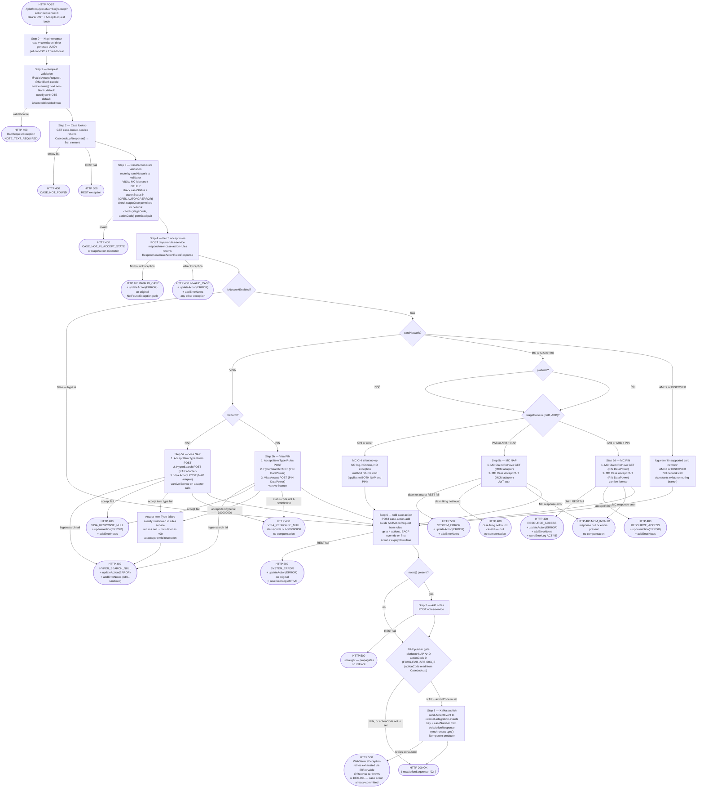

# WDP-COMP-19-ACCEPT-SERVICE
**Worldpay Dispute Platform — Component Reference**
*Version: 2.0 DRAFT | April 2026*
*Source: `mdva-gcp-disputes-accept-service` — source-verified by Claude Code 2026-04-23*
*Architect-confirmed: PENDING*

---

## ━━━ CORE SKELETON ━━━━━━━━━━━━━━━━━━━━━━━━━━━━━━━━━━━━━━

## Identity

| Field             | Value |
|-------------------|-------|
| **Name**          | `AcceptService` |
| **Type**          | `REST API + Kafka Producer` |
| **Repository**    | `mdva-gcp-disputes-accept-service` |
| **Status**        | ✅ Production |
| **Doc status**    | 📝 DRAFT v2.0 — source-verified, architect confirmation pending |
| **Sections present** | `Core | Block A | Block C` |
| **Spring Boot**   | 3.5.3 |
| **Java**          | 17 |
| **Service version** | 1.4.7 |
| **Context path**  | `/merchant/gcp/accept` |
| **Port**          | 8082 |

---

## Purpose

**What it does**

AcceptService processes a merchant's decision to accept a card-network
dispute. A single REST endpoint receives the accept instruction, validates
case eligibility against a stage/actionCode matrix, fetches accept-specific
rules, optionally calls the relevant card-network acceptance API,
records the resulting case action via the internal case action service,
optionally adds notes, and — for NAP-platform disputes whose **inbound**
actionCode is one of `FCHG / IPAB / IARB / IDCL` — publishes an
`AcceptEvent` to `internal-integration-events` so that NAPOutcomeProcessor
(COMP-39) can forward the acceptance decision to NAP-DPS.

Card-network routing is code-defined and platform-driven. NAP disputes
route through internal adapter services (Visa RTSI adapter and MCM
adapter). PIN disputes route through DataPower gateway URLs. AMEX and
DISCOVER are defined as constants but are **not handled by any routing
branch** — those disputes fall through to a `log.warn` and continue
processing without any network notification. MasterCard / Maestro at
the **CHI** stage silently no-ops on **both NAP and PIN** — no log, no
audit, no exception.

The component is fully stateless. It owns no database, holds no JPA /
Hibernate, and has no repository beans. All persistence — case lookup,
action creation, error recording, notes — is delegated to downstream
internal services via synchronous REST. Two REST invokers are used:
one passes the inbound Bearer JWT to internal services, the other uses
a vantive licence header for card-network adapter calls.

The Kafka publish is synchronous (blocking `.get()`) with idempotent
producer enabled and Spring Retry on transient broker failures. If all
retries are exhausted the HTTP response fails with 500. At that point
the case action has already been committed downstream — there is no
rollback and no compensating transaction. This is a confirmed DEC-001
deviation.

**What it does NOT do**

- Does not persist any database state — no DataSource, JPA, JDBC, or
  repository beans
- Does not consume from any Kafka topic — no listener, no consumer group
- Does not call Visa or Mastercard APIs directly — routes through
  adapter services (NAP) or DataPower (PIN)
- Does not perform case-level authorisation — no UAMS/CHAS call; relies
  entirely on JWT validation by Spring Security
- Does not route AMEX or DISCOVER disputes to any network API — both
  fall through to `log.warn` while the case action is still added and
  the Kafka gate still evaluates
- Does not use a transactional outbox — Kafka publish is a direct
  synchronous call (DEC-001 deviation)
- Does not implement idempotency — no duplicate detection on repeated
  accept requests
- Does not propagate `correlation-id` to outbound REST or Kafka — only
  the inbound MDC entry is set
- Does not call the BusinessRulesProcessor or BRE — fetches accept-
  specific rules directly from a DisputeRules endpoint
- Does not call APILogService consistently — 7 of 9 `saveErrorLog`
  call sites are commented out; only Step 6 case-action-add failure
  and Step 5d MC PIN claim-lookup failure remain active

---

## Internal Processing Flow



**Key flow facts (from source audit)**

- **Add-case-action runs AFTER the network call.** The `updateAction(ERROR)`
  compensation issued by every Step 5 failure path targets the **original**
  inbound action sequence — not the new row, which has not been created yet.
  Source sets `actionStatus="ERROR"`, `owner="WPAYOPS"` on the original.
- **`actionCode` for the Kafka gate is read from `CaseLookupResponse`,
  not from the rules response and not from `AddActionResponse`.** The
  EACP override (when `expiryFlow=true`) mutates the outgoing
  `AddActionRequest.action.actionCode` only — it does **not** affect the
  Kafka gate.
- **Compensation calls have no inner try/catch.** If `updateAction` or
  `addErrorNotes` itself fails, the compensation exception **replaces**
  the original business exception in the HTTP response, masking the real
  cause.
- **MC CHI silent no-op applies to both NAP and PIN.** On NAP, this means
  the Kafka gate may still fire — an `AcceptEvent` can be published to
  `internal-integration-events` even though no MC network notification
  occurred (split-brain).
- **AMEX/DISCOVER on NAP** with an inbound actionCode in
  `{FCHG, IPAB, IARB, IDCL}` will publish an `AcceptEvent` despite the
  network never being notified (same split-brain pattern).
- **`isNetworkEnabled=false`** skips only the Step 5 switch; rules,
  add-action, notes, and Kafka publish all still execute.

---

## Boundaries

### Inbound Interfaces

| Source | Protocol | Endpoint / Trigger | Payload |
|---|---|---|---|
| WDP Merchant Portal (COMP-49) | REST | `POST /merchant/gcp/accept/{platform}/{caseNumber}/accept?actionSequence=X` | AcceptRequest body + Bearer JWT — inferred caller, not source-verifiable |
| WDP Ops Portal (COMP-50) | REST | Same path | Same contract — inferred caller |
| API Gateway (COMP-01) | REST | Routes external traffic to above | JWT propagated |

### Outbound Interfaces

| Target | Protocol / Auth | Resource | Step | On failure |
|---|---|---|---|---|
| Case Lookup Service | REST + JWT | GET `${case.lookup}` | 2 | empty → 400 CASE_NOT_FOUND; REST fail → 500 |
| Dispute Rules Service — Respond New Case Action | REST + JWT | POST `${rule.respond-new-case-action-rules-url}` | 4 | NotFound → 400 + updateAction; other → 400 + updateAction + addErrorNotes |
| Dispute Rules Service — Accept Item Type | REST + JWT | POST `${rule.accept-type}` | 5a/5b (Visa only) | swallowed inside rules service → returns null → fails later as 400 at acceptItemId resolution |
| Visa HyperSearch — NAP adapter | REST + JWT | POST `${hyper.search-adapter-url}` | 5a | 400 + updateAction + addErrorNotes |
| Visa Accept — NAP adapter | REST + JWT | POST `${visa.accept-dispute-adapter-url}` | 5a | 400 + updateAction + addErrorNotes |
| Visa HyperSearch — PIN DataPower | REST + vantive | POST `${hyper.search-url}` | 5b | 400 + updateAction + addErrorNotes |
| Visa Accept — PIN DataPower | REST + vantive | POST `${visa.accept-dispute-url}` | 5b | 400 + updateAction + addErrorNotes |
| MC Claim Retrieve — NAP | REST + JWT | GET `${mastercard.base}/v6/claims/{claimId}` | 5c | 500 + updateAction + addErrorNotes |
| MC Case Accept — NAP | REST + JWT | PUT `${mastercard.base}/v6/cases/{caseId}` | 5c | 500 + updateAction + addErrorNotes |
| MC Claim Retrieve — PIN DataPower | REST + vantive | GET `${mastercard.retrieve-claim}{claimId}` | 5d | 400 + updateAction + addErrorNotes + **saveErrorLog ACTIVE** |
| MC Case Accept — PIN DataPower | REST + vantive | PUT `${mastercard.update-case-url}{caseId}` | 5d | 400 + updateAction + addErrorNotes |
| Case Action Add | REST + JWT | POST `${case.action.add}` | 6 | 500 + updateAction(original) + **saveErrorLog ACTIVE** |
| Case Action Update | REST + JWT | PUT `${case.action.update}` | compensation only | uncaught — replaces original exception if it fails |
| Notes Service | REST + JWT | POST `${notes.add}` | 7 (conditional) | uncaught — 500 via GlobalExceptionHandler |
| AWS MSK — `${kafka.nap-topic}` (`internal-integration-events`) | Kafka SASL_SSL + AWS_MSK_IAM | Topic publish, key=caseNumber | 8 (conditional NAP gate) | Spring Retry then 500 — no rollback, case action already committed |
| APILogService (COMP-38) | REST | POST `${errorlog.save}` | Step 5d MC PIN claim and Step 6 case-action-add only | exception ignored at call site |

### Cross-component dependency map

| Logical service | URL config key | Inferred WDP component (subject to architect confirmation) |
|---|---|---|
| Case lookup | `${case.lookup}` | COMP-23 CaseManagementService or COMP-27 CaseSearchService |
| Respond rules | `${rule.respond-new-case-action-rules-url}` | COMP-32 RulesService |
| Accept item type | `${rule.accept-type}` | COMP-32 RulesService |
| Case action add / update | `${case.action.add}` / `${case.action.update}` | COMP-24 CaseActionService |
| Notes add | `${notes.add}` | COMP-25 NotesService |
| Visa adapter | `${hyper.search-adapter-url}`, `${visa.accept-dispute-adapter-url}` | local Visa RTSI adapter (NAP) |
| MC adapter | `${mastercard.base}/v6/...` | local MCM adapter (NAP) |
| DataPower | `${hyper.search-url}`, `${visa.accept-dispute-url}`, `${mastercard.retrieve-claim}`, `${mastercard.update-case-url}` | DataPower enterprise gateway |
| Error log | `${errorlog.save}` | COMP-38 APILogService |

---

## Database Ownership

### Tables Owned

This component owns no database state. It is fully stateless — no
DataSource, JPA/Hibernate, JDBC, or repository beans are present in
the codebase.

### Tables Read

This component reads no database tables directly. All data retrieval
is via synchronous REST calls to downstream services.

---

## Key Architectural Decisions

| Decision | Status | Detail | Severity |
|---|---|---|---|
| **DEC-001** Transactional outbox | ⛔ DEVIATES | No outbox write. Kafka publish is a direct synchronous `.get()` after `addCaseAction`. If Kafka retries exhaust, case action and notes are already committed downstream with no compensating transaction. HTTP 500 informs the caller but does not undo the action. | 🔴 HIGH |
| **DEC-003** Kafka partition key = merchantId | ⛔ DEVIATES | Key is `caseNumber` from `AddActionResponse`. `merchantId` exists on `CaseLookupResponse` but is never mapped into `AcceptEvent`. No documented reason in source. | 🟡 MEDIUM |
| **DEC-004** PAN encryption before persistence | ✅ NOT APPLICABLE | No PAN data handled. `CaseLookupResponse` carries `cardNumberLast4` only. | — |
| **DEC-005** Manual offset commit after processing | ✅ NOT APPLICABLE | Producer only — no `@KafkaListener`, no consumer group, no listener factory. | — |
| **DEC-014** Resilience4j circuit breaker | ⛔ VOID PLATFORM-WIDE | No `io.github.resilience4j` dependency. No circuit breaker on any outbound call. Consistent with platform-wide pattern (DEC-014 voided in WDP-DECISIONS.md v2.0). | 🟡 MEDIUM |
| **DEC-019** Clear PAN on persistent store | ✅ NOT APPLICABLE | No persistent store; no PAN data. | — |
| **DEC-020** Full at-least-once idempotency | ⚠️ PARTIAL DEVIATION | No duplicate-detection on (caseNumber + actionSequence). Partial guard only via case/action status membership check at Step 3 — if the prior accept left status outside `{OPEN, AUTOACP, ERROR}`, a repeat is rejected. Otherwise the full flow re-executes, including network call, action add, and Kafka publish. | 🟡 MEDIUM |

---

## Risks and Constraints

| Risk | Severity | Detail |
|---|---|---|
| Kafka publish failure leaves inconsistent state — DEC-001 fallout | 🔴 HIGH | Case action and notes committed; HTTP 500 returned; NAPOutcomeProcessor never notified. Manual recovery required. |
| **MC CHI silent no-op on NAP can publish AcceptEvent without MC notification** | 🔴 HIGH | New finding 2026-04-23. `MasterCardServiceImpl.accept` returns void with no log when stageCode = CHI on either NAP or PIN. On NAP, the Kafka gate still fires if the inbound actionCode is `FCHG / IPAB / IARB / IDCL` — `AcceptEvent` published to `internal-integration-events` while Mastercard was never notified. Split-brain between WDP and the network. |
| **AMEX/DISCOVER on NAP can publish AcceptEvent without network notification** | 🔴 HIGH | New finding 2026-04-23. AMEX and DISCOVER constants exist but are not handled by any routing branch — the switch defaults to `log.warn`. Case action is added; on NAP with eligible actionCode, `AcceptEvent` is published. NAP-DPS receives an outcome for a network that was never asked to accept. |
| Compensation has no inner try/catch | 🟠 HIGH | If `updateAction(ERROR)` or `addErrorNotes` fails inside any compensation block, the secondary exception replaces the original business exception in the HTTP response. Operators see a misleading error and the original failure is lost. |
| No REST timeouts on any of 14 outbound calls | 🔴 HIGH | Plain `new RestTemplate()` with default `SimpleClientHttpRequestFactory` — no connection or read timeout. Any hanging downstream blocks the request thread indefinitely. Up to 11 sequential REST calls per request on the full NAP path. |
| No idempotency on repeated accept | 🟡 MEDIUM | A repeat that survives the state-membership guard re-executes the full flow — duplicate network call, duplicate case action row, duplicate notes, duplicate Kafka event. |
| No correlation-id propagation on outbound calls | 🟡 MEDIUM | MDC entry exists locally only. Outbound REST headers carry no correlation-id; Kafka record headers carry no correlation-id. End-to-end tracing across services is broken at this hop. |
| No idempotency-key on outbound calls | 🟡 MEDIUM | Downstream services cannot deduplicate this component's repeat requests using a header. |
| `errorLogService.saveErrorLog` mostly disabled | 🟡 MEDIUM | 7 of 9 call sites commented out across `VisaRTSIServiceImpl`, `MasterCardServiceImpl`, `CaseServiceImpl`. Only Step 6 case-action-add and Step 5d MC PIN claim-lookup record errors centrally. Reason for the broad disablement not documented. |
| `validateDisputeAmount` defined but unused | 🟡 MEDIUM | Amount-mismatch validator exists in `AcceptServiceValidator` but no caller. Removed when `AmountCalculationUtil.amountValidation` was commented out. |
| `spring-boot-devtools` declared without explicit `<optional>` | 🟡 MEDIUM | Boot's `repackage` goal excludes devtools by default; production safety depends on the build pipeline using the repackaged jar rather than a plain jar. Not verifiable from source. |
| No HPA / no PDB / no startup probe | 🟡 MEDIUM | Static replica count from XL Deploy. No protection during rolling node operations. No startup probe means readiness/liveness fire from `initialDelaySeconds` only. |
| No CPU limits or requests | 🟡 MEDIUM | Burstable QoS — pod can be CPU-starved or starve neighbours. |
| MC CHI on PIN — silent no-op (no Kafka risk on PIN) | 🟡 MEDIUM | Same silent return as MC CHI NAP. PIN platform doesn't satisfy Kafka gate so no split-brain Kafka publish, but merchants and ops have no visibility that the network was not notified. |

---

## Incomplete and Planned Work

| Item | Type | Detail |
|---|---|---|
| `errorLogService.saveErrorLog` 7 of 9 call sites commented out | Deliberate disablement | Active calls: `CaseServiceImpl` Step 6, `MasterCardServiceImpl` Step 5d MC PIN claim. Commented across all Visa paths and remaining MC paths. `${errorlog.save}` config IS reached on the two active paths. Reason for the broader disablement not in source. |
| `AcceptEvent.writeOffAmount`, `ctmAmount`, `userId` commented out | Incomplete feature | Fields declared in model; mapping calls (`AcceptHelper.java`) commented. Corresponding `AcceptRequest.writeOffAmount`, `ctmAmount`, `writeOffDirection`, `writeOffReason` are not source-visible (file missing from OCR tree but referenced from commented mapping block). |
| `AmountCalculationUtil.amountValidation` commented out | Incomplete feature | Whole method body within `/* */`. Removal is what leaves `AcceptServiceValidator.validateDisputeAmount` itself uncalled. |
| `OAuth2AuthorizedClientManager` beans declared but unused | Dead code | `OAuthConfigUtils` defines beans; no `@Autowired` or `@Qualifier` reference elsewhere. RestTemplate uses JWT pass-through instead of the OAuth2 client flow. |
| `AcceptServiceValidator.validateDisputeAmount` defined but unused | Dead code | No caller in source. |
| Controller `correlationId` `@RequestHeader` parameter declared but never read | Dead code | `HttpInterceptor` reads the header; controller parameter is a remnant. |
| TODO in GlobalExceptionHandler | Open item | `// TODO` against the `StandardError` constructor in the `HttpRequestMethodNotSupportedException` handler. The `@ResponseStatus` annotation declares 400 but `ResponseEntity.status(METHOD_NOT_ALLOWED)` actually returns 405 — annotation is misleading. |
| DataPower PIN URLs configured on NAP-only environments | Dead config (env-dependent) | `${visa.accept-dispute-url}` and `${hyper.search-url}` are wired into `VisaRTSIServiceImpl` but only reached on the PIN branch. Whether any given environment is NAP-only is not source-verifiable. |
| `SecurityConfig` whitelist artefact `/SecurityConfig.java-service-api-docs/swagger-config` | Code artefact | Class name leaked into a config string. No runtime impact. |
| Duplicate `Retryable` import in `EventServiceImpl` | Code artefact | Two imports of the same `org.springframework.retry.annotation.Retryable`. Compiles. |
| Source-tree typo `getCaseActionDetais` (missing 'l') | OCR-source caveat | Caller and callee names diverged in the OCR snapshot. Production build is presumed corrected — flagged to confirm with the dev team. |

**Source-tree caveats (OCR pass).** Several files are missing from the
audit's source tree: the entire `model/request/` package (incl.
`AcceptRequest.java`), `RestInvoker.java`, `NotFoundException.java`,
`EnumName.java`, `DisputeAmount.java`. Behaviour of these classes is
inferred from call sites. Architect should treat any field-level claim
about `AcceptRequest` and any retry/header detail about `RestInvoker`
as provisional pending a re-fetch of source.

---

## Open Questions

| ID | Question | Resolution path |
|----|----------|----------------|
| OQ-1 | Literal value of `${kafka_nap_topic}` per environment — confirmed `internal-integration-events` in WDP-KAFKA.md but not in source | Environment config / K8s Secret |
| OQ-2 | Production replica count and `deploymentApiVersion` | XL Deploy / Deploy.it manifests |
| OQ-3 | Architect confirmation of inferred logical-component mappings (cross-component dependency map) | Architect decision |
| OQ-4 | Why `caseNumber` instead of `merchantId` as Kafka partition key (DEC-003 deviation) | Architect decision — ADR candidate |
| OQ-5 | Why 7 of 9 `saveErrorLog` calls are commented out — intentional rollback, deferred refactor, or stuck mid-migration? | Team confirmation |
| OQ-6 | AMEX/DISCOVER routing absence — intentional scope boundary or production gap? Compounded by the new finding that NAP+AMEX/DISCOVER+eligible-actionCode publishes `AcceptEvent` to NAP-DPS | Team / architect decision |
| OQ-7 | Production exclusion of `spring-boot-devtools` — relies on `spring-boot-maven-plugin repackage` being the deployed artefact | CI/CD pipeline confirmation |
| OQ-8 | Confirmed list of callers (Merchant Portal, Ops Portal, API Gateway, automated workflows) | Caller-repo analysis |
| OQ-9 | MC CHI silent no-op on NAP — should this fail loud, or write a SNOTE, or block the Kafka publish? Same question for AMEX/DISCOVER on NAP | Architect decision — blocks closing the new HIGH risks |
| OQ-10 | `AcceptRequest` field list and `RestInvoker` retry/header behaviour — files missing from OCR pass | Re-fetch source from repository HEAD |

---

## ━━━ TYPE BLOCK A — REST API CONTRACTS ━━━━━━━━━━━━━━━━━━━━━

## REST API Contracts

**Framework:** Spring Boot 3.5.3 / Java 17
**Context path:** `/merchant/gcp/accept`
**Auth model:** OAuth2 Resource Server. Bearer JWT required — validated
against `${jwt.trustedIssuers}` (multi-value). Case-level authorisation
NOT enforced — no UAMS/CHAS call. JWT passed through to downstream
internal service calls.

---

### Endpoint: Accept Dispute

| Parameter | Value |
|---|---|
| **Method** | `POST` |
| **Path** | `/{platform}/{caseNumber}/accept?actionSequence={actionSequence}` |
| **Full path** | `POST /merchant/gcp/accept/{platform}/{caseNumber}/accept?actionSequence={actionSequence}` |
| **Auth** | Bearer JWT — OAuth2 Resource Server. Case-level auth absent. |
| **Known callers** | Merchant Portal (NAP), PIN/Ops Portal — inferred, not source-verifiable |

**Request fields** (subject to OCR-caveat: `AcceptRequest.java` missing from source tree)

| Field | Location | Type | Required | Description |
|---|---|---|---|---|
| `platform` | Path | String | Yes | Drives Step 5 routing and Step 8 Kafka gate |
| `caseNumber` | Path | String | Yes | `@NotBlank` |
| `actionSequence` | Query | String | Yes | Original action sequence (e.g. `"01"`) |
| `userId` | Body | String | Yes | User performing the accept |
| `expiryFlow` | Body | Boolean | No (default `false`) | If `true`, overrides first action code to `EACP` on the AddActionRequest **for all networks**. Does NOT affect Kafka gate. |
| `isNetworkEnabled` | Body | Boolean | No (default `true`) | If `false`, skips the Step 5 network switch only — rules, add-action, notes, Kafka still execute |
| `notes[]` | Body | List | No | Optional |
| `notes[].noteType` | Body | String | No (default `NOTE`) | Validated by `@EnumName` (annotation class missing from OCR tree) |
| `notes[].text` | Body | String | Yes if note present | `@Size(max=750)`; blank-text rejection enforced imperatively in `AcceptController.validateRequest` |
| `v-correlation-id` | Header | String | No | Generated as UUID by `HttpInterceptor` if absent; placed on MDC |

**Success response — HTTP 200**

```json
{ "newActionSequence": "02" }
```

**HTTP status codes**

| Code | Condition |
|---|---|
| 200 | Accept flow completed successfully |
| 400 | Note text blank; CASE_NOT_FOUND; case/action status not in {OPEN, AUTOACP, ERROR}; stageCode not permitted; (stage, action) not permitted; rules NotFoundException; rules other exception; Visa response status not `I-300000000`; Visa hypersearch null; Visa accept item ID null; MC response error; MC case-filing not found; MC PIN claim/accept fail |
| 401 | JWT absent, invalid, or from untrusted issuer |
| 404 | No handler for path (framework only) |
| 405 | Wrong HTTP method (annotation says 400 — runtime returns 405; see incomplete-work TODO) |
| 500 | Case lookup REST fail; rules REST fail (other exception path returns 400, not 500); Step 5c MC NAP claim/accept fail; Step 6 case-action-add fail; Step 7 notes fail; Step 8 Kafka publish retries exhausted |

**Stage / actionCode validation matrix** (applied locally in Step 3 before rules fetch)

| Network | stageCode | Permitted actionCodes |
|---|---|---|
| VISA | CHI | FCHG, CHGM, WDNL |
| VISA | PAB | IDCL, IPAB, WDNL, CHGM |
| VISA | APC | CHGM, PCMP, WDNL |
| MASTERCARD / MAESTRO | CHI | FCHG, CHGM, WDNL |
| MASTERCARD / MAESTRO | PAB | WDNL, IPAB, CHGM |
| MASTERCARD / MAESTRO | ARB | IARB, CHGM |
| OTHER | CHI | FCHG, CHGM, WDNL |
| OTHER | CH2 | SCHG, CHGM, WDNL |
| OTHER | PAB | IDCL, CHGM, IPAB, WDNL |
| OTHER | ARB | IARB, CHGM |
| OTHER | REQ | RREQ |

Note the corrections from v1.0: stage code is **CHI** (letter I, not
digit 1) in source; VISA PAB allows **WDNL**; VISA APC uses **PCMP**
(not POMP).

**Exception → HTTP status mapping (GlobalExceptionHandler)**

| Exception | Status | Notes |
|---|---|---|
| `BusinessValidationException` | 400 (`e.getHttpStatus()`) | |
| `BadRequestException` | 400 | |
| `UnauthorizedException` | 401 | |
| `MethodArgumentNotValidException` | 400 | Bean Validation field-level |
| `ConstraintViolationException` | 400 | Path/query constraint (e.g. `@NotBlank caseId`) |
| `HttpRequestMethodNotSupportedException` | 405 (runtime); annotation says 400 — TODO | |
| `HttpMessageNotReadableException` | 500 | |
| `NoHandlerFoundException` | 404 | |
| `RuntimeException` (catch-all) | 500 | |

---

## ━━━ TYPE BLOCK C — KAFKA PRODUCER CONTRACTS ━━━━━━━━━━━━━━

## Kafka Producer Contracts

**Producer framework:** Spring Kafka `KafkaTemplate`
**Idempotent producer:** Yes — `enable.idempotence=true`; `max.in.flight.requests.per.connection=1`
**Publish mode:** Synchronous (blocking `.get()`) — calling thread blocks until broker ACK
**Retry on publish failure:** Spring Retry `@Retryable` with `maxAttempts = ${kafka.retry-count}`, fixed delay `${kafka.retry-delay}` (no multiplier). `@Recover` re-throws `WebServiceException` (HTTP 500 to caller).
**Transactional:** No — no `transactional.id` configured.
**Security:** SASL_SSL + AWS_MSK_IAM; JAAS module `software.amazon.msk.auth.iam.IAMLoginModule`; callback handler `software.amazon.msk.auth.iam.IAMClientCallbackHandler`.
**Serialisers:** Key = `StringSerializer`; Value = Spring `JsonSerializer`.
**Producer-tuning defaults left untuned:** `acks` (defaults to `all` under idempotence), `linger.ms`, `batch.size`, `compression.type`, `retries` (defaults to `Integer.MAX_VALUE` under idempotence).

---

### Topic: `${kafka.nap-topic}` → `internal-integration-events`

| Parameter | Value |
|---|---|
| **Topic name** | `${kafka.nap-topic}` (env-var); resolves to `internal-integration-events` per WDP-KAFKA.md |
| **Message key** | `caseNumber` (from `AddActionResponse.caseNumber`) — ⚠️ DEC-003 deviation; `merchantId` available on `CaseLookupResponse` but not mapped |
| **Ordering guarantee** | Per partition by `caseNumber` |
| **Published when** | **Both** must hold: (a) `platform.equalsIgnoreCase("NAP")` AND (b) inbound `actionCode` is a member of the `ActionCode` enum (`FCHG`, `IPAB`, `IARB`, `IDCL`). The actionCode is read from `CaseLookupResponse.actionDetails[0].actionCode` — **not** from the rules response and **not** from `AddActionResponse`. |
| **NOT published when** | platform = PIN; or NAP with actionCode outside the enum (CHGM, WDNL, EACP, POMP, SCHG, RREQ, etc.); or any exception propagates earlier in the chain |
| **Consumed by** | COMP-39 NAPOutcomeProcessor; COMP-40 VisaResponseQuestionnaire (filters out AcceptEvents at its own decision check because `visaResponseIds` is null on AcceptEvent) |

**AcceptEvent payload fields**

| Field | Type | Description |
|---|---|---|
| `caseNumber` | String | WDP internal case number — also the partition key |
| `actionSequences` | `List<String>` | New action sequence(s) created by this accept |
| `currentActionSequence` | `List<String>` | Original action sequence from the request |
| `platform` | String | Always `"NAP"` when published |
| `networkCaseId` | String | From `CaseLookupResponse.networkCaseID` |

**Commented-out fields** (declared in model — excluded from mapping):
`writeOffAmount`, `ctmAmount`, `userId`. Inactive — features not completed.

**Cross-cutting Kafka facts**

- **Headers:** No correlation-id, no idempotency-key, no custom headers.
  `KafkaTemplate.send(topic, key, value)` is called without headers
  parameter.
- **No `ProducerInterceptor` registered.**
- **No DLQ.** On final failure the only signal to the caller is HTTP 500;
  the case action and any notes are already committed downstream.

---

## Scaling and Deployment

| Property | Value | Source |
|---|---|---|
| Kubernetes resource type | Deployment | `resources.yml` |
| API version | `{{ deploymentApiVersion }}` | XL Deploy placeholder |
| Replica count | `{{ replicas-gcp-disputes-accept-service }}` | XL Deploy placeholder |
| Memory limit | 2048Mi | `resources.yml` |
| Memory request | 512Mi | `resources.yml` |
| CPU limit / request | Not configured | absent — burstable QoS |
| HPA | Absent | — |
| Rolling update | `RollingUpdate maxSurge=1 maxUnavailable=0` | `resources.yml` |
| `minReadySeconds` | 30 | `resources.yml` |
| PodDisruptionBudget | Absent | — |
| Topology spread | maxSkew=1, ScheduleAnyway, `kubernetes.io/hostname`; selector matches pod label | `resources.yml` |
| OTel agent | Injected via `instrumentation.opentelemetry.io/inject-java: opentelemetry-operator-system/default` | `resources.yml` |
| Spring Actuator endpoints | `info, health, prometheus` exposed | `application.yml` |
| Actuator port | 8082 — same as application port (no `management.server.port` override) | `application.yml` |
| Liveness probe | `GET /merchant/gcp/accept/livez` port 8082 — `initialDelaySeconds=30 periodSeconds=10 timeoutSeconds=5 failureThreshold=3` | `resources.yml` (corrected from v1.0 — path ends `livez` not `liver`) |
| Readiness probe | `GET /merchant/gcp/accept/readyz` port 8082 — `initialDelaySeconds=20 periodSeconds=10 timeoutSeconds=5 failureThreshold=3` | `resources.yml` (corrected from v1.0 — path ends `readyz` not `ready`) |
| Startup probe | Absent | — |
| Service type | ClusterIP | `resources.yml` |
| Ingress | nginx — CORS enabled, multiple hostnames, TLS via `{{ ingressTLSsecretName }}` | `resources.yml` |
| Logstash | LogstashTcpSocketAppender → `${LOGSTASH_SERVER_HOST_PORT}`; structured JSON encoder; customFields `Environment` + `AppName`; keepAlive 5 min | `pom.xml` + `logback-spring.xml` |
| Console appender | Plain text fallback | `logback-spring.xml` |
| MDC fields | `correlation-id` only — no business-key MDC enrichment | `HttpInterceptor` |
| Custom Micrometer meters | None — only auto-configured Spring Actuator metrics | confirmed by grep |
| Secrets | `gcp-disputes-accept-service-secrets`, `wdp-common-secrets`, `{{ ingressTLSsecretName }}` | `resources.yml` |

---

*End of WDP-COMP-19-ACCEPT-SERVICE.md v2.0 DRAFT.*
*File status: 📝 DRAFT — source-verified 2026-04-23, architect confirmation pending.*
*Upstream document updates are tracked in WDP-CHANGE-LOG.md — see the 2026-04-23 COMP-19 entry.*
