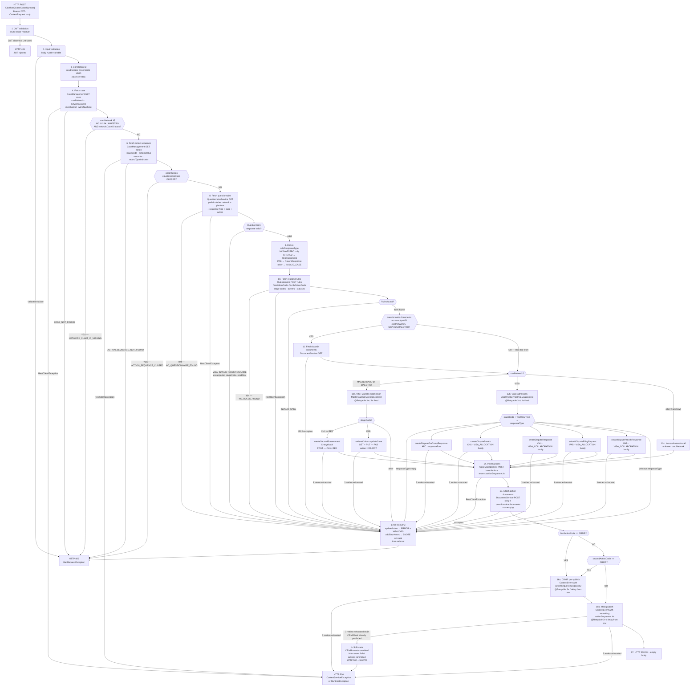

# WDP-COMP-20-CONTEST-SERVICE
**Worldpay Dispute Platform — Component Reference**
*Version: 2.0 DRAFT | April 2026*
*Source-verified from `gcp-disputes-contest-service` (dispute-contest-service v1.6.6) via Claude Code 2026-04-23 — Architect-confirmed: PENDING*

---

## ━━━ CORE SKELETON ━━━━━━━━━━━━━━━━━━━━━━━━━━━━━━━━━━━━━━

---

## Identity

| Field | Value |
|---|---|
| **Name** | `ContestService` |
| **Type** | `REST API + Kafka Producer` |
| **Repository** | `gcp-disputes-contest-service` |
| **Status** | `✅ Production` |
| **Doc status** | `📝 DRAFT — v2.0` |
| **Sections present** | `Core \| Block A — REST \| Block C — Producer` |
| **Context path** | `/merchant/gcp/contest` |
| **Container port** | `8082` |

---

## Purpose

**What it does**

ContestService orchestrates the end-to-end processing of a merchant decision to contest a chargeback dispute. It exposes a single authenticated REST endpoint, executes a sequential chain of internal WDP service calls to validate case state and enrich the request with questionnaire and rules data, then submits a contest response to either the Visa RTSI (via DataPower or the local Visa Adaptor) or the MasterCard MCM API (via DataPower or a direct MCM URL) depending on the `cardNetwork` value read from the case. After the card-network call succeeds, it records the resulting action set in CaseManagement and publishes a `ContestEvent` to Kafka for downstream consumers.

The service is fully stateless. It owns no database tables and performs no direct persistence. Every piece of case state is read from or written to a downstream WDP service via REST. The service acts purely as an orchestration layer sequencing calls across CaseManagement (COMP-23), QuestionnaireService (COMP-26), RulesService (COMP-32), DocumentManagementService (COMP-37), the card-network adapters, and the Kafka bus.

Visa events and MasterCard/Maestro events are published to the same `internal-integration-events` Kafka topic using the same `ContestEvent` schema. There is no type-discriminator field on the event; consumers distinguish the card network by reading `responseType` (Visa-specific string values vs the `NON_VISA_REPRESENTMENT` constant) and `visaResponseIds` (null for non-Visa).

For cases where the downstream rules engine returns a `CRMR` action code in either the first or second action slot, a CRMR pre-publish event is emitted before the main publish. The two CRMR branches are mutually exclusive (`if / else if`), so the **maximum number of Kafka publishes per request is two** — one optional CRMR pre-publish and one unconditional main publish.

**What it does NOT do**

- Does not own or write to any database table — fully stateless at the persistence layer. No JPA/JDBC/Hibernate dependency.
- Does not use a transactional outbox — Kafka is published directly within the HTTP request handler (⚠️ DEC-001 deviation).
- Does not perform PAN encryption or handle any PAN data — no card number field in any model; no EncryptionService (COMP-35) call.
- Does not consume from any Kafka topic — producer only. No `@KafkaListener`, no scheduler, no SQS consumer.
- Does not implement Resilience4j circuit breakers on any outbound call — consistent with platform-voided DEC-014.
- Does not handle NAP-only dispute routing — processes all acquiring platforms (CORE, NAP, PIN, VAP, LATAM) through the same endpoint, routing to the appropriate card-network path by `cardNetwork` from the case.
- Does not call BusinessRulesService (COMP-31) or BusinessRulesProcessor (COMP-16) — calls RulesService (COMP-32) only, for respond-rules lookup.
- Does not read Visa questionnaire *images* from Visa RTSI — that is COMP-40's responsibility. ContestService only *submits* the merchant's response to Visa. The five Visa RTSI submission methods are distinct from the five retrieval methods used by COMP-40.
- Does not call ErrorLogService (COMP-38) — every call site is commented out. Errors are recorded as SNOTE case notes via CaseManagement instead. The `case.errorlog-url` property must still be provided at startup or the application fails to initialise.
- Does not validate operator identity against the JWT — `userId` is taken from the request body with no cross-check against the JWT subject or claims.

---

## Internal Processing Flow



**Flow notes**

- **One inbound path.** REST POST only. No Kafka consumer, no scheduler, no SQS, no file poller. Confirmed by source-wide search for `@KafkaListener`, `@Scheduled`, `@SqsListener`.
- **State accumulated per request** — `cardNetwork`, `networkCaseID`, `merchantId`, `workflowType`, `productType` (from Step 4); `stageCode`, `actionStatus`, `actionCode`, amounts, `recordTypeIndicator` (Step 6); `responseType`, flattened amounts, `partialAmountIndicator` (Step 8); rules with `firstActionCode..fourthActionCode` (Step 10); `base64DocumentResponse` (Step 11, nullable); `addActionResponse.actionSequenceList` (Step 14, mutable — CRMR branches remove index 0); `visaResponseIds` (Step 12b, null for non-Visa).
- **Visa/MC failure maps to HTTP 400, not 500.** All card-network exceptions are wrapped in `BadRequestException` by the outer catch, preceded by an `updateAction → ERROR` and `addErrorNotes → SNOTE`. Only Kafka publish exhaustion and internal `RuntimeException` paths return HTTP 500.

---

## Boundaries

### Inbound Interfaces

| Source | Protocol | Endpoint / Topic / Trigger | Payload / Description |
|--------|----------|----------------------------|-----------------------|
| WDP Merchant Portal (COMP-49) | REST | `POST /merchant/gcp/contest/{platform}/case/{caseNumber}` | JWT-authenticated contest request with `actionSequence` and `userId` |
| WDP Ops Portal (COMP-50) | REST | `POST /merchant/gcp/contest/{platform}/case/{caseNumber}` | Same contract — ops-initiated contest |
| Automated orchestration / workflow services | REST | `POST /merchant/gcp/contest/{platform}/case/{caseNumber}` | No `@KnownCallers` annotation present — callers inferred from platform role |

### Outbound Interfaces

| Target | Protocol | Purpose · Step | Auth | On failure |
|--------|----------|----------------|------|------------|
| CaseManagement (COMP-23) | HTTPS REST | GET case — Step 4 | Bearer IDP | RestClientException → `ContestServiceException(SYSTEM_ERROR)` → **HTTP 500**. No retry. |
| CaseManagement (COMP-23) | HTTPS REST | GET action sequence — Step 6 | Bearer IDP | Same as Step 4 |
| QuestionnaireService (COMP-26) | HTTPS REST | GET questionnaire — Step 8 | Bearer IDP | 404 → `NO_QUESTIONNAIRE_FOUND`; other → `SYSTEM_ERROR`. Outer handler writes updateAction ERROR + addErrorNotes SNOTE → **HTTP 400**. No retry. |
| RulesService (COMP-32) | HTTPS REST | POST respond rules — Step 10 | Bearer IDP | 404 → `NO_RULES_FOUND`; other → `SYSTEM_ERROR`. Outer handler writes updateAction ERROR + addErrorNotes → **HTTP 400**. No retry. |
| DocumentManagementService (COMP-37) | HTTPS REST | GET base64 documents — Step 11 | Bearer IDP | 400 → `NO_DOCUMENT_FOUND`; other → rethrown. Outer handler updateAction ERROR + addErrorNotes → **HTTP 400**. No retry. |
| MCM API (direct, NAP path) | HTTPS REST | POST / PUT / GET — Step 12a | Bearer IDP + `v-correlation-id` | `@Retryable` 3× / 1000ms fixed. After exhaustion: updateAction ERROR + addErrorNotes + `BadRequestException` → **HTTP 400**. No circuit breaker. |
| MCM API (via DataPower, non-NAP) | HTTPS REST | POST / PUT / GET — Step 12a | `Authorization: VANTIV license="..."` — **no v-correlation-id** | Same as above |
| Visa RTSI via DataPower (PIN) | HTTPS REST multipart | POST — Step 12b | `Authorization: VANTIV license="..."` — **no v-correlation-id** | `@Retryable` 3× / 1000ms fixed. After exhaustion: updateAction ERROR + addErrorNotes + `BadRequestException(VISA_NETWORK_EXCEPTION)` → **HTTP 400**. No circuit breaker. |
| Visa Adaptor (NAP and other non-PIN non-NAP) | HTTPS REST multipart | POST — Step 12b | Bearer IDP + `v-correlation-id` | Same as above. ⚠️ See **Visa PIN dispatch anomaly** in Architecture Risks. |
| CaseManagement (COMP-23) | HTTPS REST | POST insertActions — Step 14 | Bearer IDP | RestClientException → `SYSTEM_ERROR`; outer handler updateAction + addErrorNotes + rethrow → **HTTP 500**. No retry. |
| CaseManagement (COMP-23) | HTTPS REST | PUT updateAction (error recovery) | Bearer IDP | No further recovery |
| CaseManagement (COMP-23) | HTTPS REST | POST addNote (SNOTE, error recovery) | Bearer IDP | No further recovery |
| DocumentManagementService (COMP-37) | HTTPS REST | POST addActionDocument — Step 15 | Bearer IDP | Exception → addErrorNotes (no updateAction on this path) + rethrow → **HTTP 500**. No retry. |
| IdP Token Service (COMP-36) | HTTPS OAuth2 | client-credentials flow, per-call via Spring `OAuth2AuthorizedClientManager` cache | client-credentials `clientId` + `clientSecret` | Exception → RuntimeException → **HTTP 500**. No retry. |
| AWS MSK Kafka | SASL_SSL + AWS_MSK_IAM | Publish ContestEvent — Step 16a / 16b | AWS IAM | `@Retryable` 3× / env-configurable delay. After exhaustion: `@Recover` throws `ContestServiceException(SYSTEM_ERROR)` — then outer handler writes SNOTE, rethrows → **HTTP 500**. No DLQ, no outbox. |

⚠️ **Draft correction:** all MC and Visa card-network failures return **HTTP 400** (wrapped as `BadRequestException`), not HTTP 500 as the v1.0 DRAFT stated. Only Kafka publish exhaustion and internal `RuntimeException` paths return HTTP 500.

---

## Database Ownership

### Tables Owned (written)

None. This component owns no database state. It is completely stateless at the persistence layer. The Maven build has no JPA / JDBC / Hibernate / Spring Data dependency. No `DataSource` or `EntityManager` bean exists. Confirmed by source-wide grep.

### Tables Read

None. All case and action data is fetched via REST from CaseManagement (COMP-23), QuestionnaireService (COMP-26), RulesService (COMP-32), and DocumentManagementService (COMP-37).

---

## Configuration and Scaling

| Parameter | Value | Notes |
|-----------|-------|-------|
| Kubernetes kind | Deployment | |
| Replica count | Helm placeholder `{{ replicas-mdvs-gcp-disputes-contest-service }}` | Exact production value not in repo — environment config |
| Rolling update | maxSurge 1, maxUnavailable 0, minReadySeconds 30 | |
| Memory request | 1024Mi | |
| Memory limit | 2048Mi | |
| CPU request / limit | Not configured | Burstable QoS |
| HPA | Not configured | — |
| PodDisruptionBudget | Not configured | — |
| Topology spread | maxSkew 1, ScheduleAnyway, topologyKey `kubernetes.io/hostname` | |
| Liveness probe | `GET /merchant/gcp/contest/livez` port 8082 · initialDelay 30s, period 10s, timeout 5s, failureThreshold 3 | |
| Readiness probe | `GET /merchant/gcp/contest/readyz` port 8082 · initialDelay 20s, period 10s, timeout 5s, failureThreshold 3 | |
| Startup probe | Not configured | — |
| Actuator endpoints | `info`, `health`, `prometheus` exposed | Liveness/readiness groups aliased at `/livez` and `/readyz` on the main server port |
| OTel Java agent | Auto-injected via `instrumentation.opentelemetry.io/inject-java` annotation | |
| Secrets wired | `mdvs-gcp-disputes-contest-service-secrets`, `wdp-common-secrets`, ingress TLS secret | envFrom |
| Ingress | nginx — 5 hosts (external, internal, WDP external, WDP internal, WDP reverse-proxy), CORS enabled | |
| Service | ClusterIP, port 8082 → 8082 | |
| HTTP client | Bare `RestTemplate` — no connection pool, no timeouts | See Architecture Risks |
| IdP token cache | Spring `OAuth2AuthorizedClientService` in-memory — TTL driven by IdP `expires_in` | Not configured in this repo |

⚠️ **Draft correction:** the v1.0 DRAFT referenced liveness path `/lives` — source shows `/livez`.

---

## Key Architectural Decisions

| Decision | ADR reference | Notes |
|----------|---------------|-------|
| Stateless orchestration layer — no local persistence | Local | All case state lives in CaseManagement (COMP-23). Enables horizontal scale without replica constraint. |
| Direct Kafka publish inside HTTP request handler (no outbox) | **DEC-001 — DEVIATION 🔴 HIGH** | Same pattern as AcceptService (COMP-19) and DocumentManagementService (COMP-37). If Kafka publish fails after 3 retries, CaseManagement actions are permanently committed but no `ContestEvent` is delivered. Manual recovery required. |
| Single Kafka topic for all card-network events | Local | `internal-integration-events` carries Visa and MC/Maestro events with the same `ContestEvent` schema. Consumers discriminate by `responseType` and `visaResponseIds`. |
| CRMR pre-publish pattern | Local | When the rules engine returns CRMR as first or second action code, a pre-publish event containing only the CRMR sequence is emitted before the main publish. ⚠️ See risk below about index-0 removal semantics. |
| Partition key = `merchantId` | **DEC-003 — COMPLIES** | All three publish call sites (CRMR-first, CRMR-second, main) key by `merchantId` from the case response. |
| No PAN data flows through this component | DEC-004, DEC-019 — NOT APPLICABLE | No card number field in any model. |
| No Resilience4j | Consistent with voided DEC-014 | Record as absence-of-library, not a deviation. Retry is via Spring Retry `@Retryable` on card-network and Kafka calls only. |
| No idempotency mechanism | **DEC-020 — DEVIATION 🔴 HIGH** | See DEC-020 assessment under Deviation Flags. |
| Errors recorded as SNOTE via CaseManagement | Local | ErrorLogService (COMP-38) is wired but all call sites are commented out. Errors surface as SNOTE case notes. |

---

## Architecture Risks and Notes

| Risk | Severity | Detail |
|------|----------|--------|
| **No transactional outbox — DEC-001** | 🔴 HIGH | Kafka publish is synchronous inside the HTTP request handler, after CaseManagement `insertActions` has already committed. If publish fails after 3 retries, inserted actions are permanently committed but no `ContestEvent` is delivered. NAPOutcomeProcessor (COMP-39) and VisaResponseQuestionnaire (COMP-40) will never receive the event. No DLQ, no replay mechanism. |
| **CRMR pre-publish / main publish split-state risk** | 🔴 HIGH | CRMR pre-publish and main publish are separate `@Retryable` invocations. If CRMR succeeds and the main publish fails after retry exhaustion, the CRMR event is already committed to the broker and cannot be rolled back. Downstream consumers will process a CRMR event without its paired main event. Caller receives HTTP 500 + SNOTE recorded. |
| **No idempotency — DEC-020** | 🔴 HIGH | No idempotency-key read, no (caseNumber + actionSequence) dedup store. The only guard is the `actionStatus == CLOSED` check at Step 7, which does not trigger in the happy-path replay window (the input action is set to ERROR on failure, not CLOSED). A replayed POST re-calls the card-network API (duplicate Visa / MC submission), inserts additional actions, and emits duplicate Kafka events. |
| **No RestTemplate connection or read timeouts** | 🟡 MEDIUM | The shared `RestTemplate` bean uses the default `SimpleClientHttpRequestFactory` with no timeouts. A hung downstream (CaseManagement, Questionnaire, Rules, Document, Visa, MCM, IdP) blocks the request thread indefinitely, relying on OS-level TCP timeout. Thread-pool exhaustion propagates into queue buildup. |
| **Kafka topic property-path mismatch** | 🟡 MEDIUM | The service reads `${kafka.topicId}` but the YAML default key is `kafka.topic`. Resolution depends on env-var `KAFKA_TOPICID` being supplied by the K8s secret. If absent, the application fails at bean init with a placeholder-resolution error. Wiring anomaly — either the code, the YAML, or the secret must align. |
| **Visa PIN dispatch anomaly** | 🟡 MEDIUM | Visa submission URL is selected by `platform != NAP` (DataPower for non-NAP, Visa Adaptor for NAP). The HTTP invoker is selected by `platform == PIN` (VANTIV-license multipart for PIN, Bearer-IDP multipart otherwise). For platforms CORE / VAP / LATAM, the URL points at Visa RTSI (DataPower) but the invoker attaches a Bearer IDP token — an auth-header and URL mismatch. Potential auth failure on those platforms. |
| **CRMR-second-branch index-0 removal** | 🟡 MEDIUM | Both CRMR branches remove element at index 0 of `actionSequenceList` regardless of which action code was CRMR. If `secondActionCode == CRMR` but `firstActionCode != CRMR`, removing index 0 removes the first (non-CRMR) action. The code depends on CaseManagement's `insertActions` response placing the CRMR sequence at index 0 in that scenario — behaviour not verifiable from this component alone. |
| **v-correlation-id not propagated on DataPower paths** | 🟡 MEDIUM | MCM via DataPower and Visa RTSI via DataPower (PIN) both omit the `v-correlation-id` header. Log correlation across components is broken on those paths. |
| **`@Recover` swallows blank-message exceptions** | 🟡 MEDIUM | The Kafka recover method only rethrows when the exception message is non-blank. A broker failure whose underlying exception has a blank message is silently swallowed, the caller receives HTTP 200, and no Kafka event is delivered. Latent but real. |
| **MCM / Visa retry count hardcoded** | 🟡 MEDIUM | Only Kafka retry is env-configurable. MCM and Visa RTSI retry count (3) and delay (1000ms) are compile-time constants. Platform-side retry tuning for card-network incidents requires a new build, not a config change. |
| **HttpMessageNotReadable → HTTP 500** | 🟡 MEDIUM | Malformed JSON body is mapped to HTTP 500 by the global exception handler. Convention expects HTTP 400 for client-side payload errors. API-contract review candidate. |
| **Draft count correction — CRMR publishes** | ℹ️ LOW | Maximum Kafka publishes per request is **2**, not 3. The two CRMR branches are mutually exclusive (`if / else if`). |
| **Draft count correction — ErrorLogService** | ℹ️ LOW | There are **8** commented-out `ErrorLogService.errorLog` call sites across `ContestServiceImpl`, not 6 as the v1.0 DRAFT stated. The bean, impl, and URL property remain wired. |
| **Draft count correction — CAD/USD commented blocks** | ℹ️ LOW | There are **5** commented-out CAD/USD conditional currency blocks (US2159614) across the Visa submission methods, not 1. `disputeCurrency` is now passed unconditionally on every Visa path. |
| **OCR-origin stray whitelist entry in security config** | 🟢 LOW | A Swagger whitelist path prefixed with a Java class-name fragment is present. Harmless (unreachable path) but should be removed. |
| **Shadowed RestTemplate instance field** | 🟢 LOW | One REST invoker declares a private `RestTemplate` instance field that shadows the shared bean. Cosmetic inconsistency. |

---

## Planned Changes

- ⚠️ **OPEN QUESTION:** Is the DEC-001 direct-publish pattern an accepted platform risk or an active remediation item? ContestService, AcceptService (COMP-19), CaseManagementService (COMP-23), and DocumentManagementService (COMP-37) all follow the same pattern — warrants a platform-level ADR.
- ⚠️ **OPEN QUESTION:** Does CaseManagement's `POST insertActions` guarantee the CRMR action sequence appears at `actionSequenceList[0]` in the response when CRMR is the second action code? The current ContestService logic depends on this. Needs cross-component verification with COMP-23.
- ⚠️ **OPEN QUESTION:** Should the Visa-PIN vs Visa-non-NAP-non-PIN dispatch-key mismatch be corrected by aligning the URL selector with the invoker selector? Requires team decision.
- ⚠️ **OPEN QUESTION:** Should MCM and Visa retry count / delay be externalised to environment variables like Kafka retry already is? Required for runtime tunability during card-network incidents.
- ⚠️ **OPEN QUESTION:** Is the Kafka topic property-path mismatch (code reads `kafka.topicId`, YAML defines `kafka.topic`) intentional (env-var-only override) or a wiring bug to fix?

---

## ━━━ TYPE BLOCK A — REST API CONTRACTS ━━━━━━━━━━━━━━━━━━

---

## REST API Contracts

**Framework:** Spring MVC — single `@RestController`
**Context path:** `/merchant/gcp/contest`
**Auth model:** OAuth2 JWT Bearer token via OAuth2 Resource Server with a multi-issuer resolver. Trusted issuers are loaded from the `jwt.trustedIssuers` property (env `jwt_trusted_issuer_urls`). No YAML defaults — values are env-supplied.
**Claim check:** Issuer (`iss`) validation only. No audience (`aud`) check. No scope assertion. No `@PreAuthorize`. No cross-check between the JWT subject and the `userId` in the request body.
**Unauthenticated endpoints:**
- Production: `/actuator/health`, `/livez`, `/readyz`
- Non-production (adds): Swagger UI paths

**Error body structure (all errors):**

```json
{
  "errors": [
    {
      "errorMessage": "<human-readable message>",
      "target": "<caseNumber with actionSequence>"
    }
  ]
}
```

---

### Endpoint: `POST /{platform}/case/{caseNumber}`

**Full path:** `POST /merchant/gcp/contest/{platform}/case/{caseNumber}`
**Purpose:** Submit a merchant contest decision for a dispute.
**Caller(s):** WDP Merchant Portal (COMP-49), WDP Ops Portal (COMP-50), automated orchestration services (no `@KnownCallers` declared).
**Auth required:** Bearer JWT from a trusted issuer.

#### Path Parameters

| Parameter | Type | Required | Description |
|-----------|------|----------|-------------|
| `platform` | String | Yes | Acquiring platform — `nap`, `core`, `pin`, `vap`, `latam` (case-insensitive). Enum-defined but the REST layer does not validate against the enum — downstream service calls match case-insensitively. |
| `caseNumber` | String | Yes | WDP case identifier |

#### Request Headers

| Header | Required | Description |
|--------|----------|-------------|
| `Authorization` | Yes | Bearer JWT |
| `v-correlation-id` | No | Correlation ID — UUID auto-generated by the interceptor if absent; propagated via MDC to most outbound calls. ⚠️ Not propagated on MCM DataPower and Visa RTSI DataPower (PIN) paths. |
| `Content-Type` | Yes | `application/json` |

#### Request Body

| Field | Type | Required | Description |
|-------|------|----------|-------------|
| `actionSequence` | String | Yes | Action sequence number — pattern restricted to values `01`–`99` |
| `userId` | String | Yes | Operator user ID — max 50 chars |

#### Responses

| HTTP Status | Condition |
|-------------|-----------|
| **200 OK** | Contest processed — card-network submitted (if applicable), actions inserted, Kafka published. Empty body. |
| **400 Bad Request** | `BadRequestException`: `CASE_NOT_FOUND`, `ACTION_SEQUENCE_NOT_FOUND`, `ACTION_SEQUENCE_CLOSED`, `NETWORK_CLAIM_ID_MISSING`, `NO_QUESTIONNAIRE_FOUND`, `VISA_INVALID_QUESTIONNAIRE`, `NO_RULES_FOUND`, `INVALID_CASE`, `NO_DOCUMENT_FOUND`, `VISA_NETWORK_EXCEPTION`, MC "stageCode not valid", MC/Maestro generic network exception. Also bean-validation and path-constraint failures. |
| **401 Unauthorized** | JWT absent, expired, or not from a trusted issuer (rejected before handler) |
| **404 Not Found** | `NoHandlerFoundException` — path not mapped |
| **405 Method Not Allowed** | `HttpRequestMethodNotSupportedException` |
| **500 Internal Server Error** | `HttpMessageNotReadableException` (⚠️ non-standard — typically 400); `RuntimeException` / `ContestServiceException` — downstream system error, IdP token failure, insertActions REST fail, addActionDocument REST fail, Kafka publish exhausted. |

#### Notes

- No idempotency key mechanism. Duplicate or replayed requests re-execute the full processing chain (see DEC-020 assessment in Deviation Flags).
- Correlation ID (`v-correlation-id`) is propagated via MDC and written into `HttpHeaders` on most outbound calls by each invoker. DataPower paths drop it (see Architecture Risks).
- `userId` is not cross-checked against any JWT claim; any authenticated caller can supply any `userId` value.

---

## 3.3 Visa RTSI Submission Contracts

ContestService submits the merchant's contest response to Visa RTSI via one of five distinct submission endpoints. The endpoint is selected from `stageCode` + `workflowType` at the Questionnaire fetch (Step 8), embedded in the questionnaire's `responseType` value, and dispatched at Step 12b.

### 3.3.1 Stage → Questionnaire Submission Mapping (authoritative)

| Case `stageCode` | `workflowType` family | `responseType` | Visa RTSI submission method | Business meaning |
|---|---|---|---|---|
| `APC` | any | `precomresp` | `createDisputePreCompResponse` | Pre-Compliance response |
| `CH1` | VISA_ALLOCATION (`VISA_ALLOCATION`, `INTLNK_ALLOCATION`, `ALLPOINT_ALLOCATION`, `PULSE_ALLOCATION`, `PLUS_ALLOCATION`) | `allocprearb` | `createDisputePreArb` | Allocation — pre-arbitration filing (contest at first chargeback, allocation path) |
| `CH1` | VISA_COLLABORATION | `representment` | `createDisputeResponse` | Representment (contest at first chargeback, collaboration path) |
| `PAB` | VISA_ALLOCATION family | `allocarb` | `submitDisputeFilingRequest` | Allocation arbitration filing |
| `PAB` | VISA_COLLABORATION | `prearbresp` | `createDisputePreArbResponse` | Pre-arbitration response (collaboration) |
| any other `stageCode` + VISA | — | — | `VISA_INVALID_QUESTIONNAIRE` → HTTP 400 | — |

Notes:
- The string `"representment"` is used as both `VISA_COLL_CHARGEBACK` (Visa collaboration CH1) and `NON_VISA_REPRESENTMENT` (MC/Maestro) — consumers distinguish network via `visaResponseIds` (null for non-Visa) and `cardNetwork` context.
- `actionStatus` is not used as a selector for `responseType` — only as the CLOSED short-circuit guard at Step 7.

### 3.3.2 Transport and Authentication per Submission

All five Visa RTSI methods share the same transport construction:

| Platform | Service called | Auth header | `v-correlation-id` |
|---|---|---|---|
| `NAP` | Visa Adaptor (`${visaadaptor.serviceUrl}`) | `Authorization: Bearer <IDP token>` | Yes |
| `PIN` | Visa RTSI via DataPower (`${visartsi.serviceUrl}`) | `Authorization: VANTIV license="..."` | ❌ No |
| `CORE` / `VAP` / `LATAM` | Visa RTSI URL (`${visartsi.serviceUrl}`) but invoker attaches Bearer IDP token | `Authorization: Bearer <IDP token>` | Yes — ⚠️ **see Visa PIN dispatch anomaly in Architecture Risks** |

- HTTP method: POST
- Content-Type: `multipart/form-data` (JSON payload + optional attachments)
- Retry: Spring Retry `@Retryable` — 3 attempts, 1000ms fixed delay — applied once at the `visaContest` entry point, not per individual submission method
- Circuit breaker: none (DEC-014 voided platform-wide)
- URL path construction: `serviceUrl + "/" + operationName` where `operationName` is the submission method name

### 3.3.3 `createDisputePreCompResponse` — Pre-Compliance Response (`precomresp`)

**Stage:** APC

| JSON field path | Source |
|---|---|
| `RequestHeader.MemberRole` | Hardcoded `"A"` |
| `RequestData.MemberCaseNumber` | Inbound `caseNumber` |
| `RequestData.VisaCaseNumber` | `case.networkCaseID` |
| `RequestData.DisputeAttachmentDescriptor` | Populated from fetched base64 documents if present |
| `RequestData.PreCompResponse` | `"PART"` or `"DECL"` derived from `partialAmountIndicator` |
| `RequestData.AcceptanceAmount` | Partial-YES: `DisputeSourceAmount − disputeAmountValue` (PIN path) or `DisputeSettlementAmount − disputeAmountValue` (non-PIN path). Serialised as `{value, currency}`. |
| `RequestData.TransferFundsNowCd` | `"Y"` hardcoded, only when partial indicator is YES |
| `RequestData.PartialAcceptanceReason` | `questionnaire.preCompResponse.partialAcceptanceReason` |
| `RequestData.ContinuePreFilingReason` | `questionnaire.preCompResponse.continuePreFilingReason` |
| `RequestData.Action` | Hardcoded `"Submit"` |

**Response consumed:** `ResponseData.DisputePreCompResponseId` — added to `visaResponseIds`.

**Special status handling:** RTSI info code `I-301100076` on this endpoint is normalised to success (in addition to the general rule of warning codes prefixed `W*` being normalised to success).

### 3.3.4 `createDisputePreArb` — Allocation Pre-Arbitration Filing (`allocprearb`)

**Stage:** CH1, VISA_ALLOCATION family

| JSON field path | Source |
|---|---|
| `RequestHeader.MemberRole` | Hardcoded `"A"` |
| `RequestData.MemberCaseNumber` | Inbound `caseNumber` |
| `RequestData.VisaCaseNumber` | `case.networkCaseID` |
| `RequestData.DisputeAmount.value` | Computed `disputeAmountValue` |
| `RequestData.DisputeAmount.currency` | `disputeCurrency` — resolved from case/action via DisplayCodeService-backed currency lookup |
| `RequestData.InitiatePreArbReason` | `questionnaire.visaAllocationPreArbResponse.prearbitrationReason` |
| `RequestData.Note` | `questionnaire.visaAllocationPreArbResponse.comments` |
| `RequestData.DisputeAttachmentDescriptor` | From fetched base64 documents if present |
| `RequestData.Action` | Hardcoded `"Submit"` |
| `RequestData.DisputeAmountChangeInd` | `questionnaire.partialAmountIndicator` (recomputed by the service) |
| `RequestData.CompellingEvidenceCategory` | `allocationCompellingEvidence.evidenceType` |
| `RequestData.CompEvidence*` — Proof of Delivery bundle | `allocationCompellingEvidence.proofOfDelivery` (TrackingNumber, ShippingCompanyName, recipient Name, Address, Address2, City, StateRegion, PostalCode, Country) |
| `RequestData.CompEvidence*` — Digital Download bundle | `allocationCompellingEvidence.digitalDownloadEvidence` (≈ 14 fields including DescribeDownload, DownloadDateTime, PurchaserIPAddress*, PurchaserName*, PurchaserEmail*, DeviceID*, GeographicalLocation, ARN, TransactionAmount, TransactionDate, and various indicators) |
| `RequestData.CompEvidence*Ind` — Non-disputed-payment indicators | `allocationCompellingEvidence.nonDisputedPayment` (IPAddressInd, EmailAddressInd, PhysicalAddressInd, PhoneNumberInd, DeviceIDFingerprintingInd, CustAccLoginIDInd) |
| `RequestData.CompEvidenceARN` / `CompEvidenceTransactionAmount` / `CompEvidenceTransactionDate` | `allocationCompellingEvidence.recurringTransaction` (second set of same field names) |
| `RequestData.MerchantContactInfo.*` | `allocationCompellingEvidence.merchantContactInfo` |
| `RequestData.DestinationWalletAddress` / `BlockchainTransactionHash` / `PriorSimilarTransaction` | `compellingEvidence.nonFiatCurrencyNonFungibleToken` |
| `RequestData.MerchandiseOrServices*` bundle (Services, ProvidedDate, Desc, ShippingDeliveryStatus, TrackingInformation) | Questionnaire `remedy` |
| `RequestData.DisputedTransaction.*` | Questionnaire `remedy.disputedTransaction` |
| `RequestData.UndisputedTransactions.UndisputedTransaction[*]` | Questionnaire `remedy.undisputedTransactions` (historical tran amount with per-item currency lookup) |
| `RequestData.MultipleCredits.Credit[*]` | Questionnaire `visaAllocationPreArbResponse.creditProcessed` (arn, creditAmount, creditCurrency, creditProcessedDate converted to Visa date format) |
| `RequestData.TransactionMatching` | Questionnaire `visaAllocationPreArbResponse.transactionMatching` |
| `RequestData.CorrectTransactionDate` | Questionnaire `invalidDispute.correctTransactionDate` (converted to Visa date format) |
| `RequestData.AuthorizationDate` / `AuthorizationCode` / `AuthorizedAmount` / `CertificationSpecialAuth` / `DisputeInvalidReason` / `CheckInDate` / `CheckOutDate` / `EmbarkationDate` / `VehicleRentalDate` / `VehicleReturnDate` / `DisEmbarkationDate` / `NotListedDisputeInvalidReason` | Questionnaire `allocationInvalidDispute` fields |

**Response consumed:** `ResponseData.DisputePreArbId` — added to `visaResponseIds`.

### 3.3.5 `createDisputeResponse` — Representment (`representment`)

**Stage:** CH1, VISA_COLLABORATION

| JSON field path | Source |
|---|---|
| `RequestHeader.MemberRole` | Hardcoded `"A"` |
| `RequestData.MemberCaseNumber` | Inbound `caseNumber` |
| `RequestData.VisaCaseNumber` | `case.networkCaseID` |
| `RequestData.DisputeResponse` | `"PART"` or `"DECL"` from `partialAmtIndicatorVisa` |
| `RequestData.AcceptanceAmount` (AmountType) | Conditional on partial-YES: PIN path uses `DisputeSourceAmount − disputeAmountValue`; non-PIN uses `DisputeSettlementAmount − disputeAmountValue` |
| `RequestData.DisputeAmount` | Set on 12.3-reason partial-PIN path or 12.3 non-partial non-PIN path |
| `RequestData.LiabilityNotAcceptedFully` | `representmentResponse.reasonForNotFullResponsibility` |
| `RequestData.DisputeResponseReason` | `representmentResponse.responseReason` |
| `RequestData.Note` | `representmentResponse.comments` |
| `RequestData.DisputeResponseReasonExplanation` | `representmentResponse.explanation` |
| `RequestData.DisputeInvalidReason` / `CorrectTransactionDate` / `AuthorizationDate` / `NotListedDisputeInvalidReason` / `CardholderRequestedCancellationdate` | `invalidDispute` fields (dates converted to Visa date format) |
| `RequestData.CompellingEvidenceCategory` | `compellingEvidence.evidenceType` |
| `RequestData.CompEvidence*` Proof of Delivery bundle | `compellingEvidence.proofOfDelivery` |
| `RequestData.CompEvidence*` Digital Download bundle (14 fields) | `compellingEvidence.digitalDownloadEvidence` |
| `RequestData.MerchantContactInfo.*` | `compellingEvidence.merchantContactInfo` |
| `RequestData.MultipleCredits.Credit[*]` | `representmentResponse.creditProcessed` (with per-item currency lookup) |
| `RequestData.DestinationWalletAddress` / `BlockchainTransactionHash` / `PriorSimilarTransaction` | `representmentResponse.nonFiatCurrencyNonFungibleToken` |
| `RequestData.TransactionMatching` | `representmentResponse.transactionMatching` |
| `RequestData.DisputeAttachmentDescriptor` | From fetched base64 documents if present |
| `RequestData.Action` | Hardcoded `"Submit"` |

**Response consumed:** `ResponseData.DisputeResponseId` — added to `visaResponseIds`.

### 3.3.6 `submitDisputeFilingRequest` — Allocation Arbitration Filing (`allocarb`)

**Stage:** PAB, VISA_ALLOCATION family

| JSON field path | Source |
|---|---|
| `RequestHeader.MemberRole` | Hardcoded `"A"` |
| `RequestData.MemberCaseNumber` | Inbound `caseNumber` |
| `RequestData.VisaCaseNumber` | `case.networkCaseID` |
| `RequestData.DisputeAmountChangeInd` | Explicitly set to `null` on this submission |
| `RequestData.Arbitration.caseFilingAmount.value` | Computed `disputeAmountValue` |
| `RequestData.Arbitration.caseFilingAmount.currency` | `disputeCurrency` (DisplayCodeService lookup) |
| `RequestData.Arbitration.FilingReason` | `allocationArbResponse.filingReason` |
| `RequestData.Arbitration.Comments` | `allocationArbResponse.comments` |
| `RequestData.Arbitration.IssuerAcquirerContactInfo.*` | `allocationArbResponse.issuerAcquirerContactInfo` (ContactName, ContactPhone, ContactEmail, ContactFax, ContactOther) |
| `RequestData.DisputeAttachmentDescriptor` | From fetched base64 documents if present |
| `RequestData.Action` | Hardcoded `"Submit"` |

**Response consumed:** `ResponseData.DisputeFilingInfo[*].DisputeFilingItemId` — every element of the list is added to `visaResponseIds`. This is the only submission that contributes multiple IDs.

### 3.3.7 `createDisputePreArbResponse` — Pre-Arbitration Response (`prearbresp`)

**Stage:** PAB, VISA_COLLABORATION

| JSON field path | Source |
|---|---|
| `RequestHeader.MemberRole` | Hardcoded `"A"` |
| `RequestData.MemberCaseNumber` | Inbound `caseNumber` |
| `RequestData.VisaCaseNumber` | `case.networkCaseID` |
| `RequestData.DisputeAttachmentDescriptor` | From fetched base64 documents if present |
| `RequestData.PreArbResponse` | `"PART"` or `"DECL"` from `partialAmtIndicatorVisa` |
| `RequestData.AcceptanceAmount` (AmountType) | Partial-YES: `DisputeSourceAmount − disputeAmountValue` (PIN) / `DisputeSettlementAmount − disputeAmountValue` (non-PIN). Partial-NO: full source/settlement amount. |
| `RequestData.LiabilityNotAcceptedFully` | `collaborationPreArbResponse.reasonForNotFullResponsibility` |
| `RequestData.Action` | Hardcoded `"Submit"` |

**Response consumed:** `ResponseData.DisputePreArbResponseId` — added to `visaResponseIds`.

### 3.3.8 Common Visa RTSI Response Handling

All five submissions converge on a single response validator:

| RTSI `statusList[0].code` pattern | Outcome |
|---|---|
| `I-300000000` (success) | Treated as success |
| `W*` (any warning code) | Normalised to success |
| `I-301100076` (PreComp-specific info) | Normalised to success — **only on `createDisputePreCompResponse`** |
| Any other non-success code | `VisaRTSIException` → outer handler → updateAction ERROR + addErrorNotes SNOTE → `BadRequestException(VISA_NETWORK_EXCEPTION)` → HTTP 400 |
| Empty `statusList` | Same as other non-success |

### 3.3.9 Visa Submission vs Retrieval — Disambiguation

ContestService (COMP-20) and VisaResponseQuestionnaire (COMP-40) call **different** sets of Visa RTSI methods:

| Purpose | Component | Method family |
|---|---|---|
| Submit merchant contest response | COMP-20 ContestService | `createDisputePreCompResponse`, `createDisputePreArb`, `createDisputeResponse`, `submitDisputeFilingRequest`, `createDisputePreArbResponse` |
| Retrieve questionnaire image | COMP-40 VisaResponseQuestionnaire | `getDisputePreCompResponseDetails`, `getDisputePreArbDetails`, `getDisputeResponseDetails`, `getDisputeFilingDetails`, `getDisputePreArbResponseDetails` |

The two method sets are distinct. ContestService does not call any retrieval methods; there are zero matches for `getDispute*Details` in this repository.

---

## 3.4 MasterCard / Maestro MCM Submission Contract

MasterCard and Maestro share a single submission path (`MasterCardServiceImpl.contest`) with stage-dependent routing.

### 3.4.1 Stage → MCM Method Mapping

| `stageCode` | MCM method | HTTP | NAP URL | Non-NAP URL |
|---|---|---|---|---|
| `CH1` or `RE2` | `createSecondPresentmentChargeback` | POST | `${case.mastercard.chargeback-url}` | `${case.mastercard.chargeback-datapower-url}` |
| `PAB` | `retrieveClaim` (lookup) → `updateCase` with `action = REJECT` | GET → PUT | `${case.mastercard.retrieve-claim-url}` → `${case.mastercard.update-casefiling-url}` | `${case.mastercard.retrieve-claim-datapower-url}` → `${case.mastercard.update-casefiling-datapower-url}` |
| any other | `BadRequestException("Case is not in a valid state to contest")` → HTTP 400 | — | — | — |

### 3.4.2 Transport and Authentication

| Platform | Auth | `v-correlation-id` |
|---|---|---|
| NAP | Bearer IDP token | Yes |
| Non-NAP (DataPower) | `Authorization: VANTIV license="..."` (same license secret as Visa DataPower) | ❌ No |

- Retry: Spring Retry `@Retryable` — 3 attempts, 1000ms fixed delay, applied at the `contest` entry point. No `@Recover` method.
- Circuit breaker: none.

### 3.4.3 `createSecondPresentmentChargeback` Payload (CH1 / RE2)

| JSON field | Source |
|---|---|
| `amount` | `contestAmount` serialised as string |
| `chargebackType` | Hardcoded `SECOND_PRESENTMENT` |
| `currency` | `ActionSummary.disputeSourceAmountCurrency` from case action |
| `documentIndicator` | `"true"` if base64 document list non-null, else `"false"` |
| `reasonCode` | `questionnaire.nonVisaRepresentmentResponse.representmentReasonCodes` |
| `isPartialChargeback` | Boolean from `partialAmountIndicator == "Y"` |
| `messageText` | `questionnaire.nonVisaRepresentmentResponse.comments` |
| `fileAttachment` | Single doc → `{filename, file}` (filename ≤ 15 chars enforced); multiple docs → auto-zipped via `DocumentZipper`; null if no docs |
| `credPostedAsPurchase`, `settlementDate`, `disputeChargebackID`, `localTaxIIVA`, `installmentFee`, `editExclusionCode`, `refundNotReceivedIndicator`, `includeCurrencyConversionAssessmentCCA` | Never set (nullable in wire) |

**Response:** `ChargebackResponse.chargebackId` — **discarded** by the caller. Not forwarded to `ContestEvent`, not logged except generically.

### 3.4.4 `updateCase` Payload (PAB)

Preceded by `retrieveClaim` (GET) which returns `Claim.caseFilingDetails.caseFilingDetails.caseId`. That `caseId` is used to construct the update-case URL path. On retrieve failure or null response: `ContestServiceException(MASTERCARD_RETRIEVE_CLAIM)`.

| JSON field | Source |
|---|---|
| `action` | Hardcoded `REJECT` |
| `memo` | `questionnaire.nonVisaRepresentmentResponse.comments` |
| `fileAttachment` | Same single-doc / multi-doc / null rule as chargeback |
| `rebuttedAs`, `docRetryAs` | Never set |

**Response:** `CaseFilingResponse.{caseId, errors}`. Non-empty errors or null response → `ContestServiceException(MASTERCARD_UPDATE_CASE)` or `MAESTRO_UPDATE_CASE`.

### 3.4.5 MCM Failure Behaviour

On retry exhaustion or error response, the MC orchestrator:

1. Logs the exception.
2. Calls CaseManagement `updateAction` — sets the action status to `ERROR` with owner `WPAYOPS`.
3. Calls `disputeService.addErrorNotes` — writes an SNOTE case note.
4. Rethrows the failure, which is caught by the outer orchestrator and wrapped into:
   - `BadRequestException` if it was one already, or
   - `BadRequestException("MASTERCARD|MAESTRO Contest - Exception Occurred during network call")` otherwise

The request returns **HTTP 400**. No Kafka event is emitted. CaseManagement actions are not inserted (Step 14 is never reached).

---

## ━━━ TYPE BLOCK C — KAFKA PRODUCER CONTRACTS ━━━━━━━━━━━━━

---

## Kafka Producer Contracts

**Producer framework:** Spring Kafka `KafkaTemplate`
**Idempotent producer:** Yes — idempotence enabled, max in-flight requests per connection = 1
**Key serializer / Value serializer:** String / JSON
**Broker transport:** SASL_SSL with AWS MSK IAM authentication
**Publish mode:** Synchronous (blocking `.get()`) — the HTTP request thread blocks until broker acknowledgement
**Retry on publish failure:** `@Retryable` — 3 attempts, env-configurable fixed delay (only Kafka retries are env-tunable; MCM and Visa retries are hardcoded)
**Recover:** `@Recover` throws `ContestServiceException(SYSTEM_ERROR)` — ⚠️ but only when the exception message is non-blank (see Architecture Risks)
**Outbox pattern:** None — direct publish within HTTP request handler (DEC-001 deviation)
**Max publishes per request:** 2 (one optional CRMR pre-publish + one unconditional main publish — the two CRMR branches are mutually exclusive)

---

### Topic: `internal-integration-events`

| Parameter | Value |
|-----------|-------|
| **Topic name** | Resolves at runtime from env var `KAFKA_TOPICID`. ⚠️ **Property-path mismatch:** code reads `${kafka.topicId}` but YAML defines `kafka.topic` — if the env var is not supplied by the K8s secret, bean initialisation fails with a placeholder-resolution error. Platform-registry canonical name: `internal-integration-events`. |
| **Message key** | `merchantId` from the Step 4 case response (DEC-003 compliant) |
| **Ordering guarantee** | Per-partition, scoped by merchantId |
| **Published on** | Successful completion of Step 14 (actions inserted) and Step 15 (documents attached if applicable). CRMR pre-publish fires first when applicable; main publish fires unconditionally afterwards. |
| **Consumed by** | NAPOutcomeProcessor (COMP-39) — NAP-platform events regardless of network; VisaResponseQuestionnaire (COMP-40) — Visa events regardless of platform |

#### ContestEvent Payload

| Field | Type | Source | Notes |
|-------|------|--------|-------|
| `platform` | String | Path variable verbatim | No case-fold, no canonicalisation |
| `caseNumber` | String | Path variable verbatim | |
| `actionSequences` | `List<String>` | CRMR event: element at index 0 (removed from the list). Main event: remaining `actionSequenceList` returned from CaseManagement `insertActions`. | ⚠️ See **CRMR-second-branch index-0 removal** risk — the branch removes index 0 regardless of whether CRMR was first or second action code, assuming CaseManagement ordering. |
| `userId` | String | Request body | |
| `visaResponseIds` | `List<String>` | Visa path only — the IDs returned from the RTSI submission. Single-element for most methods; multi-element for `submitDisputeFilingRequest`. **On CRMR events this field is always null**, regardless of network — the CRMR builder never sets it. |
| `networkCaseId` | String | `case.networkCaseID` from Step 4 | Null / blank possible for non-MC/VISA/MAESTRO networks |
| `currentActionSequence` | `List<String>` | Single-element list wrapping the request-body `actionSequence` | |
| `responseType` | String | Visa: `allocprearb`, `allocarb`, `representment`, `prearbresp`, `precomresp`. MC/Maestro: `representment` (with `visaResponseIds = null` acting as the network discriminator). | |

#### Publish Sequence Example

1. CaseManagement `insertActions` returns `actionSequenceList = ["48", "49"]` with `firstActionCode = "CRMR"`.
2. CRMR pre-publish branch fires: remove `actionSequenceList[0]` → `"48"`. Publish `ContestEvent.actionSequences = ["48"]`.
3. Main publish: `ContestEvent.actionSequences = ["49"]` (what remains).

#### Publish Failure Semantics

| Scenario | Behaviour |
|---|---|
| Main publish fails after 3 retries; no CRMR branch fired | `ContestServiceException(SYSTEM_ERROR)` → outer catch writes SNOTE via `addErrorNotes` → HTTP 500. CaseManagement actions remain committed. No event delivered. |
| CRMR pre-publish fails after 3 retries | Main publish block never runs. SNOTE written. HTTP 500. CaseManagement actions remain committed. |
| CRMR succeeds; main fails after 3 retries | **🔴 Split-state.** CRMR event is already committed to the broker and cannot be retracted. Caller receives HTTP 500 + SNOTE. Downstream consumers see a CRMR event without its paired main event. |
| Exception caught by `@Recover` has blank message | **⚠️ Silently swallowed.** `@Recover` returns normally without rethrowing. Caller receives HTTP 200. No event is delivered. Latent reliability gap. |

---

## Deviation Flags

| Decision | Status | Severity | Detail |
|----------|--------|----------|--------|
| **DEC-001 — Transactional Outbox** | ⛔ DEVIATES | 🔴 HIGH | Direct Kafka publish inside HTTP request handler. No outbox table, no relay. If Kafka publish fails after retry exhaustion, CaseManagement actions (Step 14) are permanently committed but no `ContestEvent` is delivered. No DLQ. Same pattern confirmed in AcceptService (COMP-19), CaseManagementService (COMP-23), and DocumentManagementService (COMP-37) — candidate for a platform-level ADR. |
| **DEC-003 — Kafka Partition Key = merchantId** | ✅ COMPLIES | 🟢 | All three publish sites (CRMR-first, CRMR-second, main) key by `caseResponse.getMerchantId()`. |
| **DEC-004 — PAN Encryption Before Persistence** | ✅ NOT APPLICABLE | — | No PAN data in any model; no EncryptionService call. Confirmed by full model inspection. |
| **DEC-005 — Kafka Offset Manual Commit** | ✅ NOT APPLICABLE | — | Producer only — no Kafka consumer. |
| **DEC-014 — Resilience4j Circuit Breakers** | ℹ️ ABSENT (voided) | — | No Resilience4j dependency. Consistent with platform-voided DEC-014. Record as absence-of-library, not a deviation. |
| **DEC-019 — No Clear PAN in Persistent Store** | ✅ NOT APPLICABLE | — | No persistent store; no PAN data. |
| **DEC-020 — Full At-Least-Once Idempotency** | ⛔ DEVIATES | 🔴 HIGH | No idempotency-key read. No `(caseNumber + actionSequence)` dedup store. No dedup check before card-network call. The only partial guard is the `actionStatus == CLOSED` check at Step 7, which does not trigger on the replay of a failed-mid-flight request (input action is set to ERROR, not CLOSED). A replayed POST re-calls the card-network API (producing a duplicate Visa / MC submission), inserts another action, and publishes duplicate Kafka events. Kafka's producer-level idempotence guards only within a single producer session — not across retry attempts. |
| **DEC-023 — Replica = 1 Hard Constraint** | ✅ NOT APPLICABLE | — | Stateless REST orchestrator. Horizontally scalable. Replica count is a Helm variable. |

---

## Planned and Incomplete Work

### Dead Code — Confirmed Present

| # | Location | What it is |
|---|---|---|
| 1 | `ContestServiceImpl` — 8 commented-out call sites | `ErrorLogService.errorLog` call sites, in: `sendUpdateEventToKafka`, `fetchQuestionnaireResponse`, `contestMasterCardNetworkCase`, `fetchRespondRules` (generic-Exception catch), `addActionDocument`, `contestVisaNetworkcase`, `fetchBase64Document`, `addAction`. Bean + impl + `${case.errorlog-url}` remain wired; active error path uses `addErrorNotes` SNOTE. |
| 2 | `MasterCardServiceImpl` | `ErrorLogService` field is `@Autowired` and never used. |
| 3 | `VisaRTSIServiceImpl` — 5 commented-out blocks (US2159614) | Conditional CAD vs USD currency selection based on reason-code prefix — in `createDisputePreArb` (non-NAP), `submitDisputeFiling` (non-NAP), `createDisputePreArbResponse` (PIN partial), `createDisputeResponse` (PIN 12.3+partial), `createDisputeResponse` (PIN partial AcceptanceAmount). All replaced with unconditional `disputeCurrency` via DisplayCodeService. |
| 4 | `CreateDisputePreArbRequestData` + `CreateDisputeResponseRequestData` | Single-credit fields (CreditDate / CreditAmount / CreditARN) and related getters replaced by `MultipleCredits` list. |
| 5 | `QuestionnaireUtils` | Old `partialAmountIndicator` fallback rule — superseded by `checkPartialAmountIndicator`. |
| 6 | `ContestUtils` | Dead `main()` test harness. |
| 7 | `RequestHeader` | Manual getter/setter superseded by Lombok `@Data`. |
| 8 | `ActionUtils` — six single-line commented-out `setCreditDebitIndicator` rescinding CRMR credit/debit reversal | Worth an architect decision — was the CRMR indicator reversal intentionally disabled? |

### Latent Code Defects

| # | Issue |
|---|---|
| 1 | `MultipleCredits.findCredit(String)` — `Integer.equals(String)` always returns false. Logic bug, not a compile error. |
| 2 | `RequestCorrelation.getId` — defined but never called anywhere. Dead getter. |
| 3 | `QuestionnaireRestInvoker` declares a private `RestTemplate` instance field that shadows the shared `RestTemplate` bean. Functionally equivalent, cosmetic inconsistency. |
| 4 | `SecurityConfig` non-prod whitelist contains a stray path prefixed with a Java class-name fragment — OCR artefact, unreachable path, harmless but should be removed. |

### Unused Dependencies

- `jasypt.spring.boot.starter.version` property defined but no `<dependency>` element declared for jasypt. Cosmetic.
- All other declared dependencies resolve to imports.

### Unread Properties

- `${case.errorlog-url}` — bound to `ErrorLogServiceImpl.errorLogUrl` but only referenced by commented-out call sites. Must still be supplied at startup or the application fails to initialise.
- All other `application.yaml` keys are read.

### Feature Flags in Production

No feature-flag library (LaunchDarkly, Unleash, Togglz, in-house) in the build. No `@Value`-bound boolean gates any code path. The only environment-driven gate is the Spring `spring.profiles.active` selector (PROD vs non-PROD), which controls the Swagger unauth-whitelist only — not a feature flag.

### TODO / FIXME

- `VisaRTSIServiceImpl` — one `TODO`: re-implement multipart construction using current approach.
- No `FIXME` comments found.

---

## Remaining Gaps

| Gap | Type | Action needed |
|-----|------|---------------|
| Actual production Kafka topic name | Environment config | Injected via K8s secret `mdvs-gcp-disputes-contest-service-secrets`. Platform registry shows `internal-integration-events` as canonical. Confirm with infra team. |
| Replica count | Environment config | Helm placeholder `{{ replicas-mdvs-gcp-disputes-contest-service }}` — confirm production value. |
| IdP token TTL | Environment config | Governed by IdP `expires_in` response. Not configured in this repo. |
| Trusted JWT issuer URLs | Environment config | No YAML default — env-only. Confirm production list. |
| Known callers — formal confirmation | Team confirmation | No `@KnownCallers` annotation. COMP-49, COMP-50 inferred from UI features. Confirm orchestration services, if any. |
| DEC-001 platform position | Architect decision | Accept risk with documented recovery procedure, or commit to outbox remediation. Pattern affects multiple case-level services. |
| Kafka topic property-path mismatch | Architect / team decision | `${kafka.topicId}` vs `kafka.topic` — fix the code, the YAML, or document env-var-only override as intentional. |
| Visa PIN dispatch anomaly | Architect / team decision | URL selector (`platform != NAP`) vs invoker selector (`platform == PIN`) mismatch for CORE / VAP / LATAM. Confirm and align. |
| CRMR-second branch index-0 removal | Architect decision + COMP-23 cross-check | Depends on CaseManagement ordering. Verify CaseManagement always returns CRMR at `actionSequenceList[0]` when CRMR is second action code. |
| `@Recover` swallows blank-message exceptions | Architect decision | Fix to rethrow unconditionally, or document as accepted behaviour. |
| MCM / Visa retry count externalisation | Architect decision | Make env-configurable like Kafka retry is, or document hardcoded values as intentional. |
| `HttpMessageNotReadable → 500` convention | API contract review | Correct to HTTP 400 or document as intentional. |

---

*End of WDP-COMP-20-CONTEST-SERVICE.md*
*File status: 📝 DRAFT v2.0 — source-verified 2026-04-23 · architect confirmation pending*
*Supersedes v1.0 DRAFT. Change log entry produced separately in WDP-CHANGE-LOG.md.*
