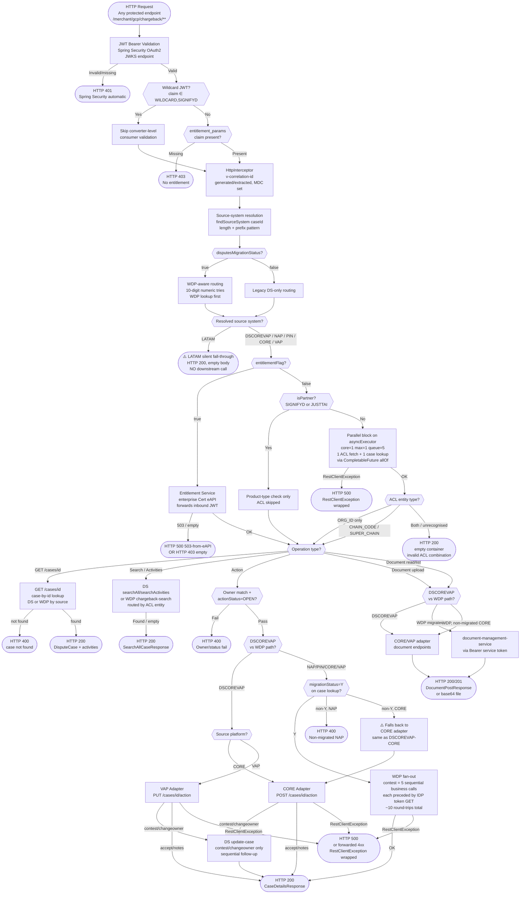

# WDP-COMP-21-CHARGEBACK-SERVICE
**Worldpay Dispute Platform — Component Reference**
*Version: 1.1 DRAFT | April 2026*
*Extracted from: Worldpay/mdvs-gcp-chargeback-service using GitHub Copilot CLI; source-verified by Claude Code 2026-04-25 against repo + production K8s Secrets and ConfigMaps. | Architect-confirmed: PENDING*

---

## ━━━ CORE SKELETON ━━━━━━━━━━━━━━━━━━━━━━━━━━━━━━━━━━━━━━
*Mandatory for every component regardless of type.*

---

## Identity

| Field | Value |
|---|---|
| **Name** | `ChargebackService` |
| **Type** | `REST API` |
| **Repository** | `Worldpay/mdvs-gcp-chargeback-service` |
| **Artifact** | `com.wp.gcp:chargeback-service v1.1.8` |
| **Base context path** | `/merchant/gcp/chargeback` |
| **Port** | `8082` (single port; management endpoints share the same port) |
| **Runtime** | Java 17 / Spring Boot 3.5.8 |
| **Status** | `✅ Production` |
| **Doc status** | `📝 DRAFT` |
| **Sections present** | `Core | Block A — REST` |

---

## Purpose

**What it does**

ChargebackService is the sole externally-exposed WDP REST API and the primary merchant-facing and partner-facing gateway for the entire Worldpay Dispute Platform. It handles two broad categories of operation: dispute *read* operations (case search, case detail by ID, activity search, document retrieval and listing) and dispute *action* operations (contest, accept, add note, change owner, document upload).

All inbound requests are authenticated via OAuth 2.0 JWT Bearer tokens validated against a configured JWKS endpoint. Two mutually-exclusive authorization modes are present at runtime, toggled by the `entitlement.entitlementFlag` environment variable: the **legacy ACL mode** (queries the WDP user-access-management-service for chain-level merchant hierarchy validation) and the **newer Entitlement mode** (queries an enterprise entitlement lookup API directly using the inbound JWT for region-scoped entitlement validation). Only one mode is active at any time. Production value at the time of survey: `false` (legacy ACL mode).

Platform routing — determining whether a request belongs to CORE, VAP, NAP, PIN, LATAM, or the legacy DSCOREVAP path — is derived entirely from the format of the inbound `caseId` string using length and prefix pattern matching. A second runtime flag (`wdp.disputesMigrationStatus`) selects between the legacy DS-only routing and the WDP-aware routing where ambiguous 10-digit numeric IDs first attempt a WDP case-lookup before falling back to DS. Production value at the time of survey: `false` (legacy DS-only routing).

ChargebackService is exposed externally through APIGEE and Akamai for merchant traffic. Third-party systems are identified as "partners" at auth time and receive a simplified authorization flow — product-type check only; ACL chain-ID validation is skipped for these callers. Two partner identities are coded: `SIGNIFYD` and `JUSTTAI` (note the double-T spelling in source; corresponds to the JustAI integration). Both branches are wired and reachable today. BEN is referenced operationally as a callback caller, but no BEN-specific endpoint or routing logic exists in source.

This service is a **pure orchestrator**. It owns no database state, has no Kafka producer or consumer, runs no scheduled work, and persists nothing. Its job is to validate, route, and fan out HTTP calls to **38 distinct downstream call sites across 12 target applications**, and surface the merged result to the caller.

**What it does NOT do**

- Does not persist any state — no database reads or writes of any kind; it is a pure API gateway and request orchestrator
- Does not produce to or consume from any Kafka topic — no Kafka dependency exists in this service
- Does not implement the transactional outbox pattern — no persistence layer of any kind
- Does not perform dispute state transitions itself — all state writes are owned by downstream platform adapters (CORE adapter, VAP adapter) or WDP internal case services (case-actions-service, case-management-service, disputes-accept-service, document-management-service, notes-service)
- Does not encrypt or decrypt PAN — PAN responsibility is downstream. However, response bodies returned by this service contain full `cardNumber` in two model classes (`SearchCaseList`, `Transaction`) and `cardNumberLast4` in eight others. **There is no masking transformation in this service before serialising responses.** PAN-content surfacing through `/cases/search`, `/cases/activities`, `/nap/cases/*`, and `/us/cases/*` is therefore a confirmed risk surface (see Risks).
- Does not implement timeouts, retry, connection pooling, or circuit breaking on any downstream call — all 38 call sites use a single shared default `RestTemplate` bean with no pool and no timeout
- Does not implement idempotency for action endpoints — submitting the same action twice produces full duplicate fan-out downstream
- Does not handle LATAM disputes in any functional sense — `SourceSystem.LATAM` is in the routing table for 12-char `L`-prefix case IDs but has no downstream service implementation; requests fall through silently with HTTP 200 and an empty body (see Risks)
- Does not cache the IDP service-account token despite the class name `CachedTokenServiceImpl` — every WDP-bound call triggers a fresh token retrieval (see Risks)
- Does not serve the Ops Portal — Ops Portal connects to API Gateway (COMP-01); ChargebackService is the merchant-facing and partner-facing surface only

---

## Internal Processing Flow

*This diagram shows the primary processing paths through ChargebackService from JWT validation through to response. The five main paths — Read (case detail), Search/Activities (DS or WDP routed by ACL entity type), Action (contest/accept/notes/changeowner), Document upload, and Document read/list — share the JWT validation, source-system determination, and auth-mode selection steps.*

**Notes on the flow.**

- `GET /cases/{id}` uses a different source-system helper (`CaseServiceSupport.getSourceSystem`) than the action and document endpoints (`CaseNumberSourceSystemServiceImpl.findSourceSystem`). The two helpers have overlapping but not identical routing rules — this is a silent divergence.
- The "concurrent" parallel block (ACL fetch + case lookup) runs on a `ThreadPoolTaskExecutor` configured with **core=1, max=1, queue=5**. Effective parallelism is one async thread; under load, concurrent requests beyond the queue depth will be rejected.
- Every WDP-bound call (Bearer service-token authenticated) is preceded by a synchronous IDP token GET. There is no token cache despite the wrapper class name. WDP `contest` therefore performs 5 business calls each preceded by a token GET — 10 sequential round-trips on a `RestTemplate` with no connection pool.
- LATAM is reachable from `findSourceSystem` but no controller branch handles it, so action and document endpoints return the pre-initialised default response with HTTP 200. There is no log line, no metric, and no error.

---

## Boundaries

### Inbound Interfaces

| Source | Protocol | Endpoint / Trigger | Payload / Description |
|---|---|---|---|
| Merchants (via APIGEE → Akamai → Ingress) | REST HTTPS | All `/cases/*` and `/nap/cases/*` endpoints | JWT Bearer; dispute read and action requests. *Caller mapping is operational metadata; not source-derivable.* |
| Partner — SignifyD (via APIGEE) | REST HTTPS | All `/cases/*` endpoints | JWT Bearer; identified by `entitlement_params` consumer name = `SIGNIFYD`; ACL chain-ID skipped |
| Partner — JustAI (via APIGEE) | REST HTTPS | All `/cases/*` endpoints | JWT Bearer; identified by `entitlement_params` consumer name = `JUSTTAI` (double-T in source); ACL chain-ID skipped. **Active in source — contradicts platform-wide handover claim of "planned only".** |
| BEN | — | Not source-confirmed | No BEN-specific endpoint, consumer-identity check, or routing branch is present in source. If BEN calls back, it uses standard merchant endpoints. |
| Actuator / infrastructure | REST HTTP | `GET /livez`, `GET /readyz` | No auth; liveness/readiness probes only |
| Internal scrape (assumed Prometheus) | REST HTTP | `GET /actuator/prometheus` | **Requires JWT** — not in security whitelist (corrected from prior draft) |

### Outbound Interfaces — master inventory

This component makes **38 distinct downstream call sites** across **12 target applications**. Of the 38, three are unreachable from any inbound endpoint and one is a dead `@Value` field. All 38 share a single global `RestTemplate` bean configured with default `SimpleClientHttpRequestFactory` — no connection pool, no connect timeout, no read timeout, no retry, no circuit breaker, no `ClientHttpRequestInterceptor`. Failure handling is uniform: `RestClientException` is wrapped to `WebServiceException` carrying upstream HTTP status, surfaced through `GlobalExceptionHandler` as 4xx-forwarded or 500.

The table below is sorted by inbound-endpoint flow, then by call order within the flow. Resolved hosts are taken from `gcp-chargeback-service-secrets.yml` (CB-SEC) and `wdp-common-secrets.yml` (WDP-COM) at the time of the audit.

| # | Call site | HTTP | URL config | Resolved host + path | Target application | Auth | Sync/async | Triggered by | Order |
|---|---|---|---|---|---|---|---|---|---|
| 1 | `IdpRestInvoker.getIdpToken` | GET | `${wdp.tokenUrl}` | `https://test-gcpmdvs.../merchant/gcp/idp-token/token` | `wdp-idp-token-service` (via external proxy) | None (Content-Type / Accept only) | sync | Every WDP-bound call, per-call (no cache despite class name) | Pre-call |
| 2 | `RestInvoker.getEntitlement` | GET | `${entitlement.getEntitlementUrl}` | `https://cert-eapi.../entitlement-lookup-api/v1/api-key-entitlements` | Enterprise Entitlement Lookup API (Cert eAPI) | Bearer (forwarded inbound JWT) | sync | All endpoints when `entitlementFlag=true` | Early (auth) |
| 3 | `WDPRestInvoker.getACLDetails` | POST | `${wdp.searchACLUrl}` | `http://user-access-management-service.../merchant/gcp/access-management/acl/search` | `user-access-management-service` (in-cluster) | Bearer (svc) | `@Async` for async call sites; sync for direct call sites | All non-partner action and search endpoints (ACL mode) | Early (parallel block) |
| 4 | `AsyncDataServiceImpl.searchCase` | POST | `${dataService.searchCaseUrl}` | `https://test-globalmerchantdisputes.../merchant/disputes/data/cases/search` | `global-merchant-disputes` (DS, external) | Correlation-ID only | `@Async` from `getCaseDetails`; sync from source-system helper | DSCOREVAP path of every action endpoint and document endpoints | Early (parallel block) |
| 5 | `LookupDataService.searchCaseDetails` | POST | `${dataService.searchCaseUrl}` | (same as #4) | DS | Correlation-ID only | sync | **No live caller — dead code** | n/a |
| 6 | `LookupDataService.searchCaseDetailsById` | GET | `${dataService.searchCaseByIdUrl}` | `https://test-globalmerchantdisputes.../merchant/disputes/data/cases/{caseId}` | DS | Correlation-ID only | sync | `GET /cases/{id}` DSCOREVAP path | Early (lookup) |
| 7 | `LookupDataService.searchAllCase` | POST | `${dataService.searchCaseAllUrl}` | `https://test-globalmerchantdisputes.../merchant/disputes/data/cases/searchall` | DS | Correlation-ID only | sync | `POST /cases/search` DS branch | Mid |
| 8 | `LookupDataService.updateCase` | POST | `${dataService.updateCaseUrl}` | `https://test-globalmerchantdisputes.../merchant/disputes/data/cases/{caseId}/caseUpdate` | DS | Correlation-ID only | sync | `POST /cases/{id}/contest` DSCOREVAP follow-up; `POST /cases/{id}/changeowner` DSCOREVAP follow-up | Late |
| 9 | `LookupDataService.searchActivities` | POST | `${dataService.activitiesCaseUrl}` | `https://test-globalmerchantdisputes.../merchant/disputes/data/cases/searchActivities` | DS | Correlation-ID only | sync | `POST /cases/activities` DS branch | Mid |
| 10 | `RestInvoker.post` (CORE contest) | POST | `${adapter.core.url}` + `/{caseId}/contest` | `http://mdvs-gcp-core-adapter.../merchant/gcp/core-adapter/cases/{caseId}/contest` | `mdvs-gcp-core-adapter` | Correlation-ID only | sync | `POST /cases/{id}/contest` DSCOREVAP-CORE; **also WDP-CORE non-migrated fallback** | Mid |
| 11 | `RestInvoker.post` (VAP contest) | PUT | `${adapter.vap.url}` + `/cases/{caseId}/contest` | `http://mdvs-gcp-vap-adapter.../merchant/gcp/vap-adapter/cases/{caseId}/contest` | `mdvs-gcp-vap-adapter` | Correlation-ID only | sync | `POST /cases/{id}/contest` DSCOREVAP-VAP | Mid |
| 12 | CORE accept | POST | `${adapter.core.url}` + `/{caseId}/accept` | `.../core-adapter/cases/{caseId}/accept` | core-adapter | Correlation-ID only | sync | `POST /cases/{id}/accept` DSCOREVAP-CORE; WDP-CORE non-migrated fallback | Mid |
| 13 | VAP accept | PUT | `${adapter.vap.url}` + `/cases/{caseId}/accept` | `.../vap-adapter/cases/{caseId}/accept` | vap-adapter | Correlation-ID only | sync | `POST /cases/{id}/accept` DSCOREVAP-VAP | Mid |
| 14 | CORE notes | POST | `${adapter.core.url}` + `/{caseId}/notes` | `.../core-adapter/cases/{caseId}/notes` | core-adapter | Correlation-ID only | sync | `POST /cases/{id}/notes` DSCOREVAP-CORE; WDP-CORE non-migrated fallback | Mid |
| 15 | VAP notes | PUT | `${adapter.vap.url}` + `/cases/{caseId}/notes` | `.../vap-adapter/cases/{caseId}/notes` | vap-adapter | Correlation-ID only | sync | `POST /cases/{id}/notes` DSCOREVAP-VAP | Mid |
| 16 | CORE changeowner | POST | `${adapter.core.url}` + `/{caseId}/changeowner` | `.../core-adapter/cases/{caseId}/changeowner` | core-adapter | Correlation-ID only | sync | `POST /cases/{id}/changeowner` DSCOREVAP-CORE; WDP-CORE non-migrated fallback | Mid |
| 17 | VAP changeowner — owner-note PUT | PUT | `${adapter.vap.url}` + `/cases/{caseId}/notes` | `.../vap-adapter/cases/{caseId}/notes` | vap-adapter | Correlation-ID only | sync | `POST /cases/{id}/changeowner` DSCOREVAP-VAP — fires when computed `ownerNote` is non-blank | Mid |
| 18 | VAP changeowner — request-note PUT | PUT | `${adapter.vap.url}` + `/cases/{caseId}/notes` | (same as #17) | vap-adapter | Correlation-ID only | sync | `POST /cases/{id}/changeowner` DSCOREVAP-VAP — fires whenever `requestNote` non-blank, in a try/catch that **swallows** the exception | Mid |
| 19 | CORE document fetch | GET | `${adapter.core.url}` + `/{caseId}/documents/{docId}` | `.../core-adapter/cases/{caseId}/documents/{docId}` | core-adapter | Correlation-ID only | sync | `GET /cases/{id}/documents/{docId}` DSCOREVAP-CORE; WDP-CORE non-migrated fallback | Mid |
| 20 | VAP document fetch | GET | `${adapter.vap.url}` + `/document/retrieve/{caseId}/{docId}` | `.../vap-adapter/document/retrieve/{caseId}/{docId}` | vap-adapter | Correlation-ID only | sync | `GET /cases/{id}/documents/{docId}` DSCOREVAP-VAP | Mid |
| 21 | CORE document list | GET | `${adapter.core.url}` + `/{caseId}/documents` | `.../core-adapter/cases/{caseId}/documents` | core-adapter | Correlation-ID only | sync | `GET /cases/{id}/documents` DSCOREVAP-CORE; WDP-CORE non-migrated fallback | Mid |
| 22 | VAP document list | GET | `${adapter.vap.url}` + `/document/list/{caseId}` | `.../vap-adapter/document/list/{caseId}` | vap-adapter | Correlation-ID only | sync | `GET /cases/{id}/documents` DSCOREVAP-VAP | Mid |
| 23 | CORE document upload | POST | `${adapter.core.url}` + `/{caseId}/documents` | `.../core-adapter/cases/{caseId}/documents` | core-adapter | Correlation-ID only | sync | `POST /cases/{id}/documents` DSCOREVAP-CORE; WDP-CORE non-migrated fallback | Mid |
| 24 | VAP document upload | POST | `${adapter.vap.url}` + `/document/upload/{caseId}` | `.../vap-adapter/document/upload/{caseId}` | vap-adapter | Correlation-ID only | sync | `POST /cases/{id}/documents` DSCOREVAP-VAP | Mid |
| 25 | `WDPRestInvoker.searchWdpCase` | POST | `${wdp.caseSearchUrl}` | `http://mdvs-gcp-case-search-service.../merchant/gcp/case-search/{region}/v2/cases/search` | case-search-service | Bearer (svc) | sync | **No live caller — dead code** | n/a |
| 26 | `WDPRestInvoker.searchWDPChargebackCase` | POST | `${wdp.chargebackSearchUrl}` | `http://mdvs-gcp-case-search-service.../merchant/gcp/case-search/{region}/chargeback/cases/search` | `mdvs-gcp-case-search-service` | Bearer (svc) | sync | `POST /cases/search` and `/cases/activities` WDP branch; all `/nap/cases/*` and `/us/cases/*` | Mid |
| 27 | `AsyncWdpServiceImpl.getWdpCaseLookupDetails` | GET | `${wdp.caseLookupUrl}` | `http://mdvs-gcp-case-search-service.../merchant/gcp/case-search/{platform}/case/lookup` | case-search-service | Bearer (svc) | `@Async` from `getWdpCaseDetails`; sync from source-system helper | All NAP/PIN/CORE/VAP action and document endpoints; `GET /cases/{id}` WDP branch | Early (parallel) |
| 28 | `AsyncWdpServiceImpl.getNotesList` | GET | `${wdp.notesSearchUrl}` | `http://mdvs-gcp-notes-service.../merchant/gcp/notes/{platform}/case/{caseId}` | `mdvs-gcp-notes-service` | Bearer (svc) | `@Async` | `GET /cases/{id}` WDP branch | Mid |
| 29 | `WDPRestInvoker.postOrPut` (addnote) | POST | `${wdp.addNoteUrl}` | `http://mdvs-gcp-notes-service.../merchant/gcp/notes/{platform}/case/{caseId}` | notes-service | Bearer (svc) | sync | `POST /cases/{id}/notes` WDP branch; follow-up from contest with non-blank note; follow-up from changeowner with non-blank note | Late |
| 30 | `WDPCaseDetailsServiceImpl.updateAction` | PUT | `${wdp.updateActionUrl}` | `http://mdvs-gcp-case-actions-service.../merchant/gcp/case-actions/{platform}/case/{caseId}/action` | `mdvs-gcp-case-actions-service` | Bearer (svc) | sync | `POST /cases/{id}/contest` WDP branch — stages CHI/PAB/ARB/REQ | Late |
| 31 | `WDPCaseDetailsServiceImpl.updateWdpCaseAction` | PUT | `${wdp.caseActionUpdateUrl}` | `https://test-gcpmdvs.../merchant/gcp/case-management/{platform}/case/{caseId}/action` | `mdvs-gcp-case-management-service` (via external proxy) | Bearer (svc) | sync | `POST /cases/{id}/changeowner` WDP branch | Late |
| 32 | `WDPRestInvoker.post` (accept WDP) | POST | `${wdp.acceptUrl}` | `http://mdvs-gcp-disputes-accept-service.../merchant/gcp/accept/{platform}/{caseId}/accept` | `mdvs-gcp-disputes-accept-service` | Bearer (svc) | sync | `POST /cases/{id}/accept` WDP branch | Mid |
| 33 | `WDPRestInvoker.postOrPut` (updateDoc) | PUT | `${wdp.updatedocUrl}` | `http://mdvs-gcp-document-management-service.../merchant/gcp/document-management/{platform}/document/{caseId}/action/{seq}` | `mdvs-gcp-document-management-service` | Bearer (svc) | sync | `POST /cases/{id}/contest` WDP branch | Late |
| 34 | `WDPRestInvoker.get` (document list WDP) | GET | `${wdp.documentsListUrl}` | `http://mdvs-gcp-document-management-service.../merchant/gcp/document-management/{platform}/documents/{caseId}` | document-management-service | Bearer (svc) | sync | `GET /cases/{id}/documents` WDP branch; pre-dispatch read inside WDP contest | Mid |
| 35 | `WDPRestInvoker.postOrPut` (document content WDP) | POST | `${wdp.documentsContentUrl}` | `https://test-gcpmdvs.../merchant/gcp/document-management/{platform}/documents/base64/{caseId}` | document-management-service (via external proxy) | Bearer (svc) | sync | `GET /cases/{id}/documents/{docId}` WDP branch | Mid |
| 36 | `WDPRestInvoker.postDocument` (document upload WDP) | POST multipart | `${wdp.documentUploadUrl}` | `http://mdvs-gcp-document-management-service.../merchant/gcp/document-management/{platform}/documents/{caseId}` | document-management-service | Bearer (svc) + `v-correlation-id` | sync | `POST /cases/{id}/documents` WDP branch | Mid |
| 37 | `${wdp.caseUpdateUrl}` field | — | `${wdp.caseUpdateUrl}` | `http://mdvs-gcp-case-management-service.../merchant/gcp/case-management/{platform}/case/{caseId}` | case-management-service | n/a | n/a | **Dead `@Value` field — never read** | n/a |
| 38 | `DocumentServiceImpl.deleteCaseImage` | DELETE | `${adapter.core.url}` + `/{caseId}/documents/{docId}` | `.../core-adapter/cases/{caseId}/documents/{docId}` | core-adapter | None (no headers) | sync | **Unreachable — controller endpoint commented out** | n/a |

> ⚠️ **Platform-wide note — all 38 call sites:** No connection pool. No connect timeout. No read timeout. No retry. No circuit breaker. Single shared `RestTemplate` bean. Confirmed deviation from DEC-014 (now formally VOID platform-wide).

### Outbound Interfaces — by target application

This grouping is the **performance optimisation view** — it shows where load concentrates.

| Target application | Distinct call sites | Reachable from these inbound endpoints | Auth | Performance posture |
|---|---|---|---|---|
| `wdp-idp-token-service` (via external proxy) | 1 (#1) | **Every** WDP-bound call — invoked synchronously per-call, no cache | None | No timeout, no retry, shared `RestTemplate`. ⚠️ `setErrorHandler` is mutated on the global bean per call (concurrency hazard). |
| Enterprise Entitlement Lookup API (Cert eAPI) | 1 (#2) | All endpoints when `entitlementFlag=true` | Bearer (forwarded JWT) | No timeout, no retry, shared bean |
| `user-access-management-service` | 1 (#3) | All non-partner action and search endpoints | Bearer (svc) | `@Async` on `asyncExecutor` (core=1, max=1, queue=5) — effectively serial |
| `global-merchant-disputes` (DS, external) | 5 active (#4, #6, #7, #8, #9) + 1 dead (#5) | DSCOREVAP path of every endpoint | Correlation-ID only | One `@Async`; no timeout |
| `mdvs-gcp-core-adapter` | 8 (#10, #12, #14, #16, #19, #21, #23, #38-dead) | All DSCOREVAP-CORE; **also reachable from WDP path when `migrationStatus != Y` for CORE** | Correlation-ID only | No timeout |
| `mdvs-gcp-vap-adapter` | 8 (#11, #13, #15, #17, #18, #20, #22, #24) | DSCOREVAP-VAP only | Correlation-ID only | No timeout. #18 is a fire-and-forget try/catch swallow on changeowner |
| `mdvs-gcp-case-search-service` | 2 active (#26, #27) + 1 dead (#25) | Search/activities WDP branch (#26); all WDP action and document endpoints (#27 lookup) | Bearer (svc) | #27 `@Async`; #26 sync |
| `mdvs-gcp-notes-service` | 2 (#28 async, #29 sync) | `GET /cases/{id}` WDP (notes list); WDP addnote and follow-up addnotes from contest/changeowner | Bearer (svc) | #28 `@Async` |
| `mdvs-gcp-case-actions-service` | 1 (#30) | `POST /cases/{id}/contest` WDP branch | Bearer (svc) | sync |
| `mdvs-gcp-case-management-service` (via external proxy) | 1 active (#31) + 1 dead (#37) | `POST /cases/{id}/changeowner` WDP branch | Bearer (svc) | sync |
| `mdvs-gcp-disputes-accept-service` | 1 (#32) | `POST /cases/{id}/accept` WDP branch | Bearer (svc) | sync |
| `mdvs-gcp-document-management-service` | 4 (#33, #34, #35, #36) | `GET /cases/{id}/documents*` WDP; `POST /cases/{id}/documents` WDP; pre-dispatch read inside WDP contest | Bearer (svc) | sync (#34 also called inside WDP contest pre-dispatch) |

### Per-inbound-endpoint fan-out (worst case)

Token retrievals (#1) **are** counted because each WDP-bound call triggers a fresh GET — there is no cache.

| Inbound endpoint | Path | Worst-case round-trips | Concurrent block | Longest sequential chain |
|---|---|---|---|---|
| `POST /cases/{id}/contest` | DSCOREVAP | 4 | parallel{#3, #4} | 3 (auth/lookup → adapter → DS update-case) |
| `POST /cases/{id}/contest` | **WDP-NAP migrated, with note** | **~11** (5 business calls each preceded by token; plus parallel block) | parallel{#3 ACL, token+#27 lookup} | **10 sequential round-trips** (token+#34 → token+#30 → token+#33 → token+#29) |
| `POST /cases/{id}/accept` | DSCOREVAP | 3 | parallel{#3, #4} | 2 |
| `POST /cases/{id}/accept` | WDP migrated | ~5 | parallel{#3, token+#27} | token+#32 |
| `POST /cases/{id}/notes` | DSCOREVAP | 3 | parallel{#3, #4} | 2 |
| `POST /cases/{id}/notes` | WDP migrated | ~5 | parallel{#3, token+#27} | token+#29 |
| `POST /cases/{id}/changeowner` | DSCOREVAP-VAP, both notes | 5 (parallel{#3, #4} → #17 + #18 + #16 → #8) | parallel{#3, #4} | 3 |
| `POST /cases/{id}/changeowner` | **WDP migrated, with note** | **~7** | parallel{#3, token+#27} | token+#31 → token+#29 |
| `GET /cases/{id}` | DSCOREVAP | 2–3 | none (sequential) | #6 → optional #2 + #4 |
| `GET /cases/{id}` | WDP | ~5 | parallel{#3, token+#27} | token+#28 (notes list) |
| `POST /cases/search`, `/cases/activities` | Either path | 2–3 | none | 1× DS or WDP search |
| `POST /nap/cases/*`, `/us/cases/*` | Always WDP | 2–3 | none | always #26 chargeback-search |
| `POST /cases/{id}/documents` | DSCOREVAP | 3 | parallel{#3, #4} | 2 |
| `POST /cases/{id}/documents` | WDP migrated | ~5 | parallel{#3, token+#27} | token+#36 |
| `GET /cases/{id}/documents` | DSCOREVAP | 3 | parallel{#3, #4} | 2 |
| `GET /cases/{id}/documents` | WDP migrated | ~5 | parallel{#3, token+#27} | token+#34 |
| `GET /cases/{id}/documents/{docId}` | DSCOREVAP | 3 | parallel{#3, #4} | 2 |
| `GET /cases/{id}/documents/{docId}` | WDP migrated | ~5 | parallel{#3, token+#27} | token+#35 |

The **latency floor** for the platform's externally-visible API is set by `POST /cases/{id}/contest` on the WDP-NAP migrated path: 10 sequential round-trips on a `RestTemplate` with no connection pool and no keep-alive management, each preceded by a TCP/TLS handshake.

---

## Database Ownership

### Tables Owned

This component owns no database state. It is a stateless API gateway and orchestrator — no database writes of any kind.

### Tables Read

This component reads no database tables directly. All data access is via HTTP calls to downstream services. There are no JPA repositories, no `JdbcTemplate`, and no `DataSource` references in source. Neither `spring-boot-starter-data-jpa` nor `spring-boot-starter-jdbc` is on the classpath.

---

## Configuration and Scaling

| Parameter | Value | Notes |
|---|---|---|
| Replica count | `{{ replicas-gcp-chargeback-service }}` — templated | Exact value supplied at deploy time |
| HPA | None | Not present |
| Memory request | 1024 Mi | |
| Memory limit | 4096 Mi | |
| CPU request | Not set | Burstable QoS |
| CPU limit | Not set | Burstable QoS |
| Deployment type | Kubernetes Deployment | |
| Rollout strategy | RollingUpdate — `maxSurge=4`, `maxUnavailable=0` | **Corrected from prior draft (was 1)** |
| PodDisruptionBudget | None | |
| Topology spread | `maxSkew=1`, `whenUnsatisfiable=ScheduleAnyway`, `topologyKey=kubernetes.io/hostname` | Label selector and metadata both substitute the same `${BRANCH_NAME_PLACEHOLDER}` — internally consistent under a single render |
| Liveness probe | HTTP `/merchant/gcp/chargeback/livez` on 8082; initialDelay 30s, period 10s, timeout 5s, failureThreshold 3 | |
| Readiness probe | HTTP `/merchant/gcp/chargeback/readyz` on 8082; initialDelay 20s, period 10s, timeout 5s, failureThreshold 3 | |
| Startup probe | Absent | |
| Truststore | `gcp-chargeback-service-certs` Secret mounted over JRE `cacerts` | Used to trust outbound TLS endpoints (DS host, GCP-MDVS proxy, Cert eAPI) |
| Ingress TLS secret | `{{ ingressTLSsecretName }}` — also unusually mounted as `envFrom secretRef` | Implies certificate filenames exposed as env vars |
| Observability | OpenTelemetry Java agent — standard OTel Operator default | Annotation `instrumentation.opentelemetry.io/inject-java` |
| Actuator endpoints | `info`, `health`, `prometheus` (all share port 8082) | `/actuator/prometheus` requires JWT — **NOT in security whitelist** (corrected) |
| Logstash | `LogstashTcpSocketAppender` configured | **Production secret `logstash_server_host_port` is empty** — appender will fail/warn at startup; only stdout logs reach aggregation today |
| Custom metrics | None | Zero `@Timed`, `MeterRegistry`, `Counter`, `Timer`. Per-downstream-call latency visible only via OTel auto-instrumentation traces |
| Correlation ID | `v-correlation-id` | Generated/extracted by `HttpInterceptor`; placed in MDC; propagated to **DS-bound calls only** — NOT to WDP-bound calls (Bearer + Content-Type + Accept only) or to the IDP token endpoint. Exception: the WDP multipart document upload does propagate it. |
| Async executor | `asyncExecutor` `ThreadPoolTaskExecutor` — core=1, max=1, queue=5 | **Effective parallelism = 1 thread**. Concurrent ACL+lookup pattern provides no real parallelism. Seventh concurrent action request hits `RejectedExecutionException`. |
| RestTemplate | Single global bean, `SimpleClientHttpRequestFactory` defaults | No pool, no timeout, no interceptors. New socket per call. ⚠️ `IdpRestInvoker` mutates the shared `setErrorHandler` per token call (concurrency hazard). |
| mTLS | Not configured at application level | No `server.ssl`, no `spring.ssl.bundle`. Ingress TLS via templated secret. |
| Active Spring profile | `test` (in the deployment audited) | Sourced from `SPRING_PROFILES_ACTIVE` env var; no profile-specific yaml exists; all environment differences externalised to K8s Secrets |
| Swagger UI | `/chargeback-documentation` | Effective auth state not 100% determinable from configuration — handler ordering between Spring Security and springdoc registration |

### Runtime feature flags

| Flag | Path | Production value (at audit) | Effect |
|---|---|---|---|
| `entitlement.entitlementFlag` | CB-SEC `entitlement_flag` | `false` | When `true`, switches all auth from ACL service (#3) to Entitlement service (#2) which forwards inbound JWT |
| `wdp.disputesMigrationStatus` | CB-SEC `wdp_disputes_migration_status` | `false` | When `true`, 10-digit numeric IDs first attempt a WDP case-lookup before falling back to DS routing |

No other boolean `@Value` flag gates a code branch.

---

## Key Architectural Decisions

| Decision | ADR reference | Notes |
|---|---|---|
| No Resilience4j circuit breaker, timeout, or retry on any downstream call | DEC-014 — formally VOID platform-wide | All 38 call sites unprotected on a single shared `RestTemplate`. This component is one source of evidence for the void. |
| No transactional outbox; no Kafka | DEC-001, DEC-003, DEC-005 — NOT APPLICABLE | No persistence, no Kafka |
| No idempotency on any action endpoint | DEC-020 — DEVIATION | Duplicate POST produces full duplicate fan-out downstream |
| Two runtime routing flags active in production | Local decision | `entitlement.entitlementFlag` toggles ACL vs Entitlement auth mode. `wdp.disputesMigrationStatus` toggles WDP-aware vs DS-only routing. Both currently `false`. |
| Source system derived from caseId format | Local decision | Pure pattern-match on string format. LATAM stub present with no implementation. `GET /cases/{id}` uses a different helper than action endpoints — silent divergence. |
| Partner identity derived from JWT claim value | Local decision | `SIGNIFYD` and `JUSTTAI` consumer names trigger simplified auth (product-type only; ACL skipped). Both branches active in source. Note constant is `JUSTTAI` (double T) in code. |
| No IDP token cache despite the wrapper class name | Local decision (probable defect) | `CachedTokenServiceImpl` delegates straight through to a fresh GET on every call. Materially inflates WDP-path latency. |
| Single global `RestTemplate` mutated by IDP token path | Local decision (defect) | `IdpRestInvoker` calls `setErrorHandler` on the shared bean per token call. Under concurrent load, error-handling behaviour is non-deterministic. |
| PAN handling — opaque passthrough but model classes carry `cardNumber` | DEC-004 — NOT APPLICABLE for persistence; in-flight surface concern | No masking transformation in this service. Two model classes carry full `cardNumber`; eight carry `cardNumberLast4`. Surfacing depends on what the case-search-service returns. |

---

## Risks and Constraints

| Severity | Risk | Consequence |
|---|---|---|
| 🔴 HIGH | **No circuit breaker, timeout, retry, or connection pool on any of 38 downstream calls.** Single shared `RestTemplate`, default `SimpleClientHttpRequestFactory`. One slow or hung downstream service blocks the calling thread indefinitely. | Thread pool exhaustion → cascading service-level failure. Confirmed DEC-014 deviation; this service is one source of evidence for the platform-wide void. |
| 🔴 HIGH | **No IDP token cache despite the class name `CachedTokenServiceImpl`.** Every WDP-bound call triggers a fresh `IdpRestInvoker.getIdpToken` GET. | WDP `contest` performs 5 business calls each preceded by a token GET — 10 sequential round-trips. Materially inflates p50/p99 on the most common WDP action endpoint. End-to-end latency floor is set by this. |
| 🔴 HIGH | **`asyncExecutor` is core=1, max=1, queue=5.** The `CompletableFuture.allOf` "concurrent" ACL + case-lookup pattern provides no real parallelism — the second submission waits on the single thread. | Concurrent action requests beyond queue capacity (the seventh concurrent request) hit `RejectedExecutionException` (default rejection policy). Throughput ceiling is far lower than the diagram and replica count suggest. |
| 🔴 HIGH | **LATAM silent stub — live production gap.** `SourceSystem.LATAM` is in the routing table for 12-char `L`-prefix case IDs and matches no controller branch. Action requests fall through silently and return an empty `CaseDetailsResponse` with HTTP 200 — no error is raised, no log, no metric. | Merchants with LATAM cases receive misleading successful-looking empty responses. Disputes go unprocessed with no audit trail and no alert. |
| 🟡 MEDIUM | **`IdpRestInvoker` mutates the shared `RestTemplate` `setErrorHandler` per token call.** Under concurrent traffic, the global bean's error handler is being repeatedly overwritten while other call sites are using it. | Non-deterministic error-handling behaviour platform-wide on this RestTemplate bean. Hard to diagnose if it manifests. |
| 🟡 MEDIUM | **Logstash appender effectively broken.** Production secret `logstash_server_host_port` is empty in both CB-SEC and WDP-COM. `LogstashTcpSocketAppender` will fail or warn at startup. | Only stdout logs reach aggregation today. The component file's logging assertion of "structured log fields per request" is contradicted by configuration state. Confirm with platform team. |
| 🟡 MEDIUM | **No idempotency on action endpoints.** Duplicate `POST /cases/{id}/contest` produces full duplicate fan-out: two ACL+lookup pairs, two `getListOfDocuments`, two `updateAction`, two `updateDoc`, two `addnote`, plus two IDP token retrievals per WDP call. | If a merchant retries due to network error, a double-action may be committed across multiple downstream services. Downstream idempotency is unverified per service. |
| 🟡 MEDIUM | **Constant inconsistency: `JUSTTAI` (double T) in code, `JUSTAI` in one log message and in operational documentation.** The branch is reachable; the field comparison uses the constant value. | Operational confusion. Any caller-supplied claim value must match `JUSTTAI` exactly to take the partner branch. Single-T spellings will fail through to the non-partner ACL path. |
| 🟡 MEDIUM | **PAN content surfaces via response bodies — no masking transformation in this service.** Two model classes carry full `cardNumber`; eight carry `cardNumberLast4`. Populated from downstream `case-search-service` responses. | If downstream returns clear PAN, this service returns it to the merchant via `/cases/search`, `/cases/activities`, `/nap/cases/*`, `/us/cases/*`. Risk is downstream-dependent but unguarded here. |
| 🟡 MEDIUM | **USCaseController dead code receives live traffic.** `/us/cases/*` endpoints marked "NOT IN USE" in JavaDoc but the controller is a live `@RestController`. No filter, conditional bean, or profile guard prevents traffic. | Any traffic routed to these paths is processed through `usCaseDetailsService` with no intent. Potential for unintended data exposure or incorrect results. |
| 🟡 MEDIUM | **CORE and VAP validation logic incomplete.** 9 occurrences of `TODO will validate CORE and VAP after migrate to WDP` across `CaseController` (6) and `DocumentController` (3). | Merchant validation against CORE and VAP platform rules is not fully implemented. Disputed cases on these platforms may bypass intended validation gates. |
| 🟡 MEDIUM | **Jasypt master password committed in plaintext.** `application.yml:98` contains the master password. No `ENC(...)` properties exist anywhere in the codebase — the encryptor configuration is dormant. | Violates platform secret management policy. Risk if the repository access boundary is ever widened. The dormant configuration also means the password is unused — but it is still in source. |
| 🟡 MEDIUM | **`/cases/{id}/changeowner` VAP path can fire two PUT calls to the notes endpoint** when both `ownerNote` and `requestNote` are non-blank. The second is wrapped in a try/catch that swallows the exception. | Silent partial failure on the second note: success on the first, swallowed failure on the second, with no signal to the caller that one note was lost. |
| 🟡 MEDIUM | **`GET /cases/{id}` uses a different source-system helper than action and document endpoints.** Two routing implementations with overlapping but non-identical rules. | A given caseId may resolve to different source systems on read vs action paths. Hard to detect; would manifest as "I read it from CORE but my action goes to VAP". |
| 🟢 LOW | **`spring-boot-devtools` ships in production.** Declared without `<scope>` element — defaults to `compile`, included in fat-jar. | Minor security surface and classpath-scanning overhead in production. |
| 🟢 LOW | **DELETE document endpoint commented out.** `@DeleteMapping("/{id}/documents/{docid}")` commented out in `DocumentController`. Downstream call site (#38) still exists as live but unreachable code. | If document deletion is a required operation, it is silently absent from the API surface with no 501 / 405 response. |
| 🟢 LOW | **BEN callback integration unconfirmed in source.** Zero `BEN` references anywhere in source. | If BEN uses standard merchant endpoints, no gap. If BEN requires dedicated handling, that handling does not exist in this service. |
| 🟢 LOW | **3 unreachable downstream call sites and 1 dead `@Value` field.** #5 `LookupDataService.searchCaseDetails`, #25 `searchWdpCase`, #38 `deleteCaseImage`, and field #37 `wdp.caseUpdateUrl`. | Code-base entropy. Refactoring opportunity; verify no reflective access before removal. |
| 🟢 LOW | **One `@Value` reference relies on Spring's relaxed binding** — `${wdp.updatedocUrl}` (lowercase d) in code vs `wdp.updateDocUrl` (camelCase) in YAML. | Should bind correctly via relaxed-binding rules but is an inconsistency that could surprise a future configuration migration. |

---

## Planned Changes

- **LATAM integration** — `SourceSystem.LATAM` stub in routing table. No downstream implementation. Integration work not yet started.
- **NAP inbound migration to common WDP path** — currently on separate NAP/UK controller path; planned migration to common `chbk_outbox_row` path (platform roadmap item).
- **NAP outbound migration from direct NAP-DPS API to EDIA route** — downstream of this service but relevant to routing decisions.
- ⚠️ **OPEN QUESTION:** BEN caller integration — confirm whether BEN uses standard `/cases/*` merchant endpoints or requires dedicated handling. Zero BEN references in source.
- ⚠️ **OPEN QUESTION:** CORE and VAP validation TODO — confirm whether validation logic after WDP migration is actively planned in the next quarter or has been deferred. 9 TODO occurrences in source.
- ⚠️ **OPEN QUESTION:** `entitlement.entitlementFlag` production roadmap — current value is `false` (legacy ACL). When does Entitlement mode become primary?
- ⚠️ **OPEN QUESTION:** `wdp.disputesMigrationStatus` production roadmap — current value is `false` (legacy DS-only). When does WDP-aware routing become primary?
- ⚠️ **OPEN QUESTION:** Token cache — `CachedTokenServiceImpl` exists but does not cache. Was caching intended? Performance impact is significant on WDP-path action endpoints.
- ⚠️ **OPEN QUESTION:** `asyncExecutor` core/max=1 — was this tuning intentional, or are the production values (`ds_async_corepoolsize=1`, `ds_async_maxpoolsize=1`, `ds_async_queuecapacity=5`) leftover defaults? Current values defeat the parallel-block design.
- ⚠️ **OPEN QUESTION:** Logstash empty config — `logstash_server_host_port` is empty in both secrets. Confirm whether stdout-only logging is intentional today.

---

---

## ━━━ TYPE BLOCK A — REST API CONTRACTS ━━━━━━━━━━━━━━━━━━━

---

## REST API Contracts

**Authentication model:**
All protected endpoints require a JWT Bearer token validated against the JWKS endpoint using Spring Security OAuth2 Resource Server. The `entitlement_params` claim in the JWT identifies the caller (consumer name and entity ID). A "wildcard" path in `JWTEntityIdConverter` skips the converter-level entitlement extraction when the claim segment is `WILDCARD` or `SIGNIFYD`. **Effective scope of this bypass is narrow** — every controller and router re-invokes the same entitlement check directly, so the wildcard bypass at the converter does not prevent the per-call check from firing.

For outbound calls to WDP internal services, this component obtains its own service-account token via OAuth2 client credentials flow. The `CachedTokenServiceImpl` wrapper class **does not actually cache** — every call delegates straight through to a fresh `IdpRestInvoker.getIdpToken` GET against the IDP token endpoint. This is a confirmed source-level finding and a primary contributor to WDP-path latency.

No mTLS is configured at the application level. Ingress TLS is provided via templated secret.

**Base URL pattern:** `https://<host>/merchant/gcp/chargeback`

**Error response body (all endpoints):**

A standard `{ "errors": [ { "errorMessage", "target" } ] }` shape. URLs are stripped from `errorMessage` and `target` before returning to prevent sensitive information leakage.

**HTTP status codes — applicable across all endpoints:**

| HTTP Status | Condition |
|---|---|
| 200 OK | Successful read or action |
| 201 Created | Successful document upload |
| 400 Bad Request | Validation failure — caseId not found, stage mismatch, owner check fail, invalid parameters, non-migrated NAP case, date range exceeds 60 days |
| 401 Unauthorized | JWT missing or invalid — Spring Security automatic |
| 403 Forbidden | No entitlement claim, ACL chain-ID mismatch, no ACL data for consumer |
| 404 Not Found | No handler found for URL; some downstream 404s are converted to 400 |
| 405 Method Not Allowed | Wrong HTTP method |
| 500 Internal Server Error | Downstream service failure; `RestClientException` propagated |

---

### Case Read Endpoints

#### `GET /cases/{id}` — Case detail by ID

**Purpose:** Retrieve full dispute case detail including activity history.
**Caller(s):** Merchants (via APIGEE → Akamai); SignifyD; JustAI. *Caller mapping is operational metadata; not source-derivable.*
**Auth required:** JWT Bearer

**Request:** `id` path variable — max 19 chars, not blank. Source system derived entirely from format (length + prefix) using `caseServiceSupport.getSourceSystem` — **note: different helper than the action endpoints**.

**Response — Success:** HTTP 200 — `DisputeCase` (case header + `activities` list).

**Notes:**
- DSCOREVAP path → `LookupDataService.searchCaseDetailsById` (#6). NAP/PIN/CORE/VAP path → WDP `getWdpCaseLookupDetails` (#27) + notes-list (#28). LATAM → silent fall-through.
- When `disputesMigrationStatus=true` and caseId is exactly 10 numeric digits: WDP lookup attempted first; if found → CORE; else DS lookup.

#### `POST /cases/search` — Search cases (paginated)

**Purpose:** Search and list dispute cases matching filter criteria, paginated.
**Auth required:** JWT Bearer

**Request:** `SearchCaseListRequest`. `pageSize` default 25, max 200. At least one of `arn` or `activityDate` required for non-partner callers.

**Response — Success:** HTTP 200 — `SearchAllCaseResponse<SearchAllDisputeCaseResponse>`.

**Notes:**
- ACL entity type drives routing: `ORG_ID` only → DS (#7); `CHAIN_CODE`/`SUPER_CHAIN` → WDP (#26); both ORG_ID AND a chain entity → empty 200 (treated as invalid combination).
- Partner callers (`SIGNIFYD`, `JUSTTAI`) bypass ACL chain-ID validation — product-type check only.

#### `POST /cases/activities` — Search case activities

**Purpose:** Retrieve activity records for cases matching filter criteria.
**Auth required:** JWT Bearer

**Request:** Same structure as `/cases/search`. Date range (`to` − `from`) must not exceed 60 days.

**Response — Success:** HTTP 200 — activity list. DS path → #9. WDP path → #26 (same chargeback-search endpoint as case search; service routes by container type).

#### `POST /nap/cases/search` — NAP/UK case search

**Purpose:** Case search scoped to NAP/UK disputes.
**Auth required:** JWT Bearer

**Notes:** Handled by `UKCaseController`. Region fixed to `UK`. Same ACL/entitlement branching structure as `/cases/search`. Always ends at #26.

#### `POST /nap/cases/activities` — NAP/UK activities search

**Purpose:** Activity search for NAP/UK cases.

**Notes:** Handled by `UKCaseController`. Re-uses `usCaseDetailsService` for activities — same service as `USCaseController`. By design; region disambiguates output mapping.

---

### Case Action Endpoints

*All four action endpoints share the same high-level processing sequence: JWT validation → source-system determination → either entitlement service (#2) or parallel ACL+case-lookup block (#3 + #4 or #3 + #27) → owner and action-status validation → adapter or WDP fan-out → response.*

#### `POST /cases/{id}/contest` — Contest a dispute

**Purpose:** Submit a merchant contest decision at a given stage.
**Auth required:** JWT Bearer

**Request:** `ContestCaseDetailsRequest` — `stage` (must be valid `StageEnum`), `userId` (alphanumeric, ≤ 8 chars), `note` (≤ 750 chars), `responseAmount` (BigDecimal, transformed to Long ×100).

**Response — Success:** HTTP 200 — `CaseDetailsResponse{id=caseId}`.

**Transformations:** `responseAmount` ×100 rounded; `SAL→D`, `RET→R`; CAD ISO codes → `CAD`, default → `USD`.

**Adapter dispatch:**
- DSCOREVAP-CORE → CORE adapter (#10) → DS update-case follow-up (#8).
- DSCOREVAP-VAP → VAP adapter (#11) → DS update-case follow-up (#8).
- WDP migrated (NAP/PIN/CORE/VAP) → WDP fan-out: getListOfDocuments (#34) → updateAction (#30) → updateDoc (#33) → addnote (#29) when note non-blank. Each preceded by IDP token GET (#1).
- WDP non-migrated CORE → falls back to CORE adapter (#10).
- WDP non-migrated NAP → HTTP 400.
- LATAM → silent HTTP 200 empty body.

#### `POST /cases/{id}/accept` — Accept liability

**Purpose:** Submit a merchant decision to accept liability.
**Request:** `CaseDetailsRequest` — `stage`, `userId`, optional `note`.
**Response:** HTTP 200 — `CaseDetailsResponse{id=caseId}`.

**Adapter dispatch:** DSCOREVAP-CORE → #12; DSCOREVAP-VAP → #13; WDP migrated → #32; WDP non-migrated CORE → #12 fallback; WDP non-migrated NAP → 400; LATAM → silent.

#### `POST /cases/{id}/notes` — Add a note

**Purpose:** Add a text note to a dispute case.
**Request:** `AddNotesRequest` — `note` (required, ≤ 750 chars), `stage`, `userId`.
**Response:** HTTP 200 — `CaseDetailsResponse{id=caseId}`.

**Adapter dispatch:** DSCOREVAP-CORE → #14; DSCOREVAP-VAP → #15; WDP migrated → #29; WDP non-migrated CORE → #14 fallback; LATAM → silent.

#### `POST /cases/{id}/changeowner` — Change case ownership

**Purpose:** Transfer dispute ownership between Merchant and SignifyD (partner).
**Request:** `ChangeOwnerRequest` — `owner` (`MERCHANT`, `SIGNIFYD`, or `EXTERNAL`), `stage`, `userId`, optional `note`.

**Transformations:**
- `EXTERNAL` owner → normalised to `MERCHANT`.
- Assigning to SIGNIFYD: `subProductType` set to `TIER1`.
- Returning to MERCHANT in CHI stage: `subProductType` set to ` ` (single space).
- `{region}` URL placeholder substituted with `US` or `UK`.

**Adapter dispatch:**
- DSCOREVAP-CORE → CORE adapter (#16) → DS update-case follow-up (#8).
- DSCOREVAP-VAP → VAP adapter notes for owner-note (#17, conditional) → VAP adapter notes for request-note (#18, **swallowed on failure**) → CORE adapter changeowner (#16) → DS update-case follow-up (#8).
- WDP migrated → updateWdpCaseAction (#31) → optional addnote (#29) when note non-blank.
- WDP non-migrated CORE → #16 fallback.
- LATAM → silent.

---

### Document Endpoints

#### `POST /cases/{id}/documents` — Upload document / evidence

**Purpose:** Upload a document or evidence file.
**Content-type:** `multipart/form-data`

**Request:** `file` (≤ 10 MB), `fileName`, optional `userId` (≤ 8 chars), optional `stage`.

**Validation:** File type must be one of `pdf, tiff, tif, jpg, jpeg, JPG, TIFF, gif, png`. Both `fileName` and `originalFilename` are checked.

**Response — Success:** HTTP 201 — `DocumentPostResponse`.

**Routing:** DSCOREVAP-CORE → #23 (CORE adapter); DSCOREVAP-VAP → #24 (VAP adapter); WDP migrated → #36 (document-management-service multipart); WDP non-migrated CORE → #23 fallback.

**Notes:** After DSCOREVAP upload, `saveDocument.setCaseId(caseId)` overrides the source-system case ID with the external case ID.

#### `GET /cases/{id}/documents/{docId}` — Retrieve specific document

**Response — Success:** HTTP 200 — `ChargeBackBase64EncodedFile`.

**Routing:** DSCOREVAP-CORE → #19; DSCOREVAP-VAP → #20; WDP migrated → #35; WDP non-migrated CORE → #19 fallback. ⚠️ #35 catches a generic `Exception` and falls through to "No Documents" 400 — masking real failures.

#### `GET /cases/{id}/documents` — List all documents for a case

**Response — Success:** HTTP 200 — `List<GetAllEvidenceResponse>`.

**Routing:** DSCOREVAP-CORE → #21; DSCOREVAP-VAP → #22; WDP migrated → #34; WDP non-migrated CORE → #21 fallback.

---

### Legacy and Inactive Endpoints

#### ⚠️ `POST /us/cases/search` and `POST /us/cases/activities` — Legacy US case search

**Status:** Documented as "NOT IN USE" in source code class-level JavaDoc. Handled by `USCaseController` which is a live `@RestController`. No filter, conditional bean, or profile guard prevents traffic. No 404/410 returned.

#### `DELETE /cases/{id}/documents/{docid}` — Document deletion

**Status:** Endpoint commented out in `DocumentController`. Downstream call site (#38) is live but unreachable. No 501/405 returned for delete attempts.

---

### Actuator / Infrastructure Endpoints

| Method | Path | Description | Auth |
|---|---|---|---|
| GET | `/livez` | Liveness probe | None (whitelisted) |
| GET | `/readyz` | Readiness probe | None (whitelisted) |
| GET | `/actuator/health` | Health endpoint | None (whitelisted) |
| GET | `/actuator/info`, `/actuator/prometheus` | Info / Prometheus metrics | **JWT required** — NOT in security whitelist |
| — | `/chargeback-api-docs`, `/chargebackservice-api-docs` (and `/swagger-config` variants) | OpenAPI spec | None (whitelisted) |
| — | `/swagger-ui/**` | Swagger UI internals | None (whitelisted) |
| — | `/chargeback-documentation` | Swagger UI configured path | Practical auth state not 100% determinable from configuration alone — handler ordering between Spring Security and springdoc registration |

---

*End of WDP-COMP-21-CHARGEBACK-SERVICE.md*
*File status: 📝 DRAFT v1.1 — source-verified by Claude Code 2026-04-25; awaiting architect confirmation*
*Update WDP-COMP-INDEX.md, WDP-KAFKA.md, and WDP-DB.md after confirmation per WDP-CHANGE-LOG.md entry.*
