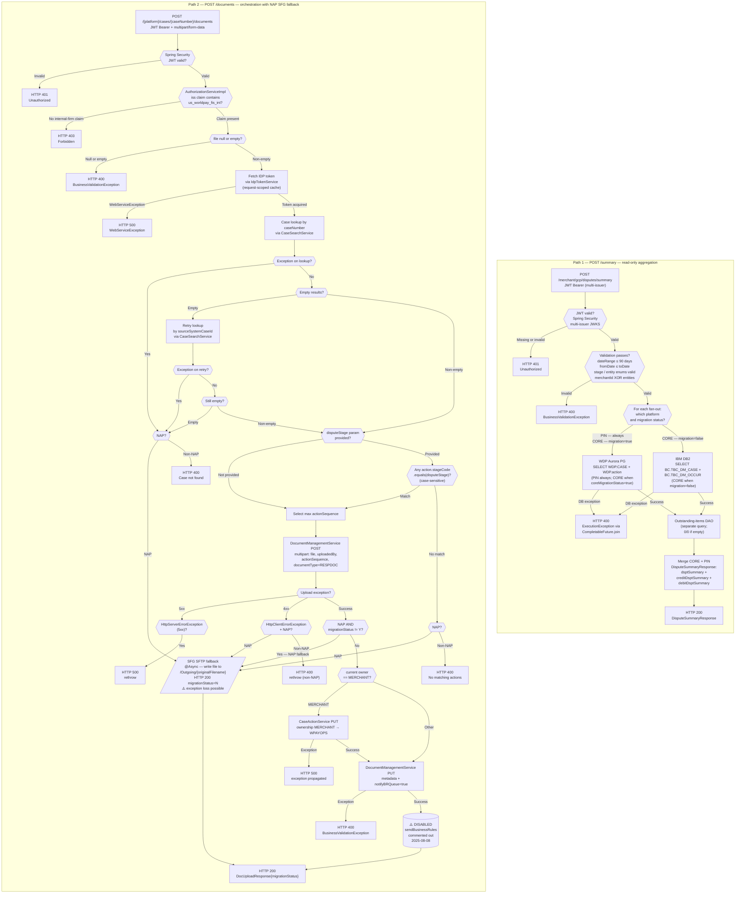

# WDP-COMP-22-DISPUTE-SERVICE
**Worldpay Dispute Platform — Component Reference**
*Version: 2.0 DRAFT | April 2026*
*Source-verified from `mdvs-gcp-disputes-service` by GitHub Copilot CLI on 2026-04-28. Architect-confirmed: PENDING. Supersedes v1.0 DRAFT.*

---

## ━━━ CORE SKELETON ━━━━━━━━━━━━━━━━━━━━━━━━━━━━━━━━━━━━━━

---

## Identity

| Field             | Value                                                        |
|-------------------|--------------------------------------------------------------|
| **Name**          | `DisputeService` (spring.application.name: `Disputes-Service`) |
| **Type**          | `REST API`                                                   |
| **Repository**    | `mdvs-gcp-disputes-service`                                  |
| **Runtime**       | `Java 17 / Spring Boot 3.5.12 / port 8082`                   |
| **Context path**  | `/merchant/gcp/disputes`                                     |
| **K8s deployment**| `mdvs-gcp-disputes-service`                                  |
| **Status**        | `✅ Production`                                              |
| **Doc status**    | `📝 DRAFT v2.0`                                              |
| **Sections present** | `Core \| Block A — REST API`                              |

> ⚠️ **Name mismatch warning (carried from v1.0):** The WDP-COMP-INDEX.md
> entry described this component as "Authoritative service for dispute
> state." This is **incorrect**. Source verification confirms this service
> performs **no database writes and owns no dispute state**. It is a
> read-and-orchestration layer. WDP-COMP-INDEX.md has been corrected.

---

## Purpose

**What it does**

DisputeService is a Spring Boot 3.5.12 / Java 17 read-and-orchestration
service. It exposes two independent REST endpoints — a dispute summary
reporting endpoint and a document-upload orchestration endpoint. The two
endpoints share no service code path and can be reasoned about
independently.

The **summary endpoint** (`POST /summary`) reads dispute case data
in parallel from two databases — WDP Aurora PostgreSQL (PIN platform
always; CORE platform when migrated) and a legacy IBM DB2 system (CORE
platform only, when not yet migrated). It aggregates counts, amounts,
and win/loss outcomes grouped by dispute stage and returns a combined
response with three sections — `dsptSummary`, `creditDsptSummary`, and
`debitDsptSummary`. A data-migration flag (`core_migration_status`)
switches the CORE platform data source between DB2 and PostgreSQL,
supporting an in-flight platform migration without a code deployment.

The **document-upload endpoint**
(`POST /{platform}/cases/{caseNumber}/documents`) orchestrates a
multi-step document delivery flow. It accepts an internal-firm-only
multipart upload, looks up the target case via CaseSearchService,
uploads the document to DocumentManagementService, conditionally
transfers action ownership via CaseActionService, and updates document
metadata. For NAP platform cases — on any error or when migration
status is not `Y` — it falls back to a legacy SFG SFTP delivery path.

The service is also wired as a Kafka producer to the `business-rules`
topic, but the publish call site is **commented out in production code**
(disabled 2025-08-08 by commit `c29018cd`, message "code changes (#93)";
no in-source rationale recorded). The producer infrastructure
(`KafkaProducerConfig`, `BusinessRuleServiceImpl`, MSK dependencies in
`pom.xml`) remains wired and present at runtime.

**What it does NOT do**

- Does NOT own or write dispute state. Source-verified: zero `INSERT`,
  `UPDATE`, or `DELETE` statements anywhere; zero Spring Data
  repositories; zero `@Modifying` annotations; zero `JdbcTemplate`
  usage. All DAO classes use `entityManager.createNativeQuery(...)
  .getResultList()` — read-only SELECT only.
- Does NOT manage case state transitions. The dispute stage codes (REQ,
  CH1, RE2, PAB, ARB, APC, CH2, ACF) are read for filtering — this
  service does not trigger or validate transitions.
- Does NOT call CaseManagementService (COMP-23). Case lookup is
  delegated to CaseSearchService (COMP-27).
- Does NOT call ChargebackService (COMP-21). No runtime dependency
  exists in either direction.
- Does NOT expose any endpoint to external merchants. The
  document-upload endpoint enforces a `contains` check for
  `us_worldpay_fis_int` on the JWT `iss` claim — external callers
  receive HTTP 403.
- Does NOT consume from any Kafka topic. Source-verified zero
  `@KafkaListener`, `@JmsListener`, `@RabbitListener`, WebSocket / SSE
  endpoints, or `@Scheduled` annotations anywhere in the repo.
- Does NOT publish to Kafka at runtime. The `business-rules` producer
  is wired but its call site is commented out.
- Does NOT use the transactional outbox pattern. No outbox table exists
  in this service.
- Does NOT propagate the inbound `v-correlation-id` header to any
  outbound call. The interceptor places it in MDC for logs but the
  REST invokers do not forward it. **Distributed tracing is broken
  at every service boundary out of this component.**

---

## Internal Processing Flow

*Two independent entry paths. They do not converge — different
controllers, different services, no shared call chain. Path 1 is a
read-only aggregation; Path 2 is an orchestration with a fully
fire-and-forget SFTP fallback.*

---

## Boundaries

### Inbound Interfaces

| Source | Protocol | Endpoint | Payload / Description |
|--------|----------|----------|-----------------------|
| Portal UIs / internal WDP services (callers unconfirmed from source) | REST | `POST /merchant/gcp/disputes/summary` | JWT Bearer (multi-issuer). `DisputeSummaryRequest` JSON body. No internal-firm restriction — any authenticated caller. |
| Internal WDP services / Worldpay staff portal (internal firm only) | REST | `POST /merchant/gcp/disputes/{platform}/cases/{caseNumber}/documents` | JWT Bearer + `iss` contains `us_worldpay_fis_int`. `multipart/form-data`. Path: platform, caseNumber. Query: `uploadedBy` (required), `disputeStage` (optional). |

### Outbound Interfaces

| Target | Protocol | Endpoint / Resource | Purpose | On failure |
|--------|----------|---------------------|---------|------------|
| CaseSearchService (COMP-27) | REST in-cluster | `GET …/case-search/{platform}/case/lookup` | Case lookup by `caseNumber` (primary) then `sourceSystemCaseId` (retry) | NAP: SFG SFTP fallback (HTTP 200, migrationStatus=N); non-NAP: HTTP 400 |
| DocumentManagementService (COMP-37) | REST in-cluster | `POST …/document-management/{platform}/documents/{caseNumber}` | Upload document file for the target action (`documentType=RESPDOC`) | 5xx → rethrow HTTP 500. 4xx + NAP → SFG SFTP fallback. 4xx + non-NAP → HTTP 400. |
| DocumentManagementService (COMP-37) | REST in-cluster | `PUT …/document-management/{platform}/document/{caseNumber}/action/{actionSeq}` | Update document metadata; sets `notifyBRQueue=true` | Any exception → HTTP 400 BusinessValidationException |
| CaseActionService (COMP-24) | REST in-cluster | `PUT …/case-actions/{platform}/case/{caseNumber}/action` | Transfer action ownership MERCHANT → WPAYOPS when current owner is MERCHANT | Exception rethrown → HTTP 500 |
| IDP Token Service (`wdp-idp-token-service`) | REST in-cluster | `GET …/idp-token/token` | Obtain service-to-service Bearer token. Cache scope: per-request via `RequestTokenHolder`. | Caught and wrapped — `WebServiceException` → HTTP 500 |
| SFG SFTP Server | SFTP (Spring Integration), private-key auth, port 3222 | `/Outgoing/{originalFilename}` | NAP fallback: deliver document when WDP doc-management path is unavailable or migrationStatus ≠ Y | **Fully `@Async` — fire-and-forget on every code path.** Exception caught → wrapped to `InternalServerError` (500), but @Async dispatch may swallow before propagation. |
| WDP Aurora PostgreSQL | JDBC (HikariCP defaults) | `WDP.CASE`, `WDP.action` | Dispute summary read — PIN always; CORE when `coreMigrationStatus=true` | Native exception caught at CompletableFuture join → HTTP 400 BusinessValidationException |
| CORE DB2 — BC schema (legacy) | JDBC (HikariCP defaults) | `BC.TBC_DM_CASE`, `BC.TBC_DM_OCCUR` | Dispute summary read — CORE platform only when `coreMigrationStatus=false` | Native exception caught at CompletableFuture join → HTTP 400 BusinessValidationException |
| AWS MSK Kafka (`business-rules`) | Kafka (SASL_SSL / AWS_MSK_IAM) | `business-rules` topic | ⚠️ **WIRED BUT INACTIVE** — intended `DOCUMENT_ATTACHED_TO_OPEN_CASE` trigger after document upload. Call site commented out 2025-08-08. | N/A — never invoked at runtime |

**Outbound header set per REST call** — `Authorization: Bearer {idpToken}`,
`Content-Type` (JSON or multipart per call), `Accept: application/json`.
**No `v-correlation-id` is propagated** to any downstream call — confirmed
absent from both `RestInvoker` and `IdpRestInvoker`.

---

## Database Ownership

### Tables Owned (written by this component)

This component owns no database state. **Source-verified zero writes** —
no `INSERT`, `UPDATE`, or `DELETE` statements; no Spring Data
repositories; no `@Modifying`; no `JdbcTemplate`. All DAO classes use
read-only `entityManager.createNativeQuery(...).getResultList()`.

The `wdp.CASE` shared-table risk register entry in WDP-DB.md previously
implied COMP-22 might be the INSERT/DELETE owner. **That speculation is
disproven.** COMP-22 is a reader of `wdp.CASE` only.

### Tables Read (not owned by this component)

**Data source 1: WDP Aurora PostgreSQL (`spring.datasource.wdp`)**
*Used for: PIN platform always; CORE when `coreMigrationStatus=true`.
Transaction manager: `wdpTransactionManager`. Read-only — no SELECT
FOR UPDATE.*

| Schema.Table | Owned by | Why accessed | Key columns |
|--------------|----------|--------------|-------------|
| `WDP.CASE` | COMP-23 CaseManagementService | Case-level header data for dispute summary aggregation | `I_CASE_ID`, `C_CASE_STA`, `C_LEVEL1_ENTITY`–`C_LEVEL10_ENTITY`, `C_TR_TYPE`, `C_CASE_FINAL_LIABILITY` |
| `WDP.action` | ⚠️ Multiple writers (COMP-23, COMP-24, COMP-15) | Action/stage-level data: amounts, stage, type, dates, status | `I_CASE_ID`, `I_ACTION_SEQ`, `C_CASE_STAGE`, `C_ACTION_TYPE`, `C_PRE_NOTE`, `C_ACTION_STA`, `A_DISPUTE_AMT`, `D_ACTION_REPORTED`, `D_ACTION_PROCESSED` |

**Data source 2: CORE DB2 — BC schema (`spring.datasource.core`)**
*Used for: CORE platform only when `coreMigrationStatus=false`.
Transaction manager: `coreTransactionManager`. Read-only.*

| Schema.Table | Owned by | Why accessed | Key columns |
|--------------|----------|--------------|-------------|
| `BC.TBC_DM_CASE` | Enterprise — not WDP owned | Legacy CORE case-level data for dispute summary | `I_CASE_ID`, `I_MRCHNT`, `I_CHN`, `I_ISO`, `I_ISC`, `I_CHN_SUPR`, `I_DIV`, `I_STORE`, `C_CASE_STA`, `C_CC_TYPE`, `C_CASE_RSLT` |
| `BC.TBC_DM_OCCUR` | Enterprise — not WDP owned | Legacy CORE occurrence/action-level data for dispute summary | `I_CASE_ID`, `I_CASE_OCCUR`, `A_DISPUTE`, `C_REC_TYPE`, `X_DSPT_AMT_SGN`, `C_OCCUR_STA`, `D_OCCUR`, `C_OCCUR_ACTN`, `C_PRE_NOTE` |

**Cross-datasource transactions:** none. Two separate
`JpaTransactionManager` instances — no `@Transactional` spans both. Both
managers are used for read-only selects only.

---

## Configuration and Scaling

| Parameter | Value | Notes |
|-----------|-------|-------|
| Replica count | `{{ replicas-mdvs-gcp-disputes-service }}` | XL Deploy / Helm placeholder. Production value not in repo. |
| HPA | None | Not present in `resources.yaml`. |
| Memory request | `1024Mi` | |
| Memory limit | `2048Mi` | |
| CPU request | **Not set** | No `cpu` key under `requests` in `resources.yaml`. |
| CPU limit | **Not set** | No `cpu` key under `limits` in `resources.yaml`. |
| Deployment type | Kubernetes Deployment | |
| Rollout strategy | RollingUpdate — `maxSurge: 1`, `maxUnavailable: 0` | |
| PodDisruptionBudget | None | Not present. |
| Topology spread | `ScheduleAnyway` | `topologyKey: kubernetes.io/hostname`, `maxSkew: 1`. Label selector matches pod label — **no mismatch** (corrected from v1.0). |
| Liveness probe | HTTP `/livez` on port 8082 | initialDelay 30s, period 10s, failureThreshold 3 |
| Readiness probe | HTTP `/readyz` on port 8082 | initialDelay 20s, period 10s, failureThreshold 3. **Corrected from v1.0 — port 8052 was not real.** |
| Startup probe | None | |
| Database connection pool | HikariCP **defaults** on both datasources | No `spring.datasource.*.hikari.*` properties anywhere in source. Defaults: `maximumPoolSize=10`, `connectionTimeout=30s`, `idleTimeout=10m`, `maxLifetime=30m`. |
| Tomcat thread pool | Spring Boot **defaults** | No `server.tomcat.*` properties anywhere. Defaults: `threads.max=200`, `threads.min-spare=10`, `accept-count=100`, `connection-timeout=20s`. |
| Async executor (SFTP) | Externalised env vars | `corePoolSize=${gcp_async_corepoolsize}`, `maxPoolSize=${gcp_async_maxpoolsize}`, `queueCapacity=${gcp_async_queuecapacity}`. **No defaults** — startup-fails-if-absent. Rejection policy default `AbortPolicy`. Thread name prefix `AsynchThread-`. |
| Observability | OpenTelemetry Java agent (auto-injected via `instrumentation.opentelemetry.io/inject-java`); Spring Boot Actuator (`/info`, `/health`, `/prometheus`); Logstash TCP appender (`LOGSTASH_SERVER_HOST_PORT` env var) + console; Micrometer Prometheus tagged `application=${app.name}`; correlation ID via `HttpInterceptor` writing `v-correlation-id` to MDC | |

**Manifest inventory:** `resources.yaml` (Deployment + Service +
Ingress), `deployit-manifest.xml` (XL Deploy), `Jenkinsfile`, `pom.xml`.
**No** Dockerfile (kpack `jammy-base` builder), no Helm chart, no
values.yaml, no kustomization, no HPA manifest, no PDB manifest.

**Active feature flag — `core_migration_status`** — env var
`core_migration_status` bound at `app.core-migration-status`. **No
default in YAML.** When unset, Spring placeholder resolution fails and
the application will not start.

**Trusted JWT issuers** — `jwt.trustedIssuers` is bound from env var
`jwt_trusted_issuer_urls`. Per-environment values are not in repo.

**Internal-firm enforcement** — application-layer (not Spring Security),
`contains` check on JWT `iss` claim against literal `us_worldpay_fis_int`.

**Swagger / OpenAPI** — `/disputes-service-api-docs`,
`/disputes-service-api-docs/swagger-config`, `/swagger-ui/**` are
whitelisted in `SecurityConfig` and exposed in **non-prod environments
only**.

---

## Key Architectural Decisions

| Decision | ADR reference | Notes |
|----------|---------------|-------|
| Two datasources read in parallel via `CompletableFuture` for `/summary` | Local | CORE and PIN fan-out joined before mapping. Default `ForkJoinPool.commonPool()` (no dedicated executor). |
| Migration via runtime feature flag (`core_migration_status`) | Local | Switches CORE platform reads between WDP PG and DB2 without a deploy. Flag has no default — environment must set it. |
| NAP failure paths return HTTP 200 with `migrationStatus=N` | Local | Operational graceful-degradation contract. Callers must inspect `migrationStatus` to know which delivery path was used. |
| No transactional outbox | DEC-001 — NOT APPLICABLE | No DB writes, no Kafka writes at runtime. |
| Disabled producer key = `merchantId` | DEC-003 — COMPLIES (when active) | Matches platform standard but call site is commented out. |
| No PAN handled anywhere | DEC-004, DEC-019 — NOT APPLICABLE | Source-verified clean — no PAN field in any DTO, log, or DAO. |
| No Kafka consumer | DEC-005 — NOT APPLICABLE | |
| **No Resilience4j, no client timeouts** | **DEC-014 — DEVIATION** | Plain `RestTemplate` with no connect or read timeout on every outbound REST call. No circuit breaker on any of the 6 active outbound dependencies. **🔴 HIGH severity.** Compounded by HikariCP and Tomcat defaults (no bulkhead). |
| **No idempotency on `POST /documents`** | **DEC-020 — DEVIATION** | No idempotency-key header, no dedup table, no replay-protection filter. Duplicate calls re-upload, re-transfer ownership, re-publish metadata. **🟡 MEDIUM severity.** |
| Kafka publish disabled in source | Local | Commented out 2025-08-08 (commit `c29018cd`). Producer infrastructure remains wired. Re-enabling would require an outbox pattern to satisfy DEC-001. |

---

## Risks and Constraints

| Severity | Risk | Consequence |
|----------|------|-------------|
| 🔴 HIGH | No timeouts on any of 6 outbound REST dependencies (CaseSearch, DocMgmt POST, DocMgmt PUT, CaseAction, IDP token) — DEC-014 deviation | A slow dependency blocks Tomcat threads until OS TCP timeout fires. With Tomcat defaults (200 threads, 100 accept-queue) and HikariCP defaults (10 connections), a single sluggish dependency can saturate the entire pod. **No bulkhead** — `/summary` and `/documents` share the same Tomcat pool, so a stuck `/documents` flow degrades reporting too. |
| 🔴 HIGH | No circuit breakers — confirmed absent from `pom.xml` | Any downstream service failure cascades unbounded. No automated recovery. No fail-fast. |
| 🟡 MEDIUM | NAP error paths silently return HTTP 200 | Caller cannot distinguish successful WDP delivery from SFG SFTP fallback without inspecting `migrationStatus` in the response body. Observability gap for upstream callers. |
| 🟡 MEDIUM | **SFG SFTP fallback is fully `@Async`** (corrected from v1.0) | Both happy-path and error-path SFTP writes run on the async executor. The HTTP 200 response is returned **before** the SFTP write is attempted. If `SftpServiceImpl` throws, the exception is caught inside the executor and may be lost. **The caller has no signal that the file actually landed.** |
| 🟡 MEDIUM | SFG SFTP filename is the raw `getOriginalFilename()` — no namespacing | Two simultaneous uploads with the same filename overwrite each other on the SFTP target. No case-number prefix, no action-sequence, no timestamp. |
| 🟡 MEDIUM | Required env vars have no defaults — `core_migration_status`, `gcp_async_corepoolsize`, `gcp_async_maxpoolsize`, `gcp_async_queuecapacity` | Application fails to start (`IllegalArgumentException` on placeholder resolution) if any one is unset. Migration-flag absence is silent: operators may assume a default that does not exist. |
| 🟡 MEDIUM | No idempotency on `POST /documents` — DEC-020 deviation | Network-retried uploads re-execute the entire chain: re-upload to DocMgmt, re-transfer ownership, re-publish metadata, re-trigger any downstream BR queue work via `notifyBRQueue=true`. |
| 🟡 MEDIUM | Inbound `v-correlation-id` is **not** propagated on any outbound call | MDC has the correlation ID for local logs only. Distributed traces break at every service boundary out of this component. Cross-service incident triage on the `/documents` flow is degraded. |
| 🟡 MEDIUM | No CPU limit and no CPU request | No K8s scheduler signal, no QoS guarantee, no cgroup throttling. Pod can be evicted under node pressure regardless of priority. |
| 🟡 MEDIUM | CORE DB2 dependency with no resilience | DB2 is a legacy enterprise system not owned by WDP. No timeout, no retry, no circuit breaker on the DB2 JDBC connection. CORE summary unavailable when DB2 is down — no graceful degradation. |
| 🟢 LOW | 401 vs 403 status-code inconsistency | `AuthorizationServiceImpl` constructs `ForbiddenException` with `HttpStatus.UNAUTHORIZED`, but `GlobalExceptionHandler` returns 403. Constructor's status code is dead code. |
| 🟢 LOW | Kafka producer wired but inactive | If re-enabled without an outbox write in the same transaction, event loss is possible on Kafka unavailability — DEC-001 deviation risk surfaces immediately. Producer infrastructure carries dead weight at runtime. |
| 🟢 LOW | `spring-boot-starter-oauth2-client` declared in `pom.xml` but unused | No `@EnableOAuth2Client`, no `ClientRegistration`, no client flow. Dead dependency. |
| 🟢 LOW | `app.name` referenced in Prometheus metric tag config but never defined | Metric tag `application` likely resolves to empty string. Cardinality / dashboard-grouping gap. |
| 🟢 LOW | `kafka.retry-count` and `kafka.retry-delay` configured in YAML but never injected | `BusinessRuleServiceImpl` hardcodes `maxAttemptsExpression="3"` and `delayExpression="100"`. Operators changing the YAML values get no behaviour change. |
| 🟢 LOW | Dead method `constructNativeQuery` at `USDisputeSummaryDaoImpl.java:108-122` | Never called. References non-existent helper methods. Technical debt. |

---

## Planned Changes

- ⚠️ **OPEN QUESTION:** Why was the Kafka publish at
  `DocumentServiceImpl.java:174` commented out on 2025-08-08?
  Commit message ("code changes (#93)") is generic. PR review or
  team confirmation needed. If it is intended to be re-enabled,
  DEC-001 transactional outbox must be designed in first.
- ⚠️ **OPEN QUESTION:** Known callers of both endpoints — no contract
  tests, postman collections, or docs in repo. Architect / team
  confirmation needed for the integration map.
- ⚠️ **OPEN QUESTION:** Production replica count
  (`{{ replicas-mdvs-gcp-disputes-service }}`) — XL Deploy / K8s env
  config. Any value > 1 is fine for a stateless reader but matters
  for the `@Async` SFTP executor capacity sizing review.
- ⚠️ **OPEN QUESTION:** JWT trusted-issuer URLs per environment —
  externalised via `jwt_trusted_issuer_urls` env var; not in repo.
- ⚠️ **OPEN QUESTION:** Whether the unconfigured HikariCP and Tomcat
  pools are intentional defaults or an oversight. Given the
  no-timeouts / no-CB posture, defaults expose the service to
  full-pod saturation under any single slow dependency.
- ⚠️ **OPEN QUESTION:** SFG SFTP filename collision — is namespacing
  required (case-number / action-seq / timestamp prefix)? Architect
  decision.
- ⚠️ **OPEN QUESTION:** Should `v-correlation-id` propagation be added
  to outbound REST calls platform-wide? COMP-22 is one of multiple
  components missing this — candidate for a platform-level decision.
- No quarterly migration confirmed for COMP-22 itself. CORE platform
  data-source migration (`core_migration_status` flag) is in flight
  at the platform level but is not COMP-22-specific.

---

---

## ━━━ TYPE BLOCK A — REST API CONTRACTS ━━━━━━━━━━━━━━━━━━━

---

## REST API Contracts

**Authentication model:** OAuth2 Resource Server — multi-issuer JWT
Bearer token. Trusted issuers configured via env var
`jwt_trusted_issuer_urls`. All endpoints require a valid Bearer JWT
(Spring Security 401 on missing or invalid token). The
document-upload endpoint **additionally** enforces a `contains` check
for `us_worldpay_fis_int` on the JWT `iss` claim — applied in the
controller method via `AuthorizationService`, not in the Spring
Security filter chain.

**Base URL pattern:** `https://<host>/merchant/gcp/disputes` (port 8082)

**Whitelisted paths** (Spring Security): `/livez`, `/readyz`,
`/actuator/**`, and (non-prod only) `/disputes-service-api-docs/**`,
`/swagger-ui/**`.

---

### Endpoint: `POST /summary`

**Full path:** `POST /merchant/gcp/disputes/summary`
**Purpose:** Aggregated dispute summary — counts, amounts, win/loss
outcomes grouped by dispute stage, plus outstanding items. CORE and
PIN data fetched in parallel and merged.
**Caller(s):** Not determinable from source. Likely portal UIs or
internal reporting consumers.
**Auth required:** Bearer JWT (multi-issuer). No internal-firm
restriction.

**Request — `DisputeSummaryRequest`**

| Field | Type | Required | Description |
|-------|------|----------|-------------|
| `dateType` | Enum | No | `REPORT_DATE` or `DISPUTE_ACTION_DATE` — selects the date column for the filter |
| `dateRange` | Object `{fromDate, toDate}` | Yes | Inclusive date range, max 90 days, `fromDate ≤ toDate` |
| `merchantId` | List\<String\> | Conditional | Mutually exclusive with `entities` |
| `entities` | EntityListType | Conditional | Hierarchical entity filter — parent must be `CH`, child must be `DV`/`ST`/`MT` |
| `getOpenAction` | Boolean | No | If true, restricts to max-sequence action per case |
| `groupby` | Enum | No | Currently only `DISPUTE_STAGE` is valid |
| `disputeStage` | List\<String\> | No | Filter to specific stage codes: `REQ`, `CH1`, `RE2`, `PAB`, `ARB`, `APC`, `CH2`, `ACF` |

**Response — Success**

| HTTP Status | Condition | Body |
|-------------|-----------|------|
| 200 | Successful summary retrieval | `DisputeSummaryResponse` — `dsptSummary` (combined), `creditDsptSummary` (CORE), `debitDsptSummary` (PIN). Each section: `groupByType`, `totalAmount`, `totalCount`, `outstandingDsptAmount`, `outstandingDsptCount`, `groupedResults[]`, `dsptOutcome[]`. |

**Response — Error**

| HTTP Status | Condition | Body |
|-------------|-----------|------|
| 400 | Validation failure (date range > 90 days, fromDate > toDate, invalid enum, malformed entity, mutual-exclusion violation), DB query exception, parallel-thread interruption | `BusinessValidationException` body — message + code |
| 401 | Missing or invalid JWT | Spring Security default body |
| 404 | No handler for the URL | Spring Boot default |
| 405 | Wrong HTTP method | Spring Boot default |
| 500 | Unhandled runtime exception, message parse failure | Generic error body |

**Notes:** Outstanding-items figure is fetched via a separate DAO call.
Empty result yields `outstandingDsptAmount=0` and `outstandingDsptCount=0`
on the response, not a 400 error. **Field-name correction from v1.0** —
the response uses `dspt*` (not `dept*`) and `outstandingDspt*` (not
`outstandingAmount` / `outstandingItems`).

---

### Endpoint: `POST /{platform}/cases/{caseNumber}/documents`

**Full path:**
`POST /merchant/gcp/disputes/{platform}/cases/{caseNumber}/documents`
**Purpose:** Upload a document to a case. Orchestrates: IDP token
fetch → case lookup via CaseSearchService → document upload via
DocumentManagementService → conditional ownership transfer via
CaseActionService → metadata update via DocumentManagementService.
For NAP platform — falls back to SFG SFTP delivery on any error or
when `migrationStatus != Y`.
**Caller(s):** Internal WDP services or Worldpay staff portal only.
External merchants cannot reach this endpoint — the internal-firm
JWT issuer claim is enforced.
**Auth required:** Bearer JWT (multi-issuer) **plus** `iss` claim
contains `us_worldpay_fis_int`. The `contains` check is the exact
predicate, not equals.
**Content type:** `multipart/form-data`

**Path parameters**

| Parameter | Description |
|-----------|-------------|
| `platform` | Platform code — `NAP`, `VAP`, `CORE`, or `LATAM`. NAP comparison is `equalsIgnoreCase`. |
| `caseNumber` | WDP case number or source-system case ID |

**Query parameters**

| Parameter | Required | Description |
|-----------|----------|-------------|
| `uploadedBy` | Yes | User ID of the uploader |
| `disputeStage` | No | Restrict matching actions to a specific stage code (e.g. `CH1`). Case-sensitive equality on `ActionDetailsResponse.stageCode`. If absent, all actions are considered. |

**Request part**

| Part | Required | Description |
|------|----------|-------------|
| `file` | Yes | Multipart binary file. Must be non-null and non-empty — empty file → HTTP 400. Filename is forwarded verbatim (no namespacing) to SFG SFTP on fallback. |

**Response — Success**

| HTTP Status | Condition | Body |
|-------------|-----------|------|
| 200 | Document processed — including any NAP fallback to SFG SFTP | `DocUploadResponse{ migrationStatus }` — `"Y"` = delivered to WDP DocumentManagementService; `"N"` = SFG SFTP fallback used |

**Response — Error**

| HTTP Status | Condition | Body |
|-------------|-----------|------|
| 400 | Empty file; case not found (non-NAP); no matching actions for stage (non-NAP); upload 4xx (non-NAP); metadata-update exception | `BusinessValidationException` / `BadRequestException` body |
| 401 | Missing or invalid JWT | Spring Security default |
| 403 | JWT present but `iss` does not contain `us_worldpay_fis_int` | `ForbiddenException` body |
| 500 | Upload 5xx; IDP token failure (`WebServiceException`); ownership-transfer exception; SFG SFTP synchronous failure path; unhandled exception | Generic error body |

**Notes:**
- **NAP platform errors are never surfaced as 4xx/5xx to the caller.**
  All error paths for NAP route to SFG SFTP fallback and return
  HTTP 200. Callers must inspect `migrationStatus` in the response
  body to determine which delivery path was used.
- **The SFG SFTP write is fully `@Async`** — fire-and-forget on every
  invocation, including error paths. The HTTP 200 response is returned
  before the SFTP write completes. If the SFTP write fails, the
  exception is caught inside the executor and may be lost — **the
  caller has no signal that the file actually landed.**
- The Kafka `business-rules` publish that would follow successful
  metadata update is commented out (since 2025-08-08) and does not
  execute.
- `notifyBRQueue=true` is hardcoded on the metadata-update PUT —
  every successful upload triggers BR-queue notification downstream
  in DocumentManagementService.

---

*End of WDP-COMP-22-DISPUTE-SERVICE.md v2.0 DRAFT.*
*Source-verified by GitHub Copilot CLI 2026-04-28. Architect
confirmation pending.*
