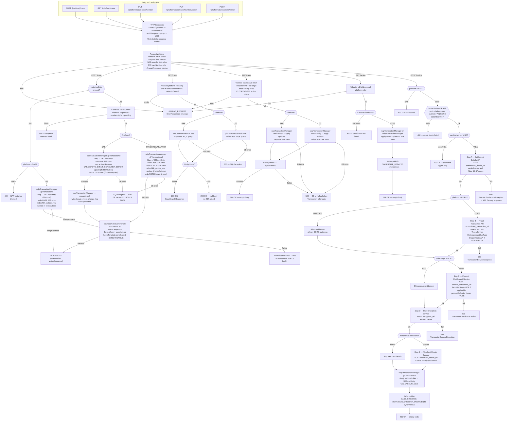

# WDP-COMP-23-CASE-MANAGEMENT-SERVICE
**Worldpay Dispute Platform — Component Reference**
*Version: 1.0 DRAFT | April 2026*
*Extracted from: `Worldpay/mdws-gcp-case-management-service` using GitHub Copilot CLI | Architect-confirmed: PENDING*

---

## ━━━ CORE SKELETON ━━━━━━━━━━━━━━━━━━━━━━━━━━━━━━━━━━━━━━

## Identity

| Field | Value |
|---|---|
| **Name** | `CaseManagementService` |
| **Type** | `REST API + Kafka Producer` |
| **Repository** | `Worldpay/mdws-gcp-case-management-service` (GitHub Enterprise) |
| **Artifact** | `com.wp.gcp:case-management-service:2.0.6` |
| **Runtime** | Spring Boot 3.5.11 / Java 17 |
| **Context path** | `/merchant/gcp/case-management` |
| **Port** | `8082` |
| **Status** | `✅ Production` |
| **Doc status** | `📝 DRAFT` |
| **Sections present** | `Core | Block A — REST | Block C — Kafka Producer` |

---

## Purpose

**What it does**

CaseManagementService is the authoritative owner of the dispute case record across the entire WDP platform. It is the single write target for case creation and case update operations across all five acquiring platforms: NAP (UK), PIN, CORE, VAP, and LATAM. It owns two separate PostgreSQL databases — the `nap` schema for UK/NAP cases and the `wdp` schema for all US platform cases — and the two schemas are never in the same transaction.

The service exposes five REST endpoints: case creation (standard and historical variants), case search, case update, case action update, and transaction enrichment. Every material case write triggers a synchronous Kafka publish to the business event topic, which is consumed downstream by the Business Rules engine (COMP-16 BusinessRulesProcessor). The Kafka publish is part of the same application-level unit of work as the database write — a Kafka failure rolls back the database transaction.

The transaction enrichment endpoint is a secondary flow designed for internal retry use. When a case was created in a non-enriched state (`enrichFailure=true`), this endpoint re-runs a five-step enrichment sequence against external services — Settlement Details, Fraud Switch, Product Entitlement, PAN Encryption, and Merchant Details — then re-saves the case record and re-publishes to Kafka. This endpoint is restricted to PIN and CORE platforms only; NAP is blocked with a 400.

The service is a pure Kafka producer. It has no Kafka consumer side, no consumer group, and no offset commitments.

**What it does NOT do**

- Does not consume from any Kafka topic — it is a producer only
- Does not perform JWT authentication — that is the API Gateway (COMP-01); this service validates that a JWT is present but does not enforce roles or scopes
- Does not perform case-level authorization — that is delegated upstream to UAMS (COMP-02) and CHAS (COMP-03) via the API Gateway
- Does not implement the transactional outbox pattern — Kafka is published synchronously in application code after the DB transaction commits; there is no relay outbox table
- Does not implement idempotency for case creation — no duplicate detection query exists; concurrent identical requests will produce two separate case records
- Does not encrypt PAN on standard case creation — clear card number is written directly to `nap.case` and `wdp.CASE` during the create flow; PAN encryption only occurs during the transaction enrichment flow
- Does not configure Resilience4j on any outbound dependency — all external REST calls are bare RestTemplate with no circuit breaker
- Does not call BusinessRulesService (COMP-31) — publishes Kafka events for the Business Rules engine to consume
- Does not own the `wdp.chbk_outbox_row` table — it updates existing rows written upstream; it does not create new outbox rows

---

## Internal Processing Flow

The service processes five distinct endpoint paths. All paths share the HTTP interceptor (correlation ID and idempotency-key propagation) and a synchronous RequestValidator before any database work begins.

**POST /{platform}/case (standard):** Validate → generate caseNumber from platform-specific DB sequence → route to NAP or US transaction → JPA save case + actions + optional notes → (NAP only) separately write `wdp.dispute_event_change_log` → Kafka publish synchronously → 201 CREATED.

**POST /{platform}/case (historical):** Triggered when `historicalData` field is non-null in the request. NAP platform is blocked (400). US path follows same shape as standard but writes to `wdp.chbk_outbox_row` if present; Kafka publish is conditional on `notifyBre=true`.

**GET /{platform}/case:** Validate one-of search param constraint → query `nap.case` or `wdp.CASE` → return CaseSearchResponse or null body (no 404 raised on not-found).

**PUT /{platform}/case/{caseNumber}:** Validate status transition rules → fetch entity → apply updates → JPA save → Kafka publish → 200 OK empty body.

**PUT /{platform}/case/{caseNumber}/action:** Validate ≥1 field non-null → fetch case+action via JOIN FETCH → apply update → JPA save → Kafka publish OWNERSHIP_UPDATED event → 200 OK empty body.

**POST /{platform}/transactions/enrich:** NAP blocked → guard check (must be DRAFT, enrichFailure=true, PIN or CORE, actionSeq=01) → VISA card only (non-VISA silent 200 exit) → Step A Settlement → Step B Fraud (CORE only) → Step C Product Entitlement → Step D PAN Encryption → Step E Merchant Details (failure swallowed) → `wdp.CASE` update + Kafka publish CASE_CREATED with `startRuleGroup=ISSUER_DOCUMENTS` → 200 OK.



---

## Boundaries

### Inbound Interfaces

| Source | Protocol | Endpoint | Payload / Description |
|--------|----------|----------|-----------------------|
| API Gateway (COMP-01) — proxied from COMP-14 CaseCreationConsumer | REST/HTTP | `POST /{platform}/case` | CaseRequest — new dispute case (PIN/CORE/VAP/LATAM) |
| API Gateway (COMP-01) — proxied from COMP-05 NAPDisputeEventProcessor | REST/HTTP | `POST /nap/case` | NAP SRV116 first-occurrence case creation |
| API Gateway (COMP-01) — proxied from COMP-05 NAPDisputeEventProcessor | REST/HTTP | `PUT /nap/case/{caseNumber}` | NAP subsequent event case update |
| API Gateway (COMP-01) — proxied from COMP-06 NAPDisputeDeclineBatch | REST/HTTP | `GET /nap/case` | Case lookup by ARN / networkCaseId / caseNumber |
| API Gateway (COMP-01) — proxied from COMP-07 VisaDisputeBatch | REST/HTTP | `GET /{platform}/case` | Case lookup to verify cardNetwork=VISA |
| Internal retry caller (unconfirmed — enrichFailure guard suggests CaseCreationConsumer or manual ops) | REST/HTTP | `POST /{platform}/transactions/enrich` | CaseTransactionRequest — enrichment retry |

### Outbound Interfaces

| Target | Protocol | Endpoint / Resource | Purpose | On failure |
|--------|----------|---------------------|---------|------------|
| PostgreSQL — NAP datasource | JDBC/JPA | `nap.case`, `nap.action`, `nap.NOTES`, `NAP.DISPUTE_EVENT_CONSUMER_ERROR` | Case and action persistence for NAP platform | SQLException → 500, transaction rolls back |
| PostgreSQL — WDP datasource | JDBC/JPA | `wdp.CASE`, `wdp.ACTION`, `wdp.NOTES`, `wdp.chbk_outbox_row`, `wdp.dispute_event_change_log` | Case and action persistence for US platforms | SQLException → 500, transaction rolls back |
| AWS MSK Kafka | Kafka producer | `${kafka_business_event_topic}` | Publish BusinessRuleEvent per action — triggers BRE downstream | isErrorOccurred=true → 500 InternalServerError → DB rolls back |
| Settlement Details Service | REST/HTTP POST | `${settlements_details_url}` | Step A enrichment — fetch settled transaction data | 500 TransactionServiceException; empty response → 400 |
| Fraud Transaction API | REST/HTTP POST | `${fraud_transaction_url}` | Step B enrichment — fraud system lookup (CORE only) | 500; skipped entirely for non-CORE |
| Product Entitlement Service | REST/HTTP GET | `${product_entitlement_url}` | Step C enrichment — RDR/DEFENDER enrolment check | 500 TransactionServiceException |
| PAN Encryption Service (COMP-37) | REST/HTTP POST | `${encryption_url}` | Step D enrichment — encrypt raw PAN to HPAN | 500 TransactionServiceException |
| Merchant Details Service | REST/HTTP POST | `${merchant_details_url}` | Step E enrichment — fetch merchant data | **Silently swallowed** — logs at INFO, continues with empty response |
| Display Code Service | REST/HTTP POST | `${display_code_url}` | Called within Step B to resolve sub-product tier for GUARPAY1/GUARPAY4 | 500 TransactionServiceException |
| IDP / OAuth2 Token Provider | OAuth2 client credentials | `${idp_token_url}` | Obtain Bearer tokens for all internal REST calls | Exception propagates, fails the request |

---

## Database Ownership

### Tables Owned (written by this component)

| Schema.Table | Purpose | Key columns | Notes |
|---|---|---|---|
| `nap.case` | Stores NAP platform dispute cases | `I_CASE_ID` (PK), `I_CASE` (case number), `C_CASE_STA` (status), `C_ACQ_PLATFORM`, `I_ACQ_REFNCE_NUM` (ARN), `C_NTWK_CASE_ID`, `I_CASE_ACTION_MAX_SEQ`, `C_ENRICH_FAILURE`, `I_ACCI_CDH` | ⚠️ Raw card number stored without encryption. `napTransactionManager`. Owned exclusively by this service. |
| `nap.action` | Dispute actions for NAP cases | `ACTION_ID` (PK), `I_CASE` (FK), `I_ACTION_SEQ`, `C_ACTION_TYPE`, `C_ACTION_STA`, `C_CASE_STAGE`, `C_SPEC_HANDLING` | Cascade from `UKCaseEntity`. `napTransactionManager`. |
| `wdp.CASE` | Stores PIN/CORE/VAP/LATAM dispute cases | `I_CASE_ID` (PK), `I_CASE`, `C_CASE_STA`, `C_ACQ_PLATFORM`, `I_ACQ_REFNCE_NUM`, `C_NTWK_CASE_ID`, `I_CASE_ACTION_MAX_SEQ`, `C_ENRICH_FAILURE`, `I_ACCT_CDH` | ⚠️ Raw card number on create; HPAN post-enrichment. `wdpTransactionManager`. |
| `wdp.ACTION` | Actions for US platform cases | `I_ACTION_ID` (PK), `I_CASE` (FK), `I_ACTION_SEQ`, `C_ACTION_STA`, `C_CASE_STAGE`, `C_SPEC_HANDLING`, `C_ACTION_TYPE`, `C_OWNR` | `wdpTransactionManager`. |
| `wdp.NOTES` | Optional notes on US cases | `USNotesEntity` | Written in same `wdpTransactionManager` transaction as case save. ⚠️ Confirm no other service writes here. |
| `nap.NOTES` | Optional notes on NAP cases | `UKNotesEntity` | Written in same `napTransactionManager` transaction as case save. ⚠️ Confirm no other service writes here. |
| `wdp.dispute_event_change_log` | Audit log of dispute event state per action (NAP path only) | `I_event_id` (PK), `I_case`, `C_action_type`, `C_case_stage`, `C_owner`, `C_event_type`, `C_processing_status` | ⚠️ Written via `wdpTransactionManager` from within the NAP create path which uses `napTransactionManager`. **Separate transaction from NAP case save** — cross-datasource boundary. |

### Tables Read / Updated (not owned by this component)

| Schema.Table | Owned by | Access type | Notes |
|---|---|---|---|
| `wdp.chbk_outbox_row` | COMP-07 / COMP-08 / COMP-09 | Update only | Sets `status`, `i_case`, `updated_at` when caller provides chbkOutbox reference. Same `wdpTransactionManager` transaction as US case save. |
| `NAP.DISPUTE_EVENT_CONSUMER_ERROR` | COMP-05 NAPDisputeEventProcessor | Update only | Sets `errorStatus`, `updatedTimestamp` when caller provides chbkOutbox reference. Same `napTransactionManager` transaction as NAP case save. |

### Transaction Boundaries Summary

| Operation | `napTransactionManager` | `wdpTransactionManager` |
|---|---|---|
| NAP case create | `nap.case` + `nap.action` + `NAP.DISPUTE_EVENT_CONSUMER_ERROR` + `nap.NOTES` | Separate call: `wdp.dispute_event_change_log` |
| US case create | — | `wdp.CASE` + `wdp.ACTION` + `wdp.chbk_outbox_row` + `wdp.NOTES` |
| US historical create | — | `wdp.CASE` + `wdp.ACTION` + `wdp.chbk_outbox_row` |
| NAP case update | `nap.case` + `nap.action` | — |
| US case update | — | `wdp.CASE` + `wdp.ACTION` |
| Transaction enrichment | — | `wdp.CASE` |

**The two datasources are NEVER in the same transaction.**

---

## Architecture Decisions

| Decision | Reference | Status |
|---|---|---|
| Single service owns the case record — authoritative source for all platforms | DEC-PLACEHOLDER → raise when WDP-DECISIONS.md rebuilt | Confirmed |
| Kafka publish is synchronous and within the application unit of work — failure rolls back DB | DEC-001 non-compliant | ⚠️ Confirmed deviation |
| Partition key is `caseNumber`, not `merchantId` | DEC-003 deviation | ⚠️ Confirmed deviation |
| Clear PAN written to persistent storage on standard case creation | DEC-004 violation | ⚠️ Confirmed deviation |
| No Resilience4j on any outbound dependency | DEC-014 non-compliant | ⚠️ Confirmed deviation |
| No idempotency guard for case creation | Platform risk — raise ADR | ⚠️ Confirmed gap |

---

## Risks and Constraints

| Risk | Severity | Detail |
|---|---|---|
| **No idempotency on case creation** | High | Two concurrent requests for the same dispute will produce two separate case records. The `idempotency-key` header is propagated to Kafka but not used for duplicate detection. No unique constraint checked before INSERT. |
| **Clear PAN persisted at case creation** | High (DEC-004) | `cardNumber` from `CaseRequest` is written directly to `nap.case.I_ACCI_CDH` and `wdp.CASE.I_ACCT_CDH` without encryption. Encryption only occurs during the enrichment flow. |
| **Kafka publish outside DB transaction** | High (DEC-001) | Kafka fires in application code after `@Transactional` commits. No outbox relay. Kafka failure after DB commit is unrecoverable without manual intervention. |
| **No circuit breakers on any external dependency** | High (DEC-014) | Settlement Details, Fraud Switch, Product Entitlement, PAN Encryption, and Merchant Details are all called via bare RestTemplate with no timeout, no retry, and no circuit breaker. A slow external dependency blocks the enrichment request indefinitely. |
| **No connection or read timeouts** | High | `RestInvokerConfig` creates a bare `new RestTemplate()` with no timeout values. Confirmed from source. |
| **Cross-datasource partial write on NAP create** | Medium | `wdp.dispute_event_change_log` is written in a separate `wdpTransactionManager` transaction from within the NAP create path which uses `napTransactionManager`. If the change-log write fails after case save succeeds, the audit row is missing but the case exists. |
| **Topology spread constraint label mismatch** | Medium | `labelSelector` in topology spread constraint uses `${BRANCH_NAME_PLACEHOLDER}` — a deployment-time substitution variable. If not substituted at deploy time, the constraint fails silently and pods may not spread across nodes. |
| **Fraud Switch hardcoded skip for non-CORE** | Medium | `skipFraudSwitchAPI = true` for all platforms except CORE. Fraud enrichment is a no-op for PIN, VAP, LATAM. No feature-flag framework — requires a deployment to toggle. |
| **productDefender hardcoded to FALSE** | Low | `Boolean.FALSE` is forced in `DisputeServiceImpl.formatProductEntitlementResponse`. PO confirmed intentional pending disputes API migration, but silently overrides any actual entitlement result. |
| **C_DUPLICATE_IND ORM column commented out** | Low | Duplicate indicator field exists in DB schema and setter is still called in `mapNapActionDetails`, but JPA column annotation is commented out. Setter call silently fails (null field). |
| **PinActionDao has no implementation** | Low | Interface declared and mapped but no implementation class exists in source tree. Any call path relying on this DAO would fail at runtime. |
| **No HPA configured** | Low | Pod count does not scale automatically under load. Replica count set via XL Deploy variable — exact production value not in source. |
| **No CPU limits or requests configured** | Low | `resources.limits` and `resources.requests` have no CPU entries. Pod can consume unbounded CPU. |
| **Heap dump capture disabled** | Low | Volume mount and JAVA_TOOL_OPTIONS for OOM heap dump are commented out in resources.yaml. |
| **NAP.BUSINESS_RULE_CONSUMER_ERROR mapped but unused** | Low | Repository and entity declared and mapped to `NAP.BUSINESS_RULE_CONSUMER_ERROR`, but no service method calls `save` on this repository. Scaffolded but not wired up. |

---

## Planned and Incomplete Work

| Item | Type | Detail |
|---|---|---|
| Remove `productDefender = false` hardcode | Technical debt | Comment in source: "Confirmed with PO, Will remove before disputes API migration" |
| Enable fraud switch for non-CORE platforms | Technical debt | `skipFraudSwitchAPI = true` hardcoded with comment: "no confirmation on transactionNumber" |
| Map commented-out action fields | Incomplete | `adjustmentDate`, `binRepoint`, `cashBack`, `convenienceFee`, `currencyConversion`, `foreignTransaction`, `foreignCurrency`, `geoStore`, `post` — exist in entity but not mapped from inbound requests. Comment: "need to get confirmation" |
| Implement PinActionDao | Incomplete | Interface declared; no implementation class exists |
| Wire BusinessRulesConsumerErrorRepository | Incomplete | Repository and entity declared; no service calls `save` on it |
| Re-enable `caseEndDate` requirement for caseLiability | Commented-out validation | Currently commented out with no stated reason |
| Address GlobalExceptionHandler TODO | TODO | Line 172 — `// TODO` on `METHOD_NOT_ALLOWED` error handler; no further context |
| Re-enable heap dump capture | Commented-out infra | Volume mount and JAVA_TOOL_OPTIONS commented out in resources.yaml |

---

## Scaling and Deployment

| Property | Value |
|---|---|
| Kubernetes resource type | `Deployment` |
| Replica count | `{{ replicas-mdvs-gcp-case-management-service }}` — XL Deploy placeholder; actual value not in source |
| Memory limit | `4096Mi` |
| Memory request | `2048Mi` |
| CPU limit | **Not configured** |
| CPU request | **Not configured** |
| HPA | **Not configured** |
| Rolling update strategy | `RollingUpdate` — maxSurge: 1, maxUnavailable: 0 |
| PodDisruptionBudget | **Not configured** |
| Topology spread constraints | Configured — maxSkew: 1, whenUnsatisfiable: ScheduleAnyway, topologyKey: `kubernetes.io/hostname`. ⚠️ labelSelector uses `${BRANCH_NAME_PLACEHOLDER}` — potential mismatch if not substituted at deploy time |
| OTel agent | Yes — injected via OpenTelemetry operator annotation (`instrumentation.opentelemetry.io/inject-java`) |
| Actuator endpoints | `/info`, `/health`, `/prometheus` — liveness: `/lives`, readiness: `/readyz` |
| Logstash | `logstash-logback-encoder:7.4` — host from `${logstash_server_host_port}` |
| Service type | `ClusterIP` |

---

## ━━━ TYPE BLOCK A — REST ENDPOINT CONTRACTS ━━━━━━━━━━━━━

## REST Endpoint Contracts

**Authentication:** Bearer JWT required on all endpoints. Validated against `${jwt_trusted_issuer_urls}` via Spring Security `JwtIssuerAuthenticationManagerResolver`. No role or scope check at service level — enforcement delegated upstream to API Gateway (COMP-01).

**Error response structure (standard — all endpoints):**
```json
{
  "errors": [
    { "message": "string", "target": "string" }
  ]
}
```

Note: `DuplicateEntityValidationException` uses a `StandardEntityError` envelope (different shape) but no active code path throws it in the current source.

---

### Endpoint 1: Create Case (Standard and Historical)

| Item | Detail |
|---|---|
| Method & Path | `POST /{platform}/case` (context path prefix: `/merchant/gcp/case-management`) |
| Platform values | `nap`, `pin`, `core`, `vap`, `latam` (case-insensitive) |
| Auth | Bearer JWT required |
| Historical variant | Triggered when `historicalData` field is non-null in request body |

**Request body — `CaseRequest` (key fields):**

| Field | Type | Required | Notes |
|---|---|---|---|
| `cardNetwork` | String (enum) | Optional | Validated against `CardNetwork` enum |
| `cardStatus` | String (enum) | Optional | `OPEN`, `CLOSED`, `DRAFT` |
| `caseSource` | String | Optional | |
| `workflowType` | String | Optional | |
| `caseType` | String | Optional | |
| `networkCaseID` | String | Optional | |
| `productType` | String | Optional | |
| `subProductType` | String | Optional | |
| `fraudIndemnityReason` | String | Optional | |
| `destrCA` / `sendCA` | String | Optional | |
| `chargeBackRight` | String | Optional | |
| `disputesType` | String | Optional | |
| `cardNumber` | String (max 64) | Required for PIN | Stored as-is — no encryption on standard create |
| `caseId` | String | Optional | |
| `confirmedRead` / `confirmedRefund` | String | Optional | |
| `enrichmentFailure` | String | Optional | |
| `refundsBearing` | String (max 1) | Optional | |
| `fraudNotificationServiceDate` | String (yyyy-MM-dd) | Optional | Pattern-validated |
| `fraudNotificationServiceCbkCounter` | String | Optional | |
| `issuerCountryCode` | String | Optional | |
| `firstSixAndLast4` | String (max 10) | Optional | |
| `merchantDetails` | Object (`Merchant`) | Optional | |
| `transactionDetails` | Object (`Transaction`) | Optional | NAP: amount-exponent pairs validated |
| `actionDetails` | List (`ActionDetails`) | Required (non-historical) | Must be non-empty; NAP requires `sourceSystemUniqueId` and `sourceSystemCaseId` per action |
| `chbkOutbox` | Object (`ChbkOutbox`) | Optional | If present: updates existing outbox row in same transaction |
| `note` | Object (`NotesRequest`) | Optional | |
| `historicalData` | Object (`HistoricalData`) | Optional | If present → historical flow; NAP platform blocked |

**Response body — `CaseResponse`:**

| Field | Type |
|---|---|
| `caseNumber` | String |
| `actionSequence` | String |

**Status codes:**

| Code | Condition |
|---|---|
| 201 | Successful case creation |
| 400 | Platform invalid; actionDetails empty; NAP field missing; PIN cardNumber missing; amount/exponent mismatch; NAP historical blocked; sequence returned blank |
| 500 | DB save failure; Kafka publish failure (both cause DB transaction rollback) |
| 401/403 | JWT missing, expired, or untrusted (Spring Security) |

**Notes:** `caseStatus` value is caller-provided — no server-side defaulting. Server generates `caseNumber` from platform-specific DB sequence + random alpha char + padding (total 12 chars). No idempotency guard — duplicate concurrent requests produce two separate case records.

---

### Endpoint 2: Case Search

| Item | Detail |
|---|---|
| Method & Path | `GET /{platform}/case` |
| Auth | Bearer JWT required |

**Query parameters — exactly one must be provided:**

| Param | Notes |
|---|---|
| `arn` | Acquirer reference number |
| `caseNumber` | |
| `networkCaseId` | |

**Response body:** `CaseSearchResponse` — full case fields (NAP or US mapping). Returns `null`/empty body if case not found. **No 404 is explicitly thrown.**

**Status codes:**

| Code | Condition |
|---|---|
| 200 | Found (with body) or not found (null body) |
| 400 | Platform invalid; all params blank; more than one param non-blank |
| 500 | DB error |

---

### Endpoint 3: Update Case

| Item | Detail |
|---|---|
| Method & Path | `PUT /{platform}/case/{caseNumber}` |
| Auth | Bearer JWT required |

**Request body — `UpdateCaseRequest` (key fields):** `caseStatus`, `caseLiability`, `caseEndDate`, `deskNumber`, `productType`, `subProductType`, `updateAction`, `enrichmentFailure`, `userId`, `pendStartDate`, `pendEndDate`, nested `ActionRequest`, merchant fields (`merchantId`, `level2Entity` → `levelI0Entity`, `merchantName`, `merchantCity`, `merchantState`, `mco`, `toAcro`, `fromAcro`), transaction fields, fraud fields.

**Response body:** Empty — `200 OK`.

**Status codes:**

| Code | Condition |
|---|---|
| 200 | Success — empty body |
| 400 | Status enum invalid; DRAFT as target; caseLiability without CLOSED+updateAction=true; CLOSED case + OPEN action combination |
| 500 | DB save failure; Kafka publish failure |

---

### Endpoint 4: Update Case Action

| Item | Detail |
|---|---|
| Method & Path | `PUT /{platform}/case/{caseNumber}/action?actionSequence={seq}` |
| Auth | Bearer JWT required |
| `actionSequence` | Required query parameter |

**Request body — `UpdateCaseActionRequest`:** `productType`, `subProductType`, `deskNumber`, `owner`, `userId` — at least one must be non-null.

**Response body:** Empty — `200 OK`. Kafka event type: `OWNERSHIP_UPDATED`.

**Status codes:**

| Code | Condition |
|---|---|
| 200 | Success — empty body |
| 400 | All fields null; platform invalid; blank caseNumber; case/action not found |
| 500 | DB or Kafka failure |

---

### Endpoint 5: Transaction Enrichment

| Item | Detail |
|---|---|
| Method & Path | `POST /{platform}/transactions/enrich` |
| Auth | Bearer JWT required |
| Platform restriction | NAP is explicitly blocked — returns 400 before any processing |

**Guard conditions — all must be true to proceed past validation:**

| Condition | Check |
|---|---|
| `actionStatus = "draft"` | Case-insensitive string equality |
| `enrichFailure = "true"` | String equality |
| platform = PIN or CORE | String check |
| `actionSeq = "01"` | String equality |

Throws `BusinessValidationException` (400) if any condition fails.

**Request body — `CaseTransactionRequest`:**

| Field | Type | Required |
|---|---|---|
| `caseNumber` | String (max 30) | Yes |
| `entityID` | Object (`Entity`) | Yes |
| `transactionId` | String | Yes |
| `userId` | String | Yes |

**Response body:** Empty — `200 OK`.

**Status codes:**

| Code | Condition |
|---|---|
| 200 | Enrichment complete; or non-VISA card (silent exit — logged only) |
| 400 | NAP platform; guard condition failed; no matching settlement transaction found |
| 500 | External dependency failure in Steps A, B, C, or D |

**Notes:** Step E (Merchant Details) failure is silently swallowed. Step B (Fraud Switch) is skipped for all non-CORE platforms. `productDefender` is hardcoded to `Boolean.FALSE` regardless of entitlement result (confirmed PO decision, pending removal).

**Enrichment step sequence:**

| Step | Service | Trigger condition | Failure behaviour |
|---|---|---|---|
| A — Settlement Details | POST `${settlements_details_url}` (vantiv license auth) | Always (if VISA) | 500; 400 if empty response |
| B — Fraud Transaction Lookup | POST `${fraud_transaction_url}` (Bearer JWT) | CORE only; skipped for PIN/VAP/LATAM | 500 |
| C — Product Entitlement | GET `${product_entitlement_url}` (Bearer JWT) | Skipped if claimStage=RDF | 500 |
| D — PAN Encryption | POST `${encryption_url}` (Bearer JWT) | Always (if VISA) | 500 |
| E — Merchant Details | POST `${merchant_details_url}` (Bearer JWT) | Only if merchantId non-blank | Silently swallowed — logs INFO, continues |

---

## ━━━ TYPE BLOCK C — KAFKA PRODUCER CONTRACTS ━━━━━━━━━━━━━

## Kafka Producer Contracts

**Producer framework:** Spring Kafka KafkaTemplate
**Idempotent producer:** Yes — `ENABLE_IDEMPOTENCE_CONFIG = true`
**Publish mode:** **Synchronous** — `kafkaTemplate.send(message).get()` blocks until broker acknowledgement
**Acks:** `all`
**Retries:** `${kafka_retry_count}` (configurable — actual value is environment secret)
**Max in-flight:** 5
**Auth:** AWS MSK IAM (`IAMLoginModule`, `IAMClientCallbackHandler`), SASL_SSL
**Circuit breaker:** Absent

---

### Topic: `${kafka_business_event_topic}`

| Parameter | Value |
|---|---|
| **Topic name** | `${kafka_business_event_topic}` (configurable) |
| **Message key** | `caseNumber` ⚠️ **Deviates from DEC-003** — platform standard is `merchantId` |
| **Ordering guarantee** | Per partition — by caseNumber |
| **Published on** | Every successful: case create; case update; case action update; transaction enrichment (conditional on businessEventList non-empty or notifyBre=true) |
| **Consumed by** | COMP-16 BusinessRulesProcessor (confirmed) |

**Message payload:** `BusinessRuleEvent` objects — one per action in the request. Each event carries `platform`, `correlationId`, `caseNumber`, `actionSequence`, event type, and associated case/action data. Kafka message headers include `idempotency-key` and `event-timestamp`.

**Payload notes:**

- Events are sorted by `actionSequence` before publish
- `platform` and `correlationId` are set on each event by `businessRuleEventHandler` before publish
- For transaction enrichment: event type is `CASE_CREATED` with `startRuleGroup = ISSUER_DOCUMENTS`
- For case action update: event type is `OWNERSHIP_UPDATED`
- Kafka publish failure causes `InternalServerError` which rolls back the DB transaction — Kafka and DB are effectively coupled in the application layer with no recovery path if commit occurs before Kafka failure
- The `idempotency-key` from the inbound request header is propagated into the Kafka message header — it is not used for deduplication

---

## Deviation Flags

| Decision | Status | Severity | Detail |
|---|---|---|---|
| **DEC-001** Transactional Outbox | ⚠️ **NON-COMPLIANT** | High | Kafka published synchronously in application code after `@Transactional` commits. No outbox relay table. The `chbk_outbox_row` and `DISPUTE_EVENT_CONSUMER_ERROR` tables are read-side updates only, not write-side outbox rows created by this service. |
| **DEC-003** Kafka partition key | ⚠️ **DEVIATES** | Medium | Partition key is `caseNumber`, not `merchantId`. Intentional for case-level ordering but deviates from platform standard. Must be recorded as a decision when WDP-DECISIONS.md is rebuilt. |
| **DEC-004** PAN encryption at ingestion | ⚠️ **CONFIRMED VIOLATION** | High | Clear PAN written directly to `nap.case.I_ACCI_CDH` and `wdp.CASE.I_ACCT_CDH` on standard case creation. Encryption only occurs during the enrichment flow. Cases created before enrichment hold unencrypted card data in persistent storage. |
| **DEC-005** Kafka offset commitment | ✅ **NOT APPLICABLE** | — | Pure Kafka producer. No consumer groups, no offset commits. |
| **DEC-014** Resilience4j | ⚠️ **CONFIRMED NON-COMPLIANT** | High | No `@CircuitBreaker`, `@Retry`, or `@RateLimiter` annotations. No `resilience4j` dependency in pom.xml. All six external REST dependencies called with bare `RestTemplate` — no timeout, no retry, no circuit breaker. Consistent with platform-wide pattern confirmed across COMP-04, COMP-05. |

---

## Remaining Gaps

| Gap | What is missing | Action needed |
|---|---|---|
| **Known callers of enrichment endpoint** | Cannot be determined from source — no ingress annotations or OpenAPI `x-` extensions | Follow-up Copilot question: *"Search for any REST client, Feign client, or RestTemplate beans in the broader CORE-SERVICES repository that reference `transactions/enrich` or `enrichmentFailure`. Also check COMP-14 CaseCreationConsumer repo for any enrichment retry call."* |
| **All writers to wdp.NOTES and nap.NOTES** | Not confirmed whether other services write to these tables | Team confirmation — ask: which other services write to `wdp.NOTES` and `nap.NOTES`? |
| **Actual replica count in production** | XL Deploy variable — not in source | Environment config or ops team confirmation |
| **Actual value of `kafka_retry_count`** | Configurable — value is environment secret | Environment config confirmation |
| **Full field inventory of UpdateCaseRequest nested objects** | `Transaction`, `ActionDetails`, `Merchant` sub-types are large; Copilot flagged Medium confidence | Follow-up Copilot question: *"List every field in `UpdateCaseRequest` and all nested objects (`ActionRequest`, `Transaction`, `Merchant`) — field name, type, and required/optional."* |
| **DEC-004 formal ADR** | Clear PAN stored on case creation — confirmed violation, no existing ADR | Architect decision required — raise formal ADR when WDP-DECISIONS.md is rebuilt. Assess remediation timeline. |
| **No idempotency ADR** | Confirmed absent — no deduplication on case creation | Architect decision required — assess risk and whether unique constraint or deduplication layer is needed. |
| **Cross-datasource change-log write** | `wdp.dispute_event_change_log` written in separate transaction from NAP case save | Team confirmation — is this intentional? If audit-critical, this is a data integrity gap. |

---

## Documents to Update After Confirmation

| Document | What to update |
|---|---|
| `WDP-COMP-INDEX.md` | Change COMP-23 doc status from `📋 PENDING` to `📝 DRAFT` |
| `WDP-KAFKA.md` | Add COMP-23 producer row for `${kafka_business_event_topic}` |
| `WDP-DB.md` | Add all COMP-23 table entries — 7 owned tables + 2 secondary-write tables |
| `WDP-HANDOVER.md` | Add confirmed facts: (1) CaseManagementService partition key is `caseNumber` not `merchantId`; (2) DEC-004 violation confirmed — clear PAN written on standard create; (3) no idempotency on case creation; (4) `wdp.dispute_event_change_log` written by COMP-23 in separate `wdpTransactionManager` call from within NAP create path; (5) repository confirmed as `Worldpay/mdws-gcp-case-management-service` |

---

*Last updated: April 2026*
*Next step: Ram confirms or corrects — then mark ✅ COMPLETE and upload to project folder*
