# WDP-COMP-23-CASE-MANAGEMENT-SERVICE
**Worldpay Dispute Platform — Component Reference**
*Version: 1.1 DRAFT | April 2026*
*Source-verified by Claude Code: 2026-04-23 (`mdws-gcp-case-management-service`) | Architect-confirmed: PENDING*
*Supersedes v1.0 DRAFT. See WDP-CHANGE-LOG.md entry for 2026-04-23 COMP-23 for the full correction set.*

---

## ━━━ CORE SKELETON ━━━━━━━━━━━━━━━━━━━━━━━━━━━━━━━━━━━━━━

## Identity

| Field | Value |
|---|---|
| **Name** | `CaseManagementService` |
| **Type** | `REST API + Kafka Producer` |
| **Repository** | `Worldpay/mdws-gcp-case-management-service` (GitHub Enterprise) |
| **Artifact** | `com.wp.gcp:case-management-service:2.0.6` |
| **Runtime** | Spring Boot 3.5.11 / Java 17 |
| **Context path** | `/merchant/gcp/case-management` |
| **Port** | `8082` |
| **Status** | `✅ Production` |
| **Doc status** | `📝 DRAFT v1.1` — source-verified 2026-04-23 |
| **Sections present** | `Core | Block A — REST | Block C — Kafka Producer` |

---

## Purpose

**What it does**

CaseManagementService is the authoritative owner of the dispute case record across the WDP platform. It is the single write target for case creation and case update operations across all five acquiring platforms — NAP (UK), PIN, CORE, VAP, and LATAM. It owns two separate PostgreSQL schemas — `nap` for UK/NAP cases and `wdp` for all US-platform cases — each managed by its own transaction manager. The two schemas are never combined in a single transaction.

The service exposes five REST endpoints: case creation (standard and historical variants differentiated by presence of the `historicalData` field), case search, case update, case action update, and transaction enrichment retry. Every material case write is followed — **within the same `@Transactional` method, before commit** — by a synchronous Kafka publish to the business event topic, consumed downstream by BusinessRulesProcessor (COMP-16). A Kafka failure rolls back the database transaction; the narrow failure window is a successful Kafka publish followed by a DB commit failure at flush, which produces an orphan Kafka event with no reconciliation path.

The transaction enrichment endpoint is a secondary flow designed for internal retry use. It accepts two sub-paths: a `noMid` path that runs Step E (Merchant Details) only, and a standard path gated on `cardNetwork ∈ {VISA, MASTERCARD, AMEX, DISCOVER}` × `platform ∈ {PIN, CORE, VAP, LATAM}` that runs a 5-step external enrichment sequence — Settlement Details, Fraud Switch, Product Entitlement, PAN Encryption, Merchant Details. Both sub-paths re-save `WDP.CASE` and publish a single `CASE_CREATED` event with `startRuleGroup=ISSUER_DOCUMENTS`. NAP is blocked at request validation.

The service is a pure Kafka producer. It has no Kafka consumer side, no consumer group, no offset commitments, no `@Scheduled` annotations, no Spring Batch, and no file watchers.

**What it does NOT do**

- Does not consume from any Kafka topic — producer only
- Does not enforce roles or scopes — JWT presence is validated but `@PreAuthorize`/`@Secured` are absent platform-wide in this service
- Does not perform case-level authorization — delegated upstream to UAMS (COMP-02) and CHAS (COMP-03) via the API Gateway
- Does not implement the transactional outbox pattern — Kafka is published synchronously inside the `@Transactional` method before commit; there is no relay outbox table
- Does not implement idempotency for case creation — no duplicate detection query, no unique-constraint reliance, no `idempotency-key` consultation
- Does not encrypt PAN on standard case creation — clear card number is written directly to `nap.case` and `WDP.CASE` during the create flow; PAN encryption occurs only during the enrichment flow's Step D
- Does not configure Resilience4j, Spring Retry, HTTP timeouts, HTTP connection pool, or any retry mechanism on any outbound dependency
- Does not call BusinessRulesService (COMP-31) — publishes Kafka events for the Business Rules engine to consume
- Does not own `wdp.chbk_outbox_row` — it only updates existing rows when a caller provides a `chbkOutbox` reference
- Does not write to `wdp.dispute_event_change_log` — **CORRECTION vs v1.0 DRAFT**: source contains zero references to this table. The v1.0 claim of a cross-datasource write from the NAP create path is withdrawn.

---

## Internal Processing Flow

The service handles five endpoint paths. All paths share the Spring Security filter chain, a request correlation interceptor (`v-correlation-id` and `idempotency-key` → MDC + ThreadLocal), and a custom `RequestValidator` before any persistence work begins.

**POST `/{platform}/case` (standard):** Validate → generate case number outside any transaction → route to NAP or US `@Transactional` → map entity (cardNumber persisted as clear PAN) → JPA save case + actions + optional notes + optional consumer-error update → Kafka publish inside the same `@Transactional` → commit → 201 CREATED.

**POST `/{platform}/case` (historical):** Triggered when `historicalData` is non-null. NAP is blocked implicitly via a US-only whitelist — any unknown platform also returns 400. US path writes `WDP.CASE` + cascaded `wdp.ACTION` + optional `wdp.chbk_outbox_row` update; no notes save. Kafka publish conditional on `historicalData.notifyToBr=true`.

**GET `/{platform}/case`:** Validate exactly-one-of `arn` / `caseNumber` / `networkCaseId` → query `nap.case` or `WDP.CASE` → return `CaseSearchResponse` or 200 with null body. No 404 raised.

**PUT `/{platform}/case/{caseNumber}`:** Validate `caseStatus` enum and transition rules (no DRAFT target, `caseLiability` requires `CLOSED` + `updateAction=true`, reject CLOSED+OPEN and OPEN+CLOSED case/action combinations) → fetch entity → apply updates → JPA save → Kafka publish → 200 OK empty body.

**PUT `/{platform}/case/{caseNumber}/action`:** Validate at least one of `productType`/`subProductType`/`deskNumber`/`owner`/`userId` is non-null → fetch case+action via JOIN FETCH (400 if not found) → apply update → JPA save → Kafka publish `OWNERSHIP_UPDATED` → 200 OK empty body.

**POST `/{platform}/transactions/enrich`:** NAP blocked at validation. Two sub-paths:
- **`noMid=true`:** merchantId required. Run Step E only. Save `WDP.CASE`. Publish one `CASE_CREATED` event.
- **`noMid=false`:** entityID + transactionId required. Guard check (actionStatus=DRAFT, enrichFailure=true, platform ∈ {PIN,CORE}, actionSeq=01). Branch on `cardNetwork ∈ {VISA, MASTERCARD, AMEX, DISCOVER}` × `platform ∈ {PIN, CORE, VAP, LATAM}`:
  - Matches: Step A Settlement → Step B Fraud (HTTP skipped for non-CORE, method still invoked) → Step C Product Entitlement (skipped when claimStage=`RDR`) → Step D PAN Encryption → Step E Merchant Details (silently swallowed on failure) → save `WDP.CASE` → publish one `CASE_CREATED` event.
  - Otherwise: silent no-op — no DB write, no Kafka.

```mermaid
flowchart TD
    subgraph ENTRY["Entry — 5 endpoints"]
        E1["POST /{platform}/case"]
        E2["GET /{platform}/case"]
        E3["PUT /{platform}/case/{caseNumber}"]
        E4["PUT /{platform}/case/{caseNumber}/action"]
        E5["POST /{platform}/transactions/enrich"]
    end

    SECURITY["Spring Security filter chain\nJWT issuer resolver\nPermit: /livez /readyz /actuator/health"]
    INTERCEPT["HttpInterceptor.preHandle\nv-correlation-id → MDC + ThreadLocal\nidempotency-key → MDC + ThreadLocal\nBoth echoed on response headers"]
    VALIDATE["RequestValidator\nPlatform enum\nEndpoint-specific payload rules\nNAP-specific required fields\nPIN-only cardNumber rule\nNAP amount/exponent pairing"]
    VAL_FAIL["400 BAD_REQUEST\nErrorResponses envelope"]

    HIST{{"historicalData\nnon-null?"}}
    HIST_WL{{"Platform in US\nwhitelist?"}}
    HIST_400["400 — platform not in\nUS historical whitelist"]

    SEQ["Generate caseNumber\nOUTSIDE @Transactional\nSequence consumed on rollback"]
    SEQ_NPE["⚠️ Latent NPE risk when\nsequence length + prefix + alpha\n>= 12 chars"]

    PLAT{{"Platform?"}}

    NAP_TX["@Transactional napTransactionManager\nnap.case JPA save\nnap.ACTION cascade\nNAP.DISPUTE_EVENT_CONSUMER_ERROR\n(blind merge if chbkOutbox)\nnap.NOTES if notesRequest"]
    US_TX["@Transactional wdpTransactionManager\nWDP.CASE JPA save\nwdp.ACTION cascade\nwdp.chbk_outbox_row update\n(findById-guarded if chbkOutbox)\nwdp.NOTES (⚠️ DOUBLE INSERT)"]
    HIST_US_TX["@Transactional wdpTransactionManager\nWDP.CASE JPA save\nwdp.ACTION cascade\nwdp.chbk_outbox_row update if chbkOutbox"]

    KAFKA_GATE_US{{"businessEventList\nsize > 0?"}}
    KAFKA_GATE_HIST{{"historicalData\nnotifyToBr=true?"}}

    KAFKA_PUB["Kafka publish SYNC\nINSIDE @Transactional — before commit\nkafkaTemplate.send().get()"]
    COMMIT["Transaction commit"]
    RESP_201["201 CREATED\n{caseNumber, actionSequence}"]
    SKIP_KAFKA["Skip Kafka publish\nCommit without event"]

    KAFKA_FAIL["Kafka failure\n→ InternalServerError 500\n→ @Transactional ROLLBACK"]
    DB_FAIL_CREATE["JPA/SQL failure\n→ custom SQLException 500\n→ @Transactional ROLLBACK"]
    ORPHAN["⚠️ Window: Kafka success\n+ DB commit failure\n→ orphan Kafka event"]

    GET_VALID["Validate platform +\nexactly-one-of\narn / caseNumber / networkCaseId"]
    GET_PLAT{{"Platform?"}}
    GET_NAP["napCaseDao.searchCase\nJPQL on nap.case"]
    GET_US["pinCaseDao.searchCase\nJPQL on WDP.CASE"]
    GET_NULL{{"Entity found?"}}
    RESP_200_EMPTY["200 OK — null body\nno 404 raised"]
    RESP_200_CASE["200 OK\nCaseSearchResponse"]
    GET_DB_FAIL["500 — SQLException"]

    UPD_VALID["Validate caseStatus enum\nReject DRAFT as target\ncaseLiability requires CLOSED+updateAction\nReject CLOSED+OPEN / OPEN+CLOSED combos"]
    UPD_PLAT{{"Platform?"}}
    NAP_UPD_TX["@Transactional napTransactionManager\nFetch UKCaseEntity\nApply updates\nnap.case JPA save"]
    US_UPD_TX["@Transactional wdpTransactionManager\nFetch USCaseEntity\nApply updates\nWDP.CASE JPA save"]
    UPD_KAFKA["Kafka publish SYNC\nCASE_UPDATED\nINSIDE @Transactional"]
    RESP_200_UPD["200 OK — empty body"]
    UPD_FAIL["500 — DB or Kafka failure\n@Transactional ROLLBACK"]

    ACT_VALID["Validate at least one\nof productType / subProductType /\ndeskNumber / owner / userId\nplatform + caseNumber"]
    ACT_FETCH["findCaseWithAction\nJOIN FETCH"]
    ACT_FOUND{{"Case+action\nfound?"}}
    ACT_400["400 BadRequestException\nCASE_NOT_FOUND"]
    ACT_TX["@Transactional nap or wdp\nApply action update\nnap.case / WDP.CASE JPA save"]
    ACT_KAFKA["Kafka publish SYNC\nOWNERSHIP_UPDATED\nINSIDE @Transactional"]
    RESP_200_ACT["200 OK — empty body"]

    ENRICH_VAL["Validate:\nNAP → 400\nnoMid=true → merchantId required\nnoMid=false → entityID+transactionId required"]
    ENRICH_VAL_FAIL["400 BUSINESS_VALIDATION_ERROR"]
    ENRICH_FETCH["Fetch USCaseEntity\nFetch action by actionSeq"]
    GUARD{{"actionStatus=DRAFT\nenrichFailure=true\nplatform in PIN|CORE\nactionSeq=01?"}}
    GUARD_FAIL["400 BUSINESS_VALIDATION_ERROR"]
    NOMID{{"noMid=true?"}}

    NOMID_E["Step E — Merchant Details\n(noMid path)\nFailure → 500"]
    NOMID_TX["@Transactional wdpTransactionManager\ncaseEnrichTransactionForNoMid\nWDP.CASE JPA save\nKafka publish INSIDE tx"]

    NET_PLAT{{"cardNetwork in VISA|MC|AMEX|DISC\nAND platform in PIN|CORE|VAP|LATAM?"}}
    SILENT_NOOP["Silent no-op\nNo DB write, no Kafka"]

    STEP_A["Step A — Settlement Details\nvantiv license auth\nempty response → 400"]
    STEP_A_FAIL_400["400 — empty settlement response"]
    STEP_A_FAIL_500["500 — Settlement 5xx/timeout"]

    STEP_B["Step B — Fraud Switch\nMethod always called\nHTTP invocation skipped for non-CORE\n(returns empty, flow continues)"]
    STEP_B_FAIL["500 TransactionServiceException"]

    STEP_C{{"claimStage = RDR?"}}
    STEP_C_SKIP["Skip Step C"]
    STEP_C_CALL["Step C — Product Entitlement\nproductDefender hardcoded FALSE"]
    STEP_C_FAIL["500 TransactionServiceException"]

    STEP_D["Step D — PAN Encryption\nReturns HPAN"]
    STEP_D_FAIL["500 TransactionServiceException"]

    STEP_E{{"merchantId non-blank?"}}
    STEP_E_SKIP["Skip Step E"]
    STEP_E_CALL["Step E — Merchant Details\nFailure silently swallowed\n(non-noMid path)"]

    ENRICH_TX["@Transactional wdpTransactionManager\ncaseEnrichTransaction\nApply enriched data to USCaseEntity\nWDP.CASE JPA save\nKafka publish INSIDE tx\neventType=CASE_CREATED\nstartRuleGroup=ISSUER_DOCUMENTS"]
    RESP_200_ENRICH["200 OK — empty body"]

    E1 & E2 & E3 & E4 & E5 --> SECURITY
    SECURITY --> INTERCEPT
    INTERCEPT --> VALIDATE
    VALIDATE -->|"fails"| VAL_FAIL
    VALIDATE -->|"POST /case"| HIST
    VALIDATE -->|"GET /case"| GET_VALID
    VALIDATE -->|"PUT /case"| UPD_VALID
    VALIDATE -->|"PUT /action"| ACT_VALID
    VALIDATE -->|"POST /enrich"| ENRICH_VAL

    HIST -->|"yes"| HIST_WL
    HIST_WL -->|"not US whitelist\n(includes NAP)"| HIST_400
    HIST_WL -->|"PIN/CORE/VAP/LATAM"| HIST_US_TX
    HIST -->|"no"| SEQ
    SEQ -.->|"⚠️ boundary"| SEQ_NPE
    SEQ --> PLAT
    PLAT -->|"NAP"| NAP_TX
    PLAT -->|"PIN/CORE/VAP/LATAM"| US_TX
    PLAT -->|"invalid"| VAL_FAIL

    NAP_TX --> KAFKA_PUB
    US_TX --> KAFKA_GATE_US
    KAFKA_GATE_US -->|"yes"| KAFKA_PUB
    KAFKA_GATE_US -->|"no"| SKIP_KAFKA
    HIST_US_TX --> KAFKA_GATE_HIST
    KAFKA_GATE_HIST -->|"yes"| KAFKA_PUB
    KAFKA_GATE_HIST -->|"no"| SKIP_KAFKA

    KAFKA_PUB -->|"broker ACK"| COMMIT
    COMMIT -.->|"⚠️ narrow window"| ORPHAN
    COMMIT --> RESP_201
    SKIP_KAFKA --> COMMIT
    KAFKA_PUB -->|"failure"| KAFKA_FAIL
    NAP_TX -->|"DB error"| DB_FAIL_CREATE
    US_TX -->|"DB error"| DB_FAIL_CREATE
    HIST_US_TX -->|"DB error"| DB_FAIL_CREATE

    GET_VALID -->|"invalid"| VAL_FAIL
    GET_VALID -->|"ok"| GET_PLAT
    GET_PLAT -->|"NAP"| GET_NAP
    GET_PLAT -->|"US"| GET_US
    GET_NAP & GET_US --> GET_NULL
    GET_NULL -->|"found"| RESP_200_CASE
    GET_NULL -->|"null"| RESP_200_EMPTY
    GET_NAP & GET_US -->|"DB error"| GET_DB_FAIL

    UPD_VALID -->|"fails"| VAL_FAIL
    UPD_VALID -->|"ok"| UPD_PLAT
    UPD_PLAT -->|"NAP"| NAP_UPD_TX
    UPD_PLAT -->|"US"| US_UPD_TX
    NAP_UPD_TX & US_UPD_TX --> UPD_KAFKA
    UPD_KAFKA -->|"success"| RESP_200_UPD
    UPD_KAFKA -->|"failure"| UPD_FAIL
    NAP_UPD_TX & US_UPD_TX -->|"DB error"| UPD_FAIL

    ACT_VALID -->|"fails"| VAL_FAIL
    ACT_VALID -->|"ok"| ACT_FETCH
    ACT_FETCH --> ACT_FOUND
    ACT_FOUND -->|"no"| ACT_400
    ACT_FOUND -->|"yes"| ACT_TX
    ACT_TX --> ACT_KAFKA
    ACT_KAFKA -->|"success"| RESP_200_ACT
    ACT_KAFKA -->|"failure"| UPD_FAIL
    ACT_TX -->|"DB error"| UPD_FAIL

    ENRICH_VAL -->|"fails"| ENRICH_VAL_FAIL
    ENRICH_VAL -->|"ok"| ENRICH_FETCH
    ENRICH_FETCH --> GUARD
    GUARD -->|"fails"| GUARD_FAIL
    GUARD -->|"ok"| NOMID
    NOMID -->|"yes"| NOMID_E
    NOMID_E --> NOMID_TX
    NOMID_TX --> RESP_200_ENRICH
    NOMID -->|"no"| NET_PLAT
    NET_PLAT -->|"no"| SILENT_NOOP
    SILENT_NOOP --> RESP_200_ENRICH
    NET_PLAT -->|"yes"| STEP_A
    STEP_A -->|"ok"| STEP_B
    STEP_A -->|"empty response"| STEP_A_FAIL_400
    STEP_A -->|"5xx/timeout"| STEP_A_FAIL_500
    STEP_B -->|"ok"| STEP_C
    STEP_B -->|"fail"| STEP_B_FAIL
    STEP_C -->|"RDR"| STEP_C_SKIP
    STEP_C -->|"other"| STEP_C_CALL
    STEP_C_CALL -->|"ok"| STEP_D
    STEP_C_CALL -->|"fail"| STEP_C_FAIL
    STEP_C_SKIP --> STEP_D
    STEP_D -->|"ok"| STEP_E
    STEP_D -->|"fail"| STEP_D_FAIL
    STEP_E -->|"blank"| STEP_E_SKIP
    STEP_E -->|"present"| STEP_E_CALL
    STEP_E_CALL & STEP_E_SKIP --> ENRICH_TX
    ENRICH_TX -->|"DB or Kafka failure"| UPD_FAIL
    ENRICH_TX --> RESP_200_ENRICH
    NOMID_TX -->|"DB or Kafka failure"| UPD_FAIL
```

---

## Boundaries

### Inbound Interfaces

| Source | Protocol | Endpoint | Payload / Description |
|--------|----------|----------|-----------------------|
| API Gateway (COMP-01) — proxied from COMP-14 CaseCreationConsumer | REST/HTTP | `POST /{platform}/case` | CaseRequest — new dispute case (PIN/CORE/VAP/LATAM) |
| API Gateway (COMP-01) — proxied from COMP-05 NAPDisputeEventProcessor | REST/HTTP | `POST /nap/case` | NAP first-occurrence case creation |
| API Gateway (COMP-01) — proxied from COMP-05 NAPDisputeEventProcessor | REST/HTTP | `PUT /nap/case/{caseNumber}` | NAP subsequent event case update |
| API Gateway (COMP-01) — proxied from COMP-06 NAPDisputeDeclineBatch | REST/HTTP | `GET /nap/case` | Case lookup by ARN / networkCaseId / caseNumber |
| API Gateway (COMP-01) — proxied from COMP-07 VisaDisputeBatch | REST/HTTP | `GET /{platform}/case` | Case lookup for cardNetwork verification |
| Caller unconfirmed (likely CaseCreationConsumer retry loop or manual ops tooling) | REST/HTTP | `POST /{platform}/transactions/enrich` | CaseTransactionRequest — enrichment retry |

### Outbound Interfaces

| Target | Protocol | Endpoint / Resource | Purpose | On failure |
|--------|----------|---------------------|---------|------------|
| PostgreSQL — NAP datasource | JDBC / JPA | `nap.case`, `nap.ACTION`, `nap.NOTES`, `NAP.DISPUTE_EVENT_CONSUMER_ERROR` | NAP case + action persistence; consumer-error back-reference | SQLException → 500, `@Transactional` ROLLBACK |
| PostgreSQL — WDP datasource | JDBC / JPA | `WDP.CASE`, `wdp.ACTION`, `wdp.NOTES`, `wdp.chbk_outbox_row` | US case + action persistence; outbox back-reference | SQLException → 500, `@Transactional` ROLLBACK |
| AWS MSK Kafka | Kafka producer | `${kafka_business_event_topic}` | Publish `BusinessRuleEvent` per action — triggers BRE downstream | Kafka failure INSIDE `@Transactional` → 500 → DB ROLLBACK |
| Settlement Details Service | REST/HTTP POST | `${settlements_details_url}` | Step A enrichment | 400 on empty response; 500 on 5xx or timeout |
| Fraud Transaction API | REST/HTTP POST | `${fraud_transaction_url}` | Step B enrichment (HTTP invocation skipped for non-CORE) | 500 `TransactionServiceException` |
| Product Entitlement Service | REST/HTTP GET | `${product_entitlement_url}` | Step C enrichment (skipped when claimStage=`RDR`) | 500 `TransactionServiceException` |
| EncryptionService (COMP-35) | REST/HTTP POST | `${encryption_url}` | Step D enrichment — clear PAN → HPAN | 500 `TransactionServiceException` |
| Merchant Details Service | REST/HTTP POST | `${merchant_details_url}` | Step E enrichment | non-noMid: silently swallowed; noMid: 500 |
| Display Code Service (COMP-28) | REST/HTTP POST | `${display_code_url}` | Within Step B — resolve sub-product tier for GUARPAY1/GUARPAY4 | 500 `TransactionServiceException` |
| IDP / OAuth2 Token Provider | OAuth2 client credentials | `${idp_token_url}` | Mint Bearer tokens for internal REST calls; framework-cached | Exception propagates → 500 |

---

## Database Ownership

### Tables Owned (6 tables)

| Schema.Table | Purpose | Key columns | Transaction manager | Notes |
|---|---|---|---|---|
| `nap.case` | NAP/UK dispute cases | `I_CASE` (PK), `C_CASE_STA`, `C_CASE_FINAL_LIABILITY`, `C_ACQ_PLATFORM`, `I_ACQ_REFNCE_NUM`, `C_NTWK_CASE_ID`, `I_CASE_ACTION_MAX_SEQ`, `C_ENRICH_FAILURE`, `I_ACCT_CDH` | nap | ⚠️ Clear PAN written on standard create (DEC-019). |
| `nap.ACTION` | NAP actions cascaded from case | `I_ACTION_ID` (PK), `I_CASE` (FK), `I_ACTION_SEQ`, `C_ACTION_TYPE`, `C_ACTION_STA`, `C_CASE_STAGE`, `C_SPEC_HANDLING`, `C_DUPLICATE_IND` | nap | Cascaded via `UKCaseEntity @OneToMany(cascade=ALL)`. |
| `nap.NOTES` | Optional notes on NAP cases | `UKNotesEntity` fields | nap | Written only when `notesRequest` present on standard create. |
| `WDP.CASE` | PIN/CORE/VAP/LATAM dispute cases | `I_CASE` (PK), `C_CASE_STA`, `C_ACQ_PLATFORM`, `I_ACQ_REFNCE_NUM`, `C_NTWK_CASE_ID`, `I_CASE_ACTION_MAX_SEQ`, `C_ENRICH_FAILURE`, `I_ACCT_CDH` | wdp | ⚠️ Clear PAN on standard create. HPAN substituted on enrichment path. |
| `wdp.ACTION` | US actions cascaded from case | `I_ACTION_ID` (PK), `I_CASE` (FK), `I_ACTION_SEQ`, `C_ACTION_STA`, `C_CASE_STAGE`, `C_SPEC_HANDLING`, `C_ACTION_TYPE`, `C_OWNR` | wdp | Cascaded via `USCaseEntity @OneToMany(cascade=ALL)`. `C_DUPLICATE_IND` field + setter both commented out on US side — not persisted. |
| `wdp.NOTES` | Optional notes on US cases | `USNotesEntity` fields | wdp | ⚠️ **DUPLICATE INSERT BUG** — two identical save blocks execute when `notesRequest` non-null. |

> **CORRECTION vs v1.0 DRAFT:** `wdp.dispute_event_change_log` is NOT written by this component. Source contains zero references to that table across the repository. The v1.0 claim of a cross-datasource audit write from the NAP create path is withdrawn.

### Tables Read / Updated (not owned)

| Schema.Table | Owned by | Access type | Guard | Notes |
|---|---|---|---|---|
| `wdp.chbk_outbox_row` | COMP-07 / COMP-08 / COMP-09 | Update only | `findById(...).isPresent()` — no-op if row missing | Sets `status`, `i_case`, `updated_at`. Same wdp `@Transactional` as case save. No terminal-status guard. |
| `NAP.DISPUTE_EVENT_CONSUMER_ERROR` | COMP-05 NAPDisputeEventProcessor | "Update" (via blind `.save()`) | ⚠️ **NONE** — no prior `findById`, may INSERT a sparse row if the id is not present | Sets `C_ERROR_STA`, `Z_UPDT`, `I_CONSUMER_ERR_ID`. Same nap `@Transactional` as case save. |

### Transaction Boundaries

| Operation | napTransactionManager | wdpTransactionManager |
|---|---|---|
| NAP case create | `nap.case` + `nap.ACTION` + `NAP.DISPUTE_EVENT_CONSUMER_ERROR` + `nap.NOTES` + Kafka publish | — |
| US case create | — | `WDP.CASE` + `wdp.ACTION` + `wdp.chbk_outbox_row` + `wdp.NOTES`×2 + Kafka publish |
| US historical create | — | `WDP.CASE` + `wdp.ACTION` + `wdp.chbk_outbox_row` + Kafka publish (if `notifyToBr`) |
| NAP case update | `nap.case` + `nap.ACTION` cascade + Kafka publish | — |
| US case update | — | `WDP.CASE` + `wdp.ACTION` cascade + Kafka publish |
| NAP action update | `nap.case` + `nap.ACTION` cascade + Kafka publish | — |
| US action update | — | `WDP.CASE` + `wdp.ACTION` cascade + Kafka publish |
| Enrichment (noMid) | — | `WDP.CASE` + Kafka publish |
| Enrichment (standard) | — | `WDP.CASE` + Kafka publish |

**The two datasources are NEVER in the same transaction.** No `dispute_event_change_log` write exists. Kafka publish is always INSIDE the `@Transactional` method, before commit; rollback occurs on either DB or Kafka failure.

**Case number sequences:** `nap.case_i_case_sequence` (NAP only); `wdp.pin_case_i_case_sequence` (shared by PIN, CORE, VAP, LATAM). Both called via native `SELECT nextval(...)` **outside any `@Transactional`** — sequence values are consumed on rollback.

**DDL:** No Flyway, Liquibase, `schema.sql`, or `data.sql` in this repository. Schema managed elsewhere.

---

## Architecture Decisions

| Decision | Reference | Status |
|---|---|---|
| Single service owns the case record across all five platforms | Platform topology | Confirmed |
| Two-schema datasource isolation (nap vs wdp) with no cross-datasource transaction | Component design | Confirmed |
| Kafka publish synchronous and INSIDE the same `@Transactional` method, before commit | DEC-001 non-compliant | ⚠️ Confirmed deviation — see Deviation Flags |
| Partition key = `caseNumber` (not `merchantId`) | DEC-003 deviation | ⚠️ Confirmed deviation — see Deviation Flags |
| Clear PAN persisted on standard case creation; encryption only on enrichment retry path | DEC-019 accepted risk | ⚠️ Accepted risk — WDP-DECISIONS.md v2.0 |
| No Resilience4j / Spring Retry / HTTP timeouts on any outbound dependency | DEC-014 (VOID platform-wide) | ⚠️ Accepted platform condition |
| No idempotency guard on case creation | DEC-020 accepted risk | ⚠️ Accepted risk — WDP-DECISIONS.md v2.0 |
| Stateless REST API — designed for horizontal scale; DEC-023 not applicable | DEC-023 scope | Confirmed — no `@Scheduled`, no ShedLock, no singleton mode |

---

## Risks and Constraints

**Severity scale:** 🔴 HIGH · 🟡 MEDIUM · 🟢 LOW

| Severity | Risk | Consequence |
|---|---|---|
| 🔴 HIGH | **No idempotency on case creation (DEC-020)** | Two concurrent identical requests produce two separate case records. `idempotency-key` header is propagated to Kafka but never consulted for dedup. No DB unique constraint relied upon. |
| 🔴 HIGH | **Clear PAN persisted at case creation (DEC-019)** | `cardNumber` from `CaseRequest` is written directly to `nap.case.I_ACCT_CDH` and `WDP.CASE.I_ACCT_CDH` without encryption. PCI-DSS gap — database reads, log capture, or backup restore expose readable PANs. Encryption happens only on the enrichment retry flow. |
| 🔴 HIGH | **Orphan Kafka event window** | Kafka publish is INSIDE `@Transactional` before commit. A Kafka success followed by a DB commit failure (constraint violation at flush, connection drop at commit) produces an orphan Kafka event with no persisted case and no reconciliation path. v1.0 DRAFT's "Kafka outside DB transaction" framing was incorrect — the real window is narrow but non-zero. |
| 🔴 HIGH | **No timeouts, no retries, no circuit breakers on any outbound REST call (DEC-014 VOID)** | Every outbound call uses a single shared bare `RestTemplate`. A slow Settlement / Fraud / Product / Encryption / Merchant Details / Display Code / IDP dependency blocks the request thread indefinitely. Thread-pool exhaustion cascades into request-queue build-up on Tomcat. |
| 🟡 MEDIUM | **Duplicate `wdp.NOTES` insert on US create path** | Two identical `USNotesEntity` save blocks execute sequentially when `notesRequest` is non-null. Each save inserts a new row (different `@GeneratedValue` id). Result: duplicated note rows per create. Source defect — not by design. |
| 🟡 MEDIUM | **Blind `.save()` on `NAP.DISPUTE_EVENT_CONSUMER_ERROR`** | The NAP create path constructs a `ConsumerErrorEntity` with three fields populated and calls `.save()` without prior `findById`. If the id does not already exist, JPA merge INSERTs a sparse row into a table owned by COMP-05. Cross-component write with no owner check. |
| 🟡 MEDIUM | **`RequestCorrelation` ThreadLocal leak** | `HttpInterceptor.preHandle` sets correlation-id and idempotency-key on a ThreadLocal. `afterCompletion` clears MDC but does NOT clear the ThreadLocal. Tomcat worker threads are pooled — a subsequent request on the same thread inherits the prior request's correlation-id and idempotency-key if the interceptor has not yet overwritten them. Latent cross-request contamination; concrete impact is inaccurate logs and Kafka headers on unusual code paths. |
| 🟡 MEDIUM | **Case-number NPE when sequence grows long** | `getRandomDigits` pads the case number to exactly 12 chars. When the sequence value's own length plus the prefix and random alpha equals or exceeds 12, `getRandomDigits` returns `null` → NullPointerException in the string builder. Latent until the sequence grows sufficiently; deterministic once it does. |
| 🟡 MEDIUM | **`spring-boot-devtools` shipped to production image** | No `<scope>runtime</scope>` / `<scope>test</scope>` set. DevTools class-path scanning and auto-restart behaviour may execute in production containers. |
| 🟡 MEDIUM | **`${BRANCH_NAME_PLACEHOLDER}` substitution provenance not in repo** | Used in Deployment name, labels, selectors, topology spread, ingress host. No XL Deploy dictionary, Helm values, Kustomize overlay, or Jenkinsfile supplies substitution. If substitution is consistent (or consistently absent), selectors still match. Partial substitution per environment is the risk. |
| 🟡 MEDIUM | **No HPA, no CPU limits or requests, no PodDisruptionBudget** | Pod count does not auto-scale. Unbounded CPU. Rolling update and involuntary pod disruption are unprotected. Memory-only resource sizing. |
| 🟢 LOW | **`productDefender = FALSE` hardcoded** | Entitlement result is silently overridden to `FALSE` regardless of upstream lookup. PO-confirmed pending disputes API migration. |
| 🟢 LOW | **`skipFraudSwitchAPI` hardcoded for non-CORE** | Fraud Switch HTTP invocation is no-op for PIN/VAP/LATAM. No feature-flag framework — change requires deployment. |
| 🟢 LOW | **`PinActionDao` interface with no implementation** | Interface declared; no impl class in source tree. Any path reliant on this DAO would fail at runtime. No such path exists today. |
| 🟢 LOW | **`BusinessRulesConsumerErrorRepository` declared but unused** | Repository + entity mapped to `NAP.BUSINESS_RULE_CONSUMER_ERROR`; no service method invokes `.save()`. Dead scaffolding. |
| 🟢 LOW | **`DuplicateEntityValidationException` class + handler present but unreachable** | Handler returns `StandardEntityError` envelope; no active code path throws the exception. |
| 🟢 LOW | **`caseEndDate` validation commented out in update path** | Line-commented with no stated reason. |
| 🟢 LOW | **`GlobalExceptionHandler` TODO on `METHOD_NOT_ALLOWED`** | Handler returns a 405 body but the annotation sets 400; override at handler method leaves semantics inconsistent. |
| 🟢 LOW | **Heap dump capture commented out** | Volume mount and `JAVA_TOOL_OPTIONS` disabled in the deployment manifest. OOM diagnostics are not captured. |

---

## Planned and Incomplete Work

| Item | Type | Detail |
|---|---|---|
| Remove `productDefender = FALSE` hardcode | Technical debt | Comment: "Confirmed with PO, Will remove before disputes API migration" |
| Enable Fraud Switch for non-CORE platforms | Technical debt | Comment: "As discussed skip fraudtransactionLookup for now as no confirmation on transactionNumber" |
| Re-enable `caseEndDate` requirement on caseLiability | Commented validation | No reason documented |
| Map commented-out transaction and action fields | Incomplete | `wpyAuthId`, `authTransaction`, `cashBack`, `convenienceFee`, `currencyConversion`, `foreignTransaction`, `foreignCurrency`, `geoStore`, `post`, `adjustmentDate`, `binRepoint`, `secondRejectReason`. Comment: "need to get confirmation" |
| Implement `PinActionDao` | Incomplete | Interface-only; no implementation class |
| Wire `BusinessRulesConsumerErrorRepository` | Incomplete | Repository + entity declared; `.save()` never called |
| Address `GlobalExceptionHandler` TODO | TODO | Single TODO in the entire source tree — handler for `METHOD_NOT_ALLOWED` |
| Re-enable heap dump capture | Commented infra | Volume, volumeMount, `JAVA_TOOL_OPTIONS` all commented out |
| Fix duplicate `wdp.NOTES` insert | Source defect | Two identical save blocks execute in sequence |
| Fix `NAP.DISPUTE_EVENT_CONSUMER_ERROR` blind merge | Source defect | Missing `findById` guard before `.save()` |
| Fix `RequestCorrelation` ThreadLocal leak | Source defect | Add `.remove()` on `afterCompletion` |
| Fix case-number NPE risk | Latent defect | `getRandomDigits` returns `null` when payload pushes total length ≥ 12 |
| Remove `spring-boot-devtools` from prod image | Build defect | Set `<scope>runtime</scope>` with profile exclusion, or move to test |

---

## Scaling and Deployment

| Property | Value |
|---|---|
| Kubernetes resource type | `Deployment` |
| Replica count | `{{ replicas-mdvs-gcp-case-management-service }}` — XL Deploy placeholder; actual value not in source |
| Memory limit | `4096Mi` |
| Memory request | `2048Mi` |
| CPU limit | **Not configured** |
| CPU request | **Not configured** |
| HPA | **Not configured** |
| PodDisruptionBudget | **Not configured** |
| Rolling update | `RollingUpdate` — maxSurge: 1, maxUnavailable: 0, minReadySeconds: 30 |
| Topology spread | Configured — maxSkew: 1, whenUnsatisfiable: ScheduleAnyway, topologyKey: `kubernetes.io/hostname`; labelSelector uses `${BRANCH_NAME_PLACEHOLDER}` (substitution source not in repo) |
| OTel agent | Injected via operator annotation |
| Actuator endpoints | `/actuator/info`, `/actuator/health`, `/actuator/prometheus`. Health groups split into liveness `/livez` and readiness `/readyz` |
| Liveness probe | HTTP GET `/merchant/gcp/case-management/livez` on port 8082; initialDelay 35s, period 10s, timeout 5s, failureThreshold 3 |
| Readiness probe | HTTP GET `/merchant/gcp/case-management/readyz` on port 8082; initialDelay 25s, period 10s, timeout 5s, failureThreshold 3 |
| Startup probe | **Not configured** |
| Heap dump capture | **Commented out** |
| Logstash | `logstash-logback-encoder:7.4` — host from `${logstash_server_host_port}`; no `logback-spring.xml` in repo (output format not determinable from source) |
| Micrometer custom meters | **None** — no per-endpoint outcome counters, no Kafka publish counters, no enrichment step timers |
| Container port | 8082 (single port) |
| Service type | `ClusterIP` |
| Production YAML profile | `spring.profiles.active: ${gcp_env}` — no profile-specific YAML in `src/main/resources` |
| Env var defaults | **None** — every `${...}` reference has no `@Value` default; missing env var → startup fails |

---

## ━━━ TYPE BLOCK A — REST ENDPOINT CONTRACTS ━━━━━━━━━━━━━

## REST Endpoint Contracts

**Authentication:** Bearer JWT required on all endpoints except the permit-all list. Validated by Spring Security OAuth2 Resource Server via `JwtIssuerAuthenticationManagerResolver` against `${jwt_trusted_issuer_urls}`. Permit-all in PROD: `/actuator/health`, `/livez`, `/readyz`. Permit-all in non-PROD additionally: Swagger UI, `/v3/api-docs/**`, `/proxy/**`. CSRF disabled. No `@PreAuthorize` / `@Secured` / `@RolesAllowed` anywhere — role and scope enforcement is delegated entirely to the API Gateway (COMP-01), UAMS (COMP-02), and CHAS (COMP-03).

**Correlation:** `HttpInterceptor` extracts `v-correlation-id` and `idempotency-key` headers or generates UUIDs, writes both to MDC and `RequestCorrelation` ThreadLocal, and echoes both on response headers. `idempotency-key` is propagated into the outbound Kafka message header but NEVER consulted for deduplication. `v-correlation-id` is propagated on internal Bearer-auth REST calls only; `idempotency-key` is NOT propagated on any outbound REST call.

**Error response envelope (standard — all endpoints):**

| Field | Type | Notes |
|---|---|---|
| `errors` | Array of objects with `message` and `target` | Returned for 400 / 500 paths |

`DuplicateEntityValidationException` uses a different `StandardEntityError` envelope but is unreachable — no active code path throws it.

---

### Endpoint 1: Create Case (Standard and Historical)

| Item | Detail |
|---|---|
| Method & Path | `POST /{platform}/case` |
| Platform values | `nap`, `pin`, `core`, `vap`, `latam` (case-insensitive, enum-validated) |
| Auth | Bearer JWT |
| Historical variant | Triggered when `historicalData` is non-null in the request body |

**Request body — `CaseRequest` (key fields):**

| Field | Type | Required | Notes |
|---|---|---|---|
| `cardNetwork` | String enum | Optional | Validated against `CardNetwork` enum |
| `cardStatus` | String enum | Optional | `OPEN`, `CLOSED`, `DRAFT` |
| `caseSource` / `workflowType` / `caseType` | String | Optional | |
| `networkCaseID` | String | Optional | |
| `productType` / `subProductType` | String | Optional | |
| `cardNumber` | String (max 64) | Required for **PIN only** (not CORE/VAP/LATAM) | Stored clear on standard create path |
| `enrichmentFailure` | String | Optional | Flag drives enrichment guard eligibility |
| `fraudNotificationServiceDate` | String (yyyy-MM-dd) | Optional | Pattern-validated |
| `firstSixAndLast4` | String (max 10) | Optional | |
| `merchantDetails` | `Merchant` object | Optional | |
| `transactionDetails` | `Transaction` object | Optional | NAP: amount/exponent pairs validated (originalTrans, auth, convertedTrans) |
| `actionDetails` | List of `ActionDetails` | Required (non-historical) | Must be non-empty; NAP requires `sourceSystemUniqueId` + `sourceSystemCaseId` per action |
| `chbkOutbox` | `ChbkOutbox` object | Optional | If present: triggers `wdp.chbk_outbox_row` (US) or `NAP.DISPUTE_EVENT_CONSUMER_ERROR` (NAP) secondary update in same transaction |
| `note` | `NotesRequest` object | Optional | |
| `historicalData` | `HistoricalData` object | Optional | If non-null → historical branch; NAP blocked via US-only whitelist |

**Response body — `CaseResponse`:**

| Field | Type |
|---|---|
| `caseNumber` | String |
| `actionSequence` | String |

**Status codes:**

| Code | Condition |
|---|---|
| 201 | Successful create (standard or historical) |
| 400 | Platform invalid; `actionDetails` empty (non-historical); NAP required fields missing; PIN cardNumber missing; NAP amount/exponent mismatch; historical platform not in US whitelist |
| 500 | DB save failure; Kafka publish failure (both roll back the `@Transactional`); unexpected runtime exception |
| 401 / 403 | JWT missing, expired, or untrusted |

**Notes:** `caseStatus` is caller-provided — no server default. Case number generated outside `@Transactional`, so rollback does not reclaim the sequence value. Kafka publish is conditional: US standard path gated on `businessEventList` non-empty; NAP standard path unconditional; historical path gated on `historicalData.notifyToBr=true`. No idempotency guard — duplicate concurrent requests produce two separate case records.

---

### Endpoint 2: Case Search

| Item | Detail |
|---|---|
| Method & Path | `GET /{platform}/case` |
| Auth | Bearer JWT |

**Query parameters — exactly one must be provided:**

| Param | Notes |
|---|---|
| `arn` | Acquirer reference number |
| `caseNumber` | |
| `networkCaseId` | |

**Response body:** `CaseSearchResponse` — full case fields mapped from `UKCaseEntity` or `USCaseEntity`. Returns 200 with null body if case not found. **No 404 is raised.**

**Status codes:**

| Code | Condition |
|---|---|
| 200 | Found (with body) or not found (null body) |
| 400 | Platform invalid; all params blank; more than one param non-blank |
| 500 | DB error |

---

### Endpoint 3: Update Case

| Item | Detail |
|---|---|
| Method & Path | `PUT /{platform}/case/{caseNumber}` |
| Auth | Bearer JWT |

**Request body — `UpdateCaseRequest` (key fields):** `caseStatus`, `caseLiability`, `caseEndDate`, `deskNumber`, `productType`, `subProductType`, `updateAction`, `enrichmentFailure`, `userId`, `pendStartDate`, `pendEndDate`, nested `ActionRequest`, merchant fields (`merchantId`, `levelI0Entity`, `merchantName`, `merchantCity`, `merchantState`, `mco`, `toAcro`, `fromAcro`), transaction fields, fraud fields. Full nested-object inventory still unconfirmed — `CaseServiceUpdateUtil` is 1100+ lines, not fully walked in this pass.

**Response body:** Empty — 200 OK.

**Status codes:**

| Code | Condition |
|---|---|
| 200 | Success — empty body |
| 400 | `caseStatus` enum invalid; `DRAFT` as target; `caseLiability` without CLOSED + `updateAction=true`; CLOSED case + OPEN action; OPEN case + CLOSED action |
| 500 | DB save failure; Kafka publish failure |

---

### Endpoint 4: Update Case Action

| Item | Detail |
|---|---|
| Method & Path | `PUT /{platform}/case/{caseNumber}/action?actionSequence={seq}` |
| Auth | Bearer JWT |
| `actionSequence` | Required query parameter |

**Request body — `UpdateCaseActionRequest`:** `productType`, `subProductType`, `deskNumber`, `owner`, `userId` — at least one must be non-null.

**Response body:** Empty — 200 OK. Kafka event type: `OWNERSHIP_UPDATED`.

**Status codes:**

| Code | Condition |
|---|---|
| 200 | Success — empty body |
| 400 | All fields null; platform invalid; blank caseNumber; case/action not found (treated as 400 BadRequestException, not 404) |
| 500 | DB or Kafka failure |

---

### Endpoint 5: Transaction Enrichment

| Item | Detail |
|---|---|
| Method & Path | `POST /{platform}/transactions/enrich` |
| Auth | Bearer JWT |
| Platform restriction | NAP explicitly blocked at validation — returns 400 before any processing |

**Validation rules:**

| Condition | Check |
|---|---|
| Platform = NAP | Rejected |
| `noMid=true` | `merchantId` required |
| `noMid=false` | `entityID` + `transactionId` required |

**Guard conditions (post-validation, pre-processing):**

| Condition | Check |
|---|---|
| `actionStatus = "draft"` | Case-insensitive |
| `enrichFailure = "true"` | Case-insensitive |
| platform ∈ {PIN, CORE} | String check |
| `actionSeq = "01"` | Case-insensitive |

Any guard condition fails → `BusinessValidationException` → 400.

**Processing branch (post-guard):**

| Path | Condition | Steps |
|---|---|---|
| noMid | `noMid=true` | Step E only (failure → 500), then save `WDP.CASE` + Kafka publish |
| Standard | `noMid=false` AND `cardNetwork ∈ {VISA, MASTERCARD, AMEX, DISCOVER}` AND `platform ∈ {PIN, CORE, VAP, LATAM}` | Steps A → B → C → D → E, then save `WDP.CASE` + Kafka publish |
| Silent no-op | Neither above matches | No DB write, no Kafka publish, 200 returned |

**Response body:** Empty — 200 OK.

**Status codes:**

| Code | Condition |
|---|---|
| 200 | Enrichment complete; noMid complete; or silent no-op exit |
| 400 | NAP platform; noMid+blank merchantId; non-noMid+missing entityID/transactionId; guard condition failed; empty Settlement response |
| 500 | Settlement 5xx; Fraud / Product / Encryption / Display Code / noMid Merchant Details failure; DB or Kafka failure during save |

**Enrichment step sequence (standard path):**

| Step | Service | Condition | Failure behaviour |
|---|---|---|---|
| A — Settlement Details | `${settlements_details_url}` (vantiv license auth) | Always for matching path | 400 on empty response; 500 on 5xx / timeout |
| B — Fraud Switch | `${fraud_transaction_url}` (Bearer JWT) | Method always invoked; HTTP call skipped for non-CORE (returns empty, flow continues) | 500 |
| C — Product Entitlement | `${product_entitlement_url}` (Bearer JWT) | Skipped when `claimStage=RDR` | 500 |
| D — PAN Encryption | `${encryption_url}` (Bearer JWT) | Always for matching path | 500 |
| E — Merchant Details | `${merchant_details_url}` (Bearer JWT) | Invoked if `merchantId` non-blank | Silently swallowed on non-noMid path; 500 on noMid path |

`productDefender` is hardcoded to `FALSE` regardless of the entitlement response. Confirmed PO decision, pending removal.

---

## ━━━ TYPE BLOCK C — KAFKA PRODUCER CONTRACTS ━━━━━━━━━━━━━

## Kafka Producer Contracts

**Producer framework:** Spring Kafka `KafkaTemplate` (single shared bean).
**Publish mode:** **Synchronous — `kafkaTemplate.send().get()` blocks until broker acknowledgement.**
**Publish scope:** **INSIDE the `@Transactional` method, BEFORE commit.** A Kafka failure causes `InternalServerError` → `rollbackFor=Exception.class` rolls back the DB. The narrow unrecoverable window is Kafka success followed by DB commit failure.
**Idempotent producer:** `ENABLE_IDEMPOTENCE_CONFIG = true`.
**Acks:** `all`.
**Retries:** `${kafka_retry_count}` — env-sourced string.
**Max in-flight requests per connection:** 5.
**Auth:** AWS MSK IAM (`IAMLoginModule`, `IAMClientCallbackHandler`), `SASL_SSL`.
**Circuit breaker:** Absent (platform VOID — DEC-014).
**Kafka metadata write-back:** **None** — successful publish logs offset/partition/topic; no DB column is updated with Kafka metadata.

---

### Topic: `${kafka_business_event_topic}`

| Parameter | Value |
|---|---|
| **Topic name** | `${kafka_business_event_topic}` (configurable) |
| **Message key** | `caseNumber` ⚠️ **Deviates from DEC-003** — platform standard is `merchantId` |
| **Ordering guarantee** | Per partition — by `caseNumber` |
| **Published on** | Every successful case create (standard: gated on `businessEventList` non-empty for US / unconditional for NAP; historical: gated on `notifyToBr=true`); case update (unconditional); case action update (unconditional); transaction enrichment (unconditional — single event built locally) |
| **Consumed by** | COMP-16 BusinessRulesProcessor (confirmed from COMP-16 audit) |

**Message payload:** `BusinessRuleEvent` objects — one per action in the request, sorted by `actionSequence` before publish. Each event carries `eventType`, `caseNumber`, `actionSequence`, `platform` (uppercased at publish time), `correlationId` (from `RequestCorrelation`), `source`, `disputeStage`, `startRuleGroup`, `updatedTimestamp`.

**Event types:**
- `CASE_CREATED` — standard create, historical create, enrichment
- `CASE_UPDATED` — case update
- `OWNERSHIP_UPDATED` — action update

**Kafka message headers:** `idempotency-key` (propagated from inbound — NOT used for dedup), `event-timestamp`.

---

## Deviation Flags

| Decision | Status | Severity | Detail |
|---|---|---|---|
| **DEC-001** Transactional Outbox | ⛔ **NON-COMPLIANT** | 🔴 HIGH | Kafka publish is INSIDE `@Transactional`, before commit — a "kafka-before-commit" pattern, not an outbox relay. Kafka failure rolls back the DB consistently; Kafka success + DB commit failure produces an orphan Kafka event with no reconciliation path. ⚠️ **Correction vs v1.0 DRAFT**: v1.0 described this as "Kafka published after DB transaction commits" — wrong. |
| **DEC-003** Kafka partition key = merchantId | ⛔ **DEVIATES** | 🟡 MEDIUM | Key is `caseNumber`. Intentional for case-level ordering but not formally decisioned. |
| **DEC-004** PAN encryption at ingestion | ⛔ **VIOLATION** | 🔴 HIGH | Clear `cardNumber` written to `nap.case.I_ACCT_CDH` and `WDP.CASE.I_ACCT_CDH` on standard create. Encryption occurs only on the enrichment retry path's Step D. |
| **DEC-005** Kafka offset manual commit | ✅ **NOT APPLICABLE** | — | No Kafka consumer. |
| **DEC-014** Resilience4j circuit breakers | ⛔ **NON-COMPLIANT** (VOID platform-wide) | 🔴 HIGH | No Resilience4j / Spring Retry dependency. No `@CircuitBreaker` / `@Retry` / `@Retryable` anywhere. Every outbound call uses one shared bare `RestTemplate` with no timeouts and no pool. |
| **DEC-019** No Clear PAN in persistent store | ⛔ **CONFIRMED VIOLATION** | 🔴 HIGH | Accepted risk. Same evidence as DEC-004. |
| **DEC-020** Full at-least-once idempotency | ⛔ **CONFIRMED GAP** | 🔴 HIGH | No SELECT-before-INSERT. No DB unique constraint. No `idempotency-key` consultation. Accepted risk. |
| **DEC-023** Replica = 1 hard constraint | ✅ **NOT APPLICABLE** | — | Stateless REST API. No `@Scheduled`, no ShedLock, no singleton mode. Designed for horizontal scale. |

---

## Remaining Gaps

| Gap | What is missing | Action needed |
|---|---|---|
| Known callers of enrichment endpoint | No ingress annotations, no OpenAPI `x-` extensions, no client-side references in this repo | Follow-up Claude Code question on COMP-14 repo: *"Search for REST client / Feign / `RestTemplate` references to `/transactions/enrich` or `enrichmentFailure` retry logic. Report any invocation site."* |
| All writers to `wdp.NOTES` / `nap.NOTES` | Search scoped to this repo; COMP-25 NotesService may also write | Team confirmation — ask which services write to these tables |
| Actual production replica count | XL Deploy placeholder `{{ replicas-mdvs-gcp-case-management-service }}` | Environment config / ops team confirmation |
| Actual value of `${kafka_retry_count}` | K8s secret | Environment config confirmation |
| `${BRANCH_NAME_PLACEHOLDER}` substitution mechanism | Not present in this repo (no XL Deploy dictionary, Helm values, Kustomize overlay, or Jenkinsfile) | Environment team confirmation — is substitution applied at deploy time? |
| Full field inventory of `UpdateCaseRequest` nested objects | `CaseServiceUpdateUtil` is 1100+ lines, not walked end-to-end in this pass | Follow-up Claude Code question: *"Walk `CaseServiceUpdateUtil.updateCaseDetails` and report every field-to-entity assignment — field name, source, target column, conditional guard."* |
| Database DDL for the 6 owned tables and 2 secondary-update tables | No Flyway / Liquibase / schema.sql in this repo | DBA team confirmation — are unique constraints or indexes enforced at schema level? |
| Logback layout / structured log format | No `logback-spring.xml` in this repo | Build-pipeline or runtime team confirmation — is the layout supplied via env or a sibling config repo? |
| IDP token TTL and refresh cadence | Framework defaults; no override visible | Team confirmation — what are the IDP service's actual token TTLs? |
| PO ownership of the `productDefender=FALSE` removal | PO comment referenced but no tracking ticket | PO confirmation — what is the disputes API migration timeline? |
| Duplicate `wdp.NOTES` insert bug | New finding | Architect decision — confirm as defect; raise remediation ticket |
| `NAP.DISPUTE_EVENT_CONSUMER_ERROR` blind save bug | New finding — sparse-row INSERT possible | Architect decision — confirm semantics; raise remediation ticket |
| `RequestCorrelation` ThreadLocal leak | New finding | Architect decision — confirm as defect; remediation ticket |
| Case-number NPE at 12+ total length | New finding — deterministic once sequence grows | DBA + team confirmation — current sequence high-water mark; remediation timeline |
| `spring-boot-devtools` shipping to prod | Build defect | Team confirmation — adjust Maven scope |
| C_DUPLICATE_IND semantics across schemas | US side fully disabled (field + setter commented); NAP side fully wired | Architect decision — is the dual-schema asymmetry intentional? |
| DEC-019 remediation timeline | Accepted risk; clear PAN still persisted | Team confirmation — target quarter to move encryption into standard create |
| DEC-020 remediation timeline | Accepted risk; no idempotency | Team confirmation — candidate: DB unique constraint + idempotency-key consultation |

---

## Documents to Update After Confirmation

*Platform-level impacts are captured in WDP-CHANGE-LOG.md. This section retains per-component pointers only.*

| Document | What to update |
|---|---|
| `WDP-COMP-INDEX.md` | Confirm COMP-23 doc status remains `📝 DRAFT` pending architect confirmation; note v1.1 source-verified |
| `WDP-KAFKA.md` | Update the "Kafka-publish-after-commit" phrasing for COMP-23 to "Kafka publish inside `@Transactional` before commit — synchronous coupling with orphan-Kafka narrow window"; partition key row unchanged (`caseNumber`) |
| `WDP-DB.md` | Remove `wdp.dispute_event_change_log` as a COMP-23 write target; confirm COMP-23 owns 6 tables (not 7); add the duplicate-`wdp.NOTES`-insert and `NAP.DISPUTE_EVENT_CONSUMER_ERROR` blind-save risks; confirm no DDL in repo |
| `WDP-HANDOVER.md` | Resolve prior v1.0 open items (Kafka ordering, change_log write, liveness path); add new open items from Remaining Gaps |
| `WDP-DECISIONS.md` | DEC-001 wording clarification may be warranted — "kafka-before-commit" is a specific non-compliant pattern worth naming as a candidate ADR |

---

*Last updated: 2026-04-23 — source-verified by Claude Code against `mdws-gcp-case-management-service`*
*Next step: Ram confirms or corrects — then mark ✅ COMPLETE*
