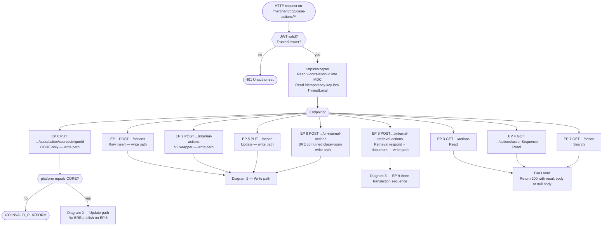
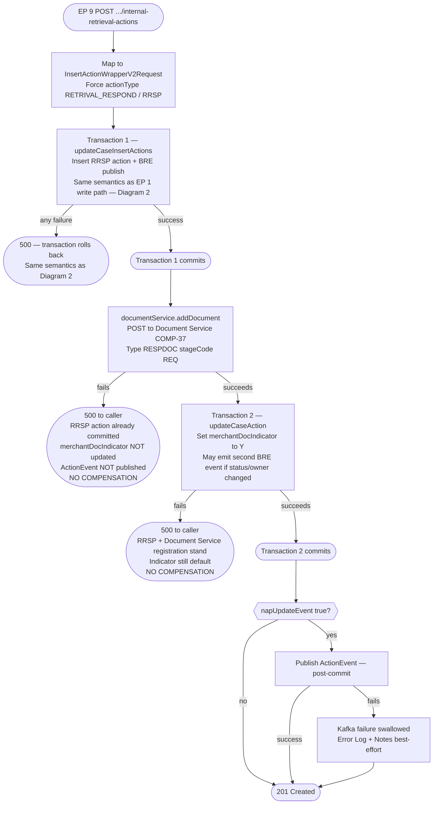
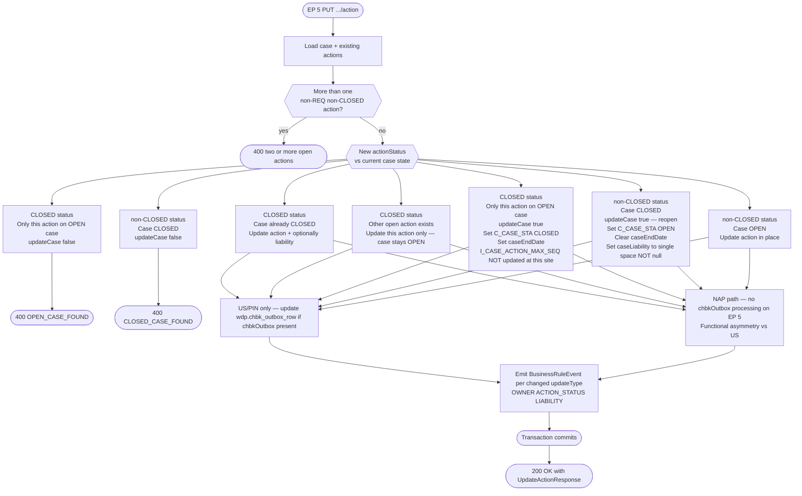

# WDP-COMP-24-CASE-ACTION-SERVICE
**Worldpay Dispute Platform — Component Reference**
*Version: 1.1 DRAFT | April 2026*
*Source-verified: 2026-04-23 (repo `gcp-cas-actions-service`, artifact `case-actions-service`) | Architect-confirmed: PENDING*

---

## ━━━ CORE SKELETON ━━━━━━━━━━━━━━━━━━━━━━━━━━━━━━━━━━━━━━━

---

## Identity

| Field             | Value                                                        |
|-------------------|--------------------------------------------------------------|
| **Name**          | `CaseActionService`                                          |
| **Type**          | `REST API + Kafka Producer`                                  |
| **Repository**    | `gcp-cas-actions-service`                                    |
| **Build artifact** | `case-actions-service`                                      |
| **Spring app name** | `CaseActionsService`                                       |
| **Context path**  | `/merchant/gcp/case-actions` (port 8082)                     |
| **Status**        | `✅ Production`                                              |
| **Doc status**    | `📝 DRAFT v1.1 — source-verified`                            |
| **Sections present** | `Core \| Block A — REST \| Block C — Kafka Producer`     |

---

## Purpose

**What it does**

CaseActionService is the single authoritative service for creating, reading, and updating dispute actions across all WDP acquiring platforms (NAP, PIN, CORE, VAP, LATAM). Every transition in a dispute action's lifecycle flows through this service.

Nine REST endpoints cover the full lifecycle: raw action insert, V2 wrapper for automated action transitions, action retrieval (list and single), action update, CORE-specific synchronisation by sourceUniqueId, source-system search, business-rules combined close-and-open, and retrieval-respond with document registration. Two parallel geographic data domains are maintained — the `wdp` schema for PIN/CORE/VAP/LATAM platforms and the `nap` schema for the NAP platform — with a platform path variable selecting the datasource and transaction manager on every request. Cross-schema writes do not occur; each request operates on exactly one schema.

Write endpoints publish two Kafka topics, with different coupling semantics:

- **`BusinessRuleEvent`** on `${kafka.business-rule-topic}` — published per changed action, sorted by action sequence, **inside the domain `@Transactional` method**. A Kafka send failure propagates before transaction commit and rolls the domain write back. This is NOT a post-commit split-brain — correction against v1.0 DRAFT. BRE publish is suppressed on the US/PIN `historicalData` migration path (NAP has no equivalent suppression).
- **`ActionEvent`** on `${kafka.topic}` — published conditionally on EP 2, EP 8, and EP 9 only, when `napUpdateEvent=true` in the request. This publish sits **outside** the transactional boundary — it fires after commit. Failures are swallowed; Error Log and Notes Service are called best-effort; the caller receives 201/200 regardless. This is a genuine post-commit split-brain surface.

The `historicalData` request block is an active migration mechanism on the US/PIN path only. When present, the service routes to a historical-insert path with caller-supplied timestamps and suppresses the BRE publish. NAP has no historicalData branch at the service layer; `napCaseActionDao.insertHistoricalAction` is declared but has no service-layer caller.

**What it does NOT do**

- Does not enforce role-based access control. `RestInvoker.authorizeUser()` is defined in source but has zero callers. No `@PreAuthorize`, `@RolesAllowed`, or `@Secured` anywhere. JWT validity is the sole gate — any authenticated caller can perform any action type on any case.
- Does not consume from Kafka. Producer-only — no `@KafkaListener`, no `@EnableKafka`, no consumer container factory.
- Does not handle PAN data. Entity field `I_ACCT_CDH` is a tokenised reference; no `EncryptionService` call exists.
- Does not implement Resilience4j circuit breakers, connection timeouts, or read timeouts on any outbound call. Platform-wide DEC-014 VOID.
- Does not implement server-side idempotency detection. The `idempotency-key` header is forwarded to Kafka as a message header but is not validated against any seen-key store. Duplicate POSTs insert duplicate action rows.
- Does not call BusinessRulesService (COMP-31) or CaseManagementService (COMP-23). Writes directly to the case and action tables.
- Does not execute schema DDL. No Flyway, Liquibase, or `schema.sql` in the repo. Schema is owned outside this repository.
- Does not maintain any audit or event-change-log table. The `wdp.dispute_event_change_log` entity referenced in v1.0 DRAFT is absent from source — removed in this revision.

---

## Internal Processing Flow

### Diagram 1 — Endpoint dispatch and platform routing

### Diagram 2 — Write path (EP 1, 2, 5, 8 — all within one @Transactional method)

```mermaid
flowchart TD
    START([Controller invokes service method])
    VAL[Bean + CaseActionsValidator check\nplatform enum, caseNumber, required fields]
    VAL_FAIL([400 Bad Request\nNo downstream calls])

    USERID{{historicalData block present?}}
    USERID_H[Take insertedDisplayUserId or\nupdatedDisplayUserId from block]
    USERID_J[Resolve displayUserId from JWT + request.userId]

    PLAT{{Platform?}}
    TX_NAP[Open @Transactional napTransactionManager\nrollbackFor Exception]
    TX_WDP[Open @Transactional wdpTransactionManager\nrollbackFor Exception]

    HIST{{US/PIN path AND\nhistoricalData not null?}}
    INS_HIST[DAO insertHistoricalAction\nCaller-supplied timestamps]
    INS_STD[DAO insertAction or updateAndInsertAction or updateAction]

    LOAD[Load case from repository\nRead existing actions]
    LOAD_MISS([400 case not found\nTransaction rolls back])

    CLOSED_GUARD{{Case CLOSED AND updateCase false?}}
    CLOSED_FAIL([400 CLOSED_CASE_FOUND or OPEN_CASE_FOUND\nTransaction rolls back])

    BUILD[updateExistingAction\nBuild new action entities\nSequence = maxSeq + index\nApply action-type business rules]

    OPEN_COUNT{{Proposed non-REQ non-CLOSED\ncount greater than 1?\nIn-memory check — no DB lock}}
    OPEN_FAIL([400 two or more open actions\nTransaction rolls back])

    LIAB[mapLiabilityWithEvent\nAppend LIABILITY to updateType list]

    PERSIST[caseRepository.save\nCascade to actions\nupdateCaseEntity sets C_CASE_STA and max-seq on insert path]

    OUTBOX{{chbkOutbox block present?}}
    OUTBOX_US[Update wdp.chbk_outbox_row\nstatus + updated_at\nSame transaction — US/PIN only]
    OUTBOX_NAP[Upsert nap.DISPUTE_EVENT_CONSUMER_ERROR\nSame transaction — NAP only]
    OUTBOX_SKIP[Skip outbox write]

    NOTE{{note field present?}}
    NOTE_US[Insert wdp.notes\nSame transaction — US/PIN only]
    NOTE_NAP[Insert nap.notes\nSame transaction — NAP only]
    NOTE_SKIP[Skip note insert]

    DB_THROW{{DB save throws?}}
    DB_FAIL([500 SYSTEM_ERROR\nTransaction rolls back\nBRE publish never attempted])

    BRE_GATE{{Any BusinessRuleEvent collected?\nAND NOT historicalData-suppressed path}}
    BRE[Publish per BusinessRuleEvent\nSorted by actionSequence\nSynchronous send with idempotent producer\nINSIDE transactional method]
    BRE_FAIL([500 SYSTEM_ERROR\nTransaction rolls back before commit\nDomain write discarded])

    COMMIT([Transaction commits\nReturn from DAO])
    RESP_OK([201 Created or 200 OK])

    AE_GATE{{napUpdateEvent true?\nEP 2 or EP 8 only}}
    AE_PUB[Publish ActionEvent\nOUTSIDE transaction — post-commit\nSynchronous send]
    AE_FAIL[Kafka failure swallowed\nError Log + Notes best-effort\nPost-commit split-brain risk]

    START --> VAL
    VAL -- invalid --> VAL_FAIL
    VAL -- valid --> USERID
    USERID -- yes --> USERID_H
    USERID -- no --> USERID_J
    USERID_H --> PLAT
    USERID_J --> PLAT
    PLAT -- NAP --> TX_NAP
    PLAT -- PIN/CORE/VAP/LATAM --> TX_WDP
    TX_NAP --> HIST
    TX_WDP --> HIST
    HIST -- yes --> INS_HIST
    HIST -- no --> INS_STD
    INS_HIST --> LOAD
    INS_STD --> LOAD
    LOAD -- not found --> LOAD_MISS
    LOAD -- found --> CLOSED_GUARD
    CLOSED_GUARD -- yes --> CLOSED_FAIL
    CLOSED_GUARD -- no --> BUILD
    BUILD --> OPEN_COUNT
    OPEN_COUNT -- yes --> OPEN_FAIL
    OPEN_COUNT -- no --> LIAB
    LIAB --> PERSIST
    PERSIST --> OUTBOX
    OUTBOX -- present + US --> OUTBOX_US
    OUTBOX -- present + NAP --> OUTBOX_NAP
    OUTBOX -- absent --> OUTBOX_SKIP
    OUTBOX_US --> NOTE
    OUTBOX_NAP --> NOTE
    OUTBOX_SKIP --> NOTE
    NOTE -- present + US --> NOTE_US
    NOTE -- present + NAP --> NOTE_NAP
    NOTE -- absent --> NOTE_SKIP
    NOTE_US --> DB_THROW
    NOTE_NAP --> DB_THROW
    NOTE_SKIP --> DB_THROW
    DB_THROW -- yes --> DB_FAIL
    DB_THROW -- no --> BRE_GATE
    BRE_GATE -- yes --> BRE
    BRE_GATE -- no --> COMMIT
    BRE -- success --> COMMIT
    BRE -- send fails --> BRE_FAIL
    COMMIT --> AE_GATE
    AE_GATE -- no --> RESP_OK
    AE_GATE -- yes --> AE_PUB
    AE_PUB -- success --> RESP_OK
    AE_PUB -- fails --> AE_FAIL
    AE_FAIL --> RESP_OK
```

### Diagram 3 — EP 9 retrieval-respond (three sequential independent transactions)

### Diagram 4 — EP 5 update-action state transition matrix

---

## Boundaries

### Inbound Interfaces

| Source | Protocol | Endpoint / Trigger | Payload |
|--------|----------|--------------------|---------|
| NAPDisputeDeclineBatch (COMP-06) | REST | `GET /{platform}/case/{caseNumber}/actions` then `POST /{platform}/case/{caseNumber}/actions` | GET existing actions, POST IDCL draft action insert |
| Internal WDP services — automated lifecycle (BRE, accept, contest, advance) | REST | `POST /{platform}/case/{caseNumber}/internal-actions` | V2 wrapper — actionType drives derived ActionRequest |
| Internal WDP services — BRE combined transition | REST | `POST /{platform}/case/{caseNumber}/br-internal-actions` | Combined close-current + open-new |
| Internal WDP services — retrieval respond | REST | `POST /{platform}/case/{caseNumber}/internal-retrieval-actions` | Insert RRSP + register document |
| CORE acquiring platform | REST | `PUT /{platform}/case/action/{sourceUniqueId}` | CORE-side status sync back into WDP by sourceUniqueId |
| Downstream services — action update | REST | `PUT /{platform}/case/{caseNumber}/action` | Update existing action status, owner, liability |
| Any authenticated caller | REST | `GET /{platform}/case/{caseNumber}/actions` and `GET .../{actionSequence}` | Read actions for a case |
| Any authenticated caller | REST | `GET /{platform}/action` | Search by sourceSystemCaseId and/or sourceSystemUniqueId |

### Outbound Interfaces

| Target | Protocol | Endpoint / Topic / Resource | Purpose | On failure |
|--------|----------|-----------------------------|---------|------------|
| Aurora PostgreSQL — `wdp` schema | PostgreSQL / JPA | `wdp.case`, `wdp.action`, `wdp.chbk_outbox_row`, `wdp.notes` | US/PIN/CORE/VAP/LATAM case + action reads and writes | 500; transaction rolls back |
| Aurora PostgreSQL — `nap` schema | PostgreSQL / JPA | `nap.case`, `nap.action`, `nap.DISPUTE_EVENT_CONSUMER_ERROR`, `nap.notes` | NAP case + action reads and writes | 500; transaction rolls back |
| AWS MSK Kafka | Kafka | `${kafka.business-rule-topic}` | BusinessRuleEvent per changed action | Inside `@Transactional` — 500; transaction rolls back before commit |
| AWS MSK Kafka | Kafka | `${kafka.topic}` | ActionEvent — EP 2 / 8 / 9 when napUpdateEvent=true | Outside transaction — post-commit; swallowed; Error Log + Notes best-effort |
| Error Log Service (COMP-38) | REST | `POST ${errorlog.url}` | Audit for ActionEvent publish failure | Caught and logged; execution continues |
| Notes Service (COMP-25) | REST | `POST ${notes.url}` | System error note for ActionEvent publish failure | Caught and logged |
| Document Management Service (COMP-37) | REST | `POST ${document.add-url}/{platform}/{caseNumber}` | EP 9 only — register retrieval-respond document metadata | 500 propagated; no compensation on the committed RRSP action |
| IDP Token Service (COMP-36) | OAuth2 client_credentials | `spring.security.oauth2.client.provider.wdp-internal-auth.token-uri` | Bearer token for Error Log, Notes, Document Service | 500 |

---

## Database Ownership

### Tables Owned (written by this component)

| Schema.Table | Purpose | Key columns | Notes |
|--------------|---------|-------------|-------|
| `wdp.case` | Central case record — US/PIN/CORE/VAP/LATAM. Updated on open/close/reopen transitions. | `I_CASE` (PK), `C_CASE_STA`, `C_CASE_FINAL_LIABILITY`, `I_CASE_ACTION_MAX_SEQ`, `D_CASE_END`, `Z_UPDT` | `wdpTransactionManager`. Shared writer — see Shared Table Risk below. `I_ACCT_CDH` is tokenised in this component (no clear-PAN write). |
| `wdp.action` | WDP action records — insert new, update status/owner/liability | `I_ACTION_SEQ`, `C_SOURCE_CASE_ID`, `C_SOURCE_UNIQUE_ID`, `C_ACTION_TYPE`, `C_ACTION_STA`, `C_ACTION_STAGE`, `C_OWNER` | Cascaded via `USCaseEntity` one-to-many. Same transaction as case write. |
| `nap.case` | NAP platform mirror of `wdp.case` | Parallel to `wdp.case` | `napTransactionManager`. No cross-schema writes. |
| `nap.action` | NAP platform mirror of `wdp.action` | Parallel to `wdp.action` | Same transaction as `nap.case` write. |
| `wdp.chbk_outbox_row` | Transactional outbox row — **status UPDATE only (never INSERT)** when caller provides `chbkOutbox` block | `id`, `status`, `_case` (caseNumber), `updated_at` | **CONDITIONAL — US/PIN/CORE/VAP/LATAM path only.** Same transaction as case/action write. Inbound-outbox status acknowledgement — not an outbound Kafka outbox. |
| `nap.DISPUTE_EVENT_CONSUMER_ERROR` | NAP outbox-analogue — status update/upsert when caller provides `chbkOutbox` block on NAP path | `updatedTimestamp` and status fields | **CONDITIONAL — NAP path only, insert endpoints only.** NAP `UKCaseActionDaoImpl.updateAction` (EP 5) does NOT process `chbkOutbox` — functional asymmetry vs US. Same transaction as `nap.case` write. |
| `wdp.notes` | Note record insert when `note` field present in request | Per `USNotesEntity` | **CONDITIONAL — US/PIN/CORE/VAP/LATAM path only.** Same transaction as case/action write. EP 5 does not insert notes on the US path either. |
| `nap.notes` | NAP notes insert when `note` field present | Per `UKNotesEntity` | **CONDITIONAL — NAP path only.** Same transaction as `nap.case` write. |

### Tables Read (not owned by this component)

| Schema.Table | Owned by | Why accessed |
|--------------|----------|--------------|
| `wdp.case` | Shared — CaseManagementService (COMP-23) and this component | Load case entity for validation and update |
| `wdp.action` | This component (cascaded from `wdp.case`) | Read existing actions for open-count, copy fields, detect field changes |
| `nap.case` | Shared — CaseManagementService (COMP-23) and this component | Load NAP case entity |
| `nap.action` | This component (cascaded from `nap.case`) | Read existing NAP actions — same purposes as `wdp.action` |

### Removed from v1.0 DRAFT

| Schema.Table | v1.0 DRAFT status | Correction |
|--------------|-------------------|------------|
| `wdp.dispute_event_change_log` | Claimed "dormant — EventChangeLogRepository declared but not injected" | Source grep returns zero matches for `EventChangeLog`, `dispute_event_change_log`, or any ChangeLog repository in this repo. **Row removed.** Either the entity was stripped after v1.0 DRAFT was written or it was never present. |

### Cross-schema writes

None. NAP DAOs reference `nap.*` entities only; US DAOs reference `wdp.*` entities only. No method in the transaction service uses both transaction managers. Propagation is default `REQUIRED`, scoped per method.

### Schema ownership

No Flyway, Liquibase, or `schema.sql` files in this repo. Schema DDL is owned outside this component. DB-level unique constraints on `(I_CASE, I_ACTION_SEQ)` or other action keys — **not determinable from source**.

---

## Action Type Business Rules

*Applied inside this service during insert / V2 wrapper derivation. Not delegated to any downstream service.*

| Action Type | Action Code | Status Set | Owner Derivation | Key Rules |
|-------------|-------------|------------|------------------|-----------|
| FULL_WRITEOFF / WRITEOFF (split) | `AQWO` | CLOSED | WPAYOPS | `writeOffReason` mandatory; `caseLiability` defaults to `ALIAB`; `respondPercentage=100`; splits use pro-rated amounts |
| FULL_CTM / CTM (split) | `CHGM` *(corrected from v1.0 DRAFT "CHMR")* | OPEN | Derived from existing action owner via `getOwnerDetails()` — WPAYOPS/NETWORK → MERCHANT | `recordTypeIndicator` defaults to `"1"` *(corrected from v1.0 DRAFT `"T"`)* |
| FULL_REV_CTM / REV_CTM (split) | `CRMR` | CLOSED | — | Credit/debit indicator inverted (unless IACF/RCAL code); NAP calls `updatePreviousNapActionEntity` on prior action |
| FULL_REV_WRITEOFF / REV_WRITEOFF (split) | `AQWO` | CLOSED | WPAYOPS | Credit/debit inverted |
| ADV_ACTION | — | — | — | All fields required explicitly from request |
| RETRIVAL_RESPOND | `RRSP` | CLOSED | NETWORK | `recordTypeIndicator=0`; triggers Document Service call (EP 9 only) |
| DENY | `WDNL` | OPEN | — | — |
| FULL_ISSUER_REV_CTM / ISSUER_REV_CTM (split) | `CRMR` | — | — | Copies amounts from `copyFromPrevsActionSequence`, not `currentActionSequence` |
| FULL_ISSUER_REV_WO / ISSUER_REV_WO (split) | `AQWO` | — | — | Copies amounts from `copyFromPrevsActionSequence` |

**Action sequence generation:** `maxExistingSeq + index`, padded to 2 characters (e.g. `"01"`).

**Open-action constraint:** At most one non-REQ non-CLOSED action permitted per case. Enforced by in-memory count check after building the proposed action list — no `SELECT FOR UPDATE`, no pessimistic lock, no `@Version`. **Race window exists** — two concurrent POSTs against the same `caseNumber` can both pass the check and commit two open actions. Whether Aurora enforces this at schema level is not determinable from this repo.

**Migration mode (`historicalData` block):** Triggers `insertHistoricalAction()` with caller-supplied timestamps. BRE Kafka publish suppressed via `isNotifyToBr=false`. **US/PIN path only** — NAP `insertUKAction` has no `historicalData` branch at the service layer. The NAP DAO's `insertHistoricalAction` method exists but has no service-layer caller.

**AMEX bypass on EP 6:** For AMEX network cases, EP 6 `updateCoreAction` saves the action even when another non-closed action exists on the case. All other networks set `otherNonClosedActionFound=true` and return that in the response.

**Hardcoded `dsptNoticeId = "DMT007"`:** Set at three sites in NAP branches only — inside `mapActionV2RequestMappingForNap` for FULL_WRITEOFF NAP, FULL_CTM NAP, and a FULL_WRITEOFF NAP split path. Business constant baked into application code. *(v1.0 DRAFT "line 1951" was incorrect.)*

---

## Platform Standard Compliance

| Standard | Status | Detail |
|----------|--------|--------|
| **DEC-001** Transactional outbox | ⚠️ PARTIAL — domain coupling; no outbound Kafka outbox | `wdp.chbk_outbox_row` and `nap.DISPUTE_EVENT_CONSUMER_ERROR` are UPDATEs (inbound-outbox acknowledgement) inside the same `@Transactional` as the domain write. For **outbound Kafka**, there is no outbox table — both `BusinessRuleEvent` and `ActionEvent` are direct publishes. BRE publish occurs inside the transactional method, so its failure rolls back the DB; ActionEvent publish is post-commit and its failure is swallowed — the ActionEvent path is a genuine split-brain surface. |
| **DEC-003** Kafka partition key = merchantId | 🔴 DEVIATES | Both topics use `caseNumber` as the Kafka message key. Confirmed across all four publish call sites. |
| **DEC-004** PAN encryption before persistence | ✅ NOT APPLICABLE | No clear PAN handled by this component. `I_ACCT_CDH` is a tokenised reference; no `EncryptionService` call. |
| **DEC-005** Manual Kafka offset commit after processing | ✅ NOT APPLICABLE | Producer only; no Kafka consumer. |
| **DEC-014** Resilience4j circuit breakers | ⛔ VOID platform-wide — no dependency | No `resilience4j-*` dependency, no `@CircuitBreaker` / `@Retry` / `@Bulkhead` / `@TimeLimiter` anywhere. Consistent with platform-wide pattern formally voided in WDP-DECISIONS.md v2.0. |
| **DEC-019** No clear PAN on persistent store | ✅ COMPLIES | Component scope — no clear PAN written. |
| **DEC-020** Full at-least-once idempotency | 🔴 DEVIATES | `idempotency-key` is captured by `HttpInterceptor` and forwarded to the Kafka message header, but no seen-key store, no Redis cache, no DB duplicate check exists. Duplicate POSTs insert duplicate action rows. No 409 returned. |

**Correction from v1.0 DRAFT:** v1.0 DRAFT classified the BRE publish as "post-commit split-brain". Source shows the publish is inside the `@Transactional` service method — failure rolls the DB back before commit. The split-brain surface that **does** exist is the `ActionEvent` publish on EP 2 / 8 / 9 (post-commit, swallowed errors).

---

## Risks and Constraints

| Risk | Severity | Detail |
|------|----------|--------|
| **ActionEvent post-commit split-brain** | 🔴 HIGH | On EP 2 / 8 / 9 when `napUpdateEvent=true`, `ActionEvent` is published after transaction commit. Failures are swallowed; Error Log and Notes calls are best-effort. DB state advances while downstream NAP update consumer never observes the event. No compensating transaction. |
| **No RBAC enforcement** | 🟠 HIGH | `RestInvoker.authorizeUser()` defined but has zero callers. No `@PreAuthorize` / `@RolesAllowed` / `@Secured` anywhere. Any authenticated WDP caller can create, update, or close any action on any case. Two dead config keys (`${auth_url}`, `${pin_auth_url}`) are wired to this unused path. Formal ADR candidate. |
| **No server-side idempotency** | 🟠 MEDIUM-HIGH | `idempotency-key` is forwarded to Kafka but never validated. Duplicate POSTs insert duplicate action rows. Under the current at-most-once platform delivery model this is not triggered by Kafka redelivery, but HTTP retries at the caller produce duplicates. |
| **Open-action constraint race window** | 🟠 MEDIUM-HIGH | Count check is in-memory on the loaded action list. No DB-level `SELECT FOR UPDATE`, no `@Version`, no pessimistic lock. Two concurrent POSTs against the same `caseNumber` can both pass the check. No DB unique constraint visible in source. |
| **Last-write-wins on shared case/action tables** | 🟠 MEDIUM-HIGH | Zero `@Version` annotations, zero `@Lock`/`LockModeType` usage, zero `SELECT FOR UPDATE`. Concurrent updates to the same case by this component, CaseManagementService (COMP-23), or EvidenceConsumer (COMP-15) are last-write-wins. |
| **EP 9 three-transaction sequence — no compensation** | 🟠 MEDIUM-HIGH | Insert RRSP action commits independently; Document Service POST fires; `merchantDocIndicator="Y"` update commits as a separate transaction; optional ActionEvent publish is post-commit. Failure at any step after Transaction 1 leaves the RRSP action in the DB without full completion. |
| **NAP vs US functional asymmetry on EP 5** | 🟡 MEDIUM | `UKCaseActionDaoImpl.updateAction` does not process `chbkOutbox` on any branch — NAP EP 5 silently ignores inbound outbox acknowledgements that US path handles on six branches. |
| **NAP path — no historicalData migration** | 🟡 MEDIUM | `insertHistoricalAction` exists on the NAP DAO but has no service-layer caller. NAP always emits BRE on insert; US/PIN suppresses on migration path. Confirms migration mode was only designed for US/PIN. |
| **No connection or read timeouts on any outbound REST** | 🟡 MEDIUM | Vanilla `new RestTemplate()` with `SimpleClientHttpRequestFactory` — new socket per call, no keep-alive pool, no timeouts. A hung Error Log, Notes, Document, or IDP Token Service blocks the handler thread. |
| **Kafka producer — no client-level retry cap or timeout** | 🟡 MEDIUM | `retries = ${kafka.retry-count}` is set; `delivery.timeout.ms`, `request.timeout.ms`, `linger.ms`, `batch.size`, `compression.type`, `transactional.id` all not set — Kafka client defaults apply. `max.in.flight.requests.per.connection=5` — ordering preserved by idempotent-producer guarantees, not by in-flight=1. |
| **UAT IDP token URI hardcoded as default** | 🟡 LOW-MEDIUM | `application.yml` line 42 contains a hardcoded UAT `fiscloudservices.com` token URI. Only the client-id and client-secret are externalised; the URI itself has no env-var override in source. Effective production URL not determinable from source. |
| **`spring-boot-devtools` without scope** | 🟢 LOW | `pom.xml` declares `spring-boot-devtools` without `<scope>`. Spring Boot's `spring-boot-maven-plugin` repackaging excludes it from the built JAR by default, so runtime risk is low — but the scope is still misconfigured. |

---

## Shared Table Risk — update to WDP-DB.md

| Table | Writers | Current severity in WDP-DB.md | Update |
|-------|---------|-------------------------------|--------|
| `wdp.case` | COMP-23, COMP-24, COMP-15 (conditional) | 🟠 MEDIUM-HIGH | No change. RBAC absence on COMP-24 already reflected. Confirm zero `@Version` / zero locks on this component. |
| `wdp.action` | COMP-23, COMP-24, COMP-15 (conditional) | 🔴 HIGH | No change. Source confirms zero optimistic/pessimistic locking on COMP-24. Race window on open-action constraint newly documented. |
| `wdp.chbk_outbox_row` | COMP-07, COMP-08, COMP-09, COMP-11 (INSERT); COMP-12, COMP-14, COMP-15, COMP-23, COMP-24 (status UPDATE) | 🟡 MEDIUM | No change. COMP-24 continues as status-UPDATE-only writer on US path. |
| `nap.case` | COMP-23, COMP-24 | 🟠 MEDIUM-HIGH | No change. |
| `nap.action` | COMP-23, COMP-24 | 🔴 HIGH | No change. |
| `nap.DISPUTE_EVENT_CONSUMER_ERROR` | COMP-24 (insert-path conditional); other writers TBC | NOT CURRENTLY LISTED | **NEW ENTRY REQUIRED.** Confirm whether this table is also written by NAP-side consumers (likely COMP-04 / COMP-05). See Change Log entry. |
| `wdp.notes` | COMP-25 (primary), COMP-24 (conditional) | No change | Confirmed scope — US path only, insert endpoints only, not EP 5. |
| `nap.notes` | COMP-25 (primary), COMP-24 (conditional) | No change | Confirmed scope — NAP path, insert endpoints only. |

---

## ━━━ TYPE BLOCK A — REST API CONTRACTS ━━━━━━━━━━━━━━━━━━━━

## REST API Contracts

**Framework:** Spring MVC (Spring Boot 3.5.3, Java 17)
**Auth model:** OAuth2 Resource Server — JWT Bearer token, multi-issuer via `JwtIssuerAuthenticationManagerResolver.fromTrustedIssuers`. Trusted issuers from `${jwt_trusted_issuer_urls}`. **No role/scope enforcement — JWT validity is the only gate.**
**Public paths (no JWT):** `/actuator/health`, `/livez`, `/readyz`; non-PROD Swagger paths.
**Context path prefix:** `/merchant/gcp/case-actions`
**Port:** 8082
**Correlation:** `v-correlation-id` read by `HttpInterceptor` into MDC and ThreadLocal; forwarded on every outbound REST call.

---

### Endpoint 1 — POST `/{platform}/case/{caseNumber}/actions`

**Purpose:** Raw action insert. Caller constructs the full `ActionRequest` directly. Used by callers that know the exact action shape — e.g. NAPDisputeDeclineBatch (COMP-06) creating IDCL draft actions.

**Path variables:** `platform` (NAP / PIN / CORE / VAP / LATAM), `caseNumber`
**Headers:** `v-correlation-id` (optional), `idempotency-key` (declared on signature; not validated server-side)

**Request body — `AddActionRequest`**

| Field | Required | Description |
|-------|----------|-------------|
| `actionRequest` | Yes (list) | One or more full `ActionRequest` objects with all action fields |
| `updateCase` | No | If true, also update case metadata |
| `copyFromPrevsAction` / `copyFromPrevsActionSequence` | No | Copy fields from prior action |
| `closePreviousAction` / `closeSequence` | No | Close prior open actions before insert |
| `caseLiability` | No | NLIAB / ALIAB override |
| `userId` | Conditional | Required unless `historicalData` block present |
| `chbkOutbox` | No | Optional inbound-outbox update `{id, status}` — written in same transaction |
| `note` | No | Optional note insert in same transaction |
| `historicalData` | No | Migration mode — US/PIN only; enables historical insert path; suppresses BRE Kafka publish |

**HTTP Responses**

| Status | Trigger |
|--------|---------|
| 201 Created | Action(s) inserted successfully |
| 400 Bad Request | Platform invalid; caseNumber blank; case CLOSED with updateCase=false; two or more open non-REQ actions would result; owner missing when `copyFromPrevsAction=false`; `chbkOutbox` present but id/status blank; userId blank |
| 500 Internal Server Error | DB save failure (rolled back); BRE Kafka publish failure (also rolled back — publish is inside `@Transactional`) |

**Response body — `AddActionResponse`:** `{ caseNumber, actionSequence, actionSequenceList: [String] }`

**Known callers:** NAPDisputeDeclineBatch (COMP-06) confirmed. Other internal WDP services that construct full `ActionRequest` objects directly.

---

### Endpoint 2 — POST `/{platform}/case/{caseNumber}/internal-actions`

**Purpose:** V2 wrapper endpoint. Loads existing case/action state from the DB and derives the full `ActionRequest` by `currentActionSequence`. Used by internal services performing automated lifecycle transitions — caller supplies an actionType and the service resolves defaults.

**Supported action types:** FULL_WRITEOFF, FULL_CTM, FULL_REV_CTM, FULL_REV_WRITEOFF, RETRIVAL_RESPOND, DENY, ADV_ACTION, ISSUER_ACCEPT, FULL_ISSUER_REV_CTM, FULL_ISSUER_REV_WO, and split types WRITEOFF, CTM, REV_CTM, REV_WRITEOFF, ISSUER_REV_WO, ISSUER_REV_CTM.

**Path variables:** `platform`, `caseNumber`
**Headers:** `v-correlation-id`, `idempotency-key` (declared; not validated)

**Request body — `InsertActionWrapperV2Request`**

| Field | Required | Description |
|-------|----------|-------------|
| `actionType` | Yes | One of the supported action types above |
| `actionRequest` | Yes (list) | `ActionWrapperV2Request` items with `currentActionSequence` and optional overrides |
| `caseLiability` | No | Optional liability override |
| `copyFromPrevsActionSequence` | Conditional | Required for issuer-reversal types |
| `userId` | Yes | Operator ID |
| `napUpdateEvent` | No | If true, also publish ActionEvent post-commit |

**HTTP Responses:** Same as Endpoint 1. 201 Created on success.

**Response body:** `AddActionResponse`

**Known callers:** Internal WDP services performing automated write-off, CTM routing, advance, and issuer-reversal lifecycle transitions.

---

### Endpoint 3 — GET `/{platform}/case/{caseNumber}/actions`

**Purpose:** Retrieve all actions for a case (or a specific action if `actionSequence` query param supplied). This is the GET step in NAPDisputeDeclineBatch's GET-then-POST pattern for IDCL draft creation.

**Path variables:** `platform`, `caseNumber`
**Query params:** `actionSequence` (optional, numeric; left-padded to 2 chars)

**HTTP Responses**

| Status | Trigger |
|--------|---------|
| 200 OK | Success — body may have empty actionSummary list if case exists but has no actions, or null body if case missing |
| 400 Bad Request | Platform invalid; caseNumber blank; actionSequence non-numeric |

**Response body — `SearchActionDetailsResponse`:** `{ caseNumber, actionSummary: [ActionSummary] }`. Returns null body (no 404) when no actions found.

**Known callers:** NAPDisputeDeclineBatch (COMP-06), UI services, any service needing current action state.

---

### Endpoint 4 — GET `/{platform}/case/{caseNumber}/actions/{actionSequence}`

**Purpose:** Retrieve a single action by its sequence number.

**Path variables:** `platform`, `caseNumber`, `actionSequence`

**HTTP Responses:** 200 OK (may return null body if not found — no 404); 400 Bad Request (platform or actionSequence invalid)

**Response body:** `ActionSummary`

---

### Endpoint 5 — PUT `/{platform}/case/{caseNumber}/action`

**Purpose:** Update an existing action — change status, owner, liability; optionally close or reopen the case.

**Path variables:** `platform`, `caseNumber`
**Query param:** `actionSequence` (optional — defaults to `caseActionMaxSeq`)
**Headers:** `v-correlation-id`, `idempotency-key` (declared; not validated)

**Request body — `UpdateActionRequest`:** `actionStatus`, `owner`, `caseLiability`, `updateCase`, `userId`, `chbkOutbox`, `rejectReason`, `merchantDocIndicator`, and others.

**Branching logic** — see Diagram 4 above. Key corrections from v1.0 DRAFT:

- Reopen path (non-CLOSED status on CLOSED case, `updateCase=true`): `caseLiability` is set to a **single-space string** (`ApplicationConstants.SPACE`), not null or cleared.
- Close path (CLOSED status as only action on OPEN case, `updateCase=true`): `I_CASE_ACTION_MAX_SEQ` is **NOT updated** at this call site. Only the insert path's `updateCaseEntity` mutates `caseActionMaxSeq`.
- **NAP path does not process `chbkOutbox`** on EP 5 — functional asymmetry vs US DAO which handles the field on six branches.

**HTTP Responses**

| Status | Trigger |
|--------|---------|
| 200 OK | Update successful |
| 400 Bad Request | Platform invalid; more than one open non-REQ action; case CLOSED + updateCase=false; non-CLOSED status against CLOSED case + updateCase=false; status inconsistency |
| 500 Internal Server Error | DB or Kafka failure (both roll back transaction) |

**Response body — `UpdateActionResponse`:** `{ caseNumber, actionSequence, updateStatus: "SUCCESS" / "OPEN_CASE_FOUND" / "CLOSED_CASE_FOUND" }`

---

### Endpoint 6 — PUT `/{platform}/case/action/{sourceUniqueId}`

**Purpose:** CORE-only. Update an action identified by its `sourceUniqueId` (`C_SOURCE_UNIQUE_ID`). Used by the CORE acquiring platform to synchronise dispute action status back into WDP. **No Kafka events published on this path.**

**Path variables:** `platform` (must be CORE — hardcoded check), `sourceUniqueId`
**Headers:** `v-correlation-id`, `idempotency-key`

**Request body — `UpdateCoreActionRequest`:** `status`, `processDate`, `dueDate`, `expirationDate`, `owner`, `liability`, `updateCase`, `userId`

**Key logic:**
- Platform gate: non-CORE platform → 400 with `BADREQUEST_EXCEPTION_MESSAGE_INVALID_PLATFORM`.
- Query `findBySrcCaseUniqueIdPrefix` has SQL-level `ORDER BY ... DESC LIMIT 1` — highest sequence returned.
- **AMEX network bypass:** when `caseNetwork == AMEX`, the update proceeds even when other non-closed actions exist on the case. All other networks set `otherNonClosedActionFound=true` and return that in the response.

**HTTP Responses:** 200 OK always — response body's `updateStatus` distinguishes outcomes. No 404.

**Response body — `UpdateCoreActionResponse`:** `{ caseNumber, sourceUniqueId, updateStatus }`. Possible `updateStatus` values: `SUCCESS`, `OPEN_CASE_FOUND`, `CLOSED_CASE_FOUND`, `"Action do not exist in WDP."`, `"Other non closed action exist"`.

---

### Endpoint 7 — GET `/{platform}/action`

**Purpose:** Search for dispute actions by `sourceSystemCaseId` and/or `sourceSystemUniqueId`. Returns only the action with the highest sequence number matching the criteria.

**Path variables:** `platform`
**Query params:** `sourceSystemCaseId`, `sourceSystemUniqueId`

**HTTP Responses:** 200 OK, 400 Bad Request (platform blank or invalid)

**Key behaviour:** Max-sequence selection is done in-memory via `getMaxActionSeq` helper — **not SQL-enforced** (the derived repository methods have no `ORDER BY` / `LIMIT`). If neither query param is supplied, no DAO branch fires and the service returns empty result. The controller does not enforce presence of at least one param.

**Response body — `SearchActionResponse`:** Single action search result.

---

### Endpoint 8 — POST `/{platform}/case/{caseNumber}/br-internal-actions`

**Purpose:** Business-rules combined endpoint. Atomically closes the current action and opens a new one in a single transaction. Used by business-rule processes (BRE path) for transitions.

**Path variables:** `platform`, `caseNumber`
**Headers:** `v-correlation-id` (no `idempotency-key` declared on controller signature — interceptor still captures it for Kafka forwarding)

**Request body — `UpdateCaseAndActionsRequest`:** Wraps `addActionRequest` (actionType + actionRequest list), optional `updateCaseRequest` (case status, liability), optional `updateActionRequest` (action fields to update), and `userId`. Optional `napUpdateEvent=true` triggers post-commit ActionEvent publish.

**HTTP Responses:** 201 Created; 400 Bad Request (platform/case validation; CLOSED case + OPEN action status contradiction)

**Response body:** `AddActionResponse`

---

### Endpoint 9 — POST `/{platform}/case/{caseNumber}/internal-retrieval-actions`

**Purpose:** Retrieval-respond. Inserts a `RETRIVAL_RESPOND` / `RRSP` action, registers the document with Document Service (COMP-37), then updates `merchantDocIndicator="Y"` on the inserted action.

**Path variables:** `platform`, `caseNumber`
**Headers:** `v-correlation-id` (no `idempotency-key` declared on controller signature — interceptor still captures)

**Request body — `RetrievalActionRequest`:** `actionType` (must be RETRIVAL_RESPOND), `actionRequest` list, `documentName` list, `userId`, `napUpdateEvent`, `copyFromPrevsActionSequence`.

**Processing sequence — three sequential independent transactions** (see Diagram 3):
1. **Transaction 1:** Insert RRSP action + BRE publish (same path as EP 1). Commits.
2. **Document Service POST.** On failure → 500; RRSP action already committed; indicator not updated; ActionEvent not published; **no compensation.**
3. **Transaction 2:** `updateCaseAction` setting `merchantDocIndicator="Y"`. May emit second BRE event for status/owner change. Commits.
4. **Optional post-commit ActionEvent publish** if `napUpdateEvent=true`. Failures swallowed.

**HTTP Responses:** 201 Created; 400 Bad Request; 500 on any transaction failure or Document Service failure.

**Response body:** `AddActionResponse`

---

## ━━━ TYPE BLOCK C — KAFKA PRODUCER CONTRACTS ━━━━━━━━━━━━━

## Kafka Producer Contracts

**Producer framework:** Spring Kafka `KafkaTemplate`
**Idempotent producer:** Yes — `enable.idempotence=true`, `acks=all`, `max.in.flight.requests.per.connection=5`, `retries=${kafka.retry-count}`
**Publish mode:** Synchronous — `kafkaTemplate.send().get()` blocks until broker acknowledgement
**Client-level retry:** `retries=${kafka.retry-count}` at producer level (Kafka-client at-least-once). No application-level `@Retryable` / `@Recover` at the `.send().get()` boundary — `kafkaService.retryKafkaCallWithRecovery` is a single try/catch wrapper, not a retry loop.
**Not set — Kafka client defaults apply:** `delivery.timeout.ms`, `request.timeout.ms`, `linger.ms`, `batch.size`, `compression.type`, `transactional.id`.
**Auth:** `SASL_SSL` / `AWS_MSK_IAM`.
**Circuit breaker:** None. Platform-wide DEC-014 VOID.

---

### Topic: `${kafka.business-rule-topic}`

| Parameter | Value |
|-----------|-------|
| **Topic name** | `${kafka.business-rule-topic}` — resolved from env var `kafka_business_rule_topic` via `gcp-case-actions-service-secrets` K8s Secret. Literal name not determinable from source. |
| **Message key** | `caseNumber` ⚠️ deviates from DEC-003 (platform standard is `merchantId`) |
| **Ordering guarantee** | Per partition by `caseNumber` — not per `merchantId` |
| **Published on** | Any insert or update that changes action status, owner, or liability. One event per changed action, sorted by actionSequence. |
| **Transactional coupling** | Publish is **inside** the domain `@Transactional` method in `CaseActionTransactionServiceImpl`. Send failure → `InternalServerError(SYSTEM_ERROR)` → transaction rolls back before commit. Corrected from v1.0 DRAFT. |
| **Consumed by** | COMP-16 BusinessRulesProcessor |

**Message payload — `BusinessRuleEvent` fields:**
`eventType`, `platform`, `caseNumber`, `actionSequence`, `previousActionSequence`, `disputeStage`, `type`, `startRuleGroup`, `source`, `documentNameList`, `updateType` (list: OWNER / ACTION_STATUS / LIABILITY), `correlationId`, `updatedTimestamp`.

**Payload notes:**
- `historicalData` block present → publish suppressed (US/PIN only). NAP has no equivalent gate — every NAP insert emits BRE.
- Publishes emitted sequentially, one per action, ascending `actionSequence`.
- `correlationId` and `updatedTimestamp` set by the transaction service; other fields derived from the change set built in the DAO.

---

### Topic: `${kafka.topic}` — ActionEvent

| Parameter | Value |
|-----------|-------|
| **Topic name** | `${kafka.topic}` — resolved from env var `kafka_topic` via K8s Secret. Literal name not determinable from source. |
| **Message key** | `caseNumber` ⚠️ deviates from DEC-003 |
| **Ordering guarantee** | Per partition by `caseNumber` |
| **Published on** | EP 2, EP 8, EP 9 only — conditional on `napUpdateEvent=true` in the request body |
| **Transactional coupling** | Publish is **outside** the `@Transactional` method. Occurs after DB commit. |
| **Consumed by** | ⚠️ Suspected COMP-39 NAPOutcomeProcessor — not confirmed |

**Message payload — `ActionEvent` fields:** `caseNumber`, `actionSequences`, `platform`, `currentActionSequence`, `networkCaseId`.

**Payload notes:**
- `ActionEvent` has **no `correlationId` field** — correction from v1.0 DRAFT.
- `networkCaseId` is declared on the model but is **never populated** in any mapping call site; always null on the wire.
- Publish failure → silent/logged only. Error Log Service (COMP-38) and Notes Service (COMP-25) called as best-effort audit trail. Does NOT return 500 to caller — EP 2 / 8 / 9 return 201/200 regardless of ActionEvent publish outcome.
- Inbound `idempotency-key` header (captured by interceptor) is forwarded on the outbound Kafka message; receiver semantics are out of scope here.

---

## Scaling and Deployment

| Attribute | Value | Source |
|-----------|-------|--------|
| Kubernetes resource type | `Deployment` | `resources.yml` |
| Replica count | `{{replicas-gcp-case-actions-service}}` — XL Deploy placeholder; production value not in repo | `resources.yml` |
| Memory limit | **4096Mi** *(corrected from v1.0 DRAFT "409EM" / "409Mi" OCR error)* | `resources.yml:60` |
| Memory request | 2048Mi | `resources.yml:62` |
| CPU limit | Not configured | `resources.yml` |
| CPU request | Not configured | `resources.yml` |
| HPA | Absent | — |
| PodDisruptionBudget | Absent | `resources.yml` (grep-verified) |
| Rolling update strategy | `RollingUpdate` — maxSurge: 1, maxUnavailable: 0, minReadySeconds: 30 | `resources.yml:10-14, :26` |
| Topology spread | Configured — `topologyKey: kubernetes.io/hostname`, `maxSkew: 1`, `whenUnsatisfiable: ScheduleAnyway`. labelSelector matches pod template label — **no mismatch**. Advisory only. | `resources.yml:27-33` |
| Liveness probe | `GET /merchant/gcp/case-actions/livez` on port 8082 — initialDelay 15s, period 10s, timeout 5s, failureThreshold 3 | `resources.yml:47-54` |
| Readiness probe | `GET /merchant/gcp/case-actions/readyz` on port 8082 — initialDelay 10s, period 10s, timeout 5s, failureThreshold 3 | `resources.yml:38-46` |
| Startup probe | Absent | `resources.yml` |
| Container port | 8082 (shared application + Actuator) | `resources.yml` |
| Observability — OTel | Yes — pod annotation `instrumentation.opentelemetry.io/inject-java` | `resources.yml:23` |
| Observability — Actuator | Yes — endpoints `info`, `health`, `prometheus` exposed. Health groups: liveness → `/livez`, readiness → `/readyz`. | `application.yml:6-22` |
| Observability — Logstash | Yes — `logstash-logback-encoder 7.4`; `${logstash_server_host_port}` destination | `pom.xml`, `application.yml:73-76` |
| Observability — custom Micrometer meters | **None defined** — single `management.metrics.tags.application` tag only | `application.yml:23-28` |
| Correlation ID | `HttpInterceptor` reads `v-correlation-id`, generates UUID if missing, puts into MDC (`CORRELATION_ID`) and ThreadLocal. Forwarded on every outbound REST call via `RestInvoker.getHeaders`. | `HttpInterceptor`, `WebMvcConfig`, `RestInvoker` |

---

## Planned and Incomplete Work

| Item | Detail |
|------|--------|
| **Commented-out entity fields** | `USCaseEntity` — `C_ISSUER_REF_NUMBER`, `C_DEPOSIT_ID`. `USActionEntity` — `C_DUPLICATE_IND`. `USCaseActionsHelper.setRefundHandling` block commented. |
| **Commented-out liability validation** | In `updateAction` on both US and UK DAOs — the `updateCase=true` branch's liability-required check is disabled. |
| **Commented-out `setDisputeTransPercentage` calls on PIN paths** | Disabled in multiple PIN action-type branches; NAP paths keep the call active. |
| **Hardcoded `dsptNoticeId = "DMT007"`** | Three sites, all in NAP branches of `mapActionV2RequestMappingForNap`. Business constant in application code. *(v1.0 DRAFT "line 1951" was incorrect — correct sites are inside NAP-specific V2 mapping branches.)* |
| **Hardcoded UAT IDP token URI** | In `application.yml` line 42. No env-var override for the URI itself; only client-id and client-secret are externalised. Effective production URL not determinable from source. |
| **Dead config placeholders** | `${auth_url}` and `${pin_auth_url}` configured in `application.yml` but never read by any `@Value` or `@ConfigurationProperties`. Tied to the unused `RestInvoker.authorizeUser` / `UserIdUtil` authorisation path. |
| **`spring-boot-devtools` without `<scope>`** | `pom.xml` declares without `<scope>` — defaults to `compile`. Spring Boot's repackager excludes devtools from the executable JAR, so runtime risk is low. Misconfiguration flagged. |
| **No TODO / FIXME / XXX / HACK** | Grep returns zero matches. |
| **No stub implementations** | None found. |
| **Typo — `caseNumbr` parameter** | On `updateCaseAction` service method. Functionally harmless. |
| **Removed from v1.0 DRAFT** | `wdp.dispute_event_change_log` / `EventChangeLogRepository` — not present in source (grep-verified). |

---

## Open Questions

| Gap | Type | Action required |
|-----|------|----------------|
| Literal value of `${kafka.business-rule-topic}` | Env config | Confirm from K8s Secret `gcp-case-actions-service-secrets` / MSK configmaps |
| Literal value of `${kafka.topic}` (ActionEvent) | Env config | Confirm from K8s Secret |
| Consumer of `${kafka.topic}` ActionEvent | Architect decision / follow-up Copilot pass | Likely COMP-39 NAPOutcomeProcessor. Follow-up question against COMP-39 repo: *"Does NAPOutcomeProcessor have a `@KafkaListener` on the topic resolved from `${kafka.topic}` publishing ActionEvent payloads (caseNumber, actionSequences, platform, currentActionSequence, networkCaseId)? Cite file:line."* |
| Effective production IDP token URI | Env config | Confirm whether any production env-var supplies `spring.security.oauth2.client.provider.wdp-internal-auth.token-uri` — else the hardcoded UAT URL is what ships |
| Production replica count | Env config | XL Deploy placeholder `{{replicas-gcp-case-actions-service}}` |
| DB unique constraint on `(I_CASE, I_ACTION_SEQ)` and open-action uniqueness | DBA confirmation | Schema DDL not in this repo. Needed to assess severity of the open-action race window. |
| Aurora HikariCP pool sizes | Env config | Not set in `application.yml`; Spring Boot defaults apply |
| Other writers of `nap.DISPUTE_EVENT_CONSUMER_ERROR` | Follow-up Copilot pass | Likely NAP consumers (COMP-04 / COMP-05). Needed for shared-table risk register. |
| `UKCaseActionDaoImpl.updatePreviousNapActionEntity` effect on previous action's `revrsl-ind` | Follow-up Copilot pass | Method body not line-by-line verified this pass. NAP-specific reversal semantics. |
| RBAC — formal ADR | Architect decision | `RestInvoker.authorizeUser` defined with zero callers; two dead config keys tied to it. Candidate ADR at next WDP-DECISIONS rebuild window. |
| NAP EP 5 chbkOutbox asymmetry vs US | Architect decision | Is the absence of NAP-side outbox processing on EP 5 intentional (NAP consumers never signal via this field) or a gap? |

---

*End of WDP-COMP-24-CASE-ACTION-SERVICE.md*
*File status: 📝 DRAFT v1.1 — source-verified 2026-04-23; architect confirmation pending*
*Change log entry: see WDP-CHANGE-LOG.md Pending Entries*
