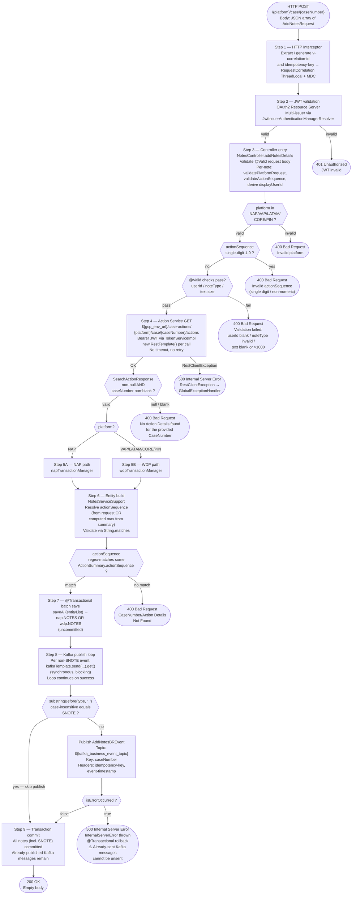
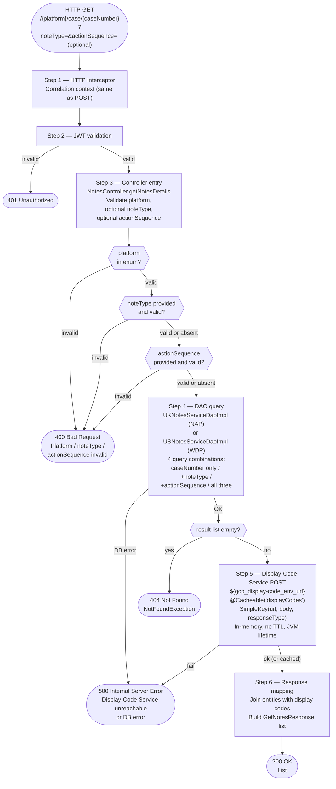

# WDP-COMP-25-NOTES-SERVICE
**Worldpay Dispute Platform — Component Reference**
*Version: 1.1 DRAFT | April 2026*
*Source-verified: 2026-04-28 (repo `mdvs-gcp-notes-service`) using GitHub Copilot CLI | Architect-confirmed: PENDING*

---

## ━━━ CORE SKELETON ━━━━━━━━━━━━━━━━━━━━━━━━━━━━━━━━━━━━━━

## Identity

| Field                | Value |
|----------------------|-------|
| **Name**             | `NotesService` |
| **Type**             | `REST API + Kafka Producer` |
| **Repository**       | `mdvs-gcp-notes-service` |
| **Artifact**         | `notes-service` (group `com.wp.gcp`) — v1.4.5 |
| **Runtime**          | Java 17 / Spring Boot 3.5.4 |
| **Context path**     | `/merchant/gcp/notes` (injected via `SERVER_SERVLET_CONTEXT_PATH` env var) |
| **Status**           | `✅ Production` |
| **Doc status**       | `📝 DRAFT v1.1 — source-verified 2026-04-28` |
| **Sections present** | `Core \| Block A \| Block C` |

---

## Purpose

**What it does**

NotesService is a platform-aware Spring Boot REST API providing two operations against
dispute-case notes: a POST endpoint to append notes to a case and a GET endpoint to
search and retrieve them. It is the authoritative write surface for dispute notes
across all WDP acquiring platforms.

The service is platform-aware at the data tier. The `{platform}` path variable
controls which of two entirely separate PostgreSQL schemas is used: `nap` for
NAP/UK-platform disputes, `wdp` for VAP, LATAM, CORE, and PIN disputes. The two
schemas have identical table structures but use separate JPA entity managers,
separate transaction managers, and separate datasource connections — they are
never mixed in a single transaction.

On write, for every note whose `noteType` does not resolve to `SNOTE`, the service
publishes an `AddNotesBREvent` synchronously to an AWS MSK Kafka topic. The DB
write and the Kafka publish share the same Spring `@Transactional` boundary but
are **not atomically coupled** — see DEC-001 deviation below for the full failure
modes, including the deterministic mid-batch orphan window.

The service calls the internal Action Service on the POST path to validate that
the case and action sequence exist before writing any note. The GET path calls
the Display-Code Service to enrich the `noteType` code with a human-readable
description. All bearer tokens for downstream service calls are obtained via
OAuth2 client credentials from the IDP.

**What it does NOT do**

- Does not consume from any Kafka topic — producer-only; no listener, no
  consumer group, no `@KafkaListener`
- Does not use a transactional outbox — Kafka publish is a direct synchronous
  call within the `@Transactional` boundary (DEC-001 deviation)
- Does not perform PAN encryption or handle any card payment data — no
  `EncryptionService` dependency; no PAN field exists anywhere in the service
- Does not update any case-level status, action table, or case-state machine —
  notes are supplementary metadata only
- Does not implement idempotency checking — the `idempotency-key` header is
  forwarded on the Kafka message header but is never checked against any store;
  duplicate submissions create duplicate note rows AND duplicate Kafka events
- Does not enforce note immutability at the database level — append-only
  constraint is enforced solely by the absence of PUT/PATCH/DELETE endpoints
- Does not apply case-status eligibility checks (e.g. whether notes can be
  added to a closed case) — such a check could exist in the upstream Action
  Service but is not visible in this service's codebase
- Does not apply role-based access control beyond JWT issuer validation —
  `displayUserId` derivation distinguishes internal ops from merchant callers
  but does not block any request

---

## Internal Processing Flow

### POST `/{platform}/case/{caseNumber}` — Add Notes



> ⚠️ **Mid-batch atomicity hazard (DEC-001 deviation):** Steps 7 and 8 share the
> same `@Transactional` boundary. When N non-SNOTE notes are submitted, Step 8
> iterates and publishes one-by-one. If publish fails on the K-th event (K > 1),
> `InternalServerError` is thrown, the transaction rolls back, and ALL N rows
> (including SNOTE rows) are removed from the DB. **However, the K-1 events
> already broker-acknowledged remain on the topic.** This produces a
> deterministic split-brain on every multi-note request that fails partway
> through — not just on JVM crashes. Consumers of the Kafka topic will receive
> events for notes that do not exist in the database.

> ⚠️ **JVM-crash window:** If the JVM crashes between transaction commit and the
> caller receiving the response, the DB rows are committed but no further
> guarantee exists for events already published on the topic. There is no
> outbox to recover this scenario.

---

### GET `/{platform}/case/{caseNumber}` — Search Notes



---

## Boundaries

### Inbound Interfaces

| Source | Protocol | Endpoint / Topic / Trigger | Payload / Description |
|--------|----------|----------------------------|-----------------------|
| Merchant Portal (COMP-49) — inferred | REST via API Gateway (COMP-01) | `POST /merchant/gcp/notes/{platform}/case/{caseNumber}` | JSON array of `AddNotesRequest`; Bearer JWT |
| Ops Portal (COMP-50) — inferred | REST via API Gateway (COMP-01) | `POST /merchant/gcp/notes/{platform}/case/{caseNumber}` | Same — internal ops caller path |
| Any authenticated portal or service | REST via API Gateway (COMP-01) | `GET /merchant/gcp/notes/{platform}/case/{caseNumber}` | Path + optional query params; Bearer JWT |

> ⚠️ Known callers are not determinable from this service's source alone. The
> service exposes itself via Nginx Ingress on multiple hostnames
> (`hostName`, `externalHostName`, `internalHostName`, `wdpExternalHostName`,
> `wdpInternalHostName`). No explicit caller registry is present in this repo.

### Outbound Interfaces

| Target | Protocol | Endpoint / Topic / Resource | Purpose | On failure |
|--------|-----------|-----------------------------|---------|------------|
| Action Service (COMP-24) | REST GET — Bearer JWT via TokenServiceImpl | `${gcp_env_url}/case-actions/{platform}/case/{caseNumber}/actions` | POST path Step 4 — validate case existence and retrieve action summary. Returns `SearchActionResponse {caseNumber, actionSummary[]}`. Response with null body or blank `caseNumber` → 400. HTTP error → `RestClientException` → 500 (no distinction between 4xx and 5xx) | RestClientException → 500. No retry, no circuit breaker, no timeout |
| Display-Code Service (COMP-28) | REST POST — Bearer JWT via TokenServiceImpl | `${gcp_display-code_env_url}` | GET path Step 5 — enrich noteType codes with descriptions | RestClientException → 500. Cached in-memory (no TTL); failure only on first call per JVM session |
| OAuth2 / IDP | HTTPS — OAuth2 client credentials | `${idp_token_url}` | Token acquisition for Action Service and Display-Code Service calls | InternalError thrown → 500. No retry, no circuit breaker |
| AWS MSK Kafka | SASL_SSL + AWS MSK IAM (`aws-msk-iam-auth`) | `${kafka_business_event_topic}` | POST path Step 8 — publish AddNotesBREvent for non-SNOTE notes | Kafka failure (any cause) → `isErrorOccurred=true` → `InternalServerError` → @Transactional rollback → 500 |
| nap.NOTES | PostgreSQL (NAP schema) — `napTransactionManager` | `nap.NOTES` | POST path — INSERT note rows (NAP); GET path — SELECT (NAP) | JPA exception → @Transactional rollback → 500 |
| wdp.NOTES | PostgreSQL (WDP schema) — `wdpTransactionManager` | `wdp.NOTES` | POST path — INSERT note rows (VAP/LATAM/CORE/PIN); GET path — SELECT (WDP) | JPA exception → @Transactional rollback → 500 |

> ⚠️ **No `RestTemplate` bean exists.** Each outbound REST call constructs its
> own `new RestTemplate()` inline (3 separate instantiations). No connection
> timeout, no read timeout, no custom factory, no error handler, no
> interceptor — default JDK socket timeouts apply (effectively infinite for
> connect; OS-level for read).

---

## Database Ownership

### Tables Owned (written by this component)

| Schema.Table | Purpose | Key columns | Notes |
|--------------|---------|-------------|-------|
| `nap.NOTES` | Stores dispute notes for NAP / UK-platform disputes | `I_NOTE_ID` (PK, sequence-gen `nap.NOTES_I_NOTE_ID_SEQUENCE`), `I_CASE`, `I_ACTION_SEQ`, `C_NOTE_TYPE`, `T_NOTE`, `D_NOTE`, `X_INSRT` (userId), `Z_INSRT`, `X_INSRT_DISPLAY`, `X_UPDT_DISPLAY` | Append-only at API layer. No DB-level constraint prevents UPDATE/DELETE — DDL not in this repo. No `@UniqueConstraint`, no `@Version`. |
| `wdp.NOTES` | Stores dispute notes for VAP / LATAM / CORE / PIN disputes | Identical to `nap.NOTES`; sequence `wdp.NOTES_I_NOTE_ID_SEQUENCE` | Identical structure. **Shared write surface — see below.** |

> ⚠️ **`wdp.NOTES` is a shared-write table.** Per the WDP-DB.md shared-write
> register, this table also receives writes from:
>   - **COMP-23 CaseManagementService** (US case create path) — known
>     **duplicate-insert defect**: two identical `USNotesEntity` save blocks
>     execute when `notesRequest != null`, producing two rows per create.
>   - **COMP-24 CaseActionService** — conditional, when a note field is present
>     in the action update request.
>
> NotesService is **not aware of these other writers** — no DB unique
> constraint, no `@Version` / optimistic lock, no advisory lock, no
> co-ordination annotation, no comment referencing COMP-23 / COMP-24.
> Coordination is by convention only.

> ⚠️ **`nap.NOTES` is also written by COMP-23** on the NAP create path (per the
> COMP-23 transaction boundary table). Same dual-writer posture as `wdp.NOTES`.

### Tables Read (not owned by this component)

This component reads only `nap.NOTES` and `wdp.NOTES` — the same tables it
writes. It does not read from any other table owned by another component.
No reads of `nap.case`, `wdp.case`, `nap.ACTION`, `wdp.ACTION`, any outbox
table, or any error table.

---

## Configuration and Scaling

| Parameter | Value | Notes |
|-----------|-------|-------|
| Replica count | `{{ replicas-mdvs-gcp-notes-service }}` — XL Deploy / Helm placeholder | Exact value not determinable from source |
| HPA | None | No `HorizontalPodAutoscaler` manifest in repository |
| Memory request | `1024Mi` | |
| Memory limit | `2048Mi` | |
| CPU request | Not configured | Absent from `resources.yaml` — ⚠️ noisy-neighbor / starvation risk under high load |
| CPU limit | Not configured | Absent from `resources.yaml` |
| Deployment type | Kubernetes `Deployment` | |
| Rollout strategy | `RollingUpdate` — `maxSurge: 1, maxUnavailable: 0` | At `spec.strategy.rollingUpdate` ✅ |
| `minReadySeconds: 30` | ⚠️ **Misplaced inside `spec.template.spec`** instead of `spec.minReadySeconds` | Kubernetes silently ignores it at this location. The 30-second rollout stability gate is **not actually applied at runtime** — new pods are considered Ready as soon as readinessProbe passes. New finding 2026-04-28. |
| PodDisruptionBudget | None | No PDB manifest in repository — voluntary disruptions can take all replicas down simultaneously |
| Topology spread | `ScheduleAnyway` — `topologyKey: kubernetes.io/hostname` | Label `app: mdvs-gcp-notes-service${BRANCH_NAME_PLACEHOLDER}` matches pod template — no label mismatch. `ScheduleAnyway` is advisory, not a hard guarantee. |
| Database connection pool | Two separate HikariCP pools | `napTransactionManager` (NAP schema) + `wdpTransactionManager` (WDP schema). Pool sizes use HikariCP defaults — not configured in source. |
| Liveness probe | HTTP GET `/merchant/gcp/notes/livez` port 8082 | `initialDelaySeconds: 30, timeoutSeconds: 5, periodSeconds: 10, failureThreshold: 3`. **Path is `/livez` not `/live` — correction from v1.0.** |
| Readiness probe | HTTP GET `/merchant/gcp/notes/readyz` port 8082 | `initialDelaySeconds: 20, timeoutSeconds: 5, periodSeconds: 10, failureThreshold: 3`. **Path is `/readyz` not `/ready` — correction from v1.0.** |
| Startup probe | Not configured | |
| Container port | `8082` | Server port: 8082 |
| OTel | Auto-injected | Annotation: `instrumentation.opentelemetry.io/inject-java: opentelemetry-operator-system/default` |
| Actuator endpoints exposed | `/actuator/info`, `/actuator/health`, `/actuator/prometheus` | |
| Actuator auth split | ⚠️ **`/actuator/health`, `/livez`, `/readyz` — unauthenticated. `/actuator/prometheus` and `/actuator/info` — require Bearer JWT** | The Prometheus endpoint is exposed but NOT in the Spring Security whitelist. If the in-cluster Prometheus scraper is not configured to authenticate, metrics scrape will fail silently. New finding 2026-04-28. |
| Logstash | Configured | `LogstashTcpSocketAppender` → `${logstash_server_host_port}` — JSON via `LogstashEncoder` with `Environment` and `AppName` custom fields. Console appender also active. |
| Swagger UI | Non-prod only | Suppressed when `gcp_env = "prod"` |
| `spring-boot-devtools` | NOT present | Clean — pattern audit (vs COMP-23) shows this service does not ship devtools to prod |

### K8s Manifests in Repository

| File | Contains |
|------|----------|
| `resources.yaml` | Deployment + Service (ClusterIP, port 8082) + Ingress (nginx, TLS, six host rules) |
| `deployit-manifest.xml` | XL Deploy package descriptor |
| `Jenkinsfile` | CI/CD pipeline |

**NOT in repo:** No Helm chart, no `values.yaml`, no Kustomize, no Dockerfile,
no HPA, no PDB, no NetworkPolicy. Replica counts and host names are XL Deploy
placeholders resolved at deployment time.

### Mandatory Environment Variables (No Defaults)

Service fails to start if any of these are unset:

| Env var | Used for |
|---------|----------|
| `gcp_env` | Active Spring profile — drives Swagger gating |
| `log_level` | Root logger level |
| `max_req_header_size` | Max HTTP request header size |
| `kafka_retry_count` | Kafka producer `retries` config | 
| `${kafka_bootstrap_server}`, `${kafka_business_event_topic}` | Kafka connectivity |
| `${gcp_env_url}`, `${gcp_display-code_env_url}`, `${idp_token_url}` | Outbound REST targets |
| `${jwt_trusted_issuer_urls}` | JWT validation |
| `${nap_datasource_*}`, `${wdp_datasource_*}` | DB connectivity |

> ⚠️ **`kafka_retry_count` has no default value.** If the env var is unset,
> Spring Boot fails to start with a property resolution error. New finding
> 2026-04-28.

---

## Key Architectural Decisions

| Decision | ADR reference | Notes |
|----------|---------------|-------|
| DB write and Kafka publish share `@Transactional` boundary — no outbox | DEC-001 — **DEVIATION** | Best-effort coupling. Two distinct failure modes: (a) JVM crash between commit and response → DB committed, Kafka may or may not have completed; (b) **Mid-batch publish failure → DB rolls back ALL rows but earlier-published Kafka events remain on the topic — deterministic split-brain on every multi-note partial failure.** No outbox, no recovery mechanism. |
| Kafka partition key is `caseNumber` | DEC-003 — **DEVIATION** | `merchantId` is not present anywhere in the event payload or service logic. `caseNumber` is the only available correlation key. Consistent with all six confirmed publishers of `business-rules` topic. |
| No PAN data in any path | DEC-004 — Compliant | Service processes note text, user IDs, case numbers, action sequences only. No `EncryptionService` dependency. |
| No clear PAN persisted | DEC-019 — Compliant | Same evidence as DEC-004. |
| Producer-only — no Kafka consumer | DEC-005 — Not applicable | No consumer configuration, no `@KafkaListener`, no consumer factory bean. |
| No Resilience4j on any outbound dependency | DEC-014 — **DEVIATION** | `resilience4j` absent from `pom.xml`. No circuit breaker, retry, bulkhead, or time limiter annotation present anywhere. **No `RestTemplate` bean** — `new RestTemplate()` per call, no timeouts. All outbound calls fail fast with 500. |
| `idempotency-key` forwarded but never checked | DEC-020 — **DEVIATION** | Header forwarded to Kafka message header; never compared against any store. No DB unique constraint on business keys. Replays produce N additional DB rows AND N additional Kafka events. |
| Dual-schema JPA entity managers | Local architectural decision | Two entirely separate entity managers and transaction managers (NAP/UK vs WDP/US). Notes are stored in the schema matching the platform of the dispute. **Only confirmed WDP service that owns tables in both `nap` and `wdp` schemas via separate JPA entity managers.** |
| `retryKafkaCallWithRecovery` is a misnomer | Local | Method name implies Spring Retry but the implementation is a simple try/catch. The only retries are at the Kafka client layer via `${kafka_retry_count}` — transparent to the application, no application-level retry, no `@Recover` method. |

---

## Risks and Constraints

| Severity | Risk | Consequence |
|---|---|---|
| 🔴 HIGH | **Mid-batch Kafka orphan window (DEC-001 deviation, deterministic)** | When N>1 non-SNOTE notes are submitted in one POST and Kafka publish fails on the K-th event (K>1), the entire DB transaction rolls back but the K-1 events already broker-acknowledged remain on the topic. Consumers receive events for notes that do not exist in the DB. Reproducible on every multi-note partial failure — not a JVM-crash edge case. |
| 🔴 HIGH | **No timeouts, no retries, no circuit breakers on any outbound REST call (DEC-014 deviation)** | `new RestTemplate()` instantiated per call with default JDK socket timeouts. A slow Action Service / Display-Code Service / IDP dependency blocks the request thread indefinitely. With Tomcat default thread-pool sizing, sustained slow downstream collapses the service. |
| 🔴 HIGH | **JVM-crash window between DB commit and Kafka publish completing (DEC-001 deviation)** | DB rows committed but Kafka events lost. No outbox, no recovery. |
| 🟡 MEDIUM | **Duplicate POSTs produce duplicate rows + duplicate Kafka events (DEC-020 deviation)** | `idempotency-key` forwarded but never checked. No DB unique constraint on business keys. Replays compound DB and topic. |
| 🟡 MEDIUM | **Shared write surface on `wdp.NOTES` and `nap.NOTES` with no awareness** | COMP-23 has a known duplicate-insert defect on the US create path; COMP-24 also writes conditionally. NotesService has no DB unique constraint, no `@Version`, no advisory lock, no comment referencing the other writers. Cross-component duplicate row risk; readers must deduplicate. |
| 🟡 MEDIUM | **`/actuator/prometheus` requires authentication** | Endpoint is exposed but NOT in the Spring Security whitelist. If the in-cluster Prometheus scraper is not configured with credentials, metrics scrape fails silently — no metrics dashboard for this service in prod. |
| 🟡 MEDIUM | **`kafka_retry_count` has no default — service fails to start on unset env var** | Operational footgun. A misconfigured deployment manifest produces a CrashLoopBackOff with a Spring property resolution error rather than starting in a degraded mode. |
| 🟡 MEDIUM | **`minReadySeconds: 30` is misplaced inside PodSpec — Kubernetes silently ignores it** | The 30-second rollout stability gate is not actually applied. New pods are considered Ready as soon as readinessProbe passes. During rolling updates, traffic shifts to a new replica before the application has fully warmed. |
| 🟡 MEDIUM | **Display-Code Service in-memory cache has no TTL, no eviction** | `@Cacheable("displayCodes")` with `ConcurrentMapCacheManager` (default). If display-code values ever change in the source service, this service serves stale codes until pod restart. |
| 🟡 MEDIUM | **`actionSequence` validation uses `String.matches()` against `ActionSummary.actionSequence`** | The request value is treated as a **regex pattern**, not a literal. Currently mitigated by the `@Pattern("^[0-9]*$")` validation that ensures only digits reach the matcher — but defense-in-depth is absent. If validation were ever loosened, regex-injection or `PatternSyntaxException` becomes possible. |
| 🟡 MEDIUM | **No CPU limits / requests configured** | Pod can consume unlimited CPU on its node — noisy-neighbor risk. Conversely, no guaranteed CPU under contention. |
| 🟡 MEDIUM | **HPA absent — no autoscaling on traffic spikes** | Volume must be sized for peak via static replica count. Burst traffic from end-of-month chargeback windows requires manual scale-out. |
| 🟡 MEDIUM | **PDB absent — voluntary disruptions can drain all replicas** | Node drains during cluster maintenance can take all pods down simultaneously. |
| 🟢 LOW | **Swagger `@Schema` declares 14 NoteType values; enum allows 16** | `NOTE` and `SNOTE` pass `@EnumName` validation but are not advertised in the OpenAPI contract. Portal teams reading Swagger may not know these are accepted. Contract-vs-implementation drift. |
| 🟢 LOW | **NoteType validation is case-sensitive (uppercase only)** | `@EnumName` builds an uppercase-only set; lowercase variants from a misconfigured client return 400. POST-path-only — GET path uses a separate validator that is case-insensitive. Asymmetric request/query semantics. |
| 🟢 LOW | **Dead code accumulation** | `validateCaseNumber`, `createErrorResponseEntity`, `createDuplicateResponseEntity` (one overload), `RestInvoker.authorizeUser`, `KafkaServiceImpl.convertStringToTimeStamp` — all defined but never called. Maintenance noise; low risk. |
| 🟢 LOW | **Commented-out Logstash destinations with hardcoded IPs in `logback-spring.xml`** | Legacy dev/test config replaced by `${LOGSTASH_SERVER_HOST_PORT}`. No runtime impact; should be removed. |
| 🟢 LOW | **Single TODO in `GlobalExceptionHandler.java:L153`** | On `HttpRequestMethodNotSupportedException` handler. Nature of TODO not specified. |

---

## Open Questions

- ⚠️ **Confirm literal topic name** for `${kafka_business_event_topic}`. Source
  exposes only the env var name. The actual topic name (and its entry in
  WDP-KAFKA.md) cannot be confirmed from source — verify via deployment config
  or team. (Cross-component evidence from WDP-KAFKA.md indicates this is
  `business-rules` — confirmation pending.)
- ⚠️ **Confirm downstream consumers of `AddNotesBREvent`**. No reference in
  this repo. WDP-KAFKA.md shows COMP-25 as a publisher of `business-rules`
  with consumers TBC. Cross-repo investigation owed.
- ⚠️ **Confirm whether case-status eligibility gates** (e.g. preventing notes
  on closed cases) are enforced by the Action Service, or are entirely absent
  from the platform. NotesService applies no such check — Action Service is
  called only to validate `caseNumber` and `actionSequence` existence, not
  case status.
- ⚠️ **Confirm whether `/actuator/prometheus` authentication is intentional**
  or a Spring Security whitelist oversight. The pattern in other WDP services
  (e.g. COMP-23) typically whitelists this endpoint. If unauthenticated
  scraping is the platform standard, this service deviates.
- ⚠️ **Confirm whether `minReadySeconds` misplacement is replicated in other
  WDP service manifests.** A pattern audit is owed — this is a
  copy-paste-class defect.
- ⚠️ **Confirm production replica count** — XL Deploy placeholder, environment
  config or team confirmation needed.

---

## Architect Notes

- This component file replaces v1.0 DRAFT (April 2026). Source verification
  pass executed 2026-04-28 via GitHub Copilot CLI against
  `mdvs-gcp-notes-service`.
- 11 corrections applied vs v1.0; 9 new findings added; 6 new risk rows
  surfaced (4 🟡 MEDIUM, 2 🟢 LOW).
- All implementation-level investigation is now complete for source-verifiable
  scope. Remaining items in Open Questions require cross-repo, runtime, or
  team-confirmation work.
- For implementation work (timeouts, retries, outbox introduction, mid-batch
  publish-then-commit refactor, `minReadySeconds` placement fix, Prometheus
  whitelist correction): use **Claude Code**, not this architecture project.

---

---

## ━━━ TYPE BLOCK A — REST API CONTRACTS ━━━━━━━━━━━━━━━━━━━

## REST API Contracts

**Authentication model:**
All non-probe endpoints require a valid Bearer JWT. Multi-issuer validation via
`JwtIssuerAuthenticationManagerResolver` with trusted issuers from
`${jwt_trusted_issuer_urls}`. No additional role-based authorisation check at
the service level — the `displayUserId` derivation logic distinguishes internal
vs. external callers by JWT issuer but does not gate access. `/actuator/health`,
`/livez`, and `/readyz` are unauthenticated; `/actuator/prometheus` and
`/actuator/info` require JWT.

**`displayUserId` derivation rule** *(from JWT `iss` claim only — no scope, role,
or audience claim consulted):*

| JWT issuer contains | userId starts with | Resulting displayUserId |
|---|---|---|
| `us_worldpay_fis_int` (case-insensitive) | `E` or `LC` (case-insensitive) | `WORLDPAY` |
| `us_worldpay_fis_int` (case-insensitive) | anything else | `SYSTEM` |
| anything else (external issuer) | N/A | `userId` unchanged |

**Base URL pattern:**
`https://<host>/merchant/gcp/notes/{platform}/case/{caseNumber}`

**Error response body (all endpoints):**
```json
{
  "errors": [
    {
      "errorMessage": "Human-readable error description",
      "target": "field:rejectedValue"
    }
  ]
}
```
Bespoke `StandardErrorResponse` wrapping `List<StandardDisplayError>` — not a
WDP platform-standard error schema.

---

### Endpoint: POST `/{platform}/case/{caseNumber}` — Add Notes

**Purpose:** Append one or more notes to a dispute case. Publishes an
`AddNotesBREvent` to Kafka for each note whose `noteType` (extracted from the
generated `type` field via `substringBefore("_")`) is not `SNOTE`
(case-insensitive).

**Caller(s):** Not determinable from source — inferred: Merchant Portal
(COMP-49), Ops Portal (COMP-50), and potentially other internal services
routing through API Gateway (COMP-01).

**Auth required:** Bearer JWT

**Request**

| Field | Location | Type | Required | Validation |
|-------|----------|------|----------|------------|
| `platform` | Path variable | String | Yes | Must match Platform enum: `NAP`, `VAP`, `LATAM`, `CORE`, `PIN` (case-insensitive) — `@NotBlank` |
| `caseNumber` | Path variable | String | Yes | `@NotBlank` |
| `v-correlation-id` | Request header | String | No | Generated as UUID if absent; propagated on response headers |
| `idempotency-key` | Request header | String | No | Generated as UUID if absent; forwarded on Kafka message header but **never checked against any store** |
| Request body | JSON Array of `AddNotesRequest` | — | Yes | `@Valid` |
| `userId` | Body field | String | Yes | `@NotBlank` — stored as `X_INSRT` / `X_UPDT` in the notes table |
| `actionSequence` | Body field | String | No | `@Pattern(regexp="^[0-9]*$")`, `@Range(min=01, max=99)` — single-digit values (`1`–`9`) additionally rejected by `RequestValidator.validateActionSequence`; must be two-digit zero-padded |
| `noteType` | Body field | String | Yes | `@NotBlank` — `@EnumName(NoteType.class)`. **Case-sensitive uppercase only.** Enum allows 16 values: `ANOTE`, `FRMRCH`, `MNOTE`, `QNOTE`, `TOMRCH`, `TONETW`, `UNOTE`, `USER1`–`USER4`, `XDISCA`, `XDISCE`, `XDISCM`, `NOTE`, `SNOTE`. ⚠️ Swagger `@Schema` declares only the first 14 — `NOTE` and `SNOTE` are accepted but undocumented. |
| `text` | Body field | String | Yes | `@NotBlank`, `@Size(max=1000)` |

**`actionSequence` resolution logic** *(per note, in service layer):*

1. If the request's `actionSequence` is present, use it directly. Otherwise,
   compute the maximum `actionSequence` across all `ActionSummary` entries
   returned by the Action Service. Single-digit max gets zero-padded
   (e.g. `9` → `"09"`).
2. The resolved `actionSequence` is then matched via `String.matches()`
   against each `ActionSummary.actionSequence`. **The request's value is
   used as a regex pattern.** Currently mitigated by the `@Pattern("^[0-9]*$")`
   validation; defense-in-depth absent.
3. If no `ActionSummary` matches → `BusinessValidationException` → 400.
4. If the `ActionSummary` list is empty → no match → 400.

**NoteType behaviour:**

| Code | Meaning | Kafka published? |
|------|---------|------------------|
| `SNOTE` | System note | ❌ No — DB-only. Skip is determined by `substringBefore(event.type, "_")` case-insensitive equals `SNOTE`. |
| All other valid codes | Various | ✅ Yes — one publish per note |

**Response — Success**

| HTTP Status | Condition | Body |
|-------------|-----------|------|
| `200 OK` | All notes saved; all non-SNOTE Kafka publishes succeeded | Empty body |

**Response — Error**

| HTTP Status | Condition | Body |
|-------------|-----------|------|
| `400 Bad Request` | Invalid platform; invalid `actionSequence` (single-digit / non-numeric / no match in summary); validation failures (`userId`/`text`/`noteType`); Action Service returned null body or blank `caseNumber` ("No Action Details found for the provided CaseNumber") | `StandardErrorResponse` |
| `401 Unauthorized` | JWT invalid / missing / untrusted issuer | Spring Security default |
| `404 Not Found` | No handler match | Spring default |
| `405 Method Not Allowed` | Wrong HTTP method | `StandardErrorResponse` |
| `500 Internal Server Error` | Action Service `RestClientException` (any HTTP error — no 4xx/5xx distinction); IDP token failure (`InternalError`); Kafka send failure (any cause); JPA exception; any uncaught `RuntimeException` | `StandardErrorResponse` |

**Notes:**
- The Action Service call is unconditional — it executes for every POST
  regardless of `noteType`, `platform`, or any other parameter.
- The Action Service is called BEFORE the DB write to validate case existence.
  An empty/null response body produces 400, not 404, even when the upstream
  service returned 404 — all upstream HTTP errors are lumped into 500 via
  `RestClientException`, but a 200-with-null-body produces 400.
- All notes are saved via a single `saveAll(entityList)` JPA call, which
  Hibernate may batch into multiple INSERTs. The Kafka publish loop runs
  AFTER `saveAll`. If Kafka publish fails on the K-th event, the entire
  transaction rolls back — including SNOTE rows and earlier non-SNOTE rows
  whose Kafka events have already been published. **Already-published Kafka
  messages cannot be unsent.**
- The `idempotency-key` header is forwarded on the Kafka message header
  via `KafkaHeaders` but is never checked against any store. Replays produce
  duplicate rows and duplicate events.

---

### Endpoint: GET `/{platform}/case/{caseNumber}` — Search Notes

**Purpose:** Retrieve all notes for a given dispute case, with optional
filtering by note type and action sequence.

**Caller(s):** Not determinable from source — inferred: Merchant Portal
(COMP-49), Ops Portal (COMP-50).

**Auth required:** Bearer JWT

**Request**

| Field | Location | Type | Required | Validation |
|-------|----------|------|----------|------------|
| `platform` | Path variable | String | Yes | Platform enum validation |
| `caseNumber` | Path variable | String | Yes | `@NotBlank` |
| `noteType` | Query param | String | No | If present, must match `NoteType` enum. **Case-insensitive on this path** (asymmetric vs POST). |
| `actionSequence` | Query param | String | No | If present, validated — single-digit rejection applied |
| `v-correlation-id` | Request header | String | No | Generated if absent |

**Response fields (`GetNotesResponse`):**

| Field | Type | Notes |
|-------|------|-------|
| `caseNumber` | String | Always present if notes found |
| `actionSequence` | String | Always present |
| `noteType` | Object — `{ code, description, longDescription }` | Enriched by Display-Code Service |
| `text` | String | Note content |
| `dateTime` | String | `insertedTimestamp.toString()` — e.g. `"2024-01-15 10:25:45.123"` |
| `insertedBy` | String | Original `userId` from write |
| `insertedDisplayUserId` | String | Derived display user ID at write time |
| `updatedUserId` | String | Same as `insertedBy` on initial write |
| `updatedDisplayUserId` | String | Same as `insertedDisplayUserId` on initial write |

**Response — Success**

| HTTP Status | Condition | Body |
|-------------|-----------|------|
| `200 OK` | Notes found matching criteria | `List<GetNotesResponse>` |

**Response — Error**

| HTTP Status | Condition | Body |
|-------------|-----------|------|
| `400 Bad Request` | Platform invalid; `noteType` filter value invalid; `actionSequence` filter value invalid | `StandardErrorResponse` |
| `401 Unauthorized` | JWT invalid | Spring Security default |
| `404 Not Found` | No notes found for given `caseNumber` (with optional filters applied) | `StandardErrorResponse` |
| `500 Internal Server Error` | Display-Code Service unreachable; DB error | `StandardErrorResponse` |

**Notes:**
- The Display-Code Service call is `@Cacheable("displayCodes")` — the cache
  key is the composite `SimpleKey` of `(url, requestBody, responseType)`. In
  practice all three values are constants for this service's call site, so
  the cache effectively holds a single entry for the JVM lifetime. Cache uses
  `ConcurrentMapCacheManager` (default) — no TTL, no eviction.
- The `actionSequence` query filter uses the same single-digit rejection logic
  as the POST path.

---

### Probe / Actuator Endpoints

**Unauthenticated (Spring Security whitelist):**

| Path | Purpose |
|------|---------|
| `/merchant/gcp/notes/livez` | Kubernetes liveness probe |
| `/merchant/gcp/notes/readyz` | Kubernetes readiness probe |
| `/merchant/gcp/notes/actuator/health` | Actuator health |

**Authenticated (Bearer JWT required — NOT whitelisted):**

| Path | Purpose |
|------|---------|
| `/merchant/gcp/notes/actuator/prometheus` | Prometheus metrics — ⚠️ scraper must authenticate |
| `/merchant/gcp/notes/actuator/info` | Build / git info |

**Non-prod only:**

| Path | Purpose |
|------|---------|
| `/merchant/gcp/notes/notesservice-documentation` | Swagger UI — suppressed when `gcp_env = "prod"` |
| `/merchant/gcp/notes/notesservice-api-docs` | OpenAPI JSON — suppressed in prod |

---

---

## ━━━ TYPE BLOCK C — KAFKA PRODUCER CONTRACTS ━━━━━━━━━━━━━

## Kafka Producer Contracts

**Producer framework:** Spring Kafka `KafkaTemplate`
**Idempotent producer:** Yes — `enable.idempotence = true`
**Acks:** `all`
**Max in-flight requests per connection:** 5
**Publish mode:** Synchronous via `kafkaTemplate.send(message).get()` — blocking
**Application-level retry:** None. The method `kafkaService.retryKafkaCallWithRecovery` is a misnomer — it is a simple try/catch with no `@Retryable` and no `@Recover`.
**Kafka client retry:** `retries = ${kafka_retry_count}` — env-injected, **no default**. Service fails to start if env var unset. These retries are transparent to the application; failure modes are not differentiated.
**Auth:** SASL_SSL with AWS MSK IAM (`aws-msk-iam-auth` v2.3.2)
**Serializers:** key — `StringSerializer`; value — `JsonSerializer`
**Other producer config:** `delivery.timeout.ms`, `request.timeout.ms`, `linger.ms`, `batch.size` are NOT configured — Kafka client defaults apply.

---

### Topic: `${kafka_business_event_topic}`

| Parameter | Value |
|-----------|-------|
| **Topic name** | `${kafka_business_event_topic}` — injected at deployment. Cross-component evidence (WDP-KAFKA.md) indicates this resolves to `business-rules`, but the literal value is not in this service's source. ⚠️ **Confirm actual topic name via deployment config — required for definitive WDP-KAFKA.md entry.** |
| **Message key** | `caseNumber` — ⚠️ **DEC-003 deviation** — not `merchantId`. `merchantId` is absent from event payload and service logic. |
| **Ordering guarantee** | Per partition by `caseNumber` |
| **Published on** | POST path — after successful `saveAll` DB write, inside the `@Transactional` boundary, in a per-event loop. Conditional: published for every note where `substringBefore(event.type, "_")` does not equal `SNOTE` (case-insensitive). |
| **Not published when** | `noteType` resolves to `SNOTE` (DB row still committed); or if Kafka send fails (in which case the entire batch — including SNOTE rows — rolls back, but earlier-published events on the topic remain). |
| **Consumed by** | ⚠️ Unknown — not determinable from this service's source. The cross-component `business-rules` topic is consumed by COMP-16 BusinessRulesProcessor (per WDP-KAFKA.md). Confirmation that COMP-16 also consumes the NotesService variant of `AddNotesBREvent` is owed. |

**Message payload structure — `AddNotesBREvent`:**

| Field | Type | Nullable | Description |
|-------|------|----------|-------------|
| `eventType` | String | No (constant) | Always `"NOTE_ADDED"` |
| `platform` | String | No | Platform from path variable |
| `caseNumber` | String | No | WDP internal case number — also the Kafka partition key |
| `actionSequence` | String | No | Resolved action sequence (from request OR computed max) |
| `previousActionSequence` | String | **Always null** | Hardcoded null in mapping logic |
| `disputeStage` | String | Yes | Set from `ActionSummary.stageCode` for the matched action |
| `type` | String | No | Format: `noteType + "_" + noteId` — used for SNOTE skip extraction |
| `startRuleGroup` | String | No (constant) | Always `"NOTE_ADDED_TO_CASE"` |
| `source` | String | No | Set from entity `insertedBy` (the `userId` field) |
| `documentNameList` | String | **Always null** | Hardcoded null in mapping logic |
| `correlationId` | String | Yes | From `RequestCorrelation` ThreadLocal (`v-correlation-id`) |

**Kafka message headers (set on publish):**

| Header | Source |
|--------|--------|
| `idempotency-key` | `RequestCorrelation.getIdempotencyId()` — forwarded from request header or generated as UUID |
| `event-timestamp` | Current timestamp as String |
| `KafkaHeaders.KEY` | `caseNumber` (partition key) |

**Payload notes:**
- `SNOTE` notes are written to the database but never trigger a Kafka publish.
  Consumers of this topic will never see `SNOTE` events.
- `previousActionSequence` and `documentNameList` are hardcoded null on every
  publish — consumers must not rely on these fields.
- `eventType` and `startRuleGroup` are constants on every publish — they
  identify the event source category for downstream routing.
- ⚠️ **DEC-001 deviation** — no transactional outbox. Two failure modes:
  - JVM crash between DB commit and Kafka send completing → DB row exists,
    Kafka event lost.
  - **Mid-batch publish failure on note K (K>1) → DB rolls back ALL rows,
    Kafka events 1..K-1 remain on the topic.** Deterministic, not crash-only.
- ⚠️ **DEC-003 deviation** — partition key is `caseNumber`, not `merchantId`.
  Consumers relying on per-merchant ordering of note events will not receive
  that guarantee.
- ⚠️ **`idempotency-key` is on the Kafka message header only**, not on the
  `AddNotesBREvent` body. Consumers using it for dedup must read the header.

**On publish failure** *(any cause — IAM auth fail, broker unavailable,
serialiser exception, send timeout):*

| Behaviour | Where |
|-----------|-------|
| Caught as generic `Exception` (no per-cause distinction) | `KafkaServiceImpl` |
| `isErrorOccurred = true` set on result | `KafkaServiceImpl` |
| Stack trace logged | `KafkaServiceImpl` |
| Caller throws `InternalServerError` | `AddNotesTransactionServiceImpl` |
| `@Transactional(rollbackFor=Exception.class)` rolls back DB write | `AddNotesTransactionServiceImpl` |
| HTTP 500 returned to caller | `GlobalExceptionHandler` |

---

*End of component file.*
*File status: 📝 DRAFT v1.1 — source-verified 2026-04-28; pending architect confirmation.*
