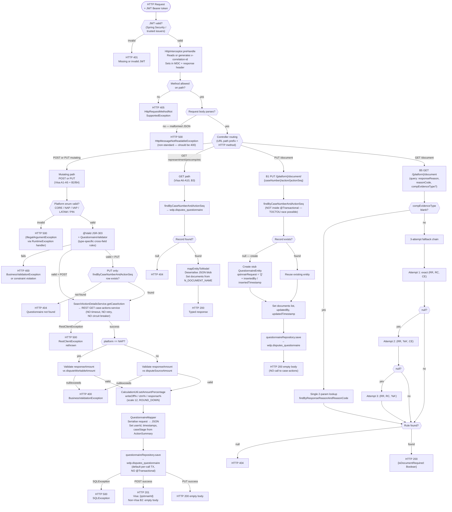

# WDP-COMP-26-QUESTIONNAIRE-SERVICE
**Worldpay Dispute Platform — Component Reference**
*Version: 1.1 DRAFT | April 2026*
*Source-verified: 2026-04-28 via GitHub Copilot CLI on `mdvs-gcp-questionnaire-service`*
*Architect confirmation: PENDING*

---

## ━━━ CORE SKELETON ━━━━━━━━━━━━━━━━━━━━━━━━━━━━━━━━━━━━━━
*Mandatory for every component regardless of type.*

---

## Identity

| Field             | Value                                                                 |
|-------------------|-----------------------------------------------------------------------|
| **Name**          | `QuestionnaireService`                                                |
| **Type**          | `REST API`                                                            |
| **Repository**    | `mdvs-gcp-questionnaire-service`                                      |
| **App name**      | `Questionnaire-Service` (Spring application name)                     |
| **Artifact ID**   | `questionnaire-service` (Maven)                                       |
| **Version**       | `2.1.8`                                                               |
| **Runtime**       | Spring Boot 3.5.4 / Java 17                                           |
| **Base path**     | `/merchant/gcp/questionnaire` (env `SERVER_SERVLET_CONTEXT_PATH`)     |
| **Endpoint count**| **20** (15 Visa + 5 Dispute)                                          |
| **Status**        | `✅ Production`                                                        |
| **Doc status**    | `📝 DRAFT`                                                            |
| **Sections present** | `Core \| Block A — REST`                                           |

---

## Purpose

**What it does**

QuestionnaireService is the persistence and retrieval store for all dispute-response
questionnaires in WDP. A questionnaire captures the structured evidence and reasoning
a merchant submits to the card network as part of a representment or arbitration
response. The service receives questionnaire payloads from the WDP dispute portals,
enriches them with financial figures from `mdvs-gcp-case-actions-service`, serialises
the full payload to a PostgreSQL JSON blob, and serves them back on demand.

The service exposes two logically distinct controller families. `VisaQuestionnaireController`
(prefix `/visa`) handles Visa-specific dispute stages: Representment, Pre-Compliance
Response, Pre-Arbitration Response, Allocation Arbitration, and Allocation Pre-Arbitration.
`DisputeQuestionnaireController` (no class-level prefix) handles Non-Visa representment
(MasterCard, Amex, Discover, etc.), document-name UPSERT, and the document-status
lookup that tells callers whether a supporting document is required for a given
combination of response reason, reason code, and compelling evidence type.

For every mutating operation (POST and PUT) on representment, pre-compliance,
pre-arbitration, allocation arbitration, and allocation pre-arbitration, the service
makes exactly one outbound REST call to `mdvs-gcp-case-actions-service` to retrieve
the `ActionSummary` containing `disputeWorkableAmount`, `disputeSourceAmount`,
`stageCode`, and `creditDebitIndicator`. It uses these values to validate the merchant's
response amount and compute write-off, CTM, and response amount percentages before
persisting. GET operations involve no outbound calls — they are pure database reads.
The B1 PUT `/document` UPSERT also makes no outbound call, since it only manages the
document name list.

The entire request object is serialised as a JSON blob into a single text column
(`C_QSTNNAIR`) in `wdp.disputes_questionnaire`. There are no questionnaire templates
stored in the database; the schema is code-defined and enforced by JSR-303 bean
validation annotations on the request POJOs.

**What it does NOT do**

- Does not trigger any case state transition. Saving or submitting a questionnaire
  does not call CaseManagementService, DisputeService, or any orchestration component.
- Does not handle PAN data. No card-number field exists in any request, response,
  or entity, and there is no EncryptionService dependency. **DEC-004/019 compliant.**
- Does not publish to Kafka. No Kafka dependency of any kind in `pom.xml`.
- Does not consume from Kafka. No `@KafkaListener`, no consumer container factory.
- Does not run on a schedule. No `@Scheduled`, no `@EnableScheduling`, no batch dependency.
- Does not use a transactional outbox.
- Does not delegate document storage to DocumentManagementService, S3, or DynamoDB.
  All questionnaire data is stored in its own PostgreSQL tables.
- Does not perform role or scope authorization beyond JWT issuer validation. There
  are no `@PreAuthorize` annotations or scope assertions anywhere in source.
- Does not declare any `@Transactional` boundary. Every JPA call relies on Spring
  Data JPA's per-call default transaction — see Risks.
- Does not determine which questionnaire a downstream service should use.
  Whether ContestService (COMP-20) or any other component reads from this service
  before submitting to the card network is **not determinable from source**.

---

## Internal Processing Flow



**Mutating-path step sequence (POST and PUT, Visa and Non-Visa converged 11 steps):**
1. JWT validation by Spring Security filter chain
2. `HttpInterceptor.preHandle` — read/generate `v-correlation-id`, set in MDC, echo to response header
3. K8s ingress / Spring routing → controller method by URL prefix + HTTP method
4. Platform enum validation (`SourceSystemName.valueOf(platform.toUpperCase())`)
5. `@Valid` JSR-303 + `QuestionnaireValidator` cross-field rules
6. (PUT only) `getSavedQuestionnaire` → 404 if not found
7. `searchActionDetailsService.getCaseAction(...)` REST call to `case-actions-service`
8. NAP branch: validate `responseAmount` against `disputeWorkableAmount` (NAP) or `disputeSourceAmount` (other)
9. `CalculationUtil.setAmountPercentage` — overwrites writeOff%, ctm%, response% on the request
10. `QuestionnaireMapper.mapModelToEntity` — Jackson serialises request to JSON; sets userId, timestamps, `caseStage` from ActionSummary
11. `questionnaireRepository.save` — write to `wdp.disputes_questionnaire`

**A4 Allocation Arbitration variant**: amount validation uses `caseFilingAmount` rather than `responseAmount`; additionally enforces `contactFax` XOR `contactOther` mutual exclusion within `issuerAcquirerContactInfo` (HTTP 400 if both set).

**A2 Pre-Compliance cross-field rule (symmetric — corrected from prior draft):**
- `preCompResponse == DECL` → `continuePreFilingReason` REQUIRED **and** `partialAcceptanceReason` MUST BE ABSENT
- `preCompResponse == PART` → `partialAcceptanceReason` REQUIRED **and** `continuePreFilingReason` MUST BE ABSENT

**B1 PUT `/document` upsert path** — does **not** call `case-actions-service`. Find-then-decide is **not** inside any `@Transactional`, so two concurrent calls on the same `(caseNumber, actionSeq)` can both find null and both insert.

**B5 GET `/document` multi-fallback** (only when `compEvidenceType` is non-blank):
1. Exact `(responseReason, reasonCode, compEvidenceType)`
2. `(responseReason, "NA", compEvidenceType)`
3. `(responseReason, reasonCode, "NA")`
4. Still null → HTTP 404

When `compEvidenceType` is blank, a single 2-parameter lookup is performed (no fallback chain).

**Asymmetric write-off validation (deliberate code state):**
- `checkWriteOffReasonWriteOffNote` is **commented out** on every POST handler (5 Visa POSTs and B2 Non-Visa POST).
- `checkWriteOffReasonWriteOffNote` is **active** on every PUT handler (5 Visa PUTs and B4 Non-Visa PUT).
- `checkCTMTemplate` method body is fully commented out → no-op on every endpoint, regardless of POST/PUT.

**Non-standard error mapping**: `HttpMessageNotReadableException` (malformed JSON body) → **HTTP 500**, not the conventional HTTP 400. See Risks.

---

## Boundaries

### Inbound Interfaces

| Source | Protocol | Endpoint / Topic / Trigger | Payload / Description |
|--------|----------|----------------------------|-----------------------|
| WDP Merchant Portal (COMP-49) | REST / HTTPS | All `/visa/` and `/{platform}/` endpoints | Merchant questionnaire submissions and reads (probable; team confirmation pending) |
| WDP Ops Portal (COMP-50) | REST / HTTPS | All endpoints | Operations team questionnaire management (probable; team confirmation pending) |
| Unknown orchestration service(s) | REST / HTTPS | All endpoints | No feign client, caller stub, or contract test for this service was found inside its own repo. Caller identity must be confirmed by the platform team. |

*Platform path-parameter valid values, enforced by `SourceSystemName` enum: `CORE`, `NAP`, `VAP`, `LATAM`, `PIN`. Invalid values trigger `IllegalArgumentException` → HTTP 500 (see Risks).*

### Outbound Interfaces

| Target | Protocol | Endpoint / Resource | Purpose | On failure |
|--------|----------|---------------------|---------|------------|
| `mdvs-gcp-case-actions-service` | HTTP REST (HTTPS only on `local` profile) | `GET /merchant/gcp/case-actions/{platform}/case/{caseNumber}/actions/{actionSequence}` | Retrieve `ActionSummary` (disputeWorkableAmount, disputeSourceAmount, stageCode, creditDebitIndicator) on every mutating request | `RestClientException` rethrown → HTTP 500. **No connect timeout, no read timeout, no retry, no fallback, no circuit breaker.** |
| Enterprise IdP (token endpoint) | HTTPS | `${idp_token_url}` | Client-credentials token (registration `wdp-internal-auth`, scope `openid`, grant `client_credentials`) for outbound call to case-actions-service | Token-fetch exception propagates → HTTP 500. No timeout override visible in this repo. |
| `wdp.disputes_questionnaire` | PostgreSQL (Aurora) — **`DriverManagerDataSource`** (not HikariCP) | JPA `save()` | Persist or update questionnaire JSON payload | `SQLException` → HTTP 500. |
| `wdp.disputes_questionnaire_doc_status_rules` | PostgreSQL (Aurora) — **`DriverManagerDataSource`** | JPA read-only | Document-requirement rule lookup for B5 GET `/document` | Null result after fallback chain → HTTP 404. |

**Datasource note**: `PersistenceConfig` uses `DriverManagerDataSource` rather than HikariCP. This means **no application-tier connection pool** — every request opens a fresh JDBC connection and closes it when the operation finishes. Effective pooling depends entirely on PgBouncer / Aurora-side pooling if any. See Risks.

---

## Database Ownership

### Tables Owned (written by this component)

| Schema.Table | Purpose | Key columns | Retention / Notes |
|--------------|---------|-------------|-------------------|
| `wdp.disputes_questionnaire` | Primary questionnaire store. One row per `(caseNumber, actionSeq)` is the **intended** semantics — the JPA entity has a non-unique `@Index` on `(I_CASE, I_ACTION_SEQ)` but **no `@UniqueConstraint`**. Whether a DB-level UNIQUE exists is **not determinable from source** — there are no Liquibase, Flyway, or SQL-migration files in the repo. Full request payload stored as a serialised JSON blob; document names stored separately. | `I_QSTNNAIR_ID` (PK, sequence `wdp.disputes_questionnaire_i_qstnnair_id_sequence`), `I_CASE`, `I_ACTION_SEQ`, `C_CASE_STAGE`, `C_QSTNNAIR` (JSON blob), `N_DOCUMENT_NAME`, `X_INSRT` (insertedBy), `Z_INSRT` (insertedTimestamp), `X_UPDT` (updatedBy), `Z_UPDT` (updatedTimestamp) | ⚠️ **SHARED TABLE** — also written by COMP-37 DocumentManagementService (UPSERT on Endpoint 11 questionnaire path; `@Transactional(rollbackOn=Exception.class)`; last-write-wins on `(caseNumber, actionSequence)` PK; republishes Kafka each time) and by COMP-15 EvidenceConsumer (upserts document names on RESPDOC WDP path). COMP-26 itself uses **no** `@Transactional` on any path — every JPA call is its own per-call default transaction. Retention policy not documented. |

### Tables Read (not owned by this component)

| Schema.Table | Owned by | Why accessed |
|--------------|----------|--------------|
| `wdp.disputes_questionnaire_doc_status_rules` | ⚠️ Owner TBC — **not written from this repo** (strictly read-only here). PK column `id`, sequence `disputes_questionnaire_doc_i_doc_status_rule_id_seq`. | Document-status lookup for B5 GET `/document` — determines whether a supporting document is required for a given `responseReason` + `reasonCode` + `compEvidenceType` combination. |

**Repository inventory (exhaustive):**

| Repository | Entity | Table | Access |
|------------|--------|-------|--------|
| `QuestionnaireRepository` | `QuestionnaireEntity` | `wdp.disputes_questionnaire` | R/W |
| `DocRequiredStatusRulesRepository` | `DocumentRequiredStatusRulesEntity` | `wdp.disputes_questionnaire_doc_status_rules` | R only |

**No other tables touched.** No raw SQL writes anywhere in source.

---

## Configuration and Scaling

| Parameter | Value | Notes |
|-----------|-------|-------|
| K8s resource type | `Deployment` + `Service` (ClusterIP) + `Ingress` | 3 resources in `resources.yaml` |
| Replica count | `{{ replicas-gcp-questionnaire-service }}` | XL Deploy / DeployIt template placeholder. **Only** replica reference in repo — no env override files exist. |
| Memory request / limit | `1024Mi` / `2048Mi` | |
| CPU request / limit | **Not configured** | No `cpu` field under `requests` or `limits` |
| HPA | **Absent** | No `HorizontalPodAutoscaler` in repo |
| PodDisruptionBudget | **Absent** | |
| Rollout strategy | `RollingUpdate`, `maxSurge: 1`, `maxUnavailable: 0` | |
| `minReadySeconds` | `30` — ⚠️ **mis-indented under `spec.template.spec` (Pod spec) instead of `spec` (Deployment spec)**; likely ignored by Kubernetes | See Risks |
| Topology spread | `maxSkew: 1`, `whenUnsatisfiable: ScheduleAnyway`, `topologyKey: kubernetes.io/hostname`, `matchLabels: app: mdvs-gcp-questionnaire-service` | Selector and topology label match — no mismatch |
| Container / service port | `8082` | |
| Ingress | `nginx` ingress class, CORS enabled, TLS via `{{ ingressTLSsecretName }}`, **6 host rules** via templated host names | All hosts route to path `/merchant/gcp/questionnaire` |
| K8s namespace | **Not in `resources.yaml`** — `${K8S_NAMESPACE}` placeholder in `deployit-manifest.xml` | Namespace value comes from XL Deploy / DeployIt config |
| Database connection pool | **`DriverManagerDataSource`** — no HikariCP, no app-tier pool, no connection / query timeout | New connection per JPA call. Effective pooling depends on PgBouncer / Aurora-side, not visible in repo. |
| Async / thread pool | None declared | Inbound REST threads from Tomcat only |
| Observability | OpenTelemetry Java agent injected via `instrumentation.opentelemetry.io/inject-java`; Spring Actuator (`info`, `health`, `prometheus`) on port 8082; liveness `/livez`, readiness `/readyz`; Logstash `LogstashTcpSocketAppender` named `awselk` to `${logstash_server_host_port}` | No startup probe declared. |

**Spring profiles in repo:** Only the base `application.yaml` exists — there are no `application-{profile}.yaml` files. Profile-specific overrides are inline (`local`, `dev`, `test`, `stg`, `uat`, `cert`, `prod`) and only override the `case-actions-service` URL. `local` uses HTTPS; all other profiles use HTTP within the cluster. JWT issuers, IdP URL, server port, and Logstash destination are env-var-driven (not profile-overridden).

---

## Key Architectural Decisions

| Decision | ADR reference | Notes |
|----------|---------------|-------|
| No transactional outbox; no Kafka producer | DEC-001 — DEVIATION (by design for REST API) | Component is a pure synchronous CRUD service; outbox pattern does not apply |
| No PAN handling; no encryption dependency | DEC-004 / DEC-019 — COMPLIES | No card-number field anywhere in entity, request, or response |
| No application-level idempotency on POST | DEC-020 — DEVIATION | Duplicate POSTs insert duplicate rows; no `Idempotency-Key`, no dedupe table, no `@Version`, no DB UNIQUE confirmed |
| No Resilience4j on outbound REST | (DEC-014 platform-VOID) — factual record | Bare `new RestTemplate()` with no timeout / retry / circuit breaker on the only outbound call |
| No `@Transactional` boundaries declared anywhere | Local — significant deviation | Every JPA operation runs in Spring Data JPA's per-call default transaction. Multi-step flows (PUT find-then-save, B1 UPSERT find-then-decide-then-save) span multiple short transactions and are vulnerable to TOCTOU races. |
| `DriverManagerDataSource` instead of HikariCP | Local — significant deviation | New JDBC connection per JPA call; no application-tier pool. |
| JWT-only auth, no scope or `@PreAuthorize` | Local | Any valid JWT from a trusted issuer is accepted on all 20 endpoints |

---

## Risks and Constraints

**Severity scale:** 🔴 HIGH · 🟡 MEDIUM · 🟢 LOW

| Severity | Risk | Consequence |
|----------|------|-------------|
| 🔴 HIGH | **No `@Transactional` anywhere in service code** | PUT (find → save) and B1 UPSERT (find → decide → save) span multiple per-call transactions. Concurrent B1 calls for the same `(caseNumber, actionSeq)` can both find null and both insert, producing duplicate rows. PUT path can read an entity, have it updated by another path, and then overwrite without `@Version` detecting the conflict. |
| 🔴 HIGH | **POST idempotency gap** — no application-level pre-existing-row check, no `Idempotency-Key` header, no DB-level UNIQUE confirmed (no migration files in repo) | Duplicate POSTs for the same `(caseNumber, actionSeq)` insert phantom rows. Retry by callers (or accidental double-submit by portals) silently corrupts the questionnaire history. |
| 🔴 HIGH | **No timeout on outbound `case-actions-service` REST call** — `new RestTemplate()` with no `HttpComponentsClientHttpRequestFactory`, no `setConnectTimeout`, no `setReadTimeout` | Default JVM socket timeout (effectively unbounded). Any slowness or hang in `case-actions-service` blocks the mutating request thread indefinitely; under load, all Tomcat worker threads can be tied up waiting. Same applies to the IdP token fetch — no timeout configured. |
| 🟠 MEDIUM-HIGH | **No Resilience4j circuit breaker / retry on outbound REST** — no Resilience4j artifact in `pom.xml`, no `@CircuitBreaker` / `@Retry` / `@Bulkhead` annotations, no manual retry | If `case-actions-service` is degraded, every mutating request on this service fails immediately or hangs. No graceful degradation, no fail-fast circuit. |
| 🟡 MEDIUM | **`DriverManagerDataSource` instead of HikariCP** | No application-tier connection pool. Each JPA operation opens a new JDBC connection. Throughput is bounded by Postgres's accept-rate and PgBouncer (if present). Connection storm risk under traffic spikes. |
| 🟡 MEDIUM | **`HttpMessageNotReadableException` → HTTP 500 (not 400)** | Malformed JSON from a caller is reported as a server error rather than a client error. Misleading to upstream observability and breaks normal client error-handling conventions. |
| 🟡 MEDIUM | **`minReadySeconds: 30` mis-indented under Pod spec**, not Deployment spec | Likely ignored by K8s — rolling updates may proceed faster than the 30-second cool-off the manifest authors intended. Effective rollout behaviour does not match declared intent. |
| 🟡 MEDIUM | **Asymmetric write-off validation** — `checkWriteOffReasonWriteOffNote` commented out on POST, active on PUT | Merchant can create a questionnaire with `writeOffAmount` but no `writeOffReason`/`writeOffNote` via POST; cannot then update it without filling those fields (or must abandon and POST a duplicate). Inconsistent contract. |
| 🟡 MEDIUM | **CTM template never validated** — `checkCTMTemplate` body fully commented out across POST and PUT | `ctmTemplate` is functionally optional despite being present in `RepresentmentRequest`. Data-quality risk on stored CTM records. |
| 🟡 MEDIUM | **Invalid platform string returns HTTP 500, not 400** | `SourceSystemName.valueOf(...)` throws `IllegalArgumentException` for an unknown platform; the `RuntimeException` handler maps it to 500. Client-side typo on `{platform}` is misreported as server failure. |
| 🟡 MEDIUM | **Known callers unconfirmed** — no inbound contract test, feign client, or stub in this repo references this service | Migration / change-impact analysis cannot be performed from source alone. ContestService (COMP-20) relationship is also unconfirmed. |
| 🟢 LOW | **`StandardEntityError` and `createDuplicateResponseEntity` are dead code** | Defined in `GlobalExceptionHandler` but not reachable from any active `@ExceptionHandler`. Maintenance hazard. |
| 🟢 LOW | **`${app.name}` env var referenced for metrics tag but not declared** in `application.yaml` or `resources.yaml` | If not injected via XL Deploy, the Prometheus `application` tag will resolve unset/blank, degrading dashboards. |
| 🟢 LOW | **Two commented-out hardcoded Logstash IPs** (`10.43.145.125:5044`) in `logback-spring.xml` | Dev/staging artefact; no production impact, but should be removed. |
| 🟢 LOW | **TODO at `GlobalExceptionHandler`** for `HttpRequestMethodNotSupportedException` (METHOD_NOT_ALLOWED) | Error handler note marked incomplete; current behaviour returns 405 correctly, but the work item is unresolved. |

---

## Planned Changes

- ⚠️ OPEN QUESTION: Are there any planned remediations for the no-`@Transactional` posture and the `DriverManagerDataSource` decision? Both are local platform deviations that affect concurrency safety and connection-storm risk.
- ⚠️ OPEN QUESTION: Has the absence of Resilience4j been formally accepted as a platform exception for this service, given DEC-014 has been voided?
- ⚠️ OPEN QUESTION: POST idempotency — DB UNIQUE on `(I_CASE, I_ACTION_SEQ)` to be added, or accept the current duplicate-row behaviour?
- ⚠️ OPEN QUESTION: Restore `checkWriteOffReasonWriteOffNote` on POST, or formally document the asymmetry as intentional?
- ⚠️ OPEN QUESTION: Restore or remove `checkCTMTemplate` — is CTM template validation deferred or deprecated?
- ⚠️ OPEN QUESTION: Fix `HttpMessageNotReadableException` → 400 mapping, or document as accepted behaviour?

No quarterly migration plan visible in source. Review at next architect session.

---

---

## ━━━ TYPE BLOCK A — REST API CONTRACTS ━━━━━━━━━━━━━━━━━━━
*REST API component. No Kafka consumer or producer side. No batch/scheduler.*

---

## REST API Contracts

**Authentication model**: All endpoints (except `/actuator/health`, `/livez`, `/readyz`, and Swagger UI in non-prod profiles) require a Bearer JWT validated by Spring Security `JwtIssuerAuthenticationManagerResolver`. Trusted issuers are loaded from config key `jwt.trustedIssuers` (env `jwt_trusted_issuer_urls`). Any valid JWT from a trusted issuer is accepted — there are no `@PreAuthorize` annotations, no scope or role checks anywhere in source.

**Outbound auth**: Client-credentials OAuth2 token from enterprise IdP (registration `wdp-internal-auth`, grant `client_credentials`, scope `openid`, token URL `${idp_token_url}`). Attached as Bearer on every call to `case-actions-service`.

**Base URL pattern**: `https://<host>/merchant/gcp/questionnaire/<...>` (context path from env `SERVER_SERVLET_CONTEXT_PATH`).

**Inbound interceptor**: `HttpInterceptor` (the only `HandlerInterceptor` registered) reads `v-correlation-id` from the request header (or generates a UUID), sets it in MDC and `RequestCorrelation`, and echoes it back on the response header. No other filters or `OncePerRequestFilter` implementations.

---

### Group A — VisaQuestionnaireController (class-level prefix `/visa`)

*Paths below are relative to base path `/merchant/gcp/questionnaire`.*
*Platform path-parameter valid values: `CORE`, `NAP`, `VAP`, `LATAM`, `PIN`.*

#### A-POST — Create Visa Questionnaire (5 endpoints)

| # | Method | Path | Request body | 201 Response |
|---|--------|------|--------------|--------------|
| A1 | POST | `/visa/{platform}/representment/{caseNumber}/action/{actionSeq}` | `RepresentmentRequest` | `{"qstnnairId":"<id>"}` |
| A2 | POST | `/visa/{platform}/precomresp/{caseNumber}/action/{actionSeq}` | `QuestionnairePreCompRequest` | `{"qstnnairId":"<id>"}` |
| A3 | POST | `/visa/{platform}/prearbresp/{caseNumber}/action/{actionSeq}` | `QuestionnairePreArbRequest` | `{"qstnnairId":"<id>"}` |
| A4 | POST | `/visa/{platform}/allocarb/{caseNumber}/action/{actionSeq}` | `AllocationArbRequest` | `{"qstnnairId":"<id>"}` |
| A5 | POST | `/visa/{platform}/allocprearb/{caseNumber}/action/{actionSequence}` | `VISAAllocationPreArbRequest` | `{"qstnnairId":"<id>"}` |

All five share the converged 11-step mutating flow. Endpoint-specific validation:
- **A2**: symmetric DECL/PART rule (see Internal Processing Flow section)
- **A3**: `reasonForNotFullResponsibility @NotBlank`
- **A4**: amount validates against `caseFilingAmount`; `contactFax` XOR `contactOther` mutual exclusion
- **A5**: `validatePreArbitrationResponseReason` enforces CREDIT_PROCESSED → `creditProcessed` required, COMPELLING_EVIDENCE → `compellingEvidence` required

⚠️ **All A-POST endpoints**: `checkWriteOffReasonWriteOffNote` and `checkCTMTemplate` are **commented out** at the call site — see Internal Processing Flow.

#### A-PUT — Update Visa Questionnaire (5 endpoints)

| # | Method | Path | Request body | 200 Response |
|---|--------|------|--------------|--------------|
| A11 | PUT | `/visa/{platform}/allocarb/{caseNumber}/action/{actionSeq}` | `AllocationArbRequest` | empty body |
| A12 | PUT | `/visa/{platform}/precomresp/{caseNumber}/action/{actionSeq}` | `QuestionnairePreCompRequest` | empty body |
| A13 | PUT | `/visa/{platform}/allocprearb/{caseNumber}/action/{actionSequence}` | `VISAAllocationPreArbRequest` | empty body |
| A14 | PUT | `/visa/{platform}/representment/{caseNumber}/action/{actionSeq}` | `RepresentmentRequest` | empty body |
| A15 | PUT | `/visa/{platform}/prearbresp/{caseNumber}/action/{actionSeq}` | `QuestionnairePreArbRequest` | empty body |

PUT differs from POST in two ways:
1. `getSavedQuestionnaire(caseNumber, actionSeq)` is called first → HTTP 404 if absent (no upsert)
2. `checkWriteOffReasonWriteOffNote` is **active** — `writeOffReason` and `writeOffNote` required when `writeOffAmount` is present
3. `checkCTMTemplate` remains a no-op (method body commented out)

#### A-GET — Read Visa Questionnaire (5 endpoints)

| # | Method | Path | 200 Response |
|---|--------|------|--------------|
| A6 | GET | `/visa/{platform}/precomresp/{caseNumber}/action/{actionSeq}` | `PreCompResponse` |
| A7 | GET | `/visa/{platform}/allocarb/{caseNumber}/action/{actionSeq}` | `AllocationArbResponse` |
| A8 | GET | `/visa/{platform}/representment/{caseNumber}/action/{actionSeq}` | `RepresentmentResponse` |
| A9 | GET | `/visa/{platform}/prearbresp/{caseNumber}/action/{actionSeq}` | `CollaborationPreArbResponse` |
| A10 | GET | `/visa/{platform}/allocprearb/{caseNumber}/action/{actionSeq}` | `VISAAllocationPreArbResponse` |

Shared pattern: JWT + correlation-id + path validation → `findByCaseNumberAndActionSeq` → 404 if null → `mapEntityToModel` deserialises JSON blob and copies documents list → 200 + typed response. **No outbound call to `case-actions-service` on GET.**

---

### Group B — DisputeQuestionnaireController (no class-level prefix)

*Paths below are relative to base path `/merchant/gcp/questionnaire`. Platform path variable is on every endpoint.*

#### B1 — PUT `/{platform}/document/{caseNumber}/action/{actionSeq}`
**UPSERT** — creates a stub row with `qstnnairRequest = "{}"` if none exists, then sets the document names list. Does **not** call `case-actions-service`. Find-then-decide-then-save runs across multiple per-call transactions (no `@Transactional`); concurrent B1 calls for the same key can both insert. Returns 200 empty body.

| Field | Type | Required |
|-------|------|----------|
| `documents` | `List<String>` | ✅ non-empty |
| `userId` | String | ✅ |

#### B2 — POST `/{platform}/representment/{caseNumber}/action/{actionSeq}`
Non-Visa representment create. Same converged 11-step flow as Visa POSTs using `NonVisaRepresentmentRequest`. `caseNetwork` and `comments` are both `@NotBlank`. Returns **201 with empty body** (Visa POSTs return `{"qstnnairId":"..."}`).

#### B3 — GET `/{platform}/representment/{caseNumber}/action/{actionSeq}`
Same pattern as Visa GET group. Returns `NonVisaRepresentmentResponse` (includes `caseNetwork`).

#### B4 — PUT `/{platform}/representment/{caseNumber}/action/{actionSeq}`
Same as Visa PUT pattern with `NonVisaRepresentmentRequest`. `checkWriteOffReasonWriteOffNote` active; `checkCTMTemplate` no-op.

#### B5 — GET `/{platform}/document`
Document-requirement lookup. Query parameters: `responseReason` (required), `reasonCode` (required), `compEvidenceType` (optional, ≤ 6 chars). Multi-fallback chain when `compEvidenceType` is non-blank; single 2-param lookup otherwise (see Internal Processing Flow). Returns `DocumentStatusResponse { isDocumentRequired: Boolean }` or 404.

---

### HTTP Status Codes (all endpoints)

| Code | Trigger |
|------|---------|
| 200 | Successful GET; successful PUT |
| 201 | Successful POST |
| 400 | Bean validation failure (`MethodArgumentNotValidException`, `MethodArgumentTypeMismatchException`, `InvalidFormatException`, `ConstraintViolationException`, `MissingServletRequestPartException`); business validation failure (`BusinessValidationException` with BAD_REQUEST); A4 contactFax+contactOther conflict |
| 401 | Missing or invalid JWT (Spring Security filter — pre-controller) |
| 404 | Questionnaire not found for `(caseNumber, actionSeq)`; document-status rule not found after fallback chain; `NoHandlerFoundException` |
| **405** | `HttpRequestMethodNotSupportedException` (HTTP method not permitted on path) |
| 500 | PostgreSQL error; `case-actions-service` unreachable / `RestClientException`; **malformed JSON body (`HttpMessageNotReadableException`)**; **invalid platform value (`IllegalArgumentException` from `SourceSystemName.valueOf`)**; any uncaught `RuntimeException` |

**No 403, 409, 415, 422, 503 paths exist** — confirmed across both controllers and the global exception handler.

**Error response body (all non-2xx responses):**
```json
{
  "errors": [
    {
      "errorMessage": "Human-readable error message",
      "target": "Field name or error category"
    }
  ]
}
```
*(Field name is `errorMessage`, not `message` — corrected from prior draft.)*

`StandardEntityError` (with `status` / `errorCode` / `entity` fields) and the private helper `createDuplicateResponseEntity()` exist in `GlobalExceptionHandler` but are **dead code** — neither is reachable from any active `@ExceptionHandler`.

---

## Remaining Gaps

| Gap | What is needed | Action |
|-----|---------------|--------|
| **Known callers** — not determinable from source | Team confirmation of which portals and orchestration services call this service | Team confirmation |
| **ContestService relationship (COMP-20)** | Does ContestService call this service before submitting representment / arbitration to a card network? | Cross-component Copilot pass on `mdvs-gcp-contest-service` repo |
| **DB-level UNIQUE constraint on `wdp.disputes_questionnaire(I_CASE, I_ACTION_SEQ)`** | No DDL or migration in repo. JPA entity has only a non-unique `@Index`. | DBA confirmation: `SELECT constraint_name, constraint_type FROM information_schema.table_constraints WHERE table_name = 'disputes_questionnaire';` |
| **DB-level NOT NULL constraints** | Same — no DDL in repo, only JPA annotations | DBA confirmation |
| **Owner of `wdp.disputes_questionnaire_doc_status_rules`** | This repo only reads. Writer not located. | Team confirmation; cross-repo grep |
| **Exact replica count** | Template placeholder only; no values file in repo | XL Deploy / DeployIt config review |
| **K8s namespace** | `${K8S_NAMESPACE}` placeholder in deployit-manifest; no `namespace:` key in any YAML | XL Deploy / DeployIt config review |
| **`${app.name}` env var injection** | Referenced in metrics tag config but not declared | XL Deploy / DeployIt config review |
| **Production Logstash host:port** | Env var `${logstash_server_host_port}` — value not in repo | Team / infra confirmation |
| **TLS certificate for Ingress** | `{{ ingressTLSsecretName }}` placeholder | Infra confirmation |
| **IdP token endpoint timeout** | Spring's OAuth2 client uses an internal `RestTemplate`; no override visible | Runtime observation or infra config review |
| **Effective Postgres pooling** | App uses `DriverManagerDataSource` (no app-tier pool) | Confirm whether PgBouncer or Aurora-side pooling is in front of this service |
| **DEC-014 formal exception** | Whether absence of Resilience4j has been formally accepted | Architect decision |
| **No-`@Transactional` posture** | Whether multi-step operations are intentionally split across per-call transactions | Architect decision |
| **POST idempotency posture** | Whether duplicate-row insertion on POST is accepted or to be remediated (DB UNIQUE + caller `Idempotency-Key`) | Architect decision |
| **`checkWriteOffReasonWriteOffNote` POST asymmetry** | Restore validation or document as intentional | Team / architect decision |
| **`checkCTMTemplate` removal vs restoration** | Validator body commented out everywhere | Team / architect decision |
| **`HttpMessageNotReadableException` → 500 instead of 400** | Fix mapping or document as accepted | Team / architect decision |
| **`minReadySeconds` indentation fix** | Currently mis-placed under Pod spec | DevOps follow-up |

---

*End of WDP-COMP-26-QUESTIONNAIRE-SERVICE.md v1.1 DRAFT.*
*File status: 📝 DRAFT — source-verified 2026-04-28 against `mdvs-gcp-questionnaire-service`. Architect confirmation pending.*
*Platform-level impacts captured in WDP-CHANGE-LOG.md Pending Entry. WDP-DB.md row update pending; WDP-COMP-INDEX.md row update pending; no WDP-KAFKA.md changes (component is Kafka-free).*
