# WDP-COMP-27-CASE-SEARCH-SERVICE
**Worldpay Dispute Platform — Component Reference**
*Version: 2.0 DRAFT | April 2026*
*Source-verified from `mdvs-gcp-case-search-service` by Claude Code on 2026-04-24. Architect-confirmed: PENDING. Supersedes v1.0 DRAFT.*

---

## ━━━ CORE SKELETON ━━━━━━━━━━━━━━━━━━━━━━━━━━━━━━━━━━━━━━

---

## Identity

| Field             | Value                                                        |
|-------------------|--------------------------------------------------------------|
| **Name**          | `CaseSearchService`                                          |
| **Type**          | `REST API`                                                   |
| **Repository**    | `mdvs-gcp-case-search-service`                               |
| **Runtime**       | `Java 17 / Spring Boot 3.5.13 / port 8082`                   |
| **Context path**  | `/merchant/gcp/case-search`                                  |
| **Status**        | `✅ Production`                                              |
| **Doc status**    | `📝 DRAFT v2.0`                                              |
| **Sections present** | `Core \| Block A — REST API \| Section 10 — SQL Catalogue` |

---

## Purpose

**What it does**

CaseSearchService is the platform-wide read layer for dispute case data. It provides dispute case search, case detail retrieval, queue management, dispute summary aggregation, and case locking across all five WDP acquiring platforms — NAP, PIN, CORE, VAP, and LATAM — from a single codebase. Platform routing is driven by a `{platform}` or `{region}` path variable that selects between two physical PostgreSQL schemas: `nap.*` for NAP/UK traffic and `wdp.*` for US/PIN/CORE/VAP/LATAM traffic.

The service exposes **15 active REST endpoints** across six controllers. V1 endpoints use `{platform}` as the path variable. V2 and queue endpoints use `{region}` (UK, US). Authorization is JWT-based with a multi-issuer OAuth2 resource server. Data-level filtering is applied from JWT claims — external NAP callers have their results scoped via UAMS; external PIN and CORE callers via CHAS. **External VAP and LATAM callers fall through with no entity-scope call** — this is a source finding flagged for architect review. Internal NAP regular users (`AuthorizationList` contains `WDP_NAP_REGULAR`) are filtered to their queue assignment; internal non-regular users receive unfiltered results. An internal PIN-regular role (`WDP_PIN_REGULAR`) also exists in code.

Case detail endpoints use a parallel async fan-out pattern (Spring `@Async`, bean `asyncExecutor`, thread pool 10 core / 10 max / 50 queue). Up to five downstream services are called concurrently — CaseManagementService, CaseActionService, NotesService, DocumentManagementService, DisplayCodeService — joined by `CompletableFuture.allOf().join()` before response mapping. Display code lookups are in-memory cached for the lifetime of the JVM instance (Spring `@Cacheable("displayCodes")`, `ConcurrentMapCacheManager` default). The v2 detail endpoint is a slimmer variant: case + actions + display codes only. The `/progress` endpoint creates four futures but joins only two — `caseDetails` and `documentResponse` are created and orphaned (see Risks and Constraints).

The service has **two narrow write operations**, both on the case-lock flag: `PATCH /{platform}/case/lock/{caseNumber}` (V1) and `POST /{platform}/v2/case/lock/{caseNumber}` (V2). Both perform a direct synchronous UPDATE on `nap.case` or `wdp.case` to set or clear the lock flag. No transactional boundary is applied — pre-read and UPDATE are two separate auto-commit JDBC statements. No transactional outbox, no Kafka publishing, and no event emission occur on these writes.

**What it does NOT do**

- Does NOT own or write dispute state beyond the case lock columns (`c_case_lock`, `c_locked_by`, `x_locked_at` / `z_locked_at`, `x_updt`, `z_updt`). No INSERT and no DELETE anywhere in source.
- Does NOT call CaseManagementService for search operations — search queries go directly to PostgreSQL via `JdbcClient`. CaseManagementService is called only for case detail fan-out.
- Does NOT consume from any Kafka topic. No `@KafkaListener` or consumer group is configured. No `spring-kafka` dependency in `pom.xml`.
- Does NOT publish to any Kafka topic.
- Does NOT use the transactional outbox pattern.
- Does NOT apply Resilience4j, Spring Retry, or any circuit-breaker library. All outbound calls use a single shared `new RestTemplate()` bean with no `setConnectTimeout` and no `setReadTimeout`.
- Does NOT use Redis or any distributed cache. The only cache is the in-memory display-code cache and the in-process OAuth2 token cache (`InMemoryOAuth2AuthorizedClientService`, per-pod).
- Does NOT encrypt PAN for persistence — the only PAN handling is in-flight encryption via EncryptionService before a DB query filter (v2 search only). No raw PAN is ever written to the database by this service.
- Does NOT enforce endpoint-level RBAC via Spring Security annotations. No `@PreAuthorize` / `@Secured` anywhere. Any valid JWT from a trusted issuer can reach any endpoint; authorization is applied in controller/service code after dispatch.
- Does NOT use an `AbstractRoutingDataSource`. Schema routing is in-code `if/else` selecting between `napJdbcClient` and `wdpJdbcClient`.

---

## Internal Processing Flow

*Three independent processing patterns share a common JWT/auth entry. They are shown as separate paths below. Dashed edges mark orphaned futures and known defects surfaced by the audit.*

```mermaid
flowchart TD

    %% ═══════════════════════════════════════
    %% COMMON ENTRY — JWT + CORRELATION + AUTH
    %% ═══════════════════════════════════════

    ALL_IN["All endpoints<br/>15 active + health/swagger whitelisted"]
    JWT{{"Bearer JWT valid?<br/>Spring Security<br/>multi-issuer JWKS"}}
    JWT_FAIL["401 Unauthorized"]
    MDC["HttpInterceptor<br/>extract/generate v-correlation-id<br/>put in MDC + response header"]
    ENDPOINT_ROUTE{{"Endpoint type?"}}

    %% ═══════════════════════════════════════
    %% PATH 1 — SEARCH / LOOKUP / SUMMARY
    %% ═══════════════════════════════════════

    INTERNAL_CHK{{"Internal firm?<br/>iss contains<br/>us_worldpay_fis_int"}}
    CHBK_EXT{{"Chargeback endpoint<br/>AND external?"}}
    CHBK_403["403 Forbidden<br/>before request body read"]
    EXT_PLATFORM{{"Platform?"}}
    UAMS_CALL["UAMS authorize<br/>COMP-02"]
    CHAS_CALL["CHAS authorize<br/>COMP-03"]
    VAP_LATAM["VAP/LATAM — no entity-scope call<br/>⚠️ source finding"]
    AUTH_FAIL["403 Forbidden"]
    SCHEMA{{"Platform / region?"}}
    NAP_DAO["ukCaseSearchDaoImpl / UK* DAOs<br/>napJdbcClient — nap.* schema"]
    WDP_DAO["usCaseSearchDaoImpl / US* DAOs<br/>wdpJdbcClient — wdp.* schema<br/>+ JPA EntityManager 'wdp' for summary"]
    NAP_ROLE{{"Internal caller<br/>AND WDP_NAP_REGULAR?"}}
    QUEUE_FILTER["Read nap.users + user_queue<br/>+ queues + queue_criterion<br/>build SQL fragments via<br/>QueueSupport.buildQueueCriterion<br/>⚠️ values concatenated unescaped"]
    QUEUE_EMPTY{{"queueCriterionList empty?"}}
    EMPTY_OUT["200 OK — empty results<br/>totalRowsCount=0"]
    PAN_CHK{{"V2 search AND cardNumber<br/>full unmasked PAN?<br/>no '*' AND length &lt; 30"}}
    ENCRYPT["Encrypt PAN via<br/>COMP-35 EncryptionService<br/>→ HPAN as DB filter"]
    ENCRYPT_FAIL["500 Internal Server Error"]
    SKIP_COUNT{{"skipCount flag set?"}}
    COUNT_Q["COUNT query<br/>capped at configTotalCount+1"]
    DB_FAIL["RuntimeException → 500"]
    COUNT_ZERO{{"count == 0?"}}
    OVER_LIMIT{{"count &gt; configTotalCount?"}}
    LFT_BYPASS{{"isLftSearch=true?"}}
    RECOUNT["Re-count up to lftTotalCount"]
    OVER_MAX{{"count &gt; lftTotalCount?"}}
    COUNT_ERR["200 — DisputeCaseSearchResponse<br/>errors list set, no case data<br/>SYSTEM_ERROR_TOO_MANY_RECORDS"]
    DATA_Q["Paginated SELECT<br/>UK V1 — LIMIT/OFFSET<br/>US V1 — ROW_NUMBER+BETWEEN<br/>V2 — LIMIT/OFFSET<br/>⚠️ values string-concatenated"]
    MAP_SEARCH["Map rows to response DTOs<br/>external NAP actionStatus override:<br/>CASE WHEN D_RESPONSE_DUE &lt; CURRENT_DATE-1<br/>THEN 'CLOSED' ELSE C_ACTION_STA END"]
    MASK_CHK{{"Platform in<br/>PIN/CORE/VAP/LATAM<br/>AND maskRoles absent?"}}
    MASK_CARD["Mask card number<br/>first 6 + 'x'... + last 4"]
    SEARCH_OUT["200 OK<br/>SearchCaseResponse /<br/>DisputeCaseSearchResponse /<br/>DisputeSummaryResponse"]

    %% ═══════════════════════════════════════
    %% PATH 2 — CASE DETAIL (ASYNC FAN-OUT)
    %% ═══════════════════════════════════════

    DETAIL_AUTH["Auth pipeline (same as Path 1)"]
    ASYNC_FAN{{"Endpoint?"}}
    FAN_V1["v1 detail fan-out (5 futures joined)<br/>CaseMgmt · CaseActions · Notes<br/>· Documents · DisplayCode"]
    FAN_V2["v2 detail fan-out (3 futures joined)<br/>CaseMgmt · CaseActions · DisplayCode"]
    FAN_PROG["/progress fan-out<br/>4 futures created but only<br/>2 joined (actions, displayCode)<br/>⚠️ caseDetails + documentResponse<br/>orphaned in flight"]
    FAN_ACT["/actions fan-out (5 futures joined)<br/>CaseActions · Notes · Documents<br/>· DisplayCode · BusinessRules"]
    FAN_Q["Queue case-details fan-out<br/>via QueueCaseDetailServiceImpl"]
    FAN_COMMON["CompletableFuture.allOf().join()<br/>any future failure → CompletionException<br/>⚠️ no try/catch — whole endpoint fails"]
    SVC_NULL["404 + known-message predicate<br/>in RestInvoker — returns null<br/>⚠️ precedence-bug OR chain:<br/>only CASE_NOT_FOUND gated by 404<br/>ACTION/NOTE/DOCUMENT match any status"]
    LOCK_CHK{{"v1 detail NAP regular<br/>AND isLock='Y'<br/>AND lockedBy != loginName?"}}
    LOCKED_OUT["200 OK — null body<br/>locked case suppressed"]
    MAP_DETAIL["mapCaseDetailsResponse /<br/>mapCaseActivityResponse /<br/>mapCaseActionResponse"]
    DETAIL_OUT["200 OK<br/>DisputeCaseDetailResponse /<br/>DisputeCaseResponse (v2) /<br/>CaseProgressResponse /<br/>List&lt;ActionResponse&gt;"]

    %% ═══════════════════════════════════════
    %% PATH 3 — CASE LOCK (ONLY WRITE PATHS)
    %% PATCH V1 and POST V2 lock endpoints
    %% ═══════════════════════════════════════

    LOCK_IN["PATCH /{platform}/case/lock/{caseNumber}<br/>OR<br/>POST /{platform}/v2/case/lock/{caseNumber}"]
    LOCK_AUTH["JWT only<br/>no external entity-scope call<br/>loginName from JWT"]
    READ_LOCK["SELECT i_case_id, c_case_lock, c_locked_by<br/>FROM nap.case or wdp.case<br/>WHERE i_case = ?<br/>⚠️ auto-commit, no FOR UPDATE"]
    CASE_EXISTS{{"Case found?"}}
    CASE_NOT_FOUND["400 BadRequestException"]
    ALREADY_CHK{{"isCheckRequired=true<br/>AND isLock=true<br/>AND caseLock='Y'<br/>AND lockedBy != loginName?"}}
    ALREADY_LOCKED["200 CaseLockResponse<br/>CASE_ALREADY_LOCKED<br/>no DB write"]
    UPDATE_LOCK["UPDATE nap.case or wdp.case<br/>SET c_case_lock, c_locked_by,<br/>x_locked_at/z_locked_at,<br/>x_updt, z_updt<br/>WHERE i_case_id = ?<br/>⚠️ unconditional — no lock-owner guard<br/>⚠️ different ts col between nap/wdp"]
    LOCK_OUT["200 CaseLockResponse<br/>CASE_LOCKED or CASE_UNLOCKED"]

    %% ═══════════════════════════════════════
    %% CONNECTIONS
    %% ═══════════════════════════════════════

    ALL_IN --> JWT
    JWT -->|"invalid"| JWT_FAIL
    JWT -->|"valid"| MDC
    MDC --> ENDPOINT_ROUTE

    ENDPOINT_ROUTE -->|"search / lookup / summary / queue"| INTERNAL_CHK
    ENDPOINT_ROUTE -->|"case detail / progress / actions"| DETAIL_AUTH
    ENDPOINT_ROUTE -->|"case lock (V1 or V2)"| LOCK_IN

    INTERNAL_CHK -->|"external"| CHBK_EXT
    INTERNAL_CHK -->|"internal"| SCHEMA
    CHBK_EXT -->|"yes"| CHBK_403
    CHBK_EXT -->|"no"| EXT_PLATFORM

    EXT_PLATFORM -->|"NAP"| UAMS_CALL
    EXT_PLATFORM -->|"PIN / CORE"| CHAS_CALL
    EXT_PLATFORM -->|"VAP / LATAM"| VAP_LATAM
    UAMS_CALL -->|"fail"| AUTH_FAIL
    CHAS_CALL -->|"fail"| AUTH_FAIL
    UAMS_CALL -->|"pass"| SCHEMA
    CHAS_CALL -->|"pass"| SCHEMA
    VAP_LATAM -.->|"falls through"| SCHEMA

    SCHEMA -->|"NAP / UK"| NAP_DAO
    SCHEMA -->|"PIN/CORE/VAP/LATAM / US"| WDP_DAO

    NAP_DAO --> NAP_ROLE
    NAP_ROLE -->|"yes — regular"| QUEUE_FILTER
    NAP_ROLE -->|"no — other role"| PAN_CHK
    QUEUE_FILTER --> QUEUE_EMPTY
    QUEUE_EMPTY -->|"empty"| EMPTY_OUT
    QUEUE_EMPTY -->|"non-empty"| PAN_CHK
    WDP_DAO --> PAN_CHK

    PAN_CHK -->|"yes — v2 full PAN"| ENCRYPT
    ENCRYPT -->|"fail"| ENCRYPT_FAIL
    ENCRYPT -->|"HPAN returned"| SKIP_COUNT
    PAN_CHK -->|"no / masked / non-v2"| SKIP_COUNT

    SKIP_COUNT -->|"yes"| DATA_Q
    SKIP_COUNT -->|"no"| COUNT_Q
    COUNT_Q -->|"DB fail"| DB_FAIL
    COUNT_Q --> COUNT_ZERO
    COUNT_ZERO -->|"yes"| EMPTY_OUT
    COUNT_ZERO -->|"no"| OVER_LIMIT
    OVER_LIMIT -->|"no"| DATA_Q
    OVER_LIMIT -->|"yes"| LFT_BYPASS
    LFT_BYPASS -->|"yes"| RECOUNT
    LFT_BYPASS -->|"no"| COUNT_ERR
    RECOUNT --> OVER_MAX
    OVER_MAX -->|"yes"| COUNT_ERR
    OVER_MAX -->|"no"| DATA_Q
    DATA_Q -->|"DB fail"| DB_FAIL
    DATA_Q --> MAP_SEARCH
    MAP_SEARCH --> MASK_CHK
    MASK_CHK -->|"yes"| MASK_CARD
    MASK_CARD --> SEARCH_OUT
    MASK_CHK -->|"no"| SEARCH_OUT

    DETAIL_AUTH --> ASYNC_FAN
    ASYNC_FAN -->|"v1 detail"| FAN_V1
    ASYNC_FAN -->|"v2 detail"| FAN_V2
    ASYNC_FAN -->|"/progress"| FAN_PROG
    ASYNC_FAN -->|"/actions"| FAN_ACT
    ASYNC_FAN -->|"queue case-details"| FAN_Q
    FAN_V1 --> FAN_COMMON
    FAN_V2 --> FAN_COMMON
    FAN_PROG --> FAN_COMMON
    FAN_ACT --> FAN_COMMON
    FAN_Q --> FAN_COMMON
    FAN_COMMON -->|"any 4xx/5xx non-null"| DB_FAIL
    FAN_COMMON -->|"404 + known msg"| SVC_NULL
    FAN_COMMON --> LOCK_CHK
    SVC_NULL --> LOCK_CHK
    LOCK_CHK -->|"yes — locked"| LOCKED_OUT
    LOCK_CHK -->|"no"| MAP_DETAIL
    MAP_DETAIL --> DETAIL_OUT

    LOCK_IN --> LOCK_AUTH
    LOCK_AUTH --> READ_LOCK
    READ_LOCK --> CASE_EXISTS
    CASE_EXISTS -->|"not found"| CASE_NOT_FOUND
    CASE_EXISTS -->|"found"| ALREADY_CHK
    ALREADY_CHK -->|"yes"| ALREADY_LOCKED
    ALREADY_CHK -->|"no"| UPDATE_LOCK
    UPDATE_LOCK --> LOCK_OUT
```



---

## Boundaries

### Inbound Interfaces

| Source | Protocol | Endpoint / Trigger | Payload / Description |
|--------|----------|--------------------|-----------------------|
| API Gateway (COMP-01) | REST (in-cluster) | All 15 endpoints — routed by URL pattern | JWT-bearing HTTP requests from Merchant Portal, Ops Portal, and internal services |
| DisputeService (COMP-22) | REST (in-cluster) | `GET /{platform}/case/lookup` | Case lookup by caseNumber and/or sourceSystemCaseId, arn, networkCaseID, cardNetwork, sourceSystemUniqueId |
| LFT Report Runner | REST (in-cluster) | `POST /lft` | Wraps `DisputeCaseSearchRequest` in `UserReportSearchRequest` with `LftSearchParams`. Caller identity not confirmed from source. |
| WDP Merchant Portal (COMP-49) | REST via API Gateway | Multiple read endpoints | Dispute search, case detail, queue lists, dispute summary |
| WDP Ops Portal (COMP-50) | REST via API Gateway | Multiple read endpoints | Dispute search, case detail, queue management, dispute summary, case lock |
| VisaDisputeBatch (COMP-07) | REST (in-cluster) | `GET /{platform}/case/lookup` | Inferred — case existence lookup during batch ingestion |
| NAPDisputeDeclineBatch (COMP-06) | REST (in-cluster) | `GET /{platform}/case/lookup` | Case lookup by caseNumber during PAB action creation |

> Caller inventory is not enforced by annotation — no `@KnownCallers`, no Swagger `@Tag` names any caller. Only `@Operation(description=...)` functional strings. All "caller" rows above are inferred from cross-component evidence, not proven from this repository.

### Outbound Interfaces

| Target | Protocol | Endpoint / Resource | Purpose | On failure |
|--------|----------|---------------------|---------|------------|
| NAP PostgreSQL (`spring.datasource.nap`) | JDBC (HikariCP defaults) | `nap.*` schema | All NAP/UK search, queue, and case lock operations | `RuntimeException` → HTTP 500 |
| WDP PostgreSQL (`spring.datasource.wdp`) | JDBC (HikariCP defaults) + JPA EntityManager (persistence unit `wdp`) | `wdp.*` schema | All US/PIN/CORE/VAP/LATAM search, summary, and case lock operations | `RuntimeException` → HTTP 500 |
| CaseManagementService (COMP-23) | REST GET (in-cluster) | `GET /merchant/gcp/case-management/{platform}/case/{caseNumber}` | Case detail fan-out (async) | 404 + `Case_Not_Found` → null; else 500 |
| CaseActionService (COMP-24) | REST GET (in-cluster) | `GET /merchant/gcp/case-actions/{platform}/case/{caseNumber}/actions` | Action detail fan-out (async) | 404 + `Action_Not_Found` → null; else 500. ⚠️ Precedence bug allows any status with this message to match |
| NotesService (COMP-25) | REST GET (in-cluster) | `GET /merchant/gcp/notes/{platform}/case/{caseNumber}` | Notes fan-out (v1 detail, /actions) | 404 + `Note_Not_Found` → null; else 500. ⚠️ Same precedence bug |
| DocumentManagementService (COMP-37) | REST GET (in-cluster) | `GET /merchant/gcp/document-management/{platform}/documents/{caseNumber}` | Document list fan-out (v1 detail, /actions) | 404 + `Document_Not_Found` → null; else 500. ⚠️ Same precedence bug |
| DisplayCodeService (COMP-28) | REST POST (in-cluster) | `POST /merchant/gcp/display-code/search` | Resolve stage/action/reason/liability codes to labels (async, `@Cacheable` in-memory) | Any failure → 500 (no 404 special case) |
| BusinessRulesService (COMP-31) | REST GET (in-cluster) | `GET /merchant/gcp/business-rules/{platform}/audit-log/case/{caseNumber}/actions` | Case audit log (/actions endpoint only, async) | 404 + known message → null; else 500 |
| UserAccessManagementService (COMP-02) | REST POST, Bearer user-JWT | `POST /merchant/gcp/access-management/authorize` | Authorize external NAP callers — entity-scope check | `RestClientException` → 403 |
| CoreHierarchyAuthorizationService (COMP-03) | REST POST, Bearer user-JWT | `POST /merchant/gcp/hierarchy-authorization/authorize` | Authorize external PIN and CORE callers. VAP/LATAM not routed here | `RestClientException` → 403 |
| EncryptionService (COMP-35) | REST POST, Bearer | `POST /merchant/gcp/encryption/v1/pan/encrypt` | Encrypt supplied full PAN → HPAN before DB query filter (v2 search) | Exception → 500 |
| FIS IDP (OAuth2) | OAuth2 client credentials | `https://login8.fiscloudservices.com/idp/us_worldpay_fis_int/rest/1.0/accesstoken` | Service-to-service token for `/lft` and non-user-context REST calls. In-process token cache via Spring `InMemoryOAuth2AuthorizedClientService` (per-pod) | Exception → 500 |

> **No retry, no circuit breaker, no connection or read timeout is configured on any outbound REST call.** All calls share a single `new RestTemplate()` bean created in `CommonConfig` with no builder configuration and no `ClientHttpRequestFactory` override.

---

## Database Ownership

### Tables Owned (written by this component)

Two narrow write operations exist. Both target the same columns on the case table — a lock flag, the holder identifier, and audit timestamps. There is no INSERT, no DELETE anywhere in source.

| Schema.Table | Purpose | Columns written | Notes |
|--------------|---------|-----------------|-------|
| `nap.case` | Case lock SET/CLEAR via V1 PATCH and V2 POST lock endpoints | `c_case_lock`, `c_locked_by`, `x_locked_at`, `x_updt`, `z_updt` | Direct synchronous UPDATE via `JdbcClient`. No `@Transactional`, no pessimistic lock, no outbox, no event emission. ⚠️ SHARED TABLE — CaseManagementService (COMP-23) is primary writer for all other columns. |
| `wdp.case` | Case lock SET/CLEAR via V1 PATCH and V2 POST lock endpoints | `c_case_lock`, `c_locked_by`, `z_locked_at`, `x_updt`, `z_updt` | Same write pattern as `nap.case`. Naming drift — NAP uses `x_locked_at`, WDP uses `z_locked_at`. ⚠️ SHARED TABLE with COMP-23. |

### Tables Read (not owned by this component)

| Schema.Table | Owned by | Why accessed |
|--------------|----------|--------------|
| `nap.case` | CaseManagementService (COMP-23) — primary writer | UK search, detail, lookup, lock pre-read |
| `nap.action` | CaseActionService (COMP-24) — primary writer (TBC) | UK action records for search, detail, queue filters |
| `nap.users` | UAMS (COMP-02) | User lookup for NAP internal regular-user queue filtering |
| `nap.user_queue` | UAMS (COMP-02) | User-to-queue mapping for queue-filtered search |
| `nap.queues` | ⚠️ Owner TBC — no DDL or entity in this repo | Queue definitions and criteria summary for NAP internal search |
| `nap.queue_criterion` | ⚠️ Owner TBC — no DDL or entity in this repo | Queue filter rows (column / operator / value) applied as SQL WHERE conditions for NAP internal regular-user search |
| `wdp.case` / `WDP.CASE` | CaseManagementService (COMP-23) — primary writer | US search, detail, lookup, lock pre-read, dispute summary aggregation |
| `wdp.action` / `WDP.action` | CaseActionService (COMP-24) — primary writer (TBC) | US action records for search, detail, summary |

> Confirmed absences: no Spring Batch metadata tables, no DynamoDB, no Redis (the IDP token cache is in-process Spring `InMemoryOAuth2AuthorizedClientService`), no DB2.

---

## Configuration and Scaling

| Parameter | Value | Notes |
|-----------|-------|-------|
| Replica count | `{{ replicas-mdvs-gcp-case-search-service }}` | XL Deploy variable — exact production value not in source |
| HPA | None | No HorizontalPodAutoscaler resource configured |
| Memory request | `1024Mi` | |
| Memory limit | `2048Mi` | |
| CPU request | Not set | Absent from resources.yaml |
| CPU limit | Not set | Absent from resources.yaml |
| Deployment type | Kubernetes Deployment | |
| Rollout strategy | RollingUpdate — `maxSurge=4`, `maxUnavailable=0`, `minReadySeconds=30` | |
| PodDisruptionBudget | None | |
| Topology spread | `ScheduleAnyway`, `topologyKey=kubernetes.io/hostname`, `maxSkew=1` | ⚠️ Label mismatch — `labelSelector.matchLabels.app` = `mdvs-gcp-case-search-service${BRANCH_NAME_PLACEHOLDER}` — ineffective on non-main branch deploys |
| Liveness probe | HTTP GET `/merchant/gcp/case-search/livez`, port 8082, initialDelay 15s, period 10s, timeout 5s, failureThreshold 3 | Served by Spring Actuator liveness group via `management.endpoint.health.probes.liveness.additional-path` |
| Readiness probe | HTTP GET `/merchant/gcp/case-search/readyz`, port 8082, initialDelay 10s, period 10s, timeout 5s, failureThreshold 3 | Served by Spring Actuator readiness group |
| Startup probe | Absent | |
| Database connection pool | HikariCP defaults — two pools (`napdataSource` @Primary, `wdpdataSource`) | No explicit sizing in `application*.yml` |
| Async thread pool | `asyncExecutor` — core=10, max=10, queue=50, `AbortPolicy` default | `@Async` methods use unnamed annotation — Spring by-type match binds to the sole `Executor` bean |
| Display code cache | Spring `@Cacheable("displayCodes")` — default `ConcurrentMapCacheManager` | In-memory, no TTL, no invalidation, JVM-lifetime. No Redis. |
| IDP token cache | `InMemoryOAuth2AuthorizedClientService` | Per-pod. Expiry-based refresh only. |
| Observability | OpenTelemetry Java agent (pod annotation), Actuator (info, health, prometheus), Logstash JSON appender to `${LOGSTASH_SERVER_HOST_PORT}`, Prometheus registry | No custom Micrometer meters — Spring Boot + OTel defaults only |
| Kubernetes Service | ClusterIP port 8082 | |
| Ingress | nginx — CORS enabled, TLS — **four host configurations**: `hostName`, `internalhostName`, `wdpInternalHostName`, `wdpreverseproxyHostName` | |

---

## Key Architectural Decisions

| Decision | ADR reference | Notes |
|----------|---------------|-------|
| Two physical DB schemas per platform family | Local | NAP/UK via `napJdbcClient` → `nap.*`; US / PIN / CORE / VAP / LATAM via `wdpJdbcClient` → `wdp.*`. No `AbstractRoutingDataSource` — selection is in-code `if/else` on `{platform}`/`{region}`. Two `@Primary` declarations differ between JDBC and JPA layers (`napdataSource` @Primary for JDBC; `wdpTransactionManager` / `wdpEntityManagerFactory` @Primary for JPA) — intentional but surprising. |
| Parallel async fan-out for case detail | Local | Case detail endpoints use `asyncExecutor` (10/10/50) and `CompletableFuture.allOf(...).join()`. Partial-failure tolerance is only for 404+known-message downstream responses; any other exception fails the whole endpoint. |
| No circuit breaker, no timeout, no retry on any outbound call | Local | DEC-014 (Resilience4j) is ⛔ VOID platform-wide. This service is an instance of the platform-wide absence — it does not uniquely deviate. RestTemplate is a single shared `new RestTemplate()` bean with no `ClientHttpRequestFactory`, no `setConnectTimeout`, no `setReadTimeout`. |
| In-memory display-code cache — no TTL | Local | Per-JVM cache. Stale codes persist until pod restart. No invalidation path. Replicas may diverge during rolling deploy. |
| Case lock as direct synchronous write, no outbox, no event | Local | Both V1 PATCH and V2 POST lock endpoints perform an auto-commit UPDATE. No `@Transactional` on service or DAO method. Pre-read and UPDATE are two separate statements. No pessimistic lock, no distributed lock, no optimistic version column, no outbox. Concurrent lockers from different users can race past pre-read and both UPDATE — second silently overwrites first. |
| PAN encrypted in-flight for query — never persisted | DEC-004 — COMPLIES | v2 search encrypts supplied full PAN via EncryptionService before using HPAN as a DB filter. No raw PAN is written to any table by this service. |
| External NAP actionStatus override in SQL | Local | SQL `CASE WHEN A.D_RESPONSE_DUE < (CURRENT_DATE - INTERVAL '1 day') THEN 'CLOSED' ELSE A.C_ACTION_STA END` appears in the SELECT list only on the external-NAP branch of `searchNapCase`. Internal NAP and all US platform queries use the raw column. |
| Endpoint-level authorization in application code, not Spring Security | Local | No `@PreAuthorize` / `@Secured` / `@RolesAllowed` anywhere. Any valid JWT from a trusted issuer can reach any endpoint — authorization branching lives in controllers / `AuthorizationServiceImpl`. |

---

## Risks and Constraints

**Severity scale:** 🔴 HIGH (data integrity, security, platform availability) · 🟡 MEDIUM (degraded behaviour, partial failures) · 🟢 LOW (latent bug, operational confusion)

| Severity | Risk | Consequence |
|----------|------|-------------|
| 🔴 HIGH | No connection or read timeouts on any RestTemplate call. Case detail fan-out invokes up to 5 downstream services concurrently on the `asyncExecutor` (10 threads / 50 queue). | A hung downstream service holds all threads indefinitely. Under load this exhausts the async pool and rejects further case-detail requests with `TaskRejectedException` → 500. |
| 🔴 HIGH | No circuit breaker on any outbound dependency. All outbound failures propagate immediately on every call. | Cascading failure — case detail endpoints return 500 for the duration of a downstream outage. No degraded-mode fallback. |
| 🔴 HIGH | `POST /lft` — `LftSearchParams.isInternal` is read from the request body and used to choose the authorization path. The JWT is not consulted for internal-vs-external on this endpoint. | A user-controlled request field determines the authorization level. Flagged for architect review — should be derived from JWT `iss` claim as every other endpoint does. |
| 🔴 HIGH | Case-lock race — two concurrent PATCH or POST lock requests for the same case from different users can both pass the pre-read (when neither is holder) and both issue the UPDATE. No `@Transactional`, no `SELECT FOR UPDATE`, no conditional WHERE, no `@Version`. | Second UPDATE silently overwrites the first. Both users believe they hold the lock. Data-integrity break for the lock workflow. |
| 🔴 HIGH | `QueueSupport.buildQueueCriterion` concatenates `nap.queue_criterion.value` strings into SQL fragments unescaped. Single-quote delimiting is used but not quote-escaped. | If `nap.queue_criterion.value` can contain a `'` character, the concatenation either breaks the SQL or opens a SQL-injection vector for NAP internal regular-user search. Column and operator are enum-whitelisted — value is not. |
| 🟡 MEDIUM | `/progress` endpoint orphans 2 of 4 futures. `caseDetails` and `documentResponse` are created but not included in `allOf()` — they run in flight without their completion being awaited. | Wasted DB and downstream calls on every `/progress` request. Potential for their exceptions to surface in logs long after the response has returned. Response is built only from the 2 joined futures. |
| 🟡 MEDIUM | 404-plus-known-message predicate in `RestInvoker.checkNotFoundResponse` has an OR-chain precedence bug. Only the first branch (`CASE_NOT_FOUND`) is gated by `statusCode==404`; `ACTION_NOT_FOUND`, `NOTE_NOT_FOUND`, `DOCUMENT_NOT_FOUND` match on the message alone. | A downstream returning any HTTP status with one of those error messages would be silently treated as "not found" and produce a null sub-response. Partial detail with some sub-responses null. |
| 🟡 MEDIUM | External VAP and LATAM callers pass through `authorizeEntity` with no UAMS or CHAS call. Only NAP, PIN, and CORE are explicitly routed. | External VAP/LATAM requests bypass entity-scope authorization. Source-level finding — confirm whether this is intentional (internal-only platforms) or a gap. |
| 🟡 MEDIUM | `QueueCriterionColumn.RECEIVED_DOCUMENT → "Document Type"` — TODO constant returns a literal SQL identifier containing a space. Any queue_criterion row referencing this column name will emit invalid SQL at execution. | NAP internal regular-user queue search breaks at runtime if a criterion row names `RECEIVED_DOCUMENT`. Silent at compile time. |
| 🟡 MEDIUM | `USCaseSearchDaoImpl.searchPinCase` SELECT list contains two `as migrationStatus` aliases — `A.c_migration_sta` and `A.o_migration_sta`. | The second alias overrides the first in most JDBC drivers. Depending on whether this is deliberate or accidental, the response field may be sourced from the wrong column. Flag for architect review. |
| 🟡 MEDIUM | Case-lock pre-read and UPDATE run as two separate auto-commit statements. COMP-23 can UPDATE the row in between. No version column or conflict signal. | Lock UPDATE silently succeeds even if COMP-23 has mutated the row. The five lock columns overwrite regardless of concurrent writes to other columns. |
| 🟡 MEDIUM | Display code cache has no TTL and no invalidation. | Code-list changes in DisplayCodeService are not picked up until pod restart. Replicas may serve divergent code sets during rolling deploys. |
| 🟡 MEDIUM | UK V1 search uses `LIMIT/OFFSET`; US V1 search uses `ROW_NUMBER() BETWEEN`; both V2 paths use `LIMIT/OFFSET`. | Pagination drift across platforms. Query plans differ; maintenance burden when changing pagination behaviour. |
| 🟡 MEDIUM | Pagination, queue criterion values, and count-cap bounds are string-concatenated into SQL (not parameter-bound). Values originate from request bodies. | Although `RequestValidator` applies upstream validation and `CaseSortField` / `CaseSearchFilterColumn` enums whitelist the column and sort fields, the concatenation pattern itself is a latent injection surface. Architect should convert to parameter binding regardless. |
| 🟡 MEDIUM | Per-queue fan-out in `QueueCountServiceImpl.getExternalLogicalQueueCount` — one SQL statement per queue entry via CompletableFuture per queue. | N+1 query pattern at the queue-count layer. Scales with number of external queues; each query uses its own `JdbcClient.query` call. |
| 🟡 MEDIUM | `nap.queues` and `nap.queue_criterion` have no owner confirmed and no DDL, migration, or entity mapping in this repo. | Schema changes by the owning component would break NAP internal queue-filtered search silently or at runtime. Coordination risk. |
| 🟡 MEDIUM | Topology spread `labelSelector.matchLabels.app` uses a branch-name suffix. | On non-main-branch deployments the spread constraint is ineffective. `ScheduleAnyway` means pods still schedule, so this does not block deployment but removes AZ protection. |
| 🟡 MEDIUM | `DisputeSummary` native SQL uses a CTE chain that appears syntactically malformed — `WITH ... AS (...), Core_Dispute AS (...), SELECT ...` — the comma after the last CTE is followed directly by a SELECT without closing the `WITH` clause in the conventional form. | May fail or behave unexpectedly against the target PostgreSQL version. Architect should verify against production DB before any summary query changes. |
| 🟢 LOW | `gcp.displayCodeEnvUrl` is defined in `application-prod.yml` but is not read anywhere — `${displaycode.search}` is the active key. `gcp.displayCodeTypes` is similarly dead. | Environment-setup confusion during troubleshooting. Redundant config. |
| 🟢 LOW | `GET /{region}/queue/{queueName}` stub — method body commented out. | Dead code risk — returns 405 at runtime if anything routes to it. No feature flag or reflection path can revive it. |
| 🟢 LOW | JWT claim name is `iqorgid` (not `igorgid`). | Typo-adjacent naming — if any caller or downstream expects `igorgid`, results would be misrouted. Document for correctness. |
| 🟢 LOW | `modelmapper` (3.0.4) and `jasypt` property declared in `pom.xml` but never imported or used in main source. | Dead dependencies — classpath bloat, false sense of capability. |
| 🟢 LOW | MDC correlation ID `v-correlation-id` is set and propagated on all outbound REST calls via `RequestCorrelation.getId()`, except the Spring-managed OAuth2 token fetch which does not propagate it. | Minor trace discontinuity in IDP token fetches. |

---

## Planned Changes

- Queue REVIEW status handling not implemented — `UKQueueCaseDetailDAOImpl:152` and `UKQueueCaseSearchDAOImpl:188` carry `//TODO - Discussed — Review Status Condition Later`. Deferred feature, decision not yet made.
- `QueueCriterionColumn` TODOs — `BSA_CODE → c.c_bsa1_code //TODO c.c_bsa2_code`, `REGION → c.c_bsa2_code //TODO c.c_bsa1_code`, `EQUAL_RECONCILIATION_AMOUNT //TODO check post_amt`, `RECEIVED_DOCUMENT → "Document Type" //TODO add coulmn name`. Column-name finalization pending.
- External CaseDetail Search via queue — `QueueCaseDetailServiceImpl:297` carries `// TODO External CaseDetail Search` with a commented-out call adjacent to the live one. Decision not yet made.
- `GET /{region}/queue/{queueName}` — method body commented out in `QueueController:102-137`. Either activate or remove.
- ⚠️ OPEN QUESTION: Who owns `nap.queues` and `nap.queue_criterion`? No DDL, no entity, no migration file in this repo.
- ⚠️ OPEN QUESTION: Exact production replica count — `{{ replicas-mdvs-gcp-case-search-service }}` not resolvable from source.
- ⚠️ OPEN QUESTION: `/lft` endpoint caller identity (internal WDP service vs external tooling) — no annotation or comment names a caller. Consistent with service-to-service (uses IDP token) but not proven.
- ⚠️ OPEN QUESTION: Production values for `total_count` and `lft_total_count` env variables — no `@Value` defaults; application fails to start if unset.
- ⚠️ OPEN QUESTION: Whether `DisputeSummary` CTE syntax actually runs against production PostgreSQL — looks malformed in source.
- ⚠️ OPEN QUESTION: Intent of VAP/LATAM external auth fall-through — bug or intentional (both platforms internal-only)?
- ⚠️ OPEN QUESTION: Two `as migrationStatus` aliases on `searchPinCase` — deliberate overlay or copy-paste defect?

---

---

## ━━━ TYPE BLOCK A — REST API CONTRACTS ━━━━━━━━━━━━━━━━━━━

---

## REST API Contracts

**Authentication model:** Bearer JWT required on every endpoint except whitelisted paths (actuator health, `/livez`, `/readyz`, and — in non-prod only — Swagger UI and OpenAPI docs). Spring Security OAuth2 Resource Server with `JwtIssuerAuthenticationManagerResolver` validates against the issuer list in `jwt.trustedIssuers` (env `jwt_trusted_issuer_urls`). No role / scope claim is checked in the filter chain — `anyRequest().authenticated()`. All role and entitlement logic lives in application code (`AuthorizationServiceImpl` and inline controller branches).

**Internal vs external caller:** JWT `iss` claim contains the literal `us_worldpay_fis_int` ⇒ internal.

**JWT claims read:** `iss`, `LoginName`, `AuthorizationList` (for `WDP_NAP_REGULAR`, `WDP_PIN_REGULAR`, `queue.maskRoles`, `queue.supervisorRoles`, `queue.pinRoles`, `queue.coreRoles`, `queue.napRoles`), `napParentEntity` (UK external orgId), `iqorgid` (US external orgId).

**Base URL pattern:** `https://<host>/merchant/gcp/case-search`

**Common headers (all endpoints):**

| Header | Required | Description |
|--------|----------|-------------|
| `Authorization: Bearer <JWT>` | Yes | OAuth2 JWT token |
| `v-correlation-id` | No | Correlation ID. MDC-tagged, echoed in response header, propagated on every outbound REST call via `RequestCorrelation`. If absent, a UUID is generated by `HttpInterceptor`. |

**Error body structure:**

Returned by `GlobalExceptionHandler`. Two wrappers are in use: `StandardErrorResponse` (single error) and `StandErrorResponseMsg` (list of errors).

```
{ "error":  { "message": "...", "target": "..." } }
```
or
```
{ "errors": [{ "message": "...", "target": "..." }, ...] }
```

---

### CaseSearchController Endpoints — `/{platform}/*`

> `{platform}` accepts: NAP, PIN, CORE, VAP, LATAM (enum-validated via `SourceSystem`; 400 if invalid). `{region}` accepts UK, US.

---

#### Endpoint: `POST /{platform}/cases/search`

**Purpose:** V1 dispute case list search — all platforms. Core search endpoint for portal UIs.
**Caller(s):** WDP Merchant Portal (COMP-49), WDP Ops Portal (COMP-50) — inferred.
**Auth required:** Bearer JWT. External NAP → UAMS `authorizeEntity`. External PIN/CORE → CHAS `authorizeEntity`. External VAP/LATAM fall through with no entity-scope call. Internal callers: no entity-scope call.

**Request body — `SearchCaseRequest`**

| Field | Type | Notes |
|-------|------|-------|
| Nested search criteria — caseNumber, arn, networkCaseNumber, cardNumber, platform, etc. | Object | |
| `startRecordNumber` | Integer / String | |
| `pageSize` | Integer / String | Default 25 if blank (set inside `CaseSearchSupport.formatSearchRequest`) — NOT 200 as v1.0 DRAFT stated |
| `sortFields` | List | Whitelisted via `CaseSortField` enum |

| HTTP Status | Condition | Body |
|-------------|-----------|------|
| 200 OK | Success | `SearchCaseResponse` |
| 400 | Invalid platform, validation failure | Standard error |
| 401 | JWT invalid | Spring Security default |
| 403 | External caller entity-scope check failed (NAP or PIN/CORE only) | Standard error |
| 500 | DB / downstream failure | Standard error |

**Notes:** Internal NAP regular users (`WDP_NAP_REGULAR` in AuthorizationList) have their results filtered by their queue assignment from `nap.users` / `nap.user_queue` / `nap.queues` / `nap.queue_criterion`. PIN/CORE/VAP/LATAM responses are masked via `CaseSearchUtil.maskCardNumber` when `maskRoles` is absent from the JWT AuthorizationList.

---

#### Endpoint: `GET /{platform}/case/lookup`

**Purpose:** Case existence lookup — used by batch and sibling services to resolve a case by any of several keys.
**Caller(s):** DisputeService (COMP-22), VisaDisputeBatch (COMP-07), NAPDisputeDeclineBatch (COMP-06) — inferred from cross-component usage.
**Auth required:** Bearer JWT.

**Query params:** `caseNumber` (primary), `sourceSystemCaseId`, `arn`, `networkCaseID`, `cardNetwork`, `sourceSystemUniqueId`, `actionSequence`.

| HTTP Status | Condition | Body |
|-------------|-----------|------|
| 200 OK | Match found | Case lookup DTO |
| 404 | Case not found | Error body with `Case_Not_Found` |
| 400/401/500 | Validation / auth / downstream | Standard error |

---

#### Endpoint: `GET /{platform}/case/{caseNumber}`

**Purpose:** V1 case detail — parallel async fan-out of case + actions + notes + documents + display codes.
**Caller(s):** WDP Merchant Portal, WDP Ops Portal.
**Auth required:** Bearer JWT.

| HTTP Status | Condition | Body |
|-------------|-----------|------|
| 200 OK | Success | `DisputeCaseDetailResponse`. Null body if case is locked by a different user for NAP regular user. |
| 400/401/500 | | Standard |

---

#### Endpoint: `GET /{platform}/v2/case/{caseNumber}`

**Purpose:** V2 case detail — slimmer fan-out (case + actions + display codes only). No notes, no documents, no v1 lock check.
**Caller(s):** WDP Merchant Portal, WDP Ops Portal.

| HTTP Status | Condition | Body |
|-------------|-----------|------|
| 200 OK | Success | `DisputeCaseResponse` |
| 400/401/500 | | Standard |

---

#### Endpoint: `PATCH /{platform}/case/lock/{caseNumber}` (V1)

**Purpose:** Case lock SET/CLEAR (V1). The first of two write operations in the service.
**Caller(s):** WDP Merchant Portal, WDP Ops Portal — inferred.
**Auth required:** Bearer JWT. `loginName` extracted from JWT `LoginName` claim.

**Request body — `LockCaseRequest`**

| Field | Type | Required |
|-------|------|----------|
| `isLock` | Boolean | Yes |
| `isCheckRequired` | Boolean | Yes |
| `lockReason` | String | Optional |

| HTTP Status | Condition | Body |
|-------------|-----------|------|
| 200 OK | Lock SET / CLEAR successful | `CaseLockResponse` — `{ message: "CASE_LOCKED" \| "CASE_UNLOCKED" }` |
| 200 OK | Case already locked by another user (no DB write) | `CaseLockResponse` — `{ message: "CASE_ALREADY_LOCKED" }` |
| 400 | Case not found; validation failure | Standard error |
| 401 | JWT invalid | Spring Security default |
| 500 | DB exception | Standard error |

**Notes:** Pre-read and UPDATE are two separate auto-commit JDBC statements. No `@Transactional`, no `SELECT FOR UPDATE`, no conditional UPDATE, no `@Version`. Concurrent lockers can race past pre-read and both UPDATE — second silently overwrites first.

---

#### Endpoint: `POST /{platform}/v2/case/lock/{caseNumber}` (V2 — previously undocumented)

**Purpose:** Case lock SET/CLEAR (V2). The second write operation — newly documented in v2.0.
**Caller(s):** WDP Merchant Portal, WDP Ops Portal — inferred.
**Auth required:** Bearer JWT. `loginName` extracted from JWT.

**Request body:** `LockCaseRequestV2`. Routes via strategy pattern to `NapCaseLockServiceImpl` (NAP) or `WdpCaseLockServiceImpl` (other platforms).

| HTTP Status | Condition | Body |
|-------------|-----------|------|
| 200 OK | Lock SET / CLEAR / already-locked | `CaseLockResponseV2` — message `CASE_LOCKED \| CASE_UNLOCKED \| CASE_ALREADY_LOCKED` |
| 400/401/500 | | Standard |

**Notes:** Same underlying pre-read and UPDATE SQL as V1. Race window and atomicity gap apply identically.

---

#### Endpoint: `GET /{platform}/case/{caseNumber}/progress`

**Purpose:** Case progress / activity view — parallel fan-out of case + actions + display codes + documents. However only `actionDetails` and `displayCodeInformation` are joined in `allOf()`. `caseDetails` and `documentResponse` futures are created then orphaned.
**Caller(s):** WDP Merchant Portal, WDP Ops Portal.

| HTTP Status | Condition | Body |
|-------------|-----------|------|
| 200 OK | Success | `CaseProgressResponse` — built from joined futures only |
| 400/401/500 | | Standard |

**Notes:** The two orphaned futures incur DB and downstream calls but their completion is never awaited. Their exceptions can surface in logs after the response has returned.

---

#### Endpoint: `GET /{platform}/case/{caseNumber}/actions`

**Purpose:** Case action list — fan-out of actions + notes + documents + display codes + business-rules audit log.
**Caller(s):** WDP Merchant Portal, WDP Ops Portal.

| HTTP Status | Condition | Body |
|-------------|-----------|------|
| 200 OK | Success | `List<ActionResponse>` |
| 400/401/500 | | Standard |

---

### DisputeCaseSearchController Endpoints — `/{region}/v2/*`

---

#### Endpoint: `POST /{region}/v2/cases/search`

**Purpose:** V2 dispute case search — richer filter model, count-capping, PAN encryption support.
**Caller(s):** WDP Merchant Portal, WDP Ops Portal, LFT report runner (converges at service layer via `isLftSearch=true`).
**Auth required:** Bearer JWT. Same NAP / PIN / CORE external authorization branching as V1 search. VAP/LATAM fall through.

**Key request fields — `DisputeCaseSearchRequest`**

| Field | Type | Notes |
|-------|------|-------|
| `searchCriteria` | Object | caseNumber, arn, networkCaseNumber, cardNumber, platform, etc. |
| `filterCriteria` | List | `[{ columnName, operator, value }]` — dynamic filters. `columnName` whitelisted via `CaseSearchFilterColumn` enum. Values bound as `?`. |
| `entityHierarchy` | List | Entity scope for external PIN callers |
| `startRecordNumber` | **String** | NOT Integer — parsed downstream. Default 1. |
| `pageSize` | **String** | NOT Integer — parsed downstream. Default `"200"` (from controller). No enforced max. |
| `sortFields` | List | Whitelisted via `CaseSortField` enum |
| `maxActionSeqOnly`, `allActionSeq` | Boolean | |

| HTTP Status | Condition | Body |
|-------------|-----------|------|
| 200 OK | Search complete — including too-many-records case | `DisputeCaseSearchResponse` — `{ SearchCaseList, pagination, totalCount, errors: [...] }`. For count-exceed cases, errors list is populated in-body; HTTP remains 200. |
| 400/401/403/500 | | Standard |

**Notes:** If `cardNumber` is a full unmasked PAN (no `*`, length < 30), it is encrypted to HPAN via EncryptionService before the DB query. Count capping: `totalCount > configTotalCount` triggers a second count up to `lftTotalCount`. Exceeding `lftTotalCount` returns `SYSTEM_ERROR_TOO_MANY_RECORDS` in the errors list. `isLftSearch=true` bypasses the intermediate gate.

---

### ChargebackCaseSearchController Endpoints — `/{region}/chargeback/*`

---

#### Endpoint: `POST /{region}/chargeback/cases/search`

**Purpose:** Chargeback case search — internal-firm only.
**Caller(s):** WDP internal tools. External callers receive 403 before the request body is read.
**Auth required:** Bearer JWT. Internal-firm (`iss` contains `us_worldpay_fis_int`) is the first gate.

**Request body:** `ChargebackCaseSearchRequest` | **Response:** `DisputeCaseSearchResponse`

| HTTP Status | Condition | Body |
|-------------|-----------|------|
| 200 OK | Search complete | `DisputeCaseSearchResponse` |
| 403 | External caller | Forbidden |
| 400/401/500 | | Standard |

---

### QueueController Endpoints — `/{region}/queues/*`

---

#### Endpoint: `GET /{region}/queues`

**Purpose:** Queue list with counts — internal vs external routing based on role / orgId.
**Caller(s):** WDP Merchant Portal, WDP Ops Portal.
**Auth required:** Bearer JWT.

**Query params:** `startPage` (required), `sortBy` (optional), `platform` (optional)
**Response:** `QueueResponse`

Internal path: `isSupervisorUserRole` → `queueCountService.getInternalQueueCount`. External path: `orgId` from JWT (`napParentEntity` UK, `iqorgid` US) → `queueCountService.getExternalQueueCount`.

---

#### Endpoint: `POST /{region}/queues/search`

**Purpose:** Queue case list search — internal or external with platform/loginName/orgId branching.
**Request body:** `QueueDisputeSearchRequest` | **Response:** `DisputeCaseSearchResponse`

---

#### Endpoint: `POST /{region}/queues/case-details`

**Purpose:** Full case detail for a case identified from a queue. Calls CaseManagementService, CaseActionService, DisplayCodeService, BusinessRulesService.
**Request body:** `QueueCaseDetailRequest` | **Response:** `DisputeCaseResponse`

> **Note:** `GET /{region}/queue/{queueName}` — entire method body is commented out in `QueueController`. Endpoint is not active. Returns 405 at runtime.

---

### DisputeSummaryController Endpoint — `/{region}/summary`

---

#### Endpoint: `POST /{region}/summary`

**Purpose:** Aggregated dispute summary — counts and amounts grouped by dispute stage. Used for reporting dashboards.
**Caller(s):** WDP Merchant Portal, WDP Ops Portal, LFT report runner.
**Auth required:** Bearer JWT (no controller-level auth check — filter chain still validates JWT).

**Request body — `DisputeSummaryRequest`**

| Field | Type | Notes |
|-------|------|-------|
| `entities` | Object | `{ entity: [{ type, value }] }` |
| `dateRange` | Object | `{ startDate, endDate, dateType }` |
| `caseNumber` | String | Optional — triggers card-number pre-lookup |
| `groupBy` | String | Grouping dimension (e.g. `disputeStage`) |

**Response:** `DisputeSummaryResponse` — `{ pin: { totalAmount, totalCount, groupByType, groupedResults: [...] }, core: {...} }`.

Uses JPA `EntityManager` (persistence unit `wdp`) for native SQL against `WDP.CASE + WDP.action`. Region parameter does NOT switch persistence unit — always runs against `wdp`.

| HTTP Status | Condition | Body |
|-------------|-----------|------|
| 200 OK | Success | `DisputeSummaryResponse` |
| 400 | Invalid region; validation failure; case number not found | Standard error |
| 401 | JWT invalid | Spring Security default |
| 500 | DB exception | Standard error |

---

### UserReportController Endpoint — `/lft`

---

#### Endpoint: `POST /lft`

**Purpose:** Large File Transfer report search — bypasses the "too many records" intermediate count gate. Uses service-to-service OAuth2 token from FIS IDP.
**Caller(s):** LFT report runner — caller identity not confirmed from source. Consistent with an internal service-to-service caller.
**Auth required:** Bearer JWT (filter chain enforces); entity-level authorization driven by `LftSearchParams.isInternal` **in the request body** — NOT from any JWT claim. 🔴 HIGH risk flagged for architect review.

**Request body — `UserReportSearchRequest`**

| Field | Type | Notes |
|-------|------|-------|
| `caseSearchRequest` | `DisputeCaseSearchRequest` | Full V2 search criteria |
| `lftSearchParams` | Object | `{ isInternal, region, caseSources: [String], platform, entity: [...] }` |

**Response:** `DisputeCaseSearchResponse`

| HTTP Status | Condition | Body |
|-------------|-----------|------|
| 200 OK | Search complete | `DisputeCaseSearchResponse` |
| 500 | `response.getErrors()` non-empty | Standard error |

**Notes:** Routes to `disputeCaseSearchService.searchDisputeCase` with `isLftSearch=true`. This flag bypasses the intermediate count error response — records are returned even when count falls between `configTotalCount` and `lftTotalCount`.

---

---

## ━━━ SECTION 10 — SEARCH SQL CATALOGUE ━━━━━━━━━━━━━━━━━━━
*Authoritative reference for all SQL emitted by this component. Captured for query optimisation and possible search-path redesign. SQL text reproduced faithfully from source; dynamic-builder branches labelled explicitly. Line citations refer to the audit pass dated 2026-04-24.*

---

### 10.0 Coverage — endpoint to query matrix

| Endpoint | Service method | DAO count method | DAO data method |
|----------|----------------|------------------|-----------------|
| `POST /{platform}/cases/search` (NAP) | `CaseSearchServiceImpl.searchNapCase` | `UKCaseSearchDaoImpl.countSearchCases` | `UKCaseSearchDaoImpl.searchNapCase` / `searchInternalNapCase` |
| `POST /{platform}/cases/search` (PIN/CORE/VAP/LATAM) | `CaseSearchServiceImpl.searchPinCase` | `USCaseSearchDaoImpl.constructBusinessEventNativeSQL` (isCountFlag=true) | same (isCountFlag=false) |
| `GET /{platform}/case/lookup` | `CaseSearchServiceImpl.getCaseLookup` | — | `UKCaseSearchDaoImpl.napCaseLookup` / `USCaseSearchDaoImpl.pinCaseLookup` |
| `POST /{region}/v2/cases/search` | `DisputeCaseSearchServiceImpl.searchDisputeCase` | `UK/USDisputeCaseSearchDAOImpl.getCountOfRecord*` | `UK/USDisputeCaseSearchDAOImpl.searchDisputeCase*` |
| `POST /{region}/chargeback/cases/search` | `ChargebackCaseSearchServiceImpl.searchDisputeCase` | shares V2 count path | shares V2 data path |
| `POST /lft` | `DisputeCaseSearchServiceImpl.searchDisputeCase` | shares V2 count path (bypassed) | shares V2 data path |
| `POST /{region}/queues/search` | `QueueCaseSearchServiceImpl.getInternal/ExternalQueueSearchDetails` | `UK/USQueueCaseSearchDAOImpl.*` count variants | `UK/USQueueCaseSearchDAOImpl.*` data variants |
| `POST /{region}/queues/case-details` | `QueueCaseDetailServiceImpl.getInternal/External*` | — | `UK/USQueueCaseDetailDAOImpl.*` |
| `GET /{region}/queues` (counts) | `QueueCountServiceImpl.getInternal/ExternalQueueCount` | `UK/USQueueCountDAOImpl.*` | — |
| `POST /{region}/summary` | `DisputeSummaryServiceImpl.getDisputeSummary` | — | `USDisputeSummaryDaoImpl.getDisputeSummary` (JPA native) |
| `PATCH /{platform}/case/lock/{caseNumber}` (pre-read) | `CaseSearchServiceImpl.updateLockStatus` | — | `UK/USCaseSearchDaoImpl.getCaseLockByCaseNumber` |
| `POST /{platform}/v2/case/lock/{caseNumber}` (pre-read) | `NapCaseLockServiceImpl.updateLockStatusV2` / `WdpCaseLockServiceImpl.updateLockStatusV2` | — | same as V1 pre-read |
| (merchant-id helpers) | `CaseSearchServiceImpl.getMerchantID` / `getMerchantAndChainId` | — | `UKCaseSearchDaoImpl.getMerchantID` / `USCaseSearchDaoImpl.getMerchantIDAndChainId` |

---

### 10.1 searchPinCase — V1 search, wdp schema

**Identity:** `USCaseSearchDaoImpl.constructBusinessEventNativeSQL`. Endpoints: `POST /{platform}/cases/search` for PIN, CORE, VAP, LATAM. Schema: `wdp`. Access: `JdbcClient` (native SQL).

**Count query — simplest realised form:**
```sql
SELECT COUNT(1) FROM (
    SELECT C.I_CASE
    FROM wdp.case C INNER JOIN wdp.action A ON C.I_CASE_ID = A.I_CASE_ID
) AS e
```

**Data query — simplest realised form:**
```sql
SELECT * FROM (
    SELECT ROW_NUMBER() OVER ( <orderByExpr> ) AS rowNumber,
           C.I_ACQ_REFNCE_NUM AS acqRefenceNum,
           C.I_CASE            AS caseNumber,
           /* … approximately 100 columns … */
           A.c_migration_sta   AS migrationStatus,   -- ⚠️ duplicate alias
           /* … */
           A.o_migration_sta   AS migrationStatus,   -- ⚠️ same alias — second wins in most drivers
           c.d_cse_ready       AS caseReadyDate,
           c.i_dispute_orig_currency_exponent AS disputeOrigAmtExponent
    FROM wdp.case C
    INNER JOIN wdp.action A ON C.I_CASE_ID = A.I_CASE_ID
) AS e
WHERE rowNumber BETWEEN <startRecordNumber> AND <startRecordNumber - 1 + pageSize>
```

**Tables and joins:** `wdp.case C` (anchor) INNER JOIN `wdp.action A ON C.I_CASE_ID = A.I_CASE_ID`. No CTEs, no subqueries beyond the outer ROW_NUMBER wrapper.

**Static WHERE:** none always-present. WHERE is entirely driven by `createSearchCriteria`.

**Dynamic WHERE — per request field:** `cardNumberLast4` → `C.I_ACCT_CDH_LST = ?`; `token` → `C.C_TOKEN = ?`; `arn` → `C.I_ACQ_REFNCE_NUM = ?`; `cardNetwork` → `C.C_CASE_NTWK = ?`; `caseNumber` → `C.I_CASE = ?`; `sourceSystemCaseId` → `A.C_SOURCE_CASE_ID = ?`; `caseLiablity` → `C.C_CASE_FINAL_LIABILITY = ?`; `caseStatus` IN-list → `C.C_CASE_STA IN (?, ?, ...)`; `desk` → `C.I_DESK = ?`; `merchantId` IN-list → `C.C_OWNR IN (...)`; `platform` → `C.C_ACQ_PLATFORM = ?`; `actionStatus` / `responseDue` combinations → `A.D_RESPONSE_DUE BETWEEN ? AND ?` and related. All values bound via `?` and `appendParam`. Parameter-bound — safe.

**Sort clause:** `createOrderBy` whitelists sort fields via `CaseSortField` enum. Default: `ORDER BY A.D_RESPONSE_DUE, A.C_ACTION_STA`.

**Pagination:** `ROW_NUMBER() OVER (...)` window + outer `WHERE rowNumber BETWEEN ? AND ?`. **Values string-concatenated** into the SQL — not parameter-bound.

**Count query construction:** Same `QueryAndParams` builder; `isCountFlag=true` toggles the outer wrapper to `SELECT COUNT(1) FROM (...)`.

**Result mapping:** `PinSearchCaseDTO.class` via `JdbcClient.query(...).list()`. No commented-out mappings found.

**Optimiser hints / directives:** none.

**N+1 risk:** post-fetch display-code enrichment is in-memory against the display-code cache — not a DB N+1.

**Performance findings:**
- ~100-column SELECT list — column-pruning opportunity
- Two `as migrationStatus` aliases on different source columns — latent bug
- ROW_NUMBER + BETWEEN prevents server-side cursor optimisation
- String-concatenated pagination values — latent injection surface
- Default ORDER BY `D_RESPONSE_DUE, C_ACTION_STA` — index-coverage check recommended

---

### 10.2 searchNapCase — V1 search, nap schema

**Identity:** `UKCaseSearchDaoImpl.searchNapCase` (external branch) and `searchInternalNapCase` (internal branch). Endpoint: `POST /{platform}/cases/search` for NAP.

**Key excerpt — external NAP data query (with actionStatus override):**
```sql
SELECT * FROM (
    SELECT ROW_NUMBER() OVER ( <orderBy> ) AS rowNumber,
           C.I_ACQ_REFNCE_NUM AS acqRefenceNum,
           /* … column list … */
           CASE WHEN A.D_RESPONSE_DUE < (CURRENT_DATE - INTERVAL '1 day')
                THEN 'CLOSED'
                ELSE A.C_ACTION_STA
           END AS actionStatus
    FROM nap.case C
    INNER JOIN nap.action A ON C.I_CASE_ID = A.I_CASE_ID
) AS e
LIMIT <pageSize> OFFSET <startRecordNumber - 1>
```

Internal NAP branch omits the `CASE` override — uses bare `A.C_ACTION_STA AS actionStatus`.

**Tables and joins:** `nap.case C INNER JOIN nap.action A ON C.I_CASE_ID = A.I_CASE_ID`.

**Static WHERE:** none always-present.

**Dynamic WHERE:** similar pattern to `searchPinCase`. External NAP also has date-window predicates: `A.D_RESPONSE_DUE >= (CURRENT_DATE)` / `A.D_RESPONSE_DUE < (CURRENT_DATE)` — used to shape "open" vs "closed" status filtering alongside the CASE override.

**Sort:** default `ORDER BY A.D_RESPONSE_DUE, A.C_ACTION_STA`.

**Pagination:** `LIMIT <pageSize> OFFSET <startRecordNumber - 1>` — **different mechanism from US V1** (which uses ROW_NUMBER BETWEEN). Values string-concatenated.

**Count query:** `SELECT COUNT(1) FROM (... shared FROM + WHERE ...) AS e`.

**Result mapping:** `SearchCaseDTO` (external) / internal DTO (internal branch).

**Performance findings:**
- Cross-schema pagination inconsistency — UK V1 LIMIT/OFFSET vs US V1 ROW_NUMBER+BETWEEN — divergent query plans
- CASE expression per row — cheap but evaluates on every result
- Same ~100-column explosion as US V1

---

### 10.3 V2 dispute search — UK / US

**Identity:** `UKDisputeCaseSearchDAOImpl`, `USDisputeCaseSearchDAOImpl`. Endpoints: `POST /{region}/v2/cases/search`, chargeback search, `/lft`.

**Count query — UK, simplest form:**
```sql
SELECT CASE
    WHEN COUNT(*) > <configTotalCount> THEN <configTotalCount> + 1
    ELSE COUNT(*)
END
FROM (
    SELECT * FROM LATEST_ACTIONS
    LIMIT <configTotalCount + 1>
) SUB;
```
Where `LATEST_ACTIONS` is a CTE defined earlier in the builder.

**Data query shape:** long CTE-based query — `LATEST_ACTIONS`, `LATEST_ACTIONS_CLOSED`, `LATEST_ACTIONS_OPEN`. Paginated via `LIMIT <pageSize> OFFSET <startRecordNumber>` (values string-concatenated).

**Tables and joins:** CTEs over `nap.case` + `nap.action` (UK) or `wdp.case` + `wdp.action` (US).

**Dynamic WHERE — `filterCriteria`:**
- `columnName` whitelisted via `CaseSearchFilterColumn` enum. Any name outside the enum is rejected at request-validation.
- `operator` — whitelisted via enum (not deep-inspected).
- `value` — parameter-bound via `?`.

**Sort:** `sortFields` whitelisted via `CaseSortField` enum. Direction logic at builder level includes null-safe `CASE WHEN ... IS NULL OR ... <= CURRENT_DATE THEN 0 ELSE col - CURRENT_DATE END AS sort_order_2` — non-index-friendly.

**Pagination:** `LIMIT <pageSize> OFFSET <startRecordNumber>` — string-concatenated.

**Count vs data query:** **Different builder paths.** Drift risk — any added predicate must be applied in both.

**Performance findings:**
- CTEs with `LIMIT configTotalCount+1` — count-cap short-circuit is good design
- Duplicated CTEs for open/closed branches
- Complex ORDER BY expressions prevent index-based sort
- String-concatenated pagination values

---

### 10.4 Queue search — UK / US

**Identity:** `UKQueueCaseSearchDAOImpl`, `USQueueCaseSearchDAOImpl`. Endpoint: `POST /{region}/queues/search`. Builder methods `buildDynamicExternalSearchQuery` / `buildDynamicInternalSearchQuery`.

**Structure:** similar SELECT list to V2 search with queue-filter conditions appended via `QueueSupport.buildQueueCriterion`. ~500 lines per DAO — full reconstruction of every dynamic branch out of scope for this audit.

**Performance findings:** see 10.6 for queue-criterion value concatenation risk (shared pattern).

---

### 10.5 Queue case detail — UK / US

**Identity:** `UKQueueCaseDetailDAOImpl`, `USQueueCaseDetailDAOImpl`. Endpoint: `POST /{region}/queues/case-details`.

**Key excerpt — external US query:**
```sql
SELECT caseNumber, actionSeq, platform FROM (
    SELECT E.* FROM (
        SELECT C.I_ACQ_REFNCE_NUM AS acqRefnceNum,
               C.I_CASE            AS caseNumber,
               /* … */
               A.C_ISSUER_DOC_IND AS issuerDocIndicator,
               /* … */
               A.D_RESPONSE_DUE    AS responseDueDate
        FROM wdp."case" c
        INNER JOIN wdp."action" a ON c.i_case_id = a.i_case_id
    ) AS outer_query
)
LIMIT 10;
```

Table names quoted — `case` and `action` are reserved words in some SQL dialects.

**Static WHERE:** `A.C_OWNR = 'MERCHANT'`, `A.C_MIGRATION_STA = 'Y'`, `( C.C_CASE_LOCK IS NULL OR C.C_LOCKED_BY = ? )`.

**Dynamic WHERE:** `caseSource` → `C.C_ACQ_PLATFORM IN (...)`, `actionStatusList` → `a.c_action_sta IN (...)`, plus `queueFilterCriterions` from `QueueSupport.buildQueueCriterion`.

**Sort:** `ORDER BY A.D_EXPIRY_DUE ASC`.

**Pagination:** fixed `LIMIT 10` — no user-driven pagination.

**Count query:** N/A — detail fetch.

**Performance findings:**
- Nested subquery wrapping is cosmetic (`SELECT x FROM (SELECT E.* FROM (SELECT ...) AS outer_query)`)
- Static lock predicate `C.C_CASE_LOCK IS NULL OR C.C_LOCKED_BY = ?` — index choice depends on `C.I_CASE_ID` plus lock columns

---

### 10.6 Queue counts — UK / US

**Identity:** `UKQueueCountDAOImpl`, `USQueueCountDAOImpl`. Endpoint: `GET /{region}/queues`. Multiple builders — physical desk count, logical queue count, external-logical queue count.

**Key excerpt — aggregation:**
```sql
SELECT c.i_desk AS queueName,
       COUNT(DISTINCT c.i_case_id) AS totalDisputes,
       COUNT(DISTINCT a.i_action_id) AS totalWorkableActions,
       SUM(CASE WHEN a.a_dispute_amt IS NOT NULL
                 AND a.i_dispute_currency_exponent IS NOT NULL
            THEN TRUNC(a.a_dispute_amt, a.i_dispute_currency_exponent)
            ELSE a.a_dispute_amt
       END) AS totalAmount,
       COUNT(CASE WHEN a.d_expiry_due < CURRENT_DATE THEN 1 END) AS dueToday,
       MAX(a.c_dispute_currency) AS totalAmountCurrency,
       MAX(a.i_dispute_currency_exponent) AS totalAmountExponent
FROM (SELECT c.i_case_id, c.i_desk, c.c_acq_platform, c.c_case_sta
      /* + optional caseFields */
      FROM wdp.case c) /* + further joins / filters */
```

NAP variant queries `nap.case`, `nap.action`, `nap.users`, `nap.user_queue`, `nap.queues`, `nap.queue_criterion`.

**Dynamic WHERE:** dominated by queue-criterion fragments built via `QueueSupport.buildQueueCriterion`:
- Column resolved via `QueueCriterionColumn` / `QueueCriterionSearchColumn` enum — whitelisted.
- Operator resolved via `QueueCriterionOperator` enum — whitelisted.
- **Value concatenated into SQL unescaped** — `Collectors.joining(", ", "'", "'")` adds single-quote wrapping but does not escape embedded `'`. 🔴 HIGH — see Risks and Constraints.
- `AGING_DAYS` value parsed as `Integer`, converted to `LocalDate.now().plusDays(N).toString()` — injection-safe for this case only.

**Sort:** external counts sorted in-memory by `sortBy` parameter.

**Pagination:** in-memory via `QueueSupport.getPaginatedRecords`.

**N+1:** `QueueCountServiceImpl.getExternalLogicalQueueCount` iterates queue entries and dispatches `CompletableFuture` per entry, each issuing its own count query. 🟡 Material N+1 on external logical queue count — O(queueCount) SQL statements per request.

**Performance findings:**
- `COUNT(DISTINCT ...)` on two columns in one projection — typically expensive
- Nested subquery in FROM clause
- Per-queue fan-out — N queries not 1

---

### 10.7 Dispute summary — US only

**Identity:** `USDisputeSummaryDaoImpl.getDisputeSummary` → `constructNativeFilterQuery`. Endpoint: `POST /{region}/summary`. Schema: `wdp`. Access: JPA `EntityManager` (persistence unit `wdp`) via `createNativeQuery(..., "GetUSDisputeSummaryResult")` with `@SqlResultSetMapping`.

**Native SQL — full CTE structure:**
```sql
WITH Filtered_Case AS (
    SELECT OC.A_DISPUTE_AMT,
           OC.C_CASE_STAGE,
           CS.C_TR_TYPE,
           CS.C_ACQ_PLATFORM
    FROM WDP.CASE   AS CS
    JOIN WDP.action AS OC ON CS.I_CASE_ID = OC.I_CASE_ID
    /* + dynamic WHERE from createFilterCriteria */
),
Pin_Dispute AS (
    SELECT COUNT(*) AS COUNT,
           SUM(A_DISPUTE_AMT) AS AMOUNT,
           C_CASE_STAGE AS CASE_STAGE,
           C_TR_TYPE    AS TRANSACTION_TYPE,
           'PIN'        AS PLATFORM_TYPE
    FROM Filtered_Case
    WHERE C_ACQ_PLATFORM = 'PIN'
    GROUP BY C_CASE_STAGE, C_TR_TYPE
),
Core_Dispute AS (
    SELECT COUNT(*) AS COUNT,
           SUM(A_DISPUTE_AMT) AS AMOUNT,
           C_CASE_STAGE AS CASE_STAGE,
           C_TR_TYPE    AS TRANSACTION_TYPE,
           'CORE'       AS PLATFORM_TYPE
    FROM Filtered_Case
    WHERE C_ACQ_PLATFORM = 'CORE'
    GROUP BY C_CASE_STAGE, C_TR_TYPE
),
SELECT tbl.*,
       ROW_NUMBER() OVER (ORDER BY tbl.COUNT) AS ROW_NUMBER
FROM (
    SELECT * FROM Pin_Dispute
    UNION ALL
    SELECT * FROM Core_Dispute
) AS tbl
```

⚠️ Note: the final `SELECT` follows the last CTE with a comma (`Core_Dispute AS (...),` then `SELECT ...`). Conventional CTE syntax terminates the WITH chain before a standalone SELECT. **Architect should verify this executes against the target PostgreSQL** — syntax looks malformed in source.

**Static WHERE inside dynamic phase:** `CS.C_ACQ_PLATFORM IN ('PIN', 'CORE')`; multi-line OR chain of nine `(stage, action)` pairs:
```
(OC.C_CASE_STAGE = 'CH1' AND OC.C_ACTION_TYPE = 'FCHG')
  OR (OC.C_CASE_STAGE = 'PAB' AND OC.C_ACTION_TYPE = 'IPAB')
  OR (OC.C_CASE_STAGE = 'ARB' AND OC.C_ACTION_TYPE = 'IARB')
  OR (OC.C_CASE_STAGE = 'RE2' AND OC.C_ACTION_TYPE = 'REPR')
  OR (OC.C_CASE_STAGE = 'REQ' AND OC.C_ACTION_TYPE = 'RREQ')
  OR (OC.C_CASE_STAGE = 'ACF' AND OC.C_ACTION_TYPE = 'IACF')
  OR (OC.C_CASE_STAGE = 'APC' AND OC.C_ACTION_TYPE = 'PCMP')
  OR (OC.C_CASE_STAGE = 'PAB' AND OC.C_ACTION_TYPE = 'CHGM')
  OR (OC.C_CASE_STAGE = 'PAB' AND OC.C_ACTION_TYPE = 'IDCL')
```
Plus `CS.C_CASE_STA != 'DRAFT' AND OC.C_ACTION_STA != 'DRAFT'`.

**Dynamic WHERE:** entity hierarchy, entity ID lists (SO, SA, SC, CH, MT, DV, ST), date range, case number / card number. All values parameter-bound.

**Sort:** `ROW_NUMBER() OVER (ORDER BY tbl.COUNT)` — ascending by count.

**Pagination:** none — summary returns all aggregated rows.

**Result mapping:** `USDisputeSummaryResultEntity` via `@SqlResultSetMapping("GetUSDisputeSummaryResult")`.

**Performance findings:**
- CTE materialisation with OR chain of 9 `(stage, action)` pairs — PostgreSQL planner may choose seq scan
- OR chain could be rewritten as `(stage, action) IN (('CH1','FCHG'), ...)` — record-tuple comparison
- Outer ROW_NUMBER over aggregated rows is cheap
- **CTE terminator syntax looks malformed** — verify against production DB

---

### 10.8 Case lookup — NAP / US

**Identity:** `UKCaseSearchDaoImpl.napCaseLookup`, `USCaseSearchDaoImpl.pinCaseLookup`. Endpoint: `GET /{platform}/case/lookup`.

**Structure:** dynamic WHERE on any of `caseNumber`, `actionSequence`, `arn`, `networkCaseID`, `cardNetwork`, `sourceSystemCaseId`, `sourceSystemUniqueId`. SQL text not fully reconstructed in this pass — recommend a follow-up deep-read if optimiser decisions are needed.

---

### 10.9 Action details helper — getActionDetails (UK / US)

**Identity:** `UKCaseSearchDaoImpl.getActionDetails`, `USCaseSearchDaoImpl.getActionDetails`. Used by `/actions` endpoint via service layer.

**Key excerpt — UK:**
```sql
SELECT A.I_ACTION_SEQ         AS actionSequence,
       A.C_SOURCE_CASE_ID     AS sourceSystemCaseId,
       A.C_SOURCE_UNIQUE_ID   AS sourceSystemUniqueId,
       A.C_ACTION_STA         AS actionStatus,
       A.C_CASE_STAGE         AS stageCode,
       A.C_OWNR               AS actionCode,
       A.C_REASON             AS reason,
       /* … */
       A.C_MIGRATION_STA      AS migrationStatus,
       e_ntwk_chbk_refnce     AS chargebackRefNumber,
       Z_INSRT                AS insertedTimestamp
FROM nap.action A
/* + WHERE on case + action sequence */
```

Single-table read, parameter-bound WHERE, no pagination (one action), no hints.

---

### 10.10 Merchant-ID helpers

**Identity:** `UKCaseSearchDaoImpl.getMerchantID`, `USCaseSearchDaoImpl.getMerchantIDAndChainId`. Called from V1 and V2 search to resolve merchantId (and chainId on US) from ARN / networkCaseID / caseNumber for downstream authorization.

Small scalar-returning SELECTs. Not deep-inspected in this pass.

---

### 10.11 Case lock pre-read — getCaseLockByCaseNumber

**Identity:** `UKCaseSearchDaoImpl.getCaseLockByCaseNumber`, `USCaseSearchDaoImpl.getCaseLockByCaseNumber`. Used by both V1 PATCH and V2 POST lock endpoints.

**SQL — NAP:**
```sql
SELECT i_case_id   AS caseId,
       c_case_lock AS caseLock,
       c_locked_by AS lockedBy
FROM nap.case
WHERE i_case = ?
```

**SQL — WDP:**
```sql
SELECT i_case_id   AS caseId,
       c_case_lock AS caseLock,
       c_locked_by AS lockedBy
FROM wdp.case
WHERE i_case = ?
```

**Transaction scope:** No `@Transactional`, no `SELECT FOR UPDATE`. Auto-commit JDBC statement separate from the subsequent UPDATE.

**Result mapping:** `CaseLockDTO` — `caseId`, `caseLock`, `lockedBy`.

**Performance:** Unique-key lookup — relies on index on `i_case` / `i_case_id`.

---

### 10.12 Case lock UPDATE — NAP / WDP

**Identity:** `UKCaseSearchDaoImpl.updateLockStatus`, `USCaseSearchDaoImpl.updateLockStatus`. Used by both V1 PATCH and V2 POST lock endpoints.

**SQL — WDP:**
```sql
UPDATE wdp.case SET
       c_case_lock  = ?,
       c_locked_by  = ?,
       z_locked_at  = CURRENT_TIMESTAMP,
       x_updt       = ?,
       z_updt       = CURRENT_TIMESTAMP
WHERE i_case_id = ?
```

**SQL — NAP:**
```sql
UPDATE nap.case SET
       c_case_lock  = ?,
       c_locked_by  = ?,
       x_locked_at  = CURRENT_TIMESTAMP,   -- ⚠️ differs from WDP (z_locked_at)
       x_updt       = ?,
       z_updt       = CURRENT_TIMESTAMP
WHERE i_case_id = ?
```

**Transaction scope:** No `@Transactional` anywhere on the write path. Auto-commit per statement.

**Conditional guard:** None. `WHERE i_case_id = ?` only. No `AND c_locked_by IS NULL` or similar. Concurrent lockers race past pre-read and both UPDATE — second silently overwrites first. The only post-write check is `if (rowsAffected == 0) throw RuntimeException("Failed to update lock status for case ID: " + caseId)` — triggered only when the case disappears, not on lock-owner mismatch.

**Optimistic version column:** None. `UsCaseLockEntity` / `UkCaseLockEntity` have no `@Version`.

**Impact on shared wdp.case table:** COMP-23 CaseManagementService is the primary writer for all other columns. An intervening COMP-23 UPDATE between this service's pre-read and UPDATE leaves this service's lock UPDATE silently successful — no conflict signal, only the five lock/audit columns overwritten.

---

### 10.X Cross-cutting findings

- **Common-WHERE patterns across queries** — `C.I_CASE`, `C.I_ACQ_REFNCE_NUM`, `A.C_ACTION_STA`, `A.D_RESPONSE_DUE`. These are the index-review priorities.
- **Tables referenced by every search** — `nap.case` / `wdp.case` and `nap.action` / `wdp.action`. Any index change needs both sides considered together — searches span cases and their actions in a single query.
- **`SELECT *` occurs only on the outer wrapper** of V1 searches (`SELECT * FROM (SELECT ROW_NUMBER() ...) AS e WHERE ...`). The inner SELECT has an explicit ~100-column list. No pure `SELECT *` on underlying tables.
- **Queries over ~50 SQL lines** — V1 search column lists (UK and US), DisputeSummary CTE, V2 search column list. All candidates for column-pruning or splitting.
- **Cross-schema references** — none. Each DAO method stays within its schema (nap or wdp). Summary runs against `wdp` regardless of region.
- **Pagination drift** — UK V1 uses `LIMIT/OFFSET`; US V1 uses `ROW_NUMBER() OVER BETWEEN`; V2 (both regions) uses `LIMIT/OFFSET`. Three mechanisms in one service.
- **String-concatenated pagination values** — V1 and V2 paths both concatenate `startRecordNumber` and `pageSize` into SQL strings rather than binding as parameters. Values originate as `String` on request DTOs. Upstream validation in `RequestValidator` reduces but does not eliminate latent injection surface. Architect should convert to parameter binding regardless.
- **`QueueSupport.buildQueueCriterion`** — the only route where `nap.queue_criterion.value` content is concatenated into SQL. 🔴 HIGH — if any value can contain `'`, the concatenation either breaks the SQL or opens an injection vector. Column and operator are enum-whitelisted; value is not.
- **`CaseSearchFilterColumn` enum as live whitelist** — V2 dynamic filter columns are enum-gated. Any new column added to the enum is immediately usable. CODEOWNER review on the enum file is appropriate change-control.
- **Two `as migrationStatus` aliases in `USCaseSearchDaoImpl.searchPinCase`** — latent bug; deliberate overlay or copy-paste defect not determinable from source.
- **`DisputeSummary` CTE terminator** — unconventional syntax; verify production PostgreSQL accepts it before any summary-query change.
- **N+1 — `QueueCountServiceImpl.getExternalLogicalQueueCount`** — per-queue fan-out via `CompletableFuture` with its own count SQL. O(queueCount) statements per request.
- **Quoted reserved-word identifiers** — `wdp."case"` and `wdp."action"` appear in queue case-detail queries. Not present in search queries. Inconsistent use across DAOs.

---

*End of WDP-COMP-27-CASE-SEARCH-SERVICE.md*
*File status: 📝 DRAFT v2.0 — source-verified 2026-04-24 · architect confirmation pending*
*Supersedes v1.0 DRAFT. Change log entry produced separately in WDP-CHANGE-LOG.md.*
