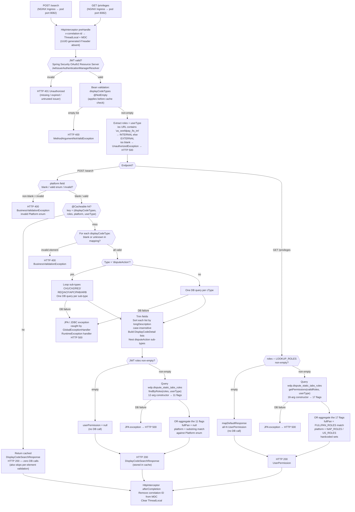

# WDP-COMP-28-DISPLAY-CODE-SERVICE
**Worldpay Dispute Platform — Component Reference**
*Version: 1.1 DRAFT | April 2026*
*Source: v1.0 DRAFT (Copilot CLI extraction) + 2026-04-28 source-verification pass via GitHub Copilot CLI against `gcp-display-code-service` (Worldpay-mdvs-gcp-display-code-service.git)*
*Architect-confirmed: PENDING*

*v1.1 reconciliation scope: artifact version corrected (1.5.6 → 1.5.8) and Spring Boot version added (3.5.9). Spring profile env var corrected (`${gcp_env}` → `${ds_env}`). Kubernetes probes confirmed present and detailed. `minReadySeconds` confirmed misplaced under Pod template spec — silently ignored at runtime (matches the COMP-25 / COMP-34 / COMP-08 pattern). HTTP status code map corrected: `HttpMessageNotReadableException` returns HTTP 500 (already correctly stated) and `UnauthorizedException` (blank `iss` claim) flows through the catch-all `RuntimeException` handler to HTTP 500 — there is no dedicated 401 path for this exception. New architectural finding recorded: the POST /search permission-aggregation path returns 11 Y/N flags while the GET /privileges path returns 17 — same nominal `UserPermission` envelope, materially different field content. Lazy JWKS resolution confirmed (first-request latency hit, not startup). Several dead-code / dead-config items confirmed in the repository.*

---

## ━━━ CORE SKELETON ━━━━━━━━━━━━━━━━━━━━━━━━━━━━━━━━━━━━━━

---

## Identity

| Field             | Value |
|-------------------|-------|
| **Name**          | `DisplayCodeService` |
| **Type**          | `REST API` |
| **Repository**    | `gcp-display-code-service` (Worldpay-mdvs-gcp-display-code-service.git) |
| **Artifact ID**   | `display-code-service` v1.5.8 *(corrected from v1.5.6)* |
| **Runtime**       | Spring Boot 3.5.9 / Java 17 |
| **Status**        | `✅ Production` |
| **Doc status**    | `📝 DRAFT v1.1 — source-verified 2026-04-28, architect confirmation pending` |
| **Sections present** | `Core | Block A (REST)` |

---

## Purpose

**What it does**

DisplayCodeService is a stateless, read-oriented microservice that acts as the
**reference-data lookup hub** for the Worldpay Dispute Platform. Given a list
of requested code domain names (e.g. reason codes, card networks, action codes,
stage codes) and an optional platform filter, it queries the `wdp.display_codes`
table in a shared PostgreSQL database and returns structured
code/short-description/long-description lists for each requested domain.

The service serves approximately 40 distinct code domain types, covering
everything from dispute stage labels and case status codes to business-rules
engine supporting codes (BR_* series). For the `disputeAction` domain, it
performs multiple sub-queries — one per action sub-type (CH1, CH2, RE2, REQ,
ACF, APC, PAB, ARB) — and assembles the results into a nested sub-object in
the response.

A **secondary function** resolves UI tab permissions for the calling user.
Both endpoints surface a `UserPermission` envelope, but the **field set
populated differs by endpoint** — see the divergence note below. The
`POST /search` path resolves an 11-flag subset; the `GET /privileges` path
resolves a 17-flag superset plus `fullPan` and a derived `platform` list.

All results on the `POST /search` path are cached in-process using Spring
`@Cacheable` over a `ConcurrentMapCacheManager`. The cache is in-memory with
no TTL and no proactive eviction; the cache key is the full argument tuple
`(displayCodeTypes, roles, platform, userType)`. Cache is populated lazily
on first request and invalidated only by pod restart. Each replica has its
own cache — no cross-replica coherence.

⚠️ **Permission-shape divergence between endpoints (new 2026-04-28):**

| Field area | POST /search (`findByRoles`) | GET /privileges (`getPermissions`) |
|------------|-------------------------------|------------------------------------|
| Core 11 flags (disputes, queues, automation, skillsMgmtEdit, ruleMgmtEdit, orgMgmtView, orgEdit, mrchOrgEdit, userMgmtView, userMgmtEdit, advAction) | ✅ aggregated | ✅ aggregated |
| 6 extended flags (faxMatch, faxReport, transDetail, authDetail, settleDetail, disputeHistory) | ❌ **NOT aggregated — fields default to N or null** | ✅ aggregated |
| `fullPan` | ❌ **always null** | ✅ derived from FULLPAN_ROLES set |
| `platform` list | derived by **substring matching** caller role names against the `Platform` enum | derived from **hardcoded NAP_ROLES / US_ROLES sets** |

UI portals that rely on the search response for tab gating receive a strictly
narrower view than they would from `/privileges`. Whether this is intentional
design or accidental drift between the two code paths is **not documented in
source**.

**What it does NOT do**

- Does **not** determine TIER1 sub-product eligibility from fraud or INR reason
  code lists. It returns raw code lists filtered only by platform. Any
  eligibility logic is the responsibility of the calling service (e.g.
  COMP-04 NAPDisputeEventService). The COMP-INDEX description implying this
  service determines eligibility is **incorrect** — confirmed by source
  analysis.
- Does **not** perform any write operations at runtime (no INSERT, UPDATE, or
  DELETE). The `JpaTransactionManager` is wired and `@EnableTransactionManagement`
  is active but no transactional write path exists in the service layer. Both
  tables are populated via database migrations or DBA scripts, not by this
  service. **No `@Transactional` annotation appears anywhere on read paths
  either** — reads are unannotated.
- Does **not** publish to or consume from any Kafka topic. Confirmed by
  absence of `spring-kafka`, `kafka-clients`, and any `@KafkaListener` /
  `KafkaTemplate` reference in the codebase.
- Does **not** handle, store, or process PAN data of any kind. The `fullPan`
  field in `UserPermission` is a **permission indicator** (does the caller
  have full-PAN view rights?), not PAN data itself.
- Does **not** delegate JWT validation entirely to the API Gateway. It
  validates JWTs itself via Spring Security OAuth2 Resource Server, reading
  the `AuthorizationList` and `iss` claims directly. This creates a second
  JWT validation layer in addition to any gateway-level auth.
- Does **not** use a connection pool. `DriverManagerDataSource` opens a new
  JDBC connection per call. See Risks section.
- Does **not** make any outbound REST call. Confirmed by codebase scan: no
  `RestTemplate`, `WebClient`, `FeignClient`, `OkHttp`, `HttpClient`, or
  `RestClient` bean exists anywhere.
- Does **not** apply locale or language mapping. `shortDescription` and
  `longDescription` are returned as stored. No grouping by category is
  applied.
- Does **not** expose any administrative CRUD endpoints. The service is
  entirely read-only at the HTTP layer.

---

## Internal Processing Flow



**Two-level code-type routing (POST /search):**
The `displayCodeMapping` is injected from the `display_code_types` environment
variable as a SpEL inline map literal (e.g. `{stage:'STAGE_CODE',
reasonCode:'REASON_CODE'}`). It is parsed once at bean initialisation and is
immutable at runtime. Malformed input causes `BeanCreationException` at
startup — the application **fails to start** rather than degrading. The
`disputeAction` key is special: its value is a comma-separated list of
sub-type cType constants, each queried individually.

**Cache-hit semantics:**
On `@Cacheable` hit, the entire service-method body is bypassed — including
per-element validation of `displayCodeTypes`. Bean Validation (`@NotEmpty`)
still applies because it runs at the framework layer before dispatch, but
the in-method "blank element" and "unknown mapping" checks are skipped.
Practically harmless for cached entries (they were validated when first
populated), but worth noting when reasoning about replay or warm-cache
scenarios.

**Lazy JWKS resolution:**
`JwtIssuerAuthenticationManagerResolver` resolves issuer endpoints lazily on
first request per issuer, not at startup. A first-request latency cost is
paid per issuer. Startup itself does not fail if an IdP is unreachable; the
failure surfaces as a 401 on the first impacted request.

---

## Boundaries

### Inbound Interfaces

| Source | Protocol | Endpoint / Trigger | Payload / Description |
|--------|----------|--------------------|-----------------------|
| COMP-04 NAPDisputeEventService | HTTPS / Bearer JWT | `POST /merchant/gcp/display-code/search` | Code domain lookup during enrichment (confirmed via cross-repo audit; **not referenced in this repo's source**) |
| WDP Merchant Portal (COMP-49) | HTTPS / Bearer JWT | `POST /merchant/gcp/display-code/search` | Display code lookup for UI rendering (inferred — not source-confirmed) |
| WDP Ops Portal (COMP-50) | HTTPS / Bearer JWT | `POST /merchant/gcp/display-code/search` | Display code lookup + UI permission resolution (inferred — not source-confirmed) |
| WDP Merchant Portal (COMP-49) | HTTPS / Bearer JWT | `GET /merchant/gcp/display-code/privileges` | UI privilege flag resolution (inferred — not source-confirmed) |
| WDP Ops Portal (COMP-50) | HTTPS / Bearer JWT | `GET /merchant/gcp/display-code/privileges` | UI privilege flag resolution (inferred — not source-confirmed) |
| Other WDP workflow services | HTTPS / Bearer JWT | `POST /merchant/gcp/display-code/search` | ⚠️ Additional callers not determinable from source alone |
| Kubernetes (kubelet) | HTTP | `GET /merchant/gcp/display-code/livez`, `/readyz` | Liveness and readiness probes (whitelisted from JWT) |
| Operators / monitoring | HTTP | `GET /actuator/health`, `/actuator/info`, `/actuator/prometheus` | Health and metrics scrape (whitelisted from JWT in non-prod; `/actuator/health` whitelisted in all environments) |

### Outbound Interfaces

| Target | Protocol | Endpoint / Resource | Purpose | On failure |
|--------|----------|---------------------|---------|------------|
| PostgreSQL (`wdp` schema) | JDBC / JPA | `wdp.display_codes` | Code/description lookup — primary function | Uncaught `RuntimeException` → HTTP 500 (no retry, no circuit breaker, no timeout) |
| PostgreSQL (`wdp` schema) | JDBC / JPA | `wdp.dispute_static_tabs_rules` | UI permission resolution (both endpoints) | Uncaught `RuntimeException` → HTTP 500 |
| External IdP | HTTPS (Spring Security internal HTTP client) | JWKS endpoint(s) — issuer URLs from `jwt_trusted_issuer_urls` | JWT signing-key retrieval; **lazy** on first request per issuer | First impacted request returns 401; subsequent requests retry resolution |
| Logstash | TCP socket via `LogstashTcpSocketAppender` v7.4 | `${logstash_server_host_port}` | Structured JSON log shipping; `keepAliveDuration: 5 minutes` | Non-fatal — log events lost silently; console appender continues |

**No outbound HTTP call to any other WDP service.** Confirmed by codebase
scan: no `RestTemplate`, `WebClient`, `FeignClient`, `OkHttp`, `HttpClient`,
or `RestClient` bean exists anywhere.

---

## Database Ownership

### Tables JPA-Mapped (read-only at runtime)

*Both tables are declared as JPA entities in this service's codebase, but
the service performs **no runtime writes** (no INSERT / UPDATE / DELETE).
Both tables are populated via database migrations or DBA scripts outside
the service runtime.*

| Schema.Table | Purpose | Key columns | Retention / Notes |
|--------------|---------|-------------|-------------------|
| `wdp.display_codes` | Maps internal code values to human-readable short and long descriptions, filtered by platform and code domain type | PK `i_display_code`; `c_type` (domain e.g. REASON_CODE, STAGE_CODE); `c_code` (e.g. CH1, 4853); `c_desc_shrt`; `c_desc_long`; `c_acq_platform` (ALL / NAP / PIN etc.); `i_display_seq` (display order — service does not use it, sorts by `c_desc_long` instead); audit cols | Populated via DB migrations. No runtime writes. Key query predicate: `c_type = :cType AND (:platform IS NULL OR c_acq_platform IN ('ALL', :platform))` |
| `wdp.dispute_static_tabs_rules` | Maps WDP role names to UI tab permission flags (Y/N per feature area) and user type (INTERNAL / EXTERNAL) | PK `id`; `role`; `user_type`; Y/N flag columns: `disputes`, `queues`, `automation`, `skills_mgmt_edit`, `rule_mgmt_edit`, `org_mgmt_view`, `org_edit`, `murch_org_edit`, `user_mgmt_view`, `user_mgmt_edit`, `adv_action`, `fax_match`, `fax_report`, `trans_detail`, `auth_detail`, `settle_detail`, `dispute_history`; audit cols | Populated via DB migrations. No runtime writes. Multiple rows per role possible; resolved by OR-aggregation across all matching rows. |

⚠️ **Two repository methods read `wdp.dispute_static_tabs_rules` with different
column projections:** `findByRoles` (used by POST /search) returns 11 flag
columns; `getPermissions` (used by GET /privileges) returns 17 flag columns.
The 6-column delta (faxMatch, faxReport, transDetail, authDetail,
settleDetail, disputeHistory) is the source of the permission-shape
divergence between endpoints.

### Tables Read (not owned by this component)

This service does not read any table it does not own.

---

## Configuration and Scaling

| Parameter | Value | Notes |
|-----------|-------|-------|
| Replica count | `{{ replicas-mdvs-gcp-display-code-service }}` | XL Deploy / Digital.ai Deploy template variable — exact integer not determinable from source |
| HPA | None | No HorizontalPodAutoscaler resource present in `resources.yaml` |
| Memory request | `1024Mi` | Confirmed |
| Memory limit | `2048Mi` | Confirmed |
| CPU request | Not set | Neither `limits.cpu` nor `requests.cpu` defined — container is CPU-unlimited (node-bounded). Burstable QoS. |
| CPU limit | Not set | See above |
| Deployment type | Kubernetes `Deployment` | |
| Rollout strategy | `RollingUpdate — maxSurge: 1, maxUnavailable: 0` | One extra pod spun up before any existing pod is taken offline |
| `minReadySeconds: 30` | ⚠️ **Misplaced inside `spec.template.spec`** instead of `spec.minReadySeconds` | **Silently ignored by Kubernetes.** New pods are considered Ready as soon as the readinessProbe succeeds — the 30-second rollout stability gate is not actually applied at runtime. Same copy-paste-class defect previously confirmed on COMP-25, COMP-34, COMP-08. |
| PodDisruptionBudget | None | No PDB resource in `resources.yaml`; voluntary disruptions can take all replicas down simultaneously |
| Topology spread | `ScheduleAnyway` (best-effort, hostname spread) | `maxSkew: 1`, `topologyKey: kubernetes.io/hostname`. Label selector uses `${BRANCH_NAME_PLACEHOLDER}` CI/CD token — matches correctly on main/production branch and on feature branches as suffix is applied consistently. Advisory only — not a hard guarantee. |
| **Liveness probe** | HTTP `GET /merchant/gcp/display-code/livez` on port 8082 | initialDelaySeconds: 20, periodSeconds: 10, timeoutSeconds: 5, failureThreshold: 3 |
| **Readiness probe** | HTTP `GET /merchant/gcp/display-code/readyz` on port 8082 | initialDelaySeconds: 15, periodSeconds: 10, timeoutSeconds: 5, failureThreshold: 3 |
| **Startup probe** | **ABSENT** | Slow-startup edge-case (e.g. JWKS unreachability) is not handled by a startup probe — handled implicitly via initialDelay on liveness/readiness. |
| Health probe path naming | Service-prefixed via Spring Boot health groups | `management.endpoint.health.group.{liveness,readiness}.additional-path: server:/livez` and `server:/readyz`. `server:` prefix means served on the application port with the servlet context path prepended → final paths `/merchant/gcp/display-code/livez` and `.../readyz`. |
| Container port | `8082` | Consistent across `application.yaml`, `resources.yaml` containerPort, both probe ports, and Service targetPort. **Dockerfile is not in the repository** — so EXPOSE consistency cannot be verified from source. |
| Spring profile activation | `${ds_env}` *(corrected from `${gcp_env}`)* | Single `application.yaml`; **no `application-{env}.yaml` profile-specific files present in repo**. All environment-specific values are env-var-driven. |
| Database connection pool | **None — `DriverManagerDataSource`** | ⚠️ No HikariCP or DBCP2. Each `getConnection()` opens a new JDBC connection. No connection timeout, no read timeout, no login timeout configured (no query parameters on the JDBC URL template visible in repo). Note: `spring-boot-starter-data-jpa` brings HikariCP transitively, but the service explicitly creates a `DriverManagerDataSource` bean which overrides any auto-configured pool. See Risks section. |
| Spring Cache | `@Cacheable("displayCodes")` over `ConcurrentMapCacheManager` | In-memory, no TTL, no eviction, lazy population. Invalidated only by pod restart. Cache key tuple = `(displayCodeTypes, roles, platform, userType)`. Per-replica — no cross-replica coherence. |
| Bean transaction posture | `@EnableTransactionManagement` + `JpaTransactionManager` wired | **No `@Transactional` annotation appears anywhere in the service layer.** Read paths execute under implicit, per-statement JPA transactions. Not a defect at this scale of read-only workload, but worth noting. |
| Observability | OpenTelemetry Java agent + Spring Actuator + Micrometer / Prometheus + Logstash | OTel: pod annotation `instrumentation.opentelemetry.io/inject-java`. Actuator: `info`, `health`, `prometheus` exposed. Prometheus: `micrometer-registry-prometheus` dependency. Logstash: `LogstashTcpSocketAppender` v7.4 → `${logstash_server_host_port}`, `keepAliveDuration: 5 minutes`; `connectionTimeout` and `reconnectionDelay` not configured (Logback defaults). ⚠️ `hibernate.show-sql = true` is active in PersistenceConfig — logs raw SQL to application log; verbose in production. |
| Correlation ID | `HttpInterceptor` reads `v-correlation-id`, generates UUID if missing, puts into MDC and ThreadLocal; cleared in `afterCompletion` | |

**Files present in the repository:** `resources.yaml`, `application.yaml`,
`logback-spring.xml`, `pom.xml`, `Jenkinsfile`, `deployit-manifest.xml`.

**Files NOT in the repository:** `Dockerfile`, Helm chart (`Chart.yaml` /
`templates/`), `values.yaml`, PodDisruptionBudget manifest, HPA manifest,
ConfigMap manifest, ServiceMonitor manifest, profile-specific
`application-*.yaml` files, `logback.xml`, `build.gradle`. Container image
build is therefore likely orchestrated externally (Jenkins + XL Deploy) —
verification owed by the platform team.

---

## Key Architectural Decisions

| Decision | ADR reference | Notes |
|----------|---------------|-------|
| Read-only service, stateless at runtime | Local decision | No writes at runtime. Both JPA-mapped tables populated by migrations only. Simplifies deployment and replica scaling — no write-ordering concerns. |
| Spring `@Cacheable` for code lookup — no external cache | Local decision | In-memory `ConcurrentMapCacheManager`. Zero latency on cache hit. Trade-off: stale codes persist until pod restart; no cross-replica cache sharing. |
| Self-validates JWT via Spring Security OAuth2 | Local decision | Service reads JWT `AuthorizationList` and `iss` claims directly. This creates a second JWT validation layer beyond any API Gateway pass-through. Callers must present a valid JWT regardless of upstream auth. |
| Lazy JWKS resolution per issuer | Spring Security default | First-request latency cost per issuer. Startup never fails on JWKS unreachability — failure surfaces as 401 on the impacted request. Acceptable for low-volume IdPs but flagged as a cold-start latency anomaly. |
| Two divergent permission resolution paths | ⚠️ Not documented in source | Same `UserPermission` envelope on both endpoints, but `findByRoles` (search) returns 11 flags / null `fullPan` / substring-matched platform list, while `getPermissions` (privileges) returns 17 flags / FULLPAN_ROLES-derived `fullPan` / hardcoded NAP_ROLES + US_ROLES platform list. Whether this is intentional design (search consumers don't need the extra flags) or accidental drift is unknown. Recommend formal architect decision when WDP-DECISIONS.md is rebuilt. |
| No Kafka involvement | Local decision | Complies by absence. DEC-001, DEC-003, DEC-005 not applicable. |
| No PAN data handled | Local decision — complies with DEC-004 / DEC-019 | `fullPan` in `UserPermission` is a permission flag, not PAN data. Full compliance confirmed by full-codebase scan for `pan` / `cardNumber` / `accountNumber` / `acctNum` fields on entity classes. |
| No Resilience4j circuit breakers | DEC-014 — DEVIATION (platform-wide VOID) | No `io.github.resilience4j` dependency in `pom.xml`. No `@CircuitBreaker`, `@Retry`, `@RateLimiter`, or `@Bulkhead` anywhere. Sole DB dependency has no circuit breaker, retry, or timeout. Consistent with the platform-wide DEC-014 void posture. |
| `DriverManagerDataSource` (no connection pool) | Local decision — ⚠️ RISK | Identified as a significant production throughput concern. New connection opened per `getConnection()` call; no socket-level timeouts. See Risks section. |
| TIER1 sub-product eligibility NOT performed here | Local decision | Raw code lists returned to caller. Eligibility determination is the caller's responsibility (e.g. COMP-04 NAPDisputeEventService). ⚠️ WDP-COMP-INDEX.md description implies this service performs eligibility — that description is incorrect and should be updated. |

---

## Risks and Constraints

| Severity | Risk | Consequence |
|----------|------|-------------|
| 🔴 HIGH | **No database connection pool** — `DriverManagerDataSource` opens a new JDBC connection per request with no pooling, no socket timeout, no login timeout, and no retry. | Connection exhaustion at moderate request rates. No graceful degradation — all in-flight requests return HTTP 500. Full service outage for all callers including UI rendering and inbound enrichment paths. |
| 🔴 HIGH | **No circuit breaker, retry, or timeout on PostgreSQL dependency** (DEC-014 deviation). | Thread pool starvation if the database is slow. Service becomes unresponsive until database recovers or pods are restarted. Cascading failure upstream to all callers. |
| 🟠 MEDIUM-HIGH | **Permission-shape divergence between POST /search and GET /privileges** (new 2026-04-28). The same nominal `UserPermission` envelope returns 11 Y/N flags on `/search` (faxMatch, faxReport, transDetail, authDetail, settleDetail, disputeHistory all default / null) but 17 flags on `/privileges`. UI portals that rely on the search response for tab gating receive a strictly narrower view than they would from `/privileges`. | UI tabs that are gated on the 6 extended flags (e.g. fax, settlement, auth detail, dispute history) appear unauthorised when the page is rendered from search response data, even when the user's roles authorise them. Architect decision required: is this intentional minimisation or accidental drift? |
| 🟡 MEDIUM | **Spring Cache has no TTL and evicts only on pod restart** — code/description data updated in the database does not propagate to in-process caches until the pod restarts. Cache is not shared across replicas. | Different replicas may serve different code values after a database update. Operators must restart all pods to propagate reference data changes. |
| 🟡 MEDIUM | **Self-JWT-validation in addition to API Gateway** — service validates JWTs locally via Spring Security OAuth2. JWKS resolution is **lazy** — first request per issuer pays the resolution latency cost. | First-request latency anomaly per cold-cache issuer. If an IdP is unreachable at first-request time, that user's request fails with 401 even though the application is up. |
| 🟡 MEDIUM | **`UnauthorizedException` (blank `iss` claim) flows to HTTP 500, not 401.** No dedicated `@ExceptionHandler(UnauthorizedException.class)` exists; the exception falls through the catch-all `RuntimeException` handler. | Security event is logged as a generic 500 rather than a 401, defeating monitoring rules that key on auth-related response codes. Caller perceives a service error rather than an auth error. |
| 🟡 MEDIUM | **Known callers not source-confirmed beyond COMP-04** — the full set of WDP components that call this service is not determinable from this service's source. No caller is referenced in this repo. | Undetected contract breaks on schema changes. Callers receive unexpected null fields or HTTP 400s after deployment. |
| 🟡 MEDIUM | **`userId` field in `DisplayCodeSearchRequest` model is declared but never read** — present in the request model and Swagger spec but ignored by all service logic. | Misleading API contract. Callers may populate it expecting some effect. Dead field creates maintenance confusion. |
| 🟡 MEDIUM | **`minReadySeconds: 30` misplaced under `spec.template.spec`** — silently ignored by Kubernetes. The 30-second rollout stability gate is not actually applied. | New pods are considered Ready as soon as the readiness probe succeeds, with no additional stabilisation window. Same copy-paste-class defect previously confirmed on COMP-25, COMP-34, COMP-08 — pattern audit owed across all WDP manifests. |
| 🟢 LOW | **`hibernate.show-sql = true` active in `PersistenceConfig`** — logs raw SQL to application log in all environments including production. | Verbose production logs. Potential for sensitive query structure or parameter values to appear in log aggregation systems (Logstash/Kibana). |
| 🟢 LOW | **`ValidationMessages.properties` contains messages from another service** (rules-service references — `stage`, `owner`, `network`, `actionCode`, `workflowType`, `eventType`, `caseSource`, etc.) | No runtime impact — these messages are not referenced by any validator in this service. Code-quality / hygiene issue from copy-paste during scaffolding. |
| 🟢 LOW | **`EnumName` / `EnumNameValidator` declared but unused** — custom validation framework wired in but applied to no field. | Dead code. Maintenance overhead. |
| 🟢 LOW | **Duplicate exception-handler helper methods in `GlobalExceptionHandler`** (`createDuplicateResponseEntity`, `createErrorResponseEntity` patterns). | Dead code paths. Maintenance overhead. |
| 🟢 LOW | **`spring-boot-devtools` dependency present in `pom.xml`** with `<optional>true</optional>`. Auto-disabled when running from a packaged jar but present in the artifact. | No runtime impact in production (jar packaging disables it). Hygiene issue. |
| 🟢 LOW | **Commented-out hardcoded Logstash IP addresses** in `logback-spring.xml`. | No runtime impact. Latent confusion in configuration review. |
| 🟢 LOW | **Bare `// TODO` comment in `GlobalExceptionHandler`** on the `HttpRequestMethodNotSupportedException` handler — no description of what remains to be done. | No functional impact. Technical debt marker. |

---

## Planned Changes

- ⚠️ **OPEN QUESTION — Architect decision required:** The `DriverManagerDataSource`
  (no connection pool) is a confirmed production throughput risk. Has this been
  identified, and is a HikariCP migration planned? **No migration evidence
  found in the repo** — no TODO, no deprecation comment, no branch reference,
  no JIRA reference. Confirm with team.

- ⚠️ **OPEN QUESTION — Architect decision required:** The 11 vs 17 flag
  divergence between POST /search and GET /privileges is undocumented.
  Confirm whether this is intentional minimisation (search consumers don't
  need extended flags) or accidental drift. If accidental, raise as a defect
  and align both paths.

- ⚠️ **OPEN QUESTION — Confirm full caller inventory:** Known callers beyond
  COMP-04 NAPDisputeEventService are not source-determinable. UI portals
  (COMP-49, COMP-50) are strongly inferred but not source-confirmed. No
  caller is referenced in this repo. Full caller list needed before any
  contract changes.

- ⚠️ **OPEN QUESTION — Correct WDP-COMP-INDEX.md description:** Current entry
  states this service "determines TIER1 sub-product eligibility from fraud
  and INR reason code lists." Source analysis confirms this is incorrect —
  the service returns raw code lists; eligibility determination is performed
  by the caller. COMP-INDEX should be updated.

- ⚠️ **OPEN QUESTION — Database instance confirmation:** The JDBC URL is
  injected via `${wdp_datasource_jdbc_url}` and the actual host pattern is
  not in the repository. Confirm whether this service connects to the
  standard WDP shared Aurora PostgreSQL (`globaldisputedatabase`) or a
  separate GCP-hosted instance. The `gcp-` artifact prefix is ambiguous.
  Same secret bundle (`gcp-display-code-service-secrets` /
  `wdp-common-secrets`) is referenced in `resources.yaml`.

- ⚠️ **OPEN QUESTION — `UnauthorizedException` → 500 path:** Defect (add a
  dedicated `@ExceptionHandler(UnauthorizedException.class)` returning 401)
  or accepted limitation? Affects security observability.

- ⚠️ **OPEN QUESTION — `minReadySeconds` misplacement:** Same pattern across
  COMP-25, COMP-34, COMP-08, COMP-28. Recommend platform-wide manifest sweep
  to fix at consistent revision.

- No feature flags, migration flags, or sprint-scoped planned changes
  confirmed as of April 2026.

---

---

## ━━━ TYPE BLOCK A — REST API CONTRACTS ━━━━━━━━━━━━━━━━━━━

---

## REST API Contracts

**Authentication model:**
JWT Bearer token validation is performed **by this service itself** via Spring
Security OAuth2 Resource Server — it is not delegated to an upstream API
Gateway. The service configures `JwtIssuerAuthenticationManagerResolver` with
trusted issuer URLs injected from the `jwt_trusted_issuer_urls` runtime secret.
The JWT is not merely passed through — the service reads `AuthorizationList`
and `iss` claims directly. JWKS endpoints are resolved **lazily** on first
request per issuer, not at startup.

**SecurityFilterChain whitelist (paths that bypass JWT validation):**

| Environment | Whitelisted paths |
|-------------|-------------------|
| Non-prod (`env != "prod"`) | `/actuator/health`, `/displaycodeservice-api-docs`, `/displaycodeservice-api-docs/swagger-config`, `/swagger-ui/**`, `/livez`, `/readyz` |
| Prod (`env == "prod"`) | `/actuator/health`, `/livez`, `/readyz` |

**Base URL pattern:**
`https://<host>/merchant/gcp/display-code`

**Context path:** `/merchant/gcp/display-code`
**Service port:** 8082

---

### Endpoint: `POST /search`

**Purpose:** Retrieve display code lists for one or more code domains, and
resolve the calling user's UI permission flags (11-flag subset) — all in a
single response.

**Caller(s):** COMP-04 NAPDisputeEventService (confirmed via cross-repo
audit; not referenced in this repo); UI portals COMP-49 and COMP-50
(strongly inferred — not source-confirmed); other WDP workflow services
(potential — not source-confirmed).

**Auth required:** Bearer JWT (enforced by Spring Security OAuth2)

**Cached:** Yes — `@Cacheable("displayCodes")` over `ConcurrentMapCacheManager`,
key = `(displayCodeTypes, roles, platform, userType)`, no TTL, invalidated
only by pod restart.

**Request**

| Source | Field | Type | Required | Description |
|--------|-------|------|----------|-------------|
| Request body | `displayCodeTypes` | `List<String>` | Yes (`@NotEmpty`) | One or more logical code domain names (e.g. `"reasonCode"`, `"stage"`, `"disputeAction"`) — must be non-empty and each entry must be a known domain from the `displayCodeMapping` config |
| Request body | `platform` | `String` | No | Platform filter — valid values: `NAP`, `PIN`, `VAP`, `LATAM`, `CORE` (case-insensitive); blank or absent treated as null (matches ALL platforms) |
| Request body | `userId` | `String` | No | Present in request model and Swagger spec — **⚠️ never read by any service logic** |
| Header | `v-correlation-id` | `String` | No | Correlation ID propagated to MDC; auto-generated as UUID if absent |
| Header | `Authorization` | `String` | Yes | Bearer JWT token |

**Supported `displayCodeTypes` values (logical name → DB cType):**

The full mapping is controlled by the `display_code_types` environment variable, parsed as a SpEL inline map literal at bean initialisation. Logical-name → cType pairs include (non-exhaustive):

| Logical name | DB cType |
|--------------|----------|
| `stage` | `STAGE_CODE` |
| `reasonCode` | `REASON_CODE` |
| `disputeAction` | comma-separated list of sub-types — see below |
| `network` | `NETWORK` |
| `caseStatus` | `CASE_STATUS` |
| `currency` | `CURRENCY_CODE` |
| `actionCode` | `ACTION_CODE` |
| `workflowName` | `WORKFLOW_NAME` |
| `functionCode` | `FUNCTION_CODE` |
| `adjustmentReason` | `ADJ_RSN` |
| `assignmentReason` | `ASSIGNMENT_REASON` |
| `bsaCode` | `BSA_CODE` |
| `gcmsProduct` | `GCMS_PRODUCT` |
| `region` | `REGION` |
| `cardOutputCapability` | `BR_CARD_OUTPUT_CAP` |
| `userRoleAccess` | `USER_ACCESS_TAB` |
| `adjAccountType` | `ADJ_ACCT_TYPE` |
| `adjTransType` | `ADJ_TRANS_TYPE` |
| `adjDenialRsn` | `ADJ_DENIAL_RSN` |
| `adjustmentType` | `ADJ_TYPE` |
| `adjustmentStatus` | `ADJ_STATUS` |
| `adjDeleteRsn` | `ADJ_DELETE_RSN` |
| `faxQueue` | `FAX_QUEUE` |

The `disputeAction` value resolves to a comma-separated list of sub-type
cType constants (CH1, CH2, RE2, REQ, ACF, APC, PAB, ARB), each queried
individually and assembled into a nested sub-object in the response.

**Response — Success**

| HTTP Status | Condition | Body |
|-------------|-----------|------|
| 200 | Successful processing (cache hit or DB query) | `DisplayCodeSearchResponse` — top-level JSON object where each requested code domain is a named field containing `List<DisplayCodeDetail>` (or `null` if not requested); plus a `userPermission` object (or `null` if caller has no WDP roles). |

`DisplayCodeDetail` shape per code item:
```
{ "code": "CH1", "description": "FIRST Chargeback", "longDescription": "FIRST Chargeback" }
```

`disputeAction` returned as nested sub-object:
```
"disputeAction": { "CH1": [...], "CH2": [...], "RE2": [...], ... }
```

`userPermission` shape (when JWT roles non-empty) — **11-flag subset** on this path:
```
{
  "disputes": "Y|N",  "queues": "Y|N",  "automation": "Y|N",
  "skillsMgmtEdit": "Y|N",  "ruleMgmtEdit": "Y|N",
  "orgMgmtView": "Y|N",  "orgEdit": "Y|N",  "mrchOrgEdit": "Y|N",
  "userMgmtView": "Y|N",  "userMgmtEdit": "Y|N",  "advAction": "Y|N",
  "faxMatch": null,         ← NOT aggregated on this path
  "faxReport": null,        ← NOT aggregated
  "transDetail": null,      ← NOT aggregated
  "authDetail": null,       ← NOT aggregated
  "settleDetail": null,     ← NOT aggregated
  "disputeHistory": null,   ← NOT aggregated
  "fullPan": null,          ← always null on this path
  "platform": ["NAP", ...]  ← derived from role-name substring matching
}
```

**Response — Error**

| HTTP Status | Condition |
|-------------|-----------|
| 400 | `displayCodeTypes` is empty (`@NotEmpty` violation, `MethodArgumentNotValidException`) |
| 400 | Any element of `displayCodeTypes` is blank (`BusinessValidationException`) |
| 400 | Any element of `displayCodeTypes` is not in the `displayCodeMapping` config (`BusinessValidationException`) |
| 400 | `platform` is non-blank but not a valid `Platform` enum value (`BusinessValidationException`) |
| 400 | `ConstraintViolationException` |
| 400 | `MethodArgumentTypeMismatchException` |
| 400 | JWT is null or has null claims (`BadRequestException` "Token is blank") |
| 401 | JWT missing, expired, or signed by untrusted issuer (Spring Security OAuth2 framework, before controller dispatch) |
| 404 | No handler found for requested path (`NoHandlerFoundException`) |
| 405 | Wrong HTTP method for existing path |
| 500 | Malformed / unreadable request body (`HttpMessageNotReadableException`) |
| 500 | Database unreachable or query failure (uncaught JPA / JDBC exception → catch-all `RuntimeException` handler) |
| 500 | JWT `iss` claim blank (`UnauthorizedException` — falls through to catch-all `RuntimeException` handler, no dedicated 401 path) |
| 500 | Any other unhandled `RuntimeException` |

**Notes:**
- Cache hit path returns HTTP 200 with zero DB calls and skips per-element
  in-method validation.
- Cache key includes the full argument tuple — different callers with
  different role sets get separate cache entries.
- If JWT roles are empty, `userPermission` is `null` in the response — no
  error is raised.
- If a DB query returns zero rows, the corresponding response field is set
  to an empty list — HTTP 200 is still returned. No 404 is raised for
  missing codes.
- `fullPan` is always `null` on the `POST /search` path — use `GET /privileges`
  to obtain a populated `fullPan` value.
- The 6 extended flags (faxMatch, faxReport, transDetail, authDetail,
  settleDetail, disputeHistory) are NOT populated on this path — clients
  needing them must call `GET /privileges`.

**Error response body structure (all non-2xx responses):**
```
{
  "errors": [
    {
      "message": "Human-readable error message",
      "target": "Field name or error category"
    }
  ]
}
```

---

### Endpoint: `GET /privileges`

**Purpose:** Resolve UI privilege flags for the calling user — full 17-flag
set plus full-PAN access eligibility and acquiring platform membership —
based on JWT roles. Does not return any display code lists.

**Caller(s):** WDP Merchant Portal (COMP-49) and WDP Ops Portal (COMP-50) —
inferred from data served. Not source-confirmed.

**Auth required:** Bearer JWT (enforced by Spring Security OAuth2)

**Cached:** **No** — each call queries the database (when LOOKUP_ROLES
intersection is non-empty).

**Request**

| Source | Field | Type | Required | Description |
|--------|-------|------|----------|-------------|
| Header | `v-correlation-id` | `String` | No | Correlation ID |
| Header | `Authorization` | `String` | Yes | Bearer JWT token |

No request body. No query parameters.

**Response — Success**

| HTTP Status | Condition | Body |
|-------------|-----------|------|
| 200 | Successful processing | `UserPermission` object |

`UserPermission` shape (GET /privileges path) — **17-flag superset**:
```
{
  "disputes": "Y|N",  "queues": "Y|N",  "automation": "Y|N",
  "skillsMgmtEdit": "Y|N",  "ruleMgmtEdit": "Y|N",
  "orgMgmtView": "Y|N",  "orgEdit": "Y|N",  "mrchOrgEdit": "Y|N",
  "userMgmtView": "Y|N",  "userMgmtEdit": "Y|N",  "advAction": "Y|N",
  "faxMatch": "Y|N",        ← populated on this path
  "faxReport": "Y|N",       ← populated
  "transDetail": "Y|N",     ← populated
  "authDetail": "Y|N",      ← populated
  "settleDetail": "Y|N",    ← populated
  "disputeHistory": "Y|N",  ← populated
  "fullPan": "Y|N",         ← populated from FULLPAN_ROLES set
  "platform": ["NAP", "PIN", "CORE", ...]  ← derived from hardcoded NAP_ROLES / US_ROLES sets
}
```

If JWT roles ∩ `LOOKUP_ROLES` is empty, `mapDefaultResponse` returns all-N
flags and null lists — HTTP 200 still returned, no DB call made.

**Response — Error**

Same HTTP status code map as `POST /search` — 400 for null JWT / null
claims, 401 for invalid JWT, 500 for DB failure or blank `iss` claim, etc.

**Notes:**
- This endpoint is **not** `@Cacheable`. Each call with non-empty
  LOOKUP_ROLES intersection queries the database.
- `fullPan` is populated here via the `FULLPAN_ROLES` set (containing
  `merchantSpecialFunctions.MRviewFullCardNumber`).
- Platform list is derived from the hardcoded `NAP_ROLES` and `US_ROLES`
  sets — not from database data. This differs from `POST /search` which
  uses role-name substring matching against `Platform` enum values.
- The two platform-derivation strategies (search path vs privileges path)
  produce different platform lists for the same caller. **No in-source
  comment explains the divergence** — confirm whether intentional design
  or accidental drift.

---

*End of component file.*
*File status: 📝 DRAFT v1.1 — source-verified 2026-04-28, architect confirmation pending.*
*Remember to update WDP-COMP-INDEX.md and WDP-DB.md after architect confirmation. WDP-KAFKA.md unaffected (component remains Kafka-free).*
