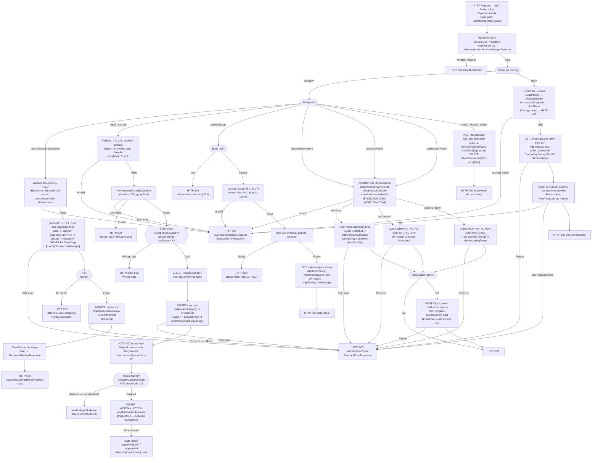

# WDP-COMP-29-FAX-QUEUE-SERVICE
**Worldpay Dispute Platform — Component Reference**
*Version: 1.0 DRAFT | April 2026*
*Extracted from: wdp-faxqueue-service (wp-mfd/wdp-faxqueue-service) using GitHub Copilot CLI | Architect-confirmed: PENDING*

---

## ━━━ CORE SKELETON ━━━━━━━━━━━━━━━━━━━━━━━━━━━━━━━━━━━━━━
*Mandatory for every component regardless of type.*

---

## Identity

| Field             | Value                                                              |
|-------------------|--------------------------------------------------------------------|
| **Name**          | `FaxQueueService`                                                  |
| **Type**          | `REST API`                                                         |
| **Repository**    | `wdp-faxqueue-service` (GitHub: wp-mfd/wdp-faxqueue-service)      |
| **Runtime path**  | `/merchant/gcp/fax-queue` (port 8082)                              |
| **Framework**     | Java 17, Spring Boot 3.5.11                                        |
| **Status**        | ✅ Production                                                       |
| **Doc status**    | 📝 DRAFT                                                           |
| **Sections present** | `Core \| Block A — REST`                                        |

---

## Purpose

**What it does**

FaxQueueService manages the full lifecycle of inbound fax documents that merchants send to Worldpay. It is the backend service behind the Fax Queue section of the WDP Ops Portal. Operations teams use it to claim the next unprocessed fax, view its image, and take one of three actions: reject it to the reject queue, discard it permanently, or update its status directly.

The service exposes two distinct controller groups within a single deployable. The primary group, `FaxQueueController`, handles all fax queue operations against a legacy MS SQL Server database (`dbo.IncomingFaxes`) shared with legacy fax processing systems outside WDP. It also writes audit records of all fax actions to the WDP PostgreSQL database (`WDP.FAX_ACTION`). A secondary group, `EviewerLicenseController`, acts as a pure proxy to an external eViewer License Management Service, enabling activation, renewal, and deactivation of eViewer document-viewer licenses — a capability bundled into this service for operational convenience.

The service also provides three reporting endpoints: a fax queue inventory report (counts and stats), an audit report (matched/rejected/discarded page counts), and a detailed report that serialises full action records to CSV and emails them to a requestor.

**What it does NOT do**

- Does NOT route cases or assign faxes to queues autonomously — routing is fully caller-driven; the Ops Portal passes `faxQueue` as a literal filter on every request.
- Does NOT delegate to `UserQueueSkillService` (COMP-30) — confirmed absent from source and pom.xml.
- Does NOT call any other WDP internal service — no calls to CaseManagementService, CaseActionService, DisputeService, or any other WDP component. The only outbound HTTP calls are to the eViewer License Management Service and the external email notification service.
- Does NOT publish to or consume from any Kafka topic — no Kafka dependency in pom.xml and no Kafka-related code anywhere in the service.
- Does NOT use the transactional outbox pattern — audit writes to `WDP.FAX_ACTION` are in a separate transaction from the primary `CoreSQL` writes and occur in a `finally` block.
- Does NOT implement idempotency — duplicate reject submissions produce additional rows with incremented `groupId` values.
- Does NOT encrypt data — it masks account numbers before writing to `WDP.FAX_ACTION` (first 6 digits + asterisks + last 4), but there is no encryption layer. Whether the upstream `dbo.IncomingFaxes.Account` field contains raw PANs or pre-masked values cannot be determined from this service alone.
- The match, search, and two delete endpoints are **stub implementations** that return empty responses with no processing logic.

---

## Internal Processing Flow



**State lifecycle — `dbo.IncomingFaxes.Status`**

| Status value | Meaning | Set by |
|---|---|---|
| `' '` (space/empty) | Unprocessed — available for next-available-fax query | Initial state when fax arrives in legacy system |
| `'I'` | In-Progress — locked by an Ops Portal user | `getNextAvailableFax()` via `updateFaxEntity()` |
| `'C'` | Completed — matched to a WDP case | `updateFaxStatus()` with status='C' |
| `'E'` | Error state | `updateFaxStatus()` with status='E' |

> ⚠️ **Reject and Discard are not status transitions.** They insert a **new row** into `dbo.IncomingFaxes` with `faxQueue='X'` (reject) or `faxQueue='D'` (discard). The original row with `faxQueue='I'` remains locked. The `queueAction` field in `WDP.FAX_ACTION` records the action: `M`=match, `X`=reject, `D`=discard.

---

## Boundaries

### Inbound Interfaces

| Source | Protocol | Endpoint / Trigger | Payload / Description |
|--------|----------|--------------------|-----------------------|
| WDP Ops Portal (COMP-50) | REST — Bearer JWT | POST/GET/PUT/DELETE /merchant/gcp/fax-queue/faxes/** | Fax queue lifecycle operations |
| WDP Ops Portal (COMP-50) | REST — Bearer JWT | POST /merchant/gcp/fax-queue/lm/activate\|extend\|deactivate | eViewer license management |

### Outbound Interfaces

| Target | Protocol | Endpoint / Resource | Purpose | On failure |
|--------|----------|---------------------|---------|------------|
| CoreSQL MS SQL Server | JDBC (SQL Server) | `dbo.IncomingFaxes` | Primary fax queue store — read, lock, insert | Exception → HTTP 500 (lock rolls back via @Transactional) |
| WDP Aurora PostgreSQL | JDBC (PostgreSQL) | `WDP.FAX_ACTION` | Audit trail of fax actions | Write failure: logged only, NOT propagated — silent audit loss |
| WDP Aurora PostgreSQL | JDBC (PostgreSQL) | `WDP.FAX_ACTION`, `WDP.CASE` | Report query data | Read failure: HTTP 500 |
| Email Notification Service | HTTP POST via RestTemplate | `${email.notify.url}` | Send fax detailed report as CSV attachment | HTTP 500 — no retry, no timeout |
| eViewer License Management Service | HTTP POST via RestTemplate | `${eviewer.license.url}/activate\|extend\|deactivate` | eViewer license proxy | 4xx → HTTP 400; 5xx/network → HTTP 500 — no retry |
| IDP Token Endpoint | HTTPS POST (OAuth2) | `${idp_token_url}` | Obtain Bearer token for eViewer calls | Exception → HTTP 500 — no retry |

---

## Database Ownership

### Tables Owned (written by this component)

| Schema.Table | Database | Purpose | Key columns | Transaction manager | Notes |
|---|---|---|---|---|---|
| `dbo.IncomingFaxes` | CoreSQL MS SQL Server (⚠️ legacy — not WDP-owned) | Primary fax queue store — stores fax image, metadata, and lifecycle status | DocNum (PK part), DID (PK part), GroupID (PK part), Status, FaxQueue, TimeStmp, MaintenanceDate, Image (BLOB), Pages, UserID, RemotePhone, Account, Amount | `coreSqlTransactionManager` | ⚠️ SHARED with legacy fax processing systems outside WDP — WDP does NOT own this table |
| `WDP.FAX_ACTION` | WDP Aurora PostgreSQL | Audit trail of all fax actions (match/reject/discard) | I_FAX_ACTION_ID (PK), I_DOC_ID, I_GROUP_ID, D_ACTION, C_ACTION, C_FAX_QUE, I_ACCT_CDN_SRCH (masked account), I_NBR_PAGES, X_INSRT (userId), Z_INSRT, Z_RCVD | `wdpTransactionManager` — separate from CoreSQL writes | Writes in `finally` block after CoreSQL transaction — NOT in same transaction |

### Tables Read (not owned by this component)

| Schema.Table | Owned by | Why accessed |
|---|---|---|
| `dbo.IncomingFaxes` | Legacy CoreSQL system (external to WDP) | Read for next-available fax queries, record lookup before reject/discard, detailed report enrichment |
| `WDP.FAX_ACTION` | FaxQueueService (shared) | Aggregated for audit report and detailed report queries |
| `WDP.CASE` | CaseManagementService (COMP-23) — ⚠️ writer TBC | LEFT OUTER JOIN in faxDetailedReport to enrich with merchantId (C_LEVEL1_ENTITY) and chainCode (C_LEVEL4_ENTITY) |

---

## Configuration and Scaling

| Parameter | Value | Notes |
|---|---|---|
| Replica count | `{{ replicas-wdp-fax-queue-service }}` | XL Deploy / Helm placeholder — actual value requires deployment config |
| HPA | None | No HorizontalPodAutoscaler in resources.yaml |
| Memory request | 2048Mi | |
| Memory limit | 4096Mi | |
| CPU request | Not set | No cpu resource in resources.yaml |
| CPU limit | Not set | No cpu resource in resources.yaml |
| Deployment type | Kubernetes Deployment | `kind: Deployment` |
| Rollout strategy | RollingUpdate — maxSurge: 1, maxUnavailable: 0, minReadySeconds: 30 | |
| PodDisruptionBudget | None | Not present in resources.yaml |
| Topology spread | ScheduleAnyway, `topologyKey: kubernetes.io/hostname` | ⚠️ Label mismatch risk: `matchLabels.app` includes `${BRANCH_NAME_PLACEHOLDER}` — if non-empty at deploy time, spread constraint may not match pod labels |
| Database connection pool | JPA/Hibernate defaults | Two datasources: `coreSqlTransactionManager` (SQL Server) and `wdpTransactionManager` (PostgreSQL) — pool sizes not explicitly configured |
| HTTP timeouts | Not configured | `RestTemplate` created with no timeout — infinite wait risk on all outbound HTTP calls |
| Observability | OpenTelemetry Java agent (present), Actuator (`/health`, `info`, `prometheus`), Logstash TCP appender | Liveness/readiness probes: `/merchant/gcp/fax-queue/livez` and `/readyz` on port 8082 |
| Swagger UI | `/faxqueueservice-documentation` | Non-production only |

---

## Key Architectural Decisions

| Decision | ADR reference | Notes |
|---|---|---|
| No transactional outbox — audit write in finally block | DEC-001 — DEVIATION | Audit write to `WDP.FAX_ACTION` is in a separate PostgreSQL transaction, executed after the CoreSQL transaction completes. If the PostgreSQL write fails, the audit record is silently lost with no retry. |
| No Kafka involvement | Local decision | This component has no Kafka dependency whatsoever — confirmed from pom.xml and source. |
| No Resilience4j | DEC-014 — DEVIATION | No circuit breaker, retry, or rate limiter on any outbound dependency. All failures propagate directly. |
| Caller-driven queue routing | Local decision | The service validates `faxQueue` values but does not determine routing autonomously. Ops Portal passes queue identifier on every request as a literal database filter. |
| Account masking only — no encryption | DEC-004 — partial | Account numbers are masked before writing to `WDP.FAX_ACTION` (first 6 + asterisks + last 4). No EncryptionService call. Whether `dbo.IncomingFaxes.Account` holds raw PANs or pre-masked values is not determinable from this service. |
| No idempotency on reject/discard | Local decision | Each reject/discard call inserts a new row with an incremented `groupId`. Duplicate submissions produce additional rows — no deduplication. |
| eViewer controller bundled in same service | Local decision | `EviewerLicenseController` is a different bounded context (license management) bundled into a fax queue service. No functional dependency exists between the two controllers. |
| HTTP timeouts not configured | Local deviation | `FaxQueueConstants` defines `HTTP_CONNECT_TIMEOUT = 30000` and `HTTP_READ_TIMEOUT = 30000` but these constants are never applied to any `RestTemplate` configuration. `RestInvokerConfig` creates a plain `RestTemplate()` with no timeout set. |
| spring-boot-devtools in production build | Build risk | Included without `<scope>provided</scope>` or `<optional>true</optional>` — will be included in the jar unless Spring's devtools auto-exclusion applies. |
| OPS_SCAN_ENTRYMODE = "2" defined but not active | Local decision | Fast Scan entry mode is commented out — "Confirmed by Paul, we are not considering Fast Scan". The constant and enum are defined but the code branch is not active. |

---

## Risks and Constraints

| Severity | Risk | Consequence |
|---|---|---|
| 🔴 HIGH | Audit write to `WDP.FAX_ACTION` is in a `finally` block after the CoreSQL transaction, using a separate transaction manager. If CoreSQL commits but PostgreSQL fails, the audit record is silently lost. No retry, no alerting. | Fax actions (reject/discard) proceed with no audit trail. Compliance and operational reporting gaps. Silent failure — no error propagated to caller. |
| 🔴 HIGH | `dbo.IncomingFaxes` is a **legacy MS SQL Server table owned by the CoreSQL system**, shared with legacy fax processing systems outside WDP. WDP writes to a table it does not own. | Legacy system changes or contention can silently corrupt WDP fax state. WDP has no SLA or schema ownership guarantee over this table. |
| 🟡 MEDIUM | No HTTP timeout configured on any `RestTemplate`. Calls to the eViewer License Service and the email notification service have infinite wait. | A hung external service can hold Ops Portal threads indefinitely, exhausting the connection pool. |
| 🟡 MEDIUM | `dbo.IncomingFaxes.Account` field may contain raw PANs from the upstream fax receiver system. FaxQueueService reads and copies this field in reject/discard flows without inspecting or encrypting it. Masking is applied only before writing to `WDP.FAX_ACTION`. | Potential PCI exposure if the Account field in `dbo.IncomingFaxes` carries unmasked PANs. Cannot be determined without inspecting the upstream fax receiver system. Requires external team investigation. |
| 🟡 MEDIUM | No idempotency on reject/discard. Duplicate submissions create additional rows in `dbo.IncomingFaxes` with incremented `groupId`. | Duplicate fax action rows in the database. Potential for incorrect audit and report counts. No detection or deduplication in place. |
| 🟡 MEDIUM | Topology spread `matchLabels` uses `${BRANCH_NAME_PLACEHOLDER}`. If non-empty at deploy time, spread constraint does not match pod labels, rendering the constraint non-functional. | Pods may not distribute across nodes. A single node failure could take down all replicas simultaneously. |
| 🟡 MEDIUM | `spring-boot-devtools` is in the production build without `<scope>provided</scope>`. | DevTools in production can trigger unexpected classpath restarts and exposes development-only endpoints. Security and stability risk. |
| 🟢 LOW | `FaxQueueConstants.HTTP_CONNECT_TIMEOUT` (30000ms) and `HTTP_READ_TIMEOUT` (30000ms) are defined but never applied to any `RestTemplate` configuration. The intent was to set timeouts; the actual config does not enforce them. | No immediate impact (current behaviour is unconstrained, not misconfigured), but if a team member reads the constants they will incorrectly believe timeouts are set. |
| 🟢 LOW | Four endpoints are stub implementations returning empty responses: `POST /faxes/match`, `GET /faxes/search`, `DELETE /faxes/document/{doc-num}/{did}/{group-id}`, `DELETE /faxes/document/{doc-num}/{did}`. | Any caller that invokes these endpoints receives HTTP 200 with empty body — silent no-op. If the Ops Portal relies on these being functional, it will silently fail. |
| 🟢 LOW | `eViewer License Management` concern is bundled in the same deployable as `FaxQueueController`. These are different bounded contexts with no functional dependency. | Deployment of a fax queue fix forces redeployment of the eViewer proxy, and vice versa. Not a runtime risk but an operational and boundary concern. |

---

## Planned Changes

- POST /faxes/match — stub implementation. Functional implementation not yet built.
- GET /faxes/search — stub implementation. Functional implementation not yet built.
- DELETE endpoints (two) — stub implementations. Functional implementation not yet built.
- Fast Scan entry mode (`entryMode="2"`) — code branch exists but is commented out. Confirmed by team ("not considering Fast Scan") — decision to formally remove or activate is open.
- HTTP timeout constants defined but not applied — `RestInvokerConfig` should be updated to use `HTTP_CONNECT_TIMEOUT` and `HTTP_READ_TIMEOUT` from `FaxQueueConstants`. Currently silently ignored.
- ⚠️ OPEN QUESTION: Whether `dbo.IncomingFaxes.Account` holds raw PANs or pre-masked values requires investigation of the upstream fax receiver system. PCI risk cannot be closed without this confirmation.
- ⚠️ OPEN QUESTION: `WDP.FAX_ACTION` is joined by the detailed report query with `WDP.CASE`. Whether other WDP components join or write to `WDP.FAX_ACTION` for their own purposes has not been confirmed — requires cross-component analysis.
- ⚠️ OPEN QUESTION: Replica count actual value — XL Deploy placeholder `{{ replicas-wdp-fax-queue-service }}` not resolvable from source. Confirm from deployment configuration.
- ⚠️ OPEN QUESTION: `spring-boot-devtools` in production build — confirm whether Spring's auto-exclusion is active in practice or whether devtools is actually packaged into the production JAR.

---

---

## ━━━ TYPE BLOCK A — REST API CONTRACTS ━━━━━━━━━━━━━━━━━━━
*This component exposes 14 REST endpoints across two controllers.*

---

## REST API Contracts

**Authentication model:**
All endpoints require a valid OAuth2 JWT Bearer token validated by Spring Security in resource server mode. Multi-issuer validation via `JwtIssuerAuthenticationManagerResolver` — issuer list loaded from environment variable `jwt_trusted_issuer_urls`. No role or scope claim is explicitly checked in code beyond JWT validity and signature. The `LoginName` claim is read and used only by the `EviewerLicenseController`. No explicit caller identity check — any valid JWT holder can call any endpoint.

Unauthenticated paths (both environments): `/actuator/health`, `/readyz`, `/livez`.
Additional unauthenticated paths (non-production only): `/swagger-ui/**`, OpenAPI docs paths.

**Base URL pattern:** `https://<host>/merchant/gcp/fax-queue`

**Error response structure (all endpoints):**
```json
{
  "errors": [
    {
      "errorMessage": "string — human-readable description",
      "target": "string — field name or error code (e.g. E007)"
    }
  ]
}
```

**Known callers:** WDP Ops Portal (COMP-50) — internal use only. No other WDP service identified as a caller. Caller identity is not enforced beyond JWT validity.

---

### Controller 1: FaxQueueController
*No @RequestMapping prefix — paths are directly under context root.*

---

#### Endpoint: POST /faxes/next-available-document

**Purpose:** Lock and return the next unprocessed fax for a given DID list and queue type.
**Caller(s):** Ops Portal (COMP-50)
**Auth required:** Bearer JWT

**Request body**

| Field | Type | Required | Description |
|---|---|---|---|
| `userId` | String | Yes | Alphanumeric operator ID |
| `faxQueue` | String | Yes | `*` (main), `X` (reject), or `D` (discard) |
| `didList` | List\<String\> | Yes | Each ≤16 chars, alphanumeric |

**Response — Success**

| HTTP Status | Condition | Body |
|---|---|---|
| 200 | Fax found and locked | `NextAvailableFaxResponse` with `data` = `NextAvailableFaxResponseData` containing: `faxQueue`, `groupId`, `status`, `docNum`, `did`, `imageData` (Base64), `maintenanceDate`, `timestamp`, `pages`, `remotePhone` |
| 200 | Queue empty | `NextAvailableFaxResponse` with `data=null`, `infoList=[{code:"I001", message:"No fax available"}]` |

**Response — Error**

| HTTP Status | Condition |
|---|---|
| 400 | Invalid `faxQueue` (E007), invalid DID entry (E008), blank/invalid `userId` (E009) |
| 401 | Missing or invalid JWT |
| 500 | SQL Server exception during fetch or lock |

**Notes:** Locking is done by setting `status='I'` in the same `@Transactional(coreSqlTransactionManager)` as the fetch. If the JVM crashes after the SQL Server write but before responding, the record remains in `'I'` state — no automatic unlock mechanism confirmed from source.

---

#### Endpoint: POST /faxes/document/{doc-num}/did/{did}/group/{group-id}/reject

**Purpose:** Reject a fax document — inserts a new row with `faxQueue='X'` in the reject queue.
**Caller(s):** Ops Portal (COMP-50)
**Auth required:** Bearer JWT

**Path variables:** `doc-num` (numeric), `did` (alphanumeric ≤16), `group-id` (numeric)

**Request body (`SaveFaxForRejectDiscardRequest`)**

| Field | Type | Required | Description |
|---|---|---|---|
| `userId` | String | Yes | Alphanumeric |
| `fileData` | String | Yes | Base64-encoded fax image |
| `pages` | String | Yes | Numeric string, >0, ≤10 chars |
| `entryMode` | String | Yes | `"0"` (merchant scan — no audit) or `"1"` (ops fax — audit written) |
| `searchCriteria` | SearchCriteria | No | Contains `acntNumber`, `referenceNumber`, `fromAmount`, `toAmount`, `caseStatus` |
| `faxDocumentNumber` | String | No | Informational (authoritative value is path param) |
| `caseNumber` | String | No | Used in audit record |
| `platform` | String | No | `DM` or `LEGACY` |
| `fileName` | String | No | |
| `occurenceNumber` | String | No | |
| `recordType` | String | No | |

**Response — Success (`SaveFaxForRejectDiscardResponse`)**

| HTTP Status | Condition | Body |
|---|---|---|
| 200 | Reject successful | `{status: true}` |
| 200 | Record not found | `{status: false, infoList: [{code:"I002"}]}` |

**Response — Error**

| HTTP Status | Condition |
|---|---|
| 400 | Validation failure on any required field |
| 400 | Record found but not in `status='I'` state (E002) |
| 401 | Missing or invalid JWT |
| 500 | SQL Server exception |

**Notes:** Original record remains locked in `status='I'`. Audit write to `WDP.FAX_ACTION` is always attempted in `finally` block — failures are logged only and do not affect the HTTP response. `userId` is trimmed to last 8 characters if longer. `entryMode` defaults to `OPS_FAX_ENTRYMODE = "1"` if blank.

---

#### Endpoint: POST /faxes/document/{doc-num}/did/{did}/group/{group-id}/discard

**Purpose:** Discard a previously rejected fax — inserts a new row with `faxQueue='D'`.
**Caller(s):** Ops Portal (COMP-50)
**Auth required:** Bearer JWT

**Contract:** Identical to the Reject endpoint above with two differences:
1. State precondition: the existing record's `faxQueue` must already be `'X'` (in the reject queue). If not → HTTP 400, E002.
2. New row is inserted with `faxQueue='D'` (discard) instead of `'X'`.

---

#### Endpoint: POST /faxes/match ⚠️ STUB

**Purpose:** Match a fax to a case (intended).
**Status:** Stub implementation — returns empty `JsonResponseWrapper<InsertDisputeImageResponse>` with no processing. No business logic implemented.

---

#### Endpoint: PUT /faxes/document/{docNum}/did/{did}/group/{groupId}

**Purpose:** Update the status of one or more fax records directly.
**Caller(s):** Ops Portal (COMP-50)
**Auth required:** Bearer JWT

**Path variables:** `docNum` (numeric), `did` (alphanumeric), `groupId` (numeric)

**Request body (`UpdateFaxStatusRequest`)**

| Field | Type | Required | Description |
|---|---|---|---|
| `userId` | String | Yes | Alphanumeric |
| `status` | Character | Yes | `C` (completed), `E` (error), `I` (in-progress), or `' '` (unprocessed) |
| `did` | String | No | Informational only |
| `maintenanceDate` | Date | No | Informational only |
| `faxQueue` | String | No | Informational only |
| `didList` | List\<String\> | No | Informational only |

**Response — Success (`UpdateFaxStatusResponse`)**

| HTTP Status | Condition | Body |
|---|---|---|
| 200 | Update successful | `{status: true}` |
| 200 | Null body or records not found | `{status: false, infoList: [{code:"I002"}]}` |

**Response — Error**

| HTTP Status | Condition |
|---|---|
| 400 | Invalid status value (E016), invalid numeric fields |
| 401 | Missing or invalid JWT |
| 500 | SQL Server exception |

---

#### Endpoint: GET /faxes/search ⚠️ STUB

**Purpose:** Search faxes (intended).
**Status:** Stub implementation — accepts `chain`, `did`, `status`, `maintenance_start_date`, `maintenance_end_date` as query params. Returns empty `JsonResponseWrapper` with no processing.

---

#### Endpoint: DELETE /faxes/document/{doc-num}/did/{did}/group/{group-id} ⚠️ STUB

**Purpose:** Delete fax by group (intended).
**Status:** Stub implementation — returns empty `JsonResponseWrapper`.

---

#### Endpoint: DELETE /faxes/document/{doc-num}/did/{did} ⚠️ STUB

**Purpose:** Delete fax by document number (intended).
**Status:** Stub implementation — returns empty `JsonResponseWrapper`.

---

#### Endpoint: POST /faxes/faxQueueInventory

**Purpose:** Fax queue inventory analytics — counts and stats for a given DID set and date range.
**Caller(s):** Ops Portal (COMP-50)
**Auth required:** Bearer JWT

**Request body (`FaxReportDetailsRequest`)**

| Field | Type | Required | Description |
|---|---|---|---|
| `did` | List\<String\> | Yes (if fastscan=false) | DID list |
| `faxQueue` | String | Yes (if fastscan=false) | `*` (main) or `X` (reject) only |
| `fromDate` | String | No | `yyyy-MM-dd` — defaults to today |
| `toDate` | String | No | `yyyy-MM-dd` — defaults to today |
| `endUserId` | String | Yes | Alphanumeric, trimmed to last 8 chars |
| `userId` | String | No | Different from endUserId — used in audit flow |
| `fastscan` | Boolean | No | If true, skips DID/queue validation; uses `FST5CN` as didQueue |

**Response (`FaxAnalyticsResponse`)**

Fields: `totalFaxes`, `totalpages`, `totalOutstandingFaxes`, `totalOutstandingPages`, `totalCompletedFaxes`, `oldestFaxDate` (String date).

**HTTP status codes:** 200, 400, 401, 500

**Notes:** Runs a 6-part UNION ALL query against `dbo.IncomingFaxes`. Filters by `FaxQueue='*' AND GroupID=0` for main queue; `FaxQueue='X' AND GroupID>0` for reject queue.

---

#### Endpoint: POST /faxes/faxAuditReport

**Purpose:** Audit report — matched/rejected/discarded page counts from `WDP.FAX_ACTION`.
**Caller(s):** Ops Portal (COMP-50)
**Auth required:** Bearer JWT

**Request body:** Same as `FaxReportDetailsRequest` (see `/faxes/faxQueueInventory` above).

**Response (`FaxAuditResponse`)**

Fields: `matchedGroups`, `totalPagesMatched`, `totalPagesRejected`, `totalPagesDiscarded`.

**HTTP status codes:** 200, 400, 401, 500

**Notes:** Queries `WDP.FAX_ACTION` — aggregates `SUM(I_NBR_PAGES)` grouped by `C_ACTION` (`M`=match, `X`=reject, `D`=discard). The DID+queue composite key is formatted as `"DID-*"` (main), `"DID-x"` (reject), or `"FST5CN"` (fastscan) before querying.

---

#### Endpoint: POST /faxes/faxDetailedReport

**Purpose:** Full detailed report of fax actions — results serialised to CSV and emailed to requestor.
**Caller(s):** Ops Portal (COMP-50)
**Auth required:** Bearer JWT

**Request body (`FaxReportRequest`)**

| Field | Type | Required | Description |
|---|---|---|---|
| `userId` | List\<String\> | No | Filter by user ID(s) |
| `faxQueue` | List\<String\> | Yes | Non-empty, each matches `[a-zA-Z0-9X*-]{1,6}` |
| `fromDate` | String | No | `yyyy-MM-dd` |
| `toDate` | String | No | `yyyy-MM-dd` |
| `userEmailId` | String | Yes | Domain must be `FISGLOBAL.COM` or `WORLDPAY.COM` |

**Response:** `List<FaxReportResponse>` — 20 fields per record. A CSV with the same data is also emailed to `userEmailId` via POST to the external email notification service.

**HTTP status codes:** 200, 400, 401, 500

**Notes:** Queries `WDP.FAX_ACTION` joined with `WDP.CASE`. For each `documentNumber` (excluding -1 for FastScan), also queries `dbo.IncomingFaxes` for `TimeStmp`. Formats ARN and merchantId with single-quote prefix for CSV display. Account number masked. Sends email via `RestTemplate` with no timeout — infinite wait risk.

---

### Controller 2: EviewerLicenseController
*Base path: `/lm` — mapped via `@RequestMapping("/lm")`.*
*These endpoints are pure proxies. No database interaction.*

---

#### Endpoint: POST /lm/activate

**Purpose:** Activate an eViewer document-viewer license instance.
**Caller(s):** Ops Portal (COMP-50)
**Auth required:** Bearer JWT (LoginName and iss claims extracted and used as proxy parameters)

**Request body (`ActivateRequest`)**

| Field | Type | Required | Description |
|---|---|---|---|
| `instanceID` | String | Yes | eViewer instance UUID |
| `appID` | String | Yes | Application identifier |
| `externalUserID` | String | No | **Overwritten by JWT `LoginName` claim** |
| `firmName` | String | No | **Overwritten by JWT `iss` last path segment** |

**Response (`ActivateExtendResponse`):** `instanceid`, `appid`, `expiry`, `renew`, `activationkey`, `userid`, `error`.

**HTTP status codes:** 200, 400 (missing JWT claims), 401, 403, 404, 500.

---

#### Endpoint: POST /lm/extend

**Purpose:** Extend an active eViewer license.
**Request body:** `instanceID` (String, required) only.
**Response:** Same `ActivateExtendResponse`.
**HTTP status codes:** 200, 400, 401, 403, 404, 500.

---

#### Endpoint: POST /lm/deactivate

**Purpose:** Deactivate an eViewer license.
**Request body:** `instanceID` (String, required) only.
**Response (`DeactivateResponse`):** `deactivationStatus` (String).
**HTTP status codes:** 200, 400, 401, 403, 404, 500.

---

---

## ━━━ APPENDIX — DEVIATION FLAGS ━━━━━━━━━━━━━━━━━━━━━━━━━━

| Decision | Status | Severity | Finding |
|---|---|---|---|
| DEC-001 Transactional Outbox | ⚠️ DEVIATION | 🔴 HIGH | No outbox table. Audit write to `WDP.FAX_ACTION` occurs in a `finally` block after (and separate from) the CoreSQL transaction. If CoreSQL commits but PostgreSQL fails, the audit record is silently lost. Verified from `saveFaxForRejectAndDiscard()` source. |
| DEC-003 Kafka partition key = merchantId | ✅ N/A | — | No Kafka involvement. Confirmed from pom.xml — no spring-kafka dependency. |
| DEC-004 PAN encryption | ⚠️ PARTIAL — confidence MEDIUM | 🟡 MEDIUM | Account numbers are masked (first 6 + asterisks + last 4) before writing to `WDP.FAX_ACTION.I_ACCT_CDN_SRCH`. No encryption layer. The `dbo.IncomingFaxes.Account` field is read from the legacy SQL Server and not populated by this service during reject/discard — its content (raw PAN vs pre-masked) is not determinable from this codebase alone. Requires upstream fax receiver system investigation. |
| DEC-005 Kafka offset commitment | ✅ N/A | — | No Kafka involvement. Confirmed from pom.xml. |
| DEC-014 Resilience4j | ⚠️ DEVIATION | 🟡 MEDIUM | No Resilience4j in pom.xml. No `@CircuitBreaker`, `@Retry`, or `@RateLimiter` annotations anywhere in the codebase. All five dependencies (SQL Server, PostgreSQL, email service, eViewer service, IDP endpoint) have no circuit breaker or retry. |

---

## ━━━ APPENDIX — INCOMPLETE WORK REGISTER ━━━━━━━━━━━━━━━━━━

| Item | Location | Status | Detail |
|---|---|---|---|
| spring-retry dependency | pom.xml:93-96 | Commented out | spring-aspects still present but retry is not used. Dependency should be removed or properly documented. |
| Code table lookup | FaxQueueServiceImpl.java:264 | Commented out | `faxQueueDaoImpl.getTableCode(FaxQueueConstants.IQ1SV_TABLE_CODE, didQueue)` bypassed — returns `didQueue` directly. Comment: "Confirmed by Paul". |
| Fast Scan entry mode | FaxQueueServiceImpl.java:306 | Commented out | `else if(Strings.CI.equals(entryMode, FaxQueueConstants.OPS_SCAN_ENTRYMODE))` — OPS_SCAN_ENTRYMODE = "2". Comment: "Confirmed by Paul, we are not considering Fast Scan". |
| WITH UR (uncommitted read) SQL hint | FaxQueueDaoImpl.java:309 | Commented out | SQL hint removed from main queue query — reason not given. |
| Null-check validation blocks | FaxValidator.java:84-96 | Commented out | Three log statements for date parse failures — reason not given. |
| First RuntimeException handler | GlobalExceptionCondHandler.java:169-178 | Commented out | Replaced by second handler below it which specifically handles InternalServerError. |
| save() override and insert query | FaxActionRepository.java:9-13 | Commented out | Draft code not needed after adopting JpaRepository default. |
| HTTP_CONNECT_TIMEOUT / HTTP_READ_TIMEOUT constants | FaxQueueConstants | Defined but not applied | Constants = 30000ms each, but `RestInvokerConfig` creates a plain `new RestTemplate()` with no timeout. |
| OPS_SCAN_ENTRYMODE = "2" | FaxQueueConstants | Defined but not reachable | The corresponding code branch is commented out. EntryModeEnum includes only "0" and "1". |
| AUTHORIZATION_CLIENT_REGISTRATION_ID / AUTHORIZATION_CLIENT_PRINCIPAL | ApplicationConstants | Defined but not referenced | `gcp-ops-portal-dev` values defined but not called in any active code path. |
| POST /faxes/match | FaxQueueController | Stub | Returns empty `JsonResponseWrapper<InsertDisputeImageResponse>` — no logic. |
| GET /faxes/search | FaxQueueController | Stub | Returns empty `JsonResponseWrapper` — no logic. |
| DELETE /faxes/document/{doc-num}/{did}/{group-id} | FaxQueueController | Stub | Returns empty `JsonResponseWrapper` — no logic. |
| DELETE /faxes/document/{doc-num}/{did} | FaxQueueController | Stub | Returns empty `JsonResponseWrapper` — no logic. |

---

*End of WDP-COMP-29-FAX-QUEUE-SERVICE.md*
*Status: 📝 DRAFT — awaiting architect confirmation.*
*After confirmation: update WDP-COMP-INDEX.md (status → ✅ COMPLETE), WDP-DB.md (new database instance + table rows), WDP-HANDOVER.md.*
