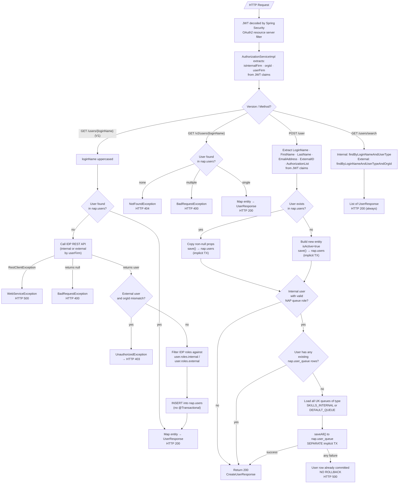
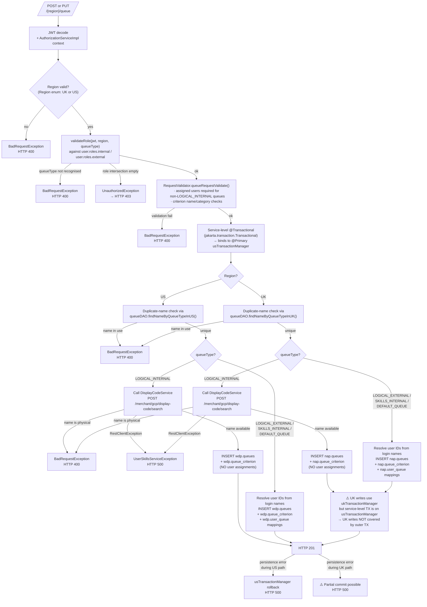
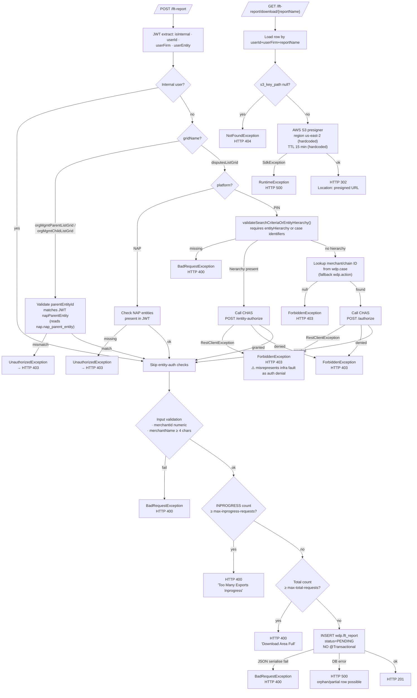
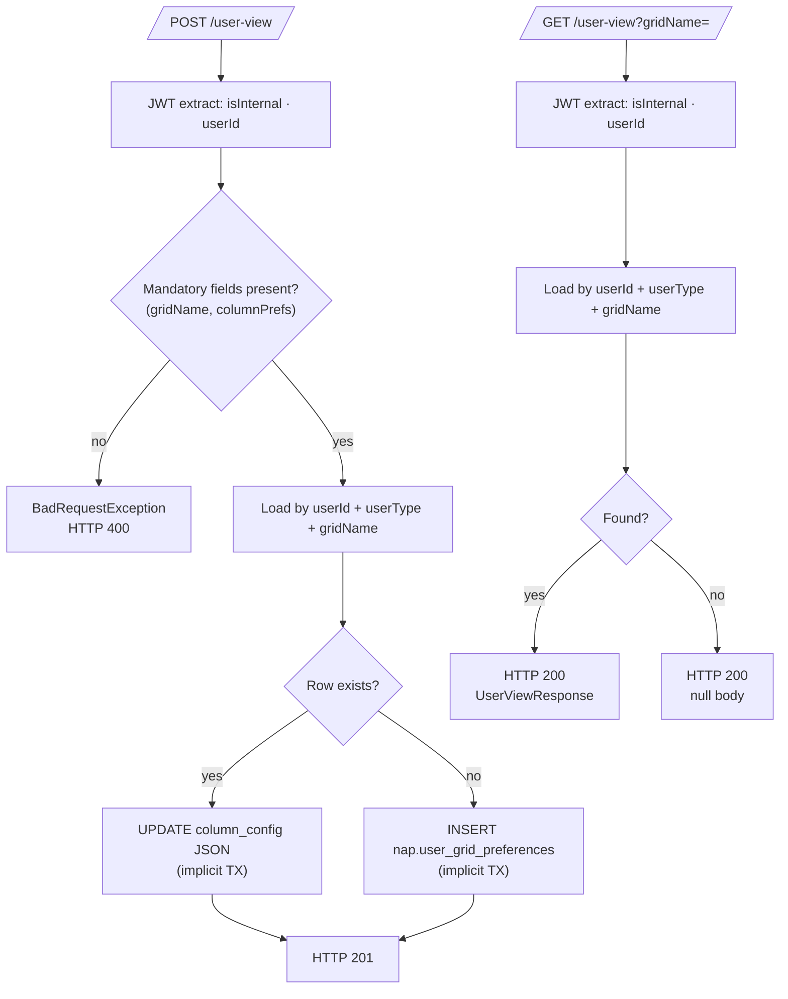

# WDP-COMP-30-USER-QUEUE-SKILL-SERVICE
**Worldpay Dispute Platform — Component Reference**
*Version: 1.1 DRAFT | April 2026*
*Source: v1.0 DRAFT (Copilot CLI extraction) + 2026-04-28 source-verification pass via GitHub Copilot CLI against `gcp-user-queue-skill-service`*
*Architect-confirmed: PENDING*

> **v1.1 reconciliation scope:** ten corrections applied to the v1.0 DRAFT, the most material being:
> 1. **Maven artifactId is `user-queue-skill-service`**, not `gcp-user-queue-skill-service` (the latter is the Kubernetes deployment name).
> 2. **Queue create/update `@Transactional` uses `jakarta.transaction.Transactional`** which selects the `@Primary` US transaction manager. UK queue operations are therefore **NOT covered** by the service-level transaction boundary — atomicity for UK queue + criterion + user_queue writes is not guaranteed. New 🔴 HIGH risk.
> 3. **POST /user has no `@Transactional` at all.** The user upsert and the auto-enrol side effect run in separate implicit transactions — auto-enrol failure does not roll back the user upsert. New 🔴 HIGH risk.
> 4. **V1 external-user orgId mismatch maps to HTTP 403**, not 401 (`UnauthorizedException` is rewritten by `GlobalExceptionHandler`).
> 5. **CHAS endpoints clarified**: `/entity-authorize` when `entityHierarchy` is present, `/authorize` otherwise. The `/hierarchy-authorization` portion is the base path, not the verb endpoint.
> 6. **Auto-enrol scope expanded**: triggers for existing internal users too (not only on first insert) and enrols into queues of type `SKILLS_INTERNAL` **OR** `DEFAULT_QUEUE` (v1.0 said `SKILLS_INTERNAL` only).
> 7. **Logstash integration is incomplete**: `logback-spring.xml` is **not in the repo**. The `logstash-logback-encoder` dependency and the `logstash.server.host.port` property are both present but no appender wires them — the integration is non-functional unless a logback config is mounted at runtime via ConfigMap. v1.0 reported Logstash as "configured".
> 8. **No `@UniqueConstraint` on any owned table** — idempotency for POST /user, POST /lft-report, POST /user-view, POST /{region}/queue is application-level only. POST /{region}/queue has a confirmed race-condition window between duplicate-name check and insert.
> 9. **Async configuration confirmed dead**: `AsyncConfiguration` is `@EnableAsync` and the executor bean is created at startup, but no `@Async` annotation exists anywhere — the executor is never invoked.
> 10. **Whitelist endpoints are two specific paths**, not a wildcard: `/user-queue-skill-service-api-docs` and `/user-queue-skill-service-api-docs/swagger-config`.
>
> All v1.0 statements about Kafka-free posture, no PAN handling, dual-datasource design, and DEC-014 deviation remain accurate.

---

## ━━━ CORE SKELETON ━━━━━━━━━━━━━━━━━━━━━━━━━━━━━━━━━━━━━━
*Mandatory for every component regardless of type.*

---

## Identity

| Field             | Value                                                        |
|-------------------|--------------------------------------------------------------|
| **Name**          | `UserQueueSkillService`                                      |
| **Type**          | REST API                                                     |
| **Repository**    | `gcp-user-queue-skill-service`                               |
| **Maven artifactId** | `user-queue-skill-service` *(corrected from `gcp-user-queue-skill-service`)* |
| **Runtime**       | Java 17 / Spring Boot 3.5.5 / PostgreSQL                     |
| **Service version** | 1.1.7                                                      |
| **Context path**  | `/merchant/gcp/user-queue-skill`                             |
| **Port**          | 8082                                                         |
| **Status**        | ✅ Production                                                 |
| **Doc status**    | 📝 DRAFT v1.1 — source-verified 2026-04-28, architect confirmation pending |
| **Sections present** | `Core \| Block A — REST API`                              |

---

## Purpose

**What it does**

`UserQueueSkillService` is the **data management and light-eligibility service** for user, queue, and skill relationships on the Worldpay Dispute Platform. It owns the user registry, queue definitions, queue-criterion (skill filter) rules, user-to-queue assignments, user column-view preferences, and the async large-file-transfer (LFT) export-request lifecycle. It is the authoritative store for *which queues exist*, *what criteria those queues define*, and *which users are assigned to which queues*.

The service operates across two regions served from the same deployed pod. UK operations use the `nap` PostgreSQL schema via a dedicated UK datasource and `ukTransactionManager`. US operations use the `wdp` PostgreSQL schema via a separate US datasource and `usTransactionManager` (marked `@Primary`). The two datasources are entirely independent — no XA or distributed transaction spans them.

On first encounter with a user (V1 GET by login name), the service calls an upstream Identity Provider (IDP) to retrieve user details and persists them locally. Subsequent lookups are served from the local database. A V2 endpoint performs DB-only lookup with no IDP fallback.

When a user is upserted via `POST /user` and holds a recognised WDP NAP queue role (`WDP_NAP_REGULAR`, `WDP_NAP_ADVANCED`, `WDP_NAP_SUPERVISOR`, `WDP_NAP_ADMIN`, or `vantiv-iq-merchant-chargebacks`) and has no existing queue assignments, the service auto-enrols that user into all UK queues of type `SKILLS_INTERNAL` **or** `DEFAULT_QUEUE`. The auto-enrol step runs as a follow-on operation after the user upsert — there is no enclosing transaction.

The service additionally manages an async LFT report-request lifecycle: users submit export requests, the service validates count caps and entity authorization, persists a `PENDING` row in `wdp.lft_report`, and (once the file is generated externally and `s3_key_path` is populated by a downstream component) makes the file available for download via 15-minute AWS S3 presigned URLs.

**What it does NOT do**

- Does **not** make real-time eligibility routing decisions on live cases. It stores the criteria and assignments; the matching of a live case against those criteria is performed by a downstream component — not determinable from source.
- Does **not** publish to or consume from any Kafka topic. No `spring-kafka` dependency.
- Does **not** use a transactional outbox pattern. All writes are direct table mutations; no event publication accompanies any write.
- Does **not** handle PAN data in any form. No PAN columns on any owned entity, no encryption configuration.
- Does **not** generate LFT report files. It only tracks request status and produces presigned download URLs once a downstream component populates `s3_key_path`.
- Does **not** transition `wdp.lft_report.status` after the initial `PENDING` insert. It only writes `PENDING` and reads `INPROGRESS` for count-cap checks. The status state-machine owner is unknown.
- Does **not** configure Resilience4j circuit breakers, REST timeouts, or retries on any outbound call.
- Does **not** atomically coordinate UK and US writes — there is no XA transaction.
- Does **not** atomically wrap UK queue create/update — see Risks below.

---

## Internal Processing Flow

The service exposes four logical endpoint groups. Each is documented as a separate flow. All four groups share `AuthorizationServiceImpl` for JWT-claim extraction; otherwise the service-layer code paths are independent.

There is **no Kafka listener**, **no scheduler**, **no webhook endpoint**. REST is the only entry mechanism.

---

### Flow A — User Lookup and Registration



**Critical structural finding (Flow A):** The auto-enrol step on POST /user is **not** in the same transaction as the user upsert. v1.0 implied atomicity. Source confirms `userUpdate()` has no `@Transactional`. Failure of the SKILLS_INTERNAL / DEFAULT_QUEUE enrolment leaves the user row persisted with no queue assignments — recovery requires either a re-POST or manual intervention.

---

### Flow B — Queue Management



**Critical structural finding (Flow B):** The `@Transactional` annotation on `QueueServiceImpl.createQueue()` and `updateQueue()` uses `jakarta.transaction.Transactional`, which without an explicit qualifier picks the bean marked `@Primary` — the **US transaction manager**. UK queue operations execute against `nap` repositories which use `ukTransactionManager`. The service-level transaction therefore does **not** cover UK writes. The v1.0 claim of "one transaction per datasource" was technically achieved by within-repository propagation only — it is not guaranteed by the service-level annotation and a partial-write window exists.

---

### Flow C — LFT Report Lifecycle



**Critical structural finding (Flow C):**
- `wdp.lft_report` insert is **non-transactional**. v1.0 already flagged this; v1.1 confirms.
- CHAS `RestClientException` is mapped to `ForbiddenException` → HTTP 403. From the caller's perspective an infrastructure outage (CHAS down, network blip) is indistinguishable from a legitimate authorization denial. This is a 🔴 HIGH operational concern.
- The `wdp.case` / `wdp.action` lookup query in `USCaseSearchDaoImpl` catches and silently logs DB exceptions, returning `null`. A swallowed exception cascades to a misleading 403 rather than surfacing an upstream fault.

---

### Flow D — User View (Column Preferences)



---

## Functional Behaviour

**Classification & routing logic**

- **Region routing** for queue endpoints — the `{region}` path variable is validated against the `Region` enum (UK or US). The value drives a controller-level branch into the UK or US repository / datasource. Invalid region → HTTP 400.
- **V1 vs V2 user lookup** — V1 falls back to IDP on DB miss and persists the user; V2 is DB-only with no IDP call and no insert.
- **Internal vs external user** — determined by inspecting the JWT `iss` claim for the substring `us_worldpay_fis_int`. External users are subject to additional orgId validation, NAP/PIN entity-authorization gates on LFT, and a different role allowlist.

**Business rules applied in this component**

- V1 external-user orgId match against IDP `customInfos.napParentEntity` / `iqOrgId`.
- Role filtering of JWT `AuthorizationList` against `user.roles.internal` / `user.roles.external` config sets, additionally filtered to a `WDP_` prefix.
- LFT count caps: `max-inprogress-requests` and `max-total-requests` (env-resolved).
- LFT input validation: `merchantId` numeric; `merchantName` length ≥ 4.
- PIN authorization gate via CHAS for external PIN users on POST /lft-report.
- Queue criterion-ID existence check on PUT /{region}/queue — unknown IDs → 400.
- Display Code Service "name not in use as a physical queue" check on LOGICAL_INTERNAL queue creation.

**Idempotency posture per write endpoint**

| Endpoint | Dedup key | DB unique constraint | Concurrent duplicate behaviour |
|----------|-----------|----------------------|--------------------------------|
| POST /user | `loginName + userType + orgId + userFirm` (external) or `loginName + userType` (internal) | None | Last-write-wins via load-then-save upsert pattern; no constraint to surface a violation |
| POST /lft-report | `reportName + userId + userFirm` | None | Duplicate rows insertable; only soft-limited by count caps |
| POST /user-view | `userId + userType + gridName` | None | Last-write-wins via load-then-save |
| POST /{region}/queue | `queueName + queueType` | None — checked in app code via `findNameByQueueType*` | **Confirmed race window** — two concurrent requests can both pass the duplicate check and both insert |

No `idempotency-key` header is read or written by any endpoint.

---

## Dependencies

The service has six external dependencies plus two PostgreSQL datasources. **All five REST integrations share a single `RestTemplate` bean** defined as a plain `new RestTemplate()` — no connection timeout, no read timeout, no retries, no Resilience4j. The same bean is injected into both `IdpRestInvoker` and `DisputeRestInvoker`.

| Dependency | Protocol & auth | Purpose | Timeouts | Retry | Resilience4j | Failure behaviour |
|-----------|----------------|---------|----------|-------|--------------|-------------------|
| **IDP Internal** | HTTPS GET; static Bearer + `X-SunGard-IdP-API-Key` | V1 user-lookup IDP fallback | None | None | Absent | `WebServiceException` → HTTP 400 or 500 |
| **IDP External (standard)** | HTTPS GET; Bearer + Sungard key; selected when `userFirm == us_merchant` | V1 external user lookup | None | None | Absent | HTTP 400 or 500 |
| **IDP External (MFD)** | HTTPS GET; MFD-specific Bearer + Sungard key; selected when `userFirm != us_merchant` | V1 external user lookup (fraud-disputes-merchant variant) | None | None | Absent | HTTP 400 or 500 |
| **Display Code Service** *(COMP-28)* | HTTP POST; OAuth2 `client_credentials` token from `us_worldpay_fis_int` IDP via `TokenServiceImpl` | Validate LOGICAL_INTERNAL queue name not already a physical queue | None | None | Absent | `UserSkillsServiceException` → HTTP 500 |
| **CHAS** *(COMP-03 — Core Hierarchy Authorization Service)* | HTTP POST `/entity-authorize` (when `entityHierarchy` present) or `/authorize` (when not); caller's JWT forwarded as Bearer | PIN authorization on POST /lft-report | None | None | Absent | `ForbiddenException` → HTTP 403 — **infra fault indistinguishable from auth denial** |
| **AWS S3** | AWS SDK v2 `S3Presigner`; default credential chain | Generate 15-min presigned GET URL for LFT download (`wdp-lft-report` bucket, region `us-east-2` hardcoded) | N/A | None | Absent | `SdkException` → HTTP 500 |
| **PostgreSQL nap** | JDBC via HikariCP (Spring Boot defaults — no overrides) | UK schema operations | HikariCP defaults | N/A | N/A | JPA exception → HTTP 500 |
| **PostgreSQL wdp** | JDBC via HikariCP (Spring Boot defaults — no overrides) | US schema operations | HikariCP defaults | N/A | N/A | JPA exception → HTTP 500 |

---

## Database Ownership

### Tables Owned (Read + Write)

#### UK datasource — `nap` schema · `ukTransactionManager`

| Schema.Table | Purpose | Key columns | Notes |
|--------------|---------|-------------|-------|
| `nap.users` | User registry — all WDP platform users | `id`, `login_name`, `user_type`, `orgid`, `is_active`, `c_usr_firm`, `role` (array) | Upserted on V1 GET (IDP fallback) and POST /user. **No `@UniqueConstraint`**. POST /user has no `@Transactional` — auto-enrol side effect runs in a separate implicit transaction. |
| `nap.queues` | UK queue definitions | `id`, `name`, `type`, `orgid`, `criteria_summary` | Written by POST/PUT `/{region}/queue` (UK path). **Service-level `@Transactional` does not bind to `ukTransactionManager`** — see Risks. |
| `nap.queue_criterion` | Filter criteria per UK queue | `id`, `queue_id` (FK), `type`, `category`, `name`, `value`, `operator_symbol` | Child of `nap.queues`. `@Modifying` delete on PUT path. Same caveat as parent table re service-level TX binding. |
| `nap.user_queue` | UK user-to-queue assignments | `id`, `user_id` (FK→users), `queue_id` (FK→queues) | Written in queue create/update path AND on POST /user auto-enrol. The auto-enrol write runs **outside** the queue transaction context and outside the user-upsert implicit transaction. |
| `nap.user_grid_preferences` | User column-view preferences (JSON) | `id`, `user_id`, `user_type`, `grid_name`, `column_config` (JSON) | Upserted by POST /user-view. No `@Transactional`. |

#### US datasource — `wdp` schema · `usTransactionManager` (`@Primary`)

| Schema.Table | Purpose | Key columns | Notes |
|--------------|---------|-------------|-------|
| `wdp.queues` | US queue definitions | `id`, `name`, `type`, `orgid` | Written by POST/PUT `/{region}/queue` (US path). Service-level `@Transactional` correctly binds here. |
| `wdp.queue_criterion` | Filter criteria per US queue | `id`, `queue_id` (FK), `type`, `category`, `name`, `value`, `operator_symbol` | Same TX scope as `wdp.queues`. |
| `wdp.user_queue` | US user-to-queue assignments | `id`, `user_id`, `queue_id` | Same TX scope as `wdp.queues`. |
| `wdp.lft_report` | Async LFT export-request tracking | `id`, `user_id`, `user_firm`, `grid_name`, `report_name`, `status`, `s3_key_path`, `criteria` (JSON), `user_entity` (JSON), `platform` | **Non-transactional** insert — no `@Transactional` on `createUserReport`. Status state-machine owner unknown — this service only writes `PENDING` and reads `INPROGRESS` for count-cap checks. |

### Tables Read (not owned by this component)

| Schema.Table | Owned by | Why accessed |
|--------------|----------|--------------|
| `nap.nap_parent_entity` | ⚠️ Owner TBC — read-only in this repo (confirmed: no `@Modifying`, no `save()`, no native writes) | LFT validation: lookup `parentEntityId` by name for `orgMgmtMidListGrid` validation |
| `wdp.case` | ⚠️ Owner TBC (candidates: CaseManagementService COMP-23 or DisputeService COMP-22) — read-only in this repo (confirmed) | LFT PIN authorization: merchant/chain ID lookup |
| `wdp.action` | ⚠️ Owner TBC (candidates: CaseManagementService COMP-23 or CaseActionService COMP-24) — read-only in this repo (confirmed) | LFT PIN authorization: source case ID fallback join |

**Read-only confirmations from source-verification pass:** `ParentEntityRepository`, `USCaseSearchDaoImpl` for `wdp.case`, and the `wdp.action` JOIN query all contain SELECT-only operations. No `@Modifying`, no `save()`, no native UPDATE/INSERT/DELETE found.

### Transaction-scope summary

- UK and US datasources have **independent `JpaTransactionManager` instances**: `ukTransactionManager` and `usTransactionManager` (`@Primary`). **No XA**.
- **Queue create/update** declares `@Transactional(rollbackOn = Exception.class)` using `jakarta.transaction.Transactional`. This binds to the `@Primary` US transaction manager only. UK writes are NOT wrapped by the service-level transaction — they run under per-repository implicit transactions on `ukTransactionManager`.
- **POST /user** has **no** `@Transactional`. The user upsert and the SKILLS_INTERNAL/DEFAULT_QUEUE auto-enrol are separate implicit transactions on `ukTransactionManager`.
- **POST /lft-report** has **no** `@Transactional`.
- **POST /user-view** has **no** `@Transactional`.
- **No `SELECT FOR UPDATE` and no row locks** anywhere in source.

---

## Configuration and Scaling

| Parameter | Value | Notes |
|-----------|-------|-------|
| Replica count | `{{ replicas-gcp-user-queue-skill-service }}` | XL Deploy / Helm placeholder. **No default visible in repo** — environment-config-only. No `values.yaml` and no Helm chart present. |
| HPA | Absent | No `HorizontalPodAutoscaler` resource. |
| Memory request / limit | `1024Mi` / `2048Mi` | |
| CPU request / limit | **Not configured** | Both absent from `resources.yaml`. Best-effort QoS — no cap, no scheduling guarantee. |
| Deployment type | Kubernetes `Deployment` + `Service` (ClusterIP) + `Ingress` | nginx ingress with CORS enabled and TLS. |
| Rollout strategy | `RollingUpdate` — `maxSurge: 1`, `maxUnavailable: 0` | |
| `minReadySeconds` | 30 | Placed under `spec.template.spec` rather than `spec` — same misplacement pattern observed across other components; effective behaviour depends on the live K8s API server's tolerance. |
| PodDisruptionBudget | Absent | Voluntary disruptions can take all replicas down simultaneously. |
| Topology spread | `maxSkew: 1`, `whenUnsatisfiable: ScheduleAnyway`, `topologyKey: kubernetes.io/hostname` | Label selector uses `${BRANCH_NAME_PLACEHOLDER}` consistent across metadata, selector, and template labels — **no label mismatch**. `ScheduleAnyway` is advisory, not a hard guarantee. |
| Liveness probe | `GET /merchant/gcp/user-queue-skill/livez` port 8082 | Actuator-backed via `management.endpoint.health.group.liveness.additional-path: server:/livez`. Initial delay 25s, period 10s, failure threshold 3. |
| Readiness probe | `GET /merchant/gcp/user-queue-skill/readyz` port 8082 | Actuator-backed via `management.endpoint.health.group.readiness.additional-path: server:/readyz`. Initial delay 15s, period 10s, failure threshold 3. |
| Startup probe | Absent | |
| Container port | 8082 | |
| Database connection pool | HikariCP (Spring Boot defaults) | **No** sizing or timeout overrides for either nap or wdp datasource. Only `username`, `password`, `jdbc-url`, `driverClassName` configured. |
| OpenTelemetry | Java agent injected via `instrumentation.opentelemetry.io/inject-java: opentelemetry-operator-system/default` annotation | |
| Spring Actuator | `info`, `health`, `prometheus` endpoints exposed | |
| Prometheus / Micrometer | Enabled | |
| Logstash | ⚠️ **Incomplete** | `logstash-logback-encoder` dependency present and `logstash.server.host.port` property defined, but **no `logback-spring.xml` in the repo**. No appender wires the property. Integration is non-functional unless a logback config is mounted at runtime via ConfigMap — not visible in this repo. |
| Spring profiles | `${gcp_env}` — selects `application-{local,dev,cert,stg,uat,prod,test}.yaml` | All seven profile files present in the repo. |
| Hardcoded constants | S3 region `us-east-2`; presigned-URL TTL 15 minutes; internal-firm constant `us_worldpay_fis_int` | None environment-configurable. |
| Async thread pool | `async.corepoolsize`, `async.maxpoolsize`, `async.queuecapacity` configured in `application.yaml`; `AsyncConfiguration` class is `@EnableAsync` and the executor bean is created at startup | ⚠️ **Confirmed dead config** — no `@Async` annotation exists anywhere in `src/main/java`, the executor is never invoked. |

---

## Key Architectural Decisions

| Decision | ADR reference | Notes |
|----------|---------------|-------|
| Service is a **data provider only** — does not perform live case-to-queue routing decisions | Local decision | Stores criteria and assignments. Live-case matching is a downstream component (unconfirmed). HANDOVER OQ resolved: COMP-30 is *not* the routing decision-maker. |
| **Dual-datasource design** — separate `nap` (UK) and `wdp` (US) schemas served from the same pod, with separate `EntityManagerFactory` and `JpaTransactionManager` per datasource | Local decision | No XA. UK and US writes cannot be atomically coordinated. |
| **No transactional outbox** | DEC-001 — ABSENT | All writes are direct table mutations. No event publication. Confirmed explicitly. |
| **No Kafka involvement** | DEC-003, DEC-005 — N/A | No `spring-kafka` dependency. Neither producer nor consumer. |
| **No PAN data path** | DEC-004, DEC-019 — N/A | No PAN columns or fields anywhere. Confirmed. |
| **No Resilience4j** on any outbound call | DEC-014 — DEVIATION | Confirmed by absence of `resilience4j` dependency in `pom.xml`. |
| **No REST timeouts** on any outbound call | Local decision | All five REST integrations share a single `new RestTemplate()` bean with no timeouts. |
| **`@Transactional` binds to `@Primary` US TX manager** | Local — **defect-in-design** | Service-level `@Transactional` on queue create/update uses `jakarta.transaction.Transactional` and binds to `usTransactionManager` (`@Primary`). UK queue + criterion + user_queue writes are NOT covered by the service-level transaction. New 🔴 HIGH risk. |
| **POST /user has no `@Transactional`** | Local — **defect-in-design** | User upsert and SKILLS_INTERNAL/DEFAULT_QUEUE auto-enrol run in separate implicit transactions. Auto-enrol failure leaves a user row with no queue assignments. New 🔴 HIGH risk. |
| **POST /lft-report has no `@Transactional`** | Local decision | Insert is non-transactional — partial-write windows possible. |
| **CHAS infra failure → HTTP 403** | Local decision | `RestClientException` from CHAS is caught and rethrown as `ForbiddenException`. Infra outage is indistinguishable from auth denial from the caller's view. |
| **SKILLS_INTERNAL and DEFAULT_QUEUE queue types are the auto-enrol targets** | Local decision | No dedicated "skill" entity exists — skills are modelled as queues of these two types. Auto-enrol set expanded from v1.0 (`SKILLS_INTERNAL` only) to include `DEFAULT_QUEUE`. |
| **Region-specific UK/US role validation removed** | Local decision | A commented-out `validateUserRole` method previously used separate `internalUKRoles` / `externalUKRoles` / `internalUSRoles` / `externalUSRoles` config sets. It was replaced by a single queue-type-based `validateRole`. The four removed config keys no longer exist in YAML. No ADR or ticket reference in source. |
| **Application-level role enforcement** rather than Spring Security filter chain | Local decision | Spring Security only validates the JWT signature and issuer. All `AuthorizationList` claim intersection logic lives in `AuthorizationServiceImpl` — invoked per controller method. |

---

## Risks and Constraints

**Severity scale:** 🔴 HIGH — data loss / security breach / processing halt · 🟡 MEDIUM — degraded throughput / partial failure · 🟢 LOW — latent bug / dead code

| Severity | Risk | Consequence |
|----------|------|-------------|
| 🔴 HIGH | **`@Transactional` on queue create/update binds to the `@Primary` `usTransactionManager` only.** UK queue + criterion + user_queue writes execute under per-repository implicit transactions on `ukTransactionManager`, not the service-level boundary. | Mid-operation failure on a UK queue write can leave queue + criterion + user_queue partially committed across repositories. v1.0 documentation of "one transaction per datasource" was misleading. |
| 🔴 HIGH | **POST /user has no `@Transactional`.** The user upsert and the auto-enrol `saveAll()` to `nap.user_queue` are separate implicit transactions. | Auto-enrol failure leaves the user row persisted with no queue assignments. Recovery requires a manual re-POST or out-of-band fix. |
| 🔴 HIGH | **No Resilience4j circuit breaker on IDP calls.** IDP unavailability causes V1 GET /users/{loginName} to return HTTP 500 for any user not yet in the local DB. | Users absent from `nap.users` cannot establish portal sessions during an IDP outage — full portal-access failure for that cohort. |
| 🔴 HIGH | **CHAS `RestClientException` → HTTP 403.** Infrastructure failure of CHAS is indistinguishable from a legitimate authorization denial from the caller's perspective. | Silent service degradation. PIN external users see "authorization denied" error during a CHAS outage and cannot create LFT reports. Operations and merchant support cannot easily distinguish the two cases. |
| 🔴 HIGH | **No XA between `nap` and `wdp` datasources.** Any logical operation that needs to write to both schemas cannot be atomically coordinated. | Currently no endpoint writes to both schemas in one request — but the service is one architectural change away from this becoming a real data-consistency problem. |
| 🔴 HIGH | **`USCaseSearchDaoImpl` swallows DB exceptions and returns null** during PIN authorization lookup. | A DB outage on `wdp.case` / `wdp.action` reads is rewritten to "merchant not found" → HTTP 403, masking a real fault. |
| 🟡 MEDIUM | **No REST timeouts on any outbound call.** All five REST integrations share a `new RestTemplate()` with no connect or read timeout. | Slow IDP / Display Code / CHAS / S3 response blocks the calling Tomcat thread indefinitely. Sustained slowness exhausts the request thread pool. |
| 🟡 MEDIUM | **`POST /lft-report` insert is non-transactional.** | A partial-write failure cannot be auto-rolled-back. Orphaned or partially-populated rows can accumulate in `wdp.lft_report`. |
| 🟡 MEDIUM | **No `@UniqueConstraint` on any owned table.** POST /{region}/queue has a confirmed race window between duplicate-name check and insert. POST /lft-report and POST /user-view rely on application-level dedup only. | Duplicate rows are insertable under concurrent traffic for queue creation. For LFT and user-view the load-then-save pattern produces last-write-wins without explicit detection. |
| 🟡 MEDIUM | **S3 region hardcoded to `us-east-2`.** | Bucket relocation requires a code change + redeploy. LFT downloads silently fail until then. |
| 🟡 MEDIUM | **Topology spread is `ScheduleAnyway`** — best-effort, not enforced. | Spread guarantees do not survive scheduler pressure. Two replicas can land on the same node. |
| 🟡 MEDIUM | **Replica count is environment-injected** with no default visible in repo. | HA posture cannot be verified from source. Confirm with deployment team. |
| 🟡 MEDIUM | **HikariCP runs on Spring Boot defaults** for both datasources. | No tuned pool size, no timeout overrides. Pool sizing for two datasources from one pod is implicit — not deliberate. |
| 🟡 MEDIUM | **Logstash integration is non-functional** without an externally-mounted `logback-spring.xml`. | Structured JSON logging to Logstash is silently absent. Console output only — operational visibility relies on the K8s log pipeline rather than the configured Logstash sink. |
| 🟢 LOW | **`spring-boot-devtools` present without `<scope>runtime</scope>` or `<optional>true</optional>`.** | Dev tooling included in the production artifact. The Spring Boot Maven plugin's `repackage` goal excludes devtools by default since 2.x, so runtime impact is likely nil — but explicit scope is best practice. |
| 🟢 LOW | **`AsyncConfiguration` is dead config.** `@EnableAsync` and the `asyncExecutor` bean are created but no `@Async` annotation exists anywhere. | Resource cost is the executor pool. Risk is confusion during future development — adding `@Async` would activate dormant config without an explicit decision. |
| 🟢 LOW | **`logger.level` and `logstash.server.host.port` properties are defined but never injected.** | Dead config. Removing them does not change behaviour. |
| 🟢 LOW | **Removed `validateUserRole` method has no ADR or ticket reference.** Commented-out block remains in source. | Technical debt with no tracking artifact — risk of being forgotten or reverted. |
| 🟢 LOW | **`DELETE /lft-report/{reportName}` has no scope check beyond `userId + userFirm`.** Multiple rows can share the same reportName for the same user. | Bulk-delete by name removes all matching rows, including any newer requests with the same name. |

---

## Planned Changes

- ⚠️ **OPEN QUESTION:** Confirm production replica count — XL Deploy variable `{{ replicas-gcp-user-queue-skill-service }}` value not visible in source. Check deployment tooling.
- ⚠️ **OPEN QUESTION:** Identify which component performs **live case-to-queue eligibility matching** using the criteria stored by COMP-30. The criteria are written here; the matcher reads them but lives elsewhere.
- ⚠️ **OPEN QUESTION:** Identify the owner of `nap.nap_parent_entity` — read-only consumer in this repo.
- ⚠️ **OPEN QUESTION:** Identify the owner of `wdp.case` and `wdp.action` — read-only consumers in this repo. Candidates: COMP-23 CaseManagementService, COMP-22 DisputeService, COMP-24 CaseActionService.
- ⚠️ **OPEN QUESTION:** Identify the component that transitions `wdp.lft_report.status` from `PENDING` to `INPROGRESS` and on to a terminal state. COMP-30 only inserts `PENDING` and reads `INPROGRESS`.
- ⚠️ **OPEN QUESTION:** Identify the runtime source of `logback-spring.xml` if present in deployment (ConfigMap mount, sidecar, base image). If absent, confirm whether structured Logstash logging is intended or whether console-only is acceptable.
- ⚠️ **OPEN QUESTION:** Identify known callers of every endpoint. No `@KnownCallers` annotation, Swagger tag, comment header, or per-endpoint Spring Security restriction names callers in source.
- ⚠️ **OPEN QUESTION:** Confirm whether the absence of CPU limits and requests is intentional, and whether the omission of a PodDisruptionBudget and HPA matches the load profile.
- ⚠️ **ARCHITECT DECISION NEEDED:** Whether to remediate the queue `@Transactional` / `@Primary` mismatch — current pattern silently fails to wrap UK writes.
- ⚠️ **ARCHITECT DECISION NEEDED:** Whether to add `@Transactional` to POST /user to atomically wrap user upsert + auto-enrol.
- ⚠️ **ARCHITECT DECISION NEEDED:** Whether CHAS infra failure should surface as HTTP 503 (or 502) rather than HTTP 403, to distinguish it from genuine authorization denial.

---

---

## ━━━ TYPE BLOCK A — REST API CONTRACTS ━━━━━━━━━━━━━━━━━━━

---

## REST API Contracts

**Authentication model:**
All endpoints require a valid Bearer JWT validated by Spring Security's `JwtIssuerAuthenticationManagerResolver` against trusted issuers defined in `jwt.trustedIssuers`. Spring Security only checks the JWT signature and issuer. **Scope/role enforcement is performed in application code** by `AuthorizationServiceImpl` reading the `AuthorizationList` JWT claim and intersecting it with configured `user.roles.internal` and `user.roles.external` allowlists.

Whitelisted endpoints (no auth required): `/actuator/health`, `/readyz`, `/livez`, `/user-queue-skill-service-api-docs`, `/user-queue-skill-service-api-docs/swagger-config`, `/swagger-ui/**`. *(v1.0 listed `/user-queue-skill-service-api-docs/**` as a wildcard; source defines two specific paths — corrected.)*

**Outbound auth tokens:**
- IDP internal: static Bearer (`idp.internal.auth-token`) + `X-SunGard-IdP-API-Key` header
- IDP external standard: Bearer + Sungard key — selected when `userFirm == us_merchant`
- IDP external MFD: separate MFD-specific Bearer + Sungard key — selected when `userFirm != us_merchant`
- Display Code Service: OAuth2 client_credentials token from `us_worldpay_fis_int` IDP via `TokenServiceImpl`
- CHAS: caller's JWT forwarded as Bearer

**Base URL pattern:** `https://<host>/merchant/gcp/user-queue-skill`

**Common error body:**
```
{
  "errors": {
    "message": "<error message>",
    "target": "<field or component>"
  }
}
```

**Common header:** `v-correlation-id` — optional correlation ID propagated for request tracing.

**Known callers:** Not determinable from source for any endpoint. No `@KnownCallers` annotation, no Swagger `x-extensions` naming callers, no comment headers, no Spring Security per-endpoint caller restrictions. Likely callers (inference, not confirmed): WDP Merchant Portal (COMP-49), WDP Ops Portal (COMP-50), and an unidentified report-generation worker for the LFT lifecycle.

---

### Endpoint group 1 — User Management

#### `GET /users/{loginName}` (V1)

**Purpose:** Retrieve a user by login name. Falls back to IDP if not found locally; persists on first encounter.

| Field | Type | Required | Description |
|-------|------|----------|-------------|
| `loginName` | path | Yes | User's login name — uppercased internally |
| `userId` | query | Yes | User ID — used for correlation |
| `v-correlation-id` | header | No | Request tracing |

| HTTP | Condition | Body |
|------|-----------|------|
| 200 | User found in DB or successfully fetched from IDP and persisted | `UserResponse` |
| 400 | IDP returned null (user not found in IDP) | error body |
| 403 | External user: `napParentEntity` / `iqOrgId` from IDP does not match caller's JWT `orgId` *(v1.0 said 401 — corrected: `UnauthorizedException` is mapped to 403 by `GlobalExceptionHandler`)* | error body |
| 500 | IDP `RestClientException` | error body |

#### `GET /v2/users/{loginName}` (V2)

**Purpose:** DB-only user lookup — no IDP fallback, no write-on-miss.

| HTTP | Condition |
|------|-----------|
| 200 | Single user found |
| 400 | Multiple records found for loginName |
| 404 | No user found |

#### `POST /user`

**Purpose:** Upsert a user from JWT claims. Auto-enrols internal users with valid NAP queue role into all UK queues of type `SKILLS_INTERNAL` or `DEFAULT_QUEUE` if no existing queue assignments. **Not atomic** — see Risks.

**Request:** No body. All data sourced from JWT claims (`LoginName`, `FirstName`, `LastName`, `EmailAddress`, `ExternalID`, `AuthorizationList`).

| HTTP | Condition |
|------|-----------|
| 200 | User upserted (auto-enrol may or may not have completed — no signal in response body) |
| 500 | DB write failure on user upsert |

#### `GET /users/search?loginName=<partial>`

**Purpose:** Partial-match search by login name, scoped by firm/org. `LIKE '%value%'` semantics.

| HTTP | Condition |
|------|-----------|
| 200 | Always — list may be empty |

---

### Endpoint group 2 — Queue Management

#### `POST /{region}/queue`

**Purpose:** Create a queue with associated criterion rules and user assignments for a given region.

| Field | Type | Required | Description |
|-------|------|----------|-------------|
| `region` | path | Yes | `UK` or `US` (case-insensitive). Other values → 400. |
| body | `CreateQueueRequest` | Yes | `name`, `type`, `criteria[]`, `assignedUsers[]` |

| HTTP | Condition |
|------|-----------|
| 201 | Queue created |
| 400 | Invalid region · invalid queueType · validation failure · duplicate name (app-check) · LOGICAL_INTERNAL name in physical queue list |
| 403 | JWT role does not include any required queue role |
| 500 | Display Code Service failure · DB persistence error |

#### `PUT /{region}/queue`

**Purpose:** Update an existing queue. Same shape as POST plus criterion-ID existence check (unknown IDs → 400).

| HTTP | Condition |
|------|-----------|
| 200 | Queue updated |
| 400 | Region invalid · validation failure · unknown criterion ID |
| 403 | JWT role insufficient |
| 500 | Display Code Service failure · DB persistence error |

---

### Endpoint group 3 — User View (Column Preferences)

#### `POST /user-view`

**Purpose:** Upsert the user's column-view configuration for a named grid. JSON-serialised column config.

| HTTP | Condition |
|------|-----------|
| 201 | Upserted |
| 400 | Missing mandatory fields |

#### `GET /user-view?gridName=<name>`

**Purpose:** Retrieve stored column preferences for a grid.

| HTTP | Condition |
|------|-----------|
| 200 | Found (returns config) or not found (returns null body) |

---

### Endpoint group 4 — LFT Report (Large File Transfer)

#### `POST /lft-report`

**Purpose:** Submit an async export request. Validates entity authorization (external users), enforces count caps, persists a `PENDING` row.

| Field | Type | Required | Description |
|-------|------|----------|-------------|
| body | `UserReportRequest` | Yes | `gridName`, `reportName`, `searchCriteria`, `platform` |
| `v-correlation-id` | header | No | Correlation ID |

| HTTP | Condition |
|------|-----------|
| 201 | Request accepted and persisted as PENDING |
| 400 | INPROGRESS count ≥ `max-inprogress-requests` (`Too Many Exports Inprogress`) · total count ≥ `max-total-requests` (`Download Area Full`) · `merchantName` < 4 chars · `merchantId` non-numeric · JSON serialisation failure |
| 403 | External NAP user with no NAP entities in JWT · external PIN user: CHAS denied · external PIN user: CHAS unavailable · external PIN user: merchant lookup returned null |

#### `GET /lft-report`

**Purpose:** List the authenticated user's LFT report requests.

| HTTP | Condition |
|------|-----------|
| 200 | Reports found — `UserReportResponse { reportDetailsList: [{ reportName, status, creationDate, lastUpdateDate }] }` |
| 404 | No reports found |

#### `DELETE /lft-report`

**Purpose:** Bulk-delete all the authenticated user's LFT report requests.

| HTTP | Condition |
|------|-----------|
| 200 | Deleted |
| 404 | None found |

#### `DELETE /lft-report/{reportName}`

**Purpose:** Delete a specific LFT report request by name.

| HTTP | Condition |
|------|-----------|
| 200 | Deleted |
| 404 | Not found |

#### `GET /lft-report/download/{reportName}`

**Purpose:** Generate a 15-minute AWS S3 presigned URL for report download.

| HTTP | Condition |
|------|-----------|
| 302 | Report file available — `Location` header carries presigned URL |
| 404 | `s3_key_path` is null in `wdp.lft_report` (file not yet generated) |
| 500 | AWS SDK exception during presigned-URL generation |

---

## Items Not Verifiable From Source

These v1.0 / v1.1 statements could not be cross-checked against code or config and require team or runtime confirmation:

1. **Production replica count** — XL Deploy variable, no default in repo.
2. **`max-inprogress-requests` and `max-total-requests` actual values** — env-resolved.
3. **`jwt.trustedIssuers` actual values** — env-resolved.
4. **IDP base URL actual values across environments** — all env-resolved.
5. **Downstream component that transitions `wdp.lft_report.status`** — only `PENDING` and `INPROGRESS` are touched here.
6. **S3 bucket name in non-prod environments** — only prod has `wdp-lft-report` confirmed; others env-dependent.
7. **AWS credentials mechanism for the S3 presigner** — `S3Presigner.builder().region(US_EAST_2).build()` uses default credential chain. Whether IRSA, env vars, or instance profile provides credentials is not in source.
8. **Whether a `logback-spring.xml` is mounted at runtime** via ConfigMap or sidecar — if so, Logstash might be functional despite absence from repo.
9. **`app.name` env var value** — referenced as `${app.name}` in `management.metrics.tags.application` but never defined in any YAML.
10. **Owners of `nap.nap_parent_entity`, `wdp.case`, `wdp.action`** — confirmed read-only here, owner unknown.
11. **Known callers per endpoint** — no naming convention, annotation, or Swagger tag identifies them.
12. **Whether the `validateUserRole` removal has an associated ADR or ticket** — no reference in source.

---

*End of WDP-COMP-30-USER-QUEUE-SKILL-SERVICE.md*
*File status: 📝 DRAFT v1.1 — source-verified 2026-04-28, architect confirmation pending.*
*Supersedes v1.0 DRAFT. See WDP-CHANGE-LOG.md entry for 2026-04-28 COMP-30 for the full correction set.*
