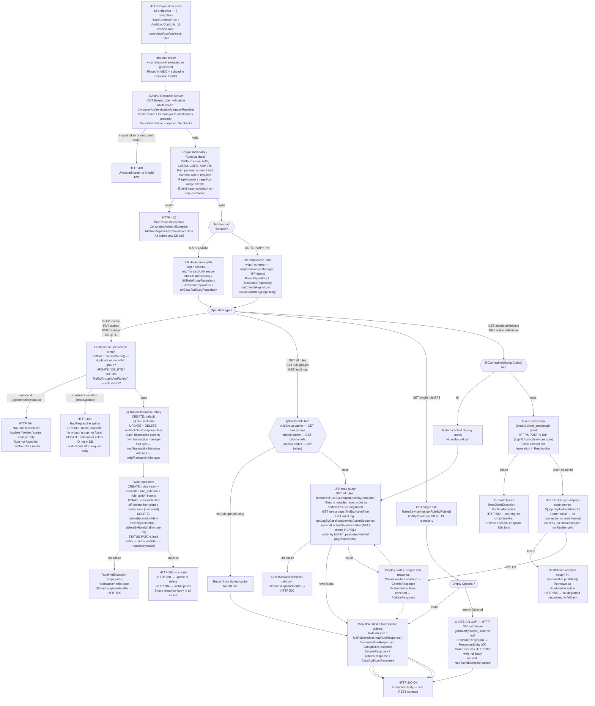

# WDP-COMP-31-BUSINESS-RULES-SERVICE.md
**Worldpay Dispute Platform — Component Reference**
*Version: 1.0 DRAFT | April 2026*
*Extracted from: gcp-business-rule-service using GitHub Copilot CLI | Architect-confirmed: PENDING*

---

## ━━━ CORE SKELETON ━━━━━━━━━━━━━━━━━━━━━━━━━━━━━━━━━━━━━━

---

## Identity

| Field | Value |
|---|---|
| **Name** | `BusinessRulesService` |
| **Type** | REST API |
| **Artefact** | `com.wp.wdp:business-rules-service:1.0.3` |
| **Repository** | `gcp-business-rule-service` |
| **Runtime** | Spring Boot 3.4.4 / Java 17 |
| **Status** | ✅ Production |
| **Doc status** | 📝 DRAFT |
| **Sections present** | Core \| Block A (REST — 10 endpoints across 2 controllers) |

---

## Purpose

**What it does**

BusinessRulesService (BRS) is the rule management microservice for the Worldpay Dispute Platform.
It provides full CRUD lifecycle management for dispute automation rules, organised into rule groups
carrying one or more criteria and actions. Portal UIs and operational tooling use this service to
create, retrieve, update, activate, deactivate, and delete the business rules that govern how
disputes are automatically processed.

The service operates a dual-database architecture. NAP and LATAM platform traffic targets the
`nap.*` PostgreSQL schema via a dedicated NAP datasource and persistence unit. CORE, VAP, and
PIN platform traffic targets the `wdp.*` schema via the WDP datasource. Every endpoint is
platform-parameterised via a `{platform}` path variable — routing is entirely symmetric across
the two schemas, with the same logic applied to schema-specific JPA repositories.

In addition to rule CRUD, BRS exposes read-only reference endpoints that return criteria and
action definitions (available criterion types, operator symbols, action categories and field
options). These are enriched with human-readable display codes fetched from the
`gcp-display-code-service` via an outbound REST call, with the response cached using Spring's
`@Cacheable` to reduce repeated outbound calls. Rule group definitions are similarly cached.

A tenth endpoint allows retrieval of the case-level business rules audit log — the trail of which
rules were evaluated (matched or not) for each case action. The audit data itself is written by
`gcp-business-rules-processor` (COMP-16); BRS only reads it.

**What it does NOT do**

- Does NOT execute business rules against cases. Rule execution is entirely the responsibility of
  BusinessRulesProcessor (COMP-16). BRS manages rule definitions only.
- Does NOT call BusinessRulesProcessor. The two services are independent; rule data flows via the
  shared `nap.rules` / `wdp.rules` tables, not via REST.
- Does NOT produce to or consume from any Kafka topic. There is no Kafka dependency in `pom.xml`
  and no Kafka client code in the source.
- Does NOT implement the transactional outbox pattern. No Kafka = no outbox requirement.
- Does NOT write to the `br_case_audit_log` tables. These are written exclusively by COMP-16.
  BRS reads them for the audit log retrieval endpoint only.
- Does NOT apply Resilience4j circuit breakers, rate limiters, or bulkheads on any dependency.
  The service fails hard if any dependency is unavailable.
- Does NOT enforce endpoint-level scopes or roles beyond JWT issuer trust. All authenticated
  requests are authorised equally. Scope enforcement, if any, occurs at the API Gateway layer.
- Does NOT write to `rule_group`, `rule_criteria`, or `rule_action_field` tables. These are
  reference/configuration tables treated as read-only by this service.

---

## Internal Processing Flow

---

## Boundaries

### Inbound Interfaces

| Source | Protocol | Path | Payload / Description |
|--------|----------|------|-----------------------|
| Portal UIs (Merchant Portal / Ops Portal) via API Gateway | REST HTTPS | All 10 endpoints (see REST contract) | Rule management operations and reference lookups |
| COMP-07 VisaDisputeBatch | REST HTTP | GET `/{platform}/rule-group/{ruleGroupId}/rules` (suspected) | Queue status rule lookups — caller confirmed in COMP-INDEX; exact endpoint NOT DETERMINABLE FROM SOURCE |
| Internal operations tooling | REST HTTPS | Any authenticated endpoint | Operational rule changes — callers NOT DETERMINABLE FROM SOURCE |

### Outbound Interfaces

| Target | Protocol | Endpoint / Resource | Purpose | On failure |
|--------|----------|---------------------|---------|------------|
| NAP Aurora PostgreSQL | JDBC | `nap.*` schema — rules, rule_criterion, rule_action (R+W); rule_group, rule_criteria, rule_action_field, br_case_audit_log (Read) | All rule CRUD and audit log reads for NAP/LATAM path | JPA exception → GlobalExceptionHandler → HTTP 500 |
| WDP Aurora PostgreSQL | JDBC | `wdp.*` schema — same tables as NAP path (R+W and Read respectively) | All rule CRUD and audit log reads for CORE/VAP/PIN path | JPA exception → GlobalExceptionHandler → HTTP 500 |
| `gcp-display-code-service` | REST HTTP POST | `${gcp.displayCodeEnvUrl}/merchant/gcp/display-code/search` | Enrich criteria and action definitions with human-readable display codes | RestClientException → RuntimeException → HTTP 500. No retry, no fallback. |
| OAuth2 IDP (login8.fiscloudservices.com) | HTTPS | `/idp/us/worldpay_fis_int/rest/1.0/accesstoken` | Obtain `client_credentials` Bearer token for outbound call to display-code-service | RestClientException → RuntimeException → HTTP 500 |

---

## Database Ownership

### Tables Owned (written by this component)

| Table | Schema(s) | Key Columns | Notes |
|-------|-----------|-------------|-------|
| `rules` | `nap` and `wdp` | `id` (PK, seq), `group_id`, `group_name`, `name`, `type`, `description`, `sort_order`, `is_enabled`, `criteria_summary`, `action_summary`, `created_by`, `created_at`, `updated_by`, `updated_at` | Core rule record. Cascades to rule_criterion and rule_action. `is_enabled` = true on create (default active). Read by COMP-16 via direct JPA. |
| `rule_criterion` | `nap` and `wdp` | `id` (PK, seq), `rule_id` (FK → rules.id), `type`, `category`, `name`, `value`, `operator_symbol`, `operator_readable`, `description`, `created_at` | Per-rule criterion instances. OneToMany from rules — CascadeType.ALL, LAZY. Deleted via `deleteByCriterionIds` before parent delete on update/delete. Read by COMP-16. |
| `rule_action` | `nap` and `wdp` | `id` (PK, seq), `rule_id` (FK → rules.id), `category`, `action_name`, `field_name1/2/3`, `field_value1/2/3`, `field_value1/2/3_description`, `created_at` | Per-rule action instances. OneToMany from rules — CascadeType.ALL, LAZY. Deleted via `deleteByActionIds` before parent delete on update/delete. Read by COMP-16. |

### Tables Accessed Read-Only

| Table | Schema(s) | Purpose | Key Columns Used |
|-------|-----------|---------|-----------------|
| `rule_group` | `nap` and `wdp` | Rule group definitions. Used to validate group existence on create and to return group lists. Result cached with `@Cacheable("ruleGroup")`. | `id`, `name`, `description`, `triggered_by`, `type`, `is_enabled`, `created_by`, `created_at`, `updated_at`, `updated_by`, `c_display_group_name` |
| `rule_criteria` | `nap` and `wdp` | Reference/lookup table for available criterion definitions. Read for GET /criteria endpoint. Result cached with `@Cacheable("criteria")`. ⚠️ Owner of this table NOT DETERMINABLE FROM SOURCE — likely seed/config data. | `id`, `category`, `type`, `display_name` (enriched with display codes) |
| `rule_action_field` | `nap` and `wdp` | Reference/lookup table for available action definitions. Read for GET /actions endpoint. Mirrors rule_criteria for the action dimension. ⚠️ Owner NOT DETERMINABLE FROM SOURCE. | `id`, `category`, `action_name`, `action_display_name`, `field_name`, `field_display_name`, `type`, `is_required`, `display_code_type` |
| `br_case_audit_log` | `nap` and `wdp` | Case-level rules evaluation audit trail. Written exclusively by COMP-16 BusinessRulesProcessor. Read by this service for GET /audit-log/case/{caseNumber} endpoint. | `id` (PK, seq), `c_case` (case number), `c_action_seq`, `rule_grp_name`, `rule_id`, `rule_name`, `is_valid`, `created_at` |

### Transaction Scope

| Operation | Boundary | Tables Covered |
|-----------|----------|----------------|
| Create rule (POST) | Single `@Transactional` | Duplicate-name check read + rules insert + cascaded rule_criterion inserts + cascaded rule_action inserts |
| Update rule (PUT) | Single `@Transactional(rollbackOn=Exception.class)` | Load entity + criterion deletes (diff) + action deletes (diff) + cloned entity save (cascaded) |
| Delete rule (DELETE) | Single `@Transactional(rollbackOn=Exception.class)` | Load entity + deleteByCriterionIds + deleteByActionIds + deleteByRuleId |
| Status update (PATCH) | Default `@Transactional` (implicit via repository.save) | Load entity + is_enabled update + save |
| All reads | No explicit transaction (read-only JPA) | Varies by endpoint |

**Dual transaction manager note:** Each datasource has its own JPA persistence unit and transaction manager (`napTransactionManager` for nap.* and `wdpTransactionManager` for wdp.*). `wdpTransactionManager` is `@Primary`. `@Transactional` annotations at service level resolve to the correct manager via the persistence unit of the active repository. UK/NAP operations use `napTransactionManager`; CORE/VAP/PIN operations use `wdpTransactionManager`.

---

## ━━━ BLOCK A — REST API ━━━━━━━━━━━━━━━━━━━━━━━━━━━━━━━━━━

---

## REST API Contract

### Authentication

| Property | Value |
|---|---|
| Auth model | OAuth2 Resource Server — JWT Bearer token |
| Multi-issuer support | `JwtIssuerAuthenticationManagerResolver` — `trustedIssuers` from `jwt.trustedIssuers` property |
| Endpoint-level scope / role checks | None — all authenticated requests are authorised equally |
| Unauthenticated whitelist | `/actuator/health`, `/liveness`, `/readyz`, `/businessrulesservice-api-docs`, `/businessrulesservice-api-docs/swagger-config`, `/swagger-ui/**` |
| OpenAPI spec | Auto-generated by `springdoc-openapi-starter-webmvc-ui` (v2.8.5). UI at `/businessrulesservice-documentation`. API path at `/businessrulesservice-api-docs`. No static spec file committed to repo. |
| Context root | `/merchant/gcp/business-rules` |
| Known callers | NOT DETERMINABLE FROM SOURCE. Platform naming (NAP, CORE, VAP) and `v-correlation-id` convention suggests WDP portal applications and operations tooling. COMP-07 VisaDisputeBatch confirmed caller per COMP-INDEX — exact endpoint unconfirmed from source. |

---

### Endpoint 1 — Create Rule

| Property | Value |
|---|---|
| Method | `POST` |
| Path | `/{platform}/rule-group/{ruleGroupId}/rules` |
| Response — success | HTTP 201 Created — empty body |
| Idempotency | None — duplicate names within the same rule group rejected at step 3, but no idempotency key |

**Processing steps:**
1. `HttpInterceptor` — correlation-ID to MDC
2. JWT validation
3. `RequestValidator.businessRuleRequestValidate()` — platform enum check, `ruleGroupId` non-blank and numeric, criterion `fieldName`/`fieldValue` pairings, `ActionCriterionFieldNameValidator.validateCategoryActionName()`, `validateCategoryActionCriterionName()`, `operatorSymbol` and `type` per criterion
4. `RulesServiceImpl.createBusinessRule()` — `@Transactional`
5. `RuleDaoImpl.findByName()` — confirms rule group exists and no existing rule in the group has the same `name`
6. `RuleDaoImpl.insertRules()` — queries max `sortOrder` for group name, builds entity, calls `repository.save()` with cascaded criterion and action inserts
7. HTTP 201 Created returned

**Decision points and failure paths:**

| Condition | Outcome |
|---|---|
| `platform` ∉ {NAP, LATAM, CORE, VAP, PIN} | HTTP 400 `BadRequestException` — before DB call |
| `ruleGroupId` non-numeric | HTTP 400 — before DB call |
| Bean validation failure (`@Valid`) | HTTP 400 `MethodArgumentNotValidException` |
| Invalid action category/name pairing | HTTP 400 `BadRequestException` — before DB call |
| Rule group not found | HTTP 400 `BadRequestException` |
| Rule name already exists in group | HTTP 400 `BadRequestException` — after first DB read, before insert |
| DB exception during insert | HTTP 500 `RulesServiceException` / `RuntimeException` — transaction rolls back |

**State before/after:** Before: no rule exists for that `name` + `groupId` combination. After: new row in `{schema}.rules` with `is_enabled = true` (default active), cascaded rows in `{schema}.rule_criterion` and `{schema}.rule_action`. All within single `@Transactional` boundary.

---

### Endpoint 2 — Get All Rules (paginated)

| Property | Value |
|---|---|
| Method | `GET` |
| Path | `/{platform}/rule-group/{ruleGroupId}/rules` |
| Query params | `pageNumber` (default 1), `pageSize` (default 200, max 200) |
| Response — success | HTTP 200 — `BusinessRuleResponse` |

**Response body — `BusinessRuleResponse`:**

| Field | Type | Notes |
|---|---|---|
| `pagination` | Object | `pageNumber`, `pageSize`, `totalPages`, `totalRowCount` |
| `rules[]` | Array | `ruleId`, `ruleName`, `active`, `sortOrder`, `criteriaSummary`, `actionSummary`, `criterions[]`, `actions[]`, `createdBy`, `createdTimestamp`, `updatedBy`, `updatedTimestamp` |

**Processing:** JPA query `findActiveRuleByGroupIdOrderBySortOrder` — filters `is_enabled = true`, ordered by `sortOrder ASC`, paginated. Platform branch determines UK or US repository.

**Decision points:** Invalid platform / non-numeric `ruleGroupId` / invalid pagination params → HTTP 400. DB exception → HTTP 500.

---

### Endpoint 3 — Get Single Rule

| Property | Value |
|---|---|
| Method | `GET` |
| Path | `/{platform}/rule-group/{ruleGroupId}/rules?ruleId={id}` |
| Response — success | HTTP 200 — `RulesResponse` |

**Response body — `RulesResponse`:** `ruleId`, `ruleName`, `ruleGroupName`, `criteriaSummary`, `actionSummary`, `createdBy`, `createdTimestamp`, `updatedBy`, `updatedTimestamp`. Summary fields only — **no criteria or actions list returned**.

⚠️ **DESIGN GAP — missing HTTP 404:** When the rule is not found, `getRuleByRuleId()` returns `null`. The controller wraps the null value in a `ResponseEntity` and returns HTTP 200 with a null body. No `NotFoundException` is raised. Callers cannot distinguish "rule found and returned" from "rule not found" by HTTP status code alone.

---

### Endpoint 4 — Update Rule

| Property | Value |
|---|---|
| Method | `PUT` |
| Path | `/{platform}/rule-group/{ruleGroupId}/rules/{ruleId}` |
| Response — success | HTTP 200 — empty body |

**Processing steps:**
1. JWT validation + correlation-ID
2. `RequestValidator.updateBusinessRuleRequestValidate()` — `ruleGroupId` and `ruleId` numeric, action/criterion field name/value pairs valid, no duplicate action or criterion IDs in request body
3. `RulesServiceImpl.updateBusinessRule()` — `@Transactional(rollbackOn=Exception.class)`
4. Load existing entity with lazy criteria and actions
5. Clone entity via deep copy
6. `deleteCriterionEntity()` — diff: delete DB criterion rows absent from request
7. `deleteActionEntity()` — diff: delete DB action rows absent from request
8. `RulesHelper.mapUpdateRule()` — apply new field values to cloned entity (name, type, description, `updated_by`, `updated_at`, new criteria/actions)
9. `repository.save(clonedEntity)` — cascaded write
10. HTTP 200 OK — empty body

**Decision points:** Rule not found → HTTP 404. Criterion or action ID in request not in DB → HTTP 400. Duplicate IDs in request → HTTP 400. DB failure → transaction rolls back → HTTP 500.

**State before/after:** Before: rule exists with existing criteria and actions; `is_enabled` any value. After: criteria/actions replaced by request content (diff applied); `updated_by` and `updated_at` set; `is_enabled` **unchanged** by this endpoint.

---

### Endpoint 5 — Update Rule Status

| Property | Value |
|---|---|
| Method | `PATCH` |
| Path | `/{platform}/rule-group/{ruleGroupId}/rules/{ruleId}/{status}` |
| `{status}` values | `ACTIVE` or `INACTIVE` |
| Response — success | HTTP 204 No Content |

**Processing:** Validate platform + status → load entity → set `is_enabled = true` (ACTIVE) or `false` (INACTIVE) → `repository.save()`.

⚠️ **Design gap:** `updated_by` and `updated_at` are NOT set on this path. No audit trail of who triggered a status change.

**Decision points:** Rule not found → HTTP 404. Invalid status value → HTTP 400. DB failure → HTTP 500.

---

### Endpoint 6 — Delete Rule

| Property | Value |
|---|---|
| Method | `DELETE` |
| Path | `/{platform}/rule-group/{ruleGroupId}/rules/{ruleId}` |
| Response — success | HTTP 200 — empty body |

**Processing:** `RulesServiceImpl.deleteRulesByRuleId()` — `@Transactional(rollbackOn=Exception.class)`. Load entity with lazy criteria/actions → `criterionRepository.deleteByCriterionIds()` → `actionRepository.deleteByActionIds()` → `rulesRepository.deleteByRuleId()`. All three deletes within one transaction.

**Decision points:** Rule not found → HTTP 404. DB failure → transaction rolls back → HTTP 500.

**State before/after:** Before: rule row + associated criterion rows + action rows exist. After: all three sets of rows deleted within single transaction boundary.

---

### Endpoint 7 — Get All Rule Groups

| Property | Value |
|---|---|
| Method | `GET` |
| Path | `/{platform}/rule-group` |
| Response — success | HTTP 200 — `List<GroupRuleResponse>` |
| Caching | `@Cacheable("ruleGroup")` — result cached; no DB call on cache hit |

**Response body per group:** `ruleGroupId`, `ruleGroupName`, `displayRuleGroupName`, `description`, `isEnabled`, `triggeredBy`, `createdAt`, `createdBy`, `updatedAt`, `updatedBy`.

**Processing:** `findByActiveTrue()` on `rule_group` table for the active platform schema.

**Decision points:** No active groups found → `RulesServiceException` → HTTP 500 (not HTTP 404 — same pattern as single rule gap). DB exception → HTTP 500.

---

### Endpoint 8 — Get Criteria Definitions

| Property | Value |
|---|---|
| Method | `GET` |
| Path | `/{platform}/criteria` |
| Response — success | HTTP 200 — `CriteriaResponse` |
| Caching | `@Cacheable("criteria")` on result; `@Cacheable("displayCodes")` on display code sub-call |

**Response body — `CriteriaResponse`:** Criteria grouped by category: `chargeBack`, `transaction`, `disputeOutcome`, `pend`, `preRuleFlags`, `party`, `uncategorised`. Each criterion enriched with display codes.

**Processing:** Platform branch → read from `{schema}.rule_criteria` → enrich with display codes from `gcp-display-code-service` → map to `CriteriaResponse`.

**Decision points:** DB exception → HTTP 500. Display code service unavailable → HTTP 500 (no fallback). IDP token failure → HTTP 500.

---

### Endpoint 9 — Get Action Definitions

| Property | Value |
|---|---|
| Method | `GET` |
| Path | `/{platform}/actions` |
| Response — success | HTTP 200 — `ActionsResponse` |
| Caching | Same `@Cacheable("displayCodes")` shared with Endpoint 8 |

**Response body — `ActionsResponse`:** Actions grouped by category: `disputeOutcome`, `rule`, `chargeback`, `correspondance`, `uncategorised`, `existing`.

**Processing:** Identical to Endpoint 8 but reads from `{schema}.rule_action_field` instead of `rule_criteria`.

---

### Endpoint 10 — Get Case Audit Log

| Property | Value |
|---|---|
| Controller | `AuditLogController` (separate from `RulesController`) |
| Method | `GET` |
| Path | `/{platform}/audit-log/case/{caseNumber}` |
| Query params | `actionSequence` (optional, numeric, exactly 2 digits if supplied), `pageNumber` (default 1), `pageSize` (default 5000) |
| Response — success | HTTP 200 — `CaseAuditLogResponse` |

**Response body — `CaseAuditLogResponse`:** `pagination` object + `auditLog[]` (each entry: `id`, `ruleGroupName`, `ruleId`, `ruleName`, `isValid`, `createdTimestamp`, `actionSequence`).

**Processing:** `RulesValidator.auditLogValidation()` validates `caseNumber` (alphanumeric, max 15 chars) and `actionSequence` (numeric, exactly 2 digits if present) → platform branch → JPA query filters by `caseNumber`, optionally by `actionSequence` (NULL check in JPQL if absent), ordered by `id ASC`, paginated.

**Decision points:** NAP/LATAM → `nap.br_case_audit_log`. CORE/VAP/PIN → `wdp.br_case_audit_log`. `actionSequence` absent → query without filter (all sequences for case). DB exception → HTTP 500.

---

### HTTP Status Code Summary

| Code | Trigger |
|---|---|
| 200 | Successful GET, successful PUT, successful DELETE |
| 201 | Successful POST (rule create) |
| 204 | Successful PATCH (status update) |
| 400 | `BadRequestException` — invalid platform, non-numeric IDs, invalid enum values, duplicate IDs in request, rule name already exists, rule group not found |
| 400 | `MethodArgumentNotValidException` — bean validation failure |
| 400 | `ConstraintViolationException` — path or query param violation |
| 400 | `MissingServletRequestParameterException` |
| 404 | `NotFoundException` — rule not found on update / delete / status change (⚠️ NOT raised on GET single rule — returns 200 + null body instead) |
| 405 | `HttpRequestMethodNotSupportedException` |
| 500 | `RulesServiceException`, `RuntimeException`, `Exception` — system errors, DB failures, external service failures |

---

### Request Body — POST and PUT

**`CreateBusinessRuleRequest` (POST) / `UpdateBusinessRuleRequest` (PUT)**

| Field | Type | Required | Description |
|---|---|---|---|
| `name` | String | Required | Rule name. Pattern: `^[A-Za-z0-9-_.,(){}-]*$` |
| `groupName` | String | Required | Must match `GroupName` enum: ISSUER_DOCUMENTS, CASE_RESPONSE, QUEUE, DOCUMENT_ATTACHED_TO_OPEN_CASE, GENERIC_VALIDATION, INITIAL_VALIDATION, VISA, MASTERCARD, MAESTRO, JCB, DOCUMENT_ATTACHED_TO_CLOSED_CASE |
| `type` | String | Required | SEARCH, REFERENCE, BOOLEAN, DECIMAL, INTEGER |
| `description` | String | Optional | Max 750 chars |
| `criteria` | List\<Criterion\> | Required | Min 1 item |
| `actions` | List\<Action\> | Required | Min 1 item |
| `userId` | String | Required | Requesting user ID |

**Criterion object:**

| Field | Type | Required | Description |
|---|---|---|---|
| `type` | String | Required | SEARCH, REFERENCE, BOOLEAN, DECIMAL, INTEGER |
| `category` | String | Required | PEND, PRE_RULE_FLAGS, TRANSACTION, PARTY, DISPUTE_OUTCOME, CHARGEBACK, UNCATEGORISED |
| `name` | String | Required | CriterionName enum (~65 values) |
| `value` | String | Required | Comparison value |
| `operatorSymbol` | String | Required | EQ, NEQ, BETW, GT, LT, LTE, GTE |
| `description` | String | Optional | Max 750 chars |
| `criterionId` | String | Optional | PUT only — present for existing records to update, absent for new |

**Action object:**

| Field | Type | Required | Description |
|---|---|---|---|
| `category` | String | Required | DISPUTE_OUTCOME, RULE, EXISTING, CHARGEBACK, UNCATEGORISED, CORRESPONDANCE |
| `actionName` | String | Required | e.g. SUBMIT_DISPUTE_OUTCOME, ROUTE_TO_QUEUE, PEND |
| `fieldName1` | String | Optional | e.g. DISPUTE_RESPONSE_REASON, WRITE_OFF_REASON, PEND_REASON |
| `fieldValue1` | String | Conditional | Required if `fieldName1` present |
| `fieldValue1Description` | String | Optional | Max 750 chars |
| `fieldName2`, `fieldValue2`, `fieldValue2Description` | String | Optional | Same pattern |
| `fieldName3`, `fieldValue3`, `fieldValue3Description` | String | Optional | Same pattern |
| `actionId` | String | Optional | PUT only — present for existing records to update, absent for new |

---

## Dependencies

### Dependency 1 — NAP Aurora PostgreSQL

| Property | Value |
|---|---|
| Config key | `spring.datasource.nap.*` — JDBC URL from `${nap_datasource_jdbc_url}` |
| Protocol | JDBC / PostgreSQL |
| Purpose | All rule CRUD and audit log reads for NAP and LATAM platforms |
| Timeout | NOT CONFIGURED — no HikariCP timeout properties set in source |
| Retry | None |
| Resilience4j | Absent |
| On failure | JPA exception propagates → `GlobalExceptionHandler` → HTTP 500 |

---

### Dependency 2 — WDP Aurora PostgreSQL

| Property | Value |
|---|---|
| Config key | `spring.datasource.wdp.*` — JDBC URL from `${wdp_datasource_jdbc_url}` |
| Protocol | JDBC / PostgreSQL |
| Purpose | All rule CRUD and audit log reads for CORE, VAP, and PIN platforms |
| Timeout | NOT CONFIGURED |
| Retry | None |
| Resilience4j | Absent |
| On failure | JPA exception propagates → `GlobalExceptionHandler` → HTTP 500 |

---

### Dependency 3 — gcp-display-code-service (REST)

| Property | Value |
|---|---|
| Config key | `${gcp.displayCodeEnvUrl}` |
| Example URL (prod) | `http://mdvs-gcp-display-code-service.wdp-micro:8082/merchant/gcp/display-code/search` |
| Protocol | HTTP POST, `application/json` |
| Auth | OAuth2 Bearer token via Dependency 4 (IDP) |
| Purpose | Fetch display codes to enrich criteria and action definitions with human-readable labels. Called during Endpoints 8 and 9. |
| Caching | Response cached at `RestInvoker.postData()` level with `@Cacheable("displayCodes")`. Repeated calls within cache TTL bypass the outbound call. |
| Connection timeout | NOT CONFIGURED — plain `new RestTemplate()`, no timeout customisation |
| Read timeout | NOT CONFIGURED |
| Retry | None |
| Resilience4j | Absent — explicitly not present |
| On failure | `RestClientException` caught, rethrown as `RuntimeException` → HTTP 500. No degraded response. No fallback. |

---

### Dependency 4 — OAuth2 IDP (Token endpoint)

| Property | Value |
|---|---|
| URL (prod) | `login8.fiscloudservices.com/idp/us/worldpay_fis_int/rest/1.0/accesstoken` |
| Protocol | HTTPS — `client_credentials` OAuth2 flow |
| Purpose | Obtain Bearer token for outbound calls to `gcp-display-code-service` |
| Timeout | NOT CONFIGURED |
| Retry | None |
| Resilience4j | Absent |
| On failure | Exception caught in `RestInvoker.getAuthToken()`, rethrown as `RuntimeException` → HTTP 500 |

---

## Configuration and Scaling

| Parameter | Value | Notes |
|---|---|---|
| Replica count | `{{ replicas-gcp-business-rules-service }}` | XL Deploy / Helm placeholder — actual value NOT DETERMINABLE FROM SOURCE |
| HPA | Absent | No `HorizontalPodAutoscaler` resource in `resources.yaml` |
| Memory limit | 2048Mi | From `resources.yaml` |
| Memory request | 1024Mi | From `resources.yaml` |
| CPU limit | Not configured | CPU section absent from resources block |
| CPU request | Not configured | CPU section absent from resources block |
| Deployment type | Kubernetes `Deployment` | Continuously running JVM |
| Rolling update strategy | `RollingUpdate` — maxSurge: 1, maxUnavailable: 0 | Confirmed from `resources.yaml` |
| PodDisruptionBudget | Absent | No PDB resource in `resources.yaml` |
| Topology spread | Present — `maxSkew: 1`, `whenUnsatisfiable: ScheduleAnyway`, `topologyKey: kubernetes.io/hostname` | `labelSelector.matchLabels.app` matches pod template label — **labels match correctly**, no mismatch |
| Observability — OTel | OpenTelemetry Java agent present | Annotation `instrumentation.opentelemetry.io/inject-java: opentelemetry-operator-system/default` on pod template |
| Observability — Actuator | Enabled — `info`, `health`, `prometheus` exposed. Health details hidden (`show-details: never`). Liveness at `/liveness`, readiness at `/readyz`. | Confirmed |
| Observability — Prometheus | Enabled — `management.metrics.export.prometheus.enabled: true` | Confirmed |
| Observability — Logstash | `logstash-logback-encoder 7.4` dependency present. `logstash.server.host.port` property configured. Structured JSON log format for Logstash. | ⚠️ Logback XML config not found in resource scan — full Logstash config cannot be confirmed from source |
| Correlation ID | `HttpInterceptor` injects `v-correlation-id` into MDC for all requests | Confirmed |
| Spring profiles | `${gcp_env}` — selects application-dev/stg/uat/prod/cert/test/local YAML. Selects OAuth IDP URL and display-code-service URL per environment. |

---

## Key Architectural Decisions

| Decision | ADR reference | Notes |
|---|---|---|
| Dual-datasource architecture — NAP vs WDP schemas | Platform standard | Identical to COMP-16 routing logic. `platform` path variable drives schema selection on every endpoint. NAP/LATAM → `nap.*`; CORE/VAP/PIN → `wdp.*`. |
| Rule data shared via tables, not REST | Local decision | COMP-16 reads `rules`, `rule_criterion`, `rule_action` directly via JPA. COMP-31 is not called by COMP-16 at runtime. The `rules.audit-log-url` config property is configured in prod YAML but **never called by any service class**. |
| `@Cacheable` on rule groups, criteria, and display codes | Local decision | Reduces DB and outbound REST call frequency for reference data. Cache invalidation mechanism NOT DETERMINABLE FROM SOURCE — cache eviction likely requires pod restart or TTL expiry. |
| No Resilience4j on any dependency | DEC-014 — **DEVIATION** | No circuit breaker, rate limiter, or bulkhead on any outbound call (display-code-service, IDP, or both databases). |
| GET single rule returns HTTP 200 + null on not-found | Local decision — **DESIGN GAP** | `getRuleByRuleId()` returns null; controller wraps null in ResponseEntity 200. Callers cannot distinguish found from not-found by HTTP status. Callers must null-check the response body. |
| PATCH status update does not set `updated_by` / `updated_at` | Local decision — **DESIGN GAP** | No audit trail of who triggered a rule activation or deactivation. |
| `spring-boot-devtools` without `optional` or `runtime` scope | Unintentional | devtools will be bundled in the production JAR, adding unnecessary startup overhead and classpath entries. |

---

## Risks and Constraints

🟠 **HIGH — No Resilience4j on display-code-service or IDP (DEC-014 deviation)**
The GET /criteria and GET /actions endpoints call an external REST service with no timeout, no retry, and no circuit breaker. A hung or unavailable `gcp-display-code-service` or IDP token endpoint blocks the request thread indefinitely and surfaces as HTTP 500 to the caller. No degraded fallback exists — cached display codes are only used if the initial fetch succeeded; a cold start with display-code-service unavailable will fail hard.

🟠 **HIGH — No timeout configured on RestTemplate**
Plain `new RestTemplate()` with no timeout customisation. A slow downstream response holds the Tomcat thread for the full duration. Under concurrent load, this can exhaust the thread pool.

🟠 **HIGH — GET single rule returns HTTP 200 + null on not-found**
Callers expecting HTTP 404 for a missing rule will not receive it. Any client that checks `rule != null` before using the result is safe, but any client relying on HTTP status to route control flow will mishandle the not-found case silently.

🟡 **MEDIUM — Cache invalidation not confirmed**
`@Cacheable` on rule groups, criteria, and display codes has no confirmed eviction policy. A rule group configuration change or display code update may not be reflected until the cache expires or the pod is restarted. TTL and eviction mechanism NOT DETERMINABLE FROM SOURCE.

🟡 **MEDIUM — PATCH status update produces no audit trail**
`updated_by` and `updated_at` are not set when a rule is activated or deactivated. The status change is persisted but its origin cannot be traced from the database record alone.

🟡 **MEDIUM — `rule_group`, `rule_criteria`, `rule_action_field` write ownership unconfirmed**
These reference tables are treated as read-only by this service. Who seeds and manages them is NOT DETERMINABLE FROM SOURCE — may be DBA scripts, another service (COMP-32 RulesService?), or migration tooling. A write to these tables by an untracked component would cause silent inconsistency in rule group resolution and criteria/action enrichment.

🟡 **MEDIUM — COMP-07 VisaDisputeBatch caller relationship unconfirmed from source**
COMP-INDEX documents COMP-07 as calling COMP-31 for queue status rule lookups. The exact endpoint and mechanism are NOT DETERMINABLE FROM the COMP-31 repository. Confirm during COMP-07 documentation or via Copilot follow-up on the COMP-07 repo.

🟢 **LOW — `spring-boot-devtools` bundled in production JAR**
Included without `optional` or `runtime` scope. Will be present in the production fat JAR. Adds unnecessary classpath overhead.

🟢 **LOW — `app.name` YAML property undefined**
Referenced in `management.metrics.tags.application: ${app.name}` but `app.name` is never defined in any profile-specific YAML. At runtime this resolves to the literal string `${app.name}` or causes a startup failure depending on Spring Boot's fallback behaviour. Metric tagging may be incorrect.

🟢 **LOW — `jasypt.spring.boot.starter.version` property orphaned in pom.xml**
Property declared (`2.1.1`) but no `jasypt` dependency exists in `<dependencies>`. Property is unused.

---

## Planned and Incomplete Work

| Item | Status | Detail |
|---|---|---|
| `actionSequence` required validation | Commented out | `RulesValidator.java` lines 28-30 — validation that `actionSequence` is required on the audit log endpoint is commented out. `actionSequence` is now optional. The exception message constant `ExceptionMessages.ACTION_SEQUENCE_REQUIRED` still exists but is dead code. Reason for commenting out: NOT DETERMINABLE FROM SOURCE. |
| `AuditLogServiceImpl` US placeholder log line | Stale | `log.info("US Region is yet to implement")` at line 55 of `AuditLogServiceImpl.java` — placeholder comment left in after US audit log implementation was added. Misleading — US path is implemented. |
| `spring-boot-devtools` scope | Incorrect | Should be declared `<scope>optional</scope>` or `<scope>runtime</scope>` to exclude from the production fat JAR. |
| `app.name` property definition | Missing | Must be added to each profile-specific YAML or to `application.yaml` to ensure Prometheus metric tagging resolves correctly. |
| Resilience4j on display-code-service | Not implemented | No circuit breaker or timeout on the only external REST dependency. |
| HTTP 404 on GET single rule not-found | Not implemented | `getRuleByRuleId()` returns null; should throw `NotFoundException` and return HTTP 404. |
| `updated_by` / `updated_at` on PATCH status | Not implemented | Status toggle leaves no audit footprint in the rule record. |

---

## Deviation Flags Summary

| DEC | Requirement | Actual Behaviour | Severity |
|---|---|---|---|
| DEC-001 | Transactional outbox for Kafka publish | NOT APPLICABLE — no Kafka involvement | ✅ N/A |
| DEC-003 | Partition key = `merchantId` | NOT APPLICABLE — no Kafka publishing | ✅ N/A |
| DEC-004 | PAN encryption before any persistent write | NOT APPLICABLE — no payment card data stored or processed. Rule records contain logic fields only (criteria names, operator symbols, action types). | ✅ Compliant by non-applicability |
| DEC-005 | Manual offset commit after all processing | NOT APPLICABLE — no Kafka consumption | ✅ N/A |
| DEC-014 | Resilience4j on all outbound calls | No Resilience4j dependency in `pom.xml`. No circuit breaker, rate limiter, or bulkhead on display-code-service, IDP token endpoint, or either database connection. | 🟠 HIGH — DEVIATION |

---

---

## WDP-KAFKA.md Update

No Kafka involvement. This component does not consume from or publish to any Kafka topic. No Kafka dependency exists in `pom.xml` and no Kafka client code exists in source.

**No rows to add or update in WDP-KAFKA.md.**

---

## WDP-DB.md Updates Required

### New rows to add — Schema: `nap`

Add the following rows to the `nap` schema section:

| Table | Owning Component | Purpose | Key Columns | Accessed Read-Only By | Confirmed |
|---|---|---|---|---|---|
| `nap.rules` | COMP-31 BusinessRulesService | Core rule records for NAP/LATAM platform. `is_enabled` default true on create. | `id` (PK, seq), `group_id`, `group_name`, `name`, `type`, `description`, `sort_order`, `is_enabled`, `criteria_summary`, `action_summary`, `created_by`, `created_at`, `updated_by`, `updated_at` | COMP-16 BusinessRulesProcessor (direct JPA read — confirms rule execution reads from this table directly, not via REST) | 📝 DRAFT |
| `nap.rule_criterion` | COMP-31 BusinessRulesService | Per-rule criterion instances. OneToMany from nap.rules. CascadeType.ALL, LAZY. | `id` (PK, seq), `rule_id` (FK → nap.rules.id), `type`, `category`, `name`, `value`, `operator_symbol`, `operator_readable`, `description`, `created_at` | COMP-16 BusinessRulesProcessor (direct JPA read) | 📝 DRAFT |
| `nap.rule_action` | COMP-31 BusinessRulesService | Per-rule action instances. OneToMany from nap.rules. CascadeType.ALL, LAZY. | `id` (PK, seq), `rule_id` (FK → nap.rules.id), `category`, `action_name`, `field_name1/2/3`, `field_value1/2/3`, `field_value1/2/3_description`, `created_at` | COMP-16 BusinessRulesProcessor (direct JPA read) | 📝 DRAFT |
| `nap.rule_group` | ⚠️ Owner TBC — NOT DETERMINABLE FROM SOURCE | Rule group definitions. Reference/configuration data. Read by COMP-31 for group validation and GET rule-group endpoint. | `id` (PK, seq), `name`, `description`, `triggered_by`, `type`, `is_enabled`, `created_by`, `created_at`, `updated_at`, `updated_by`, `c_display_group_name` | COMP-31 BusinessRulesService (read-only — validates group on rule create; returns group list on EP7) | 📝 DRAFT — ⚠️ SHARED TABLE RISK — confirm owner, may be COMP-32 RulesService |
| `nap.rule_criteria` | ⚠️ Owner TBC — NOT DETERMINABLE FROM SOURCE | Reference/lookup table for available criterion definitions. Read only by COMP-31 for GET /criteria endpoint. Distinct from nap.rule_criterion (which holds per-rule instances). | `id`, `category`, `type`, criteria definition fields (enriched with display codes) | COMP-31 BusinessRulesService (read-only) | 📝 DRAFT — ⚠️ confirm owner and write path |
| `nap.rule_action_field` | ⚠️ Owner TBC — NOT DETERMINABLE FROM SOURCE | Reference/lookup table for available action definitions. Read only by COMP-31 for GET /actions endpoint. | `id`, `category`, `action_name`, `action_display_name`, `field_name`, `field_display_name`, `type`, `is_required`, `display_code_type` | COMP-31 BusinessRulesService (read-only) | 📝 DRAFT — ⚠️ confirm owner and write path |

### New rows to add — Schema: `wdp`

Add identical rows to the `wdp` schema section with the `wdp.` prefix and the same ownership and access pattern.

### Update existing rows in WDP-DB.md

Update the two existing `br_case_audit_log` rows (currently attributed read-only: "None confirmed") to add COMP-31 as a read-only accessor:

| Table | Change |
|---|---|
| `nap.br_case_audit_log` | Add to `Accessed Read-Only By`: COMP-31 BusinessRulesService (reads via GET /audit-log/case/{caseNumber} endpoint, Endpoint 10) |
| `wdp.br_case_audit_log` | Same addition as above |

---

## Remaining Gaps

| Gap | Needs |
|---|---|
| **COMP-07 VisaDisputeBatch → COMP-31 call:** Exact endpoint, request payload, and call frequency not determinable from COMP-31 source. | Copilot follow-up in COMP-07 repository: *"Does this component call gcp-business-rule-service? If yes: which endpoint, what URL config key, what request body, and at which step in the batch processing flow?"* |
| **`rule_group`, `rule_criteria`, `rule_action_field` write ownership:** These reference tables are read-only from COMP-31's perspective. Who writes them is not determinable from source. Likely COMP-32 RulesService, DBA scripts, or migration tooling. | Copilot follow-up in COMP-32 RulesService repository: *"Does this service write to rule_group, rule_criteria, or rule_action_field tables in either the nap or wdp schemas?"* |
| **Cache TTL and eviction policy:** `@Cacheable("ruleGroup")`, `@Cacheable("criteria")`, and `@Cacheable("displayCodes")` are in use. The cache provider, TTL, and eviction mechanism are not visible from the reviewed source files. | Copilot follow-up: *"What cache provider is configured for @Cacheable in this service — is it Caffeine, Redis, or Spring's default ConcurrentHashMap? What is the TTL and eviction policy for the 'ruleGroup', 'criteria', and 'displayCodes' caches? Check application.yaml and any CacheConfig bean."* |
| **Known callers:** No explicit caller documentation in the repository. Callers are NOT DETERMINABLE FROM SOURCE. COMP-INDEX names COMP-07 as a caller; others are assumed to be portals. | Confirm by reviewing API Gateway routing configuration (COMP-01) for the `/merchant/gcp/business-rules` context root — this will enumerate all registered downstream paths and confirm which portals and batch components are authorised callers. |
| **`rule_criteria` table key columns:** The criteria reference table (`rule_criteria`) columns were not fully captured in the Copilot report. Only the display-code enrichment relationship was described. | Copilot follow-up: *"What are the column names and types in the nap.rule_criteria and wdp.rule_criteria tables, as declared in the JPA entity for ukCriteriaRepository / usCriteriaRepository?"* |
| **`app.name` startup behaviour:** Whether the undefined `app.name` property causes a startup failure or resolves to a literal string depends on Spring Boot profile config not reviewed. | Confirm by checking `application.yaml` and all profile YAMLs for an `app.name` definition, or confirm in a running environment whether Prometheus metrics show the literal `${app.name}` tag. |
