# WDP-COMP-32-RULES-SERVICE.md
**Worldpay Dispute Platform — Component Reference**
*Version: 1.1 DRAFT | April 2026*
*Source-verified from `gcp-rules-service` using GitHub Copilot CLI 2026-04-28 | Architect-confirmed: PENDING*

---

## ━━━ CORE SKELETON ━━━━━━━━━━━━━━━━━━━━━━━━━━━━━━━━━━━━━━━

---

## Identity

| Field             | Value |
|-------------------|-------|
| **Name**          | `RulesService` |
| **Type**          | REST API (read-only) |
| **Artefact**      | `com.wp.gcp:rules-service:1.8.6` |
| **Repository**    | `gcp-rules-service` |
| **K8s Deployment**| `mdvs-gcp-rules-service` |
| **Context path**  | `/merchant/gcp/rules` |
| **Port**          | `8082` |
| **Status**        | ✅ Production |
| **Doc status**    | 📝 DRAFT — source-verified 2026-04-28 |
| **Sections present** | Core \| Block A (REST API) |

---

## Purpose

**What it does**

RulesService is the **dispute workflow configuration dictionary** for the WDP
platform. It is a pure read-only, synchronous REST API that serves
configuration-table-backed rules governing how dispute cases should be processed
across all WDP acquiring platforms. Every call is a lookup — the service never
creates, modifies, or deletes any rule record.

The service exposes 14 active HTTP endpoints (plus two fully-implemented but
commented-out endpoints), each serving a distinct rule category. Together these
14 rule types cover the full lifecycle of a dispute case: initial action
routing, follow-on action chains, UI action permissions, expiry behaviour,
notification routing, queue-skip eligibility, chargeback response mapping,
workflow name derivation, and document-type classification.

The service is backed by PostgreSQL with two schemas — `wdp` (primary, 15
tables) and `nap` (1 table) — both reached via two separate Spring datasources.
Whether the two datasources point at the same Aurora cluster is externalised
(JDBC URLs are injected from K8s secrets) and is not determinable from source.
All DB access is read-only SELECT. The service uses Spring Cache (`@Cacheable`,
backed by Spring's default `ConcurrentMapCacheManager`) with a 15-minute TTL
eviction scheduler as its primary performance optimisation. The in-process
cache is the only non-DB performance layer; there is no external cache (no
Redis, no ElastiCache) and no Kafka dependency of any kind.

The `/actionrules` endpoint carries a special migration control flag
(`migrationStatus = "N"`) that, when active, bypasses the database entirely and
returns a hardcoded all-N (all-blocked) permission response. This is an active
production mechanism used to lock down UI actions for cases not yet migrated to
the WDP platform.

**What it does NOT do**

- Does NOT write to any database table. Every operation is a read-only SELECT.
  There are no `@Transactional` write scenarios, no outbox writes, no audit log
  writes, and no state changes of any kind.
- Does NOT consume or produce Kafka messages. There is no Kafka dependency in
  `pom.xml`.
- Does NOT execute business rules. It serves rule configuration data. Rule
  execution is performed by BusinessRulesProcessor (COMP-16), which reads
  directly from the `nap.rules` / `wdp.rules` tables (owned by
  BusinessRulesService, COMP-31) — completely different tables from those
  served by this component.
- Does NOT manage rule definitions. Rule CRUD operations are the responsibility
  of BusinessRulesService (COMP-31) for BRE rules and OrgManagementService
  (COMP-33) for org-level settings. RulesService is a read-only consumer of
  configuration data loaded into its tables by other means.
- Does NOT handle PAN data. The data model contains only workflow configuration
  — no payment card numbers, no transaction amounts. Source-verified by
  full-codebase scan for `pan`/`cardNumber`/`accountNumber`/`acctNum` fields on
  entity classes — none found.
- Does NOT implement Resilience4j circuit breakers. Database unavailability
  propagates directly to the caller as HTTP 500.
- Does NOT implement request-level idempotency. It is read-only and stateless;
  the Spring Cache TTL provides the only deduplication mechanism (for repeated
  reads within the TTL window).
- Does NOT make any outbound REST/HTTP calls. Source contains no
  `RestTemplate`, `WebClient`, or Feign client.

---

## Internal Processing Flow

*This diagram represents the universal flow shared by all 14 active endpoints.
Endpoint-specific deviations (service-layer validation, fallback retries,
duplicate-records check, null-result handling) are annotated on the relevant
nodes. Probe paths shown are the **corrected** paths from `resources.yaml`
(2026-04-28 source pass).*

```mermaid
flowchart TD
    IN["HTTP Request arrives<br/>nginx ingress → port 8082<br/>/merchant/gcp/rules/**"]

    WHITELIST{{"Whitelisted path?<br/>/livez · /readyz · /actuator/health<br/>/swagger-ui/** · /rulesservice-api-docs<br/>/rulesservice-api-docs/swagger-config"}}
    BYPASS["Respond directly<br/>(Actuator HealthIndicator group<br/>or Swagger UI — no JWT, no controller)"]

    JWT["Spring Security — JWT Validation<br/>OAuth2 Resource Server<br/>Bearer token validated against<br/>${jwt.trustedIssuers} via<br/>JwtIssuerAuthenticationManagerResolver"]
    JWT_FAIL["HTTP 401 Unauthorized<br/>Spring Security default<br/>No retry — caller re-auths"]

    CORRELID["HttpInterceptor.preHandle()<br/>Read or generate v-correlation-id<br/>Set in MDC for log correlation<br/>Copy to response header"]

    BEANVAL["Bean Validation — JSR-380<br/>@Valid on @RequestBody / @RequestParam<br/>Constraint violations collected by<br/>GlobalExceptionHandler"]
    BEANVAL_FAIL["HTTP 400 Bad Request<br/>StandardErrorResponse<br/>{errors:[{errorMessage, target}]}"]

    SVCVAL{{"Service-layer validation<br/>(endpoint-specific)<br/>enum range checks · ResponseType ∈ CBK/RFI<br/>consumerName/stageCode/actionCode enum<br/>platform enum validity"}}
    SVCVAL_FAIL["HTTP 400 Bad Request<br/>BusinessValidationException or<br/>BadRequestException<br/>via GlobalExceptionHandler"]

    MIGRATION{{"actionrules endpoint only:<br/>migrationStatus equalsAnyIgnoreCase 'N' ?"}}
    MIGRATION_BYPASS["Return hardcoded all-N<br/>ActionRulesResponse — HTTP 200<br/>DB NOT called<br/>setActionRulesResponseToNo()"]

    JWT_ROLES{{"actionrules only:<br/>JWT or claims null?"}}
    JWT_ROLES_FAIL["HTTP 400 BadRequestException<br/>'Token is blank'"]
    JWT_ROLES_OK["Read AuthorizationList claim<br/>Intersect with app.action.roles<br/>Filtered role set → IN clause<br/>⚠️ claim absent (key missing) → NPE → HTTP 500<br/>(not HTTP 400)"]

    CACHE{{"Spring Cache hit?<br/>(@Cacheable — same argument tuple<br/>within 15-min TTL window<br/>per-endpoint cache name<br/>SimpleKeyGenerator on full args)"}}
    CACHE_HIT["Return cached response<br/>HTTP 200 — DB NOT called"]

    DB["DB Lookup — PostgreSQL<br/>wdp datasource (primary)<br/>or nap datasource<br/>Spring Data JPA / Hibernate SELECT<br/>(Step 9 in universal flow)"]
    DB_FAIL["RuntimeException → GlobalExceptionHandler<br/>HTTP 500 'A system error has occurred'<br/>No retry · No circuit breaker"]

    NULL_CHECK{{"DB result null or empty?"}}

    NOTFOUND_404["HTTP 404 Not Found<br/>(11 endpoints — canonical)<br/>RuleNotFoundException"]
    NOTFOUND_200["HTTP 200 — non-404 fall-through<br/>cbk-response: empty list<br/>notification: null body ⚠️<br/>business-event: empty fields ⚠️"]
    ALL_N["HTTP 200 — all-N response<br/>(actionrules — never returns 404)"]

    RETRY_FALLBACK{{"Retry with NA fallback?<br/>actionrules: workflowType→NA<br/>actionrules: platform→NA<br/>actionrules: both→NA<br/>workflow: reasonCode→NA<br/>firstaction: workflowName→NA<br/>outgoing/action: productType→NA<br/>expiryrules: workflowType / preNote→NA"}}
    DB2["Second DB lookup<br/>with NA fallback parameters"]

    DUPCHECK{{"Result list size > 1?<br/>(firstaction, nap/newactions only)"}}
    DUP_FAIL["HTTP 400 BadRequestException<br/>'Duplicate records found'<br/>Data-quality guard — not idempotency"]

    TRANSFORM["Entity → Response DTO mapping<br/>Null/blank → 'NA' (per-endpoint)<br/>String fields trimmed null-safely<br/>Integer null → 0 for day counts<br/>Multi-action list expansion (1–2 or up to 4)<br/>actionrules: any 'y' → 'Y' aggregation across rows"]

    RESP["HTTP 200 OK<br/>JSON response body<br/>v-correlation-id header set"]

    IN --> WHITELIST
    WHITELIST -->|"Yes"| BYPASS
    WHITELIST -->|"No"| JWT
    JWT -->|"Invalid or missing token"| JWT_FAIL
    JWT -->|"Valid token"| CORRELID
    CORRELID --> BEANVAL
    BEANVAL -->|"Constraint violation"| BEANVAL_FAIL
    BEANVAL -->|"Pass"| SVCVAL
    SVCVAL -->|"Fail"| SVCVAL_FAIL
    SVCVAL -->|"Pass · actionrules"| MIGRATION
    SVCVAL -->|"Pass · other endpoints"| CACHE
    MIGRATION -->|"Yes"| MIGRATION_BYPASS
    MIGRATION -->|"No"| JWT_ROLES
    JWT_ROLES -->|"Yes"| JWT_ROLES_FAIL
    JWT_ROLES -->|"No"| JWT_ROLES_OK
    JWT_ROLES_OK --> CACHE
    CACHE -->|"Cache hit"| CACHE_HIT
    CACHE -->|"Cache miss"| DB
    DB -->|"RuntimeException"| DB_FAIL
    DB -->|"Query executes"| NULL_CHECK
    NULL_CHECK -->|"Empty — endpoint has retry logic"| RETRY_FALLBACK
    RETRY_FALLBACK -->|"Retry applicable"| DB2
    RETRY_FALLBACK -->|"actionrules — all retries exhausted"| ALL_N
    RETRY_FALLBACK -->|"Other endpoints — no further retry"| NOTFOUND_404
    DB2 -->|"Still empty · actionrules"| ALL_N
    DB2 -->|"Still empty · other"| NOTFOUND_404
    DB2 -->|"Found"| DUPCHECK
    NULL_CHECK -->|"Found"| DUPCHECK
    DUPCHECK -->|"Size > 1 (firstaction / nap newactions)"| DUP_FAIL
    DUPCHECK -->|"Size = 1 or list OK"| TRANSFORM
    NULL_CHECK -->|"Empty · cbk-response / notification / business-event"| NOTFOUND_200
    TRANSFORM --> RESP
```



---

## Boundaries

### Inbound Interfaces

| Source | Protocol | Endpoint / Topic / Trigger | Payload / Description |
|--------|----------|----------------------------|-----------------------|
| UI portals (Merchant Portal, Ops Portal) via API Gateway | REST / HTTPS | POST `/merchant/gcp/rules/actionrules` | JWT with `AuthorizationList` claim; role-filtered UI action permission lookup |
| Dispute workflow orchestration services (inferred — not caller-tagged) | REST / HTTPS | POST `/merchant/gcp/rules/newactions` | New action determination for WDP platform |
| NAP processing services (inferred) | REST / HTTPS | POST `/merchant/gcp/rules/nap/newactions` | NAP-specific new case action routing |
| Dispute workflow orchestration services (inferred) | REST / HTTPS | POST `/merchant/gcp/rules/outgoing/action` | Respond new case action chain lookup |
| Dispute workflow orchestration services (inferred) | REST / HTTPS | POST `/merchant/gcp/rules/firstaction` | Initial action code lookup for brand-new cases |
| Dispute workflow orchestration services (inferred) | REST / HTTPS | POST `/merchant/gcp/rules/expiryrules` | Case expiry action lookup |
| Dispute workflow orchestration services (inferred) | REST / HTTPS | POST `/merchant/gcp/rules/business-event` | Backend/external integration event routing |
| Notification routing services (inferred) | REST / HTTPS | GET `/merchant/gcp/rules/notification` | External consumer notification routing |
| Queue/batch processors (inferred) | REST / HTTPS | POST `/merchant/gcp/rules/queue-status/skip` | Queue skip eligibility lookup |
| Chargeback response mapping service (inferred) | REST / HTTPS | GET `/merchant/gcp/rules/cbk-response` | NAP chargeback response code mapping |
| Dispute workflow orchestration services (inferred) | REST / HTTPS | POST `/merchant/gcp/rules/workflow` | Workflow name derivation |
| Dispute workflow orchestration services (inferred) | REST / HTTPS | POST `/merchant/gcp/rules/accepttype` | Visa accept-item type lookup |
| Dispute workflow orchestration services (inferred) | REST / HTTPS | POST `/merchant/gcp/rules/pre-action` | Pre-action status prerequisite lookup |
| Dispute workflow orchestration services (inferred) | REST / HTTPS | POST `/merchant/gcp/rules/docdetailstype` | Document detail type lookup |

> ⚠️ **CALLER IDENTITY GAP:** The service performs no caller identity checking
> (only JWT validity, plus the `/actionrules` `AuthorizationList` claim
> intersection). All endpoints accept any valid JWT. Caller attribution above
> is inferred from rule type semantics — it is not verifiable from this
> service's source alone. A follow-up Copilot pass across calling services is
> required to confirm which components call which endpoints.

### Outbound Interfaces

| Target | Protocol | Endpoint / Topic / Resource | Purpose | On failure |
|--------|-----------|-----------------------------|---------|------------|
| PostgreSQL — `wdp` schema (primary datasource `wdpdataSource`) | JDBC | 15 rule tables — see Database section | All rule-lookup queries; Step 9 in processing flow | RuntimeException → HTTP 500 to caller; no retry; no circuit breaker |
| PostgreSQL — `nap` schema (datasource `napdataSource`) | JDBC | `nap.dispute_nap_new_case_action_rules` | NAP new case action routing — `/nap/newactions` endpoint only | RuntimeException → HTTP 500 to caller; no retry; no circuit breaker |

> Source-verified: no `RestTemplate`, `WebClient`, or Feign client of any kind
> exists in the repository. Database is the **only** outbound dependency.

---

## Database Ownership

### Tables Owned (written by this component)

**This component owns no database state. It is purely read-only. All operations
are SELECT queries. There are no `@Transactional` write scenarios, no INSERT,
no UPDATE, and no DELETE in any code path. No `SELECT FOR UPDATE` or row locks
either — confirmed absent.**

### Tables Read (not owned by this component)

*All tables below are reached via two Spring datasources. Whether `wdp` and
`nap` resolve to the same Aurora cluster is externalised (JDBC URLs are
secrets) and is not determinable from source. Table ownership (who writes
these rows) is managed outside this service — by rule administration tooling
or by other WDP components.*

#### WDP Primary Datasource (`spring.datasource.wdp`)

| Schema.Table | Endpoint served | Key query columns |
|---|---|---|
| `wdp.dispute_action_rules` | POST `/actionrules` | `c_stage_code`, `c_action_code`, `c_action_status`, `c_owner`, `c_workflow_name`, `c_user_type`, `c_user_role`, `c_acq_platform` |
| `wdp.business_event_rules` | POST `/business-event` | `c_case_stage`, `c_action_type`, `c_owner`, `c_case_ntwk`, `c_workflow_name`, `c_event_type` |
| `wdp.dispute_accept_item_rules` | POST `/accepttype` | `c_case_stage`, `c_action_type`, `c_owner` |
| `wdp.dispute_new_action_rules` | POST `/newactions` | `c_visa_status_or_reversal_ind`, `c_case_ntwk`, `c_workflow_name`, `c_action_code`, `c_stage_code`, `c_acq_platform`, `c_product_type`, `c_input_partial` |
| `wdp.dispute_new_case_action_respond_rules` | POST `/outgoing/action` | `c_release_version`, `c_workflow_name`, `c_response_type`, `c_action_sta`, `c_action_type`, `c_case_stage`, `c_partial`, `c_input_prenote_ind`, `c_acq_platform`, `c_product_type` |
| `wdp.dispute_first_action_rules` | POST `/firstaction` | `c_stage_code`, `c_case_ntwk`, `c_workflow_name`, `c_action_code`, `c_acq_platform`, `c_reverse` |
| `wdp.dispute_case_exp_rules` | POST `/expiryrules` | `c_action_code`, `c_stage_code`, `c_owner`, `c_workflow_name`, `c_acq_platform`, `c_product_type`, `c_pre_note` |
| `wdp.pre_action_status_rules` | POST `/pre-action` | `c_current_stage_code`, `c_current_action_code`, `c_current_action_status` |
| `wdp.disputes_visa_queue_status_rules` | POST `/queue-status/skip` | `c_batch_queue_name`, `c_case_status` |
| `wdp.notification_rules` | GET `/notification` | `c_consumer_name`, `c_case_stage`, `c_action_type` |
| `wdp.nap_chbk_response_rules` | GET `/cbk-response` | `c_response_code`, `c_response_type` |
| `wdp.workflow_rules` | POST `/workflow` | `c_case_src`, `c_case_ntwk`, `c_case_workflow_type`, `c_product_type`, `c_product_sub_type`, `c_reason` |
| `wdp.dispute_doc_details_type_rules` | POST `/docdetailstype` | `c_stage_code`, `c_action_code` |
| `wdp.document_type_rules` | *(endpoint disabled — controller commented out)* | `c_ntwk`, `c_stage`, `c_action_type`, `c_reason`, `c_owner_code` |
| `wdp.dispute_update_event_log_rules` | *(endpoint disabled — controller commented out)* | `c_case_stage`, `c_action_type`, `c_owner`, `c_action_sta` |

#### NAP Datasource (`spring.datasource.nap`)

| Schema.Table | Endpoint served | Key query columns |
|---|---|---|
| `nap.dispute_nap_new_case_action_rules` | POST `/nap/newactions` | `c_function_code`, `c_reversal_ind`, `c_workflow_name`, `c_current_stage`, `c_case_upde_type`, `c_current_action` |

**Bean qualifiers** (source-verified):
- Primary: `@Bean(name = "wdpdataSource")` with `@Primary` (single word, lowercase d)
- Secondary: `@Bean(name = "napdataSource")` (single word, lowercase d)
- `@Primary` is also applied to the WDP `EntityManagerFactory` and `TransactionManager` beans.
- Both datasources are constructed via `DataSourceBuilder.create().build()` with no explicit pool configuration. Spring Boot auto-configures HikariCP defaults.

> ⚠️ **OPEN QUESTION — DB Bypass Pattern:** Whether any WDP component reads
> these rule tables directly from the database (bypassing this service's API)
> is **not determinable from this service's source alone**. The precedent set
> by BusinessRulesProcessor (COMP-16) reading BusinessRulesService tables
> directly makes this a real risk. Confirmation requires a Copilot pass across
> all suspected callers.

---

## Cross-Cutting Concerns

### Authentication and Authorization

- **OAuth2 Resource Server**, `JwtIssuerAuthenticationManagerResolver` backed
  by `${jwt.trustedIssuers}` (multi-issuer allowlist).
- **Whitelisted paths** (no JWT required): `/livez`, `/readyz`,
  `/actuator/health`, `/swagger-ui/**`, `/rulesservice-api-docs`,
  `/rulesservice-api-docs/swagger-config`. CSRF disabled.
- **Filter chain inventory:** `authorizeHttpRequests()` →
  `oauth2ResourceServer()` → `csrf().disable()`. **No custom filter, no caller-
  identity filter, no mTLS, no IP allowlist.** `HttpInterceptor` is a Spring
  MVC `HandlerInterceptor` (post-security) — handles `v-correlation-id` only.
- **Role enforcement:** None at filter-chain level. Every authenticated caller
  receives identical response content for identical inputs, **except**
  `/actionrules`, which intersects the JWT `AuthorizationList` claim with the
  configured `app.action.roles` list and uses the result as an `IN` clause.

### Validation

- **JSR-380** via `@Valid` on `@RequestBody`/`@RequestParam`. Violations caught
  by `GlobalExceptionHandler` → HTTP 400.
- **Service-layer validators** (`RequestValidator`, `RulesValidator`) for enum
  membership checks (Platform, ResponseType, ConsumerName, StageCode,
  ActionCode), literal-string-`"null"` rejection, and platform uppercasing.
- **Application bootstrap:** `@EnableWebMvc` is set on the application class
  (disables Spring Boot's WebMvc auto-configuration), and
  `DispatcherServlet.setThrowExceptionIfNoHandlerFound(true)` is set so unknown
  paths produce `NoHandlerFoundException` (caught by `GlobalExceptionHandler`).

### Caching

- **Mechanism:** `@Cacheable` on every service method, backed by Spring's
  default `ConcurrentMapCacheManager` (no explicit `CacheManager` bean).
  Per-endpoint cache name (14 distinct caches — one per active endpoint).
- **Key strategy:** Default `SimpleKeyGenerator` over the full method argument
  list. For POST endpoints the key is the request DTO (Lombok `@Data`
  `equals/hashCode` over all fields).
- **⚠️ Key normalisation gap:** Several endpoints normalise blank → `"NA"`
  *inside* the `@Cacheable` method. Spring computes the cache key **before**
  method entry, so two requests differing only in `null` vs `""` for the same
  optional field cache **separately** even though they produce identical DB
  queries and identical responses. Bloats memory and reduces effective hit
  rate.
- **Eviction:** Each service has a `@Scheduled(fixedDelayString =
  "#{${cacheEvictScheduler}}")` method (default `900000 ms` = 15 min) that
  checks a per-cache `LocalDateTime` recorded in a `ConcurrentHashMap`. When
  the recorded time + `cacheEvictMinutes` (default 15) is in the past, a
  `@CacheEvict(allEntries = true)` clears every entry of that cache. Each
  service evicts only its own cache; there is no global eviction.
- **Replica isolation:** Each pod holds its own `ConcurrentMapCache`. Two
  replicas can return different cached results between an underlying-table
  update and the next eviction.

### Error Handling

- `GlobalExceptionHandler` produces `StandardErrorResponse`:
  `{ errors: [ { errorMessage, target } ] }`.
- `RuleNotFoundException` → HTTP 404 (used by 11 of 14 endpoints).
- `BusinessValidationException` / `BadRequestException` → HTTP 400.
- Uncaught `RuntimeException` → HTTP 500 with a generic message.
- **3 endpoints DO NOT throw 404 on no-rule-found** — see Risk Register.
- **`/actionrules` NEVER returns 404** — the all-fallbacks-exhausted path
  falls through to `setActionRulesResponseToNo()` and returns HTTP 200 with
  every flag set to `"N"`. This is a **correction** to the v1.0 DRAFT, which
  listed 404 as a possible status.

### Observability

- **OpenTelemetry Java auto-injection** via
  `instrumentation.opentelemetry.io/inject-java` annotation.
- **Spring Actuator** exposes `info`, `health`, `prometheus`. Health groups
  configured: `liveness` mapped to additional path `/livez`, `readiness`
  mapped to `/readyz` (under server port; full paths
  `/merchant/gcp/rules/livez` and `/merchant/gcp/rules/readyz`).
- **Micrometer Prometheus registry** for metrics export.
- **Logstash** via `LogstashTcpSocketAppender` → `${LOGSTASH_SERVER_HOST_PORT}`.

---

## Scaling and Deployment

| Parameter | Value | Notes |
|---|---|---|
| K8s resource type | `Deployment` | `apiVersion: {{ deploymentApiVersion }}` |
| Replica count | `{{ replicas-gcp-rules-service }}` | XL Deploy placeholder — purely externalised, no default in repo |
| Memory limit | `2048Mi` | from `resources.yaml` |
| Memory request | `1024Mi` | from `resources.yaml` |
| CPU limit | **NOT SET** | ⚠️ Absent — no CPU cap |
| CPU request | **NOT SET** | ⚠️ Absent |
| HPA | **ABSENT** | No HorizontalPodAutoscaler |
| Rolling update | `maxSurge: 1`, `maxUnavailable: 0`, `type: RollingUpdate`, `minReadySeconds: 30` | |
| PodDisruptionBudget | **ABSENT** | |
| Topology spread | `maxSkew: 1`, `whenUnsatisfiable: ScheduleAnyway`, `topologyKey: kubernetes.io/hostname`, label `app: mdvs-gcp-rules-service${BRANCH_NAME_PLACEHOLDER}` | Advisory only; same `BRANCH_NAME_PLACEHOLDER` label-mismatch risk class as elsewhere on the platform |
| OTel agent | **PRESENT** | `instrumentation.opentelemetry.io/inject-java: opentelemetry-operator-system/default` |
| Spring Actuator | **PRESENT** | exposes `info`, `health`, `prometheus` |
| Prometheus / Micrometer | **PRESENT** | `micrometer-registry-prometheus` runtime dependency |
| Logstash | **PRESENT** | `logstash-logback-encoder`, `LogstashTcpSocketAppender` → `${LOGSTASH_SERVER_HOST_PORT}` |
| Liveness probe | `httpGet /merchant/gcp/rules/livez` port 8082 | `initialDelaySeconds: 40`, `periodSeconds: 10`, `timeoutSeconds: 5`, `failureThreshold: 3` — backed by Spring Boot Actuator health-group `liveness` |
| Readiness probe | `httpGet /merchant/gcp/rules/readyz` port 8082 | `initialDelaySeconds: 30`, `periodSeconds: 10`, `timeoutSeconds: 5`, `failureThreshold: 3` — backed by Spring Boot Actuator health-group `readiness` |
| Startup probe | **ABSENT** | |

**K8s deployment file inventory:**

| File | In repo? |
|---|---|
| `resources.yaml` (Deployment + Service + Ingress) | ✅ |
| `deployit-manifest.xml` (XL Deploy) | ✅ |
| `Jenkinsfile` (CI pipeline) | ✅ |
| `application.yaml` / `application-prod.yaml` / `application-cert.yaml` / `application-stg.yaml` / `application-uat.yaml` | ✅ |
| `logback-spring.xml` | ✅ |
| `Dockerfile` | ❌ Not in repo |
| `values.yaml` / Helm chart | ❌ Not in repo |

All placeholder variables are externalised — `{{ replicas-gcp-rules-service }}`,
`{{ deploymentApiVersion }}`, `${BRANCH_NAME_PLACEHOLDER}`, `${IMAGE_TAG}`,
`{{ ingressTLSsecretName }}`, `{{ hostName }}`, `{{ internalhostName }}`,
`{{ wdpInternalHostName }}`, `{{ wdpreverseproxyHostName }}` — none have a
default value set anywhere in the repo.

---

## Architecture Decision Log

| DEC | Requirement | Actual Behaviour | Severity |
|---|---|---|---|
| DEC-001 | Transactional outbox for Kafka publish | NOT APPLICABLE — no writes, no Kafka publish | ✅ N/A |
| DEC-003 | Kafka partition key = `merchantId` | NOT APPLICABLE — no Kafka | ✅ N/A |
| DEC-004 | PAN encryption before any persistent write | NOT APPLICABLE — no PAN handled (verified by codebase scan); no persistent writes | ✅ N/A |
| DEC-005 | Manual offset commit after processing | NOT APPLICABLE — no Kafka consumer | ✅ N/A |
| DEC-014 | Resilience4j circuit breaker on outbound calls | **DEVIATES** — `io.github.resilience4j` absent from `pom.xml`. No circuit breaker, no socket timeout, no retry on either datasource. DB unavailability returns HTTP 500 to all callers simultaneously. Consistent with platform-wide DEC-014 VOID posture. | 🟡 MEDIUM (accepted) |
| DEC-019 | Clear PAN never persisted | NOT APPLICABLE — no persistent writes | ✅ N/A |
| DEC-020 | Full at-least-once idempotency | NOT APPLICABLE — read-only service; idempotency intrinsic | ✅ N/A |
| DEC-023 | Replica = 1 hard constraint (singleton processors) | NOT APPLICABLE — standard scaled stateless read service | ✅ N/A |

---

## Risk Register

🟠 **HIGH — No circuit breaker or timeout on database connections (DEC-014)**
Both the `wdp` and `nap` datasources have no explicit connection or socket
timeout configured in any YAML. Spring Boot HikariCP defaults apply.
Resilience4j is entirely absent. A database outage causes all 14 endpoints to
return HTTP 500 with no degradation path, no fallback, and no automatic
isolation. All downstream callers are equally affected simultaneously.

🟠 **HIGH — `migrationStatus` bypass flag is an undocumented operational lever**
The `migrationStatus = "N"` field on `/actionrules` is an active production
migration control mechanism. When passed with value `"N"`, all UI actions for
a case are blocked — the database is bypassed entirely and a hardcoded all-N
permission set is returned. This flag is not documented in any runbook.
Operations teams using the UI or calling the API must be aware of this bypass.
The string constant `ApplicationConstants.MIGRATION_STATUS = "Y"` is misleading
(it holds the non-bypass value, not "N"; the actual bypass sentinel is
`ApplicationConstants.NO = "N"`). Recommend formal documentation.

🟡 **MEDIUM — `/actionrules` AuthorizationList claim absence path returns HTTP 500, not HTTP 400**
`ActionRulesUtil.filterUserRoles()` checks for null JWT or null claims map and
throws `BadRequestException("Token is blank")` → HTTP 400. **However**, when
the JWT is non-null and the claims map is non-null but the
`AuthorizationList` key is simply missing, `jwt.getClaims().get("AuthorizationList")`
returns `null` and the subsequent `authorizationList.split(",")` raises a
`NullPointerException` that is **not** caught locally. It propagates to
`GlobalExceptionHandler.handleRuntimeException()` and the caller receives
HTTP 500 with a generic system-error message rather than HTTP 400. The
v1.0 DRAFT documented this path as 400 — this is a correction. Defeats
security-monitoring rules that key on auth-related response codes.

🟡 **MEDIUM — `/actionrules` empty `AuthorizationList` claim silently returns empty filter**
If the `AuthorizationList` claim is present but an empty string,
`split(",")` returns `[""]`, intersection with `app.action.roles` yields an
empty set, and the DB query is issued with an empty `IN` clause. The user
sees no permissions despite having a valid token. No explicit error.

🟡 **MEDIUM — Three endpoints fall through to non-404 on no-rule-found, pattern appears coincidental**
`/notification` returns HTTP 200 with **null body**; `/business-event`
returns HTTP 200 with **empty fields**; `/cbk-response` returns HTTP 200 with
**empty list**. All other endpoints throw `RuleNotFoundException` → HTTP 404.
Source contains no inline comment, javadoc, or TODO explaining intent for any
of the three. The three patterns are different from each other and different
from the canonical 404 behaviour — the pattern looks **coincidental, not
deliberate**. Callers must handle three distinct success-but-empty shapes.
Architect decision required: align all to 404 (defect remediation) or
document each as intentional.

🟡 **MEDIUM — Cache key bloat from null-vs-blank optional fields**
Several endpoints normalise blank → `"NA"` *inside* the `@Cacheable` method.
Spring computes the cache key from the raw method arguments **before** method
entry, so two requests differing only in `null` vs `""` for the same optional
field cache separately even though they produce identical DB queries and
identical responses. Inflates memory, halves the effective hit rate for
fields routinely sent both ways by different callers.

🟡 **MEDIUM — Two disabled endpoints backed by fully-implemented code, no comment evidence**
POST `/documentType` (backed by `wdp.document_type_rules`) and GET `/eventRule`
(backed by `wdp.dispute_update_event_log_rules`) have their controller
mappings commented out but every layer below — service, DAO, repository,
entity, DTO — is intact. Source contains **no inline comment, no javadoc, no
TODO, no JIRA reference, and no feature flag** explaining the disablement.
If permanently abandoned, the backing code and tables should be formally
removed. If temporarily disabled pending a re-enable, that intent should be
captured.

🟡 **MEDIUM — No CPU limits set**
CPU limit and CPU request are absent from `resources.yaml`. A runaway thread,
a cache-eviction storm, or a Hibernate query stampede has no CPU cap. Other
pods on the same node are exposed to CPU starvation. Same class of
deviation seen on multiple WDP components — recommend platform-wide
remediation.

🟢 **LOW — Topology spread advisory only (BRANCH_NAME_PLACEHOLDER risk)**
The topology spread constraint uses `whenUnsatisfiable: ScheduleAnyway`,
making it non-enforcing. The `BRANCH_NAME_PLACEHOLDER` in the pod label
selector raises the same label-mismatch risk class seen elsewhere — if the
placeholder resolves inconsistently between the pod template and the spread
selector, topology spreading is silently inoperative. No hard cross-AZ
guarantee.

🟢 **LOW — No PodDisruptionBudget**
Rolling updates and node maintenance can terminate all replicas
simultaneously. Without a PDB, zero guaranteed minimum availability during
disruption events.

🟢 **LOW — Unused private helpers and computed-but-discarded variables in `GlobalExceptionHandler`**
`createDuplicateResponseEntity(HttpStatus, StandardErrorResponse)` and
`createErrorResponseEntity(TargetException)` are declared but never called.
Several handler methods compute `String errorCode = ...` and never use the
variable in the response body. Dead-code hygiene only — no behavioural
impact.

🟢 **LOW — Unused dependency / property declarations**
- `<json-path.version>2.9.0</json-path.version>` declared in `pom.xml`
  `<properties>` but no `<dependency>` references it; no `JsonPath` import
  in source.
- `ApplicationProps.version` (`Map<String, String>` populated from
  `app.version` config prefix) loaded at startup but never read at runtime.
- `partialIndicator` block alongside `releaseVersionMap` in
  `NewActionRulesServiceImpl` — commented out together.

🟢 **LOW — Stale TODO comments**
Eclipse-generated `// TODO Auto-generated method stub` in
`WorkflowRuleDaoImpl.getWorkflowName()`. Inline `// TODO` in
`GlobalExceptionHandler.httpRequestMethodNotSupportedException()` error
message construction. Comments only — methods fully implemented.

---

## Planned and Incomplete Work

| Item | Status | Detail |
|---|---|---|
| POST `/documentType` endpoint | Disabled in controller, full backing code intact | `DocumentTypeService`, `DocumentTypeRuleEntity`, `DocumentTypeRulesDao`, `DocumentTypeRulesDaoImpl`, `DocumentTypeRulesDTO` all present and not deprecated. Backing table: `wdp.document_type_rules`. **No evidence of WHY** in source. |
| GET `/eventRule` endpoint | Disabled in controller, full backing code intact | `UpdateEventRuleService`, `UpdateEventRulesEntity`, `UpdateEventRulesDaoImpl`, `UpdateEventRulesDao`, `UpdateEventRulesLogRepository` all present. Backing table: `wdp.dispute_update_event_log_rules`. **No evidence of WHY** in source. |
| `releaseVersionMap` in `NewActionRulesServiceImpl` and `RespondNewCaseActionServiceImpl` | Commented out | Was a hardcoded network-to-release-version mapping (e.g. `"VISA" → "18.1"`). Replaced by caller-supplied `releaseVersion` field (defaulted to `"NA"`). |
| `partialIndicator` block in `NewActionRulesServiceImpl` | Commented out | Alongside `releaseVersionMap`. New finding from 2026-04-28 source pass. |
| Alternative Logstash destination | Commented out | `<!-- <destination>10.43.145.125:5044</destination> -->` in `logback-spring.xml`. Development/migration leftover. |
| `json-path 2.9.0` property | Unused declaration | Listed in `<properties>` but no corresponding `<dependency>` entry. No `JsonPath` import in source. (v1.0 DRAFT had version `2.8.0` — corrected to `2.9.0`.) |
| `migrationStatus` bypass flag | Active production flag | If set to `"N"` on `/actionrules` request, all UI actions blocked via hardcoded all-N response. Active platform migration control. Not documented in runbooks — flag as operational risk. |
| `WorkflowRuleDaoImpl.getWorkflowName()` TODO | Stale comment | Eclipse-generated `// TODO Auto-generated method stub`. Method fully implemented. |
| `GlobalExceptionHandler.httpRequestMethodNotSupportedException()` TODO | Stale comment | Inline `// TODO` in error message construction. |
| `applicationProps.getVersion()` | Configured but not called | `app.version` properties loaded into `ApplicationProps` but never referenced. |
| Unused `errorCode` variables in `GlobalExceptionHandler` | Dead-code hygiene | Several handlers compute `String errorCode = ...` then never use it. |
| Unused private methods in `GlobalExceptionHandler` | Dead code | `createDuplicateResponseEntity`, `createErrorResponseEntity` — declared, never called. |

---

## ━━━ TYPE BLOCK A — REST API CONTRACTS ━━━━━━━━━━━━━━━━━━━━

---

## REST API Contracts

**Base context path:** `/merchant/gcp/rules`
*(All endpoint paths below are relative to this base.)*

**Authentication model:** JWT Bearer token required on all non-whitelisted
paths. OAuth2 Resource Server with `JwtIssuerAuthenticationManagerResolver`
backed by `${jwt.trustedIssuers}`. Whitelisted paths: `/livez`, `/readyz`,
`/actuator/health`, `/swagger-ui/**`, `/rulesservice-api-docs`,
`/rulesservice-api-docs/swagger-config`.

**Role enforcement:** No scope/role enforcement in
`SecurityConfig.filterChain()`. The JWT body is not inspected for roles on
13 of 14 endpoints — validity alone is checked. **Exception: `/actionrules`**
reads the `AuthorizationList` JWT claim and intersects it with the
configured `app.action.roles` list; the filtered set is passed as an `IN`
clause to the database query.

**Error response structure (all non-2xx responses):**
```json
{
  "errors": [
    { "errorMessage": "Human-readable message", "target": "field name or system area" }
  ]
}
```
Produced by `GlobalExceptionHandler` → `StandardErrorResponse` containing a
list of `StandardDisplayError` objects.

**Caching:** All endpoints use Spring Cache (`@Cacheable`). One distinct
cache name per endpoint (14 caches total). Cache is in-process, JVM
`ConcurrentHashMap`-backed. TTL eviction runs every 15 minutes
(`cacheEvictScheduler = 900000 ms`). See *Cross-Cutting Concerns → Caching*
for the null-vs-blank key bloat behaviour.

---

### Endpoint Group 1 — UI Action Permissions

#### POST `/actionrules`

**Purpose:** Returns the set of UI action flags permitted for a given
stage/action/status/owner/user-type/platform/workflow combination. The
primary UI-facing endpoint — called by portals to determine which buttons
to display.

**Special behaviour:**
- Reads `AuthorizationList` JWT claim and intersects with `app.action.roles`
  to filter permitted user roles. Role set passed as `IN` clause to DB query.
- If `migrationStatus = "N"`: returns hardcoded all-N response immediately —
  database is NOT called. Active production migration control flag.
- Falls back through 3 progressively looser queries if empty: first with
  `workflowType = "NA"`, then `platform = "NA"`, then both `= "NA"`.
- **Never returns HTTP 404.** All-fallbacks-exhausted falls through to
  `setActionRulesResponseToNo()` → HTTP 200 with every flag = `"N"`.

| Parameter | Value |
|---|---|
| **Method / Path** | `POST /actionrules` |
| **Table** | `wdp.dispute_action_rules` |
| **Cache name** | `DisputeActionRules` |

**Request fields:**

| Field | Type | Required | Notes |
|---|---|---|---|
| `actionCode` | ActionCode enum | Yes | HTTP 400 if invalid enum |
| `stageCode` | StageCode enum | Yes | HTTP 400 if invalid enum |
| `actionStatus` | RespondStatus enum | Yes | HTTP 400 if invalid enum |
| `owner` | Owner enum | Yes | HTTP 400 if invalid enum |
| `userType` | UserType enum | Yes | INTERNAL / EXTERNAL; HTTP 400 if invalid |
| `productType` | String | No | Null/blank → "NA" for DB query |
| `migrationStatus` | String | No | If "N": bypass DB, return all-N |
| `workflowName` | String | No | Null/blank → "NA"; retry fallback applied |
| `platform` | Platform enum | No | Null/blank → "NA"; retry fallback applied |

**Response:** `ActionRulesResponse` — 11 boolean-as-string permission flags.
Each flag is `"Y"` if ANY matched entity row has `"y"` for that field;
`"N"` otherwise.

| Flag | Controls |
|---|---|
| `respond` | Respond action permitted |
| `accept` | Accept action permitted |
| `deny` | Deny action permitted |
| `addDocs` | Add documents permitted |
| `writeOff` | Write-off permitted |
| `chargeToMerchant` | Charge to merchant permitted |
| `reverse` | Reversal permitted |
| `getIssuerDoc` | Get issuer document permitted |
| `retrivalRespond` | Retrieval respond permitted |
| `issuerReversal` | Issuer reversal permitted |
| `issuerAccept` | Issuer accept permitted |

**HTTP status codes:**

| Code | Condition |
|---|---|
| 200 | Success — including `migrationStatus="N"` bypass and all-fallbacks-exhausted (all-N returned) |
| 400 | Invalid enum value, blank required field, or JWT/claims null ("Token is blank" via `BadRequestException`) |
| 401 | Missing or invalid JWT (Spring Security default) |
| 500 | Database unavailable, unhandled exception, **or `AuthorizationList` claim key absent** (NPE in `split`) |

> ⚠️ Note: 404 was previously documented for this endpoint. **Removed** —
> the all-N fallback path means a 404 is never produced for `/actionrules`.

---

#### POST `/pre-action`

**Purpose:** Returns the list of prior actions that must be in a specific
status before a case can advance to a new stage.

| Parameter | Value |
|---|---|
| **Method / Path** | `POST /pre-action` |
| **Table** | `wdp.pre_action_status_rules` |
| **Cache name** | `preActionStatusRules` |

**Request:** `PreActionStatusRulesRequest`

| Field | Type | Required |
|---|---|---|
| `currentStageCode` | String | Yes |
| `currentActionCode` | String | Yes |
| `currentActionStatus` | String | Yes |

**Response:** `List<PreActionStatusRulesResponse>` — each entry: `preStageCode`,
`preActionCode`, `preActionStatus`.

**HTTP status codes:** 200 success | 400 validation | 401 | 404 no rule | 500

---

### Endpoint Group 2 — Case Action Routing

#### POST `/newactions`

**Purpose:** Determines first and second follow-on actions for a WDP-platform
dispute case based on current state. Multi-row results expand to a list of
1 or 2 response items.

| Parameter | Value |
|---|---|
| **Method / Path** | `POST /newactions` |
| **Table** | `wdp.dispute_new_action_rules` |
| **Cache name** | `newActionRules` |

**Response:** `List<NewActionRulesResponse>` (1 or 2 entries).

**HTTP status codes:** 200 | 400 | 401 | 404 | 500

---

#### POST `/nap/newactions`

**Purpose:** Determines new case action routing for NAP-specific cases.
Returns HTTP 400 if more than one matching rule exists.

| Parameter | Value |
|---|---|
| **Method / Path** | `POST /nap/newactions` |
| **Table** | `nap.dispute_nap_new_case_action_rules` |
| **Cache name** | `NewCaseActionRules` |

**Request:** `NewCaseActionRulesRequest`

| Field | Type | Required | Notes |
|---|---|---|---|
| `functionCode` | String | Yes | |
| `workflowName` | String | Yes | |
| `reversalIndicator` | String | No | Null/blank → "NA" |
| `currentStage` | String | No | Null/blank → "NA" |
| `caseUpdateType` | String | No | Null/blank → "NA" |
| `currentAction` | String | No | Null/blank → "NA" |

**Response:** `NewCaseActionRulesResponse` — `stageCode`, `actionCode`,
`owner`, `actionStatus`, `caseFinalLiability`, `expDays` (Integer),
`reqDays` (Integer).

**HTTP status codes:** 200 | 400 (validation or duplicate records found) | 401 | 404 | 500

---

#### POST `/outgoing/action`

**Purpose:** Returns up to 4 sequential follow-on actions
(first/second/third/fourth) for a case being responded to. Retries with
`productType = "NA"` if the first query is empty.

| Parameter | Value |
|---|---|
| **Method / Path** | `POST /outgoing/action` |
| **Table** | `wdp.dispute_new_case_action_respond_rules` |
| **Cache name** | `respondNewCaseActionRules` |

**Request:** `RespondNewCaseActionRulesRequest` — `workflowType`,
`actionStatus`, `actionCode`, `stageCode`, `platform` (enum, required),
`releaseVersion`, `responseType`, `productType`, `preNoteIndicator`,
`partialAmountIndicator`.

**Response:** `RespondNewCaseActionResponse` — up to 4 action sets, each:
`ActionCode`, `StageCode`, `ActionOwner`, `ActionStatus`,
`ActionTypeIndicator`, `caseFinalLiability`, `outputPreNoteIndicator`,
`ActionPartialAmountIndicator`. Integer null day counts → 0.

**HTTP status codes:** 200 | 400 (invalid platform) | 401 | 404 | 500

---

#### POST `/firstaction`

**Purpose:** Returns first and second initial action codes and stages for a
brand-new dispute case arrival. Branches on `reversalInd = "Y"` to use a
different repository query. Returns HTTP 400 if more than one matching rule
exists. Retries with `workflowName = "NA"` on miss.

| Parameter | Value |
|---|---|
| **Method / Path** | `POST /firstaction` |
| **Table** | `wdp.dispute_first_action_rules` |
| **Cache name** | `FirstCaseActionRules` |

**Request:** `FirstActionRulesRequest`

| Field | Type | Required | Notes |
|---|---|---|---|
| `stageCode` | String | Yes | |
| `cardNetwork` | String | Yes | |
| `workflowName` | String | Yes | Retry with "NA" on miss |
| `platform` | String | Yes | |
| `productType` | String | No | Null/blank → "NA" |
| `reversalInd` | String | No | "Y" → reversal-specific repository query; null/blank → "N" |

**Response:** `List<FirstActionRulesResponse>` (1 or 2 entries) — each:
`stageCode`, `actionCode`, `status`, `owner`, `actionTypeIndicator`,
`numDaysToDueDate`, `numDaysToExpDate`, `caseFinalLiability`.

**HTTP status codes:** 200 | 400 (duplicate records found) | 401 | 404 | 500

---

#### POST `/expiryrules`

**Purpose:** Returns what action/stage/owner/status to use when a case
expires, whether a network call is required, and due-date offsets. Retries
with `workflowType = "NA"` and `preNoteIndicator = "NA"` on miss.

| Parameter | Value |
|---|---|
| **Method / Path** | `POST /expiryrules` |
| **Table** | `wdp.dispute_case_exp_rules` |
| **Cache name** | `ExpiryRules` |

**Request:** `ExpiryRulesRequest`

| Field | Type | Required | Notes |
|---|---|---|---|
| `actionCode` | ActionCode enum | Yes | HTTP 400 if invalid |
| `stageCode` | StageCode enum | Yes | HTTP 400 if invalid |
| `owner` | Owner enum | Yes | HTTP 400 if invalid |
| `platform` | Platform enum | Yes | HTTP 400 if invalid |
| `workflowType` | String | No | Retry with "NA" on miss |
| `productType` | String | No | Null/blank → "NA" |
| `preNoteIndicator` | String | No | Retry with "NA" on miss |
| `partialAmountIndicator` | String | No | |

**Response:** `ExpiryRulesResponse` — `stageCode`, `stageCodeIndicator`,
`owner`, `status`, `caseLiability`, `isNtwkCallReq`,
`firstActionNumDaysToReqDate`, `firstActionNumDaysToExpDate`.

**HTTP status codes:** 200 | 400 (invalid platform/enum) | 401 | 404 | 500

---

### Endpoint Group 3 — Routing and Classification

#### POST `/workflow`

**Purpose:** Derives the workflow name for a dispute case from its source,
network, type, and reason code. Retries with `reasonCode = "NA"` if first
query returns no result.

| Parameter | Value |
|---|---|
| **Method / Path** | `POST /workflow` |
| **Table** | `wdp.workflow_rules` |
| **Cache name** | `WorkflowRuleRequest` |

**Request:** `WorkflowRuleRequest` — Bean Validation:
- `caseSource` — `@NotBlank`
- `caseNetwork` — `@NotBlank`, `@EnumName(targetClassType = CardScheme.class)`
- `caseType` — `@NotBlank`
- `reasonCode` — `@NotBlank`

**Response:** `WorkflowRuleResponse` — `workflowName` (String).

**HTTP status codes:** 200 | 400 | 401 | 404 | 500

---

#### POST `/business-event`

**Purpose:** Returns the backend/external integration events that should be
fired for a given stage/action/owner/network/workflow combination. Dynamic
native SQL — only non-blank fields become WHERE clauses.
**Does NOT throw 404 if not found** — returns `BusinessEventRulesResponse`
with empty-string fields and HTTP 200. ⚠️ Pattern appears coincidental, not
deliberate (no source comment).

| Parameter | Value |
|---|---|
| **Method / Path** | `POST /business-event` |
| **Table** | `wdp.business_event_rules` |
| **Cache name** | `BusinessEventRules` |

**Request:** `BusinessEventRulesRequest` — fields: `stageCode`, `actionCode`,
`owner`, `networkType`, `workflowType`, `eventType`.

**Response:** `BusinessEventRulesResponse` — `backendIntegrationEvent`,
`caseExpireAddEvent`, `caseExpireDeleteEvent`, `caseIssuerDoc`,
`externalIntegrationEvent`, `caseAutoEvent` (all String, default empty).

**HTTP status codes:** 200 (even if no rule found — empty fields) |
400 validation | 401 | 500

---

#### GET `/notification`

**Purpose:** Returns the external notification API name and final outcome for
a given consumer/stage/action combination.

⚠️ **Known inconsistency:** Returns HTTP 200 with **null body** if no rule
is found. All other 404-throwing endpoints return HTTP 404. Source contains
no comment explaining the difference — appears to be an oversight rather
than a documented contract.

| Parameter | Value |
|---|---|
| **Method / Path** | `GET /notification` |
| **Table** | `wdp.notification_rules` |
| **Cache name** | `notificationRules` |

**Request:** `@RequestParam` — `consumerName` (required, ConsumerName enum),
`stageCode` (required, StageCode enum), `actionCode` (required, ActionCode
enum). HTTP 400 if invalid enum.

**Response:** `NotificationRulesResponse` — `apiName`, `finalOutcome`.
Returns null body with HTTP 200 if not found (⚠️).

**HTTP status codes:** 200 (including null body if not found ⚠️) |
400 (invalid enum) | 401 | 500

---

#### GET `/cbk-response`

**Purpose:** Maps a NAP chargeback response code and response type to stage
code, action code, action status, due days, and owner. Returns an empty list
(not 404) if no matching rules exist.

| Parameter | Value |
|---|---|
| **Method / Path** | `GET /cbk-response` |
| **Table** | `wdp.nap_chbk_response_rules` |
| **Cache name** | `napChargebackRules` |

**Request:** `@RequestParam` — `responseCode` (String, required, not blank),
`responseType` (String, required, not blank). Service-layer check:
`responseType` must be in `{CBK, RFI}`; literal string `"null"` for either
field triggers HTTP 400.

**Response:** `List<NapChargebackRulesResponse>` — each entry: `responseDesc`,
`actionCode`, `stageCode`, `actionStatus`, `dueDays`, `owner`. Returns empty
list (HTTP 200) if not found.

**HTTP status codes:** 200 (empty list if not found) |
400 (invalid responseType or literal "null" value) | 401 | 500

---

### Endpoint Group 4 — Queue and Batch

#### POST `/queue-status/skip`

**Purpose:** Determines whether a case in a given status and queue is eligible
to be skipped in batch processing.

| Parameter | Value |
|---|---|
| **Method / Path** | `POST /queue-status/skip` |
| **Table** | `wdp.disputes_visa_queue_status_rules` |
| **Cache name** | `QueueStatusRules` |

**Request:** `QueueStatusRulesRequest` — `queueName` (required), `caseStatus`
(required).

**Response:** `QueueStatusRulesResponse` — `caseStatus`, `queueName`,
`isSkippable`, `disputeStage`.

**HTTP status codes:** 200 | 400 | 401 | 404 | 500

---

### Endpoint Group 5 — Document Classification

#### POST `/accepttype`

**Purpose:** Returns the Visa accept-item type code for a given stage, action,
and owner combination.

| Parameter | Value |
|---|---|
| **Method / Path** | `POST /accepttype` |
| **Table** | `wdp.dispute_accept_item_rules` |
| **Cache name** | `AcceptItemRules` |

**Request:** `AcceptItemRulesRequest` — `stageCode` (`@NotBlank`),
`actionCode` (`@NotBlank`), `owner` (`@NotBlank`).

**Response:** `AcceptItemRulesResponse` — `outputAcceptItemType` (String).

**HTTP status codes:** 200 | 400 validation | 401 | 404 | 500

---

#### POST `/docdetailstype`

**Purpose:** Returns the document details type for a given stage and action
code combination.

| Parameter | Value |
|---|---|
| **Method / Path** | `POST /docdetailstype` |
| **Table** | `wdp.dispute_doc_details_type_rules` |
| **Cache name** | `DocDetailTypeRules` |

**Request:** `DocDetailTypeRulesRequest` — `stageCode` (required),
`actionCode` (required).

**Response:** `DocDetailTypeRulesResponse` — `detailsType` (String).

**HTTP status codes:** 200 | 400 | 401 | 404 | 500

---

### Disabled Endpoints (commented out in controller)

| Endpoint | Method | Backing Table | Status | Notes |
|---|---|---|---|---|
| `/documentType` | POST | `wdp.document_type_rules` | Commented out | Fully implemented — service, entity, DAO all present. **No source-side comment, JIRA, or feature flag** explains the disablement. |
| `/eventRule` | GET | `wdp.dispute_update_event_log_rules` | Commented out | Service, entity, DAO, repository all present. **No source-side comment, JIRA, or feature flag** explains the disablement. |

---

*End of WDP-COMP-32-RULES-SERVICE.md*
*File status: 📝 DRAFT — source-verified 2026-04-28, awaiting architect confirmation.*
*After confirmation: update WDP-COMP-INDEX.md (DRAFT → COMPLETE), refresh WDP-DB.md
reader rows for the 16 rule tables, and roll captured findings into WDP-NFRS.md
Section 6 Risk Register and WDP-DECISIONS.md candidate ADR list.*
