# WDP-COMP-34-MERCHANT-TRANSACTION-SERVICE
**Worldpay Dispute Platform — Component Reference**
*Version: 1.0 DRAFT | April 2026*
*Extracted from: gcp-merchant-transaction-service using GitHub Copilot CLI | Architect-confirmed: PENDING*

---

## ━━━ CORE SKELETON ━━━━━━━━━━━━━━━━━━━━━━━━━━━━━━━━━━━━━━

---

## Identity

| Field | Value |
|---|---|
| **Name** | `MerchantTransactionService` |
| **Type** | `REST API` |
| **Repository** | `gcp-merchant-transaction-service` |
| **Artifact ID** | `merchant-transaction-service` |
| **Version** | `1.1.0` |
| **Runtime** | `Java 17 / Spring Boot 3.5.6` |
| **Context path** | `/merchant/gcp/merchant-transaction` |
| **Port** | `8082` |
| **Status** | `✅ Production` |
| **Doc status** | `📝 DRAFT` |
| **Sections present** | `Core \| Block A — REST` |

---

## Purpose

**What it does**

MerchantTransactionService is a REST API aggregation service that provides
transaction, settlement, and authorisation lookup capabilities for the
Worldpay Dispute Platform. It exposes six endpoints across three controllers
and is the primary service for fetching transaction and merchant data from the
CORE acquiring platform and its associated external card network APIs.

The service handles **transaction search** by routing requests by platform
(PIN vs CORE/LATAM/VAP) and then by card network (Visa, Mastercard/Maestro,
CapOne/COBRAND/PRIVATELABEL, NYCE, and others). For PIN and CORE paths it
calls external card-network APIs (MCM for Mastercard, Visa Pinned Transaction
API for Visa/INTLNK) as well as internal transaction lookup services and, for
CapOne schemes, queries the CORE DB2 database directly via JDBC.

The service handles **settlement search and authorisation search** via
case-keyed lookups. It reads the encrypted PAN (HPAN) from `wdp.case`,
decrypts it transiently via EncryptionService, and passes the decrypted value
to downstream settlement and authorisation APIs. It masks the card number
before returning results to callers.

The service handles **card activity summary** via a SOAP/XML call to the
Vantiv V2 MTR service. It handles a **legacy settlement pass-through**
endpoint that forwards raw request bodies unchanged to the internal
Transaction Management Service. It handles **transaction details** by
combining settlement and authorisation detail records for a single case into
a unified response.

The service reads from two datasources: the WDP PostgreSQL database
(`wdp.case` table — read-only) and the CORE DB2 database
(`BC.TBC_CC_TR07` and `BC.TBC_MRCHNT_MAST_BO` — read-only, CapOne
path only). It writes no persistent state.

**What it does NOT do**

- Does not write to any database table — this is a fully read-only service
- Does not publish to any Kafka topic and has no Kafka dependency
- Does not implement the transactional outbox pattern (DEC-001 not applicable)
- Does not perform JWT authentication of its own callers — JWT validation
  is delegated to Spring Security OAuth2 Resource Server; this service does
  not enforce role or scope beyond the `isInternalFirm` check
- Does not perform case-level authorisation — that is upstream (CHAS / UAMS
  via API Gateway)
- Does not implement any idempotency mechanism — repeated identical requests
  result in repeated outbound calls
- Does not implement Resilience4j circuit breakers on any of its 10 outbound
  dependencies (DEC-014 deviation — confirmed absent)
- Does not call a Fraud Transaction API at runtime — `postFraudSwitchApi()`
  exists in the RestInvoker class but is dead code; no service or controller
  calls it
- Does not call a Product Entitlement service at runtime — response model
  classes exist but no service calls any product entitlement endpoint
- Does not accept NAP platform requests — NAP is explicitly rejected with
  400 by `validatePlatform()` on all applicable endpoints
- Does not implement retry on any outbound call — all HTTP calls are bare
  `RestTemplate` with no timeout, no retry, and no circuit breaker configured
- Does not call a CORE HTTP API — CORE data access is via direct DB2 JDBC
  connection for CapOne lookups; non-CapOne CORE processing routes to the
  internal Transaction Management Service

---

## Internal Processing Flow

```mermaid
flowchart TD
    IN["HTTP Request\n/merchant/gcp/merchant-transaction/*"]

    JWT{"JWT valid?\nSpring Security\nOAuth2 RS"}
    JWT_FAIL["401 Unauthorized"]
    CORRID["Correlation ID extracted\nor generated\nHttpInterceptor"]

    ROUTE{"Endpoint?"}

    %% ── ENDPOINT 1: Transaction Search ──────────────────
    EP1_VAL{"cardScheme blank?\nCORE non-CapOne ARN blank?"}
    EP1_400["400 BusinessValidationException"]
    EP1_PLAT{"platform?"}
    EP1_NAP["400 — NAP rejected\nvalidatePlatform()"]

    EP1_PIN["PIN path\ngetTransactionDetail()"]
    EP1_PINNET{"card network\n(cardScheme)?"}
    EP1_MCM["GET MCM API\n\${mastercard_transaction_url}\nMASTERCARD/MAESTRO"]
    EP1_VISA["POST Visa Pinned API\n\${visa_transaction_url}\nVISA/INTLNK"]
    EP1_NYCE["POST internal lookup\n\${transaction_url}\nNYCE"]
    EP1_PINOTHER["Return null/empty list\nother networks"]

    EP1_CORE["CORE/LATAM/VAP path\ngetTransactionDetailsForCore()"]
    EP1_CORENET{"card network?"}
    EP1_CAPONE["DB2 BC.TBC_CC_TR07\nCapOne lookup\nCOBRAND/PRIVATELABEL"]
    EP1_CAPONE_MERCH["DB2 BC.TBC_MRCHNT_MAST_BO\nmerchant enrich"]
    EP1_CORE_INT["POST internal lookup\n\${transaction_url}\nnon-CapOne first"]

    EP1_POST["mapTransactionDetailsResponse()\nDerive RTN/SAL sign\nFilter acroMap (PIN)"]
    EP1_EXTFOUND{"transactionStatus ==\nEXTERNAL_TRANSACTION_FOUND?"}
    EP1_MERCH["POST MerchantDetails\n\${merchant_details_url}\n(CORE path — silent skip on fail)"]
    EP1_PINFILTER{"PIN: fromAcro\nin acroMap?"}
    EP1_NOMATCH["NO_MATCHING_ACRO\n_TRANSACTION_FOUND"]
    EP1_NOTFOUND["NO_TRANSACTION_FOUND"]
    EP1_RESP["200 List&lt;TransactionResponse&gt;"]

    %% ── ENDPOINT 2: Card Activity Summary ───────────────
    EP2_PLAT{"platform\nPIN or CORE?"}
    EP2_400["400 invalid platform"]
    EP2_VALID["isInternalFirm check\nentityHierarchy required\nif external token"]
    EP2_CASE["Lookup wdp.case\nfindByCaseNumber()"]
    EP2_DECRYPT["Decrypt acctCdh\nPOST EncryptionService/decrypt"]
    EP2_DECRYPT_FAIL["400 BadRequestException\ndecrypt failure"]
    EP2_SOAP["SOAP POST V2 MTR\n\${v2_card_activity_summary_url}"]
    EP2_SOAP_FAIL["500 WebServiceException\nor BusinessValidationException"]
    EP2_RESP["200 CardActivitySummaryResponse\n(empty if case not found)"]

    %% ── ENDPOINT 3: Transaction Details ─────────────────
    EP3_PLAT{"NAP?"}
    EP3_NAP["400 — NAP rejected"]
    EP3_CASE["Lookup wdp.case\nby caseNumber + platform"]
    EP3_CASE_FAIL["400 case not found"]
    EP3_SETTLE["POST Settlement Details API\n\${settlements_details_url}"]
    EP3_PIN{"NOT PIN platform?"}
    EP3_AUTH["POST Authorization Details API\n\${authorization_details_url}\n(optional — null on failure)"]
    EP3_BOTH{"Both settle\nand auth null?"}
    EP3_404["404 no details found"]
    EP3_MASK["Mask card number\nfirst6 + ******* + last4"]
    EP3_RESP["200 List&lt;MerchantTransactionDetailsResponse&gt;"]

    %% ── ENDPOINT 4: Legacy Settlement Pass-Through ──────
    EP4_PASS["Direct POST to \${transaction_url}\nraw String body unchanged"]
    EP4_FAIL["400 BadRequestException\nif downstream fails"]
    EP4_RESP["200 raw String response"]

    %% ── ENDPOINT 5: Settlement Search ───────────────────
    EP5_VAL["Validate: platform, pagination\namount range, sort, entity,\ntransaction date range"]
    EP5_VAL_FAIL["400 validation failure"]
    EP5_CASE["Lookup wdp.case\nby caseNumber + platform"]
    EP5_CASE_FAIL["400 case not found\nor empty acctCdh"]
    EP5_DECRYPT["Decrypt acctCdh\nPOST EncryptionService/decrypt"]
    EP5_DECRYPT_FAIL["400 decrypt failure"]
    EP5_ENTITY["Resolve entity hierarchy\nchildEntity / parentEntity\n/ CH entity / internal firm"]
    EP5_ENTITY_FAIL["400 entity cannot be resolved"]
    EP5_SETTLE["POST \${transaction_url}\nSettlementSearchRequest\n(VISA+PIN → cardNetwork=INTLNK)"]
    EP5_SETTLE_FAIL["400 BadRequestException"]
    EP5_NULL{"Null settlement\nresponse?"}
    EP5_404["404 BusinessValidationException"]
    EP5_RESP["200 SearchSettledTransactionResponse\ncard number masked"]

    %% ── ENDPOINT 6: Authorization Search ────────────────
    EP6_VAL["Validate: platform, pagination\ntoDate not in past"]
    EP6_VAL_FAIL["400 validation failure"]
    EP6_CASE["Lookup wdp.case\nby caseNumber + platform"]
    EP6_CASE_FAIL["400"]
    EP6_DECRYPT["Decrypt acctCdh\nPOST EncryptionService/decrypt"]
    EP6_AUTH["POST \${authorization_url}\nSearchAuthorizationRequest\nrealTimeIndicator=REAL_TIME_ONLY"]
    EP6_RESP["200 SearchAuthTransactionsResponse"]

    %% ── CONNECTIONS ─────────────────────────────────────
    IN --> JWT
    JWT -->|"invalid"| JWT_FAIL
    JWT -->|"valid"| CORRID
    CORRID --> ROUTE

    ROUTE -->|"POST /{platform}/transaction/search"| EP1_VAL
    ROUTE -->|"POST /{platform}/cardActivitySummary"| EP2_PLAT
    ROUTE -->|"GET /{platform}/{caseNumber}/transaction/details"| EP3_PLAT
    ROUTE -->|"POST /settlements/search"| EP4_PASS
    ROUTE -->|"POST /settlements/{platform}/{caseNumber}"| EP5_VAL
    ROUTE -->|"POST /authorizations/{platform}/{caseNumber}"| EP6_VAL

    EP1_VAL -->|"blank cardScheme\nor CORE ARN missing"| EP1_400
    EP1_VAL -->|"valid"| EP1_PLAT
    EP1_PLAT -->|"NAP"| EP1_NAP
    EP1_PLAT -->|"PIN"| EP1_PIN
    EP1_PLAT -->|"CORE / LATAM / VAP"| EP1_CORE

    EP1_PIN --> EP1_PINNET
    EP1_PINNET -->|"MASTERCARD/MAESTRO"| EP1_MCM
    EP1_PINNET -->|"VISA/INTLNK"| EP1_VISA
    EP1_PINNET -->|"NYCE"| EP1_NYCE
    EP1_PINNET -->|"other"| EP1_PINOTHER
    EP1_MCM --> EP1_POST
    EP1_VISA --> EP1_POST
    EP1_NYCE --> EP1_POST
    EP1_PINOTHER --> EP1_RESP

    EP1_CORE --> EP1_CORE_INT
    EP1_CORE_INT --> EP1_CORENET
    EP1_CORENET -->|"COBRAND/PRIVATELABEL"| EP1_CAPONE
    EP1_CORENET -->|"MASTERCARD/MAESTRO"| EP1_MCM
    EP1_CORENET -->|"VISA/INTLNK"| EP1_VISA
    EP1_CAPONE --> EP1_CAPONE_MERCH
    EP1_CAPONE_MERCH --> EP1_POST

    EP1_POST --> EP1_EXTFOUND
    EP1_EXTFOUND -->|"YES — PIN path"| EP1_PINFILTER
    EP1_EXTFOUND -->|"YES — CORE path"| EP1_MERCH
    EP1_EXTFOUND -->|"NO"| EP1_RESP
    EP1_PINFILTER -->|"match found"| EP1_RESP
    EP1_PINFILTER -->|"no match"| EP1_NOMATCH
    EP1_MERCH -->|"success or silent skip"| EP1_RESP
    EP1_NOTFOUND --> EP1_RESP

    EP2_PLAT -->|"other"| EP2_400
    EP2_PLAT -->|"PIN or CORE"| EP2_VALID
    EP2_VALID --> EP2_CASE
    EP2_CASE --> EP2_DECRYPT
    EP2_DECRYPT -->|"failure"| EP2_DECRYPT_FAIL
    EP2_DECRYPT -->|"success"| EP2_SOAP
    EP2_SOAP -->|"SOAP fault or schema error"| EP2_SOAP_FAIL
    EP2_SOAP -->|"success"| EP2_RESP

    EP3_PLAT -->|"NAP"| EP3_NAP
    EP3_PLAT -->|"other"| EP3_CASE
    EP3_CASE -->|"not found"| EP3_CASE_FAIL
    EP3_CASE -->|"found"| EP3_SETTLE
    EP3_SETTLE --> EP3_PIN
    EP3_PIN -->|"yes (non-PIN)"| EP3_AUTH
    EP3_PIN -->|"no (PIN)"| EP3_BOTH
    EP3_AUTH --> EP3_BOTH
    EP3_BOTH -->|"yes"| EP3_404
    EP3_BOTH -->|"no"| EP3_MASK
    EP3_MASK --> EP3_RESP

    EP4_PASS -->|"failure"| EP4_FAIL
    EP4_PASS -->|"success"| EP4_RESP

    EP5_VAL -->|"invalid"| EP5_VAL_FAIL
    EP5_VAL -->|"valid"| EP5_CASE
    EP5_CASE -->|"not found / null acctCdh"| EP5_CASE_FAIL
    EP5_CASE -->|"found"| EP5_DECRYPT
    EP5_DECRYPT -->|"failure"| EP5_DECRYPT_FAIL
    EP5_DECRYPT -->|"success"| EP5_ENTITY
    EP5_ENTITY -->|"unresolvable"| EP5_ENTITY_FAIL
    EP5_ENTITY -->|"resolved"| EP5_SETTLE
    EP5_SETTLE -->|"failure"| EP5_SETTLE_FAIL
    EP5_SETTLE -->|"success"| EP5_NULL
    EP5_NULL -->|"yes"| EP5_404
    EP5_NULL -->|"no"| EP5_RESP

    EP6_VAL -->|"invalid"| EP6_VAL_FAIL
    EP6_VAL -->|"valid"| EP6_CASE
    EP6_CASE -->|"not found"| EP6_CASE_FAIL
    EP6_CASE -->|"found"| EP6_DECRYPT
    EP6_DECRYPT --> EP6_AUTH
    EP6_AUTH --> EP6_RESP
```



---

## Boundaries

### Inbound Interfaces

| Source | Protocol | Endpoint / Topic / Trigger | Payload / Description |
|---|---|---|---|
| Unknown — inferred: CaseCreationConsumer (COMP-14) | REST/HTTP | `POST /{platform}/transaction/search` | TransactionSearchRequest — transaction lookup during case enrichment |
| Unknown — inferred: CaseManagementService (COMP-23) | REST/HTTP | `POST /{platform}/transaction/search` | Same contract — transaction enrichment retry path |
| Unknown — portal UIs or dispute services | REST/HTTP | `POST /{platform}/cardActivitySummary` | Card activity SOAP lookup |
| Unknown — portal UIs or dispute services | REST/HTTP | `GET /{platform}/{caseNumber}/transaction/details` | Combined settlement + auth detail fetch |
| Unknown — legacy batch caller (VisaDisputeBatch suspected) | REST/HTTP | `POST /settlements/search` | Raw settlement pass-through |
| Unknown — portal UIs or dispute services | REST/HTTP | `POST /settlements/{platform}/{caseNumber}` | Settlement search with pagination |
| Unknown — portal UIs or dispute services | REST/HTTP | `POST /authorizations/{platform}/{caseNumber}` | Authorisation search with pagination |

⚠️ Known callers are not determinable from source alone. No inbound caller
identity is enforced in code. Caller identity requires analysis of upstream
service repositories (e.g. `gcp-dispute-service`, `gcp-case-service`).

### Outbound Interfaces

| Target | Protocol | Endpoint / Resource | Purpose | On failure |
|---|---|---|---|---|
| Internal Transaction Management Service | REST/JSON HTTP POST | `${transaction_url}` | Endpoint 1 internal lookup (PIN/CORE), Endpoint 4 pass-through, Endpoint 5 settlement search | 400 BadRequestException |
| Authorization Details Service | REST/JSON HTTP POST | `${authorization_details_url}` | Endpoint 3 — auth detail for non-PIN | Silent null; treated as optional |
| Authorization Search Service | REST/JSON HTTP POST | `${authorization_url}` | Endpoint 6 auth search; Endpoint 1 CORE secondary auth lookup | 400 BadRequestException propagated |
| Settlement Details Service | REST/JSON HTTP POST | `${settlements_details_url}` | Endpoint 3 — settlement detail | Silent null; if both null → 404 |
| Mastercard Transaction API (MCM) | REST/JSON HTTP GET | `${mastercard_transaction_url}` | Endpoint 1 — MASTERCARD/MAESTRO external lookup | 400 BadRequestException |
| Visa Pinned Transaction API | REST/JSON HTTP POST | `${visa_transaction_url}` | Endpoint 1 — VISA/INTLNK external lookup | 400 BadRequestException |
| Merchant Details Service | REST/JSON HTTP POST | `${merchant_details_url}` | Endpoint 1 CORE — merchant enrichment when EXTERNAL_TRANSACTION_FOUND | Silent exception; merchant fields left empty; request succeeds |
| EncryptionService (COMP-35) | REST/JSON HTTP POST | `${encryption_service_url}/decrypt` | Endpoints 2, 3, 5, 6 — decrypt HPAN before downstream calls | 400 BadRequestException — halts processing |
| TokenService / IDP (COMP-36) | OAuth2 client credentials | `${idp_token_url}` | Bearer token acquisition for EncryptionService, MerchantDetails, Auth/Settlement services | Exception propagated — outbound call fails |
| V2 MTR SOAP Service (Vantiv/Worldpay) | SOAP/XML HTTP | `${v2_card_activity_summary_url}` | Endpoint 2 — card activity summary | 500 WebServiceException or BusinessValidationException |
| `BC.TBC_CC_TR07` (CORE DB2) | DB2 JDBC (direct) | `spring.datasource.core` | Endpoint 1 CapOne (COBRAND/PRIVATELABEL) transaction lookup | RuntimeException → 500 |
| `BC.TBC_MRCHNT_MAST_BO` (CORE DB2) | DB2 JDBC (direct) | `spring.datasource.core` | Endpoint 1 CapOne — merchant detail enrichment | RuntimeException → 500 |
| `wdp.case` (PostgreSQL) | JPA/PostgreSQL | `spring.datasource.wdp` | Endpoints 2, 3, 5, 6 — case lookup to retrieve acctCdh and card metadata | 400 (case not found) or propagated |

**Auth model for outbound calls:**
- External card network APIs (MCM, Visa, Settlement, Auth, Transaction): static license key
  in `Authorization` header via `getExternalHttpHeaders()` — key injected
  from `${vantive_license}`
- Internal WDP services (EncryptionService, MerchantDetails): Bearer JWT from
  TokenService via `getHttpHeader()`
- V2 MTR SOAP: WS-Security `BinarySecurityToken` with X509v3 value type,
  using `${v2_license}`

**Timeout / retry / circuit breaker — ALL outbound dependencies:**
No timeouts configured (plain `new RestTemplate()`, no timeout set).
No retry configured. No Resilience4j circuit breaker on any call.
**⚠️ DEC-014 deviation — confirmed absent for all 10 outbound dependencies.**

---

## Database Ownership

### Tables Owned (written by this component)

This component owns no database state. It is read-only across all tables and all datasources.

### Tables Read (not owned by this component)

| Schema.Table | Datasource | Owned by | Why accessed |
|---|---|---|---|
| `wdp.case` | PostgreSQL (`spring.datasource.wdp`) | CaseManagementService (COMP-23) | Endpoints 2, 3, 5, 6 — retrieve `I_ACCT_CDH` (HPAN), `I_WPY_SETTLE_TRANID`, `I_AUTH_IDNTF`, `C_CARD_NWK`, `C_LEVEL4_ENTITY`, `C_CARD_TYPE`, `C_ACQ_PLATFORM` |
| `BC.TBC_CC_TR07` | DB2 CORE (`spring.datasource.core`) | CORE platform | Endpoint 1 CapOne path — transaction lookup by card first-6 + last-4 + date + amount |
| `BC.TBC_MRCHNT_MAST_BO` | DB2 CORE (`spring.datasource.core`) | CORE platform | Endpoint 1 CapOne path — merchant detail lookup by `merchantId` |

**Key columns read from `wdp.case`:**

| Column | Entity field | Purpose |
|---|---|---|
| `I_CASE_ID` | `iCaseId` | PK |
| `I_CASE` | `caseNumber` | Lookup key |
| `I_WPY_SETTLE_TRANID` | `transactionId` | Settlement TX ID — used in Endpoint 3 |
| `I_AUTH_IDNTF` | `transactionAuthId` | Auth TX ID — used in Endpoint 3 |
| `C_CARD_NWK` | `cardNetwork` | Card scheme — validated before downstream calls |
| `C_LEVEL4_ENTITY` | `level4entity` | CH entity ID — entity resolution in Endpoint 5 |
| `I_ACCT_CDH` | `acctCdh` | Encrypted PAN (HPAN) — decrypted transiently before downstream calls |
| `C_CARD_TYPE` | `cardType` | DEBIT or CREDIT — validated |
| `C_ACQ_PLATFORM` | `platform` | CORE or PIN — used in platform filtering |

**DB2 datasource configuration note:**
No `CoreDb2DataSourceConfig.java` found at expected path in config package.
Dual-datasource setup is likely declared elsewhere or auto-configured from
`application.yaml`. CORE DB2 entities are annotated `@Table(schema = "BC")`.
Configuration confidence: **Medium.**

---

## Configuration and Scaling

| Parameter | Value | Notes |
|---|---|---|
| Replica count | `{{ replicas-gcp-merchant-transaction-service }}` (XL Deploy placeholder) | Exact value not determinable from source |
| HPA | None | Not configured in `resources.yaml` |
| Memory request | `1024Mi` | `resources.yaml:64` |
| Memory limit | `2048Mi` | `resources.yaml:62` |
| CPU request | Not configured | Absent from `resources.yaml` |
| CPU limit | Not configured | Absent from `resources.yaml` |
| Deployment type | `Kubernetes Deployment` | REST service — not a CronJob or StatefulSet |
| Rollout strategy | `RollingUpdate — maxSurge: 1, maxUnavailable: 0` | `resources.yaml:11-12` |
| PodDisruptionBudget | None | Not configured |
| Topology spread | Configured — `ScheduleAnyway`, `topologyKey: kubernetes.io/hostname` | Label selector `app: gcp-merchant-transaction-service${BRANCH_NAME_PLACEHOLDER}` matches pod template label — **no label mismatch detected** |
| Database connection pool | Dual HikariCP default | One pool for `wdp` (PostgreSQL), one for `core` (DB2). Pool sizes not tuned in source. |
| Observability | OpenTelemetry Java agent | Injected via `instrumentation.opentelemetry.io/inject-java: opentelemetry-operator-system/default` (`resources.yaml:22`) |
| Actuator port | `8082` (same as application port) | Readiness: `/merchant/gcp/merchant-transaction/ready`; Liveness: `/merchant/gcp/merchant-transaction/lives` |
| Logstash | LogstashTcpSocketAppender | `logback-spring.xml` — destination `${logstash_server_host_port}` |

**⚠️ Kubernetes YAML anomaly:**
`minReadySeconds: 30` is placed under `spec.template.spec` in `resources.yaml`
(line 29). The correct placement is under `spec` at deployment level.
Kubernetes silently ignores this misplacement — the setting has no effect.
This is the same pattern confirmed in other WDP components.

---

## Key Architectural Decisions

| Decision | ADR reference | Notes |
|---|---|---|
| No persistent state — pure read-only aggregation service | Local decision | Service writes nothing; safe to scale, restart, or retry at caller level |
| Direct DB2 JDBC connection to CORE platform for CapOne lookups | Local decision | Service does NOT call a CORE HTTP API; accesses `BC.TBC_CC_TR07` and `BC.TBC_MRCHNT_MAST_BO` directly. This is a tight coupling to CORE DB2 schema. |
| No circuit breaker on any outbound dependency | DEC-014 — DEVIATION | Confirmed absent for all 10 outbound dependencies. Plain `RestTemplate` with no fault tolerance. Any downstream unavailability causes immediate request failure or silent null. |
| No Kafka involvement | DEC-001, DEC-003, DEC-005 — not applicable | Service has no Kafka dependency in `pom.xml`. All compliant by absence. |
| PAN handled transiently in JVM heap — never persisted by this service | DEC-004 — broadly compliant | Reads HPAN from `wdp.case`, decrypts via EncryptionService, passes clear PAN in-memory to downstream HTTP APIs. Never writes clear or encrypted PAN to any store. |
| LATAM and VAP route through CORE path | Local decision (inferred from code) | No LATAM- or VAP-specific branch exists in the transaction search logic. Both fall through to `getTransactionDetailsForCore()`. This differs from the WDP-ARCHITECTURE.md description which implies separate enrichment paths. |
| Fraud Switch API is dead code | Local decision (deferred removal) | `postFraudSwitchApi()` and related model classes exist but no service or controller calls them. Likely deferred pending a product decision. |
| No idempotency mechanism | Local decision | Repeated identical requests result in repeated outbound calls. No deduplication key, no idempotency header. |

---

## Risks and Constraints

| Severity | Risk | Consequence |
|---|---|---|
| 🔴 HIGH | No circuit breaker on any of 10 outbound dependencies (DEC-014) | A single slow or unavailable downstream service (e.g. EncryptionService, Transaction Management Service) will exhaust HTTP client threads and cascade into caller failures with no fallback or isolation |
| 🔴 HIGH | No HTTP timeout configured on any outbound `RestTemplate` call | Slow downstream responses hold threads indefinitely; no timeout protection across all 10 dependencies |
| 🔴 HIGH | Clear PAN passed in-memory to downstream HTTP APIs | Decrypted PAN from EncryptionService is forwarded over HTTP to Transaction Management Service and card network APIs. If TLS is not enforced end-to-end, clear PAN could be exposed in transit |
| 🔴 HIGH | DB2 CapOne exception propagates as 500 with no retry | `BC.TBC_CC_TR07` lookup exceptions are uncaught `RuntimeExceptions` — any DB2 transient failure returns 500 to caller with no retry path |
| 🟡 MEDIUM | LATAM and VAP fall through to CORE path in transaction search | Architecture doc describes LATAM/VAP enrichment as separate direct calls; code has no LATAM/VAP-specific branch. If LATAM/VAP semantics diverge from CORE, this produces incorrect results silently |
| 🟡 MEDIUM | Known callers not determinable from source | No inbound caller identity is enforced. Any authenticated party with a valid JWT can call any endpoint. Blast radius of a breaking contract change cannot be assessed without caller repo analysis |
| 🟡 MEDIUM | Fraud Switch API (`postFraudSwitchApi()`) is dead code — classes exist but never called | Dead model classes (`SearchFraudTransactionsRequest`, etc.) create maintenance confusion and may be accidentally activated by a future developer |
| 🟡 MEDIUM | Product Entitlement model classes exist but no endpoint is called | `ProductEntitlementResponse.java` and related classes indicate a previously planned capability that was never connected. Risk of stale assumptions in callers. |
| 🟡 MEDIUM | Replica count is XL Deploy placeholder — single replica risk | If deployed as 1 replica (possible default), any restart causes a processing gap for all caller types |
| 🟡 MEDIUM | `minReadySeconds: 30` misplaced in YAML — silently ignored | Rolling updates proceed without the readiness delay intended. Pods may receive traffic before fully ready. |
| 🟢 LOW | `DisputeAmSign` commented out in `formatMasterCardResponse()` and `formatVisaResponse()` | `SIGN_MINUS` / `SIGN_PLUS` constants remain defined but unused. Callers receive transaction responses without sign indicator. No reason comment — intent unclear. |
| 🟢 LOW | Commented-out Visa PIN terminal-number lookup block (lines 327–355) | Dead code block representing an older flow replaced by current implementation. Should be removed to reduce maintenance confusion. |
| 🟢 LOW | CoreDb2DataSourceConfig not found at expected path | Dual-datasource wiring may rely on auto-configuration or an unconventional config location. Config change risk if team assumes standard location. |

---

## Planned Changes

- ⚠️ **OPEN QUESTION:** LATAM and VAP fall through to the CORE path in
  `getTransactionDetailsForCore()`. WDP-ARCHITECTURE.md states that LATAM and
  VAP enrichment is handled by CaseCreationConsumer calling those platform APIs
  directly — but this service accepts LATAM/VAP requests via the `{platform}`
  path variable and routes them through CORE logic. Architect confirmation
  required: is this intentional, or should a LATAM/VAP-specific branch exist
  here? Does this service get called for LATAM/VAP at all in production?
- ⚠️ **OPEN QUESTION:** Known callers for all six endpoints are unconfirmed.
  Requires analysis of `gcp-dispute-service`, `gcp-case-service`, and
  `wdp-mcm-visa-dispute-batch` (for the legacy pass-through endpoint).
- Clean up `postFraudSwitchApi()` dead code and associated model classes
  once confirmed that Fraud Switch capability is not planned for this service.
- Add HTTP timeouts and Resilience4j circuit breakers to all 10 outbound
  `RestTemplate` calls (DEC-014 remediation) — no quarter confirmed.
- Formally confirm or remove the Visa PIN terminal-number lookup commented
  block (lines 327–355 of `MerchantTransactionServiceImpl`).
- Resolve `DisputeAmSign` commented-out fields — decide whether sign indicator
  should be propagated in transaction responses.
- Correct `minReadySeconds` YAML placement from `spec.template.spec` to `spec`.

---

---

## ━━━ TYPE BLOCK A — REST API CONTRACTS ━━━━━━━━━━━━━━━━━━━

---

## REST API Contracts

**Authentication model:**
All endpoints are secured by Spring Security OAuth2 Resource Server with JWT
validation. JWT issuer is validated against `${jwt_trusted_issuer_urls}` via
`JwtIssuerAuthenticationManagerResolver`. Internal vs external caller detection:
if the JWT `iss` claim contains `us_worldpay_fis_int` → `isInternalFirm = true`;
external callers must supply `entityHierarchy` on applicable endpoints.

Unauthenticated paths: `/actuator/health`, `/livez`, `/readyz`. In non-prod
environments: Swagger UI and API docs paths also open.

**Base URL:** `https://<host>/merchant/gcp/merchant-transaction`
**Port:** `8082`

**Error response body structure (all endpoints):**
```json
{
  "errors": [
    {
      "errorMessage": "human-readable message",
      "target": "field or entity that caused the error"
    }
  ]
}
```
Type: `ErrorResponses` containing `List<StandardError>`.

---

### Transaction Search Endpoints

---

### Endpoint A: `POST /{platform}/transaction/search`

**Purpose:** Search for transactions by card details and date across external
card network APIs and internal transaction lookup services. Routes by platform
then by card network scheme.
**Caller(s):** Unknown — inferred: CaseCreationConsumer (COMP-14), CaseManagementService (COMP-23)
**Auth required:** Bearer JWT

**Request body (`TransactionSearchRequest`):**

| Field | Type | Required | Description |
|---|---|---|---|
| `cardScheme` | String (CardNetwork enum) | Yes | e.g. VISA, MASTERCARD, COBRAND. Blank → 400. |
| `cardNumber` | String | No | Max 19 chars |
| `mcTransactionId` | String | No | MC transaction lifecycle ID |
| `networkCaseId` | String | No | Max 19 chars |
| `wpTransactionId` | String | No | |
| `transProcessDate` | String | No | yyyy-MM-dd |
| `transactionDate` | String | No | yyyy-MM-dd. ±15 days window derived as `transactionFromDate` / `transactionToDate` |
| `arn` | String | No | Required for CORE non-CapOne (COBRAND/PRIVATELABEL exempt). Max 25 chars. |
| `networkId` | String | No | Used for `acroMap` filter on PIN path |
| `merchantId` | String | No | |
| `historicalData` | Boolean | No | Default false. If true + internal results found → return immediately, skip external. |
| `transactionAmount` | BigDecimal | No | Used for CapOne DB2 lookup matching |

**Response — Success:**

| HTTP Status | Condition | Body |
|---|---|---|
| 200 | Success — may contain `NO_TRANSACTION_FOUND` or `NO_MATCHING_ACRO_TRANSACTION_FOUND` as `transactionStatus` in body | `List<TransactionResponse>` |

**`TransactionResponse` fields:**
`transactionStatus`, `cardNumber` (masked), `accountNumberLast4`, `arn`,
`date`, `amount`, `currency`, `exponent`, `wpTransactionId`,
`merchantOrderId`, `networkTransactionId`, `acqSequence`, `cardType`,
`cardScheme`, `merchantDetail` (object), `originalTransDetail` (object)

**Response — Error:**

| HTTP Status | Condition |
|---|---|
| 400 | Blank `cardScheme`; blank ARN for CORE non-CapOne; invalid card network enum; constraint violation; downstream card network API failure |
| 401 | JWT missing or invalid |
| 403 | ForbiddenException |
| 500 | RuntimeException from downstream (e.g. DB2 CapOne lookup failure) |

**Platform routing notes:**
- `NAP` → 400 immediately via `validatePlatform()`
- `LATAM` and `VAP` → fall through to CORE processing path (no dedicated branch in code)
- PIN path secondary routing by `cardScheme`: MASTERCARD/MAESTRO → MCM GET API; VISA/INTLNK → Visa Pinned Transaction API POST; NYCE → internal POST; COBRAND/PRIVATELABEL → DB2 query; other → null/empty
- CORE path secondary routing same as PIN except COBRAND/PRIVATELABEL → DB2 `BC.TBC_CC_TR07` query

**Data transformation notes:**
- `transactionFromDate` / `transactionToDate` derived as `transactionDate ± 15 days`
- Auth lookup date window: `transactionDate ± 7 days`
- Mastercard token trimmed to last 16 characters if longer
- Mastercard transaction date converted from `yyMMdd` → `yyyy-MM-dd`
- Visa transaction date: first 10 chars of ISO datetime
- MCM `processingCode` 20/28/29 → `RTN`; others → `SAL`
- Visa `transactionAmountDebitCreditInd == CR` → `RTN`; others → `SAL`

---

### Endpoint B: `POST /{platform}/cardActivitySummary`

**Purpose:** Fetch card activity summary via SOAP call to Vantiv V2 MTR service.
Decrypts PAN from case record before making the SOAP call.
**Caller(s):** Unknown — inferred: portal UI or dispute service
**Auth required:** Bearer JWT. Platform restricted to PIN or CORE only.

**Request headers:** `w-correlation-id` (optional)

**Request body (`CardActivitySummaryRequest`):**

| Field | Type | Required | Description |
|---|---|---|---|
| `caseNumber` | String | Yes | `@NotBlank` |
| `entityHierarchy` | List\<EntityHierarchyRequest\> | Conditional | Required for external tokens (`isInternalFirm = false`) |

**Response — Success:**

| HTTP Status | Condition | Body |
|---|---|---|
| 200 | Success — returns empty `CardActivitySummaryResponse` if case not found (no throw) | `CardActivitySummaryResponse` wrapping `CardActivitySummary` |

**Response — Error:**

| HTTP Status | Condition |
|---|---|
| 400 | Invalid platform (not PIN/CORE); missing `entityHierarchy` for external token; decrypt failure |
| 401 | JWT missing/invalid or missing `iss` claim |
| 500 | SOAP fault (VantivFault) or schema validation failure from V2 MTR |

---

### Endpoint C: `GET /{platform}/{caseNumber}/transaction/details`

**Purpose:** Retrieve combined settlement and authorisation detail records for
a single case. Calls Settlement Details API and (for non-PIN) Authorisation
Details API, then merges and masks the response.
**Caller(s):** Unknown
**Auth required:** Bearer JWT. NAP platform rejected.

**Request:** No request body. `{platform}` and `{caseNumber}` path variables.

**Response — Success:**

| HTTP Status | Condition | Body |
|---|---|---|
| 200 | Success | `List<MerchantTransactionDetailsResponse>` — ~40 fields including type, `cardNumber` (masked: first6 + `*******` + last4), amount, currency, `transactionDateTime`, `processDate`, `authCode`, `networkTransactionId`, `wpTransactionId`, token, tokenId, `hashPan` (encrypted value from `wdp.case.I_ACCT_CDH`), `transactionCode`, `entryMode`, `cardType`, `interchangeCode` |

**Response — Error:**

| HTTP Status | Condition |
|---|---|
| 400 | Invalid platform; case not found; invalid card network or missing case fields |
| 401 | JWT invalid |
| 404 | No settlement or authorisation details found (both null after API calls) |

**Notes:** Settlement API failure → silent null (logged). Auth API failure → silent null treated as optional. If both null → 404. `hashPan` field is set to the **encrypted** value from `wdp.case.I_ACCT_CDH` — it is not a hash and not a clear PAN.

---

### Settlement and Authorisation Endpoints

---

### Endpoint D: `POST /settlements/search` (Legacy Pass-Through)

**Purpose:** Raw pass-through of settlement search request to the internal
Transaction Management Service. No transformation applied.
**Caller(s):** Unknown — suspected legacy batch caller (VisaDisputeBatch suspected but not confirmed from source)
**Auth required:** Bearer JWT

**Request:** Raw JSON `String` body — passed through unchanged.
**Response:** Raw JSON `String` from downstream — returned unchanged.

| HTTP Status | Condition |
|---|---|
| 200 | Success |
| 400 | Downstream `${transaction_url}` call fails |
| 401 | JWT invalid |

---

### Endpoint E: `POST /settlements/{platform}/{caseNumber}`

**Purpose:** Settlement transaction search with full pagination, date range,
amount range, and entity hierarchy filtering. Decrypts PAN from case record
before calling the settlement API.
**Caller(s):** Unknown
**Auth required:** Bearer JWT

**Request body (`SearchSettleTransactionRequest`):**

| Field | Type | Required | Description |
|---|---|---|---|
| `paginationRequest` | Object (offset, limit) | Yes | Default offset=0, limit=200 |
| `sortResultsBy` | List\<SortRequest\> | No | Only `CardType` allowed as sort field |
| `entityHierarchy` | List\<EntityHierarchyTypeRequest\> | Conditional | Required for external tokens |
| `amount` | AmountRequest (fromAmount, toAmount) | No | fromAmount cannot exceed toAmount |
| `transactionDate` | TransactionDateRequest (fromDate, toDate) | No | Both required if either present; from ≤ to |

**Response — Success:**

| HTTP Status | Condition | Body |
|---|---|---|
| 200 | Success | `SearchSettledTransactionResponse` — `totalReturnedCount`, `totalRowCount`, `settledTransactions[]`. Card numbers masked. |

**Response — Error:**

| HTTP Status | Condition |
|---|---|
| 400 | Missing pagination; invalid platform; case not found; null/invalid acctCdh; decrypt failure; entity unresolvable; invalid card network or type; settlement POST failure |
| 401 | JWT invalid / missing `iss` |
| 404 | Null settlement response from downstream |
| 500 | Downstream system error |

**Notes:** VISA + PIN → `cardNetwork` overridden to `INTLNK` before settlement call. Entity resolution priority: `childEntity` > `parentEntity` > CH entity (internal firm + `level4entity`) > 400.

---

### Endpoint F: `POST /authorizations/{platform}/{caseNumber}`

**Purpose:** Authorisation transaction search — mirrors Endpoint E exactly with
`realTimeIndicator = "REAL_TIME_ONLY"` and an additional constraint that
`toDate` cannot be in the past.
**Caller(s):** Unknown
**Auth required:** Bearer JWT

**Request body (`SearchAuthTransactionRequest`):**
Same structure as `SearchSettleTransactionRequest` (Endpoint E).
Extra constraint: `transactionDate.toDate` cannot be in the past.

**Response — Success:**

| HTTP Status | Condition | Body |
|---|---|---|
| 200 | Success | `SearchAuthTransactionsResponse` — `totalReturnedCount`, `totalRowCount`, `authTransactions[]` |

**Response — Error:**

| HTTP Status | Condition |
|---|---|
| 400 | Same as Endpoint E, plus `toDate` in past |
| 401 | JWT invalid / missing `iss` |
| 404 | No auth records found |
| 500 | Downstream system error |

---

## Planned and Incomplete Work

**Commented-out code:**

1. **`DisputeAmSign` fields** (`MerchantTransactionServiceImpl` lines 753–754, 827–828)
   Both `formatMasterCardResponse()` and `formatVisaResponse()` have
   `respDTO.setDisputeAmSign(SIGN_MINUS/SIGN_PLUS)` commented out. Would have
   set a debit/credit sign indicator on transaction responses. No reason comment.
   `SIGN_MINUS` and `SIGN_PLUS` constants remain defined but are unused. Likely
   removed pending a decision on how sign data is propagated.

2. **Visa PIN terminal-number lookup block** (`MerchantTransactionServiceImpl` lines 327–355)
   A large block representing an older Visa PIN flow that used terminal number
   from Visa response to retry internal lookup. Replaced by the current flow
   (lines 300–326) that does not use terminal number. Confirmed dead.

**Dead models (no runtime usage):**
- `ProductEntitlementResponse.java`, `ProductEntitlementFormatResponse.java` — product entitlement classes; no service calls any endpoint
- `SearchFraudTransactionsRequest/Response/FormatResponse.java` — `postFraudSwitchApi()` in `RestInvoker` exists but is never called from any service or controller
- `DisplayCodeSearchResponse.java` — no endpoint or service calls this
- `AuthorizationSearchResponse` (old), `AuthorizationSearchRequest` — used only for secondary auth lookup in Endpoint 1 CORE path

**`transactionUrl` / VisaDisputeBatch question:**
The property `app.transaction.url → ${transaction_url}` is actively used in
`MerchantTransactionSettlementServiceImpl` for Endpoint D (pass-through) and
Endpoint E (settlement search), and in `MerchantTransactionServiceImpl` for
Endpoint 1 internal lookups. Whether `VisaDisputeBatch` was a previous caller
of this service via this URL is **not determinable from source alone**.
The Endpoint D legacy pass-through is the most likely candidate.

**Feature flags / migration flags:** None identified in source. No
`@ConditionalOnProperty` or runtime flag evaluation present.

**No TODO / FIXME / user-story references** found in source.

---
