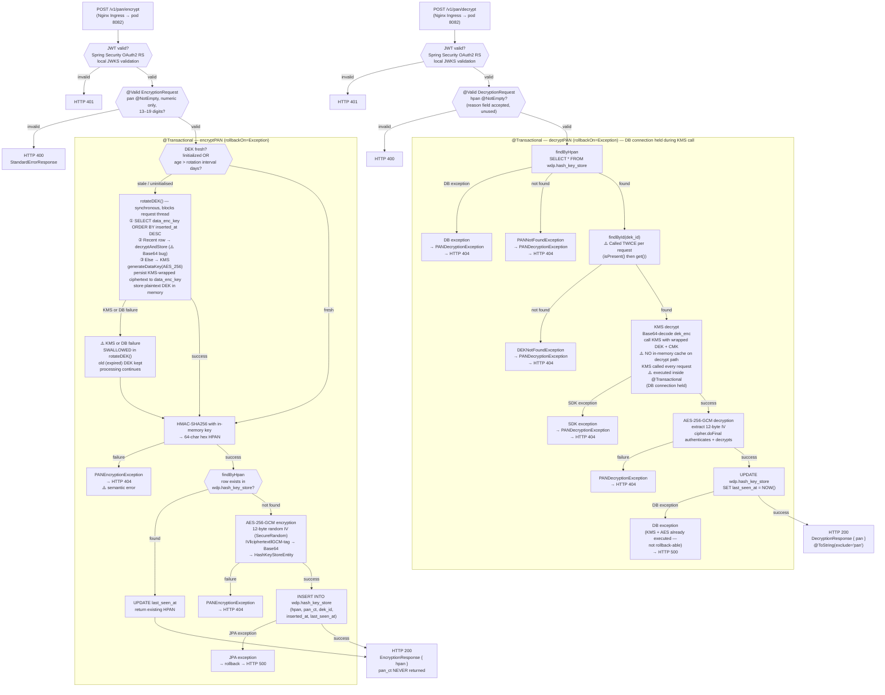

# WDP-COMP-35-ENCRYPTION-SERVICE
**Worldpay Dispute Platform — Component Reference**
*Version: 1.1 DRAFT | April 2026*
*Source-verified: 2026-04-29 via Copilot CLI on `wdp-encryption-service` | Architect-confirmed: PENDING*
*Supersedes v1.0 DRAFT (April 2026).*

---

## ━━━ CORE SKELETON ━━━━━━━━━━━━━━━━━━━━━━━━━━━━━━━━━━━━━━

---

## Identity

| Field | Value |
|---|---|
| **Name** | `EncryptionService` |
| **Type** | `REST API` |
| **Repository** | `wdp-encryption-service` |
| **Status** | `✅ Production` |
| **Doc status** | `📝 DRAFT` |
| **Sections present** | `Core \| Block A — REST` |
| **Runtime** | `Spring Boot 3.5.6 / Java 17` |
| **Port** | `8082` |
| **Context path** | `/merchant/gcp/encryption` |

---

## Purpose

**What it does**

EncryptionService is the sole component in WDP authorised to handle plaintext PAN (Primary Account Number). It is the PCI-DSS cryptographic boundary for the entire platform — no other service stores, processes, or transmits clear PAN in any form.

The service implements the two-token PAN strategy (DEC-007). On every encrypt call it produces two artefacts from the input PAN: an HPAN — a 64-character lowercase hex string generated via HMAC-SHA256 with a fixed key — and a `pan_ct` (ciphertext) — an AES-256-GCM-encrypted representation stored internally alongside the HPAN. The HPAN is returned to callers and used platform-wide for case lookups and matching. The ciphertext is never returned to any caller — it is held exclusively in this service's database and recovered only by this service when a decrypt is requested.

On decrypt, the service accepts an HPAN, locates the corresponding ciphertext and DEK reference in its own table, decrypts the wrapped DEK from AWS KMS, performs in-memory AES-256-GCM decryption, and returns the cleartext PAN to the caller transiently. Cleartext PAN is never written to any persistent store at any point.

The DEK is managed via an envelope-encryption model (DEC-008). AWS KMS holds the Customer Master Key (CMK). The service generates a plaintext DEK plus a KMS-wrapped ciphertext of that DEK; only the KMS-wrapped ciphertext is persisted (`wdp.data_enc_key`). The plaintext DEK is held in memory and used for all encrypt operations until the rotation interval elapses. The HMAC key is loaded once at startup from AWS Secrets Manager and held in memory for the JVM lifetime.

⚠️ **Design-document correction confirmed at source — DEK rotation interval is DAYS, not hours.** The platform-index document and DEC-008 narrative still describe a "6-hour DEK cache". Source confirms the unit is days, configured via `${dek_rotation_interval_days}`. No hardcoded default exists in any committed configuration profile.

**What it does NOT do**

- Does **not** return the AES ciphertext (`pan_ct`) to any caller. Only HPAN is ever returned on the encrypt path. Callers needing the actual PAN must call the decrypt endpoint with the HPAN.
- Does **not** handle JWT or network token tokenisation. PAN encrypt/decrypt only. JWT issuance and caching is COMP-36 TokenService.
- Does **not** produce to or consume from any Kafka topic. Confirmed absent — no Kafka client dependency, no listener, no template.
- Does **not** use the transactional outbox pattern. Synchronous REST API only.
- Does **not** technically restrict which callers may invoke the decrypt endpoint. The intent that only COMP-14 CaseCreationConsumer may decrypt is a **policy convention only** — there is no method-level authorization, no JWT scope/audience/role check, and no allowlist. Any caller bearing a valid JWT from a trusted issuer may call `/v1/pan/decrypt`.
- Does **not** cache the DEK on the decrypt path. KMS is called on every decrypt request to unwrap the stored DEK.
- Does **not** apply Resilience4j circuit breakers, rate limiters, bulkheads, or retry annotations on any outbound call. (DEC-014 is platform-VOID; absence here is consistent with platform posture.)
- Does **not** configure explicit REST connection or read timeouts on any outbound call (AWS KMS, AWS Secrets Manager, PostgreSQL).
- Does **not** enforce a UNIQUE constraint at the JPA entity level on `hpan`. Whether a DB-level unique index exists cannot be determined from this repository — no Liquibase / Flyway / `schema.sql` is present.
- Does **not** refresh the HMAC key after startup. Loaded once and held for the JVM lifetime.
- Does **not** include HPA, PodDisruptionBudget, or TopologySpread configuration.
- Does **not** enforce caller-identity restrictions on `/actuator/prometheus` or `/actuator/info` — these endpoints are exposed by the management server but are NOT in the security-config permit-all list, so they require JWT. (Corrected at v1.1 from v1.0 which incorrectly listed them as auth-whitelisted.)

---

## Internal Processing Flow



---

## Boundaries

### Inbound Interfaces

| Source | Protocol | Endpoint | Payload / Description |
|---|---|---|---|
| COMP-07 VisaDisputeBatch | REST (in-cluster) | `POST /merchant/gcp/encryption/v1/pan/encrypt` | Plaintext PAN from Visa dispute record |
| COMP-08 FirstChargebackBatch | REST (in-cluster) | `POST /merchant/gcp/encryption/v1/pan/encrypt` | Plaintext PAN from MC chargeback record |
| COMP-09 CaseFillingBatch | REST (in-cluster) | `POST /merchant/gcp/encryption/v1/pan/encrypt` | Plaintext PAN from case filling record |
| COMP-11 FileProcessor | REST (in-cluster) | `POST /merchant/gcp/encryption/v1/pan/encrypt` | Plaintext PAN from inbound dispute file |
| COMP-27 CaseSearchService (v2 search) | REST (in-cluster) | `POST /merchant/gcp/encryption/v1/pan/encrypt` | Raw PAN supplied by search caller — converts to HPAN for query filter |
| COMP-14 CaseCreationConsumer | REST (in-cluster) | `POST /merchant/gcp/encryption/v1/pan/decrypt` | HPAN — decrypt for transient acquiring-platform API call |
| Kubernetes liveness probe | HTTP | `GET /merchant/gcp/encryption/livez` | No auth |
| Kubernetes readiness probe | HTTP | `GET /merchant/gcp/encryption/readyz` | No auth |
| Prometheus scraper | HTTP + JWT | `GET /actuator/prometheus` | ⚠️ JWT-required (corrected at v1.1) |

> **Caller list is design-asserted only.** No artefact in the EncryptionService repository names these upstream callers. Cross-component verification is required to confirm each caller is present.

### Outbound Interfaces

| Target | Protocol | Resource | Purpose | On failure |
|---|---|---|---|---|
| AWS KMS | HTTPS (AWS SDK v2) | CMK ARN — region-only config, no explicit timeout | DEK generation (startup + rotation); DEK decryption on every decrypt request | Startup: silently swallowed → service starts degraded. Rotation: silently swallowed → old DEK retained. Decrypt: re-thrown → HTTP 404 |
| AWS Secrets Manager | HTTPS (AWS SDK v2) | HMAC key secret — region-only config, no explicit timeout | Load HMAC key once at startup | Startup: RuntimeException re-thrown from `@PostConstruct` → Spring context fails → pod crash-loops |
| PostgreSQL (`wdp` schema) | JDBC (HikariCP defaults) | `wdp.hash_key_store`, `wdp.data_enc_key` | HPAN idempotency, ciphertext storage, DEK record management, last-seen-at audit | Startup: swallowed → degraded. Encrypt: JPA exception → rollback → HTTP 500. Decrypt: caught and re-mapped → HTTP 404 |

---

## Database Ownership

### Tables Owned (written by this component)

| Schema.Table | Purpose | Key columns | Notes |
|---|---|---|---|
| `wdp.hash_key_store` | Maps HPAN → AES-256-GCM ciphertext (`pan_ct`) + DEK reference. Primary lookup table for both encrypt idempotency and decrypt recovery. | `id` (PK, sequence), `hpan` (64-char hex), `pan_ct` (Base64 IV‖ciphertext‖tag), `dek_id` (FK), `inserted_at`, `last_seen_at` | ⚠️ No `unique=true` on `hpan` at JPA level. DB-level unique index existence not determinable from repository. `pan_ct` never returned to any caller. |
| `wdp.data_enc_key` | KMS-wrapped (encrypted) DEK ciphertext per rotation cycle. Plaintext DEK is never persisted. | `dek_id` (PK, sequence `wdp.hash_key_store_dek_id_seq`), `dek_enc` (Base64 KMS-wrapped DEK), `inserted_at` | Written on first startup and on each rotation. `insertEncryptedDEK` runs in a Spring-Data default short transaction — separate from the surrounding `rotateDEK()` orchestration. |

### Tables Read (not owned)

None. Both tables accessed by this service are owned by this service.

**Transaction manager:** `wdpTransactionManager` (single PostgreSQL datasource, JPA-managed).

**Locking:** No `SELECT FOR UPDATE`, no PostgreSQL advisory locks, no ShedLock, no Redisson — confirmed absent across the codebase.

---

## Key Architectural Decisions

| Decision | ADR reference | Notes |
|---|---|---|
| Two-token PAN strategy — HPAN for lookup, ciphertext for recovery | DEC-007 ✅ Compliant | HPAN returned to callers; `pan_ct` held internally only. |
| Encrypt PAN at ingestion boundary | DEC-004 ✅ Compliant — with 🟢 LOW caveat | This service IS the DEC-004 enforcement point. PAN never persisted. `@ToString(exclude='pan')` on both request and response. ⚠️ **Caveat (new at v1.1):** `PANHashingServiceImpl` logs the last 4 PAN digits at DEBUG level. Production log level must remain INFO or above; DEBUG logging would expose partial PAN. |
| AWS KMS for key management | DEC-008 ✅ Compliant — with correction | CMK in AWS KMS. HMAC key in AWS Secrets Manager. **DEK rotation interval is DAYS** (configurable via `${dek_rotation_interval_days}`), not hours as stated in design documents. Correction must propagate to WDP-DECISIONS.md DEC-008 narrative and WDP-COMP-INDEX.md COMP-35 description. |
| No transactional outbox | DEC-001 — Not applicable | Synchronous REST API. No Kafka, no outbox. |
| No Kafka producer or consumer | DEC-003, DEC-005 — Not applicable | Confirmed absent at source. |
| No Resilience4j | DEC-014 — Platform-VOID | Recorded as factual context, not as a deviation. AWS SDK v2 default legacy retry (3 attempts) applies implicitly to KMS and Secrets Manager. |
| Decrypt caller not technically enforced | Local decision | Design intent: COMP-14 only. Actual enforcement: none. No method-level `@PreAuthorize`, no scope/role/audience check, no allowlist. Any valid JWT from a trusted issuer may call decrypt. |
| Synchronous DEK rotation on request thread | Local decision | When DEK freshness check fails, `rotateDEK()` runs synchronously on the encrypt request thread. The request blocks until KMS responds and the new DEK is stored. No background/async refresh. |
| KMS called on every decrypt request | Local decision | Decrypt path does NOT use the in-memory DEK cache. KMS is invoked per request, adding KMS latency to every decrypt. |
| Decrypt @Transactional spans the KMS call | Local decision — **NEW finding at v1.1** | The `@Transactional` boundary on `decryptPAN()` brackets the entire method, including the KMS network round-trip. A DB connection from the Hikari pool is held for the duration of the KMS call. Under sustained decrypt load with KMS slowdown, pool exhaustion risk is non-trivial. |
| DEK rotation failure silently swallowed | Local decision — **RISK** | KMS or DB failure during rotation is caught and logged but not re-thrown. Service continues with the expired DEK indefinitely — no hard failure, no alert path, no circuit breaker. |
| DEK startup failure silently swallowed | Local decision — **RISK** | KMS or PostgreSQL unavailability at startup leaves `initialized = false`. Probes do not check this flag. First encrypt attempt will trigger rotation and likely fail with HTTP 500. |
| HMAC startup failure crash-loops the pod | Local decision | Secrets Manager unavailability at `@PostConstruct` propagates a RuntimeException. Spring context fails. Pod crash-loops until Secrets Manager recovers. |

---

## Startup Behaviour

| Resource | Behaviour at startup | Failure outcome |
|---|---|---|
| HMAC key (Secrets Manager) | `@PostConstruct loadHMACKey()` — fetched once, held as in-memory bytes. Must be exactly 32 bytes; `IllegalStateException` thrown otherwise. | Secrets Manager unreachable: RuntimeException re-thrown → Spring context fails → pod crash-loops. |
| DEK (KMS + PostgreSQL) | `@PostConstruct initializeDEK()` — checks for an existing DEK row; if recent enough, decrypts via KMS; otherwise generates a new DEK and persists the wrapped ciphertext. | KMS or PostgreSQL unreachable: exception caught and swallowed. Service starts with `initialized = false`. Liveness/readiness probes pass. First encrypt request triggers rotation and likely fails with HTTP 500. |

---

## Risks

🔴 **HIGH — Single global dependency for all PAN ingestion paths**
Every dispute ingest path (COMP-07/08/09/11) depends on this service to encrypt PAN before any further processing. Unavailability of EncryptionService halts all inbound dispute processing platform-wide. There is no fallback, no degraded-mode persistence, and no client-side queue. Capacity, availability, and rolling-deploy posture for this service are platform-critical.

🔴 **HIGH — `rotateDEK()` Base64 bug on reuse path**
The branch in `rotateDEK()` that handles "recent existing DEK row found" passes the raw UTF-8 bytes of the Base64-encoded `dek_enc` string to KMS, instead of the Base64-decoded ciphertext bytes. This will cause KMS to reject the unwrap with `InvalidCiphertextException`. Active risk: a pod restart that occurs within the rotation interval — and finds a recent-enough row to reuse — will fail to unwrap that row and (because rotation failures are silently swallowed) start with `initialized = false`. Operations should be aware that pod restart hygiene during the rotation window is fragile.

🟡 **MEDIUM — Decrypt @Transactional holds DB connection during KMS call (NEW at v1.1)**
The `@Transactional` boundary on `decryptPAN()` brackets the entire method body, including the synchronous KMS network call. Each in-flight decrypt request holds a Hikari pool connection for the duration of the KMS round-trip (typically tens of milliseconds, but vulnerable to KMS slowdown). Under sustained decrypt load combined with KMS latency degradation, pool exhaustion can manifest before KMS itself begins to fail. Consider narrowing the transaction to the UPDATE only.

🟡 **MEDIUM — Multi-pod DEK rotation race condition**
No distributed lock guards the `rotateDEK()` path. Multiple pods may simultaneously call KMS `generateDataKey` and insert separate rows into `wdp.data_enc_key`. Each pod uses its own DEK. Records encrypted by different pods coexist correctly on decrypt (each `hash_key_store` row carries its own `dek_id`), but DEK row proliferation is uncontrolled. Source code carries an explicit comment acknowledging the race.

🟡 **MEDIUM — No UNIQUE constraint on `hpan` (concurrent duplicate INSERT race)**
The JPA entity declares no `unique=true` on `hpan`. Whether a DB-level unique index exists cannot be determined from this repository. Without it, two concurrent encrypt requests for the same PAN can both pass the `findByHpan` idempotency check before either commits and produce two rows for the same HPAN with different `pan_ct` values. Subsequent `findByHpan` is non-deterministic. The encrypt method is `@Transactional` but the transaction does not protect across pods.

🟡 **MEDIUM — HTTP 404 returned for crypto failures (semantic error)**
`GlobalExceptionHandler` maps both `PANEncryptionException` and `PANDecryptionException` to HTTP 404. A crypto failure is not "resource not found". Callers cannot distinguish "HPAN not in database" from "AES failed" from "KMS unavailable" via HTTP status alone — all four conditions on decrypt collapse to 404.

🟡 **MEDIUM — `DEKServiceImpl.findById()` double query**
On the decrypt path, `findById(id)` is called twice — once for `isPresent()` and once for `get()`. Two identical SELECTs against `wdp.data_enc_key` per decrypt request. Performance impact under decrypt load.

🟡 **MEDIUM — DEK startup failure silently swallowed**
KMS or PostgreSQL unavailability at pod startup leaves the service in a broken-but-Healthy state. Kubernetes probes pass; first encrypt request fails. Probe contracts do not include a DEK initialisation check.

🟡 **MEDIUM — DEK rotation failure silently swallowed**
Rotation failure leaves the service running with an expired DEK and no alert. The rotation interval is days — silent expiry is a long-window operational risk.

🟡 **MEDIUM — Unused OAuth2 client dependency**
`spring-boot-starter-oauth2-client` is present and a client manager bean is registered as `wdp-internal-auth`, but no outbound HTTP client uses it. Dead code or unbuilt scaffolding. Increases classpath and attack surface.

🟢 **LOW — `EncryptionKeys.java` dead code**
A `@Component` with three String fields, never populated, never injected. Should be removed.

🟢 **LOW — `PANHashingServiceImpl` last-4 PAN at DEBUG**
Last-4 digits of clear PAN are written to log at DEBUG level. Production log level must remain INFO or above. Risk is operational (log-level governance), not architectural.

🟢 **LOW — `GlobalExceptionHandler` TODO**
A `// TODO` comment in the `METHOD_NOT_ALLOWED` handler indicates an incomplete error-target string. No functional impact confirmed.

🟢 **LOW — Dead configuration keys**
`logger.level` and `logstash.server.host.port` are declared in `application.yaml` but no bean injects them and no `logback.xml` / `logback-spring.xml` consumes them. The structured-log Logstash route therefore depends entirely on whatever Logback defaults the Spring Boot starter provides.

---

## ━━━ TYPE BLOCK A — REST API CONTRACTS ━━━━━━━━━━━━━━━━━━━

---

## REST API Contracts

**Framework:** Spring Boot 3.5.6 (Spring MVC)
**Port:** 8082
**Context path:** `/merchant/gcp/encryption`
**Auth model:** Bearer JWT validated by Spring Security OAuth2 Resource Server (`JwtIssuerAuthenticationManagerResolver`). Service validates tokens itself against the configured JWKS URI (`${jwt_trusted_issuer_urls}` — production issuer `https://login8.fiscloudservices.com/...`). No gateway delegation. No method-level authorization — any valid token from a trusted issuer is accepted on every authenticated endpoint.

**Auth whitelist (no token required):**
- `/merchant/gcp/encryption/health`
- `/merchant/gcp/encryption/actuator/health`
- `/merchant/gcp/encryption/readyz`
- `/merchant/gcp/encryption/livez`
- `/encryptionservice-api-docs`
- `/encryptionservice-api-docs/swagger-config`
- `/swagger-ui/**`

> ⚠️ **v1.1 correction:** `/actuator/prometheus` and `/actuator/info` are exposed by the management server but are NOT on the permit-all list. They require a valid JWT. Prometheus scrape configuration must include a token, or the path must be added to the whitelist.

---

### Endpoint 1: `POST /v1/pan/encrypt`

**Full path:** `POST /merchant/gcp/encryption/v1/pan/encrypt`

**Auth:** Bearer JWT — validated before controller invocation. No per-caller identity enforcement.

**Request body:**

| Field | Type | Constraints |
|---|---|---|
| `pan` | String | Required; numeric only (`^[0-9]*$`); length 13–19 digits |

**Response body — HTTP 200:**

| Field | Type | Description |
|---|---|---|
| `hpan` | String | 64-character lowercase hex HMAC-SHA256 of the PAN. The AES ciphertext is never returned. |

**HTTP status codes:**

| Status | Trigger |
|---|---|
| 200 | New PAN encrypted, OR HPAN already exists (idempotent return of existing HPAN) |
| 400 | Bean-validation failure: `pan` missing, non-numeric, or out of length range |
| 401 | Missing or invalid JWT |
| 404 | `PANEncryptionException` thrown during AES encryption — ⚠️ semantic error |
| 500 | KMS rotation failure surfaced to caller, DB failure, or any other RuntimeException |

**Error response body:**
```
{ "errors": [ { "errorMessage": "<message>", "target": "<field>" } ] }
```

**Idempotency:** Same PAN submitted multiple times always returns the same HPAN. If a row exists for the computed HPAN, `last_seen_at` is updated and the existing HPAN is returned. No new ciphertext is generated. The idempotency check + write are wrapped in a single `@Transactional` boundary, which protects within a pod but not across pods (no DB-level UNIQUE on `hpan` at the JPA level; DB-level constraint not verifiable from repo).

**Known callers (design-asserted):** COMP-07 VisaDisputeBatch, COMP-08 FirstChargebackBatch, COMP-09 CaseFillingBatch, COMP-11 FileProcessor, COMP-27 CaseSearchService (v2 search path).

---

### Endpoint 2: `POST /v1/pan/decrypt`

**Full path:** `POST /merchant/gcp/encryption/v1/pan/decrypt`

**Auth:** Bearer JWT — same validation as encrypt. **No per-caller identity enforcement.** Design intent: COMP-14 only. Technical enforcement: none.

**Request body:**

| Field | Type | Constraints |
|---|---|---|
| `hpan` | String | Required (`@NotEmpty`) |
| `reason` | String | Optional — accepted but never read; not used for authorization, audit, or routing |

**Response body — HTTP 200:**

| Field | Type | Description |
|---|---|---|
| `pan` | String | Cleartext PAN recovered via AES-256-GCM decryption. `@ToString(exclude="pan")` prevents PAN appearing in any toString() serialisation. |

**HTTP status codes:**

| Status | Trigger |
|---|---|
| 200 | PAN decrypted successfully |
| 400 | `hpan` blank or missing |
| 401 | Missing or invalid JWT |
| 404 | HPAN not found in DB; DEK not found in DB; KMS decrypt failed; AES decrypt failed — all four collapse to `PANDecryptionException` → 404. ⚠️ Caller cannot distinguish via HTTP status alone. |
| 500 | `last_seen_at` UPDATE failure, or any other RuntimeException |

**Error response body:** Same `{ "errors": [...] }` structure as encrypt.

**Idempotency:** None. Same HPAN may be decrypted unlimited times. No one-time-use, no rate limit, no consume-on-read. Each call updates `last_seen_at` and returns the same PAN.

**Transaction boundary:** ⚠️ The method is `@Transactional`, and the boundary covers the KMS network call. A Hikari connection is held for the duration of the KMS round-trip on every decrypt request.

**Known callers (design-asserted):** COMP-14 CaseCreationConsumer only.

---

### Endpoints 3–5: Kubernetes probes / Actuator (no auth)

| Path | Method | Description |
|---|---|---|
| `GET /merchant/gcp/encryption/livez` | GET | Liveness probe — Spring Boot health group |
| `GET /merchant/gcp/encryption/readyz` | GET | Readiness probe — Spring Boot health group |
| `GET /merchant/gcp/encryption/health` (and `/actuator/health`) | GET | Spring Actuator health |

**Probe configuration:**
- Liveness: initial 30 s, period 10 s, timeout 5 s, failure threshold 3
- Readiness: initial 20 s, period 10 s, timeout 5 s, failure threshold 3

⚠️ Neither probe inspects the DEK initialisation flag. A pod that started with `initialized = false` (KMS or PostgreSQL unavailable at boot) passes both probes and receives traffic while unable to process encrypt requests.

---

### Endpoints 6–8: Actuator metrics & info (JWT required — corrected at v1.1)

| Path | Method | Description |
|---|---|---|
| `GET /actuator/prometheus` | GET | Prometheus scrape — ⚠️ JWT required |
| `GET /actuator/info` | GET | Application info — ⚠️ JWT required |

---

### Endpoints 9–11: OpenAPI / Swagger (no auth)

| Path | Description |
|---|---|
| `GET /encryptionservice-api-docs` | OpenAPI JSON spec |
| `GET /encryptionservice-api-docs/swagger-config` | Swagger UI configuration |
| `GET /swagger-ui/**` | Swagger UI |

---

## Scaling and Deployment

| Attribute | Value | Source |
|---|---|---|
| Kubernetes resource type | `Deployment` | `resources.yaml` |
| Replica count | `{{ replicas-wdp-encryption-service }}` — templated; no default in repo | `resources.yaml` |
| Memory limit | `2048Mi` | `resources.yaml` |
| Memory request | `1024Mi` | `resources.yaml` |
| CPU limit | Not configured | `resources.yaml` |
| CPU request | Not configured | `resources.yaml` |
| HPA | Not configured | absent from manifests |
| Rolling update — maxSurge | `1` | `resources.yaml` |
| Rolling update — maxUnavailable | `0` | `resources.yaml` |
| `minReadySeconds` | `30` | `resources.yaml` |
| PodDisruptionBudget | Not configured | absent |
| Topology spread | Not configured | absent |
| Service type | `ClusterIP` exposed via Nginx Ingress with TLS | `resources.yaml` |
| mTLS / backend re-encryption | Not configured (TLS terminates at Ingress) | `resources.yaml` |
| Liveness probe | `GET /merchant/gcp/encryption/livez` — initial 30 s, period 10 s, timeout 5 s, threshold 3 | `resources.yaml` |
| Readiness probe | `GET /merchant/gcp/encryption/readyz` — initial 20 s, period 10 s, timeout 5 s, threshold 3 | `resources.yaml` |
| Startup probe | Not configured | `resources.yaml` |
| OpenTelemetry | OTel Java agent injected via pod annotation `instrumentation.opentelemetry.io/inject-java` | `resources.yaml` |
| Spring Actuator | `info`, `health`, `prometheus` exposed (`info` and `prometheus` JWT-required) | `application.yaml` |
| Logback | No `logback.xml` / `logback-spring.xml` in repo. Logstash encoder dependency present in `pom.xml`. Structured-log routing depends on starter defaults plus injected configuration; not verifiable from repository alone. | `pom.xml` |

**Files present in repo:** `resources.yaml` (Deployment + Service + Ingress), `Jenkinsfile`, `deployit-manifest.xml`, `pom.xml`, `application.yaml` + profile YAMLs.
**Files NOT in repo:** Helm chart, `values.yaml`, Dockerfile, HPA manifest, PDB manifest, `logback.xml`, DB migration scripts (Liquibase / Flyway / `schema.sql`).

---

## Planned and Incomplete Work

### Commented-out code
None found in Java sources.

### TODOs and FIXMEs
One `// TODO` in `GlobalExceptionHandler` referencing the `METHOD_NOT_ALLOWED` error target string. No further context.

### Feature flags / migration flags
None. No feature-flag framework present.

### Stub implementations
None. All service implementations are functional.

### Unused dependencies / dead code
- `spring-boot-starter-oauth2-client` — client manager registered as `wdp-internal-auth`. No outbound HTTP client (`RestTemplate`, `WebClient`, `FeignClient`) uses it. Dead code or scaffolding for a future integration.
- `EncryptionKeys` `@Component` — three String fields, never populated, never injected. Dead code.
- `logger.level` and `logstash.server.host.port` config keys — declared in YAML, no consumer in repo.

---

## Deviation Flags

| Decision | Status | Severity | Notes |
|---|---|---|---|
| **DEC-001** Transactional outbox | ✅ NOT APPLICABLE | — | No Kafka, no async publish, no outbox table. |
| **DEC-003** Kafka partition key = merchantId | ✅ NOT APPLICABLE | — | No Kafka. |
| **DEC-004** PAN encryption boundary | ✅ COMPLIES — 🟢 LOW caveat | 🟢 LOW | Service IS the DEC-004 boundary. ⚠️ Caveat: `PANHashingServiceImpl` logs last-4 PAN at DEBUG. Production log level must remain INFO or higher. |
| **DEC-005** Kafka offset | ✅ NOT APPLICABLE | — | No Kafka. |
| **DEC-019** Clear PAN written | ✅ COMPLIES | — | No clear PAN persisted. Only `hpan` and `pan_ct` stored. |
| **DEC-020** Idempotency | ⚠️ PARTIAL | 🟡 MEDIUM | In-memory `findByHpan` check inside `@Transactional`, but no DB-level UNIQUE on `hpan` verifiable from repo. Multi-replica concurrent-INSERT race exists. |
| **DEC-008** AWS KMS — design narrative | ⚠️ DOC CORRECTION | 🟡 MEDIUM | DEK rotation interval is **days**, not hours. Correction must propagate to DEC-008 narrative, COMP-INDEX, and ARCHITECTURE. |
| REST convention — crypto failure → 404 | ⛔ DEVIATES | 🟡 MEDIUM | `PANEncryptionException` and `PANDecryptionException` mapped to HTTP 404. Should be HTTP 500 (or distinct 404 for "HPAN not in DB" and 500 for crypto failure). Callers cannot distinguish. |

(DEC-014 Resilience4j — platform-VOID. Absence is recorded as factual context, not as a deviation, per WDP-DECISIONS.md v2.1.)

---

## Remaining Gaps

| Gap | What is missing | Resolution path |
|---|---|---|
| UNIQUE index on `wdp.hash_key_store.hpan` | No JPA `unique=true`. No migration scripts in repo. DB-level state unknown. | DBA confirmation. |
| UNIQUE / additional indexes on `wdp.data_enc_key` | JPA declares `dek_id` PK only. No migration scripts in repo. | DBA confirmation. |
| Production replica count | Template variable only; no default in repo. | Confirm from XL Deploy with ops team. |
| DEK rotation interval — production value | No hardcoded default in any committed YAML. | Confirm from K8s secret / env config with ops team. |
| Log pipeline PAN assurance | No HTTP request-body logging filter, MDC writer, or `spring.mvc.log-request-details` setting found in repo. External log pipeline (Logstash target) PAN scrubbing posture not visible from this repo. | Ops / platform team confirmation. |
| Production JWKS issuer URL | `application-prod.yaml` carries `jwk-set-uri` for resource server; `jwt.trustedIssuers` list is still env-injected. | Ops confirmation of injected value. |
| AWS region, KMS CMK ARN, HMAC secret name | All env-injected. | Ops confirmation. |
| HikariCP pool size in production | All settings at defaults; runtime overrides via env not visible. | Ops confirmation. |
| Decrypt caller verification | Caller list is design-asserted. No artefact in this repo names callers. | Cross-component verification (audit COMP-14 source for the decrypt call). |

---

*End of WDP-COMP-35-ENCRYPTION-SERVICE.md v1.1 DRAFT.*
*Architect confirmation: PENDING.*
*Update WDP-COMP-INDEX.md COMP-35 description to remove "6-hour DEK cache" claim after this revision is accepted.*
