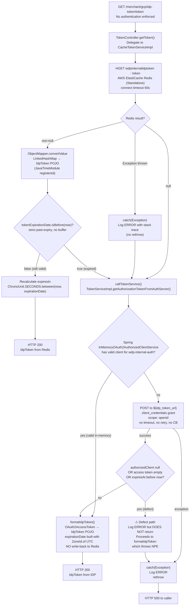

# WDP-COMP-36-TOKEN-SERVICE
**Worldpay Dispute Platform — Component Reference**
*Version: 1.1 DRAFT | April 2026*
*Extracted from: `wdp-idp-token-service` using GitHub Copilot CLI | Source-verified: 2026-04-29 | Architect-confirmed: PENDING*

---

## ━━━ CORE SKELETON ━━━━━━━━━━━━━━━━━━━━━━━━━━━━━━━━━━━━━━
*Mandatory for every component regardless of type.*

---

## Identity

| Field                | Value                                                          |
|----------------------|----------------------------------------------------------------|
| **Name**             | `TokenService`                                                 |
| **Type**             | `REST API`                                                     |
| **Repository**       | `wdp-idp-token-service`                                        |
| **Namespace**        | `gcp-ff` (Jenkinsfile confirmed) — image: `frauddispute/globalswitch/wdp-idp-token-service` |
| **Stack**            | Java 17 · Spring Boot 3.5.6 · Spring Security OAuth2 · Spring Data Redis (Jedis) · Kubernetes |
| **Status**           | `✅ Production`                                                |
| **Doc status**       | `📝 DRAFT — source-verified 2026-04-29, architect confirmation pending` |
| **Sections present** | `Core \| Block A (REST)`                                       |

---

## Purpose

**What it does**

TokenService is the centralised JWT token management service for the Worldpay
Dispute Platform. It exposes a single REST endpoint —
`GET /merchant/gcp/idp-token/token` — which returns a valid JWT obtained via
the OAuth2 `client_credentials` grant against the enterprise IDP.

The service operates a two-layer cache strategy. The primary cache is an AWS
ElastiCache Redis hash (`wdpinternalidptoken:token`), which is read on every
request. If a non-expired token is found, it is returned immediately — no IDP
call is made. If the Redis entry is absent, expired, or unreadable, the
service falls through to a secondary in-memory cache maintained by Spring's
`InMemoryOAuth2AuthorizedClientService` within the same JVM. If the in-memory
store also holds no valid token, Spring issues a `client_credentials` POST to
the IDP endpoint and caches the result in-memory only. There is no write-back
to Redis — this service is read-only with respect to ElastiCache.

All WDP consumers and batch jobs are intended to call TokenService to obtain
JWT tokens for making authenticated outbound API calls. This eliminates the
need for every component to implement its own IDP integration.

**Critical architectural finding:** The Redis hash `wdpinternalidptoken:token`
must be written by an external component that is NOT present in this
repository. Source-verification confirms zero write operations to this key
from this codebase. If the external writer is absent or fails, every request
becomes a Redis miss and every token request falls through to IDP directly.
The identity of this external writer is an open question.

**What it does NOT do**

- Does **not** handle PAN tokenisation in any form — this service is JWT
  management only. PAN tokenisation is the responsibility of COMP-35
  EncryptionService.
- Does **not** write to ElastiCache — it is read-only on Redis. Confirmed
  by exhaustive source scan: no `HSET`, no `opsForHash().put`, no
  `redisTemplate.execute` write path exists anywhere in the codebase.
- Does **not** enforce any authentication on its own inbound endpoint — the
  `SecurityConfig` builds an empty Spring Security filter chain. Any client
  reachable on the Kubernetes ClusterIP service on port 8082 can call it.
- Does **not** connect to any relational database. No JPA, no JDBC, no
  `DataSource` bean, no `@Repository`, no entity, no SQL.
- Does **not** publish to or consume from any Kafka topic. No `spring-kafka`
  on the classpath.
- Does **not** apply any per-caller routing, per-scope routing, or
  platform-specific paths (NAP / PIN / CORE / VAP / LATAM). It manages
  exactly one token type and one OAuth2 registration (`wdp-internal-auth`).
- Does **not** implement Resilience4j circuit breakers on any outbound call.
- Does **not** retry on Redis failure or IDP failure.
- Does **not** return a stale token if IDP is unavailable — the caller
  receives HTTP 500.
- Does **not** use Spring's Cache abstraction (`@EnableCaching`,
  `@Cacheable`, `CacheManager`). The Redis cache is consulted manually
  via `RedisTemplate.opsForHash().get(...)`.

---

## Internal Processing Flow



**Important flow notes:**

- Redis is **always consulted first** — there is no path that bypasses the
  Redis HGET.
- The warm cache-hit path (Redis non-null + not expired) short-circuits
  entirely; Spring OAuth2 is never invoked.
- Expiry threshold is **strict past-expiry** — a token expiring in one
  second is not refreshed until it has actually passed. There is no
  lead-time buffer. A token whose `expirationDate` exactly equals `now`
  is treated as VALID, not expired.
- Redis stores the token as a Jackson-serialised object. On HGET the value
  is already a `LinkedHashMap`; deserialisation uses
  `ObjectMapper.convertValue(...)` (Map → POJO) — **not** a JSON-string
  read. This is why a `JavaTimeModule` registration is required.
- After IDP fetch, the resulting `IdpToken` is returned to the caller but
  **never written to Redis**. Redis is populated only by the unknown
  external writer.
- `expiresIn` is **recalculated on every response** from the stored
  `expirationDate` — the caller always receives a freshly computed
  seconds-remaining value.
- The `authorizedClient`-null branch logs an error but does **not** return.
  Execution falls through to the formatting step which dereferences the
  null and throws NPE. The NPE propagates as HTTP 500. See Risks (LATENT
  NPE).
- All `LocalDateTime` comparisons use `LocalDateTime.now()` (JVM default
  timezone). The IDP-fetch path constructs `expirationDate` using
  `ZoneId.of("UTC")`. If the JVM timezone is not UTC, expiry comparisons
  on the IDP-fetched path are off by the JVM-vs-UTC offset. See Risks
  (TIMEZONE).

---

## Boundaries

### Inbound Interfaces

| Source | Protocol | Endpoint / Topic / Trigger | Payload / Description |
|--------|----------|----------------------------|-----------------------|
| All WDP consumers and batch jobs | REST (HTTP GET) | `GET /merchant/gcp/idp-token/token` | No request body, no query params, no path variables. No authentication enforced. |

*Known callers are NOT determinable from this repository alone. Jenkinsfile
namespace is `gcp-ff` (frauddispute team). All WDP components making
authenticated outbound calls are the intended callers. A consumer list is
not maintained in this codebase. The README contains only the title
`# wdp-idp-token-service`.*

### Outbound Interfaces

| Target                    | Protocol          | Resource                                        | Purpose                                          | On failure                                      |
|---------------------------|-------------------|-------------------------------------------------|--------------------------------------------------|-------------------------------------------------|
| AWS ElastiCache (Redis)   | Redis (Jedis — Standalone) | Hash key: `wdpinternalidptoken`, field: `token` | Read cached JWT token                           | Exception caught → log ERROR → fall through to IDP path. No retry. No circuit breaker. |
| IDP Token Endpoint        | HTTPS (OAuth2 `client_credentials`) | `${idp_token_url}` (env var) | Obtain fresh JWT when Redis cache is cold or expired | Exception caught → log ERROR → re-thrown → HTTP 500 to caller. No retry. No circuit breaker. |

---

## Database Ownership

### Tables Owned (written by this component)

This component owns no relational database state. It is stateless with
respect to all relational databases. No JPA/JDBC dependency is present in
`pom.xml`. No `DataSource` configuration, no `@Repository`, no entity
class, and no SQL query exist in the source tree.

The component's only persistent-store dependency is AWS ElastiCache (Redis),
which it reads but does **not** write. See WDP-DB.md for the ElastiCache
entry.

### Tables Read (not owned by this component)

This component reads from no relational database tables.

---

## Configuration and Scaling

| Parameter              | Value                                                        | Notes                                                                          |
|------------------------|--------------------------------------------------------------|--------------------------------------------------------------------------------|
| **Replica count**      | `{{ replicas-wdp-idp-token-service }}`                      | XL Deploy / Helm placeholder. No default in repo. Exact production value not determinable from source. |
| **HPA**                | None                                                         | No `HorizontalPodAutoscaler` manifest in `resources.yaml`.                    |
| **Memory request**     | 1024Mi                                                       | Confirmed from `resources.yaml`.                                               |
| **Memory limit**       | 2048Mi                                                       | Confirmed from `resources.yaml`.                                               |
| **CPU request**        | Not set                                                      | CPU section absent from `resources.yaml`. Best-effort QoS class on CPU.        |
| **CPU limit**          | Not set                                                      | CPU section absent from `resources.yaml`.                                      |
| **Deployment type**    | Kubernetes `Deployment`                                      | Continuously running JVM.                                                      |
| **Rollout strategy**   | `RollingUpdate` — maxSurge: 1, maxUnavailable: 0            | One extra pod created before any old pod is removed.                          |
| **`minReadySeconds`**  | `30` — ⚠ **mis-indented under `spec.template.spec` (PodSpec) instead of `spec` (DeploymentSpec)** | **Silently ignored by Kubernetes.** PodSpec has no `minReadySeconds` field. The 30-second rollout stability gate is **not actually applied at runtime** — new pods are considered Ready as soon as the readiness probe passes. Same defect class previously confirmed on COMP-25, COMP-28, COMP-34. New finding 2026-04-29. |
| **PodDisruptionBudget**| None                                                         | No PDB manifest in `resources.yaml`. Voluntary disruptions can take all replicas down simultaneously. |
| **Topology spread**    | maxSkew: 1, whenUnsatisfiable: `ScheduleAnyway`, topologyKey: `kubernetes.io/hostname` | Selector label `app: wdp-idp-token-service${BRANCH_NAME_PLACEHOLDER}` matches pod template label. **No label mismatch.** Advisory only — not a hard guarantee. |
| **Container port**     | 8082                                                         | Confirmed from pod spec and Service `targetPort`.                              |
| **Service type**       | ClusterIP on port 8082                                       |                                                                                |
| **Liveness probe**     | HTTP `GET /merchant/gcp/idp-token/livez` on port 8082       | initialDelaySeconds 15, periodSeconds 10, timeoutSeconds 5, failureThreshold 3 |
| **Readiness probe**    | HTTP `GET /merchant/gcp/idp-token/readyz` on port 8082      | initialDelaySeconds 10, periodSeconds 10, timeoutSeconds 5, failureThreshold 3 |
| **Startup probe**      | **Absent**                                                   | No `startupProbe` in `resources.yaml`. Slow-startup edge cases (e.g. IDP unreachable on warm-up) handled implicitly by liveness initialDelay only. |
| **Health probe path naming** | Service-prefixed via Spring Boot health groups        | `management.endpoint.health.group.{liveness,readiness}.additional-path: server:/livez|/readyz`. Final paths are `/merchant/gcp/idp-token/livez` and `.../readyz`. |
| **Observability — OTel**     | Java agent injected                                    | `instrumentation.opentelemetry.io/inject-java: opentelemetry-operator-system/default` |
| **Observability — Actuator** | `info`, `health`, `prometheus` exposed                 | `show-details: never`. Both probes served on application port 8082, not a separate management port. |
| **Observability — Logstash** | `logstash-logback-encoder` v7.4 present                | `LogstashTcpSocketAppender` to `${LOGSTASH_SERVER_HOST_PORT}` (from `logstash.server.host.port` property). `keepAliveDuration: 5 minutes`. Two hardcoded destinations `10.43.145.125:5044` are commented out in `logback-spring.xml` (legacy, inactive). |
| **Spring profiles**          | Single `application.yml` only                          | No profile-specific YAMLs (`application-dev.yml`, `-stg.yml`, `-prod.yml` etc.) in repo. `spring.profiles.active` not set in source — driven entirely by environment variables. `logback-spring.xml` references `${ENV_DETAIL}` which would be empty unless externally set. |
| **Ingress**            | Nginx — 2 host entries                                       | External: `{{ hostName }}/merchant/gcp/idp-token`. Internal: `{{ internalhostName }}/merchant/gcp/idp-token` (note **lowercase `h`** — this is the actual placeholder casing in repo). CORS enabled with permissive nginx defaults. TLS via `{{ ingressTLSsecretName }}`. |

**Secrets inventory** — three K8s secrets are mounted via `envFrom.secretRef`
in `resources.yaml`. Exact key-to-secret mapping is not explicit in source
because `envFrom.secretRef` injects all keys from a secret as environment
variables; the secret manifests themselves are not in this repo:

| Secret name                  | Likely env vars consumed                                                                              | Purpose                  |
|------------------------------|-------------------------------------------------------------------------------------------------------|--------------------------|
| `wdp-token-service-secrets`  | `idp_client_id`, `idp_client_secret`, `idp_token_url`, `redis_host`, `redis_port`, `redis_ssl_enabled`| Service-specific secrets |
| `wdp-common-secrets`         | `trusted_issuers`, `logstash_server_host_port`, `log_level`, `max_req_header_size`, possibly `app.name` | Shared platform secrets |
| `{{ ingressTLSsecretName }}` | TLS certificate / key (unusual that this is mounted as `envFrom`)                                     | TLS termination — placement looks anomalous; may be a manifest defect. See Risks. |

**Manifest inventory:** `resources.yaml`, `Jenkinsfile`, `pom.xml`,
`application.yml`, `logback-spring.xml`, `README.md` (title only). **No
Dockerfile** (image built via kpack `jammy-base` cloud-native buildpack).
**No Helm chart, no values.yaml.** **No HPA, no PDB.** **No
`application-{env}.yml` profile files.**

---

## Key Architectural Decisions

| Decision | ADR reference | Notes |
|----------|---------------|-------|
| Centralised JWT management — single service rather than per-component IDP integration | Local decision (candidate ADR) | Eliminates duplicated `client_credentials` grant logic across all consumers and batch jobs. Single blast radius if service is unavailable. |
| ElastiCache Redis as shared JWT cache across pods | Local decision (candidate ADR) | Allows any pod to serve a warm cache hit written by the external Redis writer. **No write is ever performed by this service** — Redis is read-only from this service's perspective. |
| Spring `InMemoryOAuth2AuthorizedClientService` as second-tier cache | Local decision | In-process JVM cache, lost on pod restart. Provides per-pod single-flight against IDP within a token's lifetime, but no cross-pod coordination. |
| No authentication on the inbound endpoint | Local decision | `SecurityConfig` builds an empty Spring Security filter chain. The endpoint is unauthenticated. Swagger documents a Bearer JWT requirement but this is metadata only, not enforced. Any pod-reachable client can call the token endpoint. |
| No Resilience4j on any outbound call | DEC-014 — DEVIATION | Neither the Redis client nor the IDP HTTP client is wrapped with a circuit breaker. Resilience4j is absent from `pom.xml`. Redis failure silently falls through to IDP. IDP failure propagates as HTTP 500. Consistent with platform-wide DEC-014 VOID posture. |
| No write-back to Redis after IDP fetch | Local decision | The service is architecturally read-only on Redis. The Redis hash is populated by an external process not present in this repository. The identity of that writer is an open question. |
| Strict past-expiry threshold — no lead-time buffer | Local decision | Token refresh triggered only when `tokenExpirationDate.isBefore(now)`. A token expiring in one second is served from cache and not refreshed until it has actually expired. |
| Manual Redis HGET — no Spring Cache abstraction | Local decision | No `@EnableCaching`, `@Cacheable`, `CacheManager`, or cache-abstraction wiring anywhere in source. The cache is treated as a low-level data store, not a transparent cache layer. |

---

## Risks and Constraints

**Severity scale:** 🔴 HIGH — data loss, security breach, complete processing
halt, PCI violation · 🟡 MEDIUM — degraded throughput, incorrect behaviour
under load, partial failure · 🟢 LOW — latent bug, misleading log, dead-code
risk.

| Severity | Risk | Consequence |
|----------|------|-------------|
| 🔴 HIGH | **Unknown external Redis writer** — the Redis hash `wdpinternalidptoken:token` must be populated by a component not present in this repository. Source-verified zero-write status. If that writer is absent, misconfigured, or fails, every request to TokenService is a Redis miss and every token request goes directly to IDP. | Increased IDP load. If IDP is also unavailable, all WDP components making outbound authenticated API calls receive HTTP 500 from TokenService — platform-wide authentication failure. |
| 🔴 HIGH | **No Resilience4j on IDP call (DEC-014 deviation)** — IDP failure throws an unguarded exception to the caller. Under IDP unavailability all callers get HTTP 500 with no graceful degradation. | Any WDP component that calls TokenService in a critical path will fail hard, with no backoff, no retry, and no queued retry mechanism. |
| 🔴 HIGH | **TokenService unavailability = platform-wide auth failure** — all WDP consumers and batch jobs that call TokenService to get a JWT for outbound API calls lose authentication capability if this service is down. No per-component fallback exists. | Mass processing halt across any component that depends on outbound authenticated calls. |
| 🔴 HIGH | **Timezone-sensitive expiry comparison** — `formatIdpToken()` constructs `expirationDate` using `ZoneId.of("UTC")` but every comparison and `expiresIn` recalculation uses `LocalDateTime.now()` (JVM default timezone). No `TZ` env var, no `user.timezone` JVM arg, no `spring.jackson.time-zone` setting in source. No Dockerfile in repo (kpack `jammy-base` builder). | If JVM timezone is not UTC, expiry checks on IDP-fetched tokens are off by the JVM-vs-UTC offset. A token can be considered valid while expired (or vice versa) depending on the host time zone. Correctness depends on the buildpack base image setting `TZ=UTC` — not verifiable from this source repo. New finding 2026-04-29. |
| 🟠 HIGH | **Thundering herd on pod cold start** — no distributed lock, no single-flight mechanism, no Redisson-based coordination on IDP calls. If N pods restart simultaneously (e.g. rolling deployment) and the Redis cache is cold or just expired, each pod independently calls IDP in parallel. | N simultaneous `client_credentials` POSTs to IDP. IDP rate limiting could cause failures across all pods simultaneously, compounding the cold-start problem. |
| 🟡 MEDIUM | **No HTTP timeouts on IDP client** — Spring's default `RestTemplate`-based `DefaultClientCredentialsTokenResponseClient` is used with no connection or read timeout configured. | A hung IDP response holds a Tomcat thread indefinitely. Under concurrent load or a slow IDP, thread pool exhaustion is possible. |
| 🟡 MEDIUM | **Redis connection timeout is 60 seconds** — an unresponsive Redis will block the request thread for up to 60 seconds before falling through to IDP. | Tomcat thread held for up to 60 seconds per request during Redis unavailability. Under concurrent load this can exhaust the thread pool while silently degrading to IDP. |
| 🟡 MEDIUM | **In-memory OAuth2 token lost on pod restart** — Spring's `InMemoryOAuth2AuthorizedClientService` stores the authorised client in a `ConcurrentHashMap` in JVM heap. State is lost on pod restart or rolling update. | Every restarted pod must call IDP on its first cache-miss request. Combined with the thundering herd risk above, rolling updates increase IDP load. |
| 🟡 MEDIUM | **`minReadySeconds: 30` silently ignored by Kubernetes** — the field is mis-indented under `spec.template.spec` (PodSpec, which has no such field) instead of `spec` (DeploymentSpec). New pods are considered Ready as soon as the readiness probe passes — the 30-second rollout stability gate is not applied. Same defect class as COMP-25, COMP-28, COMP-34. | Rolling updates can churn pods faster than intended. Combined with the in-memory OAuth2 store loss on restart and the thundering-herd risk, rolling deployments produce a measurable burst of IDP traffic. New finding 2026-04-29. |
| 🟡 MEDIUM | **Latent NPE in error path** — `TokenServiceImpl.getAuthorizationTokenFromAuthServer()` logs an error when `authorizedClient == null` but does not return early. Execution continues to `formatIdpToken(authorizedClient.getAccessToken())`, which throws `NullPointerException`. | The NPE propagates as HTTP 500 but the error log fires without a guard return. Debugging is misleading — the root cause is the null-check log, not the NPE stack trace. |
| 🟡 MEDIUM | **`jwt.trustedIssuers` property declared but never consumed** — declared in `application.yml` and injected via Kubernetes secret `wdp-common-secrets`, but no `@Value` binding or class reads this property anywhere in the source tree (grep-confirmed). | The `spring-security-oauth2-resource-server` dependency is also unused. The intent to validate inbound JWTs appears abandoned without the security enforcement being removed or documented as a deliberate decision. |
| 🟡 MEDIUM | **Startup probe absent** — only liveness and readiness probes are defined. A slow IDP or Redis unreachability during startup is not handled by a startup probe, only by liveness `initialDelaySeconds: 15`. | Slow-warm-up edge cases may produce spurious liveness failures and pod restarts during incidents on dependencies. |
| 🟢 LOW | **`{{ ingressTLSsecretName }}` mounted via `envFrom.secretRef`** — TLS-cert secret material being injected as environment variables is unusual and likely a manifest copy-paste defect. Functional impact is none provided the actual TLS termination happens at the Ingress layer. | If the secret name is correct and TLS is wired at Ingress, behaviour is benign but the manifest is misleading. If it ever shadows a real key name, debugging would be confusing. |
| 🟢 LOW | **Unused / inert pom.xml dependencies** — `spring-security-oauth2-resource-server` (no `JwtDecoder`, no `oauth2ResourceServer()` configuration, no `JwtIssuerAuthenticationManagerResolver` bean) and `spring-boot-starter-validation` (controller has `@Validated` but no constraint annotations exist on any method parameter). | Unnecessary classpath overhead. No functional impact. `spring-security-oauth2-resource-server` could mislead reviewers into thinking inbound JWT validation is active. |
| 🟢 LOW | **CORS is permissive** — nginx Ingress has CORS enabled with no specific `allowed-origins` or `allowed-methods` configured, defaulting to nginx permissive behaviour. | Any origin can make a CORS-preflight request to the token endpoint. Combined with the absence of inbound authentication, this is a low-severity exposure from within the cluster network perimeter. |
| 🟢 LOW | **`${app.name}` may be unresolvable** — used in `management.metrics.tags.application` but not defined in `application.yml`. Must come from environment variable `APP_NAME` or a K8s secret. | If unresolvable, the Prometheus `application` tag may be empty, breaking per-application metric segmentation. |

---

## Planned Changes

- ⚠️ **OPEN QUESTION — Identity of the external Redis writer**: The Redis
  hash `wdpinternalidptoken:token` is read by this service but written by
  an external component not present in this repository. The identity of
  that writer must be confirmed. If it does not exist in production, this
  component's cache layer is non-functional and every request hits IDP.
  **Requires team confirmation.**
- ⚠️ **OPEN QUESTION — Known callers**: No consumer list is present in
  this codebase. Callers are described generically as "all WDP consumers
  and batch jobs." An explicit caller inventory is needed to assess the
  blast radius of TokenService unavailability. **Requires Copilot CLI
  follow-up across consumer repositories.**
- ⚠️ **OPEN QUESTION — Inbound authentication intent**: The
  `spring-security-oauth2-resource-server` dependency and
  `jwt.trustedIssuers` property are present but unused. It is unclear
  whether inbound JWT validation was planned and abandoned, or is planned
  for a future release. This decision should be formally recorded when
  WDP-DECISIONS.md is rebuilt.
- ⚠️ **OPEN QUESTION — JVM timezone**: Whether the kpack `jammy-base`
  image sets `TZ=UTC` is not visible from source. The `expirationDate`
  comparison correctness depends on this. **Requires runtime observation
  or infra confirmation.**
- ⚠️ **OPEN QUESTION — `minReadySeconds` mis-indentation defect**:
  remediate by lifting the field to `spec.minReadySeconds`, or accept the
  effective behaviour and remove the field? Architect decision needed.
- ⚠️ **OPEN QUESTION — `{{ ingressTLSsecretName }}` mounted as envFrom**:
  manifest defect (unused) or intentional? Architect / DevOps confirmation
  required.
- ⚠️ **OPEN QUESTION — Production replica count**: `{{ replicas-wdp-idp-token-service }}`
  is an XL Deploy placeholder with no default. **Environment config
  confirmation required for each environment.**
- No confirmed planned migrations or feature flags as of April 2026.
  Review quarterly.

---

---

## ━━━ TYPE BLOCK A — REST API CONTRACTS ━━━━━━━━━━━━━━━━━━━

---

## REST API Contracts

**Authentication model:**
None enforced. The `SecurityConfig` builds an empty Spring Security filter
chain (`http.build()` with no rules). No bearer token validation, no caller
identity check, no rate limiting is applied to inbound calls. Any client
that can reach the Kubernetes ClusterIP service on port 8082 can call the
token endpoint without credentials.

The Swagger UI documents the endpoint as requiring a Bearer JWT
(`SecurityScheme.Type.HTTP / bearer / JWT`) but this is **documentation
metadata only** and is not enforced at runtime.

**Base URL pattern:**
`https://<host>/merchant/gcp/idp-token`

**Context path:** `/merchant/gcp/idp-token`
**Service port:** 8082

---

### Endpoint: `GET /token`

**Purpose:** Return a valid JWT token obtained from the enterprise IDP,
served from ElastiCache cache where available.

**Caller(s):** All WDP consumers and batch jobs making authenticated
outbound API calls (exact caller list not determinable from this
repository).

**Auth required:** None enforced (see authentication model above).

**Request**

No request body, no query parameters, no path variables. The `@Validated`
annotation is declared on the controller but there are no constraint
annotations on any request parameter — inbound request body validation is
a no-op.

**Response — Success**

| HTTP Status | Condition | Body |
|-------------|-----------|------|
| 200 OK | Token returned — either from Redis cache (warm hit) or from IDP (cache miss / expired / Redis exception) | `IdpToken` JSON object (see schema below) |

**Response body (HTTP 200):**

```
{
  "tokenValue":      "<JWT string>",
  "expiresIn":       3546,
  "tokenType":       "Bearer",
  "expirationDate":  "2026-04-08T12:22:08.123456"
}
```

| Field            | Type    | Description                                                                                        |
|------------------|---------|----------------------------------------------------------------------------------------------------|
| `tokenValue`     | String  | Raw IDP JWT string. Callers should use as `Authorization: Bearer <tokenValue>`.                    |
| `expiresIn`      | Integer | Seconds remaining until expiry. Recalculated on every response from `expirationDate`.              |
| `tokenType`      | String  | OAuth2 token type. Always `Bearer`.                                                                |
| `expirationDate` | String  | ISO-8601 `LocalDateTime`. Constructed from the IDP-issued instant using `ZoneId.of("UTC")` on the IDP-fetch path. **No timezone offset is encoded** — see Risks (TIMEZONE) for behaviour when JVM timezone is not UTC. |

**Response — Error**

| HTTP Status | Condition | Body |
|-------------|-----------|------|
| 500 | IDP call fails — exception caught, logged, re-thrown. Spring default error handling produces the response body. | Spring Boot default error JSON |
| 500 | Latent NPE — when Spring returns a null `authorizedClient` and the null-check log path falls through to `formatIdpToken()`. See Risks (LATENT NPE). | Spring Boot default error JSON |
| 4xx | Not explicitly emitted. No `@ExceptionHandler`, no `@ControllerAdvice` exists. Spring default 404 may be returned for wrong paths. No business-level 4xx. | n/a |

**Notes:**
- The endpoint has no body, no params, no path variables — repeated calls
  are functionally identical. The service is intrinsically idempotent.
- `expiresIn` is **recalculated on every response** — the caller always
  receives a freshly computed seconds-remaining value, even on a Redis
  cache hit.
- The `expirationDate` returned to the caller may be timezone-mismatched
  on the IDP-fetch path if the JVM is not running in UTC. Callers that
  depend on `expirationDate` should prefer `expiresIn` as the source of
  truth.

---

## Dependency Detail

### Dependency 1 — AWS ElastiCache (Redis)

| Property | Value |
|---|---|
| Client library | Jedis (`redis.clients:jedis`) — version managed by Spring Boot 3.5.6 BOM (no explicit version pin in `pom.xml`) |
| Spring wrapper | `spring-data-redis` |
| Connection mode | Standalone (`RedisStandaloneConfiguration`) — not cluster, not sentinel |
| Connection pooling | Yes — `usePooling()` with Jedis defaults; no custom pool sizing |
| SSL | Conditional — `useSsl()` called if `${redis_ssl_enabled}` is `true` |
| Connection timeout | 60 seconds |
| Read timeout | Not configured — Jedis default applies |
| Redis commands used | HGET only: `opsForHash().get("wdpinternalidptoken", "token")` — **read only** |
| Commands NOT issued | `HSET`, `SET`, `SETEX`, `DEL`, `EXPIRE` — none called by this service. Source-verified by exhaustive grep. |
| Hash key | `wdpinternalidptoken` (from `app.token-key` config) |
| Hash field | `"token"` (string literal) |
| Value format | Jackson-serialised object stored as `LinkedHashMap` on read; deserialised via `ObjectMapper.convertValue(...)` (Map → POJO), not `readValue(...)`. `JavaTimeModule` registered for `LocalDateTime`. |
| TTL set | None — this service does not write to Redis |
| Retry on failure | None |
| Resilience4j | Absent — not in `pom.xml` |
| On failure | `Exception` caught by broad `catch(Exception e)` → logged at ERROR with stack trace → falls through to IDP path silently |

⚠️ **Critical gap:** This service is **read-only** on Redis. The hash
`wdpinternalidptoken:token` must be populated by an external process. If
no external writer exists or it has failed, every request is a Redis miss
and every token request goes directly to IDP.

---

### Dependency 2 — IDP Token Endpoint

| Property | Value |
|---|---|
| URL | `${idp_token_url}` (environment variable — exact URL not in source) |
| OAuth2 grant type | `client_credentials` (confirmed: `authorization-grant-type: client_credentials` in `application.yml`) |
| Scope | `openid` |
| Client registration ID | `wdp-internal-auth` |
| Principal name | `wdp-internal-auth` |
| Client ID | `${idp_client_id}` (environment variable) |
| Client Secret | `${idp_client_secret}` (environment variable) |
| Secrets source | Kubernetes secret `wdp-token-service-secrets` (via `secretRef` in `resources.yaml`) |
| HTTP client | Spring default `RestTemplate`-based `DefaultClientCredentialsTokenResponseClient` (no custom client configured) |
| Connection timeout | Not configured — Spring/JDK default applies |
| Read timeout | Not configured — Spring/JDK default applies |
| Retry | None — Spring's `OAuth2AuthorizedClientManager` does not retry by default |
| Resilience4j | Absent — not in `pom.xml` |
| On failure | Exception caught → logged at ERROR → re-thrown → propagates to HTTP 500 |
| In-memory caching | Spring's `InMemoryOAuth2AuthorizedClientService` keeps authorised client in `ConcurrentHashMap`. Spring will not re-call IDP until the stored token expires. **State is lost on pod restart.** |
| Success handler | `authorizedClientService.saveAuthorizedClient(...)` — saves to in-memory store only |
| Failure handler | `RemoveAuthorizedClientOAuth2AuthorizationFailureHandler` — removes authorised client from in-memory store on failure |

---

*End of WDP-COMP-36-TOKEN-SERVICE.md v1.1 DRAFT.*
*File status: 📝 DRAFT — source-verified 2026-04-29 against `wdp-idp-token-service`. Architect confirmation pending.*
