# WDP-COMP-37-DOCUMENT-MANAGEMENT-SERVICE
**Worldpay Dispute Platform — Component Reference**
*Version: 1.1 DRAFT | April 2026*
*Extracted from: `gcp-document-management-service` (artifact: `document-management-service` v2.2.8) — source-verified by Claude Code audit 2026-04-23 | Architect-confirmed: PENDING*

---

## ━━━ CORE SKELETON ━━━━━━━━━━━━━━━━━━━━━━━━━━━━━━━━━━━━━━

---

## Identity

| Field                | Value |
|----------------------|-------|
| **Name**             | `DocumentManagementService` |
| **Type**             | `REST API + Kafka Producer` |
| **Repository**       | `gcp-document-management-service` |
| **Git SCM**          | `https://github.worldpay.com/Worldpay/mdvs-gcp-document-management-service` |
| **Context path**     | `/merchant/gcp/document-management` (from `SERVER_SERVLET_CONTEXT_PATH` env var) |
| **Status**           | ✅ Production |
| **Doc status**       | 📝 DRAFT — source-verified, architect confirmation pending |
| **Sections present** | Core \| Block A — REST \| Block C — Kafka Producer |

---

## Purpose

**What it does**

DocumentManagementService is the central document storage and retrieval hub for the Worldpay Dispute Platform. It handles all evidence document lifecycle operations: upload (multipart and base64), list, download, metadata update, and issuer document attachment. Storage is physically split by platform: NAP (UK) writes to AWS `eu-west-2` (S3 bucket `nap-dispute-documents`, DynamoDB table `NAP_DISPUTE_DOCUMENTS`); all other platforms (CORE, PIN, VAP, LATAM) write to `us-east-2` (S3 bucket `wdp-pin-dispute-documents`, DynamoDB table `WDP_PIN_DISPUTE_DOCUMENTS`). Platform routing is a `"NAP".equalsIgnoreCase(platform)` binary — no per-platform divergence inside the non-NAP branch.

The service exposes **thirteen REST endpoints** across two controllers: `DocumentManagementController` (12 endpoints for the primary dispute document flow) and `CoreDocumentManagementController` (1 endpoint for CORE-platform historical document backfill). Document bytes are treated as opaque — the service does not parse, inspect, or extract data from content. File conversion (TIFF→PDF, image→PDF) is performed internally using PDFBox and ImageConverter before S3 upload. MASTERCARD-specific PDF resolution reduction is applied as an additional branch before upload.

On upload-class endpoints (1, 9, 10, 11) where `notifyBRQueue=true` and a `startRuleGroup` is non-blank, the service publishes synchronously to the `business-rules` Kafka topic on AWS MSK (IAM auth). On the primary upload path the publish happens **after** the DynamoDB write and **before** the downstream action-indicator update — no transactional outbox and no spanning transaction. On the questionnaire path (Endpoint 11), the publish is wrapped by `@Transactional(rollbackOn=Exception.class)`, so a Kafka failure rolls back the PostgreSQL save. Both paths are DEC-001 deviations.

The service also maintains questionnaire state and case desk-number records in two PostgreSQL databases (WDP/US and NAP/UK) accessed via separate Spring Data JPA datasources.

**What it does NOT do**

- Does not consume from any Kafka topic — no `@KafkaListener` anywhere in source. Producer only.
- Does not use a transactional outbox for Kafka publishing on the primary upload path (DEC-001 deviation).
- Does not parse or inspect document content — bytes are treated as opaque.
- Does not perform PAN encryption or PAN data handling of any kind — no PAN field in any write payload.
- Does not interact with any staging S3 bucket — it receives raw bytes from the HTTP request and writes directly to the target bucket.
- Does not delete or archive source files after upload — no staging-to-production move exists.
- Does not implement Resilience4j circuit breakers on any outbound dependency (DEC-014 — voided platform-wide).
- Does not implement endpoint-level RBAC — no `@PreAuthorize` or role checks.
- Does not trust the API Gateway for JWT validation — it acts as an OAuth2 Resource Server and validates JWTs itself.
- Does not use the `idempotency-key` header for deduplication — header is accepted, MDC-tagged, echoed in response, and propagated as an outbound Kafka message header, but no dedup store or lookup exists.
- Does not run any scheduled job or batch — no `@Scheduled`, no Spring Batch, no Quartz, no AWS SQS listener.

---

## Internal Processing Flow

*Primary path shown: `POST /{platform}/documents/{caseNumber}` — the multipart document upload flow. This is the most complex path and exercises every major dependency. Endpoints 8, 9, 10 all funnel into the same internal `uploadFile()` implementation; Endpoint 11 diverges onto the questionnaire path; Endpoint 13 is isolated on a separate controller + service.*

```mermaid
flowchart TD
    IN["HTTP POST /{platform}/documents/{caseNumber}<br/>multipart/form-data + Bearer JWT"]

    BEANVAL{"Bean validation<br/>platform, caseNumber, actionSequence,<br/>documentType, uploadedBy, file"}
    BEANVAL_FAIL["HTTP 400"]

    FILEEMPTY{"file.isEmpty()?"}
    FILEEMPTY_FAIL["HTTP 400"]

    USERID["Mask displayUserId via JWT iss<br/>internal → WORLDPAY / System"]
    JWT_FAIL["HTTP 400<br/>Token is blank"]

    REQVALID["Request validation<br/>filename, extension, stageCode"]
    REQVALID_FAIL["HTTP 400"]

    CASELOOKUP["GET case-management-service<br/>cardNetwork, merchantId, caseStatus,<br/>deskNumber, entity hierarchy"]
    CASELOOKUP_FAIL["HTTP 404 NOT_FOUND"]

    ACTIONLOOKUP["GET case-actions-service<br/>actionStatuses, stageCode"]
    ACTIONLOOKUP_FAIL["HTTP 404 NOT_FOUND"]

    CLOSED_OPEN{"caseStatus=CLOSED<br/>AND actionStatus=OPEN?"}
    CLOSED_OPEN_FAIL["HTTP 400"]

    DUPCHECK["DynamoDB duplicate check<br/>query PK=caseNumber<br/>in-memory filename compare (ext-stripped)<br/>NON-ATOMIC"]
    DUP_FOUND["HTTP 400<br/>Duplicate file"]

    RECLASSIFY{"docType=RESPDOC<br/>AND action blank or CLOSED?"}
    RECLASSIFY_DO["Mutate docType → MISCDOC"]

    PAGECOUNT["Page count<br/>PDFBox / ImageIO"]
    NETLIMIT["Load per-network limits<br/>network.max-limits-in-MB"]

    PAGELIMIT{"Skip pagecount for<br/>ISSRDOC/ISSRQDOC/RESPDOC?"}
    PAGELIMIT_CHECK{"pageCount exceeds<br/>maxPageCount?"}
    PAGELIMIT_FAIL["HTTP 400"]

    CONVERT{"convertDocument flag"}
    FORMAT{"File extension?"}
    PDF_PATH["PDF pass-through<br/>+ MASTERCARD PDF<br/>resolution reduction"]
    TIFF_PATH["TIFF/TIF → PDF<br/>+ MASTERCARD resolution reduction"]
    IMG_PATH["JPG/JPEG/BMP/PNG/GIF → PDF<br/>+ MASTERCARD resolution reduction"]
    FORMAT_FAIL["HTTP 400<br/>Unsupported format"]
    CONV_FALSE["convertDocument=false<br/>Only PDF/TIFF/TIF accepted<br/>Images → HTTP 400"]

    SIZECHECK{"Skip sizecheck for<br/>ISSRDOC/ISSRQDOC/RESPDOC?"}
    SIZE_DO{"fileSize exceeds<br/>maxFileSize?"}
    SIZECHECK_FAIL["HTTP 400"]

    ENTITY["Construct DocumentMetaData<br/>via DocumentServiceUtil"]

    PLATFORM{"platform = NAP?"}

    S3_NAP["S3 PutObject<br/>nap-dispute-documents<br/>eu-west-2"]
    S3_WDP["S3 PutObject<br/>wdp-pin-dispute-documents<br/>us-east-2"]
    S3_FAIL["HTTP 500<br/>no DDB written yet"]

    DDB_NAP["DynamoDB putItem<br/>NAP_DISPUTE_DOCUMENTS"]
    DDB_WDP["DynamoDB putItem<br/>WDP_PIN_DISPUTE_DOCUMENTS"]
    DDB_FAIL["HTTP 500<br/>S3 object ORPHANED<br/>no compensating delete"]

    DESKNUM{"docType=ISSRDOC<br/>AND deskNumber in<br/>(WPISDOC, WMISDOC)?"}
    DESKNUM_NAP["UPDATE uk_case<br/>SET desk=NULL<br/>(UKCaseRepository)"]
    DESKNUM_WDP["UPDATE us_case<br/>SET desk=NULL<br/>(USCaseRepository)"]
    DESKNUM_FAIL["HTTP 500<br/>S3 + DDB already committed"]

    BROUTE{"notifyBRQueue=true<br/>AND startRuleGroup not blank?"}

    KAFKA["Publish to business-rules<br/>sendBusinessRulesToKafka()<br/>key=caseNumber<br/>sync send().get()<br/>@Retryable 3 × 100ms"]
    KAFKA_FAIL["HTTP 500 via @Recover<br/>EventServiceException<br/>S3 + DDB + desk committed<br/>BR not triggered"]

    ACTIONUPDATE["PUT case-actions-service<br/>issuerDocIndicator=Y<br/>or merchantDocIndicator=Y"]
    ACTIONUPDATE_FAIL["HTTP 500<br/>S3 + DDB + desk + Kafka<br/>all already committed"]

    OUT["HTTP 201 CREATED<br/>DocumentResponse"]

    IN --> BEANVAL
    BEANVAL -->|"invalid"| BEANVAL_FAIL
    BEANVAL -->|"valid"| FILEEMPTY
    FILEEMPTY -->|"empty"| FILEEMPTY_FAIL
    FILEEMPTY -->|"non-empty"| USERID
    USERID -->|"jwt null"| JWT_FAIL
    USERID -->|"ok"| REQVALID
    REQVALID -->|"invalid"| REQVALID_FAIL
    REQVALID -->|"ok"| CASELOOKUP
    CASELOOKUP -->|"missing cardNetwork or REST fail"| CASELOOKUP_FAIL
    CASELOOKUP -->|"ok"| ACTIONLOOKUP
    ACTIONLOOKUP -->|"empty or REST fail"| ACTIONLOOKUP_FAIL
    ACTIONLOOKUP -->|"ok"| CLOSED_OPEN
    CLOSED_OPEN -->|"yes"| CLOSED_OPEN_FAIL
    CLOSED_OPEN -->|"no"| DUPCHECK
    DUPCHECK -->|"duplicate"| DUP_FOUND
    DUPCHECK -->|"none"| RECLASSIFY
    RECLASSIFY -->|"yes"| RECLASSIFY_DO
    RECLASSIFY -->|"no"| PAGECOUNT
    RECLASSIFY_DO --> PAGECOUNT
    PAGECOUNT --> NETLIMIT
    NETLIMIT --> PAGELIMIT
    PAGELIMIT -->|"yes — skip"| CONVERT
    PAGELIMIT -->|"no — check"| PAGELIMIT_CHECK
    PAGELIMIT_CHECK -->|"exceeds"| PAGELIMIT_FAIL
    PAGELIMIT_CHECK -->|"ok"| CONVERT
    CONVERT -->|"true"| FORMAT
    CONVERT -->|"false"| CONV_FALSE
    FORMAT -->|"PDF"| PDF_PATH
    FORMAT -->|"TIFF/TIF"| TIFF_PATH
    FORMAT -->|"JPG/JPEG/BMP/PNG/GIF"| IMG_PATH
    FORMAT -->|"other"| FORMAT_FAIL
    PDF_PATH --> SIZECHECK
    TIFF_PATH --> SIZECHECK
    IMG_PATH --> SIZECHECK
    CONV_FALSE --> SIZECHECK
    SIZECHECK -->|"yes — skip"| ENTITY
    SIZECHECK -->|"no — check"| SIZE_DO
    SIZE_DO -->|"exceeds"| SIZECHECK_FAIL
    SIZE_DO -->|"ok"| ENTITY
    ENTITY --> PLATFORM
    PLATFORM -->|"NAP"| S3_NAP
    PLATFORM -->|"non-NAP"| S3_WDP
    S3_NAP -->|"exception"| S3_FAIL
    S3_WDP -->|"exception"| S3_FAIL
    S3_NAP -->|"ok"| DDB_NAP
    S3_WDP -->|"ok"| DDB_WDP
    DDB_NAP -->|"exception"| DDB_FAIL
    DDB_WDP -->|"exception"| DDB_FAIL
    DDB_NAP -->|"ok"| DESKNUM
    DDB_WDP -->|"ok"| DESKNUM
    DESKNUM -->|"yes — NAP"| DESKNUM_NAP
    DESKNUM -->|"yes — non-NAP"| DESKNUM_WDP
    DESKNUM -->|"no"| BROUTE
    DESKNUM_NAP -->|"exception"| DESKNUM_FAIL
    DESKNUM_WDP -->|"exception"| DESKNUM_FAIL
    DESKNUM_NAP -->|"ok"| BROUTE
    DESKNUM_WDP -->|"ok"| BROUTE
    BROUTE -->|"no"| ACTIONUPDATE
    BROUTE -->|"yes"| KAFKA
    KAFKA -->|"retries exhausted"| KAFKA_FAIL
    KAFKA -->|"broker ACK"| ACTIONUPDATE
    ACTIONUPDATE -->|"exception"| ACTIONUPDATE_FAIL
    ACTIONUPDATE -->|"ok"| OUT
```

**Critical architectural note — step order is Kafka BEFORE action-update, not after:**
Source executes `DDB putItem → updateDeskNumber → Kafka publish → updateDocumentIndicator`. There is no distributed transaction across S3, DynamoDB, PostgreSQL (desk blanking), Kafka, and the action-update REST call. Each write is independent:

- S3 succeeds → DynamoDB fails → S3 object orphaned (no compensating delete).
- DynamoDB succeeds → desk-blank fails → S3 + DDB committed, desk left stale.
- Desk-blank succeeds → Kafka fails (after 3 × 100ms retries) → S3 + DDB + desk all committed, BR never triggered.
- Kafka succeeds → action-update REST fails → S3 + DDB + desk + Kafka all committed, action indicator stale.

The DRAFT v1.0 mermaid showed action-update preceding Kafka; source shows the opposite. This changes the unrecoverable partial-state surface — action-indicator staleness is the last failure mode in the chain.

**Note on Endpoint 11 (POST questionnaire path):**
Diverges at the service boundary into `DocumentQuestionnaireServiceImpl.updateDocumentInformation()`, which is annotated `@Transactional(rollbackOn = Exception.class)`. PostgreSQL save (`QuestionnaireRepository.save`) and Kafka publish both sit inside that transaction. If `@Recover` throws `EventServiceException` after 3 retries, the PostgreSQL save rolls back. A successful broker ACK followed by a later commit-time exception can still leak a published-but-unpersisted event, but S3/DDB are not in play for this endpoint.

---

## Boundaries

### Inbound Interfaces

| Source | Protocol | Endpoint / Trigger | Payload / Description |
|--------|----------|--------------------|-----------------------|
| WDP Ops Portal | REST | `POST /{platform}/documents/{caseNumber}` | Multipart file upload — dispute evidence |
| WDP Ops Portal / dispute services | REST | `GET /{platform}/documents/{caseNumber}` | List documents for a case |
| Internal case processing services | REST | `POST /{platform}/documents/{caseNumber}/actions` | Add/update document metadata (transmission date) |
| WDP Ops Portal | REST | `PUT /{platform}/documents/{caseNumber}` | Update document metadata (updatedBy, timestamp) |
| Internal services needing doc bytes | REST | `POST /{platform}/documents/base64/{caseNumber}` | Fetch document content as base64 |
| WDP Ops Portal / Merchant Portal | REST | `GET /{platform}/document/{caseNumber}/download` | Download via S3 presigned URL (302) — ⚠️ `@PathVariable` missing on `platform` |
| WDP Ops Portal / Merchant Portal | REST | `GET /{platform}/documents/{caseNumber}/unique-document` | Deduplicated list enriched with display codes |
| COMP-15 NAP EvidenceConsumer / WDP Ops Portal | REST | `POST /nap/response/document` | Upload NAP base64 document (fixed platform=NAP, `notifyBRQueue` forced to `false`) |
| Internal dispute workflow / FileProcessor | REST | `POST /{platform}/documents/{caseNumber}/issuerdoc` | Add issuer document (v1, JSON body) |
| Internal dispute workflow | REST | `POST /v2/{platform}/documents/{caseNumber}/issuerdoc` | Add issuer document (v2, multipart) |
| WDP Ops Portal / COMP-26 QuestionnaireService | REST | `POST /{platform}/document/{caseNumber}/action/{actionSeq}` | Update document info + optional Kafka BR notify — questionnaire flow |
| WDP Ops Portal / COMP-26 QuestionnaireService | REST | `POST /{platform}/documents/{caseNumber}/validate` | Validate total file size against per-network limit |
| WDP Ops Portal / data migration jobs | REST | `POST /{platform}/documents/{caseNumber}/history-doc` | Upload historical document (CORE only) |
| Kubernetes | HTTP | `GET /actuator/health`, `/readyz`, `/livez` | Readiness / liveness probes |

### Outbound Interfaces

| Target | Protocol | Endpoint / Resource | Purpose | On failure |
|--------|----------|---------------------|---------|------------|
| `mdvs-gcp-case-management-service` | REST (RestTemplate, Bearer) | `GET ${app.casesearch.url}` | Case lookup — cardNetwork, merchantId, caseStatus, deskNumber, entities | Exception caught → HTTP 404 |
| `mdvs-gcp-case-management-service` | REST (RestTemplate, Bearer) | `PUT ${app.caseupdate.url}` | Case update (desk blanking path, Endpoint 11 branch) | Exception caught → HTTP 400 |
| `mdvs-gcp-case-actions-service` | REST (RestTemplate, Bearer) | `GET ${app.actionsearch.url}` | Action lookup | Exception caught → HTTP 404 |
| `mdvs-gcp-case-actions-service` | REST (RestTemplate, Bearer) | `PUT ${app.caseactionupdate.url}` | Action indicator update — LAST step in primary flow | Propagates → HTTP 500; S3 + DDB + desk + Kafka already committed |
| `mdvs-gcp-case-search-service` | REST (RestTemplate, Bearer) | `GET ${app.caselookup.url}` | Case lookup by ARN (NAP base64 path, issuer doc paths) | Exception caught → HTTP 400/404 |
| `mdvs-gcp-rules-service` | REST (RestTemplate, Bearer) | `GET ${app.docdetailstype.url}` | Issuer-doc type lookup | Exception caught and **swallowed** — returns null |
| `mdvs-gcp-visa-adapter` | REST (RestTemplate, `vantiveLicense` or Bearer for NAP) | Visa RTSI proxy | Issuer-doc endpoint — Visa RTSI calls | Exception → HTTP 400 or 500 (hyper-search path) |
| Visa DataPower (direct) | REST (RestTemplate, `vantiveLicense`) | Direct Visa RTSI URL | Non-NAP Visa RTSI path | Same |
| `mdvs-gcp-mastercard-adapter` | REST (RestTemplate, `vantiveLicense` or Bearer for NAP) | Mastercard MCOM proxy | Issuer-doc endpoint — MCOM calls | Exception → HTTP 400 or 500 |
| Mastercard DataPower (direct) | REST (RestTemplate, `vantiveLicense`) | Direct Mastercard URL | Non-NAP Mastercard path | Same |
| `mdvs-gcp-display-code-service` | REST (RestTemplate, Bearer) — ⚠️ via a **second** inline `new RestTemplate()` in `RestInvoker.postData()` | Display code lookup | Unique-document endpoint enrichment | Exception **swallowed** — response field left empty |
| `gcp-api-log-service` | REST (RestTemplate, Bearer) | `${app.errorlog.url}` | Error logging — reachable only on Visa RTSI hyper-search failure | Exception swallowed; defensive-only path |
| `wdp-idp-token-service` | REST | `${idp.tokenUrl}` | Per-request IDP token for internal service calls (via `IdpTokenCache`) | Exception → HTTP 500 |
| AWS S3 (`wdp-pin-dispute-documents`, us-east-2) | AWS SDK v2 (`S3Client`) | `PutObject` / `GetObjectAsBytes` / presigned GET | Document store — non-NAP | Exception → HTTP 500 |
| AWS S3 (`nap-dispute-documents`, eu-west-2) | AWS SDK v2 (`S3Client`) | Same | Document store — NAP | Same |
| AWS DynamoDB (`WDP_PIN_DISPUTE_DOCUMENTS`, us-east-2) | AWS SDK v2 Enhanced Client | `putItem` / `query` | Metadata store — non-NAP | Exception → HTTP 500; **S3 object orphaned** |
| AWS DynamoDB (`NAP_DISPUTE_DOCUMENTS`, eu-west-2) | AWS SDK v2 Enhanced Client | Same | Metadata store — NAP | Same |
| AWS MSK Kafka (`business-rules`) | Spring Kafka producer (SASL_SSL + AWS_MSK_IAM) | Topic `business-rules` | Notify BusinessRulesProcessor (COMP-16) after upload | `@Retryable` 3 × 100ms; `@Recover` → HTTP 500; document already stored |
| PostgreSQL WDP/US (`spring.datasource.wdp`) | Spring Data JPA (HikariCP, `wdpTransactionManager` `@Primary`) | `QuestionnaireRepository`, `USCaseRepository` | Questionnaire state (write+read) + desk-number blanking (write) — WDP platform | Exception → HTTP 500; Endpoint 11 rolls back under `@Transactional(rollbackOn=Exception.class)` |
| PostgreSQL NAP/UK (`spring.datasource.nap`) | Spring Data JPA (HikariCP, `napTransactionManager`) | `UKCaseRepository` | Desk-number blanking — NAP platform | Exception → HTTP 500 |
| `user-access-management-service` | *(configured URL; no Java references)* | — | None — DEAD CONFIG | — |
| `core-hierarchy-authorization-service` | *(configured URL; no Java references)* | — | None — DEAD CONFIG | — |

**All outbound REST calls share a single `RestTemplate` bean with no connect/read timeout, no connection pool tuning, no retry, no circuit breaker.** A second inline `new RestTemplate()` exists inside `RestInvoker.postData()` on the display-code-service path — also untimed.

---

## Database Ownership

### Tables Owned (written by this component)

| Store | Table / Resource | Purpose | Key columns | Retention / Notes |
|-------|------------------|---------|-------------|-------------------|
| DynamoDB (us-east-2) | `WDP_PIN_DISPUTE_DOCUMENTS` | Document metadata for CORE/PIN/VAP/LATAM platforms | PK `I_CASE` (caseNumber), SK `C_ACTION_SEQ_DOC_NAME` (actionSeq + docName) | ⚠️ TTL / lifecycle not in application code — requires AWS console verification |
| DynamoDB (eu-west-2) | `NAP_DISPUTE_DOCUMENTS` | Document metadata for NAP platform | Same | Same |
| AWS S3 (us-east-2) | `wdp-pin-dispute-documents` | Document byte store — non-NAP | Key pattern `{yyyy/MM/dd}/{caseNumber}/{documentName}` | SSE and lifecycle external to application code |
| AWS S3 (eu-west-2) | `nap-dispute-documents` | Document byte store — NAP | Same pattern | Same |
| PostgreSQL WDP/US | `QuestionnaireEntity` table | Questionnaire state per case/action (Endpoint 11) | caseNumber, actionSeq | Primary key guard only — no unique index beyond PK |

**DynamoDB attribute schema — attributes written on primary upload** (corrected against `entity/DocumentMetaData.java`):

| Java field | DynamoDB attribute |
|-----------|-------------------|
| `caseId` | `I_CASE` (PK) |
| `actionSeqDocName` | `C_ACTION_SEQ_DOC_NAME` (SK) |
| `stageCode` | `C_STAGE_CODE` |
| `actionSeq` | `I_ACTION_SEQ` |
| `docType` | `C_DOC_TYPE` |
| `docName` | `N_DOC_NAME` |
| `docS3Ref` | `C_DOC_S3_REF` |
| `fileSize` | `I_FILE_SIZE` |
| `pageCount` | `I_PAGE_COUNT` |
| `insertedBy` | `X_INSRT` |
| `insertedTimestamp` | `Z_INSRT` |
| `insertedDisplayUserId` | `X_INSRT_DISPLAY` |
| `updatedBy` | `X_UPDT` |
| `updatedTimestamp` | `Z_UPDT` |
| `updatedDisplayUserId` | `X_UPDT_DISPLAY` |
| `transmittedBy` | `X_TRANSMITTED` |
| `transmittedTimestamp` | `Z_TRANSMITTED` |
| `merchantID` | `c_level1_entity` |
| `level2Entity` | `c_level2_entity` |
| `level4Entity` | `c_level4_entity` |
| `level5Entity` | `c_level5_entity` |
| `docPreview` | `b_doc_preview` |

*No `level3Entity` attribute exists on the entity.*

**Attributes written on metadata update (`PUT /{platform}/documents/{caseNumber}`):** `X_UPDT`, `Z_UPDT`, `X_UPDT_DISPLAY`. Read-then-update pattern; all other fields preserved.

**Attributes written on `POST .../actions`:** adds `X_TRANSMITTED`, `Z_TRANSMITTED`, plus the update triplet.

**DynamoDB write ordering:** S3 `PutObject` precedes DynamoDB `putItem` — sequential, no AWS transaction spans them. Crash window exists between S3 success and DDB write — S3 object orphaned on DDB failure with no compensating delete.

**No DynamoDB conditional expressions used anywhere.** Duplicate prevention is application-level only (query by PK, iterate, extension-stripped filename compare). Concurrent uploads with identical `(caseNumber, actionSequence, documentName)` can both pass the check. S3 last-write-wins on key collision; DDB `putItem` overwrites on SK collision (including `X_INSRT` fields); Kafka publishes both events.

**Global Secondary Indexes — five declared, none queried from Java:**

| Attribute | GSI partition key |
|-----------|-------------------|
| `C_STAGE_CODE` | Secondary partition key |
| `I_ACTION_SEQ` | Secondary partition key |
| `C_DOC_TYPE` | Secondary partition key |
| `N_DOC_NAME` | Secondary partition key |
| `Z_UPDT` | Secondary partition key |

No `queryConditional(...).index(...)` call exists in source — every DDB query targets the base table PK. These indexes are either over-provisioned or exist for an external consumer. Projection type is **not determinable from Java source** (configured on AWS side via CreateTable / CloudFormation / Terraform).

### Tables Read (not owned by this component)

| Store | Table / Resource | Owned by | Why accessed |
|-------|------------------|----------|--------------|
| PostgreSQL WDP/US | `USCaseEntity` table | ⚠️ Likely COMP-22 DisputeService (shared — needs cross-component confirmation) | Desk-number blanking — column-level UPDATE only, no INSERT/DELETE from this service |
| PostgreSQL NAP/UK | `UKCaseEntity` table | ⚠️ Likely COMP-22 DisputeService (shared — needs cross-component confirmation) | Desk-number blanking — column-level UPDATE only |
| DynamoDB (both tables) | `WDP_PIN_DISPUTE_DOCUMENTS` / `NAP_DISPUTE_DOCUMENTS` | This component | Duplicate check, list retrieval, read-then-update operations |

---

## Configuration and Scaling

| Parameter | Value | Notes |
|-----------|-------|-------|
| Replica count | `{{ replicas-gcp-document-management-service }}` | XL Deploy variable — actual value not determinable from source |
| HPA | None | No `HorizontalPodAutoscaler` in manifest |
| Memory request | `1024Mi` | |
| Memory limit | `4096Mi` | |
| CPU request | Not set | Burstable QoS |
| CPU limit | Not set | Burstable QoS |
| Deployment type | Kubernetes Deployment | |
| Rollout strategy | RollingUpdate — maxSurge:1, maxUnavailable:0, minReadySeconds:30 | Zero-downtime |
| PodDisruptionBudget | None | Not present |
| Topology spread | ScheduleAnyway, maxSkew:1 by `kubernetes.io/hostname` | ⚠️ `matchLabels` uses `${BRANCH_NAME_PLACEHOLDER}` — silent mismatch risk if branch substitution fails at deploy time |
| Container port | 8082 | |
| Readiness probe | `GET /merchant/gcp/document-management/readyz`, initialDelay 10s, timeout 5s, period 10s, failureThreshold 3 | |
| Liveness probe | `GET /merchant/gcp/document-management/livez`, initialDelay 20s, timeout 5s, period 10s, failureThreshold 3 | Path is `/livez` — the DRAFT v1.0 `/liveness` spelling was incorrect |
| Startup probe | Absent | |
| Observability | OpenTelemetry Java agent (auto-instrumentation via OTel operator) | Pod annotation: `instrumentation.opentelemetry.io/inject-java` |
| Actuator endpoints | `info`, `health`, `prometheus` — exposed via default base path `/actuator` | Effective Prometheus URL: `/merchant/gcp/document-management/actuator/prometheus` on port 8082 |
| Actuator health details | `never` | |
| Logstash | `logstash-logback-encoder` | Declared **twice** in pom.xml — harmless duplicate |
| Spring Boot version | 3.1 | |
| Java version | 17 | |
| AWS SDK version | v2 (DynamoDB Enhanced, S3) | |
| PostgreSQL datasources | Two — `spring.datasource.wdp` (`wdpTransactionManager` `@Primary`) + `spring.datasource.nap` (`napTransactionManager` qualified) | Separate HikariCP pools, default sizing (Boot defaults) |
| Service type | ClusterIP — external via NGINX Ingress | Ingress: proxy/client body size `25m`, CORS enabled, four host rules |
| Kafka auth | SASL_SSL + `AWS_MSK_IAM` via `IAMLoginModule` | |

---

## Key Architectural Decisions

| Decision | ADR reference | Notes |
|----------|---------------|-------|
| DynamoDB for document metadata — not Aurora | Local decision | Only WDP component with a DynamoDB dependency. Two tables split by platform. Five GSIs declared but unqueried from Java. |
| S3 for document storage — not DB blob | Local decision | Opaque byte storage. Key pattern `{yyyy/MM/dd}/{caseNumber}/{documentName}`. Presigned URL validity 15 minutes. |
| Single service owns all document operations | Local decision | No direct S3 access by other WDP components — every caller routes through this service's REST surface. |
| Service acts as OAuth2 Resource Server | Local decision | Validates JWTs itself via `JwtIssuerAuthenticationManagerResolver`. Does NOT trust API Gateway for JWT bypass. Multi-issuer support configured. |
| Storage split by platform (NAP eu-west-2, non-NAP us-east-2) | Local decision | Driven by UK data residency. Binary `"NAP".equalsIgnoreCase(platform)` gate. |
| No transactional outbox on primary upload path | **DEC-001 — DEVIATION** 🔴 | Direct Kafka publish after DynamoDB write. No outbox table. If service dies between DDB write and Kafka send, BR event is permanently lost. |
| Kafka partition key = `caseNumber` on every active publish path | **DEC-003 — DEVIATION** 🔴 | Every reachable call site uses `sendBusinessRulesToKafka()` with `caseNumber` key. The legacy `sendBusinessRules()` (merchantId key) still exists but has **zero callers** — dead code. Consistent deviation from DEC-003 `merchantId` standard. |
| Endpoint 11 questionnaire path — Kafka publish inside `@Transactional(rollbackOn=Exception.class)` | Local decision | Provides stronger atomicity than the primary-upload path: Kafka failure rolls back the PostgreSQL save. Still leaks on post-ACK commit failure. |
| No Resilience4j circuit breakers | DEC-014 — voided platform-wide | Consistent with platform pattern. All outbound calls fail directly to caller. |
| No timeout on RestTemplate (plus a second inline `new RestTemplate()` in `RestInvoker.postData()`) | Local — operational gap 🔴 | Plain `new RestTemplate()` with no connect/read timeout, no retry, no connection pool tuning. Every REST call can block the handler thread indefinitely. |
| Synchronous Kafka publish blocking caller thread | Local decision | `kafkaTemplate.send(message).get()` — caller waits for broker ACK. Failure propagates HTTP 500 to upstream. |
| `idempotency-key` header accepted but not used for dedup | Local decision | Logged, MDC-tagged, echoed in response, propagated as outbound Kafka message header — but no dedup store or lookup exists. DEC-020 partial deviation. |

---

## Risks and Constraints

| Severity | Risk | Consequence |
|----------|------|-------------|
| 🔴 HIGH | **No distributed transaction across S3, DynamoDB, PostgreSQL, Kafka, and the final action-indicator PUT.** Five sequential writes on the primary upload path; any failure after the first leaves partial state with no compensating action. | S3 object orphaned on DDB failure; document stored but BR never triggered on Kafka failure; action indicator stale on action-update failure after Kafka ACK. |
| 🔴 HIGH | **DEC-001 deviation — no transactional outbox on primary upload path.** If service crashes or Kafka is unavailable after DynamoDB write, the BR event is permanently lost. | Dispute case stalls at document-attached state; business rules processing never fires; manual intervention required. |
| 🔴 HIGH | **DEC-003 deviation — partition key is `caseNumber` on every reachable publish.** Cross-platform standard is `merchantId`. Consistent deviation rather than inconsistent — every message on this topic from this service is case-scoped. | Case-level ordering only, not merchant-level. Interleaving of events across different cases for the same merchant is unordered from this producer. |
| 🔴 HIGH | **RestTemplate has no timeout on any outbound REST call.** Any hanging downstream (case-management, case-actions, rules-service, visa-adapter, display-code-service, etc.) blocks the handler thread indefinitely. A second inline `new RestTemplate()` in `RestInvoker.postData()` compounds the surface. | Thread exhaustion under load; full service unresponsive. |
| 🟡 MEDIUM | **No DynamoDB conditional write for duplicate prevention.** Duplicate check is application-level (query + in-memory compare). Two concurrent requests with identical `(caseNumber, actionSequence, documentName)` can both pass the check. | Later `putItem` silently overwrites earlier row (including `X_INSRT*` fields); S3 key last-write-wins; Kafka publishes two events. |
| 🟡 MEDIUM | **Endpoint 6 (`GET /download`) is missing `@PathVariable` on the `platform` parameter.** Every sibling endpoint annotates it; this one does not. | Spring MVC parameter binding may fail at runtime; needs git-blame and runtime verification. Suspected OCR-level defect in the source snapshot. |
| 🟡 MEDIUM | **Endpoint 11 questionnaire path: repeat PUT overwrites state and republishes Kafka.** No idempotency guard beyond PK `(caseNumber, actionSequence)`. | Duplicate BR events on client retry; last-write-wins on questionnaire payload. |
| 🟡 MEDIUM | **Topology spread `matchLabels` uses `${BRANCH_NAME_PLACEHOLDER}`.** If branch substitution fails at deploy time, the constraint silently matches no pod. | Pods concentrate on a single node; resilience assumption broken without failure signal. |
| 🟡 MEDIUM | **No CPU limit or request defined.** Only memory is set in `resources.yml`. | CPU starvation under contention; unbounded CPU consumption possible. |
| 🟡 MEDIUM | **No HPA configured.** Static replica count. | No auto-scaling under document upload load spikes. |
| 🟡 MEDIUM | **Synchronous Kafka publish blocks the HTTP handler thread.** `.get()` waits for broker ACK or retry exhaustion. | Kafka latency spikes degrade upload endpoint response times. |
| 🟢 LOW | **S3 bucket lifecycle / retention policy not in application code.** Requires AWS console verification. | Documents may accumulate indefinitely; PCI-DSS 7-year retention compliance risk. |
| 🟢 LOW | **`spring-boot-devtools` present in pom.xml as `runtime` + `optional`.** Dockerfile is absent from the repo snapshot — cannot confirm exclusion from the production image. Paketo Buildpacks default behaviour honours `optional` scope. | Operational instability in rare scenarios if the image does include it. |
| 🟢 LOW | **`logstash-logback-encoder` declared twice in pom.xml.** Functionally harmless but indicates stale dependency management. | No runtime impact. |
| 🟢 LOW | **Five DynamoDB GSIs declared but never queried from Java.** Either over-provisioning or external consumer dependency. | Unnecessary write amplification and cost; projection type and scan pattern should be confirmed on the AWS side. |
| 🟢 LOW | **Dead config for `user-access-management-service` and `core-hierarchy-authorization-service-url`.** URLs configured in prod/cert YAML but zero Java references. | Misleading ops perception of service reach. |

---

## Planned Changes

- ⚠️ OPEN QUESTION: S3 bucket lifecycle / retention policy — confirm whether expiry rules are configured at the bucket level in AWS console. Required for PCI-DSS 7-year retention compliance confirmation.
- ⚠️ OPEN QUESTION: Actual replica count for `replicas-gcp-document-management-service` XL Deploy variable — confirm prod and non-prod values.
- ⚠️ OPEN QUESTION: DynamoDB GSI projection type (`KEYS_ONLY` / `INCLUDE` / `ALL`) for the five declared indexes — confirm from CloudFormation / Terraform / AWS console.
- ⚠️ OPEN QUESTION: Whether `spring-boot-devtools` is excluded from the production image build (Dockerfile not present in the repo snapshot).
- ⚠️ OPEN QUESTION: Endpoint 6 (`GET /download`) missing `@PathVariable("platform")` — source defect or OCR-drop in the snapshot? Needs git-blame.
- ⚠️ OPEN QUESTION: `USCaseEntity` / `UKCaseEntity` ownership — confirm whether COMP-22 DisputeService is the sole INSERT/DELETE owner while this service is a column-level UPDATE co-writer only.
- ⚠️ OPEN QUESTION: DEC-001 remediation plan — accept risk or implement outbox pattern for this service? (Architect decision)
- ⚠️ OPEN QUESTION: DEC-003 remediation plan — standardise `caseNumber` across the platform, or switch this service's publish to `merchantId`? (Architect decision)
- TODO (source): `DocumentManagementServiceImpl` line ~2187 — `eventType` currently inferred from documentType as a fallback (`ISSRDOC/ISSRQDOC → DOCUMENT_UPLOADED`; otherwise `DOC_ATTACHED`). Intended future state: callers pass `eventType` explicitly.
- **Dead code candidate for removal:** `sendBusinessRules(merchantId-key)` method — zero callers. Safe to delete alongside DEC-003 remediation.
- **Dead code candidate for removal:** commented block in `DocumentManagementServiceImpl.entityToResponse()` at lines 1923–1930 (previously set dispute stage and document type directly from DynamoDB enum values; replaced by display-code-service lookup).
- **Dead config candidate for removal:** `user.access-management-api-url`, `user.core-hierarchy-authorization-service-url`, `app.authorization-client-registration-id`, `app.authorization-client-principal`, `kafka.retry-count`, `kafka.retry-delay` — no Java reader. The Kafka retry values are cosmetic; actual retry is hardcoded in the `@Retryable` annotation.
- **Historical-doc thumbnail placeholder:** `PdfThumbnailServiceImpl.generatePNGThumbnail()` unconditionally returns a fixed `Thumbnail.png` resource. Confirm whether real thumbnail generation was intended for this path.
- **DTO fields that never reach the payload:** `BusinessRulesData` declares `merchantId` and several other fields that neither active publish method populates — emitted as null. Clean up the DTO or populate these fields explicitly.
- **Primary-upload RESPDOC source code divergence:** primary upload uses `BRRSUP`; questionnaire path uses `BRMRUP`. Confirm which is correct for the downstream BusinessRulesProcessor.

---

---

## ━━━ TYPE BLOCK A — REST API CONTRACTS ━━━━━━━━━━━━━━━━━━

---

## REST API Contracts

**Authentication model:**
The service acts as a **Spring OAuth2 Resource Server**. It validates JWT Bearer tokens itself against a configurable list of trusted issuers (`jwt.trustedIssuers`). Spring Security's `JwtIssuerAuthenticationManagerResolver` handles multi-issuer support. There is no API Gateway JWT bypass — JWTs are validated at this service boundary.

All endpoints except `/actuator/health`, `/readyz`, and `/livez` require a valid Bearer JWT. In non-prod environments, Swagger UI paths (`/v3/api-docs/**`) are also whitelisted.

Internal vs external caller detection: if the JWT `iss` claim contains `us_worldpay_fis_int`, the userId is masked to `WORLDPAY` (userId prefix `e` or `lc`) or `System` (otherwise) for audit purposes. No endpoint-level RBAC is implemented (`@PreAuthorize` not present).

**Base URL pattern:** `https://<host>/merchant/gcp/document-management/{platform}/...`

**Common headers (all endpoints):**

| Header | Required | Description |
|--------|----------|-------------|
| `Authorization: Bearer <JWT>` | Yes | OAuth2 JWT token |
| `v-correlation-id` | No | Correlation ID for tracing. If absent, a UUID is generated. MDC-tagged, echoed in response headers, propagated to RTSI-flagged outbound calls only (Visa/Mastercard adapters), and included in outbound Kafka messages as the `correlationId` **payload field** (not as a Kafka record header) |
| `idempotency-key` | No | Accepted, MDC-tagged, echoed in response, and propagated as an outbound Kafka message **header** via `RequestCorrelation` — but **not used for deduplication** anywhere in application code |

---

### Endpoint 1: `POST /{platform}/documents/{caseNumber}` — Upload File (Multipart)

**Purpose:** Primary document upload endpoint. Accepts multipart file. Performs duplicate check, image conversion, S3 upload, DynamoDB metadata write, desk-number update, optional Kafka BR notification, and action-indicator update.
**Caller(s):** WDP Ops Portal, internal dispute workflow services, COMP-15 EvidenceConsumer.
**Auth required:** Bearer JWT.

**Request**

| Parameter | Type | Location | Required | Description |
|-----------|------|----------|----------|-------------|
| `platform` | String | Path | Yes | NAP / CORE / PIN / VAP / LATAM |
| `caseNumber` | String | Path | Yes | Case identifier |
| `actionSequence` | String | Query | Yes | Action sequence number |
| `uploadedBy` | String | Query | Yes | User identifier |
| `convertDocument` | Boolean | Query | No | Default `true`. If `false`, only PDF/TIFF/TIF accepted |
| `notifyBRQueue` | Boolean | Query | No | Default `false`. If `true` and `startRuleGroup` non-blank, publishes to Kafka |
| `documentType` | String | Query | Yes | RESPDOC / MISCDOC / ISSRDOC / DRFTDOC etc. |
| `file` | MultipartFile | Body (form-data) | Yes | Document file |

**Controller-injected payload:** `startRuleGroup = DOCUMENT_ATTACHED_TO_OPEN_CASE` (hardcoded); `eventType = null` (inferred downstream from documentType).

**Response — Success**

| HTTP Status | Condition | Body |
|-------------|-----------|------|
| 201 CREATED | S3 + DynamoDB write successful; downstream steps succeed or are skipped | `DocumentResponse` { caseNumber, documentName, documentRef (S3 key), dateUploaded, documentType, disputeStage } |

**Response — Error**

| HTTP Status | Condition |
|-------------|-----------|
| 400 | Bean validation; empty file; duplicate filename; unsupported format; case CLOSED + action OPEN; page count exceeds limit; file size exceeds limit; JWT blank |
| 401 | Missing or invalid JWT |
| 404 | Case not found; action sequence not found |
| 500 | S3 failure; DynamoDB failure; desk-blank failure; Kafka failure after retries; action-update failure |

---

### Endpoint 2: `GET /{platform}/documents/{caseNumber}` — List Documents

**Purpose:** Returns list of documents stored for a case, with optional filters.
**Caller(s):** WDP Ops Portal, internal dispute services.
**Auth required:** Bearer JWT.

**Request**

| Parameter | Type | Location | Required | Description |
|-----------|------|----------|----------|-------------|
| `platform` | String | Path | Yes | |
| `caseNumber` | String | Path | Yes | |
| `actionSequence` | String | Query | No | Filter |
| `documentType` | String | Query | No | Filter |
| `disputeStage` | String | Query | No | Filter |

**Response — Success:** HTTP 200, `List<DocumentGetResponse>` — each: { caseNumber, documentName, documentRef, dateUploaded, uploadedBy, actionSequence, dateTransmitted, transmittedBy, disputeStage, insertedDisplayUserId, updatedDisplayUserId, docPreview }.
**Response — Error:** 401, 404, 500.

---

### Endpoint 3: `POST /{platform}/documents/{caseNumber}/actions` — Add Document Action

**Purpose:** Adds or updates document metadata — specifically network transmission date and related fields.
**Caller(s):** Internal case processing services.
**Auth required:** Bearer JWT.

**Request body:** `List<AddDocumentActionRequest>` — each: { documentName, actionSequence, documentType, stageCode, transmittedBy, transmittedDate }.

**Response — Success:** HTTP 200 (empty body).
**Response — Error:** 400 (doc not found, transmitted date missing), 401, 500.

---

### Endpoint 4: `PUT /{platform}/documents/{caseNumber}` — Update Document Metadata

**Purpose:** Updates document metadata fields (updatedBy, timestamp). Read-then-update pattern.
**Caller(s):** WDP Ops Portal.
**Auth required:** Bearer JWT.

**Request body:** `UpdateDocumentRequest` { actionSequence, documentName, updatedBy }.

**Response — Success:** HTTP 200 (empty body).
**Response — Error:** 400, 401, 404, 500.

---

### Endpoint 5: `POST /{platform}/documents/base64/{caseNumber}` — Fetch Base64 Documents

**Purpose:** Returns document content as base64-encoded strings. Fetches from S3.
**Caller(s):** Internal services needing document bytes.
**Auth required:** Bearer JWT.

**Request body:** `Base64DocumentRequest` { documentRefIds: List\<String\>, documentNames: List\<String\> } — one of the two required.

**Response — Success:** HTTP 200, `List<Base64DocumentResponse>` — each: { documentRefId, documentName, base64Data, status: `DOCUMENT_FOUND` \| `DOCUMENT_NOT_FOUND` \| `INVALID_REFERENCE` \| `INTERNAL_SERVER_ERROR` }.
**Response — Error:** 400, 401, 500.

---

### Endpoint 6: `GET /{platform}/document/{caseNumber}/download` — Download Document (Presigned URL)

**Purpose:** Generates and returns a presigned S3 URL (15-minute validity) via HTTP 302 redirect.
**Caller(s):** WDP Ops Portal, Merchant Portal.
**Auth required:** Bearer JWT.

**Request**

| Parameter | Type | Location | Required | Description |
|-----------|------|----------|----------|-------------|
| `platform` | String | Path | Yes | ⚠️ **Source defect**: missing `@PathVariable("platform")` annotation on the handler parameter. Every sibling endpoint in this controller annotates `platform` as `@PathVariable`; this one does not. Spring MVC parameter binding may fail at runtime |
| `caseNumber` | String | Path | Yes | |
| `documentRefId` | String | Query | Conditionally | One of `documentRefId` or `documentName` required |
| `documentName` | String | Query | Conditionally | One of `documentRefId` or `documentName` required |

**Response — Success:** HTTP 302 FOUND with `Location` header = presigned S3 URL (15-minute validity). Region for presigner: NAP → eu-west-2; non-NAP → us-east-2.
**Response — Error:** 400, 401, 404, 500.

---

### Endpoint 7: `GET /{platform}/documents/{caseNumber}/unique-document` — Unique Document List

**Purpose:** Returns deduplicated document list enriched with display-code descriptions via call to `mdvs-gcp-display-code-service`.
**Caller(s):** WDP Ops Portal, Merchant Portal.
**Auth required:** Bearer JWT.

**Response — Success:** HTTP 200, `List<DocumentActionResponse>`.
**Response — Error:** 401, 404, 500. Display-code-service failure is **caught and swallowed** — display-code fields left empty; overall response still 200.

---

### Endpoint 8: `POST /nap/response/document` — NAP Base64 Upload

**Purpose:** Upload NAP document as base64 string. Platform fixed to NAP. `notifyBRQueue` **forced to `false` at the controller** — no BR event published from this path under any condition.
**Caller(s):** COMP-15 NAP EvidenceConsumer, WDP Ops Portal.
**Auth required:** Bearer JWT.

**Request body:** `UploadDocumentRequest` { userId, fileName, file (base64), arn, acquirerCaseNumber, uniqueId, notifyBRQueue (controller override to false) }.

**Behaviour:** Looks up case by ARN + acquirerCaseNumber, selects max action sequence, determines docType (RESPDOC for open actions, MISCDOC for closed), delegates to internal `uploadFile()`, then calls `DocumentQuestionnaireServiceImpl.updateDocumentInformation`, then attempts action-owner update to `WPAYOPS`.

**Response — Success:** HTTP 201 (empty body).
**Response — Error:** 400, 401, 404, 500.

---

### Endpoint 9: `POST /{platform}/documents/{caseNumber}/issuerdoc` — Add Issuer Doc (v1, JSON)

**Purpose:** Attach issuer document to a case. v1 JSON body variant. Calls rules-service for doc type, then Visa adapter or Mastercard adapter depending on card network.
**Caller(s):** Internal dispute workflow, FileProcessor.
**Auth required:** Bearer JWT.

**Request body:** `IssuerDocRequest` { userId, addDocToCase (bool), skipDocStatus (bool), notifyToBr (bool, defaults `true`) }.
**Request query:** `actionSequence` (optional).

**Response — Success:** HTTP 201, `IssuerDocResponse` { issuerDocAddedToCase: bool, base64EncodedFiles: List, networkDocStatus: string }.
**Response — Error:** 400, 401, 404, 500.

**Note:** `notifyToBr=true` (default) triggers Kafka publish via `sendBusinessRulesToKafka()` with partition key `caseNumber` after successful issuer-doc upload.

---

### Endpoint 10: `POST /v2/{platform}/documents/{caseNumber}/issuerdoc` — Add Issuer Doc (v2, Multipart)

**Purpose:** Attach issuer document as multipart file upload. v2 variant of Endpoint 9.
**Caller(s):** Internal dispute workflow.
**Auth required:** Bearer JWT.

**Request**

| Parameter | Type | Location | Required | Description |
|-----------|------|----------|----------|-------------|
| `actionSequence` | String | Query | No | |
| `uploadedBy` | String | Query | Yes | |
| `skipDocStatus` | Boolean | Query | No | Default `false` |
| `addDocToCase` | Boolean | Query | No | Default `false` |
| `notifyToBr` | Boolean | Query | No | Default `true` |
| `file` | MultipartFile | Part | No | Optional multipart file |

**Response — Success:** HTTP 201, `IssuerDocResponse`.
**Response — Error:** 400, 401, 404, 500.

---

### Endpoint 11: `POST /{platform}/document/{caseNumber}/action/{actionSeq}` — Update Document Info / Questionnaire

**Purpose:** Updates questionnaire state in PostgreSQL. If `notifyBRQueue=true`, publishes to Kafka inside the same transaction. This is the questionnaire path — diverges from all other endpoints at the service layer.
**Caller(s):** WDP Ops Portal, COMP-26 QuestionnaireService.
**Auth required:** Bearer JWT.

**⚠️ HTTP verb is POST, not PUT** (corrected from DRAFT v1.0).

**Request body:** `UpdateQuestionnaireDocumentRequest` { documents: List\<String\>, userId, notifyBRQueue (bool, defaults `false`) }.

**Validation:** If `notifyBRQueue=false` AND `documents` list is null/empty → HTTP 400.

**Side effects:**
- `QuestionnaireRepository` upsert on `QuestionnaireEntity` (find → save).
- If `notifyBRQueue=true` AND `documents` non-empty: Kafka publish with document-derived `startRuleGroup`.
- If `notifyBRQueue=true` AND `documents` empty: Kafka publish with `startRuleGroup=QUEUE`.

**Transaction semantics:** the service method is `@Transactional(rollbackOn = Exception.class)`. Kafka publish executes inside the transaction. On Kafka exhaustion (`@Recover` throws `EventServiceException`), the PostgreSQL save is rolled back. A successful broker ACK followed by any later exception in the method can still leak a published-but-unpersisted event.

**Response — Success:** HTTP 200 (empty body).
**Response — Error:** 400, 401, 500.

---

### Endpoint 12: `POST /{platform}/documents/{caseNumber}/validate` — Validate Max File Size

**Purpose:** Validates total file size of a list of named documents against per-network aggregate limit (`maxAllFilesSize`).
**Caller(s):** WDP Ops Portal, COMP-26 QuestionnaireService.
**Auth required:** Bearer JWT.

**Request body:** `List<String>` (document names).

**Response — Success:** HTTP 200 (empty body).
**Response — Error:** 400 (aggregate exceeds network limit), 401, 500.

---

### Endpoint 13: `POST /{platform}/documents/{caseNumber}/history-doc` — Upload Historical Document (CORE only)

**Purpose:** Backfill endpoint for historical CORE platform documents. Accepts base64 document content. Routes only to non-NAP S3/DynamoDB target. Served by `CoreDocumentManagementController` (separate controller, separate service impl).
**Caller(s):** WDP Ops Portal pre-submission check, data migration jobs.
**Auth required:** Bearer JWT.

**Request body:** `UploadHistoricalDocRequest` { docName, imageData (base64), actionSeq, docType, updatedBy, insertedTimestamp, stageCode }.

**Note:** `insertedTimestamp` from the request is used as the S3 key date prefix (not the current date). `PdfThumbnailServiceImpl.generatePNGThumbnail()` returns a fixed `Thumbnail.png` classpath resource — placeholder, not a real preview.

**Response — Success:** HTTP 200, `CoreDocumentResponse` { caseNumber, documentName, documentRef, dateUploaded, disputeStage }.
**Response — Error:** 400, 401, 500.

---

---

## ━━━ TYPE BLOCK C — KAFKA PRODUCER CONTRACTS ━━━━━━━━━━━━

---

## Kafka Producer Contracts

**Producer framework:** Spring Kafka `KafkaTemplate` (single producer factory).
**Idempotent producer:** Yes — `ENABLE_IDEMPOTENCE_CONFIG=true`, `MAX_IN_FLIGHT_REQUESTS_PER_CONNECTION=1`.
**Serializers:** `StringSerializer` (key) + `JsonSerializer` (value).
**Publish mode:** **Synchronous** — `kafkaTemplate.send(message).get()` blocks until broker acknowledgment.
**Auth:** SASL_SSL with AWS MSK IAM (`AWS_MSK_IAM` mechanism, `IAMLoginModule`).
**Retry on publish failure:** Yes — Spring Retry `@Retryable(retryFor={Exception.class}, maxAttemptsExpression="3", backoff=@Backoff(delayExpression="100"))`. After exhaustion, `@Recover` throws `EventServiceException(HTTP 500, SYSTEM_ERROR)`.

**Important:** the yml keys `kafka.retry-count` and `kafka.retry-delay` are **cosmetic** — the retry count and delay are hardcoded in the `@Retryable` annotation. Changing the yml values has no runtime effect.

---

### Topic: `business-rules`

| Parameter | Value |
|-----------|-------|
| **Topic name** | `business-rules` (prod) / `business-rules-cert` (cert) / `business-rules-dev` (dev) |
| **Config key** | `kafka.businessrule-topic` |
| **Message key** | `caseNumber` on every reachable publish path — ⚠️ DEC-003 deviation, not `merchantId` |
| **Ordering guarantee** | Per-partition (case-scoped). No merchant-scoped ordering. |
| **Published on** | Successful primary upload (Endpoint 1) / issuer-doc upload (Endpoints 9, 10) / questionnaire update (Endpoint 11) — subject to the `notifyBRQueue` + `startRuleGroup` gate. Endpoint 8 (NAP base64) never publishes (controller forces `notifyBRQueue=false`). |
| **Consumed by** | COMP-16 BusinessRulesProcessor |

**Active vs dead publish methods:**

| Method | Key | Callers | Status |
|--------|-----|---------|--------|
| `sendBusinessRulesToKafka(...)` | `caseNumber` | 7 call sites inside `DocumentManagementServiceImpl` + 2 in `DocumentQuestionnaireServiceImpl` | ✅ Active — every reachable publish goes through this |
| `sendBusinessRules(...)` | `merchantId` | 0 callers | ⚠️ DEAD CODE — method body and interface declaration remain but nothing invokes them. Safe to delete |

The DRAFT v1.0 described the Kafka key as "inconsistent per code path." Source shows the inconsistency does not manifest at runtime — all messages use `caseNumber`. Severity remains 🔴 because the deviation from DEC-003 is uniform across the service.

**Triggering endpoints and conditions:**

| Endpoint | Trigger condition | startRuleGroup value | After which step |
|---------|------------------|----------------------|------------------|
| `POST /{platform}/documents/{caseNumber}` (Endpoint 1) | `notifyBRQueue=true` AND `startRuleGroup` not blank | `DOCUMENT_ATTACHED_TO_OPEN_CASE` (hardcoded at controller) | After desk-number update, BEFORE action-indicator update |
| `POST /nap/response/document` (Endpoint 8) | Never — controller overrides `notifyBRQueue=false` | N/A | Never |
| `POST /{platform}/documents/{caseNumber}/issuerdoc` (Endpoint 9) | `notifyToBr=true` (default) AND doc upload succeeded | Derived from caller context | After upload |
| `POST /v2/{platform}/documents/{caseNumber}/issuerdoc` (Endpoint 10) | `notifyToBr=true` (default) AND doc upload succeeded | Derived from caller context | After upload |
| `POST /{platform}/document/{caseNumber}/action/{actionSeq}` (Endpoint 11) | `notifyBRQueue=true`. If `documents` non-empty → document-derived startRuleGroup; if empty → hardcoded `QUEUE` | Document-derived or `QUEUE` | Inside `@Transactional` scope; PostgreSQL save and publish share one transaction |

**`documentType` → `source` field mapping:**

| docType | Primary upload path (`source`) | Questionnaire path (`source`) |
|---------|--------------------------------|-------------------------------|
| ISSRDOC | `BRISUP` | `BRISUP` |
| RESPDOC | `BRRSUP` | `BRMRUP` |
| MISCDOC | `BRMCUP` | `BRMCUP` |
| DRFTDOC | `BRMRUP` | `BRMRUP` |

⚠️ **Path divergence**: RESPDOC maps to `BRRSUP` on the primary upload path but to `BRMRUP` on the questionnaire path. Source confirms this is intentional divergence, not a bug — but BusinessRulesProcessor (COMP-16) must be verified to handle both values for RESPDOC.

**Message payload structure (`BusinessRulesData`):**

| Field | Type | Populated by | Notes |
|-------|------|--------------|-------|
| `platform` | String | Always | e.g. `NAP`, `CORE`, `PIN` |
| `caseNumber` | String | Always | Also used as the partition key |
| `actionSequence` | String | Always | |
| `stage` | String | Always | Dispute stage e.g. `CHI` |
| `documentType` | String | Always | e.g. `RESPDOC` |
| `startRuleGroup` | String | Always | `DOCUMENT_ATTACHED_TO_OPEN_CASE` (upload) or `QUEUE` (questionnaire empty-docs path) or caller-supplied (issuer paths) |
| `topicCreatedTimestamp` | String | Always | ISO-8601 |
| `merchantId` | String | ⚠️ **Field exists in DTO but never populated by either publish method** — emitted as `null` on the wire. The `merchantId` parameter passed to `sendBusinessRules(...)` is used only as the (dead) partition key; it is not copied into the payload |
| `documentNameList` | List\<String\> | Conditional | Populated on questionnaire path; may be empty on upload path |
| `source` | String | Always | Derived from `documentType` per the table above |
| `eventType` | String | Fallback | If not passed from caller, inferred: `ISSRDOC/ISSRQDOC → DOCUMENT_UPLOADED`; otherwise `DOC_ATTACHED`. TODO marked for explicit caller passing |
| `previousActionSequence` | String | Optional | May be null |
| `correlationId` | String | Always | Carries the inbound `v-correlation-id` header value (or generated UUID) |
| `disputeStage` | String | Always | |
| `type` | String | Always | Document type |

*Note:* DRAFT v1.0 listed a `caseCreatedDate` field. Source `BusinessRulesData` has no such field — removed from v1.1.

**Kafka record headers:**
- `idempotency-key` — carries the inbound header value (or generated UUID) via `RequestCorrelation.getIdempotencyId()`. Not used for dedup downstream.
- `v-correlation-id` is **not** set as a record header — it travels only in the payload `correlationId` field.

**Transaction boundary per path:**

| Path | Transaction semantics |
|------|-----------------------|
| Endpoints 1, 9, 10 (primary / issuer upload) | Kafka publish is **outside** any transaction. S3 + DDB + desk-update are already committed. Kafka failure after exhaustion → HTTP 500; document stored but BR not triggered. DEC-001 deviation. |
| Endpoint 11 (questionnaire) | `@Transactional(rollbackOn = Exception.class)` spans both the PostgreSQL save and the Kafka publish. Kafka failure (`EventServiceException` from `@Recover`) rolls back the save. Successful broker ACK followed by a commit-time exception still leaks a published event — leak surface is smaller than the primary path but non-zero. |

---

---

## Deviation Summary

| Standard | Status | Detail | Severity |
|----------|--------|--------|----------|
| DEC-001 — Transactional Outbox | ⛔ DEVIATION | Primary upload path: direct Kafka publish after DynamoDB write; no outbox. Questionnaire path: better — Kafka inside `@Transactional(rollbackOn=Exception.class)`, so Kafka failure rolls back PostgreSQL, but still no outbox and post-ACK commit-time failures leak events. | 🔴 HIGH |
| DEC-003 — Partition Key = merchantId | ⛔ DEVIATION (uniform) | Every reachable publish uses `caseNumber`. The legacy `sendBusinessRules()` method with `merchantId` key is dead code (0 callers). Consistent deviation — not inconsistent as DRAFT v1.0 claimed. | 🔴 HIGH |
| DEC-004 — PAN Encryption | ✅ COMPLIANT | No PAN handling of any kind. Documents treated as opaque bytes. S3 SSE is bucket-policy responsibility. | — |
| DEC-005 — Kafka Offset Commit Timing | ✅ NOT APPLICABLE | No Kafka consumer side. Producer only. | — |
| DEC-014 — Resilience4j Circuit Breakers | ℹ️ ABSENT | No Resilience4j dependency. Consistent with voided platform-wide pattern. | — |
| DEC-019 — Clear PAN Persisted | ✅ COMPLIANT | No PAN attribute in any DynamoDB, S3, or PostgreSQL write. Confirmed from `DocumentMetaData` entity. | — |
| DEC-020 — Full At-Least-Once Idempotency | ⛔ PARTIAL DEVIATION | Upload duplicate check is non-atomic (application-level query + in-memory compare; no DynamoDB condition expression). `idempotency-key` header accepted but not used for dedup — only logged, MDC'd, and propagated as an outbound Kafka record header. Endpoint 11 repeat PUTs overwrite state and republish Kafka — no idempotency guard beyond PK. | 🔴 HIGH |

---

## Remaining Gaps

| Gap | Action needed |
|-----|---------------|
| S3 bucket lifecycle / document retention policy | AWS console / Terraform / CloudFormation review |
| Actual production replica count | Confirm XL Deploy variable `replicas-gcp-document-management-service` value |
| DynamoDB GSI projection type for the 5 declared indexes | CloudFormation / Terraform / AWS console review |
| JWT trusted issuer URLs in prod | Injected via `${jwt.trusted_issuer_urls}` — confirm prod values with team |
| `spring-boot-devtools` exclusion from the production Docker image | Dockerfile not present in repo snapshot — team confirmation or Paketo Buildpacks image inspection |
| Endpoint 6 (`GET /download`) missing `@PathVariable("platform")` | Git-blame + runtime verification — suspected source defect or OCR-drop |
| `USCaseEntity` / `UKCaseEntity` ownership boundary with COMP-22 DisputeService | Cross-component review |
| DEC-001 remediation plan | Architect decision — accept risk or adopt outbox pattern |
| DEC-003 remediation plan — Kafka key standardisation | Architect decision — standardise on `caseNumber` platform-wide or switch this service to `merchantId` |
| RESPDOC source-code divergence (BRRSUP primary vs BRMRUP questionnaire) | Architect / COMP-16 verification — confirm intended mapping |
| Live BusinessRulesProcessor handling of `merchantId=null` in payload | Cross-component check against COMP-16 |

---

*End of WDP-COMP-37-DOCUMENT-MANAGEMENT-SERVICE.md*
*Status: 📝 DRAFT v1.1 — source-verified by Claude Code audit 2026-04-23 · architect confirmation pending*
*After confirmation: update WDP-COMP-INDEX.md, WDP-KAFKA.md, WDP-DB.md, WDP-HANDOVER.md, WDP-DECISIONS.md (deviation maps)*
