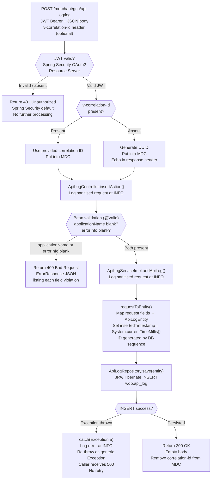

# WDP-COMP-38-API-LOG-SERVICE
**Worldpay Dispute Platform — Component Reference**
*Version: 1.0 DRAFT | April 2026*
*Extracted from: gcp-api-log-service using GitHub Copilot CLI | Architect-confirmed: PENDING*

---

## ━━━ CORE SKELETON ━━━━━━━━━━━━━━━━━━━━━━━━━━━━━━━━━━━━━━
*Mandatory for every component regardless of type.*

---

## Identity

| Field             | Value                                                        |
|-------------------|--------------------------------------------------------------|
| **Name**          | `APILogService`                                              |
| **Type**          | `REST API`                                                   |
| **Repository**    | `gcp-api-log-service`                                        |
| **Status**        | ✅ Production                                                 |
| **Doc status**    | 📝 DRAFT                                                     |
| **Sections present** | `Core \| Block A — REST`                                  |
| **Spring Boot**   | 3.4.0                                                        |
| **Java**          | 17                                                           |
| **Service version** | 1.1.2                                                      |
| **Context path**  | `/merchant/gcp/api-log`                                      |
| **Port**          | 8082                                                         |

---

## ⚠️ Correction to WDP-COMP-INDEX.md Description

The existing WDP-COMP-INDEX.md entry for COMP-38 states:
> *"Called via AOP by components that throw LoggingException (e.g. VisaDisputeBatch)"*

**All three claims are incorrect and must be updated:**

| Claim | Reality |
|-------|---------|
| AOP lives inside this service | **False.** No `@Aspect`, `@Around`, `@Before`, or `@After` annotations exist anywhere in `gcp-api-log-service`. The AOP / catch-block pattern lives **in the callers**. |
| `LoggingException` triggers the call | **False.** No class named `LoggingException` exists in this service or anywhere in the local workspace. The callers use standard `catch(Exception e)` blocks routed to `ErrorLogService.saveErrorLog()`. |
| `VisaDisputeBatch` is a caller | **Unconfirmed.** No file or reference to `VisaDisputeBatch` was found in `C:\workspace-intel\wdp\CORE-SERVICES`. It may be in a separate repository not cloned locally. |

**Corrected description for WDP-COMP-INDEX.md:**
> *"Centralised error-log sink. Callers POST structured error records to the single endpoint POST /log on error conditions. No AOP inside this service — callers hold the catch-block logic and invoke this service directly via REST. Four confirmed callers: AcceptService (COMP-19), ContestService (COMP-20), CaseActionService (COMP-24), DocumentManagementService (COMP-37)."*

---

## Purpose

**What it does**

`APILogService` is a thin, synchronous REST microservice that acts as the centralised error-log sink for the WDP dispute platform. When any calling service encounters an error condition, it constructs a structured error-log record and POSTs it to the single endpoint `POST /merchant/gcp/api-log/log`. The service validates the payload, maps it to a JPA entity, and persists it to the `wdp.api_log` PostgreSQL table. The primary consumers of this log table are operations and compliance teams — not other WDP services.

The service is intentionally minimal. It has one endpoint, one table, no outbound calls, no Kafka involvement, and no stateful orchestration. Its only processing logic is JWT validation at the security boundary, bean validation of two mandatory fields, a field-to-entity mapping, and a single database INSERT.

The "AOP" pattern described in legacy documentation refers to logic in the **calling services**, not this service. Each caller contains an `ErrorLogService` / `ErrorLogServiceImpl` class that is invoked from exception-handling catch blocks. The callers construct an `ErrorLogRequest` and POST it here. This service has no awareness of how or why it was called — it only receives and persists.

Four callers are confirmed from source: `gcp-disputes-accept-service` (COMP-19 AcceptService), `gcp-disputes-contest-service` (COMP-20 ContestService), `gcp-case-actions-service` (COMP-24 CaseActionService), and `gcp-document-management-service` (COMP-37 DocumentManagementService).

**What it does NOT do**

- Does not contain any AOP aspect, pointcut, or interceptor that wraps other services
- Does not read from any database table — it is write-only
- Does not make any outbound REST calls to any other service
- Does not publish to or consume from any Kafka topic
- Does not handle PAN data — the request schema contains no card number fields
- Does not deduplicate log records — identical payloads produce distinct rows
- Does not enforce a retention policy — the `wdp.api_log` table grows unbounded unless managed externally
- Does not validate the `platform` or `network` field values — these are accepted as free-text strings
- Does not route log records differently by platform, network, or error type

---

## Internal Processing Flow

**Flow notes:**
- There is exactly **one** inbound path. All four confirmed callers use the same `POST /log` endpoint.
- There are **no silent skip or drop conditions**. Every request that clears JWT and bean validation is attempted for persistence.
- There is **no retry mechanism** at any step. Failure propagates immediately to the caller.
- The `GlobalExceptionHandler` has a **known code defect**: the `@ExceptionHandler(Exception.class)` handler is declared with an `HttpMessageNotReadableException` parameter type, causing a mismatch. The re-thrown generic `Exception` from the DB failure path is caught by Spring's default handling and produces a 500 — not by this handler. The outcome is correct (500) but the handler is unreachable for this exception type.

---

## Boundaries

### Inbound Interfaces

| Source | Protocol | Endpoint / Topic / Trigger | Payload / Description |
|--------|----------|----------------------------|-----------------------|
| COMP-19 AcceptService (`gcp-disputes-accept-service`) | REST | `POST /merchant/gcp/api-log/log` | `ApiLogRequest` JSON — error records from accept dispute flow. Application name: `ACCEPT`. URL via env-var `${gcp_api_error_log_url}`. |
| COMP-20 ContestService (`gcp-disputes-contest-service`) | REST | `POST /merchant/gcp/api-log/log` | `ApiLogRequest` JSON — error records from contest dispute flow. Application name: `CONTEST_SERVICE`. URL via env-var `${errorlog_url}`. |
| COMP-24 CaseActionService (`gcp-case-actions-service`) | REST | `POST /merchant/gcp/api-log/log` | `ApiLogRequest` JSON — error records from case action management. Application name: `CASE_ACTION`. URL via env-var `${errorlog_url}`. |
| COMP-37 DocumentManagementService (`gcp-document-management-service`) | REST | `POST /merchant/gcp/api-log/log` | `ApiLogRequest` JSON — error records from document upload/management. Application name: `spring.application.name` value. URL hardcoded in prod config: `http://gcp-api-log-service.wdp-micro:8082/merchant/gcp/api-log/log`. |

> ⚠️ `gcp-document-management-service` is the **only** caller where the full URL is visible in committed config. Dev/test use `gcp-ff` namespace; prod uses `wdp-micro` namespace. All other callers inject the URL at deploy time via environment variables.

### Outbound Interfaces

| Target | Protocol | Endpoint / Topic / Resource | Purpose | On failure |
|--------|-----------|-----------------------------|---------|------------|
| PostgreSQL | JDBC / JPA | `wdp.api_log` | Persist error log record | Exception caught, logged at INFO, re-thrown — caller receives 500. No retry. |
| Logstash | TCP socket | `${logstash_server_host_port}` | Structured application log shipping (side-channel only — not API log records) | Not part of functional flow |

> ⚠️ **No connection pooling.** `DriverManagerDataSource` is used — each DB call creates a new connection. This is not suitable for production high-throughput and is a potential operational risk under sustained load.

---

## Database Ownership

### Tables Owned (written by this component)

| Schema.Table | Purpose | Key columns | Retention / Notes |
|--------------|---------|-------------|-------------------|
| `wdp.api_log` | Audit / error log sink. Stores error records posted by calling services on exception conditions. | `I_API_LOG_ID` (PK, sequence `wdp.API_LOG_I_API_LOG_ID_SEQUENCE`, allocationSize=1) | ⚠️ **No retention policy.** Table grows unbounded. No purge job, TTL, or archival mechanism in source, config, or deployment manifests. Must be managed externally (DBA scripts or database-level policies). |

**Full column map for `wdp.api_log`:**

| Column | Java field | Type | Source / Notes |
|--------|-----------|------|----------------|
| `I_API_LOG_ID` | `id` | BIGINT (sequence) | PK — auto-generated |
| `C_PROCESS_NAME` | `processName` | VARCHAR | Mapped from `request.applicationName` |
| `C_ACQ_PLATFORM` | `platform` | VARCHAR | Passed through from caller |
| `I_CASE` | `caseNumber` | VARCHAR | Passed through from caller |
| `I_ACTION_SEQ` | `actionSeq` | VARCHAR | Passed through from caller |
| `C_CASE_NTWK` | `network` | VARCHAR | Passed through from caller |
| `C_INFO` | `errorInfo` | VARCHAR | Passed through from caller |
| `Z_INSRT` | `insertedTimestamp` | TIMESTAMP | Server-side: `System.currentTimeMillis()` |
| `c_ntwk_case_id` | `networkCaseId` | VARCHAR | Passed through from caller |

**Transactionality:** `addApiLog()` is not annotated `@Transactional`. The `JpaRepository.save()` is transactional by Spring Data convention. The write is effectively a single-statement transaction.

**Not captured in the DB record:** HTTP method, endpoint path, HTTP response code, JWT subject/claims, correlation ID. The correlation ID is propagated via MDC to Logstash log output only — it is not persisted.

### Tables Read (not owned by this component)

This component owns no read path. `ApiLogRepository` extends `JpaRepository` with no `findBy*`, `@Query`, or custom query methods defined. The service is **write-only**.

---

## Kafka Contracts

**Kafka is entirely absent from this component.**

Confirmed: `pom.xml` contains no `spring-kafka`, `kafka-clients`, or any Kafka-related dependency. There are no `@KafkaListener`, `KafkaTemplate`, or `@EnableKafka` declarations anywhere in the source.

---

## Platform Standard Deviations

| Standard | Status | Detail |
|----------|--------|--------|
| DEC-001 (Transactional Outbox) | ✅ NOT APPLICABLE | This service publishes to no external system. No Kafka publish, no outbound REST call, therefore no outbox table needed. The only external write is the direct JPA INSERT to `wdp.api_log`. |
| DEC-003 (Kafka partition key = merchantId) | ✅ NOT APPLICABLE | No Kafka publishing. No Kafka dependency in `pom.xml`. |
| DEC-004 (PAN encryption) | ✅ COMPLIANT BY ABSENCE | No PAN data is ever written. The request schema (`ApiLogRequest`) carries `platform`, `caseNumber`, `applicationName`, `actionSeq`, `network`, `errorInfo`, `networkCaseId` — none of which are card numbers or PANs. No masking logic is required or present. `CheckmarxUtil.sanitizeString()` is applied only to SLF4J log output to neutralise log-injection characters — it is not a PAN masking routine. |
| DEC-005 (Kafka offset manual commit) | ✅ NOT APPLICABLE | No Kafka consumption. |
| DEC-014 (Resilience4j circuit breaker) | ✅ NOT APPLICABLE | This service makes no outbound REST calls. No REST client, Feign client, `WebClient`, or `RestTemplate` is present. No circuit breakers, rate limiters, or retry configurations exist. DEC-014 does not apply. |

---

## Risk Register

| Risk | Severity | Detail |
|------|----------|--------|
| No database connection pooling | 🟡 MEDIUM | `DriverManagerDataSource` creates a new connection per request. Under sustained error volume from 4+ callers this will exhaust available connections or degrade response times. No HikariCP or equivalent configured. |
| No retention policy on `wdp.api_log` | 🟡 MEDIUM | Table grows unbounded. No purge job, TTL, or archival exists in source or config. At sustained error rates this will consume unbounded storage. Must be managed externally. |
| `spring-boot-devtools` in production classpath | 🟡 MEDIUM | Listed in `pom.xml` without `<scope>runtime</scope>`. DevTools is bundled into the production artifact. This increases classpath size and introduces development-only restart/reload behaviour into production pods. |
| `GlobalExceptionHandler` code defect | 🟢 LOW | `@ExceptionHandler(Exception.class)` is declared with `HttpMessageNotReadableException` parameter. Parameter type mismatch means the handler is unreachable for generic `Exception` re-throws from DB failures. The observable outcome (500 returned to caller) is correct, but the handler is never executed for this path. |
| `auth.white-list` property loaded but unused | 🟢 LOW | `auth.white-list: ${auth_white_list}` declared in `application.yml` line 20 but never referenced in Java source. The whitelist is hardcoded in `SecurityConfig.java` as string arrays. The property is loaded by Spring but has no effect. Dead config — potential confusion for operators. |
| `commons-io:2.15.1` potentially unused | 🟢 LOW | Declared in `pom.xml` but no `org.apache.commons.io.*` import found in any source file. May be an unused transitive dependency declaration. |
| No idempotency on log writes | 🟢 LOW | Duplicate POST requests produce duplicate rows with distinct `I_API_LOG_ID` values. No unique constraint at JPA or DB level. Acceptable for an error log sink — noted for completeness. |

---

## Scaling and Deployment

| Parameter | Value | Source |
|-----------|-------|--------|
| Kubernetes resource type | `Deployment` | `resources.yaml:1-2` |
| Replica count | XL Deploy placeholder: `{{ replicas-gcp-api-log-service }}` — resolved at deploy time | `resources.yaml:8` |
| Memory limit | `2048Mi` | `resources.yaml:49-52` |
| Memory request | `1024Mi` | `resources.yaml:49-52` |
| CPU limit | **Not configured** — no `cpu` key in `resources.yaml` | `resources.yaml:48-52` |
| CPU request | **Not configured** | `resources.yaml:48-52` |
| HPA | **Absent** — no `HorizontalPodAutoscaler` manifest | Full repo scan |
| Rolling update | `type: RollingUpdate`, `maxSurge: 1`, `maxUnavailable: 0` | `resources.yaml:9-13` |
| PodDisruptionBudget | **Absent** | Full repo scan |
| Topology spread | **Not configured** — no `topologySpreadConstraints` | `resources.yaml` |
| OTel Java agent | **Present** — `instrumentation.opentelemetry.io/inject-java: opentelemetry-operator-system/default` | `resources.yaml:22` |
| Spring Actuator | **Present** — port 8082 (same as main service port). Endpoints: `info`, `health`, `prometheus` | `application.yml:29-49` |
| Liveness probe | `GET /merchant/gcp/api-log/livez` — initialDelay: 30s, period: 10s, failureThreshold: 3 | `resources.yaml:28-44` |
| Readiness probe | `GET /merchant/gcp/api-log/readyz` — initialDelay: 20s, period: 10s, failureThreshold: 3 | `resources.yaml:28-44` |
| Logstash appender | **Present** — appender name `awselk`, `LogstashTcpSocketAppender`, destination `${logstash_server_host_port}` | `logback-spring.xml:13-21` |

> ⚠️ No CPU limit or request. Pod is Burstable QoS — first candidate for eviction under node memory pressure.

---

## Planned and Incomplete Work

| Item | Type | Detail |
|------|------|--------|
| Two commented-out Logstash destination lines | Commented-out config | `<!-- <destination>10.43.125.5044</destination> -->` (×2) in `logback-spring.xml:15-16`. Hard-coded IP addresses from development/testing phase. Replaced by the config-property-driven `${LOGSTASH_SERVER_HOST_PORT}` approach. Development/migration leftover. |
| `spring-boot-devtools` without runtime scope | Unused dependency risk | Listed in `pom.xml` without `<scope>runtime</scope>`. Should be scoped or removed. |
| `commons-io:2.15.1` | Potentially unused dependency | Declared in `pom.xml`; no `org.apache.commons.io.*` import found in source. Confirm whether required transitively before removing. |
| `auth.white-list` property | Configured but unused | `auth.white-list: ${auth_white_list}` in `application.yml:20`. Never referenced in Java source. Whitelist is hardcoded in `SecurityConfig.java`. Dead config — safe to remove. |
| No feature flags | — | No feature flags, migration flags, or conditional property switches exist in source. |
| No TODO/FIXME | — | Grep across all `.java` files returned no TODO, FIXME, or JIRA story references. |

---

## ━━━ TYPE BLOCK A — REST API CONTRACTS ━━━━━━━━━━━━━━━━━━━━

---

## REST API Contracts

**Base context path:** `/merchant/gcp/api-log`
*(All endpoint paths below are relative to this base)*

**Authentication model:** JWT Bearer token required on all non-whitelisted paths. Spring Security OAuth2 Resource Server (`spring-boot-starter-oauth2-resource-server`). JWT public key set fetched from `${jwt_set_uri}` (injected at runtime from secrets).

**Role / scope enforcement:** None beyond token validity. `SecurityConfig` checks only `.anyRequest().authenticated()`. Any holder of a valid JWT issued by the configured JWKS issuer can call `POST /log`. No `hasRole()`, `hasAuthority()`, or scope claim check.

**Whitelisted paths (auth bypass):**

| Profile | Paths |
|---------|-------|
| PROD | `/actuator/health`, `/livez`, `/readyz` |
| Non-PROD (dev/uat/stg/test) | `/actuator/health`, `/livez`, `/readyz`, `/swagger-ui/**`, `/swagger-ui.html`, `/swagger-resources/**`, `/swagger-resources`, `/v3/api-docs/**` |

**Error response structure (all non-2xx responses):**

Produced by `GlobalExceptionHandler` → `ErrorResponses` JSON for bean validation failures. Spring Security default for 401. Generic 500 for DB failures (no structured body — handler code defect noted above).

---

### Endpoint: `POST /log`

**Full path:** `POST /merchant/gcp/api-log/log`
**Purpose:** Receive and persist a structured error-log record from a calling service. Single endpoint — the only function of this service.
**Auth required:** Bearer JWT (non-whitelisted)

**Request body** (`application/json`, validated via `@Valid @RequestBody ApiLogRequest`):

| Field | Type | Constraints | Description |
|-------|------|-------------|-------------|
| `platform` | String | optional | Acquiring platform identifier (CORE / NAP / VAP / LATAM). Free-text — not validated against enum at runtime. |
| `caseNumber` | String | optional | WDP dispute case ID |
| `applicationName` | String | **@NotBlank** | Name of the calling service (e.g. `ACCEPT`, `CONTEST_SERVICE`, `CASE_ACTION`) |
| `actionSeq` | String | optional | Dispute action sequence identifier (up to 52 chars) |
| `network` | String | optional | Card network (e.g. VISA / MC) |
| `errorInfo` | String | **@NotBlank** | Error description / stack summary from the caller |
| `networkCaseId` | String | optional | Card-network case identifier |

**Request headers:**

| Header | Required | Purpose |
|--------|----------|---------|
| `v-correlation-id` | Optional | Propagated correlation ID. Generated as UUID if absent. Echoed in response header. Put into MDC — appears in Logstash logs but is **not** persisted to DB. |
| `Authorization: Bearer <JWT>` | **Required** | OAuth2 JWT — validated against JWKS endpoint `${jwt_set_uri}` |

**Response:**

| Condition | HTTP Status | Body |
|-----------|-------------|------|
| Successful persist | `200 OK` | Empty body (`ResponseEntity<Void>`) |
| `applicationName` or `errorInfo` blank | `400 Bad Request` | `ErrorResponses` JSON — lists each field violation |
| Malformed JSON body | `500 Internal Server Error` | `ErrorResponses` JSON (via `HttpMessageNotReadableException` handler) |
| DB INSERT exception | `500 Internal Server Error` | No structured body — Spring default. See code defect note. |
| Invalid / absent JWT | `401 Unauthorized` | Spring Security default response |

**Notes:**
- No idempotency key. Duplicate calls produce duplicate rows.
- The `platform` field accepts free-text. A `Platform` enum (CORE, NAP, VAP, LATAM) is defined but is used only for Swagger `@Schema` documentation — not validated at runtime.
- Correlation ID is propagated via MDC to Logstash structured logs but is **not** stored in `wdp.api_log`.
- The service does **not** validate or scrub the `errorInfo` field content before persistence. Callers are responsible for sanitising before sending.

---

## WDP-KAFKA.md Update Reference

**No Kafka involvement.** This component neither produces to nor consumes from any Kafka topic. No Kafka dependency in `pom.xml`.

Add the following row to the Component Kafka Summary section:

| Component | Produces to | Consumes from | Notes |
|-----------|-------------|---------------|-------|
| COMP-38 APILogService | None | None | No Kafka dependency in `pom.xml`. Confirmed explicitly from full dependency list review. |

---

## WDP-DB.md Update Reference

### Add to Schema `wdp` — Tables Owned

| Schema.Table | Owner component | Purpose | Key columns | Shared write risk |
|---|---|---|---|---|
| `wdp.api_log` | COMP-38 APILogService | Error/audit log records posted by calling services on exception conditions | `I_API_LOG_ID` (PK, sequence), `C_PROCESS_NAME`, `Z_INSRT` | None — single writer confirmed |

### Update Section 5 — Data Retention Notes

| Data type | Retention requirement | Enforced by | Reference |
|---|---|---|---|
| API audit logs | ⚠️ **No policy.** Table grows unbounded. | Must be managed externally (DBA scripts or DB-level policies). No mechanism in COMP-38 source. | COMP-38 confirmed |

---

## Remaining Gaps

| Gap | Type | Action required |
|-----|------|-----------------|
| Actual replica count | Environment config | Confirm production value of XL Deploy variable `replicas-gcp-api-log-service` from deployment config or team. |
| VisaDisputeBatch as caller | Follow-up needed | `VisaDisputeBatch` was not found in `C:\workspace-intel\wdp\CORE-SERVICES`. Confirm with team whether it exists in a separate repository and whether it calls `gcp-api-log-service`. If confirmed, add as fifth inbound caller. Question to ask Copilot in that repo: *"Does this component make any REST call to a URL matching `/merchant/gcp/api-log/log` or reference `ErrorLogService`/`saveErrorLog`?"* |
| `commons-io` usage | Follow-up Copilot | Ask in `gcp-api-log-service` repo: *"Is `org.apache.commons.io` used anywhere — including in test classes, annotation processors, or transitive dependencies that require it at compile time?"* |
| Caller 5+ | Architecture confirmation | Are there any other WDP services that call `gcp-api-log-service` that are not in the `CORE-SERVICES` local workspace? Confirm with team. |
| `wdp.api_log` retention policy | Architect decision needed | No retention policy exists. Is 7-year dispute audit retention required for error logs, or is a shorter operational window acceptable? This needs a formal decision before a purge mechanism can be designed. |

---

*File status: 📝 DRAFT — awaiting architect confirmation.*
*Remember to update WDP-COMP-INDEX.md description (see correction block above), WDP-KAFKA.md, and WDP-DB.md with entries from this file after confirmation.*
