# WDP-COMP-39-NAP-OUTCOME-PROCESSOR
**Worldpay Dispute Platform — Component Reference**
*Version: 2.0 DRAFT 🔍 source-verified 2026-04-29 | Architect-confirmed: PENDING*
*Source: `gcp-nap-dispute-update-consumer` via GitHub Copilot CLI*
*Supersedes v1.0 (April 2026). Major revisions: Block A added (REST entry path), audit user constant corrected, field-name corrections, rolling-update strategy sourced, JWT auth confirmed, dependency classifications refined, shared-table consumption hazard added.*

---

## ━━━ CORE SKELETON ━━━━━━━━━━━━━━━━━━━━━━━━━━━━━━━━━━━━━━

---

## Identity

| Field | Value |
|---|---|
| **Name** | `NAPOutcomeProcessor` |
| **Type** | `Kafka Consumer + REST API` |
| **Repository** | `gcp-nap-dispute-update-consumer` |
| **Maven artifact** | `com.wp.gcp:gcp-nap-dispute-update-consumer:1.2.2` |
| **Technology** | `Spring Boot 3.5.7 / Java 17 / Spring Kafka / Spring Data JPA / Spring Retry / Spring Security OAuth2 Resource Server` |
| **Owner** | `Integration Team` |
| **Status** | `✅ Production` |
| **Doc status** | `📝 DRAFT 🔍 v2.0 (2026-04-29)` |
| **Sections present** | `Core \| Block A (REST API) \| Block B (Kafka Consumer)` |

---

## Purpose

**What it does**

NAPOutcomeProcessor is the outbound delivery component for the NAP acquiring platform. Its primary entry path is a Kafka consumer of `NotificationEvent` messages from the `internal-integration-events` AWS MSK topic. The consumer filters to NAP platform events only and drives a multi-step internal workflow that terminates in one or both of two HTTP POST calls to the NAP-DPS external system: an SRV118 call (chargeback outcome / representment notification) and an SRV117 call (department notice letter notification).

The component operates as a stateful processing state machine. For each inbound message it first reprocesses any prior unresolved error records for the same case, then resolves the case via REST calls to internal WDP services, inspects the case's action summaries to determine which of the two NAP-DPS endpoints must be called, and constructs the appropriate request payloads. Response codes and write-off reason descriptions are resolved against the `NAP.NAP_UPDATE_RESPONSE_RULES` database table and the WDP Display Code Service respectively before the NAP-DPS calls are made.

The component has a built-in compensating error mechanism: on any processing failure, a record is written to the shared `NAP.DISPUTE_EVENT_CONSUMER_ERROR` table with status `FAILED1`. On every subsequent message for the same case, the component re-reads any pre-existing `FAILED1` or `FAILED2` records and reprocesses them through the same pipeline. This is the sole retry path — there is no Kafka dead-letter topic.

A secondary entry path exposes a JWT-authenticated REST endpoint (`POST /event`) that drives a single specified `ConsumerError` record through the same SRV118/SRV117 pipeline. This is the manual operator reprocessing surface — the same surface that COMP-05 NAPDisputeEventProcessor's documentation has previously referenced as "the manual reprocessing endpoint" without naming the host component.

The Kafka offset is committed **before** all downstream processing via `MANUAL_IMMEDIATE` AckMode. This is a deliberate at-most-once delivery posture (DEC-005 deviation, identical to COMP-05). The `DISPUTE_EVENT_CONSUMER_ERROR` table provides application-level compensating recovery only — not transport-level recovery. A JVM crash after offset commit and before processing completes results in permanent message loss.

**What it does NOT do**

- Does not publish to any Kafka topic. No `KafkaTemplate`, no `ProducerFactory`, no outbox table, and no Kafka producer configuration is present. DEC-001 is not applicable.
- Does not filter by `responseType` or `messageType` at the consumer level. Platform differentiation from COMP-40 VisaResponseQuestionnaire (which shares the `internal-integration-events` topic) is achieved solely by the `platform == "NAP"` check (case-insensitive). Non-NAP messages are silently dropped after the offset is already committed.
- Does not handle clear PAN. The `cardNumber` field in the SRV117 payload is constructed as `issuerBin + "******" + cardNumberLast4` — masked PAN only (BIN6 + 6 asterisks + last 4), sourced from WDP transaction enrichment passed back via the Case Search REST response. The inbound `NotificationEvent` schema has no PAN field. The raw `NotificationEvent` JSON persisted to `C_KAFKA_EVENT` on error contains no clear PAN.
- Does not use Resilience4j circuit breakers. Spring Retry (`@Retryable`) is used for retry logic on all outbound calls — and `@EnableRetry` is wired on the application class, so the retry contract is live (unlike COMP-41 where the imports were dead). No circuit breaker, rate limiter, or bulkhead is configured.
- Does not perform notes lookup at runtime. The `notesLookUp()` step and its associated `notesLookup` REST call are fully commented out in source. The `dataRecord` field in every SRV118 payload is currently always null.
- Does not perform CRMR (Credit-side Merchant Reversal) action mapping. The `checkCRMRAction()` method and its supporting `mapRequiredAmount` branch are fully commented out. CRMR routing is not active in production.
- Does not implement the planned EDIA migration route. No feature flag, commented-out route, or TODO referencing EDIA is visible in source. The `migrationStatus` field propagated from action summaries is read and persisted into the error table but drives no routing logic.
- Does not own the schema for either of the two tables it touches. `NAP.DISPUTE_EVENT_CONSUMER_ERROR` is owned by COMP-05 and shared with COMP-23, COMP-24, and this component. `NAP.NAP_UPDATE_RESPONSE_RULES` is read-only here — owner is not determinable from this repo.

---

## Internal Processing Flow

```mermaid
flowchart TD
    KAFKA_IN["📥 Kafka message received\ninternal-integration-events\nNotificationEvent payload"]
    REST_IN["📥 POST /event\nConsumerErrorRequest body\nJWT-authenticated"]

    ACK["⚠️ Offset committed IMMEDIATELY\nMANUAL_IMMEDIATE — setSyncCommits=true\nBEFORE any downstream work\nAt-most-once — DEC-005 DEVIATION"]

    PLAT{{"platform == 'NAP'?\ncase-insensitive"}}
    DISCARD["Silently discard\nLog only — no DB write\nno error record"]

    PRIOR_QUERY["Query NAP.DISPUTE_EVENT_CONSUMER_ERROR\nfor caseNumber\n+ sourceSystemName=NAP\n+ status IN (FAILED1, FAILED2)"]

    PRIOR_FOUND{{"Prior FAILED1 / FAILED2\nrecords found?"}}
    REPROC_LOOP["Reprocess each prior error record\nas isErrorTopic=true\nvia processSrv118Notification()"]
    REPROC_OK["Update record\n→ C_ERROR_STA = PROCESSED"]
    REPROC_FAIL["Escalate record\nFAILED1 → FAILED2\nor FAILED2 → ERROR (terminal)"]

    REST_PROCESS["processConsumerErrorInformation()\nfor specified single record"]

    MAIN["processSrv118Notification()\nfor current message"]

    CASE_LOOKUP["Step 1: Case Lookup\nGET case_search_url\n@Retryable"]
    CASE_NULL{{"Case returned?"}}
    HALT_NULL["Chain halts\napiName = BLANK\nNo error record written"]

    ACTION_LOOKUP["Step 2: Case Action Lookup\nGET case_action_search_url\n@Retryable"]

    ACTION_CHECK{{"reqActionSummaries\n(matching actionSequences)\nAND currentActionSummaries\n(matching currentActionSequence)\nfound?"}}
    ACTION_EMPTY["actionSummaries empty\nFAILED1 written\nChain halts"]
    NEITHER_FOUND["Neither set found\nFAILED1 written\nChain halts"]
    REQ_ONLY["Only reqActionSummaries\nSRV118 skipped\nProceed to SRV117 gate"]

    OUTCOME_CHECK{{"OutcomeDsptTransPercntge\nnon-blank on any\nreqActionSummary?"}}
    OUTCOME_SKIP["isSrv118ProcessingRequired = false\nSKIPPED record written\nSRV117 may still proceed"]

    SRV117_GATE{{"isSrv117ProcessingRequired?\n(any reqActionSummary has\nnon-blank dsptNoticeId)"}}

    DISPLAY_LOOKUP["Step 3: Display Code Lookup\nPOST display_code_url\nResolve writeOffReason +\nreasonCode descriptions\n@Retryable"]

    RESP_RULES["Step 4: Response Rules Lookup\nREAD NAP.NAP_UPDATE_RESPONSE_RULES\nMap action/stage/status\n→ NAP response code\n@Retryable"]

    RESP_CHECK{{"responseRules\nfound?"}}
    AMEX_CHECK{{"Amex network +\nREPR/MDCL/OPAB\naction code?"}}
    SRV118_GRACEFUL_SKIP["SRV118 skipped gracefully\n(done=true, no error)\nSRV117 may still proceed"]
    RESP_FAILED["FAILED1 written\nSNOTE via add_note_url\nReturn null"]

    WRITEOFF_CHECK{{"writeOffReason\nnon-blank?"}}
    CODE_FOUND{{"Display code\nentry found?"}}
    WRITEOFF_FAIL["FAILED1 written\nSNOTE via add_note_url\nReturn null"]

    SRV118_REQ{{"stageCode == REQ?"}}
    BUILD_REQ["Construct REQ-path\nNapNotificationRequest"]
    BUILD_NORMAL["Construct normal-path\nNapNotificationRequest\n(dataRecord = null —\nnotesLookUp commented out)"]

    SRV118_POST["Step 5: SRV118 POST\nPOST nap_notification_srv118_url\nNAP-DPS external\n@Retryable — fixed delay\nNo Authorization header\nnapcacrt.jks NOT loaded"]

    SRV118_OK{{"HTTP 2xx?"}}
    SRV118_FAIL["@Recover\nFAILED1 (new) or FAILED2/ERROR (reprocess)\nMarks SRV117 done=true (skip)\nConsumer continues"]

    SRV117_PATH["Step 6: SRV117 Construction\nDisplay code lookup\nfor disputeReason\nMASKED cardNumber from\nCase Search response\n@Retryable"]

    DC_CHECK_117{{"Display code\nentry found for\nSRV117 reason?"}}
    DC_FAIL_117["FAILED1 written\nSNOTE via add_note_url\nReturn null"]

    SRV117_POST["Step 7: SRV117 POST\nPOST nap_notification_srv117_url\nNAP-DPS external\n@Retryable — fixed delay\nNo Authorization header"]

    SRV117_OK{{"HTTP 2xx?"}}
    SRV117_FAIL["@Recover\nFAILED1 (new) or FAILED2/ERROR (reprocess)\nMarks SRV118 done=true (skip)\nConsumer continues"]

    OUTER_CATCH["Outer exception handler\nin processNotificationEvent()\ninsertInfoToConsumerError → ERROR\naddErrorNotes → SNOTE\nConsumer NEVER halts"]

    TOKEN_CLEAR["Final: tokenService.clear()\nIDP token ThreadLocal cleared\n(in finally block)"]
    SUCCESS["Processing complete\nNo Kafka event published\nNo DB write on happy path"]

    KAFKA_IN --> ACK
    ACK --> PLAT
    PLAT -->|"platform != NAP"| DISCARD
    PLAT -->|"platform == NAP"| PRIOR_QUERY

    REST_IN --> REST_PROCESS
    REST_PROCESS --> MAIN

    PRIOR_QUERY --> PRIOR_FOUND
    PRIOR_FOUND -->|"Found"| REPROC_LOOP
    PRIOR_FOUND -->|"None"| MAIN
    REPROC_LOOP --> REPROC_OK
    REPROC_LOOP --> REPROC_FAIL
    REPROC_OK --> MAIN
    REPROC_FAIL --> MAIN

    MAIN --> CASE_LOOKUP
    CASE_LOOKUP -->|"@Recover exhausted"| OUTER_CATCH
    CASE_LOOKUP --> CASE_NULL
    CASE_NULL -->|"null"| HALT_NULL
    CASE_NULL -->|"Found"| ACTION_LOOKUP

    ACTION_LOOKUP -->|"@Recover exhausted"| OUTER_CATCH
    ACTION_LOOKUP --> ACTION_CHECK
    ACTION_CHECK -->|"Empty"| ACTION_EMPTY
    ACTION_CHECK -->|"Neither found"| NEITHER_FOUND
    ACTION_CHECK -->|"req only"| REQ_ONLY
    ACTION_CHECK -->|"Both found"| OUTCOME_CHECK

    OUTCOME_CHECK -->|"All blank"| OUTCOME_SKIP
    OUTCOME_CHECK -->|"At least one non-blank"| DISPLAY_LOOKUP

    REQ_ONLY --> SRV117_GATE
    OUTCOME_SKIP --> SRV117_GATE

    DISPLAY_LOOKUP -->|"@Recover exhausted"| OUTER_CATCH
    DISPLAY_LOOKUP --> RESP_RULES
    RESP_RULES -->|"@Recover exhausted (returns null)"| RESP_CHECK
    RESP_RULES --> RESP_CHECK

    RESP_CHECK -->|"Found"| WRITEOFF_CHECK
    RESP_CHECK -->|"Null"| AMEX_CHECK
    AMEX_CHECK -->|"Amex + exempt action"| SRV118_GRACEFUL_SKIP
    AMEX_CHECK -->|"Not exempt"| RESP_FAILED

    WRITEOFF_CHECK -->|"Blank — skip lookup"| SRV118_REQ
    WRITEOFF_CHECK -->|"Non-blank"| CODE_FOUND
    CODE_FOUND -->|"Found"| SRV118_REQ
    CODE_FOUND -->|"Not found"| WRITEOFF_FAIL

    SRV118_REQ -->|"REQ stage"| BUILD_REQ
    SRV118_REQ -->|"Other stage"| BUILD_NORMAL
    BUILD_REQ --> SRV118_POST
    BUILD_NORMAL --> SRV118_POST

    SRV118_POST --> SRV118_OK
    SRV118_OK -->|"Success"| SRV117_GATE
    SRV118_OK -->|"All retries exhausted"| SRV118_FAIL
    SRV118_GRACEFUL_SKIP --> SRV117_GATE

    SRV117_GATE -->|"Not required"| TOKEN_CLEAR
    SRV117_GATE -->|"Required"| SRV117_PATH

    SRV117_PATH -->|"@Recover exhausted"| OUTER_CATCH
    SRV117_PATH --> DC_CHECK_117
    DC_CHECK_117 -->|"Found"| SRV117_POST
    DC_CHECK_117 -->|"Not found"| DC_FAIL_117

    SRV117_POST --> SRV117_OK
    SRV117_OK -->|"Success"| TOKEN_CLEAR
    SRV117_OK -->|"All retries exhausted"| SRV117_FAIL

    SRV118_FAIL --> TOKEN_CLEAR
    SRV117_FAIL --> TOKEN_CLEAR
    DC_FAIL_117 --> TOKEN_CLEAR
    RESP_FAILED --> TOKEN_CLEAR
    WRITEOFF_FAIL --> TOKEN_CLEAR
    HALT_NULL --> TOKEN_CLEAR
    ACTION_EMPTY --> TOKEN_CLEAR
    NEITHER_FOUND --> TOKEN_CLEAR
    OUTER_CATCH --> TOKEN_CLEAR
    TOKEN_CLEAR --> SUCCESS
```

**Flow notes**

- The component has **two entry paths** that converge at `processSrv118Notification()`. The Kafka path runs the platform filter and the prior-error reprocess loop before reaching MAIN. The REST path skips both — it processes one specified record directly. This means the manual reprocess endpoint **does not** re-trigger prior-error reprocessing for the case; only Kafka receipt does.
- The offset commit always precedes all downstream work. A JVM crash after the commit and before `processNotificationEvent()` completes results in permanent message loss with no redelivery. The error table provides application-level recovery only for errors that are recorded before the crash.
- Prior-error reprocessing runs first for each inbound Kafka message, before the current message's own processing path. The query filters on `caseNumber` + `sourceSystemName="NAP"` + `errorStatus IN (FAILED1, FAILED2)` only — **there is no `C_EVENT_TYPE` filter**, so error records inserted by COMP-05, COMP-23, and COMP-24 against the same case (all under `sourceSystemName="NAP"`) may be picked up and reprocessed through COMP-39's SRV118 pipeline regardless of whether they originated from an outbound-notification path. See "Cross-component shared-table consumption hazard" in Risks.
- The consumer never halts. All failure paths return control to the outer handler in `processNotificationEvent()` which writes an error record and continues. No path re-commits the offset.
- The `notesLookup` step (which would populate `dataRecord` in the SRV118 payload) is entirely commented out. Every SRV118 call currently sends `dataRecord = null`.
- The `checkCRMRAction()` method (CRMR routing for Credit-side Merchant Reversals) is also fully commented out. CRMR action type mapping is not active.
- The Response Rules `@Recover` is asymmetric: it returns null (not a FAILED1 record). Control falls into the `RESP_CHECK` null branch, which then either takes the Amex graceful-skip path (for Amex + REPR/MDCL/OPAB) or writes a FAILED1.

---

## Boundaries

### Inbound Interfaces

| Source | Protocol | Endpoint / Topic / Trigger | Payload |
|--------|----------|----------------------------|---------|
| COMP-19 AcceptService | Kafka | `${spring.kafka.consumer.topic}` (resolves via `application.yml` to env var `${kafka_consumer_topic}` — runtime value `internal-integration-events`) | `NotificationEvent` (AcceptEvent schema) |
| COMP-20 ContestService | Kafka | Same topic | `NotificationEvent` (ContestEvent schema) |
| Operator / Ops Portal | REST POST | `POST /merchant/gcp/update-consumer/nap/event` (JWT-authenticated) | `ConsumerErrorRequest` — identifies a single existing error record to reprocess |

*Note: COMP-40 VisaResponseQuestionnaire also consumes the same `internal-integration-events` topic. Topic separation between COMP-39 and COMP-40 is achieved by the `platform` field value only — `platform == "NAP"` is processed by COMP-39; non-NAP platforms with non-null `visaResponseIds` are processed by COMP-40; everything else is silently discarded by both.*

### Outbound Interfaces

| Target | Protocol | Endpoint / Resource | Purpose | On failure |
|--------|----------|---------------------|---------|------------|
| WDP Case Search | REST GET | `${case_search_url}` | Step 1 — look up case by caseNumber; also returns transaction enrichment | `@Retryable`; `@Recover` writes FAILED1 (or escalates if isErrorTopic) |
| WDP Case Action Service | REST GET | `${case_action_search_url}` | Step 2 — retrieve action summaries for case | `@Retryable`; `@Recover` writes FAILED1 (or escalates) |
| WDP Display Code Service | REST POST | `${display_code_url}` | Step 3 — resolve writeOffReason / reasonCode / disputeReason long descriptions | `@Retryable`; `@Recover` writes FAILED1 (or escalates) |
| WDP Notes Service note lookup | REST GET | `${note_lookup_url}` | **FULLY COMMENTED OUT** — would have fetched existing case notes into dataRecord | — |
| WDP Notes Service add note | REST POST | `${add_note_url}` | Error-path SNOTE write — fire-and-forget in catch block | Exception swallowed; no retry; processing continues |
| WDP IDP Token Service | REST GET | `${wdp_token_service_url}` | Obtain bearer JWT for all WDP-internal REST calls | Not `@Retryable`; exception propagates to outer catch → ERROR record written |
| NAP-DPS SRV118 | REST POST | `${nap_notification_srv118_url}` | Step 5 — chargeback outcome / representment notification to NAP money movement | `@Retryable`; `@Recover` writes FAILED1, marks SRV117 done=true |
| NAP-DPS SRV117 | REST POST | `${nap_notification_srv117_url}` | Step 7 — department notice letter notification to NAP money movement | `@Retryable`; `@Recover` writes FAILED1, marks SRV118 done=true |
| PostgreSQL — NAP schema | DB write | `NAP.DISPUTE_EVENT_CONSUMER_ERROR` | Write/update error records on processing failure | Each write is standalone JPA `save()` — no `@Transactional` wrapping; `@Recover` retries the save |
| PostgreSQL — NAP schema | DB read | `NAP.DISPUTE_EVENT_CONSUMER_ERROR` | Prior-error scan at start of every Kafka message | `@Retryable`; `@Recover` returns null on second failure |
| PostgreSQL — NAP schema | DB read | `NAP.NAP_UPDATE_RESPONSE_RULES` | Step 4 — map action/stage/status combination to NAP response code | `@Retryable`; `@Recover` returns null (no error record from recover); flows into response-rules-null branch |

---

## Database Ownership

### Tables Owned (written by this component)

This component owns NO tables outright. It is a co-writer of `NAP.DISPUTE_EVENT_CONSUMER_ERROR` (owner: COMP-05; co-writers: COMP-23, COMP-24, **COMP-39**). No DDL or schema migration for either table is present in this repository.

### Tables Read or Co-Written

| Schema.Table | Owner | Read / Write | Why accessed |
|---|---|---|---|
| `NAP.DISPUTE_EVENT_CONSUMER_ERROR` | COMP-05 NAPDisputeEventProcessor (primary; owns DDL elsewhere — not in this repo) | Both — read at start of every Kafka message (prior-error scan); write/update on every failure path | Database DLQ for failed processing. Discriminated by `C_ACQ_PLATFORM` (= `sourceSystemName`); COMP-39 sets this to `"NAP"` (constant `ApplicationConstants.NAP_PLATFORM`). `C_EVENT_TYPE` set to `OUT_SRV118` or `OUT_SRV117` for COMP-39-originated rows. **Cross-component consumption hazard** — see Risks. |
| `NAP.NAP_UPDATE_RESPONSE_RULES` | ⚠️ Owner not determinable from source — likely a shared reference / config table | Read only | Maps action type / stage / status combination to NAP response code and response reason for SRV118 payload construction. Confirmed zero writes from this component. |

**Audit user constant** for all writes by this component: `"NCSEUPDTC"` (corrected from v1.0 which incorrectly transcribed `"NCSEUDPTC"`).

**Transaction posture:** No `@Transactional` annotation appears anywhere in this component's source. `@EnableTransactionManagement` is on the persistence configuration and a `JpaTransactionManager` bean exists, but no method is annotated. Every error-table write is a standalone `repository.save()` or `repository.saveAll()` — each is its own implicit auto-commit. The prior-error reprocess loop is **not** wrapped in any transaction; each per-record reprocess executes independently.

---

## Configuration and Scaling

| Parameter | Value | Notes |
|-----------|-------|-------|
| Replica count | `{{ replicas-gcp-nap-dispute-update-consumer }}` | XL Deploy template variable — runtime value not in repo |
| HPA | None | No `HorizontalPodAutoscaler` resource |
| Memory request | 1024Mi | |
| Memory limit | 2048Mi | |
| CPU request | Not configured | No CPU request set |
| CPU limit | Not configured | No CPU limit set |
| Deployment type | Kubernetes Deployment | |
| Rollout strategy | RollingUpdate — maxSurge: 1, maxUnavailable: 0 | Sourced from `resources.yaml` (corrected from v1.0 "not determinable") |
| `minReadySeconds` | 30 | |
| PodDisruptionBudget | None | |
| Topology spread | maxSkew: 1, whenUnsatisfiable: ScheduleAnyway, topologyKey: kubernetes.io/hostname | Labels aligned between pod template and selector — no drift |
| Kafka consumer concurrency | 1 | Spring Kafka default — `setConcurrency()` not invoked. No comment or property documents intent. |
| Max poll records | `${max_poll_records}` | Env-only — no committed default |
| Max poll interval | `${max_poll_interval}` | Env-only — no committed default |
| Auto-offset-reset | `latest` | Confirmed in `application.yml` |
| Kafka SASL mechanism | `SASL_SSL` + `AWS_MSK_IAM` | Confirmed in line with platform pattern |
| Liveness probe | `GET /merchant/gcp/update-consumer/nap/livez` port 8082 | ⚠️ See Risks — Spring Actuator `additional-path: server:/livez` exposes the endpoint at server root `/livez`, not under the servlet context path. Probe path may not match unless Ingress routing reconciles. |
| Readiness probe | `GET /merchant/gcp/update-consumer/nap/readyz` port 8082 | Same caveat |
| Startup probe | None | |
| Ports exposed | 8082 (containerPort) | |
| OTel injection | Pod annotation `instrumentation.opentelemetry.io/inject-java: opentelemetry-operator-system/default` | |
| Spring Actuator endpoints | `info`, `health`, `prometheus` | |
| Logstash | `logstash-logback-encoder:7.4` | |
| Prometheus custom tag | `application: ${app.name}` | |
| `@EnableRetry` | Present on application class | Spring Retry IS wired (distinct from COMP-41 where the imports were dead) |
| `application-{env}.yml` profiles | None present in repo | Every `${...}` placeholder resolves at runtime from environment variables only — no committed defaults for any value |

---

## Key Architectural Decisions

| Decision | ADR reference | Notes |
|---|---|---|
| Pre-ACK offset commit — at-most-once delivery | DEC-005 — **DEVIATION** | `acknowledgment.acknowledge()` is the first call inside `KafkaConsumer.onMessage()`, before `processNotificationEvent()`. JVM crash post-commit results in permanent message loss with no redelivery. Application-level recovery via the error table compensates only for errors recorded before the crash. Identical pattern to COMP-05. |
| At-most-once delivery posture, no inbound idempotency | DEC-020 — **DEVIATION** | The structurally at-most-once pattern means duplicate Kafka delivery (if it happened) would re-call NAP-DPS — there is no inbound idempotency-key check. In practice, the at-most-once posture means duplicates do not arise from broker redelivery, but the same record can be processed via the prior-error reprocess loop AND the REST `/event` path concurrently. |
| Database DLQ instead of Kafka DLQ topic | Local decision | All failed messages written to `NAP.DISPUTE_EVENT_CONSUMER_ERROR`. Reprocessing built into the consumer's startup logic for each new Kafka message; manual reprocessing also available via REST. |
| Spring Retry instead of Resilience4j | Platform-wide pattern (DEC-014 voided) | `io.github.resilience4j` is absent. `@Retryable` + `@Recover` on all outbound calls. `@EnableRetry` confirmed on application class — retry is live. No circuit breaker, rate limiter, or bulkhead. |
| No transactional outbox | DEC-001 — Not applicable | Component does not publish to Kafka. |
| Partition key | DEC-003 — Not applicable | Consumer only — no Kafka production. |
| PAN handling — masked only | DEC-004 / DEC-019 — **COMPLIES** | `cardNumber` in SRV117 payload is `BIN6 + "******" + last4`. Inbound `NotificationEvent` schema has no PAN field. `C_KAFKA_EVENT` JSON serialisation contains no clear PAN. |
| Single-threaded consumption | Local decision (default-by-omission) | `setConcurrency()` not invoked — Spring Kafka default of 1 thread. No comment, commit message, or property override documents intent. |
| Manual operator reprocess endpoint | Local decision | `POST /event` (JWT-authed) accepts a `ConsumerErrorRequest` and drives one specified record through the SRV118/SRV117 pipeline. Resolves a previously open question — this is the endpoint COMP-05's documentation has referred to as "the manual reprocessing endpoint". |

---

## Risks and Constraints

| Severity | Risk | Consequence |
|---|---|---|
| 🔴 HIGH | **At-most-once delivery — JVM crash causes permanent message loss** | Kafka offset is committed before processing starts. A JVM crash, OOM kill, or pod eviction after the commit but before `processNotificationEvent()` completes results in the NAP-DPS calls never being made. The error table is not written in this scenario (crash = no write). Message is silently lost with no redelivery. NAP money movement outcome is not delivered. |
| 🔴 HIGH | **NAP-DPS authentication mechanism not confirmed — `napcacrt.jks` is an orphan** | SRV118 and SRV117 HTTP calls set no `Authorization` header. The `napcacrt.jks` file present at the repo root is **not referenced anywhere in code, application.yml, or any `@Bean`** — no `SSLContext`, `KeyStore`, `KeyManagerFactory`, `TrustManagerFactory`, or `ClientHttpRequestFactory` loads it. NAP-DPS calls go via the default `RestTemplate` with no client cert. Auth must therefore rely on something outside this repo (network-level trust / Ingress mTLS / mesh-level mTLS). If that boundary changes or is misconfigured, NAP outcome deliveries fail silently with no application-level alert. |
| 🔴 HIGH | **Cross-component shared-table consumption hazard on `NAP.DISPUTE_EVENT_CONSUMER_ERROR`** | The prior-error scan filters on `caseNumber` + `sourceSystemName="NAP"` + status IN (FAILED1, FAILED2) only. There is **no `C_EVENT_TYPE` filter**. Error records written by COMP-05 (NAPDisputeEventProcessor inbound flow), COMP-23 blind-merge writes, and COMP-24 insert-path writes — all under `sourceSystemName="NAP"` for NAP-platform cases — may be scooped up and reprocessed through COMP-39's SRV118 pipeline regardless of their original origin. Reprocessing semantics across components are not coordinated. Outcome is undefined and depends on the discriminator semantics of records each writer produces. |
| 🟡 MEDIUM | **No timeouts on RestTemplate — hung downstream blocks the single consumer thread** | `CommonConfig` bean creates `new RestTemplate()` with no connection or read timeout. `getDisplayCodeDetails()` instantiates a second inline `new RestTemplate()` also without timeouts. A hung WDP internal service or NAP-DPS endpoint will block the single consumer thread indefinitely until OS-level TCP timeout. No further messages can be processed during this period. |
| 🟡 MEDIUM | **Silent deserialization failure — message dropped with no error record** | `ErrorHandlingDeserializer` wraps `JsonDeserializer<NotificationEvent>`. On failure it returns null. The `CommonErrorHandler` registered is a no-op anonymous class. The listener receives a null payload, throws `NullPointerException`, which propagates to the no-op handler. Message silently dropped — no error record written. Untested behaviour. |
| 🟡 MEDIUM | **`dataRecord` always null — SRV118 payload incomplete** | The `notesLookUp` step (which fetches existing case notes to populate `dataRecord` in the SRV118 request) is entirely commented out. Every SRV118 POST sends `dataRecord = null`. Impact on NAP-DPS processing is not documented. |
| 🟡 MEDIUM | **`checkCRMRAction()` commented out — CRMR routing not active** | CRMR (Credit-side Merchant Reversal) action mapping is disabled. CRMR routing for SRV118 action types (ACMO / CHGM) is not operational. Cases requiring CRMR routing may be processed incorrectly or silently skipped. |
| 🟡 MEDIUM | **Probe path mismatch between manifest and actuator config** | `resources.yaml` probes hit `/merchant/gcp/update-consumer/nap/readyz` and `/merchant/gcp/update-consumer/nap/livez`. Spring Actuator `additional-path: server:/livez` and `server:/readyz` expose the endpoints at server root (`/livez`, `/readyz`), not under the servlet context path. Probe success depends on Ingress routing reconciling the two; not determinable from source alone. Risk: misconfigured probe could mark a healthy pod unhealthy or vice versa. |
| 🟡 MEDIUM | **No CPU limits or requests configured** | CPU resource constraints absent from `resources.yaml`. During retry storms or hung calls, the pod can consume unbounded CPU, competing with other workloads on the node. |
| 🟡 MEDIUM | **No HPA and no PodDisruptionBudget** | Single replica (placeholder runtime value). No autoscaling on lag or CPU. No pod disruption protection — rolling upgrades or node maintenance can cause availability gaps in NAP outcome delivery. |
| 🟢 LOW | **Two unused pom.xml dependencies** | `spring-boot-starter-cache` declared but no `@EnableCaching` or `@Cacheable` in source. `spring-boot-starter-oauth2-client` declared but no OAuth2 client login or client-credentials flow visible. Dead weight increases image size and attack surface. (`springdoc-openapi-starter-webmvc-ui` and `spring-boot-starter-oauth2-resource-server` are actively used — corrected from v1.0.) |
| 🟢 LOW | **Dead config properties — workFlowRequired / workFlowNames** | `napnotification.workFlowRequired` and `napnotification.workFlowNames` are referenced only in commented-out code. Not injected at runtime. Misleading configuration surface. |
| 🟢 LOW | **`status` hardcoded to "2" (SUCCESS_STATUS) in SRV118 payload** | Always sends `status = "2"` regardless of actual processing outcome. Appears intentional (represents success notification to NAP-DPS) but creates ambiguity if NAP-DPS uses this field for conditional processing. |
| 🟢 LOW | **Inline `RestTemplate` instantiation in display code lookup** | A second `new RestTemplate()` is created inline in `getDisplayCodeDetails()` rather than using the Spring-managed bean. Both lack timeouts. Two separate HTTP client instances with no lifecycle management. Likely a defect. |
| 🟢 LOW | **`migrationStatus` field — passively stored only** | The field is read from action summaries and persisted into `C_MIGRATION_STATUS` on error rows but drives no branching logic. If EDIA migration is intended to be conditional on this flag, the conditional branching does not exist in source. |

---

## Planned Changes

- **EDIA migration (strategic):** Direct NAP-DPS API calls (SRV118 / SRV117) are planned for migration to the EDIA route via COMP-44 EDIAConsumer. **No source evidence of this work has started** — no feature flag, commented-out route, or TODO referencing EDIA is present. `migrationStatus` is propagated and stored but not branched on. Migration is not visible in this codebase as of April 2026.
- **`notesLookup` reinstatement:** The entire step is commented out. If reinstated, `dataRecord` in the SRV118 payload will be populated from existing case notes. No user story or timeline confirmed from source.
- **`checkCRMRAction` reinstatement:** CRMR routing logic commented out. No timeline or user story confirmed from source.
- ⚠️ OPEN QUESTION: Confirm NAP-DPS authentication mechanism. `napcacrt.jks` is present in the repo root but is not loaded by any code in this repo. Auth must therefore be handled at a layer outside this component — Ingress mTLS, service-mesh mutual TLS, or network-level trust. **Team confirmation required.**
- ⚠️ OPEN QUESTION: Confirm `NAP.NAP_UPDATE_RESPONSE_RULES` table ownership. Read-only here; no DDL in this repo. Which component or team manages this data?
- ⚠️ OPEN QUESTION: Confirm whether the cross-component shared-table consumption hazard (no `C_EVENT_TYPE` filter on the prior-error scan) is intentional or a defect. Architect decision required.
- ⚠️ OPEN QUESTION: Confirm whether the probe path mismatch between `resources.yaml` and the actuator `additional-path: server:/...` configuration is reconciled by Ingress, or whether probes are hitting paths that don't resolve to actuator endpoints. Runtime observation required (kubectl describe pod / probe failure logs).
- ⚠️ OPEN QUESTION: Is concurrency = 1 (Spring Kafka default-by-omission) intentional? No comment or property documents the choice.
- ⚠️ OPEN QUESTION: Confirm exact runtime values for all env-injected properties (topic, group, retry count/delay, max-poll values, all URLs, replica count) — no `application-{env}.yml` files exist in this repo.

---

---

## ━━━ TYPE BLOCK A — REST API CONTRACTS ━━━━━━━━━━━━━━━━━━━

---

## REST API Contracts

**Authentication model:**
All endpoints are protected by a `SecurityFilterChain` that uses `JwtIssuerAuthenticationManagerResolver` resolved from the `${trusted_issuers}` environment property. CSRF is disabled. The whitelist varies by environment:
- **Prod:** Permits `/actuator/health`, `/livez`, `/readyz` without auth. All other requests (including `/event`) require a valid JWT.
- **Non-prod:** Additionally permits Swagger documentation paths (`/napdisputeupdateconsumer-api-docs`, `/swagger-ui/**`).

**Base URL pattern:**
`https://<host>/merchant/gcp/update-consumer/nap`

---

### Endpoint: `POST /event`

**Purpose:** Manually drive a single specified `ConsumerError` record through the SRV118/SRV117 pipeline. This is the operator-facing reprocessing surface.
**Caller(s):** Ops Portal / operator tooling. Resolves the previously open question about which component hosts the manual NAP error reprocessing endpoint — the answer is COMP-39, not COMP-05.
**Auth required:** Bearer JWT (issuer must match `${trusted_issuers}`).

**Request**

The request body is a `ConsumerErrorRequest` identifying a specific `NAP.DISPUTE_EVENT_CONSUMER_ERROR` record to reprocess. The exact field schema is not enumerated in this audit pass — confirmation required from `controller/NapNotificationController.java` if the contract is consumed by automated tooling. At minimum, the identity fields needed to look up the record (case number / consumer error ID / source system) must be present.

**Response — Success**

| HTTP Status | Condition | Body |
|---|---|---|
| 2xx | Pipeline completed for the specified record (success or graceful skip) | Not enumerated in this audit — confirmation required |

**Response — Error**

| HTTP Status | Condition | Body |
|---|---|---|
| 401 | Missing or expired JWT | Spring Security default |
| 403 | JWT issuer not in `${trusted_issuers}` | Spring Security default |
| 5xx | Downstream call failure during reprocess | Not enumerated — exception handling at the controller level was not detailed in this audit |

**Notes:**
- The endpoint **does not** run the platform filter or the prior-error reprocess loop — it processes the one specified record directly.
- A duplicate operator-triggered POST for the same record while the Kafka path is also reprocessing the same case can produce concurrent reprocessing of the same error row. There is no per-record locking.
- Response contract details (success body, error body, HTTP status mapping for SRV118/SRV117 outcomes) are not fully enumerated by this audit — flagged for follow-up.

---

---

## ━━━ TYPE BLOCK B — KAFKA CONSUMER CONTRACTS ━━━━━━━━━━━━━

---

## Kafka Consumer Contracts

**Consumer framework:** Spring Kafka `@KafkaListener` — single listener, single topic
**Offset commit strategy:** `MANUAL_IMMEDIATE` — **pre-ACK before any processing (DEC-005 deviation — at-most-once)**
**Error handling strategy:** Database error table (`NAP.DISPUTE_EVENT_CONSUMER_ERROR`) — no Kafka DLQ topic — consumer never halts

---

### Topic: `${spring.kafka.consumer.topic}` → `internal-integration-events`

| Parameter | Value |
|---|---|
| **Topic name** | Annotation references `${spring.kafka.consumer.topic}` which resolves via `application.yml` to env var `${kafka_consumer_topic}`. Runtime value confirmed as `internal-integration-events` (cross-referenced from COMP-19/COMP-20 publisher analysis and WDP-KAFKA.md v2.1). |
| **Consumer group** | `@Value("${spring.kafka.consumer.groupId}")` → resolves via `application.yml` to env var `${kafka_group_id}`. Exact runtime value not in repo. |
| **Partition key (received)** | Message key is `merchantId` (set by COMP-19 ContestService) or `caseNumber` (set by COMP-19 AcceptService and COMP-16 BusinessRulesProcessor — DEC-003 deviation on producer side). This component does not use the key for routing — filters by `platform` field in payload. |
| **Concurrency** | 1 — Spring Kafka default; `setConcurrency()` not invoked on `ConcurrentKafkaListenerContainerFactory`. No documented intent. |
| **Max poll records** | `${max_poll_records}` — env-only, no committed default |
| **Max poll interval** | `${max_poll_interval}` — env-only, no committed default |
| **Auto-offset-reset** | `latest` |
| **Offset commit** | `MANUAL_IMMEDIATE` with `setSyncCommits(true)` — committed **before** all downstream processing (at-most-once). `acknowledgment.acknowledge()` is the first action in `KafkaConsumer.onMessage()`. |
| **Ordering guarantee** | Per partition (inherited from publisher key) |
| **Authentication** | SASL_SSL + AWS_MSK_IAM |
| **Deserializer** | `ErrorHandlingDeserializer` wrapping `JsonDeserializer<NotificationEvent>` |
| **Deserialization failure** | `CommonErrorHandler` is a no-op anonymous class. Failed deserialization returns null payload → NPE in listener → swallowed by no-op handler → message silently dropped. No error record written. ⚠️ Untested behaviour. |

**Message payload structure (NotificationEvent)**

| Field | Type | Description |
|---|---|---|
| `platform` | String | Acquiring platform identifier. This component processes `platform == "NAP"` (case-insensitive) only. All other values silently discarded. |
| `caseNumber` | String | WDP case number — primary key for case lookup |
| `actionSequences` | List\<String\> | Action sequences created by the upstream service (AcceptService or ContestService) |
| `currentActionSequence` | List\<String\> | Single-element list — the action sequence being processed |
| `userId` | String | Operator ID from the upstream request |
| `visaResponseIds` | List\<String\> | Visa RTSI response IDs — null for non-Visa networks |
| `networkCaseId` | String | Card network case reference |
| `responseType` | String | Questionnaire response type (Visa-specific values) |
| `noteDesc` | String | Notes description — currently always null (notesLookup step commented out upstream) |
| `migrationStatus` | String | Migration tracking field — propagated from action summaries; passively stored on error rows only; no branching logic in current source |

**Event classification / routing**

This component does not classify event sub-types from the payload. Routing is purely by `platform` field:
- `platform == "NAP"` (case-insensitive) → enter processing pipeline
- All other values → silently discard after offset commit

SRV118 vs SRV117 call gating is determined at processing time by inspecting the case's action summaries via REST — not from the inbound Kafka payload fields:
- `isSrv118ProcessingRequired` ← any matching action summary has non-blank `OutcomeDsptTransPercntge`
- `isSrv117ProcessingRequired` ← any matching reqActionSummary has non-blank `dsptNoticeId`

**On processing failure**

| Failure scenario | Behaviour |
|---|---|
| Case not found in WDP | Chain halts silently — `apiName = BLANK`; no error record written; offset not re-committed |
| Action summaries empty or neither set found | FAILED1 written; offset not re-committed; consumer continues |
| `OutcomeDsptTransPercntge` blank on all reqActionSummaries | SKIPPED written; SRV118 skipped; SRV117 may still proceed |
| Amex + REPR/MDCL/OPAB action, no response rule | SRV118 skipped gracefully (no error record); SRV117 may still proceed |
| Response rules null + non-Amex (not exempt) | FAILED1 written; SNOTE via Add Notes REST; processing continues |
| `writeOffReason` / `reasonCode` display code not found | FAILED1 written; SNOTE via Add Notes REST; processing continues |
| Any WDP internal REST call exhausts retries | `@Recover` invoked → FAILED1 written (or escalation if isErrorTopic); consumer continues |
| Any Response Rules DB read exhausts retries | `@Recover` returns null (asymmetric — no record written here); flows into response-rules-null branch |
| NAP-DPS SRV118 call exhausts retries | `@Recover` writes FAILED1 (or escalation); marks SRV117 done=true; consumer continues |
| NAP-DPS SRV117 call exhausts retries | `@Recover` writes FAILED1 (or escalation); marks SRV118 done=true; consumer continues |
| IDP token fetch fails | Exception propagates to outer catch in `processNotificationEvent()` → ERROR record + SNOTE; consumer continues |
| Deserialization failure | Null NPE → swallowed by no-op `CommonErrorHandler` → message silently dropped. ⚠️ No error record written. |
| Outer unhandled exception | `insertInfoToConsumerError(ERROR)` + `addErrorNotes(SNOTE)` in `processNotificationEvent()` catch; consumer continues |

**Error record state machine**

| Origin | Trigger | Resulting `C_ERROR_STA` |
|---|---|---|
| New Kafka message | Any `@Recover` failure | INSERT with FAILED1 |
| New Kafka message | OutcomeDsptTransPercntge blank | INSERT with SKIPPED (terminal) |
| Reprocess (`isErrorTopic=true`), record was FAILED1 | Reprocess succeeds | UPDATE to PROCESSED (terminal) |
| Reprocess (`isErrorTopic=true`), record was FAILED1 | Reprocess fails | UPDATE to FAILED2 |
| Reprocess (`isErrorTopic=true`), record was FAILED2 | Reprocess succeeds | UPDATE to PROCESSED (terminal) |
| Reprocess (`isErrorTopic=true`), record was FAILED2 | Reprocess fails | UPDATE to ERROR (terminal) |

**Retry configuration (all `@Retryable` methods, uniform)**

| Parameter | Config key | Runtime value |
|---|---|---|
| Max attempts | `${napnotification.retrycount}` | Env-only — no committed default |
| Delay | `${napnotification.retrydelay}` | Env-only — no committed default |
| Backoff type | Fixed delay | No multiplier configured |
| Exception types | `Exception.class` | All exceptions caught |

`@EnableRetry` is present on the application class — Spring Retry is wired and live (distinct from COMP-41 where the imports were dead).

**Prior-error reprocessing (compensating mechanism)**

On each Kafka message received, before processing the current message, the component queries `NAP.DISPUTE_EVENT_CONSUMER_ERROR` for any records with `errorStatus IN (FAILED1, FAILED2)` matching the current `caseNumber` AND `sourceSystemName = "NAP"`. Each found record is reprocessed as `isErrorTopic=true` through the full SRV118/SRV117 pipeline. On success the record is updated to `PROCESSED`. On failure the record escalates: `FAILED1 → FAILED2`; `FAILED2 → ERROR`. The current message then proceeds regardless of prior-error reprocess outcome.

**Important:** the query has no `C_EVENT_TYPE` filter — error records from COMP-05, COMP-23, and COMP-24 may be picked up under the same case. See Risks for the cross-component consumption hazard.

---

*End of WDP-COMP-39-NAP-OUTCOME-PROCESSOR.md*
*File status: 📝 DRAFT 🔍 v2.0 (2026-04-29) — content complete, architect confirmation pending.*
