# WDP-COMP-40-VISA-RESPONSE-QUESTIONNAIRE
**Worldpay Dispute Platform — Component Reference**
*Version: 1.1 DRAFT | April 2026*
*Source: v1.0 DRAFT (Copilot CLI extraction) + 2026-04-29 source-verification pass via GitHub Copilot CLI against `gcp-visa-respond-questionnaire-consumer`*
*Architect-confirmed: PENDING*

*v1.1 reconciliation scope: line-number re-verification (all confirmed accurate); per-env suffix corrected (`-cers` → `-cert`); `minReadySeconds: 30` confirmed misplaced under `spec.template.spec` and silently ignored at runtime (matches COMP-25 / COMP-28 / COMP-34 / COMP-08 pattern); probe sub-parameters added; observability detail expanded (Prometheus export confirmed, MDC enrichment confirmed HTTP-only — absent on Kafka path); `getDisputeFilingDetails` `allocarb` loop semantics clarified (iterates all `visaResponseIds`, uploads per iteration); IDP token confirmed fetched per message with no caching despite `spring-boot-starter-cache` on classpath; upload query-param list corrected (three params: `actionSequence`, `documentType`, `uploadedBy`); IDP token call confirmed to occur **before** Decision A filter — wasted RTT on every discarded event; explicit DEC-019 (COMPLIES) and DEC-020 (DEVIATES HIGH) deviation rows added; `${app.name}` Prometheus tag reference is undefined in any config file.*

---

## ━━━ CORE SKELETON ━━━━━━━━━━━━━━━━━━━━━━━━━━━━━━━━━━━━━━

---

## Identity

| Field | Value |
|---|---|
| **Name** | `VisaResponseQuestionnaire` |
| **Type** | `Kafka Consumer` |
| **Repository** | `gcp-visa-respond-questionnaire-consumer` |
| **Artefact** | `com.wp.gcp:gcp-visa-respond-questionnaire-consumer:0.0.1-SNAPSHOT` |
| **Runtime** | Spring Boot 3.5.7 · Java 17 |
| **Status** | ✅ Production |
| **Doc status** | 📝 DRAFT v1.1 — source-verified 2026-04-29, architect confirmation pending |
| **Sections present** | `Core · Block B (Kafka Consumer)` |

---

## Purpose

**What it does**

VisaResponseQuestionnaire is a Kafka Consumer that listens on the
`internal-integration-events` topic for `ContestEvent` messages generated
by ContestService (COMP-20) when a merchant contests a Visa dispute. On
receipt of a qualifying event, it retrieves the dispute questionnaire image
from the Visa RTSI (Real-Time Service Interface) API and uploads that image
to DocumentManagementService (COMP-37) for persistent storage in S3 with
DynamoDB metadata.

The component routes Visa API calls through one of two paths depending on
the acquiring platform: non-NAP platforms use a DataPower gateway with a
raw licence key (`vantiveLicense`); NAP platform uses a local Visa Adapter
(`mdvs-gcp-visa-adapter`) with an IDP Bearer token. The `platform` field
from the inbound event drives this routing — it is not used to filter
which events are processed.

The component supports five Visa questionnaire response types —
representment, pre-compliance response, pre-arbitration response,
allocation arbitration, and allocation pre-arbitration — each mapped to a
distinct Visa RTSI retrieval endpoint. Allocation arbitration (`allocarb`)
is the only response type that iterates: for each `visaResponseIds`
element it calls `getDisputeFilingDetails` and uploads the resulting image
as a separate document. The other four response types call once with the
first `visaResponseIds` element and upload a single document. Any other
`responseType` value is silently discarded.

On a processing failure after all retries are exhausted, the component
adds an SNOTE to the case via NotesService (COMP-25) as the sole error
recording mechanism. There is no dead-letter queue, no local error table,
and no DB of any kind.

**What it does NOT do**

- Does not filter events by acquiring platform — all platform values are
  accepted; `platform` is used only to select the RTSI URL/auth combination.
- Does not process non-Visa disputes — events with a null or empty
  `visaResponseIds` are silently discarded at the filter check.
- Does not update any case table or action table after uploading the
  document — case association is handled entirely by
  DocumentManagementService using the `platform`, `caseNumber`, and
  `actionSequence` URL parameters.
- Does not upload the `additionalImagesList` from the RTSI response —
  only the primary questionnaire image
  (`disputeAsImageResponseDescriptor`) is uploaded. Additional images are
  extracted but silently discarded. ⚠️ Confirmed incomplete work.
- Does not persist any local state — no JPA, JDBC, Hibernate, or
  DynamoDB SDK on classpath. Fully stateless.
- Does not use a transactional outbox — DEC-001 deviation.
- Does not use Resilience4j — DEC-014 deviation (platform-VOID posture).
  Spring Retry provides the sole resilience mechanism.
- Does not cache the IDP Bearer token — every Kafka message triggers a
  fresh token fetch despite `spring-boot-starter-cache` being on the
  classpath. ⚠️ Performance concern at high volume.
- Does not propagate MDC correlation context into Kafka-triggered
  processing — `HttpInterceptor` MDC enrichment is HTTP-only and the
  Kafka listener path has no equivalent.
- Does not use case-level authorisation. There is no auth check on the
  inbound event; auth is only applied on outbound calls.

---

## Internal Processing Flow

```mermaid
flowchart TD
    IN["Kafka: internal-integration-events\nContestEvent received\n(caseNumber as record key)"]

    S1["Step 1 — Message receipt + deserialisation\nConcurrentKafkaListenerContainerFactory\nErrorHandlingDeserializer → ContestEvent"]

    S2["Step 2 — Offset committed\nMANUAL_IMMEDIATE — BEFORE processing\n⚠️ At-most-once semantics"]

    S3["Step 3 — log platform"]

    S4["Step 4 — processContestEvent() invoked\nEventConsumerServiceImpl"]

    S5["Step 5 — IDP Token retrieval\nGET wdp-idp-token-service\n⚠️ No retry · No CB · No cache\n⚠️ Always called BEFORE filter"]

    DECF{{"Decision A\nvisaResponseIds non-null\nAND non-empty\nAND responseType non-blank?"}}

    SKIP_F["Silent return\nNo log · No error\n⚠️ IDP token already wasted\nOffset already committed"]

    DECR{{"Decision B\nresponseType\n(case-insensitive match\nagainst 5 constants)"}}

    SKIP_R["Unknown responseType\nSilent fall-through\nNo log · No error"]

    LOOP{{"Decision B'\nresponseType == allocarb?"}}

    LOOP_BODY["Step 7L — Loop body\nfor each visaResponseId in list:\n  call getDisputeFilingDetails\n  upload document\n  separate upload per ID"]

    DECP{{"Decision C\nplatform == 'nap'?"}}

    RTSI_DP["Step 7a — Visa RTSI via DataPower\nPOST ${dispute_rtsi_url}\nAuth: vantiveLicense (raw, not Bearer)\n(non-NAP — single URL for all)"]

    RTSI_AD["Step 7b — Visa RTSI via Visa Adapter\nPOST mdvs-gcp-visa-adapter\nAuth: Bearer idpToken\n(NAP only)"]

    DECV{{"Decision D\nstatusCode == I-300000000\nAND responseData != null?"}}

    RETRY["Spring Retry\nServiceException\nRetry: ${app.retrycount}\nDelay: ${app.retrydelay}\nFixed backoff · No CB"]

    S9["Step 9 — Image extraction\ndisputeAsImageResponseDescriptor.imageData\n→ quesImageBase64Encoded\ncontentType → quesImageContentType\n⚠️ additionalImagesList extracted but NOT uploaded"]

    S10["Step 10 — Upload to DocumentManagementService\nPOST mdvs-gcp-document-management-service\nFile: RESPQDOC + actionSequence + ext\nQuery params: actionSequence,\ndocumentType=RESPQDOC,\nuploadedBy=WVRQCONSUM\nmultipart/form-data · Auth: Bearer idpToken\nSpring Retry same count/delay"]

    DECN{{"Decision E\ndocumentResponse == null?"}}

    ERR_SE["ServiceException thrown\n'response from upload\ndocument api is null'"]

    CATCH{{"Decision F\nServiceException caught\nfrom step 7–10?"}}

    S11["Step 11 — Add case note\nPOST mdvs-gcp-notes-service\nnoteType=SNOTE · userId=WVRQCONSUM\nNo retry · Exception caught + logged only"]

    OUT["Document(s) stored in DocumentManagementService\n(S3 + DynamoDB via COMP-37)\nProcessing complete"]

    DESER_ERR["Deserialization failure\nErrorHandlingDeserializer delivers\nnull/default ContestEvent\nCommonErrorHandler: empty no-op\nOffset already committed\nFilter (Decision A) silently discards"]

    IDP_ERR["IDP token failure\nServiceException propagates\nto outer KafkaConsumer catch\nLogged + swallowed\nOffset already committed\n⚠️ No SNOTE written"]

    IN --> S1
    S1 -->|"Valid payload"| S2
    S1 -->|"Deserialisation failure"| DESER_ERR
    S2 --> S3
    S3 --> S4
    S4 --> S5
    S5 -->|"Token obtained"| DECF
    S5 -->|"ServiceException"| IDP_ERR
    DECF -->|"Either check fails"| SKIP_F
    DECF -->|"All pass"| DECR
    DECR -->|"No match"| SKIP_R
    DECR -->|"Match — one of 5"| LOOP
    LOOP -->|"Yes — allocarb"| LOOP_BODY
    LOOP -->|"No — other 4 types"| DECP
    LOOP_BODY --> DECP
    DECP -->|"nap"| RTSI_AD
    DECP -->|"non-NAP"| RTSI_DP
    RTSI_DP --> DECV
    RTSI_AD --> DECV
    DECV -->|"Success"| S9
    DECV -->|"Failure"| RETRY
    RETRY -->|"Max attempts reached"| CATCH
    S9 --> S10
    S10 -->|"Response received"| DECN
    S10 -->|"ServiceException"| CATCH
    DECN -->|"Non-null"| OUT
    DECN -->|"Null"| ERR_SE
    ERR_SE --> CATCH
    CATCH -->|"ServiceException caught"| S11
    S11 --> OUT
```

---

## Boundaries

### Inbound Interfaces

| Source | Protocol | Topic / Trigger | Payload |
|---|---|---|---|
| ContestService (COMP-20) | Kafka | `internal-integration-events` | `ContestEvent` — Visa contest events for all acquiring platforms |
| AcceptService (COMP-19) | Kafka | `internal-integration-events` | `AcceptEvent` — silently discarded at filter check (visaResponseIds null) |

> **Note:** Both COMP-19 and COMP-20 publish to `internal-integration-events`.
> COMP-40 is only interested in events with non-null, non-empty `visaResponseIds`.
> AcceptService events never carry `visaResponseIds` and are therefore silently
> discarded at Decision A without any error or log entry.

### Outbound Interfaces

| Target | Protocol | Endpoint / Resource | Purpose | On failure |
|---|---|---|---|---|
| `wdp-idp-token-service` | REST HTTP GET | `/merchant/gcp/idp-token/token` | Obtain IDP Bearer token for outbound auth (per-message, uncached) | ServiceException propagates; caught + swallowed; processing lost |
| Visa RTSI via DataPower | REST HTTP POST JSON | `${dispute_rtsi_url}` (non-NAP — single URL for CORE/VAP/LATAM/PIN) | Retrieve Visa questionnaire image | Spring Retry then ServiceException → addCaseNote |
| Visa Adapter (`mdvs-gcp-visa-adapter`) | REST HTTP POST JSON | `/merchant/wdp/visaadapter` (NAP only) | Retrieve Visa questionnaire image via local adapter | Spring Retry then ServiceException → addCaseNote |
| DocumentManagementService (COMP-37) | REST HTTP POST multipart/form-data | `/merchant/gcp/document-management/{platform}/documents/{caseNumber}` | Upload questionnaire image as RESPQDOC | Spring Retry then ServiceException → addCaseNote |
| NotesService (COMP-25) | REST HTTP POST JSON | `/merchant/gcp/notes/{platform}/case/{caseNumber}` | Write SNOTE on processing failure | Exception caught + logged only; not re-thrown |

---

## Database Ownership

### Tables Owned (written by this component)

This component owns no database state. It is fully stateless.

There is no JPA, JDBC, Hibernate, DynamoDB SDK, or any database driver
on classpath. No `@Entity`, `@Repository`, or `DataSource` bean exists
anywhere in the codebase.

### Tables Read (not owned by this component)

This component reads no database tables directly. All persistent state
is managed by downstream services it calls.

---

## Architecture Risks and Notes

| Risk | Severity | Detail |
|---|---|---|
| At-most-once Kafka semantics — DEC-005 deviation | 🔴 HIGH | `acknowledgement.acknowledge()` is called **before** `processContestEvent()`. If the JVM crashes or any downstream call fails after the offset is committed, the message is permanently lost with no reprocessing path. Consistent with platform-wide pre-ACK pattern. |
| No timeouts on RestTemplate — DEC-014 platform-VOID posture | 🔴 HIGH | `CommonConfig` creates `new RestTemplate()` with no `ClientHttpRequestFactory` customisation. All five outbound calls — IDP token, Visa RTSI, Visa Adapter, DocumentManagementService, NotesService — rely on OS-level TCP timeouts (effectively infinite). With concurrency=1, a single hung dependency blocks all consumer processing on that pod. |
| `minReadySeconds: 30` silently ignored — runtime defect | 🔴 HIGH | The `minReadySeconds: 30` declaration is misplaced inside `spec.template.spec` instead of `spec`. Kubernetes silently ignores it at this position. The intended 30-second rollout stability gate is not actually applied — new pods are considered Ready as soon as the readiness probe passes. **Same defect class as COMP-25 / COMP-28 / COMP-34 / COMP-08.** Confirms a recurring platform manifest-template defect. |
| `additionalImagesList` never uploaded | 🟡 MEDIUM | `VisaRTSIServiceImpl.setImageDataFromRTSIResponse()` extracts `disputeImageAttachment.attachment[]` into `additionalImagesList` in `DisputesRTSIResult`, but `DisputeServiceImpl.uploadDocument()` only uses `quesImageBase64Encoded`. The additional images are silently discarded. Confirmed incomplete work — no TODO, no issue reference. |
| No idempotency mechanism — DEC-020 deviation | 🔴 HIGH | No `idempotency-key` header read, no duplicate check, no DB constraint (no DB at all), no in-memory dedup. Under at-most-once semantics duplicate-from-Kafka is unlikely; under any replay (offset reset, partition reassignment with leftover in-flight) duplicate RTSI calls and duplicate document uploads would occur. Severity tracks DEC-005. |
| IDP token failure swallowed with at-most-once offset | 🟡 MEDIUM | If `wdp-idp-token-service` is unavailable at Step 5, a `ServiceException` propagates to the outer `KafkaConsumer.listener()` catch, is logged at INFO level and swallowed. The offset is already committed. The event is permanently lost with no SNOTE written (the case-note path is reached only via the catch block inside `processContestEvent`'s downstream flow — IDP failure occurs upstream of any RTSI/upload step that the catch is positioned to cover). |
| IDP token fetched per message — no cache | 🟡 MEDIUM | `IdpTokenServiceImpl.getIdpToken()` calls `idpRestInvoker.getIdpToken()` directly with no caching layer. No `@Cacheable`, no `ConcurrentHashMap`, no Redis, no `OAuth2AuthorizedClient`. `spring-boot-starter-cache` is on classpath but no `@EnableCaching` and no cache configuration exists. Performance concern at high volume; correlates with the "always fetch token before filter" wasted-call path. |
| IDP token called before filter — wasted RTT | 🟢 LOW | The IDP token call occurs at Step 5, before Decision A. Every message that fails the filter (every COMP-19 `AcceptEvent`, every event with null `visaResponseIds`) still incurs an IDP token round-trip. Compounds with the no-cache risk above. |
| Kafka path has no MDC enrichment | 🟡 MEDIUM | `HttpInterceptor` enriches MDC for HTTP requests only (Spring MVC interceptor). The Kafka listener path performs no `MDC.put`. Log correlation across Kafka-triggered processing depends entirely on what the OTel agent surfaces — no application-level MDC fields per message. |
| Custom Micrometer metrics absent | 🟡 MEDIUM | No custom `Counter` / `Timer` / `Gauge` / `@Timed` declarations anywhere. No per-outcome counters (filtered, skipped, retried, exhausted, success, RTSI-failure, upload-failure). Default JVM and Kafka-client meters only. Same observability gap as COMP-43 / COMP-17 / COMP-18 / COMP-51. |
| `${app.name}` Prometheus tag undefined | 🟢 LOW | `application.yml` references `${app.name}` for `management.metrics.tags.application` but `app.name` is not defined in any config file. Only `spring.application.name` is set. Resolves empty or fails silently — startup warning expected. |
| No Resilience4j — DEC-014 platform-VOID | 🟢 LOW (accepted) | No `io.github.resilience4j` dependency. Spring Retry (`@Retryable`) provides the sole retry mechanism on `VisaRTSIService` and `DisputeService` interfaces only. No circuit breaker, rate limiter, or bulkhead is configured. Consistent with platform-wide pattern. |
| Consumer group ID confirmed | ℹ️ INFO | Production consumer group is `internal-integration-events-ques-group` — corrects an earlier assumption of `visa-response-questionnaire-group`. |
| Log label `key-MerchantId` mismatched | ℹ️ INFO | `KafkaConsumer.java` logs `"key-MerchantId :{}"` but binds the `caseNumber` variable (Kafka record key). Suggests partition-key convention shifted from `merchantId` to `caseNumber` on the producer side without log-label update. |
| Per-env suffix correction | ℹ️ INFO | v1.0 DRAFT listed `-cers` as a non-prod suffix. Source shows `-cert` (file `application-cert.yaml`). |
| `DisputeFilingInfo` field commented out | ℹ️ INFO | `ResponseData.java:L44–45` — `@JsonProperty("DisputeFilingInfo")` and `List<DisputeFilingInfo>` field commented out. Class still in codebase but not wired into deserialisation. Likely a deserialisation conflict or speculative addition. |
| `testUploadDocument_valid` unit test disabled | ℹ️ INFO | `DisputeServiceTest.java:L75–76` — happy-path test for `uploadDocument` commented out due to a mock setup incompatibility. The document upload success path has no working unit test coverage. |

---

## ━━━ TYPE BLOCK B — KAFKA CONSUMER CONTRACTS ━━━━━━━━━━━━━

---

## Kafka Consumer Contracts

**Consumer framework:** Spring Kafka `@KafkaListener` via
`ConcurrentKafkaListenerContainerFactory` (bean name `notificationListener`).
Single `@KafkaListener` in the codebase — no second listener exists.

**Offset commit strategy:** `MANUAL_IMMEDIATE` — ⚠️ committed **before**
processing begins (at-most-once — **DEC-005 deviation**).

**Error handling strategy:** Spring Retry on RTSI and
DocumentManagementService calls; SNOTE written to NotesService on final
failure; no DLQ topic; no local error table; deserialisation failures
silently discarded by empty-no-op `CommonErrorHandler`.

---

### Topic: `internal-integration-events`

| Parameter | Value |
|---|---|
| **Topic name (prod)** | `internal-integration-events` |
| **Config key** | `spring.kafka.consumer.topic` |
| **Non-prod suffixes** | Per-environment files: `-dev`, `-uat`, `-stg`, `-cert`, `-test` *(corrected from `-cers` in v1.0)* |
| **Consumer group (prod)** | `internal-integration-events-ques-group` |
| **Consumer group config key** | `spring.kafka.consumer.groupId` |
| **AckMode** | `MANUAL_IMMEDIATE` — hardcoded in `KafkaConsumerConfig` |
| **SyncCommits** | `true` — hardcoded |
| **auto.commit** | `false` — hardcoded (`ENABLE_AUTO_COMMIT_CONFIG = false`) |
| **auto.offset.reset** | `latest` — hardcoded |
| **Offset commit timing** | ⚠️ Committed at `KafkaConsumer.java:L30` — **before** `processContestEvent()` at `:L32`. At-most-once. |
| **Concurrency** | `1` — default (no `factory.setConcurrency()` call) |
| **Max poll records** | `500` — `spring.kafka.consumer.maxPollRecords` |
| **Max poll interval** | `600,000 ms` (10 min) — `spring.kafka.consumer.maxPollInterval` |
| **Key deserialiser** | `StringDeserializer` — hardcoded |
| **Value deserialiser** | `ErrorHandlingDeserializer` wrapping `JsonDeserializer<ContestEvent>` — type headers retained (`setRemoveTypeHeaders(false)`) |
| **Bad payload behaviour** | `ErrorHandlingDeserializer` produces null/default `ContestEvent`; `CommonErrorHandler` is empty no-op; filter check (Decision A) silently discards |
| **Security protocol** | `SASL_SSL` — hardcoded |
| **SASL mechanism** | `AWS_MSK_IAM` — `software.amazon.msk.auth.iam.IAMLoginModule` |
| **Container factory bean** | `notificationListener` |
| **Ordering guarantee** | Per partition — record key is `caseNumber` (from producer side); key used for logging only in this consumer |

**Inbound message payload — `ContestEvent`**

| Field | Type | Notes |
|---|---|---|
| `platform` | String | Acquiring platform value — `NAP`, `CORE`, `VAP`, `LATAM`, `PIN`. Used solely to select RTSI URL/auth. No platform filter applied. |
| `caseNumber` | String | WDP internal case number — also the Kafka record key |
| `actionSequences` | List\<String\> | New action sequences created by ContestService |
| `currentActionSequence` | List\<String\> | Single-element list — used as `actionSequence` query param in DocumentManagementService upload URL |
| `userId` | String | Inbound — **not** propagated to SNOTE (SNOTE userId is hardcoded `WVRQCONSUM`) |
| `visaResponseIds` | List\<String\> | Filter discriminator. For `allocarb`: iterated in full. For other 4 types: only `get(0)` used. |
| `responseType` | String | Routing discriminator. Case-insensitive match against five constants. |
| `networkCaseId` | String | Mapped to `visaCaseNumber` in RTSI request |

**On processing failure**

| Failure scenario | Retry? | Behaviour |
|---|---|---|
| Deserialization failure | No | `ErrorHandlingDeserializer` delivers null/default `ContestEvent`; `CommonErrorHandler` is empty no-op; filter check silently discards; offset already committed |
| IDP token service unavailable (Step 5) | No | `ServiceException` propagates to outer `KafkaConsumer.listener()` catch; logged INFO + swallowed; offset already committed; **no SNOTE written** |
| Decision A short-circuit (filter fail) | N/A | Silent return after IDP token already fetched; no log; offset already committed |
| Decision B short-circuit (unknown responseType) | N/A | Silent fall-through; no log; no SNOTE; offset already committed |
| Visa RTSI call fails — non-success status code (Step 7–8) | Yes — Spring Retry | `@Retryable` retries with count `${app.retrycount}` and fixed delay `${app.retrydelay}`; after max attempts → `ServiceException` caught → `addCaseNote()` |
| DocumentManagementService upload fails (Step 10) | Yes — Spring Retry | Same `@Retryable`; after max attempts → `ServiceException` caught → `addCaseNote()` |
| DocumentManagementService returns null response (Step 10) | No | `ServiceException("response from upload document api is null")` → caught → `addCaseNote()` |
| `allocarb` — failure on iteration N | Yes — Spring Retry per call | After exhaustion on iteration N: outer catch → SNOTE written. Iterations 1..N-1 succeeded — uploaded documents remain. Iterations N+1..end **never attempted**. Partial-success state is left in DocumentManagementService. |
| NotesService unavailable (Step 11 — error path) | No | Exception caught inside `addCaseNote()`; logged ERROR; not re-thrown |
| Any hung dependency (RestTemplate no timeout) | N/A | Thread blocked indefinitely; with concurrency=1, entire consumer processing on that pod halts |

---

## ━━━ DEPENDENCIES ━━━━━━━━━━━━━━━━━━━━━━━━━━━━━━━━━━━━━━━

> ⚠️ **Platform-wide risks present in this component:**
> (1) No timeouts on `RestTemplate` — `CommonConfig` creates a single
> shared `new RestTemplate()` with no `ClientHttpRequestFactory`
> customisation. With `concurrency=1`, a single hung dependency blocks
> all consumer processing on the pod.
> (2) No Resilience4j (DEC-014 platform-VOID). Spring Retry is the sole
> resilience mechanism, and it is applied to RTSI and document-upload
> calls only — IDP token and SNOTE calls have neither retry nor circuit
> breaker.

### 1. IDP Token Service (`wdp-idp-token-service`)

| Property | Value |
|---|---|
| Service name | `wdp-idp-token-service` |
| Prod URL | `http://wdp-idp-token-service.wdp-micro:8082/merchant/gcp/idp-token/token` |
| Config key | `idpService.tokenUrl` |
| Protocol | HTTP GET |
| Auth | None (no auth headers sent on this call) |
| Processing step | Step 5 — **before** Decision A filter |
| Caching | **None** — fetched per-message. `spring-boot-starter-cache` on classpath but no `@EnableCaching`, no cache config. |
| Connect timeout | None configured |
| Read timeout | None configured |
| Retry | **No** — no `@Retryable` on `IdpTokenService` interface |
| Circuit breaker | **None** — no Resilience4j |
| On unavailable | `ServiceException` propagates to outer `KafkaConsumer.listener()` catch; logged INFO + swallowed; offset already committed; event permanently lost; no SNOTE written |

### 2. Visa RTSI API via DataPower (non-NAP platforms)

| Property | Value |
|---|---|
| Service name | Visa RTSI via DataPower gateway |
| URL config key | `app.rtsiService.disputeRtsiUrl` → `${dispute_rtsi_url}` |
| Platforms covered | All non-NAP — single URL for CORE, VAP, LATAM, PIN |
| Protocol | HTTP POST (JSON) |
| Auth | `Authorization: <vantiveLicense>` (raw string from `vantive_license` secret; not Bearer-prefixed) |
| Processing step | Step 7 |
| Connect timeout | None configured |
| Read timeout | None configured |
| Retry | `@Retryable(retryFor = ServiceException.class, maxAttemptsExpression = "${app.retrycount}", backoff = @Backoff(delayExpression = "${app.retrydelay}"))` — fixed delay, no multiplier |
| Retry count | From env var `api_retrycount` (no default in YAML) |
| Retry delay | From env var `api_retrydelay` (no default in YAML) |
| Circuit breaker | **None** — no Resilience4j |
| On unavailable after retries | `ServiceException` caught in `EventConsumerServiceImpl`; `addCaseNote()` called |

### 3. Visa Adapter (`mdvs-gcp-visa-adapter`) — NAP platform only

| Property | Value |
|---|---|
| Service name | `mdvs-gcp-visa-adapter` |
| Prod URL | `http://mdvs-gcp-visa-adapter.wdp-micro:8082/merchant/wdp/visaadapter` |
| Config key | `app.rtsiService.disputeRtsiAdapterUrl` |
| Protocol | HTTP POST (JSON) |
| Auth | `Authorization: Bearer <idpToken>` |
| Processing step | Step 7 (NAP path) |
| Connect timeout | None configured |
| Read timeout | None configured |
| Retry | Same `@Retryable` as Visa RTSI above |
| Circuit breaker | **None** — no Resilience4j |
| On unavailable after retries | Same as Visa RTSI above |

**Visa RTSI request data (both routes):**

| Field in RTSI request | Source in ContestEvent |
|---|---|
| `visaCaseNumber` | `contestEvent.networkCaseId` |
| Response ID | For 4 types: `contestEvent.visaResponseIds.get(0)`. For `allocarb`: iterated per element (separate call per ID). |
| `includeDisputeAsImageInd` | `"true"` (hardcoded) |
| `RequestHeader` | Empty object (no fields populated) |

**Visa RTSI response fields used:**

| Response field | Mapped to | Notes |
|---|---|---|
| `statusList[0].code` | Success check | Must equal `"I-300000000"` |
| `responseData.disputeAsImageResponseDescriptor.imageData` | `quesImageBase64Encoded` | Base64-encoded questionnaire image |
| `responseData.disputeAsImageResponseDescriptor.contentType` | `quesImageContentType` | `image/tiff`, `application/pdf`, or `image/jpeg` |
| `responseData.imagesList[]` | `docIdList` | Existing doc attachment IDs — extracted but not used in upload |
| `responseData.disputeImageAttachment.attachment[]` | `additionalImagesList` | ⚠️ Extracted but **never uploaded** — confirmed incomplete work |

**`responseType` → RTSI method mapping:**

| `responseType` (case-insensitive) | RTSI method | Iteration |
|---|---|---|
| `allocprearb` | `getDisputePreArbDetails` | First ID only |
| `allocarb` | `getDisputeFilingDetails` | **All IDs — separate upload per iteration** |
| `representment` | `getDisputeResponseDetails` | First ID only |
| `prearbresp` | `getDisputePreArbResponseDetails` | First ID only |
| `precomresp` | `getDisputePreCompResponseDetails` | First ID only |
| Any other value | — | Silent fall-through, no processing |

### 4. Document Management Service (`mdvs-gcp-document-management-service`)

| Property | Value |
|---|---|
| Service name | `mdvs-gcp-document-management-service` |
| Prod URL | `http://mdvs-gcp-document-management-service.wdp-micro:8082/merchant/gcp/document-management/{platform}/documents/{caseNumber}` |
| Config key | `app.disputeService.addDocumentUrl` |
| Protocol | HTTP POST (`multipart/form-data`) |
| Auth | `Authorization: Bearer <idpToken>` |
| Processing step | Step 10 |
| Connect timeout | None configured |
| Read timeout | None configured |
| Retry | `@Retryable` on `DisputeService.uploadDocument` — same count/delay as RTSI |
| Circuit breaker | **None** — no Resilience4j |
| On unavailable after retries | `ServiceException` caught → `addCaseNote()` called |

**Upload request parameters (3 query params confirmed):**

| Parameter | Value |
|---|---|
| Query: `actionSequence` | `contestEvent.currentActionSequence[0]` |
| Query: `documentType` | `RESPQDOC` (hardcoded) |
| Query: `uploadedBy` | `WVRQCONSUM` (hardcoded constant) |
| File name | `RESPQDOC` + `currentActionSequence[0]` + `.` + extension (tiff/pdf/jpeg mapped from contentType) |
| File content | Base64-decoded bytes of `quesImageBase64Encoded` (raw binary — not base64) |

**Upload response fields received:**

| Field | Type |
|---|---|
| `caseNumber` | String |
| `dateUploaded` | String/Date |
| `documentName` | String |
| `documentRef` | String |
| `disputeStage` | String |

### 5. Notes Service (`mdvs-gcp-notes-service`)

| Property | Value |
|---|---|
| Service name | `mdvs-gcp-notes-service` |
| Prod URL | `http://mdvs-gcp-notes-service.wdp-micro:8082/merchant/gcp/notes/{platform}/case/{caseNumber}` |
| Config key | `app.disputeService.insertCaseNoteUrl` |
| Protocol | HTTP POST (JSON) |
| Auth | `Authorization: Bearer <idpToken>` |
| Processing step | Step 11 — error path only |
| Connect timeout | None configured |
| Read timeout | None configured |
| Retry | **No** — no `@Retryable` on `addCaseNote()` |
| Circuit breaker | **None** — no Resilience4j |
| On unavailable | Exception caught inside `addCaseNote()`; logged ERROR; not re-thrown |

**Note written on failure:**

| Field | Value |
|---|---|
| `actionSequence` | `contestEvent.currentActionSequence.get(0)` |
| `noteType` | `SNOTE` |
| `userId` | `WVRQCONSUM` (hardcoded constant — **not** the `userId` from the event) |
| Note body | Fixed error message (not dynamic per failure type) |

---

## ━━━ PLATFORM STANDARD DEVIATIONS ━━━━━━━━━━━━━━━━━━━━━━━

| Decision | Status | Severity | Detail |
|---|---|---|---|
| **DEC-001** — Transactional Outbox | ⛔ DEVIATES | 🔴 HIGH | Not implemented. Component writes no local state and produces no Kafka events. Pure pass-through: event → RTSI → upload. No outbox table possible (no DB). Any partial-success state on `allocarb` (iterations 1..N-1 succeeded, N failed) cannot be reconciled — uploaded documents persist; SNOTE records the failure but does not roll back the prior uploads. |
| **DEC-003** — Kafka partition key = merchantId | ✅ NOT APPLICABLE | — | Consumer only — does not produce. Producer-side key is `caseNumber` (cross-component log evidence). Log label `key-MerchantId` is a stale label-only mismatch — no behavioural impact. |
| **DEC-004** — PAN encryption before persistence | ✅ NOT APPLICABLE | — | No PAN data is processed or persisted. `Case.java` (RTSI response DTO) has an `accountNumber` field but it is never written to any persistent store (no DB, no file, no queue). No `EncryptionService` call. |
| **DEC-005** — Manual offset commit after all processing | ⛔ DEVIATES | 🔴 HIGH | At-most-once. `acknowledgement.acknowledge()` precedes `processContestEvent()`. JVM crash or any unhandled processing failure after commit results in permanent message loss. Consistent with platform-wide pre-ACK pattern (COMP-05/14/15/16/17/18/39/41/42/43). |
| **DEC-014** — Resilience4j on outbound calls | ⛔ DEVIATES | 🟢 LOW (accepted) | Platform-VOID posture. `io.github.resilience4j` absent from `pom.xml`. Spring Retry on `VisaRTSIService` and `DisputeService` interfaces only — no retry on IDP token, no retry on SNOTE write. No circuit breaker, rate limiter, or bulkhead anywhere. |
| **DEC-019** — No clear PAN in persistent store | ✅ COMPLIES | — | No persistent writes of any kind. `Case.java` `accountNumber` field exists in an RTSI response DTO but is never written. Codebase scan for `pan` / `cardNumber` / `accountNumber` / `acctNum` returns only DTO declarations — no `save`, `persist`, `INSERT`, `UPDATE`, or file-write surfaces. |
| **DEC-020** — Full at-least-once idempotency | ⛔ DEVIATES | 🔴 HIGH | Pre-ACK at-most-once defeats the at-least-once contract. No `idempotency-key` header read, no application-level dedup table, no DB UNIQUE constraint (no DB at all), no in-memory dedup. Under any replay scenario duplicate RTSI calls and duplicate document uploads would occur. Severity tracks DEC-005. |
| **DEC-023** — Replica = 1 hard constraint | ✅ NOT APPLICABLE | — | Standard scaled stateless Kafka consumer. Concurrency=1 per pod; multiple replicas distribute across consumer-group partitions with no duplication risk under at-most-once. No `@SchedulerLock`, ShedLock, or advisory lock anywhere — confirmed absent. |

---

## ━━━ SCALING AND DEPLOYMENT ━━━━━━━━━━━━━━━━━━━━━━━━━━━━━

### Kubernetes Configuration

| Parameter | Value |
|---|---|
| **Resource type** | `Deployment` |
| **Replica count** | `{{ replicas-gcp-visa-respond-questionnaire-consumer }}` — XL Deploy template variable; production value not in repo |
| **Memory limit** | `2048Mi` |
| **Memory request** | `1024Mi` |
| **CPU limit** | Not configured (Burstable QoS) |
| **CPU request** | Not configured |
| **HPA** | Absent — no `HorizontalPodAutoscaler` in repo |
| **PodDisruptionBudget** | Absent — no PDB manifest in repo |
| **Topology spread constraints** | Absent — `topologySpreadConstraints` not present in `resources.yaml` |
| **Rolling update** | `RollingUpdate` — `maxSurge: 1`, `maxUnavailable: 0` |
| **`minReadySeconds`** | ⚠️ **`30` declared but misplaced** under `spec.template.spec.minReadySeconds` instead of `spec.minReadySeconds`. **Silently ignored by Kubernetes at this position.** Same defect class as COMP-25 / COMP-28 / COMP-34 / COMP-08. The deployment effectively has no rollout stability gate — pods are considered Ready as soon as readiness probe passes. |
| **Liveness probe** | HTTP `GET /merchant/gcp/respond-questionnaire/livez` on port `8082` — `initialDelaySeconds: 30, periodSeconds: 10, timeoutSeconds: 5, failureThreshold: 3` |
| **Readiness probe** | HTTP `GET /merchant/gcp/respond-questionnaire/readyz` on port `8082` — `initialDelaySeconds: 20, periodSeconds: 10, timeoutSeconds: 5, failureThreshold: 3` |
| **Startup probe** | Absent |
| **Probe backing** | Spring Boot Actuator health groups via `additional-path` — `management.endpoint.health.group.liveness.additional-path: server:/livez`, `management.endpoint.health.group.readiness.additional-path: server:/readyz`. No custom controller. Same pattern as COMP-32 / COMP-28. |
| **Container port** | `8082` |
| **K8s manifest inventory in repo** | `resources.yaml` only (Deployment + Service + Ingress). No Helm chart, no `values.yaml`, no Kustomize, no separate PDB or HPA manifest, no Dockerfile, no NetworkPolicy. |

### Observability

| Component | Status | Detail |
|---|---|---|
| OpenTelemetry agent | ✅ Present | Pod annotation `instrumentation.opentelemetry.io/inject-java: opentelemetry-operator-system/default` |
| Spring Actuator | ✅ Present | Endpoints exposed: `info`, `health`, `prometheus` (`management.endpoints.web.exposure.include`) |
| Prometheus metrics export | ✅ Enabled | `management.metrics.export.prometheus.enabled: true` in `application.yml` |
| Micrometer Prometheus registry | ⚠️ Not explicit | Not declared as a direct dependency in `pom.xml`; relies on transitive resolution from `spring-boot-starter-actuator` (Spring Boot 3.x). Runtime confirmation needed. |
| Custom Micrometer metrics | ❌ Absent | No custom `Counter` / `Timer` / `Gauge` / `@Timed`. No per-outcome counters. Default JVM and Kafka-client meters only. |
| MDC enrichment — HTTP path | ✅ Present | `HttpInterceptor` adds `correlationId` to MDC on `preHandle`, removes on `afterCompletion`. |
| MDC enrichment — Kafka path | ❌ Absent | No `MDC.put` in the Kafka listener or service layer. Log correlation across Kafka-triggered processing is not provided at the application level — only OTel agent context is available. |
| Logstash appender | ✅ Present | `LogstashTcpSocketAppender` → `${LOGSTASH_SERVER_HOST_PORT}`. Two earlier hardcoded IP destinations are XML-commented and disabled. |
| Console appender | ✅ Present | Plain pattern alongside Logstash |
| `${app.name}` Prometheus tag | ⚠️ Undefined | `application.yml` references `${app.name}` for `management.metrics.tags.application` but `app.name` is not defined in any config — only `spring.application.name` is set. Resolves empty / produces startup warning. |
| Swagger UI | Non-prod only | `springdoc-openapi-starter-webmvc-ui` on classpath; SecurityConfig whitelist excludes Swagger paths in PROD |

---

## ━━━ PLANNED AND INCOMPLETE WORK ━━━━━━━━━━━━━━━━━━━━━━━━

### Confirmed Incomplete Features

| Item | Location | Detail |
|---|---|---|
| `additionalImagesList` never uploaded | `DisputeServiceImpl.uploadDocument()` | `VisaRTSIServiceImpl.setImageDataFromRTSIResponse()` populates `additionalImagesList` from `disputeImageAttachment.attachment[]` in `DisputesRTSIResult`, but `uploadDocument()` only consumes `quesImageBase64Encoded`. Additional images are silently discarded. No TODO comment, no issue reference. Likely a to-be-implemented feature. |
| `DisputeFilingInfo` field commented out | `ResponseData.java:L44–45` | `@JsonProperty("DisputeFilingInfo")` and `List<DisputeFilingInfo>` field commented out. Class still in codebase but not wired into deserialisation. Likely a deserialisation conflict or speculative addition. |
| `testUploadDocument_valid` unit test disabled | `DisputeServiceTest.java:L75–76` | Happy-path test for `uploadDocument` commented out — mock setup incompatibility. The document upload success path has no working unit test coverage. |

### Operational Anomalies

| Item | Detail |
|---|---|
| Log label mismatch | `KafkaConsumer.java` log format reads `"key-MerchantId :{}"` but binds the `caseNumber` variable (`@Header(KafkaHeaders.RECEIVED_KEY)`). Stale label following producer-side key convention change from `merchantId` to `caseNumber`. |
| `addCaseNote` userId constant mismatch | `ApplicationConstants.USER_ID = "WVRQCONSUM"` is used in production case notes. Test utility `TestDataUtil.buildContestEvent()` sets `userId = "WQRCONSU"` — different strings. The hardcoded system identity `WVRQCONSUM` is used in notes regardless of the event's `userId` field. |
| Per-env suffix correction | v1.0 DRAFT listed `-cers` as a non-prod profile suffix. Source shows `-cert` (file `application-cert.yaml`). |
| `${app.name}` undefined property | `application.yml` references `${app.name}` for Prometheus tags but that key is not defined anywhere — only `spring.application.name` is set. |

### pom.xml Dependencies — Audit

| Dependency | Status | Notes |
|---|---|---|
| `spring-boot-devtools` | Present | Disabled in packaged JAR by Spring Boot Maven plugin convention. Not actively used at runtime. Best-practice deviation: should be `<scope>runtime</scope>` or `<optional>true</optional>`. |
| `springdoc-openapi-starter-webmvc-ui` | Present | Swagger UI; configured but blocked in PROD via SecurityConfig whitelist. Loaded but inert in production. |
| `httpclient` (Apache 4.5.14) | Present | No explicit usage found — no `HttpClientBuilder`, no custom `ClientHttpRequestFactory`. `RestTemplate` defaults to `SimpleClientHttpRequestFactory`. Likely unused at runtime; transitive dependency only. |
| `spring-boot-starter-cache` | Present | ⚠️ **Unused.** No `@EnableCaching`, no `@Cacheable`, no cache configuration anywhere. Adds startup noise without function. The IDP-token-per-message pattern would be the obvious caching candidate but is not wired. |
| `spring-boot-starter-oauth2-client` | Present | Used by `SecurityConfig` for JWT issuer resolution. |
| `spring-boot-starter-oauth2-resource-server` | Present | Used by `SecurityConfig` for OAuth2 resource-server validation. |

### Feature Flags / Migration Flags

None. No `@ConditionalOnProperty`, no toggle configuration, no feature-flag library.

### Stub Implementations

None. All service interfaces have concrete implementations.

### TODO / FIXME

None — full source scan returns zero matches.

---

*End of WDP-COMP-40-VISA-RESPONSE-QUESTIONNAIRE.md*
*File status: 📝 DRAFT v1.1 — source-verified 2026-04-29, architect confirmation pending.*
*Supersedes v1.0 DRAFT. See WDP-CHANGE-LOG.md entry dated 2026-04-29 for the platform-level impact.*
