# WDP-COMP-41-THIRD-PARTY-NOTIFICATION-CONSUMER
**Worldpay Dispute Platform — Component Reference**
*Version: 1.1 DRAFT | April 2026*
*Source-verified against `wdp-gp-notification-event-consumer` by Claude Code 2026-04-25 · Architect-confirmed: PENDING*
*Supersedes v1.0 DRAFT.*

---

## ━━━ CORE SKELETON ━━━━━━━━━━━━━━━━━━━━━━━━━━━━━━━━━━━━━━━

---

## Identity

| Field             | Value |
|-------------------|-------|
| **Name**          | `ThirdPartyNotificationConsumer` |
| **Repository**    | `wdp-gp-notification-event-consumer` |
| **Type**          | `Kafka Consumer` |
| **Status**        | ✅ Production |
| **Doc status**    | 📝 DRAFT v1.1 |
| **Sections present** | `Core \| Block B (Kafka Consumer)` |

---

## Purpose

**What it does**

ThirdPartyNotificationConsumer is the WDP outbound notification bridge to the Signifyd
fraud intelligence platform. It consumes `BusinessRuleEvent` messages from the
`external-request-events` Kafka topic — published upstream by NotificationOrchestrator
(COMP-18) — and translates each event into one of three Signifyd REST API calls depending
on dispute lifecycle stage: **Create Chargeback** (initial notification),
**Chargeback Stage** (subsequent stage update), or **Representment Outcome**
(representment result).

For every inbound Kafka message that passes the skip-filter and the idempotency check,
the component writes a tracking row to `wdp.outgoing_event_outbox` **before** committing
the Kafka offset. That row is the primary mechanism for idempotency, retry scheduling,
and audit. Its status transitions from `PUBLISHED` through `SUCCESS`, `SKIPPED`, `FAILED`,
`ERROR`, or `PENDING_DEFERRED` as processing proceeds.

The routing decision to Signifyd is two-stage. For initial chargeback notifications
(`actionSequence='01'` AND `eventType=CASE_CREATED` AND specific stageCode/actionCode
pairs — `CH1/FCHG` or `REQ/RREQ`), the component calls the Signifyd Create Chargeback
API directly. For all other lifecycle stages, the WDP Notification Rule service is
queried; its `apiName` response field selects between `Chargeback Stage` and
`Representment Outcome`.

The Kafka offset is committed **after** the DB INSERT of the outbox row (status=PUBLISHED)
but **before** any outbound REST call to Signifyd. This is at-most-once delivery relative
to Signifyd. A crash after the ACK but before Signifyd responds leaves the outbox row
permanently at status=PUBLISHED with no in-component recovery — the row is invisible to
COMP-12's retry scheduler (which reads only `FAILED` / `PENDING_DEFERRED`).

**What it does NOT do**

- Does **not** call JustAI. **Confirmed by source-verified absence audit** — zero matches
  for "justai", "just-ai", "justAI", or any variation across `src/`, all YAML files, the
  POM, properties, and tests. The string appears only as documentation correction notes.
  JustAI is a planned future extension, not a current dependency.
- Does **not** publish to any Kafka topic. Zero matches for `KafkaTemplate`, `@SendTo`,
  `ProducerFactory` across `src/`. Pure consumer.
- Does **not** expose any REST endpoints. Zero matches for `@RestController`, `@Controller`,
  `@*Mapping`. The `spring-boot-starter-oauth2-resource-server` dependency is present but
  unused — no `@EnableWebSecurity`, no JWT filter, no inbound surface.
- Does **not** run on a schedule. Zero matches for `@Scheduled`. There is no in-component
  reaper for stuck `PUBLISHED` rows.
- Does **not** perform case management operations (no case creation, action creation, or
  case status updates). Reads case and action data from WDP services for enrichment only.
- Does **not** process or forward PAN data. `cardNumberLast4` exists on the `Transaction`
  model but is never populated, persisted, or written into any of the three Signifyd
  request payloads.
- Does **not** implement the retry mechanism for `FAILED` / `PENDING_DEFERRED` rows
  itself. An external scheduler (suspected COMP-12 Scheduler3 — not confirmed in this
  repo) is required.
- Does **not** use Resilience4j or Spring Retry. The `@Retryable` and `@Backoff` symbols
  are imported in two interface files but **never applied** — dead imports. Custom
  try/catch with `RetryableException` / `UnretryableException` mimics retry semantics
  in the outbox status only; no actual REST call is retried.
- Does **not** cache. `@Cacheable("displaycodedetails")` and `@Cacheable("notificationRule")`
  annotations are present, but **`@EnableCaching` is absent and no `CacheManager` bean
  is configured** — the annotations are silently no-op. Every call hits the upstream
  service.

---

## Internal Processing Flow

```mermaid
flowchart TD
    IN["AWS MSK: external-request-events<br/>BusinessRuleEvent message arrives<br/>@KafkaListener — KafkaConsumer.listener()"]

    DESER["Deserialise via ErrorHandlingDeserializer wrapping<br/>JsonDeserializer&lt;BusinessRuleEvent&gt;<br/>Extract idempotencyId + eventTimestamp from headers"]

    DESER_FAIL["Empty CommonErrorHandler<br/>⚠️ Bad payload silently dropped<br/>No log, no DLT, no audit row"]

    SKIP{"shouldSkipEvent — 3-way AND<br/>eventType ∈ {ACTION_CREATED, CASE_CREATED}?<br/>platform ∈ {PIN, CORE, NAP}?<br/>channelType blank or = GP_EVENTS?"}

    SKIP_DROP["ACK offset → return<br/>No DB write<br/>Event silently dropped"]

    HDR{"idempotencyId AND eventTimestamp<br/>both non-blank?"}

    HDR_ERR["INSERT outgoing_event_outbox<br/>status = ERROR<br/>ACK offset → return"]

    IMP["imdempotencyCheck<br/>SELECT by composite key<br/>idempotencyId + channel_type=GP_EVENTS<br/>+ event_timestamp"]

    IMP_DEC{"Existing row found?"}

    IMP_NEW["INSERT new outbox row<br/>status = PUBLISHED<br/>channel_type = GP_EVENTS<br/>created_by = WNEC<br/>retry_count = 0"]

    IMP_PUBLISHED{"Existing row<br/>status = PUBLISHED?"}

    IMP_REPROC["Set event.eventId<br/>= existing row id<br/>Re-process path"]

    IMP_DUP_SKIP["ACK offset → return<br/>No new write<br/>Non-PUBLISHED duplicate"]

    INS_FAIL["⚠️ INSERT throws<br/>Listener catch logs<br/>NO ACK → broker redelivers"]

    ACK["⚠️ KAFKA ACK<br/>MANUAL_IMMEDIATE + syncCommits=true<br/>Offset committed BEFORE Signifyd<br/>DEC-005 deviation"]

    PREV["handlePreviousEventStatus<br/>findByCaseNumber → in-memory filter:<br/>channel_type = GP_EVENTS<br/>id &lt; currentProcessedEventId<br/>sort id DESC, pick first"]

    PREV_DEC{"Previous status?"}

    PREV_DEFER["UPDATE current row<br/>status = PENDING_DEFERRED<br/>nextRetryAt = now + retry-interval"]

    PREV_ERR["UPDATE current row<br/>status = ERROR<br/>(predecessor was ERROR)"]

    SEARCH["Step CHECK_IF_SIGNIFYD<br/>GET WDP Case Search Service<br/>Bearer auth via wdp-internal-auth"]

    SEARCH_FAIL{"Exception class?"}

    PROD{"Response.productType<br/>== SIGNIFYD<br/>(case-insensitive)?"}

    PROD_NULL["⚠️ Empty/null response body<br/>UPDATE status = FAILED<br/>step = COMPLETED"]

    PROD_SKIP["UPDATE status = SKIPPED<br/>step = COMPLETED"]

    ACTIONS["Step GET_ACTIONS<br/>GET WDP Case Action Lookup<br/>Match ActionSummary by actionSequence"]

    ACTIONS_FAIL{"Exception class?"}

    REASON["Step GET_REASON<br/>POST WDP Display Code Service<br/>⚠️ @Cacheable is no-op<br/>Local new RestTemplate in RestInvoker"]

    REASON_FAIL{"Exception class?"}

    TOKEN["Step GET_TOKEN_API<br/>GET fraudswitch token cache"]

    TOKEN_FAIL{"Cache call exception?"}

    OAUTH_FB["Fallback: OAuth2 client_credentials<br/>fraudswitch-signifyd IDP"]

    OAUTH_FAIL{"OAuth fallback exception?"}

    ROUTE["Step GET_SIGNIFYD_API<br/>getSignifydApi() — in-memory routing"]

    ROUTE_DEC{"actionSequence = '01' AND<br/>eventType = CASE_CREATED AND<br/>(stageCode/actionCode = CH1/FCHG<br/>OR REQ/RREQ)?"}

    CREATE["Step SIGNIFYD_CREATE<br/>POST Signifyd Create Chargeback<br/>Bearer + SIGNIFYD-TEAM-ID header"]

    CREATE_FAIL{"Response?"}

    CREATE_EMPTY["⚠️ Empty body 'NO_DATA_FROM_SIGNIFYD'<br/>NO status transition<br/>Row stuck at PUBLISHED"]

    NRULE["Step GET_NOTIFICATION_RULE<br/>GET WDP Notification Rule<br/>consumerName = SIGNIFYD<br/>⚠️ @Cacheable is no-op"]

    NRULE_FAIL{"Exception class?"}

    NRULE_DEC{"Response.apiName?"}

    NRULE_SKIP["UPDATE status = SKIPPED<br/>step = COMPLETED"]

    NRULE_OTHER["UPDATE status = FAILED<br/>step = COMPLETED<br/>Unknown apiName"]

    CHBK["Step CHARGEBACK_STAGE<br/>POST Signifyd Chargeback Stage"]

    CHBK_FAIL{"Response?"}

    REPR["Step REPRESENTMENT_OUTCOME<br/>POST Signifyd Representment Outcome"]

    REPR_FAIL{"Response?"}

    SUCCESS["UPDATE status = SUCCESS<br/>step = COMPLETED<br/>signifydId persisted"]

    FAILED_RETRY["UPDATE status = FAILED<br/>retry_count++<br/>nextRetryAt = now + retry-interval"]

    FAILED_PROMOTED["retry_count ≥ 3?<br/>Auto-promote FAILED → ERROR<br/>(in updateStatus)"]

    ERROR_TERM["UPDATE status = ERROR<br/>step = COMPLETED<br/>Terminal — manual recovery only"]

    UPDATE_FAIL["⚠️ Final UPDATE throws<br/>Listener catch logs<br/>ACK already happened<br/>Row stuck at PUBLISHED"]

    STUCK_ORPHAN["🔴 PUBLISHED orphan<br/>Invisible to COMP-12 Scheduler<br/>(scheduler reads FAILED/<br/>PENDING_DEFERRED only)"]

    IN --> DESER
    DESER -->|"Parse fails"| DESER_FAIL
    DESER -->|"OK"| SKIP
    SKIP -->|"Any filter fails"| SKIP_DROP
    SKIP -->|"All 3 pass"| HDR
    HDR -->|"Either blank"| HDR_ERR
    HDR -->|"Both present"| IMP
    IMP --> IMP_DEC
    IMP_DEC -->|"None"| IMP_NEW
    IMP_DEC -->|"Found"| IMP_PUBLISHED
    IMP_PUBLISHED -->|"Yes"| IMP_REPROC
    IMP_PUBLISHED -->|"No (terminal)"| IMP_DUP_SKIP
    IMP_NEW -->|"Save fails"| INS_FAIL
    IMP_NEW -->|"OK"| ACK
    IMP_REPROC --> ACK
    ACK --> PREV
    PREV --> PREV_DEC
    PREV_DEC -->|"null / SUCCESS / SKIPPED"| SEARCH
    PREV_DEC -->|"ERROR"| PREV_ERR
    PREV_DEC -->|"FAILED / PENDING_DEFERRED / PUBLISHED"| PREV_DEFER
    SEARCH --> SEARCH_FAIL
    SEARCH_FAIL -->|"OK"| PROD
    SEARCH_FAIL -->|"Retryable"| FAILED_RETRY
    SEARCH_FAIL -->|"Unretryable"| ERROR_TERM
    PROD -->|"Empty/null body"| PROD_NULL
    PROD -->|"!= SIGNIFYD"| PROD_SKIP
    PROD -->|"== SIGNIFYD"| ACTIONS
    ACTIONS --> ACTIONS_FAIL
    ACTIONS_FAIL -->|"OK"| REASON
    ACTIONS_FAIL -->|"Retryable / empty list"| FAILED_RETRY
    ACTIONS_FAIL -->|"Unretryable"| ERROR_TERM
    REASON --> REASON_FAIL
    REASON_FAIL -->|"OK"| TOKEN
    REASON_FAIL -->|"Retryable"| FAILED_RETRY
    REASON_FAIL -->|"Unretryable"| ERROR_TERM
    TOKEN --> TOKEN_FAIL
    TOKEN_FAIL -->|"OK"| ROUTE
    TOKEN_FAIL -->|"Cache miss/error"| OAUTH_FB
    OAUTH_FB --> OAUTH_FAIL
    OAUTH_FAIL -->|"OK"| ROUTE
    OAUTH_FAIL -->|"Throws"| ERROR_TERM
    ROUTE --> ROUTE_DEC
    ROUTE_DEC -->|"Yes"| CREATE
    ROUTE_DEC -->|"No"| NRULE
    CREATE --> CREATE_FAIL
    CREATE_FAIL -->|"2xx with signifydId"| SUCCESS
    CREATE_FAIL -->|"400"| ERROR_TERM
    CREATE_FAIL -->|"Other HTTP"| FAILED_RETRY
    CREATE_FAIL -->|"Empty body"| CREATE_EMPTY
    NRULE --> NRULE_FAIL
    NRULE_FAIL -->|"OK"| NRULE_DEC
    NRULE_FAIL -->|"Retryable"| FAILED_RETRY
    NRULE_FAIL -->|"Unretryable"| ERROR_TERM
    NRULE_DEC -->|"Chargeback_Stage"| CHBK
    NRULE_DEC -->|"Representment_Outcome"| REPR
    NRULE_DEC -->|"null / empty"| NRULE_SKIP
    NRULE_DEC -->|"other non-null"| NRULE_OTHER
    CHBK --> CHBK_FAIL
    CHBK_FAIL -->|"2xx with signifydId"| SUCCESS
    CHBK_FAIL -->|"400"| ERROR_TERM
    CHBK_FAIL -->|"Other HTTP"| FAILED_RETRY
    CHBK_FAIL -->|"Empty body"| CREATE_EMPTY
    REPR --> REPR_FAIL
    REPR_FAIL -->|"2xx with signifydId"| SUCCESS
    REPR_FAIL -->|"400"| ERROR_TERM
    REPR_FAIL -->|"Other HTTP"| FAILED_RETRY
    REPR_FAIL -->|"Empty body"| CREATE_EMPTY
    FAILED_RETRY --> FAILED_PROMOTED
    FAILED_PROMOTED -->|"≥ 3"| ERROR_TERM
    SUCCESS -.->|"UPDATE fails"| UPDATE_FAIL
    FAILED_RETRY -.->|"UPDATE fails"| UPDATE_FAIL
    ERROR_TERM -.->|"UPDATE fails"| UPDATE_FAIL
    UPDATE_FAIL --> STUCK_ORPHAN
    CREATE_EMPTY --> STUCK_ORPHAN
```

**Flow notes**

- **DEC-005 deviation:** ACK fires after the PUBLISHED INSERT but before any Signifyd
  REST call. At-most-once relative to Signifyd. Crash after ACK → row stuck at PUBLISHED
  forever, invisible to COMP-12 Scheduler3 (which reads FAILED / PENDING_DEFERRED only).
- **Empty-body trap:** Three Signifyd endpoints return `ChargebackResponse` with
  `errorMessage="NO_DATA_FROM_SIGNIFYD"` on empty body. The caller checks for `signifydId`
  to enter the SUCCESS branch — if `signifydId` is null and no exception was thrown,
  **no status transition occurs**. The row is left at whatever status the previous step
  set, which is PUBLISHED. This is a second silent-orphan source distinct from the
  post-ACK crash window.
- **`@Cacheable` is no-op:** `@EnableCaching` is absent, no `CacheManager` is configured,
  no cache starter is on the classpath. The two `@Cacheable` annotations on `getReason()`
  and `getNotificationRule()` are inert. Every event hits the upstream Display Code and
  Notification Rule services. The DRAFT v1.0 claim of "in-memory cached" is incorrect
  for the current build.
- **Predecessor lookup is unbounded:** `findByCaseNumber()` returns ALL outbox rows for
  the case, then filters in-memory. For long-lived cases with many actions, memory and
  per-event latency grow without bound.
- **`auto.offset.reset = latest`:** On cold start with no committed offset, messages
  are skipped, not replayed. Operational concern during incident recovery.

---

## Boundaries

### Inbound Interfaces

| Source | Protocol | Endpoint / Topic | Payload |
|--------|----------|------------------|---------|
| COMP-18 NotificationOrchestrator | Kafka (AWS MSK) | `external-request-events` (env `kafka_topic`) | `BusinessRuleEvent` JSON. Fields used: `caseNumber`, `actionSequence`, `platform`, `eventType`, `channelType`, `idempotencyId`, `eventTimestamp`. Carried-but-ignored: `previousActionSequence`, `disputeStage`, `type`, `startRuleGroup`, `source`, `documentNameList`, `correlationId`, `actionStatus`, `expirationDate`, `responseDueDate`, `dateReceivedByAcquirer`, `level1Entity`, `level3Entity`, `level4Entity`, `level5Entity`, `caseNetwork`, `idempotencyStatus`. Persisted in `original_event` JSONB but never branched on. |

### Outbound Interfaces

| Target | Protocol | Purpose | On failure |
|--------|----------|---------|------------|
| WDP internal OAuth2 IDP (`wdp-internal-auth`) | OAuth2 client_credentials | Bearer token for WDP internal calls | RetryableException → status=FAILED |
| WDP Case Search Service | REST GET / Bearer | searchCase — fetch productType, merchant, transaction, scheme, source-system | Retry → FAILED; Unretry → ERROR |
| WDP Case Action Lookup | REST GET / Bearer | getActions — fetch ActionSummary (stageCode, actionCode, amounts, owner, dates) | Retry → FAILED; Unretry → ERROR |
| WDP Display Code Service | REST POST / Bearer | getReason — map reason code to description. Empty list → RetryableException | Retry → FAILED; Unretry → ERROR |
| WDP Notification Rule Service | REST GET / Bearer | getNotificationRule — apiName selector | Retry → FAILED; Unretry → ERROR |
| Fraudswitch token cache | REST GET / Bearer | getToken (primary) | Cache miss/error → fall through to OAuth2 fallback |
| fraudswitch-signifyd IDP | OAuth2 client_credentials | getToken (fallback) | Throws → status=ERROR |
| Signifyd — Create Chargeback | REST POST / Bearer + SIGNIFYD-TEAM-ID | Initial chargeback notification | 400 → ERROR; other HTTP → FAILED; empty body → "NO_DATA_FROM_SIGNIFYD" no transition (stuck PUBLISHED) |
| Signifyd — Chargeback Stage | REST POST / Bearer + SIGNIFYD-TEAM-ID | Stage update notification | Same as Create |
| Signifyd — Representment Outcome | REST POST / Bearer + SIGNIFYD-TEAM-ID | Representment result notification | Same as Create |
| `wdp.outgoing_event_outbox` | PostgreSQL (write+read) | Idempotency, status lifecycle, retry scheduling, audit | INSERT failure pre-ACK → broker redelivers; UPDATE failure post-ACK → row stuck at PUBLISHED |

---

## Database Ownership

### Tables Owned (written by this component)

| Schema.Table | Purpose | Key columns | Notes |
|--------------|---------|-------------|-------|
| `wdp.outgoing_event_outbox` | Inbound-event tracking ledger. Every consumed message that passes the skip-filter and idempotency gate is INSERT'd with status=PUBLISHED before Kafka ACK. Status updated to SUCCESS / SKIPPED / FAILED / ERROR / PENDING_DEFERRED at the end of processing. Provides idempotency, retry scheduling, predecessor-event blocking, and audit. | `id` (sequence `wdp.outgoing_event_outbox_id_seq`), `i_case`, `i_action_seq`, `channel_type` (constant `GP_EVENTS`), `idempotency_id`, `event_timestamp` (Timestamp), `status`, `retry_count`, `next_retry_at`, `error_code` (e.g. `4XX` / `5XX` constants), `error_message`, `original_event` (JSONB — full BusinessRuleEvent), `created_by` / `updated_by` (constant `WNEC`), `created_at`, `updated_at` | ⚠️ **SHARED TABLE** — also written by COMP-17 (`channel_type=EXPIRY_EVENTS`), COMP-18 (`channel_type=BEN_EVENTS` / others), COMP-43 (`channel_type=CORE_EVENTS`). Co-writer existence not verifiable from this repo. **Zero `@Transactional` annotations across `src/`** — every save/update is an independent auto-commit. SELECT-before-INSERT idempotency check is therefore **not atomic** under concurrency. **No DB UNIQUE constraint visible** — DDL is owned outside this repo. `idempotency_id` typed as `String` on this entity (cross-table inconsistency with `chbk_outbox_row` which uses `UUID` — flagged for any shared dedup logic). |

### Tables Read (not owned by this component)

This component reads only `wdp.outgoing_event_outbox` (which it also writes — via
`findByIdempotencyIdAndChannelTypeAndEventTimestamp` for the idempotency check, and
`findByCaseNumber` for the predecessor lookup). No other tables are accessed.

### DDL / Schema Ownership

No Flyway, Liquibase, `schema.sql`, or DDL artefact in this repository.
`spring.jpa.hibernate.ddl-auto=false`. Schema is owned outside this repo. Whether a
DB-level UNIQUE constraint exists on `(idempotency_id, channel_type, event_timestamp)`
is **not determinable from source** — DBA team confirmation required. Idempotency is
purely application-level.

---

## Dependency Resilience Summary

| Dependency | Retry | Circuit Breaker | Timeout | On exhaustion |
|---|---|---|---|---|
| WDP internal OAuth2 IDP | None | Absent | Not configured (infinite) | RetryableException → status=FAILED |
| WDP Case Search Service | None | Absent | Not configured (infinite) | Retry → FAILED; Unretry → ERROR |
| WDP Case Action Lookup | None | Absent | Not configured (infinite) | Retry → FAILED; Unretry → ERROR |
| WDP Display Code Service | None | Absent | Not configured (infinite) | Retry → FAILED; Unretry → ERROR |
| WDP Notification Rule Service | None | Absent | Not configured (infinite) | Retry → FAILED; Unretry → ERROR |
| Fraudswitch token cache | None | Absent | Not configured (infinite) | Falls through to OAuth2 fallback |
| fraudswitch-signifyd IDP | None | Absent | Not configured (infinite) | Throws → status=ERROR |
| Signifyd Create Chargeback | None | Absent | Not configured (infinite) | 400 → ERROR; other → FAILED; empty → stuck PUBLISHED |
| Signifyd Chargeback Stage | None | Absent | Not configured (infinite) | Same as Create |
| Signifyd Representment Outcome | None | Absent | Not configured (infinite) | Same as Create |

**Platform deviation note:** No Resilience4j artifact in `pom.xml`. `@Retryable` and
`@Backoff` are imported in two interface files (`SignifydService`, `TokenServiceRetry`)
but never applied — dead imports. There is **no Spring Retry, no Resilience4j, no
connection pool, and no HTTP timeouts** on any of the 10 outbound dependencies.
RestTemplate is constructed via `new RestTemplate()` (default
`SimpleClientHttpRequestFactory` — JDK `HttpURLConnection`, no pool). Two RestInvoker
methods bypass the shared bean and create their own bare RestTemplates locally —
inconsistency, but functionally identical (same JDK defaults).

---

## ━━━ TYPE BLOCK B — KAFKA CONSUMER CONTRACTS ━━━━━━━━━━━━━

---

## Kafka Consumer Contracts

**Consumer framework:** Spring Kafka `@KafkaListener` — single listener on
`KafkaConsumer.listener()`.
**Offset commit strategy:** `MANUAL_IMMEDIATE` + `syncCommits=true`. Committed after
the PUBLISHED INSERT, before `processEvent()` and any Signifyd REST call.
**At-most-once delivery to Signifyd — DEC-005 deviation.**
**Error handling:** Outbox table tracks all terminal states. Empty `CommonErrorHandler`
silently drops bad-deserialise records. No Kafka DLQ topic. No nack, no halt.

---

### Topic: `external-request-events`

| Parameter | Value |
|-----------|-------|
| **Topic name** | `${spring.kafka.consumer.topic}` (env `kafka_topic`) — runtime value not in source. Inferred to be `external-request-events` from upstream COMP-18 publish target. |
| **Consumer group** | `${spring.kafka.consumer.groupId}` (env `kafka_group_id`) — runtime value not in source. |
| **Bootstrap servers** | `${spring.kafka.bootstrap-servers}` — env-injected. |
| **Concurrency** | 1 (default — no `setConcurrency()` configured). |
| **`max.poll.records`** | env-injected (`max_poll_records`) — runtime value not in source. |
| **`max.poll.interval.ms`** | env-injected (`max_poll_interval`) — runtime value not in source. |
| **`auto.offset.reset`** | `latest` — cold start with no committed offset skips backlog. |
| **`enable.auto.commit`** | `false`. |
| **`allow.auto.create.topics`** | `false`. |
| **Security** | `SASL_SSL` + `AWS_MSK_IAM` (`IAMLoginModule` + `IAMClientCallbackHandler`). |
| **Partition key** | Read as `@Header(KafkaHeaders.RECEIVED_KEY) String keyMerchantId` — only logged. Not used for routing. Producer-side partition key is COMP-18's responsibility (DEC-003 verifiability gap). |
| **Offset commit** | `acknowledgment.acknowledge()` after the PUBLISHED INSERT, before `processEvent()`. ⚠️ DEC-005 deviation. |
| **Ordering guarantee** | Per partition. Within a partition, ordering depends entirely on COMP-18 publish key. |
| **Key deserialiser** | `StringDeserializer`. |
| **Value deserialiser** | `ErrorHandlingDeserializer` wrapping `JsonDeserializer<BusinessRuleEvent>`. `setRemoveTypeHeaders(false)`, `setUseTypeMapperForKey(true)`. |
| **Bad payload behaviour** | Empty `CommonErrorHandler` (no method overrides). Default interface implementations silently skip bad records — no DLT, no halt, no audit. |

---

### Inbound message payload — `BusinessRuleEvent`

| Field | Used? | Description |
|-------|-------|-------------|
| `caseNumber` | ✅ | Primary lookup key for Case and Action services |
| `actionSequence` | ✅ | Used for Signifyd API routing (`getSignifydApi` matrix) and matched in `getActions` |
| `platform` | ✅ | Skip-filter check (must be PIN, CORE, or NAP) |
| `eventType` | ✅ | Skip-filter check + Signifyd API routing |
| `channelType` | ✅ | Skip-filter check (blank or `GP_EVENTS`) |
| `idempotencyId` | ✅ | Composite idempotency key + outbox column |
| `eventTimestamp` | ✅ | Composite idempotency key + outbox column |
| All other fields | Persisted in `original_event` JSONB only — never branched on | `previousActionSequence`, `disputeStage`, `type`, `startRuleGroup`, `source`, `documentNameList`, `correlationId`, `actionStatus`, `expirationDate`, `responseDueDate`, `dateReceivedByAcquirer`, `level1Entity`, `level3Entity`, `level4Entity`, `level5Entity`, `caseNetwork`, `idempotencyStatus` |

*Note: Most Signifyd request payload fields are NOT in the Kafka message. They are
enriched by calling WDP Case Search and Case Action Lookup services during processing.*

---

### Event classification / routing

This consumer does not classify events into different processing types. All events that
pass the skip-filter follow the same pipeline. Routing between Signifyd APIs is
determined mid-pipeline by `getSignifydApi()`, which evaluates `actionSequence` and
`eventType` from the inbound event and `stageCode` / `actionCode` retrieved from WDP
services.

---

### On processing failure

| Failure scenario | Behaviour |
|-----------------|-----------|
| Bad / unparseable Kafka payload | Empty `CommonErrorHandler` — silently dropped. No DB write, no log, no DLT. |
| Skip filter fails (eventType / platform / channelType) | ACK offset, return. No DB write. Event silently dropped. |
| Missing idempotency headers | INSERT outbox row with status=ERROR, ACK, return. |
| Non-PUBLISHED duplicate detected | ACK offset, return. No new DB write. |
| PUBLISHED duplicate detected | Re-process path — `event.eventId` set to existing row id, processing continues. |
| Outbox INSERT (PUBLISHED) throws | Listener catch logs. **NO ACK.** Spring Kafka redelivers. |
| Previous event status is ERROR | UPDATE current row to status=ERROR. Return. |
| Previous event status is FAILED / PENDING_DEFERRED / PUBLISHED | UPDATE current row to status=PENDING_DEFERRED, set `nextRetryAt = now + retry-interval`. Return. |
| `productType != SIGNIFYD` | UPDATE status=SKIPPED, step=COMPLETED. |
| Empty/null Case Search response body | UPDATE status=FAILED, step=COMPLETED. |
| Notification Rule returns null/empty `apiName` | UPDATE status=SKIPPED, step=COMPLETED. |
| Notification Rule returns unknown non-null `apiName` | UPDATE status=FAILED, step=COMPLETED. |
| WDP internal service `RetryableException` | UPDATE status=FAILED. `retry_count++`. `nextRetryAt` set. |
| WDP internal service `UnretryableException` | UPDATE status=ERROR (terminal). |
| Signifyd 400 | UPDATE status=ERROR (terminal). `error_code = 4XX`. |
| Signifyd other HTTP error | UPDATE status=FAILED. `error_code = 5XX`. |
| Signifyd empty body ("NO_DATA_FROM_SIGNIFYD") | **No status transition.** Row left at PUBLISHED — orphan. |
| `retry_count ≥ 3` on FAILED write | Auto-promoted to status=ERROR (terminal). |
| Final outbox UPDATE throws | Listener catch logs. ACK already happened. **Row stuck at PUBLISHED — orphan.** |
| Crash between ACK and Signifyd response | Offset committed, row at PUBLISHED, notification lost. **Invisible to COMP-12 Scheduler3** (reads FAILED / PENDING_DEFERRED only). |

---

## Configuration and Scaling

| Parameter | Value | Notes |
|-----------|-------|-------|
| Replica count | `{{ replicas-wdp-gp-notification-event-consumer }}` | Helm placeholder — runtime value not in source |
| HPA | None | No `HorizontalPodAutoscaler` resource in repo |
| Memory request | 512Mi | |
| Memory limit | 2048Mi | |
| CPU request | Not set | Burstable QoS |
| CPU limit | Not set | First eviction candidate under node pressure |
| Deployment type | Kubernetes `Deployment` | Not CronJob |
| Rollout strategy | `RollingUpdate` — `maxSurge: 1`, `maxUnavailable: 0`, `minReadySeconds: 30` | |
| PodDisruptionBudget | None | |
| Topology spread | Soft — `whenUnsatisfiable: ScheduleAnyway`, `topologyKey: kubernetes.io/hostname`. Selector matches deployment labels (both use `${BRANCH_NAME_PLACEHOLDER}` suffix consistently). | Functional |
| Liveness probe | **Not configured** in `resources.yml` | ⚠️ Actuator `/livez` endpoint exists but K8s does not call it |
| Readiness probe | **Not configured** | Same gap as liveness |
| Startup probe | **Not configured** | |
| Container port | 8082 | |
| Image pull policy | `Always` | |
| Env injection | Three K8s `secretRef` mounts: TLS, `wdp-gp-notification-event-consumer-secrets`, `wdp-common-secrets` | |
| OpenTelemetry | Active — auto-instrumentation via OTel operator annotation `instrumentation.opentelemetry.io/inject-java` | |
| Actuator | Present — endpoints `info, health, prometheus` exposed. `/livez` and `/readyz` paths configured but not wired to K8s probes. | |
| Logstash | Active — `LogstashTcpSocketAppender` configured | |

**Active Spring profiles:** `cert` and `prod`. Differences are limited to `jwt.jwk-set-uri`
host (uat vs prod) and `datasource.username`. No profile materially changes business
behaviour.

---

## Key Architectural Decisions

| Decision | Reference | Notes |
|---|---|---|
| At-most-once delivery to Signifyd via pre-Signifyd ACK | DEC-005 — DEVIATION | Offset committed after outbox INSERT, before any Signifyd REST call. Crash window between ACK and Signifyd response loses the notification with no in-component recovery. |
| `wdp.outgoing_event_outbox` repurposed as consumer-side ledger | DEC-001 — PARTIAL | Used as audit / idempotency / retry tracking, not as a producer-side transactional outbox. The single INSERT is independent — no upstream business write to bind to. |
| No Resilience4j on any outbound call | DEC-014 (platform VOID) | No circuit breaker, bulkhead, rate limiter, or time limiter on any of the 10 outbound dependencies. All bare RestTemplates with JDK defaults. |
| Application-level idempotency on `(idempotencyId, channel_type=GP_EVENTS, eventTimestamp)` | DEC-020 — PARTIAL | SELECT-before-INSERT, no row lock, no `@Transactional` boundary, no DB UNIQUE constraint visible. Concurrent processing of the same key on two replicas could yield two PUBLISHED rows. |
| No clear PAN written to outbox or Signifyd | DEC-019 — COMPLIES | `BusinessRuleEvent` does not carry PAN. `cardNumberLast4` is on the `Transaction` model only, never persisted, never forwarded. |
| Signifyd-only integration | Local decision | No JustAI reference exists in this codebase (verified by absence audit). Signifyd is the sole live external fraud vendor. |
| `@Cacheable` annotations are silent no-ops | Local defect | `@EnableCaching` absent, no `CacheManager` bean, no cache starter dependency. The two `@Cacheable` annotations on `getReason` and `getNotificationRule` are inert. Every event hits upstream. |
| Two RestTemplate instantiation patterns in same codebase | Local deviation | One `@Bean RestTemplate` (`CommonConfig`), but two `RestInvoker` methods bypass the bean and call `new RestTemplate()` locally (`getDisplayCodeDetails`, `getRestCall`). Same JDK defaults — no functional difference, but inconsistency in bean management. |
| Kafka partition key read but not used | DEC-003 — Low confidence | Read as `@Header(KafkaHeaders.RECEIVED_KEY)`, only logged. Producer-side key (DEC-003 = merchantId) not verifiable from this repo. |
| Spring Retry imports present but never used | Local — dead code | `@Retryable`, `@Backoff` imported in two interface files. Zero actual annotation use. The class names containing "Retry" describe behaviour modelled in custom try/catch, not Spring Retry. |
| Predecessor lookup loads full case history into memory | Local defect | `findByCaseNumber` returns ALL rows for a case, then filters in Java. Unbounded memory and latency growth for long-lived cases. |

---

## Risks and Constraints

| Severity | Risk | Consequence |
|----------|------|-------------|
| 🔴 HIGH | **At-most-once Signifyd delivery (DEC-005 deviation).** Kafka offset committed before any Signifyd REST call. A pod crash, OOM kill, or network partition between ACK and Signifyd response permanently loses the notification. Row is left at PUBLISHED forever. | Signifyd never receives the fraud signal. Downstream fraud decisions made without complete data. The PUBLISHED row is invisible to COMP-12 Scheduler3 (which reads FAILED / PENDING_DEFERRED only) — no automatic re-drive. Manual runbook required; runbook owner not identified. |
| 🔴 HIGH | **Empty Signifyd response leaves row stuck at PUBLISHED.** When any of the three Signifyd endpoints returns an empty body, `RestInvoker` constructs a `ChargebackResponse` with `errorMessage="NO_DATA_FROM_SIGNIFYD"`. The caller checks `signifydId` for the success branch — null `signifydId` skips the SUCCESS write. No exception is thrown, so no FAILED / ERROR write either. The row stays at PUBLISHED. | Second source of PUBLISHED orphan rows independent of the post-ACK crash window. Same recovery gap. |
| 🔴 HIGH | **No timeouts on any outbound REST call.** All 10 dependencies use bare RestTemplate with JDK default `HttpURLConnection` (effectively infinite timeouts). Combined with concurrency=1 and no circuit breaker, a single hung downstream stalls all Signifyd processing for that pod indefinitely. | Full consumer-thread stall; depends on K8s pod restart to recover (and probes are not configured — see below). |
| 🔴 HIGH | **No Kubernetes liveness, readiness, or startup probes** in `resources.yml`. Actuator `/livez` and `/readyz` endpoints exist on the application but K8s never calls them. A hung pod is not evicted by kubelet. | Stalled pods persist until manual intervention. Compounds the no-timeout risk above. |
| 🔴 HIGH | **No circuit breakers on any outbound call (DEC-014 platform VOID).** | A slow or rate-limited Signifyd will block consumer threads indefinitely. With concurrency=1, halts all processing for the consumer instance. |
| 🔴 HIGH | **Final outbox UPDATE failure produces a permanent PUBLISHED orphan.** Listener catch swallows the exception, ACK has already fired, no retry, no audit. Third source of stuck PUBLISHED rows. | Notification may have been delivered to Signifyd successfully but state is unrecoverable from outbox. |
| 🟡 MEDIUM | **`@Cacheable` annotations are silent no-ops.** `@EnableCaching` is absent. Every event triggers an upstream Display Code POST and (for non-initial events) a Notification Rule GET. | Higher load on those services than the v1.0 documentation implies; latency per event ~2× higher than expected. |
| 🟡 MEDIUM | **`wdp.outgoing_event_outbox` is shared across COMP-17, COMP-18, COMP-41, COMP-43.** COMP-41 contributes channel_type=GP_EVENTS rows. | If any read path (notably COMP-12 Scheduler3) does not filter consistently by channel_type, rows from one component could be processed by another's retry scheduler. Co-writer behaviour and Scheduler3 filter not verifiable from this repo. |
| 🟡 MEDIUM | **External retry scheduler dependency is implicit.** FAILED / PENDING_DEFERRED rows require an external scheduler. Not in this repo. Identity unconfirmed. | If misconfigured, not running, or filtering wrong channel_type, FAILED notifications are never retried. No self-healing in this component. |
| 🟡 MEDIUM | **SELECT-before-INSERT idempotency is not atomic.** Zero `@Transactional` annotations across `src/`. No row lock. No DB UNIQUE constraint visible in this repo. | At concurrency=1 + replica=1, partition assignment serialises same-key events. At >1 replica during rebalance windows, concurrent invocations on the same key could both pass the duplicate check and both INSERT. Mitigation depends entirely on broker partition assignment + DB-level UNIQUE (existence unconfirmed). |
| 🟡 MEDIUM | **`auto.offset.reset = latest`.** Cold start with no committed offset skips the backlog. | During incident recovery — e.g. a fresh consumer group, full topic reset, or first deployment — messages prior to the cold-start watermark are silently skipped. |
| 🟡 MEDIUM | **CPU unbounded.** No CPU limit or request set. Burstable QoS — first eviction candidate under node pressure. | Under bursty load or slow Signifyd responses, the pod may consume disproportionate CPU. Eviction risk under contention. |
| 🟡 MEDIUM | **Predecessor lookup loads entire case history into memory.** `findByCaseNumber` returns ALL rows; filtering and ordering in Java. | For long-lived cases with many actions, memory and per-event latency grow unboundedly. |
| 🟡 MEDIUM | **Empty `CommonErrorHandler` silently drops bad payloads.** No log, no DLT, no audit row. | Schema-incompatible upstream changes are invisible. Silent-loss class distinct from the post-ACK window. |
| 🟢 LOW | **Spring Retry imports never applied.** Dead imports in `SignifydService` and `TokenServiceRetry` interfaces. | No runtime impact. Misleading class names suggest retry behaviour that does not exist. |
| 🟢 LOW | **`spring-boot-starter-oauth2-resource-server` declared but unused.** No inbound REST surface. | Build inflation only. |
| 🟢 LOW | **Dead config:** `signifyd.consumerName=SIGNIFYD` set in YAML but never `@Value`-injected. `jwt.trustedIssuers` similarly dead. | Misleading configuration. No runtime impact. |
| 🟢 LOW | **One commented-out line:** `SignifydServiceSupport.java:48` issuer-reported-date setter, superseded by active conversion call below. | Cosmetic. |

---

## Platform Standard Deviations

| DEC | Status | Severity | Detail |
|-----|--------|----------|--------|
| DEC-001 — Transactional Outbox | ⚠️ PARTIAL | 🟡 MEDIUM | Outbox table used as consumer-side audit / idempotency / retry ledger, not producer-side transactional outbox. No upstream business write to bind to. |
| DEC-003 — Kafka Partition Key = merchantId | ⚠️ NOT VERIFIABLE | 🟡 MEDIUM | Consumer reads partition key but only logs it. Producer-side (COMP-18) outside this repo. |
| DEC-004 — PAN Encryption Before Persistence | ✅ NOT APPLICABLE / COMPLIES | — | No clear PAN written. `cardNumberLast4` on `Transaction` model never persisted. |
| DEC-005 — Manual Kafka Offset Commit AFTER Processing | ⛔ DEVIATES | 🔴 HIGH | ACK after PUBLISHED INSERT, before any Signifyd REST call. At-most-once to Signifyd. |
| DEC-014 — Resilience4j Circuit Breakers | ⛔ ABSENT | 🟡 MEDIUM | Platform-VOID. No artifact in POM. No annotations. |
| DEC-019 — No Clear PAN in Persistent Store | ✅ COMPLIES | — | Verified — no clear PAN in outbox payload, logs, or Signifyd request bodies. |
| DEC-020 — Full At-Least-Once Idempotency | ⚠️ PARTIAL | 🔴 HIGH | Three orphan paths: (1) post-ACK crash before Signifyd response; (2) Signifyd empty-body no-transition; (3) final UPDATE failure. SELECT-before-INSERT not atomic. No DB UNIQUE constraint visible. Skip-filter and bad-payload paths produce no audit row. |

---

## Planned Changes / Open Questions

- ⚠️ **OPEN QUESTION:** Does **COMP-12 Scheduler3** read `wdp.outgoing_event_outbox` rows
  with `channel_type=GP_EVENTS`? Does it filter PUBLISHED-status orphans, or only
  FAILED / PENDING_DEFERRED? Confirm from `wdp-chargeback-evidence-event-scheduler`
  source. **Without this, all three orphan paths are unrecoverable by platform retry.**
- ⚠️ **OPEN QUESTION:** What is the **external retry scheduler** for FAILED /
  PENDING_DEFERRED rows in `channel_type=GP_EVENTS`? COMP-12 Scheduler3, a separate
  unregistered component, or a manual process? Identify owner; without it, FAILED
  Signifyd notifications are permanently lost.
- ⚠️ **OPEN QUESTION:** Runtime values of `kafka_topic`, `kafka_group_id`,
  `max_poll_records`, `max_poll_interval` — confirm from K8s secrets or infra team.
- ⚠️ **OPEN QUESTION:** Replica count — confirm from XL Deploy / Helm. Multiple
  replicas with concurrency=1 each → concurrent processing across partitions, with
  the SELECT-before-INSERT race window during rebalance.
- ⚠️ **OPEN QUESTION:** DB-level UNIQUE constraint on `wdp.outgoing_event_outbox
  (idempotency_id, channel_type, event_timestamp)` — DBA team confirmation required.
  Schema not in this repo.
- ⚠️ **OPEN QUESTION:** `@Cacheable` no-op behavioural defect — is this an accepted
  state (every event hits Display Code + Notification Rule services), or should
  `@EnableCaching` + `CacheManager` be added? Architect decision before any caching
  is relied on for capacity planning.
- ⚠️ **OPEN QUESTION:** Empty Signifyd response (`NO_DATA_FROM_SIGNIFYD`) producing
  stuck PUBLISHED rows — is this an accepted state, or should the empty-body branch
  promote the row to FAILED? Architect decision.
- ⚠️ **OPEN QUESTION:** No K8s probes despite Actuator `/livez` and `/readyz` endpoints
  being exposed — is this intentional (operational policy) or a deployment template
  gap? Operational confirmation.
- **Required correction:** WDP-COMP-INDEX.md description for COMP-41 references JustAI.
  JustAI does not exist in this codebase — confirmed by absence audit. Already flagged
  in WDP-INTEGRATIONS.md v2.0.
- **Build hygiene:** Remove `spring-boot-starter-oauth2-resource-server` from POM
  (unused). Remove `@Retryable` / `@Backoff` imports from `SignifydService` and
  `TokenServiceRetry` interfaces (dead). Decide whether to remove dead config keys
  `signifyd.consumerName` and `jwt.trustedIssuers`.
- No planned decommission or migration flagged in source as of April 2026. JustAI
  remains a planned future extension per WDP-INTEGRATIONS.md.

---

*End of WDP-COMP-41-THIRD-PARTY-NOTIFICATION-CONSUMER.md*
*File status: 📝 DRAFT v1.1 — source-verified 2026-04-25 · architect confirmation pending*
*Supersedes v1.0 DRAFT.*
*Remember to update WDP-COMP-INDEX.md, WDP-KAFKA.md, and WDP-DB.md per the
WDP-CHANGE-LOG.md pending entry for this component.*
