# WDP-COMP-42-BEN-CONSUMER
**Worldpay Dispute Platform — Component Reference**
*Version: 2.0 DRAFT | April 2026*
*Extracted from: wdp-ben-consumer using GitHub Copilot CLI · source-verified 2026-04-29 | Architect-confirmed: PENDING*

---

## ━━━ CORE SKELETON ━━━━━━━━━━━━━━━━━━━━━━━━━━━━━━━━━━━━━━
*Mandatory for every component regardless of type.*

---

## Identity

| Field             | Value                                                              |
|-------------------|--------------------------------------------------------------------|
| **Name**          | `BENConsumer`                                                      |
| **Type**          | `Kafka Consumer + Kafka Producer`                                  |
| **Repository**    | `wdp-ben-consumer`                                                 |
| **Framework**     | Spring Boot 3.x / Java 17                                          |
| **Status**        | ✅ Production                                                       |
| **Doc status**    | 📝 DRAFT 🔍 v2.0 (2026-04-29) — source-verified, architect confirmation pending |
| **Sections present** | `Core \| Block B (Consumer) \| Block C (Producer)`              |

---

## Purpose

**What it does**

BENConsumer bridges the WDP internal event stream to the BEN (Bank Event
Notification) platform. It consumes `BusinessRuleEvent` messages from the
WDP-owned MSK topic `external-request-events`, applies a three-layer filter
(event type → platform → channel), performs idempotency and predecessor-event
ordering checks against the `wdp.outgoing_event_outbox` table, enriches the
filtered event by calling two internal WDP services (Case Management and Case
Actions) plus a BEN merchant-entitlement API, and publishes a
`BENNotificationEvent` to a **BEN-owned MSK Kafka cluster** on a separate
topic. BEN then uses these notifications to inform enrolled merchants of
dispute lifecycle events.

The component owns the full processing lifecycle of a BEN notification event:
it records an outbox row at ingest time, tracks status transitions
(PUBLISHED → SUCCESS / FAILED / ERROR / PENDING_DEFERRED) through processing,
and delegates crash-recovery re-injection to the WDP-platform external retry
scheduler — COMP-12 InboundDisputeEventScheduler / Scheduler3 — which is
**not present in this codebase**. Scheduler3 reads only FAILED and
PENDING_DEFERRED rows; PUBLISHED-orphans are not auto-recovered (see Risks).

Display-code enrichment (stage codes, action codes, reason codes) is loaded
once at application startup from the WDP Display Code Service into an
in-memory HashMap. No REST call is made per event for display codes — only an
in-memory lookup occurs during processing.

The BEN merchant-entitlement product list is held in a `@Cacheable` Spring
cache (`ConcurrentMapCacheManager`, value `productDetails`). The cache is
**lazy-loaded on first call**, NOT pre-warmed at startup. A `@Scheduled`
eviction job (`fixedDelayString=${app.cache-delay-hours}`) clears the cache
on a fixed delay; this is the only `@Scheduled` annotation in the repository.

An IDP bearer token is obtained lazily on the first WDP REST call per event
via a ThreadLocal holder and cleared in a `finally` block after each event
completes. The Display Code Service startup call is the one exception — it
fetches a fresh token eagerly via `fetchNewToken=true`, bypassing the
ThreadLocal.

**Architectural correction — no REST webhook to BEN:**
Historical WDP-COMP-INDEX.md entries described this component as delivering
notifications "via webhook." That description was incorrect and has been
corrected platform-wide. BEN is notified exclusively via a synchronous
Kafka produce call to a BEN-owned MSK cluster using a separate SASL/JAAS
configuration. There is no outbound HTTP call to BEN at any point in the
flow.

**What it does NOT do**

- Does not call BEN via REST/HTTP — BEN notification is Kafka-only, to a BEN-owned MSK cluster
- Does not process NAP, VAP, or LATAM platform events — only PIN and CORE are forwarded to BEN
- Does not use a Kafka dead-letter topic — failures are written to `wdp.outgoing_event_outbox` with status ERROR/FAILED
- Does not implement any circuit breaker on any dependency — no Resilience4j artifacts in `pom.xml`, no `@CircuitBreaker` / `@Bulkhead` / `@RateLimiter` / `@TimeLimiter` anywhere
- Does not call BusinessRulesService (COMP-31) — BRE is not involved in this flow
- Does not own its own retry scheduler — recovery of FAILED/PENDING_DEFERRED rows depends on COMP-12 Scheduler3, external to this repo. PUBLISHED-orphans have no automatic recovery path.
- Does not forward full PAN — only the last 4 digits of the card number are included in the BEN payload
- Does not load display codes per event — display codes are loaded at startup only
- Does not pre-warm the BEN product cache — `@Cacheable` is lazy-loaded on first event after eviction
- Does not configure liveness, readiness, or startup probes — none are wired in `resources.yaml`

---

## Internal Processing Flow

```mermaid
flowchart TD
    IN["AWS MSK · WDP cluster<br/>external-request-events<br/>BusinessRuleEvent received<br/>(ErrorHandlingDeserializer&lt;BusinessRuleEvent&gt;)"]

    FILTER{"<b>Layer 1 Filter</b><br/>shouldSkipEvent()<br/>eventType ∈ {CASE_CREATED, ACTION_CREATED}<br/>AND platform ∈ {PIN, CORE}<br/>AND channelType ∈ {blank, BEN_EVENTS}"}

    SKIP_FILTER["ACK offset · return<br/><i>(no outbox write)</i>"]

    HDRS{"Mandatory headers present?<br/>idempotency-key non-blank<br/>AND event-timestamp non-blank"}

    HDR_ERR["Write ERROR row to outbox<br/>ACK offset · return"]

    IDMP{"Idempotency check<br/>findByIdempotencyId<br/>AndChannelTypeAndEventTimestamp<br/>(channel_type=BEN_EVENTS)"}

    IDMP_NONE["INSERT PUBLISHED row<br/>(new event)"]
    IDMP_PUB["Re-use existing entity ID<br/>(PUBLISHED → re-process path)"]
    IDMP_OTHER["ACK offset · silent drop<br/><i>(non-PUBLISHED duplicate)</i>"]

    ACK["⚠️ <b>OFFSET COMMITTED</b><br/>acknowledgment.acknowledge()<br/>MANUAL_IMMEDIATE + syncCommits=true<br/>[DEC-005 DEVIATION · pre-ACK]"]

    PREV{"handlePreviousEventStatus()<br/>Prior outbox row · same caseNumber<br/>· channel_type=BEN_EVENTS<br/>· id &lt; current"}

    PREV_ERR["Set current → ERROR<br/>UPDATE outbox · return"]
    PREV_PEND["Set current → PENDING_DEFERRED<br/>nextRetryAt = now + retryInterval<br/>UPDATE outbox · return"]

    CMS["Step 6 · GET case details<br/>mdvs-gcp-case-management-service<br/>/{platform}/case?caseNumber=<br/>Bearer (lazy IDP via ThreadLocal)<br/>No retry · No timeout"]

    CMS_ERR{"CMS response?"}
    CMS_FAIL_ERR["RestTemplate 4xx (400/404) → ERROR<br/>UPDATE outbox · return"]
    CMS_FAIL_FAILED["RestTemplate 5xx / other → FAILED<br/>retryCount++ · nextRetryAt set<br/>UPDATE outbox · return"]

    BEN_PROD["Step 7 · GET BEN product list<br/>BEN Product API (@Cacheable)<br/>${ben_product_url}<br/>Static license-key auth<br/>Spring Retry · 3 attempts · 1000ms fixed"]

    BEN_PROD_ERR{"BEN Product response?"}
    BEN_PROD_EMPTY["Empty list → NonRetryableException<br/>→ ERROR (bypasses Spring Retry)"]
    BEN_PROD_EXH["Retries exhausted → FAILED<br/>or NonRetryableException → ERROR"]

    ENTITLE{"<b>Layer 2 · BEN Entitlement</b><br/>level4Entity (chainCode) OR<br/>level5Entity (superChainCode)<br/>matches BENProduct? (case-insensitive)"}

    NO_ENTITLE["Status.SUCCESS<br/>UPDATE outbox · return<br/><i>(no BEN publish)</i>"]

    CLASSIFY{"<b>Layer 3 · identifyEvent()</b><br/>eventType + actionSequence?"}

    NEW_EVT["NEW<br/>eventType = transaction.disputecases.created"]
    UPD_EVT["UPDATE<br/>eventType = transaction.disputecases.status.updated"]
    UNK_EVT["empty string<br/><i>(unmatched combination · still published)</i>"]

    CAS["Step 10 · GET action summary<br/>mdvs-gcp-case-actions-service<br/>/{platform}/case/{caseNumber}/<br/>actions?actionSequence=<br/>No retry · No timeout"]

    CAS_ERR{"CAS response?"}
    CAS_FAIL_ERR["4xx OR empty actionSummary<br/>→ NonRetryableException → ERROR"]
    CAS_FAIL_FAILED["5xx / other → FAILED"]

    BUILD["Step 11 · buildBenNotificationEvent()<br/>Enrich from CaseSearchResponse +<br/>ActionSummary + DisplayCode HashMap<br/><i>(in-memory · no REST call)</i>"]

    PUBLISH["Step 12 · Publish to BEN MSK<br/>${ben_topic} (BEN-owned cluster)<br/>key = merchantId · sync .get()<br/>Producer retries=3 · backoff=1000ms"]

    PUB_ERR{"Publish succeeded?"}

    PUB_FAIL["BenServiceException → FAILED<br/>retryCount++ · nextRetryAt set<br/>UPDATE outbox · return<br/><i>(at retryCount ≥ max → ERROR)</i>"]

    STATUS["Step 13 · UPDATE outbox<br/>status = SUCCESS"]

    CLEAR["Step 14 · KafkaTokenHolder.clear()<br/>ThreadLocal IDP token reset<br/><i>(finally block)</i>"]

    OUTER_CATCH["Outer catch · any uncaught Exception<br/>→ ERROR · UPDATE outbox<br/><i>(may itself fail silently)</i>"]

    IN --> FILTER
    FILTER -->|"any filter fails"| SKIP_FILTER
    FILTER -->|"all 3 layers pass"| HDRS

    HDRS -->|"header blank"| HDR_ERR
    HDRS -->|"present"| IDMP

    IDMP -->|"no row"| IDMP_NONE
    IDMP -->|"PUBLISHED"| IDMP_PUB
    IDMP -->|"non-PUBLISHED"| IDMP_OTHER

    IDMP_NONE --> ACK
    IDMP_PUB --> ACK

    ACK --> PREV

    PREV -->|"prior = ERROR"| PREV_ERR
    PREV -->|"prior non-null, non-SUCCESS"| PREV_PEND
    PREV -->|"none OR prior = SUCCESS"| CMS

    CMS --> CMS_ERR
    CMS_ERR -->|"4xx 400/404"| CMS_FAIL_ERR
    CMS_ERR -->|"5xx / other"| CMS_FAIL_FAILED
    CMS_ERR -->|"OK"| BEN_PROD

    BEN_PROD --> BEN_PROD_ERR
    BEN_PROD_ERR -->|"empty list"| BEN_PROD_EMPTY
    BEN_PROD_ERR -->|"retries exhausted"| BEN_PROD_EXH
    BEN_PROD_ERR -->|"OK"| ENTITLE

    ENTITLE -->|"no match"| NO_ENTITLE
    ENTITLE -->|"match"| CLASSIFY

    CLASSIFY -->|"CASE_CREATED + actionSeq=01"| NEW_EVT
    CLASSIFY -->|"ACTION_CREATED"| UPD_EVT
    CLASSIFY -->|"other"| UNK_EVT

    NEW_EVT --> CAS
    UPD_EVT --> CAS
    UNK_EVT --> CAS

    CAS --> CAS_ERR
    CAS_ERR -->|"4xx / empty"| CAS_FAIL_ERR
    CAS_ERR -->|"5xx / other"| CAS_FAIL_FAILED
    CAS_ERR -->|"OK"| BUILD

    BUILD --> PUBLISH
    PUBLISH --> PUB_ERR
    PUB_ERR -->|"fail"| PUB_FAIL
    PUB_ERR -->|"success"| STATUS

    STATUS --> CLEAR
    PUB_FAIL --> CLEAR
    CMS_FAIL_ERR --> CLEAR
    CMS_FAIL_FAILED --> CLEAR
    BEN_PROD_EMPTY --> CLEAR
    BEN_PROD_EXH --> CLEAR
    NO_ENTITLE --> CLEAR
    CAS_FAIL_ERR --> CLEAR
    CAS_FAIL_FAILED --> CLEAR
    OUTER_CATCH --> CLEAR
```

**Outbox status lifecycle (all 14 steps trace through `wdp.outgoing_event_outbox`):**

| Status | Written at | Trigger |
|---|---|---|
| `PUBLISHED` | Step 3 (INSERT) | New event passes idempotency check — written before offset commit |
| `ERROR` | Step 3 (INSERT) | Missing `idempotency-key` or `event-timestamp` header |
| `PENDING_DEFERRED` | Step 5 (UPDATE) | Prior BEN_EVENTS outbox row for same caseNumber is non-null and non-SUCCESS |
| `ERROR` | Step 5 (UPDATE) | Prior BEN_EVENTS outbox row is ERROR |
| `SUCCESS` | Step 13 (UPDATE) | BEN Kafka publish succeeded — also written when entitlement no-match |
| `FAILED` | Step 13 (UPDATE) | Retriable error — 5xx from CMS/CAS, BenServiceException on BEN Kafka; retryCount++; nextRetryAt set |
| `ERROR` | Step 13 (UPDATE) | Non-retriable failure (4xx 400/404, NonRetryableException) OR retryCount ≥ max OR uncaught Exception in outer catch |
| `SKIPPED` | **Never written** | Defined in Status enum; no code path sets this value |

**Note on flow accuracy.** The diagram explicitly preserves the pre-ACK
position (Step 4, before all REST calls and the BEN publish), the in-memory
predecessor scoping (channel_type=BEN_EVENTS only), and the distinct
4xx-versus-5xx outcomes per dependency. The CLEAR finally-block path is
shown as the convergence point for both success and every failure path.

---

## Boundaries

### Inbound Interfaces

| Source | Protocol | Topic | Payload |
|--------|----------|-------|---------|
| COMP-18 NotificationOrchestrator (upstream publisher) | Kafka / AWS MSK (WDP cluster) | `external-request-events` (prod) / `external-request-events-stg` (stg) / `external-request-events-dev` (dev) | `BusinessRuleEvent` JSON — eventType, platform, caseNumber, actionSequence, channelType, correlationId, level1Entity–level5Entity, caseNetwork, plus headers `idempotency-key` and `event-timestamp` |
| COMP-12 InboundDisputeEventScheduler · Scheduler3 *(external retry scheduler — not in this repo)* | Kafka re-publish to same topic | Same topic | Same `BusinessRuleEvent` shape; re-injects FAILED / PENDING_DEFERRED rows. Idempotency check finds existing row and routes to the appropriate path. |

### Outbound Interfaces

| Target | Protocol | Endpoint / Topic | Purpose | On failure |
|--------|----------|-----------------|---------|------------|
| `mdvs-gcp-case-management-service` (CMS) | REST HTTP GET / Bearer (lazy IDP) | `/{platform}/case?caseNumber={caseNumber}` | Fetch case details (hierarchy, merchant, transaction, card network, status, ARN) — Step 6 | RestTemplate 4xx (400/404) → ERROR; 5xx/other → FAILED. No retry, no timeout. |
| `mdvs-gcp-case-actions-service` (CAS) | REST HTTP GET / Bearer (lazy IDP) | `/{platform}/case/{caseNumber}/actions?actionSequence={actionSeq}` | Fetch action summary (stageCode, actionCode, amounts, dates, owner, reason) — Step 10 | RestTemplate 4xx OR empty actionSummary → NonRetryableException → ERROR; 5xx → FAILED. No retry, no timeout. |
| BEN Product API | REST HTTP GET / static license key (`Bearer ${ben_product_license}`) | `${ben_product_url}` | Fetch BEN merchant product list for entitlement check — Step 7 | Spring Retry 3 attempts, 1000ms fixed. Empty response → NonRetryableException → ERROR (bypasses retry). Exhausted → FAILED. |
| `mdvs-gcp-display-code-service` | REST HTTP POST / Bearer (eager IDP, `fetchNewToken=true`) | `/merchant/gcp/display-code/search` | Load display codes (stage, action, reasonCode) into in-memory HashMap — **application startup only via `@PostConstruct`** | `@PostConstruct` re-throws → application fails to start |
| `wdp-idp-token-service` | REST HTTP GET / unauthenticated | `/merchant/gcp/idp-token/token` | Obtain IDP bearer token — lazy per event via ThreadLocal AND eager at Display Code startup | BenServiceException → FAILED |
| BEN MSK Kafka cluster (BEN-owned) | Kafka / SASL_SSL + AWS_MSK_IAM (separate `${ben_sasl_config}`) | `${ben_topic}` — separate bootstrap servers from WDP MSK | Deliver `BENNotificationEvent` to BEN platform — Step 12 | BenServiceException → FAILED. Kafka producer retry: 3 × 1000ms. Exhausted → ERROR. |
| `wdp.outgoing_event_outbox` (PostgreSQL · `wdp` schema) | JPA / `wdpDataSource` | Same table | Idempotency, predecessor-event ordering, retry-state tracking, status lifecycle | Each `save()` is its own auto-commit. No spanning `@Transactional`. Failure in outer catch attempts a status write that may itself fail silently. |

---

## Database Ownership

### Tables Owned (written by this component)

| Schema.Table | Purpose | Key columns | Retention / Notes |
|---|---|---|---|
| `wdp.outgoing_event_outbox` | Idempotency store, predecessor-event ordering, outbox status tracking, and retry state for BEN notification events. No separate error table — ERROR rows written to same table using `error_code` / `error_message` columns. | `id` (PK, sequence), `i_case` (caseNumber), `i_action_seq`, `channel_type` (constant `BEN_EVENTS`), `idempotency_id`, `event_timestamp`, `status` (PUBLISHED / SUCCESS / FAILED / ERROR / PENDING_DEFERRED), `retry_count`, `next_retry_at`, `error_code`, `error_message`, `original_event` (JSON — serialised `BusinessRuleEvent`), `created_by` / `updated_by` (constant `WBENC`) | ⚠️ **SHARED TABLE** — also written by COMP-17 CaseExpiryUpdateConsumer (`channel_type=EXPIRY_EVENTS`, writer=`WCSEEXPC`), COMP-41 ThirdPartyNotificationConsumer (`channel_type=GP_EVENTS`, writer=`WNEC`), COMP-43 CoreNotificationConsumer (`channel_type=CORE_EVENTS`, writer=`PCSECRTC`). Each writer uses a distinct `channel_type` to partition its rows. **DDL not managed by this service** (`hbm2ddl.auto=none`). **No DB-level UNIQUE constraint visible in repo** on `(idempotency_id, channel_type, event_timestamp)` — DBA confirmation required. |

### Tables Read (not owned by this component)

This component reads only `wdp.outgoing_event_outbox`, which it also writes —
for idempotency lookup at Step 3 and predecessor lookup at Step 5. No other
tables are accessed directly. No `coredata` datasource. All case and action
data is fetched via REST from downstream services at runtime.

---

## Dependency Resilience Summary

| Dependency | Retry | Circuit Breaker | Timeout | On exhaustion |
|---|---|---|---|---|
| IDP Token Service | None | Absent | Not configured (default RestTemplate, infinite) | BenServiceException → FAILED |
| Case Management Service | None | Absent | Not configured (infinite) | 4xx → ERROR; 5xx → FAILED |
| Case Actions Service | None | Absent | Not configured (infinite) | 4xx/empty → ERROR; 5xx → FAILED |
| BEN Product API | Spring Retry — 3 attempts × 1000ms fixed (no multiplier) | Absent | Not configured (infinite) | Empty list → ERROR immediately; exhausted → FAILED |
| Display Code Service | None | Absent | Not configured (infinite) | Application fails to start |
| BEN Kafka Producer (BEN MSK) | Kafka client — `retries=3`, `retry.backoff.ms=1000` | Absent | N/A | BenServiceException → FAILED → ERROR at retryCount ≥ max |

**Resilience4j absence note (DEC-014 VOID).** No `resilience4j-*` artifact
is present in `pom.xml`. No `@CircuitBreaker`, `@Bulkhead`, `@RateLimiter`,
or `@TimeLimiter` annotations exist anywhere in the codebase. With DEC-014
formally voided platform-wide, this is recorded as a Risk row rather than
a deviation flag — but it is the same evidence pattern that supports the
DEC-014-VOID position.

---

## Key Architectural Decisions

| Decision | Value | Reference | Confirmed |
|---|---|---|---|
| BEN notification transport | Kafka publish to BEN-owned MSK cluster — NOT an HTTP webhook | COMP-42 source confirmed | ✅ |
| Offset commit strategy | Pre-ACK — `MANUAL_IMMEDIATE` + `syncCommits=true` after idempotency DB check, BEFORE all REST calls and BEN publish | DEC-005 deviation | ✅ |
| Outbox initial status | `PUBLISHED` (not `PENDING`) — record inserted before BEN Kafka publish occurs | DEC-001 partial deviation | ✅ |
| No relay/poller in this service | BEN publish happens inline in the consumer thread — outbox serves idempotency and retry-state tracking only | DEC-001 partial deviation | ✅ |
| Crash-recovery owner | COMP-12 InboundDisputeEventScheduler · Scheduler3 (external — reads only FAILED / PENDING_DEFERRED). PUBLISHED-orphans have no automatic recovery. | Cross-component contract | ✅ |
| Concurrency | 1 (Spring Kafka default — no `setConcurrency()` configured anywhere; 0 grep matches) | Listener factory config | ✅ |
| BEN entitlement check | `level4Entity` (chainCode) OR `level5Entity` (superChainCode) matched case-insensitively against BEN product list in-process | Business rule in consumer | ✅ |
| BEN product caching | `@Cacheable("productDetails")` — `ConcurrentMapCacheManager` — lazy on first call, cleared by `@Scheduled` `@CacheEvict` on `${app.cache-delay-hours}` fixed delay | Cache pattern | ✅ |
| Display codes | Loaded once at startup via `@PostConstruct` — in-memory HashMap lookup per event | Startup dependency | ✅ |
| IDP token | ThreadLocal, lazy per event for CMS/CAS, cleared in `finally`. Eager call at Display Code startup uses `fetchNewToken=true` (bypasses ThreadLocal). | Token management | ✅ |
| Predecessor scope | `findByCaseNumber` then in-memory filter on `channel_type=BEN_EVENTS` AND `id < currentId`, sorted desc, take first | Per-channel ordering | ✅ |

---

## Platform Standard Deviation Flags

### ⚠️ DEC-001 — Transactional Outbox — PARTIAL DEVIATION (🔴 HIGH)

`wdp.outgoing_event_outbox` is used as an outbox table, but deviates from
the standard pattern in four ways:

1. **Initial status is `PUBLISHED`** — the row is inserted before the BEN
   Kafka publish has occurred. This is semantically misleading: PUBLISHED
   normally implies the event has already been sent. Same anti-pattern as
   COMP-41 and COMP-18.
2. **Outbox INSERT and Kafka offset commit are not atomic** — they are
   separate auto-committed JPA transactions. Zero `@Transactional` exists
   anywhere in `src/main`. A crash between Step 3 (PUBLISHED INSERT) and
   Step 4 (offset commit) is recoverable (Kafka redelivers, idempotency
   finds the row). A crash between Step 4 and Step 13 leaves an orphan
   PUBLISHED row with a committed offset.
3. **No relay/poller in this codebase** — the BEN publish happens inline
   in the same consumer thread. There is no background process in
   `wdp-ben-consumer` that reads PUBLISHED rows and drives delivery. The
   outbox is used for idempotency and retry-state tracking, not
   guaranteed-delivery relay.
4. **Recovery depends on COMP-12 Scheduler3** — which reads only `FAILED`
   and `PENDING_DEFERRED`. PUBLISHED-orphans have no automatic recovery.
   This is the same RISK-015 / RISK-040 pattern observed in COMP-18,
   COMP-41, COMP-43.

### ✅ DEC-003 — Outbound Partition Key = merchantId — COMPLIES on producer

The BEN MSK producer key is `merchantId` from `CaseSearchResponse`
(CMS-fetched at Step 6). This is consistent with BEN's merchant-scoped
notification ordering requirement.

**Inbound consumer-side observation (NOT a deviation rating for COMP-42).**
The `@KafkaListener` reads the inbound key as a `String` variable named
`caseNumber` via `@Header(KafkaHeaders.RECEIVED_KEY)`. This strongly
implies the upstream key on `external-request-events` is `caseNumber`,
not `merchantId`, but the producer-side determination is COMP-18's
responsibility. This is an existing platform-level open question
(WDP-KAFKA.md Section 4 row for `external-request-events`), not a
COMP-42 deviation.

### ✅ DEC-004 — PAN Encryption — COMPLIES (Not Applicable)

`BusinessRuleEvent` (inbound) has no card number field. `CaseSearchResponse`
contains a full card number but `BenConsumerUtils.buildBenNotificationEvent`
maps only `cardNumberLast4` to the BEN payload. Full card number is never
forwarded. No PAN is written to any database column or included in the BEN
notification. No encryption-service call exists in this component.

### ⚠️ DEC-005 — Manual Offset Commit After Full Processing — DEVIATES (🔴 HIGH)

The Kafka offset is committed at Step 4 — after the idempotency DB INSERT
(Step 3) but **before** all of the following:

| Step committed before | Type |
|---|---|
| Step 6 — Case Management REST call | External HTTP |
| Step 7 — BEN Product API REST call | External HTTP |
| Step 10 — Case Actions REST call | External HTTP |
| Step 12 — BEN Kafka publish | External Kafka (BEN-owned cluster) |
| Step 13 — Outbox status UPDATE | Database write |

A pod crash after Step 4 and before Step 12 results in a permanently
committed offset with no BEN notification sent. The PUBLISHED outbox row
remains, but Scheduler3 does not pick up PUBLISHED rows — this is a
PUBLISHED-orphan path (one of three at-risk paths in this component, also
observed in COMP-41 and COMP-43).

### ✅ DEC-019 — No Clear PAN Written — COMPLIES

No persistent store written by this component contains a clear PAN:
- `wdp.outgoing_event_outbox.original_event` stores serialised
  `BusinessRuleEvent` JSON, which has no PAN field.
- The outbound BEN payload uses `cardNumberLast4` only.
- The `CaseSearchResponse.cardNumber` field that exists in the in-memory
  DTO during processing is never persisted by this component and is not
  serialised into the outbox.

### ⚠️ DEC-020 — Full At-Least-Once Delivery — DEVIATES (🔴 HIGH)

End-to-end at-least-once is NOT implemented:
- Pre-ACK at Step 4 means the Kafka broker will not redeliver if processing
  fails after the offset commit.
- Recovery depends entirely on COMP-12 Scheduler3 (external to this repo)
  driving FAILED and PENDING_DEFERRED rows.
- PUBLISHED-orphans (crash between Step 4 and Step 13) are NOT visible to
  Scheduler3 if Scheduler3's channel-type filter does not include
  PUBLISHED — same gap class as COMP-41 (OQ-COMP41-1) and COMP-43.
- The idempotency SELECT and INSERT run as separate short JPA transactions
  with no DB-level UNIQUE constraint visible in source — at the operational
  `concurrency=1` setting this is safe; at any concurrency > 1 it would be
  a race condition.

### ⛔ DEC-014 — Resilience4j Circuit Breaker — VOID (no current ADR)

DEC-014 was formally voided platform-wide. Resilience4j absence in COMP-42
is therefore not a deviation, but the evidence is recorded under Risks
because it adds to the platform-wide RISK-001 pattern. Zero
`resilience4j-*` artifacts in `pom.xml`; zero `@CircuitBreaker`,
`@Bulkhead`, `@RateLimiter`, `@TimeLimiter` matches in `src/main`.

---

## Deployment

| Parameter | Value | Source |
|---|---|---|
| Kubernetes resource type | `Deployment` | `resources.yaml:L2` |
| Replica count | `{{ replicas-wdp-ben-consumer }}` — XL Deploy (DAI) templated; runtime value not in source | `resources.yaml:L8` |
| Memory limit | `2048Mi` | `resources.yaml:L41` |
| Memory request | `512Mi` | `resources.yaml:L43` |
| CPU limit | **Not configured** | `resources.yaml:L39-43` (absent) |
| CPU request | **Not configured** | `resources.yaml:L39-43` (absent) |
| HPA | **Absent** — no `HorizontalPodAutoscaler` manifest in repo | Repo confirmed |
| PodDisruptionBudget | **Absent** — no PDB manifest in repo | Repo confirmed |
| Rolling update strategy | `maxSurge=1`, `maxUnavailable=0`, `minReadySeconds=30` | `resources.yaml:L9-12, L24` |
| Topology spread | `maxSkew=1`, `whenUnsatisfiable=ScheduleAnyway`, `topologyKey=kubernetes.io/hostname` | `resources.yaml:L26-31` |
| **Liveness probe** | **ABSENT** — not configured | `resources.yaml:L33-50` |
| **Readiness probe** | **ABSENT** — not configured | `resources.yaml:L33-50` |
| **Startup probe** | **ABSENT** — not configured | `resources.yaml:L33-50` |
| Container port | `8082` | `resources.yaml:L38` |
| Service account | `ben-msk-access` — used for MSK IAM authentication | `resources.yaml:L25` |
| OpenTelemetry | Active — pod annotation `instrumentation.opentelemetry.io/inject-java: opentelemetry-operator-system/default` | `resources.yaml:L22` |
| Actuator | Present — `spring-boot-starter-actuator` in `pom.xml` (Spring Boot defaults apply) | `pom.xml:L35` |
| Logstash / ELK | Active — `LogstashTcpSocketAppender` to `${logstash_server_host_port}` | `logback-spring.xml:L15-21` |
| Manifests in repo | `resources.yaml` (Deployment only), `Jenkinsfile`, `deployit-manifest.xml`, `pom.xml`, application YAMLs | Repo scan |
| Manifests **not in repo** | No Helm chart, no `values.yaml`, no separate `k8s/` directory, no HPA, no PDB, no probes | Repo scan |

**Probe absence severity.** All three probes ABSENT means: a stuck consumer
thread (e.g., a hung CMS or CAS REST call against a misbehaving downstream)
will not be detected by Kubernetes — the pod will continue receiving
traffic indefinitely. Combined with `concurrency=1` and no read timeout on
any RestTemplate, this is a real operational stall risk.

---

## Risks and Constraints

| Risk | Severity | Detail |
|---|---|---|
| PUBLISHED-orphan crash window (Step 4–13) | 🔴 High | Offset committed at Step 4. Pod crash between Steps 4–12 → committed offset, no BEN notification sent, stale PUBLISHED outbox row. COMP-12 Scheduler3 reads only FAILED / PENDING_DEFERRED — PUBLISHED is invisible to it. Same pattern class as COMP-41 RISK-040 and COMP-43. |
| Duplicate BEN notification on retry-driven recovery | 🟡 Medium | A FAILED/PENDING_DEFERRED row re-driven by Scheduler3 → re-published to BEN. BEN platform-side idempotency is not confirmed. |
| Bad payload silently dropped | 🟡 Medium | `ErrorHandlingDeserializer` converts parse failure to null. `CommonErrorHandler` is an empty anonymous class — zero overrides, no logging, no DLT, no audit row. Malformed messages disappear silently. Same observability gap as COMP-41 (RISK-077). |
| All probes absent | 🟡 Medium | Liveness, readiness, startup all absent. Stuck consumer thread will not restart pod. Combined with `concurrency=1` and no REST timeouts, single hung downstream call stalls the consumer indefinitely. |
| No timeout on any WDP REST dependency | 🟡 Medium | All RestTemplate beans use bare defaults (infinite connect and read timeout). Hung CMS / CAS / IDP / Display Code / BEN Product response will block the consumer thread indefinitely. |
| `outgoing_event_outbox` shared-table integrity | 🟡 Medium | Four writers (COMP-17, COMP-41, COMP-42, COMP-43) discriminated only by `channel_type`. No DB-level UNIQUE constraint visible in any of the four repos. DBA confirmation required. |
| Predecessor scope is in-memory filter | 🟢 Low | `findByCaseNumber` returns ALL channel_types for that case; filter to `BEN_EVENTS` happens in Java. Functionally correct but loads non-BEN rows into memory. Cross-channel interference is not possible because of the filter, but if a high-volume case has many EXPIRY_EVENTS / GP_EVENTS / CORE_EVENTS rows, this query becomes unbounded. No pagination, no `LIMIT`. |
| Idempotency SELECT/INSERT race window | 🟢 Low | At `concurrency=1` (current operational setting) this is safe. At any concurrency > 1 the SELECT-then-INSERT without a DB-level UNIQUE constraint becomes a race. Documents the constraint that operational concurrency must remain 1 unless DB-level UNIQUE is added. |
| Resilience4j absence (DEC-014 VOID) | 🟢 Low | Strengthens the platform-wide DEC-014-VOID evidence. Six unprotected outbound dependencies (IDP, CMS, CAS, BEN Product, Display Code, BEN Kafka). |
| `spring-retry` undeclared as direct dependency | 🟢 Low | `@EnableRetry` and `@Retryable` are used but `spring-retry` is not declared in `pom.xml`. It is a transitive dependency of `spring-kafka`. Transitive eviction in a future Spring Boot upgrade could break BEN Product retry silently. Mirrors COMP-41 RISK-080 pattern. |
| TODO: per-platform monetary exponent | 🟢 Low | `BenConsumerUtils.java:L59` — `originalTransactionAmount` and `action.amount` scaled with hardcoded 2dp exponent. Correct only for PIN and CORE. NAP / VAP / LATAM enablement for BEN would require per-platform exponent logic. |
| `spring-boot-starter-oauth2-resource-server` is dead code | 🟢 Low | Present in `pom.xml` (line 94). Zero usage of `@EnableResourceServer`, `SecurityFilterChain`, `oauth2ResourceServer()`, `JwtAuthenticationToken`. Dead dependency should be removed. |
| `spring-boot-starter-oauth2-client` is dead code | 🟢 Low | Present in `pom.xml` (line 98). Zero usage of `oauth2Client()`, `OAuth2RestTemplate`. Token acquisition uses plain unauthenticated REST. |
| Outer-catch ERROR write may itself fail silently | 🟢 Low | The catch block at the top of `processEvent` attempts a status UPDATE; if the DB is unavailable, the UPDATE itself fails and the exception is silently logged. Same pattern as COMP-08 writer-ACK hazard. |

---

## Planned and Incomplete Work

| Item | File / Location | Impact |
|---|---|---|
| TODO · per-platform monetary exponent | `utils/BenConsumerUtils.java:L59` | `originalTransactionAmount` and `action.amount` hardcoded to 2dp. Will be incorrect when NAP / VAP / LATAM are enabled for BEN. |
| External retry scheduler · not in repo | COMP-12 Scheduler3 (separate codebase) | Crash recovery for FAILED / PENDING_DEFERRED outbox rows depends on Scheduler3. PUBLISHED-orphans have no recovery path at all (RISK-015 / RISK-040). |
| Feature flags | None | No feature-flag library or conditional property evaluated as a feature gate. |
| Commented-out code | None (production code paths) | Two **advisory comments** at `KafkaConsumerConfig.java:L60` ("Comment below configs for local testing" — MSK-specific configs) and `KafkaBenProducerConfig.java:L51` ("Comment below configs for local testing" — SASL_SSL configs). Not production code paths. |
| Dead OAuth2 starters | `pom.xml:L94, L98` | Recommend removal. |

---

## ━━━ TYPE BLOCK B — KAFKA CONSUMER CONTRACTS ━━━━━━━━━━━━━

---

## Kafka Consumer Contracts

**Consumer framework:** Spring Kafka `@KafkaListener` (single annotation, single topic).
**Offset commit strategy:** `MANUAL_IMMEDIATE` + `syncCommits=true` — pre-ACK after idempotency DB check, **before** all downstream writes and calls. ⚠️ DEC-005 deviation.
**Error handling strategy:** Database-backed — failures written to `wdp.outgoing_event_outbox` with status ERROR/FAILED. No Kafka dead-letter topic. Bad/undeserialisable payloads silently dropped (empty `CommonErrorHandler` — zero overrides).

---

### Topic: `external-request-events`

| Parameter | Value |
|---|---|
| **Topic name (prod)** | `external-request-events` |
| **Topic name (stg)** | `external-request-events-stg` |
| **Topic name (dev)** | `external-request-events-dev` |
| **Consumer group (prod)** | `external-request-ben-events` |
| **Consumer group (stg)** | `external-request-ben-events-stg` |
| **Consumer group (dev)** | `external-request-ben-events-dev` |
| **Partition key** | ⚠️ Inbound key mapped to local `String` variable `caseNumber` via `@Header(KafkaHeaders.RECEIVED_KEY)`. Strongly implies producer-side key is `caseNumber`. WDP-KAFKA.md Section 4 currently notes this as a verifiability gap — actual producer key is COMP-18's responsibility. |
| **AckMode** | `MANUAL_IMMEDIATE` |
| **syncCommits** | `true` |
| **Offset commit timing** | After idempotency DB INSERT (Step 3); **before** CMS call (Step 6), BEN Product call (Step 7), CAS call (Step 10), BEN Kafka publish (Step 12), and final outbox UPDATE (Step 13) |
| **Concurrency** | 1 (Spring Kafka default — no `setConcurrency()` configured anywhere; 0 grep matches for `setConcurrency` and 0 for `concurrency:` in YAML) |
| **Max poll records** | `${max_poll_records}` — env var; runtime value not in source |
| **Max poll interval** | `${max_poll_interval}` — env var; runtime value not in source |
| **Session timeout** | `${session_timeout_ms}` — env var |
| **Heartbeat interval** | `${heartbeat_interval_ms}` — env var |
| **`auto.offset.reset`** | `latest` |
| **`allow.auto.create.topics`** | `false` |
| **`enable.auto.commit`** | `false` |
| **Security** | `SASL_SSL` + `AWS_MSK_IAM` + `IAMClientCallbackHandler` |
| **Key deserialiser** | `StringDeserializer` |
| **Value deserialiser** | `ErrorHandlingDeserializer<BusinessRuleEvent>` wrapping `JsonDeserializer<BusinessRuleEvent>` |
| **Bad payload handling** | `ErrorHandlingDeserializer` converts parse failure to null. `CommonErrorHandler` is an empty anonymous class — zero overrides. Bad messages silently dropped: no logging, no DLT, no audit row. ⚠️ Observability gap. |
| **Ordering guarantee** | Per partition (by inbound key — likely `caseNumber`, pending COMP-18 confirmation) |

**Message payload — `BusinessRuleEvent` (inbound)**

| Field | Type | Description |
|---|---|---|
| `eventType` | String | `CASE_CREATED` or `ACTION_CREATED` — drives Layer 1 filter and Layer 3 classification |
| `platform` | String | Acquiring platform — `PIN` or `CORE` pass filter; `NAP` / `VAP` / `LATAM` skipped |
| `channelType` | String | blank or `BEN_EVENTS` pass filter; any other value skipped |
| `caseNumber` | String | WDP case identifier — used for CMS lookup and predecessor-event check |
| `actionSequence` | String | Action sequence — combined with `eventType` to classify NEW vs UPDATE; `equalsIgnoreCase("01")` (no leading-zero normalisation) |
| `correlationId` | String | Correlation ID — generated as new UUID if absent |
| `level1Entity`–`level5Entity` | String | Merchant hierarchy fields — `level4Entity` (chainCode) and `level5Entity` (superChainCode) used for BEN Layer-2 entitlement check |
| `caseNetwork` | String | Card network identifier |
| `idempotency-key` *(Kafka header)* | String | `idempotencyId` — part of composite idempotency key |
| `event-timestamp` *(Kafka header)* | Timestamp | `eventTimestamp` — converted to `java.sql.Timestamp`, part of composite idempotency key |

**Event classification / routing**

Three-layer filter applied in sequence. All three layers must pass for the
event to be processed:

- **Layer 1 — Primary filter** (`shouldSkipEvent`): `eventType ∈ {CASE_CREATED, ACTION_CREATED}` AND `platform ∈ {PIN, CORE}` AND `channelType ∈ {blank, BEN_EVENTS}` (all comparisons case-insensitive). Any failure → offset acked, return. **No outbox write on filter-skip.**
- **Layer 2 — BEN entitlement** (`getBenProduct`): After CMS enrichment, `level4Entity` (chainCode) OR `level5Entity` (superChainCode) matched case-insensitively against the BEN product list (`@Cacheable`). No match → `Status.SUCCESS` written to outbox, return. No BEN Kafka publish.
- **Layer 3 — Event classification** (`identifyEvent`): `CASE_CREATED + actionSequence equalsIgnoreCase "01"` → NEW (`transaction.disputecases.created`). `ACTION_CREATED + any` → UPDATE (`transaction.disputecases.status.updated`). Any other combination → empty string `eventType` (event still published to BEN with blank type).

**On processing failure**

| Failure scenario | Behaviour |
|---|---|
| Deserialisation failure (bad JSON, unknown field) | Silently dropped — empty `CommonErrorHandler`, no logging, no DLT |
| Missing `idempotency-key` or `event-timestamp` header | ERROR row written to outbox; offset acked; return |
| Non-PUBLISHED duplicate in outbox | Offset acked; silently dropped; no outbox write |
| Predecessor event in ERROR state (BEN_EVENTS scope) | Current event status set to ERROR; UPDATE outbox; return (deferred) |
| Predecessor event in non-SUCCESS state (BEN_EVENTS scope) | Current event status set to PENDING_DEFERRED; `nextRetryAt` set; UPDATE outbox; return |
| CMS 4xx (400/404) or null body | Status.ERROR; no retry |
| CMS 5xx / other | Status.FAILED; retryCount++; nextRetryAt set; at retryCount ≥ max → ERROR |
| BEN Product API empty response | NonRetryableException → Status.ERROR (bypasses Spring Retry) |
| BEN Product API retries exhausted | Status.FAILED → ERROR at retry exhaustion |
| CAS empty actionSummary | NonRetryableException → Status.ERROR |
| CAS 4xx / 5xx | 4xx → ERROR; 5xx → FAILED |
| BEN Kafka publish failure | BenServiceException → Status.FAILED. Kafka producer-level retry: 3 × 1000ms. At application-level retryCount ≥ max → Status.ERROR |
| Display Code Service startup failure | Application fails to start — `@PostConstruct` re-throws |
| IDP token fetch failure | BenServiceException → Status.FAILED |
| Uncaught Exception in `processEvent` outer try | ERROR via outer catch → UPDATE outbox (which may itself fail silently) |

---

## ━━━ TYPE BLOCK C — KAFKA PRODUCER CONTRACTS ━━━━━━━━━━━━━

---

## Kafka Producer Contracts

**Producer framework:** Spring Kafka `KafkaTemplate` (custom `KafkaBenProducerConfig`).
**Producer cluster:** **BEN-owned MSK cluster** — separate bootstrap servers from WDP MSK (`${ben_bootstrap_servers}`).
**Idempotent producer:** Yes — `enable.idempotence=true`, `acks=all`, `max.in.flight.requests.per.connection=1`.
**Publish mode:** Synchronous — `.get()` on the future returned by `KafkaTemplate.send()`.
**Retry on publish failure:** Yes — Kafka client level: `retries=3`, `retry.backoff.ms=1000` (fixed, no multiplier).
**Circuit breaker:** Absent — no Resilience4j.

---

### Topic: `${ben_topic}` (BEN-owned MSK cluster)

| Parameter | Value |
|---|---|
| **Topic name** | `${ben_topic}` — Kubernetes secret; exact topic name not in source |
| **Kafka cluster** | BEN-owned MSK cluster — `${ben_bootstrap_servers}` (separate from WDP MSK) |
| **Authentication** | `SASL_SSL` + `AWS_MSK_IAM` via `${ben_sasl_config}` — separate JAAS from WDP MSK |
| **Message key** | `merchantId` from `CaseSearchResponse` (CMS-fetched at Step 6). ✅ DEC-003 compliant on outbound. |
| **Ordering guarantee** | Per partition by `merchantId` — correct for BEN's merchant-scoped notification ordering |
| **Published on** | Step 12 — after Layer 1 filter pass, idempotency check, predecessor check, CMS enrichment, BEN entitlement match, and CAS enrichment |
| **Consumed by** | BEN platform (external, not WDP-owned) |

**Message payload — `BENNotificationEvent` (outbound)**

| BEN field path | Source | Transformation |
|---|---|---|
| `eventType` | `identifyEvent()` result | `transaction.disputecases.created` (NEW) / `transaction.disputecases.status.updated` (UPDATE) / empty string (unmatched) |
| `data.hierarchy.merchantId` | `CaseSearchResponse.merchantId` | Pass-through |
| `data.hierarchy.merchantName` | `CaseSearchResponse.merchantName` | Pass-through |
| `data.hierarchy.chainCode` | `CaseSearchResponse.level4Entity` | `nullIfBlank()` |
| `data.hierarchy.divisionCode` | `CaseSearchResponse.level5Entity` | `nullIfBlank()` |
| `data.hierarchy.salesChannelCode` | `CaseSearchResponse.level1Entity` | `nullIfBlank()` |
| `data.hierarchy.salesOrganizationCode` | `CaseSearchResponse.level10Entity` | `nullIfBlank()` |
| `data.caseDetails.id` | `CaseSearchResponse.caseNumber` | Pass-through |
| `data.caseDetails.status` | `CaseSearchResponse.caseStatus` | Pass-through |
| `data.caseDetails.result` | `CaseSearchResponse.caseLiability` | Conditional — populated only if `caseStatus = "CLOSED"`; else null |
| `data.caseDetails.cardNetwork` | `TransactionDetails.cardNetwork` | Pass-through |
| `data.caseDetails.cardNumber` | `TransactionDetails.cardNumberLast4` | **Last 4 digits only — full card number never forwarded** |
| `data.caseDetails.bin` | `TransactionDetails.issuerBin` | Pass-through |
| `data.caseDetails.originalTransactionAmount` | `TransactionDetails.originalTransAmount` | Scaled to 2 decimal places (hardcoded — see TODO in Risks) |
| `data.caseDetails.transactionType` | `TransactionDetails.transactionType` | SAL → {D, Deposit}; RTN → {R, Refund}; other → {code, null} |
| `data.caseDetails.action.code` | `ActionSummary.actionCode` | Pass-through |
| `data.caseDetails.action.description` | `ActionSummary.actionCode` | Display-code lookup → longDescription (in-memory HashMap) |
| `data.caseDetails.action.amount` | `ActionSummary.disputeWorkableAmount` | Scaled to 2dp; null if original is null |
| `data.caseDetails.reason` | `ActionSummary.reason` | Display-code lookup — exact network match first, falls back to "ALL" |
| `data.caseDetails.createdDate` | `ActionSummary.dateReceivedByAcquirer` | Conditional — null for NEW events; set for UPDATE events |
| `data.caseDetails.processedDate` | `ActionSummary.dateReceivedByAcquirer` | Pass-through |
| `data.caseDetails.reportDate` | `ActionSummary.issuerReportedDate` | Pass-through |
| `data.caseDetails.replyByDate` | `ActionSummary.responseDueDate` | Pass-through |
| `data.caseDetails.owner` | `ActionSummary.owner` | Pass-through |
| `data.caseDetails.sourceSystemCaseId` | `ActionSummary.sourceSystemCaseId` | Pass-through |
| `data.caseDetails.acquirerReferenceNumber` | `CaseSearchResponse.arn` | Pass-through |
| `data.caseDetails.orderId` | `TransactionDetails.merchantOrderId` | Pass-through |
| `data.caseDetails.transactionId` | `TransactionDetails.transactionId` | Pass-through |
| `data.caseDetails.fisTsransactionId` | `TransactionDetails.worldpayTranId` | Pass-through (note: source field name as-is) |
| `data.caseDetails.originalTransactionDate` | `TransactionDetails.transactionDate` | Pass-through |
| `data.caseDetails.originalTransactionAmountCurrencyType` | `TransactionDetails.originalTransAmountCurrency` | `nullIfBlank()` |

**Payload notes**

- `data.caseDetails.result` is populated only when `caseStatus = "CLOSED"`.
- `data.caseDetails.createdDate` is null for NEW events; set for UPDATE events.
- Amount fields use a hardcoded 2-decimal-place exponent (correct for PIN and CORE only).
- Full card number is never included — only the last 4 digits.
- `eventType` is an empty string when the eventType/actionSequence combination does not match either classified path. This is a known edge case — events are still published with a blank eventType.

**On publish failure**

| Failure | Behaviour |
|---|---|
| `InterruptedException` | `BenServiceException` thrown; thread interrupt flag re-set |
| `ExecutionException` | `BenServiceException` thrown |
| Any other Exception | `BenServiceException` thrown |
| `BenServiceException` (caught upstream) | Caught as generic Exception → Status.FAILED → retry logic. At retryCount ≥ max → Status.ERROR |

---

## Idempotency

**Idempotency key:** Composite of three values — `idempotencyId` (Kafka header `idempotency-key`) + constant `channel_type = BEN_EVENTS` + `eventTimestamp` (Kafka header `event-timestamp`, converted to `java.sql.Timestamp`).

**Storage:** `wdp.outgoing_event_outbox` — columns `idempotency_id` + `channel_type` + `event_timestamp`. Query method: `findByIdempotencyIdAndChannelTypeAndEventTimestamp()`.

**Predecessor scope (CORRECTED v2.0):** Predecessor lookup uses
`findByCaseNumber(caseNumber)`, then filters in-memory to
`channel_type = BEN_EVENTS AND id < currentId`, sorted by `id` descending,
takes the first (most recent prior BEN_EVENTS row). The query returns ALL
channel_types for the case before the in-memory filter — non-BEN rows are
loaded but discarded. There is no SQL-level scope and no LIMIT.

**Duplicate handling by status:**

| Existing row status | Action |
|---|---|
| `PUBLISHED` | Re-use existing entity ID; proceed with full processing (re-process path for crash recovery) |
| Any other status | Acknowledge offset; silent drop; no outbox write |

**Known idempotency gaps:**

1. **Pre-ACK crash window (Step 4 → Step 13).** Offset committed at Step 4; final outbox status written at Step 13. Pod crash between → PUBLISHED row remains, offset committed. Kafka will not re-deliver. **Scheduler3 reads only FAILED / PENDING_DEFERRED — PUBLISHED-orphans have no automatic recovery.**
2. **Pre-INSERT crash window (Step 3 → Step 4).** Pod crash after idempotency INSERT (Step 3) but before offset commit (Step 4) → Kafka re-delivers. Idempotency check finds PUBLISHED row and re-processes correctly. **This gap is handled.**
3. **No DB-level UNIQUE constraint visible in source.** SELECT-then-INSERT without a database lock or unique constraint. Safe at `concurrency = 1` (current operational setting). Would be a race condition at `concurrency > 1`. DBA confirmation required on whether the constraint exists at the DB level.
4. **PUBLISHED re-process creates duplicate BEN notification.** A stale PUBLISHED row, if recovered manually or if Scheduler3 is extended to read PUBLISHED, will be re-processed → BEN receives a duplicate notification for the same event. BEN's idempotency handling is not confirmed.

---

*End of WDP-COMP-42-BEN-CONSUMER.md v2.0*
*Doc status: 📝 DRAFT 🔍 v2.0 (2026-04-29) — source-verified, architect confirmation pending*
*Dependent updates flagged in WDP-CHANGE-LOG.md Pending Entry 2026-04-29 — touches WDP-DB.md (outbox writers list), WDP-KAFKA.md (Section 5 Database-Backed Outbox row), WDP-COMP-INDEX.md (description correction), WDP-NFRS.md (RISK candidates), WDP-DECISIONS.md (no new ADR candidates).*
