# WDP-COMP-43 — CoreNotificationConsumer
**Worldpay Dispute Platform — Component Reference**
*Version: 2.0 DRAFT | April 2026*
*Source-verified: 2026-04-25 against `gcp-case-action-core-consumer` by Claude Code · Architect-confirmed: PENDING*
*Supersedes v1.0 DRAFT.*

---

## ━━━ CORE SKELETON ━━━━━━━━━━━━━━━━━━━━━━━━━━━━━━━━━━━━━━

---

## Identity

| Field | Value |
|-------|-------|
| **Name** | `CoreNotificationConsumer` |
| **Also known as** | `gcp-case-action-core-consumer` (Maven artifact / repository name) |
| **Type** | Kafka Consumer |
| **Repository** | `Worldpay/gcp-case-action-core-consumer` |
| **Maven artifact** | `com.wp.gcp:gcp-case-action-core-consumer:1.2.8` |
| **Framework** | Spring Boot 3.4.5 / Java 17 / Spring Kafka / Spring Data JPA |
| **Status** | ✅ Production |
| **Doc status** | 📝 DRAFT v2.0 — source-verified, architect confirmation pending |
| **Sections present** | Core \| Block B (Kafka Consumer) |

---

## Purpose

**What it does**

CoreNotificationConsumer is the outbound notification delivery component for the CORE and PIN acquiring platforms. It consumes dispute lifecycle events from the `core-request-events` Kafka topic — published by NotificationOrchestrator (COMP-18) — and delivers them to the CORE acquiring platform by writing directly to three IBM DB2 tables: `BC.TBC_DM_CASE`, `BC.TBC_DM_OCCUR`, and `BC.TBC_DM_NOTES`.

This is the **sole WDP component that writes to IBM DB2**. All other WDP components that touch DB2 are read-only.

Before writing to DB2, the component enriches the inbound Kafka message (which is a lightweight routing trigger, not a full data payload) by calling five WDP REST services in sequence: IDP Token Service for authentication, Case Management Service for case-level data, Case Actions Service for action/occurrence data, Notes Service for case notes, and conditionally Encryption Service to decrypt the HPAN to clear PAN for new case inserts. This enrichment-then-write pattern converts the thin Kafka event into a fully populated DB2 case record.

Processing is state-machine driven. An `apiName` field on an internal event-wrapper object advances through a fixed sequence of named steps: `Validate_Notification` → `Create_New_Record` → `Validate_Previous_Record` → `Get_Token` → `Get_Case_Action_Notes_Decryption_Detail` → `Process_Event` → `Update_Outbox_Success_Status`. Setting `apiName = BLANK` at any step terminates processing.

Idempotency and retry state are managed via the WDP PostgreSQL table `wdp.outgoing_event_outbox` using `channel_type = 'CORE_EVENTS'`. The outbox provides duplicate detection via a composite key of `{idempotency_id, channel_type, event_timestamp}`, predecessor-event blocking (a later event is deferred if an earlier event for the same case is in a non-terminal state), and FAILED-to-ERROR escalation on the third FAILED write for a given row. Retry is managed externally — no internal retry loop exists in this component.

**What it does NOT do**

- Does not call EDIA. The CORE platform is WDP-owned infrastructure with a direct DB2 connection. The EDIA route (COMP-44) is used for external platforms only. There is no EDIA migration path reference anywhere in this component's source.
- Does not consume from `external-request-events`. That topic is consumed by COMP-41 ThirdPartyNotificationConsumer, COMP-42 BENConsumer, and (planned) COMP-44 EDIAConsumer.
- Does not implement circuit breakers. Resilience4j is entirely absent — no dependency in pom.xml, no annotations, no YAML configuration — on any of its outbound dependencies.
- Does not perform inline retries on any step. Retry management is delegated entirely to the FAILED→ERROR outbox escalation mechanism, which is assumed to be polled by an external retry process not present in this component or in this repository.
- Does not implement HPA, PodDisruptionBudget, or topology spread. Scaling is exclusively by replica count.
- Does not configure Kubernetes liveness, readiness, or startup probes. Pod readiness is governed only by `minReadySeconds: 30`.
- Does not expose any REST endpoints that drive the dispute pipeline. The application includes `spring-boot-starter-web` and Actuator endpoints but no REST controller exists. Only `@RestControllerAdvice` is present (for global exception handling).
- Does not evaluate a `coreMigration` runtime feature flag. The `migrationStatus = "Y"` gate is a data-driven filter on the Kafka payload field, not a flag evaluated against a feature management system.
- Does not process NAP, VAP, or LATAM platform events. Only `platform = CORE` and `platform = PIN` are accepted (via `VALID_PLATFORM` constant).
- Does not perform DB2 reads for enrichment. Enrichment is fully REST-driven. The only DB2 reads are `findByCaseId` and `findByWdpCaseNumber` during Step 7 to load an existing case row for SUBSEQUENT-action INSERT or for UPDATE.
- Does not propagate the inbound Kafka header `idempotency-key` onto outbound REST calls. Only `v-correlation-id` is propagated (and even that is omitted on the IDP token call).
- Does not emit MDC-based structured log fields. There are zero `MDC.put` calls in source. Per-message business keys appear only via SLF4J placeholders.
- Does not register any custom Micrometer meters, counters, or gauges.

---

## Internal Processing Flow

```mermaid
flowchart TD
    IN([core-request-events<br/>Kafka topic]) --> S0

    S0["Step 0 — Consume<br/>@KafkaListener fires<br/>Deserialize to OutgoingEvent<br/>Extract headers:<br/>idempotency-key → idempotencyId<br/>event-timestamp → eventTimestamp<br/>Wrap in NotificationMessageEvent<br/>apiName = Validate_Notification"]

    S0 --> DESER{"Deserialization or<br/>Timestamp.valueOf<br/>throws?"}

    DESER -->|"Yes — null payload<br/>or bad timestamp string"| OUTER_CATCH["Outer try/catch<br/>(KafkaConsumer:67-70)<br/>Log stacktrace<br/>NO ACK · NO outbox write<br/>⚠️ Message redelivers until<br/>max.poll.interval breached<br/>(potential rebalance loop)"]
    OUTER_CATCH --> TERM_REDEL([End — redelivery])

    DESER -->|"No"| HDR{"Header check:<br/>idempotencyId OR<br/>eventTimestamp blank?"}

    HDR -->|"Blank"| HDR_ERR["Write wdp.outgoing_event_outbox<br/>status = ERROR<br/>'IdempotencyId or EventTimeStamp<br/>not available'"]
    HDR_ERR --> HDR_ERR_GUARD{"Outbox write<br/>succeeded?"}
    HDR_ERR_GUARD -->|"Yes"| ACK_A["ACK offset<br/>(KafkaConsumer:52)<br/>⚠️ DEC-005 — pre-DB2"]
    ACK_A --> TERM_A([End — ERROR])
    HDR_ERR_GUARD -->|"No (PG down)"| OUTER_CATCH2["Outer try/catch<br/>NO ACK · message redelivers"]
    OUTER_CATCH2 --> TERM_REDEL2([End — redelivery])

    HDR -->|"Both present"| EID{"outgoingEvent.eventId<br/>null?"}

    EID -->|"Not null<br/>(Path B —<br/>previously seen)"| ACK_B["ACK offset<br/>(KafkaConsumer:56)<br/>⚠️ DEC-005 DEVIATION<br/>BEFORE state machine"]
    ACK_B --> PCA_B["processCaseActionEvent<br/>(state machine — see below)"]
    PCA_B --> TERM_B([End])

    EID -->|"Null<br/>(Path C — new message)"| NEW["processNewCaseActionEvent<br/>NOT @Transactional<br/>Step 1a — Idempotency lookup<br/>SELECT wdp.outgoing_event_outbox<br/>WHERE idempotencyId AND<br/>channelType=CORE_EVENTS AND<br/>eventTimestamp"]

    NEW --> IDEMP{"Match found?"}

    IDEMP -->|"Yes — status = PUBLISHED<br/>(prior delivery)"| REUSE["Set outgoingEvent.eventId<br/>from existing row<br/>apiName = Validate_Previous_Record<br/>(skip outbox INSERT)"]

    IDEMP -->|"Yes — status ≠ PUBLISHED<br/>(duplicate in non-terminal state)"| STOP_DUP["apiName = BLANK<br/>No outbox write<br/>Return"]

    IDEMP -->|"No — genuinely new"| INSERT["Step 3 — INSERT<br/>wdp.outgoing_event_outbox<br/>status = PUBLISHED<br/>Set outgoingEvent.eventId<br/>(separate JPA short tx —<br/>⚠️ DEC-001 split)"]

    REUSE --> ACK_C["ACK offset<br/>(KafkaConsumer:61)<br/>⚠️ DEC-005 DEVIATION<br/>before any DB2 write"]
    INSERT --> ACK_C
    STOP_DUP --> ACK_C

    ACK_C --> PCA_C["processCaseActionEvent<br/>(state machine — see below)"]
    PCA_C --> TERM_C([End])

    subgraph SM["processCaseActionEvent — State Machine (driven by apiName)"]

        S2{"Step 2 — validateNotificationEvent<br/>Three-part gate:<br/>① eventType ∈ EVENT_TYPE_LIST<br/>{CASE_CREATED, CASE_UPDATED,<br/>ACTION_CREATED, ACTION_UPDATED}<br/>② platform ∈ {CORE, PIN}<br/>③ migrationStatus = Y<br/>(case-insensitive)"}

        S2 -->|"Any gate fails"| SKIP_VAL["apiName = BLANK<br/>No outbox write<br/>Stop silently"]
        SKIP_VAL --> TERM_VAL([End — silent skip])

        S2 -->|"All three pass"| S4["Step 4 — validatePreviousNotificationEvent<br/>findByCaseNumber + Java filter:<br/>channelType=CORE_EVENTS AND<br/>id < currentEventId AND<br/>status NOT IN (SUCCESS, SKIPPED)<br/>⚠️ Filter in Java, not SQL"]

        S4 -->|"Prior status = ERROR"| BLOCK_ERR["UPDATE current row → ERROR<br/>apiName = BLANK · Stop"]
        BLOCK_ERR --> TERM_PE([End — blocked ERROR])

        S4 -->|"Prior status = FAILED"| BLOCK_DEF["UPDATE current row → PENDING_DEFERRED<br/>apiName = BLANK · Stop<br/>External retry will re-drive"]
        BLOCK_DEF --> TERM_PD([End — deferred])

        S4 -->|"No blocking prior row"| S5["Step 5 — getToken<br/>Generate correlationId (UUID if blank)<br/>REST GET IDP Token Service<br/>Store Bearer in idpToken"]

        S5 -->|"Failure"| TOK_FAIL["UPDATE outbox → FAILED<br/>apiName = BLANK · Stop"]
        TOK_FAIL --> TERM_T([End — token FAILED])

        S5 -->|"Success"| S6["Step 6 — getCaseActionNotesDecryptionDetail<br/>① REST GET Case Management → caseResponse<br/>② REST GET Case Actions → actionResponse<br/>③ REST GET Notes → notesResponse<br/>(404 non-fatal — empty list, continue)"]

        S6 -->|"HTTP 400 OR 404 on Case Mgmt<br/>or Case Actions"| REST_ERR["UPDATE outbox → ERROR<br/>apiName = BLANK · Stop"]
        REST_ERR --> TERM_RE([End — REST ERROR])

        S6 -->|"Any other status<br/>(other 4xx, 5xx, exception)"| REST_FAIL["UPDATE outbox → FAILED<br/>apiName = BLANK · Stop"]
        REST_FAIL --> TERM_RF([End — REST FAILED])

        S6 -->|"Success"| PAN_GATE{"PAN decryption gate:<br/>eventType ∈ CREATE_EVENTS<br/>AND actionSequence equals 01<br/>(string equality)?"}

        PAN_GATE -->|"Yes"| PAN_DECRYPT["⚠️ DEC-004 / DEC-019 DEVIATION<br/>REST POST WDP Encryption Service<br/>HPAN → clear PAN<br/>Overwrites caseResponse.cardNumber<br/>Will be written to BC.TBC_DM_CASE.I_ACCT_CDH"]
        PAN_DECRYPT -->|"Failure"| ENC_FAIL["UPDATE outbox → FAILED<br/>apiName = BLANK · Stop"]
        ENC_FAIL --> TERM_EF([End — encrypt FAILED])
        PAN_DECRYPT -->|"Success"| S7

        PAN_GATE -->|"No (UPDATE event,<br/>or actionSequence ≠ 01)"| S7

        S7{"Step 7 — processEvent<br/>Route by eventType"}

        S7 -->|"CASE_CREATED or<br/>ACTION_CREATED"| CREATE_GATE{"actionSequence equals 01?<br/>(first action for this case)"}

        CREATE_GATE -->|"Yes — first action"| CREATE_FIRST["mapDb2CaseEntity isCreate=true<br/>+ OccurrenceEntity<br/>+ optional NoteEntity (if notes non-empty)<br/>coreDao.saveCoreCase()<br/>@Transactional(coreTransactionManager)<br/>Two-phase save:<br/>① INSERT TBC_DM_CASE → I_CASE_ID<br/>② Patch I_CASE = leftPad(id, 10, '9')<br/>+ INSERT TBC_DM_OCCUR (cascade)<br/>+ INSERT TBC_DM_NOTES (cascade, conditional)<br/>⚠️ Inside same TX:<br/>REST PUT Case Actions Service<br/>(sourceCaseId + sourceSystemUniqueId)<br/>REST failure → DB2 rollback"]

        CREATE_GATE -->|"No — subsequent action"| CREATE_SUBSEQ["findByWdpCaseNumber → existing CaseEntity<br/>(DB2 read, WITH UR)<br/>Map new OccurrenceEntity<br/>coreDao.addOccurrence()<br/>Same @Transactional(coreTransactionManager)<br/>UPDATE TBC_DM_CASE + INSERT TBC_DM_OCCUR<br/>⚠️ Inside same TX:<br/>REST PUT Case Actions Service"]

        S7 -->|"CASE_UPDATED or<br/>ACTION_UPDATED"| UPDATE_PATH{"sourceCaseId AND<br/>sourceUniqueId<br/>non-blank?"}

        UPDATE_PATH -->|"Blank"| UPD_GUARD["Throw RuntimeException<br/>UPDATE outbox → FAILED · Stop"]
        UPD_GUARD --> TERM_UG([End — guard])

        UPDATE_PATH -->|"Non-blank"| UPDATE_EXEC["findByCaseId → CaseEntity<br/>(DB2 read, WITH UR)<br/>Map updated fields onto<br/>matching occurrence (occurId=sourceUniqueId)<br/>coreCaseRepository.save()<br/>⚠️ NO enclosing @Transactional<br/>Spring Data wraps in own short coreTx<br/>UPDATE TBC_DM_CASE + UPDATE TBC_DM_OCCUR<br/>No Case Actions PUT on UPDATE path"]

        CREATE_FIRST -->|"DB2 success"| S8
        CREATE_SUBSEQ -->|"DB2 success"| S8
        UPDATE_EXEC -->|"DB2 success"| S8

        CREATE_FIRST -->|"REST 400/404"| DB2_ERR["UPDATE outbox → ERROR<br/>(coreTx rolled back) · Stop"]
        CREATE_FIRST -->|"REST other / DB2 exception"| DB2_FAIL["UPDATE outbox → FAILED<br/>(coreTx rolled back) · Stop"]
        CREATE_SUBSEQ -->|"REST 400/404"| DB2_ERR
        CREATE_SUBSEQ -->|"Other"| DB2_FAIL
        UPDATE_EXEC -->|"DB2 exception"| DB2_FAIL
        DB2_ERR --> TERM_DE([End — DB2 ERROR])
        DB2_FAIL --> TERM_DF([End — DB2 FAILED])

        S8["Step 8 — updateEventSuccessStatus<br/>UPDATE wdp.outgoing_event_outbox<br/>status = SUCCESS<br/>apiName = BLANK"]
        S8 -->|"Success update fails"| S8_FAIL["Best-effort UPDATE → FAILED<br/>(if outbox itself unavailable,<br/>case is silently lost — DB2 already written)"]
        S8 --> TERM_OK([End — SUCCESS])
        S8_FAIL --> TERM_S8F([End — split-state])

    end
```

---

### State Lifecycle — `wdp.outgoing_event_outbox`

| Status | Set by | Meaning |
|--------|--------|---------|
| `PUBLISHED` | Step 3 (`createNewNotificationEvent`) | Outbox row created; DB2 write not yet attempted |
| `SUCCESS` | Step 8 (`updateEventSuccessStatus`) | DB2 write confirmed — terminal success |
| `FAILED` | Steps 4 (prior FAILED branch sets PENDING_DEFERRED, not FAILED), 5, 6, 7, 8 (best-effort), upstream catch in `processEvent` | Transient failure — eligible for external retry. `retry_count` incremented on every FAILED write; on the third FAILED write the status is auto-escalated to ERROR. `next_retry_at = now + 1 hour` on every non-SUCCESS update |
| `ERROR` | Step 0 (missing headers), Step 4 (prior ERROR branch), Step 6 (HTTP 400 or 404 on Case Mgmt / Case Actions), Step 7 (DB2 + REST PUT 400/404), `OutgoingEventOutboxServiceImpl` >2-retry escalation | Terminal failure — no automatic recovery. Requires manual intervention |
| `PENDING_DEFERRED` | Step 4 (prior FAILED branch) | Blocked pending resolution of an earlier event for the same case. Re-driven when predecessor resolves |
| `SKIPPED`, `BLOCKED`, `PENDING` | — never written by this component | Defined in `OutboxStatus` enum but unreachable from any code path here |

---

### Key gates and constants

| Gate | Constant | Source location | Behaviour on mismatch |
|------|----------|-----------------|----------------------|
| Event type allowlist | `EVENT_TYPE_LIST = [CASE_CREATED, CASE_UPDATED, ACTION_CREATED, ACTION_UPDATED]` | `ApplicationConstants` | Step 2 silent skip |
| CREATE-events subset | `CREATE_EVENTS = [CASE_CREATED, ACTION_CREATED]` | `ApplicationConstants` | Step 7 routes to UPDATE branch instead |
| Platform allowlist | `VALID_PLATFORM = [CORE, PIN]` | `ApplicationConstants` | Step 2 silent skip |
| Migration status | Literal `"Y"` (case-insensitive) | Inline in `validateNotificationEvent` | Step 2 silent skip |
| First-action check | `ONE = "01"` | `ApplicationConstants`; compared via `equalsIgnoreCase` | If upstream sends `"1"` (no leading zero), gate fails — PAN decryption is skipped AND the case is treated as a subsequent occurrence (entering CREATE_SUBSEQ, which expects an existing case → likely error path) |
| Notes 404 | HTTP 404 from Notes Service only | `DisputeServiceImpl` | Empty list returned, processing continues |
| Step 6 ERROR class | HTTP 400 OR 404 only (not all 4xx) | `EventServiceImpl` | All other status codes → FAILED |

---

## Boundaries

### Inbound Interfaces

| Source | Protocol | Endpoint / Topic | Payload / Description |
|--------|----------|------------------|-----------------------|
| COMP-18 NotificationOrchestrator | Kafka | `core-request-events` | `OutgoingEvent` — lightweight routing trigger. Routing fields: `eventType`, `platform`, `caseNumber`, `actionSequence`, `caseNetwork`, `migrationStatus`, `correlationId`, `eventId` (Long, nullable). Carried-but-unused by this component (persisted in `original_event` JSON only): `actionStatus`, `expirationDate`, `responseDueDate`, `dateReceivedByAcquirer`, `level1Entity` … `level5Entity`, `disputeStage`, `channelType`. **No transaction or merchant detail in payload — all data is fetched via REST enrichment.** |

### Outbound Interfaces

| Target | Protocol | Resource | Purpose | On failure |
|--------|----------|----------|---------|------------|
| WDP PostgreSQL | JDBC (JPA, Hikari) | `wdp.outgoing_event_outbox` | Idempotency detection, state tracking, error/retry management | Header-error path: write fails → outer catch → no ACK → message redelivers. Step 3 INSERT failure: outer catch in `KafkaConsumer` → no ACK → redelivery. Step 4–8 UPDATE failure: best-effort outbox FAILED on a separate JPA transaction; if PG itself is down the FAILED write also fails (R4). |
| IDP Token Service | REST GET | Internal WDP cluster service | Bearer token for subsequent WDP API calls | Outbox FAILED; stop |
| WDP Case Management Service | REST GET | Internal WDP cluster service | Case-level enrichment | HTTP 400/404 → outbox ERROR; any other status → outbox FAILED; stop |
| WDP Case Actions Service (read) | REST GET | Internal WDP cluster service | Action/occurrence enrichment | Same as Case Management |
| WDP Notes Service | REST GET | Internal WDP cluster service | Case notes enrichment | **404 non-fatal** — empty list, continue. Other errors → outbox FAILED; stop |
| WDP Encryption Service | REST POST | Internal WDP cluster service | HPAN → clear PAN decrypt (CREATE + actionSeq=01 only) | Outbox FAILED; stop |
| WDP Case Actions Service (write) | REST PUT | Internal WDP cluster service | Write-back of `sourceCaseId` + `sourceSystemUniqueId` to WDP after DB2 INSERT (CREATE paths only) | ⚠️ **Called inside DB2 `@Transactional(coreTransactionManager)` block.** REST failure triggers DB2 rollback → outbox classified by status code (400/404 → ERROR; other → FAILED). |
| IBM DB2 — BC schema | JDBC (JPA, Hikari) | `BC.TBC_DM_CASE`, `BC.TBC_DM_OCCUR`, `BC.TBC_DM_NOTES` | Case + occurrence + (conditional) note write | Exception → DB2 transaction rolled back → outbox FAILED; stop |

**Auth model on outbound REST calls:**
- All WDP service calls (Case Management, Case Actions R/W, Notes, Encryption): Bearer JWT obtained from IDP at Step 5; `v-correlation-id` header propagated from `outgoingEvent.correlationId` (UUID-filled if blank).
- IDP token call: `Content-Type` and `Accept` headers only. No correlation header, no authorization header (this is the call that issues the token).

**Correlation propagation gap:** The inbound Kafka header `idempotency-key` is **not** propagated to any outbound REST call. Only `v-correlation-id` is.

---

## Database Ownership

### Tables Owned (written by this component)

**IBM DB2 — Core Platform · Schema `BC`** (sole writer in WDP)

| Schema.Table | Purpose | Key Columns | Notes |
|--------------|---------|-------------|-------|
| `BC.TBC_DM_CASE` | Parent dispute case record for CORE platform. One row per WDP case. | `I_CASE_ID` (IDENTITY PK generated by DB2), `I_CASE` (patched = `leftPad(I_CASE_ID, 10, "9")`), `c_wdp_case` (WDP case number backlink), `I_ACCT_CDH` (clear PAN — DEC-004/019 deviation), `I_ACCT_CDH_LST` (PAN last-4), `X_INSRT` / `X_UPDT` = hardcoded `"PCSECRTC"`, `C_INIT_SRC` (8-char clamp of caseSource) | Two-phase save on CREATE: first `save()` produces `I_CASE_ID`; second `save()` patches `I_CASE`. Initial `I_CASE` value pre-patch is `UUID.randomUUID().toString().substring(0,10)`. Both saves inside `@Transactional(coreTransactionManager, rollbackFor=Exception.class)`. UPDATE path runs `save()` outside any explicit `@Transactional` (Spring Data wraps in its own short coreTx). DB2 reads use `WITH UR` (uncommitted read isolation). |
| `BC.TBC_DM_OCCUR` | Action/occurrence records as children of TBC_DM_CASE | `I_OCCUR_ID` (IDENTITY PK), `I_CASE_ID` (FK), `I_CASE_OCCUR` (occurrence number / actionSequence) | `@OneToMany(cascade=CascadeType.ALL)` from CaseEntity. Same TX as TBC_DM_CASE on CREATE paths via cascade. UPDATE path uses dirty-check on managed occurrence after `findByCaseId`. INSERT on CREATE; UPDATE on UPDATE. |
| `BC.TBC_DM_NOTES` | First note for a case/occurrence. Written **only** on CREATE + `actionSequence="01"` + non-empty notes list. | `I_NOTE_ID` (IDENTITY PK), `I_CASE_ID` (FK), `I_OCCUR_ID` (set after first save — patched between the two saves of TBC_DM_CASE) | Same TX as TBC_DM_CASE / TBC_DM_OCCUR via cascade. INSERT only — never updated. |

**WDP PostgreSQL · Schema `wdp`**

| Schema.Table | Purpose | Key Columns | Notes |
|--------------|---------|-------------|-------|
| `wdp.outgoing_event_outbox` | Idempotency detection, event state lifecycle tracking, error recording, retry management for `CORE_EVENTS` channel. | `id` (sequence `outgoing_event_outbox_id_seq`), `idempotency_id`, `channel_type` (= `CORE_EVENTS`), `event_timestamp` (composite idempotency key), `status`, `i_case` (caseNumber), `i_action_seq`, `retry_count`, `next_retry_at`, `error_code` (defaults to `"500"` if blank), `error_message`, `original_event` (JSON of full `OutgoingEvent`), `created_at`, `updated_at`, `created_by` / `updated_by` (hardcoded `"PCSECRTC"`) | ⚠️ **SHARED TABLE** — also written by COMP-17 CaseExpiryUpdateConsumer (`channel_type=EXPIRY_EVENTS`) and COMP-18 NotificationOrchestrator. Separate `wdpTransactionManager` — **not** in the same transaction as DB2 writes. ⚠️ **No Kafka-metadata write-back columns** (`kafka_topic`, `kafka_partition`, `kafka_offset` not present on entity) — incident correlation between consumer logs and outbox rows requires log-side join. |

### Tables Read (not owned)

| Table | Access | Used at | Notes |
|-------|--------|---------|-------|
| `BC.TBC_DM_CASE` | DB2 native query, `WITH UR` | Step 7 CREATE-subsequent (`findByWdpCaseNumber`) and Step 7 UPDATE (`findByCaseId`) | These are the **only** DB2 reads. Component does not perform DB2 reads for enrichment — enrichment is REST-only. |
| `wdp.outgoing_event_outbox` | JPA SELECT | Step 1a (idempotency), Step 4 (predecessor — derived `findByCaseNumber` returning all rows for the case; filtering happens in Java, not SQL) | No `@Lock`, no `SELECT FOR UPDATE`. Idempotency SELECT and Step 3 INSERT run in **separate JPA short transactions** — race window confirmed (R2). |

⚠️ **No DDL in this repository.** `ddl-auto=false` on both datasources. No `@UniqueConstraint` or `@Index` declared on the outbox entity. Whether a DB-level UNIQUE on `(idempotency_id, channel_type, event_timestamp)` exists is not determinable from source.

---

## Data Transformation Summary

The inbound `OutgoingEvent` Kafka payload is a **lightweight pointer/trigger message** — it contains only routing metadata, no transaction or merchant detail. This component performs full enrichment by calling five REST services and then maps the result into DB2 columns.

| Stage | Transformation |
|-------|----------------|
| Inbound wrap | `OutgoingEvent` → `NotificationMessageEvent` wrapper carrying `apiName`, `idempotencyId`, `eventTimestamp`, and (after Step 5) `idpToken` |
| HPAN substitution (Step 6 PAN gate) | Encrypted `caseResponse.cardNumber` (HPAN) → clear PAN, written into the same field of the in-memory response object. Subsequently mapped to `BC.TBC_DM_CASE.I_ACCT_CDH` |
| DB2 case mapping (CREATE) | `caseResponse` + `actionResponse` + (conditional) `notesResponse` → `CaseEntity` + `OccurrenceEntity` + (conditional) `NoteEntity`. `mapDb2CaseEntity(isCreateFlag=true)`. Initial `I_CASE` = `UUID.randomUUID().toString().substring(0,10)`; patched to `leftPad(I_CASE_ID,10,"9")` between the two saves. `c_wdp_case` ← `caseResponse.caseNumber`. `C_INIT_SRC` ← `caseResponse.caseSource` (blank→SPACE, length-clamped to 8). |
| DB2 case mapping (UPDATE) | `mapDb2CaseEntity(isCreateFlag=false)`. INSERT-only fields and `caseNumber`/note setters skipped. Updates status, end-date, max-occurrence, case-result, updatedBy, updatedTimestamp. |
| DB2 occurrence mapping | `mapOccurenceDetails` populates `I_CASE_OCCUR` from `actionSequence`. Cascaded from `CaseEntity` via `@OneToMany(cascade=ALL)`. |
| DB2 note linking | Note's `occurrenceId` patched between the two saves of TBC_DM_CASE: takes `occurrences[1].occurId` if two occurrences exist, else `occurrences[0].occurId`. |
| Outbox INSERT mapping (Step 3) | `caseNumber`, `actionSequence`, `channelType=CORE_EVENTS`, `status=PUBLISHED`, `retryCount=0`, `idempotencyId`, `eventTimestamp`, `createdBy/updatedBy="PCSECRTC"`, `originalEvent` (Jackson JSON of full `OutgoingEvent`). Generated `id` echoed back into in-memory `outgoingEvent.eventId`. |
| Outbox UPDATE mapping (Steps 4–8) | `status`, `updatedAt`, `nextRetryAt = now + 3,600,000 ms` (always set on every non-SUCCESS update), `errorMessage`, `errorCode` (defaults to `"500"` if blank), `updatedBy="PCSECRTC"`. `retry_count` incremented **only** when incoming status==FAILED; on the third such write the status is auto-escalated to ERROR. SUCCESS path uses a different code path (`updateOutgoingEventOutboxEntitySuccessStatus`) — does **not** touch `nextRetryAt` or `retry_count`. |

---

## Architecture Decisions

| Decision | Reference | Status |
|---|---|---|
| Single component owns all CORE/PIN platform writes to IBM DB2 | Platform topology | ✅ Confirmed — sole DB2 writer in WDP |
| Outbox INSERT and DB2 write under separate transaction managers | DEC-001 — non-compliant variant | ⛔ DEVIATION — see Deviation Flags |
| Partition key = `caseNumber` (not `merchantId`) | DEC-003 deviation | ⛔ DEVIATION (consumer-side variable name; producer-side confirmation owed by COMP-18) |
| Clear PAN persisted in DB2 `BC.TBC_DM_CASE.I_ACCT_CDH` after Encryption Service decrypt | DEC-004 / DEC-019 deviation | ⛔ DEVIATION — needs architect/CORE platform team confirmation |
| Pre-ACK on all paths before DB2 write | DEC-005 deviation | ⛔ DEVIATION |
| No Resilience4j on any outbound dependency | DEC-014 (VOID platform-wide) | ⚠️ Accepted platform condition |
| Empty `CommonErrorHandler` — deserialization failures swallowed by listener-level outer try/catch, no ACK, redelivery until kicked from group | Local decision | ⚠️ Latent rebalance-loop risk on bad payload |
| In-DB2-transaction REST PUT to Case Actions Service | Local decision | ⚠️ Architecturally fragile — REST latency holds DB2 locks; REST failure rolls back DB2 |
| External retry process (not in this repo) re-drives FAILED rows | Platform pattern | ⚠️ Owner not identified in source — assumed external |

---

## Risks and Constraints

**Severity scale:** 🔴 HIGH · 🟡 MEDIUM · 🟢 LOW

| ID | Risk | Severity | Status |
|----|------|----------|--------|
| R1 | No connection or read timeout configured on any of the six outbound REST dependencies. A hung upstream service blocks the consumer thread indefinitely with no circuit breaker. With concurrency=1 default, one hung dependency stalls the entire pod. | 🔴 HIGH | Unmitigated — DEC-014 absent |
| R2 | Race condition in idempotency check — `processNewCaseActionEvent` is **not** `@Transactional`. SELECT and INSERT run in separate JPA short transactions. Two concurrent deliveries of an identical message could both pass the check and both INSERT. No DB-level UNIQUE constraint visible from source. | 🟡 MEDIUM | Practically rare under replica=1; unbounded under multi-replica + rolling deploy. |
| R3 | REST PUT to WDP Case Actions Service is made **inside** the DB2 `@Transactional(coreTransactionManager)` block on CREATE paths. REST latency extends DB2 lock hold time; REST failure causes DB2 rollback; no REST timeout compounds the risk. | 🔴 HIGH | Unmitigated — architectural refactor required (decouple write-back to post-commit) |
| R4 | DEC-005 silent-loss window — if the component crashes after ACK (Path B or C) but before the FAILED/ERROR outbox row is written, the message is permanently lost. PostgreSQL unavailability also defeats the FAILED-write fallback. | 🔴 HIGH | No mitigation visible — relies on external retry which only sees rows that did get written |
| R5 | Empty `CommonErrorHandler` anonymous class. Listener's outer try/catch swallows any unhandled exception (including the NPE produced by `ErrorHandlingDeserializer` returning null payload). No ACK fires → message redelivers up to `max.poll.interval.ms` (10 min) → consumer is removed from the group → potential rebalance loop on persistent bad payloads. | 🟡 MEDIUM | Confirmed at source — no observability for this class of failure |
| R6 | DEC-004 / DEC-019 — clear PAN persisted to `BC.TBC_DM_CASE.I_ACCT_CDH`. Must be confirmed as intentional with the CORE platform team and recorded in WDP-DECISIONS.md. | 🔴 HIGH | Needs architect confirmation |
| R7 | UPDATE path runs `coreCaseRepository.save` **outside** any explicit `@Transactional` — relies on Spring Data's per-call short transaction. The surrounding catch in `processEvent` writes the outbox FAILED on a separate `wdpTransactionManager` — same DEC-001 split as CREATE, but the CREATE-path's `@Transactional(coreTransactionManager)` symmetry is missing on UPDATE. | 🟡 MEDIUM | Not previously documented |
| R8 | Bad `event-timestamp` header (`Timestamp.valueOf` IllegalArgumentException) is swallowed by the outer try/catch — same indefinite-redelivery profile as R5. No ERROR row, no audit. | 🟡 MEDIUM | Not previously documented |
| R9 | No HPA, no PodDisruptionBudget, no topology spread. Concurrency=1 default. Throughput per pod is sequential single-message processing. Maximum parallelism = replica count × topic partitions. Scaling requires manual replica change. | 🟡 MEDIUM | Acceptable if throughput is low — confirm with ops |
| R10 | **No Kubernetes liveness, readiness, or startup probes** configured. Pod readiness governed only by `minReadySeconds: 30`. Hung pods are not evicted by kubelet. Combined with R1 (no REST timeouts), a stalled pod can hold the consumer-group slot indefinitely. | 🔴 HIGH | Operational |
| R11 | DataSource bean qualifiers `coredataSource` / `wdpdataSource` (lowercase, single-word). `@Primary` on the WDP datasource. Any non-qualified `@Autowired DataSource` injection in this codebase would silently get the WDP datasource. Currently no such injection exists — flagged as a foot-gun. | 🟢 LOW | Latent |
| R12 | Outbox row carries no Kafka coordinates (`kafka_topic` / `kafka_partition` / `kafka_offset` are not on the entity). Incident correlation between Kafka logs and outbox rows requires log-side join on `idempotencyId`. | 🟢 LOW | Observability gap |
| R13 | No MDC enrichment, no custom Micrometer metrics. Per-event business keys appear only in formatted log lines. No counters for skipped / ERROR / FAILED / SUCCESS outcomes. | 🟡 MEDIUM | Observability gap |
| R14 | `actionSequence = "01"` is a string equality check via `equalsIgnoreCase`. If the upstream publishes `"1"` (no leading zero), both the PAN gate and the CREATE-first gate fail — PAN decryption is skipped and the case is treated as a subsequent occurrence (entering `findByWdpCaseNumber`, which will not find an existing case → likely error path). | 🟡 MEDIUM | Contract-edge brittleness |

---

## Scaling and Deployment

| Attribute | Value | Source |
|-----------|-------|--------|
| Kubernetes resource type | Deployment | `resources.yml:2` |
| Replica count | `{{ replicas-gcp-case-action-core-consumer }}` — XL Deploy variable. **No default in this repo** — environment-config-only. | `resources.yml:8` |
| Memory limit | 2048Mi | `resources.yml:34` |
| Memory request | 256Mi | `resources.yml:35` |
| CPU limit | Not specified — best-effort QoS | Absent |
| CPU request | Not specified | Absent |
| HPA | ABSENT | — |
| Rolling update strategy | `RollingUpdate` — `maxSurge: 1`, `maxUnavailable: 0` | `resources.yml:9-13` |
| `minReadySeconds` | 30 | `resources.yml:24` |
| PodDisruptionBudget | ABSENT | — |
| Topology spread | ABSENT | — |
| **Liveness probe** | **ABSENT** | `resources.yml` — confirmed by audit |
| **Readiness probe** | **ABSENT** | `resources.yml` — confirmed by audit |
| **Startup probe** | **ABSENT** | `resources.yml` — confirmed by audit |
| Container port | 8082 | `resources.yml:30` |
| OpenTelemetry agent | Present — `instrumentation.opentelemetry.io/inject-java` annotation | `resources.yml:22` |
| Spring Actuator | Present — `spring-boot-starter-actuator` dependency. **No `management:` block in any YAML profile** — Spring Boot defaults: management on port 8082; default exposure is `health` and `info` only (Prometheus/metrics/loggers NOT exposed). | `pom.xml`, application YAMLs |
| Logstash appender | Present — `logstash-logback-encoder` + `LogstashTcpSocketAppender`. Logstash custom fields: `Environment` and `AppName` only. No per-message JSON fields. | `pom.xml`, `logback-spring.xml` |
| Secrets | `gcp-case-action-core-consumer-secrets`, `wdp-common-secrets`, `{{ ingressTLSsecretName }}` | `resources.yml:38-43` |

**Concurrency note:** `ConcurrentKafkaListenerContainerFactory.setConcurrency()` is not called. Default is 1 listener thread per pod. Throughput per pod is sequential.

**Kafka session/heartbeat note:** `session.timeout.ms` and `heartbeat.interval.ms` are not configured anywhere. Apache Kafka client defaults apply (45000 / 3000).

---

## Planned and Incomplete Work

| Item | Detail |
|------|--------|
| Commented-out Logstash destinations | Two hardcoded IP-based Logstash destinations commented out in `logback-spring.xml:15-16` (`10.43.145.125:5044` repeated). Legacy — replaced by configurable `${LOGSTASH_SERVER_HOST_PORT}` property. Benign but not cleaned up. |
| Unused pom.xml dependencies — confirmed unused (zero references in `src/`) | `springdoc-openapi-starter-webmvc-ui` (no controllers), `spring-boot-starter-oauth2-client` (no OAuth2 client config), `spring-boot-starter-oauth2-resource-server` (no resource-server config — token validation here is via manual REST GET to IDP, not Spring Security), `modelmapper` 2.4.4 (no `org.modelmapper` imports). |
| `OutboxStatus` unused values | `BLOCKED`, `PENDING`, `SKIPPED` defined in enum but never written by any code path here. Assumed consumed/written by an external retry service or by a sibling component. |
| TODO / FIXME / XXX / HACK comments | **None present** — repo-wide grep returns zero matches under `src/`. |
| Dead config / unread `@Value` fields | **None found** — every `@Value` and every YAML key resolves to live use. |
| Feature flags active in production | **None** — no feature-flag library, no `coreMigration` flag, no `@ConditionalOnProperty`. `migrationStatus` is a data-driven payload filter, not a flag. |
| Stub implementations | None. |
| EDIA migration code | **Confirmed absent** — repo-wide search for `EDIA` returns zero matches. Migration not planned in any source artifact. |

---

---

## ━━━ TYPE BLOCK B — KAFKA CONSUMER CONTRACTS ━━━━━━━━━━━━━

---

## Kafka Consumer Contracts

**Consumer framework:** Spring Kafka `@KafkaListener` — single listener on `KafkaConsumer.onMessage`
**Offset commit strategy:** `MANUAL_IMMEDIATE` with `syncCommits=true` — ⚠️ **DEVIATION from DEC-005**. Pre-ACK on Paths A and B; mid-flow ACK on Path C (after outbox INSERT, before DB2 write). See Internal Processing Flow.
**Error handling strategy:** WDP PostgreSQL outbox table (`wdp.outgoing_event_outbox`, `channel_type=CORE_EVENTS`) — no Kafka DLQ topic. FAILED rows escalate to ERROR on the third FAILED write. External retry process assumed (not present in this component or repository).

---

### Topic: `core-request-events`

| Parameter | Value |
|-----------|-------|
| **Topic name** | `core-request-events` (config key: `spring.kafka.consumer.topic` in `application-prod.yml`) |
| **Consumer group** | `core-request-events-group` (config key: `spring.kafka.consumer.groupId` in `application-prod.yml`) |
| **Partition key (as consumed)** | `caseNumber` — variable name on the `@Header(KafkaHeaders.RECEIVED_KEY) String caseNumber` parameter. ⚠️ **DEC-003 deviation** — partition key is `caseNumber`, not `merchantId`. Producer-side confirmation owed by COMP-18. |
| **AckMode** | `MANUAL_IMMEDIATE` |
| **syncCommits** | `true` |
| **`enable.auto.commit`** | `false` |
| **`auto.offset.reset`** | `latest` |
| **`max.poll.interval.ms`** | 600,000 (10 minutes) |
| **`max.poll.records`** | 500 |
| **`session.timeout.ms`** | Not configured — Apache Kafka default 45,000 |
| **`heartbeat.interval.ms`** | Not configured — Apache Kafka default 3,000 |
| **Concurrency** | 1 (Spring default — `setConcurrency()` not called) |
| **Ordering guarantee** | Per partition |
| **SASL mechanism** | `AWS_MSK_IAM` |
| **Security protocol** | `SASL_SSL` |
| **`allow.auto.create.topics`** | `false` |
| **Key deserializer** | `StringDeserializer` |
| **Value deserializer** | `JsonDeserializer<OutgoingEvent>` wrapped in `ErrorHandlingDeserializer` |
| **`@KafkaListener` errorHandler attribute** | Not set |
| **`CommonErrorHandler` registration** | **Empty anonymous class** — `factory.setCommonErrorHandler(new CommonErrorHandler() {})` |

**Bad-payload behaviour (confirmed):** `ErrorHandlingDeserializer` produces a null `OutgoingEvent` on malformed JSON. The listener method runs with `outgoingEvent == null`. The first dereference of an event field (typically `outgoingEvent.getEventId()` on Path B/C branching) throws NullPointerException. The listener's outer try/catch swallows the NPE — log only, no ACK, no outbox write. The message redelivers up to `max.poll.interval.ms` (10 minutes), after which the consumer is expelled from the group and a rebalance is triggered. Persistent bad payloads can produce a rebalance loop.

**Bad-timestamp behaviour:** A malformed `event-timestamp` Kafka header that fails `Timestamp.valueOf` parsing produces an `IllegalArgumentException` caught by the same outer try/catch. Same redelivery profile as bad-payload.

---

### Message payload — `OutgoingEvent`

The payload is a **lightweight routing trigger**. It contains no transaction or merchant detail — all data needed for the DB2 write is fetched via REST enrichment.

| Field | Type | Used for |
|-------|------|----------|
| `eventType` | String | Step 2 gate; Step 7 routing; PAN gate |
| `platform` | String | Step 2 gate; URL build; caseType derivation |
| `caseNumber` | String | Predecessor query; REST URL path; `c_wdp_case` write |
| `actionSequence` | String | PAN gate (`equalsIgnoreCase("01")`); CREATE-first gate; `I_CASE_OCCUR` write |
| `migrationStatus` | String | Step 2 gate (`equalsIgnoreCase("Y")`) |
| `caseNetwork` | String | Discover-network branch in Step 7 |
| `correlationId` | String | UUID-filled if blank; emitted as `v-correlation-id` header on outbound REST (except IDP) |
| `eventId` | Long (boxed, nullable) | Path B vs Path C selection; outbox row primary-key bridge |
| `idempotencyId` (header `idempotency-key`) | String | Outbox composite idempotency key; **not** propagated on outbound REST |
| `eventTimestamp` (header `event-timestamp`) | Timestamp | Outbox composite idempotency key |
| Persisted-but-unused: `actionStatus`, `expirationDate`, `responseDueDate`, `dateReceivedByAcquirer`, `level1Entity`–`level5Entity`, `disputeStage`, `channelType` | various | Survive into the persisted `original_event` JSON only — not used for routing or DB2 mapping in this component |

---

### Failure-class cross-reference

| Failure class | Outbox status written | ACK timing | Recoverable |
|---------------|----------------------|------------|-------------|
| Deserialization → null payload → NPE | none | no — outer try/catch swallows | message redelivers until kicked from group |
| Bad `event-timestamp` → `IllegalArgumentException` | none | no — outer try/catch swallows | same as above |
| Missing headers (Path A) — outbox write succeeds | ERROR | after outbox write | no — terminal ERROR |
| Missing headers (Path A) — outbox write fails (PG down) | none | no — outer try/catch | message redelivers |
| Step 2 gate fails (silent skip) | none | already (Path B) / after `processNewCaseActionEvent` returns BLANK (Path C) | no — silent drop |
| STOP_DUP (idempotency match, non-PUBLISHED) | none | yes — Path C ACK still fires | not retried (already terminal upstream) |
| Step 4 prior ERROR | ERROR | yes | no — terminal ERROR |
| Step 4 prior FAILED | PENDING_DEFERRED | yes | yes via external retry |
| Step 5 IDP failure | FAILED | yes | yes via external retry |
| Step 6 GET HTTP 400 or 404 (Case Mgmt or Case Actions) | ERROR | yes | no — terminal ERROR |
| Step 6 GET other status (other 4xx, 5xx, exception) | FAILED | yes | yes via external retry |
| Step 6 Notes 404 | non-fatal — empty list, continue (no outbox write) | yes | n/a |
| Step 6 Notes other status | FAILED (re-thrown to outer catch) | yes | yes via external retry |
| Step 6 Encryption failure | FAILED | yes | yes via external retry |
| Step 7 CREATE — REST PUT 400/404 | ERROR (coreTx rolls back) | yes | no — terminal ERROR |
| Step 7 CREATE — other failure (REST other / DB2 exception) | FAILED (coreTx rolls back) | yes | yes via external retry |
| Step 7 UPDATE — blank source IDs | FAILED (via outer catch in `processEvent`) | yes | yes via external retry |
| Step 7 UPDATE — DB2 exception | FAILED (default branch — not `RestTemplateCustomException`) | yes | yes via external retry |
| Step 8 SUCCESS-update DB error | best-effort FAILED | yes | not recoverable if outbox itself unavailable — DB2 already written → split-state |
| Crash between ACK (Path B/C) and FAILED-write | none | yes | **silent loss** — R4 |

---

## ━━━ END ━━━

*End of WDP-COMP-43-CORE-NOTIFICATION-CONSUMER.md*
*File status: 📝 DRAFT v2.0 — source-verified 2026-04-25 · architect confirmation pending*
*Supersedes v1.0 DRAFT.*
