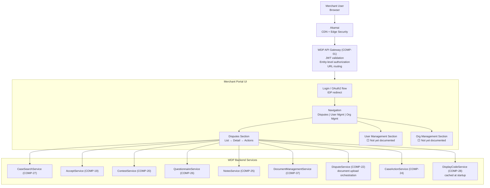

# WDP-COMP-49-MERCHANT-PORTAL
**Worldpay Dispute Platform — Component Reference**
*Version: 1.0 DRAFT | April 2026*
*Source: WDP_Portal_Dispute_Management_UI_Summary_v1.1.md + WDP architecture knowledge base*
*Architect-confirmed: PENDING*

---

## ━━━ CORE SKELETON ━━━━━━━━━━━━━━━━━━━━━━━━━━━━━━━━━━━━━━
*Mandatory for every component regardless of type.*

---

## Identity

| Field | Value |
|-------|-------|
| **Name** | `WDP Merchant Portal` |
| **Type** | `UI Application` |
| **Repository** | ⚠️ TBC — not yet confirmed from source |
| **Runtime** | ⚠️ TBC — technology stack (React / Angular / Vue) not confirmed |
| **Deployment** | AWS EKS — same cluster as WDP backend services |
| **Access path** | Merchant user → Akamai (CDN + edge security) → WDP API Gateway |
| **Status** | `✅ Production` |
| **Doc status** | `📝 DRAFT` |
| **Sections present** | `Core | Block A — UI Sections & Backend Calls` |

---

## Purpose

**What it does**

WDP Merchant Portal is the merchant-facing web application for the Worldpay Dispute Platform. It is the primary interface through which merchants view, manage, and respond to payment disputes. It exposes all dispute lifecycle actions available to merchants — searching and filtering disputes, viewing full dispute and transaction detail, accepting disputes, submitting contest responses with evidence and questionnaires, adding notes, and viewing attached documents.

All traffic routes through Akamai for CDN caching and edge security before reaching the WDP API Gateway. The API Gateway performs JWT validation and case-level authorization before routing requests to backend services. The portal itself does not perform authorization — it relies entirely on the API Gateway and backend services to enforce access control. Critically, role-based action visibility must be enforced in the portal UI, because CaseActionService (COMP-24) has no server-side RBAC enforcement (DEC-018 — accepted risk).

The portal is organized into four major sections. At April 2026, Disputes is the primary documented and buildable section. User Management and Org Management are in production but not yet documented at component level. Dashboard is planned and not yet built.

**What it does NOT do**

- Does not perform JWT authentication — authentication is handled by the enterprise IDP. The portal initiates OAuth 2.0 / OIDC login flows; it does not issue or validate tokens.
- Does not perform case-level authorization — the API Gateway (COMP-01) and CHAS (COMP-03) handle authorization for all non-NAP platforms. For NAP, UAMS (COMP-02) handles authorization.
- Does not have its own database — all state is owned by backend WDP services.
- Does not publish to Kafka — Kafka interaction is entirely backend.
- Does not include the Queues section — Queues is Ops Portal (COMP-50) only.
- Does not include Fax Queue — Ops Portal only.
- Does not include the Dashboard section — planned, not yet built.

---

## UI Section Coverage Status

| Section | Status | Documentation status |
|---------|--------|---------------------|
| Disputes | ✅ Production | 📝 Documented — see Section A below |
| User Management | ✅ Production | ⬜ Not yet documented — to be added |
| Org Management | ✅ Production | ⬜ Not yet documented — to be added |
| Dashboard | 🔴 Planned | ⬜ Not started |

---

## Internal Processing Flow

---

## Boundaries

### Inbound Interfaces

| Source | Protocol | Trigger | Description |
|--------|----------|---------|-------------|
| Merchant user (browser) | HTTPS via Akamai | User navigates to portal URL | All merchant interactions |
| Enterprise IDP | OAuth 2.0 / OIDC redirect | Login initiation / token refresh | Authentication flow |
| WDP API Gateway (COMP-01) | REST over HTTPS | All backend API responses | Routes to backend services after auth |

### Outbound Interfaces — Backend Service Calls

All calls route through the WDP API Gateway. Bearer JWT included on every request.

| UI Feature | Backend Target | Protocol | Endpoint | On failure |
|-----------|---------------|----------|----------|------------|
| Disputes List — search | CaseSearchService (COMP-27) | REST | `POST /{platform}/cases/search` | Show error state; retry option |
| Disputes List — queue counts | CaseSearchService (COMP-27) | REST | `GET /{region}/queues` | Show stale count |
| Dispute Details — case + actions | CaseSearchService (COMP-27) | REST | Case detail fan-out endpoint | Show error; refresh button |
| Display codes (labels, dropdowns) | DisplayCodeService (COMP-28) | REST | `POST /merchant/gcp/display-code/search` | Fallback to raw code values |
| UI tab permissions | DisplayCodeService (COMP-28) | REST | `GET /merchant/gcp/display-code/privileges` | Hide restricted tabs |
| Accept action | AcceptService (COMP-19) | REST | `POST /{platform}/cases/{caseNumber}/accept` | Show error; case status unchanged |
| Defend — questionnaire (Visa) | QuestionnaireService (COMP-26) | REST | `POST /merchant/gcp/questionnaire/visa/{stage}` | Show error; block submission |
| Defend — questionnaire (non-Visa) | QuestionnaireService (COMP-26) | REST | `POST /merchant/gcp/questionnaire/{responseType}` | Show error; block submission |
| Defend — document upload | DisputeService (COMP-22) | REST | `POST /{platform}/cases/{caseNumber}/documents` | Show upload error; retry |
| Defend — contest submission | ContestService (COMP-20) | REST | `POST /{platform}/cases/{caseNumber}/contest` | Show error; case state unchanged |
| Notes — view | NotesService (COMP-25) | REST | `GET /merchant/gcp/notes/{platform}/case/{caseNumber}` | Show empty state with warning |
| Notes — add | NotesService (COMP-25) | REST | `POST /merchant/gcp/notes/{platform}/case/{caseNumber}` | Show error; note not saved |
| Documents — view / download | DocumentManagementService (COMP-37) | REST | `GET /{platform}/documents/{caseNumber}` | Show unavailable message |
| Export — large file request | ⚠️ Backend service TBC | REST | ⚠️ Endpoint TBC | Show request failed |

---

## Database Ownership

This component owns no database state. All state is owned by WDP backend services.

---

## ━━━ BLOCK A — UI SECTIONS & FEATURE DETAIL ━━━━━━━━━━━━━━

---

## Section A — Disputes

*Source: WDP_Portal_Dispute_Management_UI_Summary_v1.1.md*
*Coverage: ✅ Documented to buildable level (with gaps noted)*

---

### A1. Disputes List (Search Grid)

The landing view for dispute triage. Merchants use this to search, filter, and take bulk or individual actions on their disputes.

#### A1.1 Toolbar & Controls

| Control | Behaviour |
|---------|-----------|
| Status dropdown | Filters by dispute status (e.g. Open) — default filter pre-applied |
| Case Owner dropdown | Filters by case owner (e.g. Merchant) |
| Filter button | Opens filter panel in right drawer |
| Sort button | Opens sort menu |
| Columns button | Opens column visibility and order manager |
| Export button | Opens export options menu |
| Items per page | Controls page size; pagination controls alongside |
| Actions column (per row) | Accept, Defend, … (More) per row — contextual to dispute state |

#### A1.2 Row Interactions

| Interaction | Result |
|------------|--------|
| Click row | Opens Quick View panel — reads **cached UI data**, no API call |
| Click case number | Navigates to Dispute Details page |
| Accept button (row) | Opens Accept confirmation modal |
| More (…) menu | Opens kebab: includes Add Note |

**Quick View:** Displays dispute snippet (amount, reason code, recent progress) from cached grid data. Mouse click only — keyboard Enter/Space do not open Quick View.

**Case Locking:** If a case is being edited elsewhere, all write actions are blocked and a "Case Locked" modal is shown with an Okay dismissal. No further actions until lock clears.

#### A1.3 Filter Panel

Opened via Filter button — renders as a right drawer.

**Default filters (representative):**

| Filter | Type |
|--------|------|
| Business Unit | Dropdown |
| Case Number | Text |
| Report Date | Date range |
| Due Date | Date range |
| Due Days | Numeric range |
| Currency + Min/Max Dispute Amount | Paired — currency and amounts activate together |
| Status | Multi-select |
| Reason Code | Multi-select |
| Scheme | Multi-select |
| Dispute Cycle | Multi-select |
| Dispute Actions | Multi-select |
| Case Owner | Dropdown |
| Case Liability | Multi-select |

**Advanced Filters (expanded section):** Issuer BIN, PAN last 4, network refs, MCC, sequences, and additional merchant/OPS fields.
⚠️ Which advanced filter fields are visible to Merchant vs Ops users is not yet confirmed — confirm with product team before building.

**High Count of Results modal:** If filter returns a large result set, user is offered: (a) view reduced set in UI, (b) export for full results. Guidance to refine filters shown.

#### A1.4 Sort Menu

| Sort option | Direction options |
|------------|-------------------|
| Due Days | Most→Least / Least→Most |
| Due Date | Nearest→Farthest / Farthest→Nearest |
| Dispute Amount | Highest→Lowest / Lowest→Highest |
| Reason Code | Highest→Lowest / Lowest→Highest |

Reset Sort returns to saved preset.

#### A1.5 Column Manager

- Toggle visibility, re-order (drag handles), Reset Columns
- **Default columns (in order):** Case No., Status, Due Days, Dispute Cycle, Reason Code, Scheme, Amount, Dispute Currency, ARN, Refunded, Actions (pinned right)
- **Additional available columns (examples):** Dispute Action, Sequence, Due Date, Report Date, Action Date, Expiration Date, Source Case No., Case Owner, Liability, Case Direction, MID, Company ID, Group ID, Outlet ID, Issuer BIN, PAN last4, Merchant Ref No., Airline Ticket No.
- **Amount + Currency rule:** Always behave as a pair — activate, pin, and move together. Cannot be separated.

#### A1.6 Accept from Grid

1. Click **Accept** on a row → confirmation modal
2. Modal shows: case number, amount, reason code + mandatory checkbox acknowledgment
3. Confirm → toast confirms success
4. If case locked → "Case Locked" modal instead

#### A1.7 Notes Quick Access (from grid)

- Row kebab → **Add Note** → opens notes drawer for that case
- Field expands as user types; supports long notes
- Notes log shows: author, timestamp, content

---

### A2. Export

| Volume | Behaviour |
|--------|-----------|
| ≤ 5,000 results | Export directly from UI — immediate file download |
| 5,001 – 25,000 | User requests backend file generation — processed asynchronously; available later in UI for download |
| > 25,000 | Export blocked — user must refine filters |

**Export format:** CSV (default). Filename format: `Dispute-Search-Results-YYYY-MM-DD`

**Export scope options:**
- Export This Page (N) — current page only
- Export All Results (M) — all results loaded across seen pages
- Export Selected (K) — checked rows only

⚠️ **Backend export status UI** (for async 5,001–25,000 flow) is **not yet built**. Status, history, retry, and download notification screens are future work. Do not build yet.

---

### A3. Dispute Details

Opens from grid (click case number) or from queue (Start Queue). Two-column layout.

#### A3.1 Left Column — Primary Tabs

**Tab 1: Case Details**

Three sub-sections:

| Sub-section | Key fields |
|------------|------------|
| Dispute Information | Case number, sequence, cycle, action, due date, amount, chargeback ref, owner, scheme, status, action date, reason code, report date, case liability, product name, fraud indicators, issuer dispute amount, duplicate/partial flags |
| Transaction Information | PAN last4, issuer BIN, transaction date, processing date, auth code, AVS/CVC, region, merchant ref, input method/capability, scheme response codes |
| Merchant Information | Merchant name, MID, company ID, group ID, outlet ID, MCC |

Queues chip list also shown (e.g. "High Value Disputes, Visa Disputes, +N").

**Tab 2: Card Dispute History**
⚠️ Listed in UI but not yet documented. Fields and data source TBC — add when confirmed.

**Tab 3: Card Transaction History**
⚠️ Listed in UI but not yet documented. Fields and data source TBC — add when confirmed.

#### A3.2 Right Column — Context Tabs

**Tab 1: Progress**
- Dispute Cycles timeline (e.g. Draft Retrieval → First Chargeback → Representment → Pre-Arb → Arbitration → Compliance → Outcome Win/Lose)
- Each stage: date, summary, View Documents link (when issuer/merchant docs exist)
- Outcome card (Win/Lose): brief reason text when available
- Document downloads originate from this tab

**Tab 2: Actions**
- Reverse-chronological audit of system and user actions
- Examples: "Automatic Business Rules Applied: VisaVal-R8", "Document Attached: Issuer Documents", "Merchant Response Documents"
- Each action: actor, timestamp, description

**Tab 3: Notes**
- Threaded notes with author chips and timestamps
- Add a note: expanding textarea, send button
- Notes can be long — input field grows dynamically

**Tab 4: Documents (View-Only)**
- List existing PDFs/images attached to the case
- Check for Documents — fetches latest from DocumentManagementService
- Click document → opens modal viewer with paging and zoom
- ⚠️ **No upload from this tab** — document upload occurs only inside Defend flows

#### A3.3 Primary Case Actions (top-right of detail view)

**Accept**
- Confirmation modal: case no., amount, reason code + mandatory acknowledgment checkbox
- On confirm: case accepted; toast confirmation
- Blocked if case locked

**Defend — two modes:**

*Mode 1: Full Service Response (direct submission to card network)*
1. Questions step — dynamic per scheme
   - Visa: specific prompts — Amount Type (Full or Split), comments
   - ⚠️ Per-scheme questionnaire catalog (MC, Amex, Discover, etc.) not yet documented — required before building non-Visa questionnaire forms
2. Documents step — evidence upload
3. Notes step — optional additional context
4. Submit Defense

*Mode 2: Add Response Documents (WDP handles defence)*
1. Documents step — evidence upload (same rules as Mode 1)
2. Notes step — optional
3. Submit Defense — hands off to WDP automations

**Evidence file rules (both modes):**
- Accepted formats: `.tiff`, `.tif`, `.pdf`, `.jpeg`, `.jpg`, `.png`
- Max file size: 5 MB
- Filename rules: letters, numbers, hyphens, underscores only — **no spaces**
- Max filename length: 80 characters including extension

**Refresh icon:** Re-fetches all case detail from backend (full API call — not cached).

---

## Section B — User Management

⚠️ **Not yet documented.** Section exists in production. Detail to be added when specification is available.

Known: available to merchants in both Merchant Portal and Ops Portal. Allows administrators to manage users, roles, and permissions within their organisation.

---

## Section C — Org Management

⚠️ **Not yet documented.** Section exists in production. Detail to be added when specification is available.

Known: available in both portals. Allows administrators to manage organisational hierarchies, merchant account configuration, and org-level settings.

---

## Section D — Dashboard

🔴 **Planned — not yet built.** Will provide dispute analytics and insights for merchants. No specification available yet.

---

## Risks and Known Issues

| Risk | Severity | Detail |
|------|----------|--------|
| RBAC enforcement is UI-only | 🔴 HIGH | CaseActionService (COMP-24) has no server-side role enforcement (DEC-018). The portal UI is the sole gate controlling which actions are visible to merchants vs ops. Any RBAC gap in the portal exposes all case actions to any authenticated user. |
| Scheme-specific questionnaire forms not specced | 🟠 HIGH | Defend → Full Service Response questionnaire is scheme-dependent. Only Visa example documented. Non-Visa forms (MC, Amex, Discover) cannot be built until per-scheme catalog is documented (open item in UI summary). |
| Card Dispute History and Card Transaction History tabs undocumented | 🟡 MEDIUM | Both tabs listed in left column but no fields or data sources specified. Cannot be built yet. |
| Merchant vs Ops filter field split undocumented | 🟡 MEDIUM | Advanced filter panel says "merchant/OPS fields" but does not specify which fields appear in which portal. Risk of building incorrect field set. Confirm with product team before building filter panel. |
| Backend async export status UI deferred | 🟡 MEDIUM | No UI specified for the 5,001–25,000 async export path. Users who trigger backend file generation have no way to check status or download result until this is built. |
| Tech stack not confirmed | 🟡 MEDIUM | Frontend framework (React / Angular / Vue), state management, routing library, and component library are not confirmed from source. Confirm before making architectural choices. |
| Case lock polling strategy not specified | 🟡 MEDIUM | The UI shows a "Case Locked" modal but it is not documented how the portal detects the lock state — whether on page load, on action attempt, or via polling. Confirm with team. |

---

## Open Questions

| Question | Action needed |
|----------|---------------|
| Frontend technology stack (framework, state management, component library) | Confirm from team or Copilot CLI on portal repository |
| Which filter fields appear in Merchant Portal vs Ops Portal | Product team confirmation before building filter panel |
| Per-scheme questionnaire field catalog (MC, Amex, Discover, etc.) | Product / BA team to document before building non-Visa questionnaire forms |
| Card Dispute History tab — fields, data source, API call | Product team to specify |
| Card Transaction History tab — fields, data source, API call | Product team to specify |
| Backend export status UI — specification for async export download flow | Product team to design |
| Case lock detection strategy — polling vs on-action-attempt | Team confirmation |
| User Management section specification | BA / product team |
| Org Management section specification | BA / product team |
| Which backend endpoint handles the 5,001–25,000 async export request | Backend team confirmation |
| Dashboard section — any design or timeline available | Product team |

---

## Documents to Update After Confirmation

| Document | What to update |
|----------|---------------|
| `WDP-COMP-INDEX.md` | Change COMP-49 doc status from `🔲 UI — separate action` to `📝 DRAFT` |
| `WDP-HANDOVER.md` | Note COMP-49 DRAFT file created; add any confirmed tech stack facts |

---

*Last updated: April 2026*
*Source: WDP_Portal_Dispute_Management_UI_Summary_v1.1 + WDP architecture knowledge base*
*Next step: Confirm open questions above, then fill User Management and Org Management sections*
