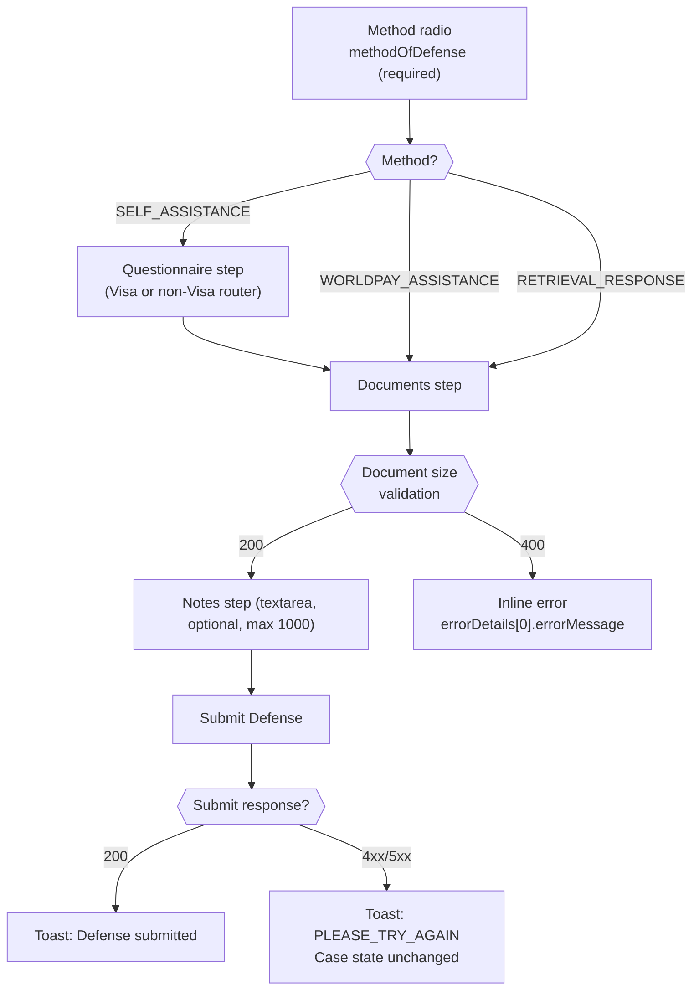
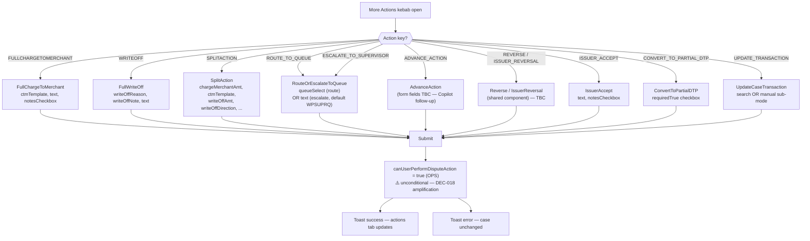
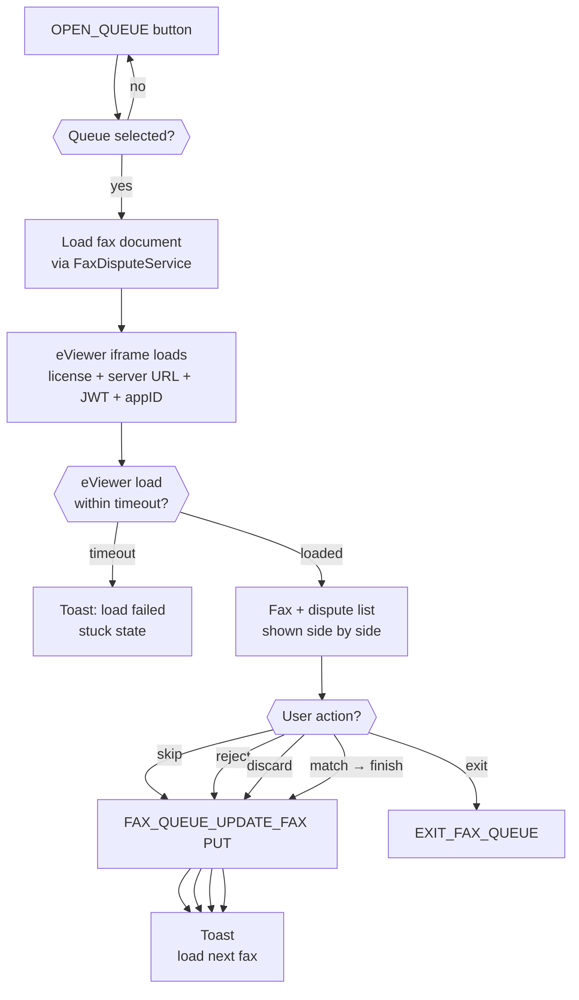

# WDP-COMP-49-WDP-PORTAL
**Worldpay Dispute Platform — Component Reference**
*Version: 3.0 DRAFT 🔍 | May 2026*
*Extracted from: `wdp-portal` — source-verified by Copilot CLI 2026-05-06*
*Architect-confirmed: PENDING*
*Supersedes v1.0 + v2.0 DRAFTs. Consolidates the previously separate `WDP-COMP-49-MERCHANT-PORTAL.md` and `WDP-COMP-50-OPS-PORTAL.md` into a single component file. COMP-50 is retained as a stub pointer.*

---

## ━━━ CORE SKELETON ━━━━━━━━━━━━━━━━━━━━━━━━━━━━━━━━━━━━━━

---

## Identity

| Field | Value |
|-------|-------|
| **Name** | `WDP Portal` |
| **Type** | `UI Application — Single-Page Application with two runtime modes` |
| **Component numbers** | `COMP-49` (Merchant mode) · `COMP-50` (Ops mode) — single canonical file at COMP-49; COMP-50 is a stub pointer |
| **Repository** | `wdp-portal` — single repository, single build artifact |
| **Runtime** | Angular 19.2.18 (standalone components) · TypeScript 5.6.2 · esbuild via `@angular-devkit/build-angular:application` |
| **Component libraries** | PrimeNG 19 · Ionic Angular 8.4.1 · AG Grid Enterprise 32.3 · `@wp-webcomponent/design-tokens` 2.7.1-alpha.4 |
| **OIDC client** | `angular-oauth2-oidc` 19.0.0 |
| **Deployment** | AWS EKS — same cluster as WDP backend services |
| **Mode discrimination** | Runtime — DNS hostname (`merchantBaseUrl` vs `opsBaseUrl`) + IDP firm name + `featurePermissionCheck` |
| **Access path — Merchant mode** | Merchant / PB user → Akamai (CDN + edge security) → WDP API Gateway (COMP-01) — `merchantBaseUrl` |
| **Access path — Ops mode** | Ops user → **direct** to WDP API Gateway (no Akamai) — `opsBaseUrl` |
| **User types served** | `MERCHANT` (external IDP firm, merchant DNS) · `PB_USER` (`us_worldpay_fis_int` firm, merchant DNS — Worldpay-internal acting on merchant URL) · `OPS` (`us_worldpay_fis_int` firm, internal DNS) |
| **Status** | `✅ Production` |
| **Doc status** | `📝 DRAFT 🔍` — source-verified 2026-05-06, architect confirmation pending |
| **Sections present** | `Core · Block A — UI Sections & Backend Calls` |

---

## Purpose

**What it does**

WDP Portal is the customer-facing and operations-facing web application for the Worldpay Dispute Platform. It is a **single Angular 19 SPA built once and gated at runtime** to present one of two modes:

- **Merchant mode** (COMP-49) — customer-facing path, served via `merchantBaseUrl` through Akamai. Serves `MERCHANT` user type (external IDP firms) and `PB_USER` user type (Worldpay-internal users acting on merchant URL via the internal IDP firm).
- **Ops mode** (COMP-50) — internal operations-facing path, served via `opsBaseUrl` directly to the API Gateway with no Akamai in front. Serves `OPS` user type only (`us_worldpay_fis_int` firm via internal DNS).

Mode is determined at runtime by the combination of DNS hostname (resolved by `EnvironmentService` at APP_INITIALIZER from `/assets/config/wdp_env_config.json`) and IDP firm name (resolved by `WdpSharedService` from the JWT after OIDC redirect). There is no separate build, no compile-time feature flag, and no distinct entry point per mode.

The portal exposes the merchant-eligible subset of dispute lifecycle actions in Merchant mode — searching and filtering disputes, viewing full dispute and transaction detail, accepting disputes, submitting contest responses with evidence and questionnaires, adding notes, and viewing attached documents. In Ops mode it additionally exposes queue-based workload management, eleven More-Actions sub-types, Fax Matching with eViewer integration, and Fax Analytics reporting.

Section coverage is **platform-conditional and mode-conditional**. Disputes is universal. Administration (User Management + Organization Management + Payment Entity disabled) is gated to NAP only — US-platform users on CORE or PIN do not see Administration in either mode. Fax Matching and Fax Analytics are gated to CORE platform and OPS user type — visible in Ops mode on CORE only. Card-history tabs on the dispute detail screen are platform-gated independently. Dashboard and Automations are planned (left-nav entries commented out in source).

**What it does NOT do**

- Does not perform JWT issuance or validation — the enterprise IDP issues; the API Gateway validates.
- Does not perform case-level authorization — the API Gateway (COMP-01), CHAS (COMP-03), and UAMS (COMP-02) handle authorization. The portal's `featurePermissionCheck()` is **advisory UI gating only**.
- Does not have its own database — all state is owned by backend WDP services.
- Does not produce or consume Kafka — Kafka interaction is entirely backend.
- Does not produce two build artifacts — single Angular bundle, runtime mode resolution.
- Does not include the Dashboard or Automations sections — planned, not built (left-nav commented out).
- Does not write clear PAN to client-side persistent storage (localStorage / sessionStorage / IndexedDB / cookies). Decrypted PAN is held in AG Grid row data in memory only.
- **[MERCHANT MODE]** does not include the Queues, Fax Matching, Fax Analytics, or More Actions surfaces — these are Ops-mode only.
- **[OPS MODE]** does not route through Akamai — internal traffic only.

---

## UI Section Coverage Status

| Section | Status | Merchant mode | Ops mode | Platform gating | Source |
|---------|--------|---------------|----------|-----------------|--------|
| Disputes | ✅ Production | ✅ | ✅ | All platforms | Section A |
| Queues | ✅ Production | ❌ | ✅ | All platforms | Section B |
| Fax Matching | ✅ Production | ❌ | ✅ | **CORE only** | Section C |
| Fax Analytics | ✅ Production | ❌ | ✅ | **CORE only** | Section D |
| Administration — User Management | ✅ Production | ✅ | ✅ | **NAP only** | Section E |
| Administration — Organization Management | ✅ Production | ✅ | ✅ | **NAP only** | Section E |
| Administration — Payment Entity Management | ⚪ Disabled | — | — | `featurePermissionCheck` always returns false | Section E note |
| Card Authorization History (Dispute Detail tab) | ✅ Production | ✅ | ✅ | **CORE only** | Section A |
| Card Settlement History (Dispute Detail tab) | ✅ Production | ✅ | ✅ | **CORE + PIN** | Section A |
| Card Dispute History (Dispute Detail tab) | ✅ Production | ✅ | ✅ | **CORE + PIN** | Section A |
| Transaction Details (Dispute Detail tab) | ✅ Production | ✅ | ✅ | All platforms | Section A |
| More Actions (per-row + detail-screen) | ✅ Production | ❌ | ✅ | All platforms (Ops bypass) | Section A6 |
| Dashboard | 🔴 Planned | — | — | — | Section F |
| Automations | 🔴 Planned | — | — | — | Section G |

⚠️ **CORRECTION from v1.0:** v1.0 documented Administration as available to all platforms. Source confirms NAP-only gating via `featurePermissionCheck` in `wdp.util.service.ts:241-248`.
⚠️ **CORRECTION from v1.0:** v1.0 listed "Fax Queue" as one section in Ops Portal. Source carries two distinct routes — `/wdp/fax-matching` (operator workflow with eViewer) and `/wdp/fax-analytics` (reporting), both CORE-only and OPS-only.

---

## Internal Processing Flow

```mermaid
flowchart TD
    USER["User<br/>Browser"]
    DNS{{"Access URL?"}}
    AKAMAI["Akamai<br/>CDN + Edge Security"]
    LOAD["SPA bundle loaded<br/>APP_INITIALIZER fires"]
    CFG["EnvironmentService fetches<br/>/assets/config/wdp_env_config.json"]
    BASEURL_M["apiBaseUrl = merchantBaseUrl"]
    BASEURL_O["apiBaseUrl = opsBaseUrl"]
    OAUTH["IDP redirect<br/>OAuth 2.0 + PKCE"]
    IDP{{"IDP firm name"}}
    DNS_USER{{"DNS context?"}}
    UNAUTH["/unauthorized"]
    MERCHANT_T["userType = MERCHANT<br/>[MERCHANT MODE]"]
    PB_T["userType = PB_USER<br/>[MERCHANT MODE]"]
    OPS_T["userType = OPS<br/>[OPS MODE]"]
    PERMS["GET /display-code/privileges<br/>cached for session<br/>(no refresh)"]
    BOOT["App ready — route resolution"]
    GUARD{{"WdpAuthGuard +<br/>WdpChildRouteGuard"}}
    PERMCHECK{{"featurePermissionCheck<br/>per route per platform"}}
    HIDE["Section hidden in left-nav<br/>or route blocked"]

    DISP["/wdp/disputes<br/>[BOTH]"]
    DET["/wdp/disputes/:caseNumber<br/>[BOTH]"]
    QUEUES["/wdp/queues<br/>[OPS]"]
    QDET["/wdp/queues/:queueId/:caseNumber<br/>[OPS]"]
    FAXM["/wdp/fax-matching<br/>[OPS · CORE only]"]
    FAXA["/wdp/fax-analytics<br/>[OPS · CORE only]"]
    ADMIN["/wdp/administration/*<br/>[BOTH · NAP only]"]

    GW["WDP API Gateway COMP-01"]
    INT401{{"401?"}}
    REFRESH["Silent token refresh"]
    REFRESH_OK{{"Refresh<br/>succeeded?"}}
    LOGOUT["Forced logout"]
    LOCK{{"Case locked?"}}
    LOCKMODAL["Case Locked modal<br/>Okay only"]

    ACTBR{{"Action requested<br/>on case?"}}
    ACT_AC["Accept modal<br/>[BOTH]"]
    ACT_DEF["Defend state machine<br/>(3 modes) [BOTH]"]
    ACT_MORE["More Actions modal<br/>(11 sub-types) [OPS]"]
    ACT_BYPASS["canUserPerformDisputeAction<br/>= true unconditionally for OPS<br/>⚠️ DEC-018 amplification"]
    ACT_API["API call to action service"]
    ACT_OK["Toast success<br/>actions tab updates"]
    ACT_ERR["Toast error<br/>case state unchanged"]

    USER --> DNS
    DNS -->|merchantBaseUrl| AKAMAI --> LOAD
    DNS -->|opsBaseUrl| LOAD
    LOAD --> CFG
    CFG -->|merchant DNS| BASEURL_M --> OAUTH
    CFG -->|ops DNS| BASEURL_O --> OAUTH
    OAUTH --> IDP
    IDP -->|no match / token invalid| UNAUTH
    IDP -->|external firm| MERCHANT_T
    IDP -->|us_worldpay_fis_int| DNS_USER
    DNS_USER -->|merchant DNS| PB_T
    DNS_USER -->|internal DNS| OPS_T
    MERCHANT_T --> PERMS
    PB_T --> PERMS
    OPS_T --> PERMS
    PERMS --> BOOT --> GUARD
    GUARD -->|allow| PERMCHECK
    GUARD -->|deny| UNAUTH
    PERMCHECK -->|gated| HIDE

    PERMCHECK --> DISP
    PERMCHECK --> DET
    PERMCHECK --> QUEUES
    PERMCHECK --> QDET
    PERMCHECK --> FAXM
    PERMCHECK --> FAXA
    PERMCHECK --> ADMIN

    DISP -->|API call| GW
    DET --> LOCK
    LOCK -->|locked| LOCKMODAL
    LOCK -->|unlocked| ACTBR
    ACTBR -->|Accept| ACT_AC
    ACTBR -->|Defend| ACT_DEF
    ACTBR -->|More Actions [OPS only]| ACT_MORE
    ACT_AC --> ACT_BYPASS
    ACT_DEF --> ACT_BYPASS
    ACT_MORE --> ACT_BYPASS
    ACT_BYPASS --> ACT_API
    ACT_API --> GW
    QDET --> ACTBR
    QUEUES -->|API call| GW
    FAXM -->|eViewer iframe + API| GW
    FAXA -->|API call| GW
    ADMIN -->|API call| GW

    GW --> INT401
    INT401 -->|2xx| ACT_OK
    INT401 -->|4xx/5xx ≠401| ACT_ERR
    INT401 -->|401| REFRESH --> REFRESH_OK
    REFRESH_OK -->|yes — retry once| GW
    REFRESH_OK -->|no| LOGOUT
```

---

## Boundaries

### Inbound Interfaces

| Source | Mode | Protocol | Trigger | Description |
|---|---|---|---|---|
| Merchant user (browser) | [MERCHANT] | HTTPS via Akamai | User navigates to `merchantBaseUrl` | External customer entry |
| PB user (browser) | [MERCHANT] | HTTPS via Akamai | Worldpay-internal user accesses `merchantBaseUrl` while authenticated against internal IDP firm | Acting-on-behalf-of-merchant |
| Ops user (browser) | [OPS] | HTTPS — direct to API Gateway, no Akamai | User navigates to `opsBaseUrl` | Internal-only entry |
| Enterprise IDP | [BOTH] | OAuth 2.0 / OIDC redirect | Login initiation, silent refresh | Authentication; per-firm config loaded at runtime from external JSON |
| WDP API Gateway (COMP-01) | [BOTH] | REST over HTTPS | Backend API responses | Routes to backend services after auth |
| eViewer License Management Service | [OPS] | HTTP — proxied via FaxQueueService (COMP-29) | iframe load + license request | Per-user eViewer license activation / extend / deactivate |
| eViewer Server | [OPS] | HTTP iframe | Embedded viewer | Renders fax document image stream |

### Outbound Interfaces — Backend Service Calls

All API calls route through the WDP API Gateway. Bearer JWT attached by `Http401ErrorInterceptor`. Region passed as URL path parameter `{0}` (US or UK), platform passed as `{0}` for platform-scoped calls. `v-correlation-id` header attached by `BaseService` (timestamp-based UUID — see Risks).

The `Mode` column indicates which portal mode invokes the endpoint: `[BOTH]` for shared, `[MERCHANT]` or `[OPS]` for mode-exclusive.

| UI Feature | Mode | Backend Target | Method | Endpoint constant | Path | On failure |
|---|---|---|---|---|---|---|
| Disputes List — search | [BOTH] | CaseSearchService (COMP-27) | POST | `FETCH_DISPUTES` | `/{region}/disputes/search` | Toast + retry |
| Dispute Detail load | [BOTH] | CaseSearchService (COMP-27) | GET | `FETCH_DISPUTE_CASE_DETAILS` | `/{region}/disputes/{caseNumber}` | Inline error + reload button |
| Dispute Detail (queue context) | [OPS] | CaseSearchService (COMP-27) | GET | `FETCH_DISPUTE_CASE_DETAILS_FOR_QUEUES` | `/{region}/disputes/{caseNumber}?actionSequence={seq}` | Same |
| Action rules per row | [BOTH] | CaseActionService (COMP-24) | GET | `FETCH_ACTION_RULES` | `/{region}/disputes/{caseNumber}/actions/{seq}/rules` | Hide actions menu |
| Dispute activities | [BOTH] | CaseManagementService (COMP-23) | GET | `FETCH_DISPUTE_ACTIVITIES` | `/{region}/disputes/{caseNumber}/activities` | Empty list |
| Dispute progress | [BOTH] | CaseManagementService (COMP-23) | GET | `FETCH_DISPUTE_PROGRESS` | `/{region}/disputes/{caseNumber}/progress` | Inline error |
| Notes — view | [BOTH] | NotesService (COMP-25) | GET | `FETCH_NOTES` | `/{region}/disputes/{caseNumber}/notes` | Empty state with warning |
| Notes — add | [BOTH] | NotesService (COMP-25) | POST | `ADD_NOTE` | `/{region}/disputes/{caseNumber}/notes` | Toast; note not saved |
| Documents — view | [BOTH] | DocumentManagementService (COMP-37) | GET | `FETCH_DOCUMENTS` | `/{region}/disputes/{caseNumber}/documents` | Unavailable message |
| Documents — download | [BOTH] | DocumentManagementService (COMP-37) | GET | `DOWNLOAD_DOCUMENT` | `/{region}/disputes/{caseNumber}/documents/{docId}` | Toast |
| Display codes (labels, dropdowns) | [BOTH] | DisplayCodeService (COMP-28) | GET | `FETCH_DISPLAY_CODES` | `/display-code/{type}` | Fallback to raw codes |
| UI permissions / privileges | [BOTH] | DisplayCodeService (COMP-28) | GET | `FETCH_PRIVILEGES` | `/display-code/privileges` | Hide gated sections |
| Accept action | [BOTH] | AcceptService (COMP-19) | POST | `ACCEPT_DISPUTE` | `/{region}/disputes/{caseNumber}/actions/{seq}/accept` | Toast |
| Defend — document upload | [BOTH] | DisputeService (COMP-22) | POST | `UPLOAD_DOCUMENT` | `/{region}/disputes/{caseNumber}/actions/{seq}/documents` | Toast; retry |
| Defend — document size validation | [BOTH] | DisputeService (COMP-22) | GET | `VALIDATE_DOCUMENT_SIZE` | `/{region}/disputes/{caseNumber}/actions/{seq}/validate-document-size` | 400 → inline error |
| Defend — submit | [BOTH] | ContestService (COMP-20) | POST | `DEFEND_DISPUTE` | `/{region}/disputes/{caseNumber}/actions/{seq}/defend` | Toast |
| More Actions — submit | [OPS] | CaseActionService (COMP-24) | POST | `MORE_ACTIONS` | `/{region}/disputes/{caseNumber}/actions/{seq}/more-actions` | Toast |
| Update Case (route to queue, escalate) | [OPS] | CaseManagementService (COMP-23) | PUT | `UPDATE_CASE` | `/{region}/disputes/{caseNumber}` | Toast |
| Update Case (admin update) | [BOTH] | CaseManagementService (COMP-23) | PUT | `UPDATE_CASE` | (same path) | Toast |
| Enrich merchant transaction (Update Transaction action) | [OPS] | CaseManagementService (COMP-23) | POST | `ENRICH_MERCHANT_TRANSACTION` | `/{region}/disputes/{caseNumber}/enrich` | Toast |
| Card Authorization History (CORE only) | [BOTH] | MerchantTransactionService (COMP-34) | POST | `FETCH_CARD_AUTH_HISTORY_LIST` | `/{region}/card-authorization-history/search` | Inline error |
| Card Auth Summary (CORE only) | [BOTH] | MerchantTransactionService (COMP-34) | POST | `FETCH_CARD_ACTIVITY_SUMMARY` | `/{region}/card-authorization-history/summary` | Hide summary |
| Card Settlement History (CORE+PIN) | [BOTH] | MerchantTransactionService (COMP-34) | POST | `FETCH_CARD_SETTLEMENT_HISTORY_LIST` | `/{region}/card-settlement-history/search` | Inline error |
| Card Dispute History (CORE+PIN) | [BOTH] | CaseSearchService (COMP-27) | POST | `FETCH_DISPUTES` (reuse) | `/{region}/disputes/search` | Inline error |
| Card Dispute Summary (CORE+PIN) | [BOTH] | CaseSearchService (COMP-27) | POST | `FETCH_CARD_DISPUTE_SUMMARY` | `/{region}/disputes/summary` | Hide summary |
| Transaction Details | [BOTH] | CaseManagementService (COMP-23) | GET | `FETCH_TRANSACTION_DETAILS` | `/{region}/disputes/{caseNumber}/transactions` | Inline error |
| PAN decrypt | [BOTH] | EncryptionService (COMP-35) | POST | `PAN_DECRYPT` | `/encryption/v1/pan/decrypt` | Show masked value |
| Queues — list | [OPS] | UserQueueSkillService (COMP-30) | GET | `FETCH_QUEUES` | `/{region}/queues` | Empty state |
| Queue dispute list | [OPS] | UserQueueSkillService (COMP-30) | POST | `FETCH_SELECTED_QUEUE_DETAILS` | `/{region}/queues/{queueId}/disputes` | Empty with error |
| Fax queue update (Match / Reject / Discard / Skip) | [OPS] | FaxQueueService (COMP-29) | PUT | `FAX_QUEUE_UPDATE_FAX` | `/{region}/fax/{faxId}` | Toast per action |
| Fax inventory report | [OPS] | FaxQueueService (COMP-29) | POST | `FETCH_FAX_INVENTORY_REPORT` | `/{region}/fax/reports/inventory` | Empty state |
| Fax all-users productivity | [OPS] | FaxQueueService (COMP-29) | POST | `FETCH_FAX_ALL_USERS_PRODUCTIVITY` | `/{region}/fax/reports/productivity` | Empty state |
| Fax detailed productivity | [OPS] | FaxQueueService (COMP-29) | POST | `FETCH_FAX_DETAILED_PRODUCTIVITY` | `/{region}/fax/reports/productivity/detailed` | Empty state |
| eViewer license proxy | [OPS] | FaxQueueService (COMP-29) | POST | (license endpoints) | `/{region}/fax/lm/...` | Toast; iframe blocked |
| LFT export request | [BOTH] | UserQueueSkillService (COMP-30) | POST | `LFT_EXPORT_REQUEST` | `/{region}/exports` | Too Many Results modal on `LFT_LIMIT_EXCEEDED` |
| LFT downloads list | [BOTH] | UserQueueSkillService (COMP-30) | GET | `FETCH_LFT_DOWNLOADS` | `/{region}/exports` | Empty state |
| LFT download file | [BOTH] | UserQueueSkillService (COMP-30) | GET | `DOWNLOAD_LFT_FILE` | `/{region}/exports/{reportName}` | Toast |
| LFT delete one | [BOTH] | UserQueueSkillService (COMP-30) | DELETE | `DELETE_LFT_EXPORT` | `/{region}/exports/{reportName}` | Toast |
| LFT delete all | [BOTH] | UserQueueSkillService (COMP-30) | DELETE | `DELETE_ALL_LFT_EXPORTS` | `/{region}/exports` | Toast |
| Saved filters — fetch / save | [BOTH] | UserQueueSkillService (COMP-30) | GET / POST | `FETCH_SAVED_FILTERS` / `SAVE_FILTERS` | `/{region}/saved-filters/{gridName}` | Empty state / toast |
| Entity hierarchy — search | [BOTH] | OrgManagementService (COMP-33) | POST | `FETCH_ENTITY_HIERARCHY` | `/{region}/entity-hierarchy/search` | Inline error |
| User tooltip lookup | [BOTH] | UserQueueSkillService (COMP-30) | GET | `USER_TOOLTIP` | `/{region}/users/{userId}/tooltip` | Suppress tooltip |
| Users — list / create / update | [BOTH · NAP] | UserQueueSkillService (COMP-30) | GET / POST / PUT | `FETCH_USERS` / `CREATE_USER` / `UPDATE_USER` | `/{region}/users[/{id}]` | Empty / toast |
| Organizations — list / child / MID / bulk / parent | [BOTH · NAP] | OrgManagementService (COMP-33) | GET / POST / PUT | `FETCH_ORGANIZATIONS`, `CREATE_CHILD_ENTITY`, `ADD_MIDS`, `UPDATE_MID`, `BULK_UPLOAD_MERCHANTS`, `UPDATE_PARENT_MERCHANT` | `/{region}/organizations/...` | Empty / toast |

⚠️ **Backend dependency surface expanded substantially from v1.0.** v1.0 listed approximately 17 endpoints. Source contains **49 distinct endpoints** in `service-def.constants.ts`. Mode-conditional invocation is encoded above.

---

## Database Ownership

This component owns no database state in either mode. All state is owned by WDP backend services. **No client-side persistent storage of business data** — see Risks for token-storage details.

---

## ━━━ BLOCK A — UI SECTIONS & FEATURE DETAIL ━━━━━━━━━━━━━━

---

## Section A — Disputes [BOTH]

*Source: `src/app/features/disputes/*` and `src/app/features/dispute-detail/*` and `src/app/features/dispute-actions/*`*
*Coverage: ✅ Buildable*

### A1. Disputes List (Search Grid) [BOTH]

The landing view for dispute triage. Server-side paginated AG Grid Enterprise with quick-view popover and "too many results" handling.

#### A1.1 Toolbar & Controls

| Control | Behaviour |
|---|---|
| Status filter | Default filter pre-applied (Open) |
| Case Owner filter | Filters by case owner |
| Filter button | Opens filter side-panel (right drawer) |
| Sort button | Opens sort menu |
| Columns button | Opens column visibility / order / pin manager |
| Export button | Two-step flow: scope → file type |
| Items per page | Page-size selector |
| Actions column | Per-row contextual actions; **More Actions kebab visible only in [OPS MODE]** |

#### A1.2 Pagination

- Default page size: **20**
- Page-size options: **10 / 20 / 50 / 100 / 200**
- Default fetch records per page from backend: **200**

#### A1.3 Row Interactions

| Interaction | Result |
|---|---|
| Click row (mouse only) | Opens Quick View popover — platform, case number, action sequence, breadcrumbs |
| Enter / Space on row | **Does not open Quick View** — confirmed in source |
| Click case number cell | Navigates to Dispute Details |
| Click Actions menu | Fetches action rules (`FETCH_ACTION_RULES`) before showing menu |

**Case Locking:** If a case is locked elsewhere, write actions are blocked and the Case Locked modal is shown with an Okay dismissal. Lock detection is **on action attempt** — no polling or websocket subscription confirmed in source.

#### A1.4 Filter Panel — Default Filters

⚠️ **Filter set is metadata-driven from backend, not hardcoded.** Field visibility (`fieldVisibility`) per metadata controls Merchant-mode vs Ops-mode field surface. Confirmed-present fields:

| Filter | Type |
|---|---|
| Case Number | Text |
| ARN | Text |
| Issuer BIN | Text |
| PAN last 4 | Text |
| Card Number (full PAN) | Text — ⚠️ PCI input |
| Case Status | Multi-select |
| Min / Max Dispute Amount | Numeric pair, linked to Currency |
| Plus metadata-driven fields (Business Unit, Report Date, Due Date, Due Days, Currency, Reason Code, Scheme, Dispute Cycle, Dispute Actions, Case Owner, Case Liability, etc.) | Per metadata response |

**Linked-field gating:** Currency activates Min/Max Dispute Amount; Dispute Cycle activates Dispute Action — confirmed at `filter-disputes.component.ts:167-244`.

**Buttons:** Reset / Cancel / Apply.

#### A1.5 Sort Menu

Sort options are built dynamically from grid column `sortingLabels`:

| Sort field | Direction options |
|---|---|
| Due Days | Most→Least / Least→Most |
| Due Date | Nearest→Farthest / Farthest→Nearest |
| Dispute Amount | Highest→Lowest / Lowest→Highest |
| Reason Code | Highest→Lowest / Lowest→Highest |

Reset Sort returns to saved preset.

#### A1.6 Column Manager

- Toggle column visibility
- Reorder via drag handles
- Pin / unpin (left or right)
- Hide column from header menu (`HeaderRendererComponent`)
- Reset Columns

**Default columns (confirmed from source):** Case Number (with quick-view trigger), Case Status, Due Days, Dispute Cycle, Reason Code, Card Scheme, Dispute Amount, Dispute Currency, ARN, Refunded, Actions (pinned right). Column model carries 67+ field definitions; visibility per role / platform is metadata-driven.

#### A1.7 Export

**Two-step flow** — scope, then file type.

**Scope options:** Current Page (N) / All Results (M) / Selected (K).
**File types:** CSV / XLSX.
**LFT (Large File Transfer) tier:** triggered when `totalCount > 200` **OR** `isAlwaysLFTExport=true`.

⚠️ **CORRECTION from v1.0:** v1.0 documented LFT threshold as 5,001–25,000 records. Source threshold is **200**.

**Filename pattern:** `Dispute-Search-Results-YYYY-MM-DD`.

**Backend export status flow:** Downloads manager (in header popover) lists in-flight exports — fetch / download / delete one / delete all. Status-driven enable.

#### A1.8 Too Many Results Modal

Triggered by backend `LFT_LIMIT_EXCEEDED` response. If LFT-eligible: offers "Export results"; else: shows guidance to refine filters.

---

### A2. Dispute Details [BOTH]

Two-column layout. Tab visibility per platform and per mode.

#### A2.1 Left Column — Primary Tabs

| Tab | Platform gating | Mode gating |
|---|---|---|
| Case Overview | All | [BOTH] |
| Transaction Details | All | [BOTH] |
| Card Authorization History | **CORE only** | [BOTH] |
| Card Settlement History | **CORE + PIN** | [BOTH] |
| Card Dispute History | **CORE + PIN** | [BOTH] |

#### A2.2 Case Overview Tab

Two-panel layout: left panel (Case Detail) + right panel (Progress / Actions / Notes / Documents).

**Case Detail field display difference:** `[OPS MODE]` users see codes plus descriptions; `[MERCHANT MODE]` users see descriptions only. UK-specific fields render conditionally on NAP platform. Source: `case-detail.component.ts:24-204`.

**Right Panel sub-tabs:**

| Sub-tab | Content | API |
|---|---|---|
| Progress | Stage timeline (REQ, PAB, RE2, CH1, CH2, ARB, APC, ACF + Outcome Win/Loss) | `FETCH_DISPUTE_PROGRESS` |
| Actions | Reverse-chronological audit. **[MERCHANT MODE]** filters out `CASE_BR` and `System Note` activities. **[OPS MODE]** shows all. | `FETCH_DISPUTE_ACTIVITIES` |
| Notes | Threaded notes (textarea, max 750). **[MERCHANT MODE]** filters out `SNOTE` note type. **[OPS MODE]** shows all. | `FETCH_NOTES` / `ADD_NOTE` |
| Documents | View-only list; click opens viewer modal; **no upload from this tab** | `FETCH_DOCUMENTS` / `DOWNLOAD_DOCUMENT` |

When an action is in progress (DEFEND or ACCEPT), the right panel **swaps** to the action component (`<app-defend-dispute>` or `<app-accept-dispute>`).

#### A2.3 Transaction Details Tab

Grid with ~30 columns (activity type, card number, amounts, currencies, dates, auth code, ARN, terminal info, transaction codes, AVS, CVV2 response, etc.). Transaction note appears when a row of type `SETTLE` carries a non-empty `transactionNote`.

#### A2.4 Card Authorization History Tab (CORE only)

Filter fields: `transactionDate`, `minTransactionAmount`, `maxTransactionAmount`. Summary card: RETRIEVALS count + amount; CHARGEBACKS count + amount. Grid: ~40 columns including auth-specific fields per `card-authorization-history.model.ts:12-295`.

#### A2.5 Card Settlement History Tab (CORE + PIN)

Filter fields: `transactionDate`, `minTransactionAmount`, `maxTransactionAmount`. Grid: ~30 columns of settlement-specific fields per `card-settlement-history.model.ts:12-237`.

#### A2.6 Card Dispute History Tab (CORE + PIN)

API: reuses `FETCH_DISPUTES` plus `FETCH_CARD_DISPUTE_SUMMARY`. Grid: dispute-list grid minus checkbox; sorting and filtering disabled except case number. Error: `"Card Number is not present to fetch Card Dispute History."` if record carries no card number.

---

### A3. Accept Action [BOTH]

Modal flow (`AcceptDisputeModalComponent`).

**Form fields** (`accept-dispute.component.ts:36-155`):

| Field | Type | Validation |
|---|---|---|
| `text` (note) | Text | Required; card-network-specific regex (Mastercard vs default) |
| `acceptDisputeCheckbox` | Checkbox | Gates Submit button |
| `CATEGORY_1` | Text | Macy's-only — `userOrgId ∈ APP_ENV.macysOrgIds` AND platform ≠ NAP |
| `CATEGORY_2` | Text | Same |
| `AMOUNT_1` | Currency | Same |
| `AMOUNT_2` | Currency | Same |
| `DEPARTMENT_NUMBER` | Text | Same |

⚠️ **Macy's-specific dynamic fields are an undocumented organisation-gated path.** Org list comes from `APP_ENV.macysOrgIds` in runtime config.

**Toasts:** success — `CASE_TEXT; {caseNumber}; ACCEPT_DISPUTE_SUCCESS_MESSAGE` · error — `ERROR_TOAST_MESSAGE`. Auto-closes on dispute-state refresh.

---

### A4. Defend Action — State Machine [BOTH]

⚠️ **CORRECTION from v1.0:** v1.0 documented two Defend modes. Source has **three**:

| Method | Steps | Source |
|---|---|---|
| `SELF_ASSISTANCE` (Full Service Response) | Questions → Documents → Notes → Submit | `defend-dispute.component.ts:29-278` |
| `WORLDPAY_ASSISTANCE` (Add Response Documents) | Documents → Notes → Submit | Same |
| `RETRIEVAL_RESPONSE` | Documents → Notes → Submit | Same |

Single eligible method auto-selected if only one option. Tab navigation is forward-only (current and prior tabs only). `Save and Continue` advances with questionnaire / document validation and a document-size pre-check.



#### A4.1 Questionnaire — Visa Router

Routes by stage and reason code to one of six components: `VisaInvalidDisputeComponent`, `VisaDisputedTransactionComponent`, `VisaAllocationPrearbComponent`, `VisaAllocationArbComponent`, `VisaDisprespComponent`, `VisaCollabPrearbRespComponent`.

⚠️ **CORRECTION from v1.0:** v1.0 noted "Visa: Amount Type, comments". Source carries six distinct Visa questionnaire components routed by stage and reason code.

**Visa Invalid Dispute fields** (`visa-invalid-dispute.component.ts:35-143`):

| Field | Required when |
|---|---|
| `invalidDisputeReason` | Always (unless reason ∈ `invalidReasonCode`) |
| `explanation` | Reason ∈ `explanationResonCode` |
| `authorizationObtainedDate` | `reasonCode === '1204'` |
| `cancellationDate` | Selected reason `IDRC3` |
| `notListedDisputeInvalidReason` | Selected reason `IDRC25` |

**Visa Disputed Transaction fields** (`visa-disputed-transaction.component.ts:94-110`):

| Field | Validation |
|---|---|
| `deviceIDDetails` | minlength 15, maxlength 64 |
| `deviceFingerprintingDetails` | minlength 20, maxlength 50 |
| `deviceTypeDetails` | — |
| `ipAddr` | IPv4 pattern |
| `customerAccountLoginIDDetails` | — |
| `deliveryAddressDetails` | — |
| Cross-field | At least one device field; at least one of account / address |

#### A4.2 Questionnaire — Non-Visa Router

Single `NonVisaNetworkQnComponent` with conditional fields per network and representment code (`non-visa-network-qn.component.ts:93-189`):

| Field | Required when |
|---|---|
| `fullPartialAmount` | Always |
| `representmentCode` | MC / MAESTRO + CH1 / RE2 |
| `authorizationDate` | `representmentCode === 2008` |
| `authCode` | `representmentCode === 2008` (regex `^[a-zA-Z0-9]{1,15}$`) |
| `creditIssuedDate` | `representmentCode === 2011` |
| `arn` | `representmentCode === 2011` (regex `^[0-9]{1,30}$`) |
| `comments` | Other codes (max 100, alnum / symbol pattern) |

⚠️ **No per-scheme distinct components for Mastercard / Amex / Discover / others.** v1.0 flagged "per-scheme questionnaire catalog not yet documented" — source resolves this: non-Visa schemes share a single component with conditional logic. Per-scheme behaviour is config-driven, not per-component.

#### A4.3 Documents Step

| Rule | Value |
|---|---|
| Accepted MIME / extensions | `tiff,bmp,tif,jpg,jpeg,pdf,gif,png,application/pdf` |
| Max size | Per card-network constant (`MAX_FILE_SIZE_TO_UPLOAD_FOR_<CARDNETWORK>`) |
| Restricted document types | `RESPQDOC`, `ISSRQDOC`, `ISSRDOC` |
| States | `browse` / `attach` / `progress` / `failed` |

⚠️ **CORRECTION from v1.0:** v1.0 documented evidence files as ≤5 MB. Source enforces card-network-specific maxima — value differs per network.

#### A4.4 Notes Step

Single textarea `notesValue`, optional, maxlength 1000.

---

### A5. Per-row Add Note + View Documents [BOTH]

The Actions column kebab on each Disputes List row exposes Add Note (inline modal) and View Documents (modal viewer).

---

### A6. More Actions — 11 sub-action types [OPS]

⚠️ **CORRECTION from v1.0:** v1.0 documented six More Actions. Source has **eleven**. The five new types: Reverse, Issuer Reversal, Issuer Accept, Convert to Partial DTP, Update Transaction.

| Key | Component | Source |
|---|---|---|
| `FULLCHARGETOMERCHANT` | `FullChargeToMerchantComponent` | `full-charge-to-merchant.component.ts:58-145` |
| `WRITEOFF` | `FullWriteOffComponent` | `full-write-off.component.ts:61-166` |
| `ROUTE_TO_QUEUE` | `RouteOrEscalateToQueueComponent` | `route-or-escalate-to-queue.component.ts:77-148` |
| `ESCALATE_TO_SUPERVISOR` | Same component (default `WorkQueue.WPSUPRQ`) | Same |
| `ADVANCE_ACTION` | `AdvanceActionComponent` | New finding |
| `REVERSE` | `ReverseComponent` | **New finding** |
| `ISSUER_REVERSAL` | Same (`ReverseComponent`) | **New finding** |
| `SPLITACTION` | `SplitActionComponent` | `split-action.component.ts:70-220` |
| `ISSUER_ACCEPT` | `IssuerAcceptComponent` | **New finding** |
| `CONVERT_TO_PARTIAL_DTP` | `ConvertToPartialDtpComponent` | **New finding** |
| `UPDATE_TRANSACTION` | `UpdateCaseTransactionComponent` | **New finding** |



#### Per-action field summary

| Action | Form fields | Toasts |
|---|---|---|
| Full Charge to Merchant | `ctmTemplate` (default `DMT005`), `text`, `notesCheckbox` | success `FULL_CTM_SUCCESS_MESSAGE` · duplicate `MORE_ACTION_FOUND_MORE_THAN_ONE_ACTION` · fallback `ERROR_TOAST_MESSAGE` |
| Full Write Off | `writeOffReason`, `writeOffNote`, `text`, `notesCheckbox` | success `FULL_WRITE_OFF_SUCCESS_MESSAGE` · duplicate / fallback |
| Split Action | `chargeMerchantAmt`, `ctmTemplate`, `writeOffAmt`, `writeOffDirection`, `writeOffReason`, `writeOffNote`, `text`, `notesCheckbox` — math validation: charge + write-off = dispute amount | — |
| Route to Queue | `queueSelect`, optional `text` | `CASE_TEXT; {caseNumber}; ROUTE_TO_QUEUE_SUCCESS_MESSAGE; queue` |
| Escalate to Supervisor | `text`, default queue `WorkQueue.WPSUPRQ` | `ESCALATE_TO_SUPERVISOR_SUCCESS_MESSAGE; {caseNumber}` |
| Issuer Accept | `text`, `notesCheckbox` | `ISSUER_ACCEPT_SUCCESS_MESSAGE; {caseNumber}` |
| Convert to Partial DTP | `convertToPartialDTPCheckbox` (Validators.requiredTrue) — calculates new `disputeWorkableAmount` | `CONVERTED_TO_PARTIAL_AMOUNT_SUCCESS_MESSAGE` |
| Update Case Transaction | Search mode: `cardNumber` (full PAN), `transactionDate`, `transactionAmount`, `chainId`, `merchantId`. Manual mode: `newMerchantId` | success `ENRICH_SUCCESS_MESSAGE` · error `ERROR_TOAST_MESSAGE` |
| Reverse / Issuer Reversal / Advance Action | Field detail TBC — Copilot follow-up | TBC |

---

## Section B — Queues [OPS]

*Source: `src/app/features/queues/*`*

### B1. Queue Types

| Type | Implementation | Who assigns | UI state |
|---|---|---|---|
| Physical Queue | Backed by `i_desk` value on case record | Business Rules Engine (COMP-16) writes via rules | ✅ Operational |
| Logical Queue | Pre-defined search criteria saved in DB | DBA-seeded; no UI creation | Operational read; ⬜ Create UI not implemented |

**Logical queue creation UI:** confirmed **not implemented** in source. No `CreateLogicalQueueComponent` or equivalent.

### B2. Queue List Screen (`/wdp/queues`)

`QueueListComponent` (`queue-list.component.ts:25-161`).

| Control | Behaviour |
|---|---|
| Queue search input | `queueNameToFilter` text — filters cards in place |
| Reset filter | Clears search |
| Queue card click | Loads Queue Dispute List in right pane |
| Queue card metrics | Shows `totalWorkableActions` and `dueToday` per queue |

API: `FETCH_QUEUES` (`fetchQueues(startPageNumber, sortBy)`).

### B3. Queue Dispute List

`QueueDisputeListComponent` (`queue-dispute-list.component.ts:34-274`). Case grid for selected queue (same column set as Disputes List). Start Queue button visible only when `totalWorkableActions > 0`. View Conditions modal shown when `selectedQueueDescription.length > 100`.

### B4. Dispute Details in Queue Context

| Feature | Standard Detail | Queue-Context Detail |
|---|---|---|
| Accept action | ✅ | ❌ Hidden |
| Defend action | ✅ | ✅ |
| More Actions | ✅ | ✅ |
| Escalate to Supervisor | ❌ | ✅ (in More Actions) |
| Exit Queue button | ❌ | ✅ — returns to Queue Dispute List |

---

## Section C — Fax Matching [OPS · CORE only]

*Source: `src/app/features/fax-matching/fax-queue/*`*

⚠️ **Platform-gated.** Only available on CORE platform; only in Ops mode. PIN and NAP Ops users do not see this section.

### C1. Fax Queue Workflow



### C2. eViewer Integration

| Aspect | Value |
|---|---|
| Integration | iframe with `src` set to eViewer server URL |
| License URL | `APP_ENV.eViewerLicenseServerUrl` |
| Server URL | `APP_ENV.eViewerServerUrl` |
| App ID | `eViewerAppOpsId` (Ops mode); `eViewerAppMerchantId` referenced but unreachable in shipped flows |
| Auth | Bearer token passed to iframe |
| Load timeout | `APP_ENV.eviewerLoadWaitTime` |
| License lifecycle | Activate / extend / deactivate proxied through FaxQueueService (COMP-29) |

### C3. Fax Filter Panel

`FilterFaxDisputeComponent` — fields: `caseNumber`, `arn`, `issuerBin`, `panLast4`, `cardNumber` (⚠️ full PAN input), `caseStatus`, `minDisputeAmount`, `maxDisputeAmount`. Validation `ValidationRules.filterFormSidePanel`.

---

## Section D — Fax Analytics [OPS · CORE only]

*Source: `src/app/features/fax-matching/fax-analytics/*`*

`FaxAnalyticsComponent` (`fax-analytics.component.ts:30-152`).

### D1. Common Form

| Field | Type | Default | Validation |
|---|---|---|---|
| `queues` | Single-select | — | `ValidationRules.faxAnalytics` |
| `inventoryDateRangeCtr` | Date range picker | Today / today | Same |

### D2. Three Sub-Reports

| Sub-report | API |
|---|---|
| Inventory Report | `FETCH_FAX_INVENTORY_REPORT` |
| All Users Productivity | `FETCH_FAX_ALL_USERS_PRODUCTIVITY` |
| Individual User Productivity → Detailed Report (modal) | `FETCH_FAX_DETAILED_PRODUCTIVITY` |

⚠️ **CORRECTION from v1.0:** v1.0 listed Fax Queue as one section. Source has Fax Matching (operator workflow) and Fax Analytics (reporting) as two distinct route-mounted sections.

---

## Section E — Administration [BOTH · NAP only]

⚠️ **NAP-only gating.** `featurePermissionCheck(ADMINISTRATION)` returns true only when current platform = NAP. US-platform users (CORE, PIN) do not see this section in either mode.

### E1. User Management

**User List grid:** AG Grid columns `userName`, `firstName`, `lastName`, `emailAddress`, `userType`, `status`, `lastLogin`. Add User button; row click navigates to Edit User.

**Add / Edit User wizard — 2 steps:**

| Step | Fields | Validation |
|---|---|---|
| 1 — User Details | `firstName`, `lastName`, `emailAddress`, `userName`, `userType` | All required |
| 2 — User Access | Radio: `ALL_ACCESS` / `PARTIAL_ACCESS` (PARTIAL opens Entity Hierarchy modal) | Required |

**Entity Hierarchy modal** (`entity-hierarchy-modal.component.ts:35-334`): entity-type dropdown (required), quick search, list actions, grid selection. `NON_ELIGIBLE_ENTITY_HIERARCHY_MAPPINGS` excludes certain combinations.

### E2. Organization Management

| Sub-flow | Fields |
|---|---|
| Add Child Entity | `childName`, MID selection |
| Edit MID | `merchantName`, `mcc`, `wpgId` |
| Add MIDs Manual | Array of `{merchantId, merchantName, wpgId, mcc}` — max 10 rows |
| Bulk Upload Merchant | File upload (xlsx / xls, max 10 MB) + `emailAddress` |
| Edit Parent Merchant | `parentMerchant` |

### E3. Payment Entity Management

⚪ **Disabled.** `featurePermissionCheck(PAYMENT_ENTITY_MANAGEMENT)` returns false unconditionally (`wdp.util.service.ts:268`). Source contains the component (`PaymentEntityComponent`) and form fields (`licenseeName`, `platform`, `network` + dynamic per-network fields) but the route is unreachable in production.

---

## Section F — Dashboard

🔴 **Planned — not yet built.** Left-nav entry **commented out** in `leftnav.service.ts:59-65`.

---

## Section G — Automations

🔴 **Planned — not yet built.** Left-nav entry **commented out** in `leftnav.service.ts:82-88`. New finding from source — not in v1.0.

---

## Cross-Cutting UI Components [BOTH]

| Component | Purpose | Mode-specific notes |
|---|---|---|
| Header | Hamburger, logo, platform globe (only if user has >1 platform), help, downloads popover, user initials, logout modal | **[MERCHANT MODE]** logout hidden when accessed via external host pattern; **[OPS MODE]** logout always visible |
| Left Nav | Menu list with collapse toggle and popover collapsed mode | Auto-collapses during DEFEND / ACCEPT |
| Idle Timeout | Countdown dialog with Log Out / Continue Session buttons | Timeout duration externally configured |
| Platform Selection | Radio list of eligible platforms shown at startup if user has >1 | `selectedPlatform` required |
| Downloads Manager | LFT export status / download / delete | Status-driven enable |
| Case Locked Modal | Single Okay button | Detection on action attempt |
| Confirmation Modal | Generic Confirm / Cancel | `CONFIRM_ACTION` / `CANCEL_ACTION` |
| Loading | Spinner / overlay | — |
| Breadcrumbs | Route trail with back chevron | — |

---

## Risks and Known Issues

| Risk | Mode | Severity | Detail | DEC reference |
|---|---|---|---|---|
| **OPS super-user UI bypass amplifies DEC-018** | [OPS] | 🔴 HIGH | `WdpUtilService.canUserPerformDisputeAction()` returns `{canPerform: true}` unconditionally for any OPS user. Combined with DEC-018 (no server-side RBAC on COMP-24), there is no gate at either UI or backend layer. Any authenticated OPS user can take any dispute action — including the eleven More Actions — regardless of case state, queue assignment, or business-rule eligibility. Source: `wdp.util.service.ts:44-46`. **Highest-impact finding in this audit.** | DEC-018 — amplified |
| **More Actions surface much larger than v1.0** | [OPS] | 🔴 HIGH | v1.0 documented 6 More Actions. Source has 11. Five new actions surfaced: Reverse, Issuer Reversal, Issuer Accept, Convert to Partial DTP, Update Transaction. Each carries its own form, payload, and backend effect. Audit and risk assessment of the previously undocumented actions required. | New finding |
| **UI gating is advisory only** | [BOTH] | 🔴 HIGH | The portal's `featurePermissionCheck()` controls visibility but the bearer JWT carries no per-action scope or claim. Backend is the sole enforcement point; UI can be bypassed via direct API call. | DEC-018 |
| **Both modes are PCI-IN at form-input layer** | [BOTH] | 🟠 HIGH | Three forms accept full PAN: Filter Disputes [BOTH], Filter Fax Dispute [OPS], Update Transaction Search [OPS]. Full PAN is submitted to backend; decrypted PAN is held in AG Grid memory only — no client-side persistence — but the input-layer surface is in PCI scope. | DEC-019 — PARTIAL |
| **`console.*` not stripped in production** | [BOTH] | 🟠 HIGH | ~120+ `console.log` / `console.error` / `console.debug` statements remain in production builds, including in auth-handling paths. PII / token / case-data leakage to browser console. | New finding |
| **Permissions fetched once at bootstrap, never refreshed** | [BOTH] | 🟠 HIGH | `/display-code/privileges` cached for full session. Mid-session permission revocation is not honoured until logout. | New candidate ADR |
| **eViewer iframe load failure has no automatic retry** | [OPS] | 🟡 MEDIUM | `APP_ENV.eviewerLoadWaitTime` timeout → toast and stuck state. Operator must manually retry. | Open question |
| **PKCE nonce / verifier in localStorage** | [BOTH] | 🟡 MEDIUM | OIDC redirect flow requires localStorage to survive the redirect. Standard OAuth-PKCE pattern but accessible to same-origin XSS. Cleared after use. | Accepted pattern |
| **Decrypted PAN cached in AG Grid row data memory** | [BOTH] | 🟡 MEDIUM | After decrypt, value held in AG Grid row object until garbage collection. Visible via DevTools memory inspection during the window. Ops mode has wider exposure window because Ops users invoke decrypt across many rows per session. No persistence. | Accepted with mitigation note |
| **Correlation ID is timestamp-based UUID** | [BOTH] | 🟢 LOW | `v-correlation-id` header is timestamp-derived, not cryptographically random. Predictable. Used for trace correlation, not security. | New finding |
| **No CSP headers configured in application source** | [BOTH] | 🟡 MEDIUM | Content-Security-Policy must be set at reverse proxy / CDN. **[MERCHANT MODE]** at Akamai layer. **[OPS MODE]** at `opsBaseUrl` reverse-proxy / nginx layer. Source-level confirmation impossible. | Open question |
| **Multi-IDP discovery limited to firm-name-by-DNS-host** | [BOTH] | 🟡 MEDIUM | Eight IDP firm configurations exist (`IDPFirmNamesEnum`) but firm selection is by external host URL pattern matching. No email-domain routing, no IDP picker, no path-prefix discovery. Per-IDP issuer URLs and client IDs are loaded from external JSON at runtime — not in source. | Confirm with deployment team |
| **LFT export threshold — v1.0 corrected** | [BOTH] | 🟡 MEDIUM | v1.0 documented LFT-tier threshold as 5,001–25,000. Source threshold is `> 200` records or `isAlwaysLFTExport=true`. | Documentation correction |
| **Defend modes — v1.0 corrected** | [BOTH] | 🟡 MEDIUM | v1.0 documented two Defend modes. Source has three. | Documentation correction |
| **Administration platform gating — v1.0 corrected** | [BOTH] | 🟡 MEDIUM | v1.0 documented Administration as universal. Source confirms NAP-only gating. US users see no Administration in either mode. | Documentation correction |
| **Fax Queue terminology — v1.0 corrected** | [OPS] | 🟡 MEDIUM | Two distinct sections (Fax Matching, Fax Analytics), not one. | Documentation correction |
| **Visa questionnaire — v1.0 corrected** | [BOTH] | 🟡 MEDIUM | Six distinct Visa questionnaire components, not one with two prompts. | Documentation correction |
| **Dashboard and Automations left-nav entries commented out** | [BOTH] | 🟢 LOW | Code in source, routes partially defined, but left-nav entries are commented out — unreachable in production. | Planned work |
| **Macy's-specific Accept-form fields are organisation-gated** | [BOTH] | 🟢 LOW | Five additional Accept-form fields when `userOrgId ∈ APP_ENV.macysOrgIds` and platform ≠ NAP. Org-specific UI customisation — undocumented design pattern. | New candidate ADR |
| **Backend dependency surface much larger than v1.0** | [BOTH] | 🟡 MEDIUM | v1.0 listed ~17 endpoints; source has 49. | Documentation correction |

---

## Open Questions

| Question | Action needed |
|---|---|
| Per-IDP issuer URLs and client IDs (eight firm configurations) | Deployment team — runtime config inspection |
| Akamai CSP / WAF posture for `merchantBaseUrl`; reverse-proxy CSP for `opsBaseUrl` | Platform-security team |
| External JSON config file location for IDP firm map | Deployment team — runtime config inventory |
| Form-field detail for Reverse / Issuer Reversal / Advance Action More-Actions sub-components | Follow-up Copilot CLI question |
| eViewer license-management runbook (activate / extend / deactivate flows) | Cross-reference with COMP-29 |
| Backend behaviour on full-PAN search field submission — does CaseSearchService log / persist / pass through? | Cross-component review with COMP-27 owner |
| Whether `console.*` stripping in production is a build-pipeline gap or accepted behaviour | Architect decision + remediation pass |
| Whether OPS super-user bypass at `canUserPerformDisputeAction` is intentional or a defect | Architect decision |
| Whether mid-session permission refresh is needed | Architect decision |
| Macy's organisation pattern — should it be generalised to a tenant-customisation framework? | Architect decision |
| Per-card-network document size limits — exact values per network | Confirm `MAX_FILE_SIZE_TO_UPLOAD_FOR_<CARDNETWORK>` constants |
| Card Dispute History tab behaviour when card number is absent — error-only, or graceful empty state? | Product confirmation |
| Idle timeout duration value | Runtime config |
| eViewer load-failure recovery — manual only, or auto-retry desired? | Product / ops decision |
| Whether `WorkQueue.WPSUPRQ` (Escalate-to-Supervisor default) is hardcoded in UI by design or should be config-driven | Architect decision |
| Audit-trail of action invocations from this portal — backend's responsibility, or should the UI also log? | Cross-component review with COMP-23, 24 |

---

## Documents to Update After Architect Confirmation

| Document | Change |
|---|---|
| `WDP-COMP-INDEX.md` | COMP-49 row: rename "WDP Merchant Portal" to "WDP Portal (Merchant + Ops modes)"; file pointer to `WDP-COMP-49-WDP-PORTAL.md`; doc status `📝 DRAFT 🔍 v3.0`. COMP-50 row: keep entry, mark "Ops mode — documented inside COMP-49"; file pointer to the stub `WDP-COMP-50-OPS-PORTAL.md` |
| `WDP-CHANGE-LOG.md` | Pending Entry produced separately |
| `WDP-DECISIONS.md` | Candidate ADRs surfaced for: OPS-bypass amplification (highest priority), 5 new More-Actions surface review, console-stripping, mid-session permission refresh, Macy's tenant pattern |
| `WDP-NFRS.md` | New risks: console.log production retention, permission staleness, PCI-IN at form-input layer, eViewer load-failure stuck-state, OPS UI bypass amplification |
| `WDP-ARCHITECTURE.md` | §3.1 — describe portal as single SPA with two runtime modes; correct Section List per mode; correct LFT threshold; correct Defend mode count; Administration NAP-only gating; split Fax Queue into Fax Matching + Fax Analytics |
| `WDP-INTEGRATIONS.md` | No changes — portal is consumer of internal services only |
| `WDP-DB.md` | No changes — portal owns no tables |
| `WDP-KAFKA.md` | No changes — portal does not produce or consume Kafka |
| `WDP-HANDOVER.md` | Add to Confirmed Architectural Facts: COMP-49 + COMP-50 documentation consolidated into single file at COMP-49; user types are MERCHANT, PB_USER, OPS; OPS bypass amplifies DEC-018; LFT threshold > 200; Administration NAP-only; Fax has two sections; More Actions has 11 sub-types; Defend has 3 modes; both modes are PCI-IN at form-input layer |

---

*End of WDP-COMP-49-WDP-PORTAL.md*
*File status: 📝 DRAFT v3.0 — source-verified 2026-05-06, architect confirmation pending*
*Supersedes v1.0 + v2.0 DRAFTs of `WDP-COMP-49-MERCHANT-PORTAL.md` and `WDP-COMP-50-OPS-PORTAL.md`. The two-file pattern was retired because both portals are a single Angular SPA gated at runtime — the architectural boundary is mode, not component. COMP-50 is retained as a stub pointer to honour the permanent-numbering convention.*
