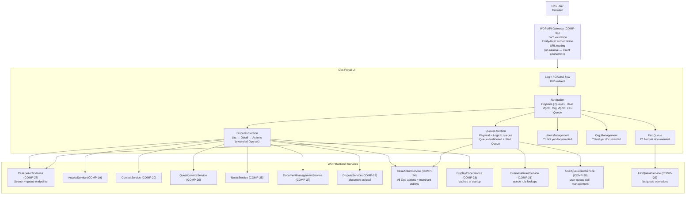

# WDP-COMP-50-OPS-PORTAL
**Worldpay Dispute Platform — Component Reference**
*Version: 1.0 DRAFT | April 2026*
*Source: WDP_Portal_Dispute_Management_UI_Summary_v1.1.md + WDP architecture knowledge base*
*Architect-confirmed: PENDING*

---

## ━━━ CORE SKELETON ━━━━━━━━━━━━━━━━━━━━━━━━━━━━━━━━━━━━━━
*Mandatory for every component regardless of type.*

---

## Identity

| Field | Value |
|-------|-------|
| **Name** | `WDP Ops Portal` |
| **Type** | `UI Application` |
| **Repository** | ⚠️ TBC — not yet confirmed from source |
| **Runtime** | ⚠️ TBC — technology stack (React / Angular / Vue) not confirmed |
| **Deployment** | AWS EKS — same cluster as WDP backend services |
| **Access path** | Ops user → **direct to WDP API Gateway** (no Akamai) |
| **Status** | `✅ Production` |
| **Doc status** | `📝 DRAFT` |
| **Sections present** | `Core | Block A — UI Sections & Backend Calls` |

---

## Purpose

**What it does**

WDP Ops Portal is the internal operations-facing web application for the Worldpay Dispute Platform. It is the primary working environment for WDP operations teams — dispute analysts, supervisors, and administrators — who manage the full dispute lifecycle on behalf of the platform.

Unlike the Merchant Portal, the Ops Portal connects directly to the WDP API Gateway without routing through Akamai. This reflects its internal-only audience — no CDN caching or external edge security is needed.

The Ops Portal gives operations teams capabilities not available to merchants: queue-based workload management (Start Queue, Route to Queue, Escalate to Supervisor), Ops-only case actions (Full Charge to Merchant, Full Write Off, Split Action, Advance Action), and physical/logical queue administration. It also includes Fax Queue management for processing inbound merchant faxes.

The portal is organized into five major sections. At April 2026, Disputes and Queues are the primary documented and buildable sections. User Management, Org Management, and Fax Queue exist in production but are not yet documented at component level. Dashboard is planned and not yet built.

**Key difference from Merchant Portal (COMP-49):** Ops Portal exposes a wider action surface. Where the Merchant Portal limits merchants to Accept and Defend, the Ops Portal additionally exposes Full Charge to Merchant, Full Write Off, Split Action, Advance Action, Route to Queue, and Escalate to Supervisor. These differences must be enforced at the portal UI level — CaseActionService (COMP-24) has no server-side RBAC enforcement (DEC-018 — accepted risk).

**What it does NOT do**

- Does not perform JWT authentication — authentication is handled by the enterprise IDP.
- Does not perform case-level authorization — the API Gateway (COMP-01) and CHAS (COMP-03) handle non-NAP authorization. UAMS (COMP-02) handles NAP.
- Does not route through Akamai — internal traffic only; direct to API Gateway.
- Does not have its own database — all state is owned by WDP backend services.
- Does not publish to Kafka.
- Does not include the Dashboard section — planned, not yet built.

---

## UI Section Coverage Status

| Section | Status | Documentation status |
|---------|--------|---------------------|
| Disputes | ✅ Production | 📝 Documented — see Section A below |
| Queues | ✅ Production | 📝 Documented — see Section B below |
| User Management | ✅ Production | ⬜ Not yet documented — to be added |
| Org Management | ✅ Production | ⬜ Not yet documented — to be added |
| Fax Queue | ✅ Production | ⬜ Not yet documented — to be added |
| Dashboard | 🔴 Planned | ⬜ Not started |

---

## Internal Processing Flow

---

## Boundaries

### Inbound Interfaces

| Source | Protocol | Trigger | Description |
|--------|----------|---------|-------------|
| Ops user (browser) | HTTPS — direct to API Gateway (no Akamai) | User navigates to portal URL | All ops team interactions |
| Enterprise IDP | OAuth 2.0 / OIDC redirect | Login initiation / token refresh | Authentication flow |
| WDP API Gateway (COMP-01) | REST over HTTPS | All backend API responses | Routes to backend services after auth |

### Outbound Interfaces — Backend Service Calls

All calls route through the WDP API Gateway. Bearer JWT included on every request.

| UI Feature | Backend Target | Protocol | Endpoint | On failure |
|-----------|---------------|----------|----------|------------|
| Disputes List — search | CaseSearchService (COMP-27) | REST | `POST /{platform}/cases/search` | Show error state; retry option |
| Queue counts / list | CaseSearchService (COMP-27) | REST | `GET /{region}/queues` | Show stale count |
| Queue case list | CaseSearchService (COMP-27) | REST | `POST /{region}/queues/search` | Show empty state with error |
| Queue case detail | CaseSearchService (COMP-27) | REST | `POST /{region}/queues/case-details` | Show error; refresh option |
| Dispute Details — case + actions | CaseSearchService (COMP-27) | REST | Case detail fan-out endpoint | Show error; refresh button |
| Display codes (labels, dropdowns) | DisplayCodeService (COMP-28) | REST | `POST /merchant/gcp/display-code/search` | Fallback to raw code values |
| UI tab permissions | DisplayCodeService (COMP-28) | REST | `GET /merchant/gcp/display-code/privileges` | Hide restricted tabs |
| Accept action | AcceptService (COMP-19) | REST | `POST /{platform}/cases/{caseNumber}/accept` | Show error; case status unchanged |
| Defend — questionnaire (Visa) | QuestionnaireService (COMP-26) | REST | `POST /merchant/gcp/questionnaire/visa/{stage}` | Show error; block submission |
| Defend — questionnaire (non-Visa) | QuestionnaireService (COMP-26) | REST | `POST /merchant/gcp/questionnaire/{responseType}` | Show error; block submission |
| Defend — document upload | DisputeService (COMP-22) | REST | `POST /{platform}/cases/{caseNumber}/documents` | Show upload error; retry |
| Defend — contest submission | ContestService (COMP-20) | REST | `POST /{platform}/cases/{caseNumber}/contest` | Show error; case state unchanged |
| Notes — view | NotesService (COMP-25) | REST | `GET /merchant/gcp/notes/{platform}/case/{caseNumber}` | Show empty state with warning |
| Notes — add | NotesService (COMP-25) | REST | `POST /merchant/gcp/notes/{platform}/case/{caseNumber}` | Show error; note not saved |
| Documents — view / download | DocumentManagementService (COMP-37) | REST | `GET /{platform}/documents/{caseNumber}` | Show unavailable message |
| Full Charge to Merchant | CaseActionService (COMP-24) | REST | `PUT /{platform}/case/{caseNumber}/action` | Show error; action not applied |
| Full Write Off | CaseActionService (COMP-24) | REST | `PUT /{platform}/case/{caseNumber}/action` | Show error; action not applied |
| Split Action | CaseActionService (COMP-24) | REST | `PUT /{platform}/case/{caseNumber}/action` | Show error; action not applied |
| Advance Action | CaseActionService (COMP-24) | REST | `PUT /{platform}/case/{caseNumber}/action` | Show error; action not applied |
| Route to Queue | CaseActionService (COMP-24) | REST | `PUT /{platform}/case/{caseNumber}/action` | Show error; case remains in current queue |
| Queue rules lookup | BusinessRulesService (COMP-31) | REST | Queue status rule endpoint | ⚠️ TBC — confirm exact endpoint |
| User-queue-skill management | UserQueueSkillService (COMP-30) | REST | ⚠️ TBC | ⚠️ TBC |
| Fax queue operations | FaxQueueService (COMP-29) | REST | `/merchant/gcp/fax-queue/*` | Show error per operation |
| Export — large file request | ⚠️ Backend service TBC | REST | ⚠️ Endpoint TBC | Show request failed |

---

## Database Ownership

This component owns no database state. All state is owned by WDP backend services.

---

## ━━━ BLOCK A — UI SECTIONS & FEATURE DETAIL ━━━━━━━━━━━━━━

---

## Section A — Disputes

*Source: WDP_Portal_Dispute_Management_UI_Summary_v1.1.md*
*Coverage: ✅ Documented to buildable level (with gaps noted)*
*Note: Disputes section is largely shared with Merchant Portal. Ops Portal extends it with additional actions.*

---

### A1. Disputes List (Search Grid)

Shares the same structure as the Merchant Portal Disputes List with the following differences:
- Ops users see additional columns and filter fields relevant to operations workflows
- Actions column includes the full Ops action set (not limited to Accept and Defend)

#### A1.1 Toolbar & Controls

| Control | Behaviour |
|---------|-----------|
| Status dropdown | Filters by dispute status |
| Case Owner dropdown | Filters by case owner |
| Filter button | Opens filter panel in right drawer |
| Sort button | Opens sort menu |
| Columns button | Opens column visibility and order manager |
| Export button | Opens export options menu |
| Items per page | Controls page size; pagination controls alongside |
| Actions column (per row) | Accept, Defend, … (More) — contextual to dispute state and user role |

#### A1.2 Row Interactions

Same as Merchant Portal — Quick View on row click (cached, no API call), navigate to detail on case number click, case locking modal.

#### A1.3 Filter Panel

Same structure as Merchant Portal. Advanced Filters section includes additional OPS-specific fields.
⚠️ Which advanced filter fields are Ops-only vs shared with merchants is not yet confirmed — confirm with product team before building.

#### A1.4 Sort Menu

Same as Merchant Portal: Due Days, Due Date, Dispute Amount, Reason Code. Reset Sort option.

#### A1.5 Column Manager

Same available columns as Merchant Portal. Default set may differ for Ops users — confirm with product team.

#### A1.6 Accept from Grid

Same as Merchant Portal — confirmation modal with case number, amount, reason code, mandatory acknowledgment.

#### A1.7 Notes Quick Access

Same as Merchant Portal — row kebab → Add Note → notes drawer.

---

### A2. Export

Same volume rules as Merchant Portal:

| Volume | Behaviour |
|--------|-----------|
| ≤ 5,000 results | Export directly from UI — immediate file download |
| 5,001 – 25,000 | Backend async file generation — available later |
| > 25,000 | Blocked — refine filters required |

⚠️ Backend export status UI not yet built — future work item.

---

### A3. Dispute Details

Same two-column layout as Merchant Portal with one structural difference: Ops Portal adds the **More Actions** set in the top-right action area.

#### A3.1 Left Column — Primary Tabs

Same as Merchant Portal:
- Tab 1: Case Details (Dispute Information, Transaction Information, Merchant Information, Queues chips)
- Tab 2: Card Dispute History ⚠️ Not yet documented
- Tab 3: Card Transaction History ⚠️ Not yet documented

#### A3.2 Right Column — Context Tabs

Same as Merchant Portal:
- Tab 1: Progress (timeline)
- Tab 2: Actions (audit log)
- Tab 3: Notes (threaded + add-note)
- Tab 4: Documents (view-only — no upload from this tab)

#### A3.3 Primary Case Actions (top-right)

**Accept** — same as Merchant Portal (confirmation + acknowledgment).

**Defend** — same two modes as Merchant Portal (Full Service Response and Add Response Documents).

**Refresh icon** — re-fetches all case detail.

#### A3.4 Ops-Only More Actions

All More Actions are **Ops Portal only**. Not available in Merchant Portal.

**Full Charge to Merchant**
Ops confirms merchant liability.
- UI fields: CTM Template (dropdown), Comments (optional), Internal Note flag, External Note flag
- Submit

**Full Write Off**
Acquiring platform takes liability; merchant refunded.
- UI fields: Write-Off Reason (dropdown), Write-Off Note (text), Comments (optional), Internal Note flag, External Note flag
- Submit

**Split Action**
Liability split between merchant and acquirer.
- UI fields: CTM Template, Write-Off Direction, Charge to Merchant Amount (currency-scoped), Write-Off Amount, Write-Off Reason, Write-Off Note, Comments (optional), Internal/External Note flags
- Submit

**Advance Action**
Update or add case metadata. Two sub-modes: Add New Action or Update Existing Action.
- UI fields: Dispute Cycle, Dispute Action, Case Owner, Status, Case Direction, Workable Dispute Amount (currency-scoped), NAP outcome (SRV118), Post/Due/Expiration dates
- Submit — applies and logs to Actions tab

**Route to Queue**
Assign case to another queue.
- UI fields: Queue dropdown, Comment (optional)
- Submit — routes case

All More Actions: on submit → success toast + Actions tab updates. On failure → error message; case state unchanged.

---

## Section B — Queues

*Source: WDP_Portal_Dispute_Management_UI_Summary_v1.1.md*
*Coverage: ✅ Documented to buildable level*
*Ops Portal only — not available in Merchant Portal*

---

### B1. Queue Types

| Type | Implementation | Who assigns | Current UI state |
|------|---------------|-------------|-----------------|
| Physical Queue | Backed by `i_desk` value on case record | Business Rules Engine assigns via rules | ✅ Fully operational |
| Logical Queue | Pre-defined search criteria saved in DB | DBA-seeded; no UI creation yet | ✅ Operational (read); Create UI ⬜ not implemented |

**Physical queue routing:** The Business Rules Engine (COMP-16) evaluates configured rules on each case and writes the `i_desk` value to route the case to the appropriate operational queue.

**Logical queue creation:** The Create Logical Queue UI is **not implemented**. Current logical queues are seeded directly in the database. Building this UI is a future work item. Do not build yet.

**Merchant logical queues:** Planned for merchants in the future. Not yet developed.

---

### B2. Queue Dashboard

**Layout:** Two-panel.
- **Left rail:** List of all queues (physical + logical) with pill counts per queue; search input to filter queue list
- **Right pane:** Case grid for the selected queue (same columns as Disputes List)

| Control | Behaviour |
|---------|-----------|
| Select queue (left rail) | Loads case grid for that queue in right pane |
| Start Queue button | Opens first case in queue directly in Dispute Details view |
| Pill counts | Shows number of cases in each queue |
| Queue search | Filters queue list in left rail |

---

### B3. Dispute Details in Queue Context

When a case is opened via **Start Queue**, the Dispute Details view is used with the following differences from the standard view:

| Feature | Standard Dispute Details | Queue Dispute Details |
|---------|--------------------------|----------------------|
| Accept action | ✅ Available | ❌ Hidden / disabled |
| Defend action | ✅ Available | ✅ Available |
| More Actions | ✅ Available | ✅ Available |
| Escalate to Supervisor | ❌ Not shown | ✅ Available (if enabled) |
| Progress / Actions / Notes / Documents tabs | ✅ All available | ✅ All available |

**Escalate to Supervisor:** Appears in Queues screen context only (when enabled). Behaviour and routing TBC — confirm with product team.

---

### B4. Queue Role Notes

| User type | Queue access |
|-----------|-------------|
| Ops users | Both physical and logical queues |
| Merchant users | Logical queues only (future — not yet developed) |

---

## Section C — User Management

⚠️ **Not yet documented.** Section exists in production. Detail to be added when specification is available.

Known: available to Ops Portal users. Allows admins to manage users, roles, and queue/skill assignments within the platform. Backed by UserQueueSkillService (COMP-30) and potentially OrgManagementService (COMP-33).

---

## Section D — Org Management

⚠️ **Not yet documented.** Section exists in production. Detail to be added when specification is available.

Known: available in both portals. Allows administrators to manage organisational hierarchies, merchant account configuration, and org-level settings.

---

## Section E — Fax Queue

⚠️ **Not yet documented.** Section exists in production (Ops Portal only). Detail to be added when specification is available.

Known: backed by FaxQueueService (COMP-29). Ops teams use this to claim, view, and act on inbound merchant faxes (reject, discard, or update status). Also bundles eViewer License Management proxy functionality.

---

## Section F — Dashboard

🔴 **Planned — not yet built.** Will provide dispute analytics and insights for operations teams. No specification available yet.

---

## Risks and Known Issues

| Risk | Severity | Detail |
|------|----------|--------|
| RBAC enforcement is UI-only | 🔴 HIGH | CaseActionService (COMP-24) has no server-side role enforcement (DEC-018). Ops Portal UI is the sole gate controlling which More Actions are visible to Ops vs merchants. Any RBAC gap in the portal exposes all case actions to any authenticated user. |
| Scheme-specific questionnaire forms not specced | 🟠 HIGH | Defend → Full Service Response questionnaire is scheme-dependent. Only Visa example documented. Non-Visa forms cannot be built until per-scheme catalog is documented (open item in UI summary). |
| Escalate to Supervisor — behaviour not specified | 🟠 HIGH | The action is listed as available in Queue context but there is no specification for what it does, which roles see it, or where escalations route. Do not build until specified. |
| Card Dispute History and Card Transaction History tabs undocumented | 🟡 MEDIUM | Both tabs listed but no fields or data sources specified. Cannot be built yet. |
| Create Logical Queue UI not implemented | 🟡 MEDIUM | Backend supports logical queues but the UI for creating/editing them does not exist. Current queues are DB-seeded. This is a known gap — do not build until specified. |
| Ops vs Merchant filter field split undocumented | 🟡 MEDIUM | Advanced filter panel does not specify which fields are Ops-only. Risk of building incorrect field set. Confirm with product team. |
| Backend async export status UI deferred | 🟡 MEDIUM | No UI specified for async export status/download for 5,001–25,000 results. Future work item. |
| Tech stack not confirmed | 🟡 MEDIUM | Frontend framework, state management, and component library are not confirmed. Confirm before architectural choices. |
| Fax Queue section undocumented | 🟡 MEDIUM | FaxQueueService (COMP-29) is confirmed in production but no UI specification exists for the Ops Portal Fax Queue section. Cannot be built yet. |
| Queue case detail endpoint — `GET /queue/{queueName}` is inactive | 🟡 MEDIUM | COMP-27 source confirms this method body is commented out — returns HTTP 405 at runtime. The correct path for queue case detail is `POST /{region}/queues/case-details`. Confirm current endpoint routing before building. |

---

## Open Questions

| Question | Action needed |
|----------|---------------|
| Frontend technology stack | Confirm from team or Copilot CLI on portal repository |
| Which filter fields appear in Ops Portal vs Merchant Portal | Product team confirmation before building filter panel |
| Per-scheme questionnaire field catalog (MC, Amex, Discover, etc.) | Product / BA team to document |
| Card Dispute History tab — fields, data source, API call | Product team to specify |
| Card Transaction History tab — fields, data source, API call | Product team to specify |
| Escalate to Supervisor — what it does, which roles, where it routes | Product team to specify |
| Create / Edit Logical Queue UI — scope, governance, permissions | Product team to scope as a work item |
| Merchant logical queues — timeline and specification | Product team |
| Backend export status UI — specification | Product team |
| Fax Queue section — full UI specification | BA / product team |
| User Management section specification | BA / product team |
| Org Management section specification | BA / product team |
| Queue rules lookup — exact endpoint on BusinessRulesService (COMP-31) | Team confirmation |
| UserQueueSkillService (COMP-30) endpoints used by Ops Portal | Copilot CLI or team confirmation |
| Dashboard section — any design or timeline available | Product team |

---

## Documents to Update After Confirmation

| Document | What to update |
|----------|---------------|
| `WDP-COMP-INDEX.md` | Change COMP-50 doc status from `🔲 UI — separate action` to `📝 DRAFT` |
| `WDP-HANDOVER.md` | Note COMP-50 DRAFT file created; add any confirmed tech stack facts |

---

*Last updated: April 2026*
*Source: WDP_Portal_Dispute_Management_UI_Summary_v1.1 + WDP architecture knowledge base*
*Next step: Confirm open questions above, then fill User Management, Org Management, and Fax Queue sections*
