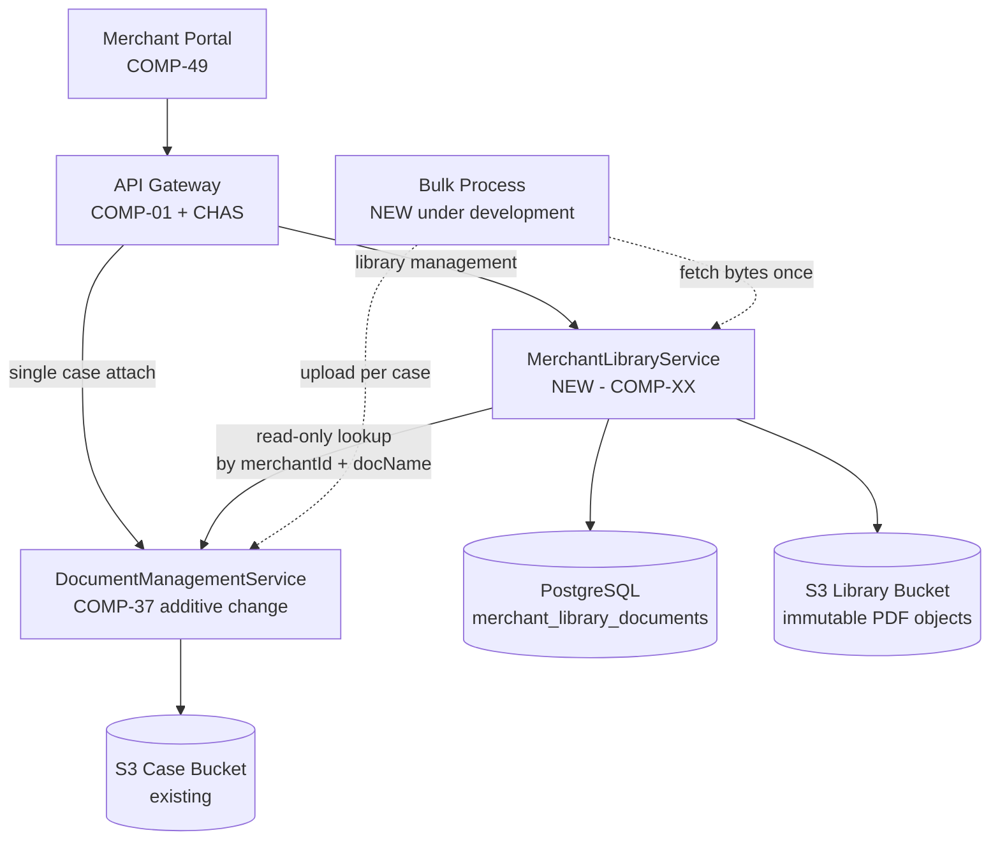
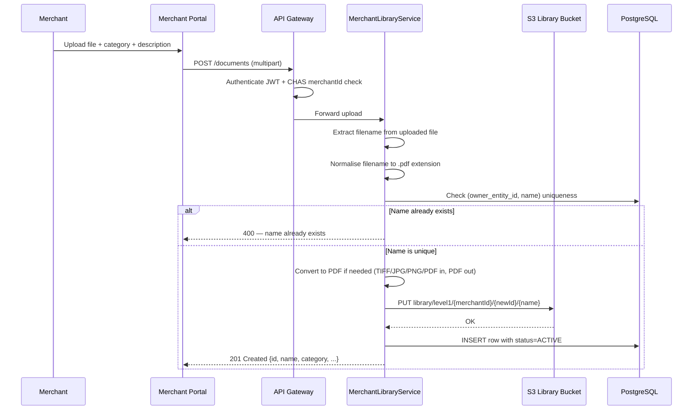
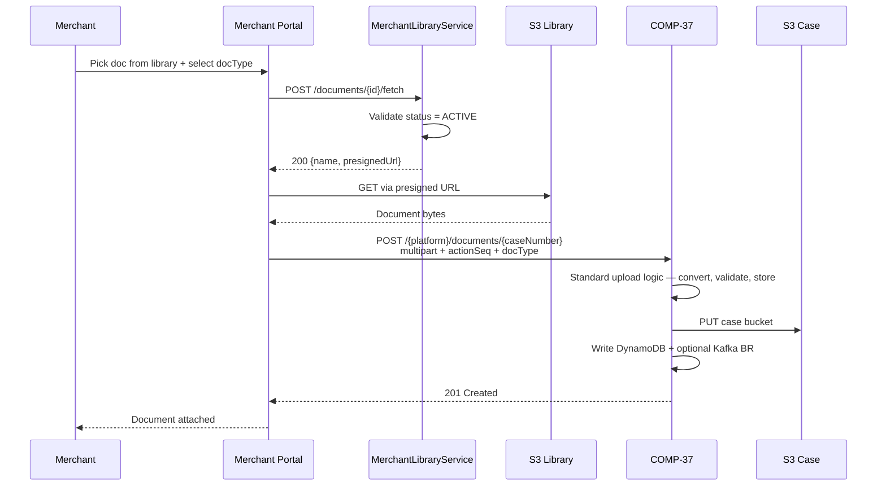
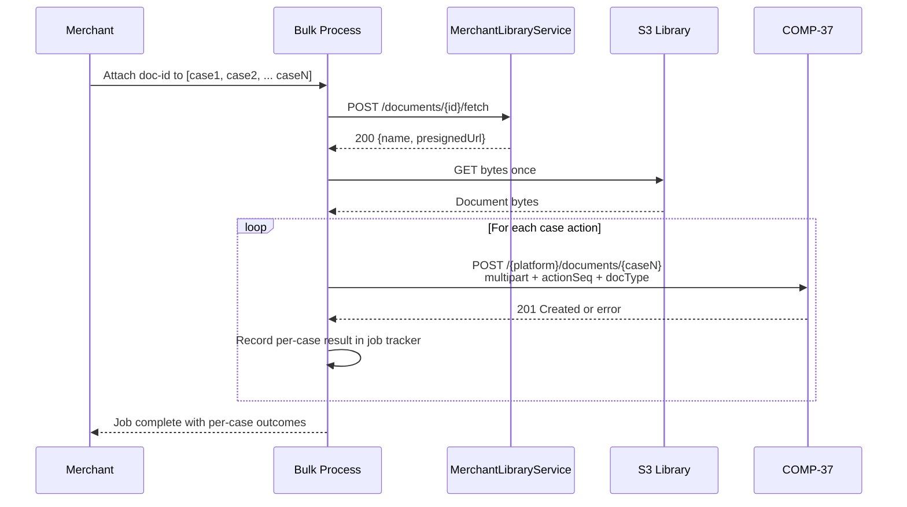
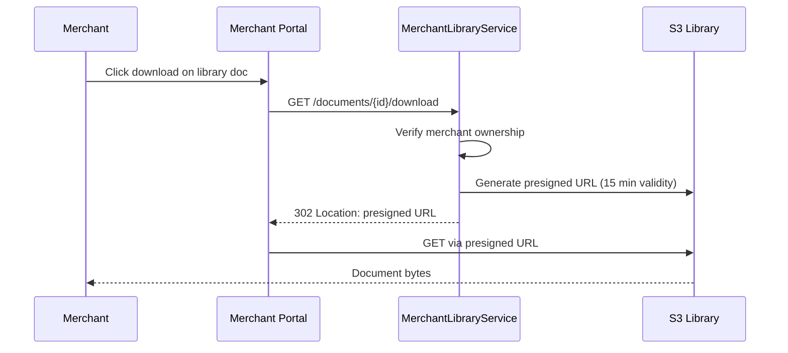
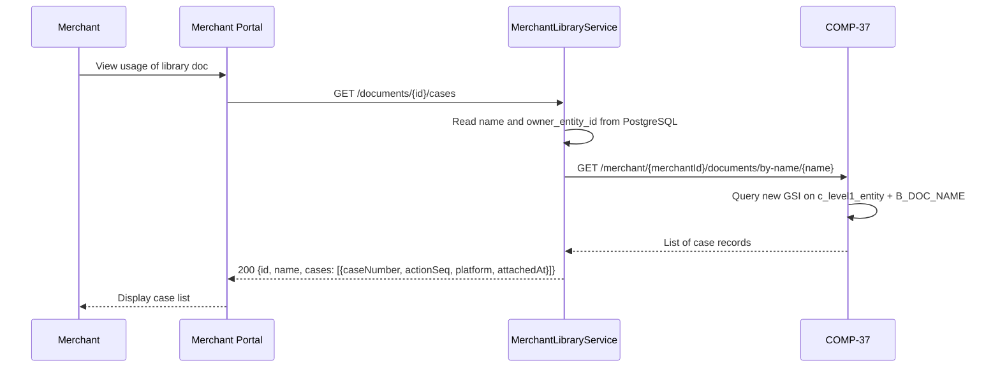
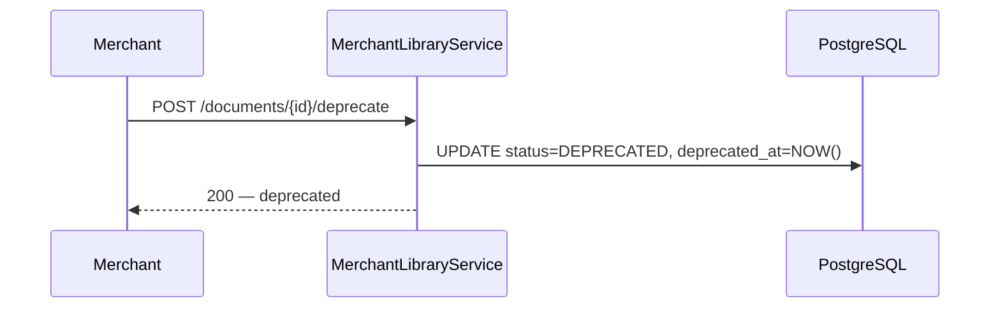
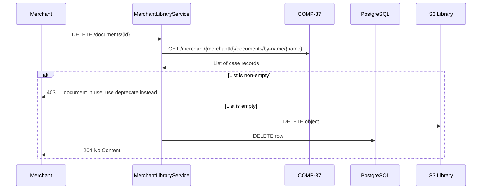
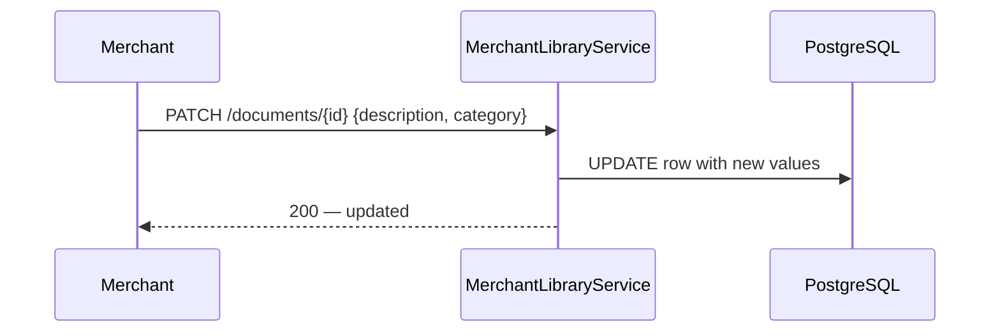

# WDP-PROPOSAL-MERCHANT-DOCUMENT-LIBRARY

**Worldpay Dispute Platform — Proposed Plan for Implementation**
*Version: 1.0 | April 2026*
*Status: 📋 PROPOSED — Awaiting approval*
*Author: Architecture team*

---

## Status Banner

> **This is a proposed implementation plan.** It captures the confirmed design for a new
> merchant document library feature in WDP. Once approved, this document will drive:
> creation of a new component file (`WDP-COMP-XX-MERCHANT-LIBRARY-SERVICE.md`),
> updates to `WDP-COMP-INDEX.md`, `WDP-DB.md`, `WDP-COMP-37-DOCUMENT-MANAGEMENT-SERVICE.md`,
> and `WDP-HANDOVER.md`, and a new ADR in `WDP-DECISIONS.md` for the copy model decision.

---

## 1. Executive Summary

WDP merchants need a way to store reusable evidence documents — terms and conditions,
return policies, purchase agreements — that can be attached to multiple dispute cases
without uploading the same file repeatedly.

This proposal adds a **MerchantLibraryService** component that provides a merchant-owned
document library. The library is scoped per merchant today, designed to support
hierarchy-level scoping (chain, division, group) in future without schema changes.

When a merchant attaches a library document to a case, bytes are copied into the case
evidence store via the existing `DocumentManagementService` (COMP-37). Case evidence is
therefore self-contained and immutable at the point of submission — independent of any
future changes to the library document.

One additive change is required in COMP-37: a new Global Secondary Index and a new
internal read endpoint to support the library's delete guard and the "which cases use
this document" merchant view.

**Key characteristics:**

| Property | Value |
|---|---|
| New component | MerchantLibraryService (COMP-XX) |
| New database table | `merchant_library_documents` — WDP Aurora PostgreSQL (12 columns) |
| New S3 bucket | `merchant-document-library` (us-east-2) |
| Existing components impacted | COMP-37 DocumentManagementService (additive change only) |
| Dependency | Bulk Process (new, under development) — owns multi-case attach orchestration |
| Surface | Merchant Portal only |
| Evidence model | Copy-on-attach (not reference) |
| Library content | PDF only — conversion at upload time |

---

## 2. Architecture Overview



**Legend:**
- Solid arrows — synchronous request/response
- Dashed arrows — Bulk Process asynchronous orchestration
- Read-only lookup — MerchantLibraryService calls COMP-37 to answer "which cases have this document?"

---

## 3. MerchantLibraryService — New Component

### 3.1 Identity

| Field | Value |
|---|---|
| Component name | MerchantLibraryService |
| Component ID | COMP-XX (to be assigned) |
| Type | REST API |
| Status | 📋 Proposed |
| Technology | Spring Boot 3 · Java 17 · WDP EKS cluster (per platform standard) |
| Context path | `/merchant/gcp/document-library` |
| Auth model | Spring OAuth2 Resource Server — JWT Bearer, merchantId-scoped via CHAS |
| Database | WDP Aurora PostgreSQL (existing instance) |
| Storage | AWS S3 — new bucket `merchant-document-library` (us-east-2) |
| Kafka | None |

### 3.2 Purpose

MerchantLibraryService manages a merchant-owned library of reusable evidence documents.
It handles the full library lifecycle:

- Upload with PDF conversion
- List and filter by category or status
- Download for preview
- Update mutable metadata (description, category)
- Deprecate (hide from picker, preserve record)
- Hard delete (only if never attached to a case)
- Provide bytes and filename to attach flow callers
- Report which cases have a specific library document attached

The service has **no Kafka involvement** and **no direct involvement in case evidence
processing**. Once a document is copied into the case S3 bucket via COMP-37, the library
has no further role in that case's lifecycle.

### 3.3 What MerchantLibraryService Does NOT Do

| Responsibility | Owner |
|---|---|
| Store case evidence | COMP-37 |
| Publish to Kafka | N/A — no Kafka involvement |
| Orchestrate multi-case attach | Bulk Process |
| Copy bytes to case bucket | Caller (Portal single case, Bulk Process multi-case) calls COMP-37 directly |
| Authorize case-level access | CHAS (COMP-03) via API Gateway |
| Cross-merchant document sharing | Not supported — library is scoped to one merchant |

---

## 4. Data Model — PostgreSQL

### 4.1 Table: merchant_library_documents

Location: WDP Aurora PostgreSQL (`globaldisputedatabase` — existing instance)
Owner: MerchantLibraryService
New table — no changes to existing tables.

| # | Column | Type | Purpose |
|---|---|---|---|
| 1 | `id` | UUID | Primary key. Generated on insert. Used in S3 key. |
| 2 | `owner_entity_id` | VARCHAR(50) | Entity that owns this document. merchantId today. Hierarchy-ready — any level tomorrow. |
| 3 | `owner_entity_level` | VARCHAR(20) | Hierarchy level — `level1` today. `level2` / `level3` / `level4` / `level5` in future. |
| 4 | `name` | VARCHAR(200) | Filename derived from uploaded file, normalised to `.pdf`. Unique per merchant. Drives duplicate check on upload and filename sent to COMP-37 on attach. |
| 5 | `description` | VARCHAR(500) | Optional merchant description. Mutable. |
| 6 | `category` | VARCHAR(50) | Picker filter — `T_AND_C` / `RETURN_POLICY` / `PURCHASE_AGREEMENT` / `OTHER`. Mutable. Values aligned with DisplayCodeService (COMP-28). |
| 7 | `s3_key` | VARCHAR(500) | Full S3 object key. Immutable. Pattern: `library/{level}/{entityId}/{id}/{name}`. |
| 8 | `status` | VARCHAR(20) | Lifecycle: `ACTIVE` / `DEPRECATED` / `DELETED`. |
| 9 | `uploaded_by` | VARCHAR(100) | UserId of the merchant user who uploaded this row. |
| 10 | `uploaded_at` | TIMESTAMPTZ | Upload timestamp. |
| 11 | `deprecated_at` | TIMESTAMPTZ | Null if ACTIVE. Set when merchant deprecates. |
| 12 | `deleted_at` | TIMESTAMPTZ | Null unless soft-deleted row. Typically hard-deleted rows are removed entirely. |

### 4.2 Constraints

| Type | Columns | Purpose |
|---|---|---|
| UNIQUE | `(owner_entity_id, name)` | No two documents with the same name per merchant |
| INDEX | `(owner_entity_id, status)` | Library list query — default "active documents for merchant" |
| INDEX | `(owner_entity_id, category, status)` | Filtered library list by category |
| INDEX | `(owner_entity_level, owner_entity_id)` | Future hierarchy traversal query |

### 4.3 PostgreSQL Choice — Rationale

| Reason | Detail |
|---|---|
| Platform standard | DEC-012 — PostgreSQL chosen as operational database; DynamoDB explicitly rejected |
| Hierarchy expansion | Multi-level ownership requires relational OR query across entity levels. DynamoDB partition key is fixed and cannot express this natively. |
| Schema evolution | Adding ownership levels later = one ALTER TABLE. DynamoDB partition key change = destructive table recreation. |
| Volume | Library uploads are occasional merchant actions, not high-throughput. DynamoDB's scaling advantage is irrelevant at this volume. |
| Infrastructure | WDP Aurora PostgreSQL instance already exists. No new database to provision. |

---

## 5. S3 Storage Design

### 5.1 New Bucket

| Property | Value |
|---|---|
| Bucket name | `merchant-document-library` |
| Region | us-east-2 (non-NAP — library is Merchant Portal only) |
| Content | PDF only — original files (JPG, PNG, TIFF, PDF) converted to PDF on upload |
| Immutability | Each key is globally unique. Same key is never written twice. Objects are never overwritten. |
| Retention | S3 lifecycle policy — align with PCI-DSS 7-year retention (confirm with compliance team) |
| Encryption | S3 SSE — bucket policy |

### 5.2 Key Pattern

```
library/{owner_entity_level}/{owner_entity_id}/{id}/{name}
```

| Segment | Source | Example |
|---|---|---|
| `library/` | Static prefix | `library/` |
| `{owner_entity_level}` | Column value | `level1` |
| `{owner_entity_id}` | Column value | `MID-12345` |
| `{id}` | Row UUID PK | `a3f7c291-8b2d-4e1f-9c5a-6e7f8a9b0c1d` |
| `{name}` | Column value | `Return Policy.pdf` |

**Example key:**
```
library/level1/MID-12345/a3f7c291-8b2d-4e1f-9c5a-6e7f8a9b0c1d/Return Policy.pdf
```

**Why `{id}` in the path:** Including the row's UUID guarantees global key uniqueness
even if a merchant deletes and re-uploads a document with the same name. Each upload
gets a new row with a new UUID, so the S3 key is always distinct.

**Why `{name}` at the end:** When the document is attached to a case, the filename
extracted from the S3 object must match what is sent to COMP-37. Keeping `name` as the
last segment aligns library storage with case storage conventions.

---

## 6. Key Flows

### 6.1 Flow — Upload to Library



### 6.2 Flow — Single Case Attach (from Defend wizard)

Merchant is inside the Defend wizard with `caseNumber` + `actionSequence` + `platform`
already in context. Merchant selects a document from the library and chooses a business
intent (RESPDOC, MISCDOC, etc.).



COMP-37 receives a standard multipart upload. It has no knowledge the document came
from a library. The real business `docType` drives downstream case processing normally.

### 6.3 Flow — Multi-Case Attach (Bulk Process)

Merchant selects a library document and N case actions via the bulk UI. Bulk Process
handles the orchestration, job tracking, and per-case failure handling.



Bulk Process reads bytes once from the library, then posts N times to COMP-37. Job
tracking and partial failure handling are owned entirely by Bulk Process.

### 6.4 Flow — Download Library Document



### 6.5 Flow — List Cases Using a Document



### 6.6 Flow — Deprecate



Deprecated documents:
- Do not appear in the default library picker
- Cannot be fetched for new attach via `/fetch` endpoint (returns 409)
- Remain accessible for download and usage lookup
- Case copies already made are unaffected

### 6.7 Flow — Hard Delete (with Guard)



The delete guard is **accurate** because it queries the source of truth (COMP-37
DynamoDB via the new lookup endpoint) rather than a local counter. No risk of counter
drift or partial-failure scenarios.

### 6.8 Flow — Update Metadata

Merchant updates description or category without re-uploading.



Only `description` and `category` are mutable. `name`, `s3_key`, and all other fields
are immutable once a row exists.

---

## 7. API Surface

Base URL: `/merchant/gcp/document-library`
All endpoints require Bearer JWT. `owner_entity_id` and `owner_entity_level` are
extracted from JWT claims — never accepted as request parameters.

### 7.1 Merchant-Facing Endpoints (8)

| # | Method | Path | Purpose |
|---|---|---|---|
| 1 | POST | `/documents` | Upload new document (multipart) |
| 2 | GET | `/documents` | List library — query params: `status`, `category` |
| 3 | GET | `/documents/{id}` | Get one document metadata |
| 4 | GET | `/documents/{id}/download` | 302 to presigned S3 URL |
| 5 | PATCH | `/documents/{id}` | Update description, category |
| 6 | POST | `/documents/{id}/deprecate` | Mark as DEPRECATED |
| 7 | DELETE | `/documents/{id}` | Hard delete — guarded by COMP-37 lookup |
| 8 | GET | `/documents/{id}/cases` | List cases using this document |

### 7.2 Internal Service-to-Service Endpoint (1)

| # | Method | Path | Purpose | Caller |
|---|---|---|---|---|
| 9 | POST | `/documents/{id}/fetch` | Get filename + presigned S3 URL for attach flow | Merchant Portal (single case), Bulk Process (multi-case) |

**9 endpoints total.**

### 7.3 Endpoint Contracts — Summary Table

| Endpoint | Success | Key Error Conditions |
|---|---|---|
| POST /documents | 201 + metadata | 400 name exists / unsupported format / conversion failure, 413 too large |
| GET /documents | 200 + list | 401 |
| GET /documents/{id} | 200 + metadata | 404 |
| GET /documents/{id}/download | 302 + presigned URL | 404 |
| PATCH /documents/{id} | 200 + updated metadata | 400 invalid category, 404, 409 deleted |
| POST /documents/{id}/deprecate | 200 + metadata | 404, 409 already deprecated or deleted |
| DELETE /documents/{id} | 204 | 403 in use (+ cases list), 404 |
| GET /documents/{id}/cases | 200 + cases list | 404 |
| POST /documents/{id}/fetch | 200 + {name, presignedUrl} | 404, 409 deprecated or deleted |

---

## 8. Required Changes to COMP-37 (Additive Only)

### 8.1 New Global Secondary Index

Added to both existing DynamoDB tables:
- `WDP_PIN_DISPUTE_DOCUMENTS` (us-east-2)
- `NAP_DISPUTE_DOCUMENTS` (eu-west-2)

| GSI attribute | Value | Source |
|---|---|---|
| GSI name | `merchant-docname-index` (proposed) | — |
| Partition key | `c_level1_entity` | Existing — merchantId on every record |
| Sort key | `B_DOC_NAME` | Existing — filename on every record |
| Projection | INCLUDE: `I_CASE`, `I_ACTION_SEQ`, `C_STAGE_CODE`, `Z_INSERT` | Enough to answer "which cases" |

Both attributes already exist on every document record. This is a read-optimisation
index only — no new data is written.

### 8.2 New Endpoint

| Property | Value |
|---|---|
| Method | GET |
| Path | `/merchant/gcp/document-management/merchant/{merchantId}/documents/by-name/{docName}` |
| Auth | Bearer JWT — internal firm only (JWT `iss` claim contains `us_worldpay_fis_int`) |
| Query params | `platform` optional — filter to one platform |
| Response 200 | `[{caseNumber, actionSequence, platform, stageCode, attachedAt}]` — empty if none |
| Response 401/403 | Standard auth failures |
| Response 500 | DynamoDB failure |

### 8.3 What COMP-37 Does NOT Change

| Area | Status |
|---|---|
| Existing 13 REST endpoints | Unchanged |
| Existing DynamoDB tables — structure and existing attributes | Unchanged |
| Existing S3 buckets | Unchanged |
| Kafka publishing behaviour | Unchanged |
| Existing callers | Unchanged |
| Document upload / download / list flows | Unchanged |

The change is purely additive. A new index and a new read endpoint. All existing
behaviour is untouched.

---

## 9. Key Design Decisions

| # | Decision | Rationale |
|---|---|---|
| 1 | **Separate service, not extended COMP-37** | COMP-37 is entirely case-scoped. Library is merchant-scoped with different lifecycle. Extending COMP-37 would mix two domains in one production service that already has unresolved technical debt (DEC-001, DEC-003, no timeouts). |
| 2 | **Copy model, not reference** | Copy makes case evidence self-contained and immutable at the point of submission. Reference model would require runtime dependency from case processing back to the library — vulnerable to library mutation. |
| 3 | **Immutable S3 objects** | Each upload produces a new S3 object with a unique key. Objects are never overwritten or physically deleted while referenced by case records. Delete only permitted when no cases reference the document. |
| 4 | **PDF-only storage** | WDP already converts all uploaded content to PDF at COMP-37. Library applies the same conversion at upload time. Eliminates need for extension, mime_type, file_size, and page_count columns in library metadata. |
| 5 | **Real docType on attach, no LIBREF** | docType drives downstream business behaviour (Kafka startRuleGroup, network transmission, business rules). Using it to record library origin would pollute a business field with an infrastructure concern. |
| 6 | **PostgreSQL, not DynamoDB** | DEC-012 platform standard. Hierarchy expansion requires relational queries. Schema evolution is trivial in PostgreSQL. Library volume does not justify DynamoDB's operational overhead. |
| 7 | **Name uniqueness per merchant** | Same filename on second upload is rejected with 400. Merchant must rename locally or delete the existing document before re-uploading. No system-managed versioning. |
| 8 | **Bulk Process owns multi-case orchestration** | Bulk Process already has job tracking, async fan-out, and per-case failure handling for bulk accept and contest. Library service stays focused on library management only. |
| 9 | **Merchant Portal only** | Library is a merchant self-service feature. Ops Portal users see documents attached to cases through existing case document views (COMP-37). |
| 10 | **Hierarchy-ready data model** | `owner_entity_id` + `owner_entity_level` columns present from day one. Level1 (merchant) today. Level2–5 future without schema change. |
| 11 | **Delete guard via COMP-37 lookup, not counter** | Counter in library service would be unreliable — if the increment call fails after COMP-37 write succeeds, the counter lies and the document can be wrongly deleted. Sourcing the guard from COMP-37's DynamoDB (source of truth) is always accurate. |

---

## 10. Alternatives Considered and Dropped

| # | Alternative | Reason Dropped |
|---|---|---|
| 1 | Reference model (cases point to library S3 object) | Merchant could update library doc after submitting evidence. Reference model creates runtime dependency from case evidence to library bytes. Copy model guarantees evidence integrity. |
| 2 | LIBREF docType in COMP-37 | docType has downstream business meaning. Using it to record library origin pollutes a business field with an infrastructure concern. |
| 3 | Extending COMP-37 with library endpoints | COMP-37's internal logic is anchored to caseNumber. Library has no caseNumber. Every library endpoint would be an exception to COMP-37's own contract. |
| 4 | System-managed versioning with `display_name` + `doc_name` + `version` + `is_latest` | Added complexity in data model, upload logic, library UI, and case evidence filename. Simpler model: name uniqueness per merchant; merchant renames file if they want to keep multiple variants. |
| 5 | `attached_count` counter in library service | Counter lives in different service from the case document record. Any failure between COMP-37 write and library increment makes the counter lie. Source-of-truth lookup on COMP-37 is always accurate. |
| 6 | DynamoDB for library metadata | Platform-standard deviation. Hierarchy expansion requires relational queries. Schema evolution is destructive. Volume does not justify DynamoDB overhead. |
| 7 | Async job tracking in MerchantLibraryService for multi-case attach | Bulk Process already owns this concern for bulk accept and contest. Duplicating it in library service would create two places to maintain the same async pattern. |

---

## 11. Integration Points

### 11.1 Inbound

| Source | Protocol | Purpose |
|---|---|---|
| Merchant Portal (COMP-49) | REST via API Gateway | All library management and single-case attach |
| Bulk Process (under development) | REST via API Gateway | Multi-case attach fetch-bytes operation |

### 11.2 Outbound

| Target | Protocol | Purpose | On Failure |
|---|---|---|---|
| WDP Aurora PostgreSQL | JPA / HikariCP | Read and write `merchant_library_documents` | HTTP 500 to caller |
| AWS S3 `merchant-document-library` | AWS SDK v2 | Store bytes on upload, generate presigned URLs for download and attach | HTTP 500 to caller |
| COMP-37 DocumentManagementService | REST | `GET /merchant/{merchantId}/documents/by-name/{docName}` — delete guard and cases-using-doc | HTTP 500 to caller |
| CHAS (COMP-03) | Via API Gateway | merchantId-scoped authorization | HTTP 403 to caller |

### 11.3 Kafka

| Producer / Consumer | Status |
|---|---|
| Kafka producer | No — library operations do not trigger business rules |
| Kafka consumer | No |

---

## 12. Non-Functional Considerations

| Concern | Approach |
|---|---|
| Auth | Spring OAuth2 Resource Server — JWT Bearer. merchantId extracted from JWT claims. Scope-scoped authorisation via CHAS. |
| Timeouts | Configure explicit connection + read timeouts on outbound calls. Do not repeat DEC-014 gap present in other WDP components. |
| Circuit breakers | Resilience4j on outbound call to COMP-37 — per platform DEC-014 standard. |
| Logging | Logstash via `logstash-logback-encoder` — platform standard |
| Observability | OpenTelemetry auto-instrumentation + Prometheus metrics on `/actuator/prometheus` |
| Retention | S3 lifecycle policy to align with PCI-DSS 7-year requirement (confirm with compliance team) |
| Scaling | HPA configured on CPU. Library operations are low-volume compared to case processing — minimal pod footprint. |

---

## 13. Documents to Update on Approval

| Document | Update |
|---|---|
| `WDP-COMP-INDEX.md` | Register MerchantLibraryService as COMP-XX. Register Bulk Process as COMP-YY (under development). Mark COMP-37 as having planned additive change. |
| `WDP-DB.md` | New table `merchant_library_documents` under WDP Aurora PostgreSQL — owned by MerchantLibraryService. New S3 bucket `merchant-document-library`. Note new GSI on both COMP-37 DynamoDB tables. |
| `WDP-COMP-37-DOCUMENT-MANAGEMENT-SERVICE.md` | Add new GSI `merchant-docname-index` and new endpoint `GET /merchant/{merchantId}/documents/by-name/{docName}` under planned changes. |
| `WDP-HANDOVER.md` | Mark design session complete for merchant document library. Note new components pending registration. |
| `WDP-DECISIONS.md` | New ADR — Copy model for library document attachment. Record rationale and dropped alternatives. |
| `WDP-COMP-XX-MERCHANT-LIBRARY-SERVICE.md` | New file — create using WDP component template, populated from this proposal. |

---

## 14. Open Items

| # | Item | Owner | Required Before |
|---|---|---|---|
| 1 | Approval from COMP-37 team for GSI + new endpoint | Architecture review | Implementation start |
| 2 | Confirm PCI-DSS 7-year retention approach for library S3 bucket | Compliance team | Production deployment |
| 3 | Confirm category value taxonomy — align with DisplayCodeService | Product team | Implementation |
| 4 | Confirm Bulk Process design includes library-document support | Bulk Process team | Bulk Process production |
| 5 | Confirm UI design for library management in Merchant Portal | UI team | Implementation |

---

## 15. Change Log

| Date | Version | Author | Change |
|---|---|---|---|
| April 2026 | 1.0 | Architecture team | Initial proposal |

---

*End of proposal document.*
*Upload to project folder and reference from `WDP-HANDOVER.md` as active design work.*
