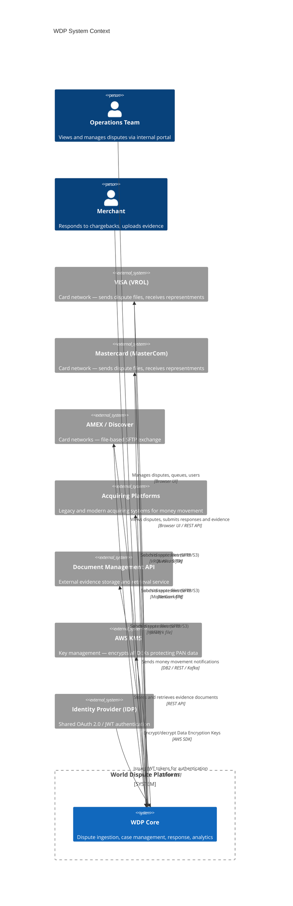
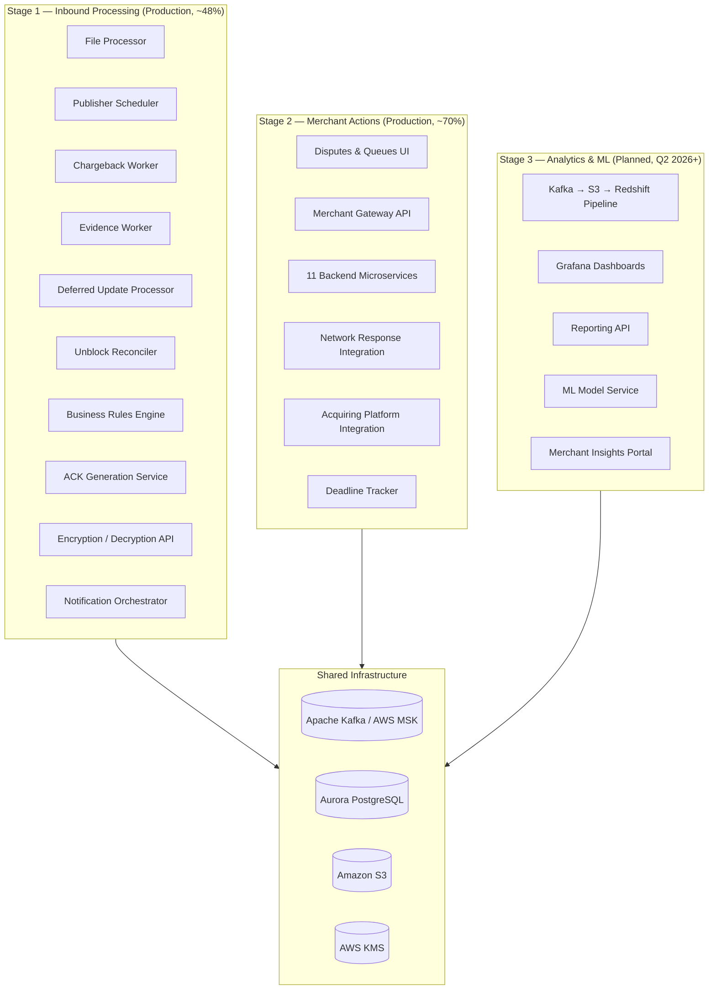
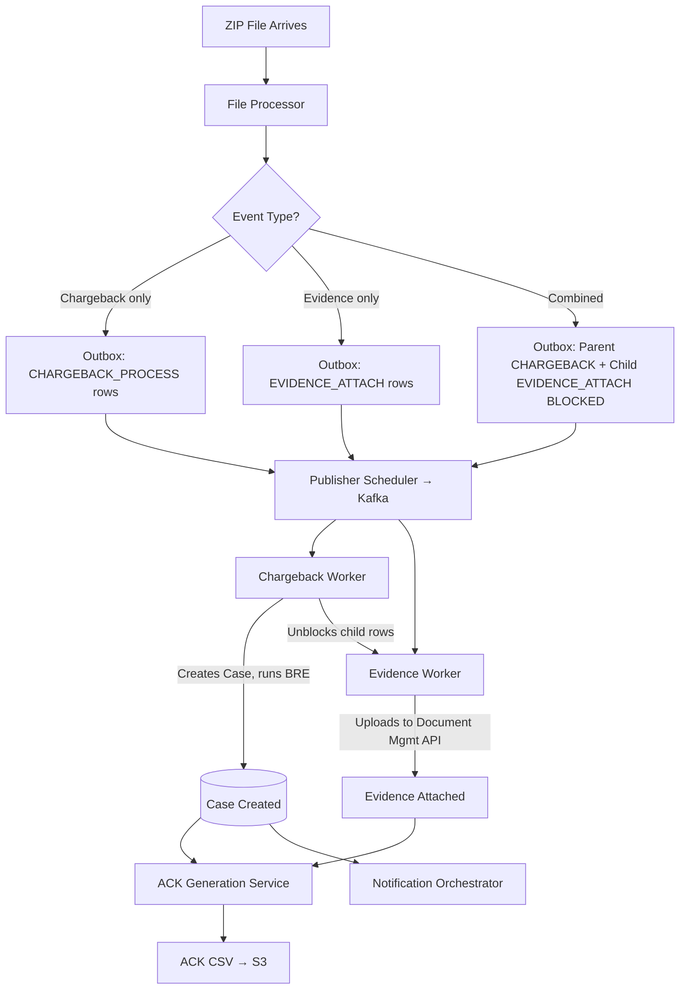
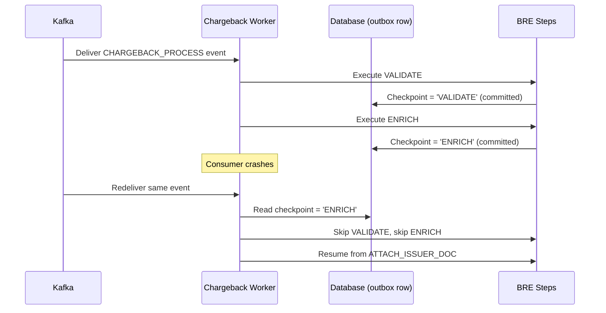
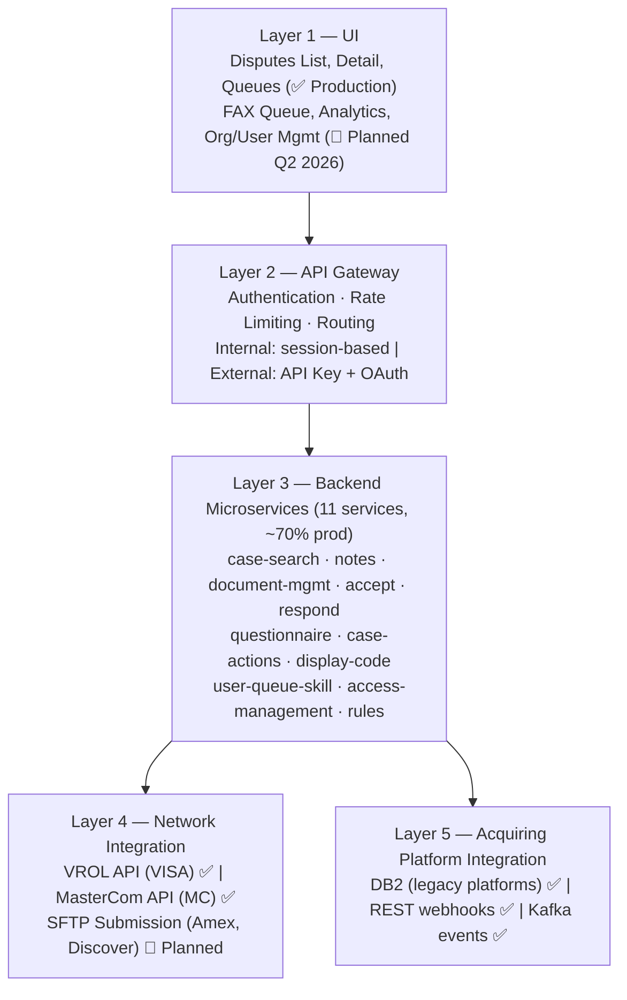
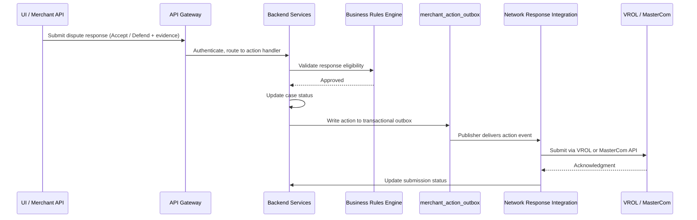
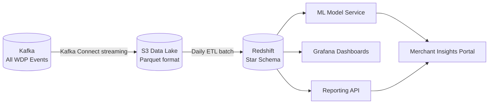

# WDP-ARCHITECTURE.md
**World Dispute Platform — Architecture Reference**
*Version: 1.0 | Extracted: April 2026 | Source: WDP Documentation Suite v2.0*

⚠️ ARCHIVED — April 2026
This document has been superseded by WDP-ARCHITECTURE.md v2.0
Retained for reference only. Do not treat as current architecture.
Useful reference sections: NFRs, BRE steps, ACK pattern, Kafka config

---

## 1. Purpose & Context

### 1.1 What is WDP?

The World Dispute Platform (WDP) is a centralised, event-driven financial dispute resolution system serving major card networks. It exists to replace a fragmented landscape of legacy chargeback platforms with a single, auditable, scalable system that can ingest dispute data from networks, apply business rules, and return structured outcomes to merchants and networks.

The platform handles three categories of work: processing inbound dispute and evidence files from card networks (Stage 1, in production), enabling merchants and operations teams to actively manage dispute responses (Stage 2, substantially in production), and providing analytics and predictive intelligence over the dispute lifecycle (Stage 3, planned).

### 1.2 Why WDP Exists

Card networks (VISA, Mastercard, AMEX, Discover) transmit dispute files to acquiring banks and their processors daily. Prior to WDP, each acquiring platform managed its own chargeback workflow independently, leading to duplicated logic, inconsistent merchant notifications, and no unified audit trail. WDP centralises all of this, enforcing PCI-DSS compliance, providing a single case ledger, and enabling self-service dispute management for merchants at scale.

### 1.3 Core Architectural Principles

Four principles govern every design decision in WDP:

**Event-driven over request-driven.** All cross-component communication for high-volume flows goes through Kafka via a transactional outbox, not synchronous API calls. This eliminates message loss even when downstream consumers are unavailable.

**Idempotency everywhere.** Every operation — case creation, evidence attachment, ACK generation, BRE step execution — is safe to retry. Deduplication keys exist at every boundary.

**Isolation by merchant.** Kafka partitioning, circuit breakers, and processing concurrency are all scoped per merchant. A failure or slowdown for one merchant cannot cascade to others.

**Compliance is non-negotiable.** PAN data is never stored in plaintext anywhere in the system. Audit trails are immutable and retained for seven years. Every cardholder data operation is logged.

---

## 2. System Context

### 2.1 External Actors



### 2.2 What Flows Through the System

A dispute enters WDP either as a file deposited by a card network or as a real-time API call from an acquiring platform. It becomes a **Case** — the central unit of work — which then progresses through a defined lifecycle: validation, enrichment, merchant notification, merchant response, network submission, and ultimately resolution. Evidence documents, acknowledgments, and notifications are all attached to or triggered by case state transitions.

---

## 3. Component Map

WDP is decomposed into three delivery stages. Stages are not deployment environments — all production components run in a shared AWS EKS cluster. Stages represent the maturity and ownership of capability.



---

## 4. Stage 1 — Inbound Dispute Processing

### 4.1 Responsibility

Stage 1 handles everything that happens before a merchant takes any action: receiving files from networks, creating cases, attaching evidence, validating via business rules, generating acknowledgments, and notifying downstream systems.

### 4.2 Component Descriptions

**File Processor** receives ZIP archives deposited by card networks or acquiring platforms. It parses the archive, determines the event type of each row (chargeback, evidence, or both), tokenises PAN data via the Encryption API, and writes all rows to the transactional outbox in a single database transaction. It is the only component that writes to the outbox for inbound files.

**Publisher Scheduler** polls the outbox on a regular cadence (approximately once per minute), locks eligible rows, and publishes them to Kafka in merchant-sequence order. It does not process events — it only moves them from the database to the event bus.

**Chargeback Worker** consumes chargeback events from Kafka and creates Cases in a DRAFT state. It calls the Business Rules Engine to validate and enrich the case, then transitions it to an actionable state. It also detects UPDATE-before-NEW race conditions (where a network sends an update for a case that does not yet exist in WDP) and parks those events for deferred processing.

**Evidence Worker** consumes evidence-attachment events and uploads documents to the external Document Management API, then records the outcome against the originating outbox row.

**Deferred Update Processor** runs on a short schedule and processes UPDATE events that were parked because their target Case did not exist at the time of original processing. It applies an ordered-sequence guard to prevent out-of-order application.

**Unblock Reconciler** handles a specific combined-flow scenario: when a file contains both chargeback and evidence rows, the evidence rows are held in BLOCKED status until the Chargeback Worker confirms the Case has been created. The Reconciler runs every two minutes as a safety net to unblock any rows whose parent was completed but whose unblock event was missed.

**Business Rules Engine (BRE)** is a configurable validation and enrichment pipeline. It runs within the Chargeback Worker processing path and executes multiple sequential steps (validate, enrich, attach documents, etc.). Each completed step is checkpointed to the database in an independent transaction so that, if the consumer crashes mid-way, the BRE can resume from the last completed step rather than restarting.

**ACK Generation Service** runs on a schedule and produces acknowledgment CSV files for each processed file job. It captures an immutable snapshot of all row outcomes at the moment of generation. If rows complete after the initial ACK is generated, a new versioned snapshot is produced rather than mutating the original.

**Encryption / Decryption API** is an isolated internal service responsible for all PAN handling. It is the only component in the system that holds plaintext PANs at any point in time, and only transiently. It maintains a Data Encryption Key (DEK) in memory, refreshed every six hours from AWS KMS. Callers receive either a tokenised HPAN (for lookups) or an encrypted EPAN (for storage). No other component stores or processes raw PAN.

**Notification Orchestrator** delivers case lifecycle events to multiple channels: legacy acquiring platforms, third-party notification services, and the merchant portal. It is decoupled from the processing pipeline via Kafka.

### 4.3 Processing Patterns

Stage 1 supports three distinct inbound file patterns:



The combined flow introduces a dependency ordering constraint: evidence cannot be attached until a Case exists. The BLOCKED status on child rows enforces this ordering without requiring synchronous coordination between workers.

### 4.4 BRE Step Checkpointing

Because the BRE executes multiple sequential steps within a single Kafka message processing cycle, a consumer crash partway through would normally cause Kafka to redeliver the message and restart all steps. The checkpointing pattern solves this: each completed BRE step writes its name to the outbox row in a separate committed transaction. On redelivery, the worker reads the checkpoint and skips all already-completed steps.



The Kafka offset is only committed after all BRE steps succeed, ensuring at-least-once delivery. The checkpoints ensure step idempotency on redelivery.

### 4.5 ACK Snapshot Pattern

The ACK service does not update acknowledgments in place. Instead, it takes an immutable snapshot of all row outcomes at the moment of generation. If late-completing rows are discovered after a snapshot exists, a new versioned snapshot is created (v1, v2, v3…) and the merchant is notified of the superseding version. This separates operational truth (the outbox row's status) from communicated truth (what the merchant was told at ACK generation time), enabling a complete audit trail without mutating historical records.

---

## 5. Stage 2 — Merchant Actions & Network Response

### 5.1 Responsibility

Stage 2 exposes the dispute lifecycle to operations teams and merchants, enables structured responses to be submitted, and closes the loop with card networks by generating outbound representment files.

⚠️ VERIFY: The original documentation describes Stage 2 as "0% complete" in some sections and "70% complete" in others. The 70% figure appears to reflect the current actual state based on the more recent v1_0 document. The 0% figure likely reflects the initial planning scaffold from November 2025. **This document treats Stage 2 as substantially in production (~70%).**

### 5.2 Layered Architecture

Stage 2 is structured in five layers:



### 5.3 Key Flows

#### Merchant or Ops Responds to a Dispute



#### Deadline Tracking

The Deadline Tracker runs as a scheduled service, scanning for disputes approaching their network-mandated deadlines. Alerts are sent at four horizons: 7 days, 3 days, 1 day, and 4 hours before the deadline. Deadlines are calculated from network rules (VISA, Mastercard, AMEX) with business-day adjustment. A missed deadline triggers escalation to the support team.

#### Acquiring Platform Money Movement

When a dispute is resolved, the outcome must be communicated to the acquiring platform so that funds can be settled. WDP supports three integration styles simultaneously — DB2 stored procedures for legacy platforms, REST webhooks for modern platforms, and Kafka events for cloud-native platforms — with routing determined by configuration per platform.

### 5.4 Queue-Based Workload Distribution

Operations teams work through disputes via queues. Cases are assigned to queues based on configurable routing rules (skill-based routing). When an operator opens a case from a queue, the case is locked for up to 30 minutes to prevent concurrent modification. The queue model separates case discovery (which queue, which criteria) from case processing (what action to take), allowing different teams to work specialised queues without coupling.

### 5.5 Merchant Integration Boundary

External merchants integrate via a dedicated Merchant Gateway API that enforces API Key authentication in addition to OAuth, applies per-merchant rate limiting, and validates all requests against the merchant's authorised scope. This boundary ensures that merchants can only act on their own disputes.

---

## 6. Stage 3 — Analytics & Intelligence (Planned)

### 6.1 Responsibility

Stage 3 transforms the operational event history accumulated in Stages 1 and 2 into analytical intelligence — dashboards, reports, and predictive models for chargeback risk and dispute outcome prediction.

⚠️ VERIFY: Stage 3 is entirely in planning as of the documentation baseline (November 2025). All architectural decisions are marked "Proposed" and should be validated during the Q2 2026 planning phase before treating them as firm.

### 6.2 Data Flow



All events flowing through Kafka in Stages 1 and 2 are streamed to S3 in columnar Parquet format as the data lake. A daily ETL batch loads from S3 to Redshift, which serves as the analytical query engine with a star schema optimised for reporting. Real-time operational metrics continue to be served by Prometheus and Grafana directly from Stage 1/2 components — Stage 3 is for historical and predictive workloads, not operational monitoring.

### 6.3 ML Models

Three models are planned:

**Dispute Outcome Predictor** estimates the probability that a dispute will be resolved in the merchant's favour. It trains on historical resolved cases using features including reason code, merchant response time, evidence quality, and network type.

**Chargeback Risk Scorer** identifies transactions at elevated risk of resulting in a chargeback, enabling proactive intervention before a chargeback is filed.

**Merchant Behaviour Classifier** segments merchants by their chargeback profile to identify systemic issues and tailor support.

All models are planned to retrain weekly and be served via a containerised API, with A/B testing gating full rollout of each new model version.

---

## 7. Cross-Cutting Concerns

### 7.1 Event Streaming Architecture

Kafka is the backbone for all asynchronous communication within WDP. The transactional outbox pattern is used universally: any component that needs to publish an event first writes to an outbox table in the same database transaction as its business data change. A Publisher Scheduler then polls the outbox and delivers to Kafka. This guarantees that events are never lost due to a crash between the business write and the Kafka publish.

Partitioning is merchant-scoped for all dispute-related topics, which ensures that all events for a given merchant are processed in order by the same consumer instance, avoiding the need for distributed coordination.

### 7.2 PAN Encryption & Security Boundary

```mermaid
flowchart LR
    IN[Inbound PAN] --> ENC_API[Encryption API]
    ENC_API --> KMS[(AWS KMS\nDEK Management)]
    ENC_API -->|HPAN token| LOOKUP[Case Lookup / Matching]
    ENC_API -->|EPAN ciphertext| STORE[Secure Storage in DB]
    STORE --> ENC_API
    ENC_API -->|Plaintext PAN\n(transient)| CB_WORKER[Chargeback Worker\nDecryption only]
```

The Encryption API is the sole component authorised to handle plaintext PAN. No other service in WDP stores or processes raw cardholder data. The key hierarchy is: AWS KMS holds the Customer Master Key (CMK), which encrypts the DEK in memory. The DEK encrypts PANs using AES-256-GCM. The CMK never leaves AWS hardware security modules. DEKs rotate every six hours.

HPAN (Hashed PAN) is used for case lookups — it is deterministic and non-reversible, allowing the same transaction to be matched across submissions without exposing the PAN.

### 7.3 Resilience Patterns

**Circuit breakers** are applied to every external API dependency: Document Management API, VROL, MasterCom, Encryption API. Breakers are scoped per-merchant for document management (preventing one merchant's failure from affecting others) and globally for the Encryption API. When a breaker opens, the corresponding outbox rows remain in their current state rather than being marked as errors — processing resumes when the breaker recovers.

**Exponential backoff with jitter** is applied to all retry logic for external calls, including SFTP submissions and REST webhooks.

**Idempotency keys** are present at every consumer boundary. Kafka's at-least-once delivery guarantee means consumers will occasionally receive duplicate messages. Every consumer is designed to handle this by checking for prior completion before executing.

### 7.4 Non-Functional Requirements

| Concern | Requirement |
|---|---|
| File processing end-to-end (P95) | < 10 minutes from file receipt to ACK |
| Kafka publish lag (P95) | < 2 minutes |
| File processing error rate | < 5% |
| Evidence attachment error rate | < 3% |
| ACK generation success rate | > 95% |
| Encryption API latency — encrypt (P95) | < 50ms |
| Encryption API latency — decrypt (P95) | < 75ms |
| Encryption API availability | 99.9% |
| Throughput target | 10,000 disputes per hour |
| Dispute portal API response (P95) | < 200ms |
| Notification delivery latency | < 30 seconds from case state change |
| Stage 3 dashboard load time | < 3 seconds (target) |
| Audit retention | 7 years (PCI-DSS, SOC 2) |
| Compliance | PCI-DSS 3.2.1, SOC 2 Type II, GDPR, CCPA |

### 7.5 Observability

The platform defines approximately 88 metrics across all components, organised using the RED method (Rate, Errors, Duration) for request-serving components and the USE method (Utilisation, Saturation, Errors) for resource-bound components. Prometheus scrapes all services, Grafana provides dashboards, and CloudWatch is used for AWS-managed resource monitoring. Distributed traces are propagated via an X-Trace-Id header across all synchronous call chains.

Critical alerts are defined for: service unavailability, SLA breaches, circuit breaker transitions to OPEN state, Kafka consumer lag exceeding threshold, and processing error rate anomalies.

---

## 8. Deployment Context

WDP runs on AWS EKS (Kubernetes). All three stages share the same cluster. Key managed services:

- **Event streaming:** AWS MSK (managed Kafka)
- **Database:** Aurora PostgreSQL 14.x (primary for all operational data)
- **Object storage:** Amazon S3 (evidence files, ACK files, data lake)
- **Key management:** AWS KMS
- **Analytics (Stage 3):** AWS Redshift
- **CDN / ingress:** Akamai + AWS API Gateway for external-facing endpoints

All services are stateless and horizontally scalable. The Chargeback Worker runs with 10 concurrent threads per instance and 3 instances, giving 30-way parallelism for chargeback processing, partitioned by merchant.

⚠️ VERIFY: The documentation notes MSK provisioned storage is permanently one-directional (cannot reduce after scaling up). Storage scaling decisions should be treated as irreversible commitments.

---

## 9. Stage Delivery Status

| Stage | Scope | Production Status | Notes |
|---|---|---|---|
| **Stage 1** | Inbound file processing, case creation, BRE, ACK, notifications | ~48% of full platform | All Stage 1 sub-components complete; locked for production |
| **Stage 2 — Core** | Disputes UI, 11 backend microservices, VROL/MasterCom integration, DB2/REST/Kafka platform integration | ~70% of Stage 2 | Core flows in production since Q3–Q4 2024 |
| **Stage 2 — Remaining** | FAX queue UI, analytics UI, org/user management UI, SFTP for Amex/Discover, bulk operations | 0% | Planned Q1–Q2 2026 |
| **Stage 3** | Data pipeline, Redshift warehouse, ML models, reporting API, merchant insights portal | 0% | Planned Q2 2026 – Q1 2027 |

---

*This document contains architecture-level content only. Implementation details, database schemas, configuration values, code patterns, and deployment specifications are maintained in the WDP Documentation Suite v2.0.*
